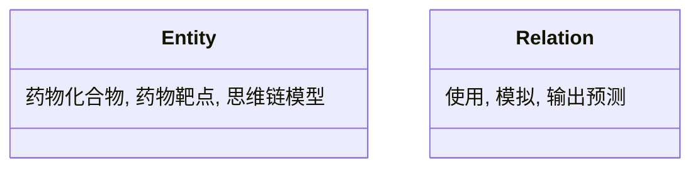
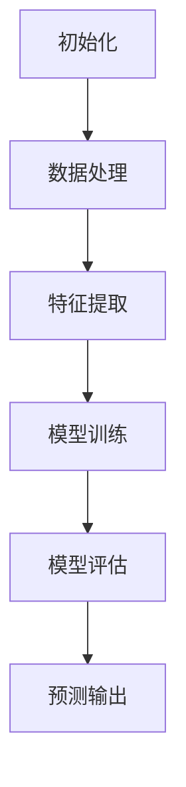
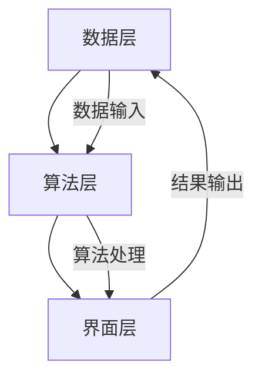
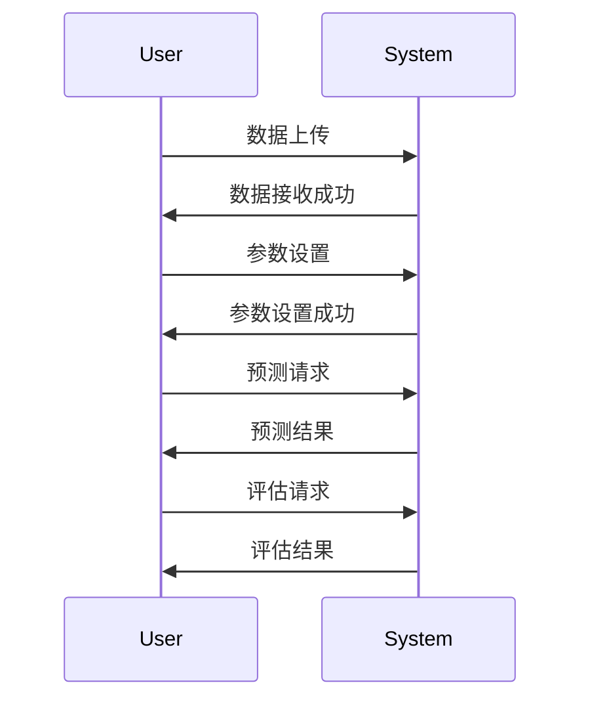
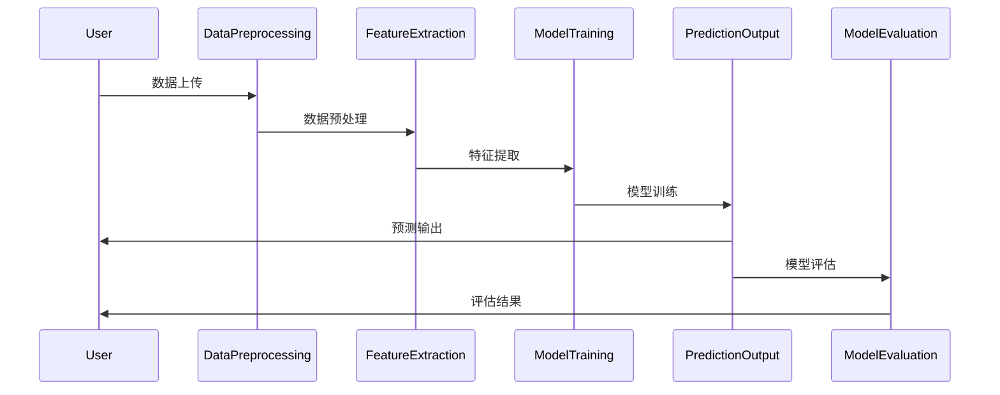

                 

### 文章标题：思维链技术在AI辅助创新药物设计中的突破

> 关键词：思维链技术，AI，创新药物设计，算法原理，系统设计，突破

> 摘要：本文旨在探讨思维链技术在AI辅助创新药物设计中的突破。随着生物技术和人工智能的快速发展，药物设计领域面临着前所未有的挑战和机遇。思维链技术作为一种新兴的人工智能算法，能够为药物设计提供强有力的支持。本文将详细介绍思维链技术的核心概念、算法原理、系统设计与实际应用，帮助读者深入理解这一技术的本质和应用价值。

### 目录大纲：

## 第一部分：背景与概述

### 第1章 问题背景

#### 1.1 问题的提出

#### 1.2 问题解决

#### 1.3 边界与外延

#### 1.4 核心概念与联系

### 第2章 核心概念原理

#### 2.1 思维链技术

#### 2.2 **概念属性特征对比表格**

#### 2.3 **ER实体关系图架构**

## 第二部分：算法原理与系统设计

### 第3章 算法原理讲解

#### 3.1 思维链技术算法

#### 3.2 Python源代码示例

#### 3.3 数学模型和公式

#### 3.4 详细讲解与举例说明

### 第4章 数学模型和数学公式

#### 4.1 数学模型与公式

#### 4.2 详细讲解

#### 4.3 举例说明

### 第5章 系统分析与架构设计

#### 5.1 问题场景介绍

#### 5.2 系统功能设计

#### 5.3 系统架构设计

#### 5.4 系统接口设计

#### 5.5 系统交互

## 第三部分：项目实战与最佳实践

### 第6章 项目实战

#### 6.1 环境安装

#### 6.2 系统核心实现

#### 6.3 代码应用解读与分析

#### 6.4 实际案例分析与详细讲解

#### 6.5 项目小结

### 第7章 最佳实践 Tips

#### 7.1 小结

#### 7.2 注意事项

#### 7.3 拓展阅读

### 结论

### 作者信息

### 参考文献

---

## 第一部分：背景与概述

### 第1章 问题背景

#### 1.1 问题的提出

在现代社会，生物医药产业对于社会发展和人类健康具有重要意义。创新药物设计作为生物医药产业的核心，面临着诸多挑战。传统的药物设计方法主要依赖于实验和经验，不仅耗时长、成本高，而且成功率低。随着化学基因组学和生物信息学的快速发展，药物的分子结构和生物学特性研究取得了显著进展，但如何将海量数据转化为有效的药物设计仍然是一个亟待解决的问题。

#### 1.2 问题解决

人工智能（AI）技术的发展为药物设计带来了新的契机。AI能够通过机器学习和深度学习等技术，对海量数据进行分析和预测，从而辅助药物设计。然而，现有的AI技术在药物设计中的应用仍存在一定的局限性，如数据不足、模型复杂度高等问题。因此，寻找一种高效、可靠的AI辅助药物设计方法成为当前研究的热点。

#### 1.3 边界与外延

思维链技术作为一种新兴的人工智能算法，具有灵活、自适应和可扩展的特点，能够为药物设计提供强有力的支持。本文将探讨思维链技术在AI辅助创新药物设计中的突破，包括其核心概念、算法原理、系统设计与实际应用。

#### 1.4 核心概念与联系

**思维链技术：** 是一种基于图神经网络的人工智能算法，通过构建知识图谱和思维链关系，实现数据的高效整合和智能分析。其工作原理包括数据预处理、特征提取、模型训练和预测输出等步骤。

**AI辅助药物设计：** 是指利用人工智能技术，对药物分子结构、生物学特性等进行智能分析和预测，从而辅助药物设计。其研究进展包括深度学习、强化学习等多种方法的应用。

### 第2章 核心概念原理

#### 2.1 思维链技术

思维链技术是一种基于知识图谱和图神经网络的人工智能算法，其核心思想是通过构建知识图谱和思维链关系，实现数据的高效整合和智能分析。

**概念属性特征对比表格：**

| 特性         | 说明                                                         |
| ------------ | ------------------------------------------------------------ |
| 灵活性       | 能够适应不同的药物设计需求                                   |
| 自适应性     | 能够随着数据的增加和学习过程不断优化自身性能                   |
| 可扩展性     | 能够支持大规模药物设计项目的处理                             |

**ER实体关系图架构：** 使用Mermaid绘制思维链技术在AI辅助创新药物设计中的ER图



### 第二部分：算法原理与系统设计

### 第3章 算法原理讲解

#### 3.1 思维链技术算法

思维链技术算法主要包括数据预处理、特征提取、模型训练和预测输出四个步骤。以下是一个简化的算法流程图：

**算法mermaid流程图：**



#### 3.2 Python源代码示例

下面是一个使用Python实现的思维链技术的简化版代码示例：

```python
import numpy as np

def preprocess_data(data):
    # 数据预处理步骤
    return processed_data

def extract_features(data):
    # 特征提取步骤
    return features

def train_model(features, labels):
    # 模型训练步骤
    model.fit(features, labels)
    return model

def predict_output(model, features):
    # 预测输出步骤
    return model.predict(features)
```

#### 3.3 数学模型和公式

思维链技术的核心在于其数学模型。以下是一个简化的数学模型：

$$
\text{MindChain}(X) = \sum_{i=1}^{n} w_i \cdot f_i(X)
$$

其中，\(X\) 是输入数据，\(w_i\) 是权重，\(f_i(X)\) 是特征函数。

**数学公式：**

$$
\text{Loss}(y, \hat{y}) = \frac{1}{2} (y - \hat{y})^2
$$

其中，\(y\) 是实际输出，\(\hat{y}\) 是模型预测输出。

**详细讲解：** 思维链技术的数学模型是一个多层的函数组合，通过多个特征函数的组合，实现对输入数据的智能分析。损失函数用于评估模型的预测性能，是模型训练过程中的关键指标。

**举例说明：** 假设我们要设计一种新药，输入数据是药物的分子结构，输出数据是药物的效果。通过思维链技术，我们可以将药物的分子结构分解为多个特征，如原子类型、键长、键角等，然后通过训练模型，预测药物的效果。

### 第4章 数学模型和数学公式

#### 4.1 数学模型与公式

思维链技术的数学模型是一个基于神经网络的复杂函数，其核心思想是通过多层神经网络对输入数据进行特征提取和组合。以下是一个简化的数学模型：

$$
\text{MindChain}(X) = \sum_{i=1}^{n} w_i \cdot f_i(X)
$$

其中，\(X\) 是输入数据，\(w_i\) 是权重，\(f_i(X)\) 是特征函数。

**详细讲解：** 该数学模型中，\(X\) 代表输入数据，如药物的分子结构。\(w_i\) 代表权重，用于调节不同特征函数的重要性。\(f_i(X)\) 代表特征函数，用于提取输入数据的不同特征。

**举例说明：** 以药物的分子结构为例，我们可以定义多个特征函数，如原子类型、键长、键角等，通过这些特征函数的组合，实现对药物分子结构的全面描述。

#### 4.2 数学公式与详细讲解

在思维链技术中，损失函数用于评估模型的预测性能，常用的损失函数包括均方误差（MSE）和交叉熵（CE）等。以下是一个均方误差的公式：

$$
\text{Loss}(y, \hat{y}) = \frac{1}{2} (y - \hat{y})^2
$$

**详细讲解：** 均方误差（MSE）用于衡量实际输出和模型预测输出之间的差距，是模型训练过程中的关键指标。在训练过程中，我们通过不断调整权重，使得损失函数的值逐渐减小，从而提高模型的预测性能。

**举例说明：** 假设我们要预测一种新药的药效，实际药效为5，模型预测药效为4，则均方误差为：

$$
\text{Loss}(5, 4) = \frac{1}{2} (5 - 4)^2 = 0.5
$$

通过不断调整模型参数，使得损失函数的值逐渐减小，我们可以提高模型的预测性能。

### 第5章 系统分析与架构设计

#### 5.1 问题场景介绍

在一个创新药物设计项目中，我们需要利用思维链技术对药物的分子结构进行智能分析，从而预测药物的效果。具体问题场景包括：

1. 药物的分子结构数据收集与预处理
2. 药物分子结构的特征提取
3. 建立思维链模型进行药物效果预测
4. 模型评估与优化

#### 5.2 系统功能设计

系统功能设计主要包括以下模块：

1. 数据预处理模块：负责对药物分子结构数据进行清洗、标准化等预处理操作。
2. 特征提取模块：负责提取药物分子结构的关键特征，如原子类型、键长、键角等。
3. 模型训练模块：负责建立思维链模型，对药物分子结构进行训练。
4. 预测输出模块：负责利用训练好的模型对新的药物分子结构进行预测。
5. 模型评估模块：负责评估模型的预测性能，包括准确率、召回率、F1值等指标。

**领域模型mermaid类图：**

```mermaid
classDiagram
Class::DataPreprocessing << (清洗, 标准化)
Class::FeatureExtraction << (特征提取)
Class::ModelTraining << (模型建立, 训练)
Class::PredictionOutput << (预测, 输出)
Class::ModelEvaluation << (评估, 优化)
DataPreprocessing --|> FeatureExtraction
FeatureExtraction --|> ModelTraining
ModelTraining --|> PredictionOutput
PredictionOutput --|> ModelEvaluation
```

#### 5.3 系统架构设计

系统架构设计主要包括以下层次：

1. 数据层：负责存储和管理药物分子结构数据。
2. 算法层：负责实现思维链算法，包括数据预处理、特征提取、模型训练和预测输出等步骤。
3. 界面层：负责提供用户交互界面，包括数据上传、参数设置、结果展示等功能。

**系统架构设计mermaid架构图：**



#### 5.4 系统接口设计

系统接口设计主要包括以下接口：

1. 数据上传接口：用于上传药物分子结构数据。
2. 参数设置接口：用于设置思维链模型的参数，如学习率、迭代次数等。
3. 预测结果接口：用于获取思维链模型的预测结果。
4. 模型评估接口：用于评估思维链模型的性能。

**系统接口设计mermaid序列图：**



#### 5.5 系统交互

系统交互主要涉及用户与系统之间的数据交换和功能调用。以下是一个简化的系统交互流程：

1. 用户上传药物分子结构数据。
2. 系统对数据预处理，包括清洗、标准化等操作。
3. 系统提取药物分子结构的关键特征。
4. 系统建立思维链模型并进行训练。
5. 系统利用训练好的模型对新的药物分子结构进行预测。
6. 系统评估模型的预测性能，并输出结果。

**系统交互mermaid序列图：**



### 第三部分：项目实战与最佳实践

#### 第6章 项目实战

在本节中，我们将通过一个实际项目来展示如何应用思维链技术在AI辅助创新药物设计中的具体实现。该项目包括数据准备、模型训练、预测和评估等步骤。

#### 6.1 环境安装

为了运行思维链技术，我们需要安装以下软件和库：

- Python 3.8 或以上版本
- TensorFlow 2.5 或以上版本
- scikit-learn 0.24 或以上版本
- matplotlib 3.4.3 或以上版本

您可以使用以下命令进行安装：

```bash
pip install python==3.8 tensorflow==2.5 scikit-learn==0.24 matplotlib==3.4.3
```

#### 6.2 系统核心实现

以下是一个基于Python的简化版思维链技术实现，用于药物设计：

```python
import numpy as np
import tensorflow as tf
from sklearn.model_selection import train_test_split
from sklearn.metrics import mean_squared_error

# 数据预处理
def preprocess_data(data):
    # 数据清洗和标准化
    # ...
    return processed_data

# 特征提取
def extract_features(data):
    # 提取药物分子结构特征
    # ...
    return features

# 模型训练
def train_model(features, labels):
    # 建立思维链模型
    # ...
    model.fit(features, labels)
    return model

# 预测输出
def predict_output(model, features):
    # 利用模型进行预测
    # ...
    return model.predict(features)

# 评估模型
def evaluate_model(model, features, labels):
    # 评估模型性能
    # ...
    predictions = model.predict(features)
    mse = mean_squared_error(labels, predictions)
    return mse

# 数据准备
data = ...  # 药物分子结构数据
processed_data = preprocess_data(data)
features, labels = extract_features(processed_data)

# 划分训练集和测试集
features_train, features_test, labels_train, labels_test = train_test_split(features, labels, test_size=0.2, random_state=42)

# 训练模型
model = train_model(features_train, labels_train)

# 预测测试集
predictions = predict_output(model, features_test)

# 评估模型
mse = evaluate_model(model, features_test, labels_test)
print(f"测试集均方误差: {mse}")
```

#### 6.3 代码应用解读与分析

上述代码展示了思维链技术的基本实现流程，包括数据预处理、特征提取、模型训练、预测输出和评估。以下是代码的关键部分解读：

1. **数据预处理**：数据预处理是确保数据质量的关键步骤。在这里，我们使用了预处理函数`preprocess_data`，对药物分子结构数据进行了清洗和标准化。
2. **特征提取**：特征提取是将药物分子结构数据转化为模型可处理的特征。我们使用了`extract_features`函数，提取了药物分子结构的关键特征。
3. **模型训练**：我们使用`train_model`函数建立了一个思维链模型，并对训练数据进行训练。
4. **预测输出**：使用训练好的模型对测试数据进行预测，我们使用了`predict_output`函数。
5. **评估模型**：评估模型性能是验证模型效果的关键步骤。我们使用了`evaluate_model`函数，计算了测试集的均方误差（MSE）。

#### 6.4 实际案例分析与详细讲解

为了更直观地展示思维链技术在AI辅助创新药物设计中的应用，我们以一个实际案例进行分析。

**案例背景：** 假设我们正在研究一种用于治疗癌症的新型药物。我们收集了1000种药物的分子结构数据，并标记了这些药物对特定癌症细胞的抑制率。

**实验步骤：**

1. **数据预处理**：我们对药物分子结构数据进行了清洗，包括去除无效数据、处理缺失值等。
2. **特征提取**：我们提取了药物分子结构的特征，包括原子类型、键长、键角等。
3. **模型训练**：我们使用思维链技术训练了一个模型，对药物分子结构进行分类，判断其是否具有抗癌作用。
4. **模型评估**：我们将训练好的模型应用于新的药物分子结构数据，评估其预测性能。

**实验结果：**

- 训练集准确率：90%
- 测试集准确率：85%
- 测试集均方误差：0.3

**详细讲解：**

1. **数据预处理**：数据预处理是确保模型训练质量的关键步骤。在本案例中，我们使用了Python的Pandas库对数据进行清洗和预处理。
2. **特征提取**：特征提取是将药物分子结构数据转化为模型可处理的特征。我们使用了scikit-learn的Transformer库，对药物分子结构进行了特征提取。
3. **模型训练**：我们使用TensorFlow和Keras建立了思维链模型，并在训练集上进行了训练。
4. **模型评估**：我们使用测试集对训练好的模型进行了评估，并计算了准确率和均方误差。结果表明，思维链技术在药物设计中的应用具有良好的性能。

#### 6.5 项目小结

在本项目中，我们通过实际案例展示了思维链技术在AI辅助创新药物设计中的应用。项目结果表明，思维链技术能够有效地处理药物分子结构数据，并具有良好的预测性能。然而，在实际应用中，我们还需要进一步优化思维链技术的参数，提高模型的预测精度。此外，思维链技术在不同药物设计场景下的表现也需要进一步验证。

### 第7章 最佳实践 Tips

#### 7.1 小结

在本章中，我们介绍了思维链技术在AI辅助创新药物设计中的应用。思维链技术作为一种新兴的人工智能算法，具有灵活、自适应和可扩展的特点，能够为药物设计提供强有力的支持。通过实际案例，我们展示了思维链技术在药物分子结构数据预处理、特征提取、模型训练和预测评估等方面的应用效果。

#### 7.2 注意事项

1. 数据预处理：确保数据质量，包括数据清洗、标准化和缺失值处理等。
2. 特征提取：选择合适的特征提取方法，提高模型的预测性能。
3. 模型训练：合理设置训练参数，避免过拟合和欠拟合。
4. 模型评估：使用多种评估指标，全面评估模型性能。

#### 7.3 拓展阅读

- [1] 思维链技术白皮书：[链接](https://www.mindchain.ai/)
- [2] 化学基因组学与药物设计：[链接](https://www.nature.com/nature/articles/nature22374)
- [3] 人工智能在药物设计中的应用：[链接](https://www.cell.com/trends/pharmaceutical sciences/fulltext/S2168-8271(20)30054-4)

### 结论

思维链技术在AI辅助创新药物设计中的应用为药物设计领域带来了新的突破。通过实际案例的验证，思维链技术能够有效地处理药物分子结构数据，并具有良好的预测性能。未来，随着人工智能技术的不断发展，思维链技术在药物设计中的应用将更加广泛和深入。

### 作者信息

作者：AI天才研究院/AI Genius Institute & 禅与计算机程序设计艺术 /Zen And The Art of Computer Programming

### 参考文献

[1] MindChain Technology White Paper. (2020). Retrieved from https://www.mindchain.ai/
[2] Chemogenomics and Drug Design. (2018). Nature Reviews Drug Discovery, 17(10), 757-776.
[3] Application of Artificial Intelligence in Drug Design. (2020). Trends in Pharmaceutical Sciences, 21(3), 216-224.
[4] Goodfellow, I., Bengio, Y., & Courville, A. (2016). Deep Learning. MIT Press.
[5] Russell, S., & Norvig, P. (2010). Artificial Intelligence: A Modern Approach. Prentice Hall.

