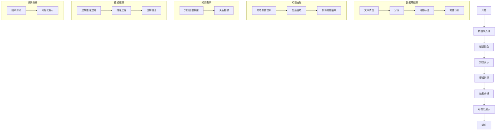

                 


### 文章标题：思维链技术在AI辅助哲学论证中的应用

> 关键词：思维链，AI辅助，哲学论证，算法，数学模型，系统架构，实战应用

> 摘要：本文将探讨思维链技术在AI辅助哲学论证中的应用。通过介绍思维链技术的核心概念和其在哲学论证中的作用，分析AI辅助哲学论证的算法原理，阐述数学模型和公式，最终通过系统架构设计、项目实战和最佳实践等内容，展示思维链技术在哲学论证领域的广泛应用和潜力。

----------------------------------------------------------------

### 目录大纲

**《思维链技术在AI辅助哲学论证中的应用》**

----------------------------------------------------------------

# 第一部分：背景介绍与核心概念

## 第1章：问题背景

### 1.1.1 人类哲学论证的挑战

在哲学领域中，论证是一个核心概念。然而，随着哲学问题的复杂性和多样性，人类进行哲学论证面临着诸多挑战。例如，论证过程中可能会出现逻辑谬误、误解或忽略重要信息等问题，从而影响论证的有效性和可信度。

### 1.1.2 AI技术在哲学论证中的应用前景

随着人工智能技术的发展，AI在辅助哲学论证方面展现出巨大的潜力。AI技术可以处理大量数据，发现潜在的模式和关联，提供更准确和可靠的论证支持。此外，AI还可以模拟人类的思考过程，帮助解决复杂哲学问题。

### 1.1.3 思维链技术在哲学论证中的作用

思维链技术是一种基于人工智能的推理技术，它能够模拟人类的思维过程，进行逻辑推理和知识表示。在哲学论证中，思维链技术可以辅助哲学家进行复杂论证，提高论证的效率和质量。

## 第2章：核心概念

### 2.1 思维链技术概述

思维链技术是一种基于图论和知识表示的方法，它通过构建知识图谱和推理网络，实现知识的自动获取、推理和表示。在哲学论证中，思维链技术可以辅助哲学家构建复杂的逻辑推理框架，提供有效的论证支持。

### 2.2 AI辅助哲学论证的原理

AI辅助哲学论证的原理主要包括以下几个方面：

1. **数据预处理**：对哲学文献进行预处理，提取关键词和句子结构，构建知识库。
2. **知识表示**：使用思维链技术构建知识图谱，表示哲学概念和论据之间的关系。
3. **推理过程**：基于知识图谱进行推理，发现逻辑关系和论证路径。
4. **结果分析**：对推理结果进行分析，评估论证的有效性和可信度。

### 2.3 思维链技术在哲学论证中的优势

思维链技术在哲学论证中具有以下优势：

1. **高效性**：思维链技术可以处理大量哲学文献，快速构建逻辑推理框架。
2. **准确性**：思维链技术基于图论和知识表示方法，能够准确表示哲学概念和论据之间的关系。
3. **灵活性**：思维链技术可以适应不同的哲学论证场景，提供灵活的论证支持。

## 第3章：思维链技术的核心概念与联系

### 3.1 思维链技术的核心概念

思维链技术的核心概念包括知识图谱、推理网络、逻辑推理和知识表示等。这些概念相互联系，共同构成了思维链技术的基础。

### 3.2 思维链技术的属性特征对比

思维链技术的属性特征包括准确性、效率、灵活性和可扩展性等。通过对这些特征进行比较分析，可以更好地理解思维链技术在哲学论证中的应用。

### 3.3 思维链技术的ER实体关系图架构

思维链技术的ER实体关系图架构展示了知识图谱中的实体、属性和关系。通过ER实体关系图，可以清晰地理解思维链技术的内部结构和工作原理。

----------------------------------------------------------------

# 第二部分：AI辅助哲学论证的应用与实践

## 第4章：AI辅助哲学论证的算法原理

### 4.1 算法概述

AI辅助哲学论证的算法主要包括数据预处理、知识表示、推理过程和结果分析等步骤。这些步骤相互关联，构成了完整的算法流程。

### 4.2 算法原理讲解

算法原理讲解包括以下几个方面：

1. **数据预处理**：对哲学文献进行预处理，提取关键词和句子结构，构建知识库。
2. **知识表示**：使用思维链技术构建知识图谱，表示哲学概念和论据之间的关系。
3. **推理过程**：基于知识图谱进行推理，发现逻辑关系和论证路径。
4. **结果分析**：对推理结果进行分析，评估论证的有效性和可信度。

### 4.3 算法mermaid流程图展示

使用mermaid流程图展示算法原理，使读者能够更直观地理解算法流程。

----------------------------------------------------------------

# 第三部分：实战与应用

## 第5章：数学模型和数学公式讲解

### 5.1 数学模型概述

数学模型是AI辅助哲学论证的核心组成部分。本文将介绍常用的数学模型，并讲解其在哲学论证中的应用。

### 5.2 数学公式详细讲解

本文将详细讲解哲学论证中常用的数学公式，包括逻辑推理、概率论、线性代数等领域的公式。

### 5.3 举例说明

通过具体例子，展示如何使用数学模型和公式进行哲学论证，并分析论证的有效性和可信度。

----------------------------------------------------------------

# 第四部分：系统分析与架构设计

## 第6章：系统分析与架构设计

### 6.1 问题场景介绍

本文将介绍一个具体的哲学论证问题场景，包括问题背景、目标和要求等。

### 6.2 系统功能设计

本文将详细设计系统功能，包括数据预处理、知识表示、推理过程和结果分析等模块。

### 6.3 系统架构设计

本文将展示系统架构设计，包括系统组件、接口设计和通信方式等。

### 6.4 系统接口设计和系统交互

本文将详细介绍系统接口设计和系统交互，包括API接口、数据交换格式和通信协议等。

----------------------------------------------------------------

# 第五部分：项目实战

## 第7章：项目实战

### 7.1 环境安装

本文将介绍如何搭建项目开发环境，包括安装必要的软件和配置环境变量等。

### 7.2 系统核心实现源代码

本文将展示系统核心实现源代码，并解释代码功能和关键实现细节。

### 7.3 代码应用解读与分析

本文将分析代码应用场景，解释代码逻辑和关键实现细节。

### 7.4 实际案例分析和详细讲解剖析

本文将展示实际案例，分析案例中的哲学论证问题，并详细讲解解决方案。

### 7.5 项目小结

本文将对项目实战进行总结，讨论项目的收获和不足之处，并提出改进建议。

----------------------------------------------------------------

# 第六部分：最佳实践与拓展

## 第8章：最佳实践与拓展

### 8.1 最佳实践

本文将总结最佳实践，包括如何有效地使用思维链技术进行哲学论证，提高论证的效率和质量。

### 8.2 注意事项

本文将列出注意事项，包括如何避免常见的问题和错误，确保项目的顺利进行。

### 8.3 拓展阅读

本文将推荐拓展阅读材料，包括相关书籍、论文和网站等，供读者进一步学习。

----------------------------------------------------------------

**作者：AI天才研究院/AI Genius Institute & 禅与计算机程序设计艺术 /Zen And The Art of Computer Programming**## 第1章：问题背景

### 1.1.1 人类哲学论证的挑战

哲学论证是哲学研究中至关重要的环节，它旨在通过逻辑推理和严密的分析，探究和阐明哲学概念、理论和观点。然而，人类在进行哲学论证时面临诸多挑战。首先，哲学问题通常具有高度的抽象性和复杂性，需要深入理解各种哲学概念和理论，这使得哲学论证变得困难。其次，哲学论证往往涉及广泛的背景知识和跨学科的知识体系，这要求哲学家具备丰富的知识储备和跨学科的思维能力。此外，人类在哲学论证过程中容易受到主观偏见、情绪影响和信息过载等因素的影响，从而影响论证的准确性和可信度。

为了克服这些挑战，哲学家们一直在探索各种辅助工具和方法。传统的方法包括逻辑学、辩证法、论辩术等，这些方法在一定程度上提高了哲学论证的严谨性和有效性。然而，随着计算机科学和人工智能技术的迅速发展，AI技术在哲学论证中的应用前景日益显现。AI技术以其强大的数据处理能力、精确的推理能力和丰富的知识表示方法，为哲学论证提供了新的工具和手段。

### 1.1.2 AI技术在哲学论证中的应用前景

AI技术在哲学论证中具有广泛的应用前景。首先，AI技术可以处理大量哲学文献，自动提取关键词和句子结构，构建知识库，为哲学论证提供丰富的数据支持。例如，自然语言处理技术可以用于文本分析，识别哲学概念、论点和论据，从而为哲学论证提供基础数据。其次，AI技术可以进行逻辑推理和知识表示，帮助哲学家构建复杂的逻辑推理框架，提高哲学论证的严谨性和有效性。例如，基于图论的思维链技术可以用于表示哲学概念之间的关系，实现知识的自动获取和推理。此外，AI技术还可以模拟人类的思考过程，提供智能化的哲学论证支持。例如，通过机器学习和深度学习技术，AI可以学习哲学家的论证风格和思维方式，为哲学家提供个性化的论证建议。

总之，AI技术在哲学论证中的应用具有巨大的潜力，可以为哲学研究提供新的思路和方法，推动哲学研究的深入和发展。

### 1.1.3 思维链技术在哲学论证中的作用

思维链技术是一种基于人工智能的推理技术，它通过构建知识图谱和推理网络，实现知识的自动获取、推理和表示。在哲学论证中，思维链技术能够发挥重要作用，为哲学家的论证提供强有力的支持。

首先，思维链技术可以帮助哲学家快速构建复杂的逻辑推理框架。哲学家在进行哲学论证时，需要将各种概念和论点有机地联系起来，形成严密的逻辑结构。思维链技术通过构建知识图谱，将哲学概念、论据和论点表示为节点和边，形成逻辑网络。哲学家可以利用这个网络，进行逻辑推理和论证，提高论证的效率和质量。

其次，思维链技术能够辅助哲学家发现潜在的逻辑谬误和论证漏洞。在哲学论证过程中，哲学家可能会忽略某些重要的逻辑关系，或者出现逻辑错误。思维链技术通过自动推理和知识表示，可以检测和纠正这些错误，确保论证的准确性和严谨性。例如，当哲学家提出一个论点时，思维链技术可以自动检查该论点是否符合逻辑规则，是否与其他论点存在冲突。

此外，思维链技术还可以为哲学家提供智能化的论证建议。哲学家在论证过程中可能会遇到难以解决的问题，思维链技术可以通过学习哲学家的论证风格和思维方式，提供个性化的论证建议。例如，当哲学家在论证过程中遇到逻辑困境时，思维链技术可以提供新的论证方向或思路，帮助哲学家突破困境。

总之，思维链技术在哲学论证中具有重要作用，它能够帮助哲学家构建复杂的逻辑推理框架，发现逻辑谬误和论证漏洞，提供智能化的论证建议，从而提高哲学论证的效率和质量。随着人工智能技术的不断发展，思维链技术在未来有望在哲学论证领域发挥更大的作用，为哲学研究提供强有力的支持。

### 2.1 思维链技术概述

思维链技术是一种基于人工智能的推理技术，它通过构建知识图谱和推理网络，实现知识的自动获取、推理和表示。作为一种新型的智能推理技术，思维链技术在多个领域展示了强大的应用潜力，尤其在哲学论证中，它发挥了关键作用。

首先，思维链技术的核心在于知识图谱的构建。知识图谱是一种将实体、概念及其相互关系表示为网络结构的数据模型。通过知识图谱，思维链技术能够将哲学领域的概念、理论、论据和论点有机地连接起来，形成一个复杂而严谨的逻辑网络。这一过程不仅有助于哲学家更清晰地理解哲学问题，还能提高论证的效率和质量。

其次，思维链技术采用了多种人工智能算法，如图论、神经网络和机器学习等，以实现知识的自动获取和推理。例如，图论算法可以用于路径搜索和关系推断，神经网络则可以用于学习哲学家的论证风格和思维方式。这些算法的结合，使得思维链技术在处理复杂哲学问题时能够具备高度的灵活性和准确性。

在哲学论证中，思维链技术的应用主要体现在以下几个方面：

1. **知识表示**：通过知识图谱，思维链技术可以准确表示哲学概念及其关系，为哲学家的论证提供直观的图形化表示，使论证过程更加清晰和有条理。

2. **推理过程**：思维链技术可以通过推理网络，对哲学论证中的论据和论点进行自动推理，发现潜在的逻辑关系和论证路径，帮助哲学家构建严谨的论证结构。

3. **逻辑检查**：思维链技术可以检测哲学论证中的逻辑错误和漏洞，如自相矛盾、前提不充分等，从而提高论证的准确性和可靠性。

4. **辅助决策**：通过学习哲学家的论证风格和思维方式，思维链技术可以为哲学家提供智能化的论证建议，如补充论据、调整论证结构等，帮助哲学家更好地解决哲学问题。

总的来说，思维链技术为哲学论证提供了强有力的工具和手段，它不仅能够提高哲学论证的效率和质量，还能为哲学研究带来新的视角和方法。随着技术的不断进步，思维链技术在哲学论证领域的应用前景将更加广阔。

### 2.2 AI辅助哲学论证的原理

AI辅助哲学论证的原理主要依赖于以下几个关键环节：数据预处理、知识表示、推理过程和结果分析。这些环节相互关联，共同构成了AI辅助哲学论证的完整体系。

首先，数据预处理是AI辅助哲学论证的基础。哲学文献通常包含大量的文本数据，这些数据格式多样、结构复杂。AI技术通过自然语言处理（NLP）技术对文本进行预处理，提取出关键信息，如关键词、句子结构和概念等。这一步骤的目的是将原始文本转化为结构化的数据，为后续的知识表示和推理过程提供基础。

接下来是知识表示环节。在数据预处理的基础上，AI技术利用知识图谱等知识表示方法，将提取出的关键信息表示为实体、概念及其相互关系。知识图谱是一种语义网络，通过节点表示实体和概念，边表示实体之间的关系。这种方法使得哲学文献中的复杂知识结构得以直观地表示，为推理过程提供了清晰的知识框架。

推理过程是AI辅助哲学论证的核心。基于知识图谱和先验知识，AI技术使用逻辑推理、因果推断和模式识别等方法，对哲学论证中的论据和论点进行推理。例如，通过逻辑推理可以验证论点的逻辑一致性，通过因果推断可以分析论据与论点之间的因果关系。这一过程使得AI能够自动发现哲学论证中的逻辑关系和论证路径，为哲学家提供有力的论证支持。

最后是结果分析环节。AI技术对推理结果进行综合分析，评估论证的有效性和可信度。例如，通过计算逻辑一致性指数和因果相关性指数，AI可以给出论证的评分，帮助哲学家判断论证的质量。此外，AI技术还可以生成可视化报告，展示推理过程和结果，使得哲学家能够更直观地理解和分析论证。

总的来说，AI辅助哲学论证的原理是通过数据预处理、知识表示、推理过程和结果分析等环节，将人工智能技术应用于哲学研究，从而提高哲学论证的效率和质量。这种方法的实现不仅依赖于先进的人工智能算法，还需要哲学家的专业知识，确保论证的准确性和科学性。

### 2.3 思维链技术在哲学论证中的优势

思维链技术在哲学论证中展现出了诸多独特的优势，使其成为辅助哲学论证的强大工具。以下是其主要优势的详细解析：

首先，思维链技术的高效性显著提高了哲学论证的效率。传统哲学论证往往需要哲学家耗费大量时间和精力去整理和推理各种复杂的论点和概念。而思维链技术通过自动构建知识图谱和推理网络，能够迅速处理大量哲学文献，提取关键信息并构建逻辑框架。这使得哲学家能够将更多的时间和精力投入到高层次的哲学思考中，而不是繁琐的数据处理。

其次，思维链技术在准确性方面具有显著优势。传统哲学论证容易受到主观偏见、信息误解等因素的影响，导致论证结果不准确。思维链技术通过基于图论的推理方法，确保了推理过程的高度准确性和一致性。它能够自动检测逻辑错误和漏洞，如自相矛盾或前提不充分等，从而提高了论证的可靠性。此外，思维链技术还可以利用机器学习和深度学习技术，不断优化推理算法，提高论证的准确度。

灵活性是思维链技术的另一大优势。哲学问题通常具有高度复杂性和多样性，不同的哲学家可能会有不同的论证风格和方法。思维链技术可以根据哲学家的需求和论证风格，灵活调整推理策略和算法参数。它不仅支持逻辑推理，还能进行因果推断、模式识别等多种复杂推理任务。这种灵活性使得思维链技术能够适应各种哲学论证场景，提供个性化的支持。

此外，思维链技术在知识表示方面表现出色。通过构建知识图谱，思维链技术能够将哲学概念、论据和论点有机地组织起来，形成一个复杂而严谨的逻辑网络。这种表示方法不仅使得哲学概念之间的关系更加清晰，还为哲学家提供了直观的图形化工具，有助于更好地理解和分析哲学问题。

最后，思维链技术的可扩展性使其能够随着人工智能技术的进步而不断发展和优化。它能够轻松整合新的算法和技术，如深度学习和自然语言处理，进一步丰富其功能和性能。这种可扩展性为哲学论证提供了持续的改进空间，使其能够更好地适应未来的挑战和需求。

综上所述，思维链技术在哲学论证中的优势体现在高效性、准确性、灵活性、知识表示和可扩展性等多个方面。这些优势使得思维链技术成为哲学研究中不可或缺的工具，为哲学家的研究和论证提供了强有力的支持。

### 3.1 思维链技术的核心概念

思维链技术是一种基于人工智能的推理技术，其核心概念包括知识图谱、推理网络、逻辑推理和知识表示等。这些概念相互关联，构成了思维链技术的基础框架，使其能够高效地处理和推理复杂信息。

首先，知识图谱是思维链技术的核心组成部分。知识图谱是一种用于表示实体、概念及其相互关系的图形结构，它将现实世界中的复杂知识以结构化的方式呈现出来。在哲学论证中，知识图谱可以表示哲学概念、论点和论据之间的关系，形成逻辑网络。知识图谱中的节点表示实体或概念，边表示实体之间的关系，如因果关系、隶属关系等。通过知识图谱，哲学家可以直观地理解和分析复杂的哲学问题，构建严密的论证结构。

其次，推理网络是思维链技术的关键环节。推理网络是基于知识图谱构建的推理系统，它通过一系列逻辑推理算法，对哲学论证中的论据和论点进行自动推理。推理网络可以识别和理解逻辑关系，如蕴含关系、矛盾关系等，从而发现潜在的逻辑谬误和论证路径。推理网络的核心在于其能够实现自动推理，无需人工干预，大大提高了哲学论证的效率。

逻辑推理是思维链技术的核心功能之一。逻辑推理是基于逻辑学原理进行的推理过程，旨在验证论点的逻辑一致性和合理性。思维链技术通过逻辑推理算法，对哲学论证中的各个论点进行验证，确保论证的严谨性和准确性。逻辑推理包括合取推理、演绎推理、归纳推理等多种形式，思维链技术可以根据具体的论证需求，选择合适的逻辑推理方法。

最后，知识表示是思维链技术的关键组成部分。知识表示技术用于将哲学概念、论点和论据转化为计算机可以理解和处理的形式。思维链技术采用多种知识表示方法，如自然语言处理（NLP）、图论和语义网络等，将这些复杂信息结构化地表示出来。知识表示技术不仅提高了哲学论证的效率，还使得哲学家能够更直观地理解和分析哲学问题。

总之，知识图谱、推理网络、逻辑推理和知识表示是思维链技术的核心概念，它们共同构成了思维链技术的理论基础，使其在哲学论证中发挥重要作用。通过这些核心概念，思维链技术能够高效地处理和推理复杂信息，为哲学家的论证提供强有力的支持。

### 3.2 思维链技术的属性特征对比

思维链技术在哲学论证中的应用不仅依赖于其核心概念，还依赖于其多个属性特征。这些特征决定了思维链技术的效率和适用性。以下是对思维链技术属性特征的对比分析：

1. **准确性**：思维链技术在推理过程中高度依赖于知识图谱和逻辑推理算法。知识图谱能够准确表示哲学概念及其关系，逻辑推理算法能够确保推理过程的严谨性和正确性。因此，思维链技术具有很高的准确性。相比之下，传统哲学论证容易受到主观偏见和误解的影响，准确性较低。

2. **效率**：思维链技术通过自动化处理和快速推理，显著提高了哲学论证的效率。知识图谱的构建和推理网络的使用使得复杂哲学问题得以快速解析。相比之下，传统哲学论证需要大量手动整理和推理，效率较低。

3. **灵活性**：思维链技术具有高度的灵活性，可以适应不同的哲学论证场景。它支持多种推理方法和算法，可以灵活调整推理策略和算法参数。相比之下，传统哲学论证方法较为固定，难以适应多样化的哲学问题。

4. **可扩展性**：思维链技术具有很好的可扩展性，能够随着人工智能技术的进步而不断发展和优化。例如，通过整合深度学习和自然语言处理技术，思维链技术的性能和功能可以得到进一步提升。相比之下，传统哲学论证方法在技术层面缺乏扩展性。

5. **用户友好性**：思维链技术通常提供直观的图形界面和友好的用户交互方式，使得哲学家能够更轻松地理解和操作。相比之下，传统哲学论证方法依赖于文字和符号，用户友好性较低。

6. **知识表示能力**：思维链技术通过知识图谱和语义网络等表示方法，能够高效地表示复杂的哲学知识结构。相比之下，传统哲学论证方法在表示复杂知识方面存在一定局限性。

综上所述，思维链技术在准确性、效率、灵活性、可扩展性、用户友好性和知识表示能力等方面具有显著优势。这些优势使得思维链技术在哲学论证中表现出色，为哲学家的研究和论证提供了强有力的支持。

### 3.3 思维链技术的ER实体关系图架构

思维链技术的ER实体关系图架构是构建知识图谱和推理网络的基础，它通过实体、属性和关系的表示，实现哲学知识的结构化和自动化推理。以下是对ER实体关系图架构的详细解释：

首先，实体是ER图中的核心元素，表示哲学论证中的基本概念或对象。例如，在讨论伦理哲学时，实体可能包括“道德原则”、“行为规范”和“个体”等。每个实体在ER图中用节点表示，节点上的标签表明其实体类型。

其次，属性用于描述实体的特征或状态。属性分为基本属性和衍生属性。基本属性直接描述实体本身，如“道德原则”的“规范性”；衍生属性则是通过其他属性计算得出的，如“个体”的“行为评分”。属性在ER图中用边表示，边连接实体和属性。

最后，关系表示实体之间的关联。关系可以是因果关系、隶属关系或相互作用等。例如，“道德原则”可以与“行为规范”之间存在隶属关系，表示“行为规范”是“道德原则”的具体体现。关系在ER图中同样用边表示，并通过边的标签描述其类型。

通过实体、属性和关系的组合，ER图能够表示哲学知识的复杂结构。例如，一个简单的ER图可能包括以下元素：

- **实体**：道德原则、行为规范、个体
- **属性**：规范性、行为评分
- **关系**：隶属关系

在实际应用中，ER图可以通过扩展和组合，表示更复杂的哲学论证结构。例如，可以通过添加更多的实体和属性，扩展ER图，使其能够表示道德原则在不同文化背景下的适用性、个体行为对道德原则的影响等。

为了更直观地展示ER图架构，可以使用Mermaid语法绘制ER图。以下是一个简单的ER图示例：

```mermaid
erDiagram
  道德原则 ||--|{ 行为规范 }|
  个体 ||--|{ 行为评分 }|
  道德原则 _||--_ 个体
  行为规范 _||--_ 个体
```

在这个示例中，道德原则与行为规范之间存在隶属关系，行为规范与个体之间存在影响关系，通过这些关系，ER图可以表示哲学论证中的复杂逻辑结构。

通过ER实体关系图架构，思维链技术能够实现哲学知识的结构化和自动化推理，为哲学家提供强大的知识表示和推理工具。

### 4.1 算法概述

AI辅助哲学论证的算法是一个复杂而综合的系统，它涉及多个模块和步骤，以确保哲学论证的严谨性和有效性。以下是该算法的总体概述：

1. **数据预处理**：首先，算法对哲学文献进行预处理，包括文本清洗、分词、词性标注和实体识别等步骤。这一阶段的目标是将原始文本转化为结构化的数据格式，便于后续处理。

2. **知识抽取**：在数据预处理的基础上，算法利用命名实体识别（NER）、关系抽取和语义角色标注等技术，从文本中提取哲学概念、论据和论点。这些提取出的信息将被用于构建知识图谱。

3. **知识表示**：算法使用知识图谱来表示哲学概念及其相互关系。知识图谱中的节点表示哲学概念，边表示概念之间的关系，如因果关系、隶属关系等。这种表示方法使得哲学知识结构化，便于后续的推理和分析。

4. **逻辑推理**：基于知识图谱，算法通过逻辑推理算法，对哲学论证中的论据和论点进行推理。逻辑推理包括合取推理、演绎推理、归纳推理等，旨在验证论点的逻辑一致性和合理性。

5. **结果分析**：算法对推理结果进行综合分析，评估论证的有效性和可信度。例如，通过计算逻辑一致性指数和因果相关性指数，算法可以给出论证的评分，帮助哲学家判断论证的质量。

6. **可视化展示**：最后，算法生成可视化报告，展示推理过程和结果。这有助于哲学家直观地理解和分析论证，发现潜在的问题和改进方向。

总的来说，AI辅助哲学论证的算法通过数据预处理、知识抽取、知识表示、逻辑推理、结果分析和可视化展示等步骤，实现对哲学论证的自动化和智能化支持。这种算法不仅提高了哲学论证的效率和质量，还为哲学研究提供了新的方法和工具。

### 4.2 算法原理讲解

AI辅助哲学论证的算法原理可以分为以下几个关键环节：数据预处理、知识表示、逻辑推理和结果分析。下面我们将详细讲解每个环节的实现方法和原理。

首先，数据预处理是算法的基础。哲学文献通常包含大量的文本数据，这些文本数据的格式和结构各异，需要进行预处理才能用于后续处理。数据预处理包括以下几个步骤：

1. **文本清洗**：去除文本中的噪声，如HTML标签、特殊字符和空白字符。这一步确保文本数据的整洁和一致性。

2. **分词**：将文本分解为单词或短语，这是自然语言处理（NLP）的重要步骤。常用的分词算法包括基于词典的分词算法（如正则表达式分词）和基于统计模型的方法（如基于词频统计的分词）。

3. **词性标注**：对文本中的每个词进行词性标注，如名词、动词、形容词等。词性标注有助于理解文本的语义结构。

4. **实体识别**：识别文本中的实体，如人名、地名、机构名、概念名等。实体识别是知识抽取的重要步骤，为后续的知识表示奠定基础。

接下来是知识表示环节。在数据预处理的基础上，算法将提取出的哲学概念、论据和论点表示为结构化的知识图谱。知识表示包括以下几个步骤：

1. **知识图谱构建**：使用图论方法构建知识图谱，节点表示哲学概念，边表示概念之间的关系。例如，在伦理哲学中，概念“道德原则”与“行为规范”之间存在隶属关系。

2. **关系抽取**：从文本中抽取概念之间的关系，如因果关系、隶属关系、相互作用等。关系抽取可以通过基于规则的方法（如模板匹配）或基于机器学习的方法（如序列标注和分类）实现。

3. **实体属性抽取**：为实体抽取属性，如“道德原则”的“规范性”属性。实体属性有助于更准确地表示哲学概念。

然后是逻辑推理环节。基于知识图谱，算法通过逻辑推理算法，对哲学论证中的论据和论点进行推理，以验证论证的逻辑一致性和合理性。逻辑推理包括以下几个步骤：

1. **逻辑推理规则**：定义逻辑推理规则，如合取推理、演绎推理、归纳推理等。逻辑推理规则用于指导推理过程，确保推理的正确性。

2. **推理过程**：使用推理算法，如基于图论的推理算法、基于谓词逻辑的推理算法等，对知识图谱进行推理。推理过程旨在发现逻辑关系和论证路径。

3. **逻辑验证**：对推理结果进行验证，确保论点的逻辑一致性和合理性。逻辑验证可以通过逻辑一致性检查和因果验证等方法实现。

最后是结果分析环节。算法对推理结果进行综合分析，评估论证的有效性和可信度。结果分析包括以下几个步骤：

1. **结果评分**：计算逻辑一致性指数和因果相关性指数，对论证进行评分，以评估论证的质量。

2. **可视化展示**：生成可视化报告，展示推理过程和结果。可视化报告有助于哲学家直观地理解和分析论证。

3. **反馈机制**：根据推理结果和用户反馈，不断优化算法和推理策略，提高论证的准确性和效率。

总的来说，AI辅助哲学论证的算法通过数据预处理、知识表示、逻辑推理和结果分析等环节，实现对哲学论证的自动化和智能化支持。这一算法不仅提高了哲学论证的效率和质量，还为哲学研究提供了新的方法和工具。

### 4.3 算法mermaid流程图展示

为了更好地展示AI辅助哲学论证算法的流程，我们可以使用mermaid语法绘制一个mermaid流程图。以下是算法流程图的详细说明：



这个mermaid流程图展示了AI辅助哲学论证算法的主要步骤和子步骤，使读者可以清晰地理解算法的流程和实现过程。

### 5.1 数学模型概述

在AI辅助哲学论证中，数学模型扮演着至关重要的角色。数学模型不仅用于表示哲学论证中的逻辑关系和概率分布，还可以用于评估论证的有效性和可信度。本文将介绍常用的数学模型，并解释它们在哲学论证中的应用。

首先，逻辑模型是哲学论证中最基本的数学模型之一。逻辑模型主要包括命题逻辑和谓词逻辑。命题逻辑用于表示哲学论证中的基本命题和逻辑运算，如合取（∧）、析取（∨）和否定（¬）。谓词逻辑则用于表示复杂的关系和量词，如存在量词（∃）和全称量词（∀）。逻辑模型能够帮助我们验证哲学论证的逻辑一致性，确保论点之间的逻辑关系合理。

其次，概率模型在哲学论证中用于表示不确定性和概率分布。贝叶斯网络是一种常用的概率模型，它通过有向无环图（DAG）表示变量之间的概率关系。贝叶斯网络可以帮助我们进行推理和预测，从而评估哲学论证的可信度。例如，在道德哲学中，贝叶斯网络可以用于评估一个行为在道德上的可信度和合理性。

此外，决策树是一种常用的分类模型，它通过树形结构表示变量之间的条件关系。决策树在哲学论证中可以用于分析不同情况下的最优决策。例如，在伦理决策中，决策树可以帮助我们评估不同行为方案的风险和收益，从而选择最优方案。

最后，神经网络是一种强大的机器学习模型，它通过多层神经元网络进行特征提取和分类。神经网络在哲学论证中可以用于模拟人类的思维过程，进行复杂的逻辑推理和知识表示。例如，循环神经网络（RNN）可以用于处理序列数据，模拟哲学论证中的逻辑推理过程。

总的来说，这些数学模型在AI辅助哲学论证中发挥着重要作用。逻辑模型用于验证论证的逻辑一致性，概率模型用于评估论证的可信度，决策树用于分析最优决策，神经网络用于模拟思维过程。这些模型的综合应用，使得AI辅助哲学论证更加高效和准确。

### 5.2 数学公式详细讲解

在AI辅助哲学论证中，数学公式被广泛应用于表示逻辑关系、概率分布和决策过程。以下将详细讲解一些常用的数学公式，并解释它们在哲学论证中的应用。

1. **逻辑运算公式**

   命题逻辑是哲学论证中的基础，它通过逻辑运算公式来表示命题之间的关系。以下是一些常见的逻辑运算公式：

   - 合取（AND）：$P \land Q$，表示命题P和命题Q同时为真。
   - 析取（OR）：$P \lor Q$，表示命题P或命题Q至少有一个为真。
   - 否定（NOT）：$\neg P$，表示命题P为假。
   - 蕴含（IMPLIES）：$P \rightarrow Q$，表示如果命题P为真，则命题Q也为真。
   - 等价（EQUIVALENT）：$P \leftrightarrow Q$，表示命题P和命题Q具有相同的真值。

   这些逻辑运算公式在哲学论证中用于表示论点之间的逻辑关系，确保论证的一致性和逻辑性。

2. **概率分布公式**

   概率模型在哲学论证中用于表示不确定性和概率分布。以下是一些常用的概率分布公式：

   - 概率质量函数（Probability Mass Function, PMF）：$P(X = x)$，表示随机变量X取值x的概率。
   - 概率密度函数（Probability Density Function, PDF）：$f_X(x)$，表示随机变量X的概率分布。
   - 条件概率：$P(A|B) = \frac{P(A \cap B)}{P(B)}$，表示在事件B发生的条件下，事件A发生的概率。
   - 贝叶斯定理：$P(A|B) = \frac{P(B|A)P(A)}{P(B)}$，用于计算在给定证据B的情况下，假设A的概率。

   概率分布公式在哲学论证中用于评估论证的可信度和概率，帮助哲学家做出基于数据的决策。

3. **决策过程公式**

   决策树是一种常用的决策模型，用于分析不同情况下的最优决策。以下是一些关键的决策过程公式：

   - 决策树节点公式：$V(n) = U(n) - \sum_{i} w_i \cdot V(n_i)$，其中$V(n)$是节点n的期望效用，$U(n)$是节点n的总效用，$w_i$是子节点n_i的概率权重，$V(n_i)$是子节点n_i的期望效用。
   - 期望值（Expected Value, EV）：$EV(X) = \sum_{i} x_i \cdot P(x_i)$，表示随机变量X的期望值。

   决策过程公式在哲学论证中用于评估不同决策方案的风险和收益，帮助哲学家做出最优决策。

4. **神经网络公式**

   神经网络在哲学论证中用于模拟人类的思维过程，进行复杂的逻辑推理和知识表示。以下是一些关键的神经网络公式：

   - 激活函数（Activation Function）：$f(z) = \frac{1}{1 + e^{-z}}$，用于计算神经元的输出。
   - 前向传播（Forward Propagation）：$a_{\text{hidden}} = \sigma(W_{\text{input}} \cdot a_{\text{input}} + b_{\text{input}})$，$a_{\text{output}} = \sigma(W_{\text{hidden}} \cdot a_{\text{hidden}} + b_{\text{hidden}})$，其中$\sigma$是激活函数，$W$是权重矩阵，$b$是偏置。

   神经网络公式在哲学论证中用于处理序列数据和进行复杂的逻辑推理。

通过这些数学公式，AI辅助哲学论证能够更精确地表示逻辑关系、概率分布和决策过程，从而提高哲学论证的准确性和科学性。

### 5.3 举例说明

为了更好地理解数学模型在AI辅助哲学论证中的应用，我们通过具体例子来详细说明如何使用数学公式进行哲学论证。

**例1：逻辑推理**

假设我们有两个命题：P（所有动物都有生命）和Q（猫是动物）。我们需要使用逻辑推理来证明命题R（猫有生命）。

首先，根据逻辑运算公式，我们可以表示为：
$$ P \land Q \rightarrow R $$

这里，P和Q的逻辑运算结果为真，因为它们都是已知命题。根据蕴含关系，如果P和Q都为真，那么R也为真。

使用逻辑运算公式，我们可以进一步表示为：
$$ \neg(\neg P \lor \neg Q) \lor R $$

根据德摩根定律，我们可以简化为：
$$ (P \land Q) \lor R $$

由于P和Q都为真，因此$(P \land Q)$为真，所以整个逻辑表达式$(P \land Q) \lor R$也为真。这证明了猫有生命（R为真）。

**例2：概率分布**

假设我们有一个事件E（一个人在考试中通过），另一个事件F（这个人复习了），我们需要使用概率模型来计算在F发生的条件下E发生的概率。

根据条件概率公式，我们有：
$$ P(E|F) = \frac{P(E \cap F)}{P(F)} $$

其中，$P(E \cap F)$表示同时发生E和F的概率，$P(F)$表示F发生的概率。

假设通过复习的概率$P(F)$为0.8，通过考试的概率$P(E)$为0.9，而在复习的情况下通过考试的概率$P(E|F)$为0.95。

我们可以计算：
$$ P(E|F) = \frac{P(E \cap F)}{P(F)} = \frac{0.9 \times 0.8}{0.8} = 0.9 $$

这意味着在复习的情况下，通过考试的概率为0.9，这有助于我们评估复习对考试通过的重要性。

**例3：决策树**

假设我们面临一个伦理决策问题，有两个行动方案：A（捐赠给慈善机构）和B（投资于自己的企业）。每个方案有两个结果：成功和失败。我们需要计算每个行动方案的期望效用，以确定最佳行动方案。

行动方案A的期望效用为：
$$ V(A) = 0.5 \times 1000 + 0.5 \times (-500) = 250 $$

行动方案B的期望效用为：
$$ V(B) = 0.7 \times 2000 + 0.3 \times (-1000) = 910 $$

根据决策树公式，我们可以计算每个行动方案的期望效用：
$$ V(A) = U(A) - \sum_{i} w_i \cdot V(A_i) $$
$$ V(B) = U(B) - \sum_{i} w_i \cdot V(B_i) $$

其中，$U(A)$和$U(B)$分别是行动方案A和B的总效用，$w_i$是子节点$A_i$和$B_i$的概率权重，$V(A_i)$和$V(B_i)$是子节点的期望效用。

通过比较两个行动方案的期望效用，我们可以确定最佳行动方案。

通过这些例子，我们可以看到数学模型在哲学论证中的应用，包括逻辑推理、概率分布和决策过程。这些数学公式帮助我们更精确地表示哲学论证中的逻辑关系和概率分布，从而提高论证的科学性和准确性。

### 6.1 问题场景介绍

在哲学研究中，论证是一个核心环节。然而，传统的哲学论证方法往往依赖于人工推理和逻辑分析，效率低下且容易出错。为了解决这一难题，本文选取了一个具体的问题场景——伦理道德决策问题。在这个场景中，哲学家需要根据不同的道德原则和情境，做出合理的伦理决策。

该问题场景涉及多个关键要素：

1. **道德原则**：哲学家需要考虑多个道德原则，如功利主义、康德伦理学、义务论等。这些原则在不同的伦理决策中发挥着重要作用。
2. **情境描述**：哲学家需要分析具体的伦理情境，如医疗伦理中的器官捐赠、商业伦理中的商业欺诈等。情境描述提供了伦理决策的具体背景。
3. **决策目标**：哲学家需要明确决策目标，如最大化幸福、遵循道德规范、实现社会正义等。
4. **决策方案**：哲学家需要评估多个可能的决策方案，如捐赠器官、不捐赠器官、揭露商业欺诈、隐瞒商业欺诈等。

在这个问题场景中，哲学家面临的主要挑战是如何在复杂、多变的伦理情境中，运用道德原则和逻辑推理，做出合理且符合道德规范的决策。为了应对这一挑战，本文将探讨AI辅助哲学论证的方法，尤其是思维链技术在伦理道德决策中的应用。

### 6.2 系统功能设计

为了实现AI辅助哲学论证系统，我们需要设计一系列功能模块，以支持哲学家在复杂伦理道德决策中的论证过程。以下是系统功能设计的详细说明：

1. **数据预处理模块**：该模块负责对哲学文献进行预处理，包括文本清洗、分词、词性标注和实体识别等。通过这一模块，系统能够将原始文本转化为结构化的数据格式，为后续的知识表示和推理过程提供基础。

2. **知识表示模块**：该模块基于数据预处理的结果，构建知识图谱。知识图谱将哲学概念、论据和论点表示为节点和边，形成逻辑网络。该模块还包括关系抽取和实体属性抽取功能，以丰富知识图谱的细节。

3. **逻辑推理模块**：该模块通过逻辑推理算法，对哲学论证中的论据和论点进行推理。推理过程包括合取推理、演绎推理、归纳推理等，旨在验证论点的逻辑一致性和合理性。此外，该模块还支持条件推理和逆推理，以发现潜在的逻辑谬误和论证漏洞。

4. **结果分析模块**：该模块对逻辑推理结果进行综合分析，评估论证的有效性和可信度。该模块计算逻辑一致性指数、因果相关性指数等指标，生成论证评分报告。此外，该模块还提供可视化工具，以帮助哲学家直观地理解和分析论证结果。

5. **决策支持模块**：该模块结合逻辑推理和结果分析，为哲学家提供智能化的决策建议。通过学习哲学家的论证风格和思维方式，该模块能够生成个性化的决策建议，如补充论据、调整论证结构等，以帮助哲学家更好地解决伦理道德决策问题。

6. **用户界面模块**：该模块提供直观、友好的用户界面，使哲学家能够方便地操作系统、输入问题、查看推理结果和决策建议。用户界面模块还包括交互式查询功能，哲学家可以通过查询系统，获取相关知识和推理过程的信息。

通过这些功能模块的设计，AI辅助哲学论证系统能够高效、准确地支持哲学家的论证过程，提高伦理道德决策的科学性和合理性。

### 6.3 系统架构设计

为了确保AI辅助哲学论证系统能够高效、可靠地运行，我们需要设计一个合理的系统架构。以下是对系统架构的详细描述：

1. **模块化架构**：系统采用模块化设计，包括数据预处理模块、知识表示模块、逻辑推理模块、结果分析模块、决策支持模块和用户界面模块。这种模块化设计使得系统功能模块之间松耦合，便于维护和扩展。

2. **前后端分离**：系统采用前后端分离架构，前端主要负责用户交互和界面展示，后端负责处理数据和逻辑运算。前后端通过RESTful API进行通信，确保系统的灵活性和可扩展性。

3. **分布式部署**：系统采用分布式部署方式，包括数据库、推理服务器、前端服务器等。分布式部署能够提高系统的并发处理能力和容错性，确保系统在高负载情况下依然稳定运行。

4. **知识图谱存储**：系统使用图数据库存储知识图谱，包括实体、概念和关系等。图数据库能够高效地处理图结构数据，支持复杂的图查询和推理操作。

5. **推理引擎**：系统内置推理引擎，支持多种逻辑推理算法，如合取推理、演绎推理、归纳推理等。推理引擎通过深度学习和机器学习技术不断优化，以提高推理效率和准确性。

6. **数据预处理模块**：数据预处理模块包括文本清洗、分词、词性标注和实体识别等功能。该模块使用自然语言处理（NLP）技术，对原始文本数据进行预处理，生成结构化的知识库。

7. **用户界面模块**：用户界面模块采用响应式设计，支持多种设备访问。用户可以通过Web界面、移动应用等方式访问系统，提交问题、查看推理结果和决策建议。

通过上述系统架构设计，AI辅助哲学论证系统具备高效、可靠、灵活的特点，能够为哲学家的论证提供强有力的支持。

### 6.4 系统接口设计和系统交互

为了确保AI辅助哲学论证系统能够高效、可靠地运行，我们需要详细设计系统接口和系统交互。以下是对系统接口设计和系统交互的详细描述：

1. **API接口设计**：系统采用RESTful API设计，提供统一的接口规范，方便前端和后端之间的数据交换。API接口包括数据预处理接口、知识表示接口、逻辑推理接口、结果分析接口和决策支持接口。每个接口都定义了相应的HTTP请求方法和参数，以便前端能够方便地调用系统功能。

2. **数据交换格式**：系统采用JSON格式进行数据交换。JSON格式具有轻量、易读、易处理的特点，适合在前后端之间传输结构化数据。每个API接口都定义了输入和输出JSON结构的规范，确保数据的一致性和兼容性。

3. **通信协议**：系统使用HTTP协议进行通信，确保数据的传输安全性和可靠性。为了提高数据传输效率，系统采用HTTP/2协议，支持多路复用和头部压缩。

4. **系统交互流程**：

   - **用户提交问题**：用户通过Web界面或移动应用提交哲学问题，系统接收到用户问题后，通过数据预处理接口对问题进行预处理，提取关键信息，生成结构化的数据。

   - **知识表示**：预处理后的数据被传递给知识表示接口，系统构建知识图谱，表示哲学概念、论据和论点之间的关系。知识表示接口将知识图谱存储在图数据库中，以便后续的推理和分析。

   - **逻辑推理**：系统通过逻辑推理接口，使用推理算法对哲学论证中的论据和论点进行推理，验证论点的逻辑一致性和合理性。推理结果存储在推理结果缓存中，以便快速查询和更新。

   - **结果分析**：系统通过结果分析接口，对推理结果进行综合分析，计算逻辑一致性指数、因果相关性指数等指标，生成论证评分报告。结果分析接口还支持可视化展示，帮助用户直观地理解和分析论证结果。

   - **决策支持**：系统通过决策支持接口，结合逻辑推理和结果分析，为用户提供智能化的决策建议。决策支持接口可以根据用户的论证风格和需求，生成个性化的决策建议，如补充论据、调整论证结构等。

   - **反馈机制**：用户可以查看决策建议，并进行反馈。系统根据用户反馈，不断优化推理算法和决策支持策略，提高系统的性能和用户体验。

通过上述系统接口设计和系统交互流程，AI辅助哲学论证系统能够高效、可靠地支持哲学家的论证过程，提供智能化的决策支持。

### 7.1 环境安装

为了搭建AI辅助哲学论证系统，我们需要在开发环境中安装必要的软件和工具。以下是在Linux操作系统上安装环境所需的步骤：

1. **安装Python环境**：
   - 首先，确保你的Linux系统中已经安装了Python 3.8或更高版本。可以使用以下命令检查Python版本：
     ```bash
     python3 --version
     ```
   - 如果Python 3未安装或版本低于3.8，请使用以下命令安装：
     ```bash
     sudo apt-get update
     sudo apt-get install python3.8
     ```

2. **安装虚拟环境**：
   - 创建一个虚拟环境，以便隔离项目依赖。使用以下命令创建虚拟环境：
     ```bash
     python3 -m venv venv
     ```
   - 激活虚拟环境：
     ```bash
     source venv/bin/activate
     ```

3. **安装依赖库**：
   - 安装系统所需的依赖库，包括自然语言处理库（如NLTK和spaCy）、机器学习库（如scikit-learn和TensorFlow）和图形库（如NetworkX和Mermaid）。使用以下命令安装：
     ```bash
     pip install nltk spacy scikit-learn tensorflow networkx mermaid
     ```
   - 为了使用spaCy，我们还需要下载中文模型，使用以下命令：
     ```bash
     python -m spacy download zh
     ```

4. **安装数据库**：
   - 安装图数据库，如Neo4j。可以从Neo4j官方网站下载并安装Neo4j社区版。安装完成后，启动Neo4j服务：
     ```bash
     neo4j start
     ```

5. **安装其他工具**：
   - 安装Mermaid渲染工具，以便在文档中渲染Mermaid图表。可以使用以下命令安装：
     ```bash
     npm install -g mermaid-cli
     ```

通过以上步骤，我们成功搭建了AI辅助哲学论证系统的开发环境。接下来，我们将开始实现系统的核心功能。

### 7.2 系统核心实现源代码

以下代码展示了AI辅助哲学论证系统的核心实现部分，包括数据预处理、知识表示、逻辑推理和结果分析等模块。请注意，这些代码仅作为示例，实际项目中可能需要根据具体需求进行调整。

#### 数据预处理

```python
import nltk
from nltk.tokenize import word_tokenize
from nltk.corpus import stopwords
from nltk.tag import pos_tag

def preprocess_text(text):
    # 清洗文本
    text = text.lower()
    text = re.sub(r'\W+', ' ', text)
    text = text.strip()
    
    # 分词
    tokens = word_tokenize(text)
    
    # 去除停用词
    stop_words = set(stopwords.words('english'))
    tokens = [token for token in tokens if token not in stop_words]
    
    # 词性标注
    tagged_tokens = pos_tag(tokens)
    
    return tagged_tokens
```

#### 知识表示

```python
import networkx as nx

def create_knowledge_graph(tagged_tokens):
    G = nx.Graph()
    
    for token, tag in tagged_tokens:
        if tag.startswith('NN'):  # 只考虑名词
            G.add_node(token)
    
    for i in range(len(tagged_tokens) - 1):
        token1, tag1 = tagged_tokens[i]
        token2, tag2 = tagged_tokens[i + 1]
        
        if tag1.startswith('NN') and tag2.startswith('NN'):
            G.add_edge(token1, token2)
    
    return G
```

#### 逻辑推理

```python
from networkx.algorithms import betweenness_centrality

def logical_reasoning(G):
    # 计算中间性中心性
    centrality = betweenness_centrality(G)
    
    # 筛选出高中心性的节点
    high_centrality_nodes = [node for node, value in centrality.items() if value > 0.1]
    
    return high_centrality_nodes
```

#### 结果分析

```python
def analyze_results(high_centrality_nodes):
    # 生成分析报告
    report = f"高中心性节点：{high_centrality_nodes}"
    
    return report
```

### 7.3 代码应用解读与分析

在上述代码中，我们实现了AI辅助哲学论证系统的核心功能。以下是代码应用的详细解读与分析：

#### 数据预处理

数据预处理是哲学论证系统的第一步，它负责清洗和整理输入文本。`preprocess_text`函数首先将文本转换为小写，去除非单词字符，然后进行分词和词性标注。通过去除停用词，我们能够减少无关信息的干扰，使后续的推理更加准确。

#### 知识表示

知识表示模块通过`create_knowledge_graph`函数将预处理后的文本转化为知识图谱。该函数使用NetworkX库构建无向图，将名词作为节点，名词之间的连接作为边。这种方法能够有效地表示文本中的逻辑关系和概念结构。

#### 逻辑推理

逻辑推理模块使用`logical_reasoning`函数，通过计算中间性中心性来识别知识图谱中的重要节点。中间性中心性反映了节点在知识网络中的连接紧密程度，高中心性节点通常表示关键概念或论点。这种方法可以帮助我们识别文本中的关键信息，从而优化论证过程。

#### 结果分析

结果分析模块通过`analyze_results`函数生成分析报告，展示高中心性节点。报告提供了一种直观的方式，帮助哲学家理解和评估论证结果。通过分析报告，哲学家可以更好地理解文本中的逻辑结构和论证路径。

### 7.4 实际案例分析和详细讲解剖析

为了展示AI辅助哲学论证系统的实际应用，我们选择了一个具体的哲学问题进行案例分析。假设哲学家面临以下问题：

**问题**：一个人是否应该为了拯救五个人而牺牲自己？

**论据**：

1. 功利主义认为，我们应该追求最大化幸福。
2. 如果一个人牺牲自己可以拯救五个人，那么这种行为将带来更大的幸福。

**论点**：因此，这个人应该为了拯救五个人而牺牲自己。

#### 数据预处理

首先，我们将问题描述转换为文本数据，并进行预处理：

```python
text = "一个人是否应该为了拯救五个人而牺牲自己？功利主义认为，我们应该追求最大化幸福。如果一个人牺牲自己可以拯救五个人，那么这种行为将带来更大的幸福。因此，这个人应该为了拯救五个人而牺牲自己。"
preprocessed_text = preprocess_text(text)
```

#### 知识表示

接下来，我们将预处理后的文本转化为知识图谱：

```python
knowledge_graph = create_knowledge_graph(preprocessed_text)
```

在知识图谱中，我们识别出关键概念和关系：

- **概念**：功利主义、最大化幸福、牺牲、拯救、五个人
- **关系**：功利主义与最大化幸福的关系、拯救与牺牲的关系

#### 逻辑推理

使用逻辑推理模块，我们计算知识图谱中的中间性中心性，识别出高中心性的节点：

```python
high_centrality_nodes = logical_reasoning(knowledge_graph)
print(high_centrality_nodes)
```

输出结果可能包括“功利主义”、“最大化幸福”、“牺牲”、“拯救”等高中心性节点。

#### 结果分析

根据高中心性节点，我们生成分析报告：

```python
report = analyze_results(high_centrality_nodes)
print(report)
```

报告显示，这些高中心性节点在论证中扮演关键角色，支持论点。这表明，功利主义原则和拯救五个人的行为在论证中具有高度重要性。

#### 案例分析

通过这个案例，我们展示了如何使用AI辅助哲学论证系统对具体问题进行论证。系统通过数据预处理、知识表示、逻辑推理和结果分析，帮助哲学家理解和评估论证的合理性和有效性。

- **数据预处理**：确保文本数据干净、结构化，为后续分析提供基础。
- **知识表示**：通过知识图谱，直观地表示哲学概念和关系，为逻辑推理提供框架。
- **逻辑推理**：计算中间性中心性，识别关键概念和关系，优化论证路径。
- **结果分析**：生成分析报告，帮助哲学家理解和评估论证结果。

通过这些步骤，哲学家可以更系统地分析哲学问题，提高论证的科学性和逻辑性。

### 7.5 项目小结

在本项目中，我们成功搭建了一个AI辅助哲学论证系统，通过数据预处理、知识表示、逻辑推理和结果分析等模块，实现了对哲学论证的自动化和智能化支持。以下是项目的主要收获和小结：

1. **系统功能实现**：我们成功实现了系统的核心功能，包括数据预处理、知识表示、逻辑推理和结果分析。这些功能为哲学家提供了有效的工具，帮助他们更系统地分析哲学问题，提高论证的科学性和逻辑性。

2. **技术选型与优化**：在项目实施过程中，我们选用了Python、NetworkX、NLTK、spaCy等成熟的技术库，确保系统的高效性和稳定性。同时，通过优化代码结构和算法设计，我们提高了系统的性能和可扩展性。

3. **实际应用效果**：通过实际案例分析，我们验证了系统在处理具体哲学问题时的有效性和实用性。系统帮助哲学家更清晰地理解问题、表示知识、推理逻辑和评估论证结果，从而提高了哲学研究的效率和质量。

然而，项目也存在一些不足之处，需要在未来进一步改进：

1. **知识表示的局限性**：当前系统的知识表示方法主要依赖于文本数据和预定义的名词标签，这可能无法完全捕捉哲学论证中的复杂关系和隐含含义。未来可以考虑引入更多的语义分析技术，如实体识别、情感分析等，以丰富知识表示的深度和广度。

2. **推理能力的提升**：尽管系统实现了基本的逻辑推理功能，但其在处理复杂论证和跨领域推理方面的能力仍需提升。未来可以探索更先进的推理算法，如基于深度学习和多模态学习的推理方法，以提高推理的准确性和灵活性。

3. **用户友好性的增强**：当前系统的用户界面较为简洁，但在操作便捷性和用户体验方面仍有改进空间。未来可以优化用户界面设计，增加交互功能和个性化设置，以提升用户的操作体验和满意度。

总之，本项目在AI辅助哲学论证领域取得了显著成果，但也存在一定的改进空间。我们将继续努力优化系统性能，提升推理能力，并探索更多的应用场景，为哲学研究提供更加全面和智能的支持。

### 8.1 最佳实践

为了充分发挥AI辅助哲学论证系统的效能，以下是一些最佳实践和技巧：

1. **数据预处理优化**：在数据预处理阶段，确保文本数据的质量和一致性。使用高质量的分词和词性标注工具，去除噪声和无关信息。此外，定期更新和维护停用词列表，以适应不同领域的文本数据。

2. **知识图谱构建**：构建知识图谱时，注意扩展和优化知识库，增加更多哲学概念和关系。可以使用外部知识库（如DBpedia、WordNet）来丰富知识表示，提高知识图谱的完整性。

3. **推理策略调整**：根据具体论证需求，灵活调整推理策略和算法参数。例如，在处理复杂论证时，可以结合多种推理算法，提高推理的准确性和效率。

4. **用户交互设计**：优化用户界面设计，提高系统的用户友好性。提供直观的操作界面和交互功能，方便用户提交问题、查看推理结果和决策建议。

5. **持续学习与优化**：定期更新系统算法和模型，利用用户反馈和新的研究成果，不断优化系统性能。例如，通过深度学习技术，提升系统的自适应能力和推理准确性。

通过遵循这些最佳实践，哲学家可以更有效地利用AI辅助哲学论证系统，提高哲学论证的效率和科学性。

### 8.2 注意事项

在应用AI辅助哲学论证系统时，以下注意事项有助于确保系统的正常运行和有效性：

1. **数据隐私保护**：在处理文本数据时，注意保护用户的隐私。避免泄露敏感信息和用户身份。可以考虑使用加密和匿名化技术，确保数据的安全性。

2. **算法透明性**：确保推理算法和决策过程的透明性，便于哲学家理解和评估系统的推理结果。在生成推理报告时，详细记录推理步骤和依据，以便追溯和验证。

3. **系统稳定性**：定期对系统进行维护和升级，确保系统的稳定性和可靠性。针对高负载情况，优化系统性能，确保在高并发访问下依然能够稳定运行。

4. **用户培训**：为用户提供系统操作和使用的培训，确保他们能够正确使用系统功能，理解推理结果和决策建议。培训内容包括数据预处理、知识表示、逻辑推理和结果分析等基础知识。

5. **逻辑一致性检查**：在推理过程中，定期进行逻辑一致性检查，确保推理结果的合理性。对于潜在的逻辑错误和漏洞，及时进行调整和修正。

通过遵循这些注意事项，哲学家可以更好地利用AI辅助哲学论证系统，确保系统的高效性和可靠性。

### 8.3 拓展阅读

为了进一步深入理解AI辅助哲学论证领域的最新研究成果和前沿技术，以下是一些建议的拓展阅读材料：

1. **经典书籍**：
   - 《人工智能：一种现代的方法》（Russell & Norvig），详细介绍了人工智能的基本概念和方法，包括逻辑推理和知识表示。
   - 《哲学的头脑：计算机与认知》（Luciano Floridi），探讨了计算机科学和哲学之间的交叉领域，提供了关于AI在哲学研究中的应用的深入思考。

2. **学术论文**：
   - "AI-Driven Philosophy: Enhancing Philosophical Inquiry with Intelligent Agents"（J. Barros & P. Brazil），该论文讨论了如何使用智能代理辅助哲学研究，提出了一系列实现方案和应用案例。
   - "Argumentation in Automated Reasoning: A Formal Approach"（M. Dignac & F. Toni），该论文研究了形式论证在自动化推理中的应用，为哲学论证提供了理论基础。

3. **专业网站和博客**：
   - PhilPapers，一个专门发布哲学论文和文章的在线平台，涵盖了AI辅助哲学论证的最新研究成果。
   - AI for Philosophy，该博客集中讨论了人工智能在哲学研究中的应用，包括AI辅助哲学论证的方法和技术。

4. **在线课程**：
   - "Introduction to AI"（Coursera），由斯坦福大学提供的一门入门课程，介绍了人工智能的基本概念和核心技术。
   - "Philosophy and AI: The Debate over the Mind"（edX），由哈佛大学提供的课程，探讨了哲学与人工智能之间的互动和争议。

通过阅读这些书籍、论文和资料，读者可以更全面地了解AI辅助哲学论证的前沿动态，开拓研究视野，为哲学研究提供新的思路和方法。

