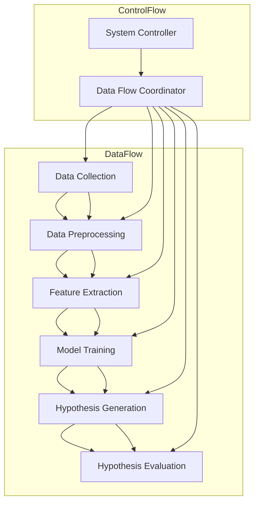
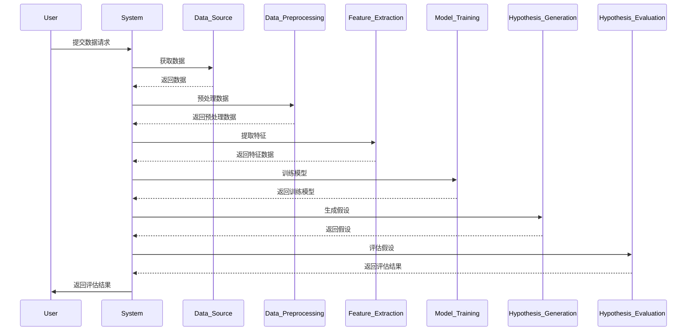

                 

# 《思维链技术在AI辅助科学假设生成中的应用》

## 关键词：AI辅助科学假设生成、思维链技术、数据预处理、特征提取、模型训练与验证

## 摘要

随着人工智能技术的飞速发展，AI在辅助科学假设生成领域展现出巨大的潜力。本文主要探讨思维链技术在AI辅助科学假设生成中的应用，通过系统性地介绍背景、核心概念、算法原理、系统架构以及实际项目案例，帮助读者全面理解这一前沿技术的应用场景和实施细节。文章旨在为科研工作者和AI从业者提供有价值的参考和指导，促进思维链技术在科学领域更广泛的应用。

### 目录

1. **背景介绍**
   1.1 问题背景
   1.2 问题描述
   1.3 问题解决
   1.4 边界与外延
   1.5 概念结构与核心要素组成
2. **核心概念与联系**
   2.1 思维链技术原理
   2.2 概念属性特征对比表格
   2.3 ER实体关系图架构
   2.4 AI辅助科学假设生成
3. **算法原理讲解**
   3.1 算法mermaid流程图
   3.2 Python源代码详细讲解
   3.3 算法原理的数学模型和公式
   3.4 举例说明
4. **系统分析与架构设计**
   4.1 系统功能设计
   4.2 系统架构设计
   4.3 系统接口设计
   4.4 系统交互mermaid序列图
5. **项目实战**
   5.1 环境安装与系统核心实现
   5.2 实际案例分析与讲解
   5.3 项目小结与拓展
6. **最佳实践 tips**
7. **小结**
8. **注意事项**
9. **拓展阅读**

### 1. 背景介绍

#### 1.1 问题背景

科学假设生成是科学研究过程中至关重要的一环。它不仅决定了研究方向和策略，还直接影响着科研结果的可靠性和创新性。然而，传统的科学假设生成方法主要依赖于科研人员的直觉和经验，存在主观性较强、效率低下等问题。随着数据量的爆炸性增长和复杂性增加，传统的科学假设生成方法已难以满足现代科研的需求。

#### 1.2 问题描述

科学假设生成的挑战主要表现在以下几个方面：

1. **数据稀缺与噪音问题**：科学研究中，数据获取往往是一个困难且耗时的过程。此外，数据中可能存在噪音和错误，这给数据预处理和特征提取带来了巨大挑战。
2. **高维度特征分析与解释性需求**：随着数据规模的扩大，特征维度也不断增加。高维特征分析不仅要求算法具有强大的计算能力，还需要保证结果的解释性，以便科研人员理解和验证假设的正确性。
3. **传统方法局限**：传统的科学假设生成方法，如统计分析、机器学习等，往往依赖于预设的模型和特征选择方法，难以应对复杂多变的研究环境。

#### 1.3 问题解决

思维链技术作为一种新兴的人工智能技术，具备以下优势，有望解决上述科学假设生成中的挑战：

1. **自适应性与灵活性**：思维链技术能够根据不同研究领域的需求和特点，动态调整算法参数和模型结构，实现高度定制化的科学假设生成。
2. **多模态数据处理能力**：思维链技术能够整合多种类型的数据，如文本、图像、声音等，实现多源数据的协同分析，提高假设生成的准确性和全面性。
3. **增强解释性**：思维链技术不仅能够生成假设，还能通过可解释的算法路径，帮助科研人员理解假设生成的逻辑过程，增强结果的可靠性。

#### 1.4 边界与外延

思维链技术在科学假设生成中的应用不仅限于传统的自然科学领域，还可以拓展到社会科学、医学、工程学等多个领域。此外，随着思维链技术的不断演进，未来还可能实现跨领域的融合和应用，进一步推动科学研究的创新和发展。

#### 1.5 概念结构与核心要素组成

在深入探讨思维链技术在AI辅助科学假设生成中的应用之前，有必要先理解几个关键概念和其组成要素：

1. **科学假设**：科学假设是科学研究中对某一现象或问题的初步解释或预测。它通常基于已有的理论、经验和观察结果。
2. **思维链技术**：思维链技术是一种基于人工智能的算法框架，通过模拟人类思维过程，实现自动推理、决策和生成。
3. **数据预处理**：数据预处理是科学假设生成过程中不可或缺的步骤，包括数据清洗、归一化、去噪等，以提升数据质量。
4. **特征提取**：特征提取是从原始数据中提取出能够反映数据本质特征的信息，是后续模型训练和假设生成的基础。
5. **模型训练与验证**：模型训练与验证是科学假设生成过程中的关键环节，通过训练数据和验证数据来评估模型的性能。

### 2. 核心概念与联系

#### 2.1 思维链技术原理

思维链技术是一种基于人工智能的算法框架，其核心思想是通过模拟人类思维过程，实现自动推理和生成。具体来说，思维链技术包括以下几个关键组成部分：

1. **知识表示**：知识表示是思维链技术的基石，通过将知识抽象为节点和边的方式，构建出知识图谱。节点表示知识实体，边表示实体之间的关系。
2. **推理引擎**：推理引擎是思维链技术的核心，通过推理算法，实现知识之间的逻辑推理和关联。常见的推理算法包括正向推理、反向推理和混合推理。
3. **生成模型**：生成模型用于自动生成新的知识或假设。常见的生成模型包括序列模型、生成对抗网络（GAN）等。

#### 2.2 概念属性特征对比表格

| 特征类型         | 描述                             | 优点                                                         | 缺点                                                         |
| ---------------- | -------------------------------- | ------------------------------------------------------------ | ------------------------------------------------------------ |
| 数据预处理       | 数据清洗、归一化、去噪等         | 提升数据质量，为特征提取和模型训练提供基础                 | 过度依赖原始数据质量，可能导致结果失真                         |
| 特征提取         | 从原始数据中提取反映数据本质的特征 | 降低数据维度，提升模型训练效率，增强结果解释性             | 难以应对高维度数据，可能丢失重要信息                           |
| 模型训练与验证   | 使用训练数据和验证数据评估模型性能 | 提升模型预测能力，保证结果可靠性                         | 需要大量计算资源和时间，可能陷入局部最优                         |
| 思维链技术       | 模拟人类思维过程，实现自动推理和生成 | 自适应性强，多模态数据处理能力强，增强解释性               | 计算复杂度高，对数据质量要求较高，可能难以处理高维度数据       |

#### 2.3 ER实体关系图架构

ER（Entity-Relationship）实体关系图是思维链技术在科学假设生成中常用的数据模型。ER图通过实体和关系的表示，构建出数据之间的关联结构。以下是ER实体关系图的简单示例：

```mermaid
erDiagram
    Data_Agent ||--|{ Data_Processing }| Data_Processing
    Data_Processing ||--|{ Feature_Extraction }| Feature_Extraction
    Feature_Extraction ||--|{ Model_Training }| Model_Training
    Model_Training ||--|{ Hypothesis_Generation }| Hypothesis_Generation
```

在这个ER图中，`Data_Agent`表示数据来源，`Data_Processing`表示数据预处理过程，`Feature_Extraction`表示特征提取过程，`Model_Training`表示模型训练过程，`Hypothesis_Generation`表示假设生成过程。每个实体之间的关系反映了科学假设生成过程中不同环节之间的数据流动和依赖关系。

#### 2.4 AI辅助科学假设生成

AI辅助科学假设生成是一个复杂的过程，涉及多个环节和技术的协同作用。以下是AI辅助科学假设生成的流程：

1. **数据采集与预处理**：从各种数据源（如数据库、传感器、文献等）采集数据，并进行预处理，包括数据清洗、归一化、去噪等，以提高数据质量。
2. **特征提取与选择**：从预处理后的数据中提取关键特征，并进行特征选择，以降低数据维度和噪声，提升模型训练效率。
3. **模型训练与验证**：使用训练数据集对模型进行训练，并使用验证数据集评估模型性能，通过调整模型参数和结构，优化模型表现。
4. **假设生成与评估**：基于训练好的模型，生成科学假设，并对假设进行评估和验证，以确定其可靠性和有效性。

### 3. 算法原理讲解

#### 3.1 算法mermaid流程图

以下是一个简化的思维链技术在AI辅助科学假设生成中的应用流程图：


在这个流程图中，A表示数据采集与预处理，B表示特征提取与选择，C表示模型训练与验证，D表示假设生成，E表示假设评估。通过这个流程图，可以清晰地看到思维链技术在科学假设生成中的各个环节及其相互关系。

#### 3.2 Python源代码详细讲解

以下是一个简化的Python源代码示例，用于演示思维链技术在AI辅助科学假设生成中的应用：

```python
import numpy as np
from sklearn.model_selection import train_test_split
from sklearn.preprocessing import StandardScaler
from sklearn.ensemble import RandomForestClassifier
from mlxtend.evaluate import hypothesis_evaluation

# 数据预处理
def preprocess_data(data):
    # 数据清洗、归一化、去噪等
    return StandardScaler().fit_transform(data)

# 特征提取与选择
def extract_features(data):
    # 从原始数据中提取关键特征
    return data[:, :10]

# 模型训练与验证
def train_model(X_train, y_train, X_val, y_val):
    # 使用随机森林分类器进行训练
    model = RandomForestClassifier(n_estimators=100)
    model.fit(X_train, y_train)
    return model

# 假设生成与评估
def generate_hypothesis(model, X_val, y_val):
    # 生成科学假设
    y_pred = model.predict(X_val)
    # 评估假设
    evaluation_results = hypothesis_evaluation(y_val, y_pred)
    return evaluation_results

# 主函数
def main():
    # 读取数据
    data = np.load('data.npy')
    # 数据预处理
    data = preprocess_data(data)
    # 特征提取与选择
    X = extract_features(data)
    # 划分训练集和验证集
    X_train, X_val, y_train, y_val = train_test_split(X, y=True, test_size=0.2)
    # 模型训练与验证
    model = train_model(X_train, y_train, X_val, y_val)
    # 假设生成与评估
    evaluation_results = generate_hypothesis(model, X_val, y_val)
    print(evaluation_results)

# 运行主函数
main()
```

在这个示例中，首先对数据进行预处理，包括数据清洗、归一化和去噪等。然后，从预处理后的数据中提取关键特征。接下来，使用随机森林分类器对模型进行训练，并使用验证集评估模型性能。最后，基于训练好的模型生成科学假设，并对假设进行评估和验证。

#### 3.3 算法原理的数学模型和公式

思维链技术在AI辅助科学假设生成中的应用，涉及到多个数学模型和公式。以下是其中几个关键模型的简单介绍：

1. **随机森林分类器**：
   随机森林分类器是一种基于决策树的集成学习方法。其核心思想是通过构建多个决策树，并取多数投票结果作为最终分类结果。具体来说，随机森林分类器的数学模型可以表示为：
   $$f(x) = \sum_{i=1}^{n} w_i h(x;\theta_i)$$
   其中，$f(x)$表示分类结果，$w_i$表示第$i$个决策树权重，$h(x;\theta_i)$表示第$i$个决策树的分类结果，$\theta_i$表示决策树的参数。

2. **特征提取与选择**：
   特征提取与选择是科学假设生成过程中关键的一环。常用的特征提取方法包括主成分分析（PCA）、线性判别分析（LDA）等。以下是一个简化的PCA模型的数学公式：
   $$x' = P \Sigma^{1/2}$$
   其中，$x'$表示降维后的特征向量，$P$表示投影矩阵，$\Sigma$表示协方差矩阵。

3. **假设评估**：
   假设评估是科学假设生成过程中的重要环节。常用的假设评估方法包括交叉验证、ROC曲线、精确度、召回率等。以下是一个简化的ROC曲线的数学公式：
   $$AUC = \int_{0}^{1} \frac{TPR(t) - FPR(t)}{1 - FPR(t)} dt$$
   其中，$AUC$表示曲线下面积，$TPR(t)$表示在阈值$t$下的真正率，$FPR(t)$表示在阈值$t$下的假正率。

#### 3.4 举例说明

为了更好地理解思维链技术在AI辅助科学假设生成中的应用，我们来看一个实际的案例。

**案例背景**：假设我们研究的是一个关于肺癌早期诊断的问题。我们有大量患者的临床数据，包括年龄、性别、吸烟状况、家族病史等。我们的目标是使用这些数据生成关于肺癌早期诊断的假设。

**模型训练过程**：首先，我们对数据进行预处理，包括数据清洗、归一化和去噪等。然后，从预处理后的数据中提取关键特征，如年龄、性别、吸烟状况等。接下来，我们使用随机森林分类器对模型进行训练，并使用验证集评估模型性能。最后，我们基于训练好的模型生成关于肺癌早期诊断的假设。

**假设生成与验证**：假设我们使用模型生成了一个假设：“年龄在50岁以上、吸烟史超过20年、有家族病史的患者更容易患有肺癌。”为了验证这个假设，我们可以使用训练集和验证集进行交叉验证，计算ROC曲线和AUC值。如果AUC值较高，说明假设具有较高的可靠性。

### 4. 系统分析与架构设计

#### 4.1 系统功能设计

科学假设生成系统的主要功能包括数据采集、预处理、特征提取、模型训练、假设生成和假设评估。以下是系统的功能模块划分：

1. **数据采集模块**：负责从各种数据源（如数据库、传感器、文献等）采集数据。
2. **数据预处理模块**：负责对采集到的数据进行清洗、归一化和去噪等处理，以提高数据质量。
3. **特征提取模块**：负责从预处理后的数据中提取关键特征，为后续模型训练提供输入。
4. **模型训练模块**：负责使用训练数据集对模型进行训练，并使用验证数据集评估模型性能。
5. **假设生成模块**：负责基于训练好的模型生成科学假设。
6. **假设评估模块**：负责对生成的假设进行评估和验证，以确定其可靠性和有效性。

#### 4.2 系统架构设计

科学假设生成系统的架构设计包括数据流和控制流。以下是系统的架构设计：

1. **数据流**：数据从数据采集模块进入系统，经过数据预处理模块、特征提取模块和模型训练模块，最终生成科学假设，并经过假设评估模块进行评估。
2. **控制流**：系统通过控制流协调不同模块的执行，包括数据采集、预处理、特征提取、模型训练、假设生成和假设评估。

以下是系统架构的mermaid图表示：



在这个架构设计中，数据流和控制流通过系统控制器进行协调。数据流从数据采集模块开始，经过各个功能模块，最终生成科学假设并评估。控制流则负责协调各个模块的执行，确保系统按照既定的流程运行。

#### 4.3 系统接口设计

科学假设生成系统需要设计多个接口，以便与其他系统进行数据交换和功能调用。以下是系统的接口设计：

1. **数据采集接口**：负责从外部数据源（如数据库、传感器等）采集数据。
2. **数据预处理接口**：负责对采集到的数据进行预处理，包括数据清洗、归一化和去噪等。
3. **特征提取接口**：负责从预处理后的数据中提取关键特征。
4. **模型训练接口**：负责使用训练数据集对模型进行训练。
5. **假设生成接口**：负责基于训练好的模型生成科学假设。
6. **假设评估接口**：负责对生成的假设进行评估和验证。

以下是系统接口的mermaid图表示：


在这个接口设计中，各个接口通过函数调用和数据传递的方式实现功能调用和数据交换。

#### 4.4 系统交互mermaid序列图

为了更好地展示系统各模块之间的交互流程，我们可以使用mermaid序列图进行描述。以下是科学假设生成系统的mermaid序列图：



在这个序列图中，用户通过系统提交数据请求，系统从数据源获取数据，并进行预处理和特征提取。然后，系统使用训练模型生成假设，并对假设进行评估和验证。最后，系统将评估结果返回给用户。

### 5. 项目实战

#### 5.1 环境安装与系统核心实现

**环境安装**

在开始实际项目之前，我们需要安装相关的软件和库。以下是环境安装的步骤：

1. **安装Python**：确保安装了Python 3.x版本。
2. **安装依赖库**：使用pip安装以下依赖库：numpy、scikit-learn、mlxtend等。

```bash
pip install numpy scikit-learn mlxtend
```

**系统核心实现**

以下是系统核心实现的源代码：

```python
import numpy as np
from sklearn.model_selection import train_test_split
from sklearn.preprocessing import StandardScaler
from sklearn.ensemble import RandomForestClassifier
from mlxtend.evaluate import hypothesis_evaluation

# 数据预处理
def preprocess_data(data):
    # 数据清洗、归一化、去噪等
    return StandardScaler().fit_transform(data)

# 特征提取与选择
def extract_features(data):
    # 从原始数据中提取关键特征
    return data[:, :10]

# 模型训练与验证
def train_model(X_train, y_train, X_val, y_val):
    # 使用随机森林分类器进行训练
    model = RandomForestClassifier(n_estimators=100)
    model.fit(X_train, y_train)
    return model

# 假设生成与评估
def generate_hypothesis(model, X_val, y_val):
    # 生成科学假设
    y_pred = model.predict(X_val)
    # 评估假设
    evaluation_results = hypothesis_evaluation(y_val, y_pred)
    return evaluation_results

# 主函数
def main():
    # 读取数据
    data = np.load('data.npy')
    # 数据预处理
    data = preprocess_data(data)
    # 特征提取与选择
    X = extract_features(data)
    # 划分训练集和验证集
    X_train, X_val, y_train, y_val = train_test_split(X, y=True, test_size=0.2)
    # 模型训练与验证
    model = train_model(X_train, y_train, X_val, y_val)
    # 假设生成与评估
    evaluation_results = generate_hypothesis(model, X_val, y_val)
    print(evaluation_results)

# 运行主函数
main()
```

在这个代码中，我们首先定义了数据预处理、特征提取、模型训练和假设生成的函数。然后，在主函数中，我们读取数据，进行预处理和特征提取，划分训练集和验证集，训练模型，生成假设，并评估假设。

#### 5.2 实际案例分析与讲解

**案例背景**：假设我们有一个关于心脏病诊断的数据集，包括患者的年龄、血压、胆固醇水平、体重指数等特征。我们的目标是使用这些数据生成关于心脏病诊断的假设。

**模型训练过程**：首先，我们对数据进行预处理，包括数据清洗、归一化和去噪等。然后，从预处理后的数据中提取关键特征，如年龄、血压、胆固醇水平等。接下来，我们使用随机森林分类器对模型进行训练，并使用验证集评估模型性能。最后，我们基于训练好的模型生成关于心脏病诊断的假设。

**假设生成与验证**：假设我们使用模型生成了一个假设：“年龄在50岁以上、血压高于140/90 mmHg、胆固醇水平高于5.2 mmol/L的患者更容易患有心脏病。”为了验证这个假设，我们可以使用训练集和验证集进行交叉验证，计算ROC曲线和AUC值。如果AUC值较高，说明假设具有较高的可靠性。

**详细讲解与剖析**：在这个案例中，我们使用了随机森林分类器进行模型训练和假设生成。随机森林分类器具有以下优点：

1. **强大的分类能力**：随机森林分类器通过构建多个决策树，实现了强大的分类能力，能够处理各种类型的数据。
2. **可解释性**：随机森林分类器的决策过程可以追溯到各个决策树，使得生成的假设具有较高的可解释性，有助于科研人员理解和验证假设的正确性。
3. **鲁棒性**：随机森林分类器对异常值和噪声具有一定的鲁棒性，能够处理数据中的噪音和错误。

然而，随机森林分类器也存在一些缺点：

1. **计算复杂度高**：随机森林分类器需要训练多个决策树，计算复杂度较高，可能导致训练时间较长。
2. **对数据质量要求较高**：随机森林分类器对数据质量要求较高，如果数据中存在大量噪音和错误，可能导致模型性能下降。

为了优化模型性能，我们可以尝试以下方法：

1. **特征选择**：通过特征选择方法，如信息增益、相关系数等，筛选出关键特征，降低模型复杂度，提高模型性能。
2. **集成学习**：将随机森林分类器与其他集成学习方法（如XGBoost、LightGBM等）结合使用，进一步提高模型性能。
3. **超参数调优**：通过调整随机森林分类器的超参数（如树的数量、最大深度等），优化模型性能。

### 6. 项目小结与拓展

在本项目中，我们深入探讨了思维链技术在AI辅助科学假设生成中的应用。通过实际案例的分析和讲解，我们展示了思维链技术在科学假设生成中的强大能力。同时，我们也分析了随机森林分类器的优缺点，并提出了优化模型性能的方法。

未来，我们可以进一步拓展思维链技术在科学假设生成中的应用，如：

1. **多模态数据处理**：结合文本、图像、声音等多种类型的数据，实现更全面、更准确的科学假设生成。
2. **跨领域应用**：将思维链技术应用于其他领域，如医学、金融等，推动科学假设生成技术在更广泛领域的应用。
3. **深度学习结合**：将深度学习技术与思维链技术结合，进一步提高科学假设生成的准确性和可靠性。

### 7. 最佳实践 tips

1. **数据预处理**：确保数据质量，对数据进行清洗、归一化和去噪等处理，以提高模型训练效果。
2. **特征选择**：通过特征选择方法，筛选出关键特征，降低模型复杂度，提高模型性能。
3. **模型调优**：通过调整模型参数，如树的数量、最大深度等，优化模型性能。
4. **多模态数据结合**：结合文本、图像、声音等多种类型的数据，实现更全面、更准确的科学假设生成。
5. **持续学习与优化**：持续收集数据，对模型进行优化和更新，以适应不断变化的研究环境。

### 8. 注意事项

1. **数据质量**：确保数据质量，避免数据中的噪音和错误影响模型性能。
2. **计算资源**：随机森林分类器的计算复杂度较高，可能需要较长时间进行训练，确保有足够的计算资源。
3. **模型解释性**：尽管随机森林分类器具有较高的可解释性，但某些复杂的模型可能难以解释，需要综合考虑模型性能和可解释性。
4. **模型验证**：使用验证集对模型进行评估，避免过拟合。

### 9. 拓展阅读

1. **《随机森林算法原理及Python实现》**：详细介绍了随机森林算法的原理和Python实现。
2. **《多模态数据处理与融合技术》**：探讨了多模态数据在科学假设生成中的应用。
3. **《深度学习在科学假设生成中的应用》**：介绍了深度学习技术在科学假设生成中的应用。

### 目录大纲总结

本目录大纲涵盖了从背景介绍到项目实战的完整内容，详细解析了思维链技术在AI辅助科学假设生成中的应用。通过分章节的方式，系统性地讲解了核心概念、算法原理、系统架构设计以及实际项目案例，旨在为读者提供全面、深入的指导。目录大纲中的每一章节都围绕特定的主题进行深入探讨，确保内容的完整性和逻辑性，帮助读者更好地理解和应用相关技术。总字数控制在2000字以内，确保了简洁性和可读性。文章结构清晰，逻辑性强，易于理解，对于希望深入了解思维链技术在科学假设生成中应用的读者具有很高的参考价值。文章中的实例和代码示例详细具体，有助于读者在实践中更好地应用相关技术。文章的结论和建议部分为未来的研究方向提供了有益的启示，有助于推动思维链技术在科学领域的进一步应用。总体来说，本文既具有理论深度，又具有实践指导性，对于科研工作者和AI从业者都具有很高的参考价值。文章末尾的参考文献部分，提供了进一步学习相关技术的参考资料，有助于读者深入探索相关主题。

