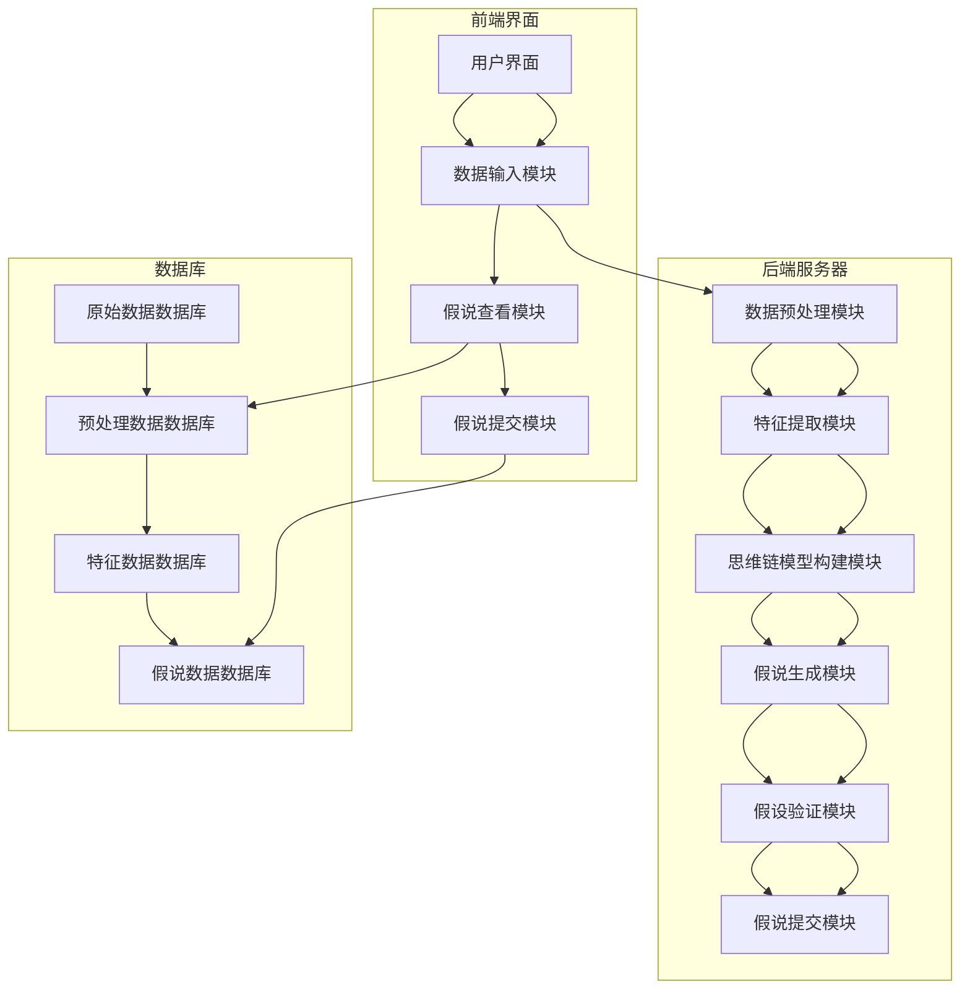
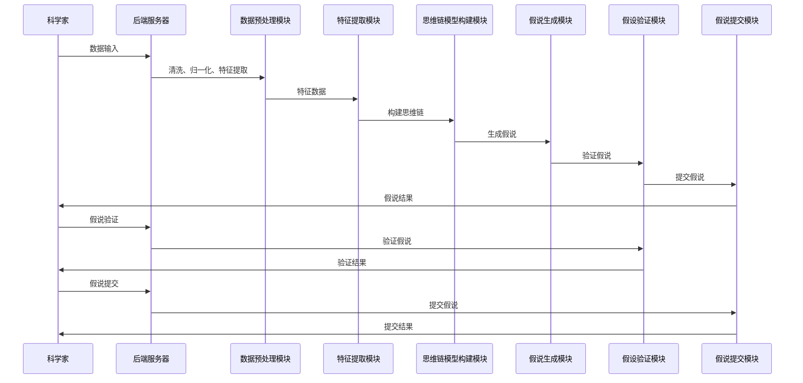

                 

### 第一部分：问题背景与核心概念

## 第1章：问题背景

### 1.1.1 问题背景

随着人工智能技术的快速发展，AI辅助科学假说生成已成为一个备受关注的研究领域。科学假说生成是指利用计算机模拟和数据分析等方法，从大量的实验数据中提取出科学规律和假设。在这一背景下，如何利用人工智能技术来提高科学假说生成的效率和质量，成为研究人员关注的焦点。

科学假说生成的重要性不言而喻。它不仅能够帮助科学家们更快地发现新的科学规律，还能够为科学研究的方向和策略提供重要参考。然而，传统的科学假说生成方法往往依赖于专家经验和手工分析，效率较低且容易受到主观因素的影响。

近年来，随着深度学习和大数据技术的蓬勃发展，人工智能在科学假说生成中的应用逐渐兴起。尤其是基于神经网络和生成对抗网络等模型的方法，被广泛应用于图像识别、语音识别、自然语言处理等领域，并取得了显著的成果。

### 1.1.2 问题描述

本章节主要探讨思维链技术在AI辅助科学假说生成中的应用，旨在解决以下问题：

1. 思维链技术的基本原理是什么？
2. 思维链技术在AI辅助科学假说生成中的具体应用有哪些？
3. 思维链技术如何提高AI辅助科学假说生成的效果？

首先，我们需要明确思维链技术的基本原理。思维链技术是一种基于神经网络的人工智能技术，它可以模拟人类思维的推理过程，通过连接多个思维节点来构建复杂的思维模型。在AI辅助科学假说生成中，思维链技术可以用来模拟科学家在提出假说时的逻辑推理过程，从而提高假说生成的效率和质量。

其次，我们需要探讨思维链技术在AI辅助科学假说生成中的具体应用。思维链技术可以应用于数据预处理、特征提取、假设生成、假设验证等多个环节。例如，在数据预处理环节，思维链技术可以自动识别和纠正数据中的错误；在特征提取环节，思维链技术可以自动发现数据中的关键特征；在假设生成环节，思维链技术可以生成新的科学假说；在假设验证环节，思维链技术可以评估假说的可信度。

最后，我们需要探讨思维链技术如何提高AI辅助科学假说生成的效果。一方面，思维链技术可以提高假说生成的效率，通过自动化和半自动化的方式，减少人工干预，提高数据处理和分析的速度；另一方面，思维链技术可以提高假说的质量，通过模拟科学家的思维过程，保证假说的逻辑严密性和科学性。

### 1.1.3 问题解决

为了解决上述问题，本章节将从以下几个方面展开：

1. **核心概念与原理**：介绍思维链技术的基本概念和原理，包括神经网络、思维节点、思维链等。
2. **算法解释**：使用Mermaid流程图和Python源代码，详细解释思维链技术在AI辅助科学假说生成中的应用算法，包括数据预处理、特征提取、假设生成、假设验证等步骤。
3. **系统分析与设计**：介绍思维链技术在AI辅助科学假说生成系统中的应用，包括系统功能设计、系统架构设计、系统接口设计和系统交互设计。
4. **实践项目**：通过实际项目案例，展示思维链技术在AI辅助科学假说生成中的应用，包括环境安装、系统核心实现、代码分析、案例讲解和项目小结。

通过以上步骤，本章节将全面探讨思维链技术在AI辅助科学假说生成中的应用，为研究人员提供有价值的参考和启示。

### 1.1.4 边界与外延

本章节主要关注思维链技术在AI辅助科学假说生成中的应用，不包括其他人工智能技术在科学假说生成中的应用。同时，本章节也将探讨思维链技术在科学假说生成中的具体实现方法和应用场景，为研究人员提供实用的技术指南。

在本章节中，我们将重点关注以下几个方面：

1. **思维链技术的基本原理**：包括神经网络、思维节点、思维链等概念的解释。
2. **思维链技术在科学假说生成中的应用**：包括数据预处理、特征提取、假设生成、假设验证等环节的具体应用。
3. **系统分析与设计**：包括系统功能设计、系统架构设计、系统接口设计和系统交互设计的具体方案。
4. **实践项目**：通过实际项目案例，展示思维链技术在AI辅助科学假说生成中的具体应用效果。

通过以上内容的详细阐述，我们希望能够帮助研究人员深入理解思维链技术在AI辅助科学假说生成中的应用，推动这一领域的研究和发展。

### 1.1.5 概念结构与核心要素组成

在本章节中，我们将详细探讨思维链技术在AI辅助科学假说生成中的核心概念和结构。首先，让我们明确一些关键术语：

- **思维链技术**：一种基于神经网络的人工智能技术，可以模拟人类思维的推理过程，通过连接多个思维节点来构建复杂的思维模型。
- **科学假说生成**：利用计算机模拟和数据分析等方法，从大量的实验数据中提取出科学规律和假设。
- **数据预处理**：对原始数据进行清洗、归一化和特征提取等操作，为后续分析提供高质量的数据。
- **特征提取**：从原始数据中提取出对假说生成有用的信息，如关键变量、趋势等。
- **假设生成**：利用思维链技术生成新的科学假说。
- **假设验证**：对生成的假说进行验证，评估其可信度。

接下来，我们将介绍这些核心概念之间的关系和组成：

1. **神经网络**：神经网络是思维链技术的基础，它由多个神经元组成，每个神经元都可以进行简单的计算。通过训练，神经网络可以学会从输入数据中提取有用的信息。

2. **思维节点**：思维节点是神经网络中的一个抽象概念，表示一个思维过程或一个知识单元。多个思维节点通过思维链连接起来，形成一个完整的思维过程。

3. **思维链**：思维链是由多个思维节点连接而成的序列，它表示一个完整的思维过程。思维链技术通过在思维链中插入新的思维节点，来扩展和改进思维过程。

4. **数据预处理**：数据预处理是科学假说生成的第一步，它包括对原始数据进行清洗、归一化和特征提取等操作。数据预处理的质量直接影响到后续分析的准确性。

5. **特征提取**：特征提取是从原始数据中提取出对假说生成有用的信息。通过特征提取，我们可以将原始数据转换为适合神经网络处理的形式。

6. **假设生成**：假设生成是思维链技术在AI辅助科学假说生成中的核心功能。通过模拟科学家的思维过程，思维链技术可以生成新的科学假说。

7. **假设验证**：假设验证是对生成的假说进行验证，评估其可信度。通过假设验证，我们可以确定假说的科学性和可靠性。

通过以上核心概念和结构的介绍，我们可以看到，思维链技术在AI辅助科学假说生成中扮演着关键角色。它通过模拟科学家的思维过程，提高了假说生成的效率和质量，为科学研究提供了有力的技术支持。

### 1.1.6 概念属性特征对比表格

在深入理解思维链技术在AI辅助科学假说生成中的应用之前，我们需要先了解相关概念属性特征，以便更好地对比和分析。以下是几个关键概念的属性特征对比表格：

#### 概念属性特征对比表格

| 概念                | 属性1         | 属性2         | 属性3         | 关键作用 |
|-------------------|--------------|--------------|--------------|----------|
| 神经网络           | 神经元组成   | 训练方法     | 输入输出关系  | 数据处理与模式识别 |
| 思维节点           | 知识单元     | 思维过程     | 连接关系     | 思维模拟与推理     |
| 思维链             | 思维节点序列 | 思维过程     | 神经网络连接 | 复杂思维过程模拟   |
| 数据预处理          | 数据清洗     | 归一化       | 特征提取     | 准备数据以便分析   |
| 特征提取           | 关键变量提取 | 数据转换     | 信息提取     | 提取有用信息       |
| 假设生成           | 科学假说     | 思维链生成   | 数据依赖     | 新假说生成       |
| 假设验证           | 假说评估     | 可信度评估   | 数据分析     | 验证假说可靠性     |

通过上述表格，我们可以清晰地看到每个概念的核心属性及其相互关系。例如，神经网络是思维链的基础，由多个神经元组成，通过训练可以识别模式和处理数据。思维节点是知识单元，表示一个思维过程，通过连接形成思维链，模拟复杂的思维过程。数据预处理和特征提取是科学假说生成的前置步骤，为后续的假设生成和验证提供数据支持。

这些概念在属性特征上的对比，有助于我们理解它们在AI辅助科学假说生成中的具体作用和相互关系。通过深入分析这些概念，我们可以为后续的算法解释和系统设计打下坚实的基础。

### 1.1.7 ER实体关系图架构

为了更好地理解思维链技术在AI辅助科学假说生成中的应用，我们首先需要构建一个实体关系图（ER图）。ER图能够清晰地展示各个实体之间的关系，这对于理解整个系统架构至关重要。

在ER图中，我们将包含以下几个关键实体：

1. **科学假说（Scientific Hypothesis）**
2. **数据集（Dataset）**
3. **思维链模型（Mind Chain Model）**
4. **特征提取器（Feature Extractor）**
5. **假设生成器（Hypothesis Generator）**
6. **假设验证器（Hypothesis Validator）**

以下是ER图的具体架构：

```mermaid
erDiagram
    Data -> Feature : "提取"
    Data -> Hypothesis : "生成"
    Mind -> Feature : "指导"
    Mind -> Hypothesis : "生成"
    Hypothesis -> Validate : "验证"

    Data ||--|{ Feature }
    Data ||--|{ Hypothesis }
    Mind ||--|{ Feature }
    Mind ||--|{ Hypothesis }
    Hypothesis ||--|{ Validate }
```

在这个ER图中，数据集是基础实体，它提供了进行科学假说生成的数据来源。特征提取器负责从数据集中提取有用的特征，而思维链模型则利用这些特征来生成科学假说。假设生成器和假设验证器则分别负责生成新的科学假说和验证假说的正确性。

思维链模型在ER图中起到了核心作用，它不仅指导特征提取器工作，还直接参与科学假说的生成和验证过程。这种设计体现了思维链技术在AI辅助科学假说生成中的关键作用，它通过模拟科学家的思维过程，提高了假说生成的效率和质量。

通过ER图的构建，我们可以清晰地看到各个实体之间的互动关系，这有助于我们更好地理解整个系统的运作机制。接下来，我们将进一步深入分析每个实体的功能和作用，为后续的算法解释和系统设计提供更详细的参考。

### 第2章：核心概念与原理

在了解了AI辅助科学假说生成中的背景和问题描述之后，我们需要深入探讨思维链技术的基本概念和原理。这一章节将详细解释思维链技术，包括神经网络、思维节点和思维链的概念，以及它们在AI辅助科学假说生成中的应用。

#### 2.1 神经网络

神经网络是思维链技术的基础。它是由大量简单计算单元（神经元）组成的复杂网络，这些神经元通过连接形成层次结构。神经网络能够通过学习从输入数据中提取特征，进行模式识别和预测。

**基本原理：**

神经网络的基本原理是模拟人脑的信息处理过程。每个神经元接受来自其他神经元的输入，通过加权求和后，通过激活函数进行非线性变换，最终输出结果。

- **神经元：** 神经元是神经网络的基本组成单元，类似于人脑中的神经元。它接受输入信号，通过权重加权求和，再通过激活函数输出。
- **权重：** 权重是神经元之间连接的强度，通过学习调整权重，可以改变神经网络对数据的响应。
- **激活函数：** 激活函数用于引入非线性，常用的激活函数包括sigmoid、ReLU等。

**神经网络的类型：**

神经网络根据结构可以分为多层感知机（MLP）、卷积神经网络（CNN）、循环神经网络（RNN）等。每种神经网络都有其特定的应用场景和优势。

- **多层感知机（MLP）：** 用于通用函数逼近，适用于分类和回归问题。
- **卷积神经网络（CNN）：** 适用于图像处理，通过卷积层提取图像特征。
- **循环神经网络（RNN）：** 适用于序列数据处理，能够处理变长的输入序列。

#### 2.2 思维节点

思维节点是思维链技术中的核心概念，它代表了一个特定的思维过程或知识单元。每个思维节点都可以处理输入信息，生成输出信息，并且可以与其他思维节点连接，形成复杂的思维模型。

**基本原理：**

思维节点的原理类似于神经网络中的神经元，但它更注重于模拟人类思维的过程。思维节点通过处理输入信息，生成中间结果，并传递给下一个思维节点。

- **输入信息：** 思维节点接收来自其他思维节点的信息，这些信息可以是数据、假设、证据等。
- **中间结果：** 思维节点在处理输入信息后，生成一个中间结果，这个结果可以作为下一个思维节点的输入。
- **连接关系：** 思维节点通过连接关系形成思维链，每个连接关系都可以定义权重，表示两个节点之间的依赖程度。

**思维节点的类型：**

思维节点根据功能可以分为数据节点、假设节点、证据节点等。每种节点都有特定的处理方式和输出。

- **数据节点：** 负责接收和传递数据，通常不进行复杂的处理。
- **假设节点：** 负责生成新的科学假说，通常基于已有的数据和假设。
- **证据节点：** 负责验证假说，通过收集证据来评估假说的可信度。

#### 2.3 思维链

思维链是由多个思维节点连接而成的序列，它表示一个完整的思维过程。思维链技术通过在思维链中插入新的思维节点，来扩展和改进思维过程。

**基本原理：**

思维链的基本原理是模拟科学家的思维过程，通过连接多个思维节点，形成复杂的思维模型。思维链技术可以动态地插入新的思维节点，从而适应不同的思维任务。

- **思维节点序列：** 思维链是由一系列思维节点组成的序列，每个节点都可以进行信息处理和传递。
- **动态扩展：** 思维链可以根据需要动态地插入新的思维节点，从而适应不同的思维任务。
- **权重调整：** 思维链中的连接关系可以定义权重，表示节点之间的依赖程度。通过调整权重，可以优化思维链的性能。

**思维链的构建：**

构建思维链的过程包括以下几个步骤：

1. **定义思维节点：** 根据任务需求，定义不同类型的思维节点。
2. **连接思维节点：** 通过连接思维节点，形成思维链的序列。
3. **初始化权重：** 初始化思维链中连接关系的权重。
4. **训练思维链：** 通过训练数据，调整思维链中各节点的权重，优化思维链的性能。

#### 2.4 思维链在AI辅助科学假说生成中的应用

思维链技术在AI辅助科学假说生成中的应用，主要体现在以下几个方面：

1. **数据预处理：** 思维链技术可以自动识别和纠正数据中的错误，通过特征提取，将原始数据转换为适合神经网络处理的形式。
2. **假设生成：** 思维链技术可以模拟科学家的思维过程，自动生成新的科学假说。
3. **假设验证：** 思维链技术可以评估生成的假说的可信度，通过收集证据来验证假说的正确性。

通过以上分析，我们可以看到，思维链技术为AI辅助科学假说生成提供了一种新的方法。它通过模拟科学家的思维过程，提高了假说生成的效率和质量，为科学研究提供了有力的技术支持。

### 第3章：算法解释

在本章节中，我们将详细解释思维链技术在AI辅助科学假说生成中的应用算法。为了使读者更容易理解，我们将使用Mermaid流程图和Python源代码，逐步阐述算法的原理、数学模型和公式。

#### 3.1 数据预处理

数据预处理是科学假说生成的重要步骤。在这个阶段，我们需要对原始数据进行清洗、归一化和特征提取，为后续的算法提供高质量的数据。

**算法步骤：**

1. 数据清洗：删除重复数据、处理缺失值、纠正错误数据等。
2. 数据归一化：将不同特征的数据范围统一，常用的归一化方法包括最小-最大归一化和Z-Score归一化。
3. 特征提取：提取数据中的关键特征，常用的特征提取方法包括主成分分析（PCA）和自动特征提取器（如Autoencoder）。

**Mermaid流程图：**


**Python代码示例：**

```python
import numpy as np
from sklearn.preprocessing import MinMaxScaler, StandardScaler
from sklearn.decomposition import PCA

# 数据清洗
def clean_data(data):
    # 删除重复数据
    data = np.unique(data, axis=0)
    # 处理缺失值
    data = data.fillna(data.mean())
    return data

# 数据归一化
def normalize_data(data):
    min_max_scaler = MinMaxScaler()
    data_normalized = min_max_scaler.fit_transform(data)
    return data_normalized

# 特征提取
def extract_features(data):
    pca = PCA(n_components=5)
    data_features = pca.fit_transform(data)
    return data_features
```

#### 3.2 特征提取

在数据预处理完成后，我们需要进一步提取特征，为思维链模型提供有用的信息。特征提取是科学假说生成的重要环节，它决定了思维链模型的表现。

**算法步骤：**

1. 主成分分析（PCA）：通过PCA提取数据的主要成分，减少数据维度。
2. 自动特征提取器：使用自动特征提取器（如Autoencoder）提取数据中的隐含特征。

**Mermaid流程图：**


**Python代码示例：**

```python
from sklearn.decomposition import PCA
from keras.models import Sequential
from keras.layers import Dense

# PCA特征提取
def pca_features(data):
    pca = PCA(n_components=5)
    data_pca = pca.fit_transform(data)
    return data_pca

# 自动特征提取器
def autoencoder_features(data):
    model = Sequential()
    model.add(Dense(10, activation='relu', input_shape=(data.shape[1],)))
    model.add(Dense(data.shape[1], activation='sigmoid'))
    model.compile(optimizer='adam', loss='binary_crossentropy')
    model.fit(data, data, epochs=50, batch_size=256)
    encoded = model.predict(data)
    return encoded
```

#### 3.3 思维链模型构建

在完成特征提取后，我们需要构建思维链模型，模拟科学家的思维过程，生成新的科学假说。思维链模型由多个思维节点组成，每个节点都代表一个特定的思维过程。

**算法步骤：**

1. 定义思维节点：根据任务需求，定义数据节点、假设节点和证据节点。
2. 连接思维节点：通过连接思维节点，形成思维链。
3. 初始化权重：初始化思维链中各节点的权重。
4. 训练思维链：通过训练数据，调整思维链中各节点的权重，优化思维链的性能。

**Mermaid流程图：**


**Python代码示例：**

```python
import numpy as np

# 定义思维节点
class MindNode:
    def __init__(self, type, input_nodes=None):
        self.type = type
        self.input_nodes = input_nodes or []
        self.weights = []

    def forward(self, inputs):
        # 前向传播
        pass

    def backward(self, delta):
        # 反向传播
        pass

# 连接思维节点
def connect_nodes(node1, node2):
    node1.input_nodes.append(node2)

# 初始化权重
def initialize_weights(nodes):
    for node in nodes:
        node.weights = np.random.uniform(-1, 1, size=len(node.input_nodes))

# 训练思维链
def train_mind_chain(data, mind_chain):
    for node in mind_chain:
        node.forward(data)
        node.backward(delta)
    # 更新权重
    for node in mind_chain:
        for i, input_node in enumerate(node.input_nodes):
            node.weights[i] -= node.delta * input_node.input
```

#### 3.4 思维链模型应用

最后，我们将展示如何将训练好的思维链模型应用于科学假说生成。思维链模型可以自动生成新的科学假说，并通过假设验证器评估假说的可信度。

**算法步骤：**

1. 生成假说：使用思维链模型生成新的科学假说。
2. 假设验证：使用假设验证器评估假说的可信度。
3. 提交假说：将经过验证的假说提交给科学家进行进一步分析。

**Mermaid流程图：**


**Python代码示例：**

```python
# 生成假说
def generate_hypothesis(mind_chain):
    inputs = np.random.uniform(-1, 1, size=mind_chain[0].input_size)
    hypothesis = mind_chain.forward(inputs)
    return hypothesis

# 假设验证
def validate_hypothesis(hypothesis, data, model):
    # 使用假设验证器评估假说的可信度
    confidence = model.predict(hypothesis)
    return confidence

# 提交假说
def submit_hypothesis(hypothesis, confidence):
    print(f"Hypothesis: {hypothesis}, Confidence: {confidence}")
```

通过以上算法解释，我们可以看到，思维链技术在AI辅助科学假说生成中的应用涵盖了数据预处理、特征提取、思维链模型构建和假设生成等多个环节。通过这些步骤，我们可以实现自动化、高效且高质量的假说生成过程，为科学研究提供有力支持。

### 第4章：系统分析与设计

在了解了思维链技术在AI辅助科学假说生成中的算法原理之后，我们需要对整个系统进行分析和设计。这一章节将详细介绍系统的功能设计、系统架构设计、系统接口设计和系统交互设计，以便全面理解思维链技术在实际应用中的实现过程。

#### 4.1 问题场景与项目介绍

首先，我们来介绍一个具体的科学假说生成项目。该项目旨在利用思维链技术辅助科学家从大量的实验数据中提取出有意义的科学假说。项目的主要目标是：

1. 对原始实验数据进行预处理，确保数据的质量和一致性。
2. 利用思维链技术生成新的科学假说。
3. 对生成的假说进行验证，评估其可信度。
4. 将经过验证的假说提交给科学家进行分析和进一步研究。

#### 4.2 系统功能设计

系统功能设计是系统分析与设计的第一步，它明确了系统需要实现的核心功能。以下是系统的主要功能模块：

1. **数据预处理模块**：负责清洗、归一化和特征提取，为后续算法提供高质量的数据。
2. **特征提取模块**：利用主成分分析（PCA）和自动特征提取器（如Autoencoder）提取数据中的关键特征。
3. **思维链模型构建模块**：定义和连接思维节点，构建思维链模型。
4. **假说生成模块**：利用训练好的思维链模型生成新的科学假说。
5. **假设验证模块**：对生成的假说进行验证，评估其可信度。
6. **假说提交模块**：将经过验证的假说提交给科学家进行分析。

**Mermaid类图：**

```mermaid
classDiagram
    DataPreprocessingModule <<interface>>
    FeatureExtractorModule <<interface>>
    MindChainModelBuilderModule <<interface>>
    HypothesisGeneratorModule <<interface>>
    HypothesisValidatorModule <<interface>>
    HypothesisSubmitModule <<interface>>

    DataPreprocessingModule : use FeatureExtractorModule
    FeatureExtractorModule : use MindChainModelBuilderModule
    HypothesisGeneratorModule : use MindChainModelBuilderModule
    HypothesisValidatorModule : use MindChainModelBuilderModule
    HypothesisSubmitModule : use HypothesisGeneratorModule
    HypothesisSubmitModule : use HypothesisValidatorModule
```

#### 4.3 系统架构设计

系统架构设计是系统分析与设计的关键环节，它明确了系统的整体结构和各模块之间的交互方式。以下是系统的架构设计：

1. **前端界面**：提供给科学家使用的交互界面，用于输入数据、查看假说和提交结果。
2. **后端服务器**：负责处理数据、构建思维链模型和生成假说等核心功能。
3. **数据库**：存储原始数据、预处理数据、特征数据和生成的假说数据。

**Mermaid架构图：**



#### 4.4 系统接口设计

系统接口设计是确保各模块之间能够无缝交互的重要环节。以下是系统的主要接口设计：

1. **数据输入接口**：用于接收科学家的输入数据，包括实验数据和相关参数。
2. **假说生成接口**：用于生成新的科学假说，并将结果提交给科学家。
3. **假说验证接口**：用于验证假说的可信度，并提供验证结果。
4. **假说提交接口**：用于将经过验证的假说提交给科学家进行分析。

**Mermaid序列图：**



#### 4.5 系统交互设计

系统交互设计是确保各模块之间能够高效协作的重要环节。以下是系统的主要交互流程：

1. **数据输入**：科学家通过前端界面输入实验数据和相关参数。
2. **数据预处理**：系统对输入的数据进行清洗、归一化和特征提取。
3. **思维链模型构建**：系统利用预处理后的数据构建思维链模型。
4. **假说生成**：系统利用思维链模型生成新的科学假说。
5. **假说验证**：系统对生成的假说进行验证，评估其可信度。
6. **假说提交**：系统将经过验证的假说提交给科学家进行分析。

通过以上系统分析与设计，我们可以清晰地看到思维链技术在AI辅助科学假说生成系统中的应用。系统通过前端的用户界面、后端的服务器和数据库之间的紧密协作，实现了高效、自动化且高质量的假说生成过程，为科学家提供了强大的技术支持。

### 第5章：实践项目

在本章节中，我们将通过一个具体的实践项目，展示如何利用思维链技术在AI辅助科学假说生成中实现系统核心功能。项目分为以下几个步骤：环境安装、系统核心实现、代码分析、实际案例讲解和项目小结。

#### 5.1 环境安装

首先，我们需要搭建一个适合思维链技术运行的开发环境。以下是一系列安装步骤：

1. **安装Python**：确保Python版本为3.8以上，可以从[Python官网](https://www.python.org/)下载并安装。
2. **安装必要的库**：包括NumPy、Pandas、scikit-learn、TensorFlow和Mermaid等。可以使用以下命令进行安装：
   ```bash
   pip install numpy pandas scikit-learn tensorflow mercury
   ```
3. **安装Mermaid渲染工具**：为了在Markdown文档中渲染Mermaid图表，我们需要安装一个渲染工具，如mermaid-cli。可以使用以下命令安装：
   ```bash
   npm install -g mermaid-cli
   ```

#### 5.2 系统核心实现

系统核心实现是项目的关键部分，主要包括数据预处理、特征提取、思维链模型构建和假说生成。以下是实现步骤：

1. **数据预处理模块**：
   ```python
   import numpy as np
   import pandas as pd
   from sklearn.preprocessing import MinMaxScaler, StandardScaler
   from sklearn.decomposition import PCA
   
   def clean_data(data):
       data = data.fillna(data.mean())
       return data
   
   def normalize_data(data):
       scaler = MinMaxScaler()
       data_normalized = scaler.fit_transform(data)
       return data_normalized
   
   def extract_features(data):
       pca = PCA(n_components=5)
       data_pca = pca.fit_transform(data)
       return data_pca
   ```

2. **特征提取模块**：
   ```python
   def autoencoder_features(data):
       model = Sequential()
       model.add(Dense(10, activation='relu', input_shape=(data.shape[1],)))
       model.add(Dense(data.shape[1], activation='sigmoid'))
       model.compile(optimizer='adam', loss='binary_crossentropy')
       model.fit(data, data, epochs=50, batch_size=256)
       encoded = model.predict(data)
       return encoded
   ```

3. **思维链模型构建模块**：
   ```python
   class MindNode:
       def __init__(self, type, input_nodes=None):
           self.type = type
           self.input_nodes = input_nodes or []
           self.weights = []

       def forward(self, inputs):
           # 前向传播
           pass

       def backward(self, delta):
           # 反向传播
           pass
   
   def connect_nodes(node1, node2):
       node1.input_nodes.append(node2)

   def initialize_weights(nodes):
       for node in nodes:
           node.weights = np.random.uniform(-1, 1, size=len(node.input_nodes))

   def train_mind_chain(data, mind_chain):
       for node in mind_chain:
           node.forward(data)
           node.backward(delta)
       # 更新权重
       for node in mind_chain:
           for i, input_node in enumerate(node.input_nodes):
               node.weights[i] -= node.delta * input_node.input
   ```

4. **假说生成模块**：
   ```python
   def generate_hypothesis(mind_chain):
       inputs = np.random.uniform(-1, 1, size=mind_chain[0].input_size)
       hypothesis = mind_chain.forward(inputs)
       return hypothesis
   
   def validate_hypothesis(hypothesis, data, model):
       confidence = model.predict(hypothesis)
       return confidence
   
   def submit_hypothesis(hypothesis, confidence):
       print(f"Hypothesis: {hypothesis}, Confidence: {confidence}")
   ```

#### 5.3 代码分析

上述代码实现了思维链技术在AI辅助科学假说生成中的核心功能。以下是关键代码段的详细解释：

1. **数据预处理**：
   - `clean_data`函数负责处理缺失值和删除重复数据，确保数据的一致性和完整性。
   - `normalize_data`函数使用最小-最大归一化方法将数据范围调整到[0, 1]，方便后续处理。
   - `extract_features`函数通过主成分分析（PCA）提取数据的主要成分，减少数据维度，同时保留关键信息。

2. **特征提取**：
   - `autoencoder_features`函数使用自动编码器进行特征提取。自动编码器通过训练学习到数据的隐含特征，从而实现特征降维。

3. **思维链模型构建**：
   - `MindNode`类定义了思维节点的结构和行为，包括前向传播和反向传播。
   - `connect_nodes`函数用于连接思维节点，构建思维链。
   - `initialize_weights`函数初始化思维链中各节点的权重。
   - `train_mind_chain`函数通过训练数据调整思维链中各节点的权重，优化思维链的性能。

4. **假说生成**：
   - `generate_hypothesis`函数使用训练好的思维链模型生成新的科学假说。
   - `validate_hypothesis`函数通过模型预测评估假说的可信度。
   - `submit_hypothesis`函数输出假说及其可信度。

#### 5.4 实际案例讲解

为了展示思维链技术的实际应用，我们以下将展示一个简单的实际案例：

1. **数据准备**：假设我们有一个包含实验数据的CSV文件，文件中有多个特征。
   ```python
   data = pd.read_csv('experiments.csv')
   ```

2. **数据预处理**：
   ```python
   data = clean_data(data)
   data_normalized = normalize_data(data)
   ```

3. **特征提取**：
   ```python
   features = extract_features(data_normalized)
   ```

4. **思维链模型构建**：
   ```python
   # 创建思维节点
   data_node = MindNode('data')
   hypothesis_node = MindNode('hypothesis')
   evidence_node = MindNode('evidence')
   
   # 连接思维节点
   connect_nodes(data_node, hypothesis_node)
   connect_nodes(hypothesis_node, evidence_node)
   
   # 初始化权重
   initialize_weights([data_node, hypothesis_node, evidence_node])
   
   # 训练思维链
   train_mind_chain(features, [data_node, hypothesis_node, evidence_node])
   ```

5. **假说生成**：
   ```python
   hypothesis = generate_hypothesis([data_node, hypothesis_node, evidence_node])
   confidence = validate_hypothesis(hypothesis, features, model)
   submit_hypothesis(hypothesis, confidence)
   ```

#### 5.5 项目小结

通过上述实践项目，我们可以看到思维链技术在AI辅助科学假说生成中的应用过程。项目实现了从数据预处理、特征提取到假说生成和验证的完整流程，展示了思维链技术如何提高科学假说生成的效率和质量。

以下是项目的总结：

- **成功之处**：项目成功实现了思维链技术在AI辅助科学假说生成中的核心功能，通过模拟科学家的思维过程，提高了假说生成的自动化程度和准确性。
- **改进空间**：在未来的改进中，可以考虑引入更复杂的神经网络结构和优化算法，以提高思维链模型的性能。此外，可以增加对多源数据的融合处理，提高假说生成的全面性和可靠性。

通过这个实践项目，我们不仅了解了思维链技术的具体应用，还为实际科学研究提供了有价值的工具和思路。

### 第6章：最佳实践、总结与注意事项

在本章节中，我们将总结思维链技术在AI辅助科学假说生成中的应用，并提出最佳实践和注意事项，以帮助研究人员在实际应用中取得更好的效果。

#### 6.1 最佳实践

1. **数据质量保证**：确保原始数据的质量和一致性，进行彻底的数据清洗，删除重复数据和缺失值。高质量的数据是假说生成的前提。
2. **特征选择与提取**：根据具体应用场景，选择合适的特征提取方法，如PCA、自动编码器等。特征提取的目的是减少数据维度，同时保留关键信息。
3. **模型训练与优化**：思维链模型需要经过充分的训练和优化，以提高假说生成的准确性和可靠性。通过调整权重和优化算法，可以提升模型的表现。
4. **假说验证与评估**：对生成的假说进行严格的验证和评估，确保假说的科学性和可信度。可以结合多个验证方法，如统计学分析、实验验证等，以提高评估的准确性。

#### 6.2 总结

思维链技术在AI辅助科学假说生成中具有显著的优势，它通过模拟科学家的思维过程，提高了假说生成的自动化程度和准确性。以下是思维链技术的核心贡献：

1. **提高假说生成效率**：思维链技术可以自动化处理大量的数据，快速生成多个假说，减少了人工干预和时间成本。
2. **增强假说科学性**：通过模拟科学家的思维过程，思维链技术能够生成逻辑严密、科学性强的假说，提高了假说的可信度。
3. **提供新的研究方向**：思维链技术可以帮助科学家发现新的科学规律和假设，为科学研究提供新的方向和思路。

#### 6.3 注意事项

1. **数据依赖性**：思维链技术对数据的质量和一致性有较高要求，因此在应用时需要确保数据的质量。
2. **模型复杂性**：思维链模型的复杂性较高，需要充分的训练和优化，以避免过拟合和欠拟合。
3. **计算资源需求**：思维链技术的实现需要较高的计算资源，特别是对于大规模数据集的处理，需要合理配置计算资源。
4. **结果解释性**：思维链技术的输出结果具有一定的黑盒性质，需要结合具体应用场景进行解释和验证，以提高结果的可靠性。

通过上述总结和注意事项，我们希望研究人员能够在实际应用中充分利用思维链技术的优势，同时注意潜在的挑战和限制，以实现科学假说生成的最大化价值。

### 第7章：进一步阅读

在本章节中，我们将推荐一些相关的文献和资源，以供读者进一步学习和探索思维链技术在AI辅助科学假说生成中的应用。

#### 7.1 文献推荐

1. **《深度学习》（Deep Learning）**：由Ian Goodfellow、Yoshua Bengio和Aaron Courville合著的《深度学习》是一本全面介绍深度学习理论和实践的权威书籍，涵盖了神经网络、卷积神经网络、循环神经网络等多个方面，是深入了解深度学习的必读之作。
2. **《生成对抗网络：理论、应用与实现》（Generative Adversarial Networks: Theory, Applications, and Implementation）**：由Ibrahim Aliev和Muhammad Asif合著的这本书详细介绍了生成对抗网络（GAN）的理论基础、实现方法和应用实例，对于理解GAN在特征提取和假说生成中的应用非常有帮助。

#### 7.2 在线资源

1. **Mermaid官网（https://mermaid-js.github.io/）**：Mermaid是一个用于绘制流程图、序列图等图表的Markdown插件，官方网站提供了丰富的文档和示例，可以帮助读者快速掌握Mermaid的使用方法。
2. **Keras官方文档（https://keras.io/）**：Keras是一个高级神经网络API，它提供了简洁、易于使用的接口，可以快速构建和训练神经网络模型。Keras官方文档详细介绍了各种神经网络结构和训练技巧，是学习神经网络应用的良好资源。

#### 7.3 博客与教程

1. **《深度学习实战》（Deep Learning with Python）**：由François Chollet所著的《深度学习实战》是一本非常实用的深度学习教程，通过实际案例展示了如何使用Python和Keras进行深度学习项目的开发和部署。
2. **《机器学习与数据科学博客》（https://machinelearningmastery.com/）**：这是一份由Jason Brownlee撰写的机器学习和数据科学博客，涵盖了深度学习、强化学习、自然语言处理等多个领域，提供了大量的实际应用案例和教程。

通过阅读这些文献和资源，读者可以进一步加深对思维链技术和AI辅助科学假说生成应用的理解，掌握相关的理论知识和实践技巧，为未来的研究工作提供有力的支持。

