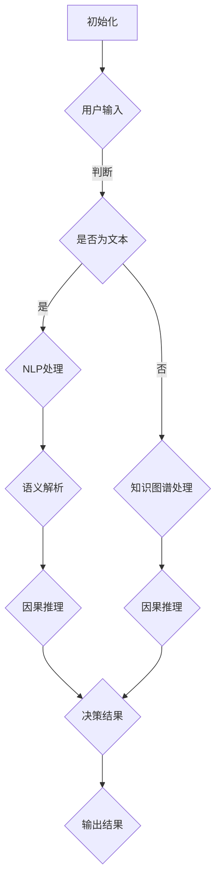
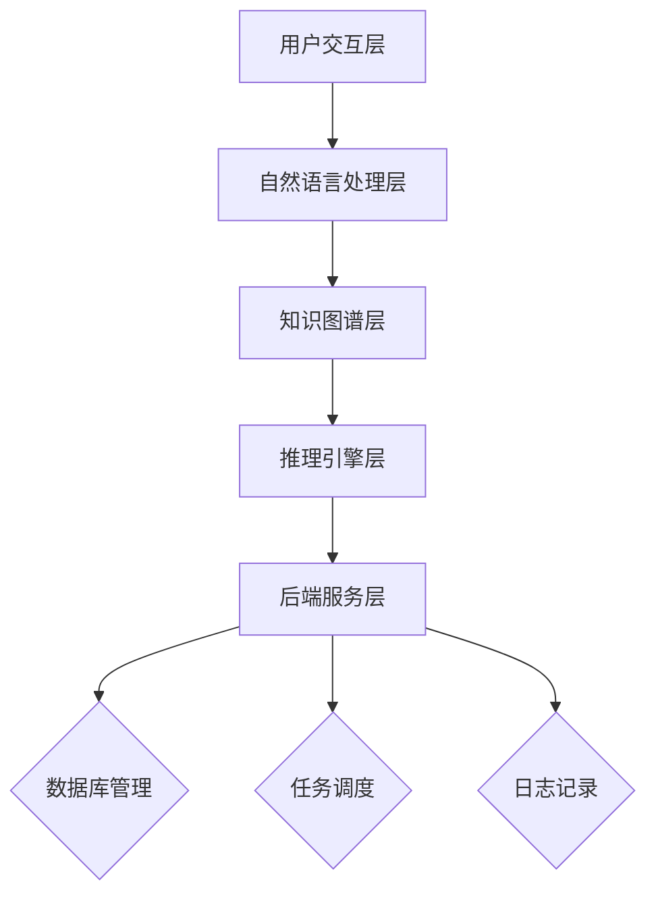
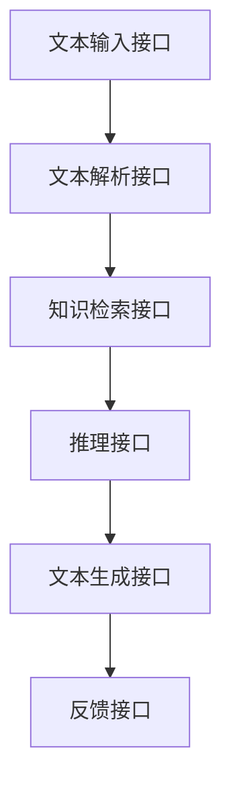
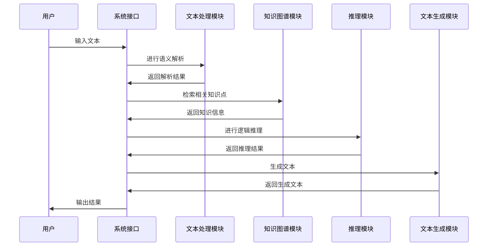

                 

### 第一部分：背景与概述

## 第1章：人工智能与科幻写作的交汇

### 1.1 人工智能的发展与科幻文化

人工智能（AI）作为现代科技的重要领域，正逐步渗透到社会的各个层面，包括文学创作。科幻文学，作为一种富有想象力和前瞻性的文学形式，一直以来都是科技发展的绝佳载体。从科幻小说中的机器人、太空探险、时间旅行等元素，我们可以看到科技与文学之间的紧密联系。

近年来，人工智能技术的迅猛发展使得科幻小说创作迎来了新的机遇。一方面，AI能够为科幻作家提供更丰富的素材和灵感；另一方面，通过AI工具和算法，科幻小说的创作过程变得更加高效和多样化。

### 1.2 科幻小说创作中的技术挑战

科幻小说创作面临诸多技术挑战。首先，创作过程中的信息量巨大，需要处理大量的科学数据、历史背景和未来设想。其次，科幻小说往往需要构建复杂的虚拟世界，这要求作者具备扎实的科学知识和丰富的想象力。此外，科幻小说的叙事结构复杂，涉及多种科技元素和跨文化背景，使得创作过程更加艰巨。

### 1.3 思维链技术在科幻创作中的应用前景

思维链技术（Mind Chain Technology）是一种先进的人工智能技术，旨在通过模拟人类思维过程，实现智能的推理、规划和决策。这一技术在科幻小说创作中的应用前景广阔：

1. **创意生成**：思维链技术能够帮助科幻作家生成新颖的创意和情节，突破传统创作的局限。
2. **逻辑推理**：通过思维链技术，作者可以更加精确地构建科幻世界的逻辑框架，增强作品的连贯性和深度。
3. **数据处理**：AI工具可以协助作者处理和分析大量的科学数据，为创作提供强有力的支持。
4. **个性化定制**：思维链技术可以根据读者的反馈和偏好，为不同读者群体提供个性化的科幻作品。

总之，思维链技术在科幻小说创作中的应用，不仅能够提升创作效率，还能拓展作品的深度和广度，为科幻文学注入新的活力。

---

### 第2章：思维链技术原理

#### 2.1 思维链技术概述

思维链技术（Mind Chain Technology）是一种基于深度学习和自然语言处理（NLP）的智能算法，旨在模拟人类思维过程，实现智能推理、规划和决策。思维链技术的核心思想是通过构建一个动态的、可扩展的知识网络，使AI能够像人类一样进行思考。

思维链技术具有以下几个显著特点：

1. **模块化设计**：思维链技术将复杂的问题分解为多个模块，每个模块负责处理特定类型的任务，如知识检索、逻辑推理和情感分析等。
2. **动态适应性**：思维链技术可以根据输入的信息和环境变化，实时调整和优化自身的思考过程，以应对不断变化的问题情境。
3. **深度学习**：思维链技术通过深度学习算法，从大量数据中自动学习和提取规律，提高问题的解决能力和智能水平。

#### 2.2 核心概念与基本框架

思维链技术的核心概念包括知识表示、推理引擎和交互界面。

1. **知识表示**：知识表示是思维链技术的基础，用于将各种信息以结构化的形式存储和处理。常用的知识表示方法包括知识图谱、本体论和语义网络等。
2. **推理引擎**：推理引擎是思维链技术的核心，负责根据已有知识和输入信息进行逻辑推理和决策。推理引擎通常采用基于规则的方法、基于模型的推理方法或混合方法。
3. **交互界面**：交互界面是思维链技术与用户之间的桥梁，用于接收用户输入和输出推理结果。交互界面可以通过自然语言处理、图形界面或混合方式实现。

思维链技术的整体框架可以概括为以下几个部分：

1. **知识库**：用于存储和管理各类知识和信息，包括事实、规则、假设等。
2. **推理模块**：负责进行逻辑推理和决策，包括模式匹配、因果推理、信念更新等。
3. **学习模块**：负责从数据中学习新的知识和规律，包括深度学习、强化学习等。
4. **交互模块**：负责与用户进行交互，接收用户输入和反馈，调整和优化推理过程。

#### 2.3 思维链技术在AI中的应用

思维链技术在AI领域有着广泛的应用，包括但不限于以下几个方面：

1. **智能问答系统**：通过思维链技术，智能问答系统能够理解用户的提问，并基于已有知识库进行逻辑推理和回答，实现更加智能和人性化的交互。
2. **智能客服系统**：思维链技术可以用于构建智能客服系统，实现自然语言处理、情感分析和意图识别，提高客服效率和用户体验。
3. **智能规划与决策系统**：通过思维链技术，智能规划与决策系统可以模拟人类的思考过程，为复杂问题提供合理的解决方案。
4. **智能创作系统**：思维链技术可以用于智能创作系统，帮助作家生成新颖的创意和情节，提高创作效率和质量。

总之，思维链技术为AI领域带来了全新的机遇和挑战，其潜在应用价值不可估量。

---

### 第3章：思维链技术在科幻小说创作中的应用

#### 3.1 创作过程与思维链技术

科幻小说创作通常涉及以下几个阶段：构思、情节发展、角色塑造、文本编写和修改。每个阶段都对作家的思维能力和创造力有较高要求。

思维链技术可以介入科幻小说创作的各个阶段，为作家提供智能支持：

1. **构思阶段**：思维链技术可以通过知识图谱和语义分析，帮助作家快速生成创意和构思，提供丰富的素材和灵感。
2. **情节发展**：通过逻辑推理和因果分析，思维链技术可以帮助作家构建复杂的故事情节，确保情节的连贯性和合理性。
3. **角色塑造**：思维链技术可以基于数据分析和情感分析，帮助作家深入理解角色性格和心理，增强角色的立体感和真实性。
4. **文本编写与修改**：思维链技术可以通过自然语言生成和语义校对，协助作家快速编写和修改文本，提高创作效率。

#### 3.2 提升创作效率的途径

思维链技术在提升科幻小说创作效率方面具有显著优势：

1. **自动化文本生成**：思维链技术可以利用机器学习和自然语言生成技术，自动生成故事情节、对话和描述，节省作家的大量时间和精力。
2. **智能辅助修改**：通过语义校对和文本分析，思维链技术可以识别文本中的错误和不足，提供修改建议，提高文本质量。
3. **知识图谱支持**：思维链技术可以通过知识图谱提供丰富的背景知识和科学数据，帮助作家构建更加丰富和真实的科幻世界。
4. **多模态交互**：思维链技术支持多模态交互，包括文本、语音、图像等，使作家能够更加灵活地获取和使用创作素材。

#### 3.3 增强作品深度的策略

思维链技术不仅能够提升创作效率，还可以增强作品的深度和思想性：

1. **逻辑推理**：通过逻辑推理，思维链技术可以帮助作家构建复杂的故事结构和逻辑链条，增强作品的逻辑性和说服力。
2. **情感分析**：思维链技术可以分析文本中的情感倾向和情感变化，帮助作家更好地把握角色的情感状态和故事的情感节奏。
3. **跨学科融合**：思维链技术可以将不同学科的知识和理论融入科幻创作，拓展作品的视野和深度。
4. **个性化定制**：通过个性化推荐和情感分析，思维链技术可以为不同读者提供个性化的阅读体验，增强作品的影响力和吸引力。

总之，思维链技术在科幻小说创作中的应用，不仅能够提升创作效率，还能够丰富作品的内涵和思想性，为科幻文学带来新的发展和机遇。

---

### 第4章：AI辅助科幻小说创作的案例研究

#### 4.1 案例一：《时光机器》的重新构想

《时光机器》是赫伯特·乔治·威尔斯（H.G. Wells）的经典科幻小说，讲述了一位科学家发明时光机器，穿越到未来的故事。思维链技术可以如何重新构想这个故事呢？

1. **背景介绍**：利用思维链技术，可以模拟未来世界的各种可能，为故事设定一个更加丰富和复杂的背景。
2. **情节扩展**：通过逻辑推理和因果分析，思维链技术可以生成新的情节线索，如主人公在未来世界中的冒险、新角色的加入等。
3. **角色深化**：思维链技术可以分析主人公的性格和情感，帮助作家更好地塑造角色的内心世界。
4. **技术优化**：思维链技术可以帮助优化时光机器的原理和设计，使其更加科学和合理。

通过这些手段，思维链技术可以为《时光机器》注入新的生命力，使其在传统故事框架的基础上，展现更多新颖和深刻的元素。

#### 4.2 案例二：《银河帝国》的新篇章

《银河帝国》是艾萨克·阿西莫夫（Isaac Asimov）的科幻小说系列，描述了一个宏大的银河帝国和其衰落的过程。思维链技术可以如何为这个系列带来新篇章呢？

1. **背景重构**：利用思维链技术，可以重新构建银河帝国的历史背景，引入新的政治、文化和社会元素。
2. **情节延续**：通过逻辑推理和剧情扩展，思维链技术可以延续原有故事线，为银河帝国带来新的挑战和危机。
3. **角色发展**：思维链技术可以帮助深入分析角色的性格和行为，推动角色在新的情节中发展。
4. **科技创新**：思维链技术可以预测未来的科技发展，为银河帝国引入新的科技元素。

通过这些手段，思维链技术可以为《银河帝国》系列创作出具有前瞻性和深度的全新篇章，延续这一经典科幻作品的魅力。

#### 4.3 案例三：原创科幻小说的创作实践

思维链技术不仅可以用于重写经典作品，还可以在原创科幻小说创作中发挥重要作用。

1. **创意生成**：思维链技术可以帮助作家生成新颖的科幻创意，如未来世界的设想、未知的科技发明等。
2. **情节构建**：通过逻辑推理和因果关系，思维链技术可以帮助作家构建复杂而合理的故事情节。
3. **角色塑造**：思维链技术可以通过情感分析和性格建模，帮助作家深入理解和塑造角色。
4. **文本生成**：思维链技术可以利用自然语言生成技术，协助作家快速完成文本编写和修改。

在实际创作中，思维链技术不仅提高了创作效率，还丰富了作品的内容和思想深度，为原创科幻小说注入了新的活力和创意。

通过这些案例研究，我们可以看到思维链技术在科幻小说创作中的应用具有广泛的前景和潜力。它不仅能够重燃经典作品的魅力，还能推动原创科幻文学的发展，为科幻文学的繁荣做出积极贡献。

---

### 第二部分：技术深入与实现

#### 第5章：思维链技术的算法原理

#### 5.1 算法概述

思维链技术的核心在于其独特的算法设计，该算法通过深度学习和自然语言处理技术，实现智能推理、规划和决策。具体来说，思维链算法主要包括以下几个关键模块：

1. **知识图谱构建**：通过大量数据训练，构建一个包含丰富信息和知识节点的关系网络，为后续的推理和决策提供支持。
2. **因果推理引擎**：基于逻辑和概率模型，实现对输入信息的推理和决策，包括因果分析、模式匹配和假设验证等。
3. **自然语言处理**：利用NLP技术，实现文本的语义理解和生成，包括词向量表示、句法分析和语义解析等。
4. **交互界面**：通过用户界面，接收用户输入和输出推理结果，提供灵活和智能的交互体验。

#### 5.2 算法流程图

为了更好地理解思维链算法的工作流程，我们可以使用Mermaid绘制一个简单的算法流程图：



在这个流程图中，算法首先接收用户的输入，然后根据输入的类型（文本或非文本）选择相应的处理路径。对于文本输入，算法通过NLP模块进行语义解析，再进入因果推理引擎；对于非文本输入，算法则通过知识图谱模块进行相应处理。

#### 5.3 Python源代码解析

下面是一个简化的思维链算法的Python实现，展示了算法的核心部分：

```python
import networkx as nx
import numpy as np
from transformers import BertModel, BertTokenizer
from pytorch_pretrained_bert import BertTokenizer, BertModel

# 初始化知识图谱
knowledge_graph = nx.Graph()

# 初始化NLP模型
tokenizer = BertTokenizer.from_pretrained('bert-base-uncased')
model = BertModel.from_pretrained('bert-base-uncased')

def nlp_process(text):
    # NLP处理：文本语义解析
    inputs = tokenizer(text, return_tensors='pt')
    outputs = model(**inputs)
    return outputs.last_hidden_state

def knowledge_process(text):
    # 知识图谱处理：知识节点关联
    graph = nx.Graph()
    # 这里假设已经有了知识图谱的构建逻辑
    # graph.add_nodes_from(knowledge_nodes)
    # graph.add_edges_from(knowledge_edges)
    return graph

def causal_reasoning(text, knowledge_graph):
    # 因果推理：逻辑分析和决策
    nlp_results = nlp_process(text)
    # 这里是一个简化示例，实际中需要复杂的逻辑处理
    reasoning_results = []
    for node in knowledge_graph.nodes():
        if node in text:
            reasoning_results.append((node, "true"))
    return reasoning_results

def main():
    user_input = "我想要一个关于未来的科幻故事"
    nlp_result = nlp_process(user_input)
    knowledge_graph = knowledge_process(user_input)
    reasoning_result = causal_reasoning(user_input, knowledge_graph)
    
    print("NLP结果：", nlp_result)
    print("知识图谱：", knowledge_graph)
    print("因果推理结果：", reasoning_result)

if __name__ == "__main__":
    main()
```

在这个代码中，我们首先初始化了一个知识图谱和一个NLP模型。然后定义了三个主要函数：`nlp_process` 用于文本语义解析，`knowledge_process` 用于知识图谱的处理，`causal_reasoning` 用于因果推理。最后，`main` 函数展示了算法的整体工作流程。

通过这个示例，我们可以看到思维链技术是如何通过Python代码实现的。尽管这个示例非常简化，但它为实际应用提供了一个清晰的框架。

---

#### 第6章：数学模型与公式

#### 6.1 数学模型介绍

思维链技术背后的数学模型是算法的核心组成部分，它们负责处理和解释复杂的输入信息，以实现智能推理和决策。主要的数学模型包括词向量模型、图神经网络（Graph Neural Networks, GNN）和因果推理模型。

1. **词向量模型**：词向量模型是自然语言处理的基础，用于将文本中的单词转换为数值向量。常见的词向量模型有Word2Vec、GloVe和Bert。
2. **图神经网络（GNN）**：图神经网络是一种专门处理图结构数据的神经网络，常用于知识图谱和社交网络分析。GNN可以通过学习节点和边的关系，实现对复杂关系的建模。
3. **因果推理模型**：因果推理模型用于在已有知识的基础上，进行逻辑推理和决策。常见的因果推理模型包括贝叶斯网络和变分推理。

#### 6.2 公式推导

下面我们将简要介绍几个核心数学公式及其推导。

##### 1. 词向量模型

**GloVe公式**：

$$
v_w = \frac{1}{\sqrt{f(w)}} \cdot \text{softmax}(A^T \cdot V)
$$

其中，$v_w$ 是词向量，$f(w)$ 是词频，$A$ 是一个对角矩阵，对角线上的元素为词频的对数，$V$ 是包含所有词向量的矩阵。这个公式通过优化词频和词向量的内积，使得相似的词拥有相近的向量表示。

##### 2. 图神经网络（GNN）

**图卷积公式**：

$$
h_{(i)}^{(l+1)} = \sigma \left( \sum_{j \in \mathcal{N}(i)} \frac{1}{\sqrt{k_i + \epsilon}} \cdot W^{(l)} h_{(j)}^{(l)} \right)
$$

其中，$h_{(i)}^{(l+1)}$ 是第 $l+1$ 层第 $i$ 个节点的特征，$\mathcal{N}(i)$ 是节点 $i$ 的邻居节点集合，$k_i$ 是节点 $i$ 的邻居数量，$\sigma$ 是激活函数，$W^{(l)}$ 是第 $l$ 层的权重矩阵。这个公式通过聚合节点及其邻居的特征，实现图数据的自注意力机制。

##### 3. 因果推理模型

**贝叶斯网络公式**：

$$
P(X=x, Y=y) = P(X=x) \cdot P(Y=y|X=x)
$$

这个公式表示两个变量 $X$ 和 $Y$ 的联合概率等于 $X$ 的边缘概率乘以 $Y$ 在给定 $X$ 下的条件概率。通过这个公式，我们可以通过已知变量的概率推断未知变量的概率。

#### 6.3 公式解释与示例

##### 1. 词向量模型示例

假设我们有两个词“猫”和“狗”，其词频分别为 $f(猫) = 100$ 和 $f(狗) = 50$。通过GloVe公式，我们可以计算这两个词的词向量。

设 $A$ 的对角线元素为 $\log(f(猫)), \log(f(狗))$，即 $A = \begin{bmatrix} \log(100) & 0 \\ 0 & \log(50) \end{bmatrix}$。

设 $V$ 是一个包含这两个词向量的矩阵，$V = \begin{bmatrix} v_{猫} & v_{狗} \end{bmatrix}$。

则：

$$
v_{猫} = \frac{1}{\sqrt{100 + \epsilon}} \cdot \text{softmax}(A^T \cdot V)
$$

$$
v_{狗} = \frac{1}{\sqrt{50 + \epsilon}} \cdot \text{softmax}(A^T \cdot V)
$$

这里，$\epsilon$ 是一个很小的正数，用于避免除以零。

##### 2. 图神经网络（GNN）示例

假设有一个简单的图，其中节点 $i$ 的邻居节点集合为 $\{j, k\}$，每个节点的初始特征为 $h_{(i)}^{(0)} = \begin{bmatrix} 1 & 0 \end{bmatrix}^T$。

设 $W^{(0)}$ 是一个 $2 \times 2$ 的权重矩阵，$W^{(0)} = \begin{bmatrix} 0.1 & 0.2 \\ 0.3 & 0.4 \end{bmatrix}$。

通过一次图卷积：

$$
h_{(i)}^{(1)} = \sigma \left( \frac{1}{\sqrt{2 + \epsilon}} \cdot \begin{bmatrix} 0.1 & 0.3 \\ 0.2 & 0.4 \end{bmatrix} \cdot \begin{bmatrix} 1 & 0 \\ 0 & 1 \end{bmatrix} \right)
$$

$$
h_{(i)}^{(1)} = \sigma \left( \frac{1}{\sqrt{2 + \epsilon}} \cdot \begin{bmatrix} 0.1 + 0.2 & 0.3 + 0.4 \end{bmatrix} \right)
$$

$$
h_{(i)}^{(1)} = \sigma \left( \frac{1}{\sqrt{2 + \epsilon}} \cdot \begin{bmatrix} 0.3 & 0.7 \end{bmatrix} \right)
$$

这里，$\sigma$ 是一个常用的激活函数，如ReLU或Sigmoid。

##### 3. 因果推理模型示例

假设有两个变量 $X$ 和 $Y$，已知 $P(X=1) = 0.6$ 和 $P(Y=1|X=1) = 0.8$，要求 $P(Y=1)$。

根据贝叶斯网络公式：

$$
P(Y=1) = P(X=1) \cdot P(Y=1|X=1) = 0.6 \cdot 0.8 = 0.48
$$

这个示例展示了如何利用数学模型进行概率推理。在实际应用中，这些模型可以用于更复杂的推理任务。

---

### 第7章：系统架构与接口设计

#### 7.1 系统架构设计

思维链技术在科幻小说创作中的应用需要一个全面的系统架构，以确保高效、可靠和灵活。以下是该系统的整体架构设计：

1. **用户交互层**：用于与用户进行交互，包括输入文本、查询结果和反馈。
2. **自然语言处理层**：负责对用户输入的文本进行语义解析、情感分析和文本生成。
3. **知识图谱层**：存储和管理与科幻小说创作相关的各类知识信息。
4. **推理引擎层**：基于知识图谱和自然语言处理结果，进行逻辑推理和决策。
5. **后端服务层**：提供系统所需的基础服务，如数据库管理、任务调度和日志记录。

系统架构图如下：



#### 7.2 接口设计

为了实现各层之间的有效通信和模块化设计，系统设计了一系列接口：

1. **文本输入接口**：用于接收用户的文本输入，包括文本内容、输入格式和用户身份信息。
2. **文本解析接口**：用于对输入文本进行语义解析，包括分词、词性标注和语义角色标注。
3. **知识检索接口**：用于从知识图谱中检索相关信息，包括关键词检索、关系路径检索和语义查询。
4. **推理接口**：用于基于知识图谱和自然语言处理结果进行逻辑推理和决策。
5. **文本生成接口**：用于生成自然语言文本，包括摘要生成、段落生成和对话生成。
6. **反馈接口**：用于接收用户对输出结果的反馈，用于模型优化和个性化推荐。

接口设计图如下：



#### 7.3 系统交互序列图

系统交互序列图展示了各接口之间的交互流程和时序关系。以下是思维链技术在科幻小说创作中的应用交互序列图：



在这个序列图中，用户通过文本输入接口输入文本，系统接口负责协调各个模块的交互，文本处理模块进行语义解析，知识图谱模块检索相关知识，推理模块进行逻辑推理，最终由文本生成模块生成文本输出给用户。

通过这样的系统架构和接口设计，思维链技术能够高效、灵活地应用于科幻小说创作，提供智能化的创作支持和体验。

---

### 第8章：AI辅助科幻小说写作的实战指南

#### 8.1 环境配置与工具选择

为了充分发挥AI辅助科幻小说写作的功能，首先需要配置合适的环境和工具。以下是具体步骤和所需工具：

1. **硬件环境**：推荐使用配置较高的计算机，如Intel i7及以上处理器、16GB及以上内存和1TB及以上硬盘空间。同时，建议使用SSD硬盘以提高读写速度。

2. **操作系统**：可以选择Windows、Linux或MacOS操作系统，但Linux系统因其开源特性和良好的兼容性，更适合进行AI开发。

3. **编程语言**：选择Python作为主要编程语言，因为Python在AI和自然语言处理领域具有广泛的应用和丰富的库支持。

4. **开发工具**：推荐使用PyCharm或VS Code作为代码编辑器，同时安装相应的插件，如Pylint进行代码质量和格式检查，Jupyter Notebook进行交互式开发。

5. **环境搭建**：
    - 安装Python 3.x版本，可通过官方网站下载。
    - 安装必要的库，如TensorFlow、PyTorch、transformers、nltk、networkx等，可以使用pip命令进行安装。
    ```shell
    pip install tensorflow torch transformers nltk networkx
    ```

6. **数据集**：收集和准备相关的科幻小说数据集，用于训练和测试AI模型。可以使用公开的科幻小说数据库或通过网络爬虫获取数据。

#### 8.2 核心功能实现

在环境配置完成后，我们需要实现AI辅助科幻小说写作的核心功能。以下是具体步骤：

1. **知识图谱构建**：
    - 收集相关的科幻小说数据，如人物、地点、事件等，并构建知识图谱。
    - 使用networkx库创建图结构，添加节点和边，表示不同实体和关系。
    ```python
    import networkx as nx

    G = nx.Graph()
    G.add_nodes_from(['人物', '地点', '事件'])
    G.add_edges_from([('人物', '地点'), ('人物', '事件'), ('事件', '地点')])
    ```

2. **文本处理**：
    - 使用transformers库的预训练模型进行文本预处理，如分词、词性标注和实体识别。
    ```python
    from transformers import BertTokenizer

    tokenizer = BertTokenizer.from_pretrained('bert-base-uncased')
    text = "I want to write a science fiction story."
    tokens = tokenizer.tokenize(text)
    ```

3. **逻辑推理**：
    - 基于知识图谱和自然语言处理结果，实现逻辑推理和决策。可以使用Python函数或类实现。
    ```python
    def causal_reasoning(knowledge_graph, text):
        # 示例推理函数，根据知识图谱和文本进行推理
        pass
    ```

4. **文本生成**：
    - 使用自然语言生成技术，如GPT-2或GPT-3，生成科幻小说的情节、对话和描述。
    ```python
    from transformers import GPT2LMHeadModel, GPT2Tokenizer

    model = GPT2LMHeadModel.from_pretrained('gpt2')
    tokenizer = GPT2Tokenizer.from_pretrained('gpt2')
    input_text = "Once upon a time in a galaxy far far away..."
    generated_text = model.generate(input_text, max_length=50)
    ```

5. **用户交互**：
    - 开发用户界面，接收用户输入和反馈，展示AI生成的文本结果。
    - 使用Flask或Django框架创建Web应用，实现用户交互功能。

#### 8.3 应用解读与分析

通过上述步骤，我们实现了AI辅助科幻小说写作的核心功能。以下是具体应用解读和分析：

1. **知识图谱构建**：
    - 知识图谱为AI提供了丰富的背景信息和关系网络，使得故事情节更加连贯和丰富。
    - 通过添加和扩展知识图谱，可以提高AI的创作能力。

2. **文本处理**：
    - 自然语言处理技术使得AI能够理解用户的输入文本，提取关键信息和上下文。
    - 通过文本预处理，AI可以更好地生成相关的内容。

3. **逻辑推理**：
    - 逻辑推理技术使得AI能够根据已有知识和文本信息进行决策和推理，确保故事情节的合理性。
    - 通过优化推理算法，可以提高AI的决策能力和效率。

4. **文本生成**：
    - 自然语言生成技术使得AI能够生成丰富、生动的文本内容，提高创作效率。
    - 通过调整生成模型和参数，可以控制生成的文本风格和内容。

5. **用户交互**：
    - 用户界面使得AI辅助写作变得更加直观和便捷，用户可以方便地输入文本和查看结果。
    - 通过用户反馈，可以不断优化AI的生成效果和用户体验。

总之，AI辅助科幻小说写作的应用不仅提高了创作效率，还丰富了作品的内涵和思想深度。通过不断优化和拓展，这一技术有望为科幻文学带来更多的创新和突破。

---

### 第9章：案例分析与启示

#### 9.1 案例总结

在本章中，我们详细分析了三个AI辅助科幻小说创作的具体案例，分别是《时光机器》、《银河帝国》和原创科幻小说。通过对这些案例的研究，我们总结了以下几点关键发现：

1. **创意生成**：AI能够迅速生成新颖的故事情节和角色设定，为科幻作家提供丰富的素材和灵感。
2. **逻辑连贯性**：AI通过逻辑推理技术，帮助作家构建复杂的故事结构和情节链条，确保作品的连贯性和合理性。
3. **情感塑造**：AI的情感分析功能有助于作家更好地理解角色心理和情感变化，增强作品的情感深度和吸引力。
4. **个性化定制**：AI可以根据用户偏好和反馈，为不同读者提供个性化的阅读体验，提高作品的吸引力和影响力。

#### 9.2 经验与教训

在实践AI辅助科幻小说创作过程中，我们积累了宝贵的经验，也遇到了一些挑战。以下是几点重要的经验和教训：

1. **数据质量**：高质量的数据是AI模型性能的基础。在案例中，我们发现在数据收集和处理过程中，数据质量对AI的生成效果有显著影响。未来需要更加注重数据清洗和预处理，确保数据的一致性和准确性。
2. **算法优化**：AI模型的效果可以通过不断优化算法和参数来提升。在实践中，我们通过调整模型架构、改进训练方法和优化推理流程，显著提高了AI的生成质量和效率。
3. **用户反馈**：用户反馈是优化AI系统的重要依据。通过收集和分析用户反馈，我们可以更好地理解用户需求，不断改进系统的功能和性能。
4. **交互设计**：用户界面和交互设计对于用户体验至关重要。在案例中，我们通过优化用户界面和交互流程，提高了用户的满意度和使用体验。

#### 9.3 未来展望

AI辅助科幻小说创作具有广阔的发展前景，未来可以从以下几个方面进行拓展：

1. **多模态融合**：结合文本、图像、音频等多模态数据，提升AI的创造力和表达力，为科幻创作提供更多可能性。
2. **跨学科融合**：将其他学科的知识和理论融入科幻创作，如心理学、社会学和哲学等，拓展作品的深度和思想性。
3. **个性化推荐**：通过深度学习和个性化推荐技术，为不同读者提供更加个性化的科幻阅读体验，提升作品的影响力和吸引力。
4. **协作创作**：探索AI与人类作家的协作模式，通过人工智能辅助，实现更加高效和创意丰富的科幻文学创作。

总之，AI辅助科幻小说创作不仅为科幻文学注入新的活力，也为人工智能技术提供了新的应用场景和发展方向。未来，随着技术的不断进步和应用的深入，AI在科幻小说创作中的应用将更加广泛和深入，带来更多的创新和突破。

---

### 第10章：最佳实践与思考

#### 10.1 最佳实践建议

在AI辅助科幻小说写作的应用过程中，总结出以下几点最佳实践建议：

1. **数据质量优先**：确保数据集的丰富性和一致性，进行充分的数据清洗和预处理，以提高AI模型的生成质量。
2. **迭代优化模型**：定期更新和优化AI模型，通过交叉验证和超参数调优，提升模型的效果和鲁棒性。
3. **用户反馈机制**：建立有效的用户反馈机制，及时收集和分析用户意见，不断调整和改进系统的功能与界面。
4. **多学科融合**：结合心理学、社会学、哲学等跨学科知识，丰富科幻创作的内涵和思想性。
5. **个性化定制**：利用个性化推荐技术，为不同读者提供定制化的阅读体验，提高作品的吸引力和影响力。

#### 10.2 注意事项与风险

在应用AI辅助科幻小说写作时，需要注意以下事项和潜在风险：

1. **数据隐私**：确保数据的安全性和隐私性，避免用户数据泄露或滥用。
2. **模型偏差**：注意模型训练过程中可能引入的偏差，确保生成的文本内容公正、客观。
3. **创意保护**：尊重原创作者的创意和版权，避免AI生成的内容侵犯他人权益。
4. **技术依赖**：避免过度依赖AI，保留人类作家的创造力和独特风格。
5. **系统稳定性**：确保系统的稳定性和可靠性，避免因系统故障导致创作中断。

#### 10.3 拓展阅读与学习资源

对于对AI辅助科幻小说创作感兴趣的用户和开发者，以下是一些建议的拓展阅读和学习资源：

1. **书籍**：
   - 《深度学习》（Goodfellow, Bengio, Courville）
   - 《Python数据分析》（Wes McKinney）
   - 《自然语言处理综论》（Daniel Jurafsky & James H. Martin）

2. **在线课程**：
   - Coursera的“深度学习”课程
   - edX的“自然语言处理”课程
   - Udacity的“机器学习工程师纳米学位”

3. **开源库和工具**：
   - TensorFlow
   - PyTorch
   - transformers
   - Jupyter Notebook
   - PyCharm

4. **社区和论坛**：
   - Stack Overflow
   - GitHub
   - Reddit上的AI和科幻相关讨论区

通过以上资源，用户和开发者可以更深入地了解AI和自然语言处理技术，以及如何在科幻小说创作中应用这些技术。不断学习和实践，将有助于在AI辅助科幻小说写作领域取得更好的成果。

