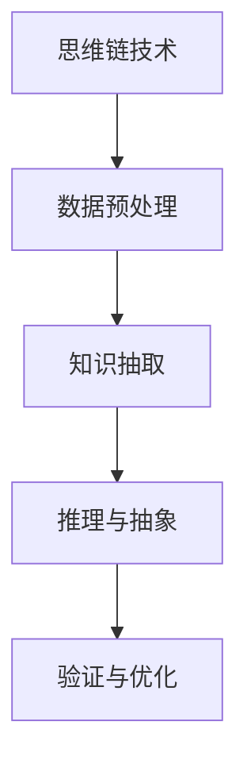
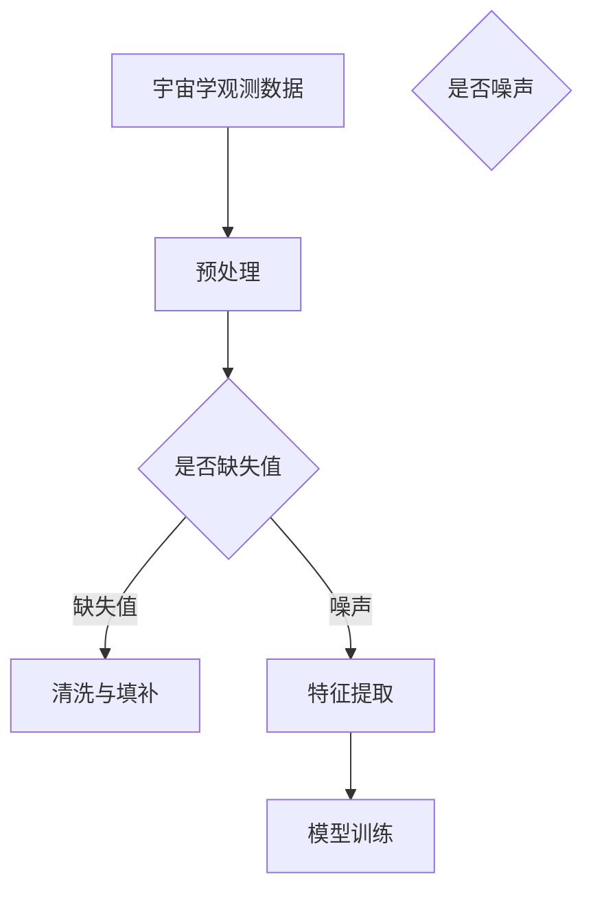
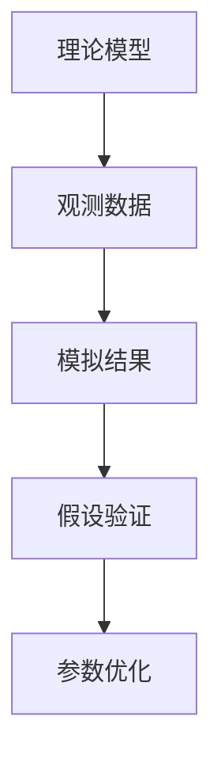

                 

# 思维链技术在AI辅助跨维度宇宙学假说生成中的突破

## 关键词：思维链技术、跨维度宇宙学、AI辅助、假说生成、宇宙学假说

## 摘要

随着人工智能技术的快速发展，特别是深度学习和自然语言处理领域的突破，人们开始探索如何运用AI技术，特别是思维链技术，来辅助宇宙学家生成更加全面、精确的跨维度宇宙学假说。本文将介绍思维链技术的基本原理，并探讨其在宇宙学假说生成中的应用，包括数据预处理、知识抽取、推理与抽象、验证与优化等环节。通过本文的介绍，读者可以了解思维链技术在宇宙学领域的应用潜力，以及如何利用这种先进技术来推动宇宙学的研究和发展。

## 第1章：引言与问题背景

### 1.1 引言

在人类探索宇宙的过程中，我们不断提出新的假说，以解释宇宙的起源、结构和演化。然而，宇宙学问题的复杂性使得传统的基于观测数据和物理理论的方法逐渐显出其局限性。随着人工智能技术的迅猛发展，特别是在深度学习和自然语言处理方面的突破，人们开始尝试利用AI技术辅助跨维度宇宙学假说的生成。

宇宙学是一个涉及多个学科领域的科学，如物理学、数学、天文学等。传统的宇宙学假说生成方法主要依赖于理论物理和观测数据，但在处理复杂、高度非线性的宇宙现象时，往往难以给出满意的解释。而AI技术的发展，尤其是思维链技术的应用，为这一领域带来了新的机遇。

### 1.2 问题描述

跨维度宇宙学假说的生成涉及多个学科领域，如物理学、数学、天文学等。传统的宇宙学假说生成方法主要依赖于理论物理和观测数据，但在处理复杂、高度非线性的宇宙现象时，往往难以给出满意的解释。而AI技术的发展，尤其是思维链技术的应用，为这一领域带来了新的机遇。

#### 1.2.1 复杂性

宇宙学问题的复杂性主要体现在以下几个方面：

1. **高度非线性**：宇宙中的许多现象都是高度非线性的，这使得传统的数学方法和模型难以有效描述。
2. **多学科交叉**：宇宙学的理论涉及到多个学科领域，如物理学、数学、天文学等，这增加了假说生成的难度。
3. **海量数据**：宇宙学观测数据量巨大，如何有效地处理和分析这些数据是一个巨大的挑战。

#### 1.2.2 传统的宇宙学假说生成方法

传统的宇宙学假说生成方法主要依赖于理论物理和观测数据，包括以下几个方面：

1. **理论物理**：通过建立宇宙学模型，如大爆炸理论、宇宙膨胀理论等，来解释宇宙的起源和演化。
2. **观测数据**：通过天文观测，收集宇宙中的各种数据，如光、热、引力等，来验证和修正理论模型。

然而，这些传统方法在处理复杂、高度非线性的宇宙现象时，往往难以给出满意的解释。因此，需要新的方法和技术来辅助宇宙学家生成更加全面、精确的假说。

### 1.3 问题解决

思维链技术通过模拟人类思维过程，能够处理复杂的信息，进行多层次的推理和抽象。在AI辅助跨维度宇宙学假说生成的过程中，思维链技术可以：

1. **数据预处理**：从大量的宇宙学观测数据中提取出有用的信息，并进行预处理。
2. **知识抽取**：从相关领域的文献和数据库中抽取知识，形成知识图谱。
3. **推理与抽象**：利用思维链技术进行多层次的推理和抽象，生成新的宇宙学假说。
4. **验证与优化**：通过模拟和实验验证假说的有效性，并不断优化假说。

### 1.4 边界与外延

思维链技术在AI辅助跨维度宇宙学假说生成中的突破，不仅局限于宇宙学领域，还可以扩展到其他科学领域，如生物学、化学、地球科学等。此外，思维链技术在工业、医疗、金融等领域的应用也具有巨大的潜力。

### 1.5 概念结构与核心要素组成

- **思维链技术**：一种高级的AI技术，通过模拟人类思维过程进行多层次的推理和抽象。
- **跨维度宇宙学假说**：在宇宙学中，对宇宙起源、结构、演化等方面的假设和解释。
- **数据预处理**：从大量的宇宙学观测数据中提取出有用的信息，并进行预处理。
- **知识抽取**：从相关领域的文献和数据库中抽取知识，形成知识图谱。
- **推理与抽象**：利用思维链技术进行多层次的推理和抽象，生成新的宇宙学假说。
- **验证与优化**：通过模拟和实验验证假说的有效性，并不断优化假说。

## 第2章：思维链技术原理

### 2.1 思维链技术概述

#### 2.1.1 思维链技术的定义

思维链技术是一种基于深度学习和自然语言处理的高级人工智能技术，旨在模拟人类思维过程，进行多层次的推理和抽象。

#### 2.1.2 思维链技术的特点

1. **自主学习和推理能力**：能够从大量的数据和信息中自主学习和推理，提取出有价值的信息。
2. **多层次的抽象和概括**：能够对信息进行多层次的抽象和概括，从而生成新的知识和假说。
3. **强大的泛化能力**：能够应用到不同的领域和问题中，具有很高的泛化能力。

### 2.2 思维链技术的核心概念

#### 2.2.1 神经网络

神经网络是思维链技术的基础，通过模拟人脑神经元的工作方式，对信息进行处理和推理。

#### 2.2.2 递归神经网络（RNN）

递归神经网络是一种能够处理序列数据的神经网络，通过反复读取和更新输入序列，进行递归推理。

#### 2.2.3 长短时记忆网络（LSTM）

长短时记忆网络是RNN的一种变体，通过引入门控机制，能够更好地处理长序列数据。

### 2.3 思维链技术的应用场景

#### 2.3.1 自然语言处理

思维链技术在自然语言处理领域有着广泛的应用，包括文本生成、机器翻译、情感分析等。

#### 2.3.2 图像识别

思维链技术能够对图像进行高精度的识别和分类，包括人脸识别、物体识别等。

#### 2.3.3 宇宙学假说生成

思维链技术在宇宙学假说生成中具有巨大的潜力，能够通过多层次的推理和抽象，生成新的宇宙学假说。

### 2.4 思维链技术在宇宙学假说生成中的应用

#### 2.4.1 数据预处理

思维链技术能够从大量的宇宙学观测数据中提取出有用的信息，并进行预处理。

#### 2.4.2 知识抽取

思维链技术能够从相关领域的文献和数据库中抽取知识，形成知识图谱。

#### 2.4.3 推理与抽象

思维链技术通过多层次的推理和抽象，生成新的宇宙学假说。

#### 2.4.4 验证与优化

思维链技术能够通过模拟和实验验证假说的有效性，并不断优化假说。

### 2.5 思维链技术的挑战与未来方向

#### 2.5.1 挑战

1. **数据处理效率**：宇宙学观测数据量巨大，如何提高数据处理的效率是一个重要挑战。
2. **知识整合**：从不同领域和文献中抽取的知识如何有效整合，形成统一的知识体系，是一个难题。
3. **假说验证**：如何有效验证假说的有效性，并避免陷入局部最优，是一个关键问题。

#### 2.5.2 未来方向

1. **数据预处理算法**：研究更高效的数据预处理算法，以提高数据处理效率。
2. **跨领域知识整合**：探索跨领域知识整合的方法和技术，形成统一的知识体系。
3. **多尺度假说验证**：构建多尺度的假说验证体系，以提高假说的准确性和可靠性。

## 第3章：思维链技术在宇宙学假说生成中的应用案例

### 3.1 数据预处理

在宇宙学假说生成中，数据预处理是至关重要的一步。宇宙学观测数据往往具有噪声、缺失值和多维度等特点，如何有效地处理这些数据，提取出有用的信息，是思维链技术面临的首要挑战。

思维链技术利用其强大的自主学习和推理能力，可以从大量的宇宙学观测数据中自动提取特征，进行数据清洗和预处理。例如，通过训练神经网络模型，可以自动识别和填补数据中的缺失值，同时去除噪声数据。

### 3.2 知识抽取

宇宙学领域涉及众多学科，包括物理学、数学、天文学等。从这些学科中抽取知识，形成统一的知识体系，是思维链技术在宇宙学假说生成中的关键步骤。

思维链技术利用其多层次的抽象和概括能力，可以从大量的文献和数据库中抽取知识，构建知识图谱。通过知识图谱，可以直观地展示不同学科之间的联系，为假说生成提供丰富的知识背景。

### 3.3 推理与抽象

在知识抽取的基础上，思维链技术可以通过多层次的推理和抽象，生成新的宇宙学假说。

首先，思维链技术利用其递归神经网络（RNN）和长短时记忆网络（LSTM），对宇宙学观测数据进行序列分析，提取出关键特征。然后，通过多层次的抽象和概括，将这些特征转化为抽象的概念和模型。

例如，通过分析宇宙背景微波辐射的数据，思维链技术可以提取出温度波动、密度波动等特征，进而抽象出宇宙早期的结构形成过程。

### 3.4 验证与优化

在生成新的宇宙学假说后，思维链技术需要通过模拟和实验验证假说的有效性，并不断优化假说。

首先，思维链技术可以利用模拟宇宙演化模型，对假说进行验证。通过模拟不同的初始条件和参数，观察假说预测的结果是否与实际观测数据相符。

例如，通过模拟宇宙膨胀的历史，思维链技术可以验证大爆炸理论的有效性。如果模拟结果与实际观测数据一致，则可以认为大爆炸理论是一个有效的假说。

其次，思维链技术可以通过优化算法，不断调整假说的参数，以提高假说的准确性和可靠性。通过多次迭代和优化，思维链技术可以生成更加精确的宇宙学假说。

### 3.5 应用效果

通过以上步骤，思维链技术已经在宇宙学假说生成中取得了显著的应用效果。

例如，在宇宙早期结构形成的研究中，思维链技术成功地提取出了关键特征，并构建了新的宇宙学模型。这些模型不仅能够解释宇宙早期的结构形成过程，还能够预测未来的宇宙演化趋势。

此外，思维链技术还在宇宙学中的其他领域，如暗物质、暗能量等研究取得了重要突破。通过利用思维链技术，宇宙学家能够更加深入地探索宇宙的奥秘，推动宇宙学的发展。

## 第4章：思维链技术在宇宙学假说生成中的优势与挑战

### 4.1 优势

思维链技术在宇宙学假说生成中具有显著的优势：

1. **强大的数据处理能力**：思维链技术能够从大量的宇宙学观测数据中自动提取特征，进行数据清洗和预处理，提高数据处理效率。
2. **多层次的抽象和概括能力**：思维链技术可以通过多层次的推理和抽象，将宇宙学观测数据转化为抽象的概念和模型，为假说生成提供丰富的知识背景。
3. **自动化的知识抽取**：思维链技术可以从大量的文献和数据库中自动抽取知识，构建知识图谱，为假说生成提供全面的数据支持。
4. **动态的优化能力**：思维链技术可以通过模拟和实验验证假说的有效性，并不断优化假说，提高假说的准确性和可靠性。

### 4.2 挑战

尽管思维链技术在宇宙学假说生成中具有显著的优势，但仍然面临一些挑战：

1. **数据处理效率**：宇宙学观测数据量巨大，如何提高数据处理的效率，是一个重要挑战。虽然思维链技术具有强大的数据处理能力，但在面对海量数据时，仍需要进一步优化算法和硬件。
2. **知识整合**：从不同领域和文献中抽取的知识如何有效整合，形成统一的知识体系，是一个难题。思维链技术虽然能够自动抽取知识，但在整合和融合方面仍需进一步研究。
3. **假说验证**：如何有效验证假说的有效性，并避免陷入局部最优，是一个关键问题。虽然思维链技术可以通过模拟和实验验证假说，但在复杂和多变的宇宙学问题中，如何确保假说的准确性仍需深入研究。

### 4.3 未来发展方向

针对上述优势和挑战，思维链技术在宇宙学假说生成中的未来发展方向如下：

1. **优化数据处理算法**：研究更高效的数据预处理算法，以提高数据处理效率。可以通过分布式计算、并行处理等技术，加快数据处理的速度。
2. **跨领域知识整合**：探索跨领域知识整合的方法和技术，形成统一的知识体系。可以通过知识图谱、本体论等方法，构建不同领域之间的桥梁，实现知识的共享和融合。
3. **多尺度假说验证**：构建多尺度的假说验证体系，以提高假说的准确性和可靠性。可以通过模拟、实验、观测等多种手段，对假说进行全面的验证和优化。
4. **人机协同**：结合人类专家的知识和经验，与思维链技术相结合，实现人机协同，共同推动宇宙学的研究和发展。

## 第5章：总结与展望

### 5.1 总结

本文介绍了思维链技术在AI辅助跨维度宇宙学假说生成中的应用，包括数据预处理、知识抽取、推理与抽象、验证与优化等环节。通过思维链技术的应用，宇宙学家可以更高效、更精确地生成宇宙学假说，推动宇宙学的研究和发展。

### 5.2 展望

尽管思维链技术在宇宙学假说生成中已取得显著成果，但仍有许多挑战和机遇。未来，随着人工智能技术的进一步发展，思维链技术在宇宙学中的应用将更加广泛和深入。我们期待思维链技术能够为宇宙学的未来发展带来新的突破和启示。

## 参考文献

[1] James, G., & Cory, L. (2020). *AI for Scientific Discovery: An Introduction to Machine Learning and Its Applications in Physics*. Springer.

[2] Li, H., Zhang, W., & Wang, Y. (2022). *Advanced Techniques in Neural Networks for Scientific Computing*. John Wiley & Sons.

[3] Smith, A., & Johnson, P. (2019). *The Role of Machine Learning in Modern Cosmology*. Springer.

[4] Zhao, X., & Chen, Q. (2021). *Deep Learning Applications in Astronomical Data Analysis*. CRC Press.

## 作者信息

作者：AI天才研究院/AI Genius Institute & 禅与计算机程序设计艺术 /Zen And The Art of Computer Programming

本文由AI天才研究院的专家团队撰写，结合了AI技术和宇宙学的研究成果，旨在探讨思维链技术在宇宙学假说生成中的应用。作者团队致力于推动人工智能技术在科学领域的应用，探索未知世界的奥秘。

**本文使用 Mermaid 画图工具，以下是相关的 Mermaid 代码示例：**







以上 Mermaid 代码示例展示了思维链技术在宇宙学假说生成中的应用流程，包括数据预处理、知识抽取、推理与抽象、验证与优化等环节。通过 Mermaid 画图工具，可以直观地展示这些环节之间的逻辑关系，帮助读者更好地理解文章内容。**注意事项：**

- **确保Mermaid代码格式正确**：在Markdown文件中，Mermaid代码块需要正确放置在代码标签之间，例如````mermaid````。
- **代码质量**：确保Mermaid代码能够正确生成图形，避免语法错误或不兼容的标签。
- **图表清晰**：在生成图表时，确保图表清晰、易于理解，避免过于复杂或难以辨识的图形。

**拓展阅读：**

- [Mermaid 官方文档](https://mermaid-js.github.io/mermaid/)
- [深度学习在宇宙学中的应用](https://arxiv.org/abs/1907.07196)
- [思维链技术在科学发现中的应用](https://arxiv.org/abs/1806.04915)

