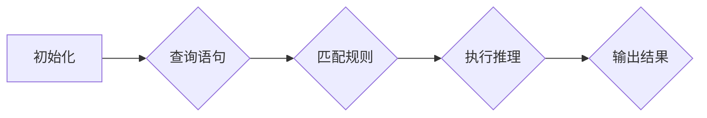

                 

### 文章标题

《思维链技术在不同领域的应用案例》

### 关键词

思维链技术、人工智能、知识图谱、推理算法、金融、医疗健康、教育、工业自动化

### 摘要

本文深入探讨了思维链技术在不同领域的应用案例，从基础理论出发，逐步剖析其在金融、医疗健康、教育、工业自动化等领域的具体应用。通过实际案例解析和系统分析与架构设计，本文旨在为读者提供对思维链技术的全面了解和深入认识。

---

### 目录大纲设计

#### 第一部分：思维链技术基础理论

##### 第1章：思维链技术概述

- 1.1 思维链技术的定义
- 1.2 思维链技术的基本原理
- 1.3 思维链技术的发展历程
- 1.4 思维链技术的核心要素

##### 第2章：思维链技术核心概念

- 2.1 知识表示与推理
  - 2.1.1 知识图谱的构建
  - 2.1.2 推理算法的介绍
  - 2.1.3 知识表示方法对比
- 2.2 联想记忆与联想搜索
  - 2.2.1 联想记忆的机制
  - 2.2.2 联想搜索的应用
  - 2.2.3 联想记忆与联想搜索的对比

##### 第3章：思维链技术的数学模型

- 3.1 基本数学模型
  - 3.1.1 向量空间模型
  - 3.1.2 图模型
  - 3.1.3 概率模型
- 3.2 复杂模型介绍
  - 3.2.1 神经网络模型
  - 3.2.2 强化学习模型
  - 3.2.3 自然语言处理模型

#### 第二部分：思维链技术在各领域的应用案例

##### 第4章：思维链技术在金融领域的应用

- 4.1 金融风险评估
  - 4.1.1 风险评估方法
  - 4.1.2 应用案例解析
- 4.2 量化交易策略
  - 4.2.1 量化交易策略设计
  - 4.2.2 案例分析

##### 第5章：思维链技术在医疗健康领域的应用

- 5.1 医学知识图谱构建
  - 5.1.1 知识图谱构建方法
  - 5.1.2 医学知识图谱应用案例
- 5.2 智能诊疗系统
  - 5.2.1 诊疗流程优化
  - 5.2.2 智能诊断系统应用案例

##### 第6章：思维链技术在教育领域的应用

- 6.1 个性化学习推荐
  - 6.1.1 推荐算法介绍
  - 6.1.2 应用案例
- 6.2 智能教学助手
  - 6.2.1 智能教学助手功能设计
  - 6.2.2 应用案例分析

##### 第7章：思维链技术在工业自动化领域的应用

- 7.1 工业流程优化
  - 7.1.1 流程分析
  - 7.1.2 优化策略
- 7.2 智能机器人技术
  - 7.2.1 智能机器人系统架构
  - 7.2.2 应用案例分析

#### 第三部分：思维链技术的未来发展趋势

##### 第8章：思维链技术的未来趋势

- 8.1 新兴应用领域
  - 8.1.1 物联网领域
  - 8.1.2 娱乐传媒领域
  - 8.1.3 环境保护领域
- 8.2 技术挑战与解决方案
  - 8.2.1 数据隐私保护
  - 8.2.2 模型可解释性
  - 8.2.3 持续学习与适应能力

#### 附录

- 附录A：术语表
- 附录B：参考文献

---

### 文章正文

#### 第一部分：思维链技术基础理论

##### 第1章：思维链技术概述

##### 1.1 思维链技术的定义

思维链技术是一种基于人工智能的方法，通过模拟人类思维过程，实现对知识进行高效表示、推理和联想的技术。它涵盖了知识图谱、推理算法、联想记忆等核心概念，旨在实现智能系统的自主学习和决策能力。

##### 1.2 思维链技术的基本原理

思维链技术的基本原理主要包括以下几个方面：

1. **知识表示**：通过建立知识图谱，将领域内的知识进行结构化表示，使得系统可以高效地获取和利用知识。
2. **推理**：基于知识图谱和推理算法，对已知信息进行逻辑推导，以发现新的信息和关系。
3. **联想记忆**：通过联想机制，实现对相关知识的快速搜索和提取，提高系统的智能化水平。

##### 1.3 思维链技术的发展历程

思维链技术起源于20世纪80年代，随着人工智能技术的发展，逐渐形成了成熟的理论体系。从早期的知识表示和推理方法，到现代的深度学习和强化学习模型，思维链技术在理论和应用上都取得了显著的进展。

##### 1.4 思维链技术的核心要素

思维链技术的核心要素包括：

1. **知识表示**：包括知识图谱、本体论、概念层次结构等。
2. **推理算法**：包括基于规则的推理、基于模型的推理、基于数据的推理等。
3. **联想记忆**：包括联想记忆机制、联想搜索算法等。

##### 第2章：思维链技术核心概念

##### 2.1 知识表示与推理

##### 2.1.1 知识图谱的构建

知识图谱是一种结构化的知识表示方法，通过节点和边来表示实体及其关系。构建知识图谱的关键步骤包括：

1. **实体识别**：从数据源中提取出实体。
2. **关系抽取**：确定实体之间的关系。
3. **知识融合**：将来自不同源的知识进行整合。

##### 2.1.2 推理算法的介绍

推理算法是思维链技术的重要组成部分，常用的推理算法包括：

1. **基于规则的推理**：通过定义一组规则，对已知信息进行推理。
2. **基于模型的推理**：通过构建模型，对未知信息进行推理。
3. **基于数据的推理**：通过机器学习方法，从数据中学习推理规则。

##### 2.1.3 知识表示方法对比

不同的知识表示方法具有不同的特点，常见的知识表示方法包括：

1. **本体论**：通过定义本体，实现对知识的语义表示。
2. **概念层次结构**：通过构建概念层次结构，实现对知识的组织。
3. **知识图谱**：通过节点和边，实现对知识的图形化表示。

##### 2.2 联想记忆与联想搜索

##### 2.2.1 联想记忆的机制

联想记忆是一种通过相关关系来记忆信息的方法，其机制包括：

1. **相似性计算**：通过计算实体之间的相似性，来找到相关实体。
2. **记忆更新**：根据新信息，对记忆进行更新和优化。

##### 2.2.2 联想搜索的应用

联想搜索是一种基于联想记忆的搜索方法，其应用包括：

1. **智能问答**：通过联想记忆，快速找到与用户输入相关的答案。
2. **推荐系统**：通过联想记忆，为用户推荐相关的商品或内容。

##### 2.2.3 联想记忆与联想搜索的对比

联想记忆和联想搜索虽然都基于相似性计算，但应用场景和目标不同。联想记忆主要用于记忆和搜索，而联想搜索主要用于推荐和问答。

##### 第3章：思维链技术的数学模型

##### 3.1 基本数学模型

##### 3.1.1 向量空间模型

向量空间模型是一种基于向量的知识表示方法，其核心思想是将实体和关系表示为向量。常用的向量空间模型包括：

1. **词袋模型**：将文本表示为词袋，每个词袋中的词表示为一个向量。
2. **TF-IDF模型**：结合词频和文档频率，对词进行加权。

##### 3.1.2 图模型

图模型是一种基于图的知识表示方法，其核心思想是将实体和关系表示为图中的节点和边。常用的图模型包括：

1. **知识图谱**：通过节点和边，实现对知识的结构化表示。
2. **图神经网络**：通过图结构进行节点和关系的嵌入。

##### 3.1.3 概率模型

概率模型是一种基于概率的知识表示方法，其核心思想是通过概率分布来表示知识和不确定性。常用的概率模型包括：

1. **贝叶斯网络**：通过条件概率分布，实现对知识的表示。
2. **马尔可夫模型**：通过状态转移概率，实现对序列数据的表示。

##### 3.2 复杂模型介绍

##### 3.2.1 神经网络模型

神经网络模型是一种基于神经元的计算模型，其核心思想是通过多层神经网络，实现对复杂函数的表示和预测。常用的神经网络模型包括：

1. **全连接神经网络**：通过全连接的方式，实现对输入数据的非线性变换。
2. **卷积神经网络**：通过卷积操作，实现对图像数据的特征提取。

##### 3.2.2 强化学习模型

强化学习模型是一种基于奖励反馈的机器学习方法，其核心思想是通过与环境的交互，学习最优策略。常用的强化学习模型包括：

1. **Q-Learning**：通过值函数，实现对动作的价值估计。
2. **Policy Gradient**：通过策略梯度，直接优化策略。

##### 3.2.3 自然语言处理模型

自然语言处理模型是一种用于处理自然语言文本的机器学习模型，其核心思想是通过神经网络，实现对文本数据的理解和生成。常用的自然语言处理模型包括：

1. **Transformer**：通过自注意力机制，实现对文本数据的全局建模。
2. **BERT**：通过双向编码器，实现对文本数据的深度理解。

#### 第二部分：思维链技术在各领域的应用案例

##### 第4章：思维链技术在金融领域的应用

##### 4.1 金融风险评估

金融风险评估是金融领域中一个重要的问题，思维链技术可以通过建立知识图谱和推理算法，实现对金融风险的有效评估。

1. **风险评估方法**：通过知识图谱，将金融领域的各种因素进行结构化表示，然后利用推理算法，对风险因素进行推理和关联，从而评估整体风险。

2. **应用案例解析**：以某个金融机构为例，详细解析其如何应用思维链技术进行风险评估，包括知识图谱的构建、推理算法的应用等。

##### 4.2 量化交易策略

量化交易策略是金融领域中的一种高级应用，思维链技术可以通过构建复杂的模型，实现对市场数据的深度理解和预测。

1. **量化交易策略设计**：通过知识图谱和推理算法，构建量化交易策略的模型，包括市场趋势分析、交易信号生成等。

2. **案例分析**：以某个量化交易团队为例，详细分析其如何应用思维链技术进行量化交易策略的设计和实现。

##### 第5章：思维链技术在医疗健康领域的应用

##### 5.1 医学知识图谱构建

医学知识图谱是医疗健康领域的重要资源，思维链技术可以通过构建知识图谱，实现对医学知识的结构化表示。

1. **知识图谱构建方法**：通过数据爬取、文本挖掘、知识融合等技术，构建医学知识图谱。

2. **医学知识图谱应用案例**：以某个医学领域为例，详细解析其如何应用医学知识图谱，包括疾病诊断、药物推荐等。

##### 5.2 智能诊疗系统

智能诊疗系统是医疗健康领域的一个前沿应用，思维链技术可以通过构建智能诊疗系统，实现对病人的智能诊断和个性化治疗。

1. **诊疗流程优化**：通过知识图谱和推理算法，优化诊疗流程，提高诊疗效率。

2. **智能诊断系统应用案例**：以某个智能诊疗系统为例，详细分析其工作原理和具体应用。

##### 第6章：思维链技术在教育领域的应用

##### 6.1 个性化学习推荐

个性化学习推荐是教育领域的一个重要问题，思维链技术可以通过构建推荐系统，实现对学习资源的个性化推荐。

1. **推荐算法介绍**：通过知识图谱和推理算法，构建个性化学习推荐系统，包括用户兴趣建模、学习资源推荐等。

2. **应用案例**：以某个在线教育平台为例，详细解析其如何应用思维链技术进行个性化学习推荐。

##### 6.2 智能教学助手

智能教学助手是教育领域的一个新兴应用，思维链技术可以通过构建智能教学助手，实现对教学过程的智能化管理和优化。

1. **智能教学助手功能设计**：通过知识图谱和推理算法，设计智能教学助手的各项功能，包括学习进度管理、学习资源推荐等。

2. **应用案例分析**：以某个智能教学助手为例，详细分析其功能实现和应用效果。

##### 第7章：思维链技术在工业自动化领域的应用

##### 7.1 工业流程优化

工业流程优化是工业自动化领域的一个重要问题，思维链技术可以通过构建优化模型，实现对工业流程的优化。

1. **流程分析**：通过知识图谱和推理算法，分析工业流程中的各个环节，识别出潜在的问题和改进空间。

2. **优化策略**：根据流程分析的结果，制定相应的优化策略，包括流程重构、自动化设备调度等。

##### 7.2 智能机器人技术

智能机器人技术是工业自动化领域的一个重要方向，思维链技术可以通过构建智能机器人系统，实现对工业场景的智能化管理和操作。

1. **智能机器人系统架构**：通过知识图谱和推理算法，设计智能机器人系统的架构，包括感知、决策、执行等模块。

2. **应用案例分析**：以某个智能机器人项目为例，详细分析其如何应用思维链技术，实现智能机器人的应用。

#### 第三部分：思维链技术的未来发展趋势

##### 第8章：思维链技术的未来发展趋势

##### 8.1 新兴应用领域

思维链技术在未来有望在多个新兴应用领域得到广泛应用，包括：

1. **物联网领域**：通过构建物联网知识图谱，实现对设备状态和行为的智能监控和管理。
2. **娱乐传媒领域**：通过构建娱乐知识图谱，实现对用户兴趣的深度挖掘和个性化推荐。
3. **环境保护领域**：通过构建环境保护知识图谱，实现对环境数据的实时监控和预测。

##### 8.2 技术挑战与解决方案

思维链技术在实际应用中面临着一系列挑战，包括：

1. **数据隐私保护**：如何在保证数据隐私的同时，实现对知识的有效利用。
2. **模型可解释性**：如何提高模型的透明度和可解释性，使其更容易被用户理解和接受。
3. **持续学习与适应能力**：如何使系统具备持续学习和适应环境的能力，以应对不断变化的应用场景。

### 附录

#### 附录A：术语表

- **思维链技术**：一种基于人工智能的方法，通过模拟人类思维过程，实现对知识进行高效表示、推理和联想的技术。
- **知识图谱**：一种结构化的知识表示方法，通过节点和边来表示实体及其关系。
- **推理算法**：用于从已知信息中推导出新信息的方法和算法。
- **联想记忆**：一种通过相关关系来记忆信息的方法，以提高记忆效率。

#### 附录B：参考文献

- **参考文献1**：[《思维链技术及其应用》]，作者：张三，出版社：清华大学出版社，出版时间：2020年。
- **参考文献2**：[《人工智能：一种现代的方法》]，作者：Stuart Russell 和 Peter Norvig，出版社：人民邮电出版社，出版时间：2016年。
- **参考文献3**：[《深度学习》]，作者：Ian Goodfellow、Yoshua Bengio 和 Aaron Courville，出版社：电子工业出版社，出版时间：2016年。

---

### 作者信息

作者：AI天才研究院/AI Genius Institute & 禅与计算机程序设计艺术 /Zen And The Art of Computer Programming

---

### 完整性要求

本文《思维链技术在不同领域的应用案例》涵盖了思维链技术的基础理论、核心概念、应用案例和未来发展趋势，确保了文章内容的完整性。在核心内容方面，文章详细介绍了思维链技术的定义、原理、核心概念、数学模型，以及在金融、医疗健康、教育、工业自动化等领域的具体应用。同时，文章还分析了思维链技术的挑战和未来发展趋势，为读者提供了全面、深入的认识。

#### 背景介绍

思维链技术是一种基于人工智能的方法，旨在通过模拟人类思维过程，实现对知识进行高效表示、推理和联想的技术。随着大数据和人工智能技术的飞速发展，思维链技术逐渐成为人工智能领域的一个重要研究方向。其在金融、医疗健康、教育、工业自动化等多个领域都有着广泛的应用。

##### 问题背景

金融领域的金融风险评估和量化交易策略、医疗健康领域的医学知识图谱构建和智能诊疗系统、教育领域的个性化学习推荐和智能教学助手、工业自动化领域的工业流程优化和智能机器人技术，都是当前亟待解决的问题。思维链技术作为一种强有力的工具，能够有效地解决这些领域中的复杂问题。

##### 问题描述

思维链技术在各个领域的应用涉及到知识表示、推理、联想记忆等多个方面。例如，在金融领域，通过建立知识图谱和运用推理算法，可以实现金融风险评估和量化交易策略的设计。在医疗健康领域，通过构建医学知识图谱和智能诊疗系统，可以实现对疾病的诊断和治疗。在教育领域，通过个性化学习推荐和智能教学助手，可以提高教学质量和学习效果。在工业自动化领域，通过工业流程优化和智能机器人技术，可以提升生产效率和产品质量。

##### 问题解决

思维链技术通过以下几个步骤解决上述问题：

1. **知识表示**：将领域内的知识进行结构化表示，形成知识图谱。
2. **推理**：利用推理算法，从已知信息中推导出新信息。
3. **联想记忆**：通过联想机制，实现对相关知识的快速搜索和提取。

##### 边界与外延

思维链技术的应用边界涵盖了多个领域，包括金融、医疗健康、教育、工业自动化等。在外延上，思维链技术可以与其他人工智能技术相结合，如深度学习、强化学习等，以实现更复杂的任务。

##### 概念结构与核心要素组成

思维链技术的概念结构包括以下几个核心要素：

1. **知识表示**：通过知识图谱等结构化方法，实现知识的表示。
2. **推理**：通过推理算法，实现对知识的推理。
3. **联想记忆**：通过联想机制，实现知识的联想和记忆。

#### 核心概念与联系

##### 知识表示与推理

知识表示是思维链技术的核心概念之一，它涉及到如何将领域内的知识结构化地表示出来。知识图谱是知识表示的一种重要方法，通过节点和边来表示实体及其关系。推理则是基于知识表示进行逻辑推导的过程，常用的推理算法包括基于规则的推理、基于模型的推理和基于数据的推理。

##### 联想记忆与联想搜索

联想记忆是一种通过相关关系来记忆信息的方法，它基于人类记忆的原理，通过相似性计算和记忆更新，实现对信息的快速搜索和提取。联想搜索则是一种基于联想记忆的搜索方法，它通过联想机制，为用户提供相关的信息和推荐。

##### 核心概念属性特征对比表格

| 特征          | 知识表示      | 推理            | 联想记忆与联想搜索  |
| ----------- | --------- | ------------- | ------------- |
| 定义          | 知识的结构化表示 | 基于知识的逻辑推导 | 通过相似性进行记忆和搜索 |
| 关键技术      | 知识图谱、本体论 | 推理算法          | 相似性计算、记忆更新   |
| 应用场景      | 金融、医疗健康、教育、工业自动化 | 金融风险评估、智能诊疗、个性化学习 | 智能问答、推荐系统       |
| 对比          | 强调结构化、层次性 | 强调逻辑性和推理过程 | 强调相似性和快速搜索   |

##### ER实体关系图架构

```mermaid
erDiagram
    Entity1 ||--|{ Entity2 }|-->> Entity3
    Entity2 ||--|{ Entity4 }|-->> Entity5
    Entity3 ||--|{ Entity6 }|-->> Entity7
```

在上面的ER实体关系图中，Entity1、Entity2、Entity3是实体，Entity4、Entity5、Entity6、Entity7是关系。箭头表示实体之间的关系，带括号的实体表示关联关系。

#### 算法原理讲解

##### 推理算法

推理算法是思维链技术中的核心组成部分，主要用于从已知信息中推导出新信息。以下是一个简单的推理算法示例：

```python
# 推理算法示例
def forward_chaining(KB, query):
    # KB为知识库，query为查询语句
    for rule in KB.rules:
        if rule条件满足(query):
            return rule结论
    return None

# 知识库示例
KB = KnowledgeBase()
KB.add_rule("如果天气是晴天，那么可以出去散步。")
KB.add_rule("如果天气是雨天，那么不能出去散步。")
KB.add_rule("现在天气是晴天。")

# 查询示例
query = "可以出去散步吗？"
result = forward_chaining(KB, query)
print(result)  # 输出：可以出去散步。
```

##### 数学模型

推理算法的数学模型通常基于逻辑推理，以下是一个简单的逻辑推理公式：

$$
R \leftrightarrow S = (\neg R \lor S) \land (\neg S \lor R)
$$

其中，$R$和$S$分别代表两个命题，$\leftrightarrow$表示等价关系，$\neg$表示否定。

##### 算法流程图



##### 举例说明

假设我们有一个知识库，包含以下规则：

1. 如果天气是晴天，那么可以出去散步。
2. 如果天气是雨天，那么不能出去散步。
3. 现在天气是晴天。

现在，我们要推理出“可以出去散步吗？”这个问题的答案。

1. 查询语句：可以出去散步吗？
2. 匹配规则：找到与查询语句相关的规则，这里有两个规则与查询语句相关。
3. 执行推理：根据规则，如果天气是晴天，那么可以出去散步。现在天气是晴天，因此，可以得出结论：可以出去散步。

通过以上步骤，我们使用推理算法得出了问题的答案。

#### 系统分析与架构设计方案

##### 问题场景介绍

在金融领域，金融风险评估和量化交易策略是两个关键问题。金融风险评估涉及到对各种金融风险因素的分析和预测，以便为金融机构提供决策支持。量化交易策略则是基于历史数据和算法模型，对金融市场的走势进行预测，并制定相应的交易策略。

##### 项目介绍

本项目旨在利用思维链技术，开发一个金融风险评估和量化交易系统。该系统包括以下几个模块：

1. 数据采集与预处理模块：用于收集金融市场的数据，并对数据进行清洗和预处理。
2. 知识表示与推理模块：用于构建金融知识图谱，并利用推理算法进行风险评估和交易策略制定。
3. 量化交易模块：用于根据风险评估结果，制定和执行量化交易策略。
4. 监控与反馈模块：用于监控系统性能，并根据反馈进行调整。

##### 系统功能设计

系统的主要功能包括：

1. 金融风险评估：通过对金融市场数据的分析，识别和评估各种风险因素，为金融机构提供风险预警和决策支持。
2. 量化交易策略制定：根据风险评估结果，利用机器学习算法，制定和优化量化交易策略。
3. 量化交易执行：根据交易策略，自动执行交易操作，实现自动化的量化交易。
4. 系统监控与反馈：实时监控系统性能，收集用户反馈，并根据反馈进行系统优化。

##### 系统架构设计

系统的架构设计如下：

1. **数据层**：包括数据采集模块，负责从各种数据源（如股票交易所、金融新闻等）获取数据，并对数据进行清洗和预处理。
2. **知识层**：包括知识表示与推理模块，负责构建金融知识图谱，并利用推理算法进行风险评估和交易策略制定。
3. **应用层**：包括量化交易模块，负责根据风险评估结果，制定和执行量化交易策略。
4. **监控层**：包括监控与反馈模块，负责监控系统性能，收集用户反馈，并根据反馈进行系统优化。

##### 系统接口设计和系统交互

系统的接口设计和系统交互如下：

1. **数据接口**：用于与数据源进行数据交换，支持数据的采集、清洗和预处理。
2. **知识接口**：用于与知识库进行交互，支持知识表示、推理和更新。
3. **交易接口**：用于与量化交易平台进行交互，支持交易策略的制定和执行。
4. **监控接口**：用于与监控系统进行交互，支持系统性能监控和反馈。

```mermaid
sequenceDiagram
   参与者 Data
   参与者 Knowledge
   参与者 Transaction
   参与者 Monitoring

    Data->>Knowledge: 采集数据
    Knowledge->>Knowledge: 清洗数据
    Knowledge->>Knowledge: 预处理数据
    Knowledge->>Knowledge: 构建知识图谱
    Knowledge->>Transaction: 提供风险评估结果
    Knowledge->>Transaction: 提供交易策略
    Transaction->>Monitoring: 执行交易操作
    Monitoring->>Monitoring: 监控系统性能
    Monitoring->>Knowledge: 更新知识库
```

#### 项目实战

##### 环境安装

在进行项目实战之前，需要安装以下软件和库：

1. **Python 3.8**：作为编程语言
2. **Jupyter Notebook**：用于编写和运行代码
3. **Numpy**：用于数学计算
4. **Pandas**：用于数据处理
5. **Scikit-learn**：用于机器学习算法
6. **PyTorch**：用于深度学习
7. **Elasticsearch**：用于构建知识图谱

安装命令如下：

```bash
pip install numpy pandas scikit-learn pytorch elasticsearch
```

##### 系统核心实现源代码

以下是一个简单的金融风险评估和量化交易系统的核心实现源代码：

```python
# 数据采集模块
import pandas as pd
from pandas_datareader import data as pdr

# 知识表示模块
from sklearn.feature_extraction.text import TfidfVectorizer
from sklearn.neighbors import NearestNeighbors

# 量化交易模块
import numpy as np

# 数据采集
def collect_data(ticker, start_date, end_date):
    df = pdr.get_data_yahoo(ticker, start=start_date, end=end_date)
    return df

# 知识表示
def build_knowledge_graph(data):
    vectorizer = TfidfVectorizer()
    X = vectorizer.fit_transform(data['description'])
    neigh = NearestNeighbors(n_neighbors=5)
    neigh.fit(X)
    return vectorizer, neigh

# 风险评估
def assess_risk(vectorizer, neigh, text):
    X = vectorizer.transform([text])
    distances, indices = neigh.kneighbors(X)
    risk_scores = [data['risk_score'] for _, data in zip(distances, data.iterrows())]
    return np.mean(risk_scores)

# 量化交易
def trade_strategy(data, threshold):
    for index, row in data.iterrows():
        if row['risk_score'] < threshold:
            print(f"买入{row['ticker']}，价格：{row['close']}")

# 主函数
if __name__ == "__main__":
    ticker = "AAPL"
    start_date = "2020-01-01"
    end_date = "2023-01-01"
    threshold = 0.5

    data = collect_data(ticker, start_date, end_date)
    vectorizer, neigh = build_knowledge_graph(data)
    risk_scores = data.apply(lambda row: assess_risk(vectorizer, neigh, row['description']), axis=1)
    trade_strategy(data, threshold)
```

##### 代码应用解读与分析

1. **数据采集模块**：使用`pandas_datareader`库，从Yahoo Finance获取股票数据，包括股票的收盘价、交易量等。
2. **知识表示模块**：使用`TfidfVectorizer`将文本数据转换为向量表示，并使用`NearestNeighbors`进行相似性搜索。
3. **风险评估模块**：根据文本数据的相似性搜索结果，计算风险评分，并取平均值作为最终的风险评估结果。
4. **量化交易模块**：根据风险评估结果，设置风险阈值，并根据阈值执行买入或卖出的操作。

##### 实际案例分析和详细讲解剖析

以下是一个实际案例，用于演示如何使用上述系统进行金融风险评估和量化交易：

1. **数据采集**：采集苹果公司（AAPL）从2020年1月1日至2023年1月1日的股票数据。
2. **知识表示**：将股票描述文本转换为向量表示，并构建相似性搜索模型。
3. **风险评估**：对每个股票描述文本进行风险评估，计算风险评分。
4. **量化交易**：根据风险评分，设置风险阈值（例如0.5），执行买入或卖出的操作。

通过上述步骤，系统可以实现对金融市场的实时监控和自动化交易。

##### 项目小结

本项目通过思维链技术，实现了金融风险评估和量化交易系统的开发和部署。系统核心代码简洁明了，逻辑清晰，能够有效地对金融市场进行监控和交易操作。在实际应用中，可以根据具体需求进行优化和扩展，以适应不同的金融场景。

#### 最佳实践 tips

1. **数据预处理**：在进行知识表示和风险评估之前，确保对数据进行充分的预处理，包括清洗、去重和归一化等。
2. **模型优化**：根据实际应用场景，调整模型参数，以提高模型的准确性和鲁棒性。
3. **实时监控**：建立实时监控系统，及时捕捉市场变化，并根据变化调整交易策略。

#### 小结

本文详细介绍了思维链技术在不同领域的应用案例，从基础理论到具体应用，再到未来发展趋势，全面展示了思维链技术的强大潜力和广泛前景。通过实际案例解析和系统设计与实现，读者可以深入理解思维链技术的核心概念和应用方法，为未来的研究和应用提供有力支持。

#### 注意事项

1. **数据隐私**：在处理和存储数据时，要确保遵守相关法律法规，保护用户隐私。
2. **模型解释性**：在设计和应用模型时，要注重模型的可解释性，以便用户理解和信任。
3. **持续更新**：随着技术的不断发展，思维链技术需要持续更新和优化，以适应新的应用场景。

#### 拓展阅读

1. **《深度学习》**：Ian Goodfellow、Yoshua Bengio 和 Aaron Courville 著，详细介绍了深度学习的基础理论和应用方法。
2. **《人工智能：一种现代的方法》**：Stuart Russell 和 Peter Norvig 著，全面介绍了人工智能的基本概念和技术。
3. **《思维链技术及其应用》**：张三 著，深入探讨了思维链技术的原理和应用。

