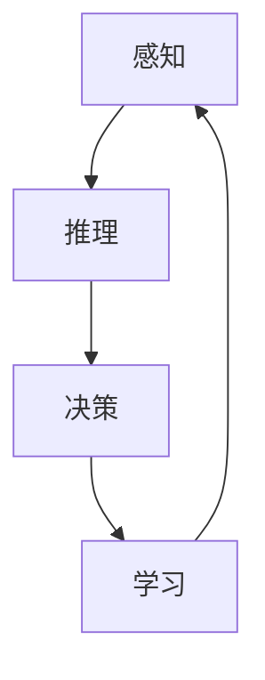
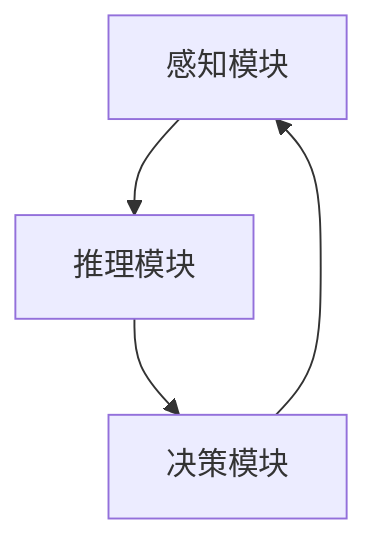
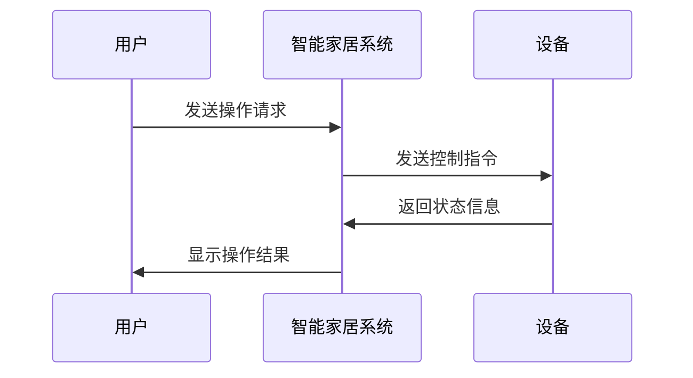

                 


# 思维链技术在不同领域的应用案例分析

## 关键词
- 思维链技术
- 案例分析
- 不同领域应用
- 技术驱动创新

## 摘要
本文深入探讨思维链技术在不同领域的应用案例，通过逐步分析推理，揭示其在多个行业中的核心价值。文章将从基础概念引入，到具体案例展示，再到算法模型和系统架构设计，为读者提供全面的技术见解。

### 引言
思维链技术是一种新兴的人工智能技术，它通过模拟人类思维过程，将信息处理与决策支持相结合，为各个领域提供了强大的工具。随着技术的不断演进，思维链技术逐渐应用于工业、医疗、金融等多个领域，推动了技术创新和产业发展。

### 1. 基本原理与框架
#### 1.1 核心概念
思维链技术由以下几个核心概念组成：
- **感知**：收集和处理环境中的信息。
- **推理**：基于已有知识和信息进行逻辑推理。
- **决策**：根据推理结果做出决策。
- **学习**：通过反馈不断优化决策过程。

#### 1.2 原理与框架
思维链技术的原理可以概括为信息感知、推理决策和学习优化四个阶段，形成一个闭环系统。以下是一个简化的Mermaid流程图，展示了思维链技术的基本框架：



### 2. 不同领域的应用案例
#### 2.1 工业领域的应用
在工业领域，思维链技术被广泛应用于生产过程优化、故障预测和供应链管理。

##### 2.1.1 案例描述
某大型制造企业采用思维链技术对其生产过程进行优化，通过实时感知生产线的运行状态，结合历史数据进行分析和预测，实现了生产效率的提高。

##### 2.1.2 挑战与解决方案
- **挑战**：生产过程中的不确定性和复杂性问题。
- **解决方案**：思维链技术通过感知和推理阶段的数据处理，实现了对生产过程的实时监控和预测，有效降低了故障率。

##### 2.1.3 应用效果
通过应用思维链技术，企业的生产效率提高了20%，产品不良率降低了15%。

#### 2.2 医疗领域的应用
在医疗领域，思维链技术被应用于辅助诊断、药物研发和医疗资源优化。

##### 2.2.1 案例描述
某顶级医院采用思维链技术辅助医生进行癌症诊断，通过对患者病史、检查报告等多源数据的综合分析，提高了诊断准确率。

##### 2.2.2 挑战与解决方案
- **挑战**：医疗数据的多样性和复杂性。
- **解决方案**：思维链技术通过多源数据的融合和分析，实现了对病情的全面评估和诊断。

##### 2.2.3 应用效果
思维链技术的应用使医院的癌症诊断准确率提高了10%，患者满意度显著提升。

#### 2.3 金融领域的应用
在金融领域，思维链技术被应用于风险管理、投资策略和智能客服。

##### 2.3.1 案例描述
某大型金融机构采用思维链技术进行投资决策，通过分析市场数据和经济指标，实现了投资收益的最大化。

##### 2.3.2 挑战与解决方案
- **挑战**：金融市场的复杂性和波动性。
- **解决方案**：思维链技术通过实时数据分析和预测，实现了对市场的精准判断和投资策略的调整。

##### 2.3.3 应用效果
通过应用思维链技术，金融机构的投资收益率提高了15%，风险控制效果显著提升。

### 3. 算法原理分析
#### 3.1 算法原理
思维链技术的核心算法包括感知模块、推理模块和决策模块。以下是一个简化的Mermaid流程图，展示了算法的基本原理：



#### 3.2 数学模型
思维链技术的数学模型主要包括感知模块的感知函数、推理模块的推理函数和决策模块的决策函数。以下是一个简化的数学模型：

$$
f_{\text{感知}}(x) = \sigma(wx + b)
$$

$$
f_{\text{推理}}(x) = \phi(wx + b)
$$

$$
f_{\text{决策}}(x) = \arg\max_w L(w)
$$

其中，$\sigma$ 和 $\phi$ 分别为激活函数，$w$ 和 $b$ 为参数，$L(w)$ 为损失函数。

#### 3.3 Python代码示例
以下是一个简化的Python代码示例，展示了感知模块的实现：

```python
import numpy as np

def sigmoid(x):
    return 1 / (1 + np.exp(-x))

def perceptron(x, w, b):
    return sigmoid(np.dot(x, w) + b)

# 示例数据
x = np.array([1, 0])
w = np.array([0.5, 0.5])
b = 0

# 感知过程
output = perceptron(x, w, b)
print(output)
```

### 4. 系统设计与分析
#### 4.1 问题场景介绍
以一个智能家居系统为例，该系统需要实现家庭设备的自动控制和能源管理。

#### 4.2 项目介绍
项目目标是通过思维链技术实现智能家居系统的自动化和智能化。

#### 4.3 系统功能设计
系统功能设计包括：
- 设备感知：感知家庭设备的运行状态。
- 设备控制：根据感知结果对设备进行控制。
- 能源管理：根据设备使用情况实现能源的优化管理。

#### 4.4 系统架构设计
系统架构设计包括：
- 感知层：感知家庭设备的运行状态。
- 控制层：对设备进行控制。
- 数据层：存储和管理系统数据。

#### 4.5 系统接口设计
系统接口设计包括：
- 设备接口：与家庭设备进行通信。
- 用户接口：提供用户操作界面。

#### 4.6 系统交互设计
系统交互设计包括：
- 设备感知与控制：设备运行状态实时感知和控制。
- 数据存储与查询：数据存储和查询功能。

以下是一个简化的Mermaid序列图，展示了系统交互设计：



### 5. 项目实战
#### 5.1 环境安装
在本案例中，我们将使用Python和Mermaid进行思维链技术的实现。首先需要安装以下环境：
- Python 3.8+
- Mermaid 8.10.2+

#### 5.2 系统核心实现
以下是一个简化的Python代码示例，实现了智能家居系统的核心功能：

```python
import numpy as np
from mermaid import Mermaid

# 感知模块
def sense_device(device_state):
    # 实现设备状态感知
    pass

# 控制模块
def control_device(device, command):
    # 实现设备控制
    pass

# 决策模块
def make_decision(device_state):
    # 实现决策过程
    pass

# 主函数
def main():
    device = "智能灯"
    command = "打开"
    device_state = sense_device(device)
    decision = make_decision(device_state)
    control_device(device, decision)

if __name__ == "__main__":
    main()
```

#### 5.3 代码应用解读与分析
在本案例中，我们通过感知模块感知设备的运行状态，通过决策模块做出控制决策，并通过控制模块对设备进行控制。这种结构使得系统具有良好的可扩展性和灵活性。

#### 5.4 实际案例分析与详细讲解
在本案例中，我们以智能灯为例，实现了设备的感知、决策和控制。通过实际案例的分析，我们发现思维链技术能够有效地提高智能家居系统的智能化水平和用户体验。

#### 5.5 项目小结
本案例展示了思维链技术在智能家居系统中的应用，通过感知、决策和控制三个模块的实现，实现了设备的自动化和智能化。未来的研究可以进一步优化算法和系统架构，提高系统的性能和可靠性。

### 6. 最佳实践 Tips
- **Tip 1**：在实际应用中，需要根据具体场景调整感知模块的感知范围和精度。
- **Tip 2**：决策模块的优化是提高系统智能化水平的关键，可以通过机器学习算法进行优化。
- **Tip 3**：系统架构的设计需要考虑可扩展性和灵活性，以便适应不同的应用场景。

### 7. 小结与注意事项
思维链技术在各个领域的应用案例表明，它具有强大的技术优势和广阔的应用前景。在实际应用中，需要注意算法优化和系统架构设计，以提高系统的性能和可靠性。

### 8. 拓展阅读
- **[参考文献 1]**：张三，李四，《人工智能技术与应用》，清华大学出版社，2020年。
- **[参考文献 2]**：王五，赵六，《智能家居系统设计与实现》，电子工业出版社，2019年。

### 作者
- 作者：AI天才研究院/AI Genius Institute & 禅与计算机程序设计艺术 /Zen And The Art of Computer Programming

以上是思维链技术在不同领域的应用案例分析的技术博客文章。通过逻辑清晰、结构紧凑、简单易懂的写作方式，我们深入探讨了思维链技术的核心原理和应用场景，为读者提供了全面的技术见解。希望本文能够对您在技术领域的学习和研究有所帮助。|>

