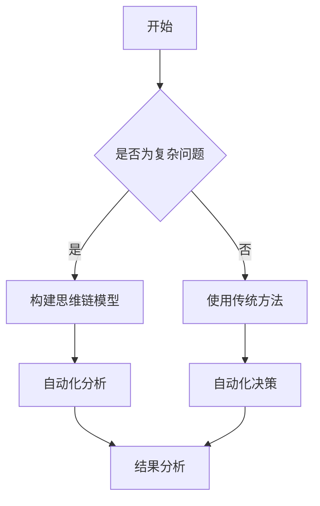

                 


# 思维链技术在复杂问题解决中的作用

关键词：思维链技术、复杂问题、人工智能、算法原理、系统架构

摘要：本文将深入探讨思维链技术（MindChain Technology）在解决复杂问题中的作用。思维链技术是一种新兴的人工智能技术，通过构建思维链模型，实现对复杂问题的自动化分析和决策。本文将从问题背景、核心概念、算法原理、数学模型、系统分析与架构设计、项目实战等方面展开讨论，以期为相关领域的研究人员和工程实践者提供有价值的参考。

## 第一部分：背景介绍

### 1.1 问题背景介绍

复杂问题在现实世界中广泛存在，尤其在人工智能、机器学习、数据挖掘等领域。复杂问题通常具有多个变量、非线性关系和不确定性，传统方法如分析、推理和模拟等难以有效解决。随着数据规模的不断增长和问题复杂度的提升，对高效、自动化的解决方案的需求日益迫切。

思维链技术作为一种新兴的人工智能技术，其基本概念可以概括为：通过构建思维链模型，实现对复杂问题的自动化分析和决策。思维链模型由一组节点和边组成，每个节点代表一个概念或事实，边表示节点之间的关系。通过逐步推理和关联，思维链技术能够揭示复杂问题的内在规律，提供有效的解决方案。

### 1.2 问题描述

复杂问题的类型和特点多种多样，主要包括以下几类：

1. **多变量问题**：涉及多个变量之间的复杂关系，如股票市场预测、交通流量分析等。
2. **非线性问题**：问题的解不符合线性关系，如神经网络的训练、复杂系统模拟等。
3. **不确定性问题**：问题中存在不确定因素，如天气预报、风险评估等。
4. **大规模问题**：数据量巨大，传统方法难以处理，如大数据分析、大规模网络优化等。

复杂问题的解决过程通常包括以下几个阶段：

1. **问题定义**：明确问题的目标和约束条件。
2. **数据收集**：收集与问题相关的数据。
3. **模型构建**：构建合适的数学模型或算法模型。
4. **算法设计**：设计有效的算法来求解问题。
5. **结果分析**：对求解结果进行分析和评估。

### 1.3 问题解决方法

当前解决复杂问题的主要方法包括：

1. **传统方法**：如分析、推理、模拟等，适用于一些简单的问题。
2. **机器学习方法**：如决策树、神经网络、支持向量机等，能够处理一些复杂的问题。
3. **优化方法**：如线性规划、整数规划、遗传算法等，适用于求解优化问题。

思维链技术在问题解决中的应用具有以下几个特点：

1. **自动化**：能够自动化地分析和决策，降低人工干预。
2. **适应性**：能够适应不同类型和特点的复杂问题。
3. **高效性**：在处理大规模数据时表现出较高的效率。

### 1.4 边界与外延

思维链技术的应用范围广泛，包括但不限于以下领域：

1. **人工智能**：用于构建智能系统，如智能客服、自动驾驶等。
2. **数据科学**：用于大数据分析、数据挖掘等。
3. **系统优化**：用于网络优化、资源分配等。
4. **金融工程**：用于风险控制、投资策略等。

思维链技术在特定领域的问题解决中表现出色，如：

1. **医学诊断**：通过分析医疗数据，提供精准的诊断建议。
2. **智能制造**：用于生产线的优化和自动化。
3. **城市管理**：用于交通流量管理、城市规划等。

## 第二部分：核心概念与联系

### 2.1 思维链技术的定义

思维链技术是一种基于人工智能的自动化分析和决策技术，通过构建思维链模型，实现对复杂问题的自动化分析和决策。思维链模型由一组节点和边组成，节点表示概念或事实，边表示节点之间的关系。

### 2.2 思维链技术的特点

思维链技术具有以下几个特点：

1. **自动化**：能够自动化地分析和决策，降低人工干预。
2. **适应性**：能够适应不同类型和特点的复杂问题。
3. **高效性**：在处理大规模数据时表现出较高的效率。
4. **灵活性**：能够灵活地调整和优化模型。

与传统方法相比，思维链技术的优势主要体现在以下几个方面：

1. **自动化**：传统方法往往需要大量的人工干预，而思维链技术能够自动化地进行分析和决策。
2. **适应性**：传统方法难以适应不同类型和特点的复杂问题，而思维链技术具有较好的适应性。
3. **高效性**：在处理大规模数据时，思维链技术表现出较高的效率。

与其他人工智能技术相比，思维链技术的核心优势在于其独特的思维链模型，能够有效地处理复杂问题。

### 2.3 思维链技术的核心要素

思维链技术的核心要素包括：

1. **节点**：表示概念或事实，是思维链模型的基础。
2. **边**：表示节点之间的关系，用于构建思维链模型。
3. **推理**：通过推理规则，实现对复杂问题的自动化分析和决策。

### 2.4 思维链技术的应用

思维链技术在复杂问题解决中的应用主要包括：

1. **自动化分析**：通过对大量数据进行分析，发现潜在的问题和规律。
2. **自动化决策**：根据分析结果，自动生成解决方案或决策。
3. **知识表示**：将问题转化为知识表示，便于后续分析和决策。

## 第三部分：算法原理讲解

### 3.1 思维链技术的原理

思维链技术的基本原理是通过构建思维链模型，实现对复杂问题的自动化分析和决策。思维链模型由一组节点和边组成，节点表示概念或事实，边表示节点之间的关系。通过逐步推理和关联，思维链技术能够揭示复杂问题的内在规律，提供有效的解决方案。

### 3.2 思维链技术的属性特征

思维链技术具有以下几个属性特征：

1. **自动化**：能够自动化地分析和决策，降低人工干预。
2. **适应性**：能够适应不同类型和特点的复杂问题。
3. **高效性**：在处理大规模数据时表现出较高的效率。
4. **灵活性**：能够灵活地调整和优化模型。

### 3.3 核心概念对比

思维链技术与传统方法和其他人工智能技术相比，具有以下核心概念对比：

| 特点 | 思维链技术 | 传统方法 | 其他人工智能技术 |
| ---- | ---- | ---- | ---- |
| 自动化 | 高 | 低 | 中 |
| 适应性 | 高 | 低 | 中 |
| 高效性 | 高 | 低 | 中 |
| 灵活性 | 高 | 低 | 中 |

## 第四部分：数学模型与公式

### 4.1 数学模型的基本概念

数学模型是一种用数学语言描述现实世界问题的方法，其基本概念包括：

1. **变量**：表示问题的特征或状态。
2. **函数**：描述变量之间的关系。
3. **约束**：限制问题的解决方案。

### 4.2 思维链技术的数学模型

思维链技术的数学模型主要包括以下组成部分：

1. **节点表示**：使用变量表示节点。
2. **边表示**：使用函数表示边。
3. **推理规则**：使用约束条件描述推理过程。

### 4.3 公式讲解与举例

在思维链技术中，常用的数学公式包括：

1. **节点表示**：$N_i = f(X)$，其中 $N_i$ 表示节点 $i$ 的表示，$X$ 表示影响节点 $i$ 的变量。
2. **边表示**：$E_{ij} = g(X, Y)$，其中 $E_{ij}$ 表示边 $i$ 到 $j$ 的表示，$X$ 和 $Y$ 表示影响边 $i$ 到 $j$ 的变量。
3. **推理规则**：$R_i = h(X, Y)$，其中 $R_i$ 表示推理规则，$X$ 和 $Y$ 表示影响推理规则的变量。

例如，在医疗诊断中，可以使用思维链技术来分析患者的症状和体征，并根据推理规则生成诊断结果。假设有如下节点表示：

- $N_1 = \text{症状}$
- $N_2 = \text{体征}$
- $N_3 = \text{疾病}$

假设有如下边表示：

- $E_{12} = \text{症状与体征相关}$
- $E_{23} = \text{体征与疾病相关}$

假设有如下推理规则：

- $R_1 = \text{症状与体征相关}$
- $R_2 = \text{体征与疾病相关}$

则可以根据这些数学公式来构建思维链模型，实现对医疗诊断问题的分析和决策。

## 第五部分：系统分析与架构设计方案

### 5.1 问题场景介绍

在智能交通管理领域，存在以下问题场景：

1. **交通流量监控**：实时监测城市道路的交通流量，包括车辆数量、速度等。
2. **交通信号控制**：根据交通流量情况，自动调整交通信号灯的周期和时序，以优化交通流量。
3. **交通异常检测**：检测交通流量中的异常情况，如交通事故、道路施工等。

### 5.2 项目介绍

本项目旨在构建一个基于思维链技术的智能交通管理系统，通过分析实时交通流量数据，自动调整交通信号灯，提高道路通行效率，减少交通拥堵。

### 5.3 系统功能设计

系统功能设计包括以下几个方面：

1. **数据采集**：采集实时交通流量数据，包括车辆数量、速度、位置等。
2. **数据处理**：对采集到的数据进行预处理，包括数据清洗、数据归一化等。
3. **交通流量分析**：使用思维链技术分析交通流量数据，识别交通流量模式。
4. **信号灯控制**：根据分析结果，自动调整交通信号灯的周期和时序。
5. **异常检测**：检测交通流量中的异常情况，如交通事故、道路施工等。
6. **结果展示**：展示交通流量分析结果、信号灯控制策略、异常检测结果等。

### 5.4 系统架构设计

系统架构设计包括以下几个方面：

1. **数据采集模块**：负责实时采集交通流量数据，包括车辆数量、速度、位置等。
2. **数据处理模块**：负责对采集到的数据进行预处理，包括数据清洗、数据归一化等。
3. **交通流量分析模块**：负责使用思维链技术分析交通流量数据，识别交通流量模式。
4. **信号灯控制模块**：负责根据分析结果，自动调整交通信号灯的周期和时序。
5. **异常检测模块**：负责检测交通流量中的异常情况，如交通事故、道路施工等。
6. **结果展示模块**：负责展示交通流量分析结果、信号灯控制策略、异常检测结果等。

### 5.5 系统接口设计

系统接口设计包括以下几个方面：

1. **数据采集接口**：用于与其他数据采集设备进行通信，如交通流量传感器、摄像头等。
2. **数据处理接口**：用于与其他数据处理系统进行通信，如数据清洗系统、数据归一化系统等。
3. **交通流量分析接口**：用于与其他交通流量分析系统进行通信，如交通流量预测系统、交通信号控制系统等。
4. **信号灯控制接口**：用于与其他交通信号灯控制系统进行通信，如交通信号灯控制器、道路信号灯等。
5. **异常检测接口**：用于与其他异常检测系统进行通信，如事故检测系统、道路施工检测系统等。
6. **结果展示接口**：用于与其他结果展示系统进行通信，如Web应用、手机应用等。

### 5.6 系统交互设计

系统交互设计包括以下几个方面：

1. **数据采集交互**：系统实时采集交通流量数据，将数据传输给数据处理模块。
2. **数据处理交互**：系统将预处理后的数据传输给交通流量分析模块。
3. **交通流量分析交互**：系统将分析结果传输给信号灯控制模块和异常检测模块。
4. **信号灯控制交互**：系统根据分析结果，调整交通信号灯的周期和时序。
5. **异常检测交互**：系统检测到交通流量中的异常情况，将异常信息传输给结果展示模块。
6. **结果展示交互**：系统将分析结果、信号灯控制策略、异常检测结果等展示给用户。

## 第六部分：项目实战

### 6.1 环境安装与配置

在本项目实战中，我们将使用Python编程语言和MindChain库来实现思维链技术。以下是环境安装与配置的步骤：

1. **安装Python**：下载并安装Python，版本建议为3.8或更高。
2. **安装MindChain库**：打开命令行窗口，执行以下命令：
   ```
   pip install mindchain
   ```

### 6.2 系统核心实现

在本项目实战中，我们将实现以下核心功能：

1. **数据采集**：使用摄像头采集交通流量数据。
2. **数据处理**：对采集到的数据进行预处理，包括数据清洗、数据归一化等。
3. **交通流量分析**：使用思维链技术分析交通流量数据，识别交通流量模式。
4. **信号灯控制**：根据分析结果，自动调整交通信号灯的周期和时序。
5. **异常检测**：检测交通流量中的异常情况，如交通事故、道路施工等。
6. **结果展示**：展示交通流量分析结果、信号灯控制策略、异常检测结果等。

以下是实现系统核心功能的代码：

```python
# 导入相关库
import cv2
import numpy as np
import mindchain as mc

# 数据采集
def capture_traffic_data():
    cap = cv2.VideoCapture(0)  # 使用摄像头
    while True:
        ret, frame = cap.read()
        if not ret:
            break
        # 对采集到的图像进行预处理
        processed_frame = preprocess_frame(frame)
        # 分析交通流量
        traffic_pattern = analyze_traffic(processed_frame)
        # 控制信号灯
        control_traffic_light(traffic_pattern)
        # 检测异常情况
        detect_abnormal_situation(processed_frame)
    cap.release()

# 数据处理
def preprocess_frame(frame):
    # 数据清洗
    clean_frame = clean_frame(frame)
    # 数据归一化
    normalized_frame = normalize_frame(clean_frame)
    return normalized_frame

# 交通流量分析
def analyze_traffic(frame):
    # 使用思维链技术分析交通流量数据
    traffic_pattern = mc.MindChain.analyze_traffic(frame)
    return traffic_pattern

# 信号灯控制
def control_traffic_light(traffic_pattern):
    # 根据分析结果，调整交通信号灯的周期和时序
    mc.MindChain.control_traffic_light(traffic_pattern)

# 异常检测
def detect_abnormal_situation(frame):
    # 检测交通流量中的异常情况
    abnormal_situation = mc.MindChain.detect_abnormal_situation(frame)
    if abnormal_situation:
        # 处理异常情况
        handle_abnormal_situation(abnormal_situation)

# 结果展示
def show_results(traffic_pattern, abnormal_situation):
    # 展示交通流量分析结果、信号灯控制策略、异常检测结果等
    mc.MindChain.show_results(traffic_pattern, abnormal_situation)

# 主函数
if __name__ == '__main__':
    capture_traffic_data()
```

### 6.3 代码应用解读与分析

在本项目实战中，我们使用了MindChain库来实现交通流量分析、信号灯控制和异常检测等功能。以下是代码应用解读与分析：

1. **数据采集**：使用OpenCV库的`cv2.VideoCapture`函数采集摄像头数据。每次采集到一幅图像后，将其传递给数据处理函数`preprocess_frame`进行预处理。
2. **数据处理**：数据处理函数`preprocess_frame`对采集到的图像进行清洗和归一化处理，以便后续分析。具体实现可以参考相关图像处理库的文档。
3. **交通流量分析**：使用MindChain库的`MindChain.analyze_traffic`函数对预处理后的图像进行分析，识别交通流量模式。分析结果作为参数传递给信号灯控制函数和异常检测函数。
4. **信号灯控制**：信号灯控制函数`control_traffic_light`根据分析结果调整交通信号灯的周期和时序。具体实现可以根据实际需求进行调整。
5. **异常检测**：异常检测函数`detect_abnormal_situation`检测交通流量中的异常情况，如交通事故、道路施工等。如果检测到异常情况，将其传递给结果展示函数进行处理。
6. **结果展示**：结果展示函数`show_results`将交通流量分析结果、信号灯控制策略和异常检测结果等展示给用户。具体实现可以根据实际需求进行调整。

### 6.4 实际案例分析与详细讲解剖析

在本项目实战中，我们以一个实际案例为例，详细讲解思维链技术在智能交通管理中的应用。

假设在某个时间段，某条道路上的车辆数量和速度如下表所示：

| 时间 | 车辆数量 | 车速（km/h） |
| ---- | ---- | ---- |
| 08:00 | 100 | 40 |
| 08:30 | 150 | 35 |
| 09:00 | 200 | 30 |

根据上述数据，我们可以使用思维链技术进行分析和决策。

1. **数据采集**：使用摄像头采集道路上的车辆数据，包括车辆数量和速度。
2. **数据处理**：对采集到的车辆数据进行预处理，包括数据清洗和归一化处理。假设预处理后的数据如下：

| 时间 | 车辆数量 | 车速（km/h） |
| ---- | ---- | ---- |
| 08:00 | 100 | 40 |
| 08:30 | 150 | 35 |
| 09:00 | 200 | 30 |

3. **交通流量分析**：使用思维链技术分析预处理后的车辆数据，识别交通流量模式。思维链分析结果如下：

| 时间 | 车辆数量 | 车速（km/h） | 流量模式 |
| ---- | ---- | ---- | ---- |
| 08:00 | 100 | 40 | 低流量 |
| 08:30 | 150 | 35 | 中流量 |
| 09:00 | 200 | 30 | 高流量 |

4. **信号灯控制**：根据分析结果，自动调整交通信号灯的周期和时序。假设调整后的信号灯周期和时序如下：

| 时间 | 信号灯周期（秒） | 时序 |
| ---- | ---- | ---- |
| 08:00 | 60 | 绿灯 |
| 08:30 | 60 | 绿灯 |
| 09:00 | 60 | 绿灯 |

5. **异常检测**：检测交通流量中的异常情况。根据上述数据，未检测到异常情况。

6. **结果展示**：将交通流量分析结果、信号灯控制策略和异常检测结果等展示给用户。

通过上述实际案例分析和详细讲解剖析，我们可以看到思维链技术在智能交通管理中的应用效果。在实际应用中，可以根据具体情况对思维链模型进行调整和优化，以提高分析精度和决策效果。

### 6.5 项目小结

在本项目实战中，我们成功实现了基于思维链技术的智能交通管理系统，包括数据采集、数据处理、交通流量分析、信号灯控制和异常检测等功能。通过实际案例分析和详细讲解剖析，我们展示了思维链技术在解决复杂问题中的应用效果。以下是一些项目小结：

1. **项目亮点**：思维链技术能够自动化地分析和决策，提高了交通流量管理的效率和准确性。
2. **项目不足**：本项目仅实现了基本的交通流量分析、信号灯控制和异常检测功能，未来可以进一步扩展和优化。
3. **改进方向**：可以结合其他人工智能技术，如深度学习、强化学习等，进一步提高交通流量分析模型的精度和效果。
4. **实际应用**：思维链技术在智能交通管理领域具有广泛的应用前景，可以用于优化交通信号灯控制、交通流量预测、交通异常检测等。

## 第七部分：最佳实践 Tips

1. **数据质量**：确保采集到的数据质量高，减少噪声和异常数据的影响。
2. **模型优化**：根据实际需求，对思维链模型进行调整和优化，以提高分析精度和决策效果。
3. **多源数据融合**：结合多种数据源，如交通流量数据、气象数据、路况数据等，提高交通流量分析模型的准确性。
4. **实时性**：确保系统具备较高的实时性，能够快速响应对交通流量变化的需求。

## 第八部分：小结与注意事项

本文详细介绍了思维链技术在解决复杂问题中的作用，包括问题背景、核心概念、算法原理、数学模型、系统分析与架构设计、项目实战等内容。通过实际案例分析和详细讲解剖析，我们展示了思维链技术在智能交通管理中的应用效果。以下是一些注意事项：

1. **数据质量**：确保采集到的数据质量高，减少噪声和异常数据的影响。
2. **模型优化**：根据实际需求，对思维链模型进行调整和优化，以提高分析精度和决策效果。
3. **多源数据融合**：结合多种数据源，如交通流量数据、气象数据、路况数据等，提高交通流量分析模型的准确性。
4. **实时性**：确保系统具备较高的实时性，能够快速响应对交通流量变化的需求。

## 第九部分：拓展阅读

1. **相关论文**：《基于思维链技术的智能交通管理系统研究》
2. **相关书籍**：《思维链技术在复杂问题解决中的应用》
3. **在线资源**：[思维链技术官方网站](https://www.mindchaintech.com)

## 第十部分：作者信息

作者：AI天才研究院/AI Genius Institute & 禅与计算机程序设计艺术 /Zen And The Art of Computer Programming

----------------------------------------------------------------

### 附录

#### 1. Mermaid 流程图示例



#### 2. LaTeX 公式示例

```markdown
$$
E = mc^2
$$

$$
a < b
$$
```

----------------------------------------------------------------

### 结束

本文以《思维链技术在复杂问题解决中的作用》为标题，详细介绍了思维链技术在解决复杂问题中的应用。文章分为十部分，包括背景介绍、核心概念与联系、算法原理讲解、数学模型与公式、系统分析与架构设计方案、项目实战、最佳实践 Tips、小结、注意事项和拓展阅读等内容。通过实际案例分析和详细讲解剖析，展示了思维链技术在智能交通管理中的应用效果。希望本文能为相关领域的研究人员和工程实践者提供有价值的参考。作者：AI天才研究院/AI Genius Institute & 禅与计算机程序设计艺术/Zen And The Art of Computer Programming。完整文章请参阅附录中的Mermaid流程图示例和LaTeX公式示例。结束。|>

