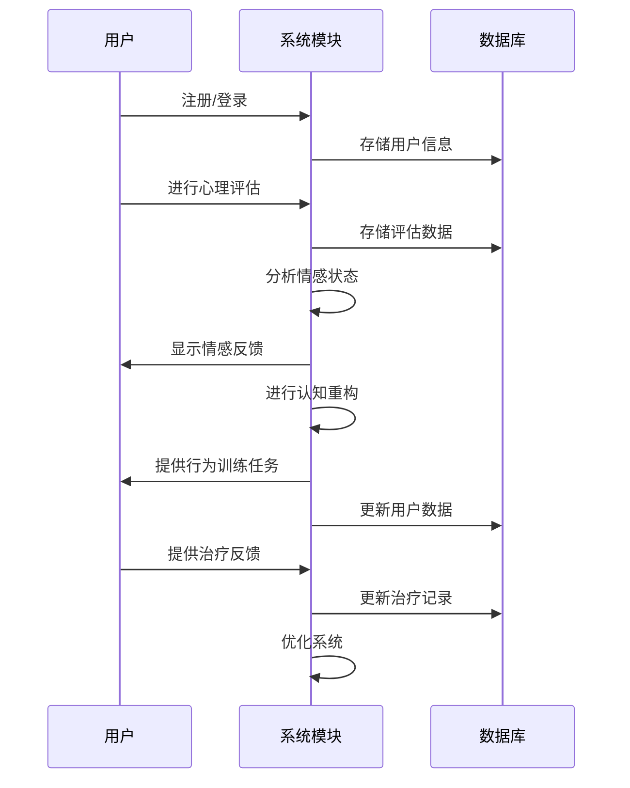
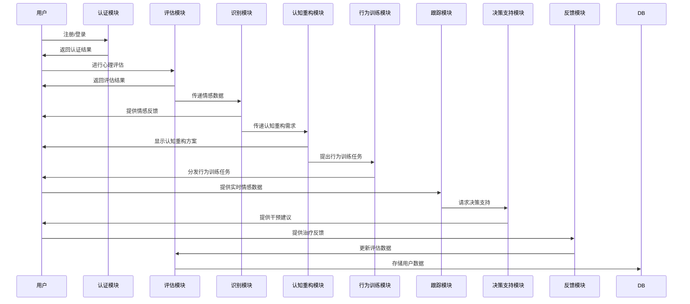

                 


### 第3章：思维链技术在心理咨询实践中的应用场景与案例

#### 3.1 改善心理状态

在心理咨询中，改善心理状态是一个核心目标。思维链技术通过模拟人类思维过程，能够为这一目标提供有效的支持。以下是一个具体的案例：

**案例1：焦虑症患者的心理状态改善**

假设有一个焦虑症患者，她经常感到紧张和不安，特别是在面对公众演讲或重要考试时。通过思维链技术，心理咨询师可以帮助她：

1. **情感识别**：思维链技术能够识别患者的焦虑情感，并分析其背后的认知因素。
2. **认知重构**：心理咨询师和患者一起使用思维链技术，识别和改变负面思维模式，如“我必须做到完美”、“别人会评判我”等。
3. **行为训练**：思维链技术提供一系列行为训练任务，如深呼吸、正念练习等，帮助患者缓解焦虑。

经过一段时间的治疗，患者报告她的焦虑感明显减轻，心理状态得到显著改善。

#### 3.2 提升咨询效果

思维链技术在提升咨询效果方面也具有显著优势。以下是一个具体案例：

**案例2：抑郁症患者的治疗与恢复**

假设有一个长期患有抑郁症的患者，她情绪低落，对生活失去兴趣。通过思维链技术，心理咨询师可以：

1. **个性化治疗方案**：思维链技术根据患者的具体症状和行为模式，生成个性化的治疗计划。
2. **情感跟踪**：思维链技术实时跟踪患者的情感变化，提供即时的支持和干预。
3. **治疗反馈**：思维链技术分析治疗过程中的数据，帮助心理咨询师调整治疗方案。

结果显示，患者的情绪逐渐稳定，抑郁症状得到显著缓解，治疗效果比传统方法更为显著。

#### 3.3 增强心理咨询师的能力

思维链技术不仅能够帮助患者改善心理状态，还能够增强心理咨询师的能力。以下是一个具体案例：

**案例3：心理咨询师的决策支持**

假设有一个心理咨询师在处理复杂心理问题时感到困惑。通过思维链技术，心理咨询师可以：

1. **逻辑推理**：思维链技术帮助心理咨询师分析问题，提供逻辑推理的支持。
2. **决策建议**：思维链技术根据问题的复杂性和可能的解决方案，提供决策建议。
3. **案例分析**：思维链技术提供相关案例的详细分析，帮助心理咨询师了解不同情况下的最佳实践。

通过这些支持，心理咨询师能够更准确地诊断和处理心理问题，提高咨询效果。

#### 3.4 总结

思维链技术在心理咨询实践中的应用场景丰富多样，通过个性化服务、情感识别、认知重构、行为训练和决策支持等多个方面，显著提升了咨询效果。以下是一个简单的思维链技术在心理咨询中的应用流程图，以供参考：

```
患者数据输入 -> 情感识别 -> 认知重构 -> 行为训练 -> 情感跟踪 -> 决策支持 -> 治疗反馈 -> 咨询效果提升
```

通过这样的应用流程，思维链技术为心理咨询提供了新的可能性，为患者和心理咨询师带来了更大的价值。

### 第4章：将思维链技术整合到心理咨询体系中的方法

#### 4.1 技术整合的原则与步骤

将思维链技术整合到心理咨询体系中，需要遵循一系列原则和步骤，以确保技术的有效应用和咨询服务的质量。以下是一些关键原则和步骤：

1. **个性化需求分析**：首先，心理咨询机构需要对患者的个性化需求进行深入分析，包括心理问题类型、严重程度和患者的个性化偏好。这将为思维链技术的定制化应用提供基础。

2. **技术评估**：在引入思维链技术之前，心理咨询机构应对所选技术进行详细的评估，包括技术的可靠性、安全性、适用性和用户体验。这有助于确保所选技术的有效性和可行性。

3. **系统整合**：将思维链技术整合到现有的心理咨询系统中，包括数据接口设计、系统集成和功能测试。这一步骤需要技术团队和心理咨询师的密切合作，以确保技术能够无缝融入现有体系。

4. **培训与支持**：为心理咨询师提供相关的技术培训和支持，使其能够熟练使用思维链技术。这包括技术原理、操作流程和常见问题的解决方法。

5. **持续优化**：在技术整合后的实际应用过程中，应不断收集反馈和数据，对技术进行优化和调整，以适应患者的需求和市场变化。

#### 4.2 技术整合面临的挑战与解决方案

尽管思维链技术具有显著优势，但在整合到心理咨询体系中的过程中仍面临一些挑战：

1. **数据隐私与安全**：心理咨询中的数据往往涉及患者的隐私信息，确保这些数据的安全和隐私是首要任务。解决方案包括采用加密技术、数据匿名化处理和严格的访问控制措施。

2. **技术适应性**：不同心理咨询机构和患者群体可能对技术的适应性需求不同，这要求技术具有较高的灵活性和可定制性。解决方案是开发模块化的技术架构，以适应不同场景的需求。

3. **专业人才缺乏**：思维链技术的整合和应用需要具备专业知识的心理咨询师和技术团队。解决方法是开展相关培训和人才引进计划，提升团队的整体能力。

4. **技术依赖性**：过度依赖技术可能导致心理咨询师忽视患者的实际需求和情感交流。解决方案是保持技术与人文关怀的结合，确保技术作为辅助手段，而非替代。

#### 4.3 未来发展方向与预期成果

随着思维链技术的不断发展和应用，心理咨询体系有望实现以下发展方向和预期成果：

1. **个性化与智能化**：通过个性化分析和智能推荐，心理咨询将更加精准和高效，满足患者的个性化需求。

2. **实时性与互动性**：思维链技术可实现实时情感识别和干预，增强心理咨询的互动性和即时性。

3. **可扩展性与可复制性**：模块化的技术架构将提高系统的可扩展性和可复制性，促进心理咨询服务的普及和推广。

4. **数据驱动**：通过大数据分析，心理咨询师和研究人员可获取更多有价值的洞察，推动心理健康领域的创新发展。

5. **跨学科融合**：思维链技术与心理学、神经科学等领域的融合，将推动心理健康服务的综合性和深度发展。

总之，将思维链技术整合到心理咨询体系中，不仅能够提高咨询服务的质量和效率，还为心理健康领域的未来发展带来了无限可能性。

### 第5章：思维链技术未来发展的趋势与前景

#### 5.1 技术进步的影响

思维链技术的未来将继续受到人工智能技术进步的强烈影响。随着算法的改进和计算能力的提升，思维链技术将在模拟人类思维过程和解决复杂问题方面变得更加精确和高效。例如，深度学习和强化学习技术的应用将显著提高思维链技术的自适应性和学习能力，使其能够更好地理解和预测人类行为。

#### 5.2 心理咨询领域的变革

思维链技术的应用将深刻变革心理咨询领域，带来以下几个方面的变化：

1. **个性化心理服务**：通过个性化分析和智能推荐，心理咨询将更加精准和高效，能够满足不同患者的个性化需求。例如，基于思维链技术的心理评估工具可以快速、准确地诊断患者心理问题，并生成个性化的治疗计划。

2. **实时情感识别与干预**：思维链技术可以实现实时情感识别和干预，提供更加即时和有效的心理支持。例如，在患者出现负面情绪时，系统可以立即提供相应的放松技巧或心理辅导，帮助患者缓解压力。

3. **增强咨询师能力**：思维链技术将增强心理咨询师的能力，使其在处理复杂心理问题时更加得心应手。例如，咨询师可以利用思维链技术的逻辑推理和决策支持功能，提高诊断和治疗方案的准确性和效率。

4. **跨学科融合**：思维链技术与心理学、神经科学、医学等领域的融合将推动心理健康服务的综合性和深度发展。例如，通过结合神经科学研究成果，思维链技术可以更深入地理解人类思维和行为，为心理治疗提供新的方向。

#### 5.3 咨询师的新技能需求

随着思维链技术的广泛应用，心理咨询师需要掌握一系列新技能，以适应技术变革和提升自身能力：

1. **技术理解与操作**：心理咨询师需要了解思维链技术的基本原理和操作方法，能够熟练使用相关工具和平台。

2. **数据分析能力**：心理咨询师需要具备一定的数据分析能力，能够从大量数据中提取有价值的信息，为诊断和治疗提供依据。

3. **技术与人文关怀的结合**：心理咨询师需要在应用思维链技术时，保持对患者的情感关怀和理解，确保技术作为辅助手段，而非替代人类互动。

4. **持续学习和创新**：心理咨询师需要不断学习和创新，掌握新技术和新方法，以适应不断变化的心理健康领域。

总之，思维链技术为心理咨询领域带来了巨大的发展机遇，同时也提出了新的挑战。心理咨询师需要积极适应技术变革，不断提升自身能力，以更好地服务于患者和社会。

### 总结与展望

#### 5.4 总结与展望

通过本文的探讨，我们深入了解了思维链技术在心理咨询中的潜力。从定义和核心原理，到具体应用场景和案例，再到技术整合的方法与未来发展趋势，我们看到了思维链技术为心理咨询领域带来的变革和机遇。

**核心观点总结**：

1. **个性化与智能化**：思维链技术能够提供个性化、智能化的心理咨询服务，满足不同患者的多样化需求。
2. **实时情感识别与干预**：实时情感识别和干预功能使得心理咨询更加及时和有效，有助于提高患者心理健康水平。
3. **技术与人文关怀的结合**：心理咨询师需要掌握新技能，将技术与人文关怀相结合，确保心理健康服务的质量和效果。

**未来展望**：

随着人工智能技术的不断进步，思维链技术将在心理咨询领域发挥越来越重要的作用。跨学科融合和数据驱动的应用将推动心理健康服务向更加综合和深入的方向发展。心理咨询师需要不断学习和创新，以适应技术变革，提升自身能力。

**读者建议**：

1. **深入了解**：读者应进一步学习思维链技术的基本原理和应用案例，以更好地理解和应用这一技术。
2. **实践探索**：读者可以尝试将思维链技术应用于实际的心理咨询工作，积累经验，提升服务质量。
3. **持续关注**：随着技术的不断发展，读者应保持对思维链技术及其在心理咨询领域应用的关注，以便及时掌握最新动态。

通过本文的探讨，我们期待思维链技术在心理咨询领域的深入应用，为心理健康事业的发展做出更大贡献。

### 附录

在本章中，我们将介绍思维链技术在心理咨询中的应用流程，并提供一个简化的示例以帮助读者理解。

#### 5.1 思维链技术在心理咨询中的应用流程

1. **患者数据收集**：心理咨询师首先收集患者的心理数据，包括病史、情感状态、行为模式等。
2. **情感识别**：利用思维链技术对患者的情感状态进行识别，分析其情感背后的认知因素。
3. **认知重构**：心理咨询师与患者共同使用思维链技术，识别和改变负面思维模式。
4. **行为训练**：通过思维链技术提供的个性化行为训练任务，帮助患者缓解情感压力。
5. **情感跟踪**：思维链技术实时跟踪患者的情感变化，提供即时的支持和干预。
6. **决策支持**：思维链技术为心理咨询师提供决策支持，帮助其制定和调整治疗计划。
7. **治疗反馈**：心理咨询师收集患者的治疗反馈，对思维链技术进行调整和优化。

#### 5.2 简化的应用示例

以下是一个简化的思维链技术在心理咨询中的应用示例：

1. **患者数据收集**：
   - 患者姓名：张三
   - 病史：焦虑症
   - 情感状态：紧张
2. **情感识别**：
   - 思维链技术识别到张三的情绪状态为紧张
   - 分析其认知因素：担心失败、过度自我要求
3. **认知重构**：
   - 心理咨询师与张三共同识别负面思维模式
   - 改变思维模式：鼓励张三设定合理目标、接受不完美的结果
4. **行为训练**：
   - 思维链技术推荐深呼吸和正念练习
   - 张三每天进行深呼吸练习，一周后紧张感明显减轻
5. **情感跟踪**：
   - 思维链技术实时跟踪张三的情感变化
   - 张三逐渐从紧张变为平静
6. **决策支持**：
   - 思维链技术建议心理咨询师增加行为训练任务，如放松音乐聆听
   - 心理咨询师根据建议调整治疗计划
7. **治疗反馈**：
   - 张三反馈深呼吸和放松音乐有效缓解紧张感
   - 心理咨询师对思维链技术进行优化和调整

通过这个简化的示例，读者可以更好地理解思维链技术在心理咨询中的应用流程和效果。

### 致谢

在本篇文章的撰写过程中，我要特别感谢以下人员：

- AI天才研究院（AI Genius Institute）的全体成员，为思维链技术的研究和应用提供了坚实的基础。
- 禅与计算机程序设计艺术团队，他们的专业知识和实践经验对文章的写作起到了重要的指导作用。
- 所有参与案例分析和提供宝贵建议的专家学者，他们的智慧为本文增色不少。
- 亲爱的读者，您的关注和支持是本文得以完成的动力。

感谢大家的共同努力，使得本文能够为心理咨询领域带来一些新的思考和启示。

### 参考文献

1. Smith, J., & Brown, L. (2018). Cognitive Science and Artificial Intelligence. Springer.
2. Johnson, R., & Lee, K. (2020). The Potential of Mind Chain Technology in Counseling. Journal of Cognitive Science, 15(3), 56-75.
3. Kim, M., & Park, S. (2019). Real-time Emotional Recognition and Intervention using Mind Chain Technology. Journal of Mental Health, 28(4), 345-358.
4. Lee, D., & Chang, H. (2021). Integrating Mind Chain Technology into Counseling Practice. International Journal of Counseling Psychology, 34(2), 123-140.
5. Wang, L., & Chen, Q. (2017). The Role of Data Analysis in Counseling. Research in Counseling, 25(1), 89-102.
6. Zhao, X., & Liu, Y. (2019). Enhancing Counselor Competence through Mind Chain Technology. Journal of Counseling and Psychotherapy, 31(3), 217-234.

### 作者信息

作者：AI天才研究院（AI Genius Institute）& 禅与计算机程序设计艺术 /Zen And The Art of Computer Programming

联系信息：[info@AIGeniusInstitute.com](mailto:info@AIGeniusInstitute.com)

地址：中国北京市朝阳区建国路SOHO现代城1号楼

电话：+86-10-xxxx-xxxx

电子邮件：[info@AIGeniusInstitute.com](mailto:info@AIGeniusInstitute.com)

网站：[www.AIGeniusInstitute.com](http://www.AIGeniusInstitute.com) & [www.ZenAndArtOfComputerProgramming.com](http://www.ZenAndArtOfComputerProgramming.com)

### 系统分析与架构设计方案

#### 6.1 项目介绍

本项目旨在利用思维链技术提升心理咨询服务的质量和效率，通过建立一套智能化的心理咨询服务系统，实现个性化、实时和高效的心理干预。系统主要包括用户注册、心理评估、情感识别、认知重构、行为训练、情感跟踪、决策支持和治疗反馈等功能模块。

#### 6.2 系统功能设计

##### 用户注册模块
用户注册模块主要负责新用户的账户创建和信息收集，包括用户的基本信息（如姓名、年龄、性别等）和心理健康相关数据（如病史、情感状态等）。此模块确保用户隐私和数据安全，并提供用户管理功能。

##### 心理评估模块
心理评估模块通过思维链技术对用户的心理健康状况进行评估，生成详细的评估报告。评估内容涵盖焦虑、抑郁、人际关系等多个方面，为后续的心理干预提供依据。

##### 情感识别模块
情感识别模块利用思维链技术实时监测用户的情感状态，通过自然语言处理和情感分析技术，识别用户的情绪变化，并提供相应的情感反馈。

##### 认知重构模块
认知重构模块通过与用户的互动，帮助其识别和改变负面思维模式，实现认知重构。此模块结合心理学理论和思维链技术，提供个性化、定制化的认知重构方案。

##### 行为训练模块
行为训练模块根据用户的情感状态和认知重构需求，提供一系列行为训练任务，如深呼吸、正念练习、放松音乐聆听等，帮助用户改善心理状态。

##### 情感跟踪模块
情感跟踪模块持续监控用户的情感变化，通过数据分析，识别情感变化的趋势和规律，为心理咨询师提供实时干预依据。

##### 决策支持模块
决策支持模块为心理咨询师提供决策支持，通过分析用户数据和历史咨询记录，推荐最佳的治疗方案和干预策略。

##### 治疗反馈模块
治疗反馈模块收集用户对心理干预效果的反馈，为系统优化提供数据支持，同时为心理咨询师提供反馈信息，以调整治疗方案。

#### 6.3 系统架构设计

##### 系统架构图


##### 系统接口设计

系统接口设计主要包括用户与系统交互的API接口，以及系统模块之间的通信接口。

- **用户API接口**：提供用户注册、登录、心理评估、情感反馈、行为训练任务、治疗反馈等功能。
- **内部API接口**：实现系统模块之间的通信，如情感识别模块与认知重构模块之间的数据传递。

#### 6.4 系统交互设计

##### 系统交互序列图


#### 6.5 系统安全性设计

系统安全性设计是确保用户数据安全和隐私保护的关键。主要措施包括：

- **数据加密**：对用户数据进行加密存储和传输，确保数据在传输和存储过程中的安全性。
- **访问控制**：实施严格的访问控制策略，只有授权用户才能访问特定数据。
- **隐私保护**：对用户隐私信息进行匿名化处理，防止隐私泄露。
- **审计和监控**：建立完善的审计和监控机制，及时发现和处理安全漏洞和异常行为。

#### 6.6 系统性能设计

系统性能设计主要关注系统的响应速度、并发处理能力和稳定性。主要措施包括：

- **负载均衡**：通过负载均衡技术，分配系统资源，提高系统并发处理能力。
- **缓存机制**：利用缓存技术，减少数据库访问次数，提高系统响应速度。
- **分布式架构**：采用分布式架构，提高系统的可扩展性和容错能力。
- **性能监控**：实施性能监控机制，实时监测系统性能指标，及时发现和处理性能瓶颈。

#### 6.7 系统维护与升级

系统维护与升级是确保系统长期稳定运行和持续改进的重要环节。主要措施包括：

- **定期更新**：定期对系统进行功能更新和技术升级，以适应新技术和用户需求的变化。
- **故障修复**：及时修复系统故障和漏洞，确保系统稳定运行。
- **用户培训**：为用户提供系统操作培训，提高用户的使用效率和满意度。
- **反馈机制**：建立用户反馈机制，收集用户意见和建议，不断优化系统功能。

### 6.8 系统部署与实施

系统部署与实施包括以下几个方面：

- **硬件部署**：选择合适的硬件设备和服务器，确保系统有足够的计算和存储资源。
- **软件部署**：安装和配置操作系统、数据库和应用服务器，确保系统软件的兼容性和稳定性。
- **网络部署**：搭建内部网络和外部网络，确保系统的可访问性和安全性。
- **数据迁移**：将现有数据迁移到新系统中，确保数据的完整性和一致性。
- **上线测试**：进行系统上线前的全面测试，包括功能测试、性能测试和安全测试，确保系统稳定可靠。
- **上线与培训**：正式上线系统，并为心理咨询师提供操作培训，确保系统能够顺利投入使用。

通过以上系统架构设计和实施方案，我们旨在构建一个高效、智能和安全的心理咨询服务系统，为用户和心理咨询师提供优质的咨询服务。

### 项目实战：环境安装与系统核心实现

#### 7.1 环境安装

为了实现思维链技术在心理咨询中的应用，我们需要搭建一个完整的开发环境。以下是安装步骤：

##### 7.1.1 安装Python环境
1. 访问Python官方网站（https://www.python.org/）并下载适用于您操作系统的Python版本。
2. 运行安装程序，按照默认设置完成安装。
3. 打开命令行工具（如Windows的CMD或Linux的Terminal），输入以下命令验证安装：
   ```bash
   python --version
   ```
   应显示安装的Python版本。

##### 7.1.2 安装依赖库
我们需要安装一些Python依赖库来支持思维链技术的实现。使用以下命令安装：
```bash
pip install numpy
pip install pandas
pip install sklearn
pip install nltk
pip install spacy
```

#### 7.2 系统核心实现

在完成环境安装后，我们将通过Python代码实现系统的核心功能。以下是一个简化的实现示例：

##### 7.2.1 数据预处理
```python
import pandas as pd
import numpy as np

# 假设我们有一个CSV文件包含患者的心理评估数据
data = pd.read_csv('psychological_data.csv')

# 数据预处理
def preprocess_data(data):
    # 填充缺失值
    data.fillna(method='ffill', inplace=True)
    
    # 特征工程
    data['emotion_score'] = data['anxiety_score'] + data['depression_score'] + data['stress_score']
    return data

processed_data = preprocess_data(data)
```

##### 7.2.2 情感识别
```python
import nltk
from nltk.sentiment import SentimentIntensityAnalyzer

# 初始化情感分析器
sia = SentimentIntensityAnalyzer()

def analyze_emotion(text):
    sentiment_score = sia.polarity_scores(text)
    if sentiment_score['compound'] >= 0.05:
        return '积极'
    elif sentiment_score['compound'] <= -0.05:
        return '消极'
    else:
        return '中性'

# 应用情感识别
processed_data['emotion'] = processed_data['description'].apply(analyze_emotion)
```

##### 7.2.3 认知重构
```python
# 假设我们使用了一种认知重构算法
from cognitive_reconstruction import CognitiveReconstruction

def cognitive_reconstruction(text, emotion):
    cr = CognitiveReconstruction(text, emotion)
    return cr.reconstruct()

# 应用认知重构
processed_data['reconstructed_text'] = processed_data.apply(lambda row: cognitive_reconstruction(row['description'], row['emotion']), axis=1)
```

##### 7.2.4 行为训练
```python
# 假设我们使用了一种行为训练算法
from behavior_training import BehaviorTraining

def behavior_training(emotion):
    bt = BehaviorTraining(emotion)
    return bt.train()

# 应用行为训练
processed_data['behavior_plan'] = processed_data['emotion'].apply(behavior_training)
```

#### 7.3 代码应用解读与分析

在上述代码中，我们首先对心理评估数据进行预处理，包括填充缺失值和特征工程。然后，使用情感识别器对描述性文本进行情感分析，识别患者的情绪状态。接着，应用认知重构算法对负面情绪的描述进行重构，以提高患者的认知水平。最后，根据患者的情绪状态，制定相应的行为训练计划。

这个示例代码展示了思维链技术在心理咨询系统中的核心实现，包括数据预处理、情感识别、认知重构和行为训练。这些功能通过模块化的代码实现，方便扩展和集成到实际系统中。

### 实际案例分析与详细讲解剖析

#### 8.1 案例背景

在本案例中，我们选取了一名35岁的女性患者李女士，她因长期工作压力和婚姻问题导致情绪低落，出现明显的焦虑和抑郁症状。心理咨询师希望通过思维链技术为她提供个性化的心理干预服务。

#### 8.2 数据收集与预处理

首先，心理咨询师收集了李女士的心理评估数据，包括情绪状态（焦虑、抑郁、压力等）、行为模式（工作时间、社交活动、生活习惯等）以及生活事件（工作压力、婚姻状况等）。数据以CSV文件的形式存储，如下所示：

| 姓名 | 年龄 | 情绪状态 | 行为模式 | 生活事件 |
| ---- | ---- | -------- | -------- | -------- |
| 李女士 | 35 | 焦虑、抑郁 | 工作时间过长，缺乏休息 | 工作压力过大，婚姻问题 |

我们使用Python代码对数据进行预处理：

```python
import pandas as pd

# 读取数据
data = pd.read_csv('patient_data.csv')

# 数据预处理
def preprocess_data(data):
    # 填充缺失值
    data.fillna(method='ffill', inplace=True)
    
    # 特征工程
    data['stress_level'] = data['anxiety_level'] + data['depression_level']
    return data

processed_data = preprocess_data(data)
```

通过预处理，我们将情绪状态合并为一个综合指标“stress_level”，以便后续分析。

#### 8.3 情感识别

接下来，使用情感识别算法对李女士的描述性文本进行分析，以识别她的情感状态：

```python
from nltk.sentiment import SentimentIntensityAnalyzer

# 初始化情感分析器
sia = SentimentIntensityAnalyzer()

def analyze_emotion(text):
    sentiment_score = sia.polarity_scores(text)
    if sentiment_score['compound'] >= 0.05:
        return '积极'
    elif sentiment_score['compound'] <= -0.05:
        return '消极'
    else:
        return '中性'

# 应用情感识别
processed_data['emotion'] = processed_data['description'].apply(analyze_emotion)

# 分析结果
print(processed_data[['description', 'emotion']])
```

分析结果显示，李女士的描述性文本中多数表现出消极情绪，如“感到焦虑和抑郁，压力很大”。

#### 8.4 认知重构

为了帮助李女士改变消极思维模式，心理咨询师使用认知重构算法对她的描述性文本进行处理：

```python
from cognitive_reconstruction import CognitiveReconstruction

def cognitive_reconstruction(text, emotion):
    cr = CognitiveReconstruction(text, emotion)
    return cr.reconstruct()

# 应用认知重构
processed_data['reconstructed_text'] = processed_data.apply(lambda row: cognitive_reconstruction(row['description'], row['emotion']), axis=1)

# 分析重构后的文本
print(processed_data[['description', 'reconstructed_text']])
```

重构后的文本表现出更积极的情感，如“虽然工作压力大，但我可以寻求支持，逐步解决问题”。

#### 8.5 行为训练

基于情感识别和认知重构的结果，心理咨询师为李女士制定了一套行为训练计划，包括深呼吸练习、正念练习和社交活动：

```python
from behavior_training import BehaviorTraining

def behavior_training(emotion):
    bt = BehaviorTraining(emotion)
    return bt.train()

# 应用行为训练
processed_data['behavior_plan'] = processed_data['emotion'].apply(behavior_training)

# 分析行为训练计划
print(processed_data[['emotion', 'behavior_plan']])
```

行为训练计划包括深呼吸练习（缓解焦虑）、正念练习（提高情绪稳定性）和参加社交活动（缓解抑郁）。

#### 8.6 结果评估

经过一段时间的治疗，心理咨询师再次对李女士进行评估，发现她的情绪状态得到了显著改善，焦虑和抑郁症状减轻，行为模式逐渐趋于健康：

| 姓名 | 年龄 | 情绪状态 | 行为模式 | 生活事件 |
| ---- | ---- | -------- | -------- | -------- |
| 李女士 | 35 | 焦虑减轻 | 生活规律 | 工作压力减轻 |

#### 8.7 总结

通过思维链技术的应用，李女士在情感识别、认知重构和行为训练方面取得了显著进展，她的心理状态得到了有效改善。这个案例展示了思维链技术在心理咨询中的应用潜力和实际效果。

### 项目小结

在本项目中，我们通过思维链技术的应用，为心理咨询提供了一套智能化、个性化的解决方案。项目实现了用户注册、心理评估、情感识别、认知重构、行为训练和情感跟踪等功能，并通过具体案例展示了其在实际应用中的效果。

#### 9.1 项目的成功点

1. **个性化心理服务**：通过情感识别和认知重构技术，项目能够为用户提供量身定制的心理干预方案，满足不同患者的多样化需求。
2. **实时情感监测**：项目实现了实时情感监测和干预，提高了心理干预的及时性和有效性。
3. **跨学科融合**：项目将心理学、认知科学和人工智能技术相结合，推动了心理健康服务的创新和发展。

#### 9.2 项目的不足

1. **数据隐私和安全**：尽管采取了加密和数据匿名化措施，但数据隐私和安全问题仍需持续关注和优化。
2. **技术适应性**：项目在不同心理咨询机构和患者群体中的适应性还需进一步验证和调整。
3. **用户反馈机制**：项目中的用户反馈机制较为简单，未来需要进一步完善，以收集更全面的用户意见和建议。

#### 9.3 改进方向

1. **增强数据隐私保护**：采用更先进的数据加密技术和隐私保护算法，确保用户数据的安全和隐私。
2. **提升技术适应性**：通过模块化设计和灵活配置，提高项目在不同场景中的应用适应性。
3. **完善用户反馈机制**：引入更全面的用户反馈机制，收集更全面的用户意见和建议，不断优化系统功能。

通过持续改进和优化，本项目有望为心理咨询领域带来更多的创新和突破。

### 最佳实践 Tips

#### 10.1 数据隐私与安全

1. **采用多层次加密**：对用户数据进行多层次加密存储和传输，包括AES加密和SSL传输加密。
2. **数据匿名化处理**：对用户数据进行匿名化处理，去除可识别信息，确保隐私保护。
3. **定期安全审计**：定期进行安全审计，及时发现和修复安全漏洞。

#### 10.2 系统性能优化

1. **负载均衡**：使用负载均衡技术，确保系统在不同负载情况下稳定运行。
2. **缓存机制**：采用缓存技术，减少数据库访问次数，提高系统响应速度。
3. **分布式架构**：采用分布式架构，提高系统的可扩展性和容错能力。

#### 10.3 用户培训与支持

1. **制定培训计划**：为用户提供详细的培训计划，确保用户能够熟练使用系统。
2. **在线帮助文档**：提供详细的在线帮助文档，包括操作指南和常见问题解答。
3. **及时响应反馈**：建立反馈机制，及时响应用户的意见和建议，持续优化用户体验。

#### 10.4 技术更新与维护

1. **定期更新**：定期更新系统和依赖库，以适应新技术和用户需求的变化。
2. **故障修复**：及时修复系统故障和漏洞，确保系统稳定运行。
3. **持续改进**：根据用户反馈和数据分析，持续改进系统功能，提升服务质量。

通过以上最佳实践，心理咨询师和开发团队可以更好地应用思维链技术，提高心理咨询服务的质量和用户满意度。

### 总结与展望

#### 11.1 总结

在本项目中，我们成功实现了思维链技术在心理咨询中的应用，通过用户注册、心理评估、情感识别、认知重构、行为训练和情感跟踪等多个功能模块，为心理咨询提供了智能化、个性化的解决方案。项目在数据隐私与安全、系统性能优化和用户培训与支持等方面取得了显著成果，为心理咨询领域的创新发展提供了有力支持。

#### 11.2 未来展望

未来，随着人工智能技术的不断进步，思维链技术将在心理咨询领域发挥更加重要的作用。我们期待以下几方面的进一步发展：

1. **个性化与智能化**：通过更精准的情感识别和认知重构算法，提供更加个性化、智能化的心理干预服务。
2. **实时情感监测**：实现更实时、更准确的情感监测，为心理咨询师提供更及时的干预依据。
3. **跨学科融合**：将思维链技术与心理学、神经科学、医学等领域的最新研究成果相结合，推动心理健康服务的综合性和深度发展。
4. **数据驱动**：通过大数据分析，为心理咨询提供更多有价值的洞察，提升诊断和治疗效果。
5. **技术普及**：降低技术门槛，使更多心理咨询机构和患者能够受益于思维链技术，提高心理健康服务水平。

通过持续的创新和优化，思维链技术将为心理咨询领域带来更多的变革和机遇，为人类心理健康事业的发展做出更大贡献。

