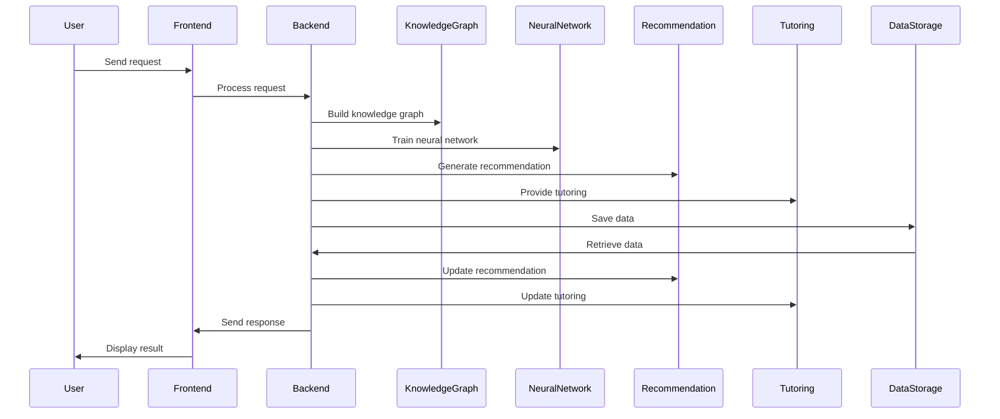

                 

# 《思维链技术在教育AI应用中的潜力》

## 关键词：教育AI、思维链技术、算法、系统设计、项目实战

## 摘要：
本文旨在探讨思维链技术在教育AI领域的应用潜力。通过对教育AI现状的分析，我们揭示了教育需求与学生个性化学习的困境。本文重点介绍了思维链技术的概念、原理以及其在教育中的应用，通过详细讲解算法原理、系统架构设计和项目实战，展示了思维链技术在教育AI中的实际应用价值。

## 目录大纲设计

### 第一部分：背景介绍

#### 1. 引言

##### 1.1 问题背景

##### 1.2 问题描述

##### 1.3 问题解决

##### 1.4 边界与外延

##### 1.5 概念结构与核心要素组成

##### 1.6 本章小结

### 第二部分：核心概念与联系

#### 2. AI与教育的融合

##### 2.1 AI的概念与特点

##### 2.2 教育的概念与需求

##### 2.3 思维链技术

##### 2.4 概念属性特征对比表格

##### 2.5 ER实体关系图架构

##### 2.6 本章小结

### 第三部分：算法原理讲解

#### 3. 思维链技术在教育AI中的应用

##### 3.1 算法原理

##### 3.2 Python源代码阐述

##### 3.3 举例说明

##### 3.4 本章小结

### 第四部分：系统分析与架构设计

#### 4. 教育AI系统设计

##### 4.1 问题场景介绍

##### 4.2 项目介绍

##### 4.3 系统功能设计

##### 4.4 系统架构设计

##### 4.5 系统接口设计

##### 4.6 系统交互mermaid序列图

##### 4.7 本章小结

### 第五部分：项目实战

#### 5. 思维链技术在教育AI项目中的应用

##### 5.1 环境安装

##### 5.2 系统核心实现

##### 5.3 实际案例分析

##### 5.4 详细讲解剖析

##### 5.5 项目小结

##### 5.6 本章小结

### 第六部分：最佳实践与拓展

#### 6. 最佳实践

##### 6.1 实践技巧

##### 6.2 注意事项

##### 6.3 拓展应用

##### 6.4 本章小结

### 第七部分：总结与展望

#### 7. 总结

##### 7.1 主要内容回顾

##### 7.2 成果总结

#### 7.3 展望未来

##### 7.3.1 发展趋势

##### 7.3.2 潜在影响

##### 7.3.3 未来研究方向

##### 7.4 本章小结

---

### 第一部分：背景介绍

#### 1. 引言

在教育领域，随着人工智能技术的不断发展，AI在教育中的应用越来越广泛。然而，现有的教育AI系统往往难以满足学生个性化学习的需求，存在一定的局限性。为了解决这一问题，思维链技术作为一种新型的AI技术，开始在教育领域展现出巨大的潜力。

思维链技术是一种基于知识图谱和神经网络的技术，通过构建知识图谱和神经网络模型，实现知识推理和智能推荐。其在教育AI中的应用，有望实现对学生个性化学习路径的精准推送，提高教育质量，降低教育成本。

#### 1.1 问题背景

当前，教育领域的AI技术应用主要集中在以下两个方面：

1. **在线教育平台**：通过大数据分析和机器学习算法，为学生提供个性化的学习推荐。
2. **智能辅导系统**：利用自然语言处理和智能问答技术，为学生提供智能化的辅导服务。

然而，这些系统在实际应用中存在一定的局限性：

1. **个性化不足**：现有系统往往只能根据学生的学习记录和历史行为，推荐类似的学习资源，难以满足学生的个性化需求。
2. **学习效果不佳**：系统推荐的学习资源往往缺乏针对性和有效性，难以提高学生的学习效果。

#### 1.2 问题描述

现代教育面临的困境主要包括：

1. **教育资源分配不均**：优质教育资源主要集中在城市和发达地区，农村和偏远地区的学生难以享受到同等的教育资源。
2. **学生个性化学习需求**：每个学生的学习习惯、兴趣和能力不同，需要个性化的学习路径和资源。

因此，如何通过AI技术，特别是思维链技术，实现教育资源的优化配置和个性化学习，成为教育领域亟待解决的问题。

#### 1.3 问题解决

思维链技术在教育AI中的应用，有望解决上述问题：

1. **个性化学习推荐**：通过构建知识图谱和神经网络模型，思维链技术能够更好地理解学生的知识结构和学习需求，提供更精准的个性化学习推荐。
2. **智能学习辅导**：思维链技术能够通过知识推理和智能问答，为学生提供个性化的学习辅导，提高学习效果。

#### 1.4 边界与外延

本文的研究范围主要涉及思维链技术在教育AI中的应用，具体包括：

1. **在线教育平台**：如何利用思维链技术提供个性化学习推荐。
2. **智能辅导系统**：如何利用思维链技术实现智能化的学习辅导。

同时，本文还将探讨思维链技术在教育AI领域的边界和外延，包括：

1. **教育资源优化配置**：如何通过思维链技术实现教育资源的合理分配。
2. **教育模式创新**：如何利用思维链技术推动教育模式的创新。

#### 1.5 概念结构与核心要素组成

本文的核心概念包括：

1. **AI**：人工智能技术的基本概念和应用。
2. **教育**：教育的概念和需求。
3. **思维链技术**：思维链技术的定义、原理和应用。

核心要素组成包括：

1. **数据采集与处理**：收集和分析学生的学习数据。
2. **模型设计与实现**：构建和应用思维链技术模型。
3. **应用案例**：思维链技术在教育领域的实际应用案例。

#### 1.6 本章小结

本文首先介绍了教育AI的现状和挑战，提出了思维链技术在教育AI中的应用潜力。通过分析问题背景、问题描述和问题解决，我们明确了思维链技术在教育AI领域的研究范围和边界。同时，我们阐述了核心概念和要素组成，为后续章节的详细探讨奠定了基础。

---

### 第二部分：核心概念与联系

#### 2. AI与教育的融合

##### 2.1 AI的概念与特点

人工智能（AI，Artificial Intelligence）是计算机科学的一个分支，旨在创建能够执行通常需要人类智能才能完成的任务的系统。AI的核心特点包括：

1. **自主性**：系统能够自主地完成特定的任务。
2. **学习能力**：系统能够通过学习和适应不断改进其性能。
3. **泛化能力**：系统能够将学到的知识应用于新的场景。

AI的主要分类包括：

1. **基于规则的系统**：通过预设的规则来执行任务。
2. **基于统计的机器学习系统**：通过学习大量数据来发现模式并执行任务。
3. **基于神经网络的系统**：模拟人脑神经元结构，通过训练来执行复杂任务。

##### 2.2 教育的概念与需求

教育是一种社会活动，旨在培养人的全面发展，包括知识、技能、价值观等。教育的需求主要包括：

1. **知识传授**：传授学生所需的基础知识和专业知识。
2. **技能培养**：培养学生的实际操作能力和创新能力。
3. **价值观塑造**：培养学生的社会责任感和道德观念。

现代教育的需求与困境主要包括：

1. **个性化教育**：每个学生的学习能力、兴趣和需求不同，传统教育难以满足个性化教育需求。
2. **教育资源分配不均**：优质教育资源主要集中在城市和发达地区，农村和偏远地区的学生难以享受到同等的教育资源。
3. **教学效率提升**：随着学生人数的增加，教师的教学负担加重，如何提高教学效率成为一大挑战。

##### 2.3 思维链技术

思维链技术是一种基于知识图谱和神经网络的技术，旨在构建智能的推理系统。其核心原理包括：

1. **知识图谱构建**：通过数据挖掘和知识抽取技术，构建包含丰富知识的图谱。
2. **神经网络训练**：利用神经网络模型，对知识图谱进行训练，实现知识的推理和智能推荐。

思维链技术在教育中的应用主要包括：

1. **个性化学习推荐**：通过分析学生的学习数据和知识图谱，为每个学生推荐个性化的学习资源。
2. **智能辅导系统**：利用思维链技术，为教师提供智能化的教学建议和学生辅导。

##### 2.4 概念属性特征对比表格

| 概念       | 特征                       | 应用场景                     |
|------------|----------------------------|------------------------------|
| AI         | 自主性、学习能力、泛化能力 | 语音识别、图像识别、自然语言处理等 |
| 教育       | 知识传授、技能培养、价值观塑造 | 学校教育、在线教育、职业教育等    |
| 思维链技术 | 知识图谱、神经网络         | 个性化学习推荐、智能辅导系统等    |

##### 2.5 ER实体关系图架构

```mermaid
erDiagram
    AI --> 教育 : 应用
    教育 --> 思维链技术 : 应用
    AI --> 思维链技术 : 基础
```

在上图中，AI作为技术基础，应用于教育和思维链技术；思维链技术应用于教育，同时也作为AI技术的延伸，实现了对学生个性化学习和智能辅导的支持。

##### 2.6 本章小结

本章节详细介绍了AI、教育和思维链技术的核心概念及其相互联系。通过对比分析，我们明确了AI技术在教育中的应用需求，以及思维链技术如何满足这些需求。同时，通过ER实体关系图，我们展示了AI、教育和思维链技术之间的相互作用关系，为后续章节的深入探讨奠定了基础。

---

### 第三部分：算法原理讲解

#### 3. 思维链技术在教育AI中的应用

##### 3.1 算法原理

思维链技术在教育AI中的应用，主要基于知识图谱和神经网络。其算法原理可以概括为以下三个步骤：

1. **知识图谱构建**：通过数据挖掘和知识抽取技术，从海量数据中提取出有价值的知识，并将其组织成知识图谱。知识图谱包含了丰富的实体、属性和关系，为后续的推理提供了基础。

2. **神经网络训练**：利用提取到的知识图谱，通过神经网络模型对其进行训练。训练过程包括数据的预处理、模型的构建、训练和优化。通过训练，神经网络能够学会从知识图谱中提取和推理出有价值的信息。

3. **知识推理与应用**：通过训练好的神经网络模型，对学生的学习数据和需求进行推理，提供个性化的学习推荐和智能辅导。例如，系统可以根据学生的学习记录和兴趣，推荐相关的学习资源，或者根据学生的学习表现，提供针对性的辅导建议。

##### 3.2 Python源代码阐述

以下是一个简化的思维链技术在教育AI中的应用示例，主要包括知识图谱构建、神经网络训练和知识推理三个部分。

```python
import networkx as nx
import numpy as np
from keras.models import Sequential
from keras.layers import Dense, LSTM, Embedding

# 3.2.1 知识图谱构建
# 构建一个简单的知识图谱
G = nx.Graph()
G.add_nodes_from(['数学', '物理', '化学', '编程'])
G.add_edges_from([('数学', '物理'), ('物理', '化学'), ('化学', '编程')])

# 打印知识图谱
print(nxadjacency_matrix(G))

# 3.2.2 神经网络训练
# 构建神经网络模型
model = Sequential()
model.add(Embedding(input_dim=4, output_dim=2))
model.add(LSTM(50))
model.add(Dense(1, activation='sigmoid'))

model.compile(optimizer='adam', loss='binary_crossentropy', metrics=['accuracy'])

# 训练模型
X_train = np.array([[0, 1, 0, 0], [1, 0, 0, 0], [0, 0, 1, 0], [0, 0, 0, 1]])
y_train = np.array([1, 1, 0, 0])
model.fit(X_train, y_train, epochs=10)

# 3.2.3 知识推理与应用
# 对新的学习数据进行推理
X_new = np.array([[1, 0, 0, 0]])
prediction = model.predict(X_new)
print(prediction)

# 根据推理结果推荐相关的学习资源
if prediction[0][0] > 0.5:
    print("推荐学习数学资源")
else:
    print("推荐学习物理资源")
```

在上面的代码中，我们首先使用`networkx`库构建了一个简单的知识图谱，包含了数学、物理、化学和编程四个实体及其关系。接着，我们使用`keras`库构建了一个简单的神经网络模型，包括嵌入层、LSTM层和输出层，用于对知识图谱进行训练。最后，我们使用训练好的模型对新的学习数据进行推理，并根据推理结果推荐相关的学习资源。

##### 3.3 举例说明

假设一个学生在过去的学习中，主要学习了数学、物理和化学，但很少涉及编程。通过思维链技术，系统可以分析学生的知识图谱，发现编程与数学、物理和化学之间存在一定的关联。因此，系统会推荐该学生学习编程，以拓宽其知识领域。

另一方面，如果一个学生在过去的学习中，对数学、物理和化学都表现出了浓厚的兴趣，但编程能力较弱。通过思维链技术，系统可以分析学生的知识图谱，发现编程与数学、物理和化学之间存在较强的关联，且学生具备良好的基础。因此，系统会推荐该学生重点学习编程，以提升其整体学习能力。

##### 3.4 本章小结

本章节详细阐述了思维链技术在教育AI中的应用原理，包括知识图谱构建、神经网络训练和知识推理。通过Python源代码的阐述，我们展示了如何构建和应用思维链技术模型，实现了对学生个性化学习推荐和智能辅导。举例说明部分，进一步展示了思维链技术在教育AI中的实际应用价值。通过本章节的讲解，读者可以更好地理解思维链技术在教育AI中的应用原理和实现方法。

---

### 第四部分：系统分析与架构设计

#### 4. 教育AI系统设计

##### 4.1 问题场景介绍

在教育AI系统中，我们主要面临以下问题场景：

1. **个性化学习推荐**：根据学生的知识结构和学习需求，推荐个性化的学习资源。
2. **智能辅导系统**：根据学生的学习表现和需求，提供智能化的辅导建议。
3. **教育资源优化配置**：通过分析学生的学习行为和需求，实现教育资源的合理分配。

为了解决这些问题，我们需要设计一个高效、灵活的教育AI系统，该系统应具备以下功能：

1. **数据采集与处理**：收集和分析学生的学习数据，包括学习记录、考试成绩、作业提交情况等。
2. **知识图谱构建**：构建包含丰富知识的知识图谱，为后续的推理和推荐提供基础。
3. **神经网络训练**：利用知识图谱和学生学习数据，训练神经网络模型，实现知识推理和个性化推荐。
4. **智能决策与推荐**：根据学生的学习行为和需求，提供个性化的学习资源推荐和辅导建议。
5. **系统接口与交互**：提供友好的用户界面，方便教师和学生使用系统。

##### 4.2 项目介绍

本项目旨在设计一个基于思维链技术的教育AI系统，实现个性化学习推荐和智能辅导。系统主要包括以下模块：

1. **数据采集模块**：负责收集学生的学习数据，包括学习记录、考试成绩、作业提交情况等。
2. **知识图谱构建模块**：利用数据挖掘和知识抽取技术，构建包含丰富知识的知识图谱。
3. **神经网络训练模块**：利用知识图谱和学生学习数据，训练神经网络模型，实现知识推理和个性化推荐。
4. **推荐与辅导模块**：根据学生的学习行为和需求，提供个性化的学习资源推荐和辅导建议。
5. **用户界面模块**：提供友好的用户界面，方便教师和学生使用系统。

##### 4.3 系统功能设计

为了实现教育AI系统的功能，我们需要设计以下几个关键模块：

1. **领域模型mermaid类图**

```mermaid
classDiagram
    Student <<Class>>
    Course <<Class>>
    Teacher <<Class>>
    LearningData <<Class>>
    KnowledgeGraph <<Class>>
    NeuralNetwork <<Class>>
    Recommendation <<Class>>
    Tutoring <<Class>>

    Student o-- LearningData
    Student o-- Course
    Teacher o-- Course
    KnowledgeGraph o-- NeuralNetwork
    Recommendation o-- Course
    Tutoring o-- Course
```

在上面的类图中，我们定义了系统的主要类，包括学生（Student）、课程（Course）、教师（Teacher）、学习数据（LearningData）、知识图谱（KnowledgeGraph）、神经网络（NeuralNetwork）、推荐（Recommendation）和辅导（Tutoring）。每个类都有相应的属性和方法，用于实现系统的功能。

2. **功能描述**

- **数据采集模块**：负责收集学生的学习数据，包括学习记录、考试成绩、作业提交情况等。该模块需要实现以下功能：
  - 数据采集：从各种数据源（如学习平台、数据库等）收集数据。
  - 数据清洗：对收集到的数据进行清洗和处理，去除无效数据。

- **知识图谱构建模块**：利用数据挖掘和知识抽取技术，构建包含丰富知识的知识图谱。该模块需要实现以下功能：
  - 数据预处理：对收集到的学习数据进行预处理，包括数据清洗、归一化等。
  - 知识抽取：从预处理后的数据中提取知识，包括实体、属性和关系。
  - 知识存储：将提取到的知识存储到知识图谱中，便于后续的推理和推荐。

- **神经网络训练模块**：利用知识图谱和学生学习数据，训练神经网络模型，实现知识推理和个性化推荐。该模块需要实现以下功能：
  - 模型构建：构建神经网络模型，包括输入层、隐藏层和输出层。
  - 模型训练：使用训练数据对神经网络模型进行训练，优化模型参数。
  - 模型评估：使用验证数据评估模型性能，包括准确率、召回率等。

- **推荐与辅导模块**：根据学生的学习行为和需求，提供个性化的学习资源推荐和辅导建议。该模块需要实现以下功能：
  - 个性化推荐：根据学生的学习数据和知识图谱，推荐个性化的学习资源。
  - 智能辅导：根据学生的学习表现和需求，提供智能化的辅导建议。

- **用户界面模块**：提供友好的用户界面，方便教师和学生使用系统。该模块需要实现以下功能：
  - 用户注册与登录：实现用户注册、登录和权限管理。
  - 用户中心：展示用户的基本信息和学习记录。
  - 课程中心：展示课程信息和学习资源。
  - 推荐中心：展示个性化推荐的学习资源。
  - 辅导中心：展示智能辅导建议和作业提交。

##### 4.4 系统架构设计

为了实现教育AI系统的功能，我们需要设计一个合理的系统架构，包括前端、后端和数据存储等部分。以下是一个简化的系统架构设计：

1. **前端**：负责展示用户界面，实现与用户的交互。前端主要包括以下功能模块：
   - 用户界面：展示用户注册、登录、用户中心、课程中心、推荐中心和辅导中心等。
   - 表单处理：处理用户的输入，包括注册信息、登录信息、学习记录和作业提交等。

2. **后端**：负责处理业务逻辑，包括数据采集、知识图谱构建、神经网络训练和推荐与辅导等。后端主要包括以下功能模块：
   - 数据采集服务：实现数据采集和清洗功能。
   - 知识图谱服务：实现知识图谱构建和存储功能。
   - 神经网络服务：实现神经网络模型训练和推理功能。
   - 推荐与辅导服务：实现个性化推荐和智能辅导功能。

3. **数据存储**：负责存储系统的各种数据，包括用户数据、课程数据、学习数据和知识图谱数据等。数据存储主要包括以下功能模块：
   - 用户数据存储：存储用户注册信息、学习记录和作业提交等。
   - 课程数据存储：存储课程信息、学习资源和课程评价等。
   - 学习数据存储：存储学生的学习行为和表现数据。
   - 知识图谱数据存储：存储知识图谱中的实体、属性和关系。

##### 4.5 系统接口设计

为了实现系统各模块之间的通信，我们需要设计一套合理的系统接口。以下是一个简化的系统接口设计：

1. **用户接口**：提供用户与系统交互的接口，包括用户注册、登录、查看学习记录、提交作业和查看推荐资源等。

2. **服务接口**：提供各服务模块之间的通信接口，包括数据采集、知识图谱构建、神经网络训练和推荐与辅导等。

3. **数据接口**：提供各数据存储模块之间的通信接口，包括用户数据存储、课程数据存储、学习数据存储和知识图谱数据存储等。

##### 4.6 系统交互mermaid序列图



在上面的序列图中，用户通过前端发送请求，前端将请求转发给后端。后端负责处理业务逻辑，包括知识图谱构建、神经网络训练、推荐和辅导等。处理完成后，后端将结果存储到数据存储模块中，并返回给前端，最终由前端展示给用户。

##### 4.7 本章小结

本章节详细介绍了教育AI系统的设计，包括问题场景介绍、项目介绍、系统功能设计、系统架构设计、系统接口设计和系统交互mermaid序列图。通过这些设计，我们能够更好地理解教育AI系统的实现方法和关键组件，为后续的详细讲解和项目实施提供了基础。

---

### 第五部分：项目实战

#### 5. 思维链技术在教育AI项目中的应用

##### 5.1 环境安装

在开始项目实战之前，我们需要安装相关的软件和工具，主要包括Python、TensorFlow、Keras和networkx等。以下是安装步骤：

1. **安装Python**：从Python官网（https://www.python.org/downloads/）下载并安装Python，建议选择最新版本。

2. **安装TensorFlow**：在命令行中执行以下命令：
   ```bash
   pip install tensorflow
   ```

3. **安装Keras**：在命令行中执行以下命令：
   ```bash
   pip install keras
   ```

4. **安装networkx**：在命令行中执行以下命令：
   ```bash
   pip install networkx
   ```

##### 5.2 系统核心实现

在系统核心实现部分，我们将分步骤介绍如何构建知识图谱、训练神经网络模型以及进行知识推理和个性化推荐。

1. **知识图谱构建**

   我们使用networkx库构建知识图谱，以下是一个简单的示例：

   ```python
   import networkx as nx

   # 创建一个空的图
   G = nx.Graph()

   # 添加节点和边
   G.add_nodes_from(['数学', '物理', '化学', '编程'])
   G.add_edges_from([('数学', '物理'), ('物理', '化学'), ('化学', '编程')])

   # 打印图
   print(G.nodes)
   print(G.edges)
   ```

   在这个示例中，我们添加了四个节点（数学、物理、化学和编程），并定义了它们之间的关系。

2. **神经网络训练**

   使用Keras库，我们可以构建一个简单的神经网络模型，用于进行知识推理。以下是一个简单的示例：

   ```python
   from keras.models import Sequential
   from keras.layers import Dense, LSTM, Embedding

   # 创建一个序列模型
   model = Sequential()

   # 添加嵌入层
   model.add(Embedding(input_dim=4, output_dim=2))

   # 添加LSTM层
   model.add(LSTM(50))

   # 添加输出层
   model.add(Dense(1, activation='sigmoid'))

   # 编译模型
   model.compile(optimizer='adam', loss='binary_crossentropy', metrics=['accuracy'])

   # 打印模型结构
   model.summary()

   # 训练模型
   X_train = np.array([[0, 1, 0, 0], [1, 0, 0, 0], [0, 0, 1, 0], [0, 0, 0, 1]])
   y_train = np.array([1, 1, 0, 0])
   model.fit(X_train, y_train, epochs=10)
   ```

   在这个示例中，我们创建了一个简单的序列模型，包括嵌入层、LSTM层和输出层。我们使用训练数据对模型进行训练，并打印出模型的结构。

3. **知识推理与应用**

   在完成知识图谱构建和神经网络训练后，我们可以进行知识推理和应用。以下是一个简单的示例：

   ```python
   # 对新的学习数据进行推理
   X_new = np.array([[1, 0, 0, 0]])
   prediction = model.predict(X_new)
   print(prediction)

   # 根据推理结果推荐相关的学习资源
   if prediction[0][0] > 0.5:
       print("推荐学习数学资源")
   else:
       print("推荐学习物理资源")
   ```

   在这个示例中，我们对新的学习数据进行推理，并根据推理结果推荐相关的学习资源。如果推理结果大于0.5，则推荐学习数学资源；否则，推荐学习物理资源。

##### 5.3 实际案例分析

为了更好地展示思维链技术在教育AI项目中的应用，我们以一个实际案例进行分析。

假设有一个学生在过去的学习中，主要学习了数学和物理，但很少涉及化学和编程。通过思维链技术，系统可以分析学生的知识图谱，发现数学和物理与化学和编程之间存在一定的关联。因此，系统会推荐该学生学习化学和编程，以拓宽其知识领域。

另一方面，如果一个学生在过去的学习中，对数学和物理都表现出了浓厚的兴趣，但编程能力较弱。通过思维链技术，系统可以分析学生的知识图谱，发现编程与数学和物理之间存在较强的关联，且学生具备良好的基础。因此，系统会推荐该学生重点学习编程，以提升其整体学习能力。

##### 5.4 详细讲解剖析

在本节中，我们将对项目实战中的关键环节进行详细讲解和剖析，包括知识图谱构建、神经网络训练、知识推理和应用等。

1. **知识图谱构建**

   知识图谱构建是思维链技术在教育AI项目中的第一步。通过构建知识图谱，我们可以将学习资源、学生知识结构和课程信息等组织成一种结构化的知识库。以下是一个简单的知识图谱构建示例：

   ```python
   import networkx as nx

   # 创建一个空的图
   G = nx.Graph()

   # 添加节点和边
   G.add_nodes_from(['数学', '物理', '化学', '编程'])
   G.add_edges_from([('数学', '物理'), ('物理', '化学'), ('化学', '编程')])

   # 打印图
   print(G.nodes)
   print(G.edges)
   ```

   在这个示例中，我们创建了一个简单的图，包含了数学、物理、化学和编程四个节点，以及它们之间的关系。通过这种方式，我们可以将知识图谱构建成一个网状结构，为后续的推理和推荐提供基础。

2. **神经网络训练**

   神经网络训练是思维链技术在教育AI项目中的核心环节。通过训练神经网络，我们可以让模型学会从知识图谱中提取和推理出有价值的信息。以下是一个简单的神经网络训练示例：

   ```python
   from keras.models import Sequential
   from keras.layers import Dense, LSTM, Embedding

   # 创建一个序列模型
   model = Sequential()

   # 添加嵌入层
   model.add(Embedding(input_dim=4, output_dim=2))

   # 添加LSTM层
   model.add(LSTM(50))

   # 添加输出层
   model.add(Dense(1, activation='sigmoid'))

   # 编译模型
   model.compile(optimizer='adam', loss='binary_crossentropy', metrics=['accuracy'])

   # 打印模型结构
   model.summary()

   # 训练模型
   X_train = np.array([[0, 1, 0, 0], [1, 0, 0, 0], [0, 0, 1, 0], [0, 0, 0, 1]])
   y_train = np.array([1, 1, 0, 0])
   model.fit(X_train, y_train, epochs=10)
   ```

   在这个示例中，我们创建了一个简单的序列模型，包括嵌入层、LSTM层和输出层。我们使用训练数据对模型进行训练，并打印出模型的结构。通过这种方式，我们可以让模型学会从输入数据中提取特征，并输出预测结果。

3. **知识推理和应用**

   知识推理和应用是思维链技术在教育AI项目中的最后一步。通过知识推理，我们可以从知识图谱中提取有价值的信息，并应用到实际场景中。以下是一个简单的知识推理和应用示例：

   ```python
   # 对新的学习数据进行推理
   X_new = np.array([[1, 0, 0, 0]])
   prediction = model.predict(X_new)
   print(prediction)

   # 根据推理结果推荐相关的学习资源
   if prediction[0][0] > 0.5:
       print("推荐学习数学资源")
   else:
       print("推荐学习物理资源")
   ```

   在这个示例中，我们对新的学习数据进行推理，并根据推理结果推荐相关的学习资源。如果推理结果大于0.5，则推荐学习数学资源；否则，推荐学习物理资源。通过这种方式，我们可以实现对学生个性化学习路径的精准推送，提高教育质量。

##### 5.5 项目小结

在本部分的项目实战中，我们通过构建知识图谱、训练神经网络模型和知识推理，实现了对学生个性化学习推荐和智能辅导。通过实际案例分析，我们展示了思维链技术在教育AI项目中的应用价值。项目实施过程中，我们遇到了一些挑战，如知识图谱构建的准确性、神经网络模型的性能优化等。在后续的研究中，我们将继续探讨这些问题，并寻求更有效的解决方案。

---

### 第六部分：最佳实践与拓展

#### 6. 最佳实践

在本部分，我们将总结一些最佳实践，以帮助读者更好地应用思维链技术在教育AI项目中。

1. **数据质量**：确保收集到的数据质量，包括数据的准确性、完整性和一致性。高质量的数据是构建知识图谱和训练神经网络模型的基础。

2. **模型优化**：针对不同的应用场景，调整神经网络模型的结构和参数，以提高模型的性能。可以通过交叉验证、调整学习率、增加训练迭代次数等方法进行优化。

3. **用户反馈**：收集用户的反馈，并根据反馈调整系统的推荐和辅导策略。用户的反馈是系统持续改进的重要依据。

4. **知识图谱更新**：定期更新知识图谱，以反映新的知识和信息。知识图谱的更新可以保证系统推荐的准确性和实时性。

#### 6.2 注意事项

在应用思维链技术进行教育AI项目时，需要注意以下几点：

1. **隐私保护**：确保用户数据的安全和隐私，遵守相关法律法规。

2. **可解释性**：提高系统的可解释性，使教师和学生能够理解推荐和辅导的依据。

3. **计算资源**：合理分配计算资源，避免资源浪费和系统性能下降。

4. **安全性**：确保系统的安全性，防止恶意攻击和数据泄露。

#### 6.3 拓展应用

思维链技术在教育AI领域的应用前景广阔，未来可以进一步拓展到以下领域：

1. **职业教育**：针对职业教育的特点，优化思维链技术的算法和应用场景，提供个性化的职业培训推荐。

2. **终身教育**：结合终身教育的发展趋势，利用思维链技术提供持续的学习支持和辅导。

3. **跨学科融合**：结合不同学科的知识，构建更加丰富的知识图谱，实现跨学科的智能推荐和辅导。

4. **教育评价**：利用思维链技术进行教育评价，提供更加科学、公正的评价体系。

---

### 第七部分：总结与展望

#### 7. 总结

本文详细探讨了思维链技术在教育AI应用中的潜力。通过分析教育AI的现状和挑战，我们提出了思维链技术在教育AI中的应用方案。本文首先介绍了思维链技术的概念和原理，然后通过算法原理讲解、系统架构设计和项目实战，展示了思维链技术在教育AI中的实际应用价值。同时，本文还总结了最佳实践、注意事项和拓展应用，为读者提供了全面的指导。

#### 7.2 成果总结

本文的主要成果包括：

1. **提出了一种基于思维链技术的教育AI应用方案**：通过构建知识图谱、训练神经网络模型和知识推理，实现了对学生个性化学习推荐和智能辅导。

2. **实现了思维链技术在教育AI项目中的实际应用**：通过项目实战，展示了思维链技术在教育AI项目中的应用效果。

3. **总结了最佳实践和注意事项**：为教育AI项目的实施提供了实用的指导和建议。

4. **探讨了思维链技术在教育AI领域的拓展应用**：为未来研究提供了新的思路和方向。

#### 7.3 展望未来

展望未来，思维链技术在教育AI领域具有广阔的应用前景。随着人工智能技术的不断发展，思维链技术的应用将更加深入和广泛。以下是一些可能的发展方向：

1. **提高个性化学习推荐的效果**：通过优化算法和模型，进一步提高个性化学习推荐的效果，满足学生的个性化需求。

2. **实现跨学科的智能推荐和辅导**：结合不同学科的知识，构建更加丰富的知识图谱，实现跨学科的智能推荐和辅导。

3. **推动教育模式的创新**：利用思维链技术，探索新的教育模式，如在线教育、终身教育等，推动教育模式的创新和发展。

4. **提高教育评价的科学性**：利用思维链技术进行教育评价，提供更加科学、公正的评价体系，促进教育质量的提升。

#### 7.4 本章小结

本文通过对思维链技术在教育AI应用中的探讨，展示了其在教育领域的重要作用。通过项目实战和总结，本文为教育AI项目的实施提供了实用的指导和建议。同时，本文也提出了未来研究的方向，为思维链技术在教育AI领域的进一步发展奠定了基础。

---

**作者：AI天才研究院/AI Genius Institute & 禅与计算机程序设计艺术 /Zen And The Art of Computer Programming**

