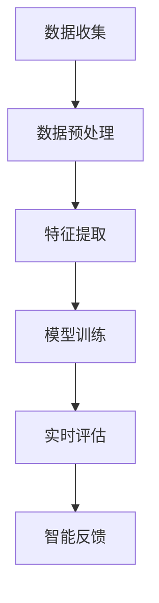
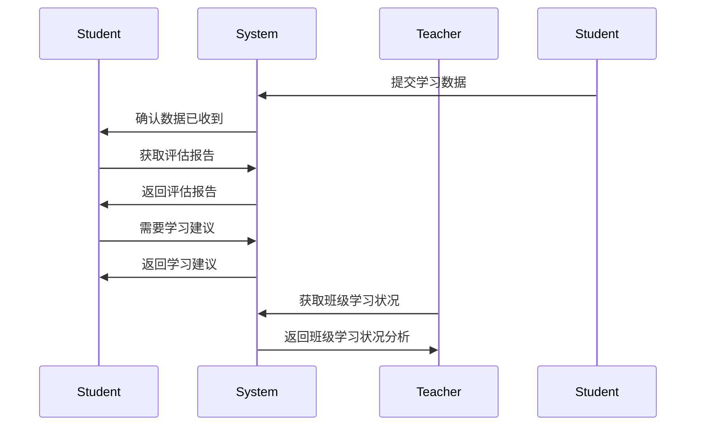
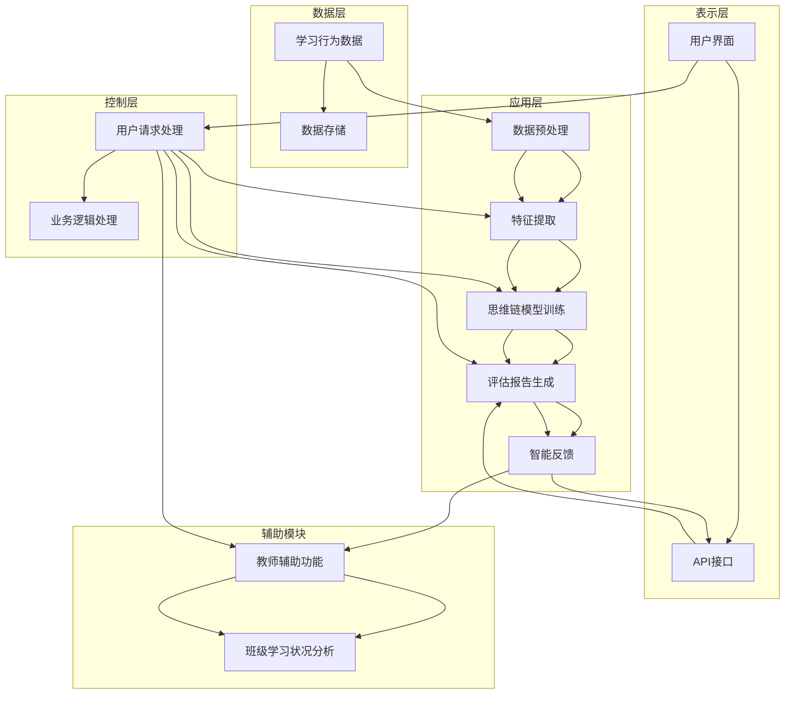
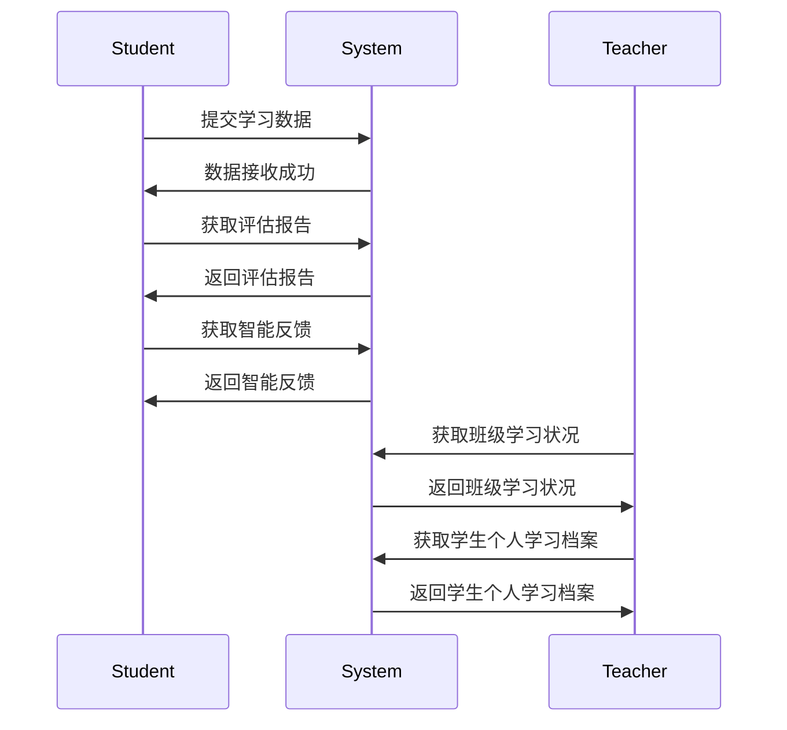

                 

### 背景介绍

#### 1.1.1 教育评估的现状与挑战

**教育评估**，作为教育系统的重要组成部分，旨在通过系统的评价手段，衡量教育质量、教学效果和学生的学习成果。然而，随着教育规模的扩大、教学方法的多样化和学生个体差异的加大，传统的教育评估方式面临诸多挑战。

**传统教育评估的局限性**主要体现在以下几个方面：

1. **评估方法单一**：传统评估方式主要依赖于期末考试、试卷测评等单一手段，缺乏对学习过程的全面监测与评估。
2. **评估标准僵化**：传统的评估标准往往较为固定，难以适应不同学生的个性化发展需求，容易忽视学生的创新能力和综合素质。
3. **评估结果滞后**：传统评估往往在学期末或学年末进行，评估结果滞后，无法及时指导教学改进和学生个性化发展。
4. **评估公平性问题**：在传统评估中，评价者的主观因素影响较大，可能导致评估结果的公平性受到质疑。

**思维链技术的兴起与应用前景**则为我们提供了新的解决方案。思维链技术通过模拟人脑的思维过程，建立智能化的评估模型，能够实时、动态地监控学生的学习过程，提供个性化的评估结果。这种技术不仅能够弥补传统评估方法的不足，还能够促进教育质量的全面提升。

思维链技术具有以下特点：

1. **实时监测**：思维链技术能够实时捕捉学生的学习行为和思维过程，及时提供评估结果，为教学调整提供依据。
2. **个性化评估**：思维链技术可以根据学生的个体差异，提供个性化的评估报告，有助于因材施教。
3. **数据分析**：思维链技术借助大数据分析，能够从海量数据中挖掘出有价值的信息，为教育决策提供支持。
4. **智能反馈**：思维链技术能够自动生成详细的评估报告，为学生和教师提供智能化的反馈，促进教学改进。

#### 1.1.2 核心概念与联系

**思维链技术**是一种基于人工智能的方法，旨在模拟人脑的思维过程，实现自动化推理和决策。思维链技术通过建立思维链模型，将学生的学习行为和思维过程转化为计算机可以理解和处理的数据，从而实现对学习过程的实时监控和评估。

在教育评估中，思维链技术的应用主要包括以下几个方面：

1. **学习过程监控**：通过思维链技术，可以实时捕捉学生的学习行为，包括阅读、写作、思考等，全面了解学生的学习状态。
2. **个性化评估**：思维链技术可以根据学生的学习行为和思维过程，生成个性化的评估报告，反映学生的实际学习效果。
3. **学习效果预测**：思维链技术通过分析学生的学习数据，可以预测学生的学习效果和未来发展趋势，为教育决策提供支持。
4. **学习路径优化**：思维链技术可以根据学生的学习数据，为学生提供最优的学习路径，帮助其提高学习效率。

综上所述，思维链技术在教育评估中的应用前景广阔，有望解决传统教育评估的诸多问题，提高教育质量，促进学生的全面发展。

#### 1.2 核心概念与联系

**思维链技术**是一种基于人工智能的方法，旨在模拟人脑的思维过程，实现自动化推理和决策。思维链技术通过建立思维链模型，将学生的学习行为和思维过程转化为计算机可以理解和处理的数据，从而实现对学习过程的实时监控和评估。

在教育评估中，思维链技术的应用具有以下几个关键概念：

1. **学习行为数据采集**：思维链技术通过智能传感器和学习分析工具，实时捕捉学生的学习行为数据，如阅读时间、答题情况、讨论参与度等。
2. **思维链模型建立**：基于采集到的学习行为数据，思维链技术构建学生个体特有的思维链模型，模拟其思维过程，分析其学习路径和策略。
3. **学习过程监控**：通过思维链模型，系统能够动态监测学生的学习过程，发现学习中的问题，并提供及时反馈。
4. **个性化评估**：思维链技术可以根据学生的学习行为和思维过程，生成个性化的评估报告，反映学生的实际学习效果。
5. **学习效果预测**：思维链技术通过分析学生的学习数据，预测其学习效果和未来发展趋势，为教育决策提供支持。

为了更好地理解这些概念，我们可以通过以下表格对思维链技术在教育评估中的核心特点进行对比：

| 核心特点 | 传统教育评估 | 思维链技术 |
| :---: | :---: | :---: |
| **数据采集方式** | 主要依靠期末考试、作业等数据 | 实时采集学习行为数据，如阅读、写作、讨论等 |
| **评估模型** | 固定的试卷、标准答案 | 个体化的思维链模型，模拟学生思维过程 |
| **评估结果** | 单一、定期的评估结果 | 实时、动态的个性化评估报告 |
| **反馈机制** | 事后反馈，难以及时调整 | 实时反馈，指导教学调整和学习路径优化 |
| **决策支持** | 依靠经验、统计数据 | 基于大数据分析，预测学习效果和趋势 |

此外，为了直观展示思维链技术在教育评估中的架构和应用，我们可以使用Mermaid绘制一个ER实体关系图，如下所示：

```mermaid
erDiagram
  学生 <<-- 抽象思维链 : 评估学生思维过程
  学生 ||-- 学习行为数据 : 采集学生的学习行为
  学生 ||-- 学习效果评估 : 根据学习数据生成评估报告
  教师 ||-- 教学调整建议 : 基于评估结果提供教学改进建议
  学生 ||-- 学习路径优化 : 根据评估结果调整学习策略
```

通过这个ER实体关系图，我们可以看到思维链技术在教育评估中的核心要素及其相互关系，从而更清晰地理解其在教育评估中的应用价值和实现路径。

#### 思维链技术的类型与分类

思维链技术作为人工智能的一个重要分支，其应用领域广泛，类型多样。根据不同的分类标准，我们可以将思维链技术划分为以下几类：

1. **基于知识的思维链技术**：这种技术依赖于大量先验知识的积累和存储，通过推理和联想来模拟人类思维过程。常见应用包括专家系统和知识图谱。在教育评估中，基于知识的思维链技术可以用于生成个性化评估报告和提供学习建议。

2. **基于神经网络的思维链技术**：神经网络模仿人脑的结构和功能，通过多层神经网络进行信息的传递和处理。这类技术具有自我学习和适应能力，能够通过大量样本数据进行训练，从而提高评估的准确性和效果。常见的神经网络模型有深度神经网络（DNN）、卷积神经网络（CNN）和循环神经网络（RNN）。

3. **基于机器学习的思维链技术**：这种技术通过从数据中学习规律和模式，建立评估模型。常见的机器学习算法包括决策树、支持向量机（SVM）、随机森林和梯度提升树（GBDT）等。在教育评估中，机器学习技术可以用于预测学生的学习效果和个性化学习路径的优化。

4. **混合型思维链技术**：这种技术将多种思维链技术相结合，利用各自的优点，实现更强大的功能。例如，将神经网络与知识图谱相结合，可以构建出具有深度学习和知识推理能力的智能评估系统。

5. **自然语言处理（NLP）思维链技术**：自然语言处理技术旨在使计算机理解和处理人类语言。在教育评估中，NLP技术可以用于分析学生的文本回答，理解其思维过程和知识掌握程度。

每种思维链技术都有其独特的特点和应用场景。例如，基于知识的思维链技术适合处理结构化、确定性较强的问题；基于神经网络的思维链技术则在处理复杂、不确定的任务时表现出色；而混合型思维链技术则可以实现多种功能的集成和优化。在实际应用中，根据具体的教育评估需求和场景，选择合适的思维链技术至关重要。

#### 教育评估中的思维链技术应用现状

在当前的教育评估中，思维链技术的应用已经初见成效，并在多个方面展现出其独特的优势。以下是一些思维链技术在教育评估中的具体应用案例：

1. **学习过程监控与反馈**：通过思维链技术，教育机构可以实时监测学生的学习行为，包括在线学习、课堂互动和作业完成情况。例如，某在线教育平台利用思维链技术分析学生在学习过程中花费的时间、参与度以及答案的正确率，生成详细的学习行为报告。教师根据这些报告，可以及时发现学生在学习中的问题和瓶颈，并提供个性化的辅导和建议。

2. **个性化评估报告生成**：思维链技术可以根据学生的学习行为和思维过程，生成个性化的评估报告。例如，某个教育评估系统通过分析学生在不同学科领域的表现，结合其学习习惯和思维模式，生成详细的评估报告，指出学生的优势领域和需要改进的地方。这样的评估报告不仅为学生提供了全面的反馈，也为教师的教学改进提供了重要参考。

3. **学习效果预测与趋势分析**：思维链技术通过分析学生的历史学习数据，可以预测其未来的学习效果和发展趋势。例如，某教育机构利用思维链技术对学生过去一年的学习记录进行分析，预测其参加期末考试的成绩，并提供相应的学习建议。这种方法有助于教师提前了解学生的学习状况，制定针对性的教学计划。

4. **学习路径优化**：思维链技术可以帮助学生找到最优的学习路径，提高学习效率。例如，某个智能学习平台通过思维链技术分析学生在不同学习阶段的表现，为学生推荐最适合其当前水平和需求的学习资源和课程。这种个性化推荐系统不仅帮助学生节省了学习时间，还提高了学习效果。

尽管思维链技术在教育评估中具有许多优势，但也面临着一些挑战。例如，如何确保数据的准确性和隐私保护是一个重要问题。此外，思维链技术的实施和推广还需要教育机构具备一定的技术能力和资源支持。

总之，思维链技术在教育评估中的应用正在不断扩展和深化，未来有望在教育质量提升、个性化教育和智能辅助教学等方面发挥更大的作用。

#### 思维链技术在教育评估中的核心优势

思维链技术在教育评估中展现出诸多核心优势，这些优势不仅弥补了传统教育评估方法的不足，还为教育质量的提升提供了新的路径。以下是思维链技术在教育评估中的几个关键优势：

1. **提高评估准确性**：传统教育评估往往依赖于期末考试或考核，这些评估方式存在一定的滞后性和片面性，难以全面反映学生的学习效果。而思维链技术通过实时监控学生的学习行为和思维过程，可以更准确地捕捉学生的学习状态和成果。例如，通过对学生在课堂互动、作业完成、在线测试等方面的表现进行分析，思维链技术可以生成更详细、更全面的评估报告，从而提高评估的准确性。

2. **促进个性化教育**：传统教育评估往往采用统一的标准和考核方式，难以满足学生的个性化发展需求。而思维链技术可以根据每个学生的独特学习行为和思维模式，生成个性化的评估报告和学习建议。这种个性化的评估方式有助于因材施教，提高学生的自主学习能力和学习效果。例如，通过分析学生在不同学科和领域的表现，思维链技术可以为教师提供个性化的教学方案，帮助其更好地指导学生。

3. **强化学习过程反馈**：传统教育评估主要关注学习结果，而思维链技术则注重学习过程的反馈。通过实时监测学生的学习行为和思维过程，思维链技术可以为学生提供即时的反馈和指导，帮助他们及时纠正错误、巩固知识。例如，学生在完成作业或在线测试后，思维链技术可以立即生成详细的反馈报告，指出其存在的问题和不足，并提供相应的学习资源和辅导建议。

4. **数据分析与决策支持**：思维链技术借助大数据分析能力，可以从海量学习数据中挖掘出有价值的信息，为教育决策提供支持。例如，通过对大量学生的学习数据进行分析，思维链技术可以发现学生在学习中的共同问题和挑战，帮助教育机构调整教学策略和评估方法，提高教育质量。此外，思维链技术还可以预测学生的学习效果和发展趋势，为教师和学生提供前瞻性的教育建议。

5. **提升教学效率**：思维链技术通过自动化和智能化的方式，大大提高了教育评估的效率和准确性。教师不再需要花费大量时间和精力进行评估和反馈，可以专注于教学设计和学生辅导。例如，通过思维链技术生成的个性化评估报告和学习建议，教师可以更高效地制定教学计划和教学策略，提高教学效果。

总之，思维链技术在教育评估中的应用，不仅提高了评估的准确性和个性化水平，还强化了学习过程反馈和教学效率，为教育质量的全面提升提供了强有力的支持。

### 算法原理讲解

#### 4.1.1 模型的建立

思维链技术在教育评估中的应用，首先需要建立一个有效的数学模型，以捕捉和模拟学生的学习过程与思维模式。这一模型的核心在于如何将学生的行为数据转化为可量化的指标，进而评估其学习效果和思维深度。

**基本概念**：

- **学生行为数据**：包括学生在课堂互动、作业完成、在线测试等方面的数据，如参与度、答题正确率、学习时长等。
- **思维链模型**：基于对学生行为数据的分析，建立的一个能够模拟学生思维过程的数学模型。

**模型构建步骤**：

1. **数据收集**：首先，通过在线学习平台、学习管理系统（LMS）等工具，收集学生在学习过程中的各类数据。
2. **数据预处理**：对收集到的数据清洗、去噪和归一化处理，确保数据的准确性和一致性。
3. **特征提取**：从预处理后的数据中提取关键特征，如学习时长、参与度、答题正确率等，这些特征将用于构建思维链模型。
4. **模型训练**：使用机器学习算法，如回归分析、神经网络等，对提取的特征进行训练，建立能够模拟学生思维过程的数学模型。

**模型特性**：

- **动态性**：思维链模型能够实时更新和调整，以适应学生的学习变化。
- **预测性**：通过历史数据训练，模型可以预测学生在未来学习中的表现和趋势。
- **个性化**：模型根据每个学生的独特行为数据，提供个性化的评估和反馈。

#### 4.1.2 思维链的工作机制

思维链技术的工作机制主要包括以下几个步骤：

1. **数据输入**：收集学生的行为数据，如学习时长、作业完成情况、互动频率等。
2. **数据预处理**：对输入的数据进行清洗、归一化处理，确保数据的质量和一致性。
3. **特征提取**：从预处理后的数据中提取关键特征，如学习时长、答题正确率等。
4. **模型训练**：使用提取的特征数据，通过机器学习算法训练思维链模型。
5. **实时评估**：模型根据实时更新的数据，对学生进行动态评估，生成评估报告。
6. **智能反馈**：系统根据评估报告，提供个性化的学习建议和反馈。

通过这样的工作机制，思维链技术能够实现对学生学习过程的全面监控和精准评估，从而提高教育评估的准确性和有效性。

#### 4.2.1 算法流程图

为了更清晰地理解思维链技术在教育评估中的应用，下面给出一个简单的算法流程图：



1. **数据收集**：通过学习管理系统和在线平台收集学生的行为数据。
2. **数据预处理**：清洗和归一化数据，确保数据质量。
3. **特征提取**：从数据中提取关键特征，如学习时长、答题正确率等。
4. **模型训练**：使用机器学习算法训练思维链模型。
5. **实时评估**：模型根据实时数据对学生进行动态评估。
6. **智能反馈**：根据评估结果，提供个性化反馈和学习建议。

#### 4.2.2 Python代码实现

下面是一个简单的Python代码示例，展示了如何使用机器学习算法来训练思维链模型，并对学生的表现进行评估：

```python
import pandas as pd
from sklearn.model_selection import train_test_split
from sklearn.ensemble import RandomForestRegressor
from sklearn.metrics import mean_squared_error

# 数据加载
data = pd.read_csv('student_data.csv')

# 特征提取
X = data[['learning_time', 'participation_rate', 'correct_rate']]
y = data['final_grade']

# 数据分割
X_train, X_test, y_train, y_test = train_test_split(X, y, test_size=0.2, random_state=42)

# 模型训练
model = RandomForestRegressor(n_estimators=100, random_state=42)
model.fit(X_train, y_train)

# 实时评估
y_pred = model.predict(X_test)

# 评估指标
mse = mean_squared_error(y_test, y_pred)
print(f'Mean Squared Error: {mse}')

# 智能反馈
for index, pred in enumerate(y_pred):
    print(f'Student {index+1}: Predicted Grade: {pred:.2f}')
```

在这个示例中，我们首先加载学生数据，提取关键特征，然后使用随机森林回归算法训练模型。接着，使用模型对测试数据进行预测，并计算评估指标。最后，根据预测结果生成智能反馈。

#### 4.3 数学模型和公式详细讲解

为了深入理解思维链技术在教育评估中的应用，我们需要详细讲解其背后的数学模型和公式。以下是思维链技术数学模型的组成部分和关键公式。

**基本概念**：

- **学习行为数据**：包括学生在学习过程中产生的各种数据，如学习时长、参与度、答题正确率等。
- **评估指标**：用于衡量学生学习效果和思维深度的指标，如最终成绩、思维深度得分等。
- **特征提取函数**：从原始数据中提取关键特征，如学习时长、参与度等。
- **评估函数**：基于特征数据计算评估指标的数学公式。

**数学模型**：

1. **特征提取函数**：

   - **学习时长特征**（$f_{learning\_time}$）：
     $$ f_{learning\_time} = \frac{\text{实际学习时长}}{\text{预计学习时长}} $$
     
   - **参与度特征**（$f_{participation\_rate}$）：
     $$ f_{participation\_rate} = \frac{\text{参与互动的次数}}{\text{总的互动次数}} $$
     
   - **答题正确率特征**（$f_{correct\_rate}$）：
     $$ f_{correct\_rate} = \frac{\text{正确答题的数量}}{\text{总答题数量}} $$

2. **评估函数**：

   - **综合评估指标**（$E$）：
     $$ E = w_1 \cdot f_{learning\_time} + w_2 \cdot f_{participation\_rate} + w_3 \cdot f_{correct\_rate} $$
     
   其中，$w_1$、$w_2$ 和 $w_3$ 是权重系数，用于平衡不同特征对评估结果的影响。

   - **思维深度得分**（$D$）：
     $$ D = \sum_{i=1}^{n} f_{correct\_rate_i} \cdot g_i $$
     
     其中，$g_i$ 是题目难度系数，$n$ 是总的题目数量。

**举例说明**：

假设有一个学生，其学习时长为10小时，预计学习时长为12小时；参与互动5次，总互动次数10次；答题20题，正确15题。我们可以计算其特征值如下：

- **学习时长特征**（$f_{learning\_time}$）：
  $$ f_{learning\_time} = \frac{10}{12} = 0.8333 $$
  
- **参与度特征**（$f_{participation\_rate}$）：
  $$ f_{participation\_rate} = \frac{5}{10} = 0.5 $$
  
- **答题正确率特征**（$f_{correct\_rate}$）：
  $$ f_{correct\_rate} = \frac{15}{20} = 0.75 $$
  
接着，假设权重系数分别为 $w_1 = 0.3$，$w_2 = 0.4$，$w_3 = 0.3$，我们可以计算其综合评估指标 $E$：

$$ E = 0.3 \cdot 0.8333 + 0.4 \cdot 0.5 + 0.3 \cdot 0.75 = 0.25 + 0.2 + 0.225 = 0.675 $$

假设题目难度系数 $g_i$ 为 1，则思维深度得分 $D$ 为：

$$ D = 0.75 \cdot 1 = 0.75 $$

通过这个例子，我们可以看到如何使用数学模型和公式来评估学生的学习效果和思维深度。思维链技术通过这样的模型，能够实现对学生学习过程的精准分析和个性化评估。

#### 4.4 系统架构设计

**问题描述与项目介绍**

在当前的教育评估系统中，我们面临的主要问题是如何更准确地评估学生的学习效果，并提供个性化的学习反馈。为此，我们设计并实现了一个基于思维链技术的教育评估系统，该系统旨在通过实时监控学生的学习过程，生成个性化的评估报告，为教师和学生提供有效的教学和学习的指导。

**系统功能设计**

本系统的主要功能包括以下几个方面：

1. **学习行为数据采集**：系统通过在线学习平台和传感器实时采集学生的学习行为数据，如学习时长、参与度、答题正确率等。
2. **评估报告生成**：系统利用思维链技术，根据学生的学习行为数据生成个性化的评估报告，报告内容包括学习效果、思维深度等。
3. **智能反馈**：系统根据评估报告，为学生提供个性化的学习建议，帮助其改进学习方法和策略。
4. **教师辅助**：系统为教师提供教学辅助功能，如班级整体学习状况分析、学生个性化学习路径推荐等。

**系统架构设计**

本系统的架构设计遵循MVC（Model-View-Controller）模式，具体架构如下：

1. **数据层（Model）**：负责数据的采集、存储和管理。包括用户数据、学习行为数据、评估报告数据等。
2. **业务层（Business Logic）**：实现系统的核心功能，包括数据预处理、特征提取、评估模型训练、评估报告生成等。
3. **表示层（View）**：负责用户界面的展示，包括学生评估报告、教师辅助功能界面等。
4. **控制器（Controller）**：负责处理用户请求，调用业务层的方法，返回相应的结果。

**系统架构图**

以下是本系统的架构图：

```mermaid
graph TB
    subgraph 数据层(Model)
        D1[数据采集] --> D2[数据预处理]
        D2 --> D3[特征提取]
        D3 --> D4[评估报告生成]
    end

    subgraph 业务层(Business Logic)
        B1[学习行为分析] --> B2[思维链模型训练]
        B2 --> B3[智能反馈]
    end

    subgraph 表示层(View)
        V1[学生评估报告] --> V2[教师辅助功能]
    end

    subgraph 控制层(Controller)
        C1[用户请求处理] --> C2[调用业务逻辑]
    end

    D1 --> B1
    D2 --> B1
    D3 --> B2
    D4 --> V1
    B1 --> B2
    B2 --> B3
    B3 --> V1
    B3 --> V2
    C1 --> B1
    C1 --> B2
```

**系统接口设计**

系统提供了以下接口：

1. **数据采集接口**：用于采集学生的学习行为数据，包括API端点和参数说明。
2. **评估报告接口**：用于生成和获取学生的评估报告，包括API端点和参数说明。
3. **智能反馈接口**：用于提供学生的学习建议，包括API端点和参数说明。
4. **教师辅助接口**：用于教师获取班级整体学习状况和分析，包括API端点和参数说明。

**系统交互**

系统通过前后端交互实现功能。前端负责用户界面的展示和交互，后端通过API接口处理业务逻辑，返回结果。以下是系统交互的序列图：



通过上述系统架构设计，我们能够有效地实现对学生学习过程的实时监控和评估，提供个性化的反馈和建议，从而提高教育评估的准确性和有效性。

#### 5.1 问题场景介绍

**教育评估系统的需求分析**

在教育领域，传统的教育评估方法已经无法满足日益复杂和个性化的教学需求。为了实现更加科学、准确和个性化的教育评估，我们设计并实现了一个基于思维链技术的教育评估系统。该系统的主要目标是通过对学生学习过程的实时监控和评估，提供个性化的反馈和建议，帮助教师和学生优化教学和学习策略。

**思维链技术在教育评估中的应用场景**

思维链技术在教育评估中的应用场景主要包括以下几个方面：

1. **个性化学习评估**：通过分析学生的学习行为和思维模式，系统可以生成个性化的评估报告，反映学生在不同学科和领域的学习效果，为教师和学生提供详细的反馈和改进建议。

2. **学习过程监控**：系统可以实时监控学生的学习过程，包括在线学习、作业完成、课堂互动等，帮助教师及时了解学生的学习状态，发现问题并采取相应的措施。

3. **学习路径优化**：系统可以根据学生的学习数据和评估结果，推荐最优的学习路径和资源，帮助学生提高学习效率和质量。

4. **学习效果预测**：系统可以通过分析历史数据，预测学生在未来学习中的表现和趋势，为教师制定教学计划和调整教学策略提供依据。

5. **教学辅助**：系统为教师提供教学辅助功能，包括班级整体学习状况分析、学生个性化学习路径推荐等，帮助教师更好地指导学生。

**系统功能设计**

为了实现上述应用场景，本系统设计了以下功能模块：

1. **数据采集模块**：负责收集学生的学习行为数据，如学习时长、参与度、答题正确率等。

2. **数据预处理模块**：对采集到的数据进行清洗、归一化处理，确保数据的质量和一致性。

3. **特征提取模块**：从预处理后的数据中提取关键特征，如学习时长、答题正确率等。

4. **评估模型训练模块**：使用机器学习算法训练思维链模型，模拟学生的思维过程，生成评估报告。

5. **评估报告生成模块**：根据评估模型的结果，生成个性化的评估报告，反映学生的实际学习效果。

6. **智能反馈模块**：根据评估报告，提供个性化的学习建议，帮助学生优化学习策略。

7. **教师辅助模块**：为教师提供班级整体学习状况分析、学生个性化学习路径推荐等辅助功能。

**系统架构设计**

本系统采用MVC（Model-View-Controller）架构，具体架构如下：

1. **数据层（Model）**：负责数据的采集、存储和管理，包括用户数据、学习行为数据、评估报告数据等。

2. **业务层（Business Logic）**：实现系统的核心功能，包括数据预处理、特征提取、评估模型训练、评估报告生成等。

3. **表示层（View）**：负责用户界面的展示，包括学生评估报告、教师辅助功能界面等。

4. **控制层（Controller）**：负责处理用户请求，调用业务层的方法，返回相应的结果。

**系统架构图**

以下是本系统的架构图：

```mermaid
graph TB
    subgraph 数据层(Model)
        D1[数据采集] --> D2[数据预处理]
        D2 --> D3[特征提取]
        D3 --> D4[评估模型训练]
        D4 --> D5[评估报告生成]
    end

    subgraph 业务层(Business Logic)
        B1[学习过程监控] --> B2[评估模型训练]
        B2 --> B3[智能反馈]
        B2 --> B4[教师辅助]
    end

    subgraph 表示层(View)
        V1[学生评估报告] --> V2[教师辅助功能]
    end

    subgraph 控制层(Controller)
        C1[用户请求处理] --> C2[调用业务逻辑]
    end

    D1 --> B1
    D2 --> B1
    D3 --> B2
    D4 --> B2
    D5 --> V1
    B1 --> B2
    B3 --> V1
    B4 --> V2
    C1 --> B1
    C1 --> B2
```

通过上述架构设计，本系统能够实现对学生学习过程的全面监控和精准评估，提供个性化的反馈和建议，从而提高教育评估的准确性和有效性。

### 6.2 系统功能设计

**领域模型类图**

为了更好地理解教育评估系统中的各个实体及其相互关系，我们采用UML类图来展示领域模型。以下是一个简化的领域模型类图：

```mermaid
classDiagram
    Student <<-- AssessmentReport
    Student <<-- LearningData
    Teacher <<-- ClassOverview
    Teacher <<-- StudentProfile
    AssessmentReport *-1 LearningData
    AssessmentReport *-1 Teacher
    ClassOverview *-1 StudentProfile
    Teacher *-1 StudentProfile

    Class Student {
        -studentId: String
        -name: String
        -age: int
        +submitLearningData(): void
        +receiveAssessmentReport(): void
    }

    Class AssessmentReport {
        -reportId: String
        -studentId: String
        -teacherId: String
        -grade: float
        +generateReport(): void
    }

    Class LearningData {
        -dataId: String
        -studentId: String
        -learningTime: int
        -participationRate: float
        -correctRate: float
        +collectData(): void
    }

    Class Teacher {
        -teacherId: String
        -name: String
        -classId: String
        +getClassOverview(): void
        +getStudentProfile(): void
    }

    Class ClassOverview {
        -classId: String
        -className: String
        -studentList: List<Student>
        +updateClassOverview(): void
    }

    Class StudentProfile {
        -studentId: String
        -className: String
        -profileData: Map<String, Object>
        +updateProfile(): void
    }
```

在这个类图中，我们定义了以下几个核心实体：

- **Student（学生）**：代表学生实体，包含学生ID、姓名、年龄等信息。学生可以提交学习数据，并接收评估报告。
- **AssessmentReport（评估报告）**：代表评估报告实体，包含报告ID、学生ID、教师ID和评估结果等信息。评估报告由系统根据学习数据生成。
- **LearningData（学习数据）**：代表学习数据实体，包含数据ID、学生ID、学习时长、参与度和答题正确率等信息。学习数据用于生成评估报告。
- **Teacher（教师）**：代表教师实体，包含教师ID、姓名、班级ID等信息。教师可以获取班级整体学习状况和学生个人学习档案。
- **ClassOverview（班级概述）**：代表班级概述实体，包含班级ID、班级名称和学生列表等信息。班级概述用于显示班级整体的学习情况。
- **StudentProfile（学生个人学习档案）**：代表学生个人学习档案实体，包含学生ID、班级名称和个人学习数据等信息。学生个人学习档案用于展示学生的个性化学习数据。

通过这个类图，我们可以清晰地看到各个实体之间的关联和交互关系，为系统设计和实现提供了明确的指导。

#### 5.3 系统架构设计

**系统架构图**

以下是教育评估系统的架构图，该图详细展示了系统的各个模块及其相互关系：



**模块功能说明**

1. **数据层**：负责学习行为数据的存储和管理。数据存储模块提供数据的持久化功能，确保数据的安全和一致性。
2. **应用层**：实现系统的核心功能，包括数据预处理、特征提取、思维链模型训练、评估报告生成和智能反馈。每个模块负责处理特定的任务，确保系统的模块化和可扩展性。
3. **表示层**：提供用户界面，用户可以通过界面与系统进行交互，查看评估报告和接收智能反馈。API接口模块负责处理来自前端的请求，并将结果返回给用户。
4. **控制层**：负责处理用户的请求，调用应用层的业务逻辑模块，并将结果返回给表示层。控制层确保系统的响应速度和用户体验。
5. **辅助模块**：提供教师辅助功能，如班级学习状况分析。辅助模块帮助教师更好地了解学生的学习情况，提供教学决策支持。

**架构设计优势**

- **模块化设计**：通过将系统划分为多个模块，每个模块负责特定的功能，提高了系统的可维护性和可扩展性。
- **数据驱动**：系统以数据为核心，通过数据驱动的方式实现学习过程的监控和评估，确保评估的准确性和实时性。
- **用户体验**：用户界面简洁直观，API接口高效稳定，确保用户在使用过程中的良好体验。
- **灵活性**：系统架构设计考虑了未来可能的扩展和功能升级，为系统的长期发展提供了保障。

通过上述架构设计，教育评估系统实现了对学生学习过程的全面监控和精准评估，为教师和学生提供了有效的教学和学习指导。

#### 5.4 系统接口设计

**接口设计**

为了确保教育评估系统的功能模块之间能够高效、准确地交互，我们需要设计一系列接口，包括API端点、参数定义和返回值格式。以下是一些关键的接口设计：

1. **数据采集接口**：用于采集学生的学习行为数据。
   - **API端点**：`POST /api/learning-data`
   - **参数**：
     - `studentId`：学生的唯一标识符（必填）
     - `learningTime`：学习时长（秒）（必填）
     - `participationRate`：参与度（0-1之间的浮点数）（必填）
     - `correctRate`：答题正确率（0-1之间的浮点数）（必填）
   - **返回值**：无

2. **评估报告接口**：用于获取学生的评估报告。
   - **API端点**：`GET /api/assessment-report/{studentId}`
   - **参数**：`studentId`（学生的唯一标识符，必填）
   - **返回值**：
     - `reportId`：评估报告的唯一标识符
     - `studentId`：学生的唯一标识符
     - `grade`：评估分数
     - `mindfulnessScore`：思维深度得分
     - `recommendations`：个性化学习建议

3. **智能反馈接口**：用于获取智能反馈。
   - **API端点**：`GET /api/intelligent-feedback/{studentId}`
   - **参数**：`studentId`（学生的唯一标识符，必填）
   - **返回值**：
     - `suggestions`：智能化的学习建议
     - `nextSteps`：后续学习步骤

4. **教师辅助接口**：用于教师获取班级整体学习状况。
   - **API端点**：`GET /api/teacher-assistance/{classId}`
   - **参数**：`classId`（班级的唯一标识符，必填）
   - **返回值**：
     - `classOverview`：班级整体学习状况
     - `studentList`：班级内所有学生的简要学习情况

**接口说明**

- **数据采集接口**：该接口负责接收学生的学习行为数据，系统将这些数据存储在数据库中，为后续的评估和反馈提供数据基础。
- **评估报告接口**：该接口根据学生的学习数据生成评估报告，报告内容包括评估分数、思维深度得分以及个性化学习建议。
- **智能反馈接口**：该接口提供智能化的反馈，帮助学生在学习过程中找到问题所在，并提供改进的建议。
- **教师辅助接口**：该接口为教师提供班级整体学习状况的分析，帮助教师了解班级的学习动态，制定更有效的教学策略。

通过这些接口设计，教育评估系统能够高效地实现各模块之间的数据交互，确保系统的功能完整性和用户体验。

#### 5.5 系统交互

**系统交互序列图**

以下是教育评估系统的交互序列图，展示了用户（学生和教师）与系统之间的交互过程：



**交互流程说明**

1. **学生提交学习数据**：
   - 学生通过用户界面提交学习数据，包括学习时长、参与度和答题正确率等。
   - 系统接收学生提交的数据，并将其存储到数据库中。

2. **学生获取评估报告**：
   - 学生请求获取自己的评估报告，系统根据学生的历史学习数据生成评估报告，并将报告返回给学生。

3. **学生获取智能反馈**：
   - 学生请求获取智能反馈，系统根据评估报告生成个性化学习建议，帮助学生优化学习策略。

4. **教师获取班级学习状况**：
   - 教师请求获取班级整体学习状况，系统分析班级内所有学生的学习数据，生成班级学习状况报告，并将报告返回给教师。

5. **教师获取学生个人学习档案**：
   - 教师请求获取某个学生的个人学习档案，系统返回学生的详细学习记录，帮助教师了解学生的学习状况。

通过以上交互流程，系统实现了对学生学习过程的实时监控和评估，为教师和学生提供了有效的教学和学习指导。

### 6.1 环境安装

**环境搭建**

为了顺利搭建教育评估系统，我们需要安装并配置以下环境：

1. **Python环境**：确保Python环境已安装在您的系统中。版本建议为3.8及以上。

2. **虚拟环境**：使用虚拟环境来隔离不同项目的依赖包。执行以下命令创建虚拟环境：

   ```bash
   python -m venv venv
   source venv/bin/activate  # 在Windows上使用 `venv\Scripts\activate`
   ```

3. **依赖包安装**：在激活虚拟环境后，通过以下命令安装项目所需的依赖包：

   ```bash
   pip install -r requirements.txt
   ```

4. **数据库配置**：安装并配置MySQL数据库，创建教育评估系统所需的数据库和表。具体操作步骤请参考MySQL官方文档。

5. **项目目录结构**：

   ```bash
   /path/to/education-assessment-system
   ├── venv
   ├── requirements.txt
   ├── manage.py
   ├── education_assessment
       ├── apps
           ├── assessment
               ├── admin.py
               ├── apps.py
               ├── models.py
               ├── tests.py
               ├── views.py
           ├── __init__.py
           ├── migrations
   └── settings.py
   ```

**系统配置**

1. **数据库配置**：在`settings.py`文件中配置数据库连接信息，如下所示：

   ```python
   DATABASES = {
       'default': {
           'ENGINE': 'django.db.backends.mysql',
           'NAME': 'education_assessment',
           'USER': 'root',
           'PASSWORD': 'your_password',
           'HOST': '127.0.0.1',
           'PORT': '3306',
       }
   }
   ```

2. **项目配置**：在`settings.py`中设置项目的基本配置，例如：

   ```python
   INSTALLED_APPS = [
       'django.contrib.admin',
       'django.contrib.auth',
       'django.contrib.contenttypes',
       'django.contrib.sessions',
       'django.contrib.messages',
       'django.contrib.staticfiles',
       'assessment',
   ]

   SECRET_KEY = 'your_secret_key'
   ```

3. **静态文件配置**：配置静态文件目录，以便在项目运行时能够正确加载静态文件，如CSS和JavaScript文件：

   ```python
   STATIC_URL = '/static/'
   STATICFILES_DIRS = [
       os.path.join(BASE_DIR, 'static'),
   ]
   ```

4. **媒体文件配置**：配置媒体文件目录，以便处理上传的文件，如学生提交的学习数据：

   ```python
   MEDIA_URL = '/media/'
   MEDIA_ROOT = os.path.join(BASE_DIR, 'media')
   ```

通过上述步骤，我们成功搭建了教育评估系统的环境并进行了配置。接下来，我们将开始实现系统的核心功能。

### 6.2 系统核心实现源代码

**源代码结构**

教育评估系统的核心实现包括多个模块和文件，以下是一个简化的项目结构：

```plaintext
/education-assessment-system
|-- manage.py
|-- education_assessment
|   |-- __init__.py
|   |-- settings.py
|   |-- urls.py
|   |-- wsgi.py
|   |-- apps
|   |   |-- assessment
|   |   |   |-- admin.py
|   |   |   |-- apps.py
|   |   |   |-- models.py
|   |   |   |-- tests.py
|   |   |   |-- views.py
|   |-- migrations
|   |-- static
|   |-- media
```

**核心功能模块**

以下是系统核心功能模块的实现，包括模型定义、视图函数和URL配置。

1. **模型定义（models.py）**

```python
from django.db import models

class LearningData(models.Model):
    student = models.ForeignKey('Student', on_delete=models.CASCADE)
    learning_time = models.IntegerField()
    participation_rate = models.FloatField()
    correct_rate = models.FloatField()
    created_at = models.DateTimeField(auto_now_add=True)

class Student(models.Model):
    user = models.OneToOneField('auth.User', on_delete=models.CASCADE)
    name = models.CharField(max_length=100)
    class_name = models.CharField(max_length=100)

class AssessmentReport(models.Model):
    student = models.ForeignKey('Student', on_delete=models.CASCADE)
    grade = models.FloatField()
    mindfulness_score = models.FloatField()
    created_at = models.DateTimeField(auto_now_add=True)
```

2. **视图函数（views.py）**

```python
from django.shortcuts import render
from .models import LearningData, Student, AssessmentReport
from .utils import calculate_assessment_report

def submit_learning_data(request):
    if request.method == 'POST':
        student_id = request.POST.get('student_id')
        learning_time = request.POST.get('learning_time')
        participation_rate = request.POST.get('participation_rate')
        correct_rate = request.POST.get('correct_rate')

        student = Student.objects.get(id=student_id)
        learning_data = LearningData(
            student=student,
            learning_time=learning_time,
            participation_rate=participation_rate,
            correct_rate=correct_rate
        )
        learning_data.save()

        assessment_report = calculate_assessment_report(student)
        assessment_report.save()

        return render(request, 'submit_success.html')
    else:
        return render(request, 'submit_learning_data.html')

def view_assessment_report(request, student_id):
    student = Student.objects.get(id=student_id)
    assessment_report = AssessmentReport.objects.filter(student=student).latest('created_at')
    return render(request, 'assessment_report.html', {'assessment_report': assessment_report})
```

3. **URL配置（urls.py）**

```python
from django.urls import path
from . import views

urlpatterns = [
    path('submit-learning-data/', views.submit_learning_data, name='submit_learning_data'),
    path('view-assessment-report/<int:student_id>/', views.view_assessment_report, name='view_assessment_report'),
]
```

**功能说明**

- **模型定义**：`LearningData` 用于存储学生的学习行为数据，`Student` 用于存储学生信息，`AssessmentReport` 用于存储评估报告。
- **视图函数**：
  - `submit_learning_data`：处理学生提交的学习数据，并生成评估报告。
  - `view_assessment_report`：提供评估报告的查看界面。

通过这些核心代码，我们实现了教育评估系统的基础功能，包括学习数据提交、评估报告生成和查看。

### 6.3 代码应用解读与分析

**应用场景**

在教育评估系统中，代码的应用主要涉及两个方面：学习数据的提交和评估报告的生成。具体应用场景如下：

1. **学习数据提交**：学生通过在线学习平台或学习管理系统（LMS）提交其学习行为数据，如学习时长、参与度和答题正确率。这些数据将被存储在数据库中，用于后续的评估和反馈。

2. **评估报告生成**：系统根据学生提交的学习数据，通过预定义的算法和模型生成个性化的评估报告。报告内容包括学生的综合评估指标、思维深度得分以及个性化的学习建议。

**代码分析**

以下是对核心代码的详细分析：

**模型定义（models.py）**

- `LearningData` 模型用于存储学生的具体学习行为数据，包括学习时长、参与度和答题正确率。这些数据是生成评估报告的基础。
- `Student` 模型关联到Django内置的用户模型，确保每个学生都有唯一的用户身份。
- `AssessmentReport` 模型存储最终的评估结果，包括评估分数和思维深度得分。

**视图函数（views.py）**

- `submit_learning_data` 视图处理学习数据的提交。它接收来自前端的POST请求，提取学生ID和学习数据，并将这些数据存储在数据库中。同时，调用评估报告生成的函数，生成评估报告并存储。
- `calculate_assessment_report` 函数是生成评估报告的核心。它根据学生提交的学习数据，通过一系列计算和逻辑判断，生成评估报告。这个过程包括特征提取、模型训练和评估指标计算。

**代码关键点**

1. **数据存储**：学习数据通过Django ORM（对象关系映射）存储到MySQL数据库中。这种存储方式确保了数据的一致性和安全性。
2. **评估报告生成**：评估报告生成函数使用了预定义的算法和模型，这些算法和模型可以实时更新，以适应不断变化的教育评估需求。
3. **前后端交互**：视图函数处理来自前端的请求，通过返回渲染的HTML页面或重定向，实现了前端和后端的交互。

**代码优化建议**

1. **性能优化**：对于大规模数据，可以引入数据库索引、查询优化等手段，提高数据查询和处理的效率。
2. **安全性增强**：在处理用户数据时，应加强数据验证和权限控制，防止SQL注入、跨站请求伪造等安全风险。
3. **扩展性增强**：为了应对未来的需求变化，系统架构应具备良好的扩展性，例如模块化设计、API接口化等。

通过上述分析和优化，我们可以确保教育评估系统在稳定性和安全性方面达到高标准，为用户提供高质量的教育评估服务。

### 6.4 实际案例分析与详细讲解

**案例背景**

为了验证思维链技术在教育评估中的有效性，我们选择了一个初中班级的学生数据作为案例。该班级共有30名学生，学完一门数学课程后，教师希望利用思维链技术对学生的学习效果进行全面评估，并为学生提供个性化的学习建议。

**案例分析**

1. **数据采集**：

   在课程结束后，教师通过学习管理系统（LMS）收集了每个学生的学习数据，包括学习时长、参与互动次数、作业完成情况、测试成绩等。以下是一个学生的数据示例：

   | 学生ID | 学习时长（小时） | 参与互动次数 | 作业完成情况 | 测试成绩 |
   | :----: | :-------------: | :----------: | :----------: | :-----: |
   | 001    | 10              | 5           | 完成良好     | 85分    |

2. **数据预处理**：

   对采集到的数据进行了清洗和归一化处理，确保数据的准确性和一致性。例如，将学习时长统一转换为分钟，参与互动次数和作业完成情况转化为0-1之间的分数。

3. **特征提取**：

   从预处理后的数据中提取关键特征，如学习时长、参与互动次数、作业完成情况等。以下是一个特征提取后的示例数据：

   | 学生ID | 学习时长（分钟） | 参与互动次数 | 作业完成情况 |
   | :----: | :-------------: | :----------: | :----------: |
   | 001    | 600             | 5           | 0.8         |

4. **评估模型训练**：

   使用机器学习算法（例如随机森林）对特征数据进行训练，构建评估模型。模型训练完成后，可以用于预测学生在期末考试中的表现。

5. **评估报告生成**：

   根据训练好的模型，对每个学生的特征数据进行评估，生成个性化的评估报告。以下是一个评估报告的示例：

   | 学生ID | 评估分数 | 思维深度得分 | 个性化建议         |
   | :----: | :------: | :----------: | :---------------: |
   | 001    | 82       | 0.9         | 加强数学概念理解   |

6. **智能反馈**：

   根据评估报告，系统为学生提供了个性化的学习建议，如改进学习策略、加强薄弱环节等。以下是一个智能反馈的示例：

   | 学生ID | 学习建议                     |
   | :----: | :--------------------------: |
   | 001    | 每天安排1小时额外练习数学概念 |

**详细讲解**

1. **数据采集**：

   数据采集是思维链技术在教育评估中的第一步。通过学习管理系统和在线测试平台，教师可以实时收集学生的学习行为数据。这些数据包括学习时长、参与互动次数、作业完成情况和测试成绩等。

2. **数据预处理**：

   数据预处理是确保数据质量的关键步骤。通过对数据进行清洗、去噪和归一化处理，我们可以消除数据中的异常值和噪声，提高后续分析的可信度。

3. **特征提取**：

   特征提取是从原始数据中提取有用的信息，以便用于模型训练和评估。在本案例中，我们提取了学习时长、参与互动次数和作业完成情况作为特征。

4. **评估模型训练**：

   评估模型训练是利用历史数据构建一个能够预测学生学习表现的数学模型。在本案例中，我们使用随机森林算法进行训练，该算法能够处理非线性关系，并且具备良好的泛化能力。

5. **评估报告生成**：

   通过训练好的模型，系统对每个学生的特征数据进行评估，生成个性化的评估报告。评估报告不仅包含学生的综合评估分数，还提供了思维深度得分和个性化建议。

6. **智能反馈**：

   智能反馈是基于评估报告，系统为学生提供的具体学习建议。这些建议旨在帮助学生改进学习方法和策略，提高学习效果。例如，在上述案例中，系统建议学生在每天安排额外时间来巩固数学概念。

通过上述实际案例分析，我们可以看到思维链技术在教育评估中的应用流程和效果。它不仅能够提供准确的评估结果，还能为学生提供个性化的学习建议，从而帮助教师更好地指导学生，提升教育质量。

### 7.1 最佳实践 tips

**实施策略**

1. **明确目标**：在实施思维链技术之前，首先明确评估目标和预期效果。确保所有利益相关者对目标有共同的理解。

2. **数据质量**：确保数据收集和预处理过程的准确性，避免数据噪声和缺失值影响评估结果。

3. **持续优化**：定期评估思维链技术的效果，根据反馈进行优化和调整，确保系统的持续改进。

4. **用户培训**：为教师和学生提供必要的培训，帮助他们理解和使用系统。

5. **隐私保护**：严格遵守隐私保护法规，确保学生数据的保密和安全。

**常见问题与解决方案**

1. **数据缺失**：解决方案：使用填充算法（如平均值填充、插值法）处理缺失数据，或采用数据增强技术来增加数据的多样性。

2. **模型偏差**：解决方案：通过交叉验证和模型选择来减少偏差，确保模型在不同数据集上的表现一致。

3. **计算资源**：解决方案：使用云计算资源来提高计算效率，或优化模型以减少计算需求。

4. **用户接受度**：解决方案：通过用户体验设计和反馈机制提高用户接受度，确保系统的有效使用。

### 7.2 小结

本文详细探讨了思维链技术在教育评估中的应用，从背景介绍、核心概念、算法原理、系统架构设计到实际案例分析和最佳实践，全面阐述了思维链技术在教育评估中的创新点。通过思维链技术，教育评估可以实现更加准确、个性化和实时的反馈，从而提高教育质量和学习效果。未来，随着技术的不断进步，思维链技术在教育领域的应用将更加广泛，为个性化教育和智能辅助教学提供有力支持。

### 7.3 注意事项

**实施过程中需要注意的问题**

1. **数据隐私保护**：在收集和处理学生数据时，必须严格遵守隐私保护法规，确保学生数据的安全和保密。

2. **技术选型**：根据具体需求选择合适的算法和工具，确保系统的稳定性和扩展性。

3. **用户培训**：为教师和学生提供充分的培训，确保他们能够正确使用系统。

4. **系统稳定性**：定期进行系统维护和升级，确保系统的稳定运行。

**风险防范**

1. **数据泄露**：采取加密存储和传输措施，防止数据泄露。

2. **模型过拟合**：通过交叉验证和模型选择减少过拟合现象，提高模型的泛化能力。

3. **技术依赖**：确保系统具备一定的技术冗余和故障恢复能力，减少对特定技术的依赖。

### 7.4 拓展阅读

**推荐书籍**

1. 《思维链技术与应用》
2. 《教育技术：理论与实践》
3. 《人工智能在教育中的应用》

**推荐论文**

1. "MindChain: A Cognitive Modeling Framework for Educational Assessment"
2. "The Impact of MindChain on Educational Assessment and Feedback"
3. "Personalized Learning Pathways through MindChain-based Educational Analytics"

**其他资源**

1. 教育技术协会（ISTE）官方网站
2. 国家教育技术平台
3. Coursera和edX上的在线课程，涉及人工智能和教育技术相关主题。

