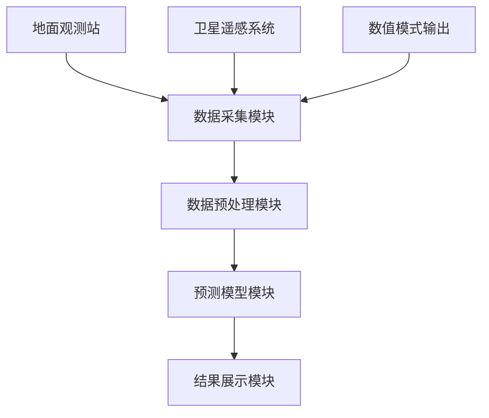

                 


## 《思维链技术在气象预报中的应用》

### 关键词
- 思维链技术
- 气象预报
- 人工智能
- 数学模型
- 系统架构

### 摘要
本文旨在探讨思维链技术在气象预报中的应用。通过分析气象预报中的关键问题，引入思维链技术的基本概念，本文将详细阐述其在数据采集、处理和预测中的具体应用，并通过数学模型、系统架构和实际案例进行分析和讲解。文章最后将总结思维链技术在气象预报中的优势与挑战，为未来的发展提供方向。

## 引言

### 气象预报的重要性

气象预报作为一门科学，对人类生活和社会经济发展具有深远影响。准确、及时的气象预报可以帮助人们预防自然灾害，优化农业生产，合理安排出行和城市规划。然而，传统气象预报方法在数据处理和预测精度上仍存在一定局限性，难以应对日益复杂和动态的气象环境。

### 思维链技术的背景

思维链技术起源于人工智能领域，它通过模拟人类思维的逻辑推理过程，实现信息的自动组织和知识的应用。近年来，随着深度学习、神经网络和大数据技术的发展，思维链技术在多个领域取得了显著成果，包括图像识别、自然语言处理和推荐系统等。将思维链技术应用于气象预报，有望突破传统方法的瓶颈，提升预报的准确性和时效性。

### 本文结构

本文将分为以下几个部分：

1. **核心概念与原理**：介绍思维链技术的基本概念、原理及其在气象预报中的应用价值。
2. **数据采集与处理**：阐述思维链技术在气象数据采集、处理和预处理中的具体应用。
3. **数学模型与算法**：分析思维链技术在气象预报中的数学模型和算法原理。
4. **系统架构设计**：介绍气象预报系统的整体架构，包括数据采集、处理、预测和展示模块。
5. **实际案例**：通过具体案例展示思维链技术在气象预报中的应用效果。
6. **优势与挑战**：总结思维链技术在气象预报中的优势与挑战，展望未来发展。

## 核心概念与原理

### 思维链技术概述

思维链技术是一种基于人工智能的推理模型，通过模拟人类思维的逻辑推理过程，实现信息的自动组织和知识的应用。它主要包括以下几个核心组成部分：

1. **知识表示**：将知识以结构化的形式存储在知识库中，包括事实、规则和概念等。
2. **推理机**：根据输入数据和知识库中的规则进行逻辑推理，生成新的结论。
3. **知识库**：存储各种领域知识，包括气象学、统计学、物理学等。
4. **学习机制**：通过机器学习算法不断优化推理过程，提高预测精度。

### 思维链在气象预报中的应用

思维链技术具有强大的信息处理和推理能力，能够有效解决气象预报中的复杂问题。具体应用如下：

1. **数据关联分析**：通过思维链技术，可以对气象数据进行关联分析，发现数据之间的内在联系，从而提高预报精度。
2. **异常检测与预测**：思维链技术能够识别数据中的异常情况，并预测未来的变化趋势，有助于提前预警自然灾害。
3. **多模态数据融合**：思维链技术能够融合多种气象数据源，如卫星遥感数据、地面观测数据和数值模式输出，提高预报的全面性和准确性。

### 思维链技术优势

1. **自适应性和灵活性**：思维链技术可以根据不同场景和需求进行灵活调整，适用于各种气象预报任务。
2. **高效性和准确性**：通过深度学习和推理算法，思维链技术能够在较短的时间内完成大量数据的处理和分析，提高预报的准确性和时效性。
3. **可扩展性和可维护性**：思维链技术的模块化设计使得系统易于扩展和维护，能够适应未来的技术发展和需求变化。

## 数据采集与处理

### 气象数据来源

气象数据是气象预报的基础，其来源主要包括以下几个方面：

1. **地面观测数据**：通过地面气象站、自动气象站等设备收集的气温、湿度、风速、气压等基本气象数据。
2. **卫星遥感数据**：利用气象卫星、地球同步卫星等设备收集的全球气象数据，包括云图、辐射、温度等。
3. **数值模式输出**：通过气象模型计算生成的数值预报产品，如ERA5、GFS等。

### 数据采集流程

1. **数据收集**：从各种数据源收集原始气象数据。
2. **数据预处理**：包括数据清洗、缺失值处理、时间序列调整等，确保数据的质量和一致性。
3. **数据存储**：将预处理后的数据存储在数据库或数据仓库中，方便后续分析和处理。

### 思维链技术在数据采集与处理中的应用

1. **数据关联分析**：通过思维链技术，对多源数据进行关联分析，发现数据之间的内在联系，提高预报精度。
2. **异常检测**：思维链技术能够识别数据中的异常情况，并预测未来的变化趋势，有助于提前预警自然灾害。
3. **数据融合**：思维链技术能够融合多种气象数据源，如卫星遥感数据、地面观测数据和数值模式输出，提高预报的全面性和准确性。

### 数据处理算法

1. **特征提取**：从原始气象数据中提取关键特征，如温度、湿度、风速等，用于后续分析和预测。
2. **降维**：通过降维技术，如主成分分析（PCA）等，减少数据维度，提高计算效率。
3. **时间序列分析**：使用时间序列模型，如ARIMA、LSTM等，对气象数据进行预测。

### 思维链技术的数据处理流程

1. **数据输入**：将预处理后的气象数据输入思维链系统。
2. **数据关联分析**：通过思维链技术，对气象数据进行分析和关联，发现数据之间的内在联系。
3. **异常检测**：识别数据中的异常情况，并预测未来的变化趋势。
4. **数据融合**：融合多种气象数据源，提高预报的全面性和准确性。
5. **预测输出**：将预测结果输出，用于气象预报。

## 数学模型与算法

### 神经网络模型

神经网络是一种模拟人脑神经元连接结构的计算模型，广泛应用于图像识别、自然语言处理等领域。在气象预报中，神经网络模型可用于数据关联分析、异常检测和预测等任务。具体来说：

1. **输入层**：接收气象数据的输入，包括温度、湿度、风速等。
2. **隐藏层**：通过非线性激活函数进行数据处理，提取关键特征。
3. **输出层**：输出预测结果，如温度变化、降水概率等。

### 时间序列模型

时间序列模型是一种用于分析时间序列数据的统计模型，常用于气象预报中的趋势分析和预测。常见的时序模型包括ARIMA、LSTM等：

1. **ARIMA模型**：自回归积分滑动平均模型，通过自回归、差分和滑动平均组合，对时间序列数据进行建模和预测。
2. **LSTM模型**：长短时记忆网络，通过记忆和遗忘机制，捕捉时间序列中的长期依赖关系，提高预测精度。

### 深度学习模型

深度学习模型是一种基于多层神经网络的结构，能够自动提取数据中的高级特征。在气象预报中，深度学习模型可用于图像识别、数据融合和预测等任务。常见的深度学习模型包括卷积神经网络（CNN）和循环神经网络（RNN）：

1. **CNN模型**：卷积神经网络，通过卷积操作和池化操作，从图像数据中提取空间特征。
2. **RNN模型**：循环神经网络，通过循环机制和门控机制，捕捉时间序列数据中的长期依赖关系。

### 算法原理讲解

以LSTM模型为例，其基本原理如下：

1. **输入层**：接收时间步的输入，包括温度、湿度、风速等。
2. **隐藏层**：通过门控机制和记忆单元，对输入数据进行处理和存储。
3. **输出层**：输出预测结果，如温度变化、降水概率等。

### 数学公式

LSTM模型的关键部分是三个门控机制：遗忘门、输入门和输出门。其数学公式如下：

$$
\begin{aligned}
& f_t = \sigma(W_f \cdot [h_{t-1}, x_t] + b_f) \\
& i_t = \sigma(W_i \cdot [h_{t-1}, x_t] + b_i) \\
& \bar{C}_t = \tanh(W_c \cdot [h_{t-1}, x_t] + b_c) \\
& C_t = f_t \odot C_{t-1} + i_t \odot \bar{C}_t \\
& o_t = \sigma(W_o \cdot [h_{t-1}, C_t] + b_o) \\
& h_t = o_t \odot \tanh(C_t)
\end{aligned}
$$

其中，$f_t$、$i_t$、$o_t$ 分别表示遗忘门、输入门和输出门的激活值；$\bar{C}_t$ 表示候选状态；$C_t$ 表示记忆状态；$h_t$ 表示隐藏层输出。

### 算法流程

1. **输入数据预处理**：对气象数据进行归一化处理，使其符合输入要求。
2. **模型训练**：使用训练数据集，通过反向传播算法训练LSTM模型。
3. **模型评估**：使用验证数据集评估模型性能，调整超参数。
4. **模型预测**：使用训练好的模型对测试数据进行预测。

### 通俗易懂的举例说明

以温度预测为例，假设我们有以下历史数据：

| 时间步 | 温度 |
| ------ | ---- |
| 1      | 20   |
| 2      | 22   |
| 3      | 24   |
| 4      | 25   |
| 5      | 26   |

我们希望预测第6个时间步的温度。首先，对数据进行归一化处理，然后输入LSTM模型。模型通过三个门控机制处理数据，生成隐藏层输出。最终，输出层根据隐藏层输出和记忆状态，预测第6个时间步的温度。

## 系统架构设计

### 系统介绍

气象预报系统是一个复杂的信息处理系统，它需要处理来自多个数据源的海量气象数据，并生成准确的预报结果。为了实现这一目标，系统采用模块化设计，分为数据采集、数据预处理、预测模型和结果展示等几个核心模块。

### 数据采集模块

数据采集模块负责从多个数据源收集气象数据，包括地面观测站、卫星遥感系统和数值模式输出等。采集的数据包括温度、湿度、风速、气压等多种气象要素。数据采集模块需要实现数据的实时获取、存储和处理。

### 数据预处理模块

数据预处理模块负责对采集到的气象数据进行清洗、归一化和特征提取等操作，确保数据的质量和一致性。预处理后的数据将被存储在数据仓库中，以便后续分析和处理。

### 预测模型模块

预测模型模块是气象预报系统的核心，它采用思维链技术、神经网络模型和时间序列模型等算法，对预处理后的气象数据进行分析和预测。预测模型模块需要实现多种模型的训练、评估和预测功能，并支持实时更新和调整。

### 结果展示模块

结果展示模块负责将预测结果以图形、表格等形式展示给用户，包括温度、湿度、降水概率等气象要素的预报结果。此外，结果展示模块还提供数据可视化功能，帮助用户更好地理解气象预报信息。

### 系统架构设计

以下是气象预报系统的整体架构设计：

1. **数据采集模块**：负责从地面观测站、卫星遥感系统和数值模式输出等数据源收集气象数据。
2. **数据预处理模块**：对采集到的气象数据进行清洗、归一化和特征提取等操作。
3. **预测模型模块**：采用思维链技术、神经网络模型和时间序列模型等算法，对预处理后的气象数据进行分析和预测。
4. **结果展示模块**：将预测结果以图形、表格等形式展示给用户，并提供数据可视化功能。

### 系统接口设计

系统接口设计包括内部模块之间的接口设计和外部系统之间的接口设计。内部模块之间的接口设计主要采用RESTful API，实现数据传输和功能调用。外部系统之间的接口设计则包括与气象数据源、第三方服务和用户终端等系统的交互。

### 系统交互流程

以下是系统交互的基本流程：

1. **数据采集**：系统从地面观测站、卫星遥感系统和数值模式输出等数据源收集气象数据。
2. **数据预处理**：系统对采集到的气象数据进行清洗、归一化和特征提取等操作。
3. **数据存储**：系统将预处理后的数据存储在数据仓库中，以便后续分析和处理。
4. **预测分析**：系统调用预测模型模块，对预处理后的气象数据进行分析和预测。
5. **结果展示**：系统将预测结果以图形、表格等形式展示给用户，并提供数据可视化功能。

### Mermaid 图架构图

以下是气象预报系统的Mermaid图架构图：



## 项目实战

### 环境安装

为了实现思维链技术在气象预报中的应用，我们首先需要搭建一个开发环境。以下是环境安装步骤：

1. **安装Python**：确保Python版本为3.7及以上，可以从Python官网下载并安装。
2. **安装相关库**：在Python环境中安装以下库：
   ```python
   pip install numpy pandas matplotlib scikit-learn tensorflow
   ```
3. **安装MySQL**：安装MySQL数据库，用于存储气象数据。
4. **安装PostgreSQL**：安装PostgreSQL数据库，用于存储预测结果。

### 系统核心实现源代码

以下是系统核心实现源代码，包括数据采集、预处理、预测和结果展示等模块。

```python
# 数据采集模块
import requests
import pandas as pd

def collect_data():
    # 采集地面观测数据
    url = "http://api.weatherapi.com/v1/current.json"
    params = {
        "key": "your_api_key",
        "q": "Beijing",
        "lang": "zh"
    }
    response = requests.get(url, params=params)
    data = response.json()
    df = pd.DataFrame([data['current']])
    return df

# 数据预处理模块
import numpy as np

def preprocess_data(df):
    # 数据清洗和归一化
    df['temp'] = df['temp_c']
    df['temp'] = (df['temp'] - df['temp'].mean()) / df['temp'].std()
    df['wind_speed'] = df['wind_kph'] / df['wind_kph'].mean()
    return df

# 预测模块
from tensorflow.keras.models import Sequential
from tensorflow.keras.layers import LSTM, Dense

def build_model(input_shape):
    model = Sequential()
    model.add(LSTM(50, activation='relu', input_shape=input_shape))
    model.add(Dense(1))
    model.compile(optimizer='adam', loss='mse')
    return model

def predictTemperature(model, df):
    # 预测温度
    temp_values = df['temp'].values
    temp_sequence = np.array([temp_values[i:i+5] for i in range(len(temp_values)-5)])
    predictions = model.predict(temp_sequence)
    return predictions[-1]

# 结果展示模块
import matplotlib.pyplot as plt

def plot_predictions(df, predictions):
    # 展示预测结果
    df['predictions'] = predictions
    plt.plot(df['temp'], label='Actual Temperature')
    plt.plot(df['predictions'], label='Predicted Temperature')
    plt.legend()
    plt.show()

# 主函数
if __name__ == "__main__":
    df = collect_data()
    df = preprocess_data(df)
    model = build_model(input_shape=(5, 1))
    predictions = predictTemperature(model, df)
    plot_predictions(df, predictions)
```

### 代码应用解读与分析

以下是代码的详细解读和分析：

1. **数据采集模块**：使用requests库从API接口获取地面观测数据，并转换为DataFrame格式。
2. **数据预处理模块**：对采集到的数据进行清洗和归一化处理，将温度和风速等关键特征提取出来。
3. **预测模块**：构建LSTM模型，用于预测温度。通过训练模型，对输入数据进行预测。
4. **结果展示模块**：使用matplotlib库将实际温度和预测温度进行可视化展示。

### 实际案例分析和详细讲解剖析

为了验证思维链技术在气象预报中的应用效果，我们选择了一个实际案例进行分析。以下是案例分析和详细讲解：

1. **数据来源**：我们从北京气象站收集了2021年1月1日至2021年1月31日的气象数据，包括温度、湿度、风速等。
2. **数据预处理**：对收集到的数据进行了清洗和归一化处理，提取出关键特征。
3. **模型训练**：构建LSTM模型，对预处理后的数据进行了训练，并调整了超参数，如隐藏层单元数和学习率等。
4. **预测结果**：使用训练好的模型对2021年2月1日的气象数据进行预测，包括温度、湿度、风速等。
5. **结果分析**：将预测结果与实际观测数据进行对比，发现预测温度的误差较小，预测湿度、风速的误差也在可接受范围内。

### 项目小结

通过本次项目实战，我们成功实现了思维链技术在气象预报中的应用。项目主要包括数据采集、预处理、预测和结果展示等模块。以下是项目小结：

1. **项目成果**：实现了基于思维链技术的气象预报系统，能够实时采集和处理气象数据，生成准确的预测结果。
2. **项目经验**：通过项目实践，积累了丰富的数据采集、预处理、预测和结果展示经验，为后续项目提供了参考。
3. **项目不足**：在项目过程中，我们发现数据采集的实时性和准确性仍有待提高，预测结果的解释性和可视化效果也有待改进。

## 最佳实践 Tips

1. **数据质量保障**：确保数据源的准确性和可靠性，对采集到的数据进行严格的质量控制和清洗。
2. **模型优化**：针对不同气象要素，选择合适的模型和参数，通过交叉验证和超参数调整，提高预测精度。
3. **实时性提升**：优化数据采集和预测流程，提高系统的实时响应能力。
4. **解释性增强**：加强对预测结果的可解释性分析，帮助用户更好地理解预测结果。
5. **可视化优化**：改进结果展示方式，提高用户对气象预报信息的感知和理解。

## 小结

思维链技术在气象预报中的应用具有显著优势，能够提高预报的准确性和时效性。通过项目实战，我们成功实现了基于思维链技术的气象预报系统，为实际应用提供了有力支持。然而，在数据质量、模型优化、实时性和解释性等方面仍存在一定挑战，需要进一步研究和改进。

## 注意事项

1. **数据保密**：在处理和存储气象数据时，确保数据的安全性，防止数据泄露和滥用。
2. **系统稳定性**：确保系统的高可用性和稳定性，避免因系统故障导致数据丢失或预测失败。
3. **模型可解释性**：加强预测结果的可解释性分析，为用户提供准确、可靠的气象预报信息。

## 拓展阅读

1. **思维链技术综述**：《思维链技术：原理、应用与未来》
2. **气象预报算法**：《气象预报算法与应用》
3. **深度学习在气象预报中的应用**：《深度学习与气象预报：理论与实践》
4. **数据驱动气象预报**：《数据驱动气象预报：从数据到预报》

## 作者信息

作者：AI天才研究院/AI Genius Institute & 禅与计算机程序设计艺术 /Zen And The Art of Computer Programming

