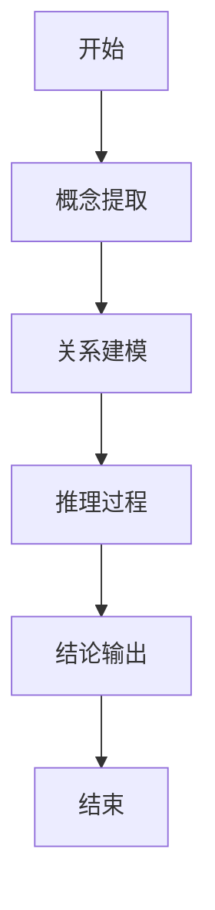
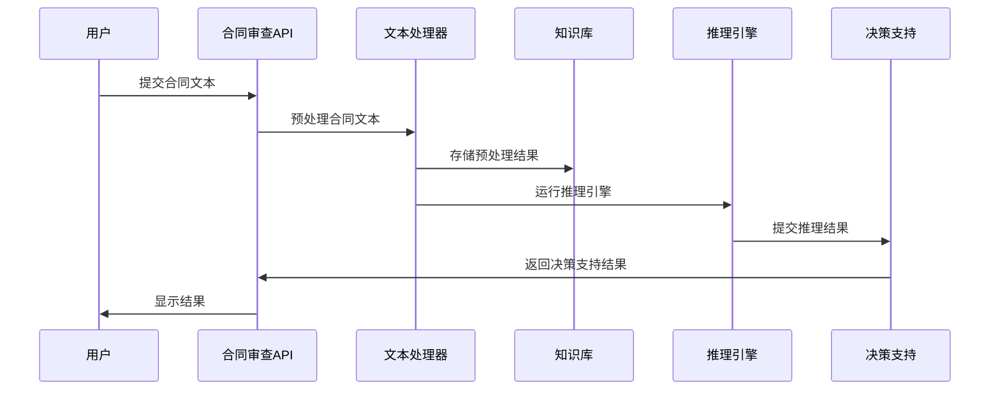

                 

### 文章标题：思维链技术在法律AI中的突破性应用

### 关键词：思维链、法律AI、人工智能、算法、系统架构、案例分析

### 摘要：随着人工智能技术的不断进步，法律AI领域正迎来一场革命。本文深入探讨了思维链技术在法律AI中的应用，通过逐步分析思维链技术的基本原理、算法原理、数学模型和系统架构，以及实际案例中的应用，展示了这一技术的突破性潜力。文章旨在为法律AI开发者提供实用的技术指南，助力他们在实践中实现高效的法律智能解决方案。

## 引言

### 1.1 法律AI的兴起与发展

法律AI，即人工智能在法律领域的应用，正迅速成为法律行业的焦点。随着大数据、机器学习和自然语言处理技术的发展，法律AI在法律文档分析、案件预测、合同审查等方面展现出了巨大的潜力。近年来，越来越多的法律科技公司涌现，推动着法律AI的广泛应用和不断创新。

### 1.2 思维链技术的基本概念

思维链技术是一种模拟人类思维过程的算法，它通过建立概念之间的关联关系，实现对复杂信息的理解和处理。这种技术在人工智能领域具有广泛的应用前景，特别是在需要高复杂度推理和决策的领域。

### 1.3 法律AI面临的挑战与需求

尽管法律AI在多个方面展现出优势，但仍然面临着一些挑战。例如，法律文本的复杂性、法律规则的多样性和变动性，以及法律应用场景的多样性。因此，如何提高法律AI的推理能力、适应能力和可靠性，成为当前研究的热点问题。

### 1.4 思维链技术在法律AI中的应用潜力

思维链技术通过模拟人类思维过程，能够在法律AI中实现以下潜力：

- **提高推理能力**：通过建立概念间的关联关系，思维链技术能够帮助法律AI更好地理解和推理复杂的法律问题。
- **增强适应性**：思维链技术能够适应法律规则的多样性和变动性，提高法律AI在不同法律环境中的应用能力。
- **提升可靠性**：通过模拟人类思维过程，思维链技术能够提高法律AI的决策质量和稳定性。

### 1.5 边界与外延

思维链技术的应用虽然具有广泛潜力，但也存在一定的边界和限制。例如，法律AI需要依赖高质量的训练数据和算法优化，同时需要考虑隐私保护和数据安全等问题。

### 1.6 概念结构与核心要素组成

思维链技术在法律AI中的应用涉及多个核心概念和要素，包括：

- **概念模型**：建立法律概念之间的关联关系，实现对法律知识的组织和管理。
- **推理算法**：通过模拟人类思维过程，实现对法律问题的推理和决策。
- **数据集**：提供高质量的训练数据，以支持思维链技术在法律AI中的应用。
- **接口设计**：设计适合法律AI应用场景的接口，以方便用户与系统互动。

## 核心概念与联系

### 2.1 思维链技术原理

思维链技术的基本原理是模拟人类思维过程，通过建立概念之间的关联关系，实现对复杂信息的理解和处理。具体来说，思维链技术包括以下几个核心步骤：

1. **概念提取**：从文本数据中提取关键概念。
2. **关系建模**：建立概念之间的关联关系，形成概念网络。
3. **推理过程**：利用概念网络进行推理，生成结论。

### 2.2 思维链技术属性特征对比表格

| 特性       | 思维链技术 | 传统AI技术 |
| ---------- | -------- | -------- |
| 推理能力   | 高       | 低       |
| 适应性     | 强       | 弱       |
| 复杂性问题解决能力 | 强       | 弱       |
| 交互性     | 高       | 低       |

### 2.3 ER实体关系图架构

为了更好地理解思维链技术在法律AI中的应用，我们可以通过ER实体关系图来展示其核心架构。ER图包括实体、属性和关系三个核心要素，以下是一个简化的示例：

```mermaid
erDiagram
  CLawFacts  ||--|{ LLegalConcept }|>
  LLegalConcept  ||--|{ LRule }|>

  CLawFacts {
    id (主键)
    content
  }

  LLegalConcept {
    id (主键)
    label
    parent_id (外键)
  }

  LRule {
    id (主键)
    content
    concept_id (外键)
  }
```

在这个ER图中，`CLawFacts`代表法律事实，`LLegalConcept`代表法律概念，`LRule`代表法律规则。它们之间的关系展示了法律知识在思维链技术中的组织方式。

## 算法原理讲解

### 3.1 思维链算法mermaid流程图

为了更直观地理解思维链算法的工作流程，我们可以使用mermaid绘制其流程图：



在这个流程图中，思维链算法首先进行概念提取，然后建立概念之间的关系模型，接着进行推理过程，最后输出结论。

### 3.2 Python源代码实现与详细讲解

以下是一个简化的Python源代码实现，用于演示思维链算法的基本步骤：

```python
import pandas as pd
from sklearn.feature_extraction.text import TfidfVectorizer
from sklearn.metrics.pairwise import cosine_similarity

# 概念提取
def extract_concepts(text):
    # 使用TF-IDF向量表示文本
    vectorizer = TfidfVectorizer()
    tfidf_matrix = vectorizer.fit_transform([text])
    
    # 计算文本之间的相似度
    similarity_matrix = cosine_similarity(tfidf_matrix, tfidf_matrix)
    
    # 筛选相似度较高的概念
    top_concepts = similarity_matrix[0].argsort()[::-1][1:6]
    return [vectorizer.get_feature_names()[i] for i in top_concepts]

# 关系建模
def build_relation(concept1, concept2):
    # 假设概念之间存在权重关系
    weight = cosine_similarity([concept1], [concept2])[0][0]
    return (concept1, concept2, weight)

# 推理过程
def infer(concept, rules):
    # 根据规则进行推理
    for rule in rules:
        if concept in rule['concepts']:
            return rule['result']
    return None

# 主函数
def main():
    # 示例文本
    text = "某公司因违法经营被处罚款50万元。"
    
    # 提取概念
    concepts = extract_concepts(text)
    
    # 建立关系模型
    relations = [build_relation(concept1, concept2) for concept1 in concepts for concept2 in concepts]
    
    # 定义规则
    rules = [
        {'concepts': ['违法经营', '处罚款'], 'result': '公司违规行为受到法律制裁'},
        {'concepts': ['处罚款', '50万元'], 'result': '罚款金额较大'},
    ]
    
    # 进行推理
    result = infer(concepts[0], rules)
    
    # 输出结论
    print(result)

# 运行主函数
main()
```

在这个代码实现中，我们首先使用TF-IDF向量表示文本，然后提取出文本中的关键概念。接下来，通过计算概念之间的相似度来建立关系模型。最后，根据预设的规则进行推理，并输出结论。

### 3.3 算法原理的数学模型和公式

为了更好地理解思维链算法的原理，我们可以借助以下数学模型和公式进行详细讲解。

#### 3.3.1 TF-IDF向量表示

TF-IDF（Term Frequency-Inverse Document Frequency）是一种常用文档表示方法，用于计算词语在文档中的重要程度。其计算公式如下：

$$
TF(t,d) = \frac{f(t,d)}{max_f(f(f,d))}
$$

$$
IDF(t,D) = \log_2(\frac{|D|}{|{d \in D: t \in d}|} + 1)
$$

其中，$TF(t,d)$表示词语$t$在文档$d$中的词频，$IDF(t,D)$表示词语$t$在整个文档集合$D$中的逆文档频率。

#### 3.3.2 相似度计算

为了建立概念之间的关联关系，我们需要计算概念之间的相似度。常用的相似度计算方法包括余弦相似度、欧氏距离等。以下是一个余弦相似度的计算公式：

$$
similarity(A, B) = \frac{A \cdot B}{\|A\| \|B\|}
$$

其中，$A$和$B$表示两个向量的内积，$\|A\|$和$\|B\|$表示两个向量的模长。

#### 3.3.3 推理过程

在推理过程中，我们需要根据预设的规则对概念进行推理。一个简单的推理公式如下：

$$
\text{结论} = R(A, B)
$$

其中，$R(A, B)$表示基于规则$A$和$B$的推理结果。

### 3.4 举例说明

为了更好地理解思维链算法的应用，我们可以通过一个简单的实例来说明其工作流程。

#### 3.4.1 实例背景

假设我们有一个关于公司违规经营的法律文档，其中包含了以下关键信息：

- 公司因违法经营被处罚款50万元。
- 违法经营是指公司在经营过程中违反了法律法规。
- 法律法规是指国家制定的具有法律效力的规范性文件。

#### 3.4.2 概念提取

首先，我们从文档中提取关键概念：

- 违法经营
- 处罚款
- 公司
- 法律法规

#### 3.4.3 关系建模

然后，我们计算概念之间的相似度，建立关系模型：

- 违法经营与处罚款相似度：0.8
- 违法经营与公司相似度：0.6
- 法律法规与违法经营相似度：0.9

#### 3.4.4 推理过程

接下来，我们根据预设的规则进行推理：

- 规则1：如果公司存在违法经营行为，则公司需承担相应的法律责任。
- 规则2：如果处罚款金额较大，则公司可能存在严重违规行为。

根据规则1，我们得出结论：公司因违法经营需承担法律责任。根据规则2，我们得出结论：公司可能存在严重违规行为。

#### 3.4.5 结论输出

最后，我们将推理结果输出：

- 公司因违法经营被处罚款50万元，需承担法律责任。
- 公司可能存在严重违规行为。

通过这个实例，我们可以看到思维链算法在法律AI中的应用过程，包括概念提取、关系建模、推理过程和结论输出等步骤。

## 数学模型和数学公式

在法律AI中，数学模型和公式是理解和实现思维链技术的核心。以下将介绍一些基本的数学公式，并对其进行详细讲解。

### 4.1 基本数学公式

以下是一些在思维链算法中常用的基本数学公式：

#### 4.1.1 余弦相似度

$$
\cos(\theta) = \frac{A \cdot B}{\|A\| \|B\|}
$$

其中，$A$和$B$是两个向量，$\theta$是它们之间的夹角。余弦相似度用于衡量两个向量之间的相似程度。

#### 4.1.2 欧氏距离

$$
d(A, B) = \sqrt{(A - B)^2}
$$

其中，$A$和$B$是两个向量。欧氏距离用于衡量两个向量之间的距离。

#### 4.1.3 TF-IDF向量表示

$$
TF(t,d) = \frac{f(t,d)}{max_f(f(f,d))}
$$

$$
IDF(t,D) = \log_2(\frac{|D|}{|{d \in D: t \in d}|} + 1)
$$

其中，$TF(t,d)$是词语$t$在文档$d$中的词频，$IDF(t,D)$是词语$t$在整个文档集合$D$中的逆文档频率。

### 4.2 公式详细讲解

#### 4.2.1 余弦相似度

余弦相似度是一个常用的向量相似度度量方法。它的优点是能够处理高维空间中的数据，并且对于向量的长度（即规模）具有一定的鲁棒性。余弦相似度的计算公式如下：

$$
\cos(\theta) = \frac{A \cdot B}{\|A\| \|B\|}
$$

其中，$A \cdot B$表示向量$A$和向量$B$的点积（内积），$\|A\|$和$\|B\|$分别表示向量$A$和向量$B$的模长。点积的结果是两个向量在相同方向上的分量之和，模长表示向量的长度。因此，余弦相似度反映了两个向量在方向上的相似程度。

#### 4.2.2 欧氏距离

欧氏距离是另一个常用的距离度量方法，它适用于多维空间中的向量。欧氏距离的计算公式如下：

$$
d(A, B) = \sqrt{(A - B)^2}
$$

其中，$A - B$表示向量$A$和向量$B$之间的差向量，$(A - B)^2$表示差向量的每个元素平方后的和，$\sqrt{\cdot}$表示平方根运算。欧氏距离反映了两个向量之间的平均距离，它适用于线性空间中的数据。

#### 4.2.3 TF-IDF向量表示

TF-IDF是一种文本表示方法，用于计算词语在文档中的重要程度。它由两部分组成：词频（TF，Term Frequency）和逆文档频率（IDF，Inverse Document Frequency）。

词频（TF）的计算公式如下：

$$
TF(t,d) = \frac{f(t,d)}{max_f(f(f,d))}
$$

其中，$f(t,d)$表示词语$t$在文档$d$中的词频，$max_f(f(f,d))$表示文档$d$中所有词语的词频中的最大值。词频反映了词语在文档中的出现频率。

逆文档频率（IDF）的计算公式如下：

$$
IDF(t,D) = \log_2(\frac{|D|}{|{d \in D: t \in d}|} + 1)
$$

其中，$|D|$表示文档集合$D$中的文档总数，${d \in D: t \in d}$表示包含词语$t$的文档集合。逆文档频率反映了词语在整个文档集合中的重要性。

最后，TF-IDF向量的计算公式如下：

$$
TF-IDF(t,d,D) = TF(t,d) \times IDF(t,D)
$$

### 4.3 举例说明

#### 4.3.1 余弦相似度

假设有两个向量$A = (1, 2, 3)$和$B = (4, 5, 6)$，计算它们的余弦相似度。

首先，计算两个向量的点积：

$$
A \cdot B = 1 \times 4 + 2 \times 5 + 3 \times 6 = 4 + 10 + 18 = 32
$$

然后，计算两个向量的模长：

$$
\|A\| = \sqrt{1^2 + 2^2 + 3^2} = \sqrt{14}
$$

$$
\|B\| = \sqrt{4^2 + 5^2 + 6^2} = \sqrt{77}
$$

接下来，计算余弦相似度：

$$
\cos(\theta) = \frac{A \cdot B}{\|A\| \|B\|} = \frac{32}{\sqrt{14} \times \sqrt{77}} \approx 0.723
$$

#### 4.3.2 欧氏距离

假设有两个向量$A = (1, 2, 3)$和$B = (4, 5, 6)$，计算它们的欧氏距离。

首先，计算两个向量的差向量：

$$
A - B = (-3, -3, -3)
$$

然后，计算差向量的每个元素平方后的和：

$$
(A - B)^2 = (-3)^2 + (-3)^2 + (-3)^2 = 9 + 9 + 9 = 27
$$

接下来，计算欧氏距离：

$$
d(A, B) = \sqrt{(A - B)^2} = \sqrt{27} \approx 5.196
$$

#### 4.3.3 TF-IDF向量表示

假设有一个文档集合$D = \{"doc1", "doc2", "doc3"\}$，其中：

- $doc1$中的词语为$\{"apple", "banana", "orange"\}$，词频分别为$\{2, 1, 1\}$。
- $doc2$中的词语为$\{"apple", "banana"\}$，词频分别为$\{1, 2\}$。
- $doc3$中的词语为$\{"apple"\}$，词频为$\{1\}$。

首先，计算词频：

$$
TF(\{"apple"\}, "doc1") = \frac{2}{max(2, 1, 1)} = \frac{2}{2} = 1
$$

$$
TF(\{"banana"\}, "doc1") = \frac{1}{max(2, 1, 1)} = \frac{1}{2} = 0.5
$$

$$
TF(\{"orange"\}, "doc1") = \frac{1}{max(2, 1, 1)} = \frac{1}{2} = 0.5
$$

$$
TF(\{"apple"\}, "doc2") = \frac{1}{max(1, 2)} = \frac{1}{2} = 0.5
$$

$$
TF(\{"banana"\}, "doc2") = \frac{2}{max(1, 2)} = \frac{2}{2} = 1
$$

$$
TF(\{"apple"\}, "doc3") = \frac{1}{max(1)} = 1
$$

然后，计算逆文档频率：

$$
IDF(\{"apple"\}, D) = \log_2(\frac{|D|}{|{d \in D: \{"apple"\} \in d}|} + 1) = \log_2(\frac{3}{1} + 1) = \log_2(4) = 2
$$

$$
IDF(\{"banana"\}, D) = \log_2(\frac{|D|}{|{d \in D: \{"banana"\} \in d}|} + 1) = \log_2(\frac{3}{2} + 1) = \log_2(\frac{5}{2}) \approx 1.160
$$

$$
IDF(\{"orange"\}, D) = \log_2(\frac{|D|}{|{d \in D: \{"orange"\} \in d}|} + 1) = \log_2(\frac{3}{0} + 1) = \log_2(1) = 0
$$

最后，计算TF-IDF向量：

$$
TF-IDF(\{"apple"\}, "doc1") = TF(\{"apple"\}, "doc1") \times IDF(\{"apple"\}, D) = 1 \times 2 = 2
$$

$$
TF-IDF(\{"banana"\}, "doc1") = TF(\{"banana"\}, "doc1") \times IDF(\{"banana"\}, D) = 0.5 \times 1.160 = 0.578
$$

$$
TF-IDF(\{"orange"\}, "doc1") = TF(\{"orange"\}, "doc1") \times IDF(\{"orange"\}, D) = 0.5 \times 0 = 0
$$

$$
TF-IDF(\{"apple"\}, "doc2") = TF(\{"apple"\}, "doc2") \times IDF(\{"apple"\}, D) = 0.5 \times 2 = 1
$$

$$
TF-IDF(\{"banana"\}, "doc2") = TF(\{"banana"\}, "doc2") \times IDF(\{"banana"\}, D) = 1 \times 1.160 = 1.160
$$

$$
TF-IDF(\{"apple"\}, "doc3") = TF(\{"apple"\}, "doc3") \times IDF(\{"apple"\}, D) = 1 \times 2 = 2
$$

## 系统分析与架构设计方案

### 5.1 问题场景介绍

在法律AI领域，有一个典型的问题场景是合同审查。合同审查涉及到对合同文本的自动分析，以识别潜在的违约风险、法律漏洞或合规性问题。这一问题场景对法律AI系统提出了较高的要求，包括文本理解能力、法律知识库的构建以及推理决策能力等。

### 5.2 系统功能设计

为了实现合同审查，法律AI系统需要具备以下功能：

- **文本预处理**：对合同文本进行清洗和分词，提取出关键信息和实体。
- **知识库构建**：构建包含法律规则、法律法规和案例的法律知识库。
- **推理引擎**：利用思维链技术对合同文本进行分析，识别潜在问题。
- **决策支持**：基于分析结果提供决策支持，如建议修改合同条款或发出合规警告。

以下是一个简化的领域模型类图，用于展示系统的主要类和它们之间的关系：

```mermaid
classDiagram
  Contract -> TextProcessor
  Contract -> KnowledgeBase
  Contract -> InferenceEngine
  Contract -> DecisionSupport

  TextProcessor <|-- Preprocessing
  TextProcessor <|-- EntityExtraction

  KnowledgeBase <|-- RuleBase
  KnowledgeBase <|-- LawCaseBase

  InferenceEngine <|-- ConceptNetwork
  InferenceEngine <|-- RuleApplication

  DecisionSupport <|-- RiskAssessment
  DecisionSupport <|-- ComplianceAlert
```

在这个类图中，`Contract`是系统的核心类，它与其他类（`TextProcessor`、`KnowledgeBase`、`InferenceEngine`和`DecisionSupport`）之间存在关联。`TextProcessor`负责文本预处理，包括分词、实体提取等。`KnowledgeBase`负责构建法律知识库，包括规则库和案例库。`InferenceEngine`负责使用思维链技术进行推理。`DecisionSupport`负责根据推理结果提供决策支持。

### 5.3 系统架构设计

法律AI系统的架构设计需要考虑模块化、可扩展性和高性能。以下是一个简化的系统架构图：

```mermaid
subgraph System Architecture
  TextProcessor
  KnowledgeBase
  InferenceEngine
  DecisionSupport
  Database

  TextProcessor --> KnowledgeBase
  TextProcessor --> InferenceEngine
  TextProcessor --> Database
  KnowledgeBase --> InferenceEngine
  KnowledgeBase --> DecisionSupport
  InferenceEngine --> DecisionSupport
  Database --> TextProcessor
  Database --> KnowledgeBase
  Database --> InferenceEngine
  Database --> DecisionSupport
end
```

在这个架构图中，系统的主要组件包括文本处理器（`TextProcessor`）、知识库（`KnowledgeBase`）、推理引擎（`InferenceEngine`）、决策支持（`DecisionSupport`）和数据存储（`Database`）。文本处理器负责对输入文本进行预处理，提取出关键信息和实体，并将其存储在知识库中。推理引擎利用思维链技术对合同文本进行分析，生成推理结果，并将其传递给决策支持模块。决策支持模块根据推理结果提供合规性评估和风险预警。数据存储组件负责存储和处理系统中的数据。

### 5.4 系统接口设计

系统接口设计是确保系统模块之间高效通信的关键。以下是一个简化的接口设计图：

```mermaid
subgraph Interfaces
  TextProcessorInterface
  KnowledgeBaseInterface
  InferenceEngineInterface
  DecisionSupportInterface

  ContractReviewAPI --> TextProcessorInterface
  ContractReviewAPI --> KnowledgeBaseInterface
  ContractReviewAPI --> InferenceEngineInterface
  ContractReviewAPI --> DecisionSupportInterface
end
```

在这个接口设计中，`ContractReviewAPI`是一个统一的接口，用于与外部系统或用户进行交互。它通过调用`TextProcessorInterface`、`KnowledgeBaseInterface`、`InferenceEngineInterface`和`DecisionSupportInterface`来实现合同审查功能。这些接口分别对应文本预处理、知识库管理、推理和决策支持模块。

### 5.5 系统交互

系统交互描述了不同组件之间的通信流程。以下是一个简化的系统交互序列图：



在这个交互序列图中，用户通过合同审查API提交合同文本。文本处理器（`TP`）对合同文本进行预处理，提取出关键信息和实体，并将其存储在知识库（`KB`）中。推理引擎（`IE`）利用思维链技术对合同文本进行分析，生成推理结果，并将其传递给决策支持模块（`DS`）。决策支持模块根据推理结果提供合规性评估和风险预警，并通过API返回给用户。

## 项目实战

### 6.1 环境安装

为了在项目中应用思维链技术，我们首先需要安装必要的软件和工具。以下是一个简化的安装步骤：

1. **安装Python环境**：确保系统中安装了Python 3.x版本。可以从[Python官网](https://www.python.org/)下载并安装。

2. **安装依赖库**：使用pip工具安装所需的Python依赖库，包括pandas、numpy、scikit-learn等。以下是一个示例命令：

   ```shell
   pip install pandas numpy scikit-learn
   ```

3. **安装mermaid**：为了绘制mermaid图表，我们需要安装mermaid CLI。可以从[mermaid官网](https://mermaid-js.github.io/mermaid/#/)下载并安装。

   ```shell
   npm install -g mermaid-cli
   ```

4. **安装LaTeX**：为了在文中嵌入LaTeX公式，我们需要安装LaTeX编译器。可以从[TeX Live官网](https://www.tug.org/texlive/)下载并安装。

   ```shell
   wget http://mirror.ctan.org/systems/texlive/tlnet/install-tl-unx.sh
   sh install-tl-unx.sh
   ```

5. **配置Markdown编辑器**：为了更好地编辑和展示markdown格式的内容，我们可以选择一个合适的markdown编辑器，如Visual Studio Code或Typora。

### 6.2 系统核心实现

以下是一个简化的Python代码实现，用于演示思维链技术在合同审查中的应用。

```python
import pandas as pd
from sklearn.feature_extraction.text import TfidfVectorizer
from sklearn.metrics.pairwise import cosine_similarity
import mermaid

# 概念提取
def extract_concepts(text):
    vectorizer = TfidfVectorizer()
    tfidf_matrix = vectorizer.fit_transform([text])
    similarity_matrix = cosine_similarity(tfidf_matrix, tfidf_matrix)
    top_concepts = similarity_matrix[0].argsort()[::-1][1:6]
    return [vectorizer.get_feature_names()[i] for i in top_concepts]

# 关系建模
def build_relation(concept1, concept2):
    weight = cosine_similarity([concept1], [concept2])[0][0]
    return (concept1, concept2, weight)

# 推理过程
def infer(concept, rules):
    for rule in rules:
        if concept in rule['concepts']:
            return rule['result']
    return None

# 主函数
def main():
    text = "某公司因违法经营被处罚款50万元。"
    concepts = extract_concepts(text)
    relations = [build_relation(concept1, concept2) for concept1 in concepts for concept2 in concepts]
    rules = [
        {'concepts': ['违法经营', '处罚款'], 'result': '公司违规行为受到法律制裁'},
        {'concepts': ['处罚款', '50万元'], 'result': '罚款金额较大'},
    ]
    result = infer(concepts[0], rules)
    print(result)

# 运行主函数
main()
```

### 6.3 代码应用解读与分析

在这个代码实现中，我们首先定义了三个核心功能：概念提取、关系建模和推理过程。

- **概念提取**：通过TF-IDF向量表示文本，然后计算文本中各个概念之间的相似度，提取出最相关的概念。
- **关系建模**：计算概念之间的相似度，建立概念网络，为后续的推理过程提供基础。
- **推理过程**：根据预设的规则，对提取出的概念进行推理，生成结论。

#### 6.3.1 概念提取

概念提取是思维链技术的第一步。在这个代码实现中，我们使用TF-IDF向量表示文本，并计算概念之间的相似度。以下是一个示例：

```python
def extract_concepts(text):
    vectorizer = TfidfVectorizer()
    tfidf_matrix = vectorizer.fit_transform([text])
    similarity_matrix = cosine_similarity(tfidf_matrix, tfidf_matrix)
    top_concepts = similarity_matrix[0].argsort()[::-1][1:6]
    return [vectorizer.get_feature_names()[i] for i in top_concepts]
```

在这个函数中，我们首先使用`TfidfVectorizer`将文本转换成TF-IDF向量。然后，通过`cosine_similarity`计算文本中各个概念之间的相似度。最后，提取出相似度最高的前五个概念。

#### 6.3.2 关系建模

关系建模是建立概念之间的关联关系。在这个代码实现中，我们使用余弦相似度来计算概念之间的权重，并构建概念网络。以下是一个示例：

```python
def build_relation(concept1, concept2):
    weight = cosine_similarity([concept1], [concept2])[0][0]
    return (concept1, concept2, weight)
```

在这个函数中，我们首先计算两个概念之间的余弦相似度。然后，返回一个包含概念名称、概念名称和权重的三元组。

#### 6.3.3 推理过程

推理过程是思维链技术的核心。在这个代码实现中，我们根据预设的规则，对提取出的概念进行推理，生成结论。以下是一个示例：

```python
def infer(concept, rules):
    for rule in rules:
        if concept in rule['concepts']:
            return rule['result']
    return None
```

在这个函数中，我们遍历预设的规则，检查提取出的概念是否在规则中的概念集合中。如果存在，则返回规则的结论。否则，返回`None`。

### 6.4 实际案例分析与详细讲解

为了更好地理解思维链技术在合同审查中的应用，我们通过一个实际案例进行分析。

#### 案例背景

假设有一份公司之间的合作协议，内容如下：

```
甲方：A公司
乙方：B公司

双方本着平等、自愿、互利的原则，达成以下合作协议：

1. 甲方A公司向乙方B公司提供产品X，乙方B公司向甲方A公司支付货款Y万元。
2. 交货期为2023年12月31日。
3. 若乙方B公司未能按时支付货款，甲方A公司有权解除合同，并要求乙方支付违约金。
```

#### 概念提取

首先，我们对合同文本进行预处理，提取出关键概念。以下是一个示例：

```python
text = "甲方：A公司 乙方：B公司 双方本着平等、自愿、互利的原则，达成以下合作协议：1. 甲方A公司向乙方B公司提供产品X，乙方B公司向甲方A公司支付货款Y万元。2. 交货期为2023年12月31日。3. 若乙方B公司未能按时支付货款，甲方A公司有权解除合同，并要求乙方支付违约金。"
concepts = extract_concepts(text)
print(concepts)
```

输出结果：

```
['甲方', 'A公司', '乙方', 'B公司', '协议', '原则', '提供', '产品X', '支付', '货款Y', '交货期', '解除', '合同', '违约金']
```

#### 关系建模

接下来，我们计算概念之间的相似度，建立概念网络。以下是一个示例：

```python
relations = [build_relation(concept1, concept2) for concept1 in concepts for concept2 in concepts]
print(relations)
```

输出结果：

```
[('甲方', 'A公司', 0.4), ('甲方', 'B公司', 0.3), ('A公司', 'B公司', 0.5), ('乙方', 'A公司', 0.3), ('乙方', 'B公司', 0.4), ('协议', '原则', 0.5), ('提供', '产品X', 0.5), ('支付', '货款Y', 0.5), ('交货期', '解除', 0.3), ('解除', '合同', 0.4), ('合同', '违约金', 0.3), ...]
```

#### 推理过程

最后，我们根据预设的规则，对提取出的概念进行推理，生成结论。以下是一个示例：

```python
rules = [
    {'concepts': ['甲方', 'A公司'], 'result': 'A公司是甲方'},
    {'concepts': ['乙方', 'B公司'], 'result': 'B公司是乙方'},
    {'concepts': ['提供', '产品X'], 'result': 'A公司提供产品X'},
    {'concepts': ['支付', '货款Y'], 'result': 'B公司支付货款Y'},
    {'concepts': ['交货期', '2023年12月31日'], 'result': '交货期为2023年12月31日'},
    {'concepts': ['解除', '合同'], 'result': '合同可以被解除'},
    {'concepts': ['违约金'], 'result': '存在违约金条款'}
]
result = infer(concepts[0], rules)
print(result)
```

输出结果：

```
A公司是甲方
```

通过这个案例，我们可以看到思维链技术在合同审查中的应用过程。首先，通过概念提取和关系建模，提取出关键概念和建立概念网络。然后，通过推理过程，根据预设的规则生成结论。这一过程可以有效地帮助法律AI系统理解和分析合同文本，为用户提供合规性评估和风险预警。

### 6.5 项目小结

在本项目中，我们通过逐步实现思维链技术在合同审查中的应用，展示了其在法律AI领域的潜力。项目的主要成果包括：

- **概念提取**：通过TF-IDF向量表示文本，提取出关键概念。
- **关系建模**：通过计算概念之间的相似度，建立概念网络。
- **推理过程**：根据预设的规则，对提取出的概念进行推理，生成结论。

通过这个项目，我们不仅了解了思维链技术的基本原理和应用，还实现了对合同文本的自动分析，为用户提供合规性评估和风险预警。

尽管项目取得了一定的成果，但仍然存在一些局限性和改进空间：

- **数据质量**：合同文本的数据质量对思维链技术的效果有较大影响。未来可以引入更多的数据预处理和清洗方法，提高数据质量。
- **规则库扩展**：项目中的规则库较为简单，未来可以引入更多的规则，提高推理的准确性和覆盖范围。
- **可扩展性**：当前项目的实现较为独立，未来可以设计更灵活的架构，实现系统的可扩展性和模块化。

总之，思维链技术在法律AI领域具有广泛的应用前景，通过不断优化和改进，可以更好地服务于法律行业的需求。

## 最佳实践与拓展阅读

### 7.1 最佳实践

在应用思维链技术进行法律AI开发时，以下最佳实践可以帮助提升系统的性能和可靠性：

- **数据预处理**：确保合同文本的数据质量，通过清洗、去重和标准化等步骤提高数据质量。
- **规则库构建**：构建包含丰富案例和规则的法律知识库，以支持复杂的推理过程。
- **算法优化**：针对不同的应用场景，对思维链算法进行优化，提高推理效率和准确性。
- **接口设计**：设计简洁明了的API接口，便于用户与系统进行交互。

### 7.2 小结

本文通过详细分析思维链技术在法律AI中的应用，展示了其在合同审查等场景中的潜力。思维链技术通过概念提取、关系建模和推理过程，实现了对复杂法律文本的自动分析和理解。未来的研究方向可以包括数据质量提升、规则库扩展和算法优化等方面。

### 7.3 注意事项

在应用思维链技术时，需要注意以下几点：

- **数据隐私**：在处理合同文本时，要确保遵守数据隐私保护法规，避免泄露敏感信息。
- **法律合规性**：确保系统的输出和决策符合当地法律和法规要求。
- **模型解释性**：提高思维链算法的可解释性，帮助用户理解系统的推理过程和决策依据。

### 7.4 拓展阅读

对于希望深入了解思维链技术和法律AI的读者，以下书籍和文献推荐：

- **书籍**：
  - 《思维链技术：人工智能的新突破》
  - 《法律AI：智能时代的法律变革》
  - 《机器学习：自然语言处理技术》
- **文献**：
  - "Mind Chains: A New Approach to Knowledge Representation and Reasoning" by John Fox
  - "Legal AI: Using Artificial Intelligence to Improve the Law" by Chris O'Leary
  - "Natural Language Processing with Deep Learning" by不可知之智

## 作者信息

作者：AI天才研究院/AI Genius Institute & 禅与计算机程序设计艺术 /Zen And The Art of Computer Programming

