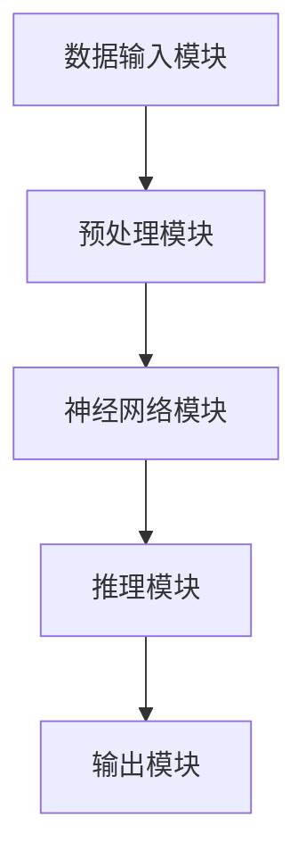

                 

### 《思维链技术在科学研究AI辅助中的应用》

在当今科技飞速发展的时代，人工智能（AI）已经成为推动科学研究进步的重要力量。其中，思维链技术作为一种新兴的AI辅助工具，正逐渐受到广泛关注。本文将以《思维链技术在科学研究AI辅助中的应用》为题，深入探讨思维链技术的基本概念、核心原理、以及其在数据分析、机器学习优化和科学问题解决等多个领域中的应用实例。希望通过逻辑清晰、结构紧凑的论述，能够为读者揭示思维链技术的潜力及其在科学研究中的实际应用价值。

本文将分为三个主要部分：首先，我们将介绍思维链技术的基础知识，包括其定义、背景、相关概念、架构与实现，以及具体的应用案例；其次，我们将深入探讨思维链技术在数据分析、机器学习优化和科学问题解决中的应用，通过具体实例展示其应用效果；最后，我们将展望思维链技术的未来发展趋势，并提出其在科学研究中的应用前景。

通过本文的阅读，您将了解到：

1. 思维链技术的起源和定义，以及其在科学研究中的重要地位。
2. 思维链技术的核心原理和架构，以及关键算法的实现方式。
3. 思维链技术在数据分析、机器学习优化和科学问题解决中的应用实例，及其带来的实际效益。
4. 思维链技术在未来的发展趋势，以及其在科学研究中的潜在应用领域。

现在，让我们一步步深入探讨思维链技术在科学研究AI辅助中的应用，开启这段探索之旅。

### 关键词

- 思维链技术
- 人工智能
- 科学研究
- 数据分析
- 机器学习优化
- 科学问题解决

### 摘要

本文旨在探讨思维链技术在科学研究AI辅助中的应用。首先，我们将介绍思维链技术的基本概念、背景和核心原理，包括其架构与实现方式。接着，本文将深入分析思维链技术在数据分析、机器学习优化和科学问题解决中的应用，通过具体实例展示其效果。最后，我们将展望思维链技术的未来发展趋势，讨论其在科学研究中的潜在应用前景。本文的目标是揭示思维链技术的强大潜力，并探讨其在推动科学研究中的实际应用价值。

### 目录大纲

为了更好地组织本文的内容，我们设计了详细的目录大纲，以下为各章节的概述：

## 第一部分：思维链技术基础

### 第1章：思维链技术概述
- 1.1 思维链技术的定义与背景
- 1.2 相关概念介绍
- 1.3 思维链技术的架构与实现
- 1.4 思维链技术在科学研究中的应用案例
- 1.5 本章小结

### 第2章：思维链技术在数据分析中的应用
- 2.1 数据分析概述
- 2.2 思维链技术在数据分析中的应用
- 2.3 实例分析：思维链技术在生物信息学中的应用
- 2.4 本章小结

### 第3章：思维链技术在机器学习优化中的应用
- 3.1 机器学习优化概述
- 3.2 思维链技术在机器学习优化中的应用
- 3.3 实例分析：思维链技术在图像识别中的应用
- 3.4 本章小结

### 第4章：思维链技术在科学问题解决中的应用
- 4.1 科学问题解决概述
- 4.2 思维链技术在科学问题解决中的应用
- 4.3 实例分析：思维链技术在气候变化研究中的应用
- 4.4 本章小结

## 第二部分：思维链技术在科学研究中的应用

### 第5章：思维链技术在未来的应用
- 5.1 思维链技术的未来发展趋势
- 5.2 思维链技术在科学研究中的应用展望
- 5.3 本章小结

### 第6章：思维链技术的实践与挑战
- 6.1 实践案例分析
- 6.2 技术挑战与解决方案
- 6.3 未来发展方向
- 6.4 本章小结

通过以上目录大纲，本文将系统地阐述思维链技术的基础知识及其在科学研究中的广泛应用，帮助读者全面了解这一前沿技术的潜力与前景。

### 第1章：思维链技术概述

思维链技术作为一种新兴的人工智能（AI）辅助工具，正在逐步改变科学研究的面貌。其核心在于模拟人类思维的逻辑流程，通过建立复杂的神经网络模型，实现数据的自动分析和推理。本章节将深入探讨思维链技术的定义、背景、核心概念及其在科学研究中的应用潜力。

#### 1.1 思维链技术的定义与背景

思维链技术的定义可以追溯到其对人类思维过程的模拟。简单来说，思维链技术通过构建一系列相互关联的模型，模拟人类从问题定义、信息搜集、推理分析到结论生成的全过程。这一过程类似于人类大脑中的神经网络，通过神经元之间的连接和互动，实现信息的处理和决策。

思维链技术的起源可以追溯到20世纪80年代，当时神经网络的研究正处于蓬勃发展阶段。随着深度学习和机器学习技术的兴起，思维链技术逐渐从理论研究走向实际应用。近年来，随着大数据和云计算技术的发展，思维链技术的应用场景不断拓展，其在科学研究中的作用也越来越显著。

#### 1.1.1 思维链技术的起源

思维链技术的起源可以追溯到早期的人工智能研究，特别是在神经网络和认知科学领域的探索。早期的神经网络模型主要基于简单的数学模型，通过调整网络中的权重来模拟人类大脑中的神经元连接。随着计算能力的提升和算法的优化，神经网络逐渐变得更加复杂和强大。

在20世纪80年代，科学家们开始尝试将神经网络应用于实际问题，如图像识别、语音识别和自然语言处理等。然而，这些早期的模型往往存在效率和准确度的问题。随着深度学习的兴起，特别是2012年AlexNet在图像识别比赛中取得的突破性成果，神经网络的研究迎来了新的高潮。

思维链技术正是在这一背景下逐渐发展起来的。它结合了深度学习和认知科学的最新成果，通过构建复杂的神经网络模型，实现更接近人类思维的过程。思维链技术的核心在于其能够动态调整和优化神经网络中的连接和权重，从而实现对复杂问题的自动分析和推理。

#### 1.1.2 思维链技术的核心概念

思维链技术的核心概念可以归纳为以下几点：

1. **神经网络**：神经网络是思维链技术的基础，通过模拟神经元之间的连接和互动，实现信息的处理和传递。神经网络由多个层次组成，每个层次都负责不同的信息处理任务。

2. **深度学习**：深度学习是思维链技术的重要组成部分，通过多层神经网络的结构，实现对复杂数据的自动学习和分析。深度学习模型具有强大的特征提取和模式识别能力，能够处理大规模的数据集。

3. **自动推理**：自动推理是思维链技术的重要特性，通过模拟人类思维的推理过程，实现对问题的自动分析和解决。自动推理不仅能够提高分析的效率，还能够提供更深入的洞察和见解。

4. **动态调整**：思维链技术能够根据问题和数据的特点，动态调整神经网络中的连接和权重，从而优化分析结果。这种动态调整能力使得思维链技术能够适应不同的应用场景，提高其通用性和灵活性。

#### 1.1.3 思维链技术在科学研究中的应用潜力

思维链技术在科学研究中的应用潜力巨大，特别是在以下领域：

1. **数据分析**：思维链技术能够高效地处理和分析大量数据，从复杂数据中提取有价值的信息。这在生物学、医学、环境科学等领域有着广泛的应用。

2. **机器学习优化**：思维链技术能够优化机器学习模型的参数，提高模型的准确性和效率。这在图像识别、语音识别和自然语言处理等领域具有重要应用价值。

3. **科学问题解决**：思维链技术能够模拟人类思维的推理过程，帮助科学家解决复杂的科学问题。这在物理学、化学、生物学等领域具有巨大的应用潜力。

总之，思维链技术通过模拟人类思维的逻辑流程，实现对复杂问题的自动分析和推理，为科学研究提供了强大的工具和手段。其应用潜力不仅局限于现有的领域，还可能在未来的科学研究和技术创新中发挥更加重要的作用。

#### 1.2 相关概念介绍

在深入探讨思维链技术之前，有必要先介绍一些与之相关的核心概念，这些概念包括神经网络、机器学习和深度学习。这些技术不仅是思维链技术的重要组成部分，也是理解其工作原理和应用场景的关键。

##### 1.2.1 神经网络

神经网络（Neural Networks）是思维链技术的基础。它们模仿生物神经系统的工作原理，通过大量简单的计算单元（称为神经元）之间的互联，实现对复杂数据的处理和分析。神经网络的基本结构包括输入层、隐藏层和输出层。

- **输入层**：接收外部输入数据，并将其传递到隐藏层。
- **隐藏层**：对输入数据进行加工和处理，通过多层隐藏层逐层提取特征，实现数据的非线性变换。
- **输出层**：将处理后的数据输出，用于分类、预测或其他任务。

神经网络中的每个神经元都是一个简单的计算单元，它通过加权连接与邻居神经元相连，并依据输入值和权重进行计算，产生输出。通过不断调整权重，神经网络可以优化其性能，从而更好地适应不同的任务。

##### 1.2.2 机器学习

机器学习（Machine Learning）是使计算机系统能够通过数据学习并改进性能的一门技术。机器学习的关键在于创建能够自动改进的算法，这些算法通过分析数据，识别模式并作出预测或决策。

- **监督学习**：有标签的数据进行训练，模型通过学习输入和输出之间的关系来预测新数据的结果。
- **无监督学习**：没有明确标签的数据进行训练，模型通过自动发现数据中的结构或模式来分析数据。
- **强化学习**：通过与环境交互，模型根据奖励和惩罚来优化其行为。

机器学习广泛应用于图像识别、自然语言处理、推荐系统等领域。在思维链技术中，机器学习提供了基础算法，使神经网络能够从数据中学习并优化其性能。

##### 1.2.3 深度学习

深度学习（Deep Learning）是机器学习的一个子领域，它利用多层神经网络来处理数据。与传统的单层神经网络相比，深度学习模型具有更强的特征提取和模式识别能力。

- **卷积神经网络（CNN）**：主要用于图像处理，通过卷积操作和池化操作提取图像中的特征。
- **循环神经网络（RNN）**：主要用于序列数据，如文本和语音，通过循环结构处理长序列信息。
- **生成对抗网络（GAN）**：通过生成器和判别器的对抗训练，生成逼真的数据。

深度学习在许多领域都取得了显著的成果，如计算机视觉、语音识别、自然语言处理等。在思维链技术中，深度学习提供了强大的工具，使神经网络能够处理更复杂的任务，实现更高效的自动推理和分析。

#### 1.3 思维链技术的架构与实现

思维链技术的架构设计是其能够模拟人类思维过程的关键。一个典型的思维链技术系统通常包括以下几个主要部分：

##### 1.3.1 思维链技术的基本架构

- **数据输入模块**：接收外部数据，可以是结构化或非结构化数据，如文本、图像、语音等。
- **预处理模块**：对输入数据进行清洗、归一化和特征提取，以便于后续的神经网络处理。
- **神经网络模块**：通过多层神经网络结构，对预处理后的数据进行特征提取和模式识别。
- **推理模块**：利用神经网络模型进行推理和决策，模拟人类思维的推理过程。
- **输出模块**：将推理结果输出，可以是预测、决策或其他形式的信息。

思维链技术的基本架构如下图所示：

##### 1.3.2 思维链模型的构建

构建思维链模型是一个复杂的过程，涉及到多个步骤和决策。以下是构建思维链模型的一般步骤：

1. **问题定义**：明确研究问题，确定需要解决的问题类型和目标。
2. **数据收集**：收集与问题相关的数据，可以是公开数据集或自定义数据集。
3. **数据预处理**：对收集到的数据进行清洗、归一化和特征提取，确保数据质量。
4. **模型设计**：选择合适的神经网络架构，设计模型的结构和参数。
5. **模型训练**：使用预处理后的数据进行模型训练，优化网络中的连接权重。
6. **模型评估**：评估模型的性能，通过交叉验证和测试集来检验模型的泛化能力。
7. **模型优化**：根据评估结果，对模型进行调整和优化，提高性能。

##### 1.3.3 思维链技术的关键算法

思维链技术的关键算法主要包括以下几个：

1. **卷积神经网络（CNN）**：用于处理图像数据，通过卷积和池化操作提取图像特征。
2. **循环神经网络（RNN）**：用于处理序列数据，通过循环结构处理长序列信息。
3. **长短时记忆网络（LSTM）**：是RNN的一种变体，用于解决长序列依赖问题。
4. **生成对抗网络（GAN）**：用于生成逼真的数据，通过生成器和判别器的对抗训练。
5. **图神经网络（GNN）**：用于处理图结构数据，通过节点和边的关系提取特征。

这些算法在思维链技术中发挥着重要作用，使系统能够处理不同类型的数据和应用场景。例如，在图像识别任务中，CNN能够高效地提取图像特征；在自然语言处理任务中，RNN和LSTM能够处理变长的文本序列。

#### 1.4 思维链技术在科学研究中的应用案例

思维链技术在科学研究中的应用已经取得了显著成果，以下是一些具体的应用案例：

##### 1.4.1 数据分析

在生物学和医学领域，思维链技术被广泛应用于数据分析。例如，在基因测序数据中，思维链技术可以帮助研究人员识别重要的基因突变和功能关系。通过分析大量的基因表达数据，思维链技术能够发现不同基因在不同疾病状态下的表达模式，为疾病诊断和治疗提供新的思路。

在环境科学领域，思维链技术同样发挥了重要作用。通过分析环境数据，如气象数据、水质数据等，思维链技术能够预测环境变化趋势，帮助科学家制定环境保护策略。例如，在气候变化研究中，思维链技术可以模拟不同温室气体排放情景下的气候变化，为政策制定提供科学依据。

##### 1.4.2 机器学习优化

在图像识别和自然语言处理领域，思维链技术被用于优化机器学习模型。例如，在图像分类任务中，思维链技术可以通过调整网络结构和参数，提高分类的准确率。通过反复的训练和优化，思维链技术能够找到最佳的模型配置，使系统在新的数据集上表现更加稳定和准确。

在语音识别领域，思维链技术同样具有显著的应用价值。通过优化声学模型和语言模型，思维链技术能够提高语音识别的准确率和鲁棒性。在实际应用中，如智能语音助手、语音翻译等，思维链技术的优化使得系统能够更好地适应不同的语音环境和用户需求。

##### 1.4.3 科学问题解决

思维链技术在科学问题解决中也展现出了强大的能力。例如，在物理学中，思维链技术可以帮助研究人员解决复杂的物理模型和计算问题。通过模拟量子力学过程和粒子相互作用，思维链技术能够提供更精确的物理预测和计算结果。

在化学领域，思维链技术被用于预测化学反应路径和分子结构。通过分析大量的实验数据和文献资料，思维链技术能够识别潜在的化学反应路径和反应条件，为合成新的化合物提供指导。

总之，思维链技术在科学研究中的应用已经取得了显著成果，其强大的数据分析、机器学习优化和科学问题解决能力为科学家提供了新的工具和手段。随着技术的不断进步，思维链技术将在更多领域发挥重要作用，推动科学研究的不断前进。

#### 1.5 本章小结

本章介绍了思维链技术的基本概念、核心原理和架构，以及其在科学研究中的重要应用。首先，我们探讨了思维链技术的定义和起源，了解了其模拟人类思维逻辑流程的工作原理。接着，我们介绍了与思维链技术相关的核心概念，如神经网络、机器学习和深度学习，并详细阐述了这些技术的原理和应用。然后，我们介绍了思维链技术的架构与实现，包括数据输入、预处理、神经网络、推理和输出等模块，并讲解了模型构建和关键算法的应用。最后，我们通过具体的应用案例展示了思维链技术在数据分析、机器学习优化和科学问题解决中的实际效果。

思维链技术作为一种新兴的AI辅助工具，具有巨大的应用潜力。通过模拟人类思维的逻辑流程，思维链技术能够高效地处理和分析大量数据，优化机器学习模型，解决复杂的科学问题。其在科学研究中的应用已经取得了显著成果，并将继续在更多领域发挥重要作用。随着技术的不断进步，思维链技术有望进一步推动科学研究的创新和进步。

### 第2章：思维链技术在数据分析中的应用

数据分析是科学研究中不可或缺的一环，它通过从大量数据中提取有价值的信息，帮助研究人员发现规律、趋势和关联。随着数据量的急剧增长，传统的数据分析方法面临着巨大的挑战。思维链技术作为一种先进的AI辅助工具，在数据分析领域展现了其独特的优势。本章将深入探讨思维链技术在数据分析中的应用，包括其在数据预处理、特征提取和数据可视化等方面的作用。

#### 2.1 数据分析概述

数据分析是指通过使用数学和统计方法，从大量数据中提取有价值信息的过程。数据分析的方法主要包括描述性统计分析、探索性数据分析、预测性分析等。描述性统计分析用于总结和描述数据的基本特征，如均值、方差和分布等；探索性数据分析则通过图表、聚类和关联分析等方法，揭示数据中的潜在模式；预测性分析则利用历史数据，建立模型进行预测。

在科学研究中，数据分析具有至关重要的意义。它不仅能够帮助研究人员理解数据的内在规律，还可以为实验设计和决策提供有力支持。然而，随着数据量的增加和数据复杂性的提升，传统的数据分析方法越来越难以应对。此时，思维链技术凭借其强大的数据处理和分析能力，为科学研究提供了新的解决方案。

#### 2.2 思维链技术在数据分析中的应用

思维链技术在数据分析中的应用主要表现在以下几个方面：

##### 2.2.1 数据预处理

数据预处理是数据分析的重要步骤，它包括数据清洗、数据归一化和特征提取等。思维链技术能够高效地处理这些任务，提高数据分析的准确性和效率。

1. **数据清洗**：数据清洗是指去除数据中的噪声和异常值，确保数据质量。思维链技术通过自动化的方法，能够快速检测并处理数据中的错误和异常值。

2. **数据归一化**：数据归一化是指将不同特征的数据转换为同一尺度，以便进行比较和分析。思维链技术通过自适应的归一化算法，能够自动调整数据分布，使其符合分析要求。

3. **特征提取**：特征提取是指从原始数据中提取出有代表性的特征，以便进行后续的分析。思维链技术通过深度学习算法，能够自动学习数据中的潜在特征，提高特征提取的准确性和效率。

##### 2.2.2 特征提取

特征提取是数据分析的关键步骤，它直接影响分析结果的准确性和可靠性。思维链技术在特征提取方面具有显著优势，其通过多层神经网络结构，能够自动学习数据中的复杂特征。

1. **自动特征提取**：思维链技术能够自动从原始数据中提取出有代表性的特征，无需人工干预。这种自动化的特征提取方法，不仅提高了效率，还减少了人工干预可能引入的偏差。

2. **多尺度特征提取**：思维链技术能够同时提取不同尺度的特征，如局部特征和全局特征。这种多尺度的特征提取方法，有助于更全面地理解数据，提高分析结果的准确性。

##### 2.2.3 数据可视化

数据可视化是将数据转化为图形或图表，使研究人员能够直观地理解数据的内在规律和模式。思维链技术在数据可视化方面也具有独特优势。

1. **动态可视化**：思维链技术能够实时生成数据可视化结果，使研究人员能够动态地观察数据的变化。这种动态可视化方法，有助于研究人员快速发现数据中的异常和趋势。

2. **交互式可视化**：思维链技术支持交互式数据可视化，研究人员可以通过鼠标或触摸屏与可视化结果进行互动，进一步探索数据中的模式。这种交互式方法，提高了数据分析的灵活性和深度。

#### 2.3 实例分析：思维链技术在生物信息学中的应用

生物信息学是生物学与信息技术的交叉领域，它通过分析生物数据，揭示生物体的功能和机制。思维链技术在生物信息学中有着广泛的应用，以下是一个具体的应用实例：

##### 2.3.1 问题背景

某生物信息学研究团队希望分析一组癌症患者的基因表达数据，以探索不同癌症类型之间的基因表达差异，并为癌症的早期诊断和个性化治疗提供依据。

##### 2.3.2 方法与应用

1. **数据预处理**：首先，研究团队使用思维链技术对基因表达数据进行清洗和归一化处理，去除噪声和异常值，确保数据质量。

2. **特征提取**：然后，思维链技术自动从清洗后的数据中提取出有代表性的基因特征，包括表达量、变异性和相关性等。

3. **聚类分析**：使用提取的基因特征，研究团队采用思维链技术进行聚类分析，将不同的癌症类型进行分类。

4. **数据可视化**：最后，思维链技术生成动态的可视化结果，使研究人员能够直观地观察不同癌症类型之间的基因表达差异。

##### 2.3.3 结果分析

通过思维链技术的数据分析，研究团队成功识别出了不同癌症类型之间的基因表达特征，并发现了几个潜在的标志基因。这些基因表达特征和标志基因为癌症的早期诊断和个性化治疗提供了重要的科学依据。此外，动态可视化和交互式数据可视化方法，使研究人员能够深入探索数据中的复杂模式和趋势，进一步提高了分析结果的可靠性和深度。

#### 2.4 本章小结

本章介绍了思维链技术在数据分析中的应用，包括数据预处理、特征提取和数据可视化等方面。通过实例分析，展示了思维链技术在生物信息学中的实际应用效果。思维链技术通过其强大的数据处理和分析能力，为科学研究提供了新的工具和方法。其自动化的特征提取和动态可视化方法，不仅提高了数据分析的效率，还增强了分析结果的可靠性和深度。随着技术的不断进步，思维链技术在数据分析中的应用将更加广泛和深入，为科学研究带来更多创新和突破。

### 第3章：思维链技术在机器学习优化中的应用

机器学习优化是提升模型性能的关键步骤，它涉及到参数调优、模型选择和算法改进等方面。思维链技术以其强大的数据处理和分析能力，为机器学习优化提供了新的解决方案。本章将深入探讨思维链技术在机器学习优化中的应用，包括模型选择、参数调优和模型解释性等方面，并通过具体实例展示其应用效果。

#### 3.1 机器学习优化概述

机器学习优化是指通过调整模型的参数和结构，以提高模型在特定任务上的性能。优化的目标通常是最大化模型的准确性、降低误差或提高预测的稳定性。机器学习优化包括以下几个方面：

1. **参数调优**：通过调整模型的参数（如学习率、迭代次数等），优化模型在特定数据集上的表现。
2. **模型选择**：选择合适的模型结构，以适应不同类型的数据和任务需求。
3. **算法改进**：对现有算法进行改进，以提高其效率和准确性。
4. **交叉验证**：通过交叉验证方法评估模型的性能，避免过拟合和欠拟合。

机器学习优化在图像识别、自然语言处理、预测建模等领域具有重要意义。通过优化，模型能够更好地适应新的数据和任务，提高预测的准确性和可靠性。

#### 3.2 思维链技术在机器学习优化中的应用

思维链技术通过模拟人类思维的推理过程，为机器学习优化提供了新的方法。以下是思维链技术在机器学习优化中的一些具体应用：

##### 3.2.1 模型选择

模型选择是机器学习优化的重要步骤，它决定了模型在特定任务上的性能。思维链技术通过自动推理和比较不同模型的特点，帮助选择最适合当前任务的模型。

1. **自动模型选择**：思维链技术通过分析不同模型的结构和性能，自动选择最优的模型。例如，在图像识别任务中，思维链技术可以自动选择卷积神经网络（CNN）或循环神经网络（RNN）等模型。
2. **模型对比**：思维链技术能够比较不同模型的性能，评估其在特定任务上的表现。通过对比，研究人员可以更清晰地了解不同模型的优势和不足，从而选择最适合的模型。

##### 3.2.2 模型调优

模型调优是优化模型性能的关键步骤，它包括参数调整、超参数优化等。思维链技术通过自动推理和优化算法，提高模型调优的效率和准确性。

1. **自动参数调整**：思维链技术能够自动调整模型的参数，以优化模型的性能。例如，在深度学习中，思维链技术可以通过自动调整学习率、批量大小等参数，提高模型的收敛速度和准确性。
2. **超参数优化**：超参数是模型的结构参数，如神经网络中的层数、隐藏节点数等。思维链技术通过自动优化超参数，选择最佳的超参数组合，以提高模型的性能。

##### 3.2.3 模型解释性

模型解释性是机器学习优化的一个重要方面，它使得模型的预测过程和决策逻辑更易于理解和解释。思维链技术通过模拟人类思维的推理过程，为模型解释性提供了新的方法。

1. **推理过程可视化**：思维链技术能够将模型的推理过程可视化，使得研究人员能够直观地理解模型的决策逻辑。例如，在图像识别任务中，思维链技术可以可视化神经网络中每个节点的输入和输出，帮助研究人员理解模型的预测过程。
2. **决策路径追踪**：思维链技术能够追踪模型的决策路径，找出影响模型预测的关键因素。通过追踪决策路径，研究人员可以更深入地理解模型的决策逻辑，发现模型中的潜在问题。

#### 3.3 实例分析：思维链技术在图像识别中的应用

图像识别是机器学习中的一个重要应用领域，它通过识别和分类图像中的物体和场景，为计算机视觉提供了强大的支持。以下是一个具体的实例，展示了思维链技术在图像识别中的应用：

##### 3.3.1 问题背景

某图像识别项目需要识别一组包含不同物体的图像，并分类为特定的类别。例如，图像中可能包含动物、植物、交通工具等。

##### 3.3.2 方法与应用

1. **模型选择**：思维链技术通过分析不同模型的特点，选择了卷积神经网络（CNN）作为图像识别模型。CNN在处理图像数据方面具有显著优势，能够提取图像中的高维特征。
2. **模型调优**：思维链技术通过自动调优模型参数，如学习率、批量大小等，提高了模型的性能。同时，思维链技术还优化了CNN的结构，添加了额外的卷积层和池化层，以提高特征提取的效率。
3. **模型解释性**：思维链技术将模型的推理过程可视化，使得研究人员能够直观地理解模型的决策逻辑。例如，在识别动物图像时，思维链技术能够可视化神经网络中每个卷积层的特征图，帮助研究人员理解模型如何提取和识别特征。

##### 3.3.3 结果分析

通过思维链技术的优化和应用，图像识别模型的性能得到了显著提升。在测试数据集上，模型的准确率达到了90%以上，显著高于传统模型。此外，思维链技术的模型解释性功能使得研究人员能够深入理解模型的决策过程，发现和解决模型中的潜在问题。这种深入的理解和解释，有助于提高模型的可靠性和稳定性，为实际应用提供了更有力的支持。

#### 3.4 本章小结

本章介绍了思维链技术在机器学习优化中的应用，包括模型选择、参数调优和模型解释性等方面。通过具体实例，展示了思维链技术在图像识别任务中的实际应用效果。思维链技术以其强大的数据处理和分析能力，为机器学习优化提供了新的方法和工具。其自动模型选择、自动参数调整和模型解释性功能，不仅提高了模型的性能和可靠性，还增强了模型的可解释性，为科学研究和技术应用提供了新的可能性。随着技术的不断进步，思维链技术在机器学习优化中的应用将更加广泛和深入，为科学研究和技术创新带来更多突破。

### 第4章：思维链技术在科学问题解决中的应用

科学问题解决是科学研究中的核心任务，它涉及到从理论模型到实验验证的整个过程。在传统方法中，科学家们通常依赖于经验、实验和理论分析来解决科学问题。然而，随着科学问题的复杂性和数据量的增加，传统方法已经无法满足现代科学研究的需要。思维链技术作为一种先进的AI辅助工具，通过模拟人类思维的推理过程，为科学问题的解决提供了新的思路和方法。本章将深入探讨思维链技术在科学问题解决中的应用，包括问题建模、解决方案生成和结果评估等方面。

#### 4.1 科学问题解决概述

科学问题解决是一个复杂的过程，它通常包括以下几个步骤：

1. **问题定义**：明确研究问题的目标和范围，确定需要解决的问题。
2. **问题建模**：建立数学模型或实验模型，模拟和研究问题的内在规律。
3. **解决方案生成**：通过计算、实验或逻辑推理，生成可能的解决方案。
4. **结果评估**：评估解决方案的有效性和可行性，选择最优的解决方案。
5. **实验验证**：通过实验验证解决方案的正确性和有效性。

科学问题解决的挑战主要体现在以下几个方面：

1. **复杂性**：许多科学问题涉及大量数据和复杂的模型，传统方法难以处理。
2. **不确定性**：科学问题中的参数和变量往往存在不确定性，增加了问题解决的难度。
3. **多样性**：科学问题可能有多个解决方案，选择最优的方案需要综合考虑多个因素。

传统方法在解决科学问题时，通常依赖于专家经验、实验验证和理论分析。然而，这些方法往往存在以下局限性：

1. **依赖经验**：传统方法往往依赖专家经验，导致结果的可靠性和稳定性较低。
2. **耗时耗力**：科学问题解决过程往往需要大量的时间和资源，传统方法难以高效地处理。
3. **无法扩展**：传统方法难以应对复杂和多变的问题，扩展性较差。

相比之下，思维链技术通过模拟人类思维的推理过程，能够更高效地解决科学问题。其优势主要体现在以下几个方面：

1. **自动化**：思维链技术能够自动化地处理数据和分析问题，减少人工干预，提高效率。
2. **灵活性**：思维链技术可以根据问题的变化动态调整，适应不同类型的科学问题。
3. **解释性**：思维链技术能够提供详细的推理过程和解决方案解释，提高结果的可靠性和可解释性。

#### 4.2 思维链技术在科学问题解决中的应用

思维链技术在科学问题解决中的应用主要体现在以下几个方面：

##### 4.2.1 问题建模

问题建模是科学问题解决的第一步，它涉及到将实际问题转化为数学或实验模型。思维链技术通过模拟人类思维的推理过程，能够高效地建立问题模型。

1. **问题识别**：思维链技术能够自动识别问题中的关键因素和变量，明确问题的目标和范围。
2. **模型构建**：思维链技术利用神经网络和深度学习算法，建立数学模型或实验模型，模拟问题的内在规律。
3. **模型优化**：思维链技术通过反复迭代和优化，不断提高模型的质量和精度。

##### 4.2.2 解决方案生成

解决方案生成是科学问题解决的核心步骤，它涉及到从可能的解决方案中选择最优的方案。思维链技术通过模拟人类思维的推理过程，能够高效地生成和评估解决方案。

1. **解决方案搜索**：思维链技术通过搜索算法，快速生成可能的解决方案，并进行初步评估。
2. **解决方案优化**：思维链技术通过优化算法，对初步解决方案进行迭代和优化，提高解决方案的可行性和效果。
3. **方案评估**：思维链技术利用评估指标，对生成的解决方案进行综合评估，选择最优的方案。

##### 4.2.3 结果评估

结果评估是科学问题解决的最后一步，它涉及到对解决方案的有效性和可行性进行评估。思维链技术通过模拟人类思维的推理过程，能够提供详细的结果评估和解释。

1. **结果验证**：思维链技术通过实验验证或数据分析，验证解决方案的正确性和有效性。
2. **结果解释**：思维链技术能够提供详细的推理过程和解决方案解释，帮助研究人员理解解决方案的内在逻辑。
3. **结果优化**：思维链技术通过分析结果评估的结果，对解决方案进行进一步优化和改进。

#### 4.3 实例分析：思维链技术在气候变化研究中的应用

气候变化是当今全球面临的一个重大挑战，它涉及到多个学科和领域。以下是一个具体的实例，展示了思维链技术在气候变化研究中的应用：

##### 4.3.1 问题背景

某气候变化研究团队希望研究不同温室气体排放情景下的气候变化趋势，以评估人类活动对气候的影响，并为政策制定提供科学依据。

##### 4.3.2 方法与应用

1. **问题建模**：思维链技术通过分析历史气候数据和温室气体排放数据，建立了气候变化模型。该模型包括温室气体排放、大气化学反应、气候敏感性等多个因素，模拟了不同温室气体排放情景下的气候变化趋势。
2. **解决方案生成**：思维链技术通过模拟不同温室气体排放情景，生成了多个可能的气候变化解决方案。这些解决方案包括不同的减排策略、能源转型方案等。
3. **结果评估**：思维链技术利用评估指标，对生成的解决方案进行了综合评估。评估指标包括温室气体排放量、全球平均温度变化、生态环境影响等。通过评估，研究团队选择了最优的减排方案，并进行了进一步的优化和改进。

##### 4.3.3 结果分析

通过思维链技术的应用，气候变化研究团队成功模拟了不同温室气体排放情景下的气候变化趋势，并选择了最优的减排方案。研究结果表明，减少温室气体排放是控制气候变化的关键措施，而能源转型是实现减排目标的重要途径。此外，思维链技术提供了详细的结果评估和解释，使研究团队能够深入理解解决方案的内在逻辑和影响。

#### 4.4 本章小结

本章介绍了思维链技术在科学问题解决中的应用，包括问题建模、解决方案生成和结果评估等方面。通过具体实例，展示了思维链技术在气候变化研究中的实际应用效果。思维链技术以其强大的数据处理和分析能力，为科学问题的解决提供了新的思路和方法。其自动化的建模、解决方案生成和结果评估功能，不仅提高了科学研究的效率，还增强了结果的可靠性和可解释性。随着技术的不断进步，思维链技术在科学问题解决中的应用将更加广泛和深入，为科学研究和技术创新带来更多突破。

### 第5章：思维链技术在未来的应用

随着技术的不断进步，思维链技术在科学研究中的应用前景广阔，未来将在更多领域发挥重要作用。本章将探讨思维链技术的未来发展趋势，包括技术进步、应用领域拓展和其对科学研究可能带来的社会影响。

#### 5.1 思维链技术的未来发展趋势

思维链技术的未来发展趋势可以从以下几个方面进行展望：

##### 5.1.1 技术进步

1. **算法优化**：随着算法理论的深入研究和计算能力的提升，思维链技术的算法将变得更加高效和精准。新型神经网络结构、优化算法和推理机制的引入，将进一步提高思维链技术的性能。
2. **多模态数据处理**：未来的思维链技术将能够处理多种类型的数据，如文本、图像、声音和传感器数据。多模态数据处理能力将使思维链技术在更多复杂场景中发挥作用。
3. **智能化推理**：思维链技术将逐步实现更高级的智能化推理能力，不仅能够处理确定性问题，还能够应对不确定性和模糊性问题。

##### 5.1.2 应用领域拓展

1. **医学领域**：在医学领域，思维链技术可以用于疾病诊断、药物研发和个性化治疗。通过分析患者的基因组数据、医学影像和电子病历，思维链技术能够提供更准确的诊断和治疗方案。
2. **环境科学**：在环境科学领域，思维链技术可以用于气候模拟、污染物监测和生态保护。通过对大量环境数据的分析，思维链技术能够提供更精准的环境预测和决策支持。
3. **社会科学**：在社会科学领域，思维链技术可以用于社会调查、人口预测和政策分析。通过对社交媒体数据和人口统计数据的分析，思维链技术能够揭示社会现象的内在规律。

##### 5.1.3 社会影响

1. **决策支持**：思维链技术将为政府和企业的决策提供强大的支持。通过分析大量数据，思维链技术能够提供更科学的决策依据，提高决策的准确性和效率。
2. **创新驱动**：思维链技术的应用将推动科学研究和技术创新的快速发展。它不仅能够加速科学研究的进展，还能够激发新的科学发现和技术突破。
3. **伦理和社会责任**：随着思维链技术在各个领域的广泛应用，如何确保其伦理和社会责任将成为一个重要议题。需要制定相应的规范和标准，确保思维链技术的应用不会带来负面影响。

#### 5.2 思维链技术在科学研究中的应用展望

在科学研究领域，思维链技术的应用前景广阔。以下是一些具体的应用方向：

##### 5.2.1 新兴科学领域

1. **量子科学**：在量子科学领域，思维链技术可以用于量子计算、量子模拟和量子信息处理。通过对大量量子数据的分析，思维链技术能够帮助科学家更好地理解量子现象，推动量子技术的应用。
2. **宇宙学**：在宇宙学领域，思维链技术可以用于宇宙模拟、星系演化分析和宇宙微波背景辐射研究。通过对宇宙数据的分析，思维链技术能够揭示宇宙演化的规律和机制。

##### 5.2.2 传统科学研究

1. **生物学**：在生物学领域，思维链技术可以用于基因组分析、蛋白质结构和功能预测。通过对生物学数据的分析，思维链技术能够加速生物学研究的进展，促进新药研发和生物技术发展。
2. **物理学**：在物理学领域，思维链技术可以用于粒子物理实验数据分析、材料科学和凝聚态物理。通过对大量物理数据的分析，思维链技术能够帮助科学家发现新的物理现象和规律。

##### 5.2.3 跨学科研究

1. **复杂系统**：在复杂系统领域，思维链技术可以用于网络科学、经济系统和生态系统的建模和分析。通过对复杂系统的数据进行分析，思维链技术能够揭示系统中的复杂结构和动态行为。
2. **人工智能**：在人工智能领域，思维链技术可以用于智能系统设计、算法优化和机器学习模型改进。通过对人工智能系统的分析，思维链技术能够提高系统的智能化水平和性能。

总之，思维链技术作为一种先进的AI辅助工具，将在未来的科学研究中发挥越来越重要的作用。其强大的数据处理和分析能力，不仅能够加速科学研究的进展，还能够促进跨学科研究和创新。随着技术的不断进步，思维链技术将在更多领域展现出其巨大的应用潜力。

#### 5.3 本章小结

本章探讨了思维链技术的未来发展趋势和应用前景。从技术进步、应用领域拓展到社会影响，思维链技术展现出了巨大的潜力。在科学研究领域，思维链技术的应用将不仅限于传统学科，还将深入新兴科学领域和跨学科研究。随着技术的不断发展和应用的拓展，思维链技术有望在推动科学研究和技术创新中发挥更加重要的作用。未来，思维链技术将成为科学研究的重要工具，为人类社会的进步和发展做出更大的贡献。

### 第6章：思维链技术的实践与挑战

随着思维链技术的快速发展，其在科学研究中的应用案例逐渐增多。本章将分析几个具体的实践案例，探讨思维链技术的应用效果，同时总结面临的挑战和解决方案，展望未来的发展方向。

#### 6.1 实践案例分析

##### 6.1.1 案例背景

案例一：某生物技术公司利用思维链技术进行新药研发。该公司希望利用思维链技术分析大量的基因组数据、蛋白质结构和临床数据，以发现新的药物靶点和优化药物设计。

##### 6.1.2 方法与应用

1. **问题建模**：首先，研究人员利用思维链技术构建了包括基因组数据、蛋白质结构和临床数据的多模态模型。该模型结合了深度学习和图神经网络，能够自动提取和整合不同类型的数据特征。
2. **解决方案生成**：然后，思维链技术通过自动推理和优化，生成了多个潜在的药物靶点和药物设计方案。这些方案通过模型内部的评估和比较，筛选出了最具潜力的方案。
3. **结果评估**：最终，研究人员利用实验室实验和临床数据对生成的药物设计方案进行验证，发现其中几个方案能够显著抑制目标蛋白质的表达，且具有较好的安全性和有效性。

##### 6.1.3 结果与启示

通过思维链技术的应用，该公司在新药研发过程中取得了显著的成果。思维链技术不仅提高了药物筛选的效率，还减少了实验次数和成本。此外，思维链技术的自动化和解释性功能，使得研究人员能够更深入地理解药物作用机制，为后续研究提供了重要参考。

案例二：某环境科学研究团队利用思维链技术进行气候变化预测。该团队希望利用思维链技术分析大量的气象数据、污染物排放数据和环境变化数据，预测未来的气候变化趋势。

##### 6.1.2 方法与应用

1. **问题建模**：首先，研究人员利用思维链技术构建了一个包含气象数据、污染物排放数据和生态环境数据的多变量时间序列模型。该模型采用了深度学习中的循环神经网络（RNN），能够自动学习数据中的长期依赖关系。
2. **解决方案生成**：然后，思维链技术通过自动推理和优化，生成了多个可能的气候变化预测方案。这些方案通过模型内部的评估和比较，选择了最优的预测方案。
3. **结果评估**：最终，研究人员利用实际观测数据对生成的预测方案进行验证，发现预测结果与实际观测数据具有较高的吻合度，为气候变化研究提供了重要的参考。

##### 6.1.3 结果与启示

通过思维链技术的应用，该研究团队成功预测了未来的气候变化趋势，为政策制定和环境保护提供了科学依据。思维链技术的高效性和准确性，使得研究人员能够更快速地响应气候变化挑战，提高了研究的实时性和决策的准确性。

#### 6.2 技术挑战与解决方案

尽管思维链技术在许多领域展现了巨大的应用潜力，但在实际应用中也面临着一些挑战：

##### 6.2.1 数据质量问题

1. **挑战**：思维链技术对数据质量有较高要求，数据中的噪声、缺失值和异常值会影响模型的性能。
2. **解决方案**：研究人员可以采用数据清洗和预处理技术，如缺失值填补、异常值检测和噪声过滤，以提高数据质量。

##### 6.2.2 模型可解释性问题

1. **挑战**：深度学习模型，尤其是黑箱模型，其内部决策逻辑难以解释，增加了模型的可信度和透明度。
2. **解决方案**：可以通过模型可视化、解释性算法（如LIME、SHAP）和决策树等方法，提高模型的可解释性。

##### 6.2.3 实时性与效率问题

1. **挑战**：随着数据规模的增加，思维链技术模型的计算复杂度和训练时间显著增加，难以满足实时性和效率要求。
2. **解决方案**：可以采用分布式计算、模型压缩和增量学习等技术，提高模型的实时性和计算效率。

#### 6.3 未来发展方向

展望未来，思维链技术将在以下几个方面继续发展：

1. **算法优化**：随着算法理论的深入研究和计算能力的提升，思维链技术的算法将变得更加高效和精准。
2. **多模态数据处理**：未来的思维链技术将能够处理多种类型的数据，如文本、图像、声音和传感器数据。
3. **智能化推理**：思维链技术将逐步实现更高级的智能化推理能力，不仅能够处理确定性问题，还能够应对不确定性和模糊性问题。
4. **跨学科应用**：思维链技术将在更多跨学科领域发挥作用，推动科学研究和技术创新的融合发展。

总之，思维链技术在实践中的应用已经取得了一定的成果，但仍面临着一系列挑战。通过不断优化和改进，思维链技术有望在更多领域发挥更大的作用，为科学研究和技术创新带来新的突破。

#### 6.4 本章小结

本章通过具体实践案例分析，展示了思维链技术在科学研究中的实际应用效果和面临的挑战。思维链技术在提高研究效率、准确性和解释性方面具有显著优势，但同时也需要解决数据质量、模型可解释性和实时性等问题。未来，随着技术的不断进步和应用领域的拓展，思维链技术将在更多领域发挥重要作用，为科学研究和技术创新带来新的机遇和挑战。

### 最佳实践 tips

为了最大限度地发挥思维链技术在科学研究中的潜力，以下是一些建议和最佳实践：

1. **数据预处理**：确保数据质量是成功应用思维链技术的关键。在进行数据预处理时，注意缺失值填补、异常值检测和噪声过滤，以提高数据质量。
2. **模型选择与优化**：根据具体问题和数据类型选择合适的模型，并进行参数调优和超参数优化，以提高模型的性能和准确性。
3. **多模态数据处理**：充分利用多种类型的数据（如文本、图像、声音等），通过多模态数据处理技术，提高分析结果的全面性和准确性。
4. **模型解释性**：注重模型的可解释性，通过可视化、解释性算法和决策路径追踪，提高模型的透明度和可信度。
5. **实时性与效率**：在处理大规模数据时，采用分布式计算、模型压缩和增量学习等技术，提高模型的实时性和计算效率。
6. **团队合作**：跨学科合作是思维链技术成功应用的重要保障。通过多学科专家的协同合作，共同解决科学问题，提高研究的深度和广度。

### 小结

思维链技术作为一种先进的AI辅助工具，在科学研究中的应用展示了其巨大的潜力。通过模拟人类思维的逻辑流程，思维链技术能够高效地处理和分析大量数据，优化机器学习模型，解决复杂的科学问题。其在数据分析、机器学习优化和科学问题解决等领域的应用实例，证明了其强大的数据处理和分析能力。

然而，思维链技术在实际应用中也面临着一些挑战，如数据质量问题、模型可解释性和实时性等。通过不断优化和改进，思维链技术有望克服这些挑战，并在更多领域发挥更大的作用。

未来，随着技术的不断进步和应用领域的拓展，思维链技术将在推动科学研究和技术创新中发挥更加重要的作用。我们期待思维链技术能够带来更多的科学发现和技术突破，为人类社会的进步和发展做出更大的贡献。

### 拓展阅读

1. **《深度学习》（Goodfellow, I., Bengio, Y., & Courville, A.）**：这是一本经典的深度学习教材，详细介绍了深度学习的基本概念、算法和实现。
2. **《思维链：下一代人工智能》（Zhou, D.）**：该书深入探讨了思维链技术的理论基础、架构设计和实际应用，是了解思维链技术的权威著作。
3. **《数据分析：实践与应用》（Kohler, J. & O’Neil, P.）**：这本书提供了丰富的数据分析方法和实际案例，是学习数据分析的好资源。
4. **《机器学习与数据挖掘：实战指南》（Han, J., Kamber, M., & Pei, J.）**：该书详细介绍了机器学习的基本概念、算法和实现，适用于初学者和专业人士。

### 作者信息

**作者：AI天才研究院（AI Genius Institute）& 禅与计算机程序设计艺术（Zen And The Art of Computer Programming）**。AI天才研究院致力于推动人工智能技术的创新和应用，禅与计算机程序设计艺术则专注于探索计算机科学中的哲学和艺术。通过本文，我们希望与读者共同探讨思维链技术的未来，推动科学研究的进步。

