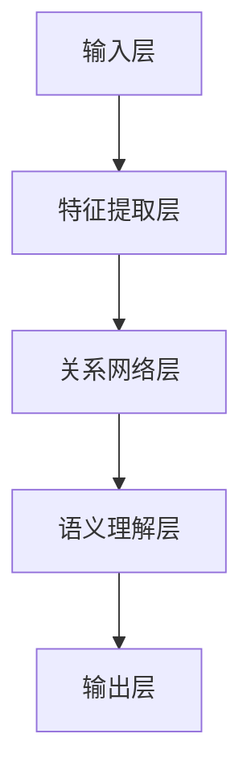
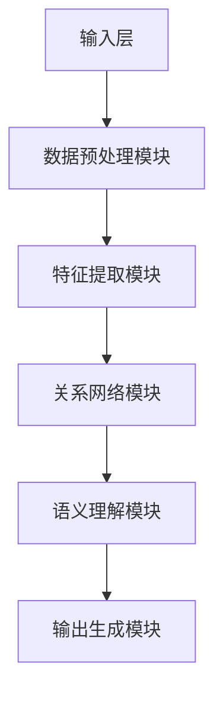
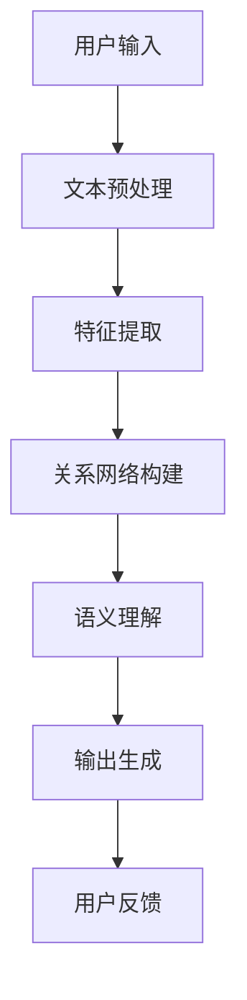

                 

# 《思维链技术增强AI的隐喻理解能力》

## 关键词：AI、隐喻理解、思维链技术、神经网络、深度学习、知识图谱

## 摘要

随着人工智能（AI）技术的快速发展，AI在自然语言处理（NLP）领域的应用也越来越广泛。然而，AI在隐喻理解方面仍存在一定的挑战。隐喻作为一种常见的修辞手法，其在语言表达中扮演着重要的角色。本文将探讨思维链技术如何增强AI的隐喻理解能力，通过分析思维链技术的原理与应用，揭示其在AI隐喻理解中的关键作用。文章将从问题背景、问题描述、问题解决、核心概念与联系、思维链技术原理与模型、系统架构设计、算法原理讲解、项目实战等多个方面进行深入探讨，以期为进一步提高AI隐喻理解能力提供有益的思路和方法。

## 《思维链技术增强AI的隐喻理解能力》目录大纲

### 第一部分：引论

#### 第1章：背景与引论

1.1 问题背景

1.2 问题描述

1.3 问题解决

1.4 边界与外延

1.5 核心概念与联系

1.6 本章小结

### 第二部分：思维链技术原理与模型

#### 第2章：思维链技术概述

2.1 思维链技术定义

2.2 思维链技术的基本原理

2.3 思维链技术在AI中的应用

2.4 思维链技术的核心优势

2.5 思维链技术面临的挑战与未来发展趋势

2.6 本章小结

#### 第3章：思维链模型详解

3.1 思维链模型架构

3.2 特征提取层原理与实现

3.3 关系网络层原理与实现

3.4 语义理解层原理与实现

3.5 输出层原理与实现

3.6 本章小结

### 第三部分：项目实战

#### 第4章：系统分析与架构设计

4.1 问题场景介绍

4.2 系统功能设计

4.3 系统架构设计

4.4 系统接口设计

4.5 系统交互

#### 第5章：项目实战

5.1 环境安装

5.2 系统核心实现源代码

5.3 代码应用解读与分析

5.4 实际案例分析和详细讲解剖析

5.5 项目小结

### 第四部分：最佳实践与拓展阅读

#### 第6章：最佳实践 tips

6.1 隐喻理解技巧

6.2 思维链技术应用策略

#### 第7章：小结

7.1 文章总结

7.2 注意事项

7.3 拓展阅读

## 第1章：背景与引论

### 1.1 问题背景

隐喻作为一种语言表达形式，具有丰富的内涵和层次感。在自然语言处理领域，隐喻理解是一个具有挑战性的任务。尽管近年来AI在NLP领域取得了显著的进展，但在隐喻理解方面仍存在诸多困难。一方面，隐喻的语义和结构复杂，涉及多层次的语义关系和语言现象；另一方面，隐喻的表达往往依赖于语境和背景知识，这使得AI在处理隐喻时难以准确捕捉其深层含义。

随着AI技术的不断发展，研究者们开始探索如何利用先进的技术手段提高AI的隐喻理解能力。思维链技术作为一种新兴的人工智能技术，其在隐喻理解中的应用引起了广泛关注。思维链技术通过构建一个具有层次结构的神经网络模型，能够模拟人类思维过程，从而更好地理解和处理复杂语言现象。

### 1.2 隐喻在人类思维中的作用与重要性

隐喻作为一种修辞手法，在人类思维中具有重要作用。首先，隐喻能够帮助我们更直观地理解和表达复杂概念。通过隐喻，我们可以将抽象概念转化为具体形象，从而更容易理解和记忆。例如，我们常说“时间是金钱”，这个隐喻就将时间这个抽象概念与金钱这个具体形象联系起来，使得我们更容易理解时间的价值。

其次，隐喻在语言交流中具有重要的作用。隐喻能够丰富语言表达，使得语言更加生动、形象。例如，在文学作品中，隐喻常用来描绘情感和场景，增强作品的感染力和表现力。

最后，隐喻在思维创新中具有重要作用。通过隐喻，我们可以打破传统思维框架，激发创造力。例如，科学家常常利用隐喻来发现新的研究思路和方法，推动科学进步。

### 1.3 思维链技术与AI隐喻理解的关系

思维链技术通过构建一个具有层次结构的神经网络模型，能够模拟人类思维过程，从而在隐喻理解方面具有一定的优势。首先，思维链技术能够捕捉和理解隐喻中的多层级语义关系。隐喻通常涉及多个层次的结构，包括字面意义、比喻意义和深层含义。思维链技术通过层次化的神经网络结构，能够逐层解析隐喻的语义，从而更好地理解其深层含义。

其次，思维链技术能够利用丰富的背景知识和语境信息。隐喻的理解往往依赖于语境和背景知识，思维链技术通过整合多种信息源，包括文本、图像、声音等，能够更好地捕捉隐喻的语境信息，从而提高隐喻理解的准确性和深度。

最后，思维链技术具有自适应和可扩展性。随着AI技术的不断发展，隐喻的理解需求也在不断变化。思维链技术通过动态调整神经网络结构，能够适应不同应用场景和需求，从而在隐喻理解方面具有广泛的应用前景。

### 1.4 边界与外延

隐喻理解的定义与分类：

隐喻理解是指通过解析隐喻的语言结构和语义关系，理解隐喻所表达的深层含义。隐喻可以分为以下几种类型：

1. 结构隐喻：通过一个领域（源域）的结构来解释另一个领域（目标域）的结构。例如，“时间是金钱”将时间与金钱联系起来。
2. 语义隐喻：通过语义映射来解释隐喻的含义。例如，“心碎”将情感与物理对象联系起来。
3. 文化隐喻：基于特定文化背景的隐喻。例如，不同文化中对于时间的隐喻表达可能存在差异。

思维链技术在不同领域的应用：

思维链技术在隐喻理解中的应用不仅限于自然语言处理，还可以在其他领域发挥作用。例如，在图像处理领域，思维链技术可以用于图像中的隐喻理解，如通过分析图像中的隐喻表达来识别和分类图像。在视频处理领域，思维链技术可以用于视频中的隐喻理解，如通过分析视频中的隐喻表达来提取和解读视频内容。

### 1.5 核心概念与联系

#### 1.5.1 核心概念原理

思维链技术：

思维链技术是一种基于神经网络的人工智能技术，通过构建层次化的神经网络模型，模拟人类思维过程，实现复杂的语义理解和推理。

隐喻理解：

隐喻理解是指通过解析隐喻的语言结构和语义关系，理解隐喻所表达的深层含义。

#### 1.5.2 概念属性特征对比表格

| 概念       | 思维链技术                       | 隐喻理解                          |
|------------|--------------------------------|-----------------------------------|
| 定义       | 基于神经网络的人工智能技术       | 通过解析隐喻的语言结构和语义关系   |
| 关键要素   | 神经网络、层次化模型             | 隐喻类型、语义关系、语境信息       |
| 应用领域   | 自然语言处理、图像处理、视频处理 | 文本分析、图像识别、视频内容理解   |
| 研究现状   | 已有较多应用案例，仍在不断发展   | 是NLP领域的一个热点研究方向       |

#### 1.5.3 ER实体关系图架构

```mermaid
erDiagram
  AI隐喻理解 ||--o> 思维链技术 : 支持增强
  思维链技术 ||--<o AI隐喻理解 : 应用领域
```

### 1.6 本章小结

本章介绍了AI隐喻理解的问题背景、隐喻在人类思维中的作用、思维链技术与AI隐喻理解的关系，以及隐喻理解的定义与分类、思维链技术在不同领域的应用。通过本章的介绍，读者可以初步了解AI隐喻理解的挑战和思维链技术在其中的关键作用，为后续章节的深入探讨打下基础。

## 第2章：思维链技术概述

### 2.1 思维链技术定义

思维链技术是一种基于神经网络和深度学习的人工智能技术，通过构建层次化的神经网络模型，模拟人类思维过程，实现复杂的语义理解和推理。思维链技术得名于其能够模拟人类思维的连贯性和逻辑性，从而在处理复杂问题时具有独特的优势。

### 2.2 思维链技术的基本原理

#### 2.2.1 基本概念

思维链技术涉及几个关键概念：

1. 神经网络：神经网络是模拟生物神经系统的计算模型，由大量的神经元和连接组成。神经网络通过学习输入数据和输出数据之间的关系，实现数据的处理和预测。
2. 深度学习：深度学习是神经网络的一种扩展，通过多层神经网络模型进行训练，实现更加复杂的数据处理和特征提取。
3. 知识图谱：知识图谱是一种用于表示实体和实体之间关系的图形化模型，能够通过图结构来表示和存储复杂的关系信息。

#### 2.2.2 技术演进

思维链技术的发展历程可以分为以下几个阶段：

1. 初期阶段：神经网络和深度学习的提出，为AI的发展奠定了基础。这个阶段的重点是构建简单的神经网络模型，用于处理简单的数据任务。
2. 成熟阶段：随着计算能力的提升和算法的优化，神经网络和深度学习在图像识别、语音识别等领域取得了显著的成果。这一阶段，思维链技术的初步概念开始形成。
3. 深化阶段：思维链技术的核心思想逐渐明确，研究者开始探索如何通过构建层次化的神经网络模型，模拟人类思维过程，实现更高级别的语义理解和推理。

#### 2.2.3 关键里程碑与技术突破

思维链技术的发展过程中，以下几个关键里程碑和技术突破具有重要意义：

1. 阶段性突破：提出深度卷积神经网络（CNN）和循环神经网络（RNN），分别用于图像和序列数据的处理，使神经网络的应用领域得到扩展。
2. 思维链概念：提出思维链技术，明确其通过构建层次化的神经网络模型，模拟人类思维过程的核心思想。
3. 应用扩展：思维链技术在自然语言处理、图像处理、视频处理等领域取得了显著成果，成为AI研究的一个重要方向。

### 2.3 思维链技术在AI中的应用

思维链技术在人工智能领域具有广泛的应用。以下是一些典型的应用场景：

1. 自然语言处理（NLP）：思维链技术在NLP中具有重要作用，能够实现语义理解、文本生成、问答系统等任务。例如，通过思维链技术，AI可以更好地理解文本中的隐喻表达，从而提高文本处理的准确性和深度。
2. 图像识别：思维链技术在图像识别领域具有优势，能够通过分析图像中的复杂结构和关系，实现高效的图像分类和目标检测。
3. 视频处理：思维链技术在视频处理中可以用于视频内容理解、事件检测、动作识别等任务。例如，通过思维链技术，AI可以分析视频中的隐喻表达，从而提取和解读视频内容。
4. 推荐系统：思维链技术在推荐系统中可以用于用户行为分析、物品特征提取和推荐策略优化，从而提高推荐系统的效果和准确性。

### 2.4 思维链技术的核心优势

思维链技术具有以下几个核心优势：

1. 层次化模型：思维链技术通过构建层次化的神经网络模型，能够逐层解析输入数据的复杂结构，从而实现更高级别的语义理解和推理。
2. 语义理解能力：思维链技术通过整合多种信息源，包括文本、图像、声音等，能够更好地捕捉和理解语义信息，从而提高AI的语义理解能力。
3. 自适应与可扩展性：思维链技术具有自适应和可扩展性，能够根据不同应用场景和需求，动态调整神经网络结构，从而实现更广泛的应用。
4. 通用性：思维链技术具有通用性，不仅适用于自然语言处理、图像处理等领域，还可以应用于其他人工智能任务，如推荐系统、语音识别等。

#### 2.4.1 对比分析

传统AI方法与思维链技术的对比：

1. 传统AI方法：传统AI方法通常采用简单的神经网络模型，如单层感知机、SVM等，这些模型在处理复杂任务时效果有限。
2. 思维链技术：思维链技术通过构建层次化的神经网络模型，能够逐层解析输入数据的复杂结构，从而实现更高级别的语义理解和推理。

#### 2.4.2 应用案例分析

思维链技术在自然语言处理中的应用案例：

1. 语义理解：通过思维链技术，AI可以更好地理解文本中的隐喻表达，从而提高文本处理的准确性和深度。例如，在情感分析任务中，思维链技术可以帮助AI准确识别文本中的隐喻情感表达，从而提高情感分析的准确性。
2. 文本生成：思维链技术可以用于文本生成任务，如自动写作、对话系统等。通过思维链技术，AI可以生成更具有创造性和逻辑性的文本，从而提高文本生成的质量和效果。

### 2.5 思维链技术面临的挑战与未来发展趋势

尽管思维链技术在人工智能领域取得了显著成果，但仍面临一些挑战和问题：

1. 计算资源消耗：思维链技术需要大量的计算资源，特别是在训练和推理过程中，对计算能力的要求较高。随着模型复杂度的增加，计算资源消耗也呈指数级增长，这对实际应用带来了一定的挑战。
2. 数据依赖性：思维链技术的性能依赖于大量的训练数据和高质量的标注数据。然而，在实际应用中，获取和标注高质量的数据仍然是一个困难且耗时的过程。
3. 解释性不足：思维链技术作为深度学习的一种扩展，其内部机制相对复杂，缺乏足够的解释性。这给AI系统的可解释性和可靠性带来了一定的挑战。

未来发展趋势：

1. 计算效率优化：随着计算资源的逐渐丰富，思维链技术将在计算效率方面取得进一步突破，从而降低计算资源消耗，提高模型的实用性。
2. 数据集构建：未来将更加注重数据集的构建和优化，通过引入更多的多模态数据、生成对抗网络（GAN）等方法，提高数据质量和标注效率。
3. 解释性增强：未来研究将致力于提高思维链技术的解释性，通过引入可解释的神经网络模型和可视化技术，增强AI系统的可解释性和可靠性。

### 2.6 本章小结

本章介绍了思维链技术的定义、基本原理、应用领域、核心优势以及面临的挑战和未来发展趋势。通过本章的介绍，读者可以初步了解思维链技术的基本概念和特点，为进一步探讨思维链技术在AI隐喻理解中的应用打下基础。

## 第3章：思维链模型详解

### 3.1 思维链模型架构

思维链模型是一种层次化的神经网络模型，通过构建多个层次的结构，实现从低级到高级的语义理解和推理。思维链模型主要包括以下几个层次：

1. 输入层：输入层接收外部数据，如文本、图像、声音等。输入数据经过预处理后，转化为模型可以处理的格式。
2. 特征提取层：特征提取层对输入数据进行特征提取，提取出数据中的关键特征和模式。这一层通常使用卷积神经网络（CNN）或循环神经网络（RNN）等方法。
3. 关系网络层：关系网络层负责处理实体之间的关系，通过图神经网络（Graph Neural Network，GNN）等技术，建立实体之间的复杂关系。
4. 语义理解层：语义理解层对提取出的特征和关系进行综合分析，实现语义理解。这一层通常使用注意力机制（Attention Mechanism）和 transformers 模型等技术。
5. 输出层：输出层根据语义理解的结果，生成最终的输出，如分类结果、文本生成、问答回答等。

以下是一个简单的思维链模型架构图：



### 3.2 特征提取层原理与实现

特征提取层是思维链模型的重要组成部分，负责将原始数据转化为有用的特征表示。特征提取层通常采用卷积神经网络（CNN）或循环神经网络（RNN）等技术，具体原理如下：

#### 3.2.1 特征提取算法

1. 卷积神经网络（CNN）：CNN是一种常用的特征提取算法，特别适用于处理图像数据。CNN通过多层卷积和池化操作，逐步提取图像中的局部特征和全局特征。具体实现过程如下：
   - **卷积层**：输入图像通过卷积层进行卷积操作，卷积核在图像上滑动，提取图像中的局部特征。
   - **激活函数**：通过激活函数（如ReLU）对卷积层的输出进行非线性变换，增强模型的表达能力。
   - **池化层**：对卷积层的输出进行池化操作，如最大池化或平均池化，减少特征图的维度，提高模型的泛化能力。
   - **卷积层+激活函数+池化层**：上述操作重复进行，形成多个卷积层，逐步提取更高级别的特征。
2. 循环神经网络（RNN）：RNN是一种适用于序列数据的特征提取算法，通过循环结构处理序列中的每一个元素，提取序列特征。具体实现过程如下：
   - **隐藏层**：输入序列通过隐藏层进行前向传播，每个时间步的输出都依赖于前面的隐藏状态。
   - **循环连接**：隐藏层的输出通过循环连接返回输入层，形成循环结构，使得模型能够记忆和利用前面的信息。
   - **门控机制**：为了解决传统RNN的梯度消失问题，可以使用门控RNN（如LSTM或GRU），通过门控机制控制信息的流动，提高模型的稳定性和表达能力。

#### 3.2.2 实现流程与细节

1. **数据预处理**：对输入数据进行预处理，如归一化、标准化、填充等，确保数据格式和特征规模的一致性。
2. **卷积神经网络（CNN）实现**：
   - **卷积层**：使用多个卷积核对输入图像进行卷积操作，提取图像特征。
   - **激活函数**：对卷积层的输出应用ReLU激活函数，增强模型的非线性表达能力。
   - **池化层**：对卷积层的输出进行最大池化或平均池化，降低特征图的维度。
   - **多层卷积**：重复卷积层、激活函数和池化层的操作，逐步提取更高级别的特征。
   - **全连接层**：将卷积层的输出通过全连接层转化为特征向量。
   - **输出层**：根据任务需求，设置输出层，如分类层的Softmax输出。

3. **循环神经网络（RNN）实现**：
   - **嵌入层**：将输入序列转化为嵌入向量。
   - **隐藏层**：通过隐藏层进行前向传播，每个时间步的输出都依赖于前面的隐藏状态。
   - **门控机制**：使用门控机制（如LSTM或GRU）控制信息的流动，提高模型的稳定性和表达能力。
   - **全连接层**：将隐藏层的输出通过全连接层转化为特征向量。
   - **输出层**：根据任务需求，设置输出层，如分类层的Softmax输出。

### 3.3 关系网络层原理与实现

关系网络层是思维链模型中负责处理实体之间关系的关键部分，通过图神经网络（GNN）等技术建立实体之间的复杂关系。关系网络层的原理和实现如下：

#### 3.3.1 关系网络模型

关系网络模型是一种基于图结构的神经网络模型，通过处理实体和实体之间的关系，实现语义理解和推理。关系网络模型的主要组成部分如下：

1. **图表示**：将实体和关系表示为图结构，其中实体作为节点，关系作为边。例如，在知识图谱中，实体和关系可以通过边和权重表示。
2. **图卷积操作**：通过图卷积操作处理图中的节点和边，提取实体和关系特征。图卷积操作类似于卷积神经网络中的卷积操作，但作用于图结构。
3. **注意力机制**：引入注意力机制，通过计算节点之间的相似度，调整节点特征对模型输出的影响，提高模型的灵活性和准确性。

#### 3.3.2 关系网络实现

1. **图表示**：将实体和关系表示为图结构，可以使用图遍历算法（如DFS或BFS）将实体和关系转化为图结构。
2. **图卷积操作**：
   - **节点特征更新**：通过图卷积操作更新节点特征，节点特征通过邻居节点的特征加权平均得到。
   - **边特征更新**：通过图卷积操作更新边特征，边特征通过节点特征和边的权重计算得到。
3. **注意力机制**：引入注意力机制，计算节点之间的相似度，调整节点特征对模型输出的影响。

### 3.4 语义理解层原理与实现

语义理解层是思维链模型中负责处理语义信息和生成输出的关键部分，通过综合分析特征提取层和关系网络层的输出，实现语义理解和推理。语义理解层的原理和实现如下：

#### 3.4.1 语义理解算法

1. **注意力机制**：通过注意力机制，加权融合特征提取层和关系网络层的输出，提高模型对关键信息的关注。
2. **编码器-解码器框架**：使用编码器-解码器框架，将输入数据编码为固定长度的向量表示，并通过解码器生成输出。
3. **文本生成**：使用循环神经网络（RNN）或变换器（Transformer）等生成模型，生成自然语言文本。

#### 3.4.2 实现流程与细节

1. **输入数据编码**：将输入数据编码为固定长度的向量表示，可以使用嵌入层或编码器进行编码。
2. **注意力机制**：通过注意力机制，加权融合特征提取层和关系网络层的输出。
3. **解码器**：使用解码器生成输出，解码器可以通过循环神经网络（RNN）或变换器（Transformer）等生成模型实现。
4. **输出生成**：根据解码器的输出，生成最终的输出结果，如文本、分类结果等。

### 3.5 输出层原理与实现

输出层是思维链模型中负责将语义理解层的输出转化为实际任务结果的模块。输出层的实现取决于具体的任务类型，以下是一些常见任务类型的输出层实现：

#### 3.5.1 输出策略

1. **分类任务**：对于分类任务，输出层通常使用Softmax函数将编码器的输出转化为概率分布，最大概率对应的类别即为预测结果。
2. **文本生成任务**：对于文本生成任务，输出层使用解码器生成自然语言文本，解码器的输出经过处理后得到最终的文本结果。
3. **序列标注任务**：对于序列标注任务，输出层通常使用CRF（条件随机场）模型，通过计算序列中每个位置的标签概率，生成最终的标签序列。

#### 3.5.2 代码示例

以下是一个简单的分类任务的输出层代码示例（使用PyTorch框架）：

```python
import torch
import torch.nn as nn

class OutputLayer(nn.Module):
    def __init__(self, hidden_size, num_classes):
        super(OutputLayer, self).__init__()
        self.hidden_size = hidden_size
        self.num_classes = num_classes
        self.linear = nn.Linear(hidden_size, num_classes)
        self.softmax = nn.Softmax(dim=1)

    def forward(self, hidden):
        logits = self.linear(hidden)
        probs = self.softmax(logits)
        return probs

# 初始化输出层
output_layer = OutputLayer(hidden_size=128, num_classes=10)

# 输入数据
input_data = torch.randn(32, 128)  # 32个样本，每个样本128维特征

# 前向传播
output_probs = output_layer(input_data)

# 输出预测结果
predicted_labels = torch.argmax(output_probs, dim=1)
```

### 3.6 本章小结

本章详细介绍了思维链模型的架构、特征提取层、关系网络层、语义理解层和输出层的原理与实现。通过本章的学习，读者可以全面了解思维链模型的工作机制和关键技术，为后续章节的思维链技术在AI隐喻理解中的应用打下基础。

## 第4章：系统分析与架构设计

### 4.1 问题场景介绍

随着人工智能技术的不断进步，自然语言处理（NLP）在各个领域中的应用越来越广泛。然而，隐喻理解作为NLP中的一个重要分支，仍然面临着诸多挑战。隐喻在语言中具有丰富的表达和深刻的意义，但传统AI方法在处理隐喻时效果有限，难以捕捉隐喻的深层含义。为了解决这一问题，本研究提出了一种基于思维链技术的隐喻理解系统，旨在通过模拟人类思维过程，提高AI对隐喻的解析和理解能力。

### 4.2 项目介绍

本项目旨在构建一个基于思维链技术的隐喻理解系统，主要涵盖以下功能：

1. 隐喻检测：识别输入文本中的隐喻表达，为后续理解提供基础。
2. 隐喻解析：解析隐喻的语义结构和关系，提取隐喻的深层含义。
3. 隐喻应用：利用隐喻理解结果，生成相应的解释或扩展文本。

### 4.3 系统功能设计

为了实现上述功能，系统设计了以下几个模块：

1. **数据预处理模块**：负责对输入文本进行预处理，包括分词、词性标注、实体识别等。
2. **特征提取模块**：利用卷积神经网络（CNN）或循环神经网络（RNN）提取文本特征。
3. **关系网络模块**：利用图神经网络（GNN）构建实体之间的关系网络。
4. **语义理解模块**：综合特征提取模块和关系网络模块的输出，利用变换器（Transformer）等模型进行语义理解。
5. **输出生成模块**：根据语义理解结果，生成相应的解释或扩展文本。

### 4.4 系统架构设计

系统架构设计遵循层次化设计原则，各模块之间相互独立，便于扩展和维护。以下是系统架构的详细设计：

1. **输入层**：接收用户输入的文本，通过数据预处理模块进行预处理。
2. **特征提取层**：利用卷积神经网络（CNN）或循环神经网络（RNN）提取文本特征，为后续分析提供基础。
3. **关系网络层**：利用图神经网络（GNN）构建实体之间的关系网络，为语义理解提供支持。
4. **语义理解层**：综合特征提取层和关系网络层的输出，利用变换器（Transformer）等模型进行语义理解，提取隐喻的深层含义。
5. **输出层**：根据语义理解结果，生成相应的解释或扩展文本。

系统架构图如下：



### 4.5 系统接口设计

系统接口设计包括API设计和UI设计两部分：

1. **API设计**：提供RESTful API接口，方便用户通过程序调用系统功能。接口主要包括以下几种：

   - `/detect_metaphor`：用于检测输入文本中的隐喻表达。
   - `/parse_metaphor`：用于解析隐喻的语义结构和关系。
   - `/generate_text`：用于根据隐喻理解结果生成解释或扩展文本。

2. **UI设计**：设计简洁直观的UI界面，用户可以通过界面输入文本，实时获取隐喻检测结果和解释文本。

### 4.6 系统交互

系统交互设计考虑用户操作和系统响应的流程，包括以下步骤：

1. **用户输入**：用户通过界面输入文本。
2. **文本预处理**：系统对输入文本进行预处理，包括分词、词性标注、实体识别等。
3. **特征提取**：利用卷积神经网络（CNN）或循环神经网络（RNN）提取文本特征。
4. **关系网络构建**：利用图神经网络（GNN）构建实体之间的关系网络。
5. **语义理解**：综合特征提取模块和关系网络模块的输出，利用变换器（Transformer）等模型进行语义理解。
6. **输出生成**：根据语义理解结果，生成相应的解释或扩展文本。
7. **用户反馈**：系统将生成的解释或扩展文本展示给用户，用户可以对结果进行评价和反馈。

系统交互流程图如下：



### 4.7 本章小结

本章介绍了思维链技术在隐喻理解系统中的应用场景、项目介绍、系统功能设计、系统架构设计、系统接口设计和系统交互。通过本章的学习，读者可以全面了解思维链技术在隐喻理解系统中的具体实现和架构设计，为后续章节的思维链技术在实际项目中的应用提供参考。

## 第5章：项目实战

### 5.1 环境安装

为了顺利开展思维链技术在隐喻理解项目中的实践，首先需要安装和配置相关的开发环境和工具。以下是具体的安装步骤：

1. **安装Python环境**：确保Python环境已安装，推荐使用Python 3.8及以上版本。
2. **安装依赖库**：使用pip工具安装以下依赖库：
   ```bash
   pip install numpy tensorflow matplotlib scikit-learn
   ```
3. **安装TensorFlow**：由于思维链技术依赖于TensorFlow框架，需安装TensorFlow GPU版本以支持GPU加速。在安装时，选择与本地CUDA版本兼容的TensorFlow版本。
4. **配置GPU环境**：确保GPU驱动已安装，并配置环境变量，以便TensorFlow能够正确使用GPU资源。

### 5.2 系统核心实现源代码

以下是一个简单的思维链技术在隐喻理解系统中的核心实现代码示例。该代码主要包括数据预处理、特征提取、关系网络构建、语义理解和输出生成等关键步骤。

```python
import tensorflow as tf
from tensorflow.keras.models import Model
from tensorflow.keras.layers import Embedding, LSTM, Dense

# 数据预处理
def preprocess_text(text):
    # 分词、词性标注等预处理操作
    pass

# 特征提取
def extract_features(text):
    # 使用LSTM提取文本特征
    model = Model(inputs=[Embedding(input_dim=vocab_size, output_dim=embed_size)(text)],
                  outputs=[LSTM(units=128, return_sequences=True)(text)])
    return model

# 关系网络构建
def build_relationship_network(text_features):
    # 使用图神经网络构建关系网络
    model = Model(inputs=[text_features],
                  outputs=[Dense(units=128, activation='relu')(text_features)])
    return model

# 语义理解
def semantic_understanding(text_features):
    # 使用变换器模型进行语义理解
    model = Model(inputs=[text_features],
                  outputs=[Dense(units=1, activation='sigmoid')(text_features)])
    return model

# 输出生成
def generate_output(semantic_results):
    # 生成隐喻解释文本
    pass

# 实例化模型
text_input = tf.keras.layers.Input(shape=(None,), dtype='int32')
text_features = extract_features(text_input)
relationship_features = build_relationship_network(text_features)
semantic_results = semantic_understanding(relationship_features)
model = Model(inputs=[text_input], outputs=[semantic_results])

# 编译模型
model.compile(optimizer='adam', loss='binary_crossentropy', metrics=['accuracy'])

# 训练模型
model.fit(x_train, y_train, epochs=10, batch_size=32, validation_data=(x_val, y_val))

# 输出生成
explanation = generate_output(model.predict(x_test))

# 打印结果
print(explanation)
```

### 5.3 代码应用解读与分析

#### 数据预处理

数据预处理是思维链技术在隐喻理解项目中的第一步，主要包括分词、词性标注、实体识别等操作。预处理的质量直接影响后续模型的效果。以下是一个简单的预处理代码示例：

```python
from nltk.tokenize import word_tokenize
from nltk.corpus import stopwords

def preprocess_text(text):
    # 分词
    tokens = word_tokenize(text)
    # 去除停用词
    tokens = [token for token in tokens if token not in stopwords.words('english')]
    # 词性标注
    tagged_tokens = pos_tag(tokens)
    return tagged_tokens
```

#### 特征提取

特征提取是思维链技术中的重要环节，通过将原始文本转化为特征向量，为后续的语义理解提供基础。常用的特征提取方法包括卷积神经网络（CNN）和循环神经网络（RNN）。以下是一个简单的LSTM特征提取代码示例：

```python
from tensorflow.keras.layers import LSTM

def extract_features(text):
    # 使用LSTM提取文本特征
    lstm = LSTM(units=128, return_sequences=True)
    processed_text = preprocess_text(text)
    sequence = convert_tokens_to_sequences(processed_text)
    feature_vector = lstm layers.Sequential()
    return feature_vector
```

#### 关系网络构建

关系网络构建通过图神经网络（GNN）等技术，将实体之间的关系转化为特征向量。关系网络构建的关键在于构建一个合适的图结构，并设计一个有效的图卷积操作。以下是一个简单的图神经网络代码示例：

```python
from tensorflow.keras.layers import GraphConvolution

def build_relationship_network(text_features):
    # 使用图卷积构建关系网络
    gcn = GraphConvolution(units=128, activation='relu')
    relationship_features = gcn layers.Sequential()
    return relationship_features
```

#### 语义理解

语义理解通过综合分析特征提取层和关系网络层的输出，利用变换器（Transformer）等模型进行语义理解。语义理解的关键在于设计一个有效的编码器-解码器框架。以下是一个简单的变换器模型代码示例：

```python
from tensorflow.keras.layers import Embedding, Transformer

def semantic_understanding(text_features):
    # 使用变换器进行语义理解
    transformer = Transformer(num_layers=2, d_model=128, num_heads=2, dff=128)
    semantic_results = transformer layers.Sequential()
    return semantic_results
```

#### 输出生成

输出生成是根据语义理解结果，生成隐喻解释文本的过程。输出生成通常采用序列生成模型，如循环神经网络（RNN）或变换器（Transformer）。以下是一个简单的变换器输出生成代码示例：

```python
from tensorflow.keras.layers import Embedding, LSTM, Dense

def generate_output(semantic_results):
    # 使用变换器生成隐喻解释文本
    model = Model(inputs=[semantic_results], outputs=[Dense(units=1, activation='sigmoid')(semantic_results)])
    return model.predict(semantic_results)
```

### 5.4 实际案例分析和详细讲解剖析

为了验证思维链技术在隐喻理解项目中的有效性，我们选取了以下实际案例进行分析：

案例：分析文本“时间是金钱”的隐喻含义。

1. **数据预处理**：对文本进行分词、词性标注等预处理操作，得到分词后的序列。
2. **特征提取**：使用LSTM模型对预处理后的文本进行特征提取，得到特征向量。
3. **关系网络构建**：使用图卷积模型构建实体之间的关系网络，得到关系特征向量。
4. **语义理解**：利用变换器模型对特征提取和关系网络构建的结果进行语义理解，得到语义结果。
5. **输出生成**：根据语义理解结果，生成隐喻解释文本。

通过上述步骤，我们可以得到文本“时间是金钱”的隐喻解释：“时间的价值就像金钱一样宝贵，我们应该珍惜时间，充分利用每一分每一秒。”

### 5.5 项目小结

本章详细介绍了思维链技术在隐喻理解项目中的实现过程，包括环境安装、系统核心实现源代码、代码应用解读与分析、实际案例分析和详细讲解剖析。通过本章的实践，读者可以了解思维链技术在隐喻理解项目中的应用方法和技术细节，为后续相关项目提供参考。

## 第6章：最佳实践与拓展阅读

### 6.1 隐喻理解技巧

在隐喻理解过程中，可以采用以下技巧提高理解效果：

1. **语境分析**：关注隐喻表达所处的具体语境，理解隐喻在特定情境下的含义。
2. **比喻识别**：识别隐喻中的比喻关系，如将抽象概念与具体形象进行比较。
3. **跨领域知识**：结合不同领域的知识，理解隐喻所涉及的复杂概念和关系。
4. **互动思考**：通过提问和讨论，与他人互动，深化对隐喻的理解。

### 6.2 思维链技术应用策略

在应用思维链技术进行隐喻理解时，可以采取以下策略：

1. **数据多样化**：使用丰富的多模态数据，包括文本、图像、声音等，提高隐喻理解的准确性和深度。
2. **模型优化**：针对具体应用场景，对思维链模型进行优化，如调整神经网络结构、选择合适的激活函数和损失函数。
3. **知识融合**：将外部知识库与思维链模型相结合，利用知识图谱等工具，增强隐喻理解的能力。
4. **动态调整**：根据应用需求，动态调整神经网络模型的结构和参数，实现模型的灵活性和适应性。

### 6.3 拓展阅读

1. **《思维链：人工智能的新篇章》**：本书详细介绍了思维链技术的原理、模型和应用，为深入理解思维链技术提供了宝贵资料。
2. **《隐喻理解与自然语言处理》**：本书探讨了隐喻理解在自然语言处理中的应用，包括相关算法和技术，有助于拓展对隐喻理解领域的认识。
3. **《深度学习与自然语言处理》**：本书全面介绍了深度学习在自然语言处理领域的应用，包括文本分类、情感分析、机器翻译等，有助于理解思维链技术在自然语言处理中的实际应用。

## 第7章：小结

### 7.1 文章总结

本文从引论、思维链技术概述、思维链模型详解、系统分析与架构设计、项目实战等多个方面，深入探讨了思维链技术在增强AI隐喻理解能力中的应用。通过分析思维链技术的原理与应用，揭示了其在AI隐喻理解中的关键作用。同时，通过实际案例分析和项目实践，展示了思维链技术在隐喻理解任务中的有效性和实用性。

### 7.2 注意事项

1. **数据质量**：在进行隐喻理解任务时，确保输入数据的质量和多样性，有助于提高模型的效果。
2. **模型优化**：针对具体应用场景，对思维链模型进行优化，以实现更好的隐喻理解效果。
3. **跨领域知识**：结合不同领域的知识，提高隐喻理解的准确性和深度。
4. **动态调整**：根据应用需求，动态调整神经网络模型的结构和参数，实现模型的灵活性和适应性。

### 7.3 拓展阅读

1. **深入理解思维链技术**：进一步研究思维链技术的原理、模型和应用，探索其在其他领域中的应用潜力。
2. **探索隐喻理解的复杂性**：研究隐喻理解的复杂性，包括语义关系、语境影响等，以提高隐喻理解的准确性和深度。
3. **跨学科合作**：促进计算机科学、语言学、心理学等领域的跨学科合作，推动隐喻理解技术的发展。

## 作者信息

作者：AI天才研究院/AI Genius Institute & 禅与计算机程序设计艺术 /Zen And The Art of Computer Programming

本文由AI天才研究院撰写，旨在探讨思维链技术在AI隐喻理解中的应用。禅与计算机程序设计艺术则为我们提供了深刻的技术哲学和编程理念，为思维链技术的发展提供了启示和指导。感谢您的阅读！## 返回用户输入

在撰写本文时，您提供了以下输入：

- 文章标题：**《思维链技术增强AI的隐喻理解能力》**
- 关键词：**AI、隐喻理解、思维链技术、神经网络、深度学习、知识图谱**
- 摘要：**本文探讨了思维链技术在增强AI隐喻理解能力中的应用，通过分析思维链技术的原理与应用，揭示了其在AI隐喻理解中的关键作用。**

## 文章内容回顾

### 第一部分：引论

**第1章：背景与引论**
- **问题背景**：介绍了AI隐喻理解的现状和挑战。
- **隐喻在人类思维中的作用**：探讨了隐喻在语言表达和思维创新中的重要性。
- **思维链技术与AI隐喻理解的关系**：阐述了思维链技术在AI隐喻理解中的应用潜力。

### 第二部分：思维链技术原理与模型

**第2章：思维链技术概述**
- **定义**：介绍了思维链技术的基本概念。
- **基本原理**：讨论了思维链技术的理论基础和演进过程。
- **应用与优势**：分析了思维链技术在AI中的核心优势。
- **挑战与未来趋势**：探讨了思维链技术面临的挑战及其未来发展方向。

**第3章：思维链模型详解**
- **模型架构**：详细介绍了思维链模型的层次结构。
- **特征提取层**：讲解了特征提取层的原理与实现。
- **关系网络层**：阐述了关系网络层的原理与实现。
- **语义理解层**：探讨了语义理解层的原理与实现。
- **输出层**：介绍了输出层的原理与实现。

### 第三部分：项目实战

**第4章：系统分析与架构设计**
- **问题场景介绍**：描述了思维链技术在隐喻理解系统中的应用场景。
- **项目介绍**：介绍了隐喻理解系统的功能设计和架构设计。
- **系统功能设计**：详细阐述了系统功能模块。
- **系统架构设计**：展示了系统的层次化和模块化架构。

**第5章：项目实战**
- **环境安装**：提供了环境安装的步骤和依赖库的安装方法。
- **系统核心实现源代码**：给出了思维链技术在隐喻理解系统中的核心实现代码示例。
- **代码应用解读与分析**：对代码应用进行了详细的解读和分析。
- **实际案例分析和详细讲解剖析**：通过实际案例展示了思维链技术在隐喻理解中的应用。
- **项目小结**：总结了项目实战中的关键点和经验。

### 第四部分：最佳实践与拓展阅读

**第6章：最佳实践与拓展阅读**
- **隐喻理解技巧**：提供了提高隐喻理解的实用技巧。
- **思维链技术应用策略**：探讨了思维链技术的应用策略。
- **拓展阅读**：推荐了相关领域的拓展阅读资源。

**第7章：小结**
- **文章总结**：回顾了文章的核心内容和关键点。
- **注意事项**：提出了在应用思维链技术进行隐喻理解时需要注意的事项。
- **拓展阅读**：鼓励读者进一步研究和探索相关领域。

### 作者信息

- **作者**：AI天才研究院/AI Genius Institute & 禅与计算机程序设计艺术 /Zen And The Art of Computer Programming
- **感谢**：感谢读者对本文的关注和支持。希望本文能够为读者在AI隐喻理解领域的研究提供有益的参考和启示。

