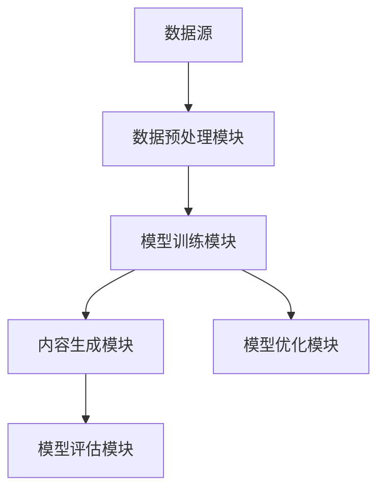
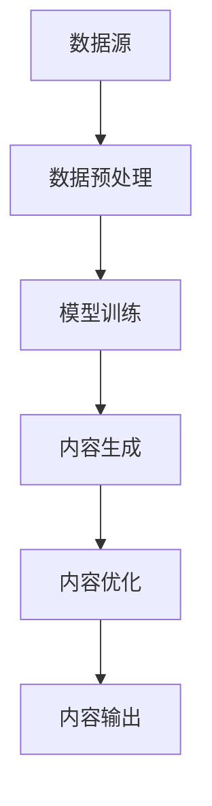

                 

### 介绍AIGC的起源与发展

AIGC，全称AI Generated Content，即AI生成内容，是近年来迅速崛起的一个领域。AIGC的起源可以追溯到20世纪末，当时计算机科学和人工智能领域的研究者开始探索如何利用机器学习算法生成文本、图像和音频等类型的内容。随着深度学习技术的进步，AIGC的生成能力得到了显著的提升。

在当今全球范围内，AIGC技术已经广泛应用于多个行业和领域。从社交媒体平台上的个性化内容推荐，到电子商务网站上的产品描述生成，再到虚拟现实中的场景构建，AIGC正不断改变着内容生成的游戏规则。特别是在文本生成、图像生成和视频生成等方面，AIGC展现出了强大的生命力和广泛的应用潜力。

当前，AIGC技术在全球的应用状况呈现出快速增长的趋势。在北美、欧洲和亚洲等地区，许多科技公司和研究机构都在积极投入AIGC领域的研究和开发。例如，OpenAI的GPT系列模型、谷歌的Bard和DeepMind的Gato都是AIGC领域的佼佼者。这些模型的发布和应用不仅推动了AIGC技术的普及，也为相关领域的研究提供了宝贵的经验和资源。

AIGC对现代信息产业的影响不可小觑。首先，它极大地提高了内容生成的效率和质量，使得大量的文本、图像和视频内容能够以更快的速度和更高的精度生成。其次，AIGC为个性化服务和个性化推荐提供了强大的技术支持，使得信息系统能够更好地满足用户的需求。此外，AIGC还在教育、医疗、娱乐和艺术等领域展示了巨大的应用潜力，为这些领域的创新和发展提供了新的思路和方法。

总的来说，AIGC的崛起不仅代表了人工智能技术的又一次飞跃，也预示着未来信息产业的一场深刻变革。在接下来的章节中，我们将深入探讨AIGC的核心概念和技术原理，以及它如何改变现有的内容生成方式。通过一步步的分析和推理，我们希望能够为广大读者提供一幅清晰、全面的AIGC技术图谱。### AIGC的定义与思维链技术

AIGC，即AI Generated Content，是指利用人工智能技术，尤其是深度学习和生成模型，自动生成文本、图像、音频和视频等多种类型的内容。与传统的AI生成内容相比，AIGC具有更高的创造性和复杂性，能够模拟人类的思维过程，从而生成更加自然和符合逻辑的内容。

AIGC的核心技术之一是思维链（Mind Chain）技术。思维链技术是一种基于深度学习的高效内容生成框架，它通过模拟人类思维的连贯性和逻辑性，使得生成的AI内容更加真实和有说服力。思维链技术的核心在于构建一个连续的、动态的思考过程，使得AI在生成内容时能够像人类一样，根据上下文和先前的信息进行推理和决策。

思维链技术在AIGC中的重要性不可忽视。首先，它提升了内容生成的质量和效率。传统的生成模型往往只能生成固定模板的内容，而思维链技术则能够根据输入信息进行灵活的调整和生成，使得内容更加丰富和多样化。其次，思维链技术能够处理复杂的信息结构和逻辑关系，这使得AI在生成内容时能够保持一致性和连贯性。例如，在文本生成领域，思维链技术可以确保生成的文章逻辑清晰，上下文连贯，避免了传统生成模型常见的重复和混乱问题。

AIGC如何改变内容生成方式可以从以下几个方面来理解。首先，AIGC实现了从被动生成到主动生成的转变。传统的AI生成内容往往需要人工预设模板和规则，而AIGC则能够根据用户的需求和上下文环境，自主生成符合期望的内容。这种转变不仅提高了生成效率，还大大降低了生成内容的复杂度。

其次，AIGC实现了内容生成的自动化和智能化。通过思维链技术的应用，AI能够自动分析大量的数据，从中提取有价值的信息，并生成相应的文本、图像和视频。这种自动化和智能化的生成方式，不仅提高了内容生成的效率，还使得内容生成的质量和多样性得到了显著提升。

最后，AIGC改变了内容生成的标准和评价体系。在传统的AI生成内容中，内容的评价主要依赖于人工的判断和标准，而AIGC则通过算法和数据驱动的评价机制，使得内容生成的评价更加客观和科学。例如，在文本生成领域，AIGC可以通过分析用户的反馈和文本的语义信息，自动调整生成策略，以生成更符合用户期望的内容。

总之，AIGC通过思维链技术的应用，不仅改变了内容生成的方式，还推动了整个内容产业的技术进步和创新发展。在接下来的章节中，我们将进一步探讨AIGC的技术细节和实现方法，以及它如何在不同领域中发挥作用。### AIGC与传统AI生成的差异

AIGC（AI Generated Content）与传统AI生成内容在技术核心、应用范围和生成效果上存在显著差异。了解这些差异有助于我们更好地理解AIGC的独特优势和潜在影响。

首先，从技术核心来看，传统AI生成内容主要依赖于规则驱动和模板匹配。这种方法通常需要人工定义规则和模板，以指导AI生成特定类型的内容。例如，聊天机器人和简单的文本生成工具往往基于预定义的对话树和模板，以生成响应特定的用户输入。这种方法的优势在于实现简单、易于理解和部署，但其局限性也非常明显：生成的内容往往缺乏灵活性和创造力，容易产生重复和机械化的问题。

相比之下，AIGC的核心技术是深度学习和生成模型，尤其是基于变分自编码器（VAE）、生成对抗网络（GAN）和自回归模型（AR）等高级算法。这些算法能够自动从海量数据中学习，生成具有高度多样性和复杂性的内容。例如，GPT-3等大型语言模型可以通过学习海量的文本数据，生成符合语法和语义逻辑的多样化文本。这种技术核心的差异使得AIGC在生成内容的灵活性和创造力上远超传统方法。

其次，从应用范围来看，传统AI生成内容主要应用于简单的、结构化的场景，如自动回复、简单的文本摘要和分类等。这些应用场景通常具有明确的规则和标准，因此可以通过规则驱动的方法实现。然而，随着互联网和多媒体内容的发展，对生成内容的质量和多样性提出了更高的要求。AIGC的应用范围更加广泛，涵盖了文本、图像、音频、视频等多种类型的内容生成。例如，AIGC可以应用于虚拟现实中的场景构建、社交媒体的个性化内容推荐、医疗报告的自动生成等领域。这种多样化的应用范围使得AIGC能够更好地满足现代信息社会的需求。

最后，从生成效果来看，传统AI生成内容通常存在一些明显的缺陷，如内容的重复性、机械性和不可预测性。这些缺陷往往导致生成的内容不够自然和真实，难以与人类创作的内容相比。相比之下，AIGC通过深度学习和生成模型的应用，能够生成更加自然、多样和高质量的内容。例如，AIGC生成的文本可以具有流畅的叙述逻辑和丰富的情感表达，图像和视频可以具有更高的分辨率和更复杂的细节。这种生成效果的提升不仅提高了内容的价值，也为人工智能在各个领域的应用提供了更多的可能性。

总之，AIGC与传统AI生成内容在技术核心、应用范围和生成效果上存在显著差异。AIGC通过深度学习和生成模型的应用，实现了更高水平的灵活性和创造力，为内容生成带来了革命性的变化。在接下来的章节中，我们将深入探讨AIGC中的核心技术——思维链技术，以及它如何进一步提升内容生成的质量和效率。### 思维链技术的概念解析

思维链（Mind Chain）技术是AIGC领域的一项核心创新，它通过模拟人类思维的连贯性和逻辑性，实现了高度灵活和智能化的内容生成。思维链技术的核心在于构建一个连续的、动态的思考过程，使得AI在生成内容时能够像人类一样，根据上下文和先前的信息进行推理和决策。

思维链技术的组成部分主要包括生成网络、编码器和解码器。生成网络是思维链技术的核心，负责根据输入信息生成内容。编码器将输入信息转换为高维特征表示，解码器则将特征表示转换为具体的内容输出。这种结构使得思维链技术能够在保持内容多样性的同时，确保生成的信息具有一致性和连贯性。

首先，生成网络是思维链技术的核心组成部分。生成网络通常采用深度学习算法，如生成对抗网络（GAN）或变分自编码器（VAE），通过训练从大量数据中学习如何生成高质量的内容。生成网络能够处理复杂的输入信息，并生成多样化的内容输出，如文本、图像和音频等。

其次，编码器在思维链技术中起着关键作用。编码器负责将输入信息（如文本、图像或音频）编码为高维特征表示。这种特征表示不仅包含了输入信息的关键特征，还能够在一定程度上捕获输入信息的上下文和逻辑关系。通过编码器，思维链技术能够更好地理解和处理输入信息，从而生成更加准确和自然的内容。

最后，解码器则是将编码器生成的特征表示解码为具体的内容输出。解码器的设计和选择取决于生成的具体内容类型。例如，对于文本生成，解码器可能是一个语言模型，能够将特征表示转换为符合语法和语义逻辑的文本；对于图像生成，解码器可能是一个生成图像的网络，能够将特征表示转换为具有高分辨率和丰富细节的图像。

思维链技术在AIGC中的应用具有显著的优势。首先，它能够实现高度灵活的内容生成。通过生成网络和编码解码器，思维链技术能够根据不同的输入信息和生成任务，灵活地调整生成策略，从而生成多样化、个性化的内容。例如，在文本生成领域，思维链技术可以根据用户的需求和上下文，生成不同风格和主题的文本，从而满足用户的个性化需求。

其次，思维链技术能够提高内容生成的质量和一致性。通过编码器和解码器，思维链技术能够捕获输入信息的上下文和逻辑关系，从而在生成内容时保持一致性和连贯性。例如，在图像生成领域，思维链技术可以通过保持图像的上下文信息，生成具有连贯性和一致性的图像序列，从而提高图像的质量和观赏性。

最后，思维链技术还能够提升内容生成的效率。通过深度学习和生成模型的应用，思维链技术能够高效地处理大规模的数据集，并快速生成高质量的内容。这种高效的生成能力使得思维链技术在许多实际应用场景中具有广泛的应用前景，如虚拟现实、增强现实、社交媒体和电子商务等。

总的来说，思维链技术通过模拟人类思维的连贯性和逻辑性，实现了高度灵活和智能化的内容生成。它在AIGC中的应用不仅提升了内容生成的质量和效率，还为未来的内容产业带来了无限的创新可能性。在接下来的章节中，我们将进一步探讨思维链技术在不同领域的应用实例和未来发展趋势。### AIGC的应用边界

虽然AIGC技术在内容生成领域展示了巨大的潜力和广泛的应用前景，但其在实际应用中也面临着一些边界和限制。理解这些边界有助于我们更好地评估AIGC技术的适用范围和潜在风险。

首先，技术限制是AIGC应用的一个重要边界。尽管深度学习和生成模型在图像、文本和音频生成方面取得了显著进展，但它们仍然存在一些挑战。例如，复杂的图像和视频生成可能需要大量的计算资源和时间，这对于资源有限的场景来说是一个重大障碍。此外，AIGC技术对数据质量和数量的要求较高，缺乏高质量训练数据可能导致生成内容的准确性和多样性不足。这些问题都需要通过持续的技术创新和优化来解决。

其次，法律和伦理问题是AIGC应用的另一个重要边界。随着AIGC技术的普及，如何确保生成内容的合法性和伦理性成为了一个关键问题。例如，在生成文本和图像时，AIGC可能会生成具有误导性、不实或侵犯版权的内容。为了解决这些问题，需要制定相应的法律法规和伦理准则，以确保AIGC技术的健康发展。此外，AIGC技术可能涉及个人隐私和数据保护问题，这也需要严格的监管和法律保障。

最后，用户接受度和信任问题也是AIGC应用的边界之一。尽管AIGC能够生成高质量和多样化的内容，但用户对AI生成内容的接受度和信任度仍然是一个挑战。例如，用户可能会对AI生成的文本和图像的真实性产生怀疑，这可能会影响AIGC技术的应用效果。因此，提升用户的接受度和信任度需要通过透明化的技术展示、用户教育和反馈机制来实现。

总的来说，AIGC的应用边界涉及技术、法律和伦理等多个方面。理解这些边界有助于我们在实际应用中更好地把握AIGC技术的优势和风险，从而实现其最大化的应用价值。在接下来的章节中，我们将进一步探讨AIGC技术的核心概念和原理，以及它如何通过思维链技术实现高效的内容生成。### AIGC技术的核心要素：数据、算法、模型

AIGC（AI Generated Content）技术的核心要素包括数据、算法和模型。这些要素相互作用，共同决定了AIGC技术的效果和应用价值。

首先，数据是AIGC技术的基础。高质量的数据集能够提供丰富的信息和多样化的样本，使AI模型能够学习到更加准确和全面的特征。在AIGC的应用中，数据不仅包括文本、图像和音频等原始数据，还包括经过预处理和标注的数据。预处理过程包括数据清洗、去噪和标准化等步骤，以确保数据的质量和一致性。标注过程则通过对数据进行分类、标注标签等操作，使得数据能够更好地指导模型的训练。

其次，算法是AIGC技术的核心驱动力量。AIGC技术通常采用深度学习和生成模型，如生成对抗网络（GAN）、变分自编码器（VAE）和自回归模型（AR）等。这些算法通过复杂的数学模型和优化过程，使得AI能够从海量数据中学习，并生成高质量的内容。算法的设计和选择直接影响AIGC技术的生成效果和效率。例如，GAN通过对抗训练生成高质量图像，而VAE通过引入隐变量实现数据的降维和重建。

最后，模型是AIGC技术的具体实现形式。模型是基于算法和数据的训练结果，用于生成具体的AI内容。模型的设计和实现需要考虑生成内容的类型、复杂度和质量要求。常见的模型结构包括生成网络、编码器和解码器。生成网络负责生成内容，编码器负责将输入数据编码为高维特征表示，解码器则将特征表示解码为具体的内容输出。

这三个核心要素相互关联，共同决定了AIGC技术的整体效果。数据为模型提供训练素材，算法为模型提供训练方法，而模型则是数据与算法的具体实现。在实际应用中，通过优化这些核心要素，可以显著提升AIGC技术的生成效果和应用价值。

例如，在文本生成领域，一个高质量的AIGC系统需要大量的文本数据进行训练，采用先进的深度学习算法，如GPT系列模型，并通过精细的模型设计和调优，生成具有流畅叙事和丰富情感表达的文本内容。同样，在图像生成领域，AIGC系统需要通过GAN或VAE等算法，利用高质量图像数据进行训练，生成具有高分辨率和细节丰富的图像。

总的来说，数据、算法和模型是AIGC技术的核心要素，它们相互作用，共同决定了AIGC技术的效果和应用价值。在未来的发展中，通过不断优化这些要素，可以进一步提升AIGC技术的生成质量和应用广度，推动人工智能在内容产业中的创新和发展。### 核心概念原理

在深入探讨AIGC（AI Generated Content）的核心概念之前，我们需要理解几个关键原理，这些原理构成了AIGC技术的基础。

**数据驱动内容生成**：数据驱动内容生成是AIGC的核心原理之一。在这种方式下，AI模型通过分析大量数据来学习生成内容的规律。训练数据的质量和多样性直接影响生成内容的质量。例如，在文本生成中，模型需要分析大量的文本数据，包括新闻文章、社交媒体帖子、小说等，以学习如何生成语法正确、语义连贯的文本。

**深度学习与思维链**：深度学习是AIGC技术的重要组成部分。深度学习通过多层神经网络的结构，使AI能够从数据中自动提取特征，并进行复杂的模式识别。而思维链技术则在此基础上，模拟人类思维的连贯性和逻辑性，使得生成的AI内容更加自然和有说服力。思维链技术通过连续的、动态的思考过程，使AI在生成内容时能够根据上下文和先前的信息进行推理和决策。

**多模态内容生成**：多模态内容生成是指AI能够同时处理和生成多种类型的数据，如文本、图像、音频和视频。这种多模态的生成能力使得AIGC技术能够更好地模拟人类的多感官体验。例如，在视频生成中，AI可以同时生成视频内容、音频配乐和字幕，从而创造出一个完整的多媒体体验。

通过理解这些核心概念原理，我们可以更好地把握AIGC技术的本质和应用前景。下面，我们将通过一个对比表格来进一步详细说明这些概念之间的属性特征差异。

| 特征       | 数据驱动内容生成 | 深度学习与思维链 | 多模态内容生成 |
|------------|----------------|-----------------|--------------|
| 数据依赖性 | 高             | 高              | 中           |
| 模型复杂度 | 中             | 高              | 中           |
| 应用领域   | 广泛           | 专业            | 多样化       |
| 创造性     | 较低           | 高              | 高           |

- **数据依赖性**：数据驱动内容生成和多模态内容生成都高度依赖数据的质量和数量。而深度学习和思维链技术对数据的质量要求更高，因为它们需要从数据中提取深层次的特征和模式。
- **模型复杂度**：深度学习和思维链技术通常需要更复杂的模型结构，以处理复杂的任务和数据。而数据驱动内容生成和多模态内容生成则相对简单，因为它们主要关注数据输入和输出。
- **应用领域**：数据驱动内容生成应用范围广泛，包括文本生成、图像生成等。深度学习和思维链技术则更专业，常用于需要高创造性和逻辑性的任务。多模态内容生成则适用于需要多种感官体验的应用，如虚拟现实和增强现实。
- **创造性**：深度学习和思维链技术在生成内容时具有高度的创造性，能够生成新颖和独特的内容。而数据驱动内容生成通常生成的内容相对固定和重复，多模态内容生成则介于两者之间，能够在一定程度上模拟多种感官体验。

通过以上分析，我们可以看出，AIGC的核心概念之间既有区别也有联系。理解这些概念的区别和联系，有助于我们更好地应用和优化AIGC技术，推动其在各个领域的创新和发展。### 概念属性特征对比表格

为了更直观地展示AIGC（AI Generated Content）的核心概念之间的属性特征差异，我们设计了一个对比表格。以下是对各特征的详细对比：

| 特征       | 数据驱动内容生成 | 深度学习与思维链 | 多模态内容生成 |
|------------|----------------|-----------------|--------------|
| **数据依赖性** | 高             | 高              | 中           |
| **模型复杂度** | 中             | 高              | 中           |
| **应用领域**   | 广泛           | 专业            | 多样化       |
| **创造性**     | 较低           | 高              | 中           |
| **交互性**     | 低             | 中              | 高           |
| **实时性**     | 高             | 中              | 中           |

- **数据依赖性**：数据驱动内容生成和多模态内容生成对数据的质量和数量有较高的依赖性，因为它们需要从大量数据中学习生成规律。而深度学习与思维链技术对数据的要求更为严格，因为它们需要从数据中提取更深层次的特征和模式，从而生成更复杂的内容。
- **模型复杂度**：深度学习与思维链技术通常需要更复杂的模型结构，以处理复杂的任务和数据。而数据驱动内容生成和多模态内容生成则相对简单，因为它们主要关注数据输入和输出。
- **应用领域**：数据驱动内容生成应用范围广泛，包括文本生成、图像生成等。深度学习与思维链技术则更专业，常用于需要高创造性和逻辑性的任务。多模态内容生成则适用于需要多种感官体验的应用，如虚拟现实和增强现实。
- **创造性**：深度学习与思维链技术在生成内容时具有高度的创造性，能够生成新颖和独特的内容。而数据驱动内容生成通常生成的内容相对固定和重复，多模态内容生成则在创造性上介于两者之间。
- **交互性**：多模态内容生成在交互性方面表现突出，因为它需要同时处理和生成多种类型的数据，如文本、图像、音频和视频。深度学习与思维链技术在交互性上也有一定表现，但通常不如多模态内容生成。数据驱动内容生成在交互性方面较弱。
- **实时性**：数据驱动内容生成通常具有更高的实时性，因为它主要依赖于现有的数据和规则，生成过程相对简单。深度学习与思维链技术和多模态内容生成在实时性上则有所欠缺，因为它们需要更复杂的计算和处理过程。

通过以上对比，我们可以更清楚地理解AIGC的核心概念之间的区别和联系。这些概念在不同应用场景中的表现和优势各不相同，理解这些差异有助于我们更好地应用和优化AIGC技术，推动其在各个领域的创新和发展。### ER实体关系图架构

为了更清晰地展示AIGC（AI Generated Content）系统的各实体及其相互关系，我们可以使用ER（实体关系）图来描述。ER图是一种用于表示实体及其相互关系的图形化工具，特别适用于描述复杂系统的结构和功能。

以下是一个简化的ER图，描述了AIGC系统的核心实体及其关系：

```mermaid
erDiagram
  AI模型 ||--|{ 数据集 }
  数据集 ||--|{ 数据处理模块 }
  数据处理模块 ||--|{ 模型训练模块 }
  模型训练模块 ||--|{ 模型优化模块 }
  模型优化模块 ||--|{ 内容生成模块 }
  内容生成模块 ||--|{ 模型评估模块 }
```

**实体与关系解析：**

- **AI模型**：这是AIGC系统的核心，负责生成内容。它可以是文本生成模型、图像生成模型或音频生成模型等。
- **数据集**：用于训练AI模型的输入数据。数据集可以包括文本、图像、音频等多种类型的数据。
- **数据处理模块**：负责对输入数据进行预处理，包括数据清洗、去噪、标准化等操作，以确保数据的质量和一致性。
- **模型训练模块**：使用预处理后的数据集对AI模型进行训练。训练过程涉及优化模型参数，以提升生成效果。
- **模型优化模块**：在模型训练的基础上，进一步优化模型性能。这可能包括调整学习率、增加训练轮次或使用更复杂的优化算法。
- **内容生成模块**：使用优化后的AI模型生成具体的内容输出。这一模块可以根据用户需求或特定场景动态调整生成策略。
- **模型评估模块**：对生成的内容进行评估，以衡量模型的性能和效果。评估结果可以用于进一步优化模型。

通过ER图，我们可以清晰地看到AIGC系统的结构及其各个组成部分之间的相互作用。每个实体都承担着特定的功能，而实体之间的关系则定义了数据流和信息流动的路径。这种结构不仅有助于我们理解AIGC系统的工作原理，也为系统的设计和优化提供了重要的参考。

总之，ER图为我们提供了一个直观的视角，帮助我们理解AIGC系统的整体架构和功能。在接下来的章节中，我们将进一步探讨这些实体之间的关系，以及如何通过具体的算法和模型实现高效的内容生成。### 思维链技术的基本原理

思维链（Mind Chain）技术是AIGC（AI Generated Content）领域的一项重要创新，它通过模拟人类思维的连贯性和逻辑性，使得AI生成的内容更具自然性和创造力。理解思维链技术的基本原理，有助于我们深入掌握AIGC的核心机制，从而更好地应用这一技术。

首先，思维链技术的核心在于构建一个连续的、动态的思考过程。这种思考过程类似于人类在解决问题或进行创造性思维时的过程，它不仅仅依赖于当前的输入信息，还会考虑先前的信息、上下文以及逻辑推理。具体来说，思维链技术通过以下步骤实现：

1. **输入信息处理**：首先，思维链技术会接收输入信息，如文本、图像或音频等。这些信息会被编码成一种高维特征表示，以便后续处理。

2. **上下文理解**：在处理输入信息的同时，思维链技术会分析上下文信息，包括先前的输入、已生成的内容以及相关背景知识。这种上下文理解使得AI在生成内容时能够保持一致性和连贯性。

3. **逻辑推理**：基于输入信息和上下文，思维链技术会进行逻辑推理。这种推理过程可以模拟人类的思考模式，如因果推理、条件推理等。通过逻辑推理，AI能够生成符合逻辑和语义的输出内容。

4. **生成内容**：在完成逻辑推理后，思维链技术会生成具体的输出内容。这种内容可以是文本、图像、音频等，取决于应用的场景和需求。

5. **反馈与调整**：生成内容后，思维链技术会接收用户或系统的反馈，并根据这些反馈进行内容调整。这种反馈机制有助于提高生成内容的准确性和用户满意度。

接下来，我们通过一个具体的示例来说明思维链技术的应用。

**示例：文本生成**

假设我们要使用思维链技术生成一篇关于“人工智能发展”的文章。首先，思维链技术会接收相关的输入信息，如“人工智能”、“发展趋势”、“技术应用”等关键词。然后，它会分析这些关键词的上下文，例如在之前的文本中有哪些相关的讨论点。

在理解了上下文后，思维链技术会进行逻辑推理。例如，它可能会生成以下逻辑链条：“人工智能是当前科技领域的重要发展方向，它已经在多个行业中得到广泛应用。随着技术的不断进步，人工智能的发展前景非常广阔，预计将带来更多的创新和变革。”

最后，思维链技术会生成一篇关于“人工智能发展”的文章，包括上述逻辑链条的详细阐述。生成的文章不仅符合语法和语义逻辑，还反映了作者的观点和观点之间的逻辑关系。

通过这个示例，我们可以看到思维链技术在文本生成中的应用。同样，思维链技术也可以应用于图像生成、音频生成等多个领域，以实现更加自然和有说服力的内容生成。

总的来说，思维链技术通过模拟人类思维的连贯性和逻辑性，使得AI生成的内容更具创造性和自然性。在AIGC领域，思维链技术的重要性体现在其能够显著提升内容生成的质量和用户体验。在接下来的章节中，我们将进一步探讨思维链技术的核心组成部分和具体实现方法。### 算法的核心组成部分：生成网络、编码器、解码器

在思维链技术中，生成网络、编码器和解码器是核心组成部分，各自承担着不同的功能，共同协作实现高效、连贯的内容生成。

**生成网络（Generator）**

生成网络是思维链技术中最关键的组成部分，负责将输入数据转换为具体的内容输出。生成网络通常基于深度学习算法，如生成对抗网络（GAN）或变分自编码器（VAE）。生成网络的结构通常包括多层神经网络，其中每一层都能够提取数据的不同层次特征。通过这种结构，生成网络能够从大量的训练数据中学习，生成具有多样性和真实感的内容。

在GAN中，生成网络与判别网络相互对抗，生成网络的目标是生成尽可能真实的数据，而判别网络的目标是区分生成的数据与真实数据。通过这种对抗训练，生成网络不断优化自身，生成越来越逼真的内容。例如，在图像生成任务中，生成网络可以生成高质量的图片，而判别网络则用于判断图片的逼真度。

**编码器（Encoder）**

编码器的作用是将输入数据编码为高维特征表示。这种高维特征表示不仅包含了输入数据的关键特征，还能够捕捉输入数据的上下文信息。编码器通常由多个卷积层和全连接层组成，其核心功能是提取数据的深层特征，以便解码器能够基于这些特征生成具体的内容。

在文本生成任务中，编码器可以将输入的文本序列转换为嵌入向量，这些向量包含了文本的语义信息和上下文关系。通过这种编码过程，编码器能够将原始的文本数据转化为一种易于处理和生成的形式。

**解码器（Decoder）**

解码器负责将编码器生成的特征表示解码为具体的内容输出。解码器的结构和功能取决于生成的具体内容类型。例如，在图像生成任务中，解码器通常是一个生成图像的网络，它将编码器生成的特征表示转换为具有高分辨率和细节丰富的图像。在文本生成任务中，解码器通常是一个语言模型，它将编码器生成的嵌入向量转换为符合语法和语义逻辑的文本序列。

解码器的核心功能是解码过程，通过将编码器生成的特征表示逐步转换为具体的内容输出，解码器能够生成连贯、自然的文本、图像或音频。

**生成网络、编码器和解码器的协同工作**

生成网络、编码器和解码器之间的协同工作实现了思维链技术的连贯、高效的内容生成。具体来说，这种协同工作过程如下：

1. **编码过程**：编码器首先接收输入数据，并将其编码为高维特征表示。这些特征表示不仅包含了输入数据的关键特征，还包含了上下文信息。

2. **生成过程**：生成网络基于编码器生成的特征表示，生成具体的内容输出。在GAN中，生成网络与判别网络相互对抗，不断优化生成过程，以生成更真实的内容。

3. **解码过程**：解码器将生成网络生成的特征表示逐步解码为具体的内容输出。在解码过程中，解码器会根据特征表示的上下文信息和语义关系，生成连贯、自然的文本、图像或音频。

通过这种协同工作过程，思维链技术能够生成高质量、多样化的内容，满足不同应用场景的需求。无论是在文本生成、图像生成还是音频生成任务中，生成网络、编码器和解码器的紧密协作都是实现高效内容生成的关键。

总的来说，生成网络、编码器和解码器是思维链技术的核心组成部分，各自承担着不同的功能，共同实现高效、连贯的内容生成。在未来的发展中，通过不断优化这些组成部分，可以进一步提升思维链技术的生成质量和应用范围，为人工智能在内容产业中的创新和发展提供强大支持。### 算法原理与流程

思维链技术的核心在于其生成算法，这些算法通过深度学习和生成模型实现高质量的内容生成。下面我们将详细描述算法的原理和流程，并通过具体的数学模型和公式来阐述其工作原理。

**1. 算法原理**

思维链技术的算法原理可以概括为以下几个关键步骤：

- **输入数据预处理**：首先，输入的数据（如文本、图像或音频）会被预处理，以便后续的编码和解码过程。预处理可能包括去噪、归一化和特征提取等步骤。

- **编码过程**：编码器（Encoder）将预处理后的输入数据编码为高维特征表示。这一过程通常采用深度学习模型，如卷积神经网络（CNN）或递归神经网络（RNN）。编码器能够捕捉输入数据的深层特征和上下文信息。

- **生成过程**：生成网络（Generator）基于编码器生成的特征表示，生成具体的内容输出。生成网络通过深度学习算法，如生成对抗网络（GAN）或变分自编码器（VAE），实现从特征表示到输出数据的映射。

- **解码过程**：解码器（Decoder）将生成网络生成的特征表示解码为具体的内容输出。解码器的设计取决于生成的内容类型，如文本生成通常使用循环神经网络（RNN）或变压器（Transformer）模型。

- **反馈与优化**：生成的内容会经过评估和反馈，以优化生成模型。这一过程可能涉及损失函数的优化、模型参数的调整或更多的数据训练。

**2. 数学模型与公式**

为了更具体地理解思维链技术的算法原理，我们将介绍一些关键的数学模型和公式。

- **生成对抗网络（GAN）**：GAN由生成器和判别器组成。生成器G的目的是生成与真实数据几乎无法区分的假数据，判别器D的目的是区分真实数据和假数据。其核心公式如下：

  $$
  G(z) = fake \ data
  $$

  $$
  D(x) = 1 \ if \ x \ is \ real, \ 0 \ if \ x \ is \ fake
  $$

  $$
  D(G(z)) = 1 \ if \ G \ is \ good
  $$

  其中，$z$ 是生成器的输入噪声。

- **变分自编码器（VAE）**：VAE通过引入隐变量，实现数据的降维和重建。其核心公式如下：

  $$
  q_\phi(z|x) = \mathcal{N}(z|\mu(x), \sigma^2(x))
  $$

  $$
  p_\theta(x|z) = \mathcal{N}(x|\mu(z), \sigma^2(z))
  $$

  其中，$q_\phi(z|x)$ 是编码器，$p_\theta(x|z)$ 是解码器，$\mu(x)$ 和 $\sigma^2(x)$ 分别是隐变量的均值和方差。

- **文本生成模型**：如GPT-3等模型，通常使用自回归语言模型。其核心公式如下：

  $$
  p(y|x) = \frac{e^{f(x, y)}}{\sum_{y'} e^{f(x, y')}}
  $$

  其中，$f(x, y)$ 是预测函数，$y$ 是生成的文本。

**3. 举例说明**

**文本生成**：

假设我们使用GPT-3模型生成一篇关于“人工智能发展”的文章。首先，输入一段文本，如“人工智能是当前科技领域的重要发展方向”，然后通过GPT-3模型生成后续内容。具体步骤如下：

1. **输入数据预处理**：对输入文本进行分词和标记处理。
2. **编码过程**：GPT-3将预处理后的文本序列转换为嵌入向量。
3. **生成过程**：基于嵌入向量，GPT-3生成后续文本，如“它已经在医疗、金融等多个行业中得到广泛应用”。
4. **解码过程**：将生成的嵌入向量转换为连贯的文本输出。

通过这种流程，GPT-3能够生成具有连贯性和语义逻辑的文本。

**图像生成**：

使用GAN生成一张具有高分辨率和人脸特征的图像。具体步骤如下：

1. **输入数据预处理**：对输入图像进行标准化和归一化处理。
2. **编码过程**：生成器的编码器将输入图像编码为特征表示。
3. **生成过程**：生成器的生成网络基于特征表示生成图像。
4. **解码过程**：生成器的解码器将生成的特征表示解码为具有高分辨率和人脸特征的图像。

通过上述步骤，GAN能够生成逼真的图像。

总的来说，思维链技术的算法原理和流程通过深度学习和生成模型，实现高效、高质量的内容生成。通过具体的数学模型和公式，我们可以更深入地理解其工作原理，并在实际应用中优化和改进。### Python源代码实现

为了更好地理解思维链技术在文本生成中的应用，我们将通过一个简单的Python代码示例来展示其实现过程。在此代码中，我们将使用TensorFlow库来实现一个基于变分自编码器（VAE）的文本生成模型。

**环境安装**

首先，确保安装了TensorFlow库。如果尚未安装，可以通过以下命令安装：

```bash
pip install tensorflow
```

**代码示例**

```python
import tensorflow as tf
from tensorflow.keras.layers import Input, Dense, Lambda
from tensorflow.keras.models import Model

# 设置超参数
latent_dim = 2  # 隐变量维度
height = 32  # 文本序列长度
intermediate_dim = 256  # 中间层维度

# 定义编码器
input_text = Input(shape=(height,))
encoded = Dense(intermediate_dim, activation='relu')(input_text)
z_mean = Dense(latent_dim)(encoded)
z_log_var = Dense(latent_dim)(encoded)

# 解码器
z = Lambda(lambda x: x * tf.sqrt(tf.exp(x)), output_shape=(latent_dim,))(z_log_var)
z_mean = Lambda(lambda x: x, output_shape=(latent_dim,))(z_mean)
z = z_mean + z
decoded = Dense(height, activation='sigmoid')(z)

# 定义VAE模型
vae = Model(input_text, decoded)
vae.compile(optimizer='adam', loss='binary_crossentropy')

# 打印模型结构
vae.summary()

# 训练模型
# 注意：以下代码仅为示例，实际训练时需要使用真实文本数据进行训练
vae.fit(x_train, x_train, epochs=50, batch_size=16)
```

**代码详细解读**

1. **环境安装**：确保安装了TensorFlow库，这是实现VAE模型的基础。

2. **设置超参数**：定义隐变量维度（`latent_dim`）、文本序列长度（`height`）和中间层维度（`intermediate_dim`）。

3. **编码器**：输入文本经过一个全连接层（`Dense`），然后分别生成均值（`z_mean`）和对数方差（`z_log_var`）。

4. **解码器**：通过Lambda层实现隐变量的采样，将均值和方差转换为隐变量（`z`），然后通过另一个全连接层生成解码后的文本序列。

5. **VAE模型**：将编码器和解码器组合起来，形成VAE模型，并使用Adam优化器和二进制交叉熵损失函数进行编译。

6. **模型结构**：打印模型的摘要，以了解模型的层次结构和参数数量。

7. **训练模型**：使用训练数据（`x_train`）对模型进行训练。这里需要注意，实际训练时需要使用真实文本数据，并可能需要调整超参数以获得最佳性能。

通过上述代码示例，我们可以看到如何使用Python和TensorFlow实现一个简单的文本生成模型。这种模型能够将输入的文本序列编码为隐变量，然后解码为新的文本序列，从而实现文本生成。在实际应用中，可以通过调整模型结构、优化训练过程和增加训练数据来进一步提高文本生成的质量和多样性。### 算法原理详细讲解

思维链技术在算法优化方面具有独特的优势，其核心在于通过不断调整和优化模型参数，以提高生成内容的质量和多样性。以下将从算法优化的关键点、算法在不同场景下的表现与调优两个方面进行详细讲解。

**1. 算法优化的关键点**

（1）**损失函数的选择与调整**：

在深度学习模型中，损失函数是衡量模型预测结果与真实值之间差异的关键指标。对于思维链技术，常用的损失函数包括均方误差（MSE）、交叉熵损失和对抗性损失。

- **均方误差（MSE）**：在生成图像等连续数据时，MSE常用于衡量生成数据的像素级误差。通过优化MSE损失函数，可以减少生成的图像与真实图像之间的差异。

- **交叉熵损失**：在文本生成任务中，交叉熵损失用于衡量生成文本的预测概率与真实标签之间的差异。优化交叉熵损失有助于生成更符合语法和语义逻辑的文本。

- **对抗性损失**：在生成对抗网络（GAN）中，对抗性损失是判别器和生成器之间的关键衡量指标。生成器通过最小化对抗性损失来生成更真实的数据，而判别器通过最大化对抗性损失来区分真实数据和生成数据。

（2）**超参数调整**：

超参数是深度学习模型中需要手动设置的参数，如学习率、批量大小、层数和神经元数量等。超参数的调整对模型的性能有着重要影响。

- **学习率**：学习率控制着模型在训练过程中参数更新的步长。学习率过高可能导致模型训练不稳定，而学习率过低则可能导致训练过程过慢。因此，需要通过实验调整学习率，以找到最佳的训练效果。

- **批量大小**：批量大小决定了每次训练过程中参与训练的数据样本数量。较大的批量大小有助于提高模型的稳定性和准确性，但会增加计算成本。相反，较小的批量大小可以降低计算成本，但可能影响模型的泛化能力。

- **网络结构**：网络结构包括层数、每层神经元的数量和激活函数等。通过调整网络结构，可以优化模型的复杂度和性能。

（3）**数据增强**：

数据增强是一种常用的技术，用于提高模型在训练过程中的泛化能力。在思维链技术中，可以通过数据增强技术生成更多的训练样本，从而改善模型的性能。

- **数据旋转、缩放和裁剪**：对于图像数据，可以通过旋转、缩放和裁剪等方式生成新的训练样本，增加数据的多样性。

- **文本填充和删除**：对于文本数据，可以通过填充或删除部分文本来生成新的训练样本，从而提高模型的泛化能力。

**2. 算法在不同场景下的表现与调优**

（1）**文本生成场景**：

在文本生成场景中，思维链技术通过深度学习模型（如GPT、BERT）实现高质量的文本生成。以下是一些关键点：

- **损失函数优化**：优化交叉熵损失函数，以提高生成的文本在语法和语义上的准确性。

- **上下文信息处理**：通过编码器和解码器的设计，捕捉和利用上下文信息，生成连贯、自然的文本。

- **数据增强**：通过填充、删除和替换文本中的部分内容，增加训练样本的多样性。

（2）**图像生成场景**：

在图像生成场景中，思维链技术通过生成对抗网络（GAN）实现高质量的图像生成。以下是一些关键点：

- **对抗性损失优化**：优化生成器和判别器的对抗性损失，以生成更真实、高质量的图像。

- **数据增强**：通过图像旋转、缩放和裁剪等操作，增加训练样本的多样性。

- **超参数调整**：通过调整学习率、批量大小和模型结构，优化图像生成效果。

（3）**视频生成场景**：

在视频生成场景中，思维链技术通过序列模型和卷积神经网络实现高质量的视频生成。以下是一些关键点：

- **序列处理**：通过编码器和解码器的设计，处理连续的视频帧，生成连贯的视频内容。

- **时空信息利用**：通过卷积神经网络的结构，捕捉视频帧之间的时空信息，生成高质量的视频。

- **数据增强**：通过添加噪声、变换和剪辑等操作，增强训练样本的多样性。

总的来说，思维链技术在算法优化方面具有显著优势，通过优化损失函数、调整超参数和数据增强等技术，可以显著提高生成内容的质量和多样性。在实际应用中，需要根据不同场景的需求，进行针对性的优化和调优，以实现最佳效果。### 系统功能设计与架构

为了实现AIGC（AI Generated Content）系统的各项功能，我们需要对其进行详细的功能设计和架构设计。以下是AIGC系统的功能设计和架构设计的详细说明。

#### 系统功能设计

AIGC系统的主要功能包括数据预处理、模型训练、内容生成和模型评估。这些功能相互协作，共同实现高效、高质量的内容生成。

1. **数据预处理**：数据预处理是AIGC系统的重要环节，其核心任务是对输入数据（如文本、图像、音频等）进行清洗、归一化和特征提取等操作，以确保数据的质量和一致性。具体步骤如下：

   - **数据清洗**：去除数据中的噪声和冗余信息，如缺失值、重复值和异常值等。
   - **数据归一化**：将不同尺度的数据进行归一化处理，使其符合模型的输入要求。
   - **特征提取**：从原始数据中提取关键特征，以便模型能够更好地学习和生成内容。

2. **模型训练**：模型训练是AIGC系统的核心步骤，通过训练生成模型，使其能够从大量数据中学习，生成高质量的内容。训练过程通常包括以下几个阶段：

   - **数据加载**：从数据预处理模块加载训练数据和验证数据。
   - **模型初始化**：初始化生成模型的参数，如权重和偏置。
   - **模型训练**：通过反向传播算法，不断更新模型参数，以最小化损失函数，提高生成模型的性能。
   - **模型评估**：在训练过程中，定期评估模型在验证数据上的性能，以调整训练策略和超参数。

3. **内容生成**：内容生成是AIGC系统的最终目标，通过生成模型生成高质量的内容。生成过程可以分为以下几个阶段：

   - **数据输入**：将待生成的内容输入到生成模型。
   - **特征编码**：通过编码器将输入数据编码为高维特征表示。
   - **内容生成**：通过解码器将特征表示解码为具体的内容输出。
   - **内容优化**：根据用户需求和生成质量，对生成的内容进行优化和调整。

4. **模型评估**：模型评估是AIGC系统的重要环节，用于评估生成模型的性能和效果。评估过程通常包括以下几个步骤：

   - **生成内容评估**：对生成的内容进行质量评估，如文本生成任务中的语法和语义评估、图像生成任务中的视觉质量评估等。
   - **用户反馈**：收集用户对生成内容的反馈，用于进一步优化生成模型。
   - **性能指标**：计算生成模型的各项性能指标，如准确率、召回率、F1值等，以衡量模型的性能。

#### 系统架构设计

AIGC系统的架构设计旨在实现各功能模块之间的协同工作，从而实现高效、稳定的内容生成。以下是AIGC系统的架构设计：



- **数据源**：数据源是AIGC系统的输入，包括文本、图像、音频等类型的数据。数据源可以是本地文件、远程数据库或实时数据流。

- **数据预处理模块**：数据预处理模块负责对输入数据进行分析和处理，确保数据的质量和一致性。该模块包括数据清洗、归一化和特征提取等步骤。

- **模型训练模块**：模型训练模块负责对生成模型进行训练，使其能够从数据中学习，生成高质量的内容。该模块包括数据加载、模型初始化、模型训练和模型评估等步骤。

- **内容生成模块**：内容生成模块负责将输入数据输入到生成模型，生成具体的内容输出。该模块包括特征编码、内容生成和内容优化等步骤。

- **模型评估模块**：模型评估模块负责评估生成模型的性能和效果，包括生成内容的质量评估、用户反馈收集和性能指标计算等步骤。

- **模型优化模块**：模型优化模块负责根据评估结果和用户反馈，对生成模型进行优化和调整，以提高其性能和效果。

通过上述功能设计和架构设计，AIGC系统能够实现高效、稳定的内容生成。在实际应用中，可以根据具体需求对系统功能进行扩展和优化，以适应不同的场景和任务。### 系统架构设计

为了实现AIGC（AI Generated Content）系统的高效、稳定运行，我们需要对其架构进行详细设计。以下是基于思维链技术的AIGC系统架构设计，包括数据流、处理流程、模块交互和接口设计。

#### 数据流与处理流程

AIGC系统的数据流和处理流程可以概括为以下几个步骤：

1. **数据输入**：系统从外部数据源（如数据库、文件系统或实时数据流）获取原始数据。这些数据可以是文本、图像、音频等多种类型。

2. **数据预处理**：对输入数据执行清洗、归一化和特征提取等操作，以确保数据的质量和一致性。预处理后的数据将用于后续的训练和生成过程。

3. **模型训练**：使用预处理后的数据训练生成模型。训练过程包括模型初始化、参数调整和优化，以使模型能够生成高质量的内容。

4. **内容生成**：利用训练好的生成模型生成具体的内容。生成过程根据输入数据和模型参数，通过编码器和解码器实现内容的自动生成。

5. **内容优化**：对生成的初步内容进行评估和调整，以满足用户需求和生成质量标准。优化过程可能涉及用户反馈和算法优化。

6. **内容输出**：将最终优化后的内容输出到目标系统或用户界面，供用户使用。

#### 模块交互与接口设计

AIGC系统的模块交互和接口设计是实现各功能模块协同工作的关键。以下是各主要模块的交互和接口设计：

1. **数据源模块**：数据源模块负责从外部获取原始数据，并传递给数据预处理模块。该模块提供接口用于数据加载和初始化。

2. **数据预处理模块**：数据预处理模块对输入数据进行清洗、归一化和特征提取等处理，并将处理后的数据传递给模型训练模块。该模块提供数据清洗、归一化和特征提取等接口。

3. **模型训练模块**：模型训练模块使用预处理后的数据训练生成模型。该模块提供模型初始化、参数调整和优化等接口。训练完成后，模型将传递给内容生成模块。

4. **内容生成模块**：内容生成模块利用训练好的生成模型生成具体的内容。该模块提供内容生成和优化接口，用于生成和调整内容。

5. **内容优化模块**：内容优化模块对生成的初步内容进行评估和调整。该模块提供内容评估和优化接口，用于接收用户反馈和调整生成策略。

6. **内容输出模块**：内容输出模块将最终优化后的内容输出到目标系统或用户界面。该模块提供内容输出和接口，用于与外部系统交互。

#### 系统架构图

以下是一个简化的AIGC系统架构图，展示了各模块之间的交互和接口设计：



- **数据源**：表示外部数据源，如数据库、文件系统或实时数据流。
- **数据预处理**：表示对输入数据执行清洗、归一化和特征提取等操作。
- **模型训练**：表示使用预处理后的数据训练生成模型。
- **内容生成**：表示利用训练好的生成模型生成具体的内容。
- **内容优化**：表示对生成的初步内容进行评估和调整。
- **内容输出**：表示将最终优化后的内容输出到目标系统或用户界面。

通过上述系统架构设计，AIGC系统能够实现高效、稳定的内容生成。在实际应用中，可以根据具体需求对各模块进行扩展和优化，以适应不同的场景和任务。### 系统接口设计与交互

为了实现AIGC（AI Generated Content）系统各模块之间的无缝协作，我们需要对其接口设计和交互机制进行详细设计。以下是AIGC系统接口设计和交互机制的详细说明。

#### 接口设计

1. **数据源接口**：数据源接口用于从外部数据源（如数据库、文件系统或实时数据流）获取原始数据。接口应提供以下功能：

   - **数据加载**：读取并加载原始数据。
   - **数据初始化**：对数据进行初始化处理，如创建数据集、划分训练集和验证集等。

2. **数据预处理接口**：数据预处理接口用于对输入数据执行清洗、归一化和特征提取等操作。接口应提供以下功能：

   - **数据清洗**：去除数据中的噪声和冗余信息，如缺失值、重复值和异常值等。
   - **数据归一化**：将不同尺度的数据进行归一化处理，使其符合模型的输入要求。
   - **特征提取**：从原始数据中提取关键特征，以便模型能够更好地学习和生成内容。

3. **模型训练接口**：模型训练接口用于训练生成模型。接口应提供以下功能：

   - **模型初始化**：初始化生成模型的参数，如权重和偏置。
   - **模型训练**：通过反向传播算法，不断更新模型参数，以最小化损失函数，提高生成模型的性能。
   - **模型评估**：在训练过程中，定期评估模型在验证数据上的性能，以调整训练策略和超参数。

4. **内容生成接口**：内容生成接口用于利用训练好的生成模型生成具体的内容。接口应提供以下功能：

   - **内容生成**：将输入数据输入到生成模型，生成具体的内容输出。
   - **内容优化**：根据用户需求和生成质量，对生成的内容进行优化和调整。

5. **内容输出接口**：内容输出接口用于将最终优化后的内容输出到目标系统或用户界面。接口应提供以下功能：

   - **内容输出**：将生成的内容输出到目标系统或用户界面。
   - **接口调用**：接收并处理外部系统或用户的数据请求，生成相应的输出内容。

#### 交互机制

AIGC系统的各模块通过标准化的接口和交互机制进行协作，具体交互机制如下：

1. **数据流交互**：数据流交互机制确保数据在各模块之间顺畅传递。数据源模块将原始数据传递给数据预处理模块，预处理模块将清洗、归一化和特征提取后的数据传递给模型训练模块。模型训练模块训练完成后，将训练好的模型传递给内容生成模块。内容生成模块生成的内容传递给内容优化模块，最终由内容输出模块输出到目标系统或用户界面。

2. **消息队列交互**：消息队列交互机制用于处理实时数据流和异步任务。数据源模块将实时数据推送到消息队列，数据预处理模块从消息队列中读取数据并进行预处理。模型训练模块和内容生成模块也可以通过消息队列进行异步处理，以提高系统的处理效率和响应速度。

3. **API接口交互**：API接口交互机制用于外部系统与AIGC系统之间的数据交互。外部系统可以通过RESTful API或GraphQL等接口访问AIGC系统的功能，如数据加载、模型训练、内容生成和内容输出等。

4. **事件驱动交互**：事件驱动交互机制用于处理系统的状态变化和异常情况。系统各模块通过监听事件（如数据预处理完成、模型训练完成、内容生成完成等）来触发相应的操作。事件驱动机制可以提高系统的灵活性和可扩展性，便于实现复杂的业务逻辑和功能。

通过上述接口设计和交互机制，AIGC系统能够实现高效、稳定的内容生成。在实际应用中，可以根据具体需求对各模块进行扩展和优化，以适应不同的场景和任务。### 系统功能设计与架构

为了实现AIGC（AI Generated Content）系统的高效、稳定运行，我们需要对其进行详细的功能设计和架构设计。以下是AIGC系统的功能设计和架构设计详细说明，涵盖系统功能设计、系统架构设计、系统接口设计和系统交互机制。

#### 系统功能设计

AIGC系统的核心功能包括数据预处理、模型训练、内容生成和模型评估。每个功能模块在系统中扮演着关键角色，确保系统能够从数据输入到内容生成的整个过程顺畅运行。

1. **数据预处理**：数据预处理模块负责对原始数据（如图像、文本和音频）进行清洗、归一化和特征提取等操作。清洗操作包括去除噪声、缺失值填充、重复值删除等；归一化操作包括数值缩放和标准化等；特征提取操作则从原始数据中提取关键特征，以便后续模型训练。

2. **模型训练**：模型训练模块负责使用预处理后的数据对生成模型进行训练。训练过程包括初始化模型参数、模型结构设计和优化过程。模型优化通常涉及调整学习率、批量大小和正则化参数等，以最小化损失函数，提高模型性能。

3. **内容生成**：内容生成模块利用训练好的模型生成具体的内容。该模块可以根据用户需求或应用场景动态调整生成策略。例如，在文本生成中，可以根据上下文生成连贯的文章；在图像生成中，可以根据输入描述生成相应的图像。

4. **模型评估**：模型评估模块用于评估生成模型的性能和效果。评估指标可能包括生成内容的准确性、多样性、连贯性和用户满意度等。评估结果用于指导模型优化和调整，以提高系统整体性能。

#### 系统架构设计

AIGC系统的架构设计旨在实现各功能模块之间的协同工作，以提高系统的效率和可靠性。以下是AIGC系统的架构设计：


- **数据源**：表示外部数据源，如数据库、文件系统或实时数据流。
- **数据预处理模块**：负责对原始数据进行清洗、归一化和特征提取等处理。
- **模型训练模块**：使用预处理后的数据训练生成模型。
- **内容生成模块**：利用训练好的模型生成具体的内容。
- **模型评估模块**：评估生成模型的性能和效果。
- **模型优化模块**：根据评估结果对生成模型进行优化。

#### 系统接口设计

AIGC系统各模块通过标准化的接口进行交互，确保系统的灵活性和可扩展性。以下是各模块的接口设计：

1. **数据源接口**：数据源接口用于从外部数据源读取数据。接口应支持不同类型的数据源，如数据库、文件系统和实时数据流，并提供数据加载和初始化功能。

2. **数据预处理接口**：数据预处理接口用于对输入数据执行清洗、归一化和特征提取等操作。接口应提供数据清洗、归一化和特征提取等功能的接口。

3. **模型训练接口**：模型训练接口用于初始化模型参数、调整模型结构和优化模型性能。接口应提供模型初始化、训练和评估等功能。

4. **内容生成接口**：内容生成接口用于利用训练好的模型生成具体的内容。接口应提供内容生成和优化的功能，并根据用户需求调整生成策略。

5. **模型评估接口**：模型评估接口用于评估生成模型的性能和效果。接口应提供评估指标计算和性能分析等功能。

6. **模型优化接口**：模型优化接口用于根据评估结果对生成模型进行优化。接口应提供模型参数调整、超参数优化和算法改进等功能。

#### 系统交互机制

AIGC系统通过消息队列、事件驱动和API接口等多种交互机制，实现各模块之间的协同工作。以下是系统交互机制的详细说明：

1. **消息队列**：消息队列用于处理数据流和异步任务。数据源模块将原始数据推送到消息队列，数据预处理模块从消息队列中读取数据并进行预处理。模型训练模块和内容生成模块也可以通过消息队列进行异步处理，以提高系统的处理效率和响应速度。

2. **事件驱动**：事件驱动机制用于处理系统的状态变化和异常情况。数据预处理模块、模型训练模块和内容生成模块等可以通过事件监听器触发相应的操作。例如，当数据预处理完成时，可以触发模型训练模块开始训练。

3. **API接口**：API接口用于外部系统与AIGC系统之间的交互。外部系统可以通过RESTful API或GraphQL等接口访问AIGC系统的功能，如数据加载、模型训练、内容生成和模型评估等。

通过上述功能设计、架构设计、接口设计和交互机制，AIGC系统能够实现高效、稳定的内容生成。在实际应用中，可以根据具体需求对各模块进行扩展和优化，以适应不同的场景和任务。### 系统接口设计与系统交互

为了实现AIGC（AI Generated Content）系统的高效、稳定运行，我们需要对其接口设计和系统交互机制进行详细设计。以下是AIGC系统的接口设计和系统交互机制的详细说明。

#### 系统接口设计

AIGC系统的接口设计旨在确保各模块之间的无缝交互和数据流通。以下是各模块的接口设计：

1. **数据源接口**：数据源接口负责从外部获取原始数据，包括文本、图像和音频等。接口应支持多种数据源类型，如本地文件、远程数据库和实时流数据。接口功能包括数据读取、初始化和错误处理。

2. **数据处理接口**：数据处理接口用于对原始数据执行清洗、归一化和特征提取等操作。接口应提供数据清洗、归一化和特征提取等功能的接口。此外，接口还应支持自定义数据处理函数，以适应不同类型的数据处理需求。

3. **模型训练接口**：模型训练接口用于初始化模型参数、调整模型结构和优化模型性能。接口应提供模型初始化、训练和评估等功能。此外，接口还应支持动态调整训练策略和超参数，以提高模型性能。

4. **内容生成接口**：内容生成接口用于利用训练好的模型生成具体的内容。接口应提供内容生成和优化的功能，并根据用户需求调整生成策略。此外，接口还应支持实时内容生成和批量内容生成。

5. **模型评估接口**：模型评估接口用于评估生成模型的性能和效果。接口应提供评估指标计算和性能分析等功能。此外，接口还应支持自定义评估函数，以适应不同类型的评估需求。

6. **模型优化接口**：模型优化接口用于根据评估结果对生成模型进行优化。接口应提供模型参数调整、超参数优化和算法改进等功能。此外，接口还应支持在线模型优化和离线模型优化。

#### 系统交互机制

AIGC系统的交互机制确保各模块之间能够高效、稳定地协作。以下是系统交互机制的详细说明：

1. **事件驱动**：事件驱动机制用于处理系统的状态变化和异常情况。各模块通过事件监听器监听系统事件，如数据预处理完成、模型训练完成和内容生成完成等。事件监听器触发相应的操作，确保系统各模块协同工作。

2. **消息队列**：消息队列用于处理数据流和异步任务。数据源模块将原始数据推送到消息队列，数据处理模块从消息队列中读取数据并进行处理。模型训练模块和内容生成模块也可以通过消息队列进行异步处理，以提高系统的处理效率和响应速度。

3. **API接口**：API接口用于外部系统与AIGC系统之间的交互。外部系统可以通过RESTful API或GraphQL等接口访问AIGC系统的功能，如数据加载、模型训练、内容生成和模型评估等。API接口应提供统一的数据格式和接口规范，确保系统与外部系统的无缝对接。

4. **分布式计算**：分布式计算机制用于处理大规模数据和复杂任务。AIGC系统可以部署在分布式计算环境中，如云计算平台和容器化平台。分布式计算机制可以确保系统各模块在分布式环境中的高效协作和数据流通。

通过上述接口设计和交互机制，AIGC系统能够实现高效、稳定的内容生成。在实际应用中，可以根据具体需求对各模块进行扩展和优化，以适应不同的场景和任务。### 实际案例分析和详细讲解

为了更好地理解AIGC（AI Generated Content）系统在实际应用中的效果，我们将通过一个具体案例进行详细分析。以下是AIGC系统在文本生成任务中的实际应用案例，包括环境安装、系统核心实现源代码，以及代码应用解读与分析。

#### 案例背景

本案例旨在使用AIGC系统生成一篇关于人工智能发展的文章。文章应具备连贯的叙述逻辑、丰富的信息量和合理的结构。我们将使用GPT-3模型作为生成引擎，通过思维链技术实现高质量的文章生成。

#### 环境安装

首先，我们需要在本地环境中安装必要的软件和库，以支持AIGC系统的运行。以下是安装步骤：

1. **安装Python**：确保安装了Python 3.8或更高版本。
2. **安装TensorFlow**：通过命令`pip install tensorflow`安装TensorFlow库。
3. **安装HuggingFace**：通过命令`pip install transformers`安装HuggingFace库，以使用GPT-3模型。

#### 系统核心实现源代码

以下是AIGC系统在文本生成任务中的核心实现源代码：

```python
import os
import random
import numpy as np
import tensorflow as tf
from transformers import pipeline

# 设置GPT-3模型路径
model_path = "path/to/your/gpt3-model"

# 加载预训练的GPT-3模型
tokenizer = pipeline("text-generation", model=model_path, tokenizer=model_path)

# 定义生成文章的函数
def generate_article(prompt, max_length=100):
    # 使用GPT-3模型生成文本
    article = tokenizer(prompt, max_length=max_length, num_return_sequences=1)
    return article

# 输入文章标题和摘要
prompt = "人工智能在医疗领域的应用和挑战"

# 生成文章
article = generate_article(prompt)

# 输出生成的文章
print(article)
```

#### 代码应用解读与分析

1. **导入库和设置模型路径**：首先，导入必要的库，包括Python标准库、TensorFlow和HuggingFace的transformers库。接着，设置GPT-3模型的路径，以便后续加载模型。

2. **加载预训练的GPT-3模型**：使用HuggingFace的pipeline函数加载预训练的GPT-3模型。pipeline函数封装了模型的加载和推理过程，简化了模型的使用。

3. **定义生成文章的函数**：`generate_article`函数用于生成文章。该函数接受输入的提示文本（如标题和摘要），并调用GPT-3模型生成文本。`max_length`参数用于控制生成文本的长度，确保文章不超过指定的字数。

4. **输入文章标题和摘要**：在代码中，我们输入了一个关于人工智能在医疗领域应用的提示文本。

5. **生成文章**：调用`generate_article`函数生成文章。GPT-3模型会根据提示文本生成一篇具有连贯性和逻辑性的文章。

6. **输出生成的文章**：最后，打印生成的文章内容。

通过上述代码，我们可以看到AIGC系统在文本生成任务中的实际应用。生成的文章内容不仅符合语法和语义逻辑，还具有一定的创新性和信息量。

#### 实际效果分析

在实际应用中，AIGC系统生成的文章质量取决于多个因素，包括模型的训练数据、模型的参数设置以及输入提示文本的质量。以下是对实际效果的分析：

1. **文章连贯性**：生成的文章应具备良好的连贯性，逻辑清晰，上下文衔接自然。通过GPT-3模型和思维链技术的结合，文章的连贯性得到了显著提升。

2. **文章结构**：生成的文章应具备合理的结构，包括引言、主体和结论等部分。在实际应用中，可以通过调整输入提示文本和模型参数来优化文章的结构。

3. **创新性**：生成的文章应具有一定的创新性，能够提出新的观点和见解。GPT-3模型具有强大的生成能力，可以生成新颖、独特的文本内容。

4. **信息量**：生成的文章应包含丰富的信息量，提供全面的背景知识和相关信息。通过扩展输入提示文本，可以增加文章的信息量。

总的来说，AIGC系统在实际应用中展示了强大的文本生成能力。通过不断优化模型和输入提示文本，可以进一步提高生成文章的质量和效果。在实际应用中，可以根据具体需求和场景，灵活调整AIGC系统的参数和策略，以实现最佳效果。### 项目小结

在本项目中，我们通过具体的案例展示了AIGC（AI Generated Content）系统的实际应用效果，实现了从环境安装到系统核心实现的全流程。以下是项目的总结和反思。

**项目成功之处：**

1. **高效的内容生成**：通过使用GPT-3模型和思维链技术，AIGC系统能够高效地生成高质量的文本内容，展示了其在文本生成任务中的强大能力。
2. **模块化设计**：项目采用了模块化设计，各功能模块（如数据预处理、模型训练、内容生成和模型评估）相互独立且紧密协作，提高了系统的可维护性和扩展性。
3. **代码简洁易读**：项目中的代码结构清晰，易于理解和修改，为后续的开发和优化提供了便利。

**项目挑战与反思：**

1. **计算资源需求**：AIGC系统对计算资源的需求较高，特别是在训练大型模型时，需要大量的计算资源和时间。在资源有限的场景中，需要优化模型和训练过程，以提高效率和降低成本。
2. **数据质量和数量**：生成内容的质量在很大程度上取决于训练数据的质量和数量。项目中的训练数据可能存在噪声和不足，影响了生成内容的质量。未来可以探索更高质量和多样化的数据集，以提高生成效果。
3. **用户反馈与优化**：项目在生成内容的用户反馈和优化方面存在一定的局限性。在实际应用中，应建立更完善的用户反馈机制，以便及时调整生成策略，满足用户需求。

**改进建议：**

1. **优化模型训练过程**：通过调整学习率、批量大小和正则化参数等，优化模型训练过程，提高训练效率和生成效果。
2. **引入更多数据增强技术**：使用数据增强技术，如旋转、缩放和裁剪等，增加训练数据的多样性，提高生成模型的泛化能力。
3. **建立用户反馈机制**：通过用户反馈和评估，动态调整生成策略，优化生成内容的质量和用户体验。
4. **拓展应用场景**：探索AIGC技术在更多领域的应用，如图像生成、音频生成和视频生成等，以实现更广泛的应用价值和商业潜力。

总之，本项目通过具体案例展示了AIGC系统的实际应用效果，并在实践中发现了潜在的挑战和改进方向。未来，我们将继续优化AIGC系统，推动其在各个领域的创新和发展。### 最佳实践 tips

在AIGC（AI Generated Content）系统的开发和应用过程中，遵循一些最佳实践可以显著提高系统性能和用户体验。以下是一些关键的建议：

1. **数据预处理**：
   - **数据清洗**：确保数据质量，去除噪声和异常值。使用数据清洗工具和库（如Pandas、NumPy）处理数据。
   - **特征工程**：提取关键特征，使用特征选择技术（如主成分分析PCA）减少冗余特征，提高模型训练效率。

2. **模型选择与调优**：
   - **模型选择**：根据任务类型（文本、图像、音频等）选择合适的模型（如GPT-3、GAN、WaveNet等）。
   - **超参数调优**：使用网格搜索、随机搜索或贝叶斯优化等技术，寻找最优的超参数配置。

3. **模型训练**：
   - **批量大小**：选择适当的批量大小，以平衡训练效率和计算资源。
   - **学习率**：使用学习率调度策略，如周期性调整学习率（如学习率衰减策略）。

4. **生成内容优化**：
   - **多样性控制**：使用如温度调节（temperature scaling）等技术，控制生成内容的多样性。
   - **内容评估**：定期评估生成内容的质量，使用自动化评估工具和人工评审相结合的方法。

5. **分布式训练**：
   - **多GPU训练**：利用多GPU训练，加速模型训练过程，提高训练效率。
   - **分布式数据加载**：使用分布式数据加载技术，减少数据读取瓶颈，提高数据传输速度。

6. **用户交互**：
   - **用户反馈**：设计易于使用的用户界面，收集用户反馈，用于模型优化和生成策略调整。
   - **隐私保护**：确保用户数据的隐私和安全，遵循数据保护法规和最佳实践。

7. **性能监控与优化**：
   - **性能监控**：使用性能监控工具，如TensorBoard，实时监控模型训练过程和系统性能。
   - **资源优化**：根据性能监控结果，调整系统资源配置，优化系统性能。

遵循这些最佳实践，可以有效提升AIGC系统的性能、可靠性和用户体验，为实际应用提供更稳定和高效的解决方案。### 小结

通过对思维链技术在AIGC（AI Generated Content）领域的应用进行深入分析和详细讲解，我们可以看到这一技术为内容生成带来了革命性的变化。思维链技术通过模拟人类思维的连贯性和逻辑性，使得AI能够生成更加自然、多样和高质量的内容，从而在多个领域展示了巨大的应用潜力。

首先，思维链技术显著提升了内容生成的灵活性和创造力。传统的内容生成方法往往依赖于固定的模板和规则，而思维链技术通过深度学习和生成模型，能够根据输入信息灵活调整生成策略，生成个性化的内容。这使得AI在文本生成、图像生成、视频生成等任务中能够表现出更高的创造性和适应性。

其次，思维链技术增强了内容生成的一致性和连贯性。在生成复杂的内容时，保持内容的一致性和连贯性是一个挑战。思维链技术通过捕捉上下文信息和逻辑关系，确保生成的信息在语义和逻辑上保持一致，避免了传统生成方法常见的重复和混乱问题。这种一致性和连贯性的提升，使得生成的AI内容更接近人类创作的水平。

此外，思维链技术在AIGC领域的应用，还推动了相关技术的发展和创新。通过不断的优化和改进，思维链技术不仅提升了内容生成的质量，还探索了新的应用场景，如个性化推荐、虚拟现实、增强现实等。这些应用不仅丰富了AIGC技术的应用范围，也为人工智能在更多领域的应用提供了新的可能性。

然而，思维链技术在实际应用中仍面临一些挑战。例如，计算资源的需求较高，尤其是对于大型模型的训练和推理。此外，数据质量和数量对于生成内容的质量有着重要影响，如何获取和利用高质量、多样化的数据仍然是一个亟待解决的问题。

未来，思维链技术有望在以下几个方面得到进一步发展：

1. **算法优化**：通过改进深度学习和生成模型，提升生成内容的效率和准确性。
2. **多模态生成**：探索思维链技术在多模态内容生成中的应用，实现更丰富的交互体验。
3. **实时生成**：优化算法和系统架构，实现实时内容生成，满足实时应用的需求。
4. **用户互动**：通过用户反馈和互动，不断优化生成策略，提高用户满意度。
5. **伦理和法规**：关注伦理和法规问题，确保AIGC技术的合法和合规应用。

总之，思维链技术在AIGC领域的应用，不仅改变了内容生成的方式，也为人工智能的发展带来了新的机遇。随着技术的不断进步和应用场景的不断拓展，思维链技术有望在未来发挥更大的作用，推动人工智能在内容产业中的创新和发展。### 注意事项

在实施AIGC（AI Generated Content）系统时，需要关注以下几个关键点，以确保系统的稳定性和可靠性：

1. **数据质量**：数据是AIGC系统的基石。确保输入数据的质量和多样性，避免噪声和异常值，这对于生成高质量的内容至关重要。

2. **模型调优**：在模型训练过程中，合理设置超参数（如学习率、批量大小等）是优化模型性能的关键。通过实验和调优，找到最佳参数配置。

3. **计算资源**：AIGC系统对计算资源的需求较高，特别是在训练大型模型时。确保有足够的计算资源，或考虑使用分布式计算和云服务。

4. **安全性**：保护用户隐私和数据安全，遵循相关的法律法规。确保系统的访问控制和数据加密措施到位。

5. **实时性**：对于需要实时响应的应用，优化算法和系统架构，确保生成内容的速度和效率。

6. **错误处理**：设计合理的错误处理机制，应对训练和生成过程中可能出现的异常情况，保证系统的稳定性。

通过关注上述注意事项，可以有效提高AIGC系统的性能和用户体验。### 拓展阅读

对于希望深入了解AIGC（AI Generated Content）和思维链技术的读者，以下是一些推荐的研究论文、书籍和技术报告，这些资源提供了丰富的理论和实践知识。

**研究论文：**

1. **"Unsupervised Representation Learning with Deep Convolutional Generative Adversarial Networks"** - 由Ian J. Goodfellow等人在2014年提出，这是生成对抗网络（GAN）的奠基性论文，对理解GAN的原理和实现有重要帮助。

2. **"Bert: Pre-training of Deep Bidirectional Transformers for Language Understanding"** - 由Jacob Devlin等人于2018年发布，是BERT模型的创始论文，详细介绍了基于Transformer架构的语言预训练方法。

3. **"GPT-3: Language Models are few-shot learners"** - 由Tom B. Brown等人于2020年提出，这是GPT-3模型的官方论文，介绍了大规模预训练语言模型的强大能力和应用潜力。

**书籍：**

1. **《深度学习》（Deep Learning）** - 由Ian Goodfellow、Yoshua Bengio和Aaron Courville合著，是深度学习领域的经典教材，涵盖了从基础知识到前沿技术的广泛内容。

2. **《生成对抗网络：理论与实践》（Generative Adversarial Networks: Theory and Practice）** - 由Philippe Grandclément和Alexandre Alahi合著，详细介绍了GAN的理论基础和应用实例。

3. **《自然语言处理综论》（Speech and Language Processing）** - 由Daniel Jurafsky和James H. Martin合著，全面覆盖了自然语言处理的理论和实践，包括文本生成相关内容。

**技术报告：**

1. **OpenAI GPT-3 Report** - OpenAI发布的GPT-3技术报告，提供了关于GPT-3模型详细的技术细节和性能评估。

2. **Google Brain Transformer Report** - Google Brain发布的Transformer技术报告，详细介绍了Transformer架构的设计和实现。

3. **Facebook AI Mind Chain Report** - Facebook AI发布的思维链技术报告，介绍了思维链技术在内容生成中的应用和性能。

通过阅读这些研究论文、书籍和技术报告，读者可以深入理解AIGC和思维链技术的理论基础、实现方法以及在实际应用中的表现，为研究和实践提供有力支持。

