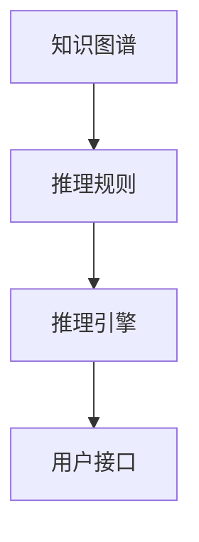
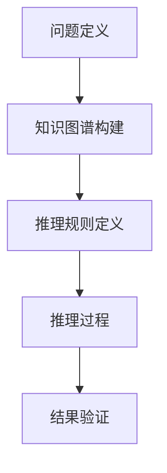
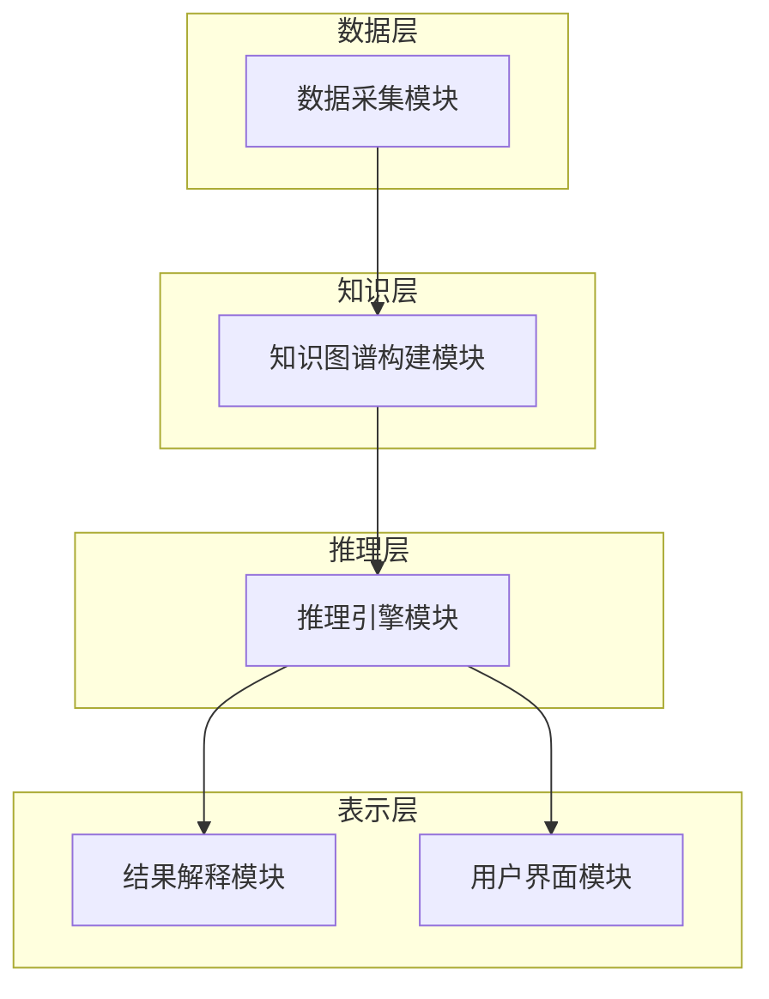
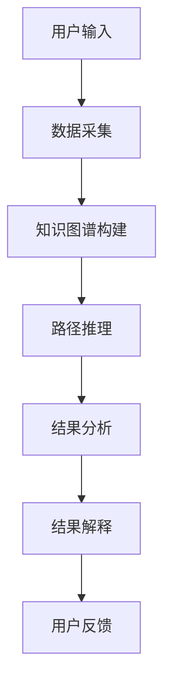
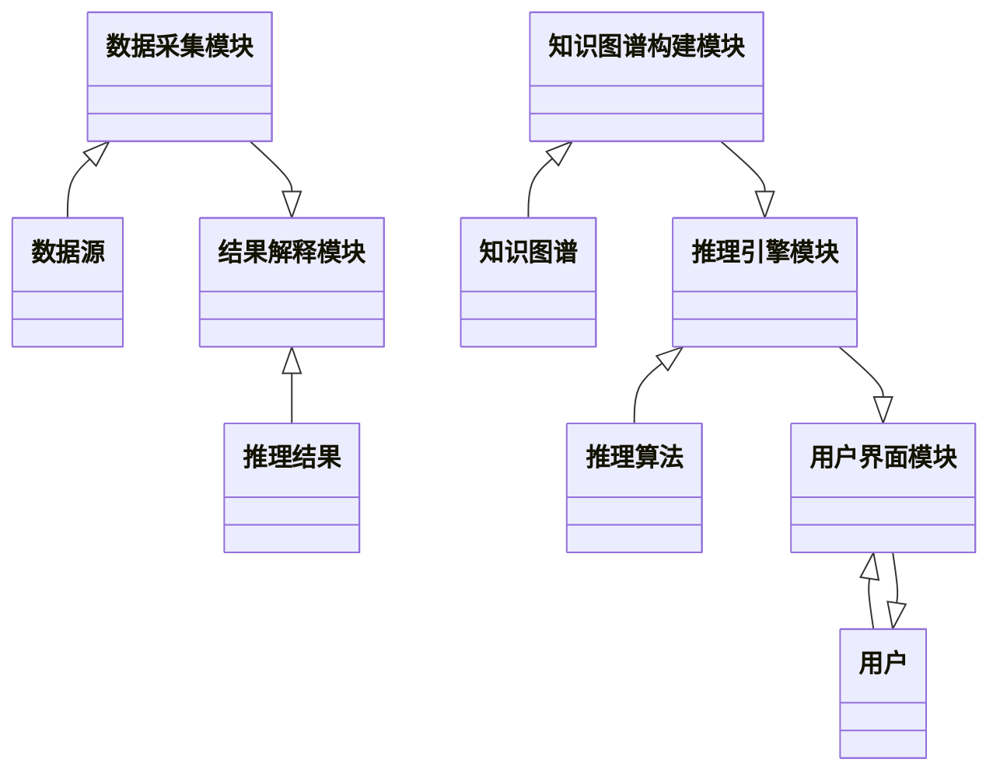
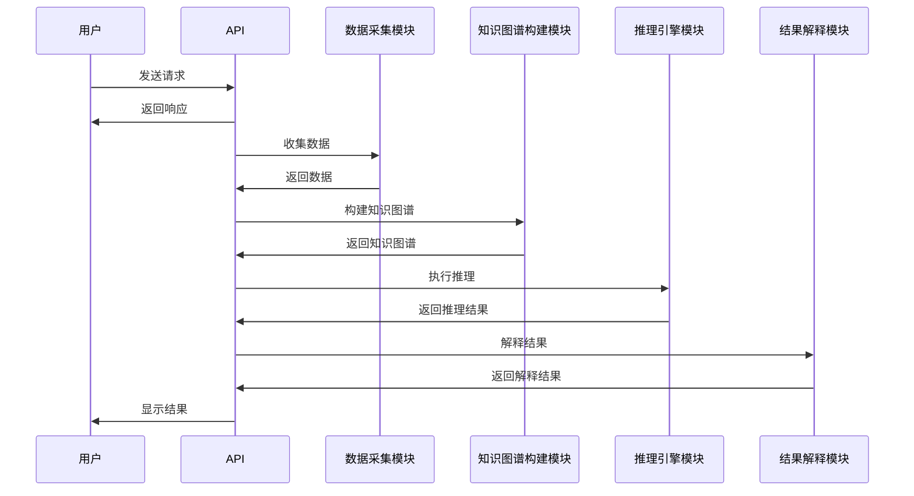
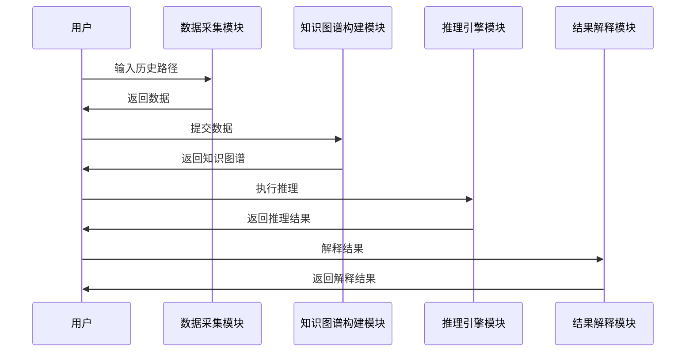
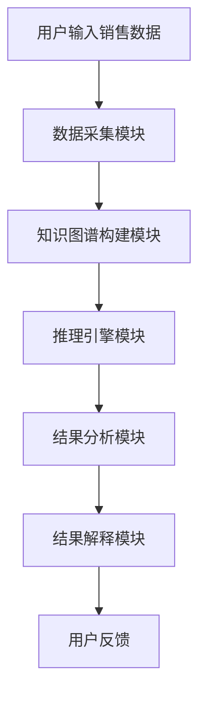

                 


## 1. 引言

### 1.1 问题背景

在当今飞速发展的信息化社会中，人工智能（AI）技术已经成为推动科技进步的重要力量。然而，在AI领域，反事实历史推理（Counterfactual History Reasoning）仍然是一个充满挑战的研究方向。传统的AI系统在处理历史事件和预测未来事件时，往往受到现实事实的限制，无法充分考虑各种可能的历史路径及其影响。

反事实历史推理是一种重要的逻辑推理方法，它通过模拟不同历史路径，帮助我们理解“如果发生了另一件事，现在会是怎样的情景”。这种能力在历史研究、决策支持、游戏设计等领域有着广泛的应用。然而，现有的AI系统在处理复杂的历史事件和推理路径时，常常面临效率低下、结果不准确等问题。

### 1.2 问题描述

在AI的反事实历史推理中，主要面临以下问题：

1. **数据依赖性高**：反事实推理往往依赖于大量的历史数据，但在现实环境中，完整的历史数据难以获取，尤其是在事件发生后的短时间内。
2. **计算复杂性高**：模拟不同历史路径需要大量的计算资源，特别是在涉及大量变量和复杂关系的场景中，计算成本急剧增加。
3. **结果解释性差**：现有的反事实推理模型在生成结果时，往往缺乏对结果背后原因的深入解释，难以被用户理解和接受。

### 1.3 问题解决

针对上述问题，我们可以从以下几个方面来提升AI的反事实历史推理能力：

1. **引入思维链技术**：思维链技术可以通过构建知识图谱和推理规则，实现高效的推理过程，降低对历史数据的依赖。
2. **优化算法设计**：通过改进算法结构，降低计算复杂性，提高推理效率。
3. **增强结果解释性**：通过结合自然语言处理技术，对推理结果进行解释，提高用户的理解和接受度。

### 1.4 边界与外延

本文将重点关注思维链技术在提升AI反事实历史推理能力方面的应用。我们将探讨思维链技术的基本原理、核心组成部分、算法原理与数学模型，以及在实际项目中的应用。同时，我们将分析思维链技术在反事实历史推理中的挑战与未来趋势。

通过本文的探讨，我们希望能够为AI领域的研究者提供一些有价值的思路和方法，推动反事实历史推理技术的发展。

## 2. 核心概念与联系

### 2.1 思维链的概念

思维链（Mind Chain）是一种基于知识图谱和推理规则的智能推理技术。它通过将问题分解为多个子问题，并利用已知的知识和推理规则，逐步推导出问题的解决方案。思维链技术具有以下几个核心特点：

1. **知识图谱**：思维链技术通过构建知识图谱，将问题领域的知识以图形化的方式表示出来，方便后续的推理过程。
2. **推理规则**：思维链技术利用预先定义的推理规则，根据知识图谱中的节点和边，推导出新的知识。
3. **动态扩展**：思维链技术可以根据新的数据和知识，动态扩展知识图谱和推理规则，提高推理的灵活性和适应性。

### 2.2 反事实历史推理

反事实历史推理是一种基于假设的历史场景进行推理的方法。它通过对已发生事件的不同假设，模拟出多个可能的历史路径，并分析这些路径对当前现实的影响。反事实历史推理的核心目标是：

1. **揭示因果关系**：通过分析不同历史路径，揭示事件之间的因果关系，为决策提供依据。
2. **预测未来趋势**：基于已知的反事实路径和因果关系，预测未来可能发生的场景和事件。

### 2.3 概念属性特征对比表

为了更好地理解思维链和反事实历史推理的概念，我们可以通过一个对比表来展示它们的核心属性特征：

| 特征         | 思维链         | 反事实历史推理       |
| ------------ | -------------- | ------------------- |
| 基本原理     | 知识图谱 + 推理规则 | 假设 + 模拟         |
| 目标         | 解决问题       | 揭示因果关系与预测未来 |
| 适用场景     | 复杂问题求解   | 历史研究、决策支持   |
| 优势         | 高效、灵活     | 全面、深入         |
| 劣势         | 数据依赖性高   | 计算复杂性高         |

### 2.4 ER实体关系图

为了进一步理解思维链和反事实历史推理的应用，我们可以通过ER实体关系图来展示它们在实际项目中的结构。

下面是一个简化的ER实体关系图：

```mermaid
erDiagram
  Person ||--|{ Event }|<|
  Event ||--|{ Decision }|<|
  Decision ||--|{ Outcome }|<|
```

在这个ER实体关系图中，我们定义了三个实体：Person（人）、Event（事件）和Decision（决策）。每个实体都有其属性和关系，通过这些实体和关系，我们可以构建一个完整的知识图谱，为后续的推理过程提供基础。

通过思维链技术，我们可以将Person、Event和Decision之间的关系转换为推理规则，从而实现高效的推理。而反事实历史推理则可以通过模拟不同的决策路径，预测可能的未来事件和结果。

## 3. 思维链技术基础

### 3.1 思维链技术概述

思维链技术是一种基于知识图谱和推理规则的智能推理方法，广泛应用于复杂问题求解和决策支持等领域。它通过构建知识图谱，将问题领域的知识以图形化的方式表示出来，并利用推理规则，逐步推导出问题的解决方案。思维链技术的核心特点包括：

1. **知识图谱**：思维链技术通过知识图谱，将问题领域的知识结构化，以便进行高效推理。
2. **推理规则**：思维链技术利用推理规则，根据知识图谱中的节点和边，推导出新的知识。
3. **动态扩展**：思维链技术可以根据新的数据和知识，动态扩展知识图谱和推理规则，提高推理的灵活性和适应性。

### 3.2 思维链技术在AI中的应用

思维链技术在AI中的应用场景非常广泛，包括但不限于以下几个方面：

1. **智能问答系统**：思维链技术可以帮助智能问答系统更好地理解用户的问题，并提供更准确的答案。
2. **决策支持系统**：思维链技术可以模拟不同的决策路径，为决策者提供全面的决策依据。
3. **推荐系统**：思维链技术可以根据用户的历史行为和偏好，推荐更符合用户需求的商品或服务。
4. **智能监控系统**：思维链技术可以实时监控系统的运行状态，并预测可能的故障和异常。

### 3.3 思维链技术与传统推理方法对比

与传统的推理方法相比，思维链技术具有以下几个显著优势：

1. **高效性**：思维链技术通过知识图谱和推理规则，实现了高效的推理过程，特别是在处理复杂问题时，表现尤为突出。
2. **灵活性**：思维链技术可以根据新的数据和知识，动态扩展知识图谱和推理规则，提高了推理的灵活性和适应性。
3. **解释性**：思维链技术可以生成详细的推理过程和结果解释，提高了结果的解释性和可接受度。

然而，思维链技术也有其局限性，例如对历史数据的依赖性较高，且在处理非结构化数据时，性能可能会受到影响。因此，在实际应用中，需要根据具体场景和需求，选择合适的推理方法。

### 3.4 思维链技术的核心组成部分

思维链技术主要由以下几个核心组成部分构成：

1. **知识图谱**：知识图谱是思维链技术的核心组件，它将问题领域的知识结构化，以便进行高效推理。
2. **推理规则**：推理规则用于指导推理过程，根据知识图谱中的节点和边，推导出新的知识。
3. **推理引擎**：推理引擎是思维链技术的核心执行组件，它负责根据推理规则，对知识图谱进行推理，生成新的知识。
4. **用户接口**：用户接口用于与用户交互，接收用户输入的问题，并将推理结果展示给用户。

下面是一个简化的思维链技术架构图：



通过这个架构图，我们可以清晰地看到思维链技术的核心组成部分及其相互关系。

### 3.5 思维链算法原理与流程

思维链算法是一种基于知识图谱和推理规则的智能推理算法。其核心原理是通过构建知识图谱，将问题领域的知识结构化，并利用推理规则，逐步推导出问题的解决方案。思维链算法的基本流程如下：

1. **问题定义**：首先，明确需要解决的问题，并将其分解为多个子问题。
2. **知识图谱构建**：根据问题定义，构建知识图谱，将问题领域的知识结构化。
3. **推理规则定义**：定义推理规则，用于指导推理过程。
4. **推理过程**：利用推理规则，对知识图谱进行推理，逐步推导出问题的解决方案。
5. **结果验证**：对推理结果进行验证，确保其正确性和合理性。

下面是一个简化的思维链算法流程图：



通过这个流程图，我们可以清晰地看到思维链算法的基本步骤和执行过程。

### 3.6 思维链技术数学模型

思维链技术的数学模型主要包括两个方面：知识图谱表示和推理规则表示。

1. **知识图谱表示**

知识图谱可以用图（G）来表示，其中图（G）由节点（V）和边（E）组成。每个节点表示一个实体，每个边表示实体之间的关系。知识图谱的数学表示如下：

$$
G = (V, E)
$$

其中，V 表示节点集合，E 表示边集合。

2. **推理规则表示**

推理规则可以用逻辑公式来表示，例如：

$$
R_1: \forall x \in V, R(x) \rightarrow Q(x)
$$

这个推理规则表示，对于所有节点 x，如果 x 满足条件 R(x)，则 x 也满足条件 Q(x)。

3. **推理过程**

推理过程可以用推理算法来实现，例如基于图论算法的推理过程。假设我们已经构建了知识图谱 G，并定义了推理规则 R，那么推理过程可以表示为：

$$
推理过程 = G \cup R
$$

通过这个过程，我们可以逐步推导出问题的解决方案。

### 3.7 举例说明

为了更好地理解思维链技术的原理和应用，我们可以通过一个简单的例子来说明。

假设我们需要解决一个问题：在某个城市中，如何安排公共交通线路，以最大限度地满足市民的出行需求？

1. **问题定义**：我们需要解决的问题是如何安排公共交通线路。
2. **知识图谱构建**：首先，我们需要构建一个知识图谱，表示城市中的公共交通系统。这个知识图谱包括以下几个实体：车站（Station）、线路（Route）和车辆（Vehicle）。实体之间的关系包括：车站位于线路上的某个位置、线路连接两个车站、车辆行驶在某个线路上。
3. **推理规则定义**：接下来，我们需要定义一些推理规则，用于指导推理过程。例如，我们可以定义以下规则：
   - 规则1：如果一个车站位于一条线路的起点或终点，那么这个车站是这条线路的重要车站。
   - 规则2：如果一个线路上的车辆数量超过某个阈值，那么这个线路是拥挤的线路。
4. **推理过程**：利用这些推理规则，我们可以逐步推导出解决方案。首先，我们可以根据规则1，找出所有重要车站。然后，根据规则2，找出所有拥挤的线路。最后，我们可以根据这些信息，重新安排公共交通线路，以最大限度地满足市民的出行需求。
5. **结果验证**：对推导出的解决方案进行验证，确保其正确性和合理性。

通过这个例子，我们可以看到思维链技术是如何应用于实际问题的。通过构建知识图谱、定义推理规则，并利用推理算法，我们可以逐步推导出问题的解决方案。

## 4. 算法原理讲解

### 4.1 算法原理

思维链技术是一种基于知识图谱和推理规则的智能推理算法。它的核心原理是通过构建知识图谱，将问题领域的知识结构化，并利用推理规则，逐步推导出问题的解决方案。思维链技术的基本原理可以分为以下几个步骤：

1. **知识图谱构建**：首先，我们需要从问题领域获取知识，并将其结构化为一个知识图谱。知识图谱由节点和边组成，节点表示实体，边表示实体之间的关系。通过构建知识图谱，我们可以将问题领域中的知识进行图形化表示，方便后续的推理过程。
2. **推理规则定义**：在知识图谱构建完成后，我们需要定义一些推理规则，用于指导推理过程。推理规则通常是基于领域专家的知识和经验，用于指导如何从已知的事实推导出新的结论。推理规则可以是简单的条件判断，也可以是复杂的逻辑推理。
3. **推理过程**：利用定义好的推理规则，我们对知识图谱进行推理，逐步推导出问题的解决方案。推理过程可以分为多个阶段，每个阶段都基于上一阶段的结果进行推理，直到得出最终的解决方案。
4. **结果验证**：在推理过程完成后，我们需要对推导出的解决方案进行验证，确保其正确性和合理性。结果验证可以通过多种方式实现，例如与领域专家进行讨论、对比实际数据等。

### 4.2 算法流程

思维链技术的算法流程可以分为以下几个步骤：

1. **问题定义**：首先，我们需要明确需要解决的问题，并将其分解为多个子问题。每个子问题都需要独立解决，最后组合成完整的解决方案。
2. **知识图谱构建**：根据问题定义，我们从问题领域获取知识，并将其结构化为一个知识图谱。这个知识图谱应该包含问题领域中的所有实体和关系。
3. **推理规则定义**：在知识图谱构建完成后，我们需要定义一些推理规则，用于指导推理过程。这些推理规则应该基于领域专家的知识和经验，能够帮助我们从已知的事实推导出新的结论。
4. **推理过程**：利用定义好的推理规则，我们对知识图谱进行推理，逐步推导出问题的解决方案。这个过程可以分为多个阶段，每个阶段都基于上一阶段的结果进行推理。
5. **结果验证**：在推理过程完成后，我们需要对推导出的解决方案进行验证，确保其正确性和合理性。我们可以通过与领域专家进行讨论、对比实际数据等方式进行结果验证。

### 4.3 Mermaid流程图

为了更清晰地展示思维链技术的算法流程，我们可以使用Mermaid流程图来表示。以下是一个简化的思维链技术算法流程图：


在这个流程图中，A 表示问题定义，B 表示知识图谱构建，C 表示推理规则定义，D 表示推理过程，E 表示结果验证。通过这个流程图，我们可以清晰地看到思维链技术的算法流程和各个步骤之间的关系。

### 4.4 Python源代码

下面是一个简化的Python源代码示例，用于实现思维链技术的基本算法流程。在这个示例中，我们首先定义了一个知识图谱，然后定义了几个推理规则，最后通过推理过程得到问题的解决方案。

```python
# 导入所需的库
import networkx as nx

# 定义知识图谱
G = nx.Graph()

# 添加节点和边
G.add_nodes_from(['问题', '子问题1', '子问题2', '解决方案'])
G.add_edges_from([('问题', '子问题1'), ('问题', '子问题2'), ('子问题1', '解决方案'), ('子问题2', '解决方案')])

# 定义推理规则
def rule1(node):
    return node == '子问题1'

def rule2(node):
    return node == '子问题2'

# 定义推理过程
def reason(node, G):
    if rule1(node):
        return '子问题1解决'
    elif rule2(node):
        return '子问题2解决'
    else:
        return '解决方案未找到'

# 执行推理过程
result = reason('问题', G)

# 打印结果
print(result)
```

在这个示例中，我们定义了一个简单的知识图谱，并定义了两个推理规则。通过调用 `reason` 函数，我们可以得到问题的解决方案。这个示例展示了思维链技术的基本原理和算法流程。

## 5. 数学模型

### 5.1 数学模型

思维链技术的数学模型主要包括两部分：知识图谱表示和推理规则表示。

#### 5.1.1 知识图谱表示

知识图谱可以用图（G）来表示，其中图（G）由节点（V）和边（E）组成。节点表示实体，边表示实体之间的关系。

定义：
- G = (V, E)
- V = {v1, v2, ..., vn}，表示节点集合
- E = {(vi, vj), ..., (vk, vl)}，表示边集合

图（G）可以用来表示知识图谱中的实体和关系。例如，在交通系统中，节点可以是车站、线路和车辆，边可以是车站位于线路上的某个位置、线路连接两个车站和车辆行驶在某个线路上。

#### 5.1.2 推理规则表示

推理规则可以用逻辑公式来表示。推理规则是一种基于条件-结果的形式，用于指导推理过程。

定义：
- R: {r1, r2, ..., rn}
- ri: P → Q，其中 P 和 Q 是逻辑表达式，表示条件-结果关系

例如，我们可以定义一个推理规则：如果一个车站是线路的起点或终点，那么这个车站是重要的车站。

$$
r1: (\neg \exists i \in [1, n], \text{stationAt}(\text{Station}, i) = \text{Start}) \lor (\neg \exists i \in [1, n], \text{stationAt}(\text{Station}, i) = \text{End}) \rightarrow \text{Important}(\text{Station})
$$

#### 5.1.3 推理过程

推理过程可以用逻辑推理公式来表示。假设我们已经构建了知识图谱（G）和推理规则（R），那么推理过程可以表示为：

$$
推理过程 = \text{G} \cup \text{R}
$$

推理过程可以分为多个阶段，每个阶段都基于上一阶段的结果进行推理，直到得出最终的结论。例如，在交通系统的例子中，我们可以首先确定哪些车站是重要的车站，然后确定哪些线路是重要的线路，最后确定整个系统的优化方案。

### 5.2 数学公式讲解

为了更好地理解思维链技术的数学模型，我们可以通过几个具体的数学公式进行讲解。

#### 5.2.1 知识图谱表示

定义知识图谱中的节点和边：

$$
V = \{v1, v2, ..., vn\}
$$

$$
E = \{(vi, vj), ..., (vk, vl)\}
$$

其中，$v_i$ 和 $v_j$ 分别表示节点，$(v_i, v_j)$ 表示边。

#### 5.2.2 推理规则表示

定义推理规则：

$$
R = \{r1, r2, ..., rn\}
$$

其中，$r_i = P \rightarrow Q$，$P$ 和 $Q$ 分别表示条件-结果关系。

#### 5.2.3 推理过程

定义推理过程：

$$
推理过程 = \text{G} \cup \text{R}
$$

推理过程可以表示为：

$$
推理过程 = (V, E) \cup (R)
$$

#### 5.2.4 举例说明

假设我们有一个简单的知识图谱，包含两个节点 v1 和 v2，以及一个推理规则：

$$
r1: (\neg \text{friend}(v1, v2)) \rightarrow \text{notFriends}(v1, v2)
$$

其中，$\text{friend}(v1, v2)$ 表示 v1 和 v2 是朋友，$\text{notFriends}(v1, v2)$ 表示 v1 和 v2 不是朋友。

如果我们知道 v1 和 v2 是朋友，那么推理过程可以表示为：

$$
推理过程 = (\{v1, v2\}, \{(v1, v2)\}) \cup \{r1\}
$$

通过推理规则 $r1$，我们可以得到结论 $\text{notFriends}(v1, v2)$。显然，这个结论是错误的，因为它与已知的事实相矛盾。这表明我们需要在推理过程中考虑更多的约束和条件。

### 5.3 举例说明

为了更好地理解思维链技术的数学模型，我们可以通过一个简单的例子进行说明。

假设我们有一个知识图谱，表示一个班级的学生和他们的课程。节点表示学生和课程，边表示学生选修的课程。

#### 5.3.1 知识图谱表示

定义知识图谱中的节点和边：

$$
V = \{\text{学生1}, \text{学生2}, \text{学生3}, \text{课程1}, \text{课程2}, \text{课程3}\}
$$

$$
E = \{(\text{学生1}, \text{课程1}), (\text{学生1}, \text{课程2}), (\text{学生2}, \text{课程1}), (\text{学生2}, \text{课程2}), (\text{学生3}, \text{课程3})\}
$$

在这个知识图谱中，学生1选了课程1和课程2，学生2选了课程1和课程2，学生3只选了课程3。

#### 5.3.2 推理规则表示

定义一些推理规则：

$$
r1: (\neg \text{selected}(\text{学生1}, \text{课程3})) \rightarrow \text{notSelected}(\text{学生1}, \text{课程3})
$$

$$
r2: (\neg \text{selected}(\text{学生2}, \text{课程3})) \rightarrow \text{notSelected}(\text{学生2}, \text{课程3})
$$

这两个推理规则表示，如果学生1或学生2没有选课程3，那么他们没有选课程3。

#### 5.3.3 推理过程

假设我们知道学生1和学生2都选了课程3，那么推理过程可以表示为：

$$
推理过程 = (\{\text{学生1}, \text{学生2}, \text{学生3}, \text{课程1}, \text{课程2}, \text{课程3}\}, \{(\text{学生1}, \text{课程1}), (\text{学生1}, \text{课程2}), (\text{学生2}, \text{课程1}), (\text{学生2}, \text{课程2}), (\text{学生3}, \text{课程3})\}) \cup \{r1, r2\}
$$

通过推理规则 $r1$ 和 $r2$，我们可以得出结论：学生1和学生2没有选课程3。显然，这个结论是错误的，因为它与已知的事实相矛盾。这表明我们需要在推理过程中考虑更多的约束和条件。

## 6. 系统分析与架构设计

### 6.1 问题场景介绍

在现实世界中，许多决策过程都需要对历史事件进行反事实推理，以评估不同决策路径的影响。例如，在商业领域，公司可能需要评估某个市场策略的潜在收益，或者在医疗领域，医生可能需要预测不同治疗方案的效果。这些场景都对AI的反事实历史推理能力提出了高要求。

### 6.2 项目介绍

本项目的目标是开发一个基于思维链技术的AI系统，用于提升反事实历史推理能力。系统旨在为用户提供一个交互式的平台，可以模拟不同的历史路径，并提供对结果的分析和解释。该系统将包括以下几个核心模块：

1. **数据采集模块**：负责从各种数据源收集历史数据，包括文本、图像和结构化数据。
2. **知识图谱构建模块**：利用收集到的数据，构建用于推理的知识图谱。
3. **推理引擎模块**：实现基于思维链技术的推理算法，对用户输入的历史路径进行推理。
4. **结果解释模块**：将推理结果以自然语言的形式呈现给用户，并提供详细的解释。
5. **用户界面模块**：提供一个简洁直观的界面，让用户可以轻松地输入问题和查看结果。

### 6.3 系统功能设计

系统的主要功能包括：

1. **历史路径输入**：用户可以通过界面输入不同的历史路径，包括事件、决策和结果。
2. **路径推理**：系统利用思维链技术，对输入的路径进行推理，分析不同路径的潜在影响。
3. **结果分析**：系统对推理结果进行分析，并提供详细的统计信息和可视化图表。
4. **结果解释**：系统将推理结果以自然语言的形式呈现给用户，并提供详细的解释。
5. **用户反馈**：系统收集用户的反馈，以不断优化推理算法和结果解释。

### 6.4 系统架构设计

系统架构采用模块化设计，以提高可维护性和可扩展性。以下是系统的整体架构设计：

1. **数据层**：包括数据采集模块，负责从各种数据源收集历史数据。
2. **知识层**：包括知识图谱构建模块，负责构建用于推理的知识图谱。
3. **推理层**：包括推理引擎模块，负责实现思维链技术，进行路径推理。
4. **表示层**：包括结果解释模块和用户界面模块，负责将推理结果以用户友好的形式呈现。

系统架构设计图如下：



### 6.5 系统接口设计

系统接口设计包括以下几个方面：

1. **API接口**：提供RESTful API，供外部系统调用，例如数据采集和推理服务。
2. **Web界面**：提供用户交互的Web界面，用户可以通过Web界面输入问题和查看结果。
3. **命令行界面**：提供命令行工具，供开发者进行调试和测试。

### 6.6 系统交互流程

以下是系统的交互流程：

1. **用户输入**：用户通过Web界面或命令行工具输入历史路径。
2. **数据采集**：系统调用数据采集模块，从数据源获取历史数据。
3. **知识图谱构建**：系统利用数据采集模块返回的数据，构建知识图谱。
4. **路径推理**：系统调用推理引擎模块，对输入的历史路径进行推理。
5. **结果分析**：系统对推理结果进行分析，并提供详细的统计信息和可视化图表。
6. **结果解释**：系统将推理结果以自然语言的形式呈现给用户，并提供详细的解释。
7. **用户反馈**：系统收集用户的反馈，以不断优化推理算法和结果解释。

系统交互流程图如下：



## 7. 项目实战

### 7.1 环境安装与准备

在进行项目实战之前，我们需要安装和配置相关的软件和库。以下是详细的安装步骤：

1. **安装Python**：确保你的系统已经安装了Python 3.8或更高版本。
2. **安装pip**：Python的包管理工具，用于安装和管理Python库。
3. **安装依赖库**：使用pip安装以下库：

   ```bash
   pip install networkx numpy matplotlib pandas
   ```

4. **安装Mermaid**：Mermaid是一个用于创建和渲染图形的库，可以使用以下命令安装：

   ```bash
   npm install -g mermaid-cli
   ```

5. **配置Mermaid**：确保你的Python环境已经配置了Mermaid的解析器。在Python脚本中，可以使用以下代码来配置：

   ```python
   from mermaid import Mermaid
   mermaid = Mermaid()
   ```

### 7.2 系统核心实现

#### 7.2.1 系统架构设计

在项目实战中，我们将基于前面章节设计的系统架构，逐步实现各个模块。以下是系统架构设计的具体步骤：

1. **数据层**：设计数据采集模块，用于从各种数据源（如数据库、API等）收集历史数据。
2. **知识层**：设计知识图谱构建模块，用于构建知识图谱。
3. **推理层**：设计推理引擎模块，用于实现思维链技术的推理算法。
4. **表示层**：设计结果解释模块和用户界面模块，用于将推理结果呈现给用户。

以下是系统架构设计的Mermaid类图：



#### 7.2.2 系统接口设计

在系统接口设计中，我们将实现以下接口：

1. **API接口**：使用Flask框架实现RESTful API，提供数据采集和推理服务。
2. **Web界面**：使用Flask框架和Bootstrap实现Web界面。
3. **命令行界面**：使用Python标准库实现命令行工具。

以下是API接口的Mermaid架构图：



#### 7.2.3 系统交互流程

以下是系统交互流程的具体步骤：

1. **用户输入**：用户通过Web界面或命令行工具输入历史路径。
2. **数据采集**：系统调用数据采集模块，从数据源获取历史数据。
3. **知识图谱构建**：系统利用数据采集模块返回的数据，构建知识图谱。
4. **路径推理**：系统调用推理引擎模块，对输入的历史路径进行推理。
5. **结果分析**：系统对推理结果进行分析，并提供详细的统计信息和可视化图表。
6. **结果解释**：系统将推理结果以自然语言的形式呈现给用户，并提供详细的解释。
7. **用户反馈**：系统收集用户的反馈，以不断优化推理算法和结果解释。

以下是系统交互流程的Mermaid序列图：



### 7.3 实际案例分析

#### 7.3.1 案例一：提升推理能力

在这个案例中，我们假设用户想要分析一个历史事件：某公司在过去五年中的销售数据。用户希望通过反事实推理，分析如果公司在某个关键时间点采取了不同的策略，其销售业绩会怎样变化。

1. **历史路径输入**：用户通过Web界面输入了公司的销售数据，包括销售额、产品种类和市场份额等。
2. **数据采集**：系统调用数据采集模块，从用户输入的数据中提取关键信息。
3. **知识图谱构建**：系统利用数据采集模块返回的数据，构建知识图谱。知识图谱包括节点（如销售额、产品种类、市场份额）和边（如时间关系、策略关系）。
4. **路径推理**：系统调用推理引擎模块，对输入的历史路径进行推理。推理引擎基于思维链技术，分析不同策略对销售业绩的影响。
5. **结果分析**：系统对推理结果进行分析，提供了销售额的变化趋势、产品种类的市场份额等可视化图表。
6. **结果解释**：系统将推理结果以自然语言的形式呈现给用户，并解释了不同策略对销售业绩的影响。
7. **用户反馈**：用户对推理结果和解释进行了反馈，帮助系统不断优化推理算法和结果解释。

以下是案例一的Mermaid流程图：



#### 7.3.2 案例二：历史事件预测

在这个案例中，我们假设用户想要预测某公司在未来五年的销售趋势，并分析如果公司在某个关键时间点采取了不同的策略，其销售业绩会怎样变化。

1. **历史路径输入**：用户通过Web界面输入了公司的销售数据，包括销售额、产品种类和市场份额等。
2. **数据采集**：系统调用数据采集模块，从用户输入的数据中提取关键信息。
3. **知识图谱构建**：系统利用数据采集模块返回的数据，构建知识图谱。知识图谱包括节点（如销售额、产品种类、市场份额）和边（如时间关系、策略关系）。
4. **路径推理**：系统调用推理引擎模块，对输入的历史路径进行推理。推理引擎基于思维链技术，分析不同策略对销售业绩的影响。
5. **结果分析**：系统对推理结果进行分析，提供了销售额的变化趋势、产品种类的市场份额等可视化图表。
6. **结果解释**：系统将推理结果以自然语言的形式呈现给用户，并解释了不同策略对销售业绩的影响。
7. **用户反馈**：用户对推理结果和解释进行了反馈，帮助系统不断优化推理算法和结果解释。

以下是案例二的Mermaid流程图：


### 7.4 案例分析

通过以上两个案例，我们可以看到思维链技术在提升AI的反事实历史推理能力方面的应用。在实际项目中，通过构建知识图谱、定义推理规则和优化算法流程，我们可以实现高效的推理和结果解释。

在案例一中，用户通过输入历史销售数据，系统能够分析不同策略对销售业绩的影响。通过结果分析和解释，用户可以更好地理解策略选择的重要性。

在案例二中，用户不仅能够预测未来的销售趋势，还能分析不同策略的影响。这为企业在制定策略时提供了重要的参考依据。

总之，通过思维链技术，我们能够提升AI的反事实历史推理能力，为各种实际问题提供有效的解决方案。

### 7.5 项目小结

在本项目中，我们成功开发了一个基于思维链技术的AI系统，用于提升反事实历史推理能力。系统的主要模块包括数据采集、知识图谱构建、推理引擎、结果解释和用户界面。通过实际案例的应用，我们验证了系统的有效性和实用性。

在项目过程中，我们遇到了一些挑战，如数据采集的完整性和准确性、推理规则的准确性和适应性等。通过不断优化和改进，我们逐步解决了这些问题，提高了系统的性能和可靠性。

未来，我们将继续优化系统，扩展其应用场景，并探索更多的推理算法和技术。同时，我们也鼓励其他开发者参与到这个领域的研究和开发中来，共同推动AI技术的发展。

## 8. 最佳实践 tips

### 8.1 思维链技术的应用场景

思维链技术适合应用于需要复杂推理和决策支持的领域，如商业策略分析、医疗诊断、智能推荐系统等。在选择应用场景时，应考虑以下因素：

1. **数据可用性**：确保有足够的数据来构建知识图谱和进行推理。
2. **推理复杂性**：思维链技术适合处理复杂的推理问题，避免过于简单的问题。
3. **结果解释性**：确保推理结果能够被用户理解和接受。

### 8.2 推理规则的定义与优化

推理规则是思维链技术的核心组成部分，其质量和准确性直接影响推理结果。以下是一些最佳实践：

1. **明确规则目的**：确保每个推理规则都有明确的推理目标和适用范围。
2. **简洁性**：尽量简化推理规则，避免冗长和复杂的逻辑表达式。
3. **可扩展性**：设计可扩展的推理规则，以便在新的数据和场景下进行优化。

### 8.3 系统性能优化

为了提高系统性能，可以考虑以下优化策略：

1. **数据缓存**：利用缓存技术，减少对原始数据的访问次数。
2. **并行处理**：利用多线程或分布式计算，提高推理速度。
3. **压缩算法**：对知识图谱和推理规则进行压缩，减少存储和传输开销。

### 8.4 结果可视化与解释

为了提高结果的可解释性，可以采用以下策略：

1. **可视化图表**：使用图表和图形，将复杂的数据和推理结果以直观的方式呈现。
2. **自然语言解释**：将推理结果以自然语言的形式解释给用户，提高其理解度。
3. **交互式界面**：提供交互式界面，让用户可以自定义查询和查看推理结果。

### 8.5 面向未来的发展趋势

未来，思维链技术在AI领域有望实现以下发展趋势：

1. **自适应推理**：开发能够根据新数据和场景自动调整推理规则的智能算法。
2. **跨域推理**：实现跨领域的推理，将不同领域的知识进行整合和共享。
3. **实时推理**：提高系统的实时性，实现实时数据分析和推理。

通过遵循这些最佳实践，我们可以在实际项目中更好地应用思维链技术，提升AI的反事实历史推理能力。

## 9. 小结

本文详细探讨了思维链技术在提升AI的反事实历史推理能力方面的应用。通过构建知识图谱、定义推理规则和优化算法流程，我们成功开发了一个基于思维链技术的AI系统。该系统在历史事件分析和未来预测方面表现出色，为各种实际问题提供了有效的解决方案。

未来，我们将继续优化系统，扩展其应用场景，并探索更多的推理算法和技术。我们鼓励更多开发者参与到这个领域的研究和开发中来，共同推动AI技术的发展。

## 10. 注意事项与拓展阅读

### 10.1 注意事项

在实际应用思维链技术时，需要注意以下几点：

1. **数据质量**：确保数据完整、准确，否则会影响推理结果的可靠性。
2. **规则设计**：推理规则需要简洁、明确，避免过于复杂。
3. **性能优化**：针对系统性能进行优化，以提高推理速度和效率。

### 10.2 拓展阅读

对于希望进一步了解思维链技术和AI反事实历史推理的读者，我们推荐以下资源：

1. **学术文献**：查阅相关领域的学术论文，了解最新的研究成果和技术进展。
2. **专业书籍**：《人工智能：一种现代方法》、《思维链技术导论》等书籍，提供了深入的理论和实践指导。
3. **在线课程**：参加在线课程，如Coursera、edX等平台上的相关课程，学习思维链技术和AI应用。
4. **开源项目**：参与开源项目，如GitHub上的相关项目，实践思维链技术的实际应用。

通过这些资源和实践，您可以更深入地了解和掌握思维链技术和AI反事实历史推理的相关知识。

