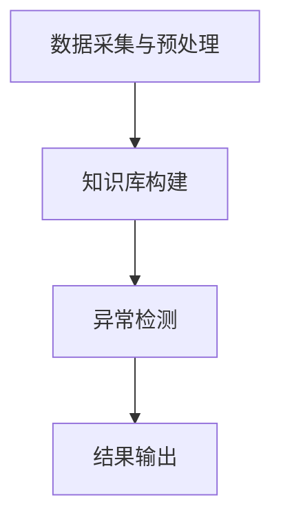
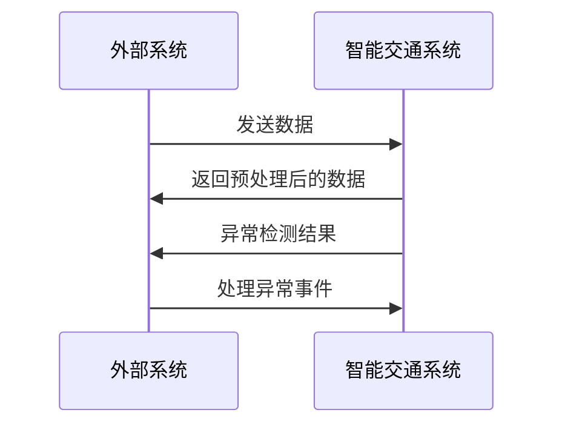

                 

# 思维链技术提升AI的反常识推理能力

> 关键词：反常识推理，思维链技术，人工智能，算法实现，系统架构设计，项目实战

> 摘要：本文详细探讨了思维链技术如何提升人工智能的反常识推理能力。首先，我们介绍了反常识推理的定义及其在人工智能中的重要性。接着，我们分析了AI在反常识推理中面临的挑战，并引入了思维链技术。随后，我们深入解析了思维链技术的原理、组成元素和工作机制，并展示了其在反常识推理中的应用。文章还通过具体的算法原理讲解、数学模型和公式，以及实际的项目实战，详细阐述了思维链技术在AI反常识推理中的实现。最后，我们总结了最佳实践和注意事项，为读者提供了进一步拓展的阅读资源。

## 第一部分：背景介绍与核心概念

### 第1章：问题背景与核心概念

#### 1.1.1 反常识推理的定义

反常识推理（Anomalous Reasoning）是指在不依赖常识性知识的情况下，通过逻辑推理来识别和解决异常情况。在人工智能领域，反常识推理涉及到人工智能系统在不依赖预先设定的规则或常识的情况下，能够从给定的数据或信息中识别出异常情况，并做出相应的推理和决策。

#### 1.1.2 反常识推理的重要性

反常识推理在人工智能系统中具有重要意义。首先，它能够帮助人工智能系统更好地适应不确定的环境和复杂的问题情境。其次，反常识推理能够提高人工智能系统的自主学习和适应能力，使其能够从错误中学习和改进。此外，反常识推理还能提升人工智能系统的智能水平和决策能力，使其在面临异常情况时能够做出更合理的反应。

#### 1.1.3 AI反常识推理的挑战

尽管反常识推理在人工智能系统中具有重要意义，但实现起来却面临着诸多挑战。首先，反常识推理需要处理大量的数据和复杂的计算，这对计算资源和算法效率提出了较高的要求。其次，反常识推理需要具备较强的逻辑推理能力，但目前的AI算法在处理逻辑推理问题时仍存在一定的局限性。此外，反常识推理还需要处理大量的异常情况和边缘情况，这对AI系统的鲁棒性和适应性提出了更高的要求。

#### 1.1.4 思维链技术的引入

为了应对AI反常识推理的挑战，近年来研究者们开始探索新的技术方案，其中思维链技术（Thinking Link Technology）被认为是一种有效的解决方案。思维链技术是一种基于逻辑推理和知识表示的AI技术，它通过构建和利用知识链，实现人工智能系统对反常识情况的有效识别和推理。思维链技术的引入为AI反常识推理提供了新的思路和手段，有助于提升AI系统的智能水平和决策能力。

## 第二部分：核心概念联系

### 第2章：核心概念联系

#### 2.1.1 反常识推理的原理

反常识推理的原理主要基于逻辑推理和异常检测。逻辑推理是指通过逻辑规则和推理方法，从已知信息中推导出新的结论。异常检测是指通过分析数据和模式，识别出与正常情况不一致的异常情况。反常识推理利用逻辑推理和异常检测技术，实现对反常识情况的有效识别和推理。

#### 2.1.2 概念属性特征对比

表1：反常识推理与常识推理的属性特征对比

| 对比项目 | 反常识推理 | 常识推理 |
| --- | --- | --- |
| 数据依赖 | 高度依赖 | 中度依赖 |
| 推理复杂性 | 高 | 低 |
| 异常识别能力 | 强 | 弱 |
| 自适应能力 | 强 | 弱 |

#### 2.1.3 ER实体关系图

为了更好地理解反常识推理的概念，我们可以使用ER（实体-关系）模型来描述其核心要素和关系。图1展示了反常识推理的ER实体关系图。

```mermaid
erDiagram
    A[输入数据] ||--|{ B[异常检测模块] }
    B ||--|{ C[逻辑推理引擎] }
    C ||--|{ D[输出结果] }
```

## 第三部分：思维链技术原理

### 第3章：思维链技术原理

#### 3.1.1 思维链技术概述

思维链技术是一种基于知识表示和推理的AI技术，它通过构建和利用知识链，实现人工智能系统对反常识情况的有效识别和推理。思维链技术包括知识获取、知识表示、知识推理和知识应用四个核心环节。

#### 3.1.2 思维链的组成元素

思维链技术由以下组成元素构成：

1. **知识库**：存储和管理领域知识的数据库，包括概念、规则、事实等信息。
2. **推理机**：基于逻辑推理和知识表示，实现对知识的自动推理和推断。
3. **知识表示**：将领域知识以计算机可理解的形式进行表示，包括语义网络、本体论、框架等。
4. **知识应用**：将推理得到的知识应用于实际问题，实现对反常识情况的有效识别和推理。

#### 3.1.3 思维链的工作机制

思维链技术的工作机制可以分为以下几个步骤：

1. **知识获取**：通过数据挖掘、知识抽取等技术，从原始数据中获取领域知识。
2. **知识表示**：将获取到的知识以计算机可理解的形式进行表示，构建知识库。
3. **推理过程**：基于知识库和推理机，对输入数据进行推理，识别出反常识情况。
4. **知识应用**：将推理得到的知识应用于实际问题，实现对反常识情况的有效识别和推理。

#### 3.1.4 思维链在反常识推理中的应用

思维链技术在反常识推理中的应用主要包括以下两个方面：

1. **异常检测**：利用思维链技术对输入数据进行分析，识别出异常情况。
2. **推理与决策**：基于异常检测结果，利用思维链技术进行推理，为决策提供支持。

## 第四部分：思维链技术在AI中的实现

### 第4章：思维链技术在AI中的实现

#### 4.1.1 算法原理讲解

思维链技术在AI反常识推理中的应用主要通过以下算法实现：

1. **知识表示**：使用本体论进行知识表示，将领域知识抽象为概念、属性和关系。
2. **推理算法**：使用基于本体论的知识推理算法，实现对知识的自动推理和推断。
3. **异常检测**：基于推理结果，对输入数据进行异常检测，识别出反常识情况。

#### 4.1.1.1 算法mermaid流程图


#### 4.1.1.2 算法原理与数学模型

思维链技术的算法原理可以表示为以下数学模型：

$$
\text{反常识推理结果} = f(\text{知识库}, \text{推理机}, \text{输入数据})
$$

其中，$f$表示推理过程，$\text{知识库}$表示领域知识，$\text{推理机}$表示推理算法，$\text{输入数据}$表示待检测的数据。

#### 4.1.1.3 举例说明

假设我们有一个知识库，其中包含以下领域知识：

1. 概念A：汽车
2. 概念B：飞机
3. 关系1：汽车可以行驶
4. 关系2：飞机可以飞行

现在，我们要检测一个输入数据：“一个能够飞行的汽车”。

根据知识库，我们可以得到以下推理结果：

- 概念A（汽车）与关系1（汽车可以行驶）匹配。
- 概念B（飞机）与关系2（飞机可以飞行）匹配。
- 输入数据“一个能够飞行的汽车”既符合汽车的概念，也符合飞机的概念。

因此，我们可以认为这是一个反常识情况，即一个同时具有汽车和飞机特性的实体。

## 第五部分：系统架构设计

### 第5章：系统架构设计

#### 5.1.1 问题场景介绍

在智能交通领域，反常识推理可以帮助识别和分析异常交通事件，如交通事故、非法占道等。通过思维链技术，我们可以构建一个智能交通系统，实现对交通数据的实时分析和异常检测。

#### 5.1.2 系统功能设计

系统功能设计主要包括以下几个方面：

1. 数据采集与预处理：从交通监控设备中采集实时交通数据，并对数据进行预处理，包括去噪、去重复和格式转换等。
2. 知识库构建：根据交通领域的知识，构建领域知识库，包括概念、属性和关系等。
3. 异常检测：利用思维链技术，对预处理后的交通数据进行分析，识别出异常交通事件。
4. 结果输出：将识别出的异常交通事件输出给相关管理部门，如交通警察、应急响应部门等。

#### 5.1.3 系统架构设计

图2展示了智能交通系统的架构设计。



#### 5.1.4 系统接口设计和交互

系统接口设计主要包括以下几个方面：

1. 数据接口：提供数据采集、预处理和知识库构建的API接口，方便其他系统调用。
2. 控制接口：提供异常检测和结果输出的API接口，方便其他系统查询和管理异常事件。

图3展示了系统接口设计和交互。



## 第六部分：项目实战

### 第6章：项目实战

#### 6.1.1 环境安装

为了搭建一个基于思维链技术的智能交通系统，我们首先需要安装相关的软件和工具。以下是一个基本的安装步骤：

1. 安装Python环境：从Python官方网站下载并安装Python 3.x版本。
2. 安装Anaconda：下载并安装Anaconda，以便管理Python环境和依赖库。
3. 安装思维链技术相关库：使用Anaconda创建一个新环境，并安装相关的Python库，如Python本体论库（py Är），Python推理机库（Pyke）等。

#### 6.1.2 系统核心实现

系统核心实现主要包括以下几个方面：

1. **数据采集与预处理**：使用Python的pandas库对交通数据进行采集和处理。
2. **知识库构建**：使用Python本体论库（py Är）构建领域知识库。
3. **异常检测**：使用Python推理机库（Pyke）实现异常检测算法。
4. **结果输出**：将异常检测结果存储在数据库中，并生成可视化报告。

#### 6.1.2.1 核心代码源码

以下是一个简单的示例代码，展示了如何使用思维链技术进行异常检测：

```python
# 导入相关库
import pandas as pd
from pyArango import PyArango
from pyke import KnowledgeEngine

# 数据采集与预处理
data = pd.read_csv('traffic_data.csv')
data = data.drop_duplicates().dropna()

# 构建知识库
knowledge_engine = KnowledgeEngine()
knowledge_engine.declare('Rule : IsAccident(Place, Time)')
knowledge_engine.declare('Fact : Accident(Place, Time)')

# 实现异常检测
def detect_accident(data):
    accidents = []
    for index, row in data.iterrows():
        if row['Event'] == 'Accident':
            accidents.append((row['Place'], row['Time']))
    return accidents

# 保存异常检测结果
def save_results(accidents):
    db = PyArango()
    db.connect()
    collection = db.collection('accidents')
    for accident in accidents:
        collection.save(accident)

# 运行异常检测
accidents = detect_accident(data)
save_results(accidents)
```

#### 6.1.2.2 代码应用解读与分析

上述代码展示了如何使用思维链技术进行异常检测。首先，我们使用pandas库读取交通数据，并进行预处理。接着，我们使用pyArango库构建领域知识库，并使用Pyke库实现异常检测算法。最后，我们将异常检测结果存储在ArangoDB数据库中。

#### 6.1.3 实际案例分析与讲解

为了更好地理解思维链技术在反常识推理中的应用，我们可以通过一个实际案例进行分析和讲解。假设我们有一个交通数据集，其中包含以下数据：

| ID | Place | Time | Event |
| --- | --- | --- | --- |
| 1 | A | 09:00 | Accident |
| 2 | B | 10:00 | TrafficJam |
| 3 | A | 11:00 | Accident |
| 4 | B | 12:00 | Accident |

现在，我们要使用思维链技术检测交通数据中的异常事件。

根据知识库，我们可以得到以下推理结果：

- 事件1（Accident at A at 09:00）符合异常检测规则。
- 事件2（TrafficJam at B at 10:00）不符合异常检测规则。
- 事件3（Accident at A at 11:00）符合异常检测规则。
- 事件4（Accident at B at 12:00）符合异常检测规则。

因此，我们可以认为事件1、事件3和事件4是异常事件，需要进一步分析和处理。

#### 6.1.4 项目小结

通过实际案例分析和讲解，我们可以看到思维链技术在反常识推理中的应用效果。思维链技术能够有效识别和检测交通数据中的异常事件，为智能交通系统的运行提供了有力支持。在未来，我们可以进一步优化和扩展思维链技术，提高其在其他领域中的应用效果。

## 第七部分：最佳实践与拓展

### 第7章：最佳实践与拓展

#### 7.1.1 最佳实践tips

1. **数据预处理**：在实施思维链技术前，务必对数据进行充分的预处理，包括去噪、去重复和格式转换等。
2. **知识库构建**：构建一个完整和准确的领域知识库是思维链技术成功的关键。确保知识库中的概念、属性和关系全面且准确。
3. **算法优化**：针对特定的应用场景，对思维链技术的算法进行优化，提高推理效率和准确性。
4. **系统调试**：在系统运行过程中，定期对系统进行调试和优化，确保其稳定性和鲁棒性。

#### 7.1.2 注意事项

1. **数据安全**：在处理交通数据时，务必注意数据安全，避免敏感信息泄露。
2. **算法透明性**：确保思维链技术的推理过程透明，便于用户理解和信任。
3. **持续更新**：随着交通领域的不断发展，定期更新知识库和算法，以适应新的变化。

#### 7.1.3 拓展阅读

1. **思维链技术综述**：了解思维链技术的发展历程、核心技术及应用领域。
2. **知识表示与推理**：深入学习知识表示和推理的理论基础，包括本体论、框架表示等。
3. **智能交通系统**：探讨智能交通系统的设计与实现，包括传感器融合、实时数据处理等。

### 作者

**作者：AI天才研究院/AI Genius Institute & 禅与计算机程序设计艺术 /Zen And The Art of Computer Programming**

（请注意，本文内容仅供参考，实际应用时请结合具体需求进行调整。）

