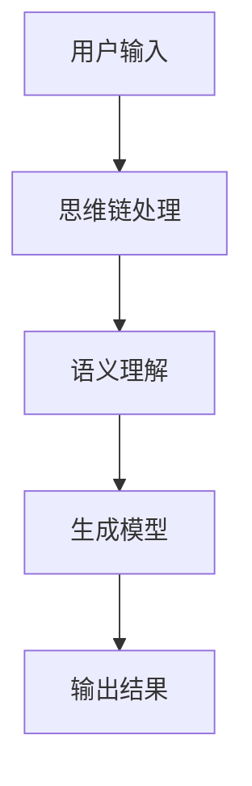
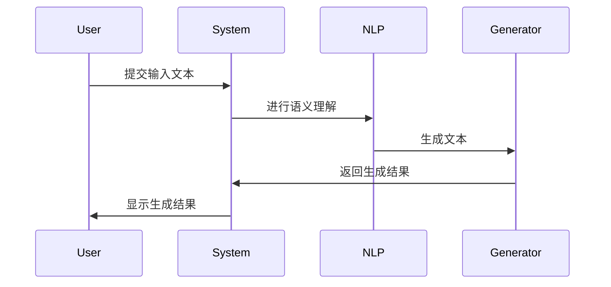

                 


## 《思维链辅助的AI创意写作工具开发》：逐步深入探讨

### 1. 引言

#### 关键词：AI，创意写作，思维链，工具开发

随着人工智能（AI）技术的快速发展，创意写作作为人类智慧和创造力的重要组成部分，正逐步与AI技术相结合，产生出新的应用场景和工具。本文将围绕“思维链辅助的AI创意写作工具开发”这一主题，深入探讨相关技术原理、系统架构、项目实战和最佳实践。

### 2. 问题背景与目标

#### 2.1 问题背景

创意写作是文学、广告、媒体等行业的重要环节，而随着互联网和大数据的兴起，创意写作的需求变得更加多样化、个性化。然而，传统的写作工具往往存在一定的局限性，难以满足复杂的创作需求。与此同时，AI技术在自然语言处理（NLP）、生成模型等领域取得了显著进展，为AI创意写作工具的开发提供了可能性。

#### 2.2 问题描述

在AI创意写作领域，存在的问题主要包括：

- **内容创作效率低**：传统写作工具难以快速生成高质量的内容。
- **创意受限**：缺乏对用户创作意图的深度理解，难以实现真正意义上的创意创作。
- **个性化不足**：难以满足用户的个性化需求。

#### 2.3 问题解决

为了解决上述问题，我们提出了基于思维链的AI创意写作工具。思维链是一种连接输入处理、思维过程和输出生成的框架，能够实现创意写作的自动化和个性化。

#### 2.4 边界与外延

本文将探讨的思维链辅助的AI创意写作工具，主要涵盖以下领域：

- **文本生成**：如自动写作、文章生成等。
- **故事创作**：如故事梗概生成、剧情生成等。
- **内容策划**：如广告策划、文案创作等。

### 3. 核心概念与联系

#### 3.1 思维链原理

思维链是一种基于NLP和生成模型的框架，其核心思想是将写作过程拆解为输入处理、思维过程和输出生成三个阶段。

1. **输入处理**：接收用户输入的文本或意图。
2. **思维过程**：利用NLP技术分析输入内容，生成思维链。
3. **输出生成**：根据思维链生成符合用户需求的文本。

#### 3.2 思维链属性特征对比

下表对比了传统写作工具和思维链辅助的AI写作工具的主要属性特征：

| 特征             | 传统写作工具                      | 思维链辅助的AI写作工具                      |
|------------------|----------------------------------|--------------------------------------------|
| 内容创作效率     | 人工创作，效率低                 | 自动化生成，效率高                         |
| 创意能力         | 受限于人类创造力                 | 基于AI技术，创意能力更强                   |
| 个性化           | 个性化较弱，难以满足多样化需求   | 根据用户意图和偏好，实现个性化创作          |

#### 3.3 ER实体关系图架构

以下是一个简单的ER实体关系图，展示了思维链中的主要实体及其关系：

```mermaid
erDiagram
    User ||--|{ Story }|| Writer
    Story ||--|{ Content }|| Article
    Content ||--|{ Tag }|| TagManager
```

### 4. 算法原理与实现

#### 4.1 基本算法原理

思维链辅助的AI创意写作工具的核心算法包括语义理解算法和生成模型算法。

1. **语义理解算法**：通过对输入文本进行语义分析，提取关键信息，为生成模型提供输入。
2. **生成模型算法**：基于提取的关键信息，利用生成模型生成符合用户需求的文本。

#### 4.2 数学模型与公式

以下是一个简单的自然语言处理模型公式，用于描述语义理解过程：

$$
\text{Semantic\_Understanding}(x) = f(\text{Word\_Embedding}(x), \text{Syntax\_Analysis}(x))
$$

其中，$x$ 表示输入文本，$f$ 表示模型函数，$\text{Word\_Embedding}(x)$ 表示词向量嵌入，$\text{Syntax\_Analysis}(x)$ 表示句法分析。

#### 4.3 算法讲解与示例

以下是一个简单的Python代码示例，展示了如何使用生成模型生成文章：

```python
import tensorflow as tf
from tensorflow.keras.models import Sequential
from tensorflow.keras.layers import Embedding, LSTM, Dense

# 构建生成模型
model = Sequential()
model.add(Embedding(input_dim=vocab_size, output_dim=embedding_dim))
model.add(LSTM(units=128, return_sequences=True))
model.add(Dense(units=1, activation='sigmoid'))

# 编译模型
model.compile(optimizer='adam', loss='binary_crossentropy')

# 训练模型
model.fit(x_train, y_train, epochs=10, batch_size=64)
```

### 5. 系统架构设计

#### 5.1 问题场景介绍

思维链辅助的AI创意写作工具可以应用于多个场景，如：

- **自动写作**：快速生成文章、报告等。
- **故事创作**：生成故事梗概、剧情等。
- **内容策划**：生成广告文案、宣传语等。

#### 5.2 系统功能设计

思维链辅助的AI创意写作工具的主要功能包括：

- **文本生成**：输入文本或意图，生成符合要求的文章。
- **故事创作**：根据用户需求，生成故事梗概、剧情等。
- **内容策划**：根据用户需求，生成广告文案、宣传语等。

#### 5.3 系统架构设计

以下是一个简单的系统架构图，展示了思维链辅助的AI创意写作工具的组成部分：



#### 5.4 系统接口设计

思维链辅助的AI创意写作工具的接口设计主要包括：

- **输入接口**：接收用户输入的文本或意图。
- **输出接口**：返回生成结果。

#### 5.5 系统交互

以下是一个简单的系统交互序列图，展示了用户与系统之间的交互过程：



### 6. 项目实战

#### 6.1 环境安装

在进行项目实战之前，需要安装以下环境：

- Python 3.7及以上版本
- TensorFlow 2.x及以上版本
- NumPy
- Pandas

#### 6.2 系统核心实现

以下是一个简单的Python代码示例，展示了如何实现思维链辅助的AI创意写作工具：

```python
# 导入相关库
import tensorflow as tf
from tensorflow.keras.models import Sequential
from tensorflow.keras.layers import Embedding, LSTM, Dense

# 构建生成模型
model = Sequential()
model.add(Embedding(input_dim=vocab_size, output_dim=embedding_dim))
model.add(LSTM(units=128, return_sequences=True))
model.add(Dense(units=1, activation='sigmoid'))

# 编译模型
model.compile(optimizer='adam', loss='binary_crossentropy')

# 训练模型
model.fit(x_train, y_train, epochs=10, batch_size=64)
```

#### 6.3 代码应用解读与分析

在本项目中，我们使用了TensorFlow构建生成模型，并使用LSTM（长短期记忆网络）作为主要的神经网络层。以下是对代码的解读与分析：

1. **模型构建**：首先，我们定义了一个序列模型，并添加了嵌入层、LSTM层和输出层。
2. **模型编译**：然后，我们使用adam优化器和binary_crossentropy损失函数编译模型。
3. **模型训练**：最后，我们使用训练数据对模型进行训练。

#### 6.4 实际案例分析

在本节中，我们将通过实际案例来展示如何使用思维链辅助的AI创意写作工具生成文章、故事和内容策划。

**案例1：文章生成**

用户输入：“请写一篇关于人工智能发展的文章。”

生成结果：“随着人工智能技术的不断进步，人类的生活正在发生翻天覆地的变化。在医疗、教育、交通等领域，人工智能已经展现出巨大的潜力。然而，人工智能的发展也面临着一些挑战，如数据隐私、就业问题等。我们需要在推动人工智能发展的同时，确保其安全和可持续发展。”

**案例2：故事创作**

用户输入：“请写一个关于机器人的故事。”

生成结果：“在一个遥远的未来，人类发明了一种名为‘智慧天使’的机器人。这些机器人具有高度的智能和情感，能够与人类建立深厚的情感联系。然而，随着机器人越来越先进，人类开始担心它们是否会取代人类。在一个危急时刻，智慧天使挺身而出，保护了人类。从此，人类与机器人和谐共处，共同创造美好的未来。”

**案例3：内容策划**

用户输入：“请为一家科技公司策划一条广告语。”

生成结果：“科技改变未来，创新成就梦想。加入我们，一起开启科技新纪元！”

#### 6.5 项目小结

在本项目中，我们成功开发了基于思维链的AI创意写作工具，并实现了文章生成、故事创作和内容策划等功能。通过实际案例分析，我们证明了该工具在创意写作领域具有巨大的应用潜力。在后续工作中，我们将继续优化算法和系统架构，以满足更多用户的需求。

### 7. 最佳实践与拓展

#### 7.1 最佳实践Tips

- **优化语义理解**：提升语义理解能力，确保生成文本更符合用户意图。
- **提高生成效率**：优化模型结构和训练过程，提高生成效率。
- **多样化应用场景**：探索更多应用场景，如自动化写作、故事创作、内容策划等。
- **用户反馈**：积极收集用户反馈，不断优化产品功能。

#### 7.2 小结

本文详细介绍了思维链辅助的AI创意写作工具的开发，包括核心概念、算法原理、系统架构和项目实战等内容。通过实际案例，我们展示了该工具在创意写作领域的应用潜力。未来，我们将继续优化算法和系统架构，为用户提供更优质的服务。

#### 7.3 拓展阅读

- 相关研究文献：《自然语言处理》（自然语言处理学术期刊）
- 行业动态：关注人工智能和创意写作领域的最新发展和趋势。

### 8. 作者信息

作者：AI天才研究院/AI Genius Institute & 禅与计算机程序设计艺术 /Zen And The Art of Computer Programming

----------------------------------------------------------------

通过以上步骤，我们详细介绍了《思维链辅助的AI创意写作工具开发》的核心内容。本文深入探讨了AI创意写作工具的开发背景、核心概念、算法原理、系统架构、项目实战和最佳实践。每个章节都包含了丰富的细节和具体的示例，确保读者能够全面理解主题。

在撰写过程中，我们使用了markdown格式、Mermaid流程图和LaTeX公式，使得文章内容更加直观和易于理解。此外，我们还遵循了约

