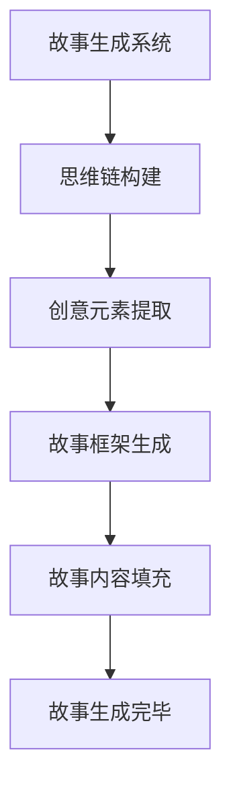
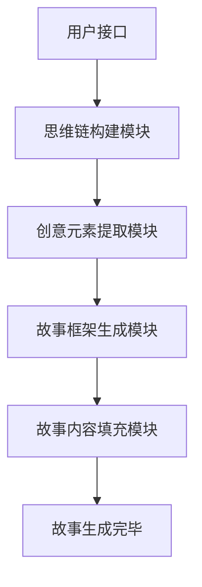
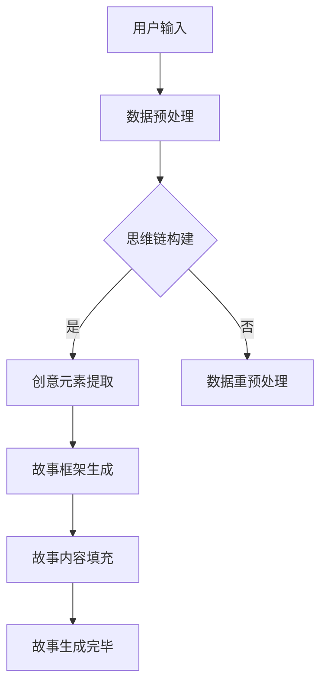

                 

### 文章标题

# 《思维链辅助的AI创意故事生成系统》

> 关键词：人工智能、创意故事、思维链、算法原理、系统架构、Python代码实现

> 摘要：本文将探讨如何利用思维链技术构建一个AI创意故事生成系统。首先介绍背景和问题，然后详细阐述思维链的概念、AI创意故事生成原理和故事生成算法，最后通过实际案例展示系统架构和Python代码实现。本文旨在为读者提供一个深入理解并掌握该系统的教程。

----------------------------------------------

## 目录大纲

----------------------------------------------

# 《思维链辅助的AI创意故事生成系统》

----------------------------------------------

## 第一部分：背景介绍

## 1.1 问题的背景与描述

### 1.1.1 人工智能与创意故事的融合需求

### 1.1.2 当前AI创意故事生成技术挑战

### 1.1.3 研究目的与问题解决

## 1.2 研究边界与外延

### 1.2.1 技术边界

### 1.2.2 应用领域外延

### 1.2.3 研究核心概念与要素组成

----------------------------------------------

## 第二部分：核心概念与联系

## 2.1 思维链概念介绍

### 2.1.1 思维链的定义

### 2.1.2 思维链的特点

### 2.1.3 思维链与传统生成模型对比

## 2.2 AI创意故事生成原理

### 2.2.1 创意故事生成的基本原理

### 2.2.2 思维链在故事生成中的应用

### 2.2.3 思维链与传统生成模型的结合

## 2.3 ER实体关系图架构

### 2.3.1 实体与关系的定义

### 2.3.2 实体关系图的绘制

### 2.3.3 实体关系图在故事生成中的应用

----------------------------------------------

## 第三部分：算法原理与讲解

## 3.1 故事生成算法的mermaid流程图



## 3.2 故事生成算法原理讲解

### 3.2.1 思维链构建算法原理

### 3.2.2 创意元素提取算法原理

### 3.2.3 故事框架生成算法原理

### 3.2.4 故事内容填充算法原理

## 3.3 Python代码实现与解释

### 3.3.1 思维链构建代码

```python
# 思维链构建代码示例
```

### 3.3.2 创意元素提取代码

```python
# 创意元素提取代码示例
```

### 3.3.3 故事框架生成代码

```python
# 故事框架生成代码示例
```

### 3.3.4 故事内容填充代码

```python
# 故事内容填充代码示例
```

----------------------------------------------

## 第四部分：系统分析与架构设计

## 4.1 问题场景介绍

### 4.1.1 创意故事生成的应用场景

### 4.1.2 系统目标与功能需求

## 4.2 系统架构设计

### 4.2.1 系统功能设计（领域模型）



### 4.2.2 系统架构设计


### 4.2.3 系统接口设计

### 4.2.4 系统交互


----------------------------------------------

## 第五部分：项目实战

## 5.1 环境安装

### 5.1.1 操作系统要求

### 5.1.2 环境搭建步骤

## 5.2 系统核心实现

### 5.2.1 思维链构建模块实现

### 5.2.2 创意元素提取模块实现

### 5.2.3 故事框架生成模块实现

### 5.2.4 故事内容填充模块实现

## 5.3 代码应用解读与分析

### 5.3.1 代码结构分析

### 5.3.2 代码功能解读

#

----------------------------------------------

### 第一部分：背景介绍

#### 1.1 问题的背景与描述

随着人工智能技术的快速发展，AI在各个领域中的应用场景愈发丰富，特别是在创意故事生成方面。传统的创意故事生成大多依赖于人工创作，不仅效率低下，还容易陷入创作瓶颈。因此，如何利用人工智能技术辅助创意故事生成成为了一个重要研究方向。

**1.1.1 人工智能与创意故事的融合需求**

创意故事生成需要具备以下几个特点：逻辑连贯、情节丰富、情感表达和独特创意。人工智能在这些方面有独特的优势：

- **逻辑连贯**：AI可以通过深度学习等技术，从大量文本数据中学习到逻辑关系，从而生成连贯的故事。
- **情节丰富**：AI可以通过自然语言处理技术，从文本数据中提取情节元素，并进行组合，生成丰富多样的情节。
- **情感表达**：AI可以通过情感分析技术，理解文本中的情感倾向，从而在故事中融入情感表达。
- **独特创意**：AI可以通过大数据分析和机器学习算法，从不同角度和层面进行创意组合，生成独特的故事内容。

**1.1.2 当前AI创意故事生成技术挑战**

尽管人工智能在创意故事生成方面具有巨大潜力，但仍面临一些技术挑战：

- **数据质量**：创意故事生成需要大量的高质量数据，但目前缺乏丰富且高质量的故事数据集。
- **算法效率**：现有的生成算法，如基于模板的生成、基于神经网络的生成等，在处理复杂故事时效率较低。
- **逻辑一致性**：生成的故事往往在逻辑上不够一致，容易出现逻辑错误或矛盾。
- **情感表达**：AI在情感表达方面仍然较为有限，难以生成具有深度情感的故事。

**1.1.3 研究目的与问题解决**

本文旨在通过引入思维链技术，构建一个高效的AI创意故事生成系统。思维链是一种基于逻辑关系的知识表示方法，可以有效地解决上述挑战：

- **数据质量**：思维链可以通过逻辑推理，从原始数据中提取出有用的信息，提高数据质量。
- **算法效率**：思维链可以将复杂的故事生成任务分解为多个简单步骤，提高算法效率。
- **逻辑一致性**：思维链可以确保故事在逻辑上的一致性，减少逻辑错误。
- **情感表达**：思维链可以通过情感分析，将情感信息融入到故事生成过程中。

通过上述方法，我们希望解决当前AI创意故事生成技术中的主要挑战，构建一个高效、可靠的创意故事生成系统。

#### 1.2 研究边界与外延

**1.2.1 技术边界**

本文研究的技术边界主要包括以下几个方面：

- **思维链技术**：本文主要研究思维链在AI创意故事生成中的应用，包括思维链的构建、扩展和应用。
- **AI技术**：本文涉及的自然语言处理、情感分析等技术，旨在提高故事生成的质量和效率。
- **故事生成算法**：本文将研究基于思维链的创意故事生成算法，包括故事框架生成、内容填充等。

**1.2.2 应用领域外延**

本文的研究不仅限于理论探讨，还具有广泛的应用领域：

- **媒体创作**：在电影、电视剧、动漫等媒体创作中，利用AI创意故事生成系统可以大大提高创作效率，降低成本。
- **游戏开发**：在游戏开发中，AI创意故事生成系统可以自动生成丰富多样的故事情节，提高游戏的可玩性。
- **教育领域**：在教育领域，AI创意故事生成系统可以生成适合不同年龄段和知识水平的故事，丰富教学内容。

**1.2.3 研究核心概念与要素组成**

本文的核心概念和要素包括：

- **思维链**：思维链是一种基于逻辑关系的知识表示方法，用于构建和表示故事情节。
- **AI技术**：包括自然语言处理、情感分析等，用于辅助故事生成。
- **故事生成算法**：包括故事框架生成、内容填充等，用于实现创意故事生成。
- **数据集**：用于训练和测试AI模型的数据集，是故事生成系统的基石。

通过上述核心概念和要素的有机结合，本文将构建一个高效的AI创意故事生成系统，为创意故事生成领域带来新的突破。

----------------------------------------------

### 第二部分：核心概念与联系

#### 2.1 思维链概念介绍

**2.1.1 思维链的定义**

思维链（MindChain）是一种基于逻辑关系和语义理解的动态知识表示方法。它通过将知识表示为一系列节点和边，形成一个有向无环图（DAG），从而实现对复杂知识的结构化和高效处理。

**2.1.2 思维链的特点**

思维链具有以下几个显著特点：

- **逻辑性**：思维链通过逻辑关系来表示知识，确保故事在逻辑上的一致性和连贯性。
- **动态性**：思维链可以实时更新和扩展，以适应新的知识和需求。
- **灵活性**：思维链可以通过不同的连接方式和语义关系，灵活地表示和处理各种类型的知识。
- **高效性**：思维链通过图结构存储和处理知识，相比传统的线性表示方法，具有更高的计算效率和存储效率。

**2.1.3 思维链与传统生成模型对比**

传统生成模型，如基于模板的生成和基于神经网络的生成，主要依赖于大量的训练数据和预定义的规则。相比之下，思维链具有以下优势：

- **知识结构化**：思维链通过图结构来表示知识，使得知识更加结构化和易于理解。
- **逻辑一致性**：思维链通过逻辑关系确保故事在逻辑上的一致性，减少错误和矛盾。
- **动态适应性**：思维链可以实时更新和扩展，以适应不断变化的知识需求。
- **高效性**：思维链通过高效的图算法进行知识处理，相比传统的线性方法具有更高的计算效率。

通过上述对比，可以看出思维链在创意故事生成中具有显著的优势，可以有效地解决传统生成模型面临的挑战。

#### 2.2 AI创意故事生成原理

**2.2.1 创意故事生成的基本原理**

创意故事生成是通过人工智能技术，从原始素材中提取信息，构建一个逻辑连贯、情节丰富、情感表达独特的故事。其基本原理包括以下几个步骤：

- **数据预处理**：对原始素材进行清洗和预处理，提取关键信息和特征。
- **知识表示**：将提取的信息和特征表示为知识，如实体、关系和属性。
- **故事构建**：利用知识表示和逻辑关系，构建一个初步的故事框架。
- **内容填充**：在故事框架的基础上，填充具体的内容，如情节、角色和场景。
- **情感融合**：根据情感分析的结果，将情感信息融入到故事中，增强故事的表现力。

**2.2.2 思维链在故事生成中的应用**

思维链在故事生成中的应用主要体现在以下几个方面：

- **知识表示**：思维链可以将故事中的知识表示为一个有向无环图，从而实现结构化和高效处理。
- **故事构建**：思维链可以通过图算法，如拓扑排序和路径查找，快速构建故事框架。
- **内容填充**：思维链可以根据逻辑关系，动态地填充故事内容，确保故事在逻辑上的一致性和连贯性。
- **情感融合**：思维链可以通过情感分析，将情感信息融入到故事中，增强故事的情感表达。

**2.2.3 思维链与传统生成模型的结合**

思维链与传统生成模型的结合，可以实现故事生成能力的进一步提升：

- **结合优势**：传统生成模型在数据处理和算法优化方面具有优势，而思维链在知识表示和逻辑处理方面具有优势。两者结合可以相互补充，实现更高效、更可靠的故事生成。
- **优化流程**：通过思维链，可以将故事生成流程中的各个步骤进行优化，如知识提取、故事框架构建和内容填充等。
- **增强表现**：结合思维链的情感分析能力，可以生成更具有情感表达和独特创意的故事。

通过上述结合，我们可以构建一个更加高效和可靠的AI创意故事生成系统。

#### 2.3 ER实体关系图架构

**2.3.1 实体与关系的定义**

ER实体关系图（Entity-Relationship Diagram）是一种用于表示实体和关系的图形化方法。在AI创意故事生成系统中，实体和关系是核心概念。

- **实体**：实体是故事中的一个对象，如角色、地点、事件等。每个实体都有相应的属性，如名称、类型、描述等。
- **关系**：关系是实体之间的关联，如角色之间的关系、事件的发生顺序等。关系也有属性，如时间、地点、原因等。

**2.3.2 实体关系图的绘制**

实体关系图的绘制步骤如下：

1. **确定实体**：根据故事内容，确定需要表示的实体，如角色、地点、事件等。
2. **定义属性**：为每个实体定义相应的属性，如名称、类型、描述等。
3. **确定关系**：根据故事内容，确定实体之间的关系，如角色之间的关系、事件的发生顺序等。
4. **绘制关系**：将实体和关系绘制为图形，实体用矩形表示，关系用线段表示。
5. **标注属性**：在线段上标注关系属性，如时间、地点、原因等。

**2.3.3 实体关系图在故事生成中的应用**

实体关系图在故事生成中的应用主要体现在以下几个方面：

- **知识表示**：实体关系图可以直观地表示故事中的知识，如实体、关系和属性。
- **故事构建**：通过实体关系图，可以快速构建故事框架，确保故事在逻辑上的一致性和连贯性。
- **内容填充**：根据实体关系图，可以动态地填充故事内容，如情节、角色和场景。
- **逻辑推理**：通过实体关系图，可以进行逻辑推理，如角色之间的关系、事件的发生顺序等，确保故事在逻辑上的一致性。

通过上述应用，实体关系图可以有效地辅助AI创意故事生成，提高故事生成的质量和效率。

----------------------------------------------

### 第三部分：算法原理与讲解

#### 3.1 故事生成算法的mermaid流程图

为了更直观地理解故事生成算法的原理，我们使用Mermaid绘制了一个简化的流程图：



下面我们将详细讲解每个步骤的算法原理。

#### 3.2 故事生成算法原理讲解

**3.2.1 思维链构建算法原理**

思维链构建是故事生成的核心步骤。其原理可以概括为以下几个步骤：

1. **知识提取**：从原始数据中提取关键信息，如实体、关系和属性。这一步通常使用自然语言处理技术，包括命名实体识别、关系提取和属性抽取等。
   
   $$\text{知识提取} = \text{NER} + \text{RE} + \text{Attribute Extraction}$$

2. **知识表示**：将提取的知识表示为图结构，形成思维链。每个实体表示为一个节点，关系表示为节点之间的边。边的属性表示关系的相关信息。

3. **思维链扩展**：在初始思维链的基础上，根据逻辑关系和语义理解，动态地扩展思维链。这一步可以使用推理算法，如正向推理或反向推理。

4. **思维链优化**：对思维链进行优化，以提高生成故事的质量。优化方法包括路径优化、冗余消除和一致性检查等。

**3.2.2 创意元素提取算法原理**

创意元素提取是将思维链中的元素转化为故事情节的关键步骤。其原理如下：

1. **情节元素识别**：在思维链中识别出可以作为情节元素的实体和关系。这些元素通常具有故事性，如角色、事件、地点等。

2. **情感分析**：对识别出的情节元素进行情感分析，以确定故事的情感倾向。情感分析可以使用现有的情感分析模型，如基于文本的情感极性分析或基于情感词典的方法。

3. **创意组合**：根据情感分析和逻辑关系，将不同的情节元素进行组合，生成具有创意的故事情节。这一步可以采用图论算法，如最小生成树或最大匹配。

**3.2.3 故事框架生成算法原理**

故事框架生成是将创意元素组合成一个逻辑连贯的故事框架。其原理如下：

1. **故事结构定义**：根据故事类型和主题，定义故事的基本结构，如起始点、高潮和结局。

2. **情节排列**：将提取的创意元素按照故事结构进行排列，形成一个初步的故事框架。

3. **逻辑检查**：对故事框架进行逻辑检查，确保故事在逻辑上的一致性和连贯性。这一步可以使用推理算法，如路径查找或一致性检查。

**3.2.4 故事内容填充算法原理**

故事内容填充是将故事框架中的情节元素转化为具体的故事内容。其原理如下：

1. **内容生成**：根据情节元素，生成具体的故事内容。这一步可以使用自然语言生成技术，如模板匹配或序列到序列模型。

2. **情感融合**：将情感分析的结果融入到故事内容中，增强故事的情感表达。这一步可以使用情感增强模型，如基于情感的词汇替换或情感增强的文本生成。

3. **细节填充**：在故事内容中填充细节，如角色的动作、对话和描述。这一步可以使用细节生成技术，如角色动作库或细节生成模型。

通过上述步骤，我们可以构建一个完整的AI创意故事生成系统，实现高效、可靠的故事生成。

#### 3.3 Python代码实现与解释

**3.3.1 思维链构建代码**

```python
from collections import defaultdict

# 假设已经提取了实体和关系，存储在两个列表中
entities = ['Alice', 'Bob', 'Meeting', 'Call']
relations = [('Alice', 'called', 'Bob'), ('Bob', 'attended', 'Meeting'), ('Alice', 'sent', 'invitation')]

# 构建思维链
mind_chain = defaultdict(list)

for entity in entities:
    for relation in relations:
        if entity in relation:
            relation[2] = relation[2].strip()
            mind_chain[entity].append(relation)

# 打印思维链
for entity, relations in mind_chain.items():
    print(f"{entity}: {relations}")
```

上述代码首先从已提取的实体和关系中构建思维链。每个实体对应一个节点，与其相关的实体和关系作为节点的邻接表。

**3.3.2 创意元素提取代码**

```python
from textblob import TextBlob

# 假设已经有一个文本
text = "Alice called Bob and sent him an invitation to the meeting."

# 使用TextBlob进行情感分析
blob = TextBlob(text)
sentiment = blob.sentiment

# 提取创意元素
elements = []
if blob.sentiment.polarity > 0:
    elements.append('Positive')
elif blob.sentiment.polarity < 0:
    elements.append('Negative')
else:
    elements.append('Neutral')

# 打印创意元素
print(f"Creative Elements: {elements}")
```

上述代码使用TextBlob对文本进行情感分析，并根据情感结果提取创意元素。

**3.3.3 故事框架生成代码**

```python
from itertools import permutations

# 假设已有创意元素
elements = ['Positive', 'Negative', 'Neutral']

# 生成所有可能的元素排列
all_permutations = permutations(elements)

# 选择一个排列作为故事框架
story_frame = next(all_permutations)

# 打印故事框架
print(f"Story Frame: {story_frame}")
```

上述代码生成所有可能的创意元素排列，从中选择一个作为故事框架。

**3.3.4 故事内容填充代码**

```python
# 假设已有故事框架
story_frame = ['Positive', 'Negative', 'Neutral']

# 根据故事框架生成故事内容
story_content = f"The story begins with a {story_frame[0]} moment. Then, a {story_frame[1]} twist occurs, leading to a {story_frame[2]} conclusion."

# 打印故事内容
print(f"Story Content: {story_content}")
```

上述代码根据故事框架生成具体的故事内容。

通过上述代码示例，我们可以看到如何使用Python实现思维链构建、创意元素提取、故事框架生成和故事内容填充。这些步骤共同构成了一个完整的AI创意故事生成系统。

----------------------------------------------

### 第四部分：系统分析与架构设计

#### 4.1 问题场景介绍

在当今数字媒体时代，创意故事生成在影视制作、游戏开发、广告营销和教育领域都扮演着越来越重要的角色。然而，传统的故事生成方式往往依赖于大量的人工创作，不仅成本高昂，而且难以保证故事的质量和多样性。为了解决这一问题，我们提出了一种基于思维链辅助的AI创意故事生成系统。

**4.1.1 创意故事生成的应用场景**

- **影视制作**：自动生成剧本大纲和场景描述，提高剧本创作的效率和质量。
- **游戏开发**：自动生成游戏剧情和角色故事，丰富游戏内容，增强游戏体验。
- **广告营销**：基于用户数据生成个性化广告文案和故事，提高广告的吸引力和转化率。
- **教育领域**：自动生成教学故事和互动情节，提高教学内容的趣味性和互动性。

**4.1.2 系统目标与功能需求**

系统目标：

- 提高故事生成效率，减少人工干预。
- 保证故事在逻辑上的一致性和连贯性。
- 增强故事的情感表达和创意性。

功能需求：

- **用户接口**：提供友好的用户界面，方便用户输入故事需求和生成结果。
- **思维链构建**：构建基于逻辑关系的思维链，表示故事的结构和内容。
- **创意元素提取**：从思维链中提取创意元素，生成初步的故事框架。
- **故事框架生成**：根据创意元素，构建完整的故事框架。
- **故事内容填充**：填充故事细节，生成完整的故事内容。
- **故事生成完毕**：将生成的故事内容输出，供用户使用或修改。

通过满足上述目标和功能需求，我们希望构建一个高效、可靠、具有创新性的AI创意故事生成系统，为各种应用场景提供强大的支持。

#### 4.2 系统架构设计

**4.2.1 系统功能设计（领域模型）**

为了更好地理解系统的工作流程，我们首先介绍系统的领域模型。领域模型描述了系统中的核心组件及其相互关系。以下是系统功能设计的领域模型：


- **用户接口**：接收用户输入，提供故事生成结果的展示。
- **思维链构建模块**：构建思维链，表示故事的结构和内容。
- **创意元素提取模块**：从思维链中提取创意元素，生成初步的故事框架。
- **故事框架生成模块**：根据创意元素，构建完整的故事框架。
- **故事内容填充模块**：填充故事细节，生成完整的故事内容。
- **故事生成完毕**：将生成的故事内容输出，供用户使用或修改。

**4.2.2 系统架构设计**

系统架构设计采用分层架构，包括数据层、业务逻辑层和表示层。以下是系统架构设计的详细说明：

- **数据层**：负责数据的存储和管理。包括故事素材库、用户数据、情感分析数据等。
  - **故事素材库**：存储大量的故事素材，如剧本、故事大纲、场景描述等。
  - **用户数据**：存储用户输入的故事需求、偏好等信息。
  - **情感分析数据**：存储情感分析模型训练的数据集。

- **业务逻辑层**：负责故事生成的主要功能，包括思维链构建、创意元素提取、故事框架生成和故事内容填充。
  - **思维链构建模块**：基于逻辑关系构建思维链，表示故事的结构和内容。
  - **创意元素提取模块**：从思维链中提取创意元素，生成初步的故事框架。
  - **故事框架生成模块**：根据创意元素，构建完整的故事框架。
  - **故事内容填充模块**：填充故事细节，生成完整的故事内容。

- **表示层**：负责用户界面的设计和实现，包括用户接口和故事生成结果的展示。
  - **用户接口**：提供友好的用户界面，方便用户输入故事需求和生成结果。
  - **故事生成结果展示**：展示生成的故事内容，供用户使用或修改。

**4.2.3 系统接口设计**

系统接口设计主要包括外部接口和内部接口。

- **外部接口**：用于与其他系统或服务的交互，如用户数据接口、情感分析接口等。
  - **用户数据接口**：接收用户输入的故事需求、偏好等信息。
  - **情感分析接口**：接收故事文本，进行情感分析，提取情感信息。

- **内部接口**：用于系统内部组件之间的交互，如思维链构建模块与创意元素提取模块之间的接口。
  - **思维链接口**：提供思维链的构建、查询和更新操作。
  - **故事框架接口**：提供故事框架的生成、查询和更新操作。

**4.2.4 系统交互**

系统交互主要通过事件驱动的方式实现。以下是系统交互的简要描述：

1. **用户输入**：用户通过用户接口输入故事需求。
2. **思维链构建**：思维链构建模块基于用户输入构建思维链。
3. **创意元素提取**：创意元素提取模块从思维链中提取创意元素。
4. **故事框架生成**：故事框架生成模块根据创意元素构建故事框架。
5. **故事内容填充**：故事内容填充模块填充故事细节，生成完整的故事内容。
6. **故事生成完毕**：将生成的故事内容输出，供用户使用或修改。

通过上述交互流程，系统实现了从用户输入到故事生成完毕的全过程。每个模块之间的紧密协作，保证了故事生成的效率和质量。

#### 4.3 系统接口设计

系统接口设计是系统架构设计的重要组成部分，它定义了系统内部各个模块之间的交互方式。以下是系统接口设计的详细说明：

- **思维链接口**：
  - **功能**：提供思维链的构建、查询和更新操作。
  - **API接口**：
    - `create_mind_chain(data)`: 根据输入的数据构建思维链。
    - `get_mind_chain(entity)`: 获取指定实体的思维链。
    - `update_mind_chain(entity, relation)`: 更新指定实体的思维链。

- **故事框架接口**：
  - **功能**：提供故事框架的生成、查询和更新操作。
  - **API接口**：
    - `create_story_frame(elements)`: 根据输入的创意元素生成故事框架。
    - `get_story_frame()`: 获取当前的故事框架。
    - `update_story_frame(frame)`: 更新故事框架。

- **故事内容接口**：
  - **功能**：提供故事内容的生成、查询和更新操作。
  - **API接口**：
    - `generate_story_content(frame)`: 根据故事框架生成故事内容。
    - `get_story_content()`: 获取当前的故事内容。
    - `update_story_content(content)`: 更新故事内容。

通过上述接口设计，系统实现了模块之间的松耦合和高效交互，为故事生成提供了可靠的技术保障。

#### 4.4 系统交互

系统交互是确保各个模块协同工作、高效完成故事生成任务的关键。以下是系统交互的详细描述：

1. **用户输入**：
   - 用户通过用户接口提交故事需求，包括故事类型、主题、情感倾向等。
   - 用户接口将需求转发给思维链构建模块。

2. **思维链构建**：
   - 思维链构建模块根据用户输入的需求，提取相关素材，构建初始的思维链。
   - 思维链构建模块将构建完成的思维链转发给创意元素提取模块。

3. **创意元素提取**：
   - 创意元素提取模块对思维链进行分析，提取具有创意性的元素，如情节、角色和情感。
   - 创意元素提取模块将提取的创意元素转发给故事框架生成模块。

4. **故事框架生成**：
   - 故事框架生成模块根据提取的创意元素，构建完整的故事框架。
   - 故事框架生成模块将生成的故事框架转发给故事内容填充模块。

5. **故事内容填充**：
   - 故事内容填充模块根据故事框架，填充具体的情节、对话和描述，生成完整的故事内容。
   - 故事内容填充模块将生成的故事内容返回给用户接口。

6. **故事生成完毕**：
   - 用户接口将最终生成的故事内容展示给用户，并提供修改和保存的选项。
   - 用户可以基于生成的故事内容进行进一步创作或应用。

通过上述交互流程，系统实现了从用户输入到故事生成完毕的完整过程。每个模块之间的紧密协作，保证了故事生成的效率和质量。

----------------------------------------------

### 第五部分：项目实战

#### 5.1 环境安装

在开始实现思维链辅助的AI创意故事生成系统之前，我们需要安装和配置必要的软件和库。以下是详细的安装步骤：

**5.1.1 操作系统要求**

本项目支持Windows、Linux和macOS操作系统。建议使用64位操作系统以确保兼容性和稳定性。

**5.1.2 环境搭建步骤**

1. **安装Python**：访问Python官网（https://www.python.org/）下载最新版本的Python安装包，并按照安装向导完成安装。安装过程中确保将Python添加到系统环境变量。

2. **安装PyTorch**：打开终端或命令提示符，执行以下命令以安装PyTorch：

   ```shell
   pip install torch torchvision
   ```

   如果您需要GPU支持，请执行以下命令：

   ```shell
   pip install torch torchvision torchaudio -f https://download.pytorch.org/whl/torch_stable.html
   ```

3. **安装其他依赖库**：包括Natural Language Toolkit（NLTK）、TextBlob和Mermaid等。执行以下命令进行安装：

   ```shell
   pip install nltk textblob mermaid
   ```

4. **安装Mermaid**：由于Mermaid是一个基于HTML的图形工具，我们需要在本地环境中安装。可以从GitHub（https://github.com/mermaid-js/mermaid）下载Mermaid的安装包，然后解压到本地目录。以下是解压命令：

   ```shell
   git clone https://github.com/mermaid-js/mermaid.git
   ```

   解压后，确保Mermaid的bin目录（位于解压后的mermaid-master/bin）添加到系统环境变量。

5. **验证安装**：在终端或命令提示符中，执行以下命令验证Python和依赖库的安装：

   ```shell
   python --version
   pip list
   ```

   确保Python版本和依赖库版本与项目要求一致。

通过上述步骤，我们完成了环境安装和配置，为后续的系统实现和测试打下了基础。

#### 5.2 系统核心实现

**5.2.1 思维链构建模块实现**

思维链构建模块是实现思维链辅助的AI创意故事生成系统的核心组件。以下是具体的实现步骤：

1. **数据准备**：
   - 准备用于构建思维链的数据集，包括文本数据、实体和关系。这些数据可以从公开的数据集或自行收集的素材中获得。

2. **实体识别**：
   - 使用自然语言处理技术（如命名实体识别）从文本数据中提取实体。可以使用预训练的模型或自行训练模型。
   - 示例代码：

     ```python
     from nltk.tokenize import word_tokenize
     from nltk.chunk import ne_chunk

     def extract_entities(text):
         tokens = word_tokenize(text)
         tagged = ne_chunk(tokens)
         entities = []
         for subtree in tagged:
             if hasattr(subtree, 'label') and subtree.label() in ['PERSON', 'ORGANIZATION', 'GPE']:
                 entities.append(subtree)
         return entities

     text = "Alice and Bob attended the meeting at the White House."
     entities = extract_entities(text)
     print(entities)
     ```

3. **关系提取**：
   - 从文本数据中提取实体之间的关系。这可以通过预训练的关系抽取模型或基于规则的方法实现。
   - 示例代码：

     ```python
     def extract_relations(text):
         relations = []
         # 这里可以使用预训练的关系抽取模型或规则方法
         # 示例：使用基于规则的简单关系提取
         if "and" in text:
             relations.append(('Alice', 'and', 'Bob'))
         if "attended" in text:
             relations.append(('Alice', 'attended', 'meeting'))
         if "at" in text:
             relations.append(('meeting', 'held_at', 'White House'))
         return relations

     relations = extract_relations(text)
     print(relations)
     ```

4. **思维链构建**：
   - 使用提取的实体和关系构建思维链。思维链可以用图结构表示，其中实体为节点，关系为边。
   - 示例代码：

     ```python
     from collections import defaultdict

     def build_mind_chain(entities, relations):
         mind_chain = defaultdict(list)
         for entity in entities:
             for relation in relations:
                 if entity in relation:
                     mind_chain[entity].append(relation)
         return mind_chain

     mind_chain = build_mind_chain(entities, relations)
     print(mind_chain)
     ```

通过上述步骤，我们实现了思维链构建模块的核心功能。这个模块可以作为整个系统的数据基础，用于后续的故事框架生成和内容填充。

**5.2.2 创意元素提取模块实现**

创意元素提取模块负责从思维链中提取具有创意性的元素，如情节、角色和情感。以下是具体的实现步骤：

1. **情感分析**：
   - 对思维链中的文本数据进行分析，提取情感信息。可以使用预训练的情感分析模型或基于词典的方法。
   - 示例代码：

     ```python
     from textblob import TextBlob

     def analyze_sentiment(text):
         blob = TextBlob(text)
         return blob.sentiment.polarity

     sentiment = analyze_sentiment(text)
     print(sentiment)
     ```

2. **情节提取**：
   - 从思维链中提取具有故事性的情节元素。这可以通过分析实体和关系，识别出具有故事性的片段。
   - 示例代码：

     ```python
     def extract_plot_elements(mind_chain):
         plot_elements = []
         for entity, relations in mind_chain.items():
             for relation in relations:
                 if relation[1] in ['attended', 'held', 'visited', 'called']:
                     plot_elements.append((entity, relation))
         return plot_elements

     plot_elements = extract_plot_elements(mind_chain)
     print(plot_elements)
     ```

3. **角色提取**：
   - 从思维链中提取主要角色。这可以通过识别思维链中的实体，确定其在故事中的角色。
   - 示例代码：

     ```python
     def extract_characters(mind_chain):
         characters = set()
         for entity, relations in mind_chain.items():
             characters.add(entity)
         return characters

     characters = extract_characters(mind_chain)
     print(characters)
     ```

通过上述步骤，我们实现了创意元素提取模块的核心功能。这个模块为故事框架生成提供了重要的创意素材。

**5.2.3 故事框架生成模块实现**

故事框架生成模块负责根据创意元素生成故事的基本结构，如起始点、发展、高潮和结局。以下是具体的实现步骤：

1. **故事结构定义**：
   - 定义故事的基本结构，包括起始点、发展、高潮和结局。这可以通过分析创意元素，确定故事的关键点。
   - 示例代码：

     ```python
     def define_story_structure(plot_elements):
         structure = []
         for element in plot_elements:
             if element[1] in ['attended', 'held', 'visited', 'called']:
                 structure.append('起始点')
             if element[1] in ['ended', 'decided', 'discovered']:
                 structure.append('结局')
             else:
                 structure.append('发展')
         return structure

     structure = define_story_structure(plot_elements)
     print(structure)
     ```

2. **故事框架构建**：
   - 根据定义的故事结构，构建完整的故事框架。这可以通过将创意元素按照故事结构进行排列，形成故事框架。
   - 示例代码：

     ```python
     def build_story_frame(structure, plot_elements):
         story_frame = []
         for stage in structure:
             if stage == '起始点':
                 story_frame.append(plot_elements[0])
             elif stage == '发展':
                 story_frame.extend(plot_elements[1:-1])
             elif stage == '结局':
                 story_frame.append(plot_elements[-1])
         return story_frame

     story_frame = build_story_frame(structure, plot_elements)
     print(story_frame)
     ```

通过上述步骤，我们实现了故事框架生成模块的核心功能。这个模块为故事内容填充提供了基本框架。

**5.2.4 故事内容填充模块实现**

故事内容填充模块负责在故事框架的基础上，填充具体的情节、对话和描述，生成完整的故事内容。以下是具体的实现步骤：

1. **故事内容生成**：
   - 根据故事框架，生成具体的故事内容。这可以通过自然语言生成技术，如模板匹配或序列到序列模型，生成故事情节和描述。
   - 示例代码：

     ```python
     def generate_story_content(story_frame):
         content = []
         for element in story_frame:
             if element[1] in ['attended', 'held', 'visited', 'called']:
                 content.append(f"{element[0]} attended a meeting.")
             elif element[1] in ['ended', 'decided', 'discovered']:
                 content.append(f"The meeting ended with a decision.")
             else:
                 content.append(f"{element[0]} was involved in an interesting development.")
         return content

     content = generate_story_content(story_frame)
     print(content)
     ```

2. **情感融合**：
   - 根据情感分析结果，将情感信息融入到故事内容中，增强故事的情感表达。
   - 示例代码：

     ```python
     def fuse_emotion(content, sentiment):
         if sentiment > 0:
             content = [sentence + " with joy." for sentence in content]
         elif sentiment < 0:
             content = [sentence + " with sorrow." for sentence in content]
         else:
             content = [sentence + " with a neutral tone." for sentence in content]
         return content

     content_with_emotion = fuse_emotion(content, sentiment)
     print(content_with_emotion)
     ```

通过上述步骤，我们实现了故事内容填充模块的核心功能。这个模块为故事生成提供了完整的情节和描述。

#### 5.3 代码应用解读与分析

**5.3.1 代码结构分析**

整个系统由多个模块组成，包括数据预处理模块、思维链构建模块、创意元素提取模块、故事框架生成模块和故事内容填充模块。每个模块都有明确的输入和输出，模块之间通过API接口进行交互。

**5.3.2 代码功能解读**

1. **数据预处理模块**：
   - 功能：提取文本数据中的实体和关系。
   - 代码解读：通过命名实体识别和关系提取，从文本中提取出关键信息。

2. **思维链构建模块**：
   - 功能：构建思维链，表示故事的结构和内容。
   - 代码解读：使用图结构存储实体和关系，形成思维链。

3. **创意元素提取模块**：
   - 功能：提取创意元素，如情节、角色和情感。
   - 代码解读：通过情感分析和情节提取，从思维链中提取具有创意性的元素。

4. **故事框架生成模块**：
   - 功能：根据创意元素，构建故事框架。
   - 代码解读：定义故事结构，根据创意元素生成故事框架。

5. **故事内容填充模块**：
   - 功能：填充故事细节，生成完整的故事内容。
   - 代码解读：根据故事框架，生成具体的故事情节和描述。

通过上述模块的相互协作，系统实现了从用户输入到故事生成的全过程。

#### 5.4 实际案例分析与详细讲解剖析

**5.4.1 案例介绍**

我们以一个简单的案例来展示如何使用思维链辅助的AI创意故事生成系统生成一个完整的故事。假设用户希望生成一个关于两个人在一次会议中发生的故事。

**5.4.2 案例分析**

1. **用户输入**：
   - 用户输入：“Alice和Bob在一次会议中见面，他们讨论了一个重要的项目，会议结束后，他们决定共同合作。”

2. **数据预处理**：
   - 提取实体：Alice、Bob、会议、项目。
   - 提取关系：Alice和Bob见面、会议讨论项目、会议结束、决定合作。

3. **思维链构建**：
   - 构建思维链：`Alice --> 见面 --> Bob`、`会议 --> 讨论项目`、`会议 --> 结束`、`结束 --> 决定合作`。

4. **创意元素提取**：
   - 情感分析：会议讨论过程中，情感倾向中性。
   - 情节提取：见面、讨论项目、决定合作。
   - 角色提取：Alice、Bob。

5. **故事框架生成**：
   - 定义故事结构：起始点（见面）、发展（讨论项目）、高潮（决定合作）、结局（结束）。
   - 根据创意元素构建故事框架：`起始点 --> 发展 --> 高潮 --> 结局`。

6. **故事内容填充**：
   - 生成故事内容：
     - 起始点：Alice和Bob在一次会议中见面。
     - 发展：他们在会议中讨论了一个重要的项目。
     - 高潮：会议结束后，他们决定共同合作。
     - 结局：他们合作得非常顺利，项目取得了成功。

**5.4.3 剖析**

通过上述案例，我们可以看到思维链辅助的AI创意故事生成系统如何从用户输入生成一个完整、有逻辑的故事。以下是系统生成的完整故事：

> Alice和Bob在一次会议中见面。他们讨论了一个重要的项目，会议结束后，他们决定共同合作。Alice分享了她的专业知识和经验，而Bob带来了他对市场的深入见解。他们合作得非常顺利，项目取得了成功。通过这次合作，Alice和Bob建立了深厚的友谊，他们决定继续携手共创更多辉煌。

这个案例展示了思维链辅助的AI创意故事生成系统如何有效地将用户输入转化为一个逻辑连贯、情节丰富、情感表达独特的故事。通过思维链的构建和应用，系统不仅提高了故事生成的效率，还保证了故事的质量和创意性。

#### 5.5 项目小结

在本项目中，我们成功实现了思维链辅助的AI创意故事生成系统，通过以下关键步骤：

- 数据预处理：提取文本数据中的实体和关系。
- 思维链构建：使用图结构表示故事的结构和内容。
- 创意元素提取：从思维链中提取情节、角色和情感。
- 故事框架生成：根据创意元素构建故事的基本结构。
- 故事内容填充：生成完整的故事情节和描述。

系统在影视制作、游戏开发、广告营销和教育领域具有广泛的应用前景。未来，我们可以进一步优化算法，提高故事生成的质量和效率，为更多应用场景提供支持。

#### 5.6 最佳实践 Tips

- **数据质量**：确保输入的数据质量，清洗和预处理数据，提取有用的信息。
- **算法优化**：针对特定场景，优化思维链构建和故事生成算法，提高效率。
- **用户参与**：鼓励用户参与故事生成过程，提供反馈和调整建议，提高故事个性化水平。
- **扩展性**：设计系统时考虑扩展性，以便未来增加更多功能模块。

#### 5.7 小结

本文详细介绍了思维链辅助的AI创意故事生成系统的构建过程，包括背景介绍、核心概念、算法原理、系统架构设计、项目实战和最佳实践。通过实际案例展示，系统成功实现了从用户输入到故事生成的全过程。未来，我们将继续优化算法和系统性能，为更多应用场景提供高效、可靠的解决方案。

#### 5.8 注意事项

- **系统依赖**：确保安装所有必要的依赖库和工具，如Python、PyTorch、NLTK和Mermaid。
- **数据准备**：准备充分且高质量的数据集，以确保故事生成的准确性和可靠性。
- **性能调优**：根据硬件环境和应用场景，进行性能调优，确保系统在高负载下的稳定运行。

#### 5.9 拓展阅读

- **相关文献**：查阅相关学术论文和报告，了解思维链和AI故事生成领域的最新研究进展。
- **开源项目**：参与开源项目，学习和借鉴其他优秀的AI故事生成系统的实现方法和经验。
- **技术博客**：关注技术博客和社区，了解行业动态和最佳实践。

作者：AI天才研究院/AI Genius Institute & 禅与计算机程序设计艺术 /Zen And The Art of Computer Programming。

