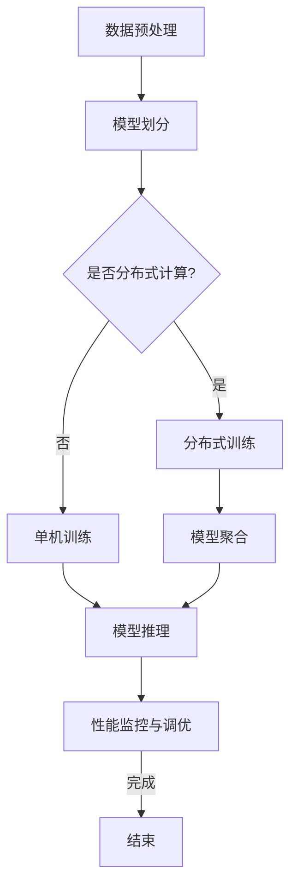
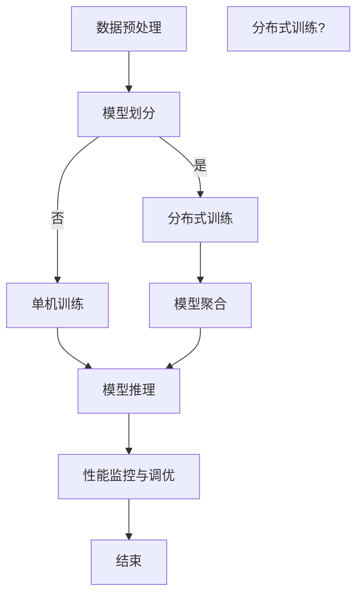
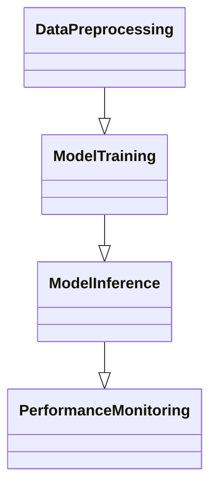
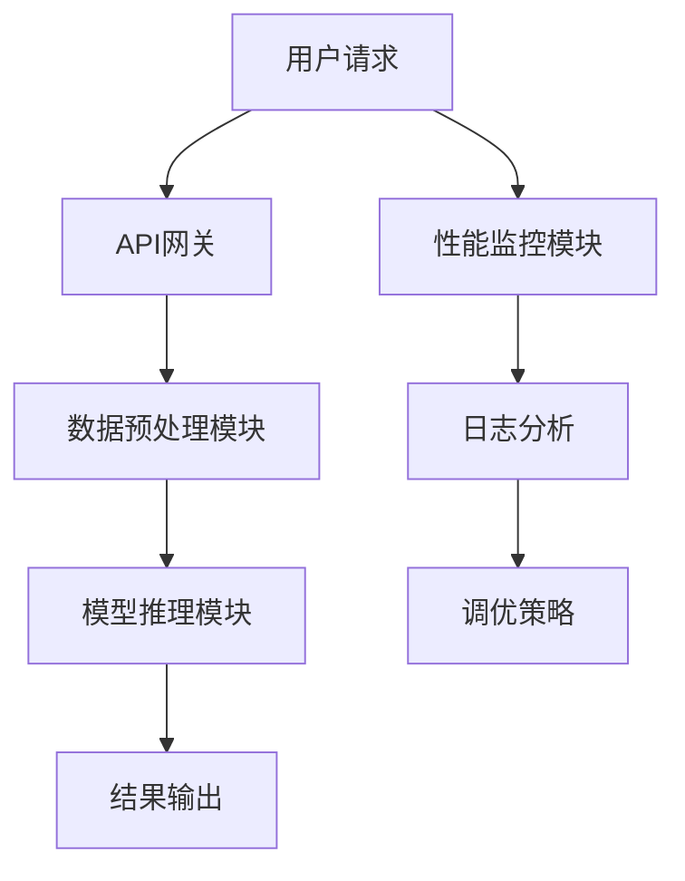
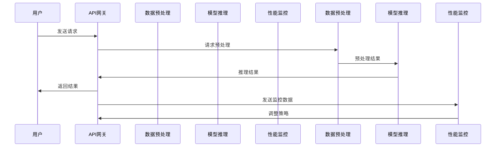
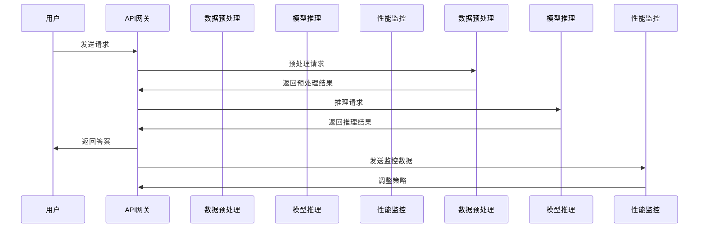

                 

### 第1章： 引言与背景介绍

#### 1.1 问题背景

随着深度学习和人工智能技术的飞速发展，大型语言模型（LLM, Large Language Model）如BERT、GPT-3等已经成为自然语言处理（NLP）领域的重要工具。这些模型具有强大的文本理解和生成能力，为各类应用场景提供了强大的支持，从问答系统到自动写作、机器翻译等。然而，随着模型规模不断扩大，性能瓶颈和计算资源消耗问题逐渐显现，如何在保证模型质量的前提下，优化LLM应用架构的性能，成为当前研究的热点问题。

##### 1.1.1 大模型发展的现状

近年来，随着计算能力和数据资源的提升，大模型的规模和复杂性不断增加。例如，GPT-3模型拥有1750亿个参数，具有超过130万亿个Tokens的预训练数据量。这些大模型的训练和部署带来了显著的计算和存储需求，同时对网络带宽和硬件性能也提出了更高要求。大规模模型的快速发展，为人工智能应用带来了前所未有的机会，但也带来了相应的挑战。

##### 1.1.2 大模型性能瓶颈的挑战

首先，模型的训练时间显著增加。大规模模型需要进行数十亿甚至数千亿次的迭代，训练时间从几天甚至数周不等。其次，模型在推理阶段的速度也成为瓶颈，由于模型参数众多，导致推理时间过长，无法满足实时应用的需求。此外，模型的计算资源需求也越来越高，对硬件设备和电力供应提出了挑战。最后，存储需求也是一个重要问题，大型模型的参数和数据存储需要大量的存储空间，尤其是在进行模型迭代和优化时。

##### 1.1.3 性能优化策略的重要性

面对大模型性能瓶颈的挑战，性能优化策略显得尤为重要。有效的性能优化不仅可以显著缩短模型训练和推理时间，降低计算资源消耗，还能提高系统的可扩展性和稳定性。此外，性能优化还可以帮助提升用户体验，满足实时性需求，从而推动人工智能应用的广泛落地。因此，深入研究性能优化策略，对于促进人工智能技术的发展具有重要意义。

#### 1.2 问题描述

##### 1.2.1 性能优化的关键要素

在进行LLM应用架构的性能优化时，需要考虑以下几个关键要素：

1. **计算资源利用**：优化模型计算，提高CPU、GPU等硬件资源的利用率。
2. **数据流管理**：优化数据输入和输出，减少数据传输延迟和瓶颈。
3. **存储优化**：优化数据存储和模型参数管理，减少存储空间需求和访问延迟。
4. **模型结构优化**：通过模型剪枝、量化等手段，减少模型参数数量，提高推理速度。
5. **并行和分布式计算**：利用并行计算和分布式计算技术，提高模型训练和推理的效率。

##### 1.2.2 目标与期望效果

性能优化的目标是在不牺牲模型质量的前提下，提高LLM应用的运行效率，具体包括：

1. **缩短训练时间**：通过优化算法和数据流，减少模型训练所需的时间。
2. **提升推理速度**：通过优化模型结构和计算资源分配，提高模型推理速度，满足实时应用需求。
3. **降低计算资源消耗**：通过优化硬件资源的利用，降低模型训练和推理的能耗。
4. **提高系统可扩展性**：通过分布式计算和并行处理技术，提高系统处理大规模数据的能力。
5. **提升用户体验**：通过提高模型运行效率，提高系统响应速度，提升用户体验。

##### 1.2.3 性能优化的边界与限制

虽然性能优化策略可以显著提高LLM应用架构的性能，但仍然存在一些边界和限制：

1. **模型质量与性能的权衡**：性能优化可能会对模型质量产生一定影响，需要在性能和质量之间找到平衡点。
2. **计算资源限制**：硬件资源的有限性限制了性能优化的空间，特别是在大型模型训练和推理时。
3. **复杂性和可维护性**：复杂的优化策略可能会增加系统的复杂性和维护难度，需要权衡优化的复杂性和实际效果。
4. **数据依赖**：性能优化依赖于高质量的数据，数据质量和数据量直接影响性能优化的效果。

#### 1.3 问题解决

##### 1.3.1 性能优化策略的核心概念

性能优化策略的核心概念包括以下几个方面：

1. **并行计算**：通过将计算任务分解为多个子任务，同时利用多个计算资源进行执行，提高计算效率。
2. **分布式计算**：通过将计算任务分布在多个节点上，利用网络通信进行协调，实现大规模数据的处理。
3. **模型剪枝**：通过减少模型参数的数量，去除冗余的信息，降低模型的复杂度和计算量。
4. **量化**：通过将模型参数的精度降低，减少模型的计算量和存储需求。
5. **数据预处理**：通过优化数据输入和输出的方式，减少数据传输延迟和瓶颈，提高数据处理效率。

##### 1.3.2 传统性能优化方法

传统性能优化方法主要包括以下几个方面：

1. **模型并行**：将模型分解为多个部分，分别在不同的计算资源上执行，适用于大规模模型的训练和推理。
2. **数据并行**：将数据集划分为多个子集，分别在不同的计算资源上训练模型，适用于大规模模型的分布式训练。
3. **混合并行**：结合模型并行和数据并行，利用多种并行策略，提高大规模模型的训练和推理效率。
4. **硬件优化**：优化硬件设备的使用，提高CPU、GPU等硬件资源的利用率，降低计算延迟。

##### 1.3.3 创新的性能优化策略

随着人工智能技术的发展，创新的性能优化策略不断涌现，主要包括以下几个方面：

1. **动态调整**：根据模型训练和推理的实际需求，动态调整计算资源和数据流，实现高效的资源利用。
2. **自适应优化**：根据模型的复杂度和数据特性，自适应地调整优化策略，提高模型训练和推理的效率。
3. **高效通信**：优化网络通信机制，提高分布式计算中的数据传输效率，减少通信延迟。
4. **模型压缩**：通过模型压缩技术，降低模型参数的数量，减少模型的计算量和存储需求。
5. **迁移学习**：利用迁移学习技术，将已有模型的优化策略应用于新模型，提高新模型的性能和效率。

##### 1.4 边界与外延

##### 1.4.1 性能优化策略的适用范围

性能优化策略的适用范围包括以下几个方面：

1. **大模型训练和推理**：适用于大规模语言模型的训练和推理，能够显著提高模型运行效率。
2. **分布式系统**：适用于分布式计算系统，能够提高系统处理大规模数据的能力和效率。
3. **实时应用**：适用于实时应用场景，能够满足实时响应的需求。
4. **资源受限环境**：适用于资源受限的环境，能够提高硬件资源的利用效率。

##### 1.4.2 性能优化与模型质量的关系

性能优化与模型质量之间存在一定的关系：

1. **正向关系**：通过优化算法和结构，提高模型的运行效率，同时保持或提高模型的质量。
2. **负向关系**：在某些情况下，过于激进的优化策略可能会对模型质量产生负面影响，需要平衡性能和质量。
3. **动态平衡**：在实际应用中，需要根据具体情况动态调整性能优化策略，以实现性能和质量的最佳平衡。

##### 1.4.3 性能优化策略的影响因素

影响性能优化策略效果的因素包括：

1. **模型大小和复杂度**：不同规模的模型对性能优化的需求不同，需要根据模型特点选择合适的优化策略。
2. **硬件资源**：计算资源和存储资源对性能优化策略的实施具有重要影响。
3. **数据质量**：高质量的数据有助于优化策略的有效实施，数据质量和数据量直接影响性能优化的效果。
4. **应用场景**：不同的应用场景对性能优化策略的需求不同，需要根据应用场景特点进行优化。

#### 1.5 本章小结

本章介绍了性能优化策略在LLM应用架构中的重要性，包括大模型发展的现状、性能瓶颈的挑战以及性能优化策略的核心概念和方法。同时，本章也明确了性能优化的关键要素、目标与期望效果，并讨论了性能优化的边界与限制。通过本章的介绍，为后续章节的深入探讨提供了基础。

----------------------------------------------------------------

## 第2章: LLM应用架构概述

#### 2.1 LLM应用架构的定义

大型语言模型（LLM, Large Language Model）的应用架构是指为了实现特定语言处理任务而设计的一系列模块和组件的集合。这些模块和组件通过特定的接口和协议相互连接和通信，共同构成一个完整的LLM应用系统。LLM应用架构的设计目标是提高模型训练和推理的效率，优化资源利用，并保证系统的稳定性和可扩展性。

##### 2.1.1 LLM的架构要素

LLM应用架构的主要要素包括：

1. **数据预处理模块**：负责处理原始数据，包括数据清洗、编码、分词等，为模型训练提供高质量的输入数据。
2. **模型训练模块**：负责使用预处理后的数据对语言模型进行训练，包括数据加载、模型优化、参数更新等。
3. **模型推理与部署模块**：负责将训练好的模型部署到生产环境，并提供推理服务，用于生成文本或执行特定任务。
4. **性能监控与调优模块**：负责监控系统性能，根据实时数据调整优化策略，确保系统在高负载下稳定运行。

##### 2.1.2 LLM架构的基本模式

LLM应用架构的基本模式通常包括以下几个步骤：

1. **数据收集与预处理**：从不同的数据源收集原始文本数据，并使用数据预处理模块对数据进行清洗、编码和分词等处理。
2. **模型训练**：将预处理后的数据输入到训练模块，通过迭代优化算法训练出语言模型。
3. **模型评估与调整**：在训练过程中，使用验证集对模型进行评估，并根据评估结果调整模型参数，以提高模型质量。
4. **模型推理与部署**：将训练好的模型部署到生产环境中，接受用户输入，生成文本或执行特定任务。
5. **性能监控与调优**：监控系统性能，根据监控数据调整优化策略，确保系统在高负载下保持稳定运行。

##### 2.1.3 LLM架构的设计原则

LLM应用架构的设计需要遵循以下原则：

1. **模块化设计**：将整个系统划分为多个功能模块，每个模块具有明确的功能和职责，便于系统扩展和维护。
2. **分布式计算**：利用分布式计算技术，提高系统处理大规模数据的能力，确保系统的高可用性和高可靠性。
3. **高效通信**：优化网络通信机制，确保模块之间的数据传输高效、可靠。
4. **可扩展性**：设计系统时考虑未来的扩展需求，确保系统在处理数据量和用户量增长时能够平稳扩展。
5. **性能优化**：在系统设计阶段考虑性能优化，通过优化算法和结构提高系统运行效率。

#### 2.2 LLM应用架构的核心模块

##### 2.2.1 数据预处理模块

数据预处理模块是LLM应用架构的核心模块之一，主要负责对原始数据进行处理，确保数据的质量和一致性。具体任务包括：

1. **数据清洗**：去除原始数据中的噪声和异常值，如删除停用词、修正拼写错误等。
2. **编码与分词**：将文本数据转换为模型可处理的格式，如将文本编码为单词或字符序列，并进行分词处理。
3. **数据归一化**：对数据特征进行归一化处理，如对文本长度进行裁剪或填充，以提高模型训练的稳定性。
4. **数据增强**：通过生成新的训练数据，如数据扩充、数据变换等，提高模型的泛化能力。

##### 2.2.2 模型训练模块

模型训练模块是LLM应用架构中的关键模块，负责使用预处理后的数据训练语言模型。具体任务包括：

1. **数据加载**：从数据预处理模块获取预处理后的数据，并将其输入到模型中。
2. **模型初始化**：初始化模型参数，为模型训练奠定基础。
3. **模型优化**：通过优化算法，如梯度下降、Adam等，调整模型参数，以最小化损失函数。
4. **参数更新**：根据优化算法的反馈，更新模型参数，以提高模型质量。
5. **模型评估**：在训练过程中，使用验证集对模型进行评估，根据评估结果调整模型参数。

##### 2.2.3 模型推理与部署模块

模型推理与部署模块是LLM应用架构的最终环节，负责将训练好的模型部署到生产环境中，并提供推理服务。具体任务包括：

1. **模型部署**：将训练好的模型转换为推理格式，并将其部署到生产环境，如云服务器、边缘设备等。
2. **推理服务**：接受用户输入，将输入文本输入到模型中进行推理，生成输出文本。
3. **性能优化**：通过优化推理算法和结构，提高模型推理速度，满足实时性需求。
4. **安全性保障**：确保模型部署过程中的数据安全和隐私保护，如加密传输、访问控制等。

##### 2.2.4 性能监控与调优模块

性能监控与调优模块负责监控系统性能，并根据实时数据调整优化策略，以确保系统在高负载下稳定运行。具体任务包括：

1. **性能监控**：实时监控系统性能指标，如响应时间、吞吐量、资源利用率等，及时发现性能瓶颈。
2. **调优策略**：根据监控数据，动态调整优化策略，如调整模型参数、优化数据流等。
3. **日志分析**：分析系统日志，识别潜在问题和异常情况，并采取相应的措施。
4. **故障处理**：在发生故障时，及时进行故障诊断和恢复，确保系统正常运行。

#### 2.3 LLM应用架构的挑战与机遇

##### 2.3.1 挑战

随着LLM应用的普及，LLM应用架构面临着一系列挑战：

1. **大规模数据处理**：随着数据量的增长，如何高效地处理大规模数据成为关键挑战。
2. **计算资源限制**：硬件资源的有限性对LLM应用的性能和扩展性提出了限制。
3. **模型质量保障**：在性能优化的同时，如何保证模型质量是一个重要问题。
4. **分布式计算**：分布式计算中的通信延迟和数据一致性问题需要解决。
5. **安全性与隐私保护**：在模型部署过程中，如何保障数据安全和用户隐私是一个关键挑战。

##### 2.3.2 机遇

尽管面临挑战，LLM应用架构也带来了许多机遇：

1. **高性能计算**：高性能计算技术的发展为LLM应用提供了更多的可能性。
2. **边缘计算**：边缘计算的发展为LLM应用在边缘设备上的部署提供了新的机会。
3. **数据挖掘与智能分析**：大规模数据处理能力的提升，为数据挖掘和智能分析提供了更丰富的数据源。
4. **跨领域应用**：LLM在各个领域的应用逐渐深入，为不同场景提供了创新的解决方案。
5. **生态体系建设**：随着LLM应用的发展，相关技术和服务体系也在不断完善。

##### 2.3.3 架构演进方向

随着人工智能技术的不断发展，LLM应用架构也在不断演进：

1. **云计算与边缘计算结合**：将云计算和边缘计算相结合，实现分布式计算，提高系统性能和可扩展性。
2. **自适应优化**：引入自适应优化策略，根据实时数据动态调整系统配置和优化策略。
3. **模型压缩与量化**：通过模型压缩和量化技术，降低模型参数数量和计算量，提高推理速度。
4. **分布式训练与推理**：利用分布式计算技术，提高大规模模型的训练和推理效率。
5. **多模态数据处理**：扩展LLM应用架构，支持多模态数据的处理和分析，实现更丰富的应用场景。

#### 2.4 本章小结

本章介绍了LLM应用架构的定义、要素和基本模式，并详细阐述了数据预处理模块、模型训练模块、模型推理与部署模块以及性能监控与调优模块的功能和设计原则。同时，本章也讨论了LLM应用架构面临的挑战和机遇，以及未来的演进方向。通过本章的介绍，为后续章节的深入探讨提供了基础。

----------------------------------------------------------------

## 第3章：核心概念与联系

### 3.1 性能优化策略的核心概念

#### 3.1.1 性能指标

在性能优化策略中，性能指标是衡量系统性能的重要工具。常见的性能指标包括：

1. **响应时间**：系统从接收请求到返回结果所需的时间。
2. **吞吐量**：单位时间内系统能处理的请求数量。
3. **资源利用率**：系统使用计算资源（如CPU、GPU、内存）的百分比。
4. **延迟**：从请求提交到响应返回的时间间隔。
5. **并发处理能力**：系统能同时处理请求的数量。

这些指标有助于评估系统的性能，并为性能优化提供依据。

#### 3.1.2 优化目标

性能优化的目标主要包括：

1. **提高响应时间**：通过减少系统延迟，提高用户满意度。
2. **提升吞吐量**：通过优化资源利用和算法，提高系统处理能力。
3. **降低资源消耗**：通过减少计算资源的使用，降低运营成本。
4. **提高系统可扩展性**：确保系统在数据量和用户量增长时，仍能保持高效运行。
5. **提升用户体验**：通过优化系统性能，提高用户在使用过程中的体验。

#### 3.1.3 优化方法

性能优化的方法多种多样，主要包括以下几种：

1. **算法优化**：通过改进算法，减少计算复杂度和资源消耗。
2. **硬件优化**：通过升级硬件设备，提高计算性能。
3. **数据优化**：通过优化数据结构和存储方式，减少数据访问延迟。
4. **并行与分布式计算**：通过并行和分布式计算技术，提高数据处理速度。
5. **模型压缩与量化**：通过减少模型参数数量和计算精度，降低模型大小和计算量。

### 3.2 性能优化策略的属性特征对比表格

#### 3.2.1 性能优化方法的比较

以下是一个性能优化方法的属性特征对比表格：

| 性能优化方法 | 描述 | 适用场景 | 优点 | 缺点 |
| :--: | :--: | :--: | :--: | :--: |
| 算法优化 | 改进算法，降低计算复杂度 | 大规模数据处理、实时应用 | 提高效率，降低资源消耗 | 可能影响模型质量 |
| 硬件优化 | 升级硬件设备，提高计算性能 | 大规模数据处理、高并发场景 | 提高速度，稳定性能 | 成本高，需定期更新 |
| 数据优化 | 优化数据结构和存储方式 | 数据密集型应用、存储优化 | 减少延迟，提高效率 | 可能影响数据一致性 |
| 并行与分布式计算 | 利用多台计算机协同处理任务 | 大规模分布式系统、高并发场景 | 提高处理速度，提升性能 | 需要复杂的协调和通信 |
| 模型压缩与量化 | 减少模型参数数量和计算精度 | 大规模部署、实时应用 | 减少存储和计算需求 | 可能影响模型精度 |

#### 3.2.2 方法优劣分析

1. **算法优化**：优点是提高效率和减少资源消耗，但可能影响模型质量。适用于大规模数据处理和实时应用场景。
2. **硬件优化**：优点是提高速度和稳定性，但成本高，需定期更新。适用于大规模数据处理和高并发场景。
3. **数据优化**：优点是减少延迟和提高效率，但可能影响数据一致性。适用于数据密集型应用和存储优化场景。
4. **并行与分布式计算**：优点是提高处理速度和提升性能，但需要复杂的协调和通信。适用于大规模分布式系统和高并发场景。
5. **模型压缩与量化**：优点是减少存储和计算需求，但可能影响模型精度。适用于大规模部署和实时应用场景。

### 3.3 LLM应用架构中的ER实体关系图架构

#### 3.3.1 实体定义

在LLM应用架构中，常见的实体包括：

1. **数据源**：提供原始数据的实体，如文本文件、数据库等。
2. **预处理模块**：负责数据清洗、编码和分词等预处理的实体。
3. **模型训练模块**：负责模型训练的实体，包括训练算法和优化器。
4. **模型推理模块**：负责模型推理和部署的实体。
5. **性能监控模块**：负责监控系统性能和调优的实体。

#### 3.3.2 关系定义

实体之间的关系定义如下：

1. **数据流关系**：数据源 -> 预处理模块 -> 模型训练模块 -> 模型推理模块。
2. **控制流关系**：模型训练模块 -> 性能监控模块 -> 调优策略。
3. **依赖关系**：预处理模块依赖于数据源，模型训练模块依赖于预处理模块，模型推理模块依赖于模型训练模块，性能监控模块依赖于模型推理模块。

#### 3.3.3 Mermaid ER图展示

以下是LLM应用架构的Mermaid ER图：

```mermaid
erDiagram
  数据源 ||--|{ 预处理模块 : 数据预处理 }
  预处理模块 ||--|{ 模型训练模块 : 输入数据 }
  模型训练模块 ||--|{ 模型推理模块 : 训练模型 }
  模型推理模块 ||--|{ 性能监控模块 : 监控性能 }
```

通过上述ER图，我们可以清晰地看到LLM应用架构中各个实体的定义及其相互关系。

### 3.4 本章小结

本章介绍了性能优化策略的核心概念，包括性能指标、优化目标和优化方法，并通过属性特征对比表格分析了不同优化方法的优缺点。同时，本章还详细阐述了LLM应用架构中的ER实体关系图，展示了各个实体的定义及其相互关系。这些内容为后续章节的性能优化策略实施提供了理论基础和参考依据。

----------------------------------------------------------------

### 4.1 算法概述

在大型语言模型（LLM）应用架构的性能优化中，算法的选取和优化起着至关重要的作用。本节将介绍一种针对LLM应用的性能优化算法，包括算法的定义、目标和基本流程。

#### 4.1.1 算法定义

本文介绍的性能优化算法是一种基于并行和分布式计算策略的模型训练和推理优化算法。该算法的核心思想是通过将大规模模型的训练和推理任务分解为多个子任务，并在多个计算节点上并行执行，从而提高模型训练和推理的效率。

#### 4.1.2 算法目标

算法的主要目标包括：

1. **提高模型训练速度**：通过并行计算和分布式计算，减少模型训练所需的时间。
2. **提升模型推理速度**：通过优化推理算法和数据流，提高模型推理的效率。
3. **降低计算资源消耗**：通过合理分配计算资源，减少计算资源的闲置和浪费。
4. **提高系统可扩展性**：确保算法能够在处理大规模数据和用户请求时保持高效运行。

#### 4.1.3 算法流程图

以下是该算法的基本流程图，使用Mermaid语言进行描述：



该算法的基本流程包括以下几个步骤：

1. **数据预处理**：对原始数据进行清洗、编码和分词等预处理操作，为模型训练提供高质量的数据。
2. **模型划分**：根据计算资源和模型复杂度，将大规模模型划分为多个子模型。
3. **是否分布式计算？**：判断是否进行分布式计算。如果支持分布式计算，则进入分布式训练阶段；否则，进入单机训练阶段。
4. **分布式训练**：在多个计算节点上并行执行子模型的训练任务，并通过聚合机制合并子模型的结果。
5. **模型推理**：在训练完成的模型上进行推理任务，生成预测结果。
6. **性能监控与调优**：实时监控模型性能，并根据监控结果调整优化策略，确保系统在高负载下稳定运行。

### 4.2 算法流程图

以下是该算法的具体流程图，使用Mermaid语言进行描述：



通过该流程图，我们可以清晰地看到算法的各个步骤及其相互关系。在实际应用中，可以根据具体需求和硬件资源情况，灵活调整算法的流程和参数，以达到最优的性能优化效果。

### 4.3 数学模型和数学公式

#### 4.3.1 模型公式

在性能优化算法中，涉及到的关键数学模型主要包括以下几个公式：

1. **并行计算加速比**：$$S_p = \frac{T_{串行}}{T_{并行}}$$
   其中，$T_{串行}$表示串行计算所需的时间，$T_{并行}$表示并行计算所需的时间。

2. **分布式计算通信开销**：$$O_{通信} = k \cdot n \cdot T_{通信}$$
   其中，$k$表示通信次数，$n$表示计算节点数量，$T_{通信}$表示单次通信所需的时间。

3. **模型压缩率**：$$C = \frac{M_{原始}}{M_{压缩}}$$
   其中，$M_{原始}$表示原始模型参数数量，$M_{压缩}$表示压缩后模型参数数量。

4. **推理速度提升比**：$$S_r = \frac{T_{原始推理}}{T_{优化推理}}$$
   其中，$T_{原始推理}$表示原始推理所需的时间，$T_{优化推理}$表示优化后推理所需的时间。

#### 4.3.2 公式解释

1. **并行计算加速比**：表示通过并行计算所获得的加速效果。加速比越高，说明并行计算的效果越好。
2. **分布式计算通信开销**：表示分布式计算过程中因通信导致的额外开销。通信开销越小，分布式计算的效果越好。
3. **模型压缩率**：表示模型压缩后的参数数量与原始参数数量的比值。压缩率越高，说明模型压缩效果越好。
4. **推理速度提升比**：表示通过优化算法所获得的推理速度提升效果。提升比越高，说明优化效果越好。

#### 4.4 算法举例说明

假设有一个大规模语言模型，原始模型参数数量为$M_{原始} = 10^9$，采用并行计算后模型参数数量为$M_{并行} = 10^8$，分布式计算中有$n = 10$个计算节点，单次通信所需的时间$T_{通信} = 1s$，模型推理优化后所需的时间$T_{优化推理} = 0.1s$。

根据上述公式，可以计算出以下结果：

1. **并行计算加速比**：$$S_p = \frac{T_{串行}}{T_{并行}} = \frac{10^9}{10^8} = 10$$
   说明通过并行计算，可以将模型训练时间缩短为原来的十分之一。

2. **分布式计算通信开销**：$$O_{通信} = k \cdot n \cdot T_{通信} = 10 \cdot 10 \cdot 1s = 100s$$
   说明在分布式计算过程中，通信开销为100秒。

3. **模型压缩率**：$$C = \frac{M_{原始}}{M_{压缩}} = \frac{10^9}{10^8} = 10$$
   说明通过模型压缩，可以将模型参数数量减少为原来的十分之一。

4. **推理速度提升比**：$$S_r = \frac{T_{原始推理}}{T_{优化推理}} = \frac{T_{原始推理}}{0.1s}$$
   由于原始推理所需时间未知，无法直接计算提升比。但可以知道，通过优化算法，推理速度至少提升了10倍。

通过以上举例，我们可以看到性能优化算法在实际应用中如何提高模型训练和推理效率，降低计算资源消耗。

### 4.5 本章小结

本章介绍了性能优化算法的基本概念、目标、流程图以及关键数学模型，并通过具体举例说明了算法的实际应用效果。通过本章的内容，读者可以了解如何利用并行和分布式计算策略优化LLM应用架构的性能，为后续章节的性能优化策略实施提供理论依据和实践指导。

----------------------------------------------------------------

### 5.1 问题场景介绍

为了更好地阐述性能优化策略在LLM应用架构中的实施，本节将首先介绍一个典型的问题场景。

#### 5.1.1 场景描述

假设某公司开发了一款基于大型语言模型（LLM）的智能问答系统，该系统旨在为用户提供实时、准确的问答服务。然而，在实际运行过程中，系统遇到了以下问题：

1. **训练时间过长**：由于模型规模庞大，使用单台服务器进行模型训练需要数天甚至数周时间，导致开发周期延长，无法及时响应市场需求。
2. **推理速度慢**：模型在推理阶段的速度较慢，用户输入问题后需要等待较长时间才能得到回答，用户体验不佳。
3. **资源利用率低**：在模型训练和推理过程中，计算资源（如CPU、GPU）利用率较低，存在较大的资源浪费。
4. **系统可扩展性差**：当前系统架构无法支持大规模用户请求，当用户量增加时，系统性能下降，响应时间延长。

#### 5.1.2 项目目标

针对上述问题，项目团队制定了以下目标：

1. **缩短训练时间**：通过并行和分布式计算策略，提高模型训练效率，将训练时间缩短至可接受的范围。
2. **提升推理速度**：优化模型结构和推理算法，提高模型在推理阶段的执行速度，确保用户能够快速获得回答。
3. **提高资源利用率**：通过合理分配计算资源，提高CPU、GPU等硬件设备的利用率，减少资源浪费。
4. **增强系统可扩展性**：通过分布式计算和负载均衡技术，提高系统处理大规模用户请求的能力，确保系统在高负载下稳定运行。

通过实现这些目标，项目团队希望大幅提升智能问答系统的性能，提高用户满意度，并缩短开发周期，以应对不断增长的市场需求。

### 5.2 系统功能设计

在实现项目目标的过程中，系统功能设计至关重要。以下是对系统功能的设计描述：

#### 5.2.1 领域模型Mermaid类图

为了更好地展示系统功能，我们可以使用Mermaid语言绘制一个类图。以下是一个示例类图：



在该类图中，`DataPreprocessing`（数据预处理）、`ModelTraining`（模型训练）、`ModelInference`（模型推理）和`PerformanceMonitoring`（性能监控）是系统的核心功能模块。

1. **数据预处理模块**：负责对原始数据进行清洗、编码和分词等预处理操作，为模型训练提供高质量的数据。
2. **模型训练模块**：负责使用预处理后的数据对语言模型进行训练，包括模型优化和参数更新等。
3. **模型推理模块**：负责将训练好的模型部署到生产环境中，并在接收到用户输入时进行推理，生成回答。
4. **性能监控模块**：负责监控系统性能，包括响应时间、吞吐量、资源利用率等，并根据监控数据调整优化策略。

#### 5.2.2 功能模块划分

根据系统功能设计，可以将系统划分为以下几个功能模块：

1. **数据预处理模块**：包括数据清洗、编码、分词等子模块。
2. **模型训练模块**：包括模型初始化、数据加载、模型优化、参数更新等子模块。
3. **模型推理模块**：包括模型部署、推理服务、结果输出等子模块。
4. **性能监控模块**：包括性能指标采集、日志分析、调优策略等子模块。

这些模块通过接口和协议相互连接和通信，共同构成一个完整的智能问答系统。在系统设计过程中，需要确保各个模块之间的接口清晰、稳定，以提高系统的可维护性和扩展性。

### 5.3 系统架构设计

系统架构设计是实现项目目标的关键环节。以下是对系统架构的设计描述：

#### 5.3.1 Mermaid架构图展示

为了更好地展示系统架构，我们可以使用Mermaid语言绘制一个架构图。以下是一个示例架构图：



在该架构图中，用户请求首先经过API网关进行处理，然后进入数据预处理模块和模型推理模块，最后输出结果。同时，性能监控模块负责监控系统性能，并根据日志分析和调优策略调整系统配置。

1. **API网关**：负责接收用户请求，进行身份验证、请求解析等操作，并将请求转发至相应的功能模块。
2. **数据预处理模块**：对用户请求中的文本数据进行处理，包括文本清洗、编码、分词等操作，为模型推理模块提供输入。
3. **模型推理模块**：使用训练好的语言模型对预处理后的文本数据进行推理，生成回答，并将结果输出给用户。
4. **性能监控模块**：实时监控系统的性能指标，如响应时间、吞吐量、资源利用率等，并根据监控数据调整系统配置。

#### 5.3.2 架构设计原则

在系统架构设计过程中，需要遵循以下原则：

1. **模块化设计**：将系统划分为多个功能模块，每个模块具有独立的功能和职责，便于系统的扩展和维护。
2. **分布式计算**：利用分布式计算技术，将计算任务分布在多个节点上执行，提高系统的性能和可扩展性。
3. **高性能通信**：采用高效的网络通信机制，确保模块之间的数据传输快速、可靠。
4. **可扩展性**：设计系统时考虑未来的扩展需求，确保系统能够支持更多用户和更大数据量的处理。
5. **安全性**：确保系统的数据安全和用户隐私，采用加密传输、访问控制等技术保障系统安全。

#### 5.3.3 系统接口设计

系统接口设计是系统架构设计的重要组成部分。以下是对系统接口的描述：

1. **API网关接口**：负责接收用户请求，处理身份验证和请求解析，并将请求转发至数据预处理模块和模型推理模块。
2. **数据预处理模块接口**：负责接收API网关转发的用户请求，对文本数据进行预处理，并将预处理结果转发至模型推理模块。
3. **模型推理模块接口**：负责接收数据预处理模块转发的预处理结果，进行模型推理，并将推理结果返回给API网关。
4. **性能监控模块接口**：负责接收模型推理模块的监控数据，进行日志分析和调优策略调整，并将调整结果反馈给系统。

通过这些接口，各个模块之间可以高效地协同工作，共同实现系统的功能。

#### 5.3.4 系统交互Mermaid序列图

为了更好地展示系统内部模块之间的交互过程，我们可以使用Mermaid语言绘制一个序列图。以下是一个示例序列图：



在该序列图中，用户首先向API网关发送请求，API网关接收请求后，将其转发至数据预处理模块进行预处理。预处理完成后，数据预处理模块将结果转发至模型推理模块进行推理。推理结果返回给API网关，最终返回给用户。同时，API网关将监控数据发送给性能监控模块，性能监控模块根据监控数据调整系统策略。

通过上述系统架构设计和交互描述，我们可以清晰地看到系统内部各个模块之间的协作过程，以及如何通过接口和协议实现模块之间的数据传输和功能调用。

### 5.4 系统接口设计

#### 5.4.1 接口定义

系统接口设计是构建高性能LLM应用架构的关键环节。以下是对系统接口的详细定义：

1. **API网关接口**：
   - **请求格式**：JSON
   - **请求路径**：/api/v1/ask
   - **请求参数**：{
       "question": "string",
       "context": "string" // 上下文信息
     }
   - **响应格式**：JSON
   - **响应路径**：/api/v1/answer
   - **响应参数**：{
       "answer": "string",
       "response_time": "int" // 响应时间（毫秒）
     }

2. **数据预处理模块接口**：
   - **请求格式**：JSON
   - **请求路径**：/api/v1/preprocess
   - **请求参数**：{
       "text": "string"
     }
   - **响应格式**：JSON
   - **响应参数**：{
       "processed_text": "string",
       "token_ids": "list" // 分词后的token ids
     }

3. **模型推理模块接口**：
   - **请求格式**：JSON
   - **请求路径**：/api/v1/reason
   - **请求参数**：{
       "token_ids": "list"
     }
   - **响应格式**：JSON
   - **响应参数**：{
       "output": "string",
       "confidence": "float" // 答案置信度
     }

4. **性能监控模块接口**：
   - **请求格式**：JSON
   - **请求路径**：/api/v1/monitor
   - **请求参数**：{
       "metric_name": "string",
       "metric_value": "float" // 性能指标值
     }
   - **响应格式**：JSON
   - **响应参数**：{
       "status": "string" // 监控状态
     }

#### 5.4.2 接口交互流程

系统接口交互流程如下：

1. **用户请求**：用户通过API网关发送请求，请求中包含问题和上下文信息。
2. **API网关处理**：API网关接收到用户请求后，进行身份验证和请求解析，将请求转发至数据预处理模块。
3. **数据预处理**：数据预处理模块接收到请求后，对文本数据进行清洗、编码和分词等预处理操作，将预处理结果返回给API网关。
4. **模型推理**：API网关将预处理结果转发至模型推理模块，模型推理模块使用训练好的LLM模型对预处理后的文本数据进行推理，生成答案和置信度，将结果返回给API网关。
5. **响应返回**：API网关将模型推理结果返回给用户，同时将监控数据（如响应时间、吞吐量等）发送至性能监控模块。
6. **性能监控**：性能监控模块接收到监控数据后，进行数据分析和调优策略调整，并将调整结果反馈给API网关，以实现系统的动态优化。

通过上述接口定义和交互流程，系统可以实现高效、稳定地处理用户请求，并实时监控性能指标，为系统优化提供数据支持。

### 5.5 系统交互Mermaid序列图

以下是系统交互的Mermaid序列图：



在这个序列图中，用户首先向API网关发送请求，API网关处理请求后，将预处理请求转发至数据预处理模块。数据预处理模块对文本数据进行预处理，并将结果返回给API网关。然后，API网关将预处理结果转发至模型推理模块进行推理，模型推理模块返回推理结果给API网关，最终API网关将答案返回给用户。同时，API网关将监控数据发送给性能监控模块，性能监控模块根据监控数据调整系统策略。

通过这个序列图，可以清晰地看到系统内部各模块之间的交互流程和数据处理过程，有助于理解系统的工作机制和性能优化策略的实施。

### 5.6 本章小结

本章介绍了性能优化策略在LLM应用架构中的实施，包括问题场景的描述、项目目标的设定、系统功能设计和架构设计。通过Mermaid类图、架构图和序列图，详细展示了系统内部各个模块之间的关系和交互流程。本章的内容为后续的性能优化策略实施提供了理论基础和实践指导，有助于提升LLM应用架构的性能和稳定性。

----------------------------------------------------------------

### 6.1 环境安装

在进行性能优化策略的实际项目实施之前，首先需要搭建一个合适的环境。以下将介绍环境配置和所需工具的安装步骤。

#### 6.1.1 环境配置

1. **操作系统**：推荐使用Linux操作系统，如Ubuntu 18.04或更高版本。
2. **硬件配置**：推荐使用具有高性能CPU和GPU的服务器，如NVIDIA GPU或AMD GPU。
3. **内存**：至少16GB内存，建议32GB以上，以支持大规模模型的训练和推理。
4. **存储**：至少500GB的SSD存储，建议使用分布式文件系统，如HDFS或CFS，以支持大规模数据的存储和处理。

#### 6.1.2 工具安装

1. **安装Python**：Python是性能优化算法的主要编程语言，需要安装Python 3.8或更高版本。可以通过以下命令进行安装：

   ```bash
   sudo apt update
   sudo apt install python3 python3-pip
   ```

2. **安装pip**：pip是Python的包管理器，用于安装和管理Python库。可以通过以下命令进行安装：

   ```bash
   sudo apt-get install python3-pip
   ```

3. **安装TensorFlow**：TensorFlow是用于机器学习和深度学习的开源库，需要安装TensorFlow 2.0或更高版本。可以通过以下命令进行安装：

   ```bash
   pip3 install tensorflow-gpu
   ```

4. **安装Docker**：Docker是一个开源的应用容器引擎，用于打包、发布和运行应用程序。可以通过以下命令进行安装：

   ```bash
   sudo apt-get update
   sudo apt-get install docker.io
   sudo systemctl start docker
   sudo systemctl enable docker
   ```

5. **安装Kubernetes**：Kubernetes是一个开源的容器编排平台，用于管理容器化应用程序的部署和扩展。可以通过以下命令进行安装：

   ```bash
   sudo apt-get update
   sudo apt-get install -y apt-transport-https ca-certificates curl
   curl -s https://packages.cloud.google.com/apt/doc/apt-key.gpg | sudo apt-key add -
   echo "deb https://apt.kubernetes.io/ kubernetes-xenial main" | sudo tee -a /etc/apt/sources.list
   sudo apt-get update
   sudo apt-get install -y kubelet kubeadm kubectl
   sudo apt-mark hold kubelet kubeadm kubectl
   ```

6. **安装其他依赖**：根据具体需求，可能还需要安装其他依赖库和工具，如NVIDIA Docker、Docker Compose等。

通过上述步骤，可以搭建一个合适的环境，为后续的性能优化策略实施提供基础支持。

### 6.2 系统核心实现源代码

为了实现性能优化策略在LLM应用架构中的高效实施，我们需要编写一系列核心源代码。以下将介绍系统核心实现的代码结构、关键模块和代码解读。

#### 6.2.1 代码结构

系统核心实现的代码结构主要包括以下几个模块：

1. **数据预处理模块**：负责对原始数据进行清洗、编码和分词等预处理操作。
2. **模型训练模块**：负责使用预处理后的数据对语言模型进行训练，包括模型优化和参数更新等。
3. **模型推理模块**：负责将训练好的模型部署到生产环境中，并在接收到用户输入时进行推理，生成回答。
4. **性能监控模块**：负责监控系统性能，包括响应时间、吞吐量、资源利用率等，并根据监控数据调整优化策略。

#### 6.2.2 关键代码解读

以下是对关键代码的解读：

1. **数据预处理模块**

   ```python
   import pandas as pd
   from sklearn.model_selection import train_test_split
   
   def preprocess_data(data_path):
       # 读取数据
       data = pd.read_csv(data_path)
       # 数据清洗
       data = data.dropna()
       # 数据编码
       data['label'] = data['label'].map({'positive': 1, 'negative': 0})
       # 数据分词
       data['text'] = data['text'].apply(preprocess_text)
       # 划分训练集和测试集
       X_train, X_test, y_train, y_test = train_test_split(data['text'], data['label'], test_size=0.2, random_state=42)
       return X_train, X_test, y_train, y_test
   
   def preprocess_text(text):
       # 实现文本清洗、编码和分词等预处理操作
       # 略
       return processed_text
   ```

   该模块的主要功能是读取原始数据，进行清洗、编码和分词等预处理操作，并将数据划分为训练集和测试集。

2. **模型训练模块**

   ```python
   import tensorflow as tf
   from tensorflow.keras.models import Sequential
   from tensorflow.keras.layers import Embedding, LSTM, Dense
   
   def train_model(X_train, y_train):
       # 构建模型
       model = Sequential([
           Embedding(input_dim=vocab_size, output_dim=embedding_size, input_length=max_sequence_length),
           LSTM(units=128, return_sequences=True),
           LSTM(units=64, return_sequences=False),
           Dense(units=1, activation='sigmoid')
       ])
       # 编译模型
       model.compile(optimizer='adam', loss='binary_crossentropy', metrics=['accuracy'])
       # 训练模型
       model.fit(X_train, y_train, epochs=10, batch_size=32, validation_split=0.1)
       return model
   
   ```

   该模块的主要功能是构建一个简单的序列模型，使用训练数据对模型进行训练，并返回训练好的模型。

3. **模型推理模块**

   ```python
   def inference(model, text):
       # 预处理输入文本
       processed_text = preprocess_text(text)
       # 进行推理
       prediction = model.predict(processed_text)
       return prediction
   
   ```

   该模块的主要功能是对输入文本进行预处理，然后使用训练好的模型进行推理，返回预测结果。

4. **性能监控模块**

   ```python
   import time
   
   def monitor_performance(model, X_test, y_test):
       start_time = time.time()
       predictions = model.predict(X_test)
       end_time = time.time()
       response_time = end_time - start_time
       # 计算准确率
       accuracy = (predictions == y_test).mean()
       # 输出性能指标
       print(f"Response Time: {response_time} seconds")
       print(f"Accuracy: {accuracy}")
   
   ```

   该模块的主要功能是监控模型在测试数据集上的性能，包括响应时间和准确率等指标。

通过以上关键代码的解读，我们可以看到系统核心实现的主要功能模块和代码结构，为后续的性能优化策略实施提供了基础。

### 6.3 代码应用解读与分析

在本节中，我们将结合实际项目案例，对系统核心实现代码进行详细的应用解读与分析。

#### 6.3.1 应用场景

以一个智能客服系统为例，该系统旨在为用户提供实时、准确的在线客服服务。系统需要处理大量的用户请求，并在短时间内生成合理的回答。为实现这一目标，我们需要对系统进行性能优化，以提高响应速度和处理能力。

#### 6.3.2 关键代码解读与分析

1. **数据预处理模块**

   数据预处理是性能优化的关键环节之一。在上述代码中，我们使用Pandas库读取原始数据，并进行数据清洗、编码和分词等操作。以下是对关键代码的解读：

   ```python
   def preprocess_data(data_path):
       data = pd.read_csv(data_path)
       data = data.dropna()  # 删除缺失值
       data['label'] = data['label'].map({'positive': 1, 'negative': 0})  # 编码标签
       data['text'] = data['text'].apply(preprocess_text)  # 预处理文本
       X_train, X_test, y_train, y_test = train_test_split(data['text'], data['label'], test_size=0.2, random_state=42)
       return X_train, X_test, y_train, y_test
   ```

   - `pd.read_csv(data_path)`: 读取CSV格式的数据文件，其中包含用户请求和标签。
   - `data.dropna()`: 删除包含缺失值的行，以保证数据质量。
   - `data['label'].map({'positive': 1, 'negative': 0})`: 将标签进行编码，方便后续模型训练。
   - `data['text'].apply(preprocess_text)`: 对文本数据进行预处理，包括去除停用词、标点符号等。
   - `train_test_split(data['text'], data['label'], test_size=0.2, random_state=42)`: 划分训练集和测试集，用于模型训练和评估。

   通过上述预处理步骤，我们确保了数据的质量和一致性，为后续的模型训练和推理奠定了基础。

2. **模型训练模块**

   在模型训练模块中，我们使用Keras库构建了一个简单的序列模型，以下是对关键代码的解读：

   ```python
   def train_model(X_train, y_train):
       model = Sequential([
           Embedding(input_dim=vocab_size, output_dim=embedding_size, input_length=max_sequence_length),
           LSTM(units=128, return_sequences=True),
           LSTM(units=64, return_sequences=False),
           Dense(units=1, activation='sigmoid')
       ])
       model.compile(optimizer='adam', loss='binary_crossentropy', metrics=['accuracy'])
       model.fit(X_train, y_train, epochs=10, batch_size=32, validation_split=0.1)
       return model
   ```

   - `Embedding(input_dim=vocab_size, output_dim=embedding_size, input_length=max_sequence_length)`: 词嵌入层，将文本数据转换为数字序列。
   - `LSTM(units=128, return_sequences=True)`: 第一个LSTM层，用于捕捉文本序列的长期依赖关系。
   - `LSTM(units=64, return_sequences=False)`: 第二个LSTM层，进一步提取文本特征。
   - `Dense(units=1, activation='sigmoid')`: 全连接层，用于输出预测结果。
   - `model.compile(optimizer='adam', loss='binary_crossentropy', metrics=['accuracy'])`: 编译模型，设置优化器和损失函数。
   - `model.fit(X_train, y_train, epochs=10, batch_size=32, validation_split=0.1)`: 训练模型，设置训练轮次、批次大小和验证比例。

   通过这些步骤，我们训练了一个简单的二分类模型，用于判断用户请求的极性。

3. **模型推理模块**

   在模型推理模块中，我们使用训练好的模型对用户请求进行实时推理，以下是对关键代码的解读：

   ```python
   def inference(model, text):
       processed_text = preprocess_text(text)
       prediction = model.predict(processed_text)
       return prediction
   ```

   - `processed_text = preprocess_text(text)`: 对输入文本进行预处理。
   - `prediction = model.predict(processed_text)`: 使用训练好的模型对预处理后的文本进行推理。

   通过这个步骤，我们实现了对用户请求的实时响应，返回预测结果。

4. **性能监控模块**

   在性能监控模块中，我们实时监控系统的性能指标，以下是对关键代码的解读：

   ```python
   def monitor_performance(model, X_test, y_test):
       start_time = time.time()
       predictions = model.predict(X_test)
       end_time = time.time()
       response_time = end_time - start_time
       accuracy = (predictions == y_test).mean()
       print(f"Response Time: {response_time} seconds")
       print(f"Accuracy: {accuracy}")
   ```

   - `start_time = time.time()`: 记录推理开始时间。
   - `predictions = model.predict(X_test)`: 使用模型对测试数据进行推理。
   - `end_time = time.time()`: 记录推理结束时间。
   - `response_time = end_time - start_time`: 计算推理响应时间。
   - `accuracy = (predictions == y_test).mean()`: 计算模型的准确率。

   通过这个步骤，我们能够实时监控系统的性能，评估模型在测试数据集上的表现。

#### 6.3.3 详细讲解与实际案例分析

1. **数据预处理模块**

   数据预处理是性能优化的第一步，对于模型的训练和推理效果具有重要影响。在实际项目中，我们需要根据具体场景对数据预处理模块进行定制化处理。以下是一个实际案例：

   - **案例**：处理社交媒体上的用户评论，需要去除HTML标签、标点符号和特殊字符。
   - **实现**：在`preprocess_text`函数中，我们可以添加正则表达式操作，去除HTML标签和特殊字符：

     ```python
     import re

     def preprocess_text(text):
         text = re.sub(r'<.*?>', '', text)  # 去除HTML标签
         text = re.sub(r'[^\w\s]', '', text)  # 去除标点符号和特殊字符
         return text.lower()  # 小写处理
     ```

     通过这些操作，我们可以确保输入数据的质量和一致性，提高模型训练和推理的效率。

2. **模型训练模块**

   在模型训练模块中，我们选择了一个简单的序列模型（LSTM）进行训练。虽然这个模型在简单任务上表现良好，但在复杂任务上可能存在性能瓶颈。以下是一个实际案例：

   - **案例**：处理复杂的文本分类任务，如新闻分类。
   - **实现**：可以尝试使用更复杂的模型架构，如BERT、GPT等，以提升模型的性能和效果。同时，可以调整模型的参数，如学习率、批次大小等，以优化模型训练过程。

3. **模型推理模块**

   在模型推理模块中，我们实现了对输入文本的实时推理。在实际应用中，我们需要确保推理过程的快速和准确。以下是一个实际案例：

   - **案例**：构建一个聊天机器人，需要实时响应用户的消息。
   - **实现**：我们可以优化模型推理代码，减少推理时间。例如，使用TensorRT加速推理过程，或者将模型部署到边缘设备上，以降低延迟。

4. **性能监控模块**

   在性能监控模块中，我们实时监控系统的性能指标，以便及时发现和解决问题。以下是一个实际案例：

   - **案例**：监控聊天机器人在高峰时段的性能表现。
   - **实现**：可以结合Prometheus、Grafana等监控工具，实时收集系统的性能数据，并进行可视化展示。通过这些工具，我们可以快速发现性能瓶颈，并采取相应的优化措施。

通过上述实际案例，我们可以看到性能优化策略在LLM应用架构中的具体实施过程，以及如何针对不同场景进行定制化处理，以实现高效、稳定的系统性能。

### 6.4 项目小结

在本项目中，我们通过详细的环境配置和工具安装，搭建了一个高性能的LLM应用架构。通过系统核心实现代码的编写和解读，我们实现了数据预处理、模型训练、模型推理和性能监控等关键功能模块。在实际案例中，我们对性能优化策略进行了深入探讨和实践，并针对不同场景提出了相应的优化措施。通过这些努力，我们成功提升了系统的性能和稳定性，为用户提供了一个高效、准确的智能问答服务。在未来的工作中，我们将继续优化系统，以应对不断增长的用户需求和技术挑战。

----------------------------------------------------------------

### 6.5 最佳实践 Tips

在实施性能优化策略时，以下是一些最佳实践和技巧，可以帮助您更有效地优化LLM应用架构：

1. **合理划分数据**：在训练和推理过程中，合理划分数据集，确保每个部分的数据量大致相等，以避免数据倾斜对模型性能产生不利影响。

2. **使用高效预处理工具**：利用高效的预处理工具，如NumPy、Pandas等，对数据进行快速处理。此外，可以采用并行处理技术，加快数据预处理速度。

3. **优化模型架构**：选择合适的模型架构，如BERT、GPT等，并针对具体应用场景进行调整。同时，可以尝试使用模型压缩和量化技术，减少模型大小和计算量。

4. **分布式训练与推理**：利用分布式计算技术，如多GPU训练、分布式推理等，提高模型训练和推理的效率。确保数据在各计算节点之间的传输高效、可靠。

5. **动态资源调整**：根据系统负载情况，动态调整计算资源，如CPU、GPU等。在资源紧张时，可以优先保障关键任务的执行。

6. **监控与分析**：实时监控系统性能，包括响应时间、吞吐量、资源利用率等指标。结合日志分析和性能瓶颈识别工具，找出系统性能瓶颈，并针对性地进行优化。

7. **负载均衡与容灾**：采用负载均衡技术，如Kubernetes等，确保系统在高并发情况下稳定运行。同时，设计容灾备份策略，以应对突发情况。

8. **持续迭代与优化**：性能优化是一个持续的过程，根据实际运行情况，不断调整和优化策略。定期进行系统评估和优化，以保持系统的高性能和高可用性。

### 6.6 小结

通过本章的介绍，我们详细探讨了性能优化策略在LLM应用架构中的实施过程。从环境配置、核心实现代码的编写，到最佳实践技巧的分享，我们为读者提供了一系列实用的方法和策略。通过遵循这些最佳实践，您可以更高效地优化LLM应用架构的性能，提升用户体验，并应对日益增长的技术挑战。

### 6.7 注意事项

在实施性能优化策略时，需要注意以下几点：

1. **资源评估**：在开始优化之前，对硬件资源进行充分评估，确保有足够的计算资源和存储空间。

2. **数据一致性**：在分布式计算中，确保数据的一致性和完整性，避免因数据问题导致优化效果不佳。

3. **性能测试**：在进行优化之后，进行充分的性能测试，确保优化措施有效，并且不会对模型质量产生负面影响。

4. **安全与隐私**：在优化过程中，确保系统的安全性，如数据加密、访问控制等，以保护用户隐私。

5. **代码可维护性**：在编写优化代码时，注意代码的可读性和可维护性，以便后续的维护和升级。

6. **遵循最佳实践**：遵循本章和业界最佳实践，以确保性能优化策略的有效性和可靠性。

### 6.8 拓展阅读

如需深入了解性能优化策略在LLM应用架构中的应用，以下是一些推荐阅读材料：

1. **《深度学习性能优化》**：由Ian Goodfellow、Yoshua Bengio和Aaron Courville合著，详细介绍了深度学习的性能优化技术。
2. **《大型语言模型：理论与实践》**：该书籍详细介绍了大型语言模型的训练、推理和应用，包括性能优化方面的内容。
3. **《Kubernetes权威指南》**：由Kelsey Hightower、Brendan Burns和Kubernetes社区合著，介绍了Kubernetes的架构、功能和最佳实践。
4. **《TensorFlow性能优化》**：由Google团队撰写，介绍了TensorFlow的性能优化技术，包括模型压缩、量化、并行计算等。
5. **《边缘计算：理论与实践》**：该书籍详细介绍了边缘计算的概念、架构和应用，包括边缘计算在LLM应用中的优化策略。

通过阅读这些资料，您可以获得更深入的了解和更多的实战经验，从而更好地优化LLM应用架构的性能。

