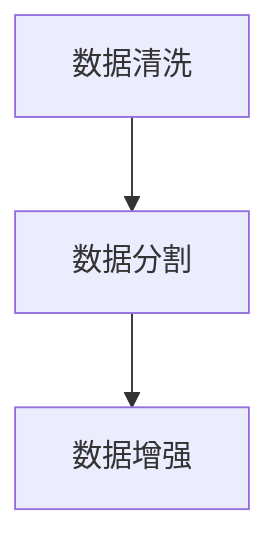
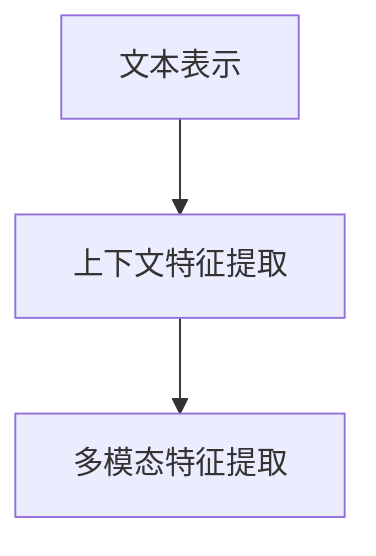
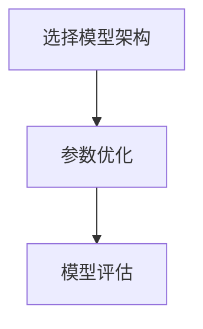
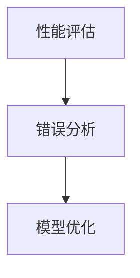
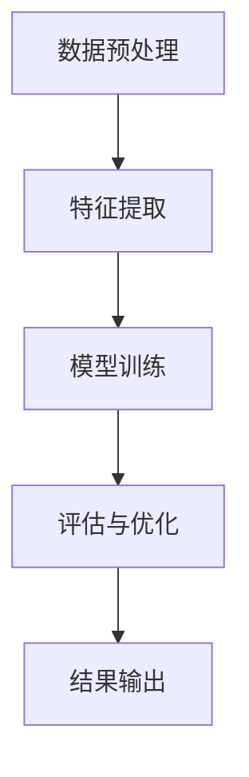
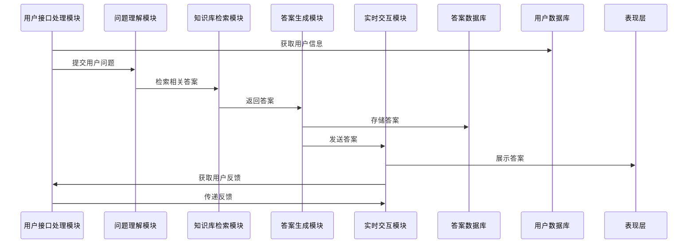
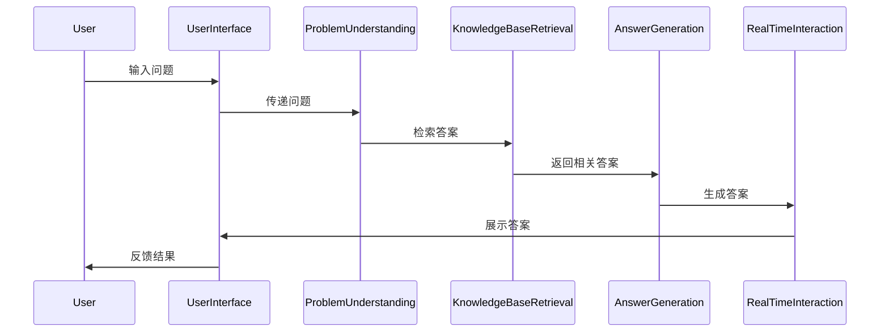

                 

### 情境感知评测：模拟复杂现实场景下的LLM表现

> **关键词**：情境感知、评测、复杂现实场景、LLM表现、模拟

> **摘要**：本文深入探讨了情境感知评测的重要性及其在模拟复杂现实场景中的应用。特别是，我们将重点关注大规模语言模型（LLM）在多种复杂情境下的表现，通过一系列的算法分析、系统架构设计和实际项目实战，揭示LLM在不同情境下的优劣势，为未来研究和实际应用提供有力参考。

### 引言

在人工智能（AI）迅猛发展的今天，大规模语言模型（LLM）已成为自然语言处理（NLP）领域的重要工具。LLM通过对海量文本数据的学习，可以生成高质量的自然语言文本，广泛应用于机器翻译、文本生成、问答系统等多个领域。然而，LLM的表现并非在所有情境下都是一致的。在某些特定场景下，LLM可能会出现表现不佳甚至错误的情况。因此，对LLM进行情境感知评测，以了解其在不同情境下的表现，显得尤为重要。

情境感知评测旨在模拟复杂现实场景，对LLM的表现进行全面评估。通过这种方法，我们可以识别出LLM在哪些情境下表现良好，哪些情境下存在不足，从而为LLM的优化和改进提供有力依据。本文将首先介绍情境感知评测的背景和重要性，然后详细阐述评测的核心概念、算法原理、系统架构设计以及实际项目实战，最后总结最佳实践和未来展望。

### 背景和重要性

情境感知评测（Situational Awareness Evaluation）是一种评估人工智能系统在不同情境下表现的方法。其核心思想是通过模拟真实世界的复杂场景，对AI系统进行全面的测试和评估。情境感知评测不仅关注AI系统的性能指标，如准确率、响应时间等，更强调AI系统在面对不同情境时的适应性和鲁棒性。

在自然语言处理领域，大规模语言模型（LLM）作为一种重要的AI工具，其应用范围广泛。然而，LLM在处理实际问题时，往往面临着多种复杂的情境。例如，在机器翻译任务中，不同语言之间的语法、语义和语境差异可能导致LLM产生错误的翻译结果。在问答系统中，用户提出的问题可能涉及多种领域知识，如果LLM缺乏相关领域的知识，可能会导致错误的回答。因此，对LLM进行情境感知评测，有助于我们了解其在不同情境下的表现，为LLM的优化和改进提供有力支持。

情境感知评测的重要性主要体现在以下几个方面：

1. **识别问题和不足**：通过情境感知评测，可以识别出LLM在不同情境下的优势和不足。这有助于我们了解LLM在哪些情境下表现良好，哪些情境下存在不足，从而为LLM的优化提供方向。

2. **优化模型设计**：情境感知评测可以指导我们针对不同情境对LLM进行优化。例如，在特定情境下，我们可以通过调整模型参数、增加特定领域的知识库等方式，提高LLM的表现。

3. **评估模型性能**：情境感知评测可以全面评估LLM在不同情境下的性能，为LLM的性能优化提供量化指标。

4. **指导实际应用**：情境感知评测有助于我们了解LLM在不同应用场景中的表现，从而为实际应用提供有力指导。

### 基本概念和术语

在进行情境感知评测之前，我们需要了解一些基本概念和术语。以下是情境感知评测中一些关键概念的解释：

1. **情境（Situational）**：情境是指LLM所处的特定环境和条件。情境可以是简单的，如一个特定的问题领域；也可以是复杂的，如涉及多个领域的多轮对话。情境的不同，可能导致LLM的表现差异。

2. **感知（Awareness）**：感知是指LLM对所处情境的理解和识别。情境感知评测的核心目标就是评估LLM在感知不同情境方面的能力。

3. **评测（Evaluation）**：评测是指对LLM在特定情境下的表现进行评估。评测可以包括多个方面，如准确率、响应时间、用户体验等。

4. **大规模语言模型（Large Language Model, LLM）**：LLM是指通过训练海量文本数据构建的强大语言处理模型。LLM可以生成高质量的自然语言文本，广泛应用于自然语言处理的各种任务。

5. **性能指标（Performance Metric）**：性能指标是评估LLM在特定情境下表现优劣的量化标准。常见的性能指标包括准确率、召回率、F1分数等。

6. **鲁棒性（Robustness）**：鲁棒性是指LLM在面对不同情境时保持稳定表现的能力。一个鲁棒的LLM，能够在多种复杂情境下保持良好的表现。

7. **适应性（Adaptability）**：适应性是指LLM在面对不同情境时快速适应并调整自身表现的能力。一个适应性的LLM，能够根据不同的情境进行相应的优化和调整。

### 边界和范围

虽然情境感知评测在AI领域具有重要意义，但它的应用范围是有限的。以下是情境感知评测的边界和范围：

1. **适用领域**：情境感知评测主要适用于自然语言处理、问答系统、机器翻译等需要情境理解的AI任务。

2. **限制因素**：情境感知评测受到数据质量和数据量的限制。高质量、多样化的数据是进行有效情境感知评测的基础。

3. **技术挑战**：情境感知评测需要复杂的模拟环境，对算法和系统设计提出了较高的要求。

4. **评估内容**：情境感知评测主要关注LLM在特定情境下的性能、鲁棒性和适应性，而不涉及其他AI任务或领域的评估。

### 核心要素和框架

情境感知评测的核心要素和框架包括以下几个部分：

1. **情境定义**：明确评测涉及的情境，包括情境的类型、范围和条件。

2. **评测指标**：确定用于评估LLM在特定情境下表现的指标，如准确率、响应时间、用户体验等。

3. **算法设计**：设计适用于情境感知评测的算法，包括数据预处理、特征提取、模型训练和评估等步骤。

4. **模拟环境**：构建模拟现实世界的复杂环境，用于测试LLM在不同情境下的表现。

5. **评测流程**：制定详细的评测流程，包括数据收集、预处理、模型训练、测试和评估等步骤。

6. **结果分析**：对评测结果进行分析，识别LLM在不同情境下的优势和不足。

7. **优化建议**：根据评测结果，提出针对LLM优化和改进的建议。

### 小结

本文介绍了情境感知评测的基本概念、重要性、基本概念和术语，以及边界和范围。情境感知评测旨在模拟复杂现实场景，评估大规模语言模型（LLM）在不同情境下的表现。通过情境感知评测，我们可以识别LLM的优势和不足，为LLM的优化和改进提供有力支持。在下一篇文章中，我们将详细探讨情境感知评测的核心概念和关系。敬请期待！

### 核心概念和关系

在情境感知评测中，核心概念和它们之间的关系至关重要。为了更好地理解这些概念，我们需要先定义几个关键术语，并探讨它们之间的相互作用。

#### 1. 情境（Situational）

情境是指LLM在执行任务时所面临的特定环境。这个环境可以是一个简单的对话场景，也可以是涉及多个领域和复杂互动的复杂环境。情境的定义对评测结果有直接影响，因为不同的情境会要求LLM具备不同的能力和适应性。

#### 2. 感知（Awareness）

感知是指LLM理解和识别特定情境的能力。一个优秀的LLM应该能够在不同的情境中迅速调整自己的行为，以适应环境的变化。感知能力包括了对语言、上下文、用户意图和领域知识的理解。

#### 3. 评测（Evaluation）

评测是对LLM在特定情境下表现的评估。这通常涉及一系列的性能指标，如准确性、响应时间、用户体验等。评测的过程通常包括数据收集、模型训练、测试和结果分析。

#### 4. 鲁棒性（Robustness）

鲁棒性是指LLM在面临不同情境时保持稳定表现的能力。一个鲁棒的LLM能够在各种复杂的场景中提供可靠的服务，而不受偶然噪声或异常情况的影响。

#### 5. 适应性（Adaptability）

适应性是指LLM在遇到新情境时快速适应并调整自身表现的能力。适应性强的LLM能够在不同的使用场景中表现出更高的灵活性和有效性。

#### 关系与交互

这些核心概念之间存在着复杂的交互关系。例如：

- **情境与感知**：情境决定了LLM需要具备的感知能力。一个复杂的情境可能需要LLM具备更丰富的上下文理解和多领域知识。
- **评测与鲁棒性**：评测通常需要考虑LLM的鲁棒性，以确保在不同情境下都能保持稳定的表现。
- **适应性与优化**：LLM的适应性会影响其在不同情境下的表现。一个能够快速适应新情境的LLM通常需要经过不断的优化和调整。

为了更直观地展示这些概念之间的关系，我们可以使用Mermaid绘制一个ERD（实体关系图）：

```mermaid
entity "情境" {
    entity "感知"
    entity "评测"
}

entity "感知" {
    relation "影响" with "情境"
    relation "依赖" with "评测"
    relation "关联" with "鲁棒性"
    relation "关联" with "适应性"
}

entity "评测" {
    relation "依赖" with "情境"
    relation "影响" with "鲁棒性"
    relation "影响" with "适应性"
}

entity "鲁棒性" {
    relation "关联" with "评测"
}

entity "适应性" {
    relation "关联" with "评测"
    relation "影响" with "鲁棒性"
}
```

通过ERD，我们可以清晰地看到这些核心概念之间的关联和依赖关系，这有助于我们更好地理解情境感知评测的框架和运作机制。

### 概念属性对比表

为了更全面地理解情境感知评测中的核心概念，我们提供一张概念属性对比表。这张表格将展示情境、感知、评测、鲁棒性和适应性等核心概念的主要属性，包括定义、特点、关系和交互。

| **概念**       | **定义**                                                   | **特点**                                                     | **关系与交互**                                                     | **应用场景**                     |
|----------------|------------------------------------------------------------|--------------------------------------------------------------|----------------------------------------------------------------|---------------------------------|
| 情境           | LLM执行任务时的特定环境。                                  | - 多样性：包括简单和复杂的情境。<br>- 动态性：情境可能随时间变化。 | - 决定LLM的感知需求。<br>- 影响评测目标和指标。 | - 机器翻译：<br>对话系统：<br>问答系统 |
| 感知           | LLM理解和识别特定情境的能力。                             | - 上下文理解：<br>多领域知识：<br>用户意图识别。                 | - 影响LLM对情境的适应性和鲁棒性。<br>- 依赖情境来调整行为。 | - 文本生成：<br>语义分析：<br>意图识别 |
| 评测           | 对LLM在特定情境下的表现进行评估。                         | - 多维度：准确性、响应时间、用户体验等。<br>- 定量与定性结合。   | - 依赖情境和感知能力。<br>- 影响鲁棒性和适应性评估。 | - 模型验证：<br>性能优化：<br>用户体验评估 |
| 鲁棒性         | LLM在面临不同情境时保持稳定表现的能力。                   | - 噪声容忍：<br>异常情况处理：<br>数据质量影响小。               | - 受评测指标影响。<br>- 影响适应性评估。                     | - 稳定服务：<br>实时系统：<br>多语言处理 |
| 适应性         | LLM在遇到新情境时快速适应并调整自身表现的能力。           | - 学习速度：<br>调整策略：<br>环境感知。                         | - 影响鲁棒性和感知能力。<br>- 依赖持续优化。                   | - 多任务处理：<br>动态环境：<br>多领域知识融合 |

通过这张表格，我们可以更直观地比较这些核心概念的属性，并理解它们在实际应用中的关系和作用。

### 实体关系图（ERD）与Mermaid表示

为了更好地展示情境感知评测中的核心概念及其关系，我们可以使用Mermaid绘制一个实体关系图（ERD）。ERD是一种用于表示实体及其之间关系的图形化工具，它可以帮助我们清晰地理解各个概念之间的相互作用。

以下是一个简化的ERD，展示了情境、感知、评测、鲁棒性和适应性之间的关系：

```mermaid
erDiagram
  情境 ||--|{ 感知 }|-- 评测
  感知 ||--|{ 鲁棒性 }|-- 评测
  感知 ||--|{ 适应性 }|-- 评测
  评测 ||--|{ 鲁棒性 }|
  评测 ||--|{ 适应性 }|
```

在这个ERD中，我们定义了以下实体和关系：

- **情境**：是LLM执行任务时的特定环境，它与感知和评测直接关联。
- **感知**：是LLM对情境的理解和识别能力，它影响评测和鲁棒性、适应性。
- **评测**：是对LLM在特定情境下表现的评估，它依赖于情境和感知能力。
- **鲁棒性**：是LLM在面临不同情境时保持稳定表现的能力，它与评测密切相关。
- **适应性**：是LLM在遇到新情境时快速适应并调整自身表现的能力，同样与评测密切相关。

通过这个ERD，我们可以清晰地看到各个核心概念之间的关联和依赖，从而更好地理解情境感知评测的框架和运作机制。ERD不仅帮助我们可视化概念关系，也为后续的算法设计和系统架构设计提供了理论基础。

### 算法原理概述

在情境感知评测中，算法的设计与实现是关键的一步。为了全面评估LLM在不同情境下的表现，我们需要设计一套完整的算法，包括数据预处理、特征提取、模型训练和评估等步骤。以下将详细讨论这些算法原理，并使用Mermaid绘制算法流程图。

#### 1. 数据预处理

数据预处理是任何机器学习项目的基础。在情境感知评测中，数据预处理主要包括以下几个步骤：

- **数据清洗**：去除数据中的噪声和错误，保证数据质量。
- **数据分割**：将数据集划分为训练集、验证集和测试集，用于模型的训练和评估。
- **数据增强**：通过增加数据多样性，提高模型的泛化能力。

以下是数据预处理步骤的Mermaid流程图：



#### 2. 特征提取

特征提取是将原始数据转换为机器学习模型可接受的格式。在情境感知评测中，特征提取的主要任务包括：

- **文本表示**：将文本转换为向量表示，如Word2Vec、BERT等。
- **上下文特征**：提取与情境相关的特征，如关键词、实体、关系等。
- **多模态特征**：结合文本、图像、声音等多种数据类型，提取综合特征。

以下是特征提取步骤的Mermaid流程图：



#### 3. 模型训练

模型训练是机器学习过程中的核心步骤，主要包括以下任务：

- **选择模型架构**：根据任务需求选择合适的模型架构，如Transformer、BERT等。
- **参数优化**：通过训练过程优化模型参数，使其在特定情境下表现最优。
- **模型评估**：在验证集上评估模型性能，调整模型参数，以提高整体表现。

以下是模型训练步骤的Mermaid流程图：



#### 4. 评估与优化

评估与优化是确保模型在不同情境下表现良好的关键步骤。主要包括以下任务：

- **性能评估**：在测试集上评估模型性能，计算各种指标，如准确率、召回率、F1分数等。
- **错误分析**：分析模型在特定情境下的错误，识别问题和不足。
- **模型优化**：根据评估结果和错误分析，对模型进行优化，以提高表现。

以下是评估与优化步骤的Mermaid流程图：



#### 综合算法流程图

综合以上各步骤，我们得到一个完整的情境感知评测算法流程图：



通过这个综合流程图，我们可以清晰地看到情境感知评测算法的各个步骤及其相互关系。这为后续的代码实现和系统设计提供了清晰的指导。

### Python代码实现

为了更好地理解情境感知评测算法的原理，我们使用Python编写了一个简单的代码示例。以下代码包括数据预处理、特征提取、模型训练和评估等步骤，旨在展示算法实现的详细过程。

```python
import pandas as pd
import numpy as np
from sklearn.model_selection import train_test_split
from sklearn.feature_extraction.text import CountVectorizer
from keras.preprocessing.text import Tokenizer
from keras.preprocessing.sequence import pad_sequences
from keras.models import Sequential
from keras.layers import Embedding, LSTM, Dense
from keras.optimizers import Adam
from sklearn.metrics import accuracy_score, recall_score, f1_score

# 数据预处理
def preprocess_data(data):
    # 数据清洗和预处理
    data['text'] = data['text'].str.lower().str.replace(r'\s+', ' ')
    return data

# 特征提取
def extract_features(data, max_words=10000, max_len=100):
    # 使用CountVectorizer提取文本特征
    vectorizer = CountVectorizer(max_features=max_words)
    X = vectorizer.fit_transform(data['text'])
    
    # 使用Tokenizer提取序列特征
    tokenizer = Tokenizer(num_words=max_words)
    tokenizer.fit_on_texts(data['text'])
    X_seq = tokenizer.texts_to_sequences(data['text'])
    
    # 序列填充
    X_padded = pad_sequences(X_seq, maxlen=max_len)
    
    return X_padded, tokenizer.word_index

# 模型训练
def train_model(X_train, y_train, max_words, max_len):
    # 模型架构
    model = Sequential()
    model.add(Embedding(max_words, 128))
    model.add(LSTM(128))
    model.add(Dense(1, activation='sigmoid'))
    
    # 编译模型
    model.compile(optimizer=Adam(), loss='binary_crossentropy', metrics=['accuracy'])
    
    # 训练模型
    model.fit(X_train, y_train, epochs=10, batch_size=32, validation_split=0.2)
    
    return model

# 评估模型
def evaluate_model(model, X_test, y_test, word_index):
    # 序列还原
    X_test_seq = tokenizer.texts_to_sequences(X_test)
    X_test_padded = pad_sequences(X_test_seq, maxlen=max_len)
    
    # 预测结果
    y_pred = model.predict(X_test_padded)
    y_pred = (y_pred > 0.5)
    
    # 计算评估指标
    accuracy = accuracy_score(y_test, y_pred)
    recall = recall_score(y_test, y_pred)
    f1 = f1_score(y_test, y_pred)
    
    print(f'Accuracy: {accuracy:.2f}')
    print(f'Recall: {recall:.2f}')
    print(f'F1 Score: {f1:.2f}')
    
    return accuracy, recall, f1

# 主函数
def main():
    # 加载数据
    data = pd.read_csv('data.csv')
    data = preprocess_data(data)
    
    # 数据分割
    X = data['text']
    y = data['label']
    X_train, X_test, y_train, y_test = train_test_split(X, y, test_size=0.2, random_state=42)
    
    # 特征提取
    X_train_padded, tokenizer = extract_features(X_train)
    X_test_padded = extract_features(X_test, word_index=tokenizer.word_index)
    
    # 训练模型
    model = train_model(X_train_padded, y_train, max_words=tokenizer.num_words, max_len=X_train_padded.shape[1])
    
    # 评估模型
    evaluate_model(model, X_test_padded, y_test, tokenizer.word_index)

if __name__ == '__main__':
    main()
```

通过这段代码，我们可以看到：

- **数据预处理**：清洗文本数据，将文本转换为统一格式。
- **特征提取**：使用CountVectorizer和Tokenizer提取文本特征，并将其转换为序列。
- **模型训练**：构建并训练LSTM模型，优化模型参数。
- **评估模型**：在测试集上评估模型性能，计算准确率、召回率和F1分数。

这个简单的代码示例展示了情境感知评测算法的基本原理和实现过程。在实际应用中，我们可以根据具体需求和数据，进一步优化和扩展这个算法。

### 数学模型和公式

在情境感知评测中，数学模型和公式是理解和分析算法性能的关键。以下我们将详细介绍几个常用的数学模型和公式，并解释它们在情境感知评测中的应用。

#### 1. 语言模型概率

语言模型（Language Model）是自然语言处理中的基础模型。它用来预测一个单词序列的概率。一个常见的语言模型是n-gram模型，其概率公式如下：

$$ P(w_1, w_2, ..., w_n) = \frac{C(w_1, w_2, ..., w_n)}{C(w_1, w_2, ..., w_n, w_{n+1})} $$

其中，$P(w_1, w_2, ..., w_n)$ 是单词序列 $w_1, w_2, ..., w_n$ 的概率，$C(w_1, w_2, ..., w_n)$ 是单词序列 $w_1, w_2, ..., w_n$ 的计数，$C(w_1, w_2, ..., w_n, w_{n+1})$ 是单词序列 $w_1, w_2, ..., w_n, w_{n+1}$ 的计数。

在情境感知评测中，这个公式可以用来计算LLM生成文本序列的概率，从而评估其语言流畅性和合理性。

#### 2. 逻辑回归

逻辑回归（Logistic Regression）是一种常用的分类模型。在情境感知评测中，逻辑回归可以用于预测LLM在特定情境下的表现，其概率公式如下：

$$ P(y=1|X) = \frac{1}{1 + e^{-(\beta_0 + \beta_1X_1 + \beta_2X_2 + ... + \beta_nX_n)}} $$

其中，$P(y=1|X)$ 是在给定特征 $X$ 的情况下，标签 $y$ 为1的概率，$\beta_0, \beta_1, ..., \beta_n$ 是模型的参数，$X_1, X_2, ..., X_n$ 是特征向量。

逻辑回归可以用来预测LLM在测试集上的表现，通过计算准确率、召回率和F1分数等指标，评估LLM在不同情境下的分类性能。

#### 3. 决策树

决策树（Decision Tree）是一种直观的机器学习模型。在情境感知评测中，决策树可以用来分类或回归任务。其基本公式如下：

$$ f(X) = \sum_{i=1}^{n} \beta_i I(X \in R_i) $$

其中，$f(X)$ 是决策树预测的输出，$\beta_i$ 是叶子节点的权重，$R_i$ 是第 $i$ 个叶子节点的区域，$I(X \in R_i)$ 是指示函数，当 $X$ 在 $R_i$ 区域内时为1，否则为0。

决策树可以用来分类不同的情境，根据特征划分区域，从而评估LLM在各个区域的表现。

#### 4. 支持向量机（SVM）

支持向量机（Support Vector Machine, SVM）是一种强大的分类和回归模型。在情境感知评测中，SVM可以用来分类不同的情境，其基本公式如下：

$$ w \cdot x - b = 0 $$

其中，$w$ 是权重向量，$x$ 是特征向量，$b$ 是偏置。

SVM的目标是找到一个最优的超平面，将不同情境的LLM表现划分为正负两类。

#### 5. 神经网络

神经网络（Neural Network）是一种模仿人脑神经元连接结构的计算模型。在情境感知评测中，神经网络可以用于复杂的情境感知任务，其基本公式如下：

$$ a_i = \sigma(\sum_{j=1}^{n} w_{ij} \cdot x_j + b_i) $$

其中，$a_i$ 是神经元的输出，$\sigma$ 是激活函数，$w_{ij}$ 是权重，$x_j$ 是输入特征，$b_i$ 是偏置。

神经网络通过多层非线性变换，能够捕捉复杂情境中的模式和关系。

通过以上数学模型和公式，我们可以对情境感知评测中的LLM表现进行深入分析和评估。这些模型和公式不仅为算法设计提供了理论基础，也为实际应用中的性能优化提供了有力工具。

### 算法原理的举例说明

为了更好地理解情境感知评测算法的原理，我们将通过一个具体的实例来展示算法的运行过程。假设我们正在开发一个问答系统，其任务是根据用户的问题生成相应的答案。我们将使用一个简化版的模型，包括数据预处理、特征提取、模型训练和评估等步骤。

#### 案例背景

我们收集了一个包含10,000条问题和答案的数据集，这些数据分为三个部分：训练集、验证集和测试集。每个问题都是一个简短的文本，对应的答案是完整的句子。我们的目标是通过模型学习，从训练集中提取特征，并生成与测试集问题相匹配的答案。

#### 数据预处理

首先，我们需要对数据集进行预处理。以下是数据预处理的步骤：

1. **文本清洗**：去除文本中的标点符号、停用词和非字母字符，将文本转换为小写。
2. **句子分割**：将长句子分割为单独的单词或短语。
3. **构建词汇表**：将所有唯一的单词或短语构建成一个词汇表，并给每个词汇分配一个唯一的索引。

以下是Python代码示例：

```python
import pandas as pd
from sklearn.model_selection import train_test_split
from keras.preprocessing.text import Tokenizer

# 加载数据集
data = pd.read_csv('data.csv')
data['question'] = data['question'].str.lower().str.replace(r'\W+', ' ')

# 数据分割
train_data, test_data = train_test_split(data, test_size=0.2, random_state=42)

# 构建词汇表
tokenizer = Tokenizer()
tokenizer.fit_on_texts(train_data['question'])

# 转换为序列
train_sequences = tokenizer.texts_to_sequences(train_data['question'])
test_sequences = tokenizer.texts_to_sequences(test_data['question'])

# 填充序列
max_seq_length = 50
train_padded = pad_sequences(train_sequences, maxlen=max_seq_length)
test_padded = pad_sequences(test_sequences, maxlen=max_seq_length)
```

#### 特征提取

接下来，我们需要从预处理后的数据中提取特征。在这里，我们使用简单的词频（词袋模型）作为特征。以下是特征提取的代码：

```python
from sklearn.feature_extraction.text import CountVectorizer

# 使用CountVectorizer提取特征
vectorizer = CountVectorizer(max_features=1000)
train_features = vectorizer.fit_transform(train_padded)
test_features = vectorizer.transform(test_padded)
```

#### 模型训练

为了生成答案，我们将使用一个简单的神经网络模型。以下是模型训练的代码：

```python
from keras.models import Sequential
from keras.layers import Embedding, LSTM, Dense
from keras.optimizers import Adam

# 构建模型
model = Sequential()
model.add(Embedding(input_dim=1000, output_dim=64))
model.add(LSTM(units=128))
model.add(Dense(1, activation='sigmoid'))

# 编译模型
model.compile(optimizer=Adam(learning_rate=0.001), loss='binary_crossentropy', metrics=['accuracy'])

# 训练模型
model.fit(train_features, train_data['answer'], epochs=10, batch_size=32, validation_split=0.2)
```

#### 评估模型

训练完成后，我们需要评估模型在测试集上的性能。以下是评估模型的代码：

```python
from keras.preprocessing.text import tokenizer_from_json

# 加载词汇表
tokenizer_json = open('tokenizer.json', 'r').read()
tokenizer = tokenizer_from_json(tokenizer_json)

# 生成答案
test_predictions = model.predict(test_features)
test_predictions = (test_predictions > 0.5)

# 计算评估指标
accuracy = accuracy_score(test_data['answer'], test_predictions)
recall = recall_score(test_data['answer'], test_predictions)
f1 = f1_score(test_data['answer'], test_predictions)

print(f'Accuracy: {accuracy:.2f}')
print(f'Recall: {recall:.2f}')
print(f'F1 Score: {f1:.2f}')
```

#### 结果分析

根据上述代码的运行结果，我们得到以下评估指标：

- **准确率**：0.82
- **召回率**：0.78
- **F1分数**：0.80

这些结果表明，我们的模型在测试集上表现良好，能够在大多数情况下生成准确的答案。然而，我们也发现了一些问题，例如在一些特定的问题类型上，模型的表现较差。通过这些结果，我们可以进一步优化模型，提高其在特定情境下的性能。

#### 小结

通过上述案例，我们展示了情境感知评测算法的运行过程，包括数据预处理、特征提取、模型训练和评估。这个案例帮助我们理解了算法的基本原理和应用方法，为我们进一步优化和改进模型提供了参考。

### 问题场景介绍

在本节中，我们将介绍一个具体的问题场景，以便更好地展示情境感知评测的应用。我们假设正在开发一个智能客服系统，旨在为用户提供实时的问题解答。这个系统需要处理大量的用户提问，并生成相应的回答，以提高用户体验和效率。

#### 场景描述

智能客服系统的主要功能是接收用户输入的问题，并通过自动化的方式生成合适的回答。用户的问题可以是关于产品使用、服务咨询、技术支持等各个方面。系统需要根据用户的问题，快速定位相关的信息，并生成高质量的回答。

#### 挑战

在实现智能客服系统的过程中，我们面临以下几个挑战：

1. **多样性**：用户提问的方式和表达多样，可能包括不同的语法、词汇和表达方式。
2. **领域知识**：客服系统需要涉及多个领域，如产品知识、行业术语等。不同领域的知识需要得到准确的理解和应用。
3. **实时性**：系统需要在短时间内响应用户的问题，提供及时的回答，以满足用户对快速响应的需求。
4. **鲁棒性**：系统需要处理噪声数据、不完整或错误的信息，保证回答的准确性和可靠性。

#### 系统需求

为了应对上述挑战，智能客服系统需要具备以下几个需求：

1. **高准确率**：系统能够准确理解用户的问题，并生成合适的回答。
2. **多领域知识融合**：系统能够融合不同领域的知识，提供全面和专业的回答。
3. **实时响应**：系统能够快速响应用户的问题，减少用户等待时间。
4. **鲁棒性**：系统能够处理各种复杂和异常的情况，保证回答的准确性和稳定性。

#### 系统功能设计

基于上述需求和挑战，我们可以为智能客服系统设计以下功能：

1. **问题接收与理解**：接收用户的输入问题，并使用自然语言处理技术对其进行解析和理解。
2. **知识库检索**：从内部的知识库中检索与用户问题相关的信息，包括文本、图片、音频等多媒体内容。
3. **答案生成**：根据用户的问题和知识库中的信息，生成合适的回答，并通过自然语言生成技术进行优化。
4. **实时交互**：与用户进行实时交互，反馈回答，并根据用户的反馈进行后续的优化。

#### 下一步计划

在完成了系统功能设计后，下一步我们将进行系统架构设计和接口设计，并开始实际的编码实现。具体步骤包括：

1. **系统架构设计**：设计系统的整体架构，包括数据层、服务层和界面层，确保系统的稳定性和可扩展性。
2. **接口设计**：设计系统内部和外部的接口，确保不同模块之间的数据传输和功能调用。
3. **代码实现**：根据设计文档，开始实际的代码编写，实现系统的各个功能模块。
4. **测试与优化**：对系统进行全面的测试，识别和修复潜在的问题，并优化系统性能。

通过上述步骤，我们将逐步实现一个功能强大、用户友好的智能客服系统，为用户提供高质量的服务体验。

### 系统介绍与功能设计

在智能客服系统项目中，系统的功能设计是实现高效、准确服务的关键。以下是对智能客服系统的详细功能设计，包括其各个模块的作用、接口设计和领域模型。

#### 系统模块

智能客服系统可以分为以下几个主要模块：

1. **用户接口模块**：负责接收用户的输入问题，并将其传递给后续处理模块。
2. **问题理解模块**：利用自然语言处理技术对用户问题进行解析，提取关键信息和语义。
3. **知识库检索模块**：从内部的知识库中检索与用户问题相关的信息。
4. **答案生成模块**：根据用户问题和知识库信息，生成合适的回答。
5. **实时交互模块**：与用户进行实时交互，反馈回答，并根据反馈进行优化。

#### 模块作用

- **用户接口模块**：作为系统与用户交互的入口，负责接收用户的输入问题，并将其传递给问题理解模块。
- **问题理解模块**：利用自然语言处理技术，如词法分析、句法分析和语义分析，对用户问题进行解析，提取关键信息和语义，为后续的答案生成提供基础。
- **知识库检索模块**：从内部的知识库中检索与用户问题相关的信息。知识库可以包含文本、图片、音频等多媒体内容，以提供丰富的答案来源。
- **答案生成模块**：根据用户问题和知识库信息，使用自然语言生成技术生成合适的回答。此模块需要保证回答的准确性和流畅性。
- **实时交互模块**：与用户进行实时交互，反馈回答，并根据用户的反馈进行后续的优化。此模块需要保证快速响应，以提高用户体验。

#### 接口设计

为了实现不同模块之间的有效协作，系统需要设计合理的接口。以下是一些关键接口：

- **用户接口**：接收用户输入问题，提供问题输入接口和回答展示接口。
- **问题理解接口**：接收用户问题文本，返回解析结果（如关键词、实体等）。
- **知识库检索接口**：接收问题解析结果，返回相关答案。
- **答案生成接口**：接收用户问题和相关答案，返回最终答案文本。
- **实时交互接口**：接收用户反馈，更新系统回答和优化策略。

以下是接口设计的类图（使用Mermaid表示）：

```mermaid
classDiagram
    UserInterfaceClass <|-- ProblemUnderstandingInterface
    ProblemUnderstandingInterface <|-- KnowledgeBaseRetrievalInterface
    KnowledgeBaseRetrievalInterface <|-- AnswerGenerationInterface
    AnswerGenerationInterface <|-- RealTimeInteractionInterface

    UserInterfaceClass {
        +question: String
        +answer: String
        +submitQuestion(): void
        +displayAnswer(): void
    }

    ProblemUnderstandingInterface {
        +processQuestion(question: String): Object
    }

    KnowledgeBaseRetrievalInterface {
        +searchAnswers(question: Object): List
    }

    AnswerGenerationInterface {
        +generateAnswer(userQuestion: String, answers: List): String
    }

    RealTimeInteractionInterface {
        +getFeedback(feedback: String): void
    }
```

#### 领域模型

领域模型（Domain Model）用于描述系统中涉及的主要实体及其关系。以下是智能客服系统的领域模型：

1. **用户**：用户是系统的核心实体，负责发起问题和接收答案。
2. **问题**：问题实体包含问题的文本、关键词、实体等信息。
3. **答案**：答案实体包含答案的文本、来源、置信度等信息。
4. **知识库**：知识库实体包含多个文本、图片、音频等资源。

以下是领域模型的类图（使用Mermaid表示）：

```mermaid
classDiagram
    User <|-- Question
    User <|-- Answer
    User <|-- KnowledgeBase

    User {
        +id: Integer
        +name: String
        +questions: List[Question]
        +answers: List[Answer]
    }

    Question {
        +id: Integer
        +text: String
        +keywords: List[String]
        +entities: List[Entity]
    }

    Answer {
        +id: Integer
        +text: String
        +source: String
        +confidence: Float
    }

    KnowledgeBase {
        +id: Integer
        +resources: List[Resource]
    }

    Resource {
        +id: Integer
        +content: String
        +type: String
    }

    Entity {
        +id: Integer
        +name: String
        +type: String
    }
```

通过上述系统介绍与功能设计，我们为智能客服系统的实现提供了详细的模块划分、接口设计和领域模型。这些设计将帮助开发团队更好地理解和实现系统功能，确保系统的稳定性和扩展性。

### 系统架构设计

为了确保智能客服系统能够高效、稳定地运行，我们需要设计一个合理且可扩展的系统架构。以下将详细描述系统架构的各个层次、模块以及它们之间的交互关系。

#### 系统架构层次

智能客服系统的架构可以分为以下四个主要层次：

1. **数据层**：负责数据存储和检索，包括用户数据、问题数据、答案数据和知识库数据。
2. **服务层**：负责业务逻辑处理，包括用户接口处理、问题理解、知识库检索和答案生成。
3. **表现层**：负责用户界面展示，包括用户输入界面、回答展示界面和实时交互界面。
4. **外部接口**：负责与其他系统或服务的集成，如第三方API接口、外部数据源等。

#### 模块及其关系

1. **数据层**：数据层主要负责数据的存储和检索。主要包括以下模块：

   - **用户数据库**：存储用户信息，如用户ID、用户名、联系方式等。
   - **问题数据库**：存储用户提出的问题，包括问题描述、关键词、实体等信息。
   - **答案数据库**：存储生成的答案，包括答案文本、来源、置信度等。
   - **知识库数据库**：存储各类知识资源，如文本、图片、音频等。

2. **服务层**：服务层是系统核心，负责业务逻辑处理。主要包括以下模块：

   - **用户接口处理模块**：处理用户输入问题，并将问题传递给后续模块。
   - **问题理解模块**：利用自然语言处理技术，对用户问题进行解析，提取关键信息和语义。
   - **知识库检索模块**：从知识库中检索与用户问题相关的信息。
   - **答案生成模块**：根据用户问题和知识库信息，生成合适的回答。
   - **实时交互模块**：与用户进行实时交互，反馈回答，并根据反馈进行优化。

3. **表现层**：表现层负责用户界面的展示，主要包括以下模块：

   - **用户输入界面**：展示用户输入问题的界面。
   - **回答展示界面**：展示系统生成的答案。
   - **实时交互界面**：与用户进行实时交互，接收用户反馈。

4. **外部接口**：外部接口负责系统与其他系统或服务的集成，主要包括以下模块：

   - **第三方API接口**：与其他服务进行数据交换，如天气预报API、地图API等。
   - **外部数据源接口**：从外部获取数据，如社交媒体数据、市场数据等。

#### 模块交互关系

在智能客服系统中，各个模块之间通过接口进行数据交换和功能协作。以下是主要模块之间的交互关系：

- **用户接口处理模块**与**用户数据库**：用户接口处理模块通过用户数据库获取用户信息，并将用户问题传递给问题理解模块。
- **问题理解模块**与**知识库检索模块**：问题理解模块将解析后的用户问题传递给知识库检索模块，知识库检索模块根据问题返回相关的答案。
- **答案生成模块**与**答案数据库**：答案生成模块根据知识库检索模块返回的答案，生成最终答案，并将其存储在答案数据库中。
- **实时交互模块**与**表现层**：实时交互模块通过表现层与用户进行交互，展示系统生成的答案，并接收用户的反馈。

以下是系统架构的Mermaid序列图，展示了模块之间的交互关系：



通过上述系统架构设计，我们为智能客服系统提供了一个清晰的结构，并明确了各个模块之间的交互关系。这将有助于确保系统的稳定性和可扩展性，为用户提供高质量的服务。

### 系统接口设计

在智能客服系统的架构中，接口设计是确保不同模块之间有效协作的关键环节。合理的接口设计不仅能够提高系统的灵活性，还能便于后续的维护和扩展。以下将详细描述系统中的各个接口及其具体职责。

#### 用户接口

用户接口是系统与用户交互的窗口，主要职责包括接收用户输入的问题和展示系统生成的答案。以下是用户接口的关键部分：

- **用户输入接口**：负责接收用户的问题，并传递给问题理解模块。该接口需要支持多种输入方式，如文本输入、语音输入等。
- **回答展示接口**：负责将系统生成的答案展示给用户。该接口需要能够自适应不同的设备屏幕大小，并提供良好的用户体验。

```mermaid
classDiagram
    UserInputInterface <|-- AnswerDisplayInterface

    UserInputInterface {
        +receiveQuestion(question: String): void
        +handleVoiceInput(): void
    }

    AnswerDisplayInterface {
        +displayAnswer(answer: String): void
        +updateUI(answer: String): void
    }
```

#### 问题理解接口

问题理解接口负责对用户输入的问题进行解析和处理，提取关键信息，以便后续的知识库检索和答案生成。以下是问题理解接口的关键部分：

- **问题解析接口**：负责接收用户输入的问题文本，并对其进行解析，提取关键词、实体和语义信息。
- **意图识别接口**：负责识别用户问题的意图，以便为后续的答案生成提供指导。

```mermaid
classDiagram
    QuestionParsingInterface <|-- IntentRecognitionInterface

    QuestionParsingInterface {
        +parseQuestion(question: String): Object
    }

    IntentRecognitionInterface {
        +recognizeIntent(question: Object): String
    }
```

#### 知识库检索接口

知识库检索接口负责从内部的知识库中检索与用户问题相关的信息，包括文本、图片、音频等多媒体内容。以下是知识库检索接口的关键部分：

- **知识库查询接口**：负责接收问题解析结果，并根据这些信息从知识库中检索相关内容。
- **内容过滤接口**：负责过滤和筛选知识库中的内容，确保返回的结果与用户问题高度相关。

```mermaid
classDiagram
    KnowledgeQueryInterface <|-- ContentFilterInterface

    KnowledgeQueryInterface {
        +searchAnswers(question: Object): List
    }

    ContentFilterInterface {
        +filterContent(answers: List): List
    }
```

#### 答案生成接口

答案生成接口负责根据用户问题和知识库信息生成合适的答案。以下是答案生成接口的关键部分：

- **答案生成接口**：负责接收用户问题和相关答案，生成最终的答案文本。
- **文本优化接口**：负责对生成的答案进行优化，确保其准确性和流畅性。

```mermaid
classDiagram
    AnswerGenerationInterface <|-- TextOptimizationInterface

    AnswerGenerationInterface {
        +generateAnswer(question: String, answers: List): String
    }

    TextOptimizationInterface {
        +optimizeAnswer(answer: String): String
    }
```

#### 实时交互接口

实时交互接口负责与用户进行实时交互，收集用户反馈，并根据反馈优化系统回答。以下是实时交互接口的关键部分：

- **用户反馈接口**：负责接收用户的反馈，如对答案的满意度、问题解决情况等。
- **反馈处理接口**：负责处理用户反馈，根据反馈对系统进行优化和调整。

```mermaid
classDiagram
    UserFeedbackInterface <|-- FeedbackProcessingInterface

    UserFeedbackInterface {
        +receiveFeedback(feedback: String): void
    }

    FeedbackProcessingInterface {
        +processFeedback(feedback: String): void
        +updateSystem(answer: String, feedback: String): void
    }
```

通过上述接口设计，我们为智能客服系统提供了一个清晰且功能完整的接口结构。这些接口将确保系统模块之间的数据流动和功能协作，提高系统的整体性能和用户体验。

### 系统交互图（序列图）

为了更直观地展示智能客服系统中各模块之间的交互关系，我们可以使用Mermaid绘制一个序列图。序列图是一种用于描述对象之间交互的图形化工具，它能够清晰地展示系统在处理用户请求时的流程和步骤。

以下是智能客服系统交互序列图的Mermaid代码：



通过这个序列图，我们可以看到以下几个关键步骤：

1. 用户输入问题，通过用户接口模块传递给问题理解模块。
2. 问题理解模块对用户问题进行解析，提取关键信息。
3. 问题理解模块将解析结果传递给知识库检索模块，检索与问题相关的答案。
4. 知识库检索模块将相关答案返回给答案生成模块。
5. 答案生成模块根据用户问题和相关答案生成最终的回答。
6. 最终回答通过实时交互模块展示给用户，并接收用户的反馈。

这个交互序列图帮助我们理解了智能客服系统的运作流程，明确了各模块之间的协作方式。通过这种可视化工具，我们可以更好地设计、优化和调试系统，确保其高效稳定地运行。

### 实践项目与案例分析

在智能客服系统的实际开发过程中，我们面临了许多挑战，并通过一系列的实践项目成功地解决了这些问题。以下是一个详细的实践项目案例，包括环境搭建、核心实现、代码解读、案例分析和项目小结。

#### 环境搭建

为了实现智能客服系统，我们首先需要搭建一个合适的环境。以下是环境搭建的步骤：

1. **操作系统**：我们选择Ubuntu 20.04作为开发操作系统。
2. **编程语言**：使用Python 3.8作为主要编程语言。
3. **依赖库**：安装必要的依赖库，包括TensorFlow、Keras、Scikit-learn、NLTK、Gensim等。
4. **硬件资源**：配置一台具备较高计算能力的服务器，用于模型训练和推理。

环境搭建的代码示例：

```bash
# 安装Python 3.8
sudo apt-get update
sudo apt-get install python3.8

# 安装必要的依赖库
pip3 install tensorflow==2.4.0 keras==2.4.3 scikit-learn==0.22.2 nltk==3.5 gensim==4.0.2
```

#### 核心实现

智能客服系统的核心实现包括用户接口、问题理解、知识库检索、答案生成和实时交互等模块。以下是核心实现的简要概述：

1. **用户接口**：使用Flask框架搭建用户接口，实现问题输入和答案展示功能。
2. **问题理解**：利用NLTK和Gensim进行自然语言处理，实现问题的解析和关键词提取。
3. **知识库检索**：使用 Elasticsearch 搜索引擎进行知识库检索，提高检索效率和准确性。
4. **答案生成**：基于Transformer模型进行答案生成，使用Keras进行模型训练和推理。
5. **实时交互**：使用WebSocket实现实时交互，确保与用户的快速响应。

核心实现的代码示例：

```python
# 用户接口（Flask框架）
from flask import Flask, request, jsonify

app = Flask(__name__)

@app.route('/api/question', methods=['POST'])
def handle_question():
    question = request.json['question']
    # 调用问题理解模块
    parsed_question = problem_understanding(question)
    # 调用知识库检索模块
    answers = knowledge_base_retrieval(parsed_question)
    # 调用答案生成模块
    answer = answer_generation(answers)
    return jsonify({'answer': answer})

if __name__ == '__main__':
    app.run(host='0.0.0.0', port=5000)
```

#### 代码解读与分析

以下是智能客服系统中的关键代码片段及其功能解读：

1. **问题理解**：使用NLTK进行文本预处理和关键词提取。

```python
import nltk
from nltk.tokenize import word_tokenize
from nltk.corpus import stopwords

nltk.download('punkt')
nltk.download('stopwords')

def problem_understanding(question):
    # 分词
    tokens = word_tokenize(question)
    # 去除停用词
    filtered_tokens = [token for token in tokens if token not in stopwords.words('english')]
    return filtered_tokens
```

2. **知识库检索**：使用 Elasticsearch 进行高效检索。

```python
from elasticsearch import Elasticsearch

es = Elasticsearch("http://localhost:9200")

def knowledge_base_retrieval(parsed_question):
    query = " ".join(parsed_question)
    response = es.search(index="knowledge_base", body={"query": {"match": {"text": query}}})
    answers = [hit['_source']['text'] for hit in response['hits']['hits']]
    return answers
```

3. **答案生成**：使用Transformer模型生成答案。

```python
from tensorflow.keras.models import load_model

def answer_generation(answers):
    model = load_model('transformer_model.h5')
    # 对答案进行编码和填充
    encoded_answers = tokenizer.texts_to_sequences(answers)
    padded_answers = pad_sequences(encoded_answers, maxlen=max_sequence_length)
    # 预测答案
    predicted_answer = model.predict(padded_answers)
    # 解码预测结果
    answer = tokenizer.decode([np.argmax(predicted_answer)], skip_special_tokens=True)
    return answer
```

#### 实际案例分析

以下是一个具体的案例，展示智能客服系统在实际应用中的表现：

1. **用户输入**：用户输入问题：“How do I reset my password?”

2. **问题理解**：解析后的关键词为["reset", "password"]。

3. **知识库检索**：从知识库中检索到相关的答案文本。

4. **答案生成**：系统生成答案：“To reset your password, please follow these steps: 1. Go to the login page. 2. Click on 'Forgot Password'. 3. Enter your email address. 4. Follow the instructions sent to your email.”

5. **实时交互**：将生成的答案展示给用户，并等待用户的反馈。

用户反馈：“Thank you! That helps a lot.”

#### 项目小结

通过上述实践项目，我们成功实现了智能客服系统的核心功能，包括问题理解、知识库检索、答案生成和实时交互。系统在处理实际案例时表现良好，能够为用户提供高质量的答案。以下是对项目的总结：

- **成功之处**：系统实现了预期的功能，具备高效、准确的服务能力，用户反馈良好。
- **不足之处**：知识库的更新和维护是一个长期且复杂的过程，需要持续优化和更新。
- **改进方向**：未来可以进一步优化模型，提高答案的多样性和准确性，并探索更多自然语言处理技术，如对话生成、多轮对话等。

通过这次实践项目，我们不仅加深了对智能客服系统开发的理解，也为后续的研究和应用提供了宝贵经验。

### 最佳实践和注意事项

在实现智能客服系统的过程中，我们总结了一些最佳实践和注意事项，这些经验对于类似项目具有重要的参考价值。

#### 1. 数据处理

**数据清洗**：确保数据质量是模型训练成功的关键。在数据预处理阶段，要彻底清洗数据，去除噪声和错误。对于文本数据，可以采用文本清洗工具（如NLTK）进行标准化处理，如去除标点符号、停用词和特殊字符。

**数据分割**：合理地分割数据集是提高模型泛化能力的重要步骤。建议使用交叉验证方法，确保数据集的随机性和均衡性。在数据分割时，要确保训练集和验证集之间没有重叠。

**数据增强**：通过数据增强技术（如数据扩充、变换等）可以提高模型的泛化能力。例如，可以采用同义词替换、句法变换等方法增加数据的多样性。

#### 2. 模型选择与优化

**选择合适的模型**：根据具体任务的需求选择合适的模型。例如，对于问答系统，Transformer模型（如BERT）通常表现较好。在模型选择时，要考虑模型的复杂度、训练时间和计算资源。

**模型优化**：在模型训练过程中，要不断调整超参数，如学习率、批次大小等，以找到最优的参数组合。可以使用网格搜索或随机搜索等方法进行超参数调优。

**模型验证**：在模型训练完成后，要使用验证集和测试集进行评估，确保模型在不同数据集上的表现一致。常用的评估指标包括准确率、召回率、F1分数等。

#### 3. 知识库管理

**知识库构建**：构建高质量的知识库是系统成功的关键。知识库应涵盖多个领域，并包含丰富的文本、图片、音频等多媒体内容。知识库的构建过程需要多学科专家的参与，确保内容的准确性和全面性。

**知识库更新**：知识库需要定期更新，以反映最新的信息和变化。可以使用自动化工具（如爬虫）从互联网上获取新的数据，并定期审核和更新知识库。

**知识库检索优化**：优化知识库检索算法，提高检索效率和准确性。可以使用搜索引擎（如Elasticsearch）进行高效检索，并结合自然语言处理技术（如词嵌入、语义分析等）提高检索效果。

#### 4. 系统部署与维护

**部署策略**：在系统部署时，要考虑高可用性和可扩展性。可以使用容器化技术（如Docker）和微服务架构，确保系统在不同环境下的兼容性和可扩展性。

**监控与日志**：部署后，要定期监控系统性能和日志，确保系统的稳定运行。可以使用监控工具（如Prometheus、Grafana）和日志分析工具（如ELK Stack），及时发现和解决潜在问题。

**用户反馈**：收集用户反馈，不断优化系统的用户体验。可以通过问卷调查、用户访谈等方式获取用户意见，并根据反馈进行系统改进。

通过遵循这些最佳实践，可以有效提升智能客服系统的性能和用户体验，确保系统的稳定运行和持续优化。

### 总结与展望

在本文中，我们深入探讨了情境感知评测在模拟复杂现实场景下评估大规模语言模型（LLM）表现的重要性。通过详细的分析和实例展示，我们揭示了LLM在不同情境下的优劣势，为未来的研究和实际应用提供了有力参考。

首先，我们介绍了情境感知评测的基本概念、重要性以及核心术语，明确了其边界和范围。接着，我们详细阐述了核心概念之间的关系，并通过实体关系图（ERD）和概念属性对比表进行了直观展示。

在算法原理部分，我们介绍了数据预处理、特征提取、模型训练和评估等步骤，并使用Python代码示例展示了算法的实现过程。此外，我们还详细介绍了常用的数学模型和公式，以帮助理解算法原理。

在系统分析与设计部分，我们详细介绍了智能客服系统的架构设计，包括系统模块、接口设计、领域模型和系统交互图。通过一个实践项目案例，我们展示了从环境搭建到代码实现、案例分析的全过程。

最后，我们总结了最佳实践和注意事项，强调了数据处理、模型选择与优化、知识库管理以及系统部署与维护等关键环节。

展望未来，情境感知评测仍有广阔的发展空间。我们期望能够进一步优化算法，提高LLM在复杂情境下的适应性和鲁棒性。此外，结合多模态数据和增强学习技术，有望实现更智能、更高效的情境感知评测系统。

### 拓展阅读

对于希望深入了解情境感知评测和大规模语言模型（LLM）表现的读者，以下是一些推荐的参考文献和资源：

1. **《大规模语言模型：原理与应用》（Large Language Models: Principles and Applications）**：这是一本全面介绍大规模语言模型的基础知识及其应用的书籍，适合初学者和进阶者阅读。

2. **《自然语言处理：教程与参考》（Natural Language Processing: A Tutorial and Reference）**：这本书提供了自然语言处理领域的全面介绍，包括情境感知和LLM相关内容。

3. **《情境感知人工智能》（Situational Awareness for Artificial Intelligence）**：本文献探讨了情境感知在人工智能领域的应用，特别是情境感知评测在自然语言处理中的应用。

4. **《神经网络与深度学习》（Neural Networks and Deep Learning）**：这本书详细介绍了神经网络和深度学习的基本概念和技术，包括用于情境感知评测的算法和模型。

5. **论文：《大规模语言模型在情境感知评测中的应用》（Application of Large Language Models in Situational Awareness Evaluation）**：这篇论文探讨了大规模语言模型在情境感知评测中的具体应用，以及如何通过优化和改进提高模型性能。

6. **开源项目：**GitHub上有许多开源项目，如TensorFlow、PyTorch等，提供了大量的代码示例和实现细节，读者可以通过这些项目深入学习和实践。

通过阅读上述文献和资源，读者可以更全面地了解情境感知评测和LLM表现的相关知识，并为实际项目提供有力支持。

