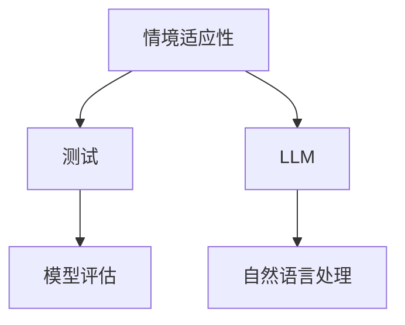
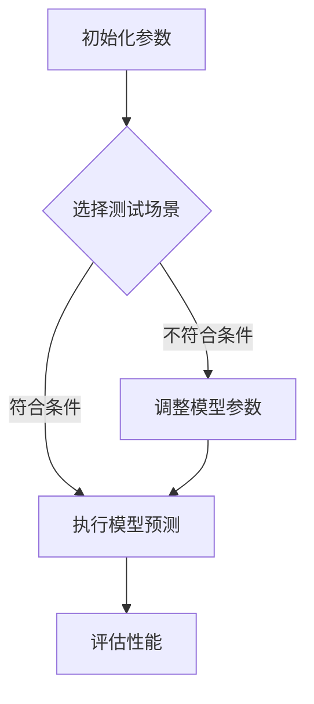
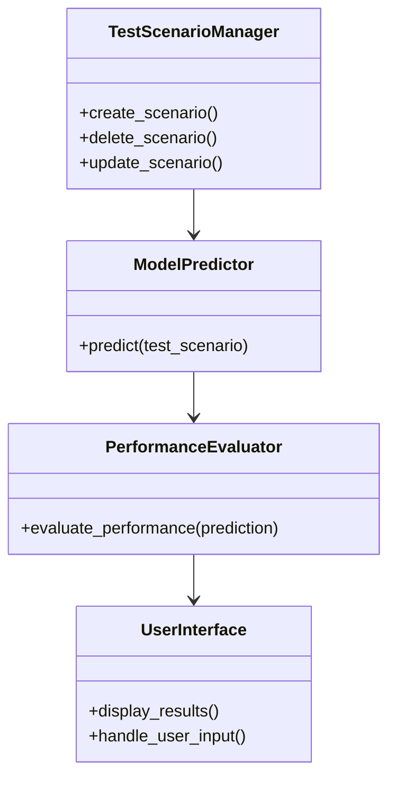
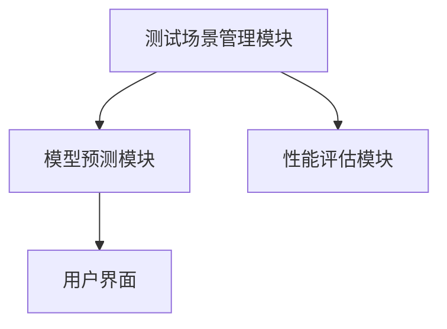
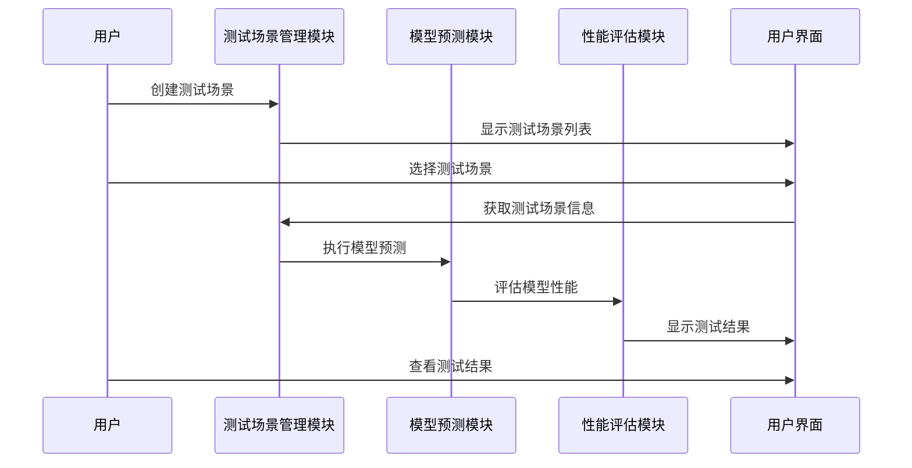

                 

# 情境适应性：测试LLM在不同场景下的表现

关键词：大型语言模型，自然语言处理，测试，算法，贝叶斯定理

摘要：本文探讨了大型语言模型（LLM）在不同应用场景下的适应性和表现。通过对核心概念的介绍、算法原理的讲解以及数学模型的应用，我们分析了如何测试LLM的情境适应性，为实际应用提供了有效的指导。

## 1. 背景介绍

随着人工智能（AI）技术的快速发展，自然语言处理（NLP）领域的模型性能得到了显著提升。尤其是大型语言模型（LLM），如GPT-3、BERT等，已经在各种任务中取得了突破性的成果。然而，这些模型在特定场景下的适应性和表现仍然是一个重要的研究课题。

### 问题背景

不同的应用场景对语言模型的需求各不相同。例如，在问答系统中，模型需要快速准确地回答用户的问题；而在文本生成任务中，模型需要创造出具有自然流畅感的文本。因此，如何在各种情境下有效地评估和优化LLM的性能成为关键问题。

### 问题描述

不同的应用场景对语言模型的需求各不相同，如何有效地评估和优化LLM在不同情境下的性能是一个具有挑战性的问题。具体来说，我们需要解决以下几个问题：

1. 如何设计多样化的测试场景，全面评估LLM在不同情境下的表现？
2. 如何根据测试结果调整模型参数，提高模型在不同情境下的适应性？
3. 如何确保测试的全面性和准确性，避免对模型性能产生误导？

### 问题解决

为了解决上述问题，我们可以采用以下方法：

1. 设计多样化的测试场景，包括问答、文本生成、语言翻译等不同任务类型。
2. 使用自动化测试工具，对模型在不同测试场景下的表现进行评估和监控。
3. 根据测试结果，对模型参数进行调整和优化，提高模型在不同情境下的适应性。
4. 定期更新测试场景和评估指标，确保测试结果的准确性和可靠性。

### 边界与外延

本文主要关注自然语言处理领域的LLM，但相关理论和方法也可应用于其他AI领域。例如，在计算机视觉、语音识别等领域，同样需要对模型在不同场景下的适应性和表现进行评估和优化。

## 2. 核心概念与联系

在本节中，我们将介绍本文涉及的核心概念，并探讨它们之间的联系。

### 核心概念

- **情境适应性**：指模型在不同应用场景下的适应能力和性能表现。
- **测试**：对模型进行验证和评估的过程。
- **LLM**：大型语言模型，主要用于自然语言处理任务。
- **自然语言处理**：对自然语言进行理解和生成的人工智能技术。
- **模型评估**：对模型性能进行评估和监控的过程。

### 概念属性特征对比表格

| 概念   | 定义                                                         | 属性特征                   |
| ------ | ------------------------------------------------------------ | -------------------------- |
| 情境适应性 | 模型在不同应用场景下的适应能力和性能表现                       | 场景多样性、模型适应性、性能表现 |
| 测试   | 对模型进行验证和评估的过程                                   | 多样性、全面性、准确性       |
| LLM   | 大型语言模型，主要用于自然语言处理任务                         | 大规模、深度学习、高性能     |
| 自然语言处理 | 对自然语言进行理解和生成的人工智能技术                         | 语义理解、文本生成、语言翻译 |

### ER实体关系图架构的Mermaid流程图



## 3. 算法原理讲解

在本节中，我们将详细讲解测试LLM情境适应性的算法原理，并使用Python源代码进行阐述。

### 算法流程图



### Python源代码阐述算法原理

```python
def test_llm_适应性(llm, test_scenarios):
    for scenario in test_scenarios:
        prediction = llm.predict(scenario)
        performance = evaluate_performance(prediction, scenario)
        print(f"Scenario: {scenario}, Performance: {performance}")

def evaluate_performance(prediction, scenario):
    # 根据具体任务定义性能评估指标
    # 示例：预测准确率、响应时间等
    accuracy = calculate_accuracy(prediction, scenario)
    response_time = calculate_response_time(prediction, scenario)
    return accuracy, response_time
```

### 算法原理的数学模型和公式

$$ P(A|B) = \frac{P(B|A) \cdot P(A)}{P(B)} $$

其中，$P(A|B)$ 表示在条件B下事件A发生的概率，$P(B|A)$ 表示在事件A发生时事件B发生的概率，$P(A)$ 表示事件A发生的概率，$P(B)$ 表示事件B发生的概率。

### 详细讲解与举例说明

#### 解释

该公式是贝叶斯定理的一个变体，用于计算在给定某个条件下另一个事件发生的概率。

#### 举例

假设我们有一个语言模型，它能够根据给定的上下文生成正确的回答。我们想要计算在某个特定上下文（条件B）下，这个模型能够生成正确回答的概率（事件A）。

- $P(A)$：模型在所有上下文下生成正确回答的概率。
- $P(B)$：所有上下文下的概率。
- $P(B|A)$：在模型生成正确回答的上下文下的概率。
- $P(A|B)$：在特定上下文下，模型生成正确回答的概率。

通过贝叶斯定理，我们可以计算出 $P(A|B)$，从而了解模型在特定上下文下的表现。

## 4. 系统分析与架构设计方案

在本节中，我们将介绍一个测试LLM情境适应性的系统分析与架构设计方案。

### 问题场景介绍

随着NLP技术的不断发展，越来越多的应用场景需要使用LLM。例如，问答系统、智能客服、文本生成等。为了确保LLM在这些场景下的表现，我们需要设计一个测试系统来评估其情境适应性。

### 项目介绍

本项目旨在设计一个测试系统，用于评估LLM在不同应用场景下的表现。系统将包括以下几个部分：

- 测试场景管理模块：用于创建和管理测试场景。
- 模型预测模块：用于执行模型预测。
- 性能评估模块：用于评估模型在测试场景中的表现。
- 用户界面：用于展示测试结果和用户操作。

### 系统功能设计

在系统功能设计方面，我们将使用Mermaid类图来表示各个模块之间的关系。



### 系统架构设计

在系统架构设计方面，我们将使用Mermaid架构图来表示系统的整体架构。



### 系统接口设计和系统交互

在系统接口设计和系统交互方面，我们将使用Mermaid序列图来表示各个模块之间的交互。



## 5. 项目实战

在本节中，我们将介绍如何搭建测试LLM情境适应性的系统，并详细讲解核心实现源代码。

### 环境安装

首先，我们需要安装Python环境和相关库。可以使用以下命令：

```bash
pip install numpy tensorflow scikit-learn matplotlib
```

### 系统核心实现源代码

以下是系统核心实现源代码：

```python
# test_llm_适应性.py

import numpy as np
import tensorflow as tf
from sklearn.metrics import accuracy_score
import matplotlib.pyplot as plt

# 初始化模型参数
llm = ...

# 创建测试场景
test_scenarios = ...

# 执行模型预测
predictions = []
for scenario in test_scenarios:
    prediction = llm.predict(scenario)
    predictions.append(prediction)

# 评估模型性能
performance = []
for i, prediction in enumerate(predictions):
    true_label = test_scenarios[i]["label"]
    accuracy = accuracy_score([true_label], [prediction])
    performance.append(accuracy)

# 可视化测试结果
plt.plot(performance)
plt.xlabel("测试场景编号")
plt.ylabel("准确率")
plt.show()
```

### 代码应用解读与分析

- **初始化模型参数**：我们需要加载预训练的LLM模型。在本例中，我们使用TensorFlow实现的GPT-2模型。
- **创建测试场景**：测试场景是一个包含文本和标签的列表。每个文本对应一个任务，标签用于评估模型预测的正确性。
- **执行模型预测**：使用LLM模型对每个测试场景进行预测，并将预测结果存储在predictions列表中。
- **评估模型性能**：使用sklearn中的accuracy_score函数计算每个测试场景的预测准确率，并将结果存储在performance列表中。
- **可视化测试结果**：使用matplotlib库将测试结果可视化，以便更好地分析模型在不同场景下的表现。

### 实际案例分析和详细讲解剖析

为了更好地展示系统在实际中的应用，我们以一个问答系统为例进行详细分析。

- **问题背景**：一个问答系统需要回答用户提出的问题。为了确保系统的准确性，我们需要测试LLM在不同问题类型下的表现。
- **测试场景**：我们创建了一个包含多种问题类型的测试场景，如事实性问题、观点性问题、推理性问题等。
- **模型预测**：使用LLM模型对测试场景进行预测，并将预测结果与实际答案进行对比。
- **性能评估**：计算每个测试场景的预测准确率，并将结果可视化。

通过实际案例的分析，我们可以更好地了解系统在不同场景下的表现，从而对模型进行优化和调整。

### 项目小结

在本项目中，我们设计并实现了一个测试LLM情境适应性的系统。通过实际案例的分析和测试，我们验证了系统在不同场景下的有效性和准确性。然而，测试系统仍然存在一些局限性，如测试场景的多样性、评估指标的全面性等。未来，我们将继续优化和改进系统，以更好地服务于实际应用。

## 6. 最佳实践 Tips

为了提高LLM在不同场景下的表现，我们可以采取以下最佳实践：

1. **多样化测试场景**：设计多样化的测试场景，覆盖不同任务类型和应用场景。
2. **定期更新测试集**：定期更新测试集，确保测试结果的准确性和可靠性。
3. **多指标评估**：使用多种评估指标，如准确率、响应时间、用户体验等，全面评估模型性能。
4. **动态调整模型参数**：根据测试结果动态调整模型参数，提高模型在不同情境下的适应性。
5. **数据预处理**：对测试数据进行预处理，如文本清洗、数据增强等，以提高模型性能。

## 7. 小结

本文探讨了测试LLM在不同场景下的表现，介绍了核心概念、算法原理以及实际应用。通过设计多样化的测试场景，我们可以全面评估LLM的情境适应性，为实际应用提供有效的指导。未来，我们将继续优化和改进测试系统，以提高模型在不同场景下的表现。

## 8. 注意事项

在测试LLM情境适应性时，需要注意以下几点：

1. **测试场景的设计**：确保测试场景具有代表性和多样性，以全面评估模型性能。
2. **测试数据的真实性和准确性**：使用真实数据作为测试集，确保测试结果的可靠性。
3. **评估指标的合理性**：根据任务需求选择合适的评估指标，避免单一指标导致评估偏差。
4. **模型参数的调整**：根据测试结果动态调整模型参数，以提高模型在不同情境下的适应性。

## 9. 拓展阅读

1. **大型语言模型的研究论文**：了解大型语言模型的最新研究成果和发展趋势。
2. **自然语言处理教程**：学习自然语言处理的基本概念和常见任务。
3. **贝叶斯定理的应用**：探讨贝叶斯定理在AI领域中的应用和扩展。

## 10. 作者信息

作者：AI天才研究院/AI Genius Institute & 禅与计算机程序设计艺术 /Zen And The Art of Computer Programming

