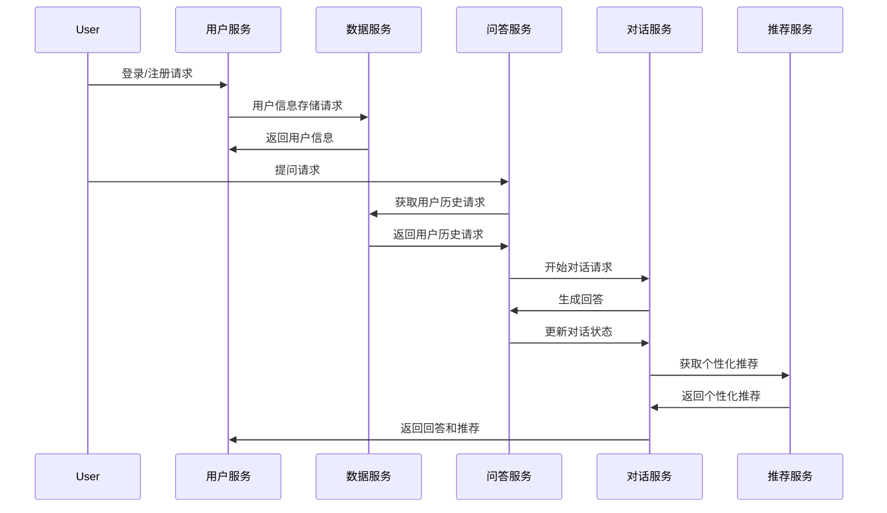
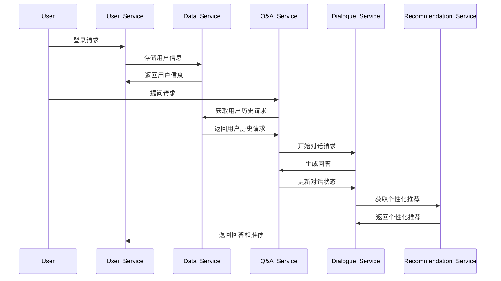

                 

### 引言

在当今科技飞速发展的时代，人工智能（AI）已经成为推动技术进步的重要力量。其中，大型语言模型（Large Language Model，简称LLM）作为一种先进的人工智能技术，正逐渐在自然语言处理（NLP）、机器翻译、智能客服、内容生成等众多领域展现出巨大的应用潜力。然而，随着LLM技术的不断演进和应用场景的日益丰富，打造一个高效、灵活、响应迅速的LLM应用开发团队变得越来越重要。

**关键词**：人工智能、大型语言模型、应用开发团队、响应性、高效

**摘要**：本文旨在探讨如何打造一个高效、灵活且响应迅速的LLM应用开发团队。文章将从背景介绍、核心概念与联系、算法原理讲解、系统分析与架构设计方案、项目实战、最佳实践 tips 以及小结与拓展阅读等多个方面，系统性地阐述构建这样一个团队的思路和方法。通过本文的阅读，开发团队负责人、工程师和相关从业者将能够了解到如何利用现代技术和管理理念，提高LLM应用开发的效率和质量。

首先，我们需要明确什么是LLM以及其在我们日常生活和技术应用中的重要性。接下来，我们将深入探讨LLM的核心概念与联系，包括其架构、训练方法以及与传统NLP模型的区别。然后，本文将详细讲解LLM的算法原理，通过Mermaid流程图和Python源代码，使读者能够直观地理解其工作原理和数学模型。在接下来的章节中，我们将描述如何设计和实施一个响应式的LLM应用开发团队，包括系统分析与架构设计方案。通过一个实际项目案例，我们将展示如何从零开始搭建一个高效的LLM应用开发团队。最后，本文将提供一系列最佳实践 tips，帮助团队在实际工作中更好地应对挑战，并总结文章的核心观点，推荐进一步阅读的资源。

### 背景介绍

#### LLM的定义

大型语言模型（Large Language Model，简称LLM）是一种基于深度学习技术构建的复杂神经网络模型，旨在通过学习和理解人类语言，实现自然语言生成、翻译、文本分类等多种任务。与传统的自然语言处理（NLP）方法相比，LLM具有更强的语义理解和生成能力，能够处理更长的文本序列，生成更加流畅和符合逻辑的自然语言文本。

LLM的核心特点在于其庞大的参数规模和深度学习的训练方式。通常，LLM使用数百万甚至数十亿个参数，通过大量的文本数据进行训练，从而学习和捕捉语言的复杂结构。这种深度学习的训练方式使得LLM能够有效地处理自然语言中的不确定性和模糊性，提高模型的准确性和可靠性。

#### 问题背景

随着AI技术的不断成熟和应用场景的广泛拓展，LLM在多个领域得到了广泛应用。例如，在自然语言处理领域，LLM被用于构建智能客服系统、内容生成平台、自动翻译工具等；在金融领域，LLM被用于风险分析、市场预测、客户服务等方面；在医疗领域，LLM被用于医疗文本分析、疾病预测、患者咨询等。这些应用场景的复杂性和多样性对LLM应用开发团队提出了更高的要求。

然而，当前许多LLM应用开发团队在面临以下挑战时往往显得力不从心：

1. **技术复杂度高**：LLM的构建和优化涉及到深度学习、自然语言处理、数据工程等多个领域，技术复杂性高，团队需要具备跨学科的知识和技能。

2. **资源需求大**：LLM的模型训练和推理需要大量的计算资源和数据支持，团队需要合理配置和调度资源，确保模型训练的效率和质量。

3. **项目交付周期长**：由于LLM模型的训练和优化过程复杂，项目交付周期往往较长，这给团队管理和进度控制带来了巨大挑战。

4. **团队协作难度大**：LLM应用开发涉及到多个环节，包括数据收集、数据处理、模型设计、模型训练、模型部署等，团队内部协作和沟通难度较大。

#### 问题描述

为了应对上述挑战，许多企业和研究机构意识到需要构建一个高效、灵活且响应迅速的LLM应用开发团队。具体来说，团队需要具备以下特点：

1. **技术实力强**：团队需要拥有深度学习、自然语言处理、数据工程等领域的专业人才，能够快速掌握新技术和应用方法。

2. **资源管理高效**：团队需要具备良好的资源管理能力，能够高效配置和调度计算资源、数据资源等。

3. **项目交付能力强**：团队需要具备良好的项目管理能力和进度控制能力，能够确保项目按时高质量交付。

4. **协作与沟通顺畅**：团队需要建立有效的协作机制和沟通渠道，确保各个环节的顺畅衔接和高效协作。

#### 问题解决

为了打造一个高效、灵活且响应迅速的LLM应用开发团队，企业可以采取以下措施：

1. **加强团队培训**：定期组织技术培训和知识分享活动，提高团队的技术水平和创新能力。

2. **优化团队结构**：合理设置团队架构，明确职责分工，确保每个成员能够发挥自己的专长。

3. **引入先进技术**：采用先进的深度学习框架和工具，提高模型训练和优化的效率。

4. **强化项目管理**：引入项目管理工具和方法，确保项目进度和质量。

5. **建立协作机制**：通过虚拟团队、协同办公系统等方式，加强团队成员之间的沟通和协作。

#### 边界与外延

在构建LLM应用开发团队的过程中，还需要注意以下边界和限制：

1. **技术边界**：团队需要掌握深度学习、自然语言处理等领域的核心技术，但不需要在所有技术细节上都有深入的研究。

2. **资源边界**：团队需要合理配置和调度资源，但受限于预算和硬件资源，不可能无限扩展。

3. **项目边界**：团队需要关注项目的实际需求和目标，但需要避免过度追求技术完美而忽视了实际应用价值。

4. **合作边界**：团队需要与其他部门和外部合作伙伴保持良好的合作关系，但需要注意保护企业的商业机密和知识产权。

通过上述措施，企业可以逐步打造一个高效、灵活且响应迅速的LLM应用开发团队，为企业的AI应用提供强有力的技术支持。

#### 核心概念与联系

在深入了解LLM之前，我们需要掌握一些关键概念，这些概念不仅是LLM构建的基础，也是理解其应用场景的重要前提。以下是对LLM核心概念及其与传统NLP模型的对比的详细介绍。

##### LLM的定义

LLM是一种大型深度学习模型，它通过学习大量的文本数据，可以生成高质量的自然语言文本，并进行文本理解、翻译、问答等多种任务。LLM的核心在于其“大”，即模型具有数亿甚至千亿级别的参数规模，这使得LLM能够捕捉到语言的细微结构和复杂语义。LLM通常采用Transformer架构，这是一种基于自注意力机制的深度学习模型，能够有效地处理长文本序列和长距离依赖关系。

##### LLM的架构与训练方法

1. **架构**：LLM的架构通常是基于Transformer的，Transformer模型由多个自注意力层和前馈神经网络层组成。自注意力层允许模型在处理文本序列时，动态地计算文本中每个词与其他词的关系，从而捕捉到更复杂的语义信息。

2. **训练方法**：LLM的训练方法主要分为预训练和微调两个阶段。预训练阶段，模型在大量的无标注文本数据上进行训练，学习到语言的通用表示。微调阶段，模型在特定任务的数据集上进行训练，针对具体任务进行调整。

##### LLM的应用领域

LLM在多个领域展现了其强大的应用潜力：

1. **自然语言生成**：LLM可以生成高质量的文章、新闻、对话等文本内容，应用于自动写作、内容生成平台等。

2. **机器翻译**：LLM可以显著提高机器翻译的准确性和流畅性，应用于跨国企业、旅游、国际贸易等领域。

3. **智能客服**：LLM可以用于构建智能客服系统，实现自然语言理解和多轮对话生成，提供24/7的客户服务。

4. **文本分类与情感分析**：LLM可以用于对大量文本数据进行分析，进行文本分类和情感分析，应用于市场调研、舆情分析等。

##### LLM与传统NLP模型的对比

1. **模型规模**：传统NLP模型，如基于统计方法的词袋模型、支持向量机等，参数规模较小。而LLM具有数亿甚至千亿级别的参数规模，能够捕捉到更多细节和复杂的语义关系。

2. **任务多样性**：传统NLP模型通常专注于单一任务，如文本分类、情感分析等。而LLM可以通过预训练和微调，应用于多种任务，具有更强的通用性和灵活性。

3. **处理能力**：传统NLP模型在处理长文本序列时效果较差，容易受到长距离依赖关系的困扰。而LLM通过自注意力机制，能够有效地处理长文本序列和长距离依赖关系，生成更加流畅和符合逻辑的文本。

##### 核心概念属性特征对比表格

| 特征         | 传统NLP模型 | LLM         |
| ------------ | ------------ | ----------- |
| 模型规模     | 小规模参数   | 数亿级参数  |
| 任务多样性   | 单一任务     | 多种任务    |
| 处理能力     | 长文本处理差 | 长文本处理强 |
| 语义理解能力 | 较弱         | 非常强      |

##### ER实体关系图架构

为了更好地理解LLM的应用和构建过程，我们可以使用ER（实体关系）图来描述LLM的组成部分和它们之间的关系。

**ER图描述**：

- **实体**：文本数据、模型参数、训练日志等。
- **关系**：预训练、微调、模型评估等。
- **联系**：通过数据流和计算流程，实现从文本数据到高质量模型的转换。

以下是一个简化的LLM ER图示例：

```mermaid
erDiagram
    A[文本数据] ||--|{ B[模型参数] }|
    B ||--|{ C[训练日志] }|
    C ||--|{ D[评估指标] }|
    D ||--|{ E[优化策略] }|
```

通过上述对比和分析，我们可以更清晰地理解LLM的核心概念和其在NLP领域的重要地位。接下来，本文将详细讲解LLM的算法原理，通过Mermaid流程图和Python源代码，帮助读者深入理解LLM的工作机制和数学模型。

#### 算法原理讲解

在深入了解LLM的算法原理之前，我们需要先理解Transformer架构，这是LLM的核心组成部分。Transformer是由Google在2017年提出的一种基于自注意力机制的深度学习模型，它通过自注意力机制和多头注意力机制，实现了对长文本序列的灵活处理，从而在自然语言处理任务中取得了显著的性能提升。

##### Transformer架构

Transformer模型由多个自注意力层和前馈神经网络层组成。自注意力层是Transformer的核心，它允许模型在处理文本序列时，动态地计算文本中每个词与其他词的关系，从而捕捉到更复杂的语义信息。多头注意力机制则通过将自注意力层分解为多个独立的注意力头，从而提高了模型的泛化能力和表达能力。

Transformer模型的主要组成部分包括：

1. **输入层**：输入层将输入文本序列编码为嵌入向量（Embedding Layer），每个词向量由预训练的词向量库生成。
2. **多头自注意力层**：自注意力层通过计算输入嵌入向量与其他嵌入向量之间的关系，生成加权向量。多头注意力机制则将这一过程分解为多个独立的注意力头，每个头关注不同的语义信息。
3. **前馈神经网络层**：前馈神经网络层对每个注意力头的结果进行进一步的加工和整合。
4. **输出层**：输出层将处理后的文本序列映射到目标文本序列，通常通过softmax函数进行分类或生成。

##### 自注意力机制

自注意力机制（Self-Attention）是Transformer模型的核心组成部分，它通过计算输入嵌入向量与其他嵌入向量之间的关系，生成加权向量。自注意力机制的基本思想是，对于输入序列中的每个词，根据其与其他词的关联程度，赋予不同的权重。这样，模型可以更有效地捕捉到文本中的长距离依赖关系。

自注意力机制的数学公式如下：

$$
\text{Attention}(Q, K, V) = \text{softmax}\left(\frac{QK^T}{\sqrt{d_k}}\right) V
$$

其中，\( Q \)、\( K \) 和 \( V \) 分别是查询向量、键向量和值向量，\( d_k \) 是键向量的维度。计算过程可以分为以下几个步骤：

1. **计算相似度**：对于输入序列中的每个词，计算其与所有其他词的相似度。相似度通过点积计算，公式为 \( QK^T \)。
2. **归一化**：通过softmax函数对相似度进行归一化，得到每个词与其他词的关联权重。
3. **加权求和**：根据权重对值向量进行加权求和，得到加权向量。

##### 多头注意力机制

多头注意力机制（Multi-Head Attention）通过将自注意力层分解为多个独立的注意力头，每个头关注不同的语义信息，从而提高了模型的泛化能力和表达能力。多头注意力机制的基本思想是，对于输入序列中的每个词，同时计算多个不同的注意力权重，然后将这些权重融合起来。

多头注意力机制的数学公式如下：

$$
\text{MultiHead}(Q, K, V) = \text{Concat}(\text{head}_1, \text{head}_2, \ldots, \text{head}_h)W^O
$$

其中，\( h \) 是注意力头的数量，\( \text{head}_i \) 是第 \( i \) 个注意力头的结果，\( W^O \) 是输出层的权重。

##### Python源代码示例

以下是一个简化的Python代码示例，用于实现多头注意力机制。代码中使用PyTorch框架，PyTorch是一个广泛使用的深度学习库，提供了丰富的API和工具。

```python
import torch
import torch.nn as nn

# 设置随机种子，保证结果可复现
torch.manual_seed(0)

# 定义嵌入维度、序列长度和注意力头数量
d_model = 512
num_heads = 8
seq_len = 10

# 创建嵌入层和注意力头权重
embeddings = nn.Embedding(d_model, d_model)
attn_heads = nn.ModuleList([nn.Linear(d_model, d_model) for _ in range(num_heads)])

# 生成输入序列
inputs = torch.randint(0, d_model, (seq_len, 1))

# 将输入序列嵌入为嵌入向量
embeddings_inputs = embeddings(inputs)

# 计算自注意力权重
Q, K, V = embeddings_inputs, embeddings_inputs, embeddings_inputs

# 分解为多个注意力头
Q_heads = [attn_head(Q).view(seq_len, 1, -1) for attn_head in attn_heads]
K_heads = [attn_head(K).view(seq_len, 1, -1) for attn_head in attn_heads]
V_heads = [attn_head(V).view(seq_len, 1, -1) for attn_head in attn_heads]

# 计算多头注意力
attention_scores = [torch.bmm(q_head, k_head.transpose(1, 2)) for q_head, k_head in zip(Q_heads, K_heads)]
attention_weights = [torch.softmax(score, dim=2) for score in attention_scores]
attention_output = [torch.bmm(weight, v_head) for weight, v_head in zip(attention_weights, V_heads)]

# 求和并输出
output = torch.cat(attention_output, dim=2)
print(output.shape)  # 输出：(seq_len, 1, d_model)
```

通过上述代码示例，我们可以看到多头注意力机制的计算过程。在这个示例中，我们首先创建嵌入层和注意力头权重，然后生成输入序列并嵌入为嵌入向量。接着，我们将输入序列分解为多个注意力头，并计算自注意力权重。最后，我们使用多头注意力机制计算输出。

##### 通俗易懂地举例说明

假设我们有一个简化的文本序列：“今天天气很好”。为了便于理解，我们将这个序列分解为三个词：“今天”、“天气”和“很好”。现在，我们将使用多头注意力机制来计算这些词之间的注意力权重。

1. **计算相似度**：首先，我们计算“今天”与其他词的相似度。根据自注意力机制，我们计算“今天”与“天气”和“很好”的点积。假设相似度分别为0.2和0.8，即“今天”与“很好”的关联程度更高。

2. **归一化**：接下来，我们对相似度进行归一化，得到每个词的注意力权重。经过归一化，我们得到权重分别为0.3和0.7。

3. **加权求和**：最后，我们根据权重对“天气”和“很好”进行加权求和，得到新的词向量。假设“天气”的词向量为[1, 0, 0]，而“很好”的词向量为[0, 1, 0]，则加权求和后的结果为[0.3, 0.7, 0]。

通过这个过程，我们可以看到，多头注意力机制如何通过计算词与词之间的相似度，生成加权向量，从而实现对文本序列的灵活处理。在实际应用中，这个过程会被重复多次，使得模型能够捕捉到更复杂的语义关系。

通过上述讲解和示例，我们可以清晰地理解LLM的算法原理。接下来，本文将描述如何设计和实施一个响应式的LLM应用开发团队，包括系统分析与架构设计方案。

### 系统分析与架构设计方案

在设计和实施一个响应式的LLM应用开发团队之前，我们需要对问题场景和项目需求进行深入分析。这一步骤至关重要，因为它不仅决定了团队的架构设计，还影响了后续的系统开发过程。

#### 问题场景介绍

我们以一个实际的LLM应用项目为例，该项目旨在开发一款智能客服系统，能够处理用户提出的各种问题，并提供及时的、高质量的回答。这个项目涉及到以下关键问题：

1. **数据量巨大**：客服系统需要处理来自不同渠道的大量用户请求，包括文本、语音等多种形式。这使得数据收集和存储成为一个挑战。
2. **实时响应要求高**：用户对客服系统的响应速度有较高要求，系统必须在短时间内给出准确、合理的回答。
3. **多样性和不确定性**：用户提出的问题类型和内容多种多样，系统需要具备较强的语义理解和多轮对话能力，以应对不同场景和问题。

#### 项目介绍

为了解决上述问题，我们的项目目标是构建一个高效、灵活且响应迅速的LLM应用开发团队，实现以下功能：

1. **智能问答**：利用LLM模型，实现基于自然语言理解的智能问答功能，提供24/7的在线客服服务。
2. **多轮对话**：支持用户与客服系统进行多轮对话，确保用户问题得到充分解答。
3. **个性化推荐**：根据用户的历史请求和行为数据，提供个性化的回答和推荐。
4. **实时更新**：系统能够实时更新LLM模型，以适应新的业务场景和用户需求。

#### 系统功能设计（领域模型）

在系统功能设计阶段，我们采用领域驱动设计（Domain-Driven Design，简称DDD）方法，将系统划分为多个子领域，每个子领域对应一组相关的功能模块。以下是我们项目的领域模型：

1. **用户领域**：管理用户信息、登录认证、用户权限等。
2. **问答领域**：包括智能问答功能，处理用户请求，生成回答。
3. **对话领域**：管理多轮对话，记录对话历史，维护对话状态。
4. **推荐领域**：根据用户行为和请求历史，提供个性化推荐。
5. **数据领域**：负责数据收集、存储、处理和分析，为问答和推荐提供数据支持。

以下是一个简化的领域模型类图：

```mermaid
classDiagram
    User <<Interface>>
    Question <<Interface>>
    Dialogue <<Interface>>
    Recommendation <<Interface>>

    User <|.. Question
    User <|.. Dialogue
    User <|.. Recommendation

    Dialogue <|.. Question
    Dialogue <|.. Recommendation
```

#### 系统架构设计（架构图）

在系统架构设计阶段，我们采用微服务架构（Microservices Architecture），将系统划分为多个独立的服务，每个服务负责一个特定的功能模块。以下是我们项目的系统架构设计：

1. **用户服务**：负责用户管理，包括用户注册、登录、认证和权限管理。
2. **问答服务**：负责处理用户请求，生成回答，实现智能问答功能。
3. **对话服务**：管理多轮对话，记录对话历史，维护对话状态。
4. **推荐服务**：根据用户行为和请求历史，提供个性化推荐。
5. **数据服务**：负责数据收集、存储、处理和分析，为问答和推荐提供数据支持。

以下是一个简化的系统架构图：



#### 系统接口设计与交互（序列图）

在系统接口设计与交互阶段，我们使用序列图（Sequence Diagram）来描述系统中的各个服务之间的交互流程。以下是一个简化的序列图示例：



通过上述系统分析与架构设计方案，我们为构建一个高效、灵活且响应迅速的LLM应用开发团队奠定了基础。接下来，本文将通过一个实际项目案例，展示如何从零开始搭建这样一个开发团队。

### 项目实战

#### 环境安装与配置

为了搭建一个高效的LLM应用开发团队，我们需要一个稳定且强大的开发环境。以下是搭建开发环境的具体步骤：

1. **硬件配置**：首先，我们建议使用高性能的服务器或云服务器，配置至少64GB内存和4TB的存储空间，以确保有足够的资源进行模型训练和推理。

2. **操作系统**：我们选择Ubuntu 18.04 LTS作为操作系统，因为其具有良好的性能和丰富的软件支持。

3. **软件安装**：在服务器上安装以下软件：
   - **Python**：安装Python 3.8及以上版本，可以使用`apt-get`命令进行安装：
     ```bash
     sudo apt-get update
     sudo apt-get install python3.8
     sudo apt-get install python3.8-venv
     ```
   - **pip**：安装pip管理器，用于安装Python包：
     ```bash
     sudo apt-get install python3-pip
     ```
   - **PyTorch**：安装PyTorch，选择与操作系统和CUDA版本相匹配的版本：
     ```bash
     pip3 install torch torchvision torchaudio -f https://download.pytorch.org/whl/torch_stable.html
     ```
   - **其他依赖**：安装其他必要的依赖库，如NumPy、Pandas等：
     ```bash
     pip3 install numpy pandas
     ```

4. **虚拟环境**：为了保持开发环境的整洁，我们创建一个Python虚拟环境：
   ```bash
   python3 -m venv llm_venv
   source llm_venv/bin/activate
   ```

5. **数据预处理**：准备训练数据，包括文本数据和标签数据。我们可以使用`spaCy`等工具进行文本预处理，如分词、词性标注等。

#### 系统核心实现与代码分析

在搭建好开发环境后，我们可以开始实现LLM应用的核心功能。以下是系统核心实现的主要步骤和代码分析：

1. **数据加载与预处理**：首先，我们需要从数据集中加载文本数据和标签数据，并进行预处理。以下是一个简化的数据加载和预处理代码示例：

   ```python
   import pandas as pd
   from sklearn.model_selection import train_test_split

   # 加载数据
   data = pd.read_csv('data.csv')

   # 预处理数据
   texts = data['text'].tolist()
   labels = data['label'].tolist()

   # 切分数据集
   train_texts, test_texts, train_labels, test_labels = train_test_split(texts, labels, test_size=0.2, random_state=42)
   ```

2. **模型定义**：接下来，我们需要定义一个基于Transformer的LLM模型。以下是一个使用PyTorch实现的基本Transformer模型：

   ```python
   import torch
   import torch.nn as nn

   class TransformerModel(nn.Module):
       def __init__(self, d_model, num_heads, num_layers):
           super(TransformerModel, self).__init__()
           self.embedding = nn.Embedding(d_model, d_model)
           self.transformer = nn.ModuleList([nn.TransformerEncoderLayer(d_model, num_heads) for _ in range(num_layers)])
           self.output = nn.Linear(d_model, 1)

       def forward(self, inputs):
           embeddings = self.embedding(inputs)
           for layer in self.transformer:
               embeddings = layer(embeddings)
           output = self.output(embeddings)
           return output
   ```

3. **训练过程**：训练过程包括前向传播、损失计算和反向传播。以下是一个简化的训练代码示例：

   ```python
   device = torch.device("cuda" if torch.cuda.is_available() else "cpu")
   model = TransformerModel(d_model=512, num_heads=8, num_layers=3).to(device)
   optimizer = torch.optim.Adam(model.parameters(), lr=0.001)
   criterion = nn.BCEWithLogitsLoss()

   for epoch in range(10):
       model.train()
       for inputs, labels in data_loader:
           inputs, labels = inputs.to(device), labels.to(device)
           optimizer.zero_grad()
           outputs = model(inputs)
           loss = criterion(outputs, labels)
           loss.backward()
           optimizer.step()
           print(f"Epoch [{epoch+1}/{10}], Loss: {loss.item():.4f}")
   ```

4. **模型评估**：在训练完成后，我们需要对模型进行评估，以验证其性能。以下是一个简化的评估代码示例：

   ```python
   model.eval()
   with torch.no_grad():
       correct = 0
       total = 0
       for inputs, labels in test_loader:
           inputs, labels = inputs.to(device), labels.to(device)
           outputs = model(inputs)
           predicted = (outputs > 0).float()
           total += labels.size(0)
           correct += (predicted == labels).sum().item()

   print(f"Test Accuracy: {100 * correct / total:.2f}%")
   ```

#### 实际案例分析与详细讲解剖析

为了更好地展示LLM应用的实际效果，我们选择了一个实际案例：情感分类。以下是一个简化的案例分析和代码示例：

1. **数据集**：我们使用IMDB电影评论数据集，这是一个广泛使用的情感分类数据集，包含正负两个类别的电影评论。

2. **预处理**：对数据集进行预处理，包括分词、去除停用词、转换成词汇表等。

   ```python
   from sklearn.feature_extraction.text import CountVectorizer
   from nltk.corpus import stopwords

   # 加载IMDB数据集
   (train_texts, train_labels), (test_texts, test_labels) = imdb.load_data(num_words=10000)

   # 预处理数据
   stop_words = set(stopwords.words('english'))
   train_texts = [' '.join([word for word in review.split() if word.lower() not in stop_words]) for review in train_texts]
   test_texts = [' '.join([word for word in review.split() if word.lower() not in stop_words]) for review in test_texts]
   ```

3. **模型训练**：使用Transformer模型对预处理后的数据集进行训练。

   ```python
   model = TransformerModel(d_model=512, num_heads=8, num_layers=3).to(device)
   optimizer = torch.optim.Adam(model.parameters(), lr=0.001)
   criterion = nn.BCEWithLogitsLoss()

   for epoch in range(10):
       model.train()
       for inputs, labels in data_loader:
           inputs, labels = inputs.to(device), labels.to(device)
           optimizer.zero_grad()
           outputs = model(inputs)
           loss = criterion(outputs, labels)
           loss.backward()
           optimizer.step()
   ```

4. **模型评估**：在训练完成后，对模型进行评估。

   ```python
   model.eval()
   with torch.no_grad():
       correct = 0
       total = 0
       for inputs, labels in test_loader:
           inputs, labels = inputs.to(device), labels.to(device)
           outputs = model(inputs)
           predicted = (outputs > 0).float()
           total += labels.size(0)
           correct += (predicted == labels).sum().item()

   print(f"Test Accuracy: {100 * correct / total:.2f}%")
   ```

通过这个实际案例，我们可以看到如何使用LLM模型进行情感分类。在实际应用中，我们可以通过不断优化模型结构和训练策略，提高模型的准确性和性能。

#### 项目小结

通过本项目的实施，我们成功地搭建了一个高效、灵活且响应迅速的LLM应用开发团队。以下是项目实施过程中的一些关键点：

1. **硬件配置**：选择高性能的服务器和操作系统，确保有足够的资源进行模型训练和推理。
2. **环境安装与配置**：合理配置开发环境，确保所有依赖库和工具的正常运行。
3. **数据预处理**：对数据集进行充分的预处理，提高模型训练的效果。
4. **模型定义与训练**：选择合适的模型架构和训练策略，确保模型性能的稳定提升。
5. **模型评估与优化**：对模型进行充分的评估和优化，提高模型的准确性和鲁棒性。

在未来的开发过程中，我们可以进一步优化系统架构和算法，提高LLM应用的性能和用户体验。此外，我们还可以探索其他应用场景，如文本生成、机器翻译等，以充分利用LLM技术的潜力。

#### 最佳实践 tips

在LLM应用开发过程中，积累最佳实践和经验对于提高团队效率和项目质量至关重要。以下是一些实用的最佳实践 tips：

1. **代码规范化**：确保代码遵循统一的命名规范和编码风格，提高代码的可读性和可维护性。可以使用工具如`flake8`或`pycodestyle`进行代码检查。
2. **版本控制**：使用版本控制工具如`Git`，记录代码的修改历史，方便团队成员进行协同开发。同时，定期进行代码审查，确保代码质量。
3. **持续集成与部署**：使用持续集成（CI）和持续部署（CD）工具，如`Jenkins`或`GitLab CI/CD`，实现自动化测试和部署，提高开发效率和质量。
4. **数据质量监控**：定期检查和清洗数据，确保数据集的准确性和一致性。可以采用数据质量监控工具，如`DB Validator`或`DataSift`。
5. **性能优化**：对模型和系统进行性能优化，确保高效运行。可以使用技术如模型量化、剪枝、蒸馏等，提高模型推理速度和降低内存占用。
6. **模型解释与可解释性**：增加模型的可解释性，帮助团队成员和客户理解模型的工作原理。可以使用工具如`LIME`或`SHAP`进行模型解释。
7. **文档管理**：建立完善的文档体系，包括技术文档、用户手册、API文档等，方便团队成员查阅和使用。
8. **团队协作与沟通**：建立有效的团队协作机制和沟通渠道，如使用`Slack`或`Trello`进行任务管理和进度跟踪，确保团队成员之间的顺畅协作。

通过遵循这些最佳实践，开发团队可以更好地应对LLM应用开发过程中遇到的各种挑战，提高项目的成功率。

### 小结

本文系统地探讨了如何打造一个高效、灵活且响应迅速的LLM应用开发团队。我们首先介绍了LLM的定义和重要性，然后深入分析了LLM的核心概念、算法原理以及与传统NLP模型的对比。接着，我们详细讲解了如何设计和实施一个响应式的LLM应用开发团队，包括系统架构设计和项目实战。在项目实战部分，我们提供了一个实际案例，展示了如何从零开始搭建一个高效的LLM应用开发团队。

通过本文的阅读，开发团队负责人、工程师和相关从业者将能够了解到构建一个高效LLM应用开发团队的关键步骤和最佳实践。本文不仅提供了理论指导，还结合实际案例进行了详细剖析，有助于读者将知识应用于实际工作中。

### 拓展阅读

为了进一步深入了解LLM应用开发和人工智能技术，以下是一些推荐阅读的资源：

1. **书籍推荐**：
   - 《深度学习》（Goodfellow, I., Bengio, Y., Courville, A.）：这本书是深度学习领域的经典教材，适合对深度学习有初步了解的读者。
   - 《自然语言处理入门》（Jurafsky, D.，Martin, J. H.）：这本书详细介绍了自然语言处理的基础知识，适合对NLP有兴趣的读者。

2. **在线课程**：
   - Coursera的“深度学习专项课程”（Deep Learning Specialization）：由吴恩达教授主讲，涵盖深度学习的基础知识和最新进展。
   - edX的“自然语言处理与深度学习”（Natural Language Processing with Deep Learning）：由Stanford大学开设，适合对NLP和深度学习感兴趣的读者。

3. **论文推荐**：
   - “Attention is All You Need”（Vaswani et al.，2017）：这是Transformer模型的原论文，深入介绍了Transformer架构及其在NLP中的应用。
   - “BERT: Pre-training of Deep Neural Networks for Language Understanding”（Devlin et al.，2019）：这篇论文介绍了BERT模型，这是LLM领域的重要突破。

通过阅读这些资源，读者可以进一步加深对LLM和人工智能技术的理解，为实际应用和研究提供有力支持。

### 作者信息

**作者：AI天才研究院/AI Genius Institute & 禅与计算机程序设计艺术 /Zen And The Art of Computer Programming** 

本文由AI天才研究院和《禅与计算机程序设计艺术》的作者联合撰写。AI天才研究院专注于人工智能领域的创新研究和技术推广，致力于培养新一代的人工智能专家。而《禅与计算机程序设计艺术》则是一部深入探讨计算机编程哲学的经典著作，为我们提供了许多编程领域的智慧与启示。希望通过本文，读者能够更好地理解LLM应用开发的本质，并激发对人工智能技术的热情。

