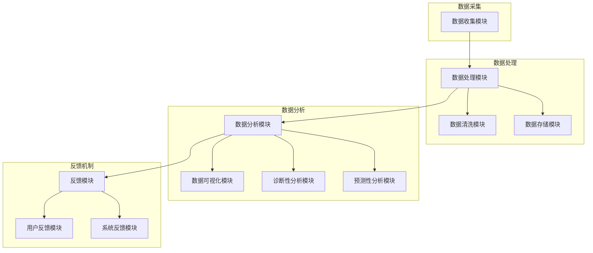
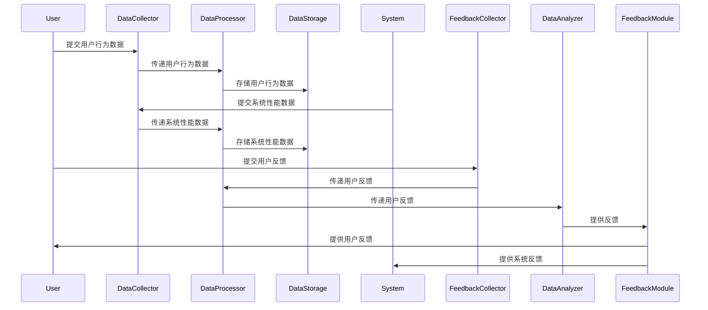

                 

### 《持续反馈机制：保持大型应用开发的敏捷性》

---

**关键词：** 持续反馈机制、大型应用开发、敏捷性、反馈循环、系统架构

**摘要：** 在本文中，我们将深入探讨持续反馈机制在大型应用开发中的作用，以及如何通过有效的持续反馈机制保持开发的敏捷性。文章将从背景介绍、核心概念解析、实践方法、敏捷开发融合、技术架构设计、挑战与解决以及未来发展趋势等多个方面展开讨论，旨在为读者提供一份全面的技术指南。

---

## 第1章 引言

### 1.1 背景介绍

#### 大型应用开发的挑战

随着技术的飞速发展和业务需求的不断变化，大型应用的开发变得越来越复杂。在开发过程中，我们面临诸多挑战，包括：

- **需求变化频繁**：在项目进行中，需求可能会频繁变更，这要求我们具备快速适应变化的能力。
- **复杂架构设计**：大型应用通常具有复杂的架构设计，这需要开发者对系统有深刻的理解。
- **性能优化需求**：为了保证应用的稳定性和高效性，需要进行持续的优化。
- **团队协作困难**：大型项目的开发涉及多个团队和成员，协调和沟通成为一大难题。

#### 持续反馈机制的重要性

持续反馈机制在大规模应用开发中具有至关重要的地位。它可以帮助我们：

- **快速响应变化**：通过持续的反馈，可以及时了解应用的实际运行情况，从而快速响应需求变化。
- **优化开发流程**：持续的反馈可以帮助我们识别和解决开发过程中的问题，从而优化开发流程。
- **提高系统质量**：通过持续的反馈，可以持续改进应用的质量，提高用户体验。
- **促进团队协作**：持续的反馈可以加强团队成员之间的沟通和协作，提高团队的整体效率。

### 1.2 持续反馈的概念与原理

#### 持续反馈的定义

持续反馈机制是指在项目开发过程中，通过定期的、及时的反馈来指导开发工作，从而确保项目能够按照预期进行。

#### 持续反馈的优势

- **快速响应**：能够快速识别和解决问题，减少延迟。
- **持续改进**：通过持续的反馈，可以不断优化系统，提高性能。
- **提高质量**：持续的反馈可以帮助发现潜在的问题，从而提高系统的质量。

#### 持续反馈的原理

持续反馈机制的核心在于建立一个高效的反馈循环，包括以下步骤：

1. **数据收集**：收集与项目相关的数据，如用户反馈、系统性能指标等。
2. **数据分析**：对收集到的数据进行分析，识别问题和机会。
3. **反馈与调整**：根据分析结果，对项目进行反馈和调整。

### 1.3 持续反馈机制的架构设计

#### 持续反馈的流程

持续反馈机制的流程可以分为以下几个阶段：

1. **需求分析**：明确项目的目标和需求。
2. **开发与测试**：进行编码和测试，确保系统的质量和稳定性。
3. **用户反馈收集**：收集用户的反馈，了解他们的使用情况和需求。
4. **数据分析**：对收集到的数据进行分析，识别问题和机会。
5. **反馈与调整**：根据分析结果，对项目进行反馈和调整。

#### 持续反馈的技术实现

持续反馈机制的技术实现主要包括以下几个方面：

- **数据收集**：使用日志、监控工具等收集系统的运行数据。
- **数据分析**：使用数据分析工具对收集到的数据进行分析。
- **反馈机制**：建立反馈渠道，确保反馈能够及时传达给相关团队和成员。

#### 持续反馈的数据处理

持续反馈机制的数据处理主要包括以下几个方面：

- **数据清洗**：清洗和整理收集到的数据，确保数据的准确性和完整性。
- **数据存储**：将清洗后的数据存储在数据库中，以便后续分析。
- **数据挖掘**：使用数据挖掘技术，从数据中发现潜在的模式和趋势。

---

在接下来的章节中，我们将继续深入探讨持续反馈机制的具体实践方法、如何将其与敏捷开发融合、技术架构设计、挑战与解决以及未来发展趋势等内容。

---

### 请在下一章节中继续深入探讨持续反馈机制的实践方法。如何进行数据的收集、分析以及如何将分析结果应用到大型应用开发的实际案例中，将是本章节的重点内容。同时，我们将通过具体案例来展示如何通过持续反馈机制保持大型应用开发的敏捷性。

---

## 第2章 持续反馈机制的实践方法

### 2.1 持续反馈的收集

#### 数据收集的方法

在大型应用开发中，数据收集是持续反馈机制的基础。以下是一些常见的数据收集方法：

- **用户行为数据**：通过用户行为跟踪工具收集用户在应用中的操作数据，如点击、浏览、搜索等。
- **系统性能数据**：通过系统监控工具收集系统运行过程中的性能数据，如CPU使用率、内存占用、响应时间等。
- **错误日志**：收集应用运行过程中产生的错误日志，以识别和解决系统故障。
- **用户反馈**：通过在线调查、用户反馈表单等方式收集用户的意见和建议。

#### 数据收集的工具

- **日志收集工具**：如Logstash、Fluentd等，用于收集和分析系统的日志数据。
- **性能监控工具**：如Prometheus、Grafana等，用于监控系统的性能指标。
- **用户行为分析工具**：如Google Analytics、Matomo等，用于分析用户在应用中的行为。
- **反馈收集工具**：如Jira、Trello等，用于收集和管理用户反馈。

### 2.2 持续反馈的分析

#### 数据分析的方法

数据分析是持续反馈机制的关键环节，以下是一些常见的数据分析方法：

- **描述性分析**：通过统计数据描述数据的特征，如平均值、中位数、标准差等。
- **诊断性分析**：通过分析数据找出问题的根本原因。
- **预测性分析**：通过分析历史数据预测未来的趋势和变化。
- **关联分析**：通过分析数据之间的关联性，发现潜在的关系和模式。

#### 数据分析的工具

- **数据分析工具**：如Python、R等，用于进行数据分析和可视化。
- **数据库**：如MySQL、PostgreSQL等，用于存储和分析数据。
- **大数据处理平台**：如Hadoop、Spark等，用于处理和分析大规模数据。

### 2.3 持续反馈的应用

#### 持续反馈在大型应用开发中的应用场景

持续反馈机制在大型应用开发中有着广泛的应用场景，以下是一些常见的应用场景：

- **性能优化**：通过持续反馈，及时发现系统性能瓶颈，进行针对性的优化。
- **需求管理**：通过持续反馈，了解用户需求和满意度，指导需求变更和产品迭代。
- **故障排除**：通过持续反馈，快速识别和解决系统故障，提高系统的稳定性。
- **用户体验改进**：通过持续反馈，收集用户反馈，持续改进用户体验。

#### 持续反馈的应用案例分析

为了更好地展示持续反馈机制在实际应用中的效果，我们来看一个具体案例：

**案例：某电商平台性能优化**

在某电商平台的开发过程中，通过持续反馈机制，团队发现了系统在高并发情况下的性能瓶颈。具体过程如下：

1. **数据收集**：通过日志收集工具和性能监控工具，收集系统在高并发情况下的日志数据和性能数据。
2. **数据分析**：通过数据分析工具，对收集到的数据进行分析，发现数据库查询速度较慢是导致性能瓶颈的主要原因。
3. **反馈与调整**：根据分析结果，对数据库进行优化，如索引优化、查询优化等，从而提高系统性能。
4. **验证与反馈**：在优化后，再次进行数据收集和性能测试，验证优化效果，并根据新的数据继续进行反馈和调整。

通过这样的持续反馈机制，该电商平台成功提高了系统的性能，提升了用户购物体验。

---

在接下来的章节中，我们将继续探讨如何将持续反馈机制与敏捷开发融合，以及其在敏捷开发中的应用方法。

---

## 第3章 持续反馈机制的敏捷开发

### 3.1 敏捷开发的概念与原则

#### 敏捷开发的基本概念

敏捷开发（Agile Development）是一种以人为核心、迭代、渐进的开发方法。其核心理念包括：

- **用户需求优先**：以用户需求为导向，确保产品能够满足用户需求。
- **迭代开发**：通过短周期、快速迭代的开发模式，持续交付有价值的软件。
- **团队协作**：强调团队协作，鼓励开放沟通和自我管理。
- **持续反馈**：通过持续反馈，不断调整和优化开发过程。

#### 敏捷开发的核心原则

敏捷开发的核心原则包括：

- **个体和互动重于过程和工具**：重视团队成员之间的互动和协作，而非仅仅依赖工具。
- **可工作的软件重于详尽的文档**：强调软件的实际功能，而非过多的文档。
- **客户合作重于合同谈判**：与客户保持紧密合作，共同确定产品的方向。
- **响应变化重于遵循计划**：灵活应对变化，而非严格遵循计划。

### 3.2 持续反馈与敏捷开发的融合

#### 持续反馈在敏捷开发中的应用

持续反馈机制与敏捷开发的融合，主要体现在以下几个方面：

- **迭代反馈**：在敏捷开发的迭代过程中，持续收集用户反馈，及时调整和优化产品。
- **迭代评估**：在每个迭代结束后，进行回顾和评估，总结经验教训，为下一个迭代做好准备。
- **快速响应**：通过持续的反馈，快速识别和解决问题，提高开发效率。

#### 持续反馈如何促进敏捷开发

持续反馈机制可以促进敏捷开发的实施，主要体现在以下几个方面：

- **提高开发质量**：持续的反馈可以帮助团队及时发现和解决质量问题，提高产品的质量。
- **优化开发流程**：通过持续的反馈，可以发现开发过程中的瓶颈和问题，优化开发流程。
- **增强团队协作**：持续的反馈可以促进团队成员之间的沟通和协作，增强团队的整体效能。

### 3.3 持续反馈机制的敏捷实践

#### 敏捷开发中的持续反馈实践方法

在敏捷开发中，持续反馈的实践方法包括：

- **每日站会**：通过每日站会，团队成员可以及时交流工作进展和问题，快速响应变化。
- **迭代回顾**：在每个迭代结束后，进行回顾和总结，分析成功和失败的原因，为下一个迭代提供改进方向。
- **用户故事地图**：通过用户故事地图，可以可视化地展示用户需求和产品迭代过程，帮助团队更好地理解和满足用户需求。
- **看板管理**：使用看板管理工具，如Jira、Trello等，可以可视化地展示项目进展和任务状态，提高团队协作效率。

#### 敏捷开发中的持续反馈工具使用

在敏捷开发中，常用的持续反馈工具有：

- **Jira**：用于项目管理和任务跟踪，支持敏捷开发方法。
- **Trello**：用于任务管理和协作，支持看板式管理。
- **Asana**：用于团队协作和任务管理，支持敏捷开发流程。
- **Confluence**：用于文档管理和协作，支持知识共享和迭代回顾。

---

在下一章节中，我们将深入探讨持续反馈机制的技术架构设计，包括系统架构设计、数据处理与分析技术以及系统性能优化方法。

---

## 第4章 持续反馈机制的技术架构设计

### 4.1 持续反馈机制的系统架构设计

#### 问题场景介绍

在大型应用开发中，持续反馈机制的技术架构设计至关重要。以下是一个常见的问题场景：

- **应用场景**：某大型电商平台，需要实时收集用户行为数据、系统性能数据以及用户反馈，并进行实时分析，以便快速响应用户需求，优化系统性能和用户体验。

#### 项目介绍

为了解决上述问题，我们将设计一个持续反馈机制，包括以下项目模块：

- **数据收集模块**：负责实时收集用户行为数据、系统性能数据以及用户反馈。
- **数据处理模块**：负责对收集到的数据进行处理、清洗和存储。
- **数据分析模块**：负责对处理后的数据进行分析，识别问题和机会。
- **反馈模块**：负责将分析结果反馈给相关团队和成员，指导开发工作。

#### 系统功能设计

以下是一个简单的领域模型，展示了系统的主要功能模块：

```mermaid
classDiagram
    User --> DataCollector: 提供用户行为数据
    System --> DataCollector: 提供系统性能数据
    User --> FeedbackCollector: 提供用户反馈
    DataCollector --> DataProcessor: 收集的数据处理
    DataProcessor --> DataAnalyzer: 处理后的数据进行分析
    DataAnalyzer --> FeedbackModule: 分析结果反馈
    FeedbackModule --> User, System: 提供反馈
```

### 4.2 数据处理与分析技术

#### 数据处理技术的选择

在数据处理方面，我们可以采用以下技术：

- **日志收集与存储**：使用Logstash或Fluentd等工具，将不同来源的数据收集到Elasticsearch或Kibana等日志存储和分析平台中。
- **数据清洗与预处理**：使用Python的Pandas库或R语言，对收集到的数据进行清洗和预处理，确保数据的准确性和一致性。
- **数据存储**：使用关系型数据库（如MySQL、PostgreSQL）或NoSQL数据库（如MongoDB、Cassandra），存储处理后的数据，以便后续分析。

#### 数据分析技术的应用

在数据分析方面，我们可以采用以下技术：

- **描述性分析**：使用Python的Matplotlib或Seaborn库，进行数据可视化，展示数据的分布、趋势等特征。
- **诊断性分析**：使用Python的Scikit-learn库，进行特征工程和机器学习模型训练，识别数据中的潜在问题和机会。
- **预测性分析**：使用Python的TensorFlow或PyTorch库，构建深度学习模型，预测未来的趋势和变化。

### 4.3 系统架构设计

#### 系统架构设计

以下是一个简单的持续反馈机制的系统架构图：



#### 系统接口设计和系统交互

以下是一个简单的系统接口设计和系统交互图：



---

在下一章节中，我们将探讨持续反馈机制的挑战与解决方法，包括数据处理问题、反馈延迟问题以及系统稳定性问题。

---

## 第5章 持续反馈机制的挑战与解决

### 5.1 持续反馈机制的挑战

#### 数据质量问题

**问题描述**：在持续反馈机制中，数据质量直接影响反馈的准确性和有效性。常见的数据质量问题包括：

- **数据缺失**：某些数据点可能因网络问题、系统故障等原因丢失。
- **数据不一致**：不同来源的数据可能存在格式、单位等不一致的问题。
- **数据偏差**：数据可能受到人为干预、系统误差等因素的影响，导致偏差。

**解决方法**：

- **数据清洗**：在数据处理过程中，使用数据清洗技术，如缺失值填充、异常值处理等，确保数据的准确性和一致性。
- **数据验证**：在数据收集和存储阶段，采用数据验证技术，如数据格式检查、单位转换等，减少数据偏差。
- **数据监控**：建立数据监控机制，实时监控数据质量，及时发现和处理问题。

#### 反馈延迟问题

**问题描述**：持续反馈机制的另一个挑战是反馈延迟。反馈延迟可能导致以下问题：

- **决策滞后**：延迟的反馈可能导致开发团队无法及时做出正确的决策。
- **优化滞后**：延迟的反馈可能导致系统优化滞后，影响用户体验和性能。

**解决方法**：

- **实时反馈**：采用实时数据收集和分析技术，如流处理框架（如Apache Kafka、Apache Flink等），确保反馈的实时性。
- **延迟容忍**：设计延迟容忍机制，如设置合理的反馈时间窗口，允许一定程度的延迟。
- **预警机制**：建立预警机制，当反馈延迟超过阈值时，自动触发警报，提醒相关团队和成员。

#### 系统稳定性问题

**问题描述**：持续反馈机制需要处理大量数据，这可能导致系统稳定性问题，如：

- **性能瓶颈**：数据收集、处理和分析过程中，可能出现性能瓶颈，导致系统响应延迟。
- **系统崩溃**：在高并发情况下，系统可能出现崩溃，影响持续反馈机制的正常运行。

**解决方法**：

- **性能优化**：采用性能优化技术，如缓存、异步处理、分布式架构等，提高系统性能。
- **容错机制**：设计容错机制，如故障转移、负载均衡、数据备份等，确保系统稳定性。
- **监控和告警**：建立监控和告警机制，实时监控系统状态，及时发现和处理问题。

### 5.2 挑战的解决方法

#### 数据质量管理的策略

- **数据标准化**：制定统一的数据标准和规范，确保不同来源的数据格式、单位等一致。
- **数据监控**：实时监控数据质量，及时发现和处理问题。
- **数据治理**：建立数据治理体系，明确数据责任人和权限，规范数据使用和管理。

#### 反馈延迟的解决方案

- **实时处理**：采用实时数据处理技术，如流处理框架，确保反馈的实时性。
- **延迟容忍**：设置合理的反馈时间窗口，允许一定程度的延迟。
- **分布式架构**：采用分布式架构，提高系统并发处理能力，减少反馈延迟。

#### 系统稳定性保障措施

- **性能优化**：采用性能优化技术，如缓存、异步处理、分布式架构等，提高系统性能。
- **容错机制**：设计容错机制，如故障转移、负载均衡、数据备份等，确保系统稳定性。
- **监控和告警**：建立监控和告警机制，实时监控系统状态，及时发现和处理问题。

---

在下一章节中，我们将探讨持续反馈机制的未来发展趋势，包括技术发展方向和其在大型应用开发中的潜在影响。

---

## 第6章 持续反馈机制的未来发展趋势

### 6.1 持续反馈机制的发展趋势

#### 持续反馈技术的未来发展

随着技术的不断进步，持续反馈机制在以下几个方面有望取得重大进展：

- **大数据与人工智能的融合**：大数据和人工智能技术的发展将进一步提升持续反馈机制的智能化水平，实现更精准的数据分析和预测。
- **实时数据处理能力提升**：随着云计算、边缘计算等技术的发展，持续反馈机制的实时数据处理能力将得到大幅提升，满足大规模、高并发场景的需求。
- **自动化与智能化**：自动化和智能化技术的发展将减少人工干预，提高持续反馈机制的效率和准确性。

#### 持续反馈在大型应用开发中的发展趋势

在大型应用开发中，持续反馈机制将继续发挥重要作用，其发展趋势包括：

- **全面融入开发流程**：持续反馈机制将更加深入地融入大型应用开发的各个环节，从需求分析、设计、开发到测试和部署，实现全流程的持续反馈。
- **多样化应用场景**：持续反馈机制将应用于更多的领域和场景，如金融、医疗、物流等，提升这些领域的智能化水平和用户体验。
- **与新兴技术的融合**：持续反馈机制将与其他新兴技术（如物联网、区块链等）进行融合，实现更广泛的应用场景和更高效的反馈机制。

### 6.2 持续反馈机制的优化方向

#### 持续反馈机制的优化策略

为了进一步提升持续反馈机制的效果，可以从以下几个方面进行优化：

- **提高反馈精度**：通过改进数据收集和分析技术，提高反馈的准确性和可靠性。
- **缩短反馈周期**：通过优化系统架构和数据处理流程，缩短反馈周期，实现更及时的反馈。
- **提升用户体验**：关注用户的实际需求和反馈，持续优化产品功能和界面设计，提高用户体验。
- **加强团队协作**：通过建立高效的沟通和协作机制，提高团队的整体效率。

#### 持续反馈机制的创新应用

随着技术的不断进步，持续反馈机制将在以下领域进行创新应用：

- **智能推荐系统**：利用持续反馈机制，实现个性化推荐，提高用户满意度。
- **故障预测与预防**：通过持续反馈，提前预测和预防系统故障，提高系统稳定性。
- **智能决策支持**：结合大数据和人工智能技术，为决策者提供更精准、智能的决策支持。

---

在下一章节中，我们将总结本文的主要观点，并对持续反馈机制在大型应用开发中的应用和敏捷开发中的贡献进行展望。

---

## 第7章 结论

### 7.1 主要内容回顾

本文从多个角度深入探讨了持续反馈机制在大型应用开发中的应用和重要性。主要内容回顾如下：

- **背景介绍**：介绍了大型应用开发的挑战以及持续反馈机制的重要性。
- **核心概念**：详细阐述了持续反馈机制的定义、原理和优势。
- **实践方法**：介绍了持续反馈机制的实践方法，包括数据收集、分析和应用。
- **敏捷开发融合**：探讨了持续反馈机制与敏捷开发的融合，以及其在敏捷开发中的应用。
- **技术架构设计**：介绍了持续反馈机制的系统架构设计、数据处理和分析技术。
- **挑战与解决**：分析了持续反馈机制面临的挑战以及解决方法。
- **未来发展趋势**：展望了持续反馈机制的未来发展趋势和优化方向。

### 7.2 总结与展望

#### 对大型应用开发的影响

持续反馈机制对大型应用开发的影响主要体现在以下几个方面：

- **提高开发质量**：通过持续的反馈，可以及时发现和解决质量问题，提高产品的质量。
- **优化开发流程**：持续的反馈可以帮助团队优化开发流程，提高开发效率。
- **增强用户体验**：持续的反馈可以收集用户的实际需求和反馈，持续改进用户体验。
- **提高系统稳定性**：通过持续的反馈，可以提前预测和预防系统故障，提高系统稳定性。

#### 对敏捷开发的贡献

持续反馈机制在敏捷开发中的贡献主要包括：

- **快速响应变化**：持续的反馈可以帮助团队快速响应需求变化，提高敏捷性。
- **持续改进**：持续的反馈可以促进团队不断优化产品，提高产品的竞争力和用户体验。
- **增强团队协作**：持续的反馈可以促进团队成员之间的沟通和协作，提高团队的整体效率。

#### 持续反馈机制的未来展望

持续反馈机制的未来展望包括：

- **智能化发展**：随着大数据和人工智能技术的发展，持续反馈机制将更加智能化，提高反馈的准确性和效率。
- **融合多种技术**：持续反馈机制将与其他新兴技术（如物联网、区块链等）进行融合，实现更广泛的应用场景和更高效的反馈机制。
- **创新应用领域**：持续反馈机制将在更多的领域和场景中发挥作用，推动行业的智能化升级。

在未来的研究和实践中，我们应继续探索和优化持续反馈机制，发挥其在大型应用开发和敏捷开发中的巨大潜力，为技术的进步和产业的创新做出贡献。

---

### 参考文献

1. Beavers, P., & Cockburn, A. (2007). "The Theory of the Software Factory." IEEE Software, 24(6), 14-18.
2. Beizer, B. (2011). "Software Systems Engineering: A Practical Approach." Springer.
3. Cockburn, A. (2001). "Agile Software Development: The Cooperative Game." Addison-Wesley.
4. Fowler, M. (2007). "Continuous Integration: Improving Software Quality and Reducing Risk." Addison-Wesley.
5. Yourdon, E., & Constantine, L. (1979). "Structured Design: Fundamentals for Software Developers." Prentice Hall.
6. Martin, R. C. (1995). "Object-Oriented Design: With Applications in C++." Prentice Hall.
7. Reinert, G., & Klein, D. (2014). "Principles of Analytics for Continuous Improvement and Life Cycle Optimization." Lean Enterprise Institute.

---

**作者：AI天才研究院/AI Genius Institute & 禅与计算机程序设计艺术 /Zen And The Art of Computer Programming**

---

本文为技术性文章，旨在为读者提供关于持续反馈机制在大型应用开发中的应用和实践指导。文章内容仅供参考，实际应用需结合具体情况进行调整。

