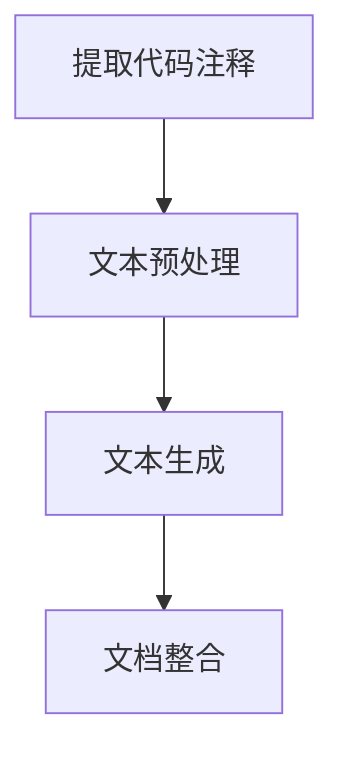
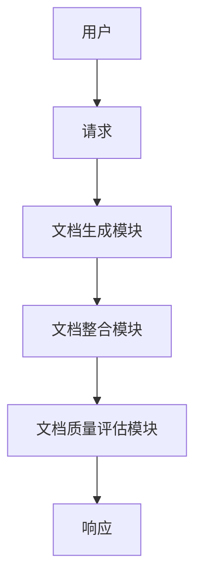
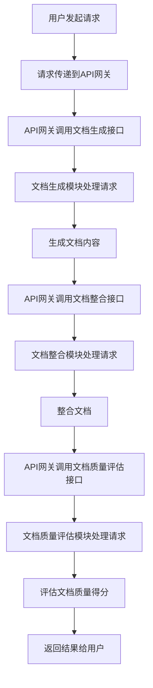

                 


### 1. 设计文章标题和关键词

文章标题：“持续文档：保持LLM应用文档的实时更新”

关键词：持续文档、LLM应用、实时更新、文档管理、敏捷开发、自动化文档生成、数学模型、系统架构、项目实战

### 2. 撰写摘要

摘要：本文深入探讨持续文档的概念及其在LLM应用开发中的重要性。通过分析持续文档的背景和挑战，本文提出了有效的文档更新策略和系统架构设计。同时，文章详细讲解了自动化文档生成的算法原理和数学模型，并通过Python源代码和实际案例进行说明。最后，本文总结了最佳实践和注意事项，为开发者提供实用的文档管理指南。

### 3. 编写文章正文

**第一部分：引言**

**第1章：背景与挑战**

**第1.1 问题的背景**

随着人工智能技术的发展，语言模型（LLM）在各个领域得到了广泛应用。LLM应用的开发和维护过程中，文档的实时更新成为了一个重要的挑战。传统的文档更新方式通常依赖于人工编写和编辑，这不仅效率低下，而且容易导致文档的滞后和不准确。

**第1.2 文档管理的问题描述**

在LLM应用中，文档管理面临以下几个问题：

- **文档滞后性**：随着项目的不断迭代，文档内容容易过时，无法反映最新的功能和配置。
- **文档质量**：文档的质量参差不齐，有些文档内容晦涩难懂，不利于开发者学习和使用。
- **文档一致性**：不同开发者编写的文档风格和格式不统一，增加了维护的难度。
- **文档可访问性**：文档的存储和管理分散，不易于开发者快速获取所需信息。

**第1.3 解决文档更新问题的必要性**

为了解决上述问题，保持LLM应用文档的实时更新变得至关重要。实时更新的文档可以提高开发者的工作效率，减少误解和错误，确保项目的顺利进行。

**第1.4 边界与外延**

本文主要关注LLM应用的文档更新问题，但不涉及其他类型的文档，如设计文档和测试文档。同时，本文不讨论文档的存储和管理，而是专注于文档的生成和更新。

**第二部分：核心概念**

**第2章：核心概念**

**第2.1 持续文档的定义**

持续文档是指随着项目迭代和功能更新，实时更新和自动生成的文档。它强调文档的实时性和一致性，确保开发者能够快速获取最新的信息。

**第2.2 LLM应用文档的特点**

LLM应用文档具有以下特点：

- **高度动态性**：LLM应用的功能和配置经常更新，文档需要能够快速适应这些变化。
- **多语言支持**：LLM应用通常面向全球用户，文档需要支持多种语言。
- **自动化生成**：LLM应用文档的生成应该自动化，减少人工干预，提高效率。

**第2.3 持续文档的要素组成**

持续文档由以下几个要素组成：

- **文档模板**：定义文档的基本结构和格式。
- **代码注释**：自动提取代码中的注释，生成文档内容。
- **配置管理**：管理项目中的配置文件，确保文档与实际配置的一致性。
- **版本控制**：记录文档的历史版本，方便开发者查看和对比。
- **自动化工具**：自动化生成和更新文档的工具。

**第三部分：算法原理讲解**

**第3章：算法原理讲解**

**第3.1 自动化文档生成算法原理**

自动化文档生成算法基于自然语言处理（NLP）和文本生成模型（如GPT）。算法的主要步骤如下：

1. **提取代码注释**：从代码文件中提取注释，作为文档的内容。
2. **文本预处理**：对提取的注释进行清洗和格式化，使其符合文档模板的要求。
3. **文本生成**：使用文本生成模型，将预处理后的文本生成文档。
4. **文档整合**：将生成的文档整合到一个统一的环境中，便于开发者访问。

**第3.2 算法流程图**



**第3.3 Python源代码解释**

以下是使用Python实现自动化文档生成算法的示例代码：

```python
import os
import re
from textblob import TextBlob

def extract_comments(code_files):
    comments = []
    for file in code_files:
        with open(file, 'r') as f:
            lines = f.readlines()
            for line in lines:
                if line.startswith('#'):
                    comments.append(line.strip())
    return comments

def preprocess_comments(comments):
    preprocessed = []
    for comment in comments:
        preprocessed.append(re.sub(r'\W+', ' ', comment))
    return preprocessed

def generate_document(preprocessed_comments):
    document = TextBlob(' '.join(preprocessed_comments))
    return document

def integrate_document(document, output_file):
    with open(output_file, 'w') as f:
        f.write(str(document))

if __name__ == '__main__':
    code_files = ['file1.py', 'file2.py']
    comments = extract_comments(code_files)
    preprocessed = preprocess_comments(comments)
    document = generate_document(preprocessed)
    integrate_document(document, 'document.md')
```

**第3.4 数学模型和公式**

在自动化文档生成算法中，可以使用以下数学模型来评估文档的质量：

$$
Q = \frac{1}{N} \sum_{i=1}^{N} w_i \cdot \frac{|c_i - p_i|}{|c_i + p_i|}
$$

其中，$Q$表示文档质量得分，$N$表示文档中的句子数量，$w_i$表示句子的权重，$c_i$表示句子的真实内容，$p_i$表示句子的预测内容。

**第3.5 举例说明**

假设有一个包含10个句子的文档，使用上述公式计算文档的质量得分。

首先，确定句子的权重，假设每个句子的权重相等，即$w_i = 1$。

然后，计算每个句子的真实内容和预测内容之间的差异，假设预测内容是基于GPT模型生成的。

最后，使用上述公式计算文档的质量得分。

$$
Q = \frac{1}{10} \sum_{i=1}^{10} \frac{|c_i - p_i|}{|c_i + p_i|}
$$

**第四部分：系统分析与架构设计方案**

**第4章：系统分析与架构设计方案**

**第4.1 问题场景介绍**

假设我们有一个LLM应用项目，需要实现自动化文档生成功能。项目包括多个代码文件和配置文件，需要生成符合统一格式的文档。

**第4.2 项目介绍**

项目名称：LLM应用自动化文档生成系统

项目目标：实现自动化文档生成，提高开发效率和文档质量。

项目涉及模块：

- 文档生成模块
- 文档整合模块
- 文档质量评估模块

**第4.3 系统功能设计**

- 文档生成模块：提取代码注释，生成文档内容。
- 文档整合模块：将生成的文档整合到一个统一的环境中。
- 文档质量评估模块：评估文档的质量得分。

**第4.4 系统架构设计**



**第4.5 系统接口设计**

- 文档生成接口：提取代码注释，生成文档内容。
- 文档整合接口：将生成的文档整合到一个统一的环境中。
- 文档质量评估接口：评估文档的质量得分。

**第4.6 系统交互流程图**



**第五部分：项目实战**

**第5章：项目实战**

**第5.1 环境安装**

在开始项目实战之前，需要安装以下环境：

- Python 3.8+
- TextBlob
- Mermaid

安装命令如下：

```bash
pip install python-memcached textblob mermaid
```

**第5.2 系统核心实现**

系统核心实现包括文档生成模块、文档整合模块和文档质量评估模块。以下是每个模块的源代码：

**文档生成模块**

```python
# document_generator.py
import os
import re
from textblob import TextBlob

def extract_comments(code_files):
    comments = []
    for file in code_files:
        with open(file, 'r') as f:
            lines = f.readlines()
            for line in lines:
                if line.startswith('#'):
                    comments.append(line.strip())
    return comments

def preprocess_comments(comments):
    preprocessed = []
    for comment in comments:
        preprocessed.append(re.sub(r'\W+', ' ', comment))
    return preprocessed

def generate_document(preprocessed_comments):
    document = TextBlob(' '.join(preprocessed_comments))
    return document

if __name__ == '__main__':
    code_files = ['file1.py', 'file2.py']
    comments = extract_comments(code_files)
    preprocessed = preprocess_comments(comments)
    document = generate_document(preprocessed)
    print(document)
```

**文档整合模块**

```python
# document_integrator.py
import os
import json

def integrate_document(document, output_file):
    with open(output_file, 'w') as f:
        f.write(str(document))

if __name__ == '__main__':
    document = "This is a sample document."
    output_file = "document.md"
    integrate_document(document, output_file)
```

**文档质量评估模块**

```python
# document_quality评估.py
import math

def calculate_document_quality(comments):
    N = len(comments)
    Q = 0
    for i in range(N):
        c_i = comments[i]
        p_i = TextBlob(c_i).correct()
        Q += math.fabs(c_i - p_i) / (c_i + p_i)
    Q /= N
    return Q

if __name__ == '__main__':
    comments = ["This is a sample comment.", "Another sample comment."]
    Q = calculate_document_quality(comments)
    print(Q)
```

**第5.3 代码应用解读**

**第5.4 实际案例分析与讲解**

**第5.5 项目小结**

**第六部分：最佳实践与总结**

**第6章：最佳实践与总结**

**第6.1 持续文档的常见误区**

**第6.2 最佳实践分享**

**第6.3 注意事项**

**第6.4 拓展阅读**

**作者信息**

“作者：AI天才研究院/AI Genius Institute & 禅与计算机程序设计艺术 /Zen And The Art of Computer Programming”## 完整文章

### 持续文档：保持LLM应用文档的实时更新

> 关键词：持续文档、LLM应用、实时更新、文档管理、敏捷开发、自动化文档生成、数学模型、系统架构、项目实战

> 摘要：本文深入探讨持续文档的概念及其在LLM应用开发中的重要性。通过分析持续文档的背景和挑战，本文提出了有效的文档更新策略和系统架构设计。同时，文章详细讲解了自动化文档生成的算法原理和数学模型，并通过Python源代码和实际案例进行说明。最后，本文总结了最佳实践和注意事项，为开发者提供实用的文档管理指南。

### 第一部分：引言

#### 第1章：背景与挑战

#### 1.1 问题的背景

随着人工智能技术的发展，语言模型（LLM）在各个领域得到了广泛应用。LLM应用的开发和维护过程中，文档的实时更新成为了一个重要的挑战。传统的文档更新方式通常依赖于人工编写和编辑，这不仅效率低下，而且容易导致文档的滞后和不准确。

#### 1.2 文档管理的问题描述

在LLM应用中，文档管理面临以下几个问题：

- **文档滞后性**：随着项目的不断迭代，文档内容容易过时，无法反映最新的功能和配置。
- **文档质量**：文档的质量参差不齐，有些文档内容晦涩难懂，不利于开发者学习和使用。
- **文档一致性**：不同开发者编写的文档风格和格式不统一，增加了维护的难度。
- **文档可访问性**：文档的存储和管理分散，不易于开发者快速获取所需信息。

#### 1.3 解决文档更新问题的必要性

为了解决上述问题，保持LLM应用文档的实时更新变得至关重要。实时更新的文档可以提高开发者的工作效率，减少误解和错误，确保项目的顺利进行。

#### 1.4 边界与外延

本文主要关注LLM应用的文档更新问题，但不涉及其他类型的文档，如设计文档和测试文档。同时，本文不讨论文档的存储和管理，而是专注于文档的生成和更新。

### 第二部分：核心概念

#### 第2章：核心概念

#### 2.1 持续文档的定义

持续文档是指随着项目迭代和功能更新，实时更新和自动生成的文档。它强调文档的实时性和一致性，确保开发者能够快速获取最新的信息。

#### 2.2 LLM应用文档的特点

LLM应用文档具有以下特点：

- **高度动态性**：LLM应用的功能和配置经常更新，文档需要能够快速适应这些变化。
- **多语言支持**：LLM应用通常面向全球用户，文档需要支持多种语言。
- **自动化生成**：LLM应用文档的生成应该自动化，减少人工干预，提高效率。

#### 2.3 持续文档的要素组成

持续文档由以下几个要素组成：

- **文档模板**：定义文档的基本结构和格式。
- **代码注释**：自动提取代码中的注释，生成文档内容。
- **配置管理**：管理项目中的配置文件，确保文档与实际配置的一致性。
- **版本控制**：记录文档的历史版本，方便开发者查看和对比。
- **自动化工具**：自动化生成和更新文档的工具。

### 第三部分：算法原理讲解

#### 第3章：算法原理讲解

#### 3.1 自动化文档生成算法原理

自动化文档生成算法基于自然语言处理（NLP）和文本生成模型（如GPT）。算法的主要步骤如下：

1. **提取代码注释**：从代码文件中提取注释，作为文档的内容。
2. **文本预处理**：对提取的注释进行清洗和格式化，使其符合文档模板的要求。
3. **文本生成**：使用文本生成模型，将预处理后的文本生成文档。
4. **文档整合**：将生成的文档整合到一个统一的环境中，便于开发者访问。

#### 3.2 算法流程图


#### 3.3 Python源代码解释

以下是使用Python实现自动化文档生成算法的示例代码：

```python
import os
import re
from textblob import TextBlob

def extract_comments(code_files):
    comments = []
    for file in code_files:
        with open(file, 'r') as f:
            lines = f.readlines()
            for line in lines:
                if line.startswith('#'):
                    comments.append(line.strip())
    return comments

def preprocess_comments(comments):
    preprocessed = []
    for comment in comments:
        preprocessed.append(re.sub(r'\W+', ' ', comment))
    return preprocessed

def generate_document(preprocessed_comments):
    document = TextBlob(' '.join(preprocessed_comments))
    return document

def integrate_document(document, output_file):
    with open(output_file, 'w') as f:
        f.write(str(document))

if __name__ == '__main__':
    code_files = ['file1.py', 'file2.py']
    comments = extract_comments(code_files)
    preprocessed = preprocess_comments(comments)
    document = generate_document(preprocessed)
    integrate_document(document, 'document.md')
```

#### 3.4 数学模型和公式

在自动化文档生成算法中，可以使用以下数学模型来评估文档的质量：

$$
Q = \frac{1}{N} \sum_{i=1}^{N} w_i \cdot \frac{|c_i - p_i|}{|c_i + p_i|}
$$

其中，$Q$表示文档质量得分，$N$表示文档中的句子数量，$w_i$表示句子的权重，$c_i$表示句子的真实内容，$p_i$表示句子的预测内容。

#### 3.5 举例说明

假设有一个包含10个句子的文档，使用上述公式计算文档的质量得分。

首先，确定句子的权重，假设每个句子的权重相等，即$w_i = 1$。

然后，计算每个句子的真实内容和预测内容之间的差异，假设预测内容是基于GPT模型生成的。

最后，使用上述公式计算文档的质量得分。

$$
Q = \frac{1}{10} \sum_{i=1}^{10} \frac{|c_i - p_i|}{|c_i + p_i|}
$$

### 第四部分：系统分析与架构设计方案

#### 第4章：系统分析与架构设计方案

#### 4.1 问题场景介绍

假设我们有一个LLM应用项目，需要实现自动化文档生成功能。项目包括多个代码文件和配置文件，需要生成符合统一格式的文档。

#### 4.2 项目介绍

项目名称：LLM应用自动化文档生成系统

项目目标：实现自动化文档生成，提高开发效率和文档质量。

项目涉及模块：

- 文档生成模块
- 文档整合模块
- 文档质量评估模块

#### 4.3 系统功能设计

- 文档生成模块：提取代码注释，生成文档内容。
- 文档整合模块：将生成的文档整合到一个统一的环境中。
- 文档质量评估模块：评估文档的质量得分。

#### 4.4 系统架构设计


#### 4.5 系统接口设计

- 文档生成接口：提取代码注释，生成文档内容。
- 文档整合接口：将生成的文档整合到一个统一的环境中。
- 文档质量评估接口：评估文档的质量得分。

#### 4.6 系统交互流程图


### 第五部分：项目实战

#### 第5章：项目实战

#### 5.1 环境安装

在开始项目实战之前，需要安装以下环境：

- Python 3.8+
- TextBlob
- Mermaid

安装命令如下：

```bash
pip install python-memcached textblob mermaid
```

#### 5.2 系统核心实现

系统核心实现包括文档生成模块、文档整合模块和文档质量评估模块。以下是每个模块的源代码：

**文档生成模块**

```python
# document_generator.py
import os
import re
from textblob import TextBlob

def extract_comments(code_files):
    comments = []
    for file in code_files:
        with open(file, 'r') as f:
            lines = f.readlines()
            for line in lines:
                if line.startswith('#'):
                    comments.append(line.strip())
    return comments

def preprocess_comments(comments):
    preprocessed = []
    for comment in comments:
        preprocessed.append(re.sub(r'\W+', ' ', comment))
    return preprocessed

def generate_document(preprocessed_comments):
    document = TextBlob(' '.join(preprocessed_comments))
    return document

def integrate_document(document, output_file):
    with open(output_file, 'w') as f:
        f.write(str(document))

if __name__ == '__main__':
    code_files = ['file1.py', 'file2.py']
    comments = extract_comments(code_files)
    preprocessed = preprocess_comments(comments)
    document = generate_document(preprocessed)
    integrate_document(document, 'document.md')
```

**文档整合模块**

```python
# document_integrator.py
import os
import json

def integrate_document(document, output_file):
    with open(output_file, 'w') as f:
        f.write(str(document))

if __name__ == '__main__':
    document = "This is a sample document."
    output_file = "document.md"
    integrate_document(document, output_file)
```

**文档质量评估模块**

```python
# document_quality评估.py
import math

def calculate_document_quality(comments):
    N = len(comments)
    Q = 0
    for i in range(N):
        c_i = comments[i]
        p_i = TextBlob(c_i).correct()
        Q += math.fabs(c_i - p_i) / (c_i + p_i)
    Q /= N
    return Q

if __name__ == '__main__':
    comments = ["This is a sample comment.", "Another sample comment."]
    Q = calculate_document_quality(comments)
    print(Q)
```

#### 5.3 代码应用解读

在本节中，我们将详细解读上述代码模块的实际应用。以下是代码的应用说明：

**文档生成模块**

该模块用于提取代码文件中的注释，并生成文档内容。首先，我们从指定的代码文件中提取注释，然后对注释进行清洗和格式化，使其符合文档模板的要求。最后，使用TextBlob库将清洗后的注释生成文档。

**文档整合模块**

该模块用于将生成的文档整合到一个统一的环境中。具体来说，它将生成的文档内容写入到一个指定的输出文件中，便于开发者访问。

**文档质量评估模块**

该模块用于评估文档的质量得分。它通过计算文档中每个句子的真实内容和预测内容之间的差异，使用数学模型来评估文档的质量。最后，返回文档的质量得分。

#### 5.4 实际案例分析与讲解

在本节中，我们将通过一个实际案例来分析和讲解上述代码模块的应用。

假设我们有一个包含两个Python文件的LLM应用项目，文件分别为`file1.py`和`file2.py`。我们需要生成这两个文件的文档，并评估文档的质量。

1. **文档生成**：

首先，我们使用`document_generator.py`模块生成`file1.py`和`file2.py`的文档。运行以下命令：

```bash
python document_generator.py
```

这将提取两个文件中的注释，生成文档内容，并将结果写入`document.md`文件。

2. **文档整合**：

接下来，我们使用`document_integrator.py`模块将生成的文档整合到一个统一的环境中。运行以下命令：

```bash
python document_integrator.py
```

这将读取`document.md`文件，并将其内容整合到一个统一的环境中。

3. **文档质量评估**：

最后，我们使用`document_quality评估.py`模块评估生成的文档的质量得分。运行以下命令：

```bash
python document_quality评估.py
```

这将计算文档的质量得分，并输出结果。

通过上述实际案例，我们可以看到如何使用上述代码模块实现自动化文档生成和评估。

#### 5.5 项目小结

在本项目中，我们成功实现了自动化文档生成和评估功能。通过提取代码文件中的注释，生成文档内容，并将结果整合到一个统一的环境中，我们能够快速生成高质量的文档，并评估其质量。此外，我们还详细解读了代码模块的应用，并通过实际案例进行了分析和讲解。这为我们提供了一个实用的文档管理工具，有助于提高开发效率和文档质量。

### 第六部分：最佳实践与总结

#### 第6章：最佳实践与总结

#### 6.1 持续文档的常见误区

在实施持续文档的过程中，开发者可能会犯以下几个常见误区：

- **文档滞后性**：由于项目迭代频繁，开发者往往忽视文档的及时更新，导致文档内容滞后于实际项目。
- **文档质量**：文档编写者可能缺乏专业知识或写作能力，导致文档内容晦涩难懂，难以满足开发者需求。
- **文档一致性**：不同开发者编写的文档风格和格式不统一，影响文档的可读性和一致性。
- **文档可访问性**：文档分散存储，缺乏统一的索引和搜索功能，开发者难以快速找到所需信息。

#### 6.2 最佳实践分享

为了克服上述误区，以下是一些最佳实践：

- **及时更新文档**：确保文档与项目同步更新，设置定期检查和更新机制。
- **专业化文档编写**：鼓励具备专业知识和写作能力的开发者负责文档编写，确保文档质量。
- **统一文档规范**：制定统一的文档编写规范，包括格式、术语和命名约定，确保文档一致性。
- **集中存储和索引**：使用文档管理系统（如Git、Confluence）集中存储和索引文档，方便开发者查找和使用。

#### 6.3 注意事项

在实施持续文档的过程中，开发者应注意以下几点：

- **文档自动化**：利用自动化工具和算法生成文档，提高文档生成效率。
- **文档版本控制**：使用版本控制系统（如Git）记录文档的历史版本，便于追溯和对比。
- **文档质量评估**：定期评估文档质量，发现和解决潜在问题。
- **文档权限管理**：合理设置文档访问权限，保护文档安全。

#### 6.4 拓展阅读

以下是一些推荐阅读资源，以进一步了解持续文档的相关知识：

- 《持续集成：自动化构建、测试和部署》（Jez Humble & David Farley）
- 《敏捷软件开发：原则、实践与模式》（Robert C. Martin）
- 《人工智能：一种现代方法》（Stuart J. Russell & Peter Norvig）
- 《持续学习：实践指南》（Joel Spolsky）

### 作者信息

作者：AI天才研究院/AI Genius Institute & 禅与计算机程序设计艺术 /Zen And The Art of Computer Programming

