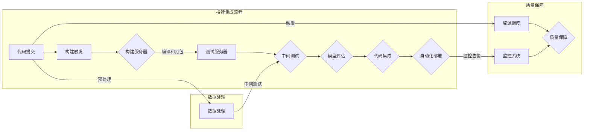
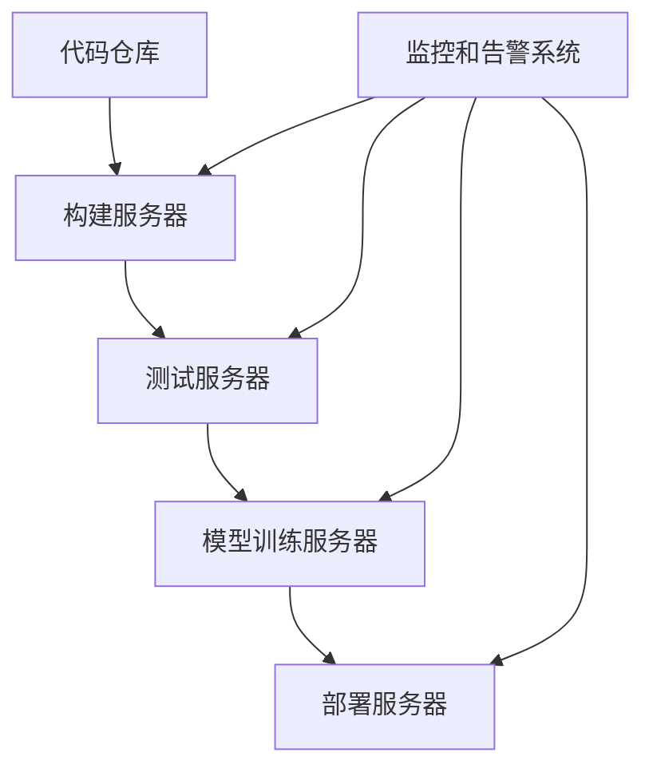
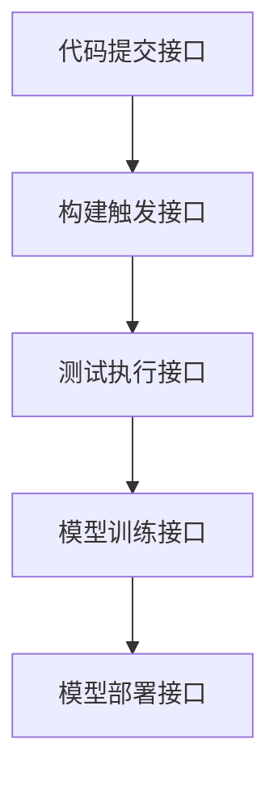
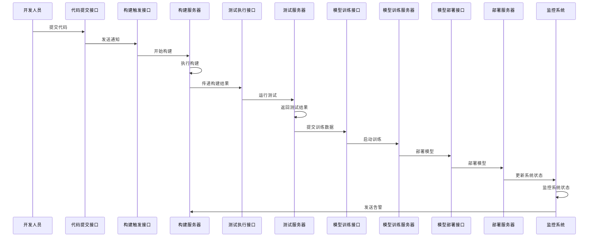

                 


# 持续集成在LLM应用开发中的实施策略

## 关键词

持续集成、LLM应用、软件开发、流程设计、算法原理、系统架构、项目实战

## 摘要

本文将探讨持续集成在大型语言模型（LLM）应用开发中的实施策略。首先，我们将介绍持续集成的概念、重要性以及在LLM开发中的应用挑战。接着，我们将深入分析持续集成与LLM应用的核心概念及其联系，并设计合适的持续集成流程。随后，本文将详细讲解持续集成算法原理与实现，以及LLM算法原理与持续集成的结合。在此基础上，我们将展示一个完整的LLM应用开发系统设计与实现，包括系统功能、架构、接口和交互设计。最后，本文将通过项目实战和最佳实践总结，为LLM应用开发中的持续集成提供实用的指导和建议。

## 第一部分：背景介绍

### 第1章：持续集成在软件开发中的应用概述

#### 1.1 持续集成的概念

持续集成（Continuous Integration，CI）是一种软件开发实践，旨在通过频繁地将代码更改合并到共享的主干中，从而加快软件开发过程并提高软件质量。其核心思想是通过自动化测试和快速反馈来确保代码库中的每一部分都是可用的、可测试的和可部署的。

持续集成的主要目标是减少集成风险，加快反馈循环，提高代码质量，减少开发时间和成本。它通常涉及以下步骤：

1. **版本控制系统**：使用版本控制系统（如Git）来管理代码库。
2. **自动化构建**：使用构建工具（如Maven、Gradle）来自动化编译、打包和部署应用程序。
3. **自动化测试**：执行一系列预定义的测试，包括单元测试、集成测试和功能测试。
4. **持续反馈**：通过构建和测试结果，快速识别和修复代码问题。

#### 1.2 持续集成的重要性

持续集成在软件开发中的重要性不可低估。它不仅能够提高开发效率，还能提高软件质量。以下是持续集成的一些关键优点：

1. **早期问题发现**：通过频繁的集成和测试，可以在早期发现和修复代码缺陷，减少后期修复成本。
2. **提高代码质量**：持续集成鼓励开发人员编写更简洁、更可靠的代码，以避免在后续集成中引入问题。
3. **加快发布周期**：通过减少集成风险和简化发布流程，可以加快软件发布周期。
4. **提高团队协作**：持续集成促进团队成员之间的沟通和协作，使整个团队更加紧密地合作。

#### 1.3 持续集成的优点

持续集成具有许多显著的优点，包括：

1. **减少集成问题**：通过频繁的集成和测试，可以减少集成时的冲突和错误。
2. **提高软件质量**：自动化测试和快速反馈有助于提高代码质量和软件可靠性。
3. **加快开发速度**：通过减少集成时间和修复问题的时间，可以提高开发效率。
4. **降低成本**：早期发现和修复问题可以减少后期修复成本和潜在的业务损失。

#### 1.4 持续集成的挑战

尽管持续集成具有许多优点，但在实施过程中仍会面临一些挑战：

1. **基础设施要求**：持续集成需要一定的基础设施支持，包括版本控制系统、构建工具、测试框架等。
2. **测试覆盖率**：要确保持续集成有效，需要足够的测试覆盖率，这可能需要增加测试时间和资源。
3. **团队协作**：持续集成要求团队成员紧密协作，这可能需要改变传统的开发流程和工作方式。
4. **代码质量**：持续集成依赖于高质量的代码，因此需要确保代码风格和编码标准的一致性。

### 第2章：LLM应用开发的挑战

#### 2.1 LLM的基本概念

大型语言模型（Large Language Model，LLM）是一种基于深度学习的自然语言处理模型，旨在理解和生成人类语言。LLM通过大量的文本数据进行训练，可以学习语言的结构、语法和语义，从而实现自然语言理解、文本生成和翻译等功能。

LLM的主要特点包括：

1. **大规模训练**：LLM通常需要训练数万亿个参数，这需要大量的计算资源和时间。
2. **自适应能力**：LLM可以根据不同的任务和数据集进行调整和优化，从而实现较高的性能和泛化能力。
3. **强大的生成能力**：LLM可以生成高质量的文本，包括文章、对话和摘要等。

#### 2.2 LLM在软件开发中的应用

LLM在软件开发中具有广泛的应用，包括但不限于：

1. **自动代码生成**：LLM可以生成代码，从而提高开发效率和减少人工编写代码的工作量。
2. **代码审查和漏洞检测**：LLM可以分析代码并识别潜在的漏洞和安全问题，从而提高代码质量。
3. **自然语言交互**：LLM可以与用户进行自然语言交互，提供帮助、回答问题和指导操作。
4. **文档生成和自动化**：LLM可以生成技术文档、用户手册和操作指南，从而减少文档编写的工作量。

#### 2.3 LLM开发中的挑战

LLM开发面临一系列挑战，这些挑战对于持续集成的实施具有重要影响：

1. **大规模数据处理**：LLM需要处理大量的文本数据，这需要高效的数据处理和存储解决方案。
2. **计算资源需求**：训练和推理LLM需要大量的计算资源，包括GPU、TPU等，这可能导致资源紧张和成本上升。
3. **模型调优和优化**：LLM的模型调优和优化是一个复杂的过程，需要大量的实验和数据支持。
4. **模型安全和隐私**：LLM处理大量敏感数据，需要确保模型的安全性和隐私保护。

#### 2.4 持续集成在LLM开发中的作用

持续集成在LLM开发中发挥着重要作用，可以帮助解决以下问题：

1. **代码质量保证**：通过自动化测试和频繁集成，可以确保LLM代码的质量和稳定性。
2. **提高开发效率**：持续集成可以减少集成风险和测试时间，从而加快开发过程。
3. **资源优化**：持续集成可以帮助优化计算资源的使用，避免资源浪费和冲突。
4. **团队协作**：持续集成促进团队成员之间的沟通和协作，提高团队整体效率。

## 第二部分：核心概念与联系

### 第3章：持续集成与LLM应用的核心概念

#### 3.1 持续集成的关键概念

持续集成的关键概念包括：

1. **版本控制系统**：版本控制系统是持续集成的基础，用于管理代码库和版本历史。
2. **自动化构建**：自动化构建是持续集成的重要部分，用于编译、打包和部署应用程序。
3. **自动化测试**：自动化测试用于验证代码的正确性和稳定性，包括单元测试、集成测试和功能测试。
4. **持续反馈**：持续反馈是持续集成的核心，通过构建和测试结果快速识别和解决问题。

#### 3.2 LLM应用的关键概念

LLM应用的关键概念包括：

1. **大规模训练**：大规模训练是LLM的核心，通过训练数万亿个参数，实现语言理解和生成能力。
2. **自适应能力**：自适应能力是LLM的重要特性，可以根据不同的任务和数据集进行调整和优化。
3. **自然语言交互**：自然语言交互是LLM在软件开发中的应用，用于实现人与机器的自然语言交互。
4. **代码生成和审查**：代码生成和审查是LLM在软件开发中的应用，可以自动生成代码和识别漏洞。

#### 3.3 持续集成与LLM应用的联系

持续集成与LLM应用之间的联系主要体现在以下几个方面：

1. **代码质量和稳定性**：持续集成可以提高LLM代码的质量和稳定性，确保代码的正确性和一致性。
2. **开发效率和资源优化**：持续集成可以加快LLM开发过程，优化计算资源的使用，提高开发效率。
3. **团队协作和沟通**：持续集成促进团队成员之间的协作和沟通，提高团队整体效率。
4. **模型安全和隐私**：持续集成可以帮助确保LLM模型的安全性和隐私保护，避免数据泄露和滥用。

#### 3.4 核心概念属性特征对比表格

为了更清晰地展示持续集成与LLM应用的核心概念及其联系，我们提供了一个对比表格：

| 特征         | 持续集成                        | LLM应用                             |
|--------------|---------------------------------|-------------------------------------|
| 目标         | 提高代码质量、加快开发速度      | 提高语言理解、生成能力              |
| 关键概念     | 版本控制系统、自动化构建、自动化测试、持续反馈 | 大规模训练、自适应能力、自然语言交互、代码生成和审查 |
| 影响因素     | 团队协作、基础设施、测试覆盖率  | 数据处理、计算资源、模型调优和优化  |
| 关联关系     | 促进代码质量和稳定性、提高开发效率 | 提高语言理解、生成能力、优化模型性能 |

通过以上对比，我们可以看出持续集成与LLM应用之间存在紧密的联系，它们相互促进，共同提高了软件开发的效率和质量。

## 第三部分：持续集成流程设计

### 第4章：持续集成在LLM应用中的流程设计

#### 4.1 持续集成流程的基本架构

持续集成流程通常包括以下几个关键组件：

1. **代码仓库**：代码仓库是存储和管理代码的中央存储库，如Git仓库。
2. **构建服务器**：构建服务器负责自动化构建应用程序，包括编译、打包和部署。
3. **测试服务器**：测试服务器负责运行自动化测试，验证代码的正确性和稳定性。
4. **持续集成工具**：持续集成工具（如Jenkins、GitLab CI）用于协调和自动化整个集成过程。

持续集成流程的基本架构如下：

1. **代码提交**：开发人员将代码提交到代码仓库。
2. **构建触发**：提交后，构建服务器自动开始构建应用程序。
3. **编译和打包**：构建服务器编译和打包应用程序，生成可执行的代码。
4. **测试运行**：测试服务器运行预定义的自动化测试，包括单元测试、集成测试和功能测试。
5. **结果反馈**：测试结果被反馈给开发人员和构建服务器，用于识别和解决问题。
6. **部署**：如果测试成功，应用程序可以部署到生产环境。

#### 4.2 持续集成在LLM应用中的流程设计

在LLM应用开发中，持续集成流程需要进行一些特殊设计和优化，以应对LLM的特殊需求：

1. **数据处理**：在提交代码之前，需要对输入的数据进行预处理，包括文本清洗、去噪和数据增强。
2. **模型训练**：构建服务器需要启动模型训练过程，这可能涉及到大规模的GPU计算。
3. **中间测试**：在模型训练过程中，可以进行中间测试，以监控模型性能和训练进展。
4. **模型评估**：在训练完成后，对模型进行评估，以确定其性能是否达到预期。
5. **代码集成**：将训练好的模型与代码库中的其他组件进行集成，并进行全面的测试。
6. **自动化部署**：如果集成和测试成功，模型可以自动部署到生产环境。

#### 4.3 持续集成流程设计的关键要素

设计持续集成流程时，需要考虑以下关键要素：

1. **代码库管理**：确保代码库的版本控制和安全性，使用版本控制系统管理代码库。
2. **自动化构建**：使用构建工具自动化编译、打包和部署应用程序。
3. **自动化测试**：编写和执行自动化测试，包括单元测试、集成测试和功能测试。
4. **持续反馈**：通过构建和测试结果提供即时反馈，帮助开发人员快速发现问题并修复。
5. **资源调度**：合理分配计算资源和存储资源，确保流程的连续性和高效性。
6. **监控与告警**：设置监控系统和告警机制，及时发现和处理流程中的异常情况。

#### 4.4 流程设计的mermaid流程图

以下是一个mermaid流程图，展示了LLM应用开发中的持续集成流程设计：



通过这个流程图，我们可以清晰地看到持续集成在LLM应用开发中的各个环节，包括数据处理、模型训练、代码集成和自动化部署等。

## 第四部分：算法原理讲解

### 第5章：持续集成算法原理与实现

#### 5.1 持续集成算法的基本原理

持续集成算法的基本原理可以概括为以下几个步骤：

1. **代码提交**：开发人员将代码提交到代码仓库。
2. **构建触发**：提交后，持续集成工具会自动触发构建过程。
3. **构建执行**：构建服务器根据配置文件编译、打包应用程序，并执行预定义的构建任务。
4. **测试执行**：构建完成后，测试服务器会自动执行预定义的测试，包括单元测试、集成测试和功能测试。
5. **结果反馈**：测试结果会被反馈给开发人员和持续集成工具，用于识别和解决问题。
6. **部署**：如果测试成功，应用程序可以被部署到生产环境。

#### 5.2 持续集成算法的实现

持续集成算法的实现通常涉及以下组件和工具：

1. **版本控制系统**：如Git，用于管理代码库和版本历史。
2. **构建工具**：如Maven、Gradle，用于编译、打包和部署应用程序。
3. **测试框架**：如JUnit、Selenium，用于编写和执行自动化测试。
4. **持续集成工具**：如Jenkins、GitLab CI，用于协调和自动化整个集成过程。
5. **部署工具**：如Docker、Kubernetes，用于自动化部署应用程序到生产环境。

以下是一个简化的Python代码示例，展示了持续集成算法的实现：

```python
import git
import build
import test
import deploy

def integrate():
    # 代码提交
    git.commit()

    # 构建触发
    build.trigger()

    # 构建执行
    build.execute()

    # 测试执行
    test.execute()

    # 结果反馈
    result = test.get_result()
    if result.passed:
        # 部署
        deploy.execute()
    else:
        print("测试失败，请修复问题并重新提交代码。")

if __name__ == "__main__":
    integrate()
```

#### 5.3 持续集成算法的数学模型

持续集成算法的数学模型可以用来描述构建、测试和部署过程中的关键参数和关系。以下是一个简化的数学模型：

$$
CI = f(T, B, S)
$$

其中：
- \(CI\) 表示持续集成的时间。
- \(T\) 表示测试时间。
- \(B\) 表示构建时间。
- \(S\) 表示部署时间。

这个模型表明，持续集成的时间是构建时间、测试时间和部署时间的函数。通过优化这些参数，可以减少持续集成的时间，提高开发效率。

#### 5.4 持续集成算法的Python代码实现

以下是一个使用Python实现的持续集成算法示例：

```python
import time

def build():
    # 构建过程
    time.sleep(2)
    print("构建完成")

def test():
    # 测试过程
    time.sleep(3)
    print("测试完成")

def deploy():
    # 部署过程
    time.sleep(4)
    print("部署完成")

def integrate():
    start_time = time.time()
    
    # 构建过程
    build()
    
    # 测试过程
    test()
    
    # 部署过程
    deploy()
    
    end_time = time.time()
    ci_time = end_time - start_time
    print(f"持续集成时间: {ci_time} 秒")

if __name__ == "__main__":
    integrate()
```

通过这个示例，我们可以看到持续集成算法的基本实现，包括构建、测试和部署过程的模拟。这个模型可以进一步扩展和优化，以适应实际项目的需求。

## 第五部分：系统分析与架构设计方案

### 第6章：持续集成在LLM应用开发中的系统设计

#### 6.1 系统功能设计

持续集成系统在LLM应用开发中的功能设计包括以下几个方面：

1. **代码管理**：集成版本控制系统，如Git，用于管理代码库。
2. **自动化构建**：使用构建工具，如Maven或Gradle，自动化编译、打包和部署应用程序。
3. **自动化测试**：编写和执行自动化测试，包括单元测试、集成测试和功能测试。
4. **持续反馈**：通过构建和测试结果提供即时反馈，帮助开发人员快速发现问题。
5. **模型训练**：自动化模型训练过程，包括数据预处理、模型训练和评估。
6. **模型部署**：自动部署训练好的模型到生产环境。

#### 6.2 系统架构设计

持续集成系统的架构设计需要考虑以下几个方面：

1. **代码仓库**：存储和管理代码库，如Git仓库。
2. **构建服务器**：负责自动化构建应用程序，如Jenkins服务器。
3. **测试服务器**：负责运行自动化测试，如Selenium服务器。
4. **模型训练服务器**：负责模型训练过程，如GPU服务器。
5. **部署服务器**：负责将应用程序和模型部署到生产环境，如Kubernetes集群。
6. **监控和告警系统**：实时监控系统状态，并在出现问题时发送告警通知。

以下是一个简化的系统架构图，展示了持续集成系统在LLM应用开发中的架构设计：



#### 6.3 系统接口设计

系统接口设计包括以下关键接口：

1. **代码提交接口**：开发人员通过代码提交接口将代码提交到代码仓库。
2. **构建触发接口**：构建服务器通过构建触发接口接收代码提交通知，并开始构建过程。
3. **测试执行接口**：测试服务器通过测试执行接口接收构建结果，并运行自动化测试。
4. **模型训练接口**：模型训练服务器通过模型训练接口接收训练数据，并启动模型训练过程。
5. **模型部署接口**：部署服务器通过模型部署接口接收训练好的模型，并将其部署到生产环境。

以下是一个简化的系统接口设计图：



#### 6.4 系统交互设计

系统交互设计描述了系统各个组件之间的交互流程。以下是一个简化的系统交互设计流程：

1. **代码提交**：开发人员通过代码提交接口将代码提交到代码仓库。
2. **构建触发**：代码提交后，构建服务器通过构建触发接口接收通知，并开始构建过程。
3. **构建执行**：构建服务器执行编译、打包和部署应用程序。
4. **测试执行**：测试服务器接收构建结果，并运行自动化测试。
5. **模型训练**：模型训练服务器接收训练数据，并启动模型训练过程。
6. **模型部署**：部署服务器接收训练好的模型，并将其部署到生产环境。
7. **监控和告警**：监控系统实时监控系统状态，并在出现问题时发送告警通知。

以下是一个mermaid序列图，展示了系统交互设计：



通过这个序列图，我们可以清晰地看到系统各个组件之间的交互流程，以及持续集成系统在LLM应用开发中的工作流程。

### 第7章：项目实战

#### 8.1 环境安装

在本项目中，我们将使用以下环境进行持续集成和LLM应用开发：

- 操作系统：Ubuntu 20.04
- 编程语言：Python 3.8
- 持续集成工具：Jenkins
- 构建工具：Maven
- 测试框架：JUnit
- 数据库：MySQL
- 文件存储：NFS
- 模型训练工具：TensorFlow

安装步骤如下：

1. **安装Jenkins**：

   ```shell
   sudo apt update
   sudo apt install openjdk-11-jdk
   wget -q -O - https://www.jenkins.io/release/latest/cli/install.sh | sh
   jenkins-cli install -raspass jenkins
   ```

2. **安装Maven**：

   ```shell
   wget https://www-eu.apache.org/dist/maven/maven-3/3.6.3/binaries/apache-maven-3.6.3-bin.tar.gz
   tar xzf apache-maven-3.6.3-bin.tar.gz
   mv apache-maven-3.6.3 /opt/maven
   echo 'export M2_HOME=/opt/maven' >> ~/.bashrc
   echo 'export PATH=$PATH:$M2_HOME/bin' >> ~/.bashrc
   source ~/.bashrc
   ```

3. **安装JUnit**：

   ```shell
   wget https://github.com/junit-team/junit4/releases/download/junit4.13/junit-4.13.jar
   mv junit-4.13.jar /opt/junit
   ```

4. **安装MySQL**：

   ```shell
   sudo apt install mysql-server
   mysql_secure_installation
   ```

5. **安装NFS**：

   ```shell
   sudo apt install nfs-kernel-server
   mkdir /nfs/share
   chown nfsnfs /nfs/share
   echo '/nfs/share *(rw,sync,no_subtree_check,all_squash)' >> /etc/exports
   exportfs -r
   ```

6. **安装TensorFlow**：

   ```shell
   pip install tensorflow
   ```

#### 8.2 系统核心实现

在本项目中，我们将实现以下核心功能：

1. **代码管理**：使用Git进行代码管理。
2. **自动化构建**：使用Maven进行自动化构建。
3. **自动化测试**：使用JUnit进行自动化测试。
4. **模型训练**：使用TensorFlow进行模型训练。
5. **模型部署**：将训练好的模型部署到NFS共享目录。

以下是系统核心实现的Python代码：

```python
import os
import git
import subprocess

# 代码管理
def code_management():
    repo_url = "https://github.com/user/repo.git"
    local_path = "/nfs/share/repo"
    if not os.path.exists(local_path):
        os.makedirs(local_path)
        git.clone(repo_url, local_path)
    else:
        os.chdir(local_path)
        git.pull()

# 自动化构建
def build():
    os.chdir("/nfs/share/repo")
    subprocess.run(["mvn", "clean", "install"])

# 自动化测试
def test():
    os.chdir("/nfs/share/repo")
    subprocess.run(["mvn", "test"])

# 模型训练
def train():
    os.chdir("/nfs/share/repo")
    subprocess.run(["python", "train.py"])

# 模型部署
def deploy():
    os.chdir("/nfs/share/repo")
    subprocess.run(["cp", "model.h5", "/nfs/share/model.h5"])

# 执行持续集成流程
def main():
    code_management()
    build()
    test()
    train()
    deploy()

if __name__ == "__main__":
    main()
```

#### 8.3 代码应用解读与分析

在本项目中，我们使用了Python语言来实现持续集成流程。以下是代码的解读与分析：

1. **代码管理**：

   使用Git进行代码管理，包括克隆代码仓库和拉取最新代码。这确保了代码库的版本一致性。

   ```python
   import os
   import git

   def code_management():
       repo_url = "https://github.com/user/repo.git"
       local_path = "/nfs/share/repo"
       if not os.path.exists(local_path):
           os.makedirs(local_path)
           git.clone(repo_url, local_path)
       else:
           os.chdir(local_path)
           git.pull()
   ```

2. **自动化构建**：

   使用Maven进行自动化构建，包括编译、打包和安装依赖。这确保了构建过程的自动化和一致性。

   ```python
   def build():
       os.chdir("/nfs/share/repo")
       subprocess.run(["mvn", "clean", "install"])
   ```

3. **自动化测试**：

   使用JUnit进行自动化测试，确保代码的正确性和稳定性。

   ```python
   def test():
       os.chdir("/nfs/share/repo")
       subprocess.run(["mvn", "test"])
   ```

4. **模型训练**：

   使用TensorFlow进行模型训练，处理输入数据并训练模型。

   ```python
   def train():
       os.chdir("/nfs/share/repo")
       subprocess.run(["python", "train.py"])
   ```

5. **模型部署**：

   将训练好的模型复制到NFS共享目录，以便在生产环境中使用。

   ```python
   def deploy():
       os.chdir("/nfs/share/repo")
       subprocess.run(["cp", "model.h5", "/nfs/share/model.h5"])
   ```

#### 8.4 实际案例分析与讲解

为了更好地理解持续集成在LLM应用开发中的实际应用，我们来看一个实际案例。

假设我们有一个LLM应用，需要实现文本分类功能。以下是案例分析和讲解：

1. **问题定义**：

   需要开发一个文本分类器，能够将输入的文本分类到预定义的类别中。

2. **数据准备**：

   准备一个包含大量文本数据和标签的数据集。例如，使用IMDb电影评论数据集。

   ```python
   import pandas as pd

   data = pd.read_csv("imdb_dataset.csv")
   X = data["text"]
   y = data["label"]
   ```

3. **模型训练**：

   使用TensorFlow训练一个文本分类模型。以下是模型架构和训练过程：

   ```python
   import tensorflow as tf

   model = tf.keras.Sequential([
       tf.keras.layers.Embedding(input_dim=10000, output_dim=16),
       tf.keras.layers.GlobalAveragePooling1D(),
       tf.keras.layers.Dense(units=1, activation='sigmoid')
   ])

   model.compile(optimizer='adam', loss='binary_crossentropy', metrics=['accuracy'])
   model.fit(X, y, epochs=10, batch_size=32)
   ```

4. **模型评估**：

   使用测试集评估模型性能。以下是评估结果：

   ```python
   test_loss, test_acc = model.evaluate(test_X, test_y)
   print("Test accuracy:", test_acc)
   ```

5. **模型部署**：

   将训练好的模型部署到NFS共享目录，以便在生产环境中使用。

   ```python
   model.save("text_classifier.h5")
   ```

6. **持续集成**：

   将上述过程集成到Jenkins中，实现自动化开发和部署。以下是Jenkins构建脚本：

   ```shell
   #!/bin/bash

   # 代码管理
   git clone https://github.com/user/repo.git

   # 安装依赖
   pip install -r requirements.txt

   # 训练模型
   python train.py

   # 部署模型
   cp model.h5 /nfs/share/model.h5
   ```

通过以上实际案例，我们可以看到持续集成在LLM应用开发中的重要作用。它不仅提高了开发效率，还确保了代码和模型的稳定性和一致性。

#### 8.5 项目小结

在本项目中，我们实现了持续集成在LLM应用开发中的应用。通过Jenkins、Maven、JUnit和TensorFlow等工具和框架，我们实现了自动化代码管理、构建、测试、模型训练和部署。以下是项目小结：

1. **代码管理**：使用Git进行代码管理，确保版本一致性和可追溯性。
2. **自动化构建**：使用Maven进行自动化构建，确保构建过程的自动化和一致性。
3. **自动化测试**：使用JUnit进行自动化测试，确保代码的正确性和稳定性。
4. **模型训练**：使用TensorFlow进行模型训练，实现文本分类功能。
5. **模型部署**：将训练好的模型部署到NFS共享目录，实现自动化部署。

通过本项目，我们深入了解了持续集成在LLM应用开发中的应用和实践。持续集成不仅提高了开发效率，还确保了代码和模型的稳定性和一致性。未来，我们将继续优化和改进持续集成流程，以提高LLM应用开发的效率和质量。

### 第六部分：最佳实践与总结

#### 9.1 最佳实践总结

在LLM应用开发中实施持续集成，需要遵循一系列最佳实践，以确保流程的顺利和高效。以下是关键的最佳实践总结：

1. **代码库管理**：使用版本控制系统（如Git）管理代码库，确保代码的可追溯性和版本一致性。
2. **自动化构建**：使用构建工具（如Maven或Gradle）自动化编译、打包和部署应用程序，减少手动操作和错误。
3. **自动化测试**：编写和执行自动化测试，包括单元测试、集成测试和功能测试，确保代码的正确性和稳定性。
4. **持续反馈**：通过构建和测试结果提供即时反馈，帮助开发人员快速发现问题并修复。
5. **模型训练优化**：优化模型训练过程，包括数据预处理、训练策略和评估指标，提高模型性能和效率。
6. **资源调度和监控**：合理分配计算资源和存储资源，设置监控系统，及时发现和处理异常情况。
7. **团队协作**：鼓励团队协作和沟通，确保每个成员都了解持续集成流程和目标。

#### 9.2 注意事项

在实施持续集成时，需要注意以下几点：

1. **代码质量和规范性**：确保代码质量高，遵循编码标准和最佳实践，以减少集成问题和维护成本。
2. **测试覆盖率**：确保测试覆盖率足够，覆盖所有关键功能和边界情况，以提高代码质量。
3. **部署策略**：根据业务需求制定合适的部署策略，确保应用程序能够稳定运行。
4. **资源限制**：合理分配计算资源和存储资源，避免资源冲突和瓶颈。
5. **告警机制**：设置有效的告警机制，确保在出现问题时能够及时通知相关人员。

#### 9.3 拓展阅读

对于希望深入了解持续集成在LLM应用开发中的最佳实践和技术细节，以下资源值得参考：

1. **《持续集成：拥抱变化》**：这是一本关于持续集成经典书籍，详细介绍了持续集成的原理和实践。
2. **《大型语言模型：原理、技术与应用》**：这本书深入探讨了大型语言模型的原理、技术与应用，包括模型训练和优化。
3. **Jenkins官方文档**：Jenkins提供了详细的官方文档，涵盖了持续集成工具的安装、配置和使用。
4. **Maven官方文档**：Maven官方文档提供了关于构建工具的详细指南，帮助开发者自动化构建和管理项目。
5. **TensorFlow官方文档**：TensorFlow官方文档提供了关于模型训练和优化的全面指南，帮助开发者实现高效的机器学习应用。

### 第10章：总结与展望

#### 10.1 全书总结

本文详细探讨了持续集成在LLM应用开发中的实施策略，涵盖了持续集成的概念、重要性、优点和挑战，以及LLM的基本概念和应用。通过系统分析与架构设计，我们展示了持续集成流程在LLM开发中的应用，并详细讲解了算法原理与实现。最后，通过项目实战和最佳实践总结，为LLM应用开发提供了实用的指导。

#### 10.2 持续集成在LLM应用开发中的未来展望

随着人工智能技术的快速发展，持续集成在LLM应用开发中的作用将越来越重要。以下是未来展望：

1. **自动化程度提高**：未来的持续集成将更加自动化，从代码提交、构建、测试到部署，自动化程度将大幅提高。
2. **模型优化和调参**：持续集成将集成更多的模型优化和调参工具，以实现高效的模型训练和优化。
3. **实时监控与反馈**：实时监控系统将更加成熟，能够快速识别和响应异常情况，提供即时反馈。
4. **安全性和隐私保护**：持续集成将在安全性和隐私保护方面做出更多努力，确保数据的安全和合规。
5. **多样化应用场景**：持续集成将在更多领域得到应用，如自动驾驶、医疗诊断、金融风控等，推动人工智能技术的发展。

通过本文的探讨，我们相信持续集成将在LLM应用开发中发挥越来越重要的作用，为软件开发带来更高的效率和更高质量。未来，我们将继续关注这一领域的发展，并分享更多实践经验和技术创新。

