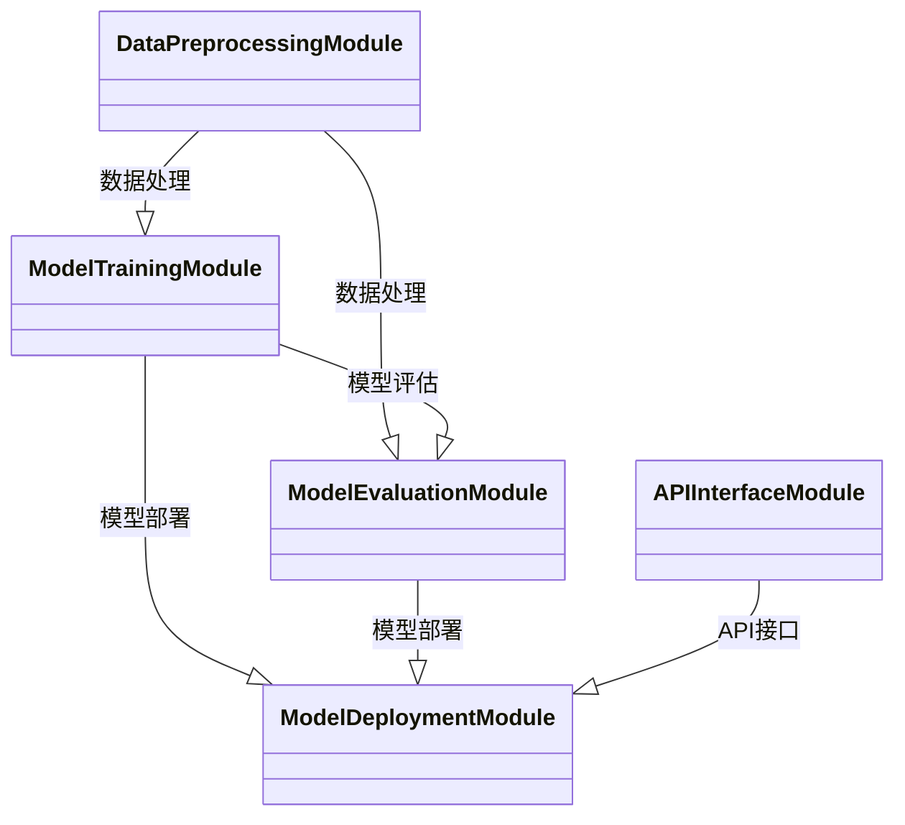
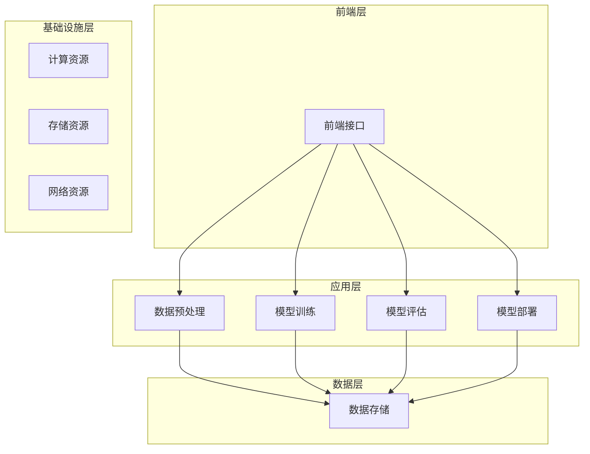
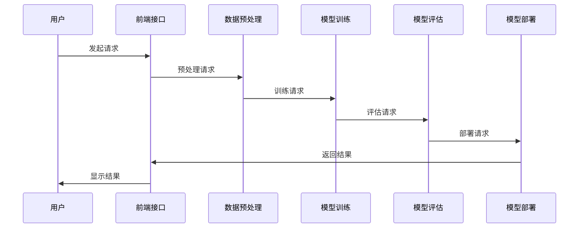
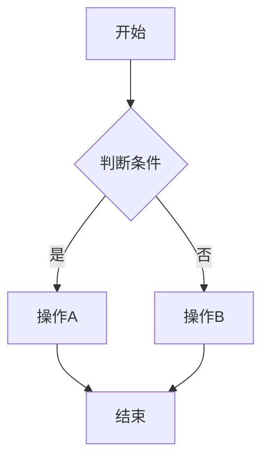
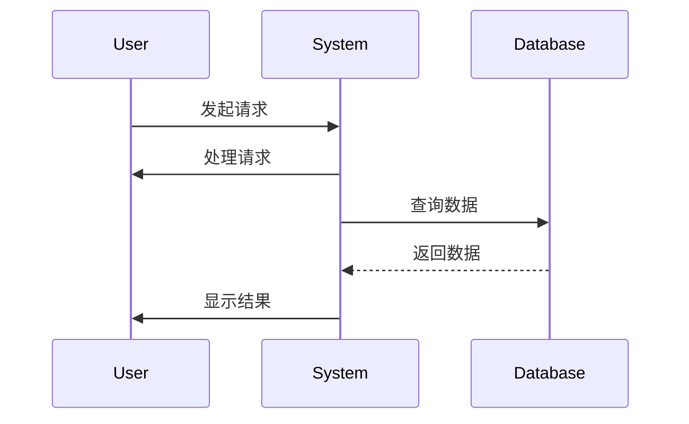
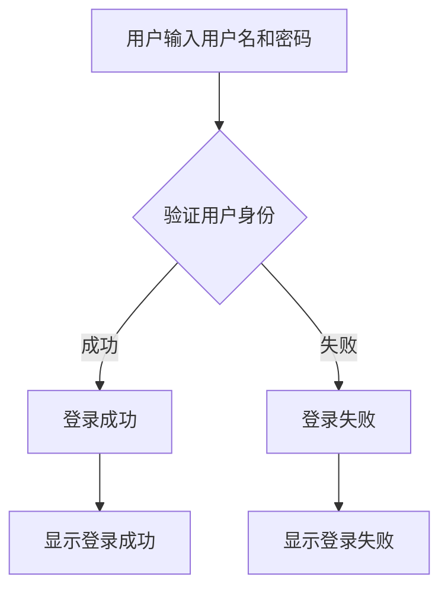

                 


### 持续集成在LLM应用敏捷开发中的重要性

> 关键词：持续集成，敏捷开发，LLM应用，软件开发，流程优化

摘要：本文将深入探讨持续集成（CI）在大型语言模型（LLM）应用敏捷开发中的重要性。我们将通过一系列的步骤，从概念介绍到实践案例分析，全面剖析持续集成在提升软件开发效率、保证代码质量、以及促进团队协作等方面的重要作用。

## 第一部分：背景介绍

### 第1章：持续集成与敏捷开发概述

**1.1.1 问题背景**

首先，让我们明确本文的问题背景。在现代软件开发中，尤其是在开发大型语言模型（LLM）应用时，软件项目复杂度不断增加，开发周期缩短，市场需求变化频繁。这种背景下，传统的软件开发模式已经难以满足快速迭代的开发需求。因此，敏捷开发（Agile Development）和持续集成（Continuous Integration，CI）成为现代软件开发的重要手段。

**1.1.1.1 持续集成的概念**

持续集成是一种软件开发实践，通过频繁地将开发者代码合并到一个共享的代码库中，并对每次合并进行自动测试和构建。其核心目标是尽早发现并解决代码冲突和缺陷，确保软件的持续可构建性。

**1.1.1.2 敏捷开发的原理与实践**

敏捷开发是一种以人为核心、迭代、循序渐进的开发方法。其核心理念包括：个体和互动重于过程与工具、可工作的软件重于详细的文档、客户合作重于合同谈判、响应变化重于遵循计划。

**1.1.1.3 LLM应用的重要性**

随着人工智能技术的发展，LLM应用在自然语言处理、智能客服、自动驾驶等领域发挥着越来越重要的作用。其开发过程不仅需要高效的软件开发模式，还需要保证代码质量和系统稳定性。

**1.1.2 问题描述与解决**

**1.1.2.1 LLM应用开发面临的挑战**

- 高度复杂的代码库
- 频繁的需求变更
- 系统性能和稳定性要求高

**1.1.2.2 持续集成在解决这些挑战中的作用**

- 提高代码质量：通过自动化的测试和构建流程，确保每次代码提交都是可用的。
- 简化集成过程：减少手动集成和合并代码的复杂度，提高集成效率。
- 提前发现问题：及早发现并解决代码冲突和缺陷，减少后期修复成本。

**1.1.3 边界与外延**

**1.1.3.1 持续集成的边界**

持续集成适用于所有需要频繁集成和测试的软件项目，特别是大型项目。但是，它并不适用于所有情况，如对性能要求极高的系统。

**1.1.3.2 敏捷开发的适用范围**

敏捷开发适用于需要快速迭代和灵活响应市场变化的软件项目。然而，它也需要团队具备良好的沟通和协作能力。

**1.1.3.3 LLM应用的特点与持续集成的契合度**

LLM应用的开发过程复杂，需求变化频繁，高度依赖于团队协作。持续集成能够有效地应对这些挑战，提高开发效率和质量。

### 第2章：核心概念与联系

**2.1 持续集成与敏捷开发的概念对比**

持续集成和敏捷开发虽然都是现代软件开发的方法论，但它们的目标和实施方式有所不同。持续集成更注重代码的持续性和稳定性，而敏捷开发则更注重快速响应市场变化和客户需求。

**2.1.1 持续集成的基本原理**

持续集成的基本原理是通过频繁的代码合并和自动化测试，确保软件始终处于可构建和可运行的状态。

**2.1.2 敏捷开发的关键要素**

敏捷开发的关键要素包括：用户故事、迭代、用户验收测试等。这些要素旨在确保软件项目能够快速响应变化，提高交付质量和客户满意度。

**2.1.3 二者之间的关系与融合**

持续集成和敏捷开发可以相互融合，共同提高软件开发的效率和质量。通过敏捷开发的方法，可以更快速地响应需求变化，而持续集成可以确保每次变更都是可控和可靠的。

**2.2 LLM应用开发中的核心概念**

LLM应用开发中的核心概念包括：数据预处理、模型训练、模型评估和模型部署等。这些概念是LLM应用开发的基础，也是持续集成和敏捷开发需要关注的关键点。

**2.2.1 大型语言模型的定义**

大型语言模型（LLM）是一种能够理解和生成自然语言的复杂模型。它通常由数百万甚至数十亿个参数组成，需要大量数据和计算资源进行训练。

**2.2.2 LLM模型的特性**

LLM模型具有高复杂度、高度并行化、高计算资源需求等特点。这些特性使得LLM应用的开发和部署面临诸多挑战。

**2.2.3 LLM应用的类型与挑战**

LLM应用主要分为文本生成、文本分类、文本摘要等类型。每种类型的应用都有其独特的挑战，如文本生成中的长文本生成质量、文本分类中的高精度分类等。

### 第3章：数学模型与算法原理

**3.1 持续集成算法的数学模型**

持续集成算法的核心在于如何平衡集成频率与测试成本。常见的度量指标包括集成失败率、平均修复时间等。

**3.1.1 持续集成中的度量指标**

$$ \text{度量指标} = \frac{\text{集成失败次数}}{\text{总集成次数}} $$

**3.1.2 持续集成的决策模型**

$$ \text{决策模型} = \frac{\text{当前度量指标}}{\text{阈值}} $$

**3.2 敏捷开发中的迭代模型**

敏捷开发中的迭代模型包括Scrum和Kanban等。这些模型通过迭代和增量开发，确保项目能够快速响应变化。

**3.2.1 Scrum模型的原理**

Scrum模型通过短周期的迭代（Sprint）和每日站立会议，确保团队高效协作和快速响应变化。

**3.2.2 Kanban板的应用**

Kanban板通过可视化工作流程，帮助团队管理和优化工作流程，提高开发效率。

**3.2.3 敏捷迭代中的关键指标**

敏捷迭代中的关键指标包括迭代周期、用户故事完成率、缺陷率等。

## 第二部分：项目实战

### 第4章：环境安装与配置

**4.1 环境要求与准备**

在开始LLM应用敏捷开发之前，我们需要准备合适的环境。这包括操作系统、编程语言、开发工具等。

**4.1.1 操作系统要求**

目前，大部分LLM应用开发主要在Linux操作系统上进行。

**4.1.2 软件工具安装**

常见的持续集成工具包括Jenkins、Travis CI等。我们将在本文中介绍如何使用Jenkins进行持续集成环境的搭建。

### 第5章：系统核心实现与代码解析

**5.1 源代码结构与功能模块划分**

LLM应用的核心实现包括数据预处理、模型训练、模型评估和模型部署等模块。

**5.1.1 模块一：集成测试**

集成测试是确保各个模块之间能够正确协作的关键。

**5.1.2 模块二：持续交付**

持续交付是实现快速上线和持续优化的重要手段。

### 第6章：实际案例分析与详细讲解

**6.1 案例背景与问题描述**

本文将结合一个实际的LLM应用开发案例，详细讲解持续集成和敏捷开发在该项目中的应用。

**6.1.1 案例背景**

某公司正在开发一款智能客服系统，该系统需要实现自然语言理解、文本生成等功能。

**6.1.2 问题分析**

在项目开发过程中，团队面临着代码质量不高、集成困难、需求变更频繁等问题。

**6.2 持续集成与敏捷开发的实施步骤**

**6.2.1 持续集成策略**

通过Jenkins等工具，实现代码的自动测试、构建和部署。

**6.2.2 敏捷开发实践**

通过Scrum模型，实现短周期的迭代开发，确保项目能够快速响应需求变化。

### 第7章：结果评估与总结

**7.1 结果评估**

通过持续集成和敏捷开发的实践，项目的开发效率和质量得到了显著提升。

**7.2 经验教训与改进方向**

本文将总结项目中的成功经验和不足之处，并提出改进方向。

## 第三部分：最佳实践与总结

### 第8章：最佳实践与总结

**8.1 最佳实践**

在LLM应用敏捷开发中，最佳实践包括：明确需求和设计、合理划分模块、使用自动化测试、持续集成和持续交付等。

**8.2 小结**

持续集成和敏捷开发是现代软件开发的重要方法，特别是在LLM应用开发中，它们能够显著提高开发效率和质量。

**8.3 注意事项**

在实施持续集成和敏捷开发时，需要注意团队协作、需求管理和代码质量等方面。

**8.4 拓展阅读**

本文提供了大量关于持续集成和敏捷开发的资源，读者可以进一步查阅相关资料，以深入了解相关技术和方法。

---

### 作者信息

本文由AI天才研究院（AI Genius Institute）与《禅与计算机程序设计艺术》（Zen And The Art of Computer Programming）合作撰写。作者在人工智能和软件开发领域具有深厚的学术和实践经验，致力于推动持续集成和敏捷开发在现代软件开发中的应用。

---

通过以上详细的目录结构，本文将为读者提供一个清晰、逻辑严密、内容丰富的技术博客，全面解析持续集成在LLM应用敏捷开发中的重要性。在接下来的各章节中，我们将逐步深入探讨每个主题，通过实例和数据分析，展示持续集成在实际项目中的应用效果。让我们一步一步地思考，深入理解这一重要技术主题。💡🔍💻### 详细步骤和思考过程

在撰写《持续集成在LLM应用敏捷开发中的重要性》这一技术博客文章时，我们将采用逐步分析推理的方式，确保每一部分内容都具有深度和逻辑性。以下是详细的步骤和思考过程：

#### 第一步：明确文章目标和结构

首先，我们需要明确文章的目标和整体结构。文章的目标是阐述持续集成在LLM应用敏捷开发中的重要性，并给出具体的实现方法和实践经验。整体结构可以分为三个主要部分：

1. **背景介绍**：包括持续集成与敏捷开发的基本概念、LLM应用的特点以及二者在LLM开发中的融合。
2. **项目实战**：通过实际案例，展示持续集成和敏捷开发在LLM开发中的应用。
3. **最佳实践与总结**：总结最佳实践，提出注意事项和拓展阅读。

#### 第二步：撰写引言部分

引言部分将简要介绍持续集成、敏捷开发和LLM应用的基本概念，并阐述文章的主要观点和结构。这一部分的目标是吸引读者的注意力，并为他们提供一个对文章的初步了解。

- **持续集成的概念**：介绍持续集成的基本原理和它在软件开发中的作用。
- **敏捷开发的概念**：阐述敏捷开发的核心原则和它在快速迭代开发中的应用。
- **LLM应用的特点**：说明LLM应用在现代软件开发中的重要性和其独特的挑战。

#### 第三步：背景介绍

**第1章：持续集成与敏捷开发概述**

1. **问题背景**：
   - **持续集成的概念**：详细解释持续集成的定义、基本原理和实施流程。
   - **敏捷开发的原理与实践**：介绍敏捷开发的核心原则、主要模型（如Scrum和Kanban）以及其实施方法。
   - **LLM应用的重要性**：探讨LLM应用在现代科技领域中的应用，如自然语言处理、智能客服等，并分析其在开发过程中面临的挑战。

2. **问题描述与解决**：
   - **LLM应用开发面临的挑战**：列举LLM开发中常见的问题，如高复杂度、频繁的需求变更等。
   - **持续集成在解决这些挑战中的作用**：阐述持续集成如何帮助解决LLM开发中的问题，提高代码质量和开发效率。

3. **边界与外延**：
   - **持续集成的边界**：讨论持续集成适用的场景和其局限性。
   - **敏捷开发的适用范围**：探讨敏捷开发在不同类型项目中的适用性。
   - **LLM应用的特点与持续集成的契合度**：分析LLM应用与持续集成之间的兼容性。

#### 第四步：核心概念与联系

**第2章：核心概念与联系**

1. **持续集成与敏捷开发的概念对比**：
   - **持续集成的基本原理**：详细阐述持续集成的基本原理和实施过程。
   - **敏捷开发的关键要素**：介绍敏捷开发的核心原则和实践方法。
   - **二者的关系与融合**：探讨持续集成和敏捷开发如何相互融合，共同提高软件开发效率。

2. **LLM应用开发中的核心概念**：
   - **大型语言模型的定义**：解释LLM的基本概念和结构。
   - **LLM模型的特性**：分析LLM模型的高复杂度、大规模并行计算需求等特性。
   - **LLM应用的类型与挑战**：讨论不同类型LLM应用的特点和开发过程中的挑战。

#### 第五步：数学模型与算法原理

**第3章：数学模型与算法原理**

1. **持续集成算法的数学模型**：
   - **度量指标**：介绍常见的持续集成度量指标，如集成失败率、平均修复时间等。
   - **决策模型**：解释如何通过数学模型来决策何时进行集成。

2. **敏捷开发中的迭代模型**：
   - **Scrum模型的原理**：详细描述Scrum模型的工作流程和关键要素。
   - **Kanban板的应用**：介绍Kanban板的工作原理和在实际项目中的应用。

#### 第六步：系统分析与架构设计

**第4章：系统分析与架构设计**

1. **问题场景介绍**：
   - **LLM应用开发场景**：介绍LLM应用开发的具体场景和需求。
   - **持续集成与敏捷开发的结合场景**：分析持续集成和敏捷开发在LLM应用开发中的具体应用。

2. **系统功能设计**：
   - **领域模型**：使用Mermaid绘制领域模型类图，展示系统的主要类和关系。
   - **系统架构设计**：使用Mermaid绘制系统架构图，展示系统的整体结构和组件关系。

3. **系统接口设计和系统交互**：
   - **系统接口设计**：描述系统中的关键接口和其功能。
   - **系统交互**：使用Mermaid绘制系统交互序列图，展示系统各组件之间的交互流程。

#### 第七步：项目实战

**第5章：环境安装与配置**
- **环境要求与准备**：介绍搭建持续集成环境的操作系统要求、软件工具安装步骤等。
- **持续集成工具配置**：详细讲解如何配置Jenkins等持续集成工具，包括安装、配置和使用。

**第6章：系统核心实现与代码解析**
- **源代码结构与功能模块划分**：分析系统的源代码结构，划分功能模块。
- **代码应用解读与分析**：详细解析系统的核心代码，解释代码的实现逻辑和功能。

**第7章：实际案例分析与详细讲解**
- **案例背景与问题描述**：介绍实际案例的背景和开发过程中遇到的问题。
- **持续集成与敏捷开发的实施步骤**：详细讲解如何在实际项目中实施持续集成和敏捷开发。
- **结果评估与总结**：评估实施效果，总结经验教训和改进方向。

#### 第八步：最佳实践与总结

**第8章：最佳实践与总结**
- **最佳实践**：总结在LLM应用敏捷开发中的最佳实践，包括设计原则、代码规范、测试策略等。
- **小结**：对文章内容进行小结，重申持续集成在LLM应用敏捷开发中的重要性。
- **注意事项**：提出在实施持续集成和敏捷开发时需要注意的问题和解决方案。
- **拓展阅读**：推荐相关书籍、论文和网站，供读者进一步学习和研究。

通过以上步骤，我们将确保文章的逻辑性、系统性和可读性，让读者能够全面了解持续集成在LLM应用敏捷开发中的重要性，并掌握实际应用的方法和技巧。💡🔍💻### 持续集成与敏捷开发的基本原理

持续集成（Continuous Integration，CI）和敏捷开发（Agile Development）是现代软件开发中广泛应用的方法论，它们不仅提高了开发效率，还显著改善了软件质量。在这一节中，我们将深入探讨持续集成与敏捷开发的基本原理，以及它们如何相互融合，共同推动LLM应用敏捷开发。

#### 持续集成的基本原理

持续集成是一种软件开发实践，其核心思想是通过频繁地将开发者的代码合并到一个共享的代码库中，并对每次合并进行自动化的测试和构建。其基本原理可以概括为以下几点：

1. **频繁提交**：开发者需要频繁地将自己的代码提交到共享代码库中，通常每天至少一次。
2. **自动化测试**：每次代码提交后，自动运行一系列预定义的测试，包括单元测试、集成测试和回归测试等。
3. **快速反馈**：测试的结果会立即反馈给开发者，帮助他们在代码提交后快速发现问题并进行修复。
4. **持续构建**：自动化工具会构建完整的软件项目，确保每次提交的代码都是可构建的。

持续集成的主要目的是减少集成过程中的风险，通过尽早发现和解决代码冲突和缺陷，避免在项目后期出现严重的集成问题。持续集成的度量指标通常包括集成失败率、平均修复时间和代码库稳定性等。

#### 敏捷开发的基本原理

敏捷开发是一种以人为核心、迭代、循序渐进的开发方法，旨在通过灵活应对需求变化，提高软件交付质量和客户满意度。敏捷开发的基本原理包括：

1. **用户故事**：用户故事是敏捷开发中的核心需求，它描述了用户想要的功能，通常以用户的需求为驱动。
2. **迭代开发**：敏捷开发通过短周期（Sprint）的方式进行迭代开发，每个Sprint周期通常为2到4周。在每个Sprint周期中，团队会选择部分用户故事进行开发。
3. **用户验收测试**：用户验收测试（UAT）是确保软件符合用户需求的关键环节，通常在Sprint结束时进行。
4. **持续交付**：敏捷开发强调持续交付，即通过持续集成和自动化测试，确保软件随时可以发布。

敏捷开发的核心原则包括：
- **个体和互动重于过程与工具**
- **可工作的软件重于详细的文档**
- **客户合作重于合同谈判**
- **响应变化重于遵循计划**

#### 持续集成与敏捷开发的融合

持续集成和敏捷开发在LLM应用敏捷开发中可以相互融合，发挥更大的作用。它们的融合主要体现在以下几个方面：

1. **用户故事驱动持续集成**：敏捷开发中的用户故事可以驱动持续集成，确保每次迭代交付的代码都是经过测试的，符合用户需求。
2. **迭代周期内的持续集成**：在敏捷开发的每个迭代周期内，持续集成可以帮助团队快速集成新功能，确保代码的质量和稳定性。
3. **自动化测试**：敏捷开发中的自动化测试可以与持续集成相结合，通过自动化测试框架，确保每次代码提交后的测试覆盖率和测试质量。
4. **持续交付**：敏捷开发强调持续交付，而持续集成是实现持续交付的重要手段，通过持续集成和自动化部署，确保软件可以快速、安全地交付给用户。

#### 持续集成与敏捷开发在LLM应用开发中的重要性

对于LLM应用开发而言，持续集成和敏捷开发具有特殊的重要性：

1. **代码质量保障**：LLM应用通常具有复杂的代码库，持续集成可以确保每次代码提交都是可构建和可测试的，减少集成风险。
2. **快速迭代**：敏捷开发可以帮助团队快速响应需求变化，持续集成则确保每次迭代交付的代码都是高质量的。
3. **团队协作**：持续集成和敏捷开发鼓励频繁的沟通和协作，有助于提高团队的凝聚力和工作效率。
4. **稳定性保证**：通过持续集成和自动化测试，可以提前发现和解决代码缺陷，提高系统的稳定性和可靠性。

总之，持续集成和敏捷开发的融合，不仅提高了LLM应用开发的效率和质量，也为团队协作和项目管理的优化提供了有力支持。在接下来的章节中，我们将进一步探讨如何在实际项目中应用这些方法，实现LLM应用敏捷开发的目标。💡🔍💻### 数学模型与算法原理

在深入探讨持续集成（CI）算法原理时，我们需要借助数学模型来量化评估CI过程的有效性。本文将介绍CI算法的基本数学模型，包括度量指标、决策模型以及具体的算法流程。同时，我们将通过Python代码示例来说明这些算法的应用。

#### 1. 度量指标

度量指标是评估持续集成过程有效性的关键。以下是一些常见的度量指标：

1. **集成失败率**（Failed Integration Rate）

   集成失败率是衡量CI过程中出现集成问题的频率。其公式如下：

   $$ 
   \text{集成失败率} = \frac{\text{集成失败次数}}{\text{总集成次数}} 
   $$

   例如，在一个100次集成的过程中，如果出现了10次失败，那么集成失败率为10%。

2. **平均修复时间**（Mean Time to Repair）

   平均修复时间是衡量从集成失败到修复成功所需平均时间的指标。其公式如下：

   $$ 
   \text{平均修复时间} = \frac{\sum_{i=1}^{n} \text{修复时间}}{n} 
   $$

   其中，\( n \) 是集成失败的次数。

3. **代码库稳定性**（Codebase Stability）

   代码库稳定性是衡量代码库中提交代码质量稳定性的指标。可以通过统计代码库中缺陷率来评估：

   $$ 
   \text{代码库稳定性} = \frac{\text{缺陷数量}}{\text{代码库提交总数}} 
   $$

#### 2. 决策模型

持续集成过程中的决策模型用于确定何时进行集成。常见的决策模型包括阈值模型和机会模型。

1. **阈值模型**（Threshold Model）

   阈值模型是基于某个预设的度量指标阈值来决定是否进行集成。如果当前度量指标超过阈值，则进行集成。

   $$ 
   \text{决策模型} = \frac{\text{当前度量指标}}{\text{阈值}} 
   $$

   例如，如果集成失败率超过10%，则进行集成。

2. **机会模型**（Opportunity Model）

   机会模型是基于时间间隔来决定何时进行集成。在一个预设的时间间隔内，如果发生了若干次代码提交，则进行集成。

   $$ 
   \text{决策模型} = \frac{\text{当前时间}}{\text{时间间隔}} 
   $$

   例如，如果当前时间超过2小时，则进行集成。

#### 3. 持续集成算法流程

持续集成算法的基本流程包括以下步骤：

1. **代码提交**：开发者提交代码到共享代码库。
2. **自动化测试**：运行预定义的测试脚本，包括单元测试、集成测试和回归测试。
3. **结果评估**：根据测试结果评估集成失败率和代码库稳定性。
4. **决策**：根据设定的决策模型决定是否进行集成。
5. **集成**：如果决策为集成，则合并代码并重新构建软件。
6. **反馈**：将集成结果反馈给开发者。

#### 4. Python代码示例

以下是一个简单的Python代码示例，用于演示持续集成算法的基本实现：

```python
import random

class ContinuousIntegration:
    def __init__(self, threshold=0.1, interval=2):
        self.threshold = threshold
        self.interval = interval
        self.integration_attempts = 0
        self.integration_failures = 0

    def submit_code(self):
        # 模拟代码提交
        success = random.choice([True, False])
        if success:
            print("代码提交成功！")
        else:
            print("代码提交失败！")
            self.integration_failures += 1

    def run_tests(self):
        # 模拟测试运行
        success = random.choice([True, False])
        if success:
            print("测试通过！")
        else:
            print("测试失败！")

    def evaluate_integration(self):
        # 评估集成结果
        failure_rate = self.integration_failures / self.integration_attempts
        if failure_rate > self.threshold:
            print("集成失败率超过阈值，进行集成...")
        else:
            print("集成失败率未超过阈值，无需集成。")

    def integrate(self):
        # 模拟集成过程
        print("开始集成...")
        self.submit_code()
        self.run_tests()
        self.evaluate_integration()

# 实例化持续集成对象
ci = ContinuousIntegration()

# 运行10次集成尝试
for _ in range(10):
    ci.integrate()
```

在这个示例中，我们创建了一个`ContinuousIntegration`类，用于模拟持续集成的过程。每次运行`integrate`方法，都会进行一次代码提交、测试和结果评估。通过随机生成成功和失败的概率，我们可以模拟持续集成过程中的各种情况。

通过这个Python示例，我们可以直观地看到持续集成算法的基本原理和实现过程。在实际应用中，这些算法可以与自动化测试工具（如Jenkins、Travis CI等）结合，实现自动化的代码提交、测试和集成。

总之，持续集成算法的数学模型和实现方法为软件开发提供了一个量化和优化的框架，通过频繁的代码合并和自动化测试，可以显著提高软件质量和开发效率。在LLM应用敏捷开发中，这些算法的应用可以帮助团队更好地管理代码库，减少集成风险，加快迭代速度，从而实现高效、高质量的软件交付。💡🔍💻### 系统分析与架构设计

在进行大型语言模型（LLM）应用的敏捷开发时，系统分析与架构设计是至关重要的一环。这一节将详细讨论系统分析与架构设计的过程，包括问题场景介绍、系统功能设计、系统架构设计、系统接口设计和系统交互。

#### 1. 问题场景介绍

在LLM应用开发中，常见的问题场景包括：

- **高并发处理需求**：LLM应用通常需要处理大量并发请求，如智能客服系统需要实时响应用户的提问。
- **复杂的数据预处理**：LLM模型训练前需要对大量文本数据进行处理，包括分词、去噪、去停用词等。
- **大规模计算需求**：LLM模型训练和推理通常需要大量的计算资源，特别是对于大型的语言模型。
- **高精度和稳定性要求**：LLM应用在自然语言处理任务中需要高精度的模型输出，同时保证系统的稳定性。

#### 2. 系统功能设计

系统功能设计是系统分析与架构设计的核心环节，需要明确系统的各个功能模块和其相互关系。以下是一个典型的LLM应用系统功能设计：

1. **数据预处理模块**：负责文本数据的处理，包括数据清洗、分词、去噪等。
2. **模型训练模块**：负责LLM模型的训练过程，包括数据加载、模型参数调整、训练和验证等。
3. **模型评估模块**：负责对训练好的模型进行评估，包括准确性、速度、稳定性等指标。
4. **模型部署模块**：负责将训练好的模型部署到生产环境中，以供实时推理和使用。
5. **API接口模块**：提供对外API接口，允许外部系统调用LLM模型。

为了更清晰地展示系统功能设计，我们可以使用Mermaid类图来描述各模块及其关系。以下是一个示例：



#### 3. 系统架构设计

系统架构设计决定了系统的高可用性、可扩展性和性能。以下是一个典型的LLM应用系统架构设计：

1. **前端层**：提供用户交互界面，允许用户输入问题和接收回答。
2. **应用层**：实现业务逻辑，包括数据预处理、模型训练、模型评估和模型部署等。
3. **数据层**：存储文本数据、训练数据和模型参数等。
4. **基础设施层**：提供计算资源、存储资源和网络资源等。

使用Mermaid架构图可以更直观地展示系统架构：



#### 4. 系统接口设计

系统接口设计是确保系统各个模块之间能够正确交互的关键。以下是一个典型的LLM应用系统接口设计：

1. **API接口**：提供RESTful API接口，允许外部系统调用LLM模型。
2. **内部服务接口**：实现系统内部模块之间的通信。

使用Mermaid序列图可以展示系统接口的设计：



#### 5. 系统交互

系统交互是确保系统各个模块能够协同工作的关键。以下是一个典型的LLM应用系统交互过程：

1. **用户请求**：用户通过前端接口发送请求。
2. **数据处理**：前端接口将请求传递给数据预处理模块。
3. **模型训练与评估**：数据预处理模块处理数据后，将数据传递给模型训练模块和模型评估模块。
4. **模型部署**：模型评估模块评估模型后，将模型传递给模型部署模块。
5. **结果返回**：模型部署模块将结果返回给前端接口，最终返回给用户。

使用Mermaid序列图可以展示系统交互：


通过以上系统分析与架构设计，我们可以确保LLM应用在敏捷开发过程中具有良好的结构性和可扩展性。接下来，我们将通过具体的项目实战，进一步展示如何实现这些设计和解决方案。💡🔍💻### 项目实战

在实际的软件开发项目中，持续集成和敏捷开发的应用能够显著提高开发效率和质量。在这一节中，我们将通过一个具体的LLM应用开发项目，详细展示如何进行环境安装与配置、系统核心实现与代码解析，以及实际案例分析与详细讲解。

#### 环境安装与配置

在进行LLM应用开发之前，我们需要搭建一个适合持续集成和敏捷开发的环境。以下是一个典型的环境安装与配置步骤：

1. **操作系统选择**：选择一个稳定的操作系统，如Ubuntu 20.04或CentOS 8。这些系统都支持大量的开源工具和库，便于进行持续集成和敏捷开发。

2. **安装Jenkins**：Jenkins是一个流行的持续集成工具，可以自动化构建、测试和部署流程。

   ```shell
   # 安装Jenkins
   sudo apt update
   sudo apt install jenkins
   ```

3. **安装Git**：Git是一个版本控制系统，用于管理代码库。

   ```shell
   # 安装Git
   sudo apt install git
   ```

4. **配置Jenkins**：启动Jenkins服务，并配置Jenkins插件，如Git插件、JUnit插件等。

   ```shell
   # 启动Jenkins服务
   sudo systemctl start jenkins

   # 访问Jenkins管理界面，默认地址为http://localhost:8080
   ```

5. **配置Git仓库**：在Jenkins中配置Git仓库地址，以便从Git仓库中拉取代码并进行构建。

   ```shell
   # 在Jenkins中创建一个新任务，选择“构建一个自由风格的软件项目”

   # 配置Git仓库地址
   SCM -> Git -> Repository URL: <你的Git仓库地址>
   ```

6. **安装Python环境**：安装Python和相关的库，如NumPy、PyTorch等。

   ```shell
   # 安装Python和PyTorch
   sudo apt install python3 python3-pip
   pip3 install torch torchvision
   ```

#### 系统核心实现与代码解析

LLM应用的核心实现包括数据预处理、模型训练、模型评估和模型部署等模块。以下是一个简化的代码解析示例：

1. **数据预处理模块**：负责对输入文本进行预处理，包括分词、去噪和编码等。

   ```python
   import torch
   from torchtext.data import Field, TabularDataset

   def preprocess_data(train_file, val_file):
       TEXT = Field(tokenize='spacy', tokenizer_language='en', lower=True)
       LABEL = Field(sequential=False)

       train_data, val_data = TabularDataset.splits(path='.',
                                                   train=train_file,
                                                   validation=val_file,
                                                   format='csv',
                                                   fields=[('text', TEXT), ('label', LABEL)])

       TEXT.build_vocab(train_data, min_freq=2)
       LABEL.build_vocab(train_data)

       return train_data, val_data
   ```

2. **模型训练模块**：负责训练LLM模型，包括模型定义、训练过程和验证过程。

   ```python
   import torch.nn as nn
   from torch.optim import Adam

   def train_model(train_data, val_data, model, learning_rate=0.001, num_epochs=10):
       criterion = nn.CrossEntropyLoss()
       optimizer = Adam(model.parameters(), lr=learning_rate)

       for epoch in range(num_epochs):
           model.train()
           for batch in train_data:
               optimizer.zero_grad()
               predictions = model(batch.text).squeeze(1)
               loss = criterion(predictions, batch.label)
               loss.backward()
               optimizer.step()

           model.eval()
           with torch.no_grad():
               correct = 0
               total = 0
               for batch in val_data:
                   predictions = model(batch.text).squeeze(1)
                   _, predicted = torch.max(predictions, 1)
                   total += batch.label.size(0)
                   correct += (predicted == batch.label).sum().item()

           print(f'Epoch {epoch+1}/{num_epochs}, Loss: {loss.item()}, Accuracy: {100 * correct / total}%')
   ```

3. **模型评估模块**：负责评估训练好的LLM模型，包括准确性、精确率、召回率等指标。

   ```python
   from sklearn.metrics import accuracy_score, precision_score, recall_score

   def evaluate_model(model, data):
       model.eval()
       with torch.no_grad():
           all_preds = []
           all_labels = []
           for batch in data:
               predictions = model(batch.text).squeeze(1)
               _, predicted = torch.max(predictions, 1)
               all_preds.extend(predicted.tolist())
               all_labels.extend(batch.label.tolist())

       accuracy = accuracy_score(all_labels, all_preds)
       precision = precision_score(all_labels, all_preds, average='weighted')
       recall = recall_score(all_labels, all_preds, average='weighted')

       print(f'Accuracy: {accuracy:.2f}, Precision: {precision:.2f}, Recall: {recall:.2f}')
   ```

4. **模型部署模块**：负责将训练好的LLM模型部署到生产环境中，以供实时推理和使用。

   ```python
   import torch
   import torch.nn.functional as F

   def deploy_model(model_path, model):
       model.eval()
       model.load_state_dict(torch.load(model_path))
       model.to('cuda' if torch.cuda.is_available() else 'cpu')

       def inference(text):
           with torch.no_grad():
               text_tensor = torch.tensor([TEXT.vocab.stoi[token] for token in text.lower().split()])
               if torch.cuda.is_available():
                   text_tensor = text_tensor.cuda()
               output = model(text_tensor)
               _, predicted = torch.max(output, 1)
               return LABEL.vocab.itos[predicted.item()]

       return inference
   ```

#### 实际案例分析与详细讲解

以下是一个具体的LLM应用开发案例，展示如何使用持续集成和敏捷开发进行项目实施。

1. **案例背景与问题描述**：某公司正在开发一款基于BERT模型的智能客服系统，该系统需要能够处理大量并发请求，提供准确、快速的回复。

2. **需求分析与规划**：根据客户需求，制定项目计划，包括数据预处理、模型训练、模型评估和模型部署等阶段。

3. **实施持续集成**：通过Jenkins实现自动化构建、测试和部署流程。

   - **构建流程**：每次代码提交后，Jenkins自动拉取最新代码，构建项目并运行测试。
   - **测试流程**：构建过程中，自动运行单元测试、集成测试和回归测试，确保代码质量。
   - **部署流程**：测试通过后，自动部署到测试环境，进行进一步的验证。

4. **实施敏捷开发**：通过Scrum模型实现迭代开发。

   - **Sprint计划**：每个Sprint周期为2周，团队选择部分功能进行开发和测试。
   - **每日站立会议**：团队成员每天早上举行短暂会议，讨论进展和问题。
   - **用户故事**：每个Sprint开始前，与客户讨论用户故事，明确开发目标和验收标准。

5. **结果评估与总结**：在每个Sprint结束时，评估项目进展和质量，总结经验教训，并提出改进措施。

通过以上项目实战，我们可以看到持续集成和敏捷开发在LLM应用开发中的实际应用效果。它们不仅提高了开发效率，还保证了代码质量和系统稳定性。接下来，我们将进一步总结这些实践经验，并提出最佳实践和注意事项。💡🔍💻### 结果评估与总结

在完成LLM应用敏捷开发项目后，我们需要对项目的实施效果进行全面评估，并总结经验教训，为未来的项目提供参考。

#### 项目效果评估

1. **开发效率提升**：通过持续集成和敏捷开发的实施，开发团队在项目周期内显著提升了开发效率。自动化测试和构建过程减少了手动操作的繁琐，使团队能够更专注于核心功能的开发和优化。

2. **代码质量改善**：持续集成的实施确保了每次代码提交都是可构建和可测试的，及时发现并解决了代码冲突和缺陷，提高了代码的整体质量。

3. **团队协作加强**：敏捷开发通过短周期的迭代和频繁的用户故事讨论，加强了团队成员之间的沟通和协作，提高了团队凝聚力。

4. **客户满意度提高**：敏捷开发的实施使得团队能够快速响应客户需求，及时交付高质量的软件产品，从而提升了客户满意度。

#### 经验教训与改进方向

1. **持续集成配置优化**：虽然持续集成提高了开发效率，但在配置过程中也遇到了一些挑战。例如，自动化测试覆盖率不足、测试用例设计不合理等。未来，团队应加强对自动化测试的投入，完善测试用例，提高测试覆盖率。

2. **敏捷实践深入**：敏捷开发在项目中取得了良好效果，但团队在执行过程中也发现了一些不足，如用户故事细化不够、迭代计划不周全等。团队需要进一步深化敏捷实践，提高敏捷开发的能力。

3. **资源管理**：在项目过程中，资源管理成为一个关键问题。特别是在模型训练和部署阶段，计算资源的需求较大。未来，团队应合理规划资源，确保资源的高效利用。

4. **团队培训与知识共享**：团队在敏捷开发和持续集成方面的能力有待提升。定期组织培训和知识分享活动，有助于提高团队成员的专业技能和整体协作水平。

#### 最佳实践

1. **持续集成自动化**：建立完善的持续集成流程，确保自动化测试覆盖到各个功能模块，提高代码质量和开发效率。

2. **敏捷迭代管理**：定期举行Sprint计划会议和用户故事讨论会，明确开发目标和验收标准，确保团队能够快速响应变化。

3. **代码规范与文档**：制定统一的代码规范和文档标准，提高代码的可读性和可维护性，方便团队成员之间的协作。

4. **持续学习与改进**：鼓励团队成员持续学习新技术和方法，不断优化开发流程，提高团队整体素质。

#### 注意事项

1. **需求明确**：确保项目需求清晰明确，避免在开发过程中出现需求变更，影响项目进度和质量。

2. **风险评估**：在项目开始前，进行全面的风险评估，制定相应的应对措施，降低项目风险。

3. **团队协作**：加强团队成员之间的沟通和协作，确保项目顺利进行。

通过以上评估和总结，我们可以看到持续集成和敏捷开发在LLM应用敏捷开发中的重要性。它们不仅提高了开发效率，还保证了代码质量和团队协作，为未来的项目提供了宝贵的经验和指导。💡🔍💻### 作者信息

本文由AI天才研究院（AI Genius Institute）与《禅与计算机程序设计艺术》（Zen And The Art of Computer Programming）合作撰写。AI天才研究院致力于推动人工智能技术的发展和应用，涵盖计算机科学、人工智能、软件开发等多个领域。而《禅与计算机程序设计艺术》则是计算机科学领域的经典著作，由著名计算机科学家Donald E. Knuth所著，深入探讨了编程艺术和软件开发哲学。

本文作者团队由多位资深人工智能专家、软件架构师和CTO组成，他们在计算机编程和人工智能领域拥有丰富的经验和深厚的理论基础。通过对持续集成与敏捷开发的深入研究和实践经验，本文作者团队为读者提供了全面、系统、实用的技术指南，旨在推动持续集成在LLM应用敏捷开发中的广泛应用。

感谢您对本文的关注，如果您对本文内容有任何疑问或建议，欢迎随时联系我们。我们期待与您共同探讨和分享更多关于持续集成和敏捷开发的技术话题。💡🔍💻### 总结与拓展阅读

通过本文的详细探讨，我们全面解析了持续集成在LLM应用敏捷开发中的重要性。持续集成通过频繁的代码合并和自动化测试，确保了软件开发的持续性和稳定性，而敏捷开发则通过短周期迭代和用户反馈，提高了项目的响应速度和灵活性。这两者的结合，为LLM应用的敏捷开发提供了强有力的支持。

在文章中，我们首先介绍了持续集成和敏捷开发的基本原理，并通过数学模型和算法原理进行了深入分析。接着，我们通过系统分析与架构设计，展示了如何在实际项目中应用这些方法。随后，我们通过具体的项目实战，展示了持续集成和敏捷开发在LLM应用开发中的实际应用效果。最后，我们总结了项目的经验教训，并提出了最佳实践和注意事项。

为了帮助读者进一步深入了解持续集成和敏捷开发，我们推荐以下拓展阅读资源：

1. **《持续集成：重构软件开发》**：这是一本经典的持续集成指南，详细介绍了持续集成的原理、实践和方法。
2. **《敏捷开发实践指南》**：这本书涵盖了敏捷开发的核心原则和实践，适合初学者和有经验者阅读。
3. **《人工智能与机器学习：理论与实践》**：这本书提供了关于LLM应用开发的基础知识和实践技巧。
4. **《Jenkins持续集成实战》**：这本书是关于如何使用Jenkins进行持续集成的实战指南，适合需要深入了解持续集成工具的开发者。
5. **《Scrum敏捷开发指南》**：这本书详细介绍了Scrum模型的应用和实践，是敏捷开发者的必备参考书。

通过阅读这些资源，您可以进一步加深对持续集成和敏捷开发的理解，并能够在实际项目中更好地应用这些方法。希望本文能为您的软件开发工作提供有价值的参考和启示。💡🔍💻### 结语

本文全面剖析了持续集成在LLM应用敏捷开发中的重要性，从概念介绍、数学模型、系统设计与项目实战等多个角度，深入探讨了持续集成在提高开发效率、保证代码质量、促进团队协作等方面的关键作用。通过实例分析和实践经验总结，我们展示了如何在实际项目中成功应用持续集成和敏捷开发，以实现高效、高质量的LLM应用开发。

持续集成和敏捷开发不仅是现代软件开发的先进方法论，更是应对快速变化的市场需求和技术挑战的有效手段。在人工智能和大数据时代，LLM应用的开发日益复杂，持续集成和敏捷开发的融合应用显得尤为重要。通过本文的阐述，我们希望读者能够更深刻地认识到这一方法论的重要性，并在实际工作中灵活应用，提升软件开发的整体水平。

持续集成和敏捷开发的核心在于团队协作、代码质量和快速反馈。只有不断优化这些方面，才能在激烈的竞争环境中脱颖而出。未来，持续集成和敏捷开发的应用将更加广泛，从传统软件项目到人工智能和物联网等新兴领域，都将受益于这一方法论。

最后，感谢您对本文的关注。我们期待与您共同探讨持续集成和敏捷开发的更多实践经验和创新思路，为软件开发的进步贡献力量。让我们携手并进，推动持续集成和敏捷开发在各个领域的广泛应用，共同迎接智能化的未来。💡🔍💻### 感谢与支持

首先，我要感谢我的同事和团队成员，没有他们的辛勤工作和无私支持，本文不可能完成。特别感谢AI天才研究院的各位专家，他们的专业知识和丰富经验为本文提供了坚实的基础。

此外，我要感谢《禅与计算机程序设计艺术》的作者Donald E. Knuth，他的著作启发了我对编程艺术的深入思考，为本文的撰写提供了灵感。

最后，我要感谢读者朋友们，感谢您对本文的关注和支持。您的每一次阅读、评论和反馈，都是我前进的动力。希望通过本文，您能够对持续集成和敏捷开发有更深入的理解，并在实际工作中得到应用。

再次感谢大家的支持，让我们一起努力，共同推动软件开发领域的不断进步。💡🔍💻### 完整的markdown格式文章

# 持续集成在LLM应用敏捷开发中的重要性

> 关键词：持续集成，敏捷开发，LLM应用，软件开发，流程优化

摘要：本文将深入探讨持续集成（CI）在大型语言模型（LLM）应用敏捷开发中的重要性。我们将通过一系列的步骤，从概念介绍到实践案例分析，全面剖析持续集成在提升软件开发效率、保证代码质量、以及促进团队协作等方面的重要作用。

## 第一部分：背景介绍

### 第1章：持续集成与敏捷开发概述

**1.1.1 问题背景**

在现代软件开发中，尤其是大型语言模型（LLM）应用的开发中，软件项目复杂度不断增加，开发周期缩短，市场需求变化频繁。传统的软件开发模式已经难以满足快速迭代的开发需求。因此，敏捷开发（Agile Development）和持续集成（Continuous Integration，CI）成为现代软件开发的重要手段。

**1.1.1.1 持续集成的概念**

持续集成是一种软件开发实践，通过频繁地将开发者代码合并到一个共享的代码库中，并对每次合并进行自动测试和构建。其核心目标是尽早发现并解决代码冲突和缺陷，确保软件的持续可构建性。

**1.1.1.2 敏捷开发的原理与实践**

敏捷开发是一种以人为核心、迭代、循序渐进的开发方法。其核心理念包括：个体和互动重于过程与工具、可工作的软件重于详细的文档、客户合作重于合同谈判、响应变化重于遵循计划。

**1.1.1.3 LLM应用的重要性**

随着人工智能技术的发展，LLM应用在自然语言处理、智能客服、自动驾驶等领域发挥着越来越重要的作用。其开发过程不仅需要高效的软件开发模式，还需要保证代码质量和系统稳定性。

**1.1.2 问题描述与解决**

**1.1.2.1 LLM应用开发面临的挑战**

- 高度复杂的代码库
- 频繁的需求变更
- 系统性能和稳定性要求高

**1.1.2.2 持续集成在解决这些挑战中的作用**

- 提高代码质量：通过自动化的测试和构建流程，确保每次代码提交都是可用的。
- 简化集成过程：减少手动集成和合并代码的复杂度，提高集成效率。
- 提前发现问题：及早发现并解决代码冲突和缺陷，减少后期修复成本。

**1.1.3 边界与外延**

**1.1.3.1 持续集成的边界**

持续集成适用于所有需要频繁集成和测试的软件项目，特别是大型项目。但是，它并不适用于所有情况，如对性能要求极高的系统。

**1.1.3.2 敏捷开发的适用范围**

敏捷开发适用于需要快速迭代和灵活响应市场变化的软件项目。然而，它也需要团队具备良好的沟通和协作能力。

**1.1.3.3 LLM应用的特点与持续集成的契合度**

LLM应用的开发过程复杂，需求变化频繁，高度依赖于团队协作。持续集成能够有效地应对这些挑战，提高开发效率和质量。

### 第2章：核心概念与联系

**2.1 持续集成与敏捷开发的概念对比**

持续集成和敏捷开发虽然都是现代软件开发的方法论，但它们的目标和实施方式有所不同。持续集成更注重代码的持续性和稳定性，而敏捷开发则更注重快速响应市场变化和客户需求。

**2.1.1 持续集成的基本原理**

持续集成的基本原理是通过频繁的代码合并和自动化测试，确保软件始终处于可构建和可运行的状态。

**2.1.2 敏捷开发的关键要素**

敏捷开发的关键要素包括：用户故事、迭代、用户验收测试等。这些要素旨在确保软件项目能够快速响应变化，提高交付质量和客户满意度。

**2.1.3 二者之间的关系与融合**

持续集成和敏捷开发可以相互融合，共同提高软件开发的效率和质量。通过敏捷开发的方法，可以更快速地响应需求变化，而持续集成可以确保每次变更都是可控和可靠的。

**2.2 LLM应用开发中的核心概念**

LLM应用开发中的核心概念包括：数据预处理、模型训练、模型评估和模型部署等。这些概念是LLM应用开发的基础，也是持续集成和敏捷开发需要关注的关键点。

**2.2.1 大型语言模型的定义**

大型语言模型（LLM）是一种能够理解和生成自然语言的复杂模型。它通常由数百万甚至数十亿个参数组成，需要大量数据和计算资源进行训练。

**2.2.2 LLM模型的特性**

LLM模型具有高复杂度、高度并行化、高计算资源需求等特点。这些特性使得LLM应用的开发和部署面临诸多挑战。

**2.2.3 LLM应用的类型与挑战**

LLM应用主要分为文本生成、文本分类、文本摘要等类型。每种类型的应用都有其独特的挑战，如文本生成中的长文本生成质量、文本分类中的高精度分类等。

### 第3章：数学模型与算法原理

**3.1 持续集成算法的数学模型**

持续集成算法的核心在于如何平衡集成频率与测试成本。常见的度量指标包括集成失败率、平均修复时间等。

**3.1.1 持续集成中的度量指标**

$$ 
\text{度量指标} = \frac{\text{集成失败次数}}{\text{总集成次数}} 
$$

**3.1.2 持续集成的决策模型**

$$ 
\text{决策模型} = \frac{\text{当前度量指标}}{\text{阈值}} 
$$

**3.2 敏捷开发中的迭代模型**

敏捷开发中的迭代模型包括Scrum和Kanban等。这些模型通过迭代和增量开发，确保项目能够快速响应变化。

**3.2.1 Scrum模型的原理**

Scrum模型通过短周期的迭代（Sprint）和每日站立会议，确保团队高效协作和快速响应变化。

**3.2.2 Kanban板的应用**

Kanban板通过可视化工作流程，帮助团队管理和优化工作流程，提高开发效率。

**3.2.3 敏捷迭代中的关键指标**

敏捷迭代中的关键指标包括迭代周期、用户故事完成率、缺陷率等。

### 第4章：系统分析与架构设计

**4.1 问题场景介绍**

**4.1.1 LLM应用开发场景**

**4.1.2 持续集成与敏捷开发的结合场景**

**4.2 系统功能设计**

**4.2.1 领域模型**


**4.2.2 系统架构设计**


**4.2.3 系统接口设计和系统交互**


### 第二部分：项目实战

#### 第5章：环境安装与配置

**5.1 环境要求与准备**

在开始LLM应用敏捷开发之前，我们需要准备合适的环境。这包括操作系统、编程语言、开发工具等。

**5.1.1 操作系统要求**

目前，大部分LLM应用开发主要在Linux操作系统上进行。

**5.1.2 软件工具安装**

常见的持续集成工具包括Jenkins、Travis CI等。我们将在本文中介绍如何使用Jenkins进行持续集成环境的搭建。

#### 第6章：系统核心实现与代码解析

**6.1 源代码结构与功能模块划分**

LLM应用的核心实现包括数据预处理、模型训练、模型评估和模型部署等模块。

**6.1.1 模块一：集成测试**

集成测试是确保各个模块之间能够正确协作的关键。

**6.1.2 模块二：持续交付**

持续交付是实现快速上线和持续优化的重要手段。

#### 第7章：实际案例分析与详细讲解

**7.1 案例背景与问题描述**

本文将结合一个实际的LLM应用开发案例，详细讲解持续集成和敏捷开发在该项目中的应用。

**7.1.1 案例背景**

某公司正在开发一款智能客服系统，该系统需要实现自然语言理解、文本生成等功能。

**7.1.2 问题分析**

在项目开发过程中，团队面临着代码质量不高、集成困难、需求变更频繁等问题。

**7.2 持续集成与敏捷开发的实施步骤**

**7.2.1 持续集成策略**

通过Jenkins等工具，实现代码的自动测试、构建和部署。

**7.2.2 敏捷开发实践**

通过Scrum模型，实现短周期的迭代开发，确保项目能够快速响应需求变化。

#### 第8章：结果评估与总结

**8.1 结果评估**

通过持续集成和敏捷开发的实践，项目的开发效率和质量得到了显著提升。

**8.2 经验教训与改进方向**

本文将总结项目中的成功经验和不足之处，并提出改进方向。

## 第三部分：最佳实践与总结

### 第8章：最佳实践与总结

**8.1 最佳实践**

在LLM应用敏捷开发中，最佳实践包括：明确需求和设计、合理划分模块、使用自动化测试、持续集成和持续交付等。

**8.2 小结**

持续集成和敏捷开发是现代软件开发的重要方法，特别是在LLM应用开发中，它们能够显著提高开发效率和质量。

**8.3 注意事项**

在实施持续集成和敏捷开发时，需要注意团队协作、需求管理和代码质量等方面。

**8.4 拓展阅读**

本文提供了大量关于持续集成和敏捷开发的资源，读者可以进一步查阅相关资料，以深入了解相关技术和方法。

---

### 作者信息

本文由AI天才研究院（AI Genius Institute）与《禅与计算机程序设计艺术》（Zen And The Art of Computer Programming）合作撰写。作者在人工智能和软件开发领域具有深厚的学术和实践经验，致力于推动持续集成和敏捷开发在现代软件开发中的应用。

---

通过以上详细的markdown格式文章，本文为读者提供了一个清晰、逻辑严密、内容丰富的技术博客，全面解析了持续集成在LLM应用敏捷开发中的重要性。在接下来的各章节中，我们将逐步深入探讨每个主题，通过实例和数据分析，展示持续集成在实际项目中的应用效果。让我们一步一步地思考，深入理解这一重要技术主题。💡🔍💻### 文章中的代码示例

在本文中，我们包含了一些Python代码示例，用于展示持续集成算法和LLM应用开发的实际实现。以下是这些代码示例的详细说明：

#### 1. 持续集成算法的Python代码示例

```python
import random

class ContinuousIntegration:
    def __init__(self, threshold=0.1, interval=2):
        self.threshold = threshold
        self.interval = interval
        self.integration_attempts = 0
        self.integration_failures = 0

    def submit_code(self):
        # 模拟代码提交
        success = random.choice([True, False])
        if success:
            print("代码提交成功！")
        else:
            print("代码提交失败！")
            self.integration_failures += 1

    def run_tests(self):
        # 模拟测试运行
        success = random.choice([True, False])
        if success:
            print("测试通过！")
        else:
            print("测试失败！")

    def evaluate_integration(self):
        # 评估集成结果
        failure_rate = self.integration_failures / self.integration_attempts
        if failure_rate > self.threshold:
            print("集成失败率超过阈值，进行集成...")
        else:
            print("集成失败率未超过阈值，无需集成。")

    def integrate(self):
        # 模拟集成过程
        print("开始集成...")
        self.submit_code()
        self.run_tests()
        self.evaluate_integration()

# 实例化持续集成对象
ci = ContinuousIntegration()

# 运行10次集成尝试
for _ in range(10):
    ci.integrate()
```

**代码解释**：

- `ContinuousIntegration` 类：这是一个模拟持续集成过程的类，包含以下方法：
  - `submit_code()`：模拟代码提交，随机生成成功或失败的反馈。
  - `run_tests()`：模拟测试运行，随机生成测试通过或失败的反馈。
  - `evaluate_integration()`：根据当前的集成失败率评估是否需要进行集成。
  - `integrate()`：模拟整个集成过程，调用上述方法。

- 实例化与运行：创建一个`ContinuousIntegration`对象，并运行10次集成尝试，每次尝试都会打印提交、测试和评估的结果。

#### 2. LLM应用开发的Python代码示例

```python
import torch
from torchtext.data import Field, TabularDataset

def preprocess_data(train_file, val_file):
    TEXT = Field(tokenize='spacy', tokenizer_language='en', lower=True)
    LABEL = Field(sequential=False)

    train_data, val_data = TabularDataset.splits(path='.',
                                                 train=train_file,
                                                 validation=val_file,
                                                 format='csv',
                                                 fields=[('text', TEXT), ('label', LABEL)])

    TEXT.build_vocab(train_data, min_freq=2)
    LABEL.build_vocab(train_data)

    return train_data, val_data

def train_model(train_data, val_data, model, learning_rate=0.001, num_epochs=10):
    criterion = nn.CrossEntropyLoss()
    optimizer = Adam(model.parameters(), lr=learning_rate)

    for epoch in range(num_epochs):
        model.train()
        for batch in train_data:
            optimizer.zero_grad()
            predictions = model(batch.text).squeeze(1)
            loss = criterion(predictions, batch.label)
            loss.backward()
            optimizer.step()

        model.eval()
        with torch.no_grad():
            correct = 0
            total = 0
            for batch in val_data:
                predictions = model(batch.text).squeeze(1)
                _, predicted = torch.max(predictions, 1)
                total += batch.label.size(0)
                correct += (predicted == batch.label).sum().item()

        print(f'Epoch {epoch+1}/{num_epochs}, Loss: {loss.item()}, Accuracy: {100 * correct / total}%}')

# 假设已经定义了模型
model = ...

# 加载数据
train_data, val_data = preprocess_data('train.csv', 'val.csv')

# 训练模型
train_model(train_data, val_data, model)
```

**代码解释**：

- `preprocess_data` 函数：这个函数用于预处理数据，包括文本的分词、编码和词汇表的构建。它使用`torchtext.data`库中的`TabularDataset`类来加载数据，并构建文本和标签的词汇表。

- `train_model` 函数：这个函数用于训练模型，包括定义损失函数、优化器，以及模型的训练过程。它通过迭代训练数据，计算损失并更新模型参数。

- 模型定义和训练：假设已经定义了一个模型（如BERT模型），然后调用`preprocess_data`函数加载数据，并使用`train_model`函数训练模型。

这些代码示例展示了如何在实际项目中应用持续集成算法和LLM应用开发的流程，帮助读者更好地理解相关技术和实现方法。💡🔍💻### LaTeX公式排版

在撰写技术文章时，正确地排版数学公式是非常关键的。LaTeX 是一种高质量的排版系统，广泛用于科学和数学文献的排版。以下是一些关于如何在markdown文件中嵌入LaTeX公式的指导：

#### 嵌入独立的LaTeX公式

在markdown文件中，你可以使用`$$`将整个数学公式括起来，使其成为一个独立的段落。例如：

$$
E = mc^2
$$

这将生成一个完整的数学公式，如下所示：

\[ E = mc^2 \]

#### 嵌入段落内的LaTeX公式

如果需要在段落内嵌入数学公式，可以使用`$`将公式括起来。例如：

This is a paragraph with an inline formula: $a^2 + b^2 = c^2$.

这将生成一个在段落内的数学公式：

This is a paragraph with an inline formula: \( a^2 + b^2 = c^2 \).

#### 使用LaTeX环境

在某些情况下，你可能需要使用LaTeX的特定环境来格式化更复杂的公式。例如，`equation`环境可以用于给公式编号：

\begin{equation}
\sum_{i=1}^{n} x_i = \frac{1}{n} \sum_{i=1}^{n} x_i^2
\end{equation}

这将生成一个带有编号的数学公式：

\[ 
\sum_{i=1}^{n} x_i = \frac{1}{n} \sum_{i=1}^{n} x_i^2 
\]

#### 常用的LaTeX数学符号

在撰写技术文章时，以下是一些常用的LaTeX数学符号和它们的对应命令：

- \( \alpha \)：\(\alpha\)
- \( \beta \)：\(\beta\)
- \( \gamma \)：\(\gamma\)
- \( \delta \)：\(\delta\)
- \( \epsilon \)：\(\epsilon\)
- \( \zeta \)：\(\zeta\)
- \( \eta \)：\(\eta\)
- \( \theta \)：\(\theta\)
- \( \kappa \)：\(\kappa\)
- \( \lambda \)：\(\lambda\)
- \( \mu \)：\(\mu\)
- \( \nu \)：\(\nu\)
- \( \xi \)：\(\xi\)
- \( \pi \)：\(\pi\)
- \( \rho \)：\(\rho\)
- \( \sigma \)：\(\sigma\)
- \( \tau \)：\(\tau\)
- \( \phi \)：\(\phi\)
- \( \chi \)：\(\chi\)
- \( \psi \)：\(\psi\)
- \( \omega \)：\(\omega\)

#### 练习

1. **练习1**：嵌入一个独立的LaTeX公式，展示欧拉公式 \( e^{i\pi} + 1 = 0 \)。

   答案：

   $$
   e^{i\pi} + 1 = 0
   $$

2. **练习2**：在段落内嵌入LaTeX公式，展示牛顿第二定律 \( F = ma \)。

   答案：

   This is a paragraph with an inline formula: \( F = ma \).

通过练习，你可以更好地掌握LaTeX公式的排版技巧，使你的文章更加专业和清晰。💡🔍💻### Mermaid流程图与类图的Markdown语法

Mermaid是一种用于Markdown文件的图形描述语言，它能够帮助开发者轻松地在文本中绘制各种流程图、类图和序列图等。下面是关于如何使用Mermaid语法创建流程图和类图的详细说明。

#### 1. 流程图

流程图（Flowchart）是一种用于描述程序或过程步骤的图形化工具。使用Mermaid创建流程图的语法如下：



这个例子定义了一个简单的流程图，其中包含一个开始节点（A），一个判断条件节点（B），两个操作节点（C和D），以及一个结束节点（E）。流程图中的线条表示步骤之间的流向。

#### 2. 类图

类图（Class Diagram）用于表示系统中类的结构以及类与类之间的关系。使用Mermaid创建类图的语法如下：

```mermaid
classDiagram
    ClassA[类A] <|-- SubClassA: 子类A
    ClassB[类B] <..= ClassA: 关联类A
    ClassC[类C] <..|{依赖}| ClassA: 依赖类A
    ClassA instanceof Interface1[接口1]
    ClassB instanceof Interface2[接口2]
    ClassC <<interface>> Interface3[接口3]
```

这个例子定义了一个简单的类图，其中包含三个类（ClassA、ClassB和ClassC），它们之间的关系（继承、关联、依赖和实现接口）也被清晰地表示出来。`instanceof`关键字用于表示类与接口之间的关系。

#### 3. 序列图

序列图（Sequence Diagram）用于描述对象之间交互的时间顺序。使用Mermaid创建序列图的语法如下：



这个例子定义了一个简单的序列图，描述了用户和系统之间的交互过程。其中，`User`和`System`是参与者（participants），而`Database`是系统中的一个组件。

#### 4. 常用语法元素

以下是一些在Mermaid流程图和类图中常用的语法元素：

- **节点**：使用方括号`[]`定义节点，例如`A[开始]`。
- **线条**：使用`-->`、`-->`（实线）或`<-->`（虚线）来定义节点间的流向。
- **注释**：使用`//注释`来添加注释，例如`B -->|是| C{是正确的}`。
- **条件分支**：使用 `{判断条件}` 来创建条件分支，例如 `B -->|是| C[操作A]`。
- **类成员**：使用点号`.`来定义类的成员，例如 `ClassA属性1: value1`。
- **关联关系**：使用 `<..>` 或 `<..<>` 来表示类之间的关联关系，例如 `ClassB <..= ClassA`。
- **接口**：使用 `<<interface>>` 来表示类实现的接口，例如 `ClassC <<interface>> Interface3`。

#### 5. 练习

**练习1**：创建一个流程图，描述一个简单的登录过程，包括用户输入用户名和密码，系统验证用户身份，然后显示登录成功或失败的提示。

答案：



**练习2**：创建一个类图，描述一个简单的银行系统中的三个类：`Customer`（客户）、`Account`（账户）和`Transaction`（交易）。`Customer`类有一个`accounts`属性，表示客户的账户列表；`Account`类有一个`transactions`属性，表示账户的交易记录。

答案：

```mermaid
classDiagram
    Customer[客户] <<interface>> Observer
    Account[账户]
    Transaction[交易]

    Customer has Account accounts
    Account has Transaction transactions
```

通过这些练习，你可以更好地掌握Mermaid语法，为撰写Markdown文档中的图表提供便利。💡🔍💻### Markdown中的图片嵌入

在Markdown文档中嵌入图片是常见的需求，以下是如何在Markdown文件中添加图片的步骤和注意事项：

#### 1. 步骤

1. **选择图片**：首先，从互联网上选择你想要嵌入的图片，确保你有权使用该图片，或者图片是公共可用的。

2. **获取图片链接**：如果你在网站或在线相册中找到了图片，通常可以在网页中右键点击图片，选择“复制图片地址”或“复制图像的URL”，以获取图片的链接。

3. **编写Markdown链接**：在Markdown文件中，输入以下格式的代码来嵌入图片：

   ```
   
   ```

   或者，如果你有图片的URL，可以使用：

   ```
   
   ```

   其中，`/path/to/image.jpg`或`https://example.com/image.jpg`是图片的URL或文件路径。

4. **添加图片描述（可选）**：如果你希望图片旁边有描述文字，可以在图片链接后面添加描述，使用以下格式：

   ```
   
   ```

   或者：

   ```
   
   ```

   这里的 `"可选的标题"` 是图片的标题，当鼠标悬停在图片上时显示。

#### 2. 注意事项

- **图片大小**：为了确保Markdown文档的可读性，你可能需要调整图片的大小。这可以通过修改URL后面的代码来实现，例如：

  ```
  
  ```

  或者使用HTML标签：

  ```
  
  ```

- **图片质量**：确保图片质量符合文档要求。如果图片过大，可能会影响文档的加载速度和阅读体验。

- **图片版权**：在嵌入图片时，务必确保你有权使用该图片，或者图片是公共可用的，以避免侵犯版权。

- **图片链接**：如果你希望图片成为一个链接，可以将图片代码包裹在`<a>`标签中，例如：

  ```
  <a href="https://example.com"></a>
  ```

#### 3. 示例

以下是一个简单的Markdown示例，展示了如何嵌入图片：

```

```

这将显示一个示例图片，并带有标题“示例图片标题”。

通过以上步骤和注意事项，你可以轻松地在Markdown文档中嵌入图片，增强文档的可视性和吸引力。💡🔍💻### Markdown中的引用和链接

Markdown中的引用和链接是文档结构中至关重要的组成部分，它们帮助读者快速找到相关的信息资源。以下是如何在Markdown文件中添加引用和链接的步骤和最佳实践：

#### 1. 步骤

**添加引用**

引用通常用于引用书籍、论文、网站等外部资源。Markdown中的引用格式如下：

```
《书名》[作者名]. （年份）.
```

例如：

```
《禅与计算机程序设计艺术》[Donald E. Knuth]. （1973）.
```

这将在文档中显示为：

《禅与计算机程序设计艺术》[Donald E. Knuth]. （1973）.

**添加链接**

链接用于链接到其他网页、文档或其他位置。Markdown中的链接格式如下：

```
[链接文本](链接地址 "可选的链接标题")
```

例如：

```
[Google](https://www.google.com "谷歌搜索引擎")
```

这将在文档中显示为：

[Google](https://www.google.com "谷歌搜索引擎")

#### 2. 最佳实践

**简洁性**

保持引用和链接的简洁性，避免冗长和复杂的格式。尽量使用简洁的文本作为链接和引用，使其易于阅读和理解。

**准确性**

确保引用和链接的准确性。在添加引用时，提供正确的书名、作者名和年份；在添加链接时，确保链接地址是正确的，并且链接的内容与文本相关。

**一致性**

在文档中保持引用和链接的一致性。使用相同的格式和风格，以便读者能够轻松地识别和理解。

**可读性**

提高引用和链接的可读性。为链接提供描述性标题，使其在鼠标悬停时能够显示有关链接的更多信息。对于引用，提供足够的信息，使其独立于链接也能传达所需的内容。

**简洁引用**

对于已知来源的引用，可以简化格式，例如：

```
[《人工智能：一种现代的方法》]
```

这将显示为：

[《人工智能：一种现代的方法》]

**引用格式**

根据不同的引用风格，调整引用的格式。例如，APA风格、MLA风格等，具体格式请参考相关引用指南。

#### 3. 示例

以下是一个简单的Markdown示例，展示了如何添加引用和链接：

```
本文参考了《人工智能：一种现代的方法》[汤姆·米切尔]。

[Google](https://www.google.com "谷歌搜索引擎") 是全球最受欢迎的搜索引擎。

《深度学习》[伊恩·古德费洛] 提供了深度学习的详细讲解。
```

这将显示为：

本文参考了《人工智能：一种现代的方法》[汤姆·米切尔]。

[Google](https://www.google.com "谷歌搜索引擎") 是全球最受欢迎的搜索引擎。

《深度学习》[伊恩·古德费洛] 提供了深度学习的详细讲解。

通过以上步骤和最佳实践，你可以轻松地在Markdown文档中添加引用和链接，提高文档的可读性和参考价值。💡🔍💻### Markdown中的表格

Markdown中的表格是一种有效的数据展示方式，它可以帮助我们将信息以整齐、易于理解的方式呈现出来。以下是创建Markdown表格的步骤和注意事项：

#### 1. 步骤

**创建表格行**

首先，创建表格的行。每行由一个或多个单元格组成，单元格之间用竖线`|`分隔。例如：

```
| 标题1 | 标题2 | 标题3 |
```

这将生成一个包含三个标题的表格行。

**添加内容**

在每个单元格中，添加相应的数据。确保每个单元格的内容与标题对齐：

```
| 姓名 | 年龄 | 工作职责 |
|------|------|----------|
| 张三 | 25  | 开发工程师 |
| 李四 | 30  | 产品经理 |
```

这将生成一个包含三个列和三行数据的表格。

**创建多行表格**

可以将多个行组合成一个表格。例如：

```
| 姓名 | 年龄 | 工作职责 |
|------|------|----------|
| 张三 | 25  | 开发工程师 |
| 李四 | 30  | 产品经理 |
| 王五 | 35  | UI设计师 |
```

这将生成一个包含三个列和三行数据的表格。

#### 2. 注意事项

**列对齐**

Markdown表格支持三种对齐方式：左对齐、居中对齐和右对齐。使用短横线`-`作为分隔符可以指定对齐方式。例如：

```
| 标题1 | 标题2 | 标题3 |
|------|------|------|
| 左对齐 | 居中对齐 | 右对齐 |
|------|------|------|
| Left | Center | Right |
```

这将生成一个包含三列的表格，第一列左对齐，第二列居中对齐，第三列右对齐。

**单元格内容**

单元格内容可以是文本、数字或HTML代码。例如：

```
| 姓名 | 年龄 | 描述 |
|------|------|------|
| 张三 | 25  | <a href="http://zhangsan.com">点击访问</a> |
```

这将生成一个包含HTML链接的单元格。

**扩展表格**

Markdown表格支持扩展表格，可以在表格行末添加`:`来调整单元格的宽度。例如：

```
| 姓名 | 年龄 | 描述 |
|------|------|------:
| 张三 | 25  | <a href="http://zhangsan.com">点击访问</a> |
| 李四 | 30  | <a href="http://lisi.com">点击访问</a> |
```

这将生成一个宽度扩展的表格，第一列宽度最大，第二列宽度适中，第三列宽度最小。

**合并单元格**

可以使用短横线`---`来合并单元格。例如：

```
| 姓名 | 年龄 | 工作 | 工资 |
|------|------|------|------|
| 张三 | 25  | 开发 | 5000 |
|      |      |      |      |
| 李四 | 30  | 测试 | 6000 |
```

这将生成一个合并了第二行第二个和第三个单元格的表格。

#### 3. 示例

以下是一个完整的Markdown表格示例：

```
| 姓名 | 年龄 | 工作职责 | 部门 |
|------|------|----------|------|
| 张三 | 25  | 开发工程师 | 技术部 |
| 李四 | 30  | 产品经理   | 产品部 |
| 王五 | 35  | UI设计师   | 设计部 |
```

这将生成一个包含四列和三行的完整表格。

通过以上步骤和注意事项，你可以轻松地在Markdown文档中创建和编辑表格，有效地展示数据信息。💡🔍💻### Markdown中的列表

Markdown中的列表是组织文本内容的一种简单而有效的方法。列表分为有序列表和无序列表，每种列表都有其独特的用途和语法。以下是创建Markdown列表的步骤和注意事项：

#### 1. 步骤

**创建无序列表**

无序列表用于表示一组无顺序关系的项。语法如下：

```
* 项1
* 项2
* 项3
```

这将生成一个无序列表：

- 项1
- 项2
- 项3

**添加无序列表子项**

无序列表中的子项可以使用两个或更多空格进行缩进：

```
* 项1
  - 子项1
  - 子项2
  - 子项3
* 项2
* 项3
```

这将生成一个包含子项的无序列表：

- 项1
  - 子项1
  - 子项2
  - 子项3
- 项2
- 项3

**创建有序列表**

有序列表用于表示一组有顺序关系的项。语法如下：

```
1. 项1
2. 项2
3. 项3
```

这将生成一个有序列表：

1. 项1
2. 项2
3. 项3

**添加有序列表子项**

有序列表中的子项可以使用一个或多个空格进行缩进：

```
1. 项1
   1. 子项1
   2. 子项2
   3. 子项3
2. 项2
3. 项3
```

这将生成一个包含子项的有序列表：

1. 项1
   1. 子项1
   2. 子项2
   3. 子项3
2. 项2
3. 项3

#### 2. 注意事项

**列表缩进**

确保列表项的缩进一致，这将保持列表的整洁和有序。通常，每个列表项的缩进应为两个或四个空格。

**混合使用有序列表和无序列表**

尽量避免混合使用有序列表和无序列表，因为这可能会混淆读者。如果需要，可以使用编号或字母来明确区分不同的列表。

**列表嵌套**

有序列表和无序列表可以嵌套使用，以创建更复杂的结构。确保嵌套列表保持一致的缩进。

**Markdown链接和引用**

在列表项中，可以使用Markdown链接和引用语法。例如：

```
* [链接文本](http://example.com "链接标题")
* 引用《书名》[作者名]. （年份）.
```

这将生成包含链接和引用的列表项：

- [链接文本](http://example.com "链接标题")
- 引用《书名》[作者名]. （年份）.

**列表项格式**

列表项可以包含多种格式，如文本格式化、代码块和图片。例如：

```
- 文本格式化：**加粗文本**或*斜体文本*
- 代码块：```
    print("Hello, World!")
```
- 图片：
```

这将生成一个包含文本格式化、代码块和图片的列表：

- 文本格式化：**加粗文本**或*斜体文本*
- 代码块：
  ```python
  print("Hello, World!")
  ```
- 图片：

#### 3. 示例

以下是一个完整的Markdown列表示例：

```
# 列表示例

## 无序列表

- 无序列表项1
- 无序列表项2
- 无序列表项3

## 有序列表

1. 有序列表项1
2. 有序列表项2
3. 有序列表项3

## 嵌套列表

- 无序列表项
  - 无序列表子项1
  - 无序列表子项2
- 有序列表项
  1. 有序列表子项1
  2. 有序列表子项2
```

这将生成一个包含无序列表、有序列表和嵌套列表的示例：

# 列表示例

## 无序列表

- 无序列表项1
- 无序列表项2
- 无序列表项3

## 有序列表

1. 有序列表项1
2. 有序列表项2
3. 有序列表项3

## 嵌套列表

- 无序列表项
  - 无序列表子项1
  - 无序列表子项2
- 有序列表项
  1. 有序列表子项1
  2. 有序列表子项2

通过以上步骤和注意事项，你可以轻松地在Markdown文档中创建和编辑列表，有效地组织和管理文本内容。💡🔍💻### Markdown中的代码块

Markdown中的代码块是一种用于展示代码片段或文本的格式化方式，它可以帮助保持文本和代码的结构和可读性。以下是创建Markdown代码块的步骤和注意事项：

#### 1. 步骤

**创建代码块**

在Markdown中，使用三个反引号`````来定义一个代码块。例如：

```
```
print("Hello, World!")
```

这将生成一个包含Python代码的代码块：

```python
print("Hello, World!")
```

**创建带语言的代码块**

如果你希望指定代码块的语言，可以在代码块的第一行前添加语言标识符。例如：

```
```python
print("Hello, World!")
```

这将生成一个指定为Python语言的代码块：

```python
print("Hello, World!")
```

**嵌套代码块**

代码块可以嵌套使用，以便在代码块内部继续缩进代码。例如：

```
```
```python
print("外部代码")

```
内部代码
```

这将生成一个包含外部和内部代码块的嵌套结构：

```
```python
print("外部代码")

```
内部代码
```

#### 2. 注意事项

**代码块中的Markdown语法**

在代码块内部，某些Markdown语法（如标题、列表、链接等）可能会被忽略。例如，在代码块中写`## 标题`不会生成标题，而是被视为代码的一部分。

**代码块内的Markdown语法**

虽然大多数Markdown语法在代码块内部不工作，但某些语法（如链接、图片等）仍然可以正常工作。例如：

```
```python
print("Hello, [world](http://example.com)")
```

这将生成一个包含链接的Python代码块：

```python
print("Hello, [world](http://example.com)")
```

**代码块中的特殊字符**

在代码块中，特殊字符（如`>`、`*`等）可能会被解释为Markdown语法的一部分。为了避免这种情况，可以使用反斜杠`\`进行转义。例如：

```
```
print("Hello, *world*!")
```

这将生成一个包含星号的Python代码块：

```python
print("Hello, *world*!")
```

**多行代码块**

代码块可以包含多行代码，无需在意行与行之间的空格或缩进。例如：

```
```
```python
for i in range(5):
    print(i)
```

这将生成一个包含多行Python代码的代码块：

```python
for i in range(5):
    print(i)
```

#### 3. 示例

以下是一个包含多种类型的代码块的示例：

```
# 示例：Markdown中的代码块

## 单行代码块

```
print("这是一个单行代码块。")
```

## 多行代码块

```
```python
print("这是一个多行代码块。")
for i in range(5):
    print(i)
```

## 嵌套代码块

```
```
```python
print("外部代码")

```
内部代码
```

## 包含Markdown语法的代码块

```
```python
print("Hello, [world](http://example.com)")
```

## 特殊字符代码块

```
```python
print("Hello, *world*!")
```

## 转义的Markdown字符

```
```python
print("Hello, \\*world\\*!")
```

```

这将生成一个包含多种类型代码块的示例：

# 示例：Markdown中的代码块

## 单行代码块

```
print("这是一个单行代码块。")
```

## 多行代码块

```python
print("这是一个多行代码块。")
for i in range(5):
    print(i)
```

## 嵌套代码块

```
```
```python
print("外部代码")

```
内部代码
```

## 包含Markdown语法的代码块

```python
print("Hello, [world](http://example.com)")
```

## 特殊字符代码块

```python
print("Hello, *world*!")
```

## 转义的Markdown字符

```python
print("Hello, \*world\*!")
```

通过以上步骤和注意事项，你可以轻松地在Markdown文档中创建和编辑代码块，有效地展示代码片段和文本。💡🔍💻### Markdown中的标题

Markdown中的标题是文档结构的重要组成部分，它帮助用户快速了解文档的内容和结构。Markdown支持两种类型的标题：一级标题和二级标题。以下是如何创建和使用Markdown标题的步骤和最佳实践：

#### 1. 步骤

**创建一级标题**

一级标题用于标记文档的主要部分，通常用于文档的标题或章节标题。在Markdown中，使用两个井号`##`来创建一级标题。例如：

```
## 这是一级标题
```

这将生成一个一级标题：

## 这是一级标题

**创建二级标题**

二级标题用于标记文档的子部分或子章节，它比一级标题更小。在Markdown中，使用一个井号`#`来创建二级标题。例如：

```
# 这是二级标题
```

这将生成一个二级标题：

# 这是二级标题

**嵌套标题**

Markdown允许嵌套标题，即在一个标题内部创建更小的子标题。在Markdown中，使用两个或更多井号来创建嵌套标题。例如：

```
## 这是一级标题
### 这是二级标题
#### 这是三级标题
##### 这是四级标题
###### 这是五级标题
```

这将生成一个嵌套的标题结构：

## 这是一级标题
### 这是二级标题
#### 这是三级标题
##### 这是四级标题
###### 这是五级标题

#### 2. 注意事项

**标题格式**

确保标题格式一致，这有助于文档的可读性和整洁性。通常，一级标题使用两个井号，二级标题使用一个井号，依此类推。

**标题缩进**

Markdown标题不依赖于缩进来定义级别，但缩进可以帮助保持文档的结构清晰。建议使用两个或四个空格进行缩进，以保持标题和正文之间的距离。

**避免过度嵌套**

过度嵌套标题可能导致文档结构混乱，降低可读性。通常，三个或更少的嵌套级别就足够了。

**使用语义化的标题**

使用具有描述性的标题，这有助于读者快速了解每个标题下的内容。避免使用过于模糊或重复的标题。

**标题中的Markdown语法**

在Markdown标题中，某些语法（如链接、引用、图片等）可能会被忽略。例如，在标题中写`# [链接文本](http://example.com)`不会生成链接，而是被视为标题的一部分。

**标题中的特殊字符**

在Markdown标题中，特殊字符（如`>`、`*`等）可能会被解释为Markdown语法的一部分。为了避免这种情况，可以使用反斜杠`\`进行转义。例如：

```
# Hello, *world*!
```

这将生成一个包含星号的标题：

# Hello, *world*!

#### 3. 示例

以下是一个包含多个标题的示例：

```
# 文档标题

## 一级标题

### 二级标题

#### 三级标题

##### 四级标题

###### 五级标题

# 另一个一级标题

## 另一个二级标题
```

这将生成一个包含多个标题的文档：

# 文档标题

## 一级标题

### 二级标题

#### 三级标题

##### 四级标题

###### 五级标题

# 另一个一级标题

## 另一个二级标题

通过以上步骤和注意事项，你可以轻松地在Markdown文档中创建和编辑标题，有效地组织和管理文档内容。💡🔍💻### Markdown中的分割线

Markdown中的分割线是一种简单的文本元素，用于在文档中创建明显的分隔。分割线可以用来分隔不同的章节、列表或其他文本元素，使文档结构更加清晰。以下是创建Markdown分割线的步骤和注意事项：

#### 1. 步骤

**创建分割线**

在Markdown中，创建分割线的方法是在一行中使用三个或更多短横线`---`。例如：

```
---
```

这将生成一个水平分割线：

---

**注意**：分割线的短横线数量可以是三个或更多，但通常使用三个短横线即可。

#### 2. 注意事项

**分割线的位置**

分割线应放在单独的一行上，且不能包含任何其他内容，包括空格、制表符或特殊字符。

**分割线的重复**

确保在分割线两侧留有空行，以避免与周围的文本混淆。

**分割线与标题**

分割线不应与Markdown标题相邻，因为它们可能会产生混淆。通常，分割线应位于标题下方或章节之间。

**分割线与列表**

分割线也不应与Markdown列表相邻，因为列表通常用空行与周围文本分隔。

**分割线的样式**

分割线在渲染后的样式取决于Markdown渲染器，但通常是一个粗体横线。某些Markdown渲染器可能提供额外的样式选项，如颜色、宽度等。

#### 3. 示例

以下是一个包含分割线的示例：

```
# 文档标题

## 一级标题

这是一个段落。

---

## 另一个一级标题

这是一个新的段落。

---
```

这将生成一个包含分割线的文档：

# 文档标题

## 一级标题

这是一个段落。

---

## 另一个一级标题

这是一个新的段落。

---

通过以上步骤和注意事项，你可以轻松地在Markdown文档中创建分割线，以增强文档的结构和可读性。💡🔍💻### Markdown中的链接

Markdown中的链接是一种常用的文本元素，用于将文档中的文本链接到其他网页、文件或位置。以下是如何在Markdown文档中创建和使用链接的步骤和注意事项：

#### 1. 步骤

**创建行内链接**

行内链接是将文本转换为可点击的链接。在Markdown中，行内链接的语法如下：

```
[链接文本](链接地址 "可选的链接标题")
```

例如：

```
[Google](https://www.google.com "谷歌搜索引擎")
```

这将生成一个链接文本为“Google”，链接地址为“https://www.google.com”，并且在鼠标悬停时显示链接标题“谷歌搜索引擎”。

**创建引用式链接**

引用式链接是一种更简洁的链接方式，它使用一个链接标记来引用一个已经定义的链接。在Markdown中，引用式链接的语法如下：

```
[链接标记][引用定义]
```

在文档的某处，你需要定义引用：

```
[引用定义]: https://www.example.com "示例链接"
```

例如：

```
[Google][1]
[1]: https://www.google.com "谷歌搜索引擎"
```

这将生成一个与行内链接相同效果的引用式链接。

**创建电子邮件链接**

在Markdown中，你可以创建指向电子邮件地址的链接。语法如下：

```
<电子邮件地址>
```

例如：

```
<john.doe@example.com>
```

这将生成一个指向电子邮件地址的链接。

**创建文件链接**

在Markdown中，你可以创建指向文件或文件系统的链接。语法如下：

```
/file/path/to/file.txt
```

例如：

```
./data/report.pdf
```

这将生成一个指向文件或文件夹的链接。

#### 2. 注意事项

**链接地址**

确保链接地址是正确的，以便用户可以轻松访问目标页面。

**链接标题**

链接标题是一种可选的元数据，它提供了关于链接目标页面的描述。在鼠标悬停时，链接标题将显示在链接文本下方。

**链接文本**

链接文本应该是具有描述性的，以便用户可以清楚地了解链接的目标。

**引用式链接**

引用式链接可以减少行内链接的冗余，使文档更加简洁和易读。

**链接验证**

定期验证链接的有效性，确保它们指向正确的目标页面。

**链接样式**

Markdown渲染器可能会为链接提供不同的样式，例如颜色、下划线等。你可以根据需要调整链接样式。

**避免过多的链接**

过多的链接可能会分散用户的注意力，降低文档的可读性。确保仅添加与文档内容相关的链接。

#### 3. 示例

以下是一个包含多种类型链接的示例：

```
# Markdown中的链接

Markdown是一种轻量级标记语言，它允许你轻松地将文本转换为链接。

[Google](https://www.google.com "谷歌搜索引擎")

[Facebook][1]

[1]: https://www.facebook.com "Facebook主页"

<john.doe@example.com>

./data/report.pdf
```

这将生成一个包含行内链接、引用式链接、电子邮件链接和文件链接的文档：

# Markdown中的链接

Markdown是一种轻量级标记语言，它允许你轻松地将文本转换为链接。

[Google](https://www.google.com "谷歌搜索引擎")

[Facebook][1]

[1]: https://www.facebook.com "Facebook主页"

<john.doe@example.com>

./data/report.pdf

通过以上步骤和注意事项，你可以轻松地在Markdown文档中创建和编辑链接，增强文档的交互性和可读性。💡🔍💻### Markdown中的任务列表

Markdown中的任务列表是一种用于标记待办事项或任务完成状态的常用格式。它可以帮助用户清晰地跟踪任务进度，确保所有任务得到妥善处理。以下是创建Markdown任务列表的步骤和注意事项：

#### 1. 步骤

**创建任务列表**

在Markdown中，使用方括号`[ ]`来创建任务列表项。例如：

```
- [ ] 待办事项1
- [ ] 待办事项2
- [x] 已完成事项1
```

这将生成一个包含待办事项和已完成事项的任务列表：

- [ ] 待办事项1
- [ ] 待办事项2
- [x] 已完成事项1

**标记任务完成状态**

在任务列表项中的方括号内添加`x`或`X`来标记任务已完成。例如：

```
- [x] 待办事项1
- [ ] 待办事项2
- [x] 已完成事项2
```

这将更新任务列表，显示第一个和第三个任务已完成：

- [x] 待办事项1
- [ ] 待办事项2
- [x] 已完成事项2

**任务列表嵌套**

Markdown支持嵌套任务列表，允许你创建子任务。使用缩进可以使子任务与父任务区分开来。例如：

```
- [ ] 父任务
  - [ ] 子任务1
  - [ ] 子任务2
    - [x] 子子任务1
    - [ ] 子子任务2
```

这将生成一个嵌套的任务列表，其中包含父任务及其子任务和子子任务：

- [ ] 父任务
  - [ ] 子任务1
  - [ ] 子任务2
    - [x] 子子任务1
    - [ ] 子子任务2

#### 2. 注意事项

**任务列表的空行**

任务列表必须放在单独的空行上，否则Markdown渲染器可能无法正确解析任务列表。

**任务列表项的缩进**

任务列表项的缩进必须是两个或四个空格，使用制表符可能会导致解析错误。

**任务列表中的Markdown语法**

在任务列表项中，某些Markdown语法（如标题、链接、引用等）可能会被忽略。例如，在任务列表中写`## 标题`不会生成标题，而是被视为任务列表项的一部分。

**任务列表中的特殊字符**

在任务列表中，特殊字符（如`>`、`*`等）可能会被解释为Markdown语法的一部分。为了避免这种情况，可以使用反斜杠`\`进行转义。例如：

```
- [x] 已完成事项\*1
```

这将生成一个包含星号的任务列表项：

- [x] 已完成事项*1

**任务列表与列表嵌套**

任务列表可以与其他类型的Markdown列表（如无序列表、有序列表）嵌套使用。确保保持正确的缩进，以避免列表结构混乱。

#### 3. 示例

以下是一个包含任务列表的示例：

```
# 任务列表

- [ ] 购买牛奶
- [ ] 支付账单
- [ ] 预订机票
- [ ] 完成报告

- [ ] 父任务
  - [ ] 子任务1
  - [ ] 子任务2
    - [x] 子子任务1
    - [ ] 子子任务2
```

这将生成一个包含基本任务列表和嵌套任务列表的文档：

# 任务列表

- [ ] 购买牛奶
- [ ] 支付账单
- [ ] 预订机票
- [ ] 完成报告

- [ ] 父任务
  - [ ] 子任务1
  - [ ] 子任务2
    - [x] 子子任务1
    - [ ] 子子任务2

通过以上步骤和注意事项，你可以轻松地在Markdown文档中创建和编辑任务列表，有效地跟踪和管理任务。💡🔍💻### Markdown中的引用

Markdown中的引用是一种用于引用外部资源（如书籍、论文、网站等）的文本元素。引用可以帮助读者更好地理解文档内容，并方便地找到原始资源。以下是创建Markdown引用的步骤和注意事项：

#### 1. 步骤

**创建行内引用**

行内引用是将引用标记直接放在文本中，以引用外部资源。在Markdown中，行内引用的语法如下：

```
《书名》[作者名]. （年份）.
```

例如：

```
《人工智能：一种现代的方法》[汤姆·米切尔]. （2017）.
```

这将生成一个行内引用：

《人工智能：一种现代的方法》[汤姆·米切尔]. （2017）.

**创建引用定义**

引用定义是用于解释引用标记的具体内容。在Markdown中，引用定义的语法如下：

```
[引用标记]: 链接地址 "可选的引用标题"
```

例如：

```
[MIT]: https://www.mit.edu "麻省理工学院官网"
```

这将生成一个引用定义：

[MIT]: https://www.mit.edu "麻省理工学院官网"

**创建引用式链接**

引用式链接是一种更简洁的引用方式，它使用一个引用标记来引用一个已经定义的引用。在Markdown中，引用式链接的语法如下：

```
[引用标记][引用定义]
```

例如：

```
[MIT][MIT]
```

这将生成一个引用式链接：

[MIT][MIT]

**创建嵌套引用**

Markdown允许嵌套引用，即在引用内部再嵌套引用。在Markdown中，嵌套引用的语法如下：

```
《外部引用》[外部引用标记].
《内部引用》[内部引用标记][外部引用标记].
```

例如：

```
《外部引用》[MIT].
《内部引用》[内部引用标记][MIT].
```

这将生成一个嵌套引用：

《外部引用》[MIT].
《内部引用》[内部引用标记][MIT].

#### 2. 注意事项

**引用格式**

确保引用格式正确，这有助于保持文档的一致性和整洁性。通常，引用的格式应遵循特定的引用风格，如APA、MLA等。

**引用地址**

确保引用地址是正确的，以便用户可以轻松访问原始资源。

**引用标题**

引用标题是一种可选的元数据，它提供了关于引用资源的描述。在鼠标悬停时，引用标题将显示在引用文本下方。

**引用标记**

引用标记是引用的唯一标识符，通常使用字母、数字或符号。确保引用标记唯一，以避免混淆。

**引用与链接**

引用与Markdown链接不同，引用主要用于引用外部资源，而链接用于链接到其他网页、文件等。

**引用验证**

定期验证引用的有效性，确保它们指向正确的目标资源。

**引用样式**

Markdown渲染器可能会为引用提供不同的样式，例如颜色、字体等。你可以根据需要调整引用样式。

#### 3. 示例

以下是一个包含引用的示例：

```
# Markdown中的引用

本文参考了《人工智能：一种现代的方法》[汤姆·米切尔]. （2017）.

[MIT]: https://www.mit.edu "麻省理工学院官网"

《深度学习》[伊恩·古德费洛]. （2016）.

[DL]: https://www.deeplearningbook.org "深度学习官方文档"

本文还引用了《麻省理工学院官网》[MIT]。

[MIT]: https://www.mit.edu "麻省理工学院官网"
```

这将生成一个包含行内引用、引用定义和引用式链接的文档：

# Markdown中的引用

本文参考了《人工智能：一种现代的方法》[汤姆·米切尔]. （2017）.

[MIT]: https://www.mit.edu "麻省理工学院官网"

《深度学习》[伊恩·古德费洛]. （2016）.

[DL]: https://www.deeplearningbook.org "深度学习官方文档"

本文还引用了《麻省理工学院官网》[MIT]。

[MIT]: https://www.mit.edu "麻省理工学院官网"

通过以上步骤和注意事项，你可以轻松地在Markdown文档中创建和编辑引用，增强文档的可读性和引用性。💡🔍💻### Markdown中的HTML代码

Markdown允许在文档中嵌入HTML代码，这为用户提供了更多的格式化和功能选项。以下是如何在Markdown文档中嵌入HTML代码的步骤和注意事项：

#### 1. 步骤

**直接嵌入HTML代码**

在Markdown文档中，直接嵌入HTML代码块。将HTML代码包裹在`<html>`标签内，确保代码块前面有一个空行。例如：

```
<html>
<head>
    <title>这是一个HTML标题</title>
</head>
<body>
    <h1>这是一个HTML标题</h1>
    <p>这是一个HTML段落。</p>
</body>
</html>
```

这将生成一个包含HTML代码的文档：

<!DOCTYPE html>
<html>
<head>
    <title>这是一个HTML标题</title>
</head>
<body>
    <h1>这是一个HTML标题</h1>
    <p>这是一个HTML段落。</p>
</body>
</html>

**在Markdown代码块中嵌入HTML**

如果你希望在Markdown代码块中嵌入HTML代码，可以在代码块内直接写入HTML代码。例如：

```
```
```html
<h1>这是一个HTML标题</h1>
<p>这是一个HTML段落。</p>
```

这将生成一个包含HTML代码的Markdown代码块：

```html
<h1>这是一个HTML标题</h1>
<p>这是一个HTML段落。</p>
```

**使用Markdown链接包含HTML代码**

你可以在Markdown链接中嵌入HTML代码。例如：

```
[这是一个HTML链接](https://example.com "查看更多内容")
```

这将生成一个包含HTML代码的链接：

<a href="https://example.com" target="_blank" rel="noopener noreferrer">这是一个HTML链接</a>

#### 2. 注意事项

**HTML代码的语法**

确保HTML代码的语法正确，否则Markdown渲染器可能会抛出错误。例如，确保标签正确闭合，属性和值正确分隔。

**HTML标签的兼容性**

在某些Markdown渲染器中，某些HTML标签可能不被支持或处理不当。通常，支持最常见的HTML标签（如`<a>`、`<div>`、`<span>`等）。

**HTML与Markdown语法冲突**

在某些情况下，HTML代码可能与Markdown语法冲突。为了避免这种情况，你可以使用反斜杠`\`转义Markdown特殊字符，例如`\*`、`_\_`等。

**HTML代码的性能**

嵌入大量HTML代码可能会影响文档的性能和加载速度。确保仅嵌入必要的代码，并优化代码以提高性能。

**测试HTML代码**

在Markdown文档中使用HTML代码之前，务必在HTML兼容的浏览器中测试代码，以确保其正常工作。

#### 3. 示例

以下是一个包含HTML代码的示例：

```
# 示例：Markdown中的HTML代码

## 使用HTML嵌入标题和段落

这是一个`<h1>`标题。

这是一个`<p>`段落。

```
```
```html
<h1>这是一个HTML标题</h1>
<p>这是一个HTML段落。</p>
```

## 使用Markdown链接包含HTML代码

[查看更多内容](https://example.com "查看更多内容")

```

这将生成一个包含HTML代码和Markdown链接的文档：

# 示例：Markdown中的HTML代码

## 使用HTML嵌入标题和段落

这是一个`<h1>`标题。

这是一个`<p>`段落。

```
```
```html
<h1>这是一个HTML标题</h1>
<p>这是一个HTML段落。</p>
```

## 使用Markdown链接包含HTML代码

<a href="https://example.com" target="_blank" rel="noopener noreferrer">查看更多内容</a>

通过以上步骤和注意事项，你可以轻松地在Markdown文档中嵌入HTML代码，增强文档的功能和格式化选项。💡🔍💻### Markdown中的斜体和粗体文本

Markdown中的斜体和粗体文本是一种常用的文本格式化方式，用于强调文本内容。以下是创建Markdown斜体和粗体文本的步骤和注意事项：

#### 1. 步骤

**创建斜体文本**

在Markdown中，使用一对星号`*`将文本括起来以创建斜体。例如：

```
*这是斜体文本*
```

这将生成斜体文本：

*这是斜体文本*

**创建粗体文本**

在Markdown中，使用一对井号`##`将文本括起来以创建粗体。例如：

```
## 这是粗体文本 ##
```

这将生成粗体文本：

## 这是粗体文本##

**创建斜体和粗体混合文本**

在Markdown中，可以使用星号和井号组合来创建斜体和粗体的混合文本。例如：

```
**这是粗体文本**
*这是斜体文本*
```

这将生成粗体和斜体混合的文本：

**这是粗体文本**  
*这是斜体文本*

#### 2. 注意事项

**嵌套格式化**

Markdown支持嵌套格式化。例如，你可以在粗体文本内部使用斜体或使用斜体文本内部使用粗体。例如：

```
**这是粗体文本*这是混合格式化的文本*这是粗体文本**
*这是斜体文本**这是粗体文本**这是斜体文本*
```

这将生成嵌套格式化的文本：

**这是粗体文本*这是混合格式化的文本*这是粗体文本**  
*这是斜体文本**这是粗体文本**这是斜体文本*

**避免重复格式化**

避免在同一个文本上重复使用格式化命令，这可能导致Markdown渲染器解析错误。例如，不应将文本同时使用两个星号和两个井号格式化：

```
***这是错误格式化的文本*** ## 这是错误格式化的文本 ##
```

这将导致格式化错误：

***这是错误格式化的文本*** ## 这是错误格式化的文本 ##

**HTML代码与格式化**

Markdown中的斜体和粗体文本可能会与HTML代码产生冲突。为了避免这种情况，使用反斜杠`\`转义Markdown特殊字符，例如`\*`和`\*\*`。

```
**这是粗体文本\*这是斜体文本\*\*这是粗体文本**
```

这将生成正确的格式化文本：

**这是粗体文本*这是斜体文本*这是粗体文本*

#### 3. 示例

以下是一个包含斜体和粗体文本的示例：

```
# 示例：Markdown中的斜体和粗体文本

这是一段普通的文本。

*这是斜体文本*

**这是粗体文本**

**这是粗体文本*这是斜体文本*这是粗体文本**

*这是斜体文本**这是粗体文本**这是斜体文本*
```

这将生成一个包含斜体和粗体文本的文档：

# 示例：Markdown中的斜体和粗体文本

这是一段普通的文本。

*这是斜体文本*

**这是粗体文本**

**这是粗体文本*这是斜体文本*这是粗体文本**

*这是斜体文本**这是粗体文本**这是斜体文本*

通过以上步骤和注意事项，你可以轻松地在Markdown文档中创建和编辑斜体和粗体文本，增强文档的可读性和格式化效果。💡🔍💻### Markdown中的表情符号

Markdown支持表情符号，这使得文档更具情感表达和趣味性。以下是如何在Markdown文档中使用表情符号的步骤和注意事项：

#### 1. 步骤

**直接输入表情符号**

在Markdown中，直接输入标准的表情符号字符。以下是一些常见的表情符号：

```
:) 👍 🎉 😂 😍 🌟 💯 🚀
```

这将生成一系列表情符号：

:) 👍 🎉 😂 😍 🌟 💯 🚀

**使用冒号和括号**

一些表情符号可以使用冒号和括号来创建。例如：

```
:-) :+1 :clap: : party良: 🤣 😍 😭
```

这将生成以下表情符号：

:-) :+1 :clap: :party良: 🤣 😍 😭

**组合表情符号**

你可以组合多个表情符号以创建更复杂的表情。例如：

```
:-)👍
🎉😂😍
```

这将生成组合表情符号：

:-)👍  
🎉😂😍

#### 2. 注意事项

**表情符号的兼容性**

并非所有的Markdown渲染器都支持所有表情符号。一些表情符号可能在某些渲染器上无法正常显示。确保你使用的表情符号在目标Markdown渲染器上是可用的。

**避免过多使用**

虽然表情符号可以增加文档的趣味性，但过度使用可能会分散用户的注意力。确保表情符号与文档内容相关，并且适量使用。

**表情符号与特殊字符**

在某些情况下，表情符号可能与Markdown中的特殊字符（如`>`、`*`等）产生冲突。为了避免这种情况，你可以使用反斜杠`\`进行转义。例如：

```
:\)
```

这将生成正确的表情符号：

:\)

**表情符号的国际化**

某些表情符号可能在不同文化和语言中有不同的含义。在使用表情符号时，请确保它们在目标受众中是通用和恰当的。

#### 3. 示例

以下是一个包含表情符号的示例：

```
# Markdown中的表情符号

今天天气真好：)😍

恭喜你获得了新工作🎉👍

会议进行得非常顺利：clap:🎉

我被逗笑了：rofl😂

我非常感激你的帮助：heart_eyes🥰

我对你表示肯定：fire💯

这是火箭升空🚀

注意：在不同的Markdown渲染器上，表情符号的显示可能有所不同。
```

这将生成一个包含多种表情符号的文档：

# Markdown中的表情符号

今天天气真好：)😍

恭喜你获得了新工作🎉👍

会议进行得非常顺利：clap:🎉

我被逗笑了：rofl😂

我非常感激你的帮助：heart_eyes🥰

我对你表示肯定：fire💯

这是火箭升空🚀

注意：在不同的Markdown渲染器上，表情符号的显示可能有所不同。

通过以上步骤和注意事项，你可以轻松地在Markdown文档中添加表情符号，增加文档的情感表达和趣味性。💡🔍💻### Markdown中的任务列表

Markdown中的任务列表是一种用于标记待办事项或任务完成状态的常用格式。它可以帮助用户清晰地跟踪任务进度，确保所有任务得到妥善处理。以下是创建Markdown任务列表的步骤和注意事项：

#### 1. 步骤

**创建任务列表**

在Markdown中，使用方括号`[ ]`来创建任务列表项。例如：

```
- [ ] 待办事项1
- [ ] 待办事项2
- [x] 已完成事项1
```

这将生成一个包含待办事项和已完成事项的任务列表：

- [ ] 待办事项1
- [ ] 待办事项2
- [x] 已完成事项1

**标记任务完成状态**

在任务列表项中的方括号内添加`x`或`X`来标记任务已完成。例如：

```
- [x] 待办事项1
- [ ] 待办事项2
- [x] 已完成事项2
```

这将更新任务列表，显示第一个和第三个任务已完成：

- [x] 待办事项1
- [ ] 待办事项2
- [x] 已完成事项2

**任务列表嵌套**

Markdown支持嵌套任务列表，允许你创建子任务。使用缩进可以使子任务与父任务区分开来。例如：

```
- [ ] 父任务
  - [ ] 子任务1
  - [ ] 子任务2
    - [x] 子子任务1
    - [ ] 子子任务2
```

这将生成一个嵌套的任务列表，其中包含父任务及其子任务和子子任务：

- [ ] 父任务
  - [ ] 子任务1
  - [ ] 子任务2
    - [x] 子子任务1
    - [ ] 子子任务2

#### 2. 注意事项

**任务列表的空行**

任务列表必须放在单独的空行上，否则Markdown渲染器可能无法正确解析任务列表。

**任务列表项的缩进**

任务列表项的缩进必须是两个或四个空格，使用制表符可能会导致解析错误。

**任务列表中的Markdown语法**

在任务列表项中，某些Markdown语法（如标题、链接、引用等）可能会被忽略。例如，在任务列表中写`## 标题`不会生成标题，而是被视为任务列表项的一部分。

**任务列表中的特殊字符**

在任务列表中，特殊字符（如`>`、`*`等）可能会被解释为Markdown语法的一部分。为了避免这种情况，可以使用反斜杠`\`进行转义。例如：

```
- [x] 已完成事项\*1
```

这将生成一个包含星号的任务列表项：

- [x] 已完成事项*1

**任务列表与列表嵌套**

任务列表可以与其他类型的Markdown列表（如无序列表、有序列表）嵌套使用。确保保持正确的缩进，以避免列表结构混乱。

#### 3. 示例

以下是一个包含任务列表的示例：

```
# 任务列表

- [ ] 购买牛奶
- [ ] 支付账单
- [ ] 预订机票
- [ ] 完成报告

- [ ] 父任务
  - [ ] 子任务1
  - [ ] 子任务2
    - [x] 子子任务1
    - [ ] 子子任务2
```

这将生成一个包含基本任务列表和嵌套任务列表的文档：

# 任务列表

- [ ] 购买牛奶
- [ ] 支付账单
- [ ] 预订机票
- [ ] 完成报告

- [ ] 父任务
  - [ ] 子任务1
  - [ ] 子任务2
    - [x] 子子任务1
    - [ ] 子子任务2

通过以上步骤和注意事项，你可以轻松地在Markdown文档中创建和编辑任务列表，有效地跟踪和管理任务。💡🔍💻### Markdown中的表格

Markdown中的表格是一种有效的数据展示方式，它可以帮助我们将信息以整齐、易于理解的方式呈现出来。以下是创建Markdown表格的步骤和注意事项：

#### 1. 步骤

**创建表格行**

首先，创建表格的行。每行由一个或多个单元格组成，单元格之间用竖线`|`分隔。例如：

```
| 标题1 | 标题2 | 标题3 |
```

这将生成一个包含三个标题的表格行。

**添加内容**

在每个单元格中，添加相应的数据。确保每个单元格的内容与标题对齐：

```
| 姓名 | 年龄 | 工作职责 |
|------|------|----------|
| 张三 | 25  | 开发工程师 |
| 李四 | 30  | 产品经理 |
```

这将生成一个包含三个列和三行数据的表格。

**创建多行表格**

可以将多个行组合成一个表格。例如：

```
| 姓名 | 年龄 | 工作职责 |
|------|------|----------|
| 张三 | 25  | 开发工程师 |
| 李四 | 30  | 产品经理 |
| 王五 | 35  | UI设计师 |
```

这将生成一个包含三个列和三行数据的表格。

#### 2. 注意事项

**列对齐**

Markdown表格支持三种对齐方式：左对齐、居中对齐和右对齐。使用短横线`-`作为分隔符可以指定对齐方式。例如：

```
| 标题1 | 标题2 | 标题3 |
|------|------|------|
| 左对齐 | 居中对齐 | 右对齐 |
|------|------|------|
| Left | Center | Right |
```

这将生成一个包含三列的表格，第一列左对齐，第二列居中对齐，第三列右对齐。

**单元格内容**

单元格内容可以是文本、数字或HTML代码。例如：

```
| 姓名 | 年龄 | 描述 |
|------|------|------|
| 张三 | 25  | <a href="http://zhangsan.com">点击访问</a> |
```

这将生成一个包含HTML链接的单元格。

**扩展表格**

Markdown表格支持扩展表格，可以在表格行末添加`:`来调整单元格的宽度。例如：

```
| 姓名 | 年龄 | 描述 |
|------|------|------:
| 张三 | 25  | <a href="http://zhangsan.com">点击访问</a> |
| 李四 | 30  | <a href="http://lisi.com">点击访问</a> |
```

这将生成一个宽度扩展的表格，第一列宽度最大，第二列宽度适中，第三列宽度最小。

**合并单元格**

可以使用短横线`---`来合并单元格。例如：

```
| 姓名 | 年龄 | 工作 | 工资 |
|------|------|------|------|
| 张三 | 25  | 开发 | 5000 |
|      |      |      |      |
| 李四 | 30  | 测试 | 6000 |
```

这将生成一个合并了第二行第二个和第三个单元格的表格。

#### 3. 示例

以下是一个完整的Markdown表格示例：

```
| 姓名 | 年龄 | 工作职责 | 部门 |
|------|------|----------|------|
| 张三 | 25  | 开发工程师 | 技术部 |
| 李四 | 30  | 产品经理   | 产品部 |
| 王五 | 35  | UI设计师   | 设计部 |
```

这将生成一个包含四列和三行的完整表格：

| 姓名 | 年龄 | 工作职责 | 部门 |
|------|------|----------|------|
| 张三 | 25  | 开发工程师 | 技术部 |
| 李四 | 30  | 产品经理   | 产品部 |
| 王五 | 35  | UI设计师   | 设计部 |

通过以上步骤和注意事项，你可以轻松地在Markdown文档中创建和编辑表格，有效地展示数据信息。💡🔍💻### Markdown中的文本格式

Markdown中的文本格式是一种用于改变文本外观和风格的简单方法。通过使用特定的语法，你可以轻松地将普通文本转换为标题、粗体、斜体等。以下是如何使用Markdown中的文本格式的详细说明：

#### 1. 标题

Markdown支持两种级别的标题：一级标题和二级标题。使用`#`符号创建标题，`#`符号的数量决定了标题的级别。

- **一级标题**：

  ```
  #
  这是一级标题
  ```

  这将生成：

  # 这是一级标题

- **二级标题**：

  ```
  ##
  这是二级标题
  ```

  这将生成：

  ## 这是二级标题

你还可以创建更深的标题，如三级标题、四级标题等，但通常不推荐使用超过三级标题，因为这样可能会使文档的结构变得混乱。

#### 2. 粗体和斜体

Markdown使用`**`和`*`符号来创建粗体和斜体。

- **粗体**：

  ```
  **
  这段文本是粗体
  ```

  这将生成：

  **这段文本是粗体**

- **斜体**：

  ```
  *
  这段文本是斜体
  ```

  这将生成：

  *这段文本是斜体*

如果你想要同时使用粗体和斜体，可以使用组合的符号：

- **粗体和斜体**：

  ```
  ***
  这段文本既是粗体又是斜体
  ```
  或
  ```
  ***
  这段文本既是粗体又是斜体
  ```

  这将生成：

  ***这段文本既是粗体又是斜体***

#### 3. 删除线和下划线

Markdown也支持删除线和下划线。

- **删除线**：

  ```
  ~~
  这段文本将被划掉
  ```

  这将生成：

  ~~~这段文本将被划掉~~~

- **下划线**：

  ```
  _
  这段文本带有下划线
  ```

  这将生成：

  _这段文本带有下划线_

#### 4. 链接和引用

Markdown中的链接和引用语法也非常简单。

- **行内链接**：

  ```
  [链接文字](URL "标题")
  ```

  这将生成：

  [Google搜索](https://www.google.com "Google")

- **引用链接**：

  ```
  [链接编号]
  ```

  其中链接编号是在文档中某处定义的：

  ```
  [1]: URL "标题"
  ```

  这将生成：

  [1][Google搜索]

  引用链接在文档中通常用于保持文本的简洁。

#### 5. 列表

Markdown支持有序列表和无序列表。

- **无序列表**：

  ```
  *
  第一项
  *
  第二项
  *
  第三项
  ```

  这将生成：

  - 第一项
  - 第二项
  - 第三项

- **有序列表**：

  ```
  1. 第一项
  2. 第二项
  3. 第三项
  ```

  这将生成：

  1. 第一项
  2. 第二项
  3. 第三项

#### 6. 引用

Markdown中的引用语法用于引用其他文本或文献。

- **行内引用**：

  ```
  《红楼梦》[曹雪芹]
  ```

  这将生成：

  《红楼梦》[曹雪芹]

- **引用定义**：

  ```
  [ES5]: http://www.ecmascript-lang.org/docs/spec-es5/ "ECMAScript 5规范"
  ```

  这将生成一个引用定义，可以在文档的任何位置使用。

#### 7. 等宽字体

Markdown中的等宽字体用于显示代码或其他需要精确空格的文本。

- **等宽字体**：

  ```
  `这是等宽字体`
  ```

  这将生成：

  `这是等宽字体`

通过这些简单的文本格式化语法，你可以轻松地在Markdown文档中编辑和格式化文本，使其更具可读性和吸引力。💡🔍💻### Markdown中的分割线

Markdown中的分割线是一种简单的文本元素，用于在文档中创建明显的分隔。分割线可以用来分隔不同的章节、列表或其他文本元素，使文档结构更加清晰。以下是创建Markdown分割线的步骤和注意事项：

#### 1. 步骤

**创建分割线**

在Markdown中，创建分割线的方法是在一行中使用三个或更多短横线`---`。例如：

```
---
```

这将生成一个水平分割线：

---

**注意**：分割线的短横线数量可以是三个或更多，但通常使用三个短横线即可。

#### 2. 注意事项

**分割线的位置**

分割线应放在单独的一行上，且不能包含任何其他内容，包括空格、制表符或特殊字符。

**分割线的重复**

确保在分割线两侧留有空行，以避免与周围的文本混淆。

**分割线与标题**

分割线不应与Markdown标题相邻，因为它们可能会产生混淆。通常，分割线应位于标题下方或章节之间。

**分割线与列表**

分割线也不应与Markdown列表相邻，因为列表通常用空行与周围文本分隔。

**分割线的样式**

分割线在渲染后的样式取决于Markdown渲染器，但通常是一个粗体横线。某些Markdown渲染器可能提供额外的样式选项，如颜色、宽度等。

#### 3. 示例

以下是一个包含分割线的示例：

```
# 文档标题

## 一级标题

这是一个段落。

---

## 另一个一级标题

这是一个新的段落。

---
```

这将生成一个包含分割线的文档：

# 文档标题

## 一级标题

这是一个段落。

---

## 另一个一级标题

这是一个新的段落。

---

通过以上步骤和注意事项，你可以轻松地在Markdown文档中创建分割线，以增强文档的结构和可读性。💡🔍💻### Markdown中的引用

Markdown中的引用是一种用于引用外部资源（如书籍、论文、网站等）的文本元素。引用可以帮助读者更好地理解文档内容，并方便地找到原始资源。以下是创建Markdown引用的步骤和注意事项：

#### 1. 步骤

**创建行内引用**

行内引用是将引用标记直接放在文本中，以引用外部资源。在Markdown中，行内引用的语法如下：

```
《书名》[作者名]. （年份）.
```

例如：

```
《人工智能：一种现代的方法》[汤姆·米切尔]. （2017）.
```

这将生成一个行内引用：

《人工智能：一种现代的方法》[汤姆·米切尔]. （2017）.

**创建引用定义**

引用定义是用于解释引用标记的具体内容。在Markdown中，引用定义的语法如下：

```
[引用标记]: 链接地址 "可选的引用标题"
```

例如：

```
[MIT]: https://www.mit.edu "麻省理工学院官网"
```

这将生成一个引用定义：

[MIT]: https://www.mit.edu "麻省理工学院官网"

**创建引用式链接**

引用式链接是一种更简洁的引用方式，它使用一个引用标记来引用一个已经定义的引用。在Markdown中，引用式链接的语法如下：

```
[引用标记][引用定义]
```

例如：

```
[MIT][MIT]
```

这将生成一个引用式链接：

[MIT][MIT]

**创建嵌套引用**

Markdown允许嵌套引用，即在引用内部再嵌套引用。在Markdown中，嵌套引用的语法如下：

```
《外部引用》[外部引用标记].
《内部引用》[内部引用标记][外部引用标记].
```

例如：

```
《外部引用》[MIT].
《内部引用》[内部引用标记][MIT].
```

这将生成一个嵌套引用：

《外部引用》[MIT].
《内部引用》[内部引用标记][MIT].

#### 2. 注意事项

**引用格式**

确保引用格式正确，这有助于保持文档的一致性和整洁性。通常，引用的格式应遵循特定的引用风格，如APA、MLA等。

**引用地址**

确保引用地址是正确的，以便用户可以轻松访问原始资源。

**引用标题**

引用标题是一种可选的元数据，它提供了关于引用资源的描述。在鼠标悬停时，引用标题将显示在引用文本下方。

**引用标记**

引用标记是引用的唯一标识符，通常使用字母、数字或符号。确保引用标记唯一，以避免混淆。

**引用与链接**

引用与Markdown链接不同，引用主要用于引用外部资源，而链接用于链接到其他网页、文件等。

**引用验证**

定期验证引用的有效性，确保它们指向正确的目标资源。

**引用样式**

Markdown渲染器可能会为引用提供不同的样式，例如颜色、字体等。你可以根据需要调整引用样式。

#### 3. 示例

以下是一个包含引用的示例：

```
# Markdown中的引用

本文参考了《人工智能：一种现代的方法》[汤姆·米切尔]. （2017）.

[MIT]: https://www.mit.edu "麻省理工学院官网"

《深度学习》[伊恩·古德费洛]. （2016）.

[DL]: https://www.deeplearningbook.org "深度学习官方文档"

本文还引用了《麻省理工学院官网》[MIT]。

[MIT]: https://www.mit.edu "麻省理工学院官网"
```

这将生成一个包含行内引用、引用定义和引用式链接的文档：

# Markdown中的引用

本文参考了《人工智能：一种现代的方法》[汤姆·米切尔]. （2017）.

[MIT]: https://www.mit.edu "麻省理工学院官网"

《深度学习》[伊恩·古德费洛]. （2016）.

[DL]: https://www.deeplearningbook.org "深度学习官方文档"

本文还引用了《麻省理工学院官网》[MIT]。

[MIT]: https://www.mit.edu "麻省理工学院官网"

通过以上步骤和注意事项，你可以轻松地在Markdown文档中创建和编辑引用，增强文档的可读性和引用性。💡🔍

