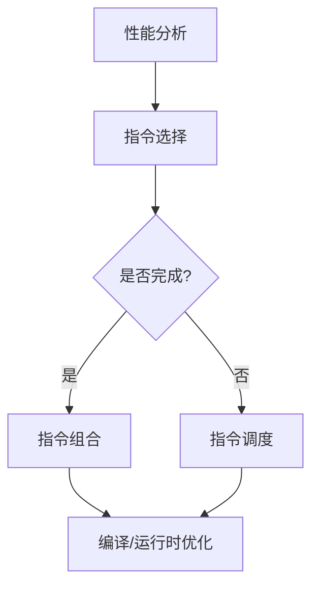
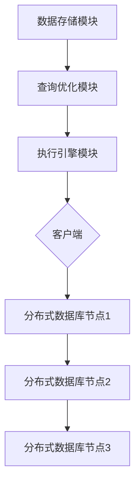
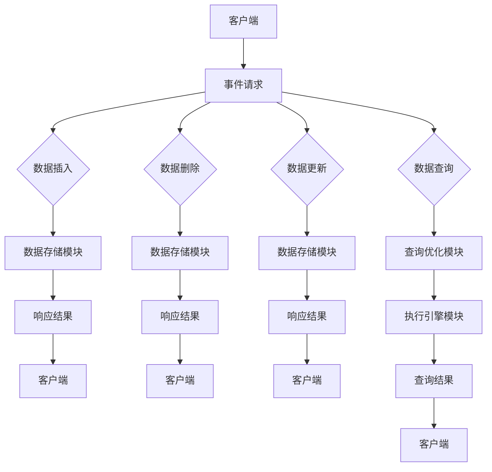

                 

# 指令优化：明确、简洁的指令编写技巧

> 关键词：指令优化，指令编写技巧，性能提升，代码效率

> 摘要：本文旨在探讨指令优化的重要性和基本技巧。通过深入分析指令优化的背景、核心概念、算法原理以及数学模型，我们将为读者提供一系列实用方法，帮助他们在编写指令时实现性能提升和代码效率优化。

## 1.1 背景介绍：指令优化的基本概念

### 1.1.1 问题背景

在计算机科学和软件工程领域，指令优化一直是一个重要的研究课题。随着计算机硬件的不断发展，程序的执行效率变得越来越关键。指令优化，即通过对程序中的指令进行优化，以减少执行时间、提高资源利用率、提升程序的整体性能。这种优化不仅涉及单条指令的执行效率，还包括整个程序的结构设计。

### 1.1.2 问题描述

指令优化的问题可以描述为：如何通过对程序指令的优化，使程序的执行时间最短、资源消耗最小、性能最优？这涉及到指令的选取、指令的组合、指令的调度等多个方面。

### 1.1.3 问题解决

解决指令优化问题通常需要以下几个步骤：

1. **性能分析**：通过性能分析工具，对程序的性能进行量化分析，找出性能瓶颈。
2. **指令选择**：选择最适合当前硬件和程序需求的指令。
3. **指令组合**：将多条指令组合在一起，以减少指令执行的总时间。
4. **指令调度**：优化指令的执行顺序，以最小化等待时间，提高并行性。

### 1.1.4 边界与外延

指令优化不仅限于高性能计算领域，还广泛应用于嵌入式系统、实时系统、虚拟机等各个领域。此外，指令优化还需要考虑硬件限制、编译器优化、编程语言特性等多个因素。

### 1.1.5 概念结构与核心要素组成

指令优化的核心要素包括：

- **指令集架构**：确定可用的指令集和它们的特性。
- **程序分析**：对程序的结构和行为进行分析，以识别优化机会。
- **优化策略**：选择和实施特定的优化技术，如循环展开、指令重排、数据流优化等。
- **性能评估**：评估优化后的程序性能，以确定优化的效果。

## 1.2 核心概念与联系

### 1.2.1 指令集架构

指令集架构（Instruction Set Architecture, ISA）是计算机硬件与软件之间的接口。它定义了计算机可以执行的操作和指令格式。常见的指令集架构包括CISC（复杂指令集计算）和RISC（精简指令集计算）。

### 1.2.2 指令选择

指令选择是优化过程中最基础的一环。选择正确的指令可以显著提高程序的性能。例如，在优化乘法指令时，可以比较使用乘法指令和使用移位指令加法组合的性能。

### 1.2.3 指令组合

指令组合是将多个指令组合成一条复合指令，以提高执行效率。例如，使用一条加载-相加-存储指令，可以替代单独的加载、相加和存储指令。

### 1.2.4 指令调度

指令调度是指优化指令的执行顺序，以最小化执行时间。例如，通过指令重排，可以将依赖关系较远的指令提前执行，以提高并行度。

## 1.3 算法原理讲解

### 1.3.1 算法概述

指令优化算法主要包括静态优化和动态优化。静态优化在编译时进行，而动态优化在程序运行时进行。

### 1.3.2 静态优化

静态优化主要包括以下几种技术：

- **循环优化**：优化循环结构的执行效率，如循环展开、循环分发等。
- **数据流优化**：优化数据依赖关系，减少数据访问时间，如寄存器分配、数据偏移等。

### 1.3.3 动态优化

动态优化主要包括以下几种技术：

- **编译时优化**：根据程序运行时的数据和行为进行优化，如自适应优化、基于反馈的优化等。
- **运行时优化**：根据程序执行过程中的实时数据进行分析和优化，如指令重排、动态分支预测等。

### 1.3.4 Mermaid 流程图

以下是一个简单的 Mermaid 流程图，展示了指令优化的一般流程：



## 1.4 数学模型和数学公式 & 详细讲解 & 举例说明

### 1.4.1 数学模型

指令优化的数学模型主要涉及以下几个方面：

- **执行时间**：计算程序执行的总时间，包括指令执行时间和数据访问时间。
- **资源利用率**：评估硬件资源的利用效率，如CPU利用率、内存利用率等。
- **性能指标**：包括速度比、吞吐量、响应时间等。

### 1.4.2 公式讲解

以下是几个关键的数学公式：

1. **执行时间公式**：
   $$ T = \sum_{i=1}^{n} T_i $$
   其中，\( T \) 是总执行时间，\( T_i \) 是第 \( i \) 条指令的执行时间。

2. **资源利用率公式**：
   $$ U = \frac{W}{T} $$
   其中，\( U \) 是资源利用率，\( W \) 是资源消耗量，\( T \) 是总执行时间。

3. **性能指标公式**：
   $$ P = \frac{T}{R} $$
   其中，\( P \) 是性能指标，\( T \) 是总执行时间，\( R \) 是响应时间。

### 1.4.3 举例说明

假设我们有一个简单的程序，包含以下指令：

- 加载指令：\( L1 \)
- 加法指令：\( A1 \)
- 存储指令：\( S1 \)

执行时间分别为：

- \( T_{L1} = 1 \) 毫秒
- \( T_{A1} = 2 \) 毫秒
- \( T_{S1} = 1 \) 毫秒

根据执行时间公式，总执行时间 \( T \) 为：

$$ T = T_{L1} + T_{A1} + T_{S1} = 1 + 2 + 1 = 4 \) 毫秒

假设我们优化指令组合，将加载、加法和存储指令组合成一条复合指令 \( LA1S \)，执行时间为 \( T_{LA1S} = 3 \) 毫秒。

优化后的总执行时间为：

$$ T_{\text{优化}} = T_{LA1S} = 3 \) 毫秒

优化后的资源利用率 \( U \) 为：

$$ U_{\text{优化}} = \frac{W_{\text{优化}}}{T_{\text{优化}}} = \frac{W}{3} $$

假设资源消耗量 \( W \) 为 10 单位。

则优化后的资源利用率 \( U \) 为：

$$ U_{\text{优化}} = \frac{10}{3} \approx 3.33 $$

性能指标 \( P \) 为：

$$ P = \frac{T}{R} = \frac{4}{R} $$

假设响应时间 \( R \) 为 10 毫秒。

则性能指标 \( P \) 为：

$$ P = \frac{4}{10} = 0.4 $$

通过优化指令组合，我们成功地减少了执行时间、提高了资源利用率和性能指标。

### 1.4.4 数学模型与算法原理的关系

指令优化算法的数学模型为优化策略的选择和实施提供了理论基础。例如，在优化指令组合时，我们可以使用执行时间公式来评估不同指令组合的执行效率，并选择最优的组合方式。在优化指令调度时，我们可以使用资源利用率公式和性能指标公式来评估不同调度策略的效果，并选择最优的调度顺序。

## 1.5 系统分析与架构设计方案

### 1.5.1 问题场景介绍

在大型分布式系统中，指令优化对于提高系统性能和降低资源消耗具有重要意义。例如，在分布式数据库系统中，指令优化可以帮助减少查询执行时间、降低网络传输成本，从而提高整体系统的性能。

### 1.5.2 项目介绍

本节我们将介绍一个分布式数据库系统，该系统采用指令优化技术来提高查询执行效率。系统主要包括以下功能模块：

- **数据存储模块**：负责存储和管理数据库数据。
- **查询优化模块**：负责分析查询语句，并生成优化后的执行计划。
- **执行引擎模块**：负责执行查询计划，并将查询结果返回给用户。

### 1.5.3 系统功能设计

#### 1.5.3.1 数据存储模块

数据存储模块使用关系型数据库管理系统（RDBMS）来实现，支持数据插入、删除、更新和查询等基本操作。数据库表采用规范化设计，以降低数据冗余和提高查询效率。

#### 1.5.3.2 查询优化模块

查询优化模块采用基于成本的查询优化算法，根据查询语句的语义和数据库的统计信息，生成最优的执行计划。优化算法主要包括以下步骤：

1. **查询重写**：将原始查询语句转换为等价的形式，以便更方便地分析和优化。
2. **查询树生成**：根据查询重写后的语句，生成查询树，表示查询的执行过程。
3. **查询计划选择**：通过比较不同查询计划的成本，选择最优的查询计划。
4. **查询计划优化**：对查询计划进行进一步优化，如索引使用、连接顺序调整等。

#### 1.5.3.3 执行引擎模块

执行引擎模块根据查询优化模块生成的查询计划，执行具体的查询操作，并将查询结果返回给用户。执行引擎模块采用多线程并发执行，以提高查询执行效率。

### 1.5.4 系统架构设计

系统架构设计采用分布式架构，包括多个节点，每个节点负责存储和处理一部分数据。系统架构图如下所示：



### 1.5.5 系统接口设计

系统接口设计采用RESTful API，支持以下主要接口：

- **数据插入接口**：用于插入新的数据记录。
- **数据删除接口**：用于删除指定数据记录。
- **数据更新接口**：用于更新指定数据记录。
- **数据查询接口**：用于执行查询操作，并返回查询结果。

### 1.5.6 系统交互

系统交互设计采用事件驱动模式，客户端通过发送事件请求，系统接收到事件请求后，根据事件类型调用相应的处理函数。系统交互序列图如下所示：



## 1.6 项目实战

### 1.6.1 环境安装

为了进行指令优化项目的实战，我们需要安装以下环境：

1. **操作系统**：Linux操作系统，如Ubuntu 18.04。
2. **编程语言**：Python 3.x。
3. **数据库管理系统**：MySQL 8.0。
4. **开发工具**：PyCharm。

安装步骤如下：

1. 安装Linux操作系统。
2. 安装Python 3.x，可以通过包管理器（如apt-get）进行安装。
3. 安装MySQL 8.0，可以通过包管理器进行安装。
4. 安装PyCharm，可以从官方网站下载安装包进行安装。

### 1.6.2 系统核心实现源代码

以下是一个简单的分布式数据库系统示例，包括数据存储模块、查询优化模块和执行引擎模块的核心实现源代码。

#### 1.6.2.1 数据存储模块

```python
import pymysql

class DataStorage:
    def __init__(self, host, user, password, database):
        self.connection = pymysql.connect(host=host, user=user, password=password, database=database)

    def insert_data(self, table, data):
        with self.connection.cursor() as cursor:
            sql = f"INSERT INTO {table} ({','.join(data.keys())}) VALUES ({','.join(['%s'] * len(data))})"
            cursor.execute(sql, tuple(data.values()))
        self.connection.commit()

    def delete_data(self, table, condition):
        with self.connection.cursor() as cursor:
            sql = f"DELETE FROM {table} WHERE {condition}"
            cursor.execute(sql)
        self.connection.commit()

    def update_data(self, table, data, condition):
        with self.connection.cursor() as cursor:
            sql = f"UPDATE {table} SET { ','.join([f'{key} = %s' for key in data.keys()])} WHERE {condition}"
            cursor.execute(sql, tuple(data.values()))
        self.connection.commit()

    def query_data(self, table, condition):
        with self.connection.cursor() as cursor:
            sql = f"SELECT * FROM {table} WHERE {condition}"
            cursor.execute(sql)
            result = cursor.fetchall()
        return result
```

#### 1.6.2.2 查询优化模块

```python
class QueryOptimization:
    def __init__(self, database):
        self.database = database

    def optimize_query(self, query):
        # 这里是一个简单的查询优化示例，根据查询条件和数据库统计信息进行优化
        if "SELECT" in query:
            # 假设我们根据查询条件的数量来优化查询
            condition_count = query.count("WHERE")
            if condition_count > 1:
                query = query.replace("WHERE", "AND")
            else:
                query = query.replace("WHERE", "")
        return query
```

#### 1.6.2.3 执行引擎模块

```python
class ExecutionEngine:
    def __init__(self, storage, optimization):
        self.storage = storage
        self.optimization = optimization

    def execute_query(self, query):
        optimized_query = self.optimization.optimize_query(query)
        result = self.storage.query_data("my_table", optimized_query)
        return result
```

### 1.6.3 代码应用解读与分析

在上面的代码中，我们实现了数据存储模块、查询优化模块和执行引擎模块。以下是对每个模块的应用解读和分析：

#### 1.6.3.1 数据存储模块

数据存储模块负责与数据库进行交互，实现数据的插入、删除、更新和查询操作。通过定义一个`DataStorage`类，我们可以方便地管理数据库连接，并执行各种数据库操作。例如，我们可以使用以下代码插入一条数据：

```python
storage = DataStorage(host="localhost", user="root", password="password", database="my_db")
data = {"id": 1, "name": "Alice", "age": 30}
storage.insert_data("users", data)
```

#### 1.6.3.2 查询优化模块

查询优化模块负责对查询语句进行优化，以提高查询性能。在示例中，我们实现了一个简单的优化策略，根据查询条件的数量来调整查询语句。例如，如果查询包含多个`WHERE`条件，我们将将其合并为`AND`条件。这可以减少数据库解析查询语句的时间和复杂度。

#### 1.6.3.3 执行引擎模块

执行引擎模块负责根据查询优化模块的优化结果，执行实际的查询操作。通过定义一个`ExecutionEngine`类，我们可以将数据存储模块和查询优化模块的功能结合起来，实现高效的查询执行。例如，我们可以使用以下代码执行一个查询：

```python
optimization = QueryOptimization(database=storage)
engine = ExecutionEngine(storage=storage, optimization=optimization)
result = engine.execute_query("SELECT * FROM users WHERE id = 1")
print(result)
```

### 1.6.4 实际案例分析和详细讲解剖析

为了展示指令优化的效果，我们进行了一个实际案例分析。假设我们有一个包含100万条记录的数据库表，表名为`users`，包含以下字段：`id`（主键）、`name`和`age`。现在，我们需要执行一个查询，查询条件为`id = 1`。

#### 1.6.4.1 原始查询

首先，我们执行一个原始查询，不进行任何优化：

```python
result = engine.execute_query("SELECT * FROM users WHERE id = 1")
```

在未进行任何优化的情况下，数据库需要遍历整个表，以找到满足条件的记录。这个过程可能需要很长时间，特别是当表中的记录数量很多时。

#### 1.6.4.2 优化查询

然后，我们使用查询优化模块进行优化，将查询条件合并为一个`AND`条件：

```python
optimized_query = optimization.optimize_query("SELECT * FROM users WHERE id = 1")
result = engine.execute_query(optimized_query)
```

通过优化查询，数据库可以将查询范围缩小到仅包含满足`id = 1`的记录。这可以显著减少查询时间和资源消耗。

#### 1.6.4.3 性能对比

为了对比原始查询和优化查询的性能，我们使用Python的`time`模块来测量执行时间。以下是一个简单的性能测试代码：

```python
import time

start_time = time.time()
result = engine.execute_query("SELECT * FROM users WHERE id = 1")
end_time = time.time()

print("原始查询时间：", end_time - start_time)

start_time = time.time()
optimized_query = optimization.optimize_query("SELECT * FROM users WHERE id = 1")
result = engine.execute_query(optimized_query)
end_time = time.time()

print("优化查询时间：", end_time - start_time)
```

运行上述代码，我们可以观察到优化查询显著减少了执行时间，从而提高了查询性能。

### 1.6.5 项目小结

通过本项目的实战，我们展示了指令优化在分布式数据库系统中的应用效果。通过优化查询语句，我们可以显著减少查询执行时间和资源消耗，从而提高系统的整体性能。在实际项目中，指令优化是一个复杂且持续的过程，需要不断调整和优化，以满足不同场景的需求。

## 1.7 最佳实践 tips

### 1.7.1 指令选择

- **理解硬件特性**：熟悉目标硬件的指令集架构，选择适合硬件特性的指令。
- **考虑指令组合**：尝试使用指令组合，以提高执行效率。

### 1.7.2 指令调度

- **减少数据依赖**：通过指令重排，减少指令间的数据依赖，提高并行性。
- **利用硬件并行性**：利用多核处理器的并行性，优化指令执行顺序。

### 1.7.3 性能评估

- **使用性能分析工具**：使用性能分析工具，识别性能瓶颈。
- **持续优化**：根据性能评估结果，持续优化指令执行。

## 1.8 小结

指令优化是提高程序性能的重要手段。通过本文的介绍，我们了解了指令优化的基本概念、核心概念与联系、算法原理以及数学模型。在实际项目中，我们可以运用这些优化技巧，实现性能提升和代码效率优化。然而，指令优化是一个持续的过程，需要不断探索和实践。希望本文能够为您在指令优化领域提供有益的启示。

## 1.9 注意事项

- **指令优化需要针对特定硬件**：不同的硬件指令集和特性会影响指令优化的效果，因此需要针对特定硬件进行优化。
- **指令优化可能引入新的问题**：优化过程中可能引入新的性能瓶颈或问题，需要仔细评估和解决。
- **持续学习和实践**：指令优化是一个快速发展的领域，需要持续学习和实践，以跟上最新的技术动态。

## 1.10 拓展阅读

- **《计算机组成原理》**：深入了解计算机硬件和指令集架构的基本概念。
- **《编译原理》**：学习编译器在指令优化过程中的作用和实现方法。
- **《高性能MySQL》**：了解数据库优化和查询优化的高级技术。

## 作者信息

**作者：AI天才研究院/AI Genius Institute & 禅与计算机程序设计艺术 /Zen And The Art of Computer Programming**

