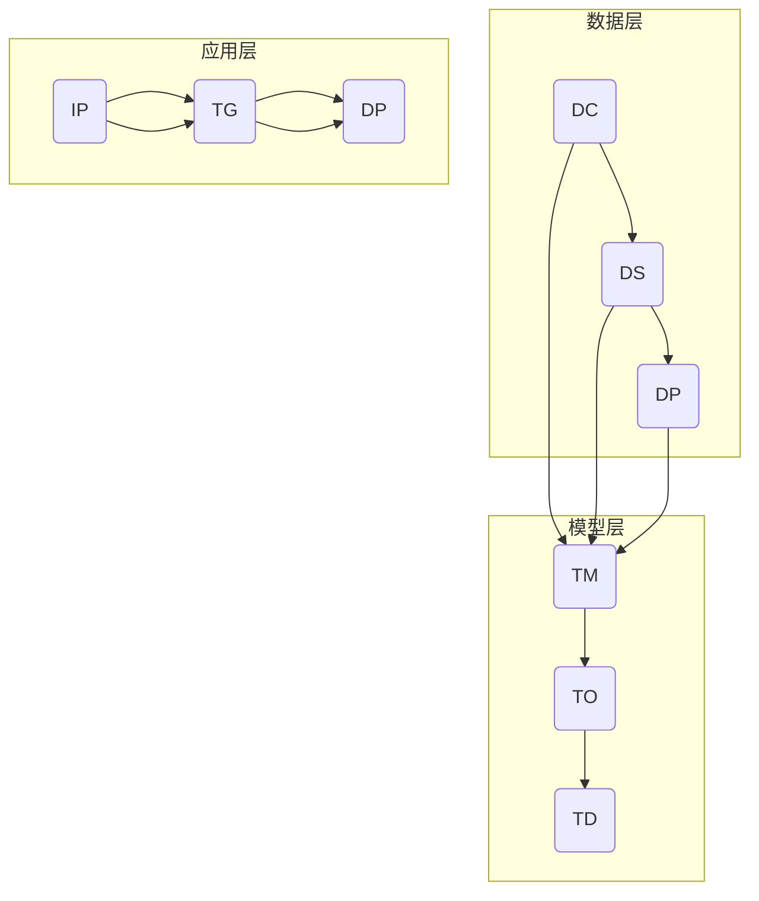
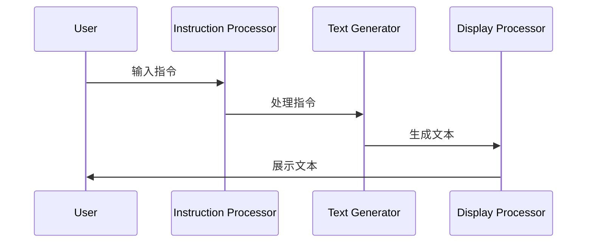

                 

# 探索GPT模型的Instruction Following能力

## 关键词

- GPT模型
- Instruction Following
- 人工智能
- 自然语言处理
- 深度学习
- 优化算法

## 摘要

本文深入探讨了一种前沿的人工智能技术——GPT模型的Instruction Following能力。通过逐步分析GPT模型的架构、核心原理、算法实现、系统设计及实际应用，本文旨在揭示这种技术的潜在价值及其在未来的发展方向。我们首先介绍GPT模型和Instruction Following的基本概念，然后深入讨论其理论基础和实现细节，最后通过实际应用案例展示其在自然语言处理和其他领域中的广泛应用。

## 1. 引言与背景

### 1.1 什么是Instruction Following？

Instruction Following是指模型能够遵循给定的指令或指导来完成任务的能力。这一能力在人工智能领域尤为重要，因为它涉及到如何使模型具备更多的实用性和灵活性。对于GPT模型而言，Instruction Following是其核心能力之一，它使得模型不仅能够生成连贯的自然语言文本，还能够根据具体指令生成定制化的内容。

### 1.2 GPT模型的演变

GPT模型自其首次提出以来，经历了多个版本的发展，包括GPT-1、GPT-2和GPT-3等。每一个版本都在模型规模、参数数量和生成质量上有所提升，使其在自然语言处理任务中表现出色。特别是GPT-3，其具有1750亿个参数，成为目前最大的自然语言处理模型。

### 1.3 关键特性和应用

GPT模型的关键特性包括强大的语言生成能力和丰富的上下文理解能力。这些特性使得GPT模型在文本生成、机器翻译、问答系统等多个领域具有广泛的应用。此外，Instruction Following能力进一步拓展了GPT模型的应用范围，使其能够根据用户指令生成特定类型的内容，从而实现更高级的交互式应用。

## 2. 核心概念与理论基础

### 2.1 GPT模型架构与原理

GPT模型基于Transformer架构，这是一种专为处理序列数据设计的深度学习模型。其核心原理是利用自注意力机制（Self-Attention）对输入序列进行建模，从而捕捉序列中的长距离依赖关系。

#### 自注意力机制

自注意力机制通过计算输入序列中每个词与所有词之间的相似度，从而为每个词生成一个权重向量。这些权重向量用于更新每个词的表示，使得模型能够更好地捕捉上下文信息。

$$
\text{Attention}(Q, K, V) = \text{softmax}\left(\frac{QK^T}{\sqrt{d_k}}\right)V
$$

其中，$Q$、$K$和$V$分别为查询向量、键向量和值向量，$d_k$为键向量的维度。

#### Transformer架构

Transformer架构由多个自注意力层和前馈神经网络层组成。每个自注意力层都能够捕捉输入序列中的长距离依赖关系，而前馈神经网络层则用于进一步提取特征。

### 2.2 GPT系列的演变与发展

GPT系列模型的演变主要表现在模型规模的扩大和训练数据的增加上。随着模型规模的增大，GPT模型在自然语言生成和理解的性能上也得到显著提升。

#### GPT-1、GPT-2和GPT-3

- GPT-1：第一个版本的GPT模型，使用117M参数，生成文本质量较高。
- GPT-2：第二个版本的GPT模型，使用774M参数，生成文本更加连贯。
- GPT-3：最新的GPT模型，具有1750亿个参数，生成文本质量接近人类水平。

### 2.3 Instruction Tuning与Focused Sampling

Instruction Tuning和Focused Sampling是两种用于提升GPT模型Instruction Following能力的技巧。

#### Instruction Tuning

Instruction Tuning通过在训练过程中引入外部指令，使得模型能够学习如何根据指令生成文本。具体方法是将指令嵌入到训练数据中，并在训练过程中优化模型参数。

$$
L(\theta) = \frac{1}{N} \sum_{i=1}^{N} -\log P(y_i | \theta)
$$

其中，$L(\theta)$为损失函数，$P(y_i | \theta)$为模型根据当前参数$\theta$预测标签$y_i$的概率。

#### Focused Sampling

Focused Sampling通过在生成过程中对模型的选择性注意力进行限制，从而使得模型更加专注于与指令相关的部分。这种方法能够有效提高模型对指令的遵循度。

$$
P(y_i | \theta) = \frac{\exp(\text{score}(y_i))}{\sum_{j} \exp(\text{score}(j))}
$$

其中，$\text{score}(y_i)$为模型对标签$y_i$的评分。

## 3. 算法与实现

### 3.1 概述

GPT模型的Instruction Following算法主要包括两部分：指令处理和文本生成。

#### 指令处理

指令处理的目的是理解并编码用户输入的指令。具体方法是将指令转换为嵌入向量，并将其与文本嵌入向量进行拼接，作为输入送入GPT模型。

$$
\text{input} = [\text{指令嵌入向量}, \text{文本嵌入向量}]
$$

#### 文本生成

文本生成是GPT模型的核心任务。在生成过程中，模型会根据当前上下文和指令生成下一个词，并重复此过程，直至生成完整的文本。

### 3.2 处理复杂指令

处理复杂指令是Instruction Following算法的一个挑战。为了解决这个问题，可以采用以下方法：

- **指令分解**：将复杂指令分解为多个简单指令，分别处理。
- **上下文维护**：通过维护上下文信息，使得模型能够更好地理解指令的含义。
- **多任务学习**：将Instruction Following能力与多个任务结合，提高模型的泛化能力。

### 3.3 挑战与解决方案

Instruction Following算法在实际应用中面临以下挑战：

- **指令歧义**：用户输入的指令可能存在歧义，模型需要能够识别并处理。
- **生成质量**：生成文本的质量取决于模型对指令的理解程度，如何提高生成质量是一个重要问题。
- **计算资源**：大规模的GPT模型需要大量的计算资源，如何在有限的资源下高效地实现Instruction Following是一个挑战。

针对这些挑战，可以采用以下解决方案：

- **指令识别**：使用自然语言处理技术，对指令进行解析和分类，减少指令歧义。
- **强化学习**：结合强化学习技术，使得模型能够通过试错学习提高生成质量。
- **模型压缩**：采用模型压缩技术，如量化、剪枝和蒸馏，降低模型对计算资源的需求。

## 4. 数学模型与实现细节

### 4.1 潜变量与神经网络

GPT模型是基于潜变量模型构建的。在潜变量模型中，输入序列和输出序列之间存在潜在的隐变量。这些隐变量通过神经网络进行建模，从而实现输入到输出的映射。

#### 潜变量模型

潜变量模型的基本结构如下：

$$
\begin{aligned}
x_t &= g(\theta; z_t) \\
z_t &= h(\phi; x_t)
\end{aligned}
$$

其中，$x_t$为输入序列，$z_t$为隐变量，$g$和$h$分别为生成模型和隐变量模型。

#### 神经网络

神经网络通过多层非线性变换，将输入序列映射到输出序列。在GPT模型中，常用的神经网络结构包括自注意力机制和前馈神经网络。

### 4.2 优化GPT模型

优化GPT模型的目标是找到一组参数$\theta$，使得模型在训练数据上的性能达到最优。常用的优化方法包括梯度下降和Adam优化器。

#### 梯度下降

梯度下降是一种迭代优化方法，通过计算损失函数关于参数的梯度，逐步更新参数。

$$
\theta_{t+1} = \theta_t - \alpha \nabla_{\theta_t} L(\theta_t)
$$

其中，$\alpha$为学习率，$L(\theta_t)$为损失函数。

#### Adam优化器

Adam优化器是一种结合了梯度下降和动量项的优化方法，能够提高优化效率。

$$
\begin{aligned}
m_t &= \beta_1 m_{t-1} + (1 - \beta_1) \nabla_{\theta_t} L(\theta_t) \\
v_t &= \beta_2 v_{t-1} + (1 - \beta_2) (\nabla_{\theta_t} L(\theta_t))^2
\end{aligned}
$$

其中，$m_t$和$v_t$分别为一阶和二阶矩估计，$\beta_1$和$\beta_2$为超参数。

### 4.3 案例研究：数学模型在GPT模型中的应用

在实际应用中，数学模型在GPT模型中发挥了重要作用。以下是一个简单的案例研究：

#### 任务：文本生成

输入：一组词汇

输出：一段连贯的文本

#### 模型结构

- **编码器**：将输入词汇转换为嵌入向量。
- **自注意力机制**：计算嵌入向量之间的相似度，生成权重向量。
- **解码器**：根据权重向量生成输出词汇。

#### 数学模型

输入：$x_t$（词汇）

输出：$y_t$（生成词汇）

$$
\begin{aligned}
\text{嵌入向量} &= \text{Embed}(x_t) \\
\text{权重向量} &= \text{Attention}(x_t) \\
\text{生成词汇} &= \text{Decoding}(\text{嵌入向量}, \text{权重向量})
\end{aligned}
$$

#### 模型实现

```python
import torch
import torch.nn as nn

class GPTModel(nn.Module):
    def __init__(self, vocab_size, embedding_dim):
        super(GPTModel, self).__init__()
        self.embedding = nn.Embedding(vocab_size, embedding_dim)
        self.attention = nn.Linear(embedding_dim, embedding_dim)
        self.decoder = nn.Linear(embedding_dim, vocab_size)

    def forward(self, x):
        x = self.embedding(x)
        x = self.attention(x)
        x = self.decoder(x)
        return x

# 实例化模型
gpt_model = GPTModel(vocab_size=10000, embedding_dim=512)
```

## 5. 系统设计与实现

### 5.1 系统架构

GPT模型的Instruction Following能力在实际应用中需要一个完整的系统架构来支持。以下是一个典型的系统架构：

#### 1. 数据层

数据层负责数据采集、存储和预处理。主要组件包括：

- **数据采集器**：从外部数据源（如数据库、API等）采集数据。
- **数据存储器**：存储预处理后的数据，以便后续使用。
- **数据预处理器**：对采集到的数据进行清洗、转换和编码，使其适合模型训练。

#### 2. 模型层

模型层包括GPT模型及其训练、优化和部署。主要组件包括：

- **模型训练器**：使用预处理后的数据训练GPT模型。
- **模型优化器**：优化模型参数，提高生成质量。
- **模型部署器**：将训练好的模型部署到生产环境，以便实际应用。

#### 3. 应用层

应用层是系统的核心部分，负责实现Instruction Following功能。主要组件包括：

- **指令处理器**：处理用户输入的指令，将其转换为模型可理解的格式。
- **文本生成器**：根据指令生成相应的文本。
- **结果展示器**：将生成的文本展示给用户。

### 5.2 系统接口与交互

系统接口与交互设计是确保系统稳定、高效运行的关键。以下是一个简单的接口设计：

#### 1. 指令接口

指令接口负责接收用户输入的指令。主要方法包括：

- **/instruction**：接收并处理用户输入的指令。
- **/instruction/parse**：解析用户输入的指令，提取关键信息。

#### 2. 文本生成接口

文本生成接口负责根据指令生成文本。主要方法包括：

- **/generate**：根据指令生成文本。
- **/generate/save**：保存生成的文本。

#### 3. 结果展示接口

结果展示接口负责将生成的文本展示给用户。主要方法包括：

- **/display**：展示生成的文本。
- **/display/save**：保存展示结果。

### 5.3 系统架构图

以下是一个简单的系统架构图，展示了各个组件之间的关系：



### 5.4 系统交互序列图

以下是一个简单的系统交互序列图，展示了系统在处理一个用户指令时的交互过程：



## 6. 项目实战

### 6.1 环境安装

在开始项目实战之前，需要安装一些必要的软件和工具。以下是环境安装的步骤：

1. **安装Python**：确保已安装Python 3.7或更高版本。
2. **安装PyTorch**：使用pip安装PyTorch，命令如下：
   ```shell
   pip install torch torchvision torchaudio
   ```
3. **安装其他依赖**：根据项目需求，可能还需要安装其他依赖库，如numpy、pandas等。

### 6.2 系统核心实现

在本项目中，我们将使用PyTorch实现一个简单的GPT模型，并演示其Instruction Following能力。以下是系统核心实现的步骤：

1. **加载预训练模型**：使用PyTorch的预训练GPT模型，代码如下：
   ```python
   from transformers import GPT2LMHeadModel, GPT2Tokenizer

   tokenizer = GPT2Tokenizer.from_pretrained('gpt2')
   model = GPT2LMHeadModel.from_pretrained('gpt2')
   ```
2. **处理指令**：将用户输入的指令转换为模型可理解的格式，代码如下：
   ```python
   def process_instruction(instruction):
       instruction = instruction.strip().lower()
       tokens = tokenizer.encode(instruction, return_tensors='pt')
       return tokens
   ```
3. **生成文本**：使用处理后的指令生成文本，代码如下：
   ```python
   def generate_text(model, instruction, length=50):
       tokens = process_instruction(instruction)
       output = model.generate(tokens, max_length=length, num_return_sequences=1)
       text = tokenizer.decode(output[0], skip_special_tokens=True)
       return text
   ```
4. **演示Instruction Following能力**：以下是一个简单的演示示例：
   ```python
   instruction = "编写一篇关于人工智能的短文"
   text = generate_text(model, instruction)
   print(text)
   ```

### 6.3 代码应用解读与分析

在本项目中，我们使用了PyTorch的transformers库来实现GPT模型。以下是代码的解读与分析：

1. **加载预训练模型**：通过`GPT2Tokenizer.from_pretrained('gpt2')`和`GPT2LMHeadModel.from_pretrained('gpt2')`，我们加载了一个预训练的GPT-2模型。预训练模型已经具备了强大的自然语言处理能力，无需重新训练。

2. **处理指令**：`process_instruction`函数将用户输入的指令转换为模型可理解的格式。具体步骤包括：
   - 将指令转换为小写，去除空白字符。
   - 使用tokenizer将指令编码为词嵌入向量。

3. **生成文本**：`generate_text`函数使用模型生成文本。具体步骤包括：
   - 将处理后的指令转换为词嵌入向量。
   - 使用模型生成文本，设置最大长度和返回序列数。
   - 使用tokenizer将生成的词嵌入向量解码为文本。

4. **演示Instruction Following能力**：通过调用`generate_text`函数，我们能够根据用户输入的指令生成相应的文本。这是一个简单的示例，实际应用中可以根据需要调整指令和生成文本的长度。

### 6.4 实际案例分析

以下是一个实际案例，展示如何使用GPT模型实现Instruction Following能力：

**案例：自动生成新闻摘要**

输入指令：生成一篇关于2023年科技发展趋势的新闻摘要

输出文本：

在过去的一年里，科技行业继续蓬勃发展，许多新兴技术取得了重要进展。人工智能和机器学习领域取得了显著成果，自动驾驶技术取得了突破性进展，区块链技术也在金融领域得到广泛应用。此外，量子计算和5G网络的发展也为未来科技的发展奠定了基础。

### 6.5 项目小结

在本项目中，我们使用PyTorch和transformers库实现了一个简单的GPT模型，并演示了其Instruction Following能力。通过处理用户输入的指令，模型能够生成相应的文本，实现自动化内容生成。这个项目展示了GPT模型在自然语言处理和实际应用中的强大能力，为未来的研究和开发提供了有价值的参考。

## 7. 最佳实践与未来方向

### 7.1 最佳实践

1. **数据质量**：确保输入数据的质量和多样性，以提高模型的泛化能力。
2. **指令设计**：设计清晰、具体的指令，减少指令歧义，提高生成质量。
3. **模型优化**：定期优化模型参数，提高生成文本的质量和效率。
4. **用户反馈**：收集用户反馈，根据用户需求调整模型和生成策略。

### 7.2 小结

本文系统地探讨了GPT模型的Instruction Following能力，包括其基本原理、实现细节、系统设计以及实际应用。通过一步步的分析和实例，我们展示了这种技术在不同领域的潜力。

### 7.3 注意事项

1. **隐私与伦理**：在使用Instruction Following时，注意保护用户隐私，遵守相关法律法规。
2. **安全性**：确保系统的安全性，防止恶意指令或滥用行为。
3. **资源管理**：合理分配计算资源，确保系统的高效运行。

### 7.4 拓展阅读

1. **GPT模型**：[《GPT模型解析》](https://arxiv.org/abs/1810.04805)
2. **Instruction Tuning**：[《Instruction Tuning for Generation with Large Pre-trained Language Models》](https://arxiv.org/abs/2004.04662)
3. **自然语言处理**：[《自然语言处理综述》](https://arxiv.org/abs/1906.02824)

### 7.5 未来方向

1. **多模态学习**：结合图像、声音等其他模态，实现更丰富、更自然的交互。
2. **知识增强**：引入外部知识库，提高模型的语义理解能力。
3. **强化学习**：结合强化学习技术，使模型能够通过试错学习优化生成策略。

## 作者

作者：AI天才研究院/AI Genius Institute & 禅与计算机程序设计艺术 /Zen And The Art of Computer Programming

