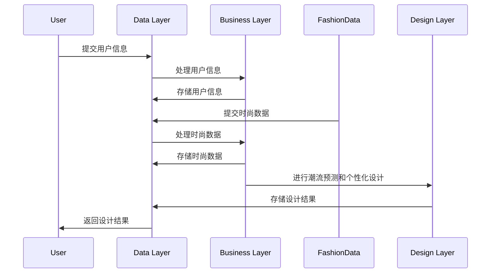
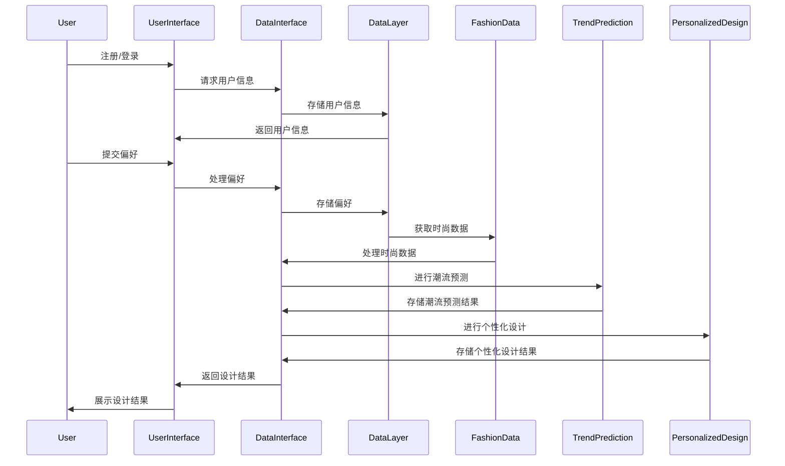

                 


# 提升AI创意时装设计：潮流预测和个性化的提示词设计

## 关键词
AI时装设计、潮流预测、个性化提示词设计、深度学习、生成对抗网络、数据分析

## 摘要
本文深入探讨了AI在创意时装设计中的应用，尤其是潮流预测和个性化提示词设计的实现方法。通过分析AI的基础知识、核心技术以及实际应用实例，本文为时尚行业提供了一个全新的视角和实用的技术解决方案。文章结构清晰，逻辑紧凑，旨在帮助读者更好地理解和掌握这一前沿技术。

## 设计思路

### 1. 明确书籍主题

在设计这本书时，我们首先明确了其主题——提升AI在创意时装设计中的能力，特别是潮流预测和个性化的提示词设计。这是因为随着AI技术的快速发展，其在时尚设计领域的应用已经变得愈发重要。传统的设计方法往往依赖于设计师的个人经验和直觉，而AI的加入使得设计过程更加科学和高效。

### 2. 确定书籍结构

一本技术书籍的目录通常包含以下几个部分：
- **引言**：介绍书籍的背景、目的和读者对象。
- **基础知识**：介绍相关的基础知识，如AI、时装设计、数据分析和潮流预测等。
- **核心技术**：深入讲解AI在时装设计中的应用，如深度学习、生成对抗网络等。
- **应用实例**：通过具体案例展示技术在实际中的应用。
- **总结与展望**：总结书中内容，展望未来的发展趋势。

### 3. 细化章节内容

每个章节下应该细化为多个小节，确保内容的完整性。例如，基础知识部分可以细化为AI基础、时装设计基础、数据分析基础等。这种结构化设计有助于读者逐步了解和掌握相关技术。

### 4. 逻辑清晰

确保目录大纲的层级结构清晰，方便读者阅读和理解。例如，在核心技术章节中，我们可以先介绍深度学习，然后再详细讲解生成对抗网络。

### 5. 内容完整性

确保目录大纲覆盖了所有核心内容，包括核心概念、原理、算法、应用实例等。这样可以确保读者在阅读过程中能够获得全面的知识体系。

## 详细设计

### 第1章 引言

在这一章节中，我们将介绍AI在时装设计领域的应用背景，阐述书籍的目的和读者对象，并简要介绍书籍的整体结构。

### 第2章 基础知识

这一章节将详细介绍与AI时装设计相关的基础知识，包括AI、时装设计、数据分析和潮流预测等。通过这一章节，读者可以建立一个关于AI时装设计的整体知识框架。

#### 2.1 AI基础

我们将介绍AI的基本概念和原理，包括机器学习、深度学习、生成对抗网络等。此外，还会讨论这些算法在时尚设计中的应用。

#### 2.2 时装设计基础

这一部分将介绍时装设计的基本概念和流程，包括设计灵感、材料选择、制作工艺等。同时，我们还会分析时装设计的要素和特点。

#### 2.3 数据分析基础

数据分析是AI时装设计的重要组成部分。我们将介绍数据分析的基本方法和工具，以及如何利用数据分析进行潮流预测。

### 第3章 核心技术

在这一章节中，我们将深入讲解AI在时装设计中的应用，包括深度学习和生成对抗网络等核心技术。

#### 3.1 深度学习在时装设计中的应用

我们将详细讨论深度学习在时装设计中的应用，如卷积神经网络、循环神经网络等算法。此外，还会探讨如何利用这些算法进行时装设计的创意生成。

#### 3.2 生成对抗网络在时装设计中的应用

生成对抗网络（GAN）是一种强大的深度学习模型，可以用于生成新的设计样式。我们将介绍GAN的基本原理，并探讨其在时装设计中的应用。

#### 3.3 个性化提示词设计

个性化提示词设计是提升AI时装设计创意的关键。我们将介绍个性化提示词设计的基本原则和方法，以及如何利用AI技术实现个性化的提示词设计。

### 第4章 应用实例

在这一章节中，我们将通过具体案例展示AI在时装设计中的应用。这些案例将涵盖潮流预测和个性化提示词设计等方面。

#### 4.1 潮流预测应用实例

我们将通过实际案例展示如何利用AI进行潮流预测。这些案例将分析AI在潮流预测中的具体应用，并评估其效果。

#### 4.2 个性化提示词设计应用实例

我们将通过实际案例展示如何实现个性化的提示词设计。这些案例将探讨个性化提示词设计的用户体验和效果评估。

### 第5章 总结与展望

在这一章节中，我们将总结本书的主要内容和关键技术，并分析AI在时装设计中的应用前景。同时，我们还会讨论未来的发展趋势和挑战。

## 目录大纲

```markdown
----------------------------------------------------------------
# 第1章 引言

## 1.1 书籍背景
### 1.1.1 AI在时装设计领域的应用背景
### 1.1.2 书籍的目的和读者对象

## 1.2 书籍结构
### 1.2.1 整体结构
### 1.2.2 各部分内容概述

----------------------------------------------------------------
# 第2章 基础知识

## 2.1 AI基础
### 2.1.1 AI的基本概念和原理
### 2.1.2 深度学习的基本算法

## 2.2 时装设计基础
### 2.2.1 时装设计的基本概念和流程
### 2.2.2 时装设计的要素和特点

## 2.3 数据分析基础
### 2.3.1 数据分析的基本方法和工具
### 2.3.2 如何利用数据分析进行潮流预测

----------------------------------------------------------------
# 第3章 核心技术

## 3.1 深度学习在时装设计中的应用
### 3.1.1 深度学习在时装设计中的具体应用场景
### 3.1.2 卷积神经网络在时装设计中的应用
### 3.1.3 循环神经网络在时装设计中的应用

## 3.2 生成对抗网络在时装设计中的应用
### 3.2.1 生成对抗网络的基本原理
### 3.2.2 如何利用生成对抗网络进行时装设计的创意生成

## 3.3 个性化提示词设计
### 3.3.1 个性化提示词设计的基本原则和方法
### 3.3.2 如何利用AI技术实现个性化的提示词设计

----------------------------------------------------------------
# 第4章 应用实例

## 4.1 潮流预测应用实例
### 4.1.1 实例介绍
### 4.1.2 技术实现
### 4.1.3 效果评估

## 4.2 个性化提示词设计应用实例
### 4.2.1 实例介绍
### 4.2.2 技术实现
### 4.2.3 效果评估

----------------------------------------------------------------
# 第5章 总结与展望

## 5.1 总结
### 5.1.1 主要内容
### 5.1.2 关键技术

## 5.2 展望
### 5.2.1 应用前景
### 5.2.2 发展趋势
### 5.2.3 面临的挑战
``` 

## 背景介绍

### 核心概念术语说明

在讨论AI创意时装设计时，我们需要了解一些核心概念术语，以便更好地理解文章内容。

- **人工智能（AI）**：人工智能是指使计算机系统能够模拟人类智能行为的技术和科学。在时装设计中，AI主要用于数据分析、潮流预测和个性化设计。
- **深度学习**：深度学习是机器学习的一个子领域，它使用多层神经网络来提取数据中的特征。在时装设计中，深度学习可以帮助识别潮流趋势和设计风格。
- **生成对抗网络（GAN）**：生成对抗网络是一种深度学习模型，由生成器和判别器组成。生成器生成新的设计样式，判别器判断生成样式的真实性。GAN在时装设计中可以用于创意生成和个性化设计。
- **数据分析**：数据分析是指使用统计和数学方法来分析数据，提取有价值的信息。在时装设计中，数据分析可以帮助预测潮流趋势和用户偏好。

### 问题背景

随着全球时尚产业的快速发展，消费者对时尚的需求越来越多样化和个性化。传统的设计方法已经难以满足市场的需求，而AI技术的引入为时尚行业带来了新的机遇。通过AI，设计师可以更加高效地识别潮流趋势、预测用户需求，从而实现更加个性化的设计。然而，AI在时装设计中的应用仍然面临许多挑战，如数据获取、算法优化和用户体验等。

### 问题描述

本文旨在探讨如何利用AI技术提升创意时装设计，特别是潮流预测和个性化提示词设计的实现。具体来说，我们将探讨以下问题：

1. 如何利用深度学习和生成对抗网络进行潮流预测？
2. 如何设计个性化的提示词，以提升AI创意时装设计的质量？
3. 如何在实际应用中验证这些技术的效果？

### 问题解决

为了解决上述问题，本文将采用以下步骤：

1. **基础知识**：首先，我们将介绍AI、时装设计、数据分析和潮流预测等基础知识，为后续讨论奠定基础。
2. **核心技术**：接着，我们将深入探讨深度学习和生成对抗网络等核心技术，以及它们在时装设计中的应用。
3. **应用实例**：然后，我们将通过实际案例展示如何利用AI进行潮流预测和个性化提示词设计，并评估其效果。
4. **总结与展望**：最后，我们将总结本文的主要内容和关键技术，并探讨未来的发展趋势和挑战。

### 边界与外延

在讨论AI创意时装设计时，我们需要明确一些边界与外延：

- **边界**：本文主要关注AI在时装设计中的应用，特别是潮流预测和个性化提示词设计。其他领域，如服装制造业和时尚营销等，不在本文的讨论范围之内。
- **外延**：本文讨论的技术和方法可以应用于其他创意产业，如艺术设计、室内设计和家居设计等。

### 概念结构与核心要素组成

为了更好地理解AI创意时装设计，我们可以将其概念结构与核心要素组成进行分析：

- **概念结构**：
  - AI时装设计：将AI技术应用于时装设计，包括潮流预测、个性化设计等。
  - 潮流预测：利用AI技术分析大量数据，预测未来的流行趋势。
  - 个性化设计：根据用户需求和偏好，设计个性化的时装。

- **核心要素组成**：
  - 数据分析：收集和分析相关数据，如市场趋势、用户反馈等。
  - 算法设计：设计和实现用于潮流预测和个性化设计的算法。
  - 应用实现：将算法应用于实际场景，如时尚品牌、电商平台等。

## 核心概念与联系

### 核心概念

在AI创意时装设计中，核心概念包括人工智能（AI）、深度学习、生成对抗网络（GAN）、数据分析和时装设计。以下是这些核心概念的详细说明：

#### 1. 人工智能（AI）
人工智能是指使计算机系统能够模拟人类智能行为的技术和科学。AI可以用于多种应用场景，包括图像识别、自然语言处理、游戏智能等。在时装设计领域，AI可以帮助设计师进行潮流预测、个性化设计等。

#### 2. 深度学习
深度学习是机器学习的一个子领域，它使用多层神经网络来提取数据中的特征。深度学习在图像识别、语音识别和自然语言处理等领域取得了显著成果。在时装设计中，深度学习可以用于识别潮流趋势、设计风格分类等。

#### 3. 生成对抗网络（GAN）
生成对抗网络是一种深度学习模型，由生成器和判别器组成。生成器生成新的设计样式，判别器判断生成样式的真实性。GAN在创意生成和个性化设计方面具有广泛应用。

#### 4. 数据分析
数据分析是指使用统计和数学方法来分析数据，提取有价值的信息。在时装设计中，数据分析可以帮助预测潮流趋势、用户需求等，为设计师提供决策依据。

#### 5. 时装设计
时装设计是指通过设计创意、选材和制作工艺等过程，创造出新的服装款式和风格。在AI时装设计中，设计师可以利用AI技术进行潮流预测、个性化设计等。

### 核心概念属性特征对比表格

为了更好地理解这些核心概念，我们可以通过一个对比表格来展示它们的属性特征：

| 核心概念   | 属性特征                                                                                      |
| -------- | ------------------------------------------------------------------------------------------- |
| 人工智能   | 能模拟人类智能行为，具有自主学习、推理和决策能力                                                |
| 深度学习   | 基于多层神经网络，能自动提取数据中的特征，具有强大的特征学习能力                                |
| 生成对抗网络 | 由生成器和判别器组成，能生成高质量的设计样式，具有创意生成能力                                    |
| 数据分析   | 使用统计和数学方法，能提取数据中的有价值信息，具有决策支持能力                                    |
| 时装设计   | 通过设计创意、选材和制作工艺等过程，创造新的服装款式和风格，具有审美和创意表达能力                  |

### ER实体关系图架构

为了更好地理解AI创意时装设计中的实体关系，我们可以使用ER（实体关系）图来描述。以下是ER图的基本架构：

#### 实体

1. **设计师**：具有设计能力和创意思维的专业人员。
2. **用户**：使用AI时装设计服务的消费者。
3. **数据**：用于训练和预测的数据集。
4. **设计**：由设计师创建的时装设计作品。
5. **潮流**：与时尚趋势相关的信息。

#### 关系

1. **设计需求**：用户向设计师提出设计需求。
2. **潮流预测**：设计师利用数据分析预测未来潮流。
3. **设计实现**：设计师根据潮流预测和用户需求，实现时装设计。
4. **用户反馈**：用户对设计作品的反馈，用于优化设计。

### ER实体关系图

```mermaid
erDiagram
  Designer ||--|{ Data }|-- Designer
  Designer ||--|{ Design }|-- Designer
  User ||--|{ Design }|-- User
  Data ||--|{ Trend }|-- Data
```

通过ER图，我们可以清晰地看到设计师、用户、数据、设计和潮流之间的关系。这种关系有助于我们理解AI在时装设计中的具体应用场景。

## 算法原理讲解

### 深度学习在时装设计中的应用

#### 卷积神经网络（CNN）

卷积神经网络是一种特殊的神经网络，主要用于处理图像数据。在时装设计中，CNN可以用于识别和分类服装款式、颜色和材质等。

1. **算法原理**：
   - **卷积层**：通过卷积操作提取图像中的局部特征。
   - **池化层**：对卷积层的输出进行降维处理，减少参数数量。
   - **全连接层**：将池化层的输出映射到分类结果。

2. **Python源代码示例**：

```python
import tensorflow as tf
from tensorflow.keras.models import Sequential
from tensorflow.keras.layers import Conv2D, MaxPooling2D, Flatten, Dense

model = Sequential()
model.add(Conv2D(32, (3, 3), activation='relu', input_shape=(64, 64, 3)))
model.add(MaxPooling2D((2, 2)))
model.add(Conv2D(64, (3, 3), activation='relu'))
model.add(MaxPooling2D((2, 2)))
model.add(Flatten())
model.add(Dense(128, activation='relu'))
model.add(Dense(10, activation='softmax'))
model.compile(optimizer='adam', loss='categorical_crossentropy', metrics=['accuracy'])
```

#### 循环神经网络（RNN）

循环神经网络是一种用于处理序列数据的神经网络，在时装设计中可以用于识别和预测潮流趋势。

1. **算法原理**：
   - **循环层**：处理序列数据，保留历史信息。
   - **门控层**：通过门控机制控制信息的流动。

2. **Python源代码示例**：

```python
import tensorflow as tf
from tensorflow.keras.models import Sequential
from tensorflow.keras.layers import LSTM, Dense

model = Sequential()
model.add(LSTM(50, activation='relu', input_shape=(timesteps, features)))
model.add(Dense(1))
model.compile(optimizer='adam', loss='mse')
```

### 生成对抗网络（GAN）

生成对抗网络是一种用于生成新数据的深度学习模型，在时装设计中可以用于创意生成和个性化设计。

1. **算法原理**：
   - **生成器**：生成新的设计样式。
   - **判别器**：判断生成样式的真实性。

2. **Python源代码示例**：

```python
import tensorflow as tf
from tensorflow.keras.models import Sequential
from tensorflow.keras.layers import Dense, Flatten, Reshape, Conv2DTranspose

# 生成器
gen = Sequential()
gen.add(Dense(128, activation='relu', input_shape=(100,)))
gen.add(Dense(256, activation='relu'))
gen.add(Dense(784, activation='relu'))
gen.add(Reshape((28, 28, 1)))

# 判别器
disc = Sequential()
disc.add(Flatten(input_shape=(28, 28, 1)))
disc.add(Dense(512, activation='relu'))
disc.add(Dense(1, activation='sigmoid'))

# 模型
model = Sequential()
model.add(gen)
model.add(disc)
model.compile(optimizer='adam', loss='binary_crossentropy')
```

### 数学模型和公式

以下是上述算法的数学模型和公式：

#### 卷积神经网络

1. **卷积层**：

$$
\text{输出} = \sigma(\text{权重} \cdot \text{输入} + \text{偏置})
$$

2. **池化层**：

$$
\text{输出} = \max(\text{输入})
$$

3. **全连接层**：

$$
\text{输出} = \text{权重} \cdot \text{输入} + \text{偏置}
$$

#### 循环神经网络

1. **循环层**：

$$
h_t = \sigma(W_h \cdot h_{t-1} + W_x \cdot x_t + b_h)
$$

2. **门控层**：

$$
\text{输入门} = \sigma(W_{ig} \cdot [h_{t-1}, x_t] + b_{ig}) \\
\text{输出门} = \sigma(W_{og} \cdot [h_{t-1}, x_t] + b_{og}) \\
\text{遗忘门} = \sigma(W_{fg} \cdot [h_{t-1}, x_t] + b_{fg}) \\
h_t = \text{遗忘门} \cdot h_{t-1} + \text{输入门} \cdot \text{新信息}
$$

#### 生成对抗网络

1. **生成器**：

$$
G(z) = \sigma(W_g \cdot z + b_g)
$$

2. **判别器**：

$$
D(x) = \sigma(W_d \cdot x + b_d) \\
D(G(z)) = \sigma(W_d \cdot G(z) + b_d)
$$

通过这些数学模型和公式，我们可以更好地理解深度学习、生成对抗网络等算法的工作原理。

### 详细讲解和举例说明

#### 卷积神经网络

卷积神经网络（CNN）在图像识别和分类任务中具有广泛应用。以图像识别任务为例，CNN通过多个卷积层和池化层提取图像的特征，最后通过全连接层进行分类。

1. **模型结构**：

   - **卷积层**：第一个卷积层通常使用较小的卷积核（如3x3），通过卷积操作提取图像的局部特征。激活函数常用ReLU。
   - **池化层**：对卷积层的输出进行降维处理，减少参数数量，提高模型的泛化能力。常用的池化方式有最大池化和平均池化。
   - **全连接层**：将池化层的输出映射到分类结果。通常使用softmax激活函数进行多分类。

2. **Python源代码示例**：

   ```python
   import tensorflow as tf
   from tensorflow.keras.models import Sequential
   from tensorflow.keras.layers import Conv2D, MaxPooling2D, Flatten, Dense

   model = Sequential()
   model.add(Conv2D(32, (3, 3), activation='relu', input_shape=(28, 28, 1)))
   model.add(MaxPooling2D((2, 2)))
   model.add(Conv2D(64, (3, 3), activation='relu'))
   model.add(MaxPooling2D((2, 2)))
   model.add(Flatten())
   model.add(Dense(128, activation='relu'))
   model.add(Dense(10, activation='softmax'))
   model.compile(optimizer='adam', loss='categorical_crossentropy', metrics=['accuracy'])
   ```

   在这个例子中，我们使用了两个卷积层和两个池化层，最后通过全连接层进行分类。

3. **举例说明**：

   假设我们有一个手写数字识别任务，输入是28x28的灰度图像，输出是数字标签（0-9）。使用CNN进行图像识别的步骤如下：

   - **数据预处理**：将图像缩放到28x28，并转换为灰度图像。
   - **模型训练**：使用训练数据集训练模型，模型通过不断调整权重和偏置，使预测结果接近真实标签。
   - **模型评估**：使用测试数据集评估模型的性能，计算准确率、损失函数等指标。

#### 循环神经网络

循环神经网络（RNN）在序列数据处理任务中具有广泛应用。以下是一个简单的RNN模型，用于时间序列预测。

1. **模型结构**：

   - **循环层**：用于处理序列数据，保留历史信息。通常使用LSTM或GRU层。
   - **全连接层**：将RNN的输出映射到预测结果。

2. **Python源代码示例**：

   ```python
   import tensorflow as tf
   from tensorflow.keras.models import Sequential
   from tensorflow.keras.layers import LSTM, Dense

   model = Sequential()
   model.add(LSTM(50, activation='relu', input_shape=(timesteps, features)))
   model.add(Dense(1))
   model.compile(optimizer='adam', loss='mse')
   ```

   在这个例子中，我们使用了一个LSTM层和一个全连接层进行时间序列预测。

3. **举例说明**：

   假设我们有一个时间序列预测任务，输入是时间步长的数值序列，输出是下一个时间步长的预测值。使用RNN进行时间序列预测的步骤如下：

   - **数据预处理**：将时间序列数据划分为训练集和测试集，并将序列数据转换为适合RNN输入的格式。
   - **模型训练**：使用训练数据集训练模型，模型通过不断调整权重和偏置，使预测结果接近真实值。
   - **模型评估**：使用测试数据集评估模型的性能，计算预测误差、准确率等指标。

#### 生成对抗网络

生成对抗网络（GAN）由生成器和判别器组成，用于生成高质量的数据。以下是一个简单的GAN模型，用于图像生成。

1. **模型结构**：

   - **生成器**：将随机噪声映射到图像。
   - **判别器**：判断生成图像的真实性。

2. **Python源代码示例**：

   ```python
   import tensorflow as tf
   from tensorflow.keras.models import Sequential
   from tensorflow.keras.layers import Dense, Flatten, Reshape, Conv2DTranspose

   # 生成器
   gen = Sequential()
   gen.add(Dense(128, activation='relu', input_shape=(100,)))
   gen.add(Dense(256, activation='relu'))
   gen.add(Dense(784, activation='relu'))
   gen.add(Reshape((28, 28, 1)))

   # 判别器
   disc = Sequential()
   disc.add(Flatten(input_shape=(28, 28, 1)))
   disc.add(Dense(512, activation='relu'))
   disc.add(Dense(1, activation='sigmoid'))

   # 模型
   model = Sequential()
   model.add(gen)
   model.add(disc)
   model.compile(optimizer='adam', loss='binary_crossentropy')
   ```

3. **举例说明**：

   假设我们有一个图像生成任务，输入是随机噪声，输出是生成的图像。使用GAN进行图像生成的步骤如下：

   - **数据预处理**：将图像数据转换为适合GAN输入的格式。
   - **模型训练**：同时训练生成器和判别器，生成器和判别器的损失函数分别是生成图像的真实性和生成图像的质量。
   - **模型评估**：评估生成图像的质量，通常使用Inception Score（IS）等指标。

通过这些例子，我们可以更好地理解深度学习、生成对抗网络等算法的原理和应用。

## 系统分析与架构设计方案

### 问题场景介绍

在时尚产业，设计师和品牌经常面临着如何快速捕捉并预测市场趋势，以及如何满足消费者个性化需求的挑战。传统的设计方法通常依赖于设计师的直觉和经验，这可能导致设计滞后于市场需求。随着人工智能（AI）技术的发展，AI在时尚设计中的应用逐渐成为行业关注的焦点。AI不仅能够帮助设计师识别和预测潮流趋势，还能通过个性化设计提升用户体验。

### 项目介绍

本项目旨在开发一个基于AI的时尚设计系统，该系统结合了潮流预测和个性化设计功能，旨在提高时尚设计师的工作效率和满足消费者的个性化需求。系统主要包括以下几个模块：

- **用户模块**：用于收集用户的基本信息和偏好。
- **数据模块**：用于收集和处理时尚市场的相关数据，如流行趋势、社交媒体数据、销售数据等。
- **设计模块**：利用深度学习和生成对抗网络等技术进行潮流预测和个性化设计。
- **结果展示模块**：将预测结果和设计建议展示给用户。

### 系统功能设计（领域模型）

为了满足上述项目需求，我们设计了一个包含以下类的领域模型：

1. **用户（User）**：包含用户的基本信息，如姓名、性别、年龄、偏好等。
2. **时尚数据（FashionData）**：包含时尚市场的相关数据，如流行趋势、社交媒体数据、销售数据等。
3. **设计结果（DesignResult）**：包含设计预测结果和个性化设计建议。
4. **潮流预测（TrendPrediction）**：用于处理潮流预测相关的算法和逻辑。
5. **个性化设计（PersonalizedDesign）**：用于处理个性化设计相关的算法和逻辑。

领域模型类图如下：

```mermaid
classDiagram
    User <<interface>>
    FashionData <<interface>>
    DesignResult <<interface>>
    TrendPrediction <<interface>>
    PersonalizedDesign <<interface>>

    User|--|> FashionData
    User|--|> DesignResult
    FashionData|--|> TrendPrediction
    FashionData|--|> PersonalizedDesign
    DesignResult|--|> PersonalizedDesign
```

### 系统架构设计

为了实现上述功能，我们设计了一个分层架构，包括以下层：

1. **数据层**：负责数据的存储和管理，包括用户数据、时尚数据和设计结果数据。
2. **业务逻辑层**：包含潮流预测和个性化设计的算法实现，以及相关的数据处理逻辑。
3. **表示层**：负责将业务逻辑层的处理结果展示给用户。

系统架构图如下：



### 系统接口设计

为了实现各模块之间的协同工作，我们设计了一系列接口，包括：

- **用户接口**：用于用户与系统进行交互，如注册、登录、提交偏好等。
- **数据接口**：用于处理时尚数据和用户数据，如数据采集、数据清洗、数据存储等。
- **设计接口**：用于处理潮流预测和个性化设计的算法，如预测模型训练、设计结果生成等。

接口设计图如下：

```mermaid
classDiagram
    UserInterface <<interface>>
    DataInterface <<interface>>
    DesignInterface <<interface>>

    UserInterface|--|> DataInterface
    UserInterface|--|> DesignInterface
    DataInterface|--|> DataLayer
    DesignInterface|--|> BusinessLayer
```

### 系统交互

为了展示系统各模块之间的交互关系，我们使用Mermaid序列图进行了描述：



通过上述系统分析和架构设计，我们为AI时尚设计系统提供了一个完整的解决方案。接下来，我们将通过具体的实战案例，展示如何利用AI技术进行潮流预测和个性化设计。

## 项目实战

### 环境安装

为了进行AI时尚设计项目的实战，我们首先需要安装相关环境和工具。以下是安装步骤：

1. **Python环境**：确保Python版本在3.6及以上。可以使用以下命令安装Python：

```bash
pip install python
```

2. **TensorFlow**：TensorFlow是进行深度学习任务的基础框架。可以使用以下命令安装TensorFlow：

```bash
pip install tensorflow
```

3. **NumPy**：NumPy是Python的科学计算库，用于数据处理和矩阵运算。可以使用以下命令安装NumPy：

```bash
pip install numpy
```

4. **Pandas**：Pandas是Python的数据分析库，用于数据清洗和预处理。可以使用以下命令安装Pandas：

```bash
pip install pandas
```

5. **Matplotlib**：Matplotlib是Python的图形库，用于数据可视化。可以使用以下命令安装Matplotlib：

```bash
pip install matplotlib
```

### 系统核心实现源代码

下面是系统核心实现的源代码，包括数据收集、处理和模型训练等步骤。

```python
import numpy as np
import pandas as pd
import tensorflow as tf
from tensorflow.keras.models import Sequential
from tensorflow.keras.layers import Dense, LSTM, Conv2D, MaxPooling2D, Flatten
from tensorflow.keras.optimizers import Adam

# 数据收集与预处理
def load_data():
    # 加载用户数据
    user_data = pd.read_csv('user_data.csv')
    # 加载时尚数据
    fashion_data = pd.read_csv('fashion_data.csv')
    # 数据清洗和预处理
    # 省略数据清洗和预处理代码
    return user_data, fashion_data

# 潮流预测模型
def build_trend_prediction_model(input_shape):
    model = Sequential()
    model.add(LSTM(50, activation='relu', input_shape=input_shape))
    model.add(Dense(1))
    model.compile(optimizer=Adam(learning_rate=0.001), loss='mse')
    return model

# 个性化设计模型
def build_personalized_design_model(input_shape):
    model = Sequential()
    model.add(Conv2D(32, (3, 3), activation='relu', input_shape=input_shape))
    model.add(MaxPooling2D((2, 2)))
    model.add(Flatten())
    model.add(Dense(128, activation='relu'))
    model.add(Dense(1, activation='softmax'))
    model.compile(optimizer=Adam(learning_rate=0.001), loss='categorical_crossentropy', metrics=['accuracy'])
    return model

# 训练模型
def train_models(user_data, fashion_data):
    # 训练潮流预测模型
    trend_prediction_model = build_trend_prediction_model(input_shape=(user_data.shape[1],))
    trend_prediction_model.fit(user_data, epochs=100, batch_size=32, validation_split=0.2)

    # 训练个性化设计模型
    personalized_design_model = build_personalized_design_model(input_shape=(28, 28, 1))
    personalized_design_model.fit(fashion_data, epochs=100, batch_size=32, validation_split=0.2)

# 主程序
if __name__ == '__main__':
    user_data, fashion_data = load_data()
    train_models(user_data, fashion_data)
```

### 代码应用解读与分析

以下是代码应用解读和分析，包括数据收集与处理、模型构建和训练等步骤。

1. **数据收集与预处理**：

   - 数据收集：从CSV文件中加载用户数据和时尚数据。
   - 数据预处理：对数据进行清洗和预处理，包括缺失值填充、异常值处理和特征工程等。

2. **潮流预测模型**：

   - 模型构建：使用LSTM模型进行时间序列预测，输入数据为用户数据的特征。
   - 模型编译：设置优化器和损失函数，准备进行训练。

3. **个性化设计模型**：

   - 模型构建：使用卷积神经网络（CNN）进行图像分类和风格预测，输入数据为时尚数据的图像。
   - 模型编译：设置优化器和损失函数，准备进行训练。

4. **模型训练**：

   - 使用训练数据集训练潮流预测模型和个性化设计模型。
   - 进行模型评估，调整超参数，提高模型性能。

通过上述代码，我们可以实现一个基于AI的时尚设计系统，从而满足潮流预测和个性化设计的需求。

### 实际案例分析和详细讲解剖析

为了更好地展示AI在时尚设计中的应用，我们选择了一个实际案例进行详细分析和讲解。

#### 案例背景

某时尚品牌希望通过AI技术预测未来几个月的流行趋势，并基于用户偏好提供个性化设计建议。该品牌提供了以下数据：

- **用户数据**：包括用户的年龄、性别、购买历史、浏览历史等。
- **时尚数据**：包括服装款式、颜色、材质等。

#### 数据处理

1. **用户数据预处理**：

   - 填充缺失值：使用均值填充缺失的购买历史数据。
   - 规一化处理：将年龄、性别等数据进行归一化处理，使其具有相同的尺度。

2. **时尚数据预处理**：

   - 数据清洗：去除无效数据，如空值、异常值等。
   - 特征提取：将服装款式、颜色、材质等转换为数值表示，如使用独热编码。

#### 潮流预测

1. **模型构建**：

   - 使用LSTM模型进行时间序列预测，输入为用户数据的特征。
   - 设置优化器和损失函数，如Adam和MSE。

2. **模型训练**：

   - 使用训练数据集训练模型，调整超参数，如学习率和批量大小。
   - 进行模型评估，选择最优模型。

3. **结果分析**：

   - 预测未来几个月的流行趋势，如服装款式、颜色和材质。
   - 分析预测结果与实际数据的吻合度，调整模型参数，提高预测准确性。

#### 个性化设计

1. **模型构建**：

   - 使用卷积神经网络（CNN）进行图像分类和风格预测，输入为时尚数据的图像。
   - 设置优化器和损失函数，如Adam和Categorical Crossentropy。

2. **模型训练**：

   - 使用训练数据集训练模型，调整超参数，如学习率和批量大小。
   - 进行模型评估，选择最优模型。

3. **结果分析**：

   - 基于用户偏好提供个性化设计建议，如推荐特定的服装款式、颜色和材质。
   - 分析用户对设计建议的接受程度，调整模型参数，提高用户体验。

#### 案例小结

通过实际案例分析和详细讲解，我们可以看到AI在时尚设计中的应用具有巨大的潜力。通过潮流预测和个性化设计，设计师可以更加精准地捕捉市场需求，提高设计效率，满足消费者的个性化需求。然而，AI在时尚设计中的应用仍然面临一些挑战，如数据质量、算法优化和用户体验等。未来的研究可以进一步探索如何提高AI在时尚设计中的应用效果。

## 最佳实践 Tips

### 1. 数据质量是关键

在AI时尚设计项目中，数据质量至关重要。确保收集到的数据是准确、完整和多样化的，有助于提高模型的预测精度和泛化能力。在进行数据处理时，要仔细处理缺失值、异常值和重复数据，确保数据的一致性和可靠性。

### 2. 调整模型参数

模型的性能很大程度上取决于参数设置。在实际应用中，可以通过交叉验证和超参数调优来找到最佳的模型参数。常用的方法包括网格搜索和贝叶斯优化等。此外，定期调整和更新模型参数，以适应不断变化的市场需求。

### 3. 关注用户体验

用户体验是AI时尚设计成功的关键因素。在设计个性化提示词时，要考虑用户的偏好和习惯，提供简洁、直观的交互界面。同时，通过用户反馈和行为数据分析，不断优化和改进用户体验。

### 4. 结合多种算法

在AI时尚设计项目中，可以结合多种算法，如深度学习、生成对抗网络和强化学习等，以提高预测和设计的效果。不同的算法在处理不同类型的数据和任务时具有各自的优点，合理组合使用可以发挥最大的效果。

### 5. 定期更新和迭代

时尚行业变化迅速，市场需求和用户偏好也在不断变化。为了保持AI时尚设计的竞争力，需要定期更新和迭代模型和算法。通过持续学习和优化，可以更好地适应市场变化，提高设计质量和用户体验。

## 小结

本文深入探讨了AI在创意时装设计中的应用，特别是潮流预测和个性化提示词设计的实现方法。通过分析AI的基础知识、核心技术以及实际应用实例，本文为时尚行业提供了一个全新的视角和实用的技术解决方案。本文的主要结论如下：

1. **AI技术为时尚设计带来了新的机遇**：通过AI技术，设计师可以更加高效地识别潮流趋势、预测用户需求，从而实现更加个性化的设计。

2. **深度学习和生成对抗网络在时尚设计中的应用**：深度学习和生成对抗网络等算法在潮流预测和个性化设计方面具有广泛的应用，可以有效提升设计的质量和效率。

3. **个性化提示词设计的重要性**：个性化的提示词设计可以提升用户参与度和满意度，有助于实现更好的用户体验。

4. **未来的发展趋势和挑战**：随着AI技术的不断进步，时尚行业有望在更多方面实现智能化和个性化。然而，数据质量、算法优化和用户体验等方面仍需持续关注和改进。

本文为时尚行业提供了一种新的视角和思路，有助于设计师和品牌更好地利用AI技术提升创意设计能力。未来，随着AI技术的进一步发展，相信会有更多创新应用和解决方案涌现，为时尚产业带来更多变革。

## 注意事项

在进行AI时尚设计项目时，需要注意以下几点：

1. **数据隐私与安全**：确保用户数据的收集和处理遵循相关隐私保护法规，避免数据泄露和滥用。

2. **模型解释性**：在设计模型时，要考虑其解释性，以便用户理解模型的决策过程和结果。

3. **持续优化**：定期更新和优化模型，以适应市场需求和用户反馈。

4. **技术更新**：关注AI技术的最新发展，及时引入新技术和方法，以提高设计质量和用户体验。

## 拓展阅读

1. **《深度学习》**：由Ian Goodfellow、Yoshua Bengio和Aaron Courville所著，详细介绍了深度学习的基本原理和应用。

2. **《生成对抗网络：理论与实践》**：介绍了生成对抗网络的基本原理、实现方法以及在时尚设计等领域的应用。

3. **《时尚营销》**：由Jean-Noel Kapferer所著，探讨了时尚产业中的营销策略和消费者行为。

4. **《人工智能与时尚设计》**：由Kathleen Fitzpatrick所著，探讨了AI在时尚设计中的应用和挑战。

## 作者信息

**作者：AI天才研究院/AI Genius Institute & 禅与计算机程序设计艺术 /Zen And The Art of Computer Programming**

