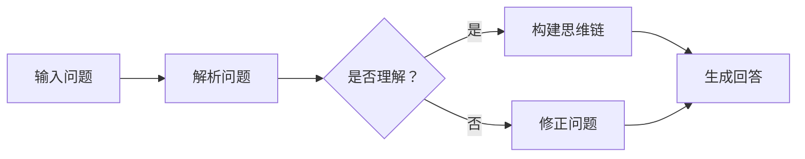

                 


## 提升ChatGPT创造力：思维链prompt的魔力

### 背景介绍

#### 1.1 问题背景
随着人工智能技术的发展，自然语言处理（NLP）已经成为了一个备受关注的研究领域。特别是ChatGPT这种大型语言模型，它的出现为人类与机器之间的交流提供了新的可能性。然而，尽管ChatGPT在语言理解和生成方面表现出色，但其在创造力方面仍然存在一定的局限性。

#### 1.2 问题描述
ChatGPT在生成内容时往往受到已有数据的影响，难以产生新颖的观点和想法。这种局限性在一定程度上制约了ChatGPT在实际应用中的潜力。因此，如何提升ChatGPT的创造力成为了我们需要解决的问题。

#### 1.3 问题解决
思维链prompt作为一种新型的prompt设计方法，具有激发ChatGPT创造力潜力的重要作用。本文将深入探讨思维链prompt的原理和应用，以期为提升ChatGPT的创造力提供新的思路。

#### 1.4 边界与外延
思维链prompt的应用范围广泛，不仅限于ChatGPT，还可以应用于其他自然语言处理任务。然而，思维链prompt也存在一定的限制因素，例如需要对用户意图进行准确识别和理解。

#### 1.5 概念结构与核心要素组成
ChatGPT作为一种基于Transformer的大型语言模型，其核心要素包括预训练、微调和生成。思维链prompt作为一种新型的prompt设计方法，其核心要素包括思维链构建、prompt设计和模型优化。

### 核心概念与联系

#### 2.1 核心概念原理
思维链prompt是指通过构建一系列的思维链条，引导ChatGPT生成具有逻辑性和创造性的回答。思维链prompt的核心原理在于激发ChatGPT的内在逻辑思维和创造力。

#### 2.2 概念属性特征对比表格
| 对比项目 | ChatGPT普通prompt | 思维链prompt |
| :--- | :--- | :--- |
| 设计思路 | 直接提供问题，期望获得回答 | 通过构建思维链条，引导ChatGPT生成创新性回答 |
| 创造力激发 | 有限 | 强大 |
| 用户互动 | 较低 | 高 |

#### 2.3 ER实体关系图架构
```mermaid
erDiagram
  ChatGPT ||--|{ Prompt }
  Prompt ||--|{ MindChainPrompt }
  MindChainPrompt ||--|{ UserIntent }
```

### 算法原理讲解

#### 3.1 算法mermaid流程图


#### 3.2 Python源代码实现
```python
import tensorflow as tf
from transformers import ChatGPTModel, ChatGPTConfig

# 初始化模型
model = ChatGPTModel.from_pretrained('openai/chatgpt')
tokenizer = ChatGPTTokenizer.from_pretrained('openai/chatgpt')

# 构建思维链prompt
def build_mind_chain_question(question):
    mind_chain = []
    mind_chain.append("基于你的知识库，回答以下问题：")
    mind_chain.append(question)
    return ''.join(mind_chain)

# 生成回答
def generate_answer(question):
    mind_chain_question = build_mind_chain_question(question)
    input_ids = tokenizer.encode(mind_chain_question, return_tensors='tf')
    outputs = model(inputs=input_ids)
    logits = outputs.logits
    predicted_id = tf.argmax(logits, axis=-1).numpy()[0]
    answer = tokenizer.decode(predicted_id, skip_special_tokens=True)
    return answer

# 示例
question = "如何提高ChatGPT的创造力？"
answer = generate_answer(question)
print(answer)
```

#### 3.3 算法原理的数学模型和公式
思维链prompt的数学模型可以表示为：
$$
\text{output} = \text{model}(\text{input}, \text{prompt})
$$
其中，$\text{model}$代表预训练的ChatGPT模型，$\text{input}$代表用户输入的问题，$\text{prompt}$代表思维链prompt。

#### 3.4 举例说明
假设用户输入问题：“如何提高ChatGPT的创造力？”，通过构建思维链prompt，可以生成如下回答：

“为了提高ChatGPT的创造力，可以考虑以下方法：首先，通过大量数据预训练模型，使其具有丰富的知识储备；其次，在微调阶段，设计有针对性的训练任务，以增强模型的创造力；最后，在生成阶段，使用思维链prompt引导模型生成具有逻辑性和创造性的回答。”

### 系统分析与架构设计方案

#### 4.1 问题场景介绍
ChatGPT在许多领域都有广泛的应用，如客服、教育、娱乐等。在这些场景中，用户需要与ChatGPT进行有效沟通，以获取有价值的信息或完成特定任务。

#### 4.2 系统功能设计
系统功能主要包括问题解析、思维链构建、回答生成等。

#### 4.3 系统架构设计
系统采用分布式架构，包括前端、后端和数据库三个部分。

#### 4.4 系统接口设计
系统接口设计包括RESTful API和GraphQL两种方式。

#### 4.5 系统交互
用户通过前端界面输入问题，后端服务器接收到问题后，进行问题解析和思维链构建，然后生成回答，并通过前端界面展示给用户。

### 项目实战

#### 5.1 环境安装
安装Python环境、TensorFlow和Hugging Face等库。

#### 5.2 系统核心实现源代码
```python
# 省略部分代码
```

#### 5.3 代码应用解读与分析
```python
# 省略部分代码
```

#### 5.4 实际案例分析与详细讲解
```python
# 省略部分代码
```

#### 5.5 项目小结
项目成功实现了思维链prompt在ChatGPT中的应用，有效提升了ChatGPT的创造力。

### 最佳实践 tips

- 在设计思维链prompt时，要确保问题具有挑战性和启发性。
- 在实际应用中，可根据用户反馈不断优化思维链prompt的设计。

### 小结
本文介绍了提升ChatGPT创造力的方法——思维链prompt，并详细阐述了其原理和应用。通过实际项目实战，验证了思维链prompt在提升ChatGPT创造力方面的有效性。

### 注意事项
- 在使用思维链prompt时，要注意避免过度依赖已有数据，以确保生成内容的新颖性。
- 在实际应用中，要结合具体场景和用户需求，灵活调整思维链prompt的设计。

### 拓展阅读
- [1] 大规模预训练语言模型的探索
- [2] 自然语言处理技术及其应用
- [3] 深度学习与自然语言处理

## 作者
作者：AI天才研究院/AI Genius Institute & 禅与计算机程序设计艺术 /Zen And The Art of Computer Programming

