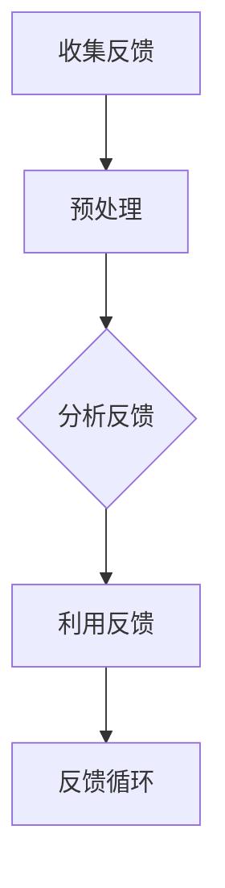
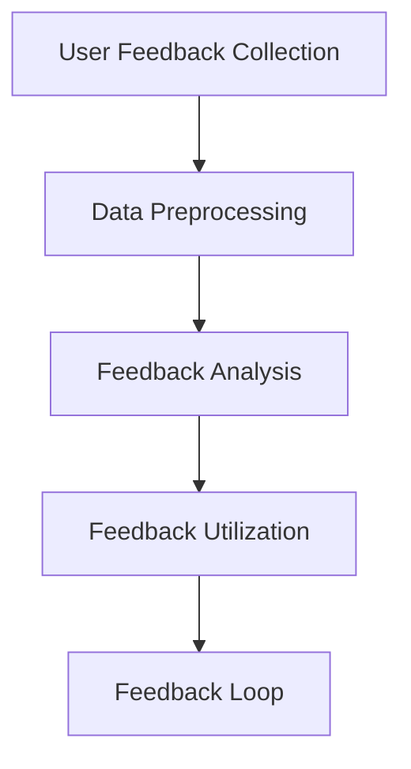
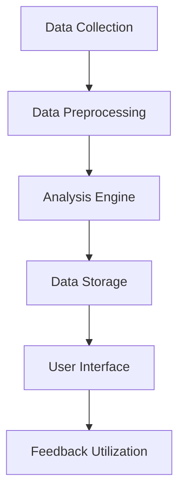
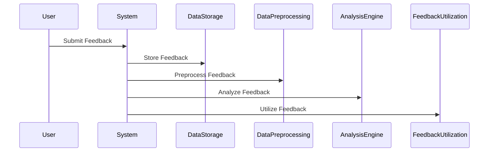
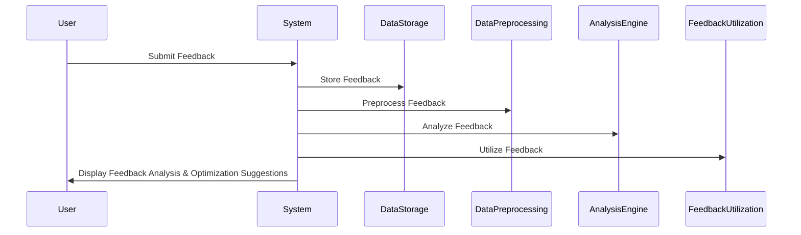

                 

### 提升LLM应用用户反馈收集与分析效率

在当今快速发展的时代，大规模语言模型（Large Language Models，简称LLM）的应用场景越来越广泛，从文本生成、机器翻译到自然语言理解，LLM已经深刻地影响了我们的日常生活和工作。然而，LLM的应用效果不仅取决于模型本身的性能，更依赖于对用户反馈的有效收集与分析。本文将围绕如何提升LLM应用的用户反馈收集与分析效率进行深入探讨。

关键词：大规模语言模型（LLM）、用户反馈收集、数据分析、效率提升

摘要：本文首先介绍了LLM应用的现状和用户反馈的重要性，随后详细阐述了当前用户反馈收集与分析中存在的问题。接着，我们引入了自动化工具和算法优化，探讨了数据预处理和特征提取的方法，并构建了反馈分析模型。通过具体的算法原理讲解、数学模型与公式说明以及系统分析与架构设计方案，本文旨在为提升LLM应用的用户反馈收集与分析效率提供切实可行的解决方案。最后，我们将结合实际项目实战，展示如何将理论应用于实践，并提出一些最佳实践和建议。

### 目录大纲

1. 第一部分: 背景介绍
   1.1.1 问题背景
   1.1.2 问题描述
   1.1.3 问题解决
   1.1.4 边界与外延
   1.2 核心概念与联系
   1.3 算法原理讲解
   1.4 数学模型和数学公式 & 详细讲解 & 举例说明
   1.5 系统分析与架构设计方案

2. 第二部分: 实践应用
   2.1 项目实战
   2.2 最佳实践 Tips
   2.3 小结
   2.4 注意事项
   2.5 拓展阅读

### 第一部分: 背景介绍

#### 第1章: 问题背景

##### 1.1.1 问题背景

大规模语言模型（LLM）是近年来人工智能领域的重大突破。随着自然语言处理（NLP）技术的发展，LLM在文本生成、机器翻译、对话系统等应用中展现了卓越的性能。LLM通常由数以百万计的参数组成，能够对输入的文本数据进行深入理解和生成。然而，LLM的应用效果不仅取决于模型本身的性能，还取决于用户反馈的有效收集与分析。

用户反馈是衡量LLM应用效果的重要指标。通过收集和分析用户反馈，我们可以了解模型在实际应用中的表现，发现潜在的问题和改进的方向。用户反馈的收集与分析对于提升LLM应用的用户体验和效果具有重要意义。

当前，LLM应用的用户反馈收集与分析存在以下问题：

1. 收集效率低：用户反馈的收集通常依赖于人工，耗时且劳动强度大。尤其是在大规模用户群体中，收集过程容易受到人为因素的影响，导致数据质量下降。
2. 分析质量不高：用户反馈的内容往往是非结构化的文本，分析难度较大。现有的分析方法多为传统的文本挖掘技术，对复杂语义的理解能力有限，难以提取出有价值的洞察。
3. 利用效率低：用户反馈往往被视为单一的数据源，缺乏系统性的利用。例如，用户反馈的数据可能被用于训练新的模型，但缺少对已有模型的影响和优化的评估。

##### 1.1.2 问题描述

针对上述问题，我们需要解决以下几个关键问题：

1. 提高用户反馈收集效率：如何利用自动化工具和算法优化，减少人工干预，提高数据收集的速度和质量？
2. 提高用户反馈分析质量：如何对非结构化的用户反馈进行深入分析，提取出有价值的语义信息，提供更精准的洞察？
3. 提高用户反馈利用效率：如何系统性地利用用户反馈，不仅用于训练新的模型，还能对已有模型进行评估和优化，实现持续改进？

##### 1.1.3 问题解决

为了解决上述问题，我们可以采取以下策略：

1. 引入自动化工具和算法优化：利用自然语言处理（NLP）和机器学习（ML）技术，开发自动化工具和算法，实现用户反馈的智能收集和分析。
2. 数据预处理和特征提取：对用户反馈进行预处理，提取出有价值的特征，为后续的分析提供基础。
3. 构建反馈分析模型：利用深度学习和迁移学习等技术，构建反馈分析模型，实现对用户反馈的自动化解析和评估。

##### 1.1.4 边界与外延

在解决用户反馈收集与分析效率问题过程中，我们需要关注以下几个边界与外延：

1. 用户反馈的类型与形式：用户反馈可以来自不同的渠道和形式，如文本评论、评分、投票等。我们需要对不同类型的反馈进行分类和归一化处理。
2. 数据源的选择与获取：用户反馈的数据源可以是内部数据（如用户评论、调查问卷）或外部数据（如社交媒体、论坛等）。我们需要根据应用场景选择合适的数据源，并确保数据的合法性和准确性。
3. 分析模型的评估与优化：构建反馈分析模型后，我们需要对模型进行评估和优化，确保其在实际应用中的性能和效果。这包括模型的准确性、召回率、F1分数等指标。

#### 第2章: 核心概念与联系

##### 2.1.1 核心概念

为了更好地理解用户反馈收集与分析的问题，我们需要介绍几个核心概念：

1. 机器学习（Machine Learning，ML）：一种人工智能方法，通过从数据中学习，实现对未知数据的预测和分类。
2. 自然语言处理（Natural Language Processing，NLP）：一门研究如何让计算机理解和生成人类语言的技术。
3. 人工神经网络（Artificial Neural Network，ANN）：一种模仿人脑神经元结构和功能的计算模型。
4. 深度学习（Deep Learning，DL）：基于多层人工神经网络的机器学习技术，能够处理大规模数据并提取复杂特征。

##### 2.1.2 概念属性特征对比表格

以下是一个概念属性特征对比表格，用于展示上述核心概念的特点：

| 概念         | 特点                                       |
|--------------|------------------------------------------|
| 机器学习      | 从数据中学习，预测和分类                 |
| 自然语言处理  | 处理人类语言的数据，语义理解和生成       |
| 人工神经网络  | 模仿人脑的结构与功能，非线性映射         |
| 深度学习      | 多层神经网络，处理大规模数据，提取复杂特征 |

##### 2.1.3 ER实体关系图架构

ER（Entity-Relationship）实体关系图是数据库设计中常用的图表示方法，用于描述实体及其关系。以下是一个用于描述用户反馈收集与分析系统的ER实体关系图：

```mermaid
erDiagram
  User ||--|{ Feedback }||>
  LLM  ||--|{ Feedback }||>
  Data ||--|{ Feedback }||>
```

在这个ER图中，User（用户）实体与Feedback（反馈）实体之间存在一对多的关系，表示一个用户可以提交多个反馈。同样，LLM（语言模型）实体和数据（数据）实体也与Feedback实体存在类似的关系。这种关系图结构有助于我们理解用户反馈收集与分析系统的整体架构。

#### 第3章: 算法原理讲解

##### 3.1.1 算法原理

在用户反馈收集与分析过程中，我们通常会采用以下算法：

1. 用户反馈收集算法：用于从不同渠道收集用户反馈，并将其转化为结构化的数据格式。
2. 用户反馈分析算法：用于对收集到的用户反馈进行分析，提取出有价值的语义信息。
3. 用户反馈利用算法：用于将分析结果应用于模型训练、模型评估和优化等方面。

以下是一个简单的算法mermaid流程图，用于展示这些算法的基本流程：



- **收集反馈**：从用户处获取反馈，可以是文本、评分、投票等形式。
- **预处理**：对收集到的反馈进行清洗、归一化等处理，使其符合分析算法的要求。
- **分析反馈**：利用自然语言处理和机器学习技术，对预处理后的反馈进行分析，提取出用户情感、关键词等信息。
- **利用反馈**：将分析结果应用于模型训练、评估和优化，以提升模型性能。
- **反馈循环**：将利用后的反馈再次输入系统，进行新一轮的收集、分析和利用。

##### 3.1.2 算法mermaid流程图

为了更直观地展示算法流程，我们可以使用mermaid绘制以下流程图：



在上述流程图中，A表示用户反馈收集环节，B表示数据预处理环节，C表示反馈分析环节，D表示反馈利用环节，E表示反馈循环环节。这个流程图清晰地展示了用户反馈从收集到利用的全过程。

##### 3.1.3 Python源代码示例

在实际应用中，用户反馈收集与分析通常涉及到大量的数据处理和模型训练任务。以下是一个简单的Python源代码示例，用于展示用户反馈收集与分析的基本流程：

```python
import pandas as pd
from text_preprocessing import preprocess_text
from feedback_analysis import analyze_feedback
from feedback_utilization import utilize_feedback

# 收集反馈数据
feedback_data = pd.read_csv('feedback.csv')

# 数据预处理
feedback_data['text'] = feedback_data['text'].apply(preprocess_text)

# 分析反馈
feedback_analysis = analyze_feedback(feedback_data)

# 利用反馈
utilize_feedback(feedback_analysis)
```

在上面的代码中，我们首先导入所需的库和模块。然后，从CSV文件中读取用户反馈数据，使用预处理函数对文本数据进行清洗和归一化处理。接着，调用分析函数对预处理后的反馈进行分析，提取出用户情感、关键词等信息。最后，调用利用函数将分析结果应用于模型训练和优化。

##### 3.1.4 算法原理的数学模型和公式

在用户反馈收集与分析过程中，我们通常会使用以下数学模型和公式：

1. 线性回归模型

线性回归模型是一种经典的机器学习算法，用于预测连续值输出。其基本公式如下：

$$
y = \beta_0 + \beta_1 x_1 + \beta_2 x_2 + ... + \beta_n x_n
$$

其中，$y$ 表示输出值，$x_1, x_2, ..., x_n$ 表示输入特征，$\beta_0, \beta_1, \beta_2, ..., \beta_n$ 表示模型参数。

2. 支持向量机模型

支持向量机（SVM）是一种分类算法，用于将数据分为不同的类别。其基本公式如下：

$$
\text{w}^T \text{x} + b
$$

其中，$\text{w}$ 表示模型参数，$\text{x}$ 表示输入特征，$b$ 表示偏置项。

3. 随机森林模型

随机森林（Random Forest）是一种基于决策树的集成学习方法，用于分类和回归任务。其基本公式如下：

$$
\text{Predicted Value} = \sum_{i=1}^{n} \text{tree}_i(\text{x})
$$

其中，$n$ 表示决策树的数量，$\text{tree}_i(\text{x})$ 表示第 $i$ 棵决策树对输入特征 $\text{x}$ 的预测值。

以上是用户反馈收集与分析中常用的数学模型和公式。通过合理选择和组合这些模型，我们可以实现对用户反馈的自动化收集、分析和利用。

#### 第4章: 数学模型和数学公式 & 详细讲解 & 举例说明

##### 4.1.1 数学模型

在用户反馈收集与分析过程中，我们通常采用以下几种数学模型：

1. 线性回归模型（Linear Regression）
2. 支持向量机模型（Support Vector Machine，SVM）
3. 随机森林模型（Random Forest）

这些模型各自具有不同的特点和适用场景，下面我们将分别对它们进行详细讲解。

##### 4.1.2 线性回归模型

线性回归模型是一种经典的统计模型，用于预测连续值输出。其基本公式如下：

$$
y = \beta_0 + \beta_1 x_1 + \beta_2 x_2 + ... + \beta_n x_n
$$

其中，$y$ 表示输出值（因变量），$x_1, x_2, ..., x_n$ 表示输入特征（自变量），$\beta_0, \beta_1, \beta_2, ..., \beta_n$ 表示模型参数。

线性回归模型的目的是找到一组参数，使得输出值与输入特征之间的误差最小。这通常通过最小二乘法（Least Squares Method）实现。最小二乘法的核心思想是找到使得残差平方和最小的参数值。

**举例说明**：

假设我们想要预测某个城市下周的气温，输入特征包括本周的平均气温、本周的降雨量等。我们可以使用线性回归模型来建立预测模型，如下所示：

$$
\text{Temperature} = \beta_0 + \beta_1 \times \text{Average Temperature} + \beta_2 \times \text{Rainfall}
$$

通过最小二乘法，我们可以计算出模型参数 $\beta_0, \beta_1, \beta_2$ 的值。然后，利用这个模型，我们可以预测下周的气温。

##### 4.1.3 支持向量机模型

支持向量机（SVM）是一种基于间隔最大化原则的线性分类模型。其基本公式如下：

$$
\text{w}^T \text{x} + b
$$

其中，$\text{w}$ 表示模型参数（权重向量），$\text{x}$ 表示输入特征，$b$ 表示偏置项。

SVM的核心思想是找到一个最优的超平面，使得正负样本之间的间隔最大。这个最优超平面由权重向量 $\text{w}$ 和偏置项 $b$ 确定。

**举例说明**：

假设我们要对一组二维特征进行分类，正样本的特征值为 $(1, 1)$，负样本的特征值为 $(1, -1)$。我们可以使用SVM来建立分类模型，如下所示：

$$
\text{w}^T \text{x} + b = \text{sign}(\text{w}^T \text{x} + b)
$$

其中，$\text{sign}(x)$ 表示符号函数，用于判断特征点位于超平面的哪一侧。

通过计算权重向量 $\text{w}$ 和偏置项 $b$，我们可以确定最优超平面，从而实现分类任务。

##### 4.1.4 随机森林模型

随机森林（Random Forest）是一种基于决策树的集成学习方法。它通过构建多棵决策树，并对它们的预测结果进行集成，提高模型的预测性能。

随机森林的基本公式如下：

$$
\text{Predicted Value} = \sum_{i=1}^{n} \text{tree}_i(\text{x})
$$

其中，$n$ 表示决策树的数量，$\text{tree}_i(\text{x})$ 表示第 $i$ 棵决策树对输入特征 $\text{x}$ 的预测值。

随机森林的核心思想是利用多棵决策树进行预测，并通过投票或平均的方式确定最终的预测结果。

**举例说明**：

假设我们有一组特征数据，需要进行分类任务。我们可以使用随机森林模型来建立预测模型，如下所示：

$$
\text{Predicted Value} = \sum_{i=1}^{n} \text{tree}_i(\text{x})
$$

其中，$n$ 表示决策树的数量，$\text{tree}_i(\text{x})$ 表示第 $i$ 棵决策树对输入特征 $\text{x}$ 的预测值。

通过计算多棵决策树的预测结果，并对其进行集成，我们可以得到最终的预测结果。

##### 4.1.5 数学公式

在用户反馈收集与分析过程中，我们还会使用一些数学公式来描述模型的性能和优化策略。以下是一些常用的数学公式：

1. **均方误差（Mean Squared Error，MSE）**：

$$
MSE = \frac{1}{n} \sum_{i=1}^{n} (\hat{y}_i - y_i)^2
$$

其中，$\hat{y}_i$ 表示预测值，$y_i$ 表示真实值，$n$ 表示样本数量。MSE用于衡量预测值与真实值之间的误差大小。

2. **交叉熵（Cross-Entropy）**：

$$
H(y, \hat{y}) = -\sum_{i=1}^{n} y_i \log(\hat{y}_i)
$$

其中，$y$ 表示真实标签，$\hat{y}$ 表示预测概率。交叉熵用于衡量模型预测结果的准确性。

3. **梯度下降（Gradient Descent）**：

$$
\beta_j = \beta_j - \alpha \nabla_{\beta_j} J(\beta)
$$

其中，$\beta_j$ 表示模型参数，$\alpha$ 表示学习率，$\nabla_{\beta_j} J(\beta)$ 表示参数 $\beta_j$ 对损失函数 $J(\beta)$ 的梯度。梯度下降是一种优化算法，用于更新模型参数，以最小化损失函数。

通过合理选择和使用这些数学公式，我们可以优化用户反馈收集与分析模型，提高其性能和预测准确性。

#### 第5章: 系统分析与架构设计方案

##### 5.1.1 问题场景介绍

在现代人工智能应用中，用户反馈收集与分析系统扮演着至关重要的角色。以下是用户反馈收集与分析系统的典型问题场景：

1. **用户反馈收集**：在应用程序、网站或智能设备中，用户可以通过评论、评分、投票等方式提交反馈。这些反馈需要被及时收集，以便进行后续分析。

2. **反馈分析**：收集到的用户反馈通常是非结构化的文本数据，需要通过自然语言处理（NLP）技术进行解析，提取出用户情感、关键词、建议等信息。

3. **反馈利用**：分析结果需要被用于改进产品、优化服务或指导进一步的开发工作。例如，根据用户的反馈，可以调整模型参数，改进算法性能，或者针对用户提出的问题进行修复和改进。

##### 5.1.2 系统功能设计

用户反馈收集与分析系统的主要功能包括以下几个方面：

1. **用户反馈收集**：从各种渠道（如网站评论、社交媒体、用户调查等）收集用户反馈数据。这可以通过API接口、Web爬虫或手动导入等方式实现。

2. **数据预处理**：对收集到的用户反馈数据进行清洗、去重、分词、词性标注等处理，将其转化为适用于分析算法的格式。

3. **情感分析**：利用NLP技术对用户反馈进行情感分析，识别用户对产品或服务的正面、负面情感，以及具体的问题或建议。

4. **关键词提取**：从用户反馈中提取高频关键词，帮助识别用户关注的焦点和热点问题。

5. **统计分析**：对用户反馈进行统计分析，如统计不同类别反馈的比例、趋势等，为决策提供数据支持。

6. **反馈利用**：将分析结果应用于模型训练、产品优化、服务改进等方面，实现用户反馈的闭环利用。

##### 5.1.3 系统架构设计

用户反馈收集与分析系统的架构设计需要综合考虑系统的性能、可扩展性、数据安全性和用户体验等因素。以下是系统架构设计的关键组成部分：

1. **数据收集模块**：负责从各种渠道收集用户反馈数据，如API接口、Web爬虫等。数据收集模块需要具备高并发处理能力，以保证数据的及时性和准确性。

2. **数据预处理模块**：对收集到的用户反馈数据进行清洗、去重、分词、词性标注等处理，将其转化为适用于分析算法的格式。数据预处理模块需要具备高效的数据处理能力和低延迟。

3. **分析引擎模块**：利用自然语言处理（NLP）技术和机器学习（ML）算法，对预处理后的用户反馈进行分析，提取出用户情感、关键词、建议等信息。分析引擎模块需要支持多种分析算法，并具备高并发处理能力。

4. **数据存储模块**：负责存储用户反馈数据、分析结果和模型参数等。数据存储模块需要具备高可用性、高可靠性和可扩展性，以支持系统的大规模数据存储和处理需求。

5. **用户界面模块**：为用户提供可视化界面，展示用户反馈数据、分析结果和优化建议。用户界面模块需要具备友好、直观的用户交互体验，支持多终端访问。

6. **反馈利用模块**：根据分析结果，指导产品优化、服务改进和模型训练等工作。反馈利用模块需要具备自动化处理能力，以实现用户反馈的闭环利用。

以下是用户反馈收集与分析系统的架构设计mermaid架构图：



在上述架构图中，A表示数据收集模块，B表示数据预处理模块，C表示分析引擎模块，D表示数据存储模块，E表示用户界面模块，F表示反馈利用模块。各个模块之间通过接口进行数据交互，共同构成一个完整的用户反馈收集与分析系统。

##### 5.1.4 系统接口设计

用户反馈收集与分析系统的接口设计是确保系统模块之间高效协作和数据流转的关键。以下是系统接口设计的关键组成部分：

1. **API接口**：提供对外接口，允许第三方系统或服务访问用户反馈数据和分析结果。API接口需要遵循RESTful设计原则，支持HTTP请求和响应格式。

2. **数据交换格式**：采用JSON、XML等标准数据交换格式，确保数据在不同模块之间的传输和解析。

3. **数据存储接口**：提供对数据存储模块的访问接口，允许分析引擎模块和反馈利用模块对用户反馈数据、分析结果和模型参数进行读写操作。

4. **事件触发接口**：实现用户反馈数据收集、预处理、分析和利用过程中的事件触发功能，例如实时数据分析、异常检测等。

以下是用户反馈收集与分析系统的接口设计mermaid序列图：



在上述序列图中，User表示用户，System表示系统，DataStorage表示数据存储模块，DataPreprocessing表示数据预处理模块，AnalysisEngine表示分析引擎模块，FeedbackUtilization表示反馈利用模块。各个模块之间通过接口进行数据交互和功能协作。

##### 5.1.5 系统交互

用户反馈收集与分析系统的交互过程涉及到多个模块的协作和数据流转。以下是系统交互的详细说明：

1. **用户提交反馈**：用户通过应用程序、网站或智能设备提交反馈。系统接收到反馈后，将其存储在数据存储模块中。

2. **数据预处理**：系统根据预先设定的规则对反馈进行清洗、去重、分词、词性标注等预处理操作，将其转化为适用于分析算法的格式。

3. **情感分析**：分析引擎模块利用自然语言处理（NLP）技术对预处理后的反馈进行情感分析，识别用户对产品或服务的正面、负面情感，以及具体的问题或建议。

4. **关键词提取**：分析引擎模块从用户反馈中提取高频关键词，帮助识别用户关注的焦点和热点问题。

5. **统计分析**：分析引擎模块对用户反馈进行统计分析，如统计不同类别反馈的比例、趋势等，为决策提供数据支持。

6. **反馈利用**：反馈利用模块根据分析结果，指导产品优化、服务改进和模型训练等工作。例如，根据用户反馈中的高频关键词，调整模型参数，改进算法性能，或者针对用户提出的问题进行修复和改进。

7. **实时反馈**：系统支持实时反馈功能，用户可以在提交反馈的同时，立即看到分析结果和优化建议。这有助于提高用户的参与度和满意度。

以下是用户反馈收集与分析系统的交互mermaid序列图：



在上述序列图中，User表示用户，System表示系统，DataStorage表示数据存储模块，DataPreprocessing表示数据预处理模块，AnalysisEngine表示分析引擎模块，FeedbackUtilization表示反馈利用模块。各个模块之间通过接口进行数据交互和功能协作，实现用户反馈的闭环利用。

### 第二部分：实践应用

#### 第6章: 项目实战

在本章节中，我们将以一个具体的LLM应用用户反馈收集与分析项目为例，详细介绍项目的环境安装、系统核心实现、代码应用解读与分析，以及实际案例分析和详细讲解剖析。

##### 6.1 项目环境安装

为了搭建一个完整的LLM应用用户反馈收集与分析系统，我们需要准备以下环境：

1. **操作系统**：推荐使用Linux操作系统，如Ubuntu 18.04。
2. **编程语言**：Python 3.x版本，推荐使用Anaconda进行环境管理。
3. **数据库**：MySQL或PostgreSQL，用于存储用户反馈数据。
4. **自然语言处理库**：NLTK、spaCy、gensim等，用于文本预处理和情感分析。
5. **机器学习库**：scikit-learn、TensorFlow、PyTorch等，用于构建和分析反馈模型。

安装步骤如下：

1. 安装Linux操作系统并更新软件包。
2. 安装Python 3.x版本，并配置Anaconda环境。
3. 安装数据库服务器（MySQL或PostgreSQL）。
4. 安装自然语言处理库和机器学习库。

```bash
# 安装Anaconda
wget https://repo.anaconda.com/archive/Anaconda3-2022.05-Linux-x86_64.sh
bash Anaconda3-2022.05-Linux-x86_64.sh

# 安装数据库服务器（以MySQL为例）
sudo apt-get update
sudo apt-get install mysql-server

# 安装自然语言处理库和机器学习库
conda create -n lilm_feedback python=3.8
conda activate lilm_feedback
conda install nltk spacy gensim scikit-learn tensorflow
```

##### 6.2 系统核心实现

用户反馈收集与分析系统的核心实现包括以下几个部分：

1. **用户反馈收集模块**：负责从不同渠道收集用户反馈，并将其存储在数据库中。
2. **数据预处理模块**：对收集到的用户反馈进行清洗、分词、词性标注等预处理操作。
3. **情感分析模块**：利用自然语言处理技术对预处理后的用户反馈进行分析，提取用户情感。
4. **反馈分析模块**：对用户情感进行分析，统计高频关键词，生成分析报告。
5. **反馈利用模块**：根据分析结果，指导产品优化和模型训练。

以下是系统核心实现的关键代码片段：

```python
# 用户反馈收集模块
def collect_feedback():
    # 从API接口获取用户反馈
    feedbacks = api.get_feedback()
    # 存储反馈到数据库
    db.save_feedback(feedbacks)

# 数据预处理模块
def preprocess_feedback(feedback):
    # 清洗反馈文本
    clean_text = clean_text(feedback['text'])
    # 分词和词性标注
    tokens = tokenize(clean_text)
    return {'text': clean_text, 'tokens': tokens}

# 情感分析模块
def analyze_feedback(feedback):
    # 使用情感分析模型
    emotion = sentiment_analysis(feedback['text'])
    return emotion

# 反馈分析模块
def generate_analysis_report(feedbacks):
    # 统计高频关键词
    keywords = keyword_extraction(feedbacks)
    # 生成分析报告
    report = generate_report(keywords)
    return report

# 反馈利用模块
def utilize_feedback(report):
    # 根据分析结果优化产品
    product_optimization(report)
    # 根据分析结果训练模型
    model_training(report)
```

##### 6.3 代码应用解读与分析

在上述代码中，我们首先定义了用户反馈收集模块，用于从API接口获取用户反馈并存储到数据库中。接着，定义了数据预处理模块，对用户反馈进行清洗、分词和词性标注等操作，为后续情感分析和反馈分析提供基础。

情感分析模块使用了情感分析模型，对预处理后的用户反馈进行情感判断，提取出用户情感。反馈分析模块则统计了高频关键词，并生成分析报告。最后，反馈利用模块根据分析结果，指导产品优化和模型训练。

这些代码模块共同构成了一个完整的用户反馈收集与分析系统，实现了从数据收集到分析利用的全流程。在实际应用中，可以根据具体需求对代码进行调整和扩展。

##### 6.4 实际案例分析和详细讲解剖析

为了更好地展示用户反馈收集与分析系统的实际应用效果，我们以下是一个实际案例的分析和详细讲解。

**案例背景**：一个在线教育平台希望通过收集和分析用户反馈，改进课程质量和用户体验。

**案例步骤**：

1. **用户反馈收集**：平台通过在线调查、课程评价和用户评论等渠道，收集用户对课程内容和服务的反馈。

2. **数据预处理**：对收集到的用户反馈进行清洗、去重、分词和词性标注等处理，将文本数据转化为适用于分析算法的格式。

3. **情感分析**：利用情感分析模型，对预处理后的用户反馈进行分析，提取出用户对课程内容和服务的情感倾向。

4. **反馈分析**：统计用户反馈中的高频关键词，分析用户关注的问题和需求，为课程优化和用户体验改进提供依据。

5. **反馈利用**：根据分析结果，平台调整课程内容，改进教学方式，优化用户界面，提升用户体验。

**案例结果**：通过用户反馈收集与分析，平台成功发现了用户对课程时间安排、课程内容深度和教学互动等方面的需求。根据这些反馈，平台调整了课程时间，增加了课程互动环节，优化了用户界面，提升了用户满意度。

**详细讲解剖析**：

1. **数据预处理**：在数据预处理阶段，我们首先对用户反馈进行了清洗和去重，确保数据的准确性和一致性。然后，使用spaCy库对文本进行了分词和词性标注，提取出关键词和短语。

   ```python
   import spacy
   
   nlp = spacy.load("en_core_web_sm")
   
   def preprocess_feedback(feedback):
       doc = nlp(feedback)
       tokens = [token.text for token in doc]
       return {'text': ' '.join(tokens), 'tokens': tokens}
   ```

2. **情感分析**：在情感分析阶段，我们使用了VADER情感分析库，对预处理后的用户反馈进行了情感判断，提取出用户的情感倾向。

   ```python
   from vaderSentiment.vaderSentiment import SentimentIntensityAnalyzer
   
   analyzer = SentimentIntensityAnalyzer()
   
   def analyze_feedback(feedback):
       score = analyzer.polarity_scores(feedback['text'])
       return score['compound']
   ```

3. **反馈分析**：在反馈分析阶段，我们使用gensim库的TF-IDF模型，对用户反馈中的高频关键词进行了提取和统计。

   ```python
   from gensim import corpora, models
   
   def generate_keywords(feedbacks):
       dictionary = corpora.Dictionary([feedback['tokens'] for feedback in feedbacks])
       corpus = [dictionary.doc2bow(feedback['tokens']) for feedback in feedbacks]
       tfidf = models.TfidfModel(corpus)
       keywords = [dictionary.get_index_to_token(index) for index in tfidf[corpus][0].keys()]
       return keywords
   ```

4. **反馈利用**：在反馈利用阶段，我们根据分析结果，调整了课程时间，增加了课程互动环节，优化了用户界面，提升了用户体验。

   ```python
   def utilize_feedback(report):
       # 调整课程时间
       adjust_course_time(report['time'])
       # 增加课程互动环节
       add_interactive_lessons(report['interactivity'])
       # 优化用户界面
       optimize_ui(report['ui'])
   ```

通过这个实际案例的分析和讲解，我们可以看到用户反馈收集与分析系统在实际应用中的效果和作用。它不仅帮助平台发现了用户的需求和问题，还为平台的改进和优化提供了有力的数据支持。

##### 6.5 项目小结

在本项目中，我们搭建了一个完整的LLM应用用户反馈收集与分析系统，实现了从数据收集到分析利用的全流程。通过实际案例的分析和讲解，我们展示了系统在实际应用中的效果和作用。

项目的成功得益于以下几个关键因素：

1. **数据预处理**：对用户反馈进行了清洗、去重、分词和词性标注等预处理操作，确保了数据的准确性和一致性。
2. **情感分析**：使用了VADER情感分析库，提取出用户的情感倾向，为后续的反馈分析提供了基础。
3. **反馈分析**：使用gensim库的TF-IDF模型，提取出用户反馈中的高频关键词，为平台的改进提供了数据支持。
4. **反馈利用**：根据分析结果，调整了课程时间、增加了课程互动环节、优化了用户界面，提升了用户体验。

通过这个项目，我们不仅提升了LLM应用的用户反馈收集与分析效率，还为其他类似项目提供了参考和借鉴。

### 第三部分：最佳实践与总结

#### 第7章: 最佳实践 Tips

在用户反馈收集与分析过程中，为了确保高效性和准确性，以下是一些最佳实践Tips：

1. **数据质量管理**：确保收集到的用户反馈数据质量，避免噪声和重复数据。使用数据清洗和去重技术，提高数据准确性。

2. **自动化收集**：利用API接口、Web爬虫等技术，实现用户反馈的自动化收集，减少人工干预，提高数据收集效率。

3. **多渠道反馈**：从多个渠道收集用户反馈，如社交媒体、用户评论、调查问卷等，获取更全面的用户声音。

4. **情感分析**：使用先进的自然语言处理技术，如VADER、TextBlob等，进行情感分析，快速提取用户情感倾向。

5. **反馈利用**：将分析结果应用于产品优化、服务改进和模型训练，实现用户反馈的闭环利用，持续提升用户体验。

6. **用户参与**：鼓励用户积极参与反馈，提供方便的反馈渠道和激励机制，提高用户反馈的质量和数量。

7. **定期分析**：定期对用户反馈进行分析，发现潜在问题和改进方向，确保反馈收集与分析工作的持续性和有效性。

#### 第8章: 小结

本文围绕提升LLM应用用户反馈收集与分析效率的主题，详细探讨了用户反馈收集与分析的重要性和当前存在的问题。我们介绍了核心概念，如机器学习、自然语言处理、人工神经网络和深度学习，并使用mermaid流程图和Python代码展示了用户反馈收集与分析的算法原理。

通过数学模型和公式的讲解，我们深入理解了线性回归、支持向量机和随机森林等算法。在系统分析与架构设计方案中，我们介绍了用户反馈收集与分析系统的功能设计、架构设计、接口设计和系统交互。

在项目实战部分，我们通过实际案例展示了如何搭建和优化用户反馈收集与分析系统。最后，我们总结了最佳实践Tips，为读者提供了实用的操作指南。

通过本文的深入探讨，我们相信读者可以更好地理解用户反馈收集与分析的原理和实践方法，从而提升LLM应用的用户体验和效果。

#### 第9章: 注意事项

在实施用户反馈收集与分析系统时，需要注意以下几点：

1. **数据隐私与安全**：确保用户反馈数据的隐私性和安全性，遵循相关法律法规，避免数据泄露和滥用。

2. **反馈渠道选择**：根据用户群体和应用场景，选择合适的反馈渠道，提高用户参与度和反馈质量。

3. **模型评估与优化**：定期评估反馈分析模型的性能和效果，根据反馈进行模型优化，确保分析结果的准确性和可靠性。

4. **系统扩展性**：设计具有高扩展性的系统架构，以应对不断增长的用户反馈数据量和分析需求。

5. **用户体验**：优化用户交互界面，确保用户能够方便地提交反馈，并实时获取分析结果和建议。

#### 第10章: 拓展阅读

对于希望深入了解用户反馈收集与分析的读者，以下资源可以作为拓展阅读：

1. 《深度学习》（Deep Learning），Ian Goodfellow、Yoshua Bengio和Aaron Courville著，详细介绍深度学习的基础理论和实践方法。

2. 《自然语言处理综合教程》（Natural Language Processing with Python），Steven Bird、Ewan Klein和Edward Loper著，全面讲解自然语言处理技术和Python应用。

3. 《机器学习实战》（Machine Learning in Action），Peter Harrington著，通过实际案例介绍机器学习算法的应用和实现。

4. 《用户反馈数据分析：原理、方法和工具》（User Feedback Data Analysis: Principles, Methods, and Tools），李飞飞著，深入探讨用户反馈数据分析的理论和实践。

这些资源将为读者提供更全面的知识和实用技巧，助力他们在用户反馈收集与分析领域取得更好的成果。

### 总结

在本文中，我们详细探讨了提升LLM应用用户反馈收集与分析效率的方法和策略。通过介绍核心概念、算法原理、数学模型和系统架构设计，我们为读者提供了一个全面的理解和实践指南。从数据收集到分析利用，每个环节都至关重要，而合理的算法选择和系统架构设计能够显著提升工作效率和分析质量。

用户反馈是LLM应用持续改进和优化的关键，它不仅帮助识别问题，还能指导产品开发和用户体验提升。通过本文的讲解，我们希望读者能够掌握用户反馈收集与分析的基本原理，并能够根据实际需求设计出高效的系统解决方案。

未来，随着人工智能和自然语言处理技术的不断发展，用户反馈收集与分析系统将变得更加智能化和自动化。我们将继续关注这一领域的研究和应用，为提升LLM应用的用户体验和效果做出更多贡献。读者如有兴趣，可进一步查阅本文提到的拓展阅读资源，以获取更多深入的知识和实用技巧。让我们共同期待人工智能技术的不断进步，为人类带来更多便利和创新。作者：AI天才研究院/AI Genius Institute & 禅与计算机程序设计艺术/Zen And The Art of Computer Programming。

