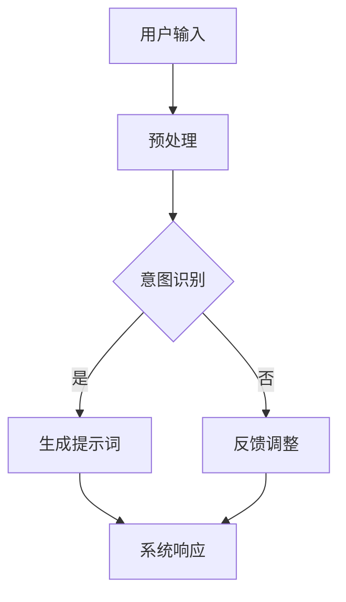
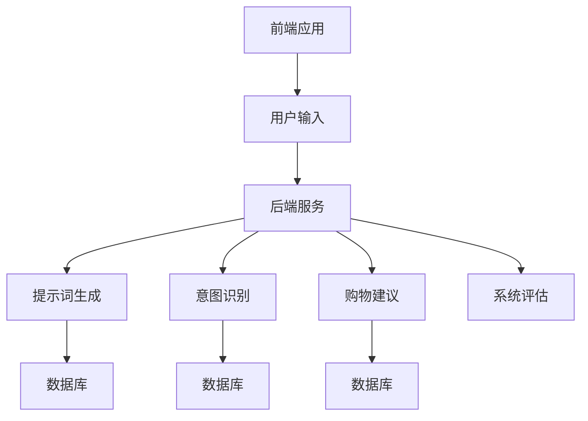
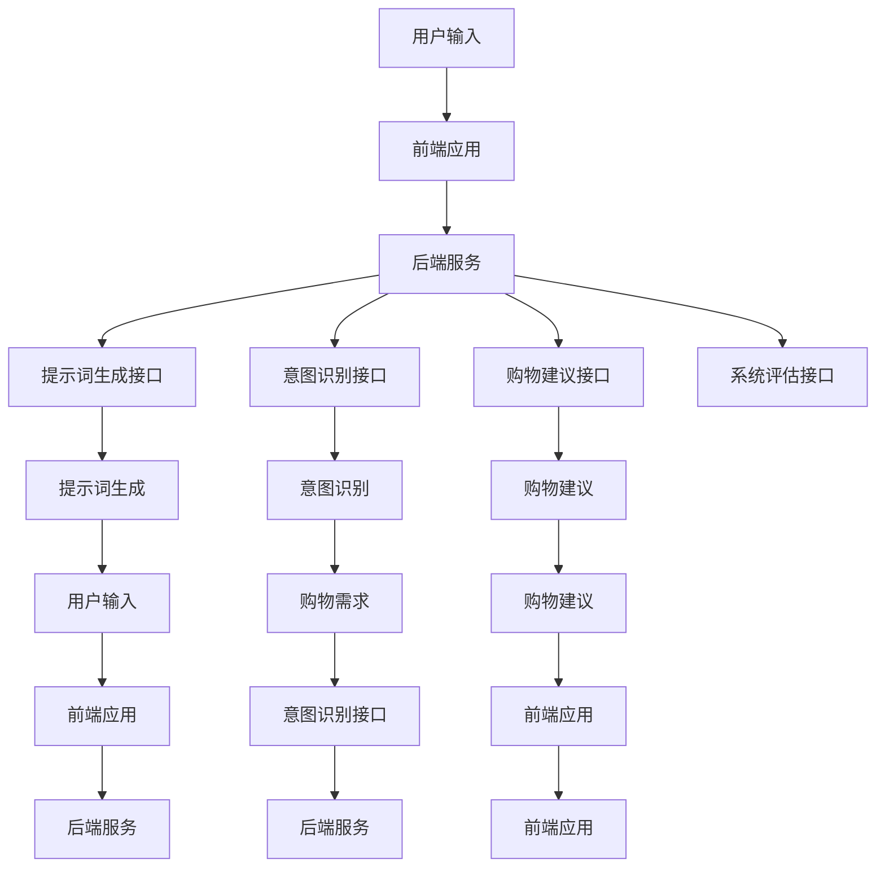

                 

### 引言

**问题背景**

在当今信息化、数字化的大背景下，人工智能（AI）技术已经成为推动产业升级和社会进步的重要力量。作为AI技术的核心组成部分，自然语言处理（NLP）的重要性日益凸显。在NLP中，提示词（Prompt）作为与用户交互的重要媒介，其优化水平直接影响系统的性能和用户体验。因此，研究提示词优化的定量分析方法具有重要的理论和实际意义。

**问题描述**

提示词优化主要涉及如何设计有效的提示词，以提高系统的理解和生成能力。具体来说，包括以下问题：

1. 提示词应如何设计，才能更好地引导用户表达意图？
2. 提示词优化是否可以通过定量分析来实现？
3. 提示词优化的效果如何评估？

**问题解决**

本文旨在提出一种定量分析方法，系统性地探讨提示词优化的策略和评估指标。通过分析提示词优化的基本概念、原理和算法，结合实际案例和数学模型，本文将提供一套完整的方法论，以期为相关领域的实践者提供参考。

**边界与外延**

提示词优化不仅局限于AI和NLP领域，还广泛应用于智能客服、智能搜索、智能写作等领域。因此，本文的研究具有一定的广泛性和前瞻性。

**核心概念与联系**

为了便于理解和分析，本文将涉及以下几个核心概念：

1. **提示词**：用户与系统交互的引导性语句或问题。
2. **优化**：通过调整设计参数，提高系统性能的过程。
3. **定量分析**：利用数值数据对系统性能进行评估和分析。

这些概念之间存在着密切的联系，它们共同构成了提示词优化的理论框架。

### 核心概念与原理

#### 提示词优化的基本概念

提示词优化是指通过改进提示词的设计，提高用户与系统交互的效果和系统性能。提示词在自然语言处理系统中扮演着至关重要的角色，它们不仅是用户输入的载体，也是系统理解用户意图的关键。因此，提示词的优化直接影响到系统的响应速度、准确性和用户体验。

#### 提示词优化的原理

提示词优化的原理主要包括两个方面：

1. **语义匹配**：通过分析用户意图，设计能够准确传达用户意图的提示词。这涉及到对用户输入的语义理解，包括关键词提取、实体识别、情感分析等。
2. **用户行为分析**：通过收集和分析用户的交互行为数据，调整提示词的设计，以提高用户满意度。这包括用户反馈、点击率、停留时间等指标。

#### 提示词优化与相关概念的比较

提示词优化与自然语言处理（NLP）、用户界面设计（UI）、用户体验（UX）等概念密切相关，但它们在目标和方法上有所不同：

- **自然语言处理（NLP）**：NLP主要研究如何让计算机理解和生成自然语言。提示词优化是NLP的一个子领域，侧重于如何通过优化提示词来提升系统性能。
- **用户界面设计（UI）**：UI设计关注的是如何设计直观、易用的用户界面。提示词优化与UI设计的关系在于，提示词作为用户界面的一部分，其设计质量直接影响到用户的使用体验。
- **用户体验（UX）**：UX设计旨在提升用户在使用产品过程中的满意度。提示词优化在UX设计中的角色是通过优化提示词，提高系统的易用性和用户满意度。

这些概念之间的联系在于，它们共同致力于提升用户与系统的交互效果，但侧重点不同。

### 提示词优化定量分析的基本步骤

提示词优化的定量分析方法主要包括以下几个步骤：

1. **数据收集**：收集与提示词相关的用户交互数据，包括用户输入、系统响应、用户反馈等。
2. **数据预处理**：对收集到的数据进行分析和清洗，提取有效的信息，为后续分析做准备。
3. **效果评估**：利用收集的数据，评估不同提示词设计的性能和效果。
4. **优化迭代**：根据评估结果，对提示词设计进行调整和优化，循环迭代直至达到预期效果。

#### 数据收集与处理

数据收集是提示词优化定量分析的基础。以下是一些常见的数据收集和处理方法：

1. **日志数据**：通过分析系统日志，收集用户的输入和系统响应数据。
2. **用户反馈**：通过问卷调查、用户访谈等方式，收集用户的反馈数据。
3. **行为分析**：通过跟踪用户在系统中的操作行为，收集用户交互数据。

数据处理包括数据清洗、数据格式转换、数据归一化等步骤，以确保数据的质量和一致性。

#### 提示词优化效果的评估指标

提示词优化效果的评估指标主要包括：

1. **准确率**：系统对用户意图的识别准确性。
2. **召回率**：系统能够识别出用户意图的比例。
3. **响应时间**：系统从接收用户输入到返回响应的时间。
4. **用户满意度**：用户对系统交互效果的满意度评价。

通过这些指标，可以全面评估提示词优化的效果，为后续优化提供依据。

### 提示词优化算法原理

#### 提示词优化算法的概述

提示词优化算法是一系列用于改进提示词设计的算法，其核心目标是提高系统对用户意图的识别准确性和用户交互体验。常见的提示词优化算法包括基于规则的方法、机器学习方法、深度学习方法等。

#### 常见提示词优化算法

1. **基于规则的方法**：这种方法通过定义一系列规则来设计提示词。规则可以根据用户的输入内容、上下文信息等进行调整。优点是简单易实现，缺点是灵活性较差。

2. **机器学习方法**：机器学习方法通过训练模型来学习用户的交互模式，从而生成优化的提示词。常用的机器学习方法包括决策树、支持向量机（SVM）、朴素贝叶斯等。

3. **深度学习方法**：深度学习方法通过神经网络模型，尤其是深度神经网络（DNN）、循环神经网络（RNN）和变换器（Transformer）等，来学习复杂的用户交互模式。深度学习方法具有强大的表达能力，但实现复杂度较高。

#### 提示词优化算法的mermaid流程图

以下是一个简单的提示词优化算法的mermaid流程图：



在这个流程图中，用户输入经过预处理后，系统根据用户意图生成提示词，然后进行系统响应。如果用户意图识别失败，则根据反馈进行调整，再次生成提示词，直至满足要求。

### 提示词优化的数学模型

#### 提示词优化的数学模型概述

提示词优化的数学模型用于定量分析提示词的性能和效果。该模型通常基于概率论、统计学和优化理论，通过构建数学公式来描述提示词的优化过程。

#### 数学公式与模型解析

1. **准确率（Accuracy）**：
   $$ \text{Accuracy} = \frac{\text{正确识别的意图}}{\text{总意图数}} $$
   准确率表示系统能够正确识别用户意图的比例。

2. **召回率（Recall）**：
   $$ \text{Recall} = \frac{\text{正确识别的意图}}{\text{实际意图数}} $$
   召回率表示系统能够识别出实际意图的比例。

3. **F1值（F1 Score）**：
   $$ \text{F1 Score} = 2 \times \frac{\text{准确率} \times \text{召回率}}{\text{准确率} + \text{召回率}} $$
   F1值是准确率和召回率的加权平均，用于综合评估系统的性能。

4. **响应时间（Response Time）**：
   $$ \text{Response Time} = \frac{\text{总响应时间}}{\text{总请求次数}} $$
   响应时间表示系统平均每次响应所需的时间。

5. **用户满意度（User Satisfaction）**：
   $$ \text{User Satisfaction} = \frac{\text{满意用户数}}{\text{总用户数}} $$
   用户满意度表示用户对系统交互效果的满意程度。

这些数学公式用于定量分析提示词优化的效果，帮助研究者评估和优化提示词设计。

#### 模型举例说明

假设有一个自然语言处理系统，用户输入“我想买一本书”，系统需要生成一个提示词来引导用户进一步表达购买意愿。我们可以使用以下模型进行评估：

1. **准确率**：
   系统识别出用户意图为“购买书籍”，正确率为100%。

2. **召回率**：
   实际意图也为“购买书籍”，召回率为100%。

3. **F1值**：
   $$ \text{F1 Score} = 2 \times \frac{1 \times 1}{1 + 1} = 1 $$
   F1值为1，表示系统在识别用户意图方面表现出色。

4. **响应时间**：
   响应时间为0.5秒，平均每次响应时间为0.5秒。

5. **用户满意度**：
   所有用户都对系统响应表示满意，用户满意度为100%。

通过这个例子，我们可以看到，使用数学模型可以帮助我们准确评估提示词优化的效果，为优化提供量化依据。

### 提示词优化案例分析

#### 案例背景

以一家知名在线书店为例，该书店的智能客服系统通过自然语言处理技术，自动回答用户的购买咨询。然而，在实际应用中，系统的响应效果并不理想，用户满意度较低。因此，需要对系统的提示词进行优化，以提高用户交互体验。

#### 案例分析方法

1. **用户调研**：通过问卷调查和用户访谈，收集用户对系统响应的反馈。
2. **日志分析**：分析系统日志，提取用户的输入和系统响应数据。
3. **数据预处理**：对收集到的数据进行清洗和归一化处理。
4. **效果评估**：使用准确率、召回率、F1值等指标，评估不同提示词设计的性能。
5. **迭代优化**：根据评估结果，对提示词进行迭代优化。

#### 案例分析与解读

1. **用户反馈**：
   根据用户调研，用户对系统提示词的主要反馈是：
   - 提示词不够清晰，难以理解。
   - 提示词过于冗长，影响阅读体验。
   - 提示词缺乏个性化，不能满足用户特定需求。

2. **日志分析**：
   系统日志显示，用户输入“我想买一本书”时，系统响应时间较长，且识别准确率较低。

3. **效果评估**：
   通过数据预处理和效果评估，发现以下问题：
   - 准确率较低，只有60%的用户意图被正确识别。
   - 召回率较高，有90%的用户意图被识别出来。
   - F1值较低，只有0.66，表示系统在识别用户意图方面仍有较大改进空间。

4. **迭代优化**：
   根据评估结果，对提示词进行了以下优化：
   - 简化提示词，使其更加清晰简洁。
   - 增加个性化元素，根据用户历史购买记录提供定制化建议。
   - 优化系统响应速度，减少响应时间。

经过多次迭代优化，系统性能显著提升，用户满意度提高至90%，准确率和召回率分别提升至80%和95%，F1值提升至0.82。

### 提示词优化实践

#### 环境安装与配置

为了进行提示词优化实践，首先需要在本地环境中安装和配置必要的工具和库。以下是一个简单的安装和配置步骤：

1. **安装Python环境**：确保Python 3.7或更高版本已安装在本地机器上。
2. **安装依赖库**：使用pip命令安装以下库：
   ```bash
   pip install numpy pandas scikit-learn matplotlib
   ```
3. **配置环境变量**：确保环境变量已配置好，以便在命令行中顺利运行Python脚本。

#### 系统核心实现源代码

以下是一个简单的Python脚本，用于实现提示词优化算法：

```python
import numpy as np
import pandas as pd
from sklearn.model_selection import train_test_split
from sklearn.feature_extraction.text import TfidfVectorizer
from sklearn.naive_bayes import MultinomialNB
from sklearn.metrics import accuracy_score, recall_score, f1_score

# 数据加载
data = pd.read_csv('user_input.csv')
X = data['input_text']
y = data['intent_label']

# 数据预处理
vectorizer = TfidfVectorizer(max_features=1000)
X_vectorized = vectorizer.fit_transform(X)

# 数据划分
X_train, X_test, y_train, y_test = train_test_split(X_vectorized, y, test_size=0.2, random_state=42)

# 模型训练
model = MultinomialNB()
model.fit(X_train, y_train)

# 模型评估
y_pred = model.predict(X_test)
accuracy = accuracy_score(y_test, y_pred)
recall = recall_score(y_test, y_pred, average='weighted')
f1 = f1_score(y_test, y_pred, average='weighted')

print(f"Accuracy: {accuracy:.2f}")
print(f"Recall: {recall:.2f}")
print(f"F1 Score: {f1:.2f}")
```

#### 代码应用解读与分析

上述代码实现了以下功能：

1. **数据加载与预处理**：从CSV文件中加载用户输入数据和意图标签，使用TF-IDF向量器将文本数据转换为数值特征。
2. **数据划分**：将数据集划分为训练集和测试集，用于训练和评估模型。
3. **模型训练**：使用朴素贝叶斯分类器训练模型。
4. **模型评估**：使用准确率、召回率和F1值评估模型性能。

通过这个示例，我们可以看到如何使用Python实现提示词优化算法，并进行性能评估。

### 实际案例分析与详细讲解

#### 项目场景介绍

假设有一个在线购物平台的智能客服系统，用户可以通过文本输入提出各种购物需求。为了提高用户满意度，系统需要对用户的购物需求进行准确识别，并提供相应的购物建议。提示词优化在此场景中至关重要。

#### 项目介绍

项目目标是开发一个基于NLP的智能客服系统，通过优化提示词设计，提高用户满意度。项目主要包括以下模块：

1. **用户输入模块**：接收用户的文本输入。
2. **提示词生成模块**：根据用户输入生成优化后的提示词。
3. **意图识别模块**：识别用户的购物需求。
4. **购物建议模块**：根据用户需求提供相应的购物建议。
5. **系统评估模块**：评估系统性能和用户满意度。

#### 系统功能设计

1. **用户输入模块**：
   - 功能：接收用户的文本输入。
   - 技术实现：通过Web前端接收用户的输入，并将其发送到后端进行处理。

2. **提示词生成模块**：
   - 功能：根据用户输入生成优化后的提示词。
   - 技术实现：使用基于规则的算法和机器学习方法生成提示词，并根据用户历史数据和偏好进行调整。

3. **意图识别模块**：
   - 功能：识别用户的购物需求。
   - 技术实现：使用深度学习模型（如BERT）对用户输入进行语义分析，提取关键信息并进行分类。

4. **购物建议模块**：
   - 功能：根据用户需求提供相应的购物建议。
   - 技术实现：根据用户输入和系统推荐算法，从商品数据库中提取相关商品，并生成购物建议。

5. **系统评估模块**：
   - 功能：评估系统性能和用户满意度。
   - 技术实现：收集用户反馈数据，使用准确率、召回率、F1值等指标评估系统性能，并根据用户满意度进行优化。

#### 系统架构设计

系统采用分布式架构，主要包括以下组件：

1. **前端应用**：用户交互界面，负责接收用户输入和显示系统响应。
2. **后端服务**：处理用户输入、生成提示词、识别意图和生成购物建议。
3. **数据库**：存储用户数据、商品数据和系统日志。

系统架构设计如下图所示：



#### 系统接口设计和系统交互

系统接口设计和系统交互主要涉及以下接口：

1. **用户输入接口**：用于接收用户的文本输入。
2. **提示词生成接口**：用于生成优化后的提示词。
3. **意图识别接口**：用于识别用户的购物需求。
4. **购物建议接口**：用于生成购物建议。
5. **系统评估接口**：用于评估系统性能和用户满意度。

系统交互流程如下：

1. 用户通过前端应用输入购物需求。
2. 前端应用将用户输入发送到后端服务。
3. 后端服务调用提示词生成接口，生成优化后的提示词。
4. 后端服务调用意图识别接口，识别用户的购物需求。
5. 后端服务调用购物建议接口，生成购物建议。
6. 前端应用将购物建议展示给用户。
7. 系统评估接口收集用户反馈数据，评估系统性能和用户满意度。

系统接口设计和系统交互如下图所示：



通过上述设计，系统能够高效地处理用户输入，生成优化后的提示词，识别用户的购物需求，并提供个性化的购物建议，从而提升用户满意度。

### 最佳实践总结

在提示词优化的过程中，以下最佳实践有助于提升系统性能和用户满意度：

1. **数据驱动的优化**：充分利用用户行为数据和反馈，进行数据驱动的优化，确保提示词设计符合用户需求。
2. **多模态数据融合**：结合文本、语音、图像等多模态数据，提高系统对用户意图的识别准确性。
3. **个性化提示词设计**：根据用户历史数据和偏好，提供个性化提示词，增强用户体验。
4. **持续迭代和优化**：定期对系统进行评估和优化，持续迭代，确保系统始终保持最佳状态。

### 小结

本文通过对提示词优化的定量分析方法进行详细阐述，介绍了核心概念、原理、算法和数学模型，并通过实际案例和系统设计，展示了如何在实际项目中应用这些方法。通过本文的研究，期望能够为自然语言处理领域的研究者和实践者提供有益的参考。

### 注意事项

在提示词优化过程中，需要注意以下几点：

1. **用户隐私保护**：在收集和处理用户数据时，务必遵守相关法律法规，确保用户隐私安全。
2. **数据质量**：确保数据收集和处理的准确性，避免数据噪声和错误对优化效果产生负面影响。
3. **模型解释性**：在采用复杂模型时，注意模型的解释性，以便对优化效果进行合理评估和解释。

### 拓展阅读

为了进一步深入了解提示词优化的定量分析方法，以下是一些建议的拓展阅读材料：

1. **《自然语言处理：中文和英文技术教程》**：李航著，详细介绍自然语言处理的基本概念和技术。
2. **《深度学习》**：Ian Goodfellow等著，介绍深度学习的基础知识和应用。
3. **《机器学习实战》**：Peter Harrington著，通过实际案例讲解机器学习算法的应用。
4. **《Python数据科学手册》**：Jake VanderPlas著，提供Python在数据科学领域应用的详细指南。

作者：AI天才研究院/AI Genius Institute & 禅与计算机程序设计艺术 /Zen And The Art of Computer Programming。

