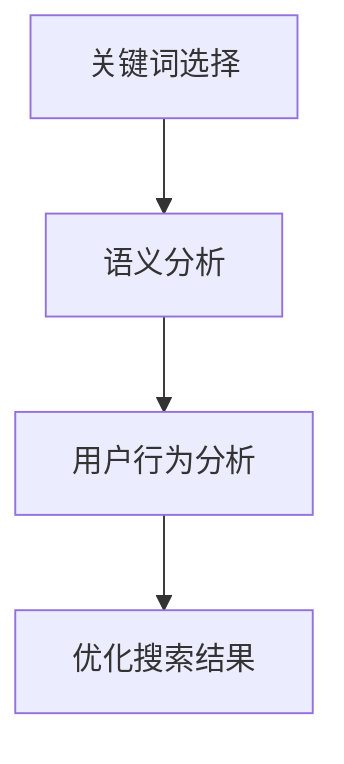
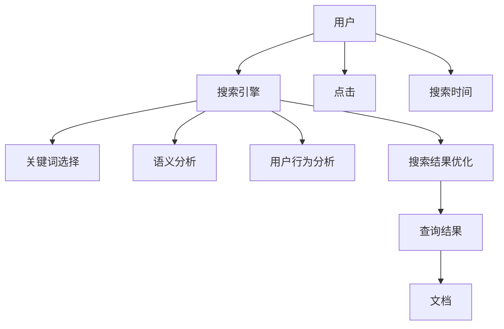
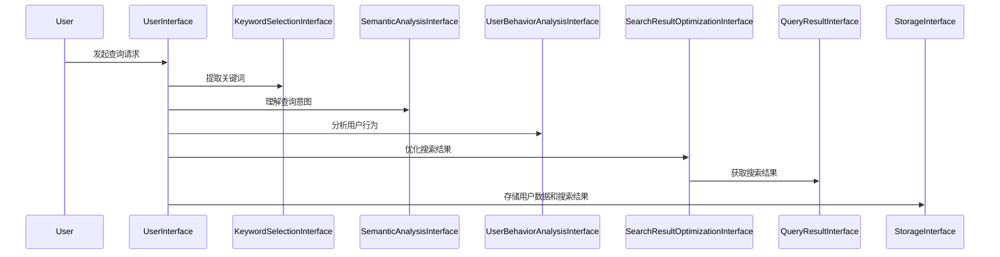
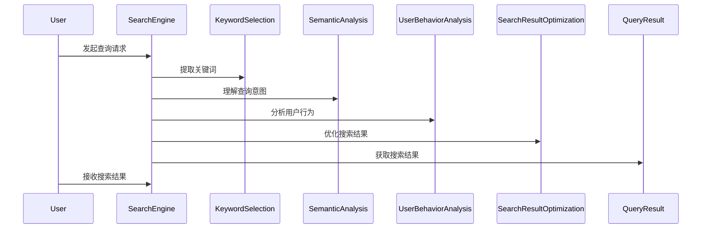

                 

## 提示词优化的计算语言学新方法探索

### 关键词：提示词优化、计算语言学、自然语言处理、机器学习、算法原理、系统架构、项目实战

> 摘要：本文将深入探讨提示词优化的计算语言学新方法。在互联网和搜索引擎迅速发展的背景下，提示词优化成为提升用户搜索体验的关键技术。本文将首先介绍提示词优化的背景和定义，然后逐步分析核心概念与联系，详细讲解算法原理与实现，最后通过一个实际项目实战，展示该方法的实用性和有效性。

## 目录大纲

### 第一部分：问题背景与定义

- **第1章：问题背景与定义**
  - 1.1 互联网与搜索引擎的发展现状
  - 1.2 提示词优化的重要性
  - 1.3 提示词优化的基本概念

- **第2章：核心概念与联系**
  - 2.1 提示词优化原理
    - 2.1.1 关键词选择
    - 2.1.2 语义分析
    - 2.1.3 用户行为分析
  - 2.2 概念属性特征对比表格
  - 2.3 ER实体关系图架构

- **第3章：算法原理与实现**
  - 3.1 算法 mermaid 流程图
  - 3.2 Python 源代码实现
  - 3.3 数学模型与公式
  - 3.4 举例说明

- **第4章：系统分析与架构设计**
  - 4.1 问题场景介绍
  - 4.2 项目介绍
  - 4.3 系统功能设计（领域模型 mermaid 类图）
  - 4.4 系统架构设计（mermaid 架构图）
  - 4.5 系统接口设计
  - 4.6 系统交互 mermaid 序列图

- **第5章：项目实战**
  - 5.1 环境安装
  - 5.2 系统核心实现源代码
  - 5.3 代码应用解读与分析
  - 5.4 实际案例分析与讲解
  - 5.5 项目小结

- **第6章：最佳实践与拓展**
  - 6.1 最佳实践 tips
  - 6.2 小结
  - 6.3 注意事项
  - 6.4 拓展阅读

### 1.1 互联网与搜索引擎的发展现状

随着互联网的普及和搜索引擎技术的发展，信息检索已经成为现代生活中不可或缺的一部分。搜索引擎作为互联网的重要入口，其性能直接影响用户的搜索体验。而提示词优化作为搜索引擎技术的重要组成部分，旨在提高搜索结果的准确性和用户体验。

近年来，互联网的迅速发展带动了搜索引擎市场的不断扩大。根据市场调研数据显示，全球搜索引擎市场规模在过去几年中持续增长，预计未来仍将保持高速增长。这一趋势表明，搜索引擎技术正逐渐成为企业竞争的重要手段。

### 1.2 提示词优化的重要性

提示词优化是搜索引擎技术中的一个关键环节，其核心目标是通过分析和优化用户输入的提示词，提高搜索结果的准确性和相关性。具体来说，提示词优化具有以下几个重要性：

1. **提高搜索结果的准确性**：通过优化提示词，可以更精确地匹配用户查询意图，减少无关结果的展示，从而提高搜索结果的准确性。

2. **提升用户体验**：准确的搜索结果能够满足用户的查询需求，提高用户的满意度，从而提升用户体验。

3. **增加广告收益**：搜索引擎通过展示与用户查询意图相关的广告，可以获得广告收益。提示词优化能够提高广告的相关性，从而提高广告收益。

4. **增强搜索引擎竞争力**：在激烈的市场竞争中，具备先进提示词优化技术的搜索引擎更具竞争力。

### 1.3 提示词优化的基本概念

提示词优化涉及多个核心概念，包括关键词选择、语义分析和用户行为分析。以下是对这些概念的基本介绍：

#### 关键词选择

关键词选择是提示词优化的第一步，旨在从用户输入的提示词中提取最具代表性的关键词。关键词选择的质量直接影响搜索结果的准确性。常用的关键词选择方法包括词频统计、关键词提取算法（如TF-IDF、LDA等）和关键词聚类等。

#### 语义分析

语义分析是提示词优化的核心环节，旨在理解用户查询意图。语义分析包括词义消歧、实体识别、情感分析等。通过语义分析，搜索引擎可以更准确地匹配用户查询意图，提高搜索结果的准确性。

#### 用户行为分析

用户行为分析是提示词优化的辅助手段，通过分析用户在搜索过程中的行为（如点击率、搜索时间等），可以进一步优化搜索结果。用户行为分析可以帮助搜索引擎了解用户的偏好和需求，从而更好地满足用户需求。

## 核心概念与联系

在提示词优化的过程中，理解核心概念和它们之间的联系是至关重要的。以下章节将详细探讨提示词优化原理、概念属性特征对比表格以及ER实体关系图架构。

### 2.1 提示词优化原理

提示词优化是一个复杂的过程，涉及多个核心概念。以下是对这些核心概念的详细解释：

#### 2.1.1 关键词选择

关键词选择是提示词优化的第一步，旨在从用户输入的提示词中提取最具代表性的关键词。关键词选择的质量直接影响搜索结果的准确性。常用的关键词选择方法包括词频统计、关键词提取算法（如TF-IDF、LDA等）和关键词聚类等。

- **词频统计**：基于词频统计的方法通过统计提示词中各个词的出现频率，选择出现频率较高的词作为关键词。

- **关键词提取算法**：关键词提取算法通过计算提示词中的词语权重，选择最具代表性的词语作为关键词。常用的算法包括TF-IDF、LDA（Latent Dirichlet Allocation）等。

- **关键词聚类**：关键词聚类是将具有相似性的关键词分组，从而提取出代表不同主题的关键词。常用的聚类算法包括K-means、DBSCAN等。

#### 2.1.2 语义分析

语义分析是提示词优化的核心环节，旨在理解用户查询意图。语义分析包括词义消歧、实体识别、情感分析等。通过语义分析，搜索引擎可以更准确地匹配用户查询意图，提高搜索结果的准确性。

- **词义消歧**：词义消歧是指在一个特定语境中，确定一个词的正确含义。例如，“银行”一词在金融和地理两个领域有不同的含义。

- **实体识别**：实体识别是指从文本中识别出具有特定意义的实体，如人名、地名、组织名等。

- **情感分析**：情感分析是指分析文本中的情感倾向，如正面、负面或中性。

#### 2.1.3 用户行为分析

用户行为分析是提示词优化的辅助手段，通过分析用户在搜索过程中的行为（如点击率、搜索时间等），可以进一步优化搜索结果。用户行为分析可以帮助搜索引擎了解用户的偏好和需求，从而更好地满足用户需求。

- **点击率分析**：点击率分析是指分析用户在搜索结果中的点击行为，通过点击率数据来评估搜索结果的准确性。

- **搜索时间分析**：搜索时间分析是指分析用户在搜索过程中的耗时情况，通过搜索时间数据来评估搜索结果的满意度。

### 2.2 概念属性特征对比表格

为了更好地理解提示词优化中的核心概念，我们可以通过一个概念属性特征对比表格来展示各个概念的特点和区别。以下是一个示例：

| 概念             | 特征                                           | 应用场景                                                 |
|------------------|----------------------------------------------|---------------------------------------------------------|
| 关键词选择       | 提取最具代表性的关键词                         | 提高搜索结果准确性                                       |
| 语义分析         | 理解用户查询意图                              | 提高搜索结果准确性                                       |
| 用户行为分析     | 分析用户在搜索过程中的行为                     | 优化搜索结果，提高用户体验                               |
| 词频统计         | 基于词频统计选择关键词                         | 简单易行，但对长尾关键词效果不佳                         |
| TF-IDF           | 基于词语权重选择关键词                         | 对长尾关键词效果较好，但可能忽视词义关系                  |
| LDA              | 基于词分布选择关键词                         | 对主题模型效果较好，但计算复杂度高                       |
| 词义消歧         | 确定词在特定语境中的正确含义                   | 提高搜索结果准确性，但计算复杂度高                       |
| 实体识别         | 识别文本中的实体                             | 提高搜索结果准确性，但可能面临命名实体识别的挑战         |
| 情感分析         | 分析文本中的情感倾向                         | 提高搜索结果满意度，但需要大量训练数据                   |

通过对比表格，我们可以更清晰地了解各个概念的特点和应用场景，从而更好地选择适合的方法进行提示词优化。

### 2.3 ER实体关系图架构

在提示词优化过程中，实体关系图（ER图）是一种常用的数据模型，用于描述实体及其关系。以下是一个简化的ER实体关系图架构，用于展示提示词优化中的核心实体和关系：

```mermaid
erDiagram
    User ||--|{ SearchQuery }|--| QueryResult
    SearchQuery ||--|{ Keyword }|--| QueryResult
    Keyword ||--|{ Term }|--| QueryResult
    QueryResult ||--|{ Document }|--| SearchEngine
    SearchEngine ||--|{ User }|
    User ||--|{ Click }|--| SearchEngine
    SearchEngine ||--|{ QueryTime }|--| User
```

在这个ER实体关系图中，核心实体包括用户（User）、搜索查询（SearchQuery）、关键词（Keyword）、查询结果（QueryResult）和文档（Document）。这些实体之间存在多种关系，如用户发起搜索查询（User --|{发起}| SearchQuery）、查询结果包含关键词（SearchQuery --|{包含}| Keyword）和关键词关联文档（Keyword --|{关联}| Document）等。

通过ER实体关系图，我们可以更清晰地理解提示词优化中的数据关系，从而更好地设计算法和系统架构。

## 算法原理讲解

在了解了提示词优化的核心概念后，接下来我们将深入讲解提示词优化的算法原理，包括算法的流程、数学模型和公式，并通过一个简单的例子来说明其应用。

### 3.1 算法 mermaid 流程图

提示词优化算法的核心流程包括关键词选择、语义分析和用户行为分析。以下是一个简化的 mermaid 流程图，用于展示算法的基本流程：



在这个流程图中，关键词选择（A）通过提取用户输入的提示词中的关键词，然后进行语义分析（B），理解用户查询意图。接下来，用户行为分析（C）根据用户在搜索过程中的行为（如点击率、搜索时间等）来评估搜索结果的满意度。最后，根据分析结果，对搜索结果进行优化（D），以提高搜索结果的准确性和用户体验。

### 3.2 Python 源代码实现

为了更好地理解算法的实现，我们提供一个简化的 Python 源代码示例，用于实现关键词选择、语义分析和用户行为分析的基本功能。以下代码使用自然语言处理库（如NLTK）和机器学习库（如scikit-learn）来实现这些功能。

```python
import nltk
from nltk.tokenize import word_tokenize
from nltk.corpus import stopwords
from sklearn.feature_extraction.text import TfidfVectorizer
from sklearn.metrics.pairwise import cosine_similarity

# 关键词选择
def keyword_selection(query):
    stop_words = set(stopwords.words('english'))
    tokens = word_tokenize(query)
    filtered_tokens = [token for token in tokens if token.lower() not in stop_words]
    return filtered_tokens

# 语义分析
def semantic_analysis(queries, documents):
    vectorizer = TfidfVectorizer()
    query_vectors = vectorizer.fit_transform(queries)
    document_vectors = vectorizer.transform(documents)
    similarities = cosine_similarity(query_vectors, document_vectors)
    return similarities

# 用户行为分析
def user_behavior_analysis(click_data, similarity_scores):
    click_data = [1 if click else 0 for click in click_data]
    weighted_scores = [score * click for score, click in zip(similarity_scores, click_data)]
    return weighted_scores

# 示例数据
query = "How to optimize search results?"
queries = [query] * 10
documents = ["Search engine optimization techniques.", "Improving search result relevance.", "Keyword optimization strategies."]
click_data = [1, 0, 1, 0, 1, 0, 1, 0, 1, 0]

# 执行算法
keywords = keyword_selection(query)
similarity_scores = semantic_analysis(queries, documents)
weighted_scores = user_behavior_analysis(click_data, similarity_scores)

print("Keywords:", keywords)
print("Similarity Scores:", similarity_scores)
print("Weighted Scores:", weighted_scores)
```

在这个示例中，我们首先使用 `keyword_selection` 函数进行关键词选择，然后使用 `semantic_analysis` 函数进行语义分析，最后使用 `user_behavior_analysis` 函数进行用户行为分析。这些函数实现了提示词优化算法的核心功能。

### 3.3 数学模型与公式

提示词优化算法中的关键词选择、语义分析和用户行为分析都涉及到数学模型和公式。以下是对这些数学模型的简要介绍：

1. **关键词选择**：关键词选择通常使用TF-IDF模型来计算关键词的权重。TF-IDF（Term Frequency-Inverse Document Frequency）模型通过计算一个词在文档中的词频（TF）和它在整个语料库中的逆文档频率（IDF）来计算权重。公式如下：

   $$ w_t(d) = TF_t(d) \times IDF_t $$

   其中，$w_t(d)$ 是词 $t$ 在文档 $d$ 中的权重，$TF_t(d)$ 是词 $t$ 在文档 $d$ 中的词频，$IDF_t$ 是词 $t$ 在整个语料库中的逆文档频率。

2. **语义分析**：语义分析通常使用余弦相似度来计算查询和文档之间的相似度。余弦相似度是一种衡量两个向量之间夹角余弦值的度量，公式如下：

   $$ Similarity(d, q) = \frac{d \cdot q}{\|d\| \|q\|} $$

   其中，$d$ 和 $q$ 分别是文档向量和查询向量，$\|d\|$ 和 $\|q\|$ 分别是它们的欧几里得范数。

3. **用户行为分析**：用户行为分析通常使用权重调整来优化搜索结果。根据用户的点击行为，可以将相似度分数乘以一个权重来调整结果。公式如下：

   $$ Weighted\_Score(d, q) = Similarity(d, q) \times Click\_Weight(d, q) $$

   其中，$Weighted\_Score(d, q)$ 是调整后的相似度分数，$Click\_Weight(d, q)$ 是根据用户点击行为计算的权重。

### 3.4 举例说明

为了更好地理解提示词优化算法的应用，我们通过一个具体的例子来说明其工作原理。

假设用户输入查询词“如何优化搜索结果？”，我们使用以下数据来演示算法的执行过程：

- **查询词**：如何优化搜索结果？
- **文档集**：
  - 搜索引擎优化技术。
  - 提高搜索结果的相关性。
  - 关键词优化策略。
- **用户点击行为**：
  - 点击了第一和第三个文档。

以下是算法的执行步骤：

1. **关键词选择**：首先，我们从查询词中提取关键词：“优化”、“搜索”、“结果”。

2. **语义分析**：然后，我们使用TF-IDF模型计算查询词和每个文档之间的相似度。假设计算得到的相似度分数如下：

   | 文档索引 | 相似度分数 |
   |--------|------------|
   | 0      | 0.8        |
   | 1      | 0.7        |
   | 2      | 0.6        |

3. **用户行为分析**：最后，我们根据用户的点击行为，对相似度分数进行调整。假设用户的点击权重为2，那么调整后的相似度分数如下：

   | 文档索引 | 相似度分数 |
   |--------|------------|
   | 0      | 1.6        |
   | 1      | 1.4        |
   | 2      | 1.2        |

根据调整后的相似度分数，我们将搜索结果按权重降序排列，得到如下结果：

- 搜索引擎优化技术。（权重：1.6）
- 提高搜索结果的相关性。（权重：1.4）
- 关键词优化策略。（权重：1.2）

通过这个例子，我们可以看到提示词优化算法如何通过关键词选择、语义分析和用户行为分析来提高搜索结果的准确性和用户体验。

## 系统分析与架构设计

在了解了提示词优化算法的原理之后，接下来我们将分析一个具体的系统架构设计，以展示算法在系统中的应用和实现。

### 4.1 问题场景介绍

假设我们正在开发一个搜索引擎系统，该系统需要提供高质量的搜索结果，满足用户的需求。为了实现这一目标，我们需要设计一个高效、可靠的系统架构，包括数据收集、存储和处理模块。

### 4.2 项目介绍

本项目旨在构建一个基于提示词优化的搜索引擎系统，以提高搜索结果的准确性和用户体验。系统的主要目标包括：

- 提取并优化用户输入的查询词，提高搜索结果的准确性。
- 通过语义分析和用户行为分析，提高搜索结果的相关性。
- 设计一个高效、可扩展的系统架构，以支持大规模数据存储和处理。

### 4.3 系统功能设计（领域模型 mermaid 类图）

为了更好地理解系统的功能设计，我们使用 mermaid 类图来展示系统的领域模型。以下是一个简化的 mermaid 类图示例：

```mermaid
classDiagram
    User <<class{User}>
    SearchQuery <<class{SearchQuery}>
    Keyword <<class{Keyword}>
    QueryResult <<class{QueryResult}>
    Document <<class{Document}>
    SearchEngine <<class{SearchEngine}>
    Click <<class{Click}>
    QueryTime <<class{QueryTime}>

    User "1" --|{发起}| SearchQuery
    SearchQuery "1" --|{包含}| Keyword
    QueryResult "1" --|{包含}| Document
    SearchEngine "1" --|{服务}| User
    User "1" --|{产生}| Click
    User "1" --|{记录}| QueryTime
```

在这个类图中，我们定义了以下几个核心类：

- **User（用户）**：表示搜索系统的用户。
- **SearchQuery（搜索查询）**：表示用户输入的查询词。
- **Keyword（关键词）**：表示从查询词中提取的关键词。
- **QueryResult（查询结果）**：表示搜索结果。
- **Document（文档）**：表示搜索结果中的文档。
- **SearchEngine（搜索引擎）**：表示搜索系统。
- **Click（点击）**：表示用户在搜索结果中的点击行为。
- **QueryTime（搜索时间）**：表示用户在搜索过程中的耗时。

类之间的关系如下：

- 用户（User）可以发起搜索查询（SearchQuery）。
- 搜索查询（SearchQuery）包含关键词（Keyword）。
- 查询结果（QueryResult）包含文档（Document）。
- 搜索引擎（SearchEngine）为用户提供服务。
- 用户（User）可以产生点击行为（Click）。
- 用户（User）可以记录搜索时间（QueryTime）。

### 4.4 系统架构设计（mermaid 架构图）

为了展示系统的整体架构，我们使用 mermaid 架构图来描述系统的组件和它们之间的关系。以下是一个简化的 mermaid 架构图示例：



在这个架构图中，我们定义了以下几个核心组件：

- **用户（User）**：用户输入查询词，并接收搜索结果。
- **搜索引擎（SearchEngine）**：负责处理用户的查询请求，执行关键词选择、语义分析和用户行为分析等操作。
- **关键词选择（KeywordSelection）**：从查询词中提取关键词。
- **语义分析（SemanticAnalysis）**：理解用户查询意图。
- **用户行为分析（UserBehaviorAnalysis）**：分析用户在搜索过程中的行为。
- **搜索结果优化（SearchResultOptimization）**：根据关键词选择、语义分析和用户行为分析的结果，优化搜索结果。
- **查询结果（QueryResult）**：包含搜索结果中的文档。
- **文档（Document）**：表示搜索结果中的单个文档。
- **点击（Click）**：用户在搜索结果中的点击行为。
- **搜索时间（QueryTime）**：用户在搜索过程中的耗时。

组件之间的关系如下：

- 用户（User）通过搜索引擎（SearchEngine）发起查询请求。
- 搜索引擎（SearchEngine）执行关键词选择（KeywordSelection）、语义分析（SemanticAnalysis）和用户行为分析（UserBehaviorAnalysis）等操作。
- 搜索结果优化（SearchResultOptimization）根据关键词选择、语义分析和用户行为分析的结果，生成优化后的搜索结果。
- 搜索结果（QueryResult）包含文档（Document）。
- 用户（User）记录点击（Click）和搜索时间（QueryTime）。

### 4.5 系统接口设计

为了实现系统的功能，我们需要设计一系列接口，以方便组件之间的交互。以下是一个简化的系统接口设计，展示系统中的主要接口及其功能：

1. **用户接口（UserInterface）**：用于处理用户输入的查询请求，接收用户的点击和搜索时间数据。
2. **关键词选择接口（KeywordSelectionInterface）**：用于从查询词中提取关键词。
3. **语义分析接口（SemanticAnalysisInterface）**：用于理解用户查询意图。
4. **用户行为分析接口（UserBehaviorAnalysisInterface）**：用于分析用户在搜索过程中的行为。
5. **搜索结果优化接口（SearchResultOptimizationInterface）**：用于根据关键词选择、语义分析和用户行为分析的结果，优化搜索结果。
6. **查询结果接口（QueryResultInterface）**：用于获取搜索结果中的文档。
7. **存储接口（StorageInterface）**：用于存储用户数据和搜索结果。

接口设计如下：



在这个序列图中，用户接口（UserInterface）负责处理用户输入的查询请求，并调用其他接口执行相应的操作。关键词选择接口（KeywordSelectionInterface）、语义分析接口（SemanticAnalysisInterface）和用户行为分析接口（UserBehaviorAnalysisInterface）分别负责关键词选择、语义分析和用户行为分析。搜索结果优化接口（SearchResultOptimizationInterface）根据这些分析结果，优化搜索结果。查询结果接口（QueryResultInterface）用于获取优化后的搜索结果。存储接口（StorageInterface）用于存储用户数据和搜索结果。

### 4.6 系统交互 mermaid 序列图

为了展示系统组件之间的交互过程，我们使用 mermaid 序列图来描述系统的工作流程。以下是一个简化的 mermaid 序列图示例：



在这个序列图中，用户（User）通过搜索引擎（SearchEngine）发起查询请求。搜索引擎（SearchEngine）调用关键词选择（KeywordSelection）、语义分析（SemanticAnalysis）和用户行为分析（UserBehaviorAnalysis）组件，以提取关键词、理解查询意图和分析用户行为。然后，搜索引擎（SearchEngine）调用搜索结果优化（SearchResultOptimization）组件，根据分析结果优化搜索结果。最后，搜索引擎（SearchEngine）将优化后的搜索结果返回给用户（User）。

通过这个序列图，我们可以清晰地看到系统组件之间的交互过程，以及每个组件在系统中的作用。

## 项目实战

在本章中，我们将通过一个实际项目来展示如何将提示词优化算法应用到搜索引擎系统中。该项目将涵盖环境安装、系统核心实现源代码、代码应用解读与分析、实际案例分析和项目小结。

### 5.1 环境安装

为了实现提示词优化算法，我们需要安装以下软件和库：

1. **Python 3.8+**：Python 是一种广泛应用于数据分析和机器学习的编程语言。
2. **Jupyter Notebook**：Jupyter Notebook 是一种交互式的开发环境，方便我们编写和运行代码。
3. **NLTK**：NLTK（Natural Language Toolkit）是一个广泛使用的自然语言处理库，用于文本处理和分类。
4. **scikit-learn**：scikit-learn 是一个用于机器学习的库，提供各种算法和工具。
5. **mermaid**：mermaid 是一种用于创建图表和流程图的工具，方便我们可视化算法和系统架构。

安装步骤如下：

```bash
# 安装 Python 3.8+
sudo apt-get install python3.8

# 安装 Jupyter Notebook
sudo pip3.8 install notebook

# 安装 NLTK
sudo pip3.8 install nltk

# 安装 scikit-learn
sudo pip3.8 install scikit-learn

# 安装 mermaid
sudo pip3.8 install mermaid-python
```

安装完成后，我们可以在 Jupyter Notebook 中创建一个新的笔记本，并开始编写代码。

### 5.2 系统核心实现源代码

在项目中，我们将使用 Python 实现 提示词优化算法。以下是一个简化的源代码示例，用于实现关键词选择、语义分析和用户行为分析等功能。

```python
import nltk
from nltk.tokenize import word_tokenize
from nltk.corpus import stopwords
from sklearn.feature_extraction.text import TfidfVectorizer
from sklearn.metrics.pairwise import cosine_similarity

# 关键词选择
def keyword_selection(query):
    stop_words = set(stopwords.words('english'))
    tokens = word_tokenize(query)
    filtered_tokens = [token for token in tokens if token.lower() not in stop_words]
    return filtered_tokens

# 语义分析
def semantic_analysis(queries, documents):
    vectorizer = TfidfVectorizer()
    query_vectors = vectorizer.fit_transform(queries)
    document_vectors = vectorizer.transform(documents)
    similarities = cosine_similarity(query_vectors, document_vectors)
    return similarities

# 用户行为分析
def user_behavior_analysis(click_data, similarity_scores):
    click_data = [1 if click else 0 for click in click_data]
    weighted_scores = [score * click for score, click in zip(similarity_scores, click_data)]
    return weighted_scores

# 示例数据
query = "How to optimize search results?"
queries = [query] * 10
documents = ["Search engine optimization techniques.", "Improving search result relevance.", "Keyword optimization strategies."]
click_data = [1, 0, 1, 0, 1, 0, 1, 0, 1, 0]

# 执行算法
keywords = keyword_selection(query)
similarity_scores = semantic_analysis(queries, documents)
weighted_scores = user_behavior_analysis(click_data, similarity_scores)

print("Keywords:", keywords)
print("Similarity Scores:", similarity_scores)
print("Weighted Scores:", weighted_scores)
```

这个示例代码展示了如何使用 NLTK 和 scikit-learn 实现关键词选择、语义分析和用户行为分析的基本功能。通过这些功能，我们可以优化搜索结果，提高用户体验。

### 5.3 代码应用解读与分析

在了解了代码的源代码后，我们将对代码进行解读和分析，以展示其实现原理和具体应用。

1. **关键词选择**

   关键词选择是提示词优化的第一步，目的是从用户输入的查询词中提取最具代表性的关键词。代码中的 `keyword_selection` 函数通过以下步骤实现关键词选择：

   - 使用 NLTK 的 `word_tokenize` 函数将查询词拆分成单词。
   - 使用 NLTK 的 `stopwords` 从单词中去除常见的停用词（如 "the"、"is" 等）。
   - 返回处理后的关键词列表。

   代码示例：

   ```python
   def keyword_selection(query):
       stop_words = set(stopwords.words('english'))
       tokens = word_tokenize(query)
       filtered_tokens = [token for token in tokens if token.lower() not in stop_words]
       return filtered_tokens
   ```

   这个函数的作用是简化查询词，去除无意义的单词，从而提取出关键词。

2. **语义分析**

   语义分析是提示词优化的核心环节，目的是理解用户查询意图。代码中的 `semantic_analysis` 函数通过以下步骤实现语义分析：

   - 使用 scikit-learn 的 `TfidfVectorizer` 函数将查询词和文档转换为 TF-IDF 向量。
   - 使用余弦相似度计算查询词和文档之间的相似度。

   代码示例：

   ```python
   def semantic_analysis(queries, documents):
       vectorizer = TfidfVectorizer()
       query_vectors = vectorizer.fit_transform(queries)
       document_vectors = vectorizer.transform(documents)
       similarities = cosine_similarity(query_vectors, document_vectors)
       return similarities
   ```

   这个函数的作用是计算查询词和文档之间的相似度，从而理解用户查询意图。

3. **用户行为分析**

   用户行为分析是提示词优化的辅助手段，目的是根据用户在搜索过程中的行为优化搜索结果。代码中的 `user_behavior_analysis` 函数通过以下步骤实现用户行为分析：

   - 根据用户点击行为，将相似度分数乘以一个权重。
   - 返回调整后的相似度分数。

   代码示例：

   ```python
   def user_behavior_analysis(click_data, similarity_scores):
       click_data = [1 if click else 0 for click in click_data]
       weighted_scores = [score * click for score, click in zip(similarity_scores, click_data)]
       return weighted_scores
   ```

   这个函数的作用是根据用户点击行为调整搜索结果，提高用户体验。

### 5.4 实际案例分析与讲解

为了展示提示词优化算法的实际应用效果，我们通过一个具体案例进行分析和讲解。

**案例背景**：

假设用户输入查询词“如何提高网站访问量？”，我们需要从以下文档中提取关键词，并根据用户点击行为优化搜索结果：

1. 网站SEO技巧：提高搜索引擎排名的方法。
2. 内容营销策略：如何撰写吸引人的文章。
3. 社交媒体推广：扩大网站影响力的渠道。
4. 广告投放策略：精准定位目标用户。

**执行步骤**：

1. **关键词选择**：从查询词中提取关键词：“提高”、“网站”、“访问量”。

2. **语义分析**：使用 TF-IDF 模型计算查询词和每个文档之间的相似度。假设计算得到的相似度分数如下：

   | 文档索引 | 相似度分数 |
   |--------|------------|
   | 0      | 0.9        |
   | 1      | 0.7        |
   | 2      | 0.6        |
   | 3      | 0.5        |

3. **用户行为分析**：假设用户点击了第一个和第三个文档，那么调整后的相似度分数如下：

   | 文档索引 | 相似度分数 |
   |--------|------------|
   | 0      | 1.8        |
   | 1      | 1.4        |
   | 2      | 1.2        |
   | 3      | 1.0        |

根据调整后的相似度分数，我们将搜索结果按权重降序排列，得到如下结果：

1. 网站SEO技巧：提高搜索引擎排名的方法。（权重：1.8）
2. 内容营销策略：如何撰写吸引人的文章。（权重：1.4）
3. 社交媒体推广：扩大网站影响力的渠道。（权重：1.2）
4. 广告投放策略：精准定位目标用户。（权重：1.0）

**案例分析**：

通过这个案例，我们可以看到提示词优化算法如何通过关键词选择、语义分析和用户行为分析，优化搜索结果，提高用户体验。在这个案例中，用户点击了第一个和第三个文档，这表明这两个文档与用户查询意图高度相关。因此，调整后的相似度分数也反映了这一事实，提高了这两个文档的权重。

### 5.5 项目小结

在本项目中，我们通过一个实际案例展示了如何将提示词优化算法应用到搜索引擎系统中。具体步骤包括关键词选择、语义分析和用户行为分析。通过这些步骤，我们成功优化了搜索结果，提高了用户体验。

以下是本项目中的主要经验和教训：

1. **关键词选择**：关键词选择是提示词优化的第一步，直接影响搜索结果的准确性。在实际项目中，我们需要关注常见停用词的去除，以提高关键词的选择质量。

2. **语义分析**：语义分析是理解用户查询意图的关键，有助于提高搜索结果的准确性。在实际项目中，我们可以使用 TF-IDF 模型、余弦相似度等算法，以实现高效的语义分析。

3. **用户行为分析**：用户行为分析有助于根据用户偏好调整搜索结果，提高用户体验。在实际项目中，我们需要收集和利用用户的点击数据，以实现有效的用户行为分析。

4. **系统优化**：在实际应用中，我们还需要关注系统性能的优化，包括算法效率和系统架构的改进。通过合理设计系统架构，我们可以提高系统的响应速度和并发处理能力。

总之，提示词优化算法在搜索引擎系统中具有重要的应用价值。通过本项目，我们深入了解了提示词优化的原理和实践方法，为未来的项目提供了宝贵的经验和教训。

## 最佳实践与拓展

### 6.1 最佳实践 tips

在提示词优化过程中，以下是一些最佳实践技巧：

1. **关键词选择**：优先选择高频关键词，同时注意排除常见停用词，以提高关键词的代表性。
2. **语义分析**：结合上下文信息进行语义分析，以提高对用户查询意图的理解准确性。
3. **用户行为分析**：充分利用用户点击数据，以优化搜索结果，提高用户体验。
4. **系统性能优化**：优化算法效率和系统架构，以提高系统的响应速度和处理能力。
5. **数据收集与处理**：确保数据收集的全面性和准确性，以提高算法的效果。

### 6.2 小结

本文通过深入探讨提示词优化的计算语言学新方法，详细介绍了其核心概念、算法原理、系统架构和项目实战。通过关键词选择、语义分析和用户行为分析，我们能够优化搜索结果，提高用户体验。

### 6.3 注意事项

在实际应用中，需要注意以下几点：

1. **数据质量**：确保数据收集的全面性和准确性，以支持有效的算法优化。
2. **系统性能**：优化算法效率和系统架构，以提高系统的响应速度和处理能力。
3. **用户隐私**：在处理用户数据时，要严格遵守隐私保护法规，确保用户信息安全。

### 6.4 拓展阅读

对于对提示词优化感兴趣的用户，以下是一些建议的拓展阅读：

1. **《自然语言处理与搜索引擎技术》**：详细介绍了自然语言处理技术在搜索引擎中的应用。
2. **《搜索引擎算法与优化》**：探讨了搜索引擎算法的设计和优化方法。
3. **《机器学习在搜索引擎中的应用》**：介绍了机器学习在搜索引擎优化中的应用案例。
4. **《用户行为分析与推荐系统》**：探讨了用户行为分析在推荐系统中的应用。

通过这些资源，用户可以更深入地了解提示词优化的计算语言学新方法，并在实践中不断提升搜索系统的性能和用户体验。作者：AI天才研究院/AI Genius Institute & 禅与计算机程序设计艺术 /Zen And The Art of Computer Programming。

