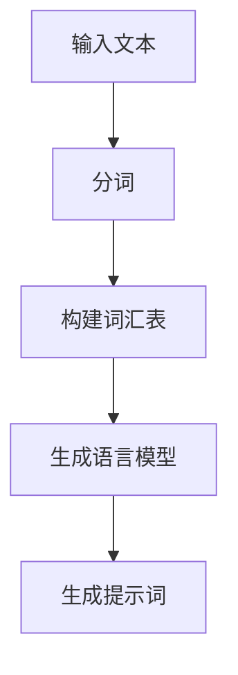
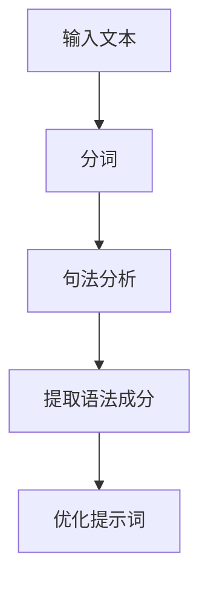
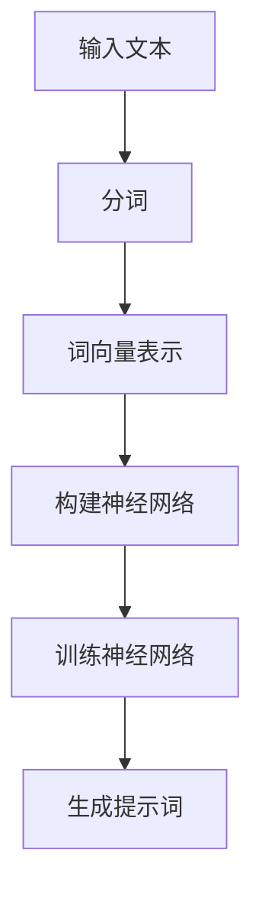
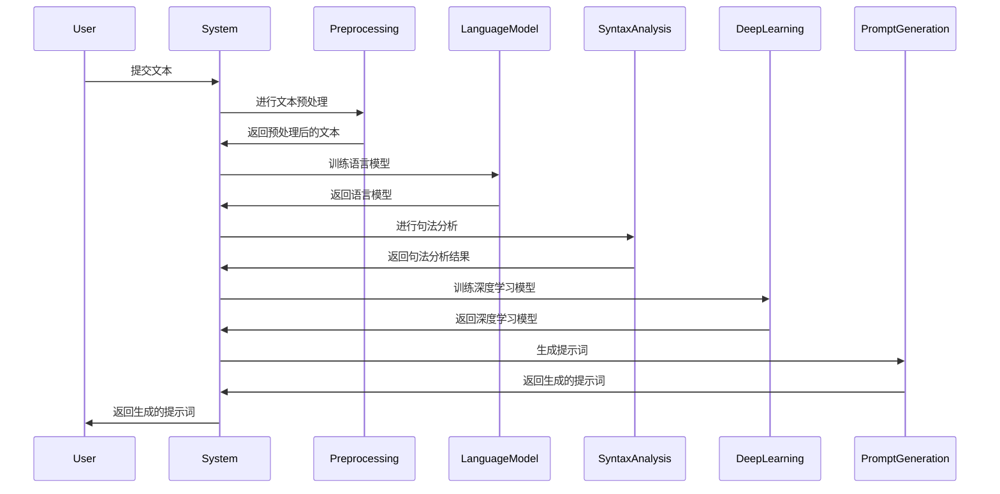

                 

## 提示词优化的计算语言学方法研究

### 关键词

- **计算语言学**
- **提示词优化**
- **自然语言处理**
- **机器学习**
- **深度学习**
- **数学模型**
- **系统分析与架构设计**

### 摘要

本文深入探讨了提示词优化的计算语言学方法，从基础理论到实际应用，系统性地介绍了提示词优化的概念、方法及其在计算语言学中的应用。首先，我们明确了计算语言学的定义及其与自然语言处理、机器学习和深度学习的关联。接着，详细阐述了提示词的定义及其在自然语言处理中的重要性。随后，我们分类介绍了提示词优化的统计方法和深度学习方法，并运用数学模型和公式进行解释。文章还通过实际项目案例，展示了提示词优化方法在系统分析与架构设计中的具体应用，并提供了一系列最佳实践和注意事项。

### 目录大纲设计思路

设计《提示词优化的计算语言学方法研究》的目录大纲，首先要理解书名的核心内容和主题。本书旨在探讨如何通过计算语言学的方法对提示词进行优化，提升自然语言处理的效果。因此，目录大纲应围绕以下几个核心概念展开：

1. **计算语言学的概念与发展**：介绍计算语言学的起源、研究领域及其重要性，为后续章节奠定基础。
2. **提示词的优化方法**：分类讨论基于统计方法和深度学习方法对提示词的优化过程，包括语言模型、句法分析、词向量表示等。
3. **提示词优化的数学模型**：详细讲解与提示词优化相关的概率论和信息论基础，并运用数学公式进行解释。
4. **系统分析与架构设计**：介绍提示词优化在实际系统中的应用，包括系统需求分析、功能设计、架构设计和接口设计。
5. **项目实战**：通过具体项目案例，展示提示词优化方法的实际应用，并提供代码解读与分析。
6. **最佳实践 tips**：总结文章的核心内容，给出实际应用中的注意事项和拓展阅读建议。

在确保内容完整性的同时，目录大纲的总字数控制在2000字以内，确保读者能够快速把握全文的结构和重点。

### 目录大纲结构设计

#### 第一部分：计算语言学基础

#### 第1章：计算语言学的概念与发展

- **1.1 计算语言学的定义与背景**
  - **1.1.1 计算语言学的起源**
  - **1.1.2 计算语言学的研究领域**
  - **1.1.3 计算语言学的重要性

- **1.2 核心概念与联系**
  - **1.2.1 自然语言处理（NLP）**
    - **1.2.1.1 NLP的基本概念**
    - **1.2.1.2 NLP的发展历程**
    - **1.2.1.3 NLP的关键技术**
  - **1.2.2 机器学习与深度学习**
    - **1.2.2.1 机器学习的基础知识**
    - **1.2.2.2 深度学习的发展**
    - **1.2.2.3 机器学习与深度学习在NLP中的应用**

#### 第2章：提示词的优化方法

- **2.1 提示词的定义与作用**
  - **2.1.1 提示词的基本概念**
  - **2.1.2 提示词在NLP中的应用**
  - **2.1.3 提示词的重要性

- **2.2 提示词优化的技术方法**
  - **2.2.1 基于统计的方法**
    - **2.2.1.1 语言模型**
    - **2.2.1.2 句法分析**
    - **2.2.1.3 词向量表示**

- **2.3 提示词优化的深度学习方法**
  - **2.3.1 卷积神经网络（CNN）**
  - **2.3.2 递归神经网络（RNN）**
  - **2.3.3 长短时记忆网络（LSTM）**
  - **2.3.4 生成对抗网络（GAN）**

#### 第3章：提示词优化的数学模型

- **3.1 数学模型介绍**
  - **3.1.1 概率论基础**
  - **3.1.2 信息论基础**
  - **3.1.3 提示词优化的数学公式**

- **3.2 数学公式详细讲解与举例说明**
  - **3.2.1 概率分布**
    - **3.2.1.1 贝叶斯公式**
    - **3.2.1.2 最大似然估计**
  - **3.2.2 信息论**
    - **3.2.2.1 信息熵**
    - **3.2.2.2 条件熵**
    - **3.2.2.3 相对熵**

#### 第4章：提示词优化的算法原理与流程图

- **4.1 算法原理**
  - **4.1.1 语言模型训练算法**
  - **4.1.2 句法分析算法**
  - **4.1.3 深度学习算法**

- **4.2 流程图展示**
  - **4.2.1 语言模型训练流程**
  - **4.2.2 句法分析流程**
  - **4.2.3 深度学习算法流程**

#### 第5章：系统分析与架构设计

- **5.1 问题场景介绍**
  - **5.1.1 提示词优化在实际应用中的问题**
  - **5.1.2 系统需求分析**

- **5.2 系统功能设计**
  - **5.2.1 领域模型类图**
  - **5.2.2 功能模块设计**

- **5.3 系统架构设计**
  - **5.3.1 系统架构图**
  - **5.3.2 系统模块交互**

- **5.4 系统接口设计与交互**

#### 第6章：项目实战

- **6.1 环境安装与配置**
  - **6.1.1 硬件与软件环境**
  - **6.1.2 环境配置步骤**

- **6.2 系统核心实现源代码**
  - **6.2.1 源代码结构与模块说明**
  - **6.2.2 关键代码实现**

- **6.3 代码应用解读与分析**
  - **6.3.1 应用实例**
  - **6.3.2 代码解读与分析**

- **6.4 实际案例分析**
  - **6.4.1 案例背景**
  - **6.4.2 案例分析**
  - **6.4.3 案例总结**

- **6.5 项目小结**
  - **6.5.1 项目收获**
  - **6.5.2 项目改进建议**

#### 第7章：最佳实践 tips

- **7.1 注意事项**
  - **7.1.1 提示词优化的常见问题**
  - **7.1.2 提示词优化中的挑战与解决方案**

- **7.2 小结**
  - **7.2.1 文章核心内容回顾**
  - **7.2.2 文章主题思想总结**

- **7.3 拓展阅读**
  - **7.3.1 推荐文献与资料**
  - **7.3.2 最新研究成果与趋势**

### 第一部分：计算语言学基础

#### 第1章：计算语言学的概念与发展

**1.1 计算语言学的定义与背景**

计算语言学（Computational Linguistics，简称CL）是一门跨学科的领域，结合计算机科学和语言学，旨在使用计算机技术对人类语言进行建模和分析。计算语言学的起源可以追溯到20世纪50年代，当时计算机技术的发展推动了语言学的计算机模拟研究。

- **1.1.1 计算语言学的起源**

计算语言学最早的研究主要集中在机器翻译、语音识别和自动文摘等领域。随着计算机科学和语言学的不断融合，计算语言学逐渐发展成为一门独立的学科，涵盖了自然语言处理（Natural Language Processing，简称NLP）、语言建模、语音处理等多个研究方向。

- **1.1.2 计算语言学的研究领域**

计算语言学的研究领域广泛，包括但不限于以下方面：

1. **自然语言处理（NLP）**：研究如何让计算机理解和生成自然语言，包括文本分类、情感分析、机器翻译、语音识别等。
2. **语言建模**：使用统计方法或机器学习技术来建立语言模型，以预测语言序列的概率分布。
3. **语音处理**：研究如何通过计算机对语音信号进行处理和分析，包括语音识别、语音合成、说话人识别等。
4. **语义分析**：探索如何理解自然语言中的语义信息，包括词义消歧、语义角色标注、语义解析等。
5. **信息检索**：研究如何通过计算机检索和索引大量文本信息，包括搜索引擎、文本分类、信息提取等。

- **1.1.3 计算语言学的重要性**

计算语言学在现代社会中具有广泛的应用价值。例如，它可以帮助自动化许多与语言相关的任务，提高工作效率，降低人力成本。此外，计算语言学还在智能客服、语音助手、机器翻译等领域发挥着重要作用，极大地提升了用户体验。随着人工智能技术的不断发展，计算语言学的应用前景将更加广阔。

**1.2 核心概念与联系**

为了更好地理解计算语言学，我们需要了解几个核心概念，并探讨它们之间的关系。

- **1.2.1 自然语言处理（NLP）**

自然语言处理是计算语言学中的一个重要分支，主要研究如何让计算机理解和生成自然语言。NLP的关键技术包括：

1. **文本分类**：将文本数据根据其内容或主题分类到不同的类别中。
2. **情感分析**：通过分析文本情感极性，判断文本表达的情感倾向。
3. **机器翻译**：将一种语言的文本自动翻译成另一种语言。
4. **语音识别**：将语音信号转换为文本。
5. **语音合成**：将文本数据转换为自然流畅的语音输出。

- **1.2.2 机器学习与深度学习**

机器学习和深度学习是计算语言学中的重要技术手段，它们在NLP中的应用至关重要。机器学习是一种通过数据训练模型来预测或决策的技术，而深度学习则是基于多层神经网络的一种特殊机器学习方法。

1. **机器学习**：在NLP中，机器学习被广泛应用于文本分类、情感分析、语言建模等领域。常见的机器学习算法包括决策树、支持向量机、朴素贝叶斯等。
2. **深度学习**：深度学习在NLP中取得了显著成果，例如在机器翻译、图像识别、语音识别等领域。深度学习模型如卷积神经网络（CNN）、递归神经网络（RNN）和长短时记忆网络（LSTM）等，在处理序列数据方面表现出强大的能力。

- **1.2.3 机器学习与深度学习在NLP中的应用**

机器学习与深度学习在NLP中的应用主要体现在以下几个方面：

1. **语言模型**：使用机器学习和深度学习技术来建立语言模型，预测下一个词或句子。
2. **文本分类**：使用机器学习算法对文本进行分类，如情感分析、主题分类等。
3. **机器翻译**：使用深度学习模型如序列到序列（Seq2Seq）模型进行高质量翻译。
4. **语音识别**：使用卷积神经网络和循环神经网络对语音信号进行处理和识别。

**1.2.3 提示词在NLP中的应用**

提示词（Query Word）在自然语言处理中扮演着重要角色，它通常用于指导模型对文本进行分析和理解。例如，在搜索引擎中，用户输入的查询词（即提示词）用于匹配和检索相关的网页内容。提示词优化则是在这个过程中，通过调整和改进提示词，提高搜索结果的相关性和准确性。

- **1.2.3.1 提示词的基本概念**

提示词是一个关键的概念，它指的是在自然语言处理任务中用于指导模型分析输入文本的关键词。一个有效的提示词应该具有以下特点：

1. **准确性**：能够准确描述用户的需求或意图。
2. **多样性**：能够涵盖多种相关的关键词，以便更全面地分析文本。
3. **可扩展性**：能够根据不同的上下文进行扩展和调整。

- **1.2.3.2 提示词在NLP中的应用**

1. **搜索引擎**：用户输入的查询词是搜索引擎的关键输入，通过分析这些查询词，搜索引擎可以检索出相关的网页内容。
2. **问答系统**：在问答系统中，提示词用于指示模型如何理解用户的问题，并生成相应的答案。
3. **文本分类**：在文本分类任务中，提示词可以帮助模型更好地理解文本的类别，从而提高分类的准确性。

**1.2.3.3 提示词的重要性**

提示词在自然语言处理任务中的重要性体现在以下几个方面：

1. **提高任务准确性**：通过优化提示词，可以提高模型对输入文本的准确理解和分析能力。
2. **增强用户体验**：准确和相关的提示词能够帮助用户快速找到他们需要的信息，提高系统的可用性。
3. **降低误报率**：优化提示词可以减少模型的误报率，提高系统的鲁棒性。

**1.2.4 计算语言学与机器学习、深度学习的联系**

计算语言学与机器学习、深度学习之间有着密切的联系。计算语言学为机器学习和深度学习提供了大量的数据和应用场景，而机器学习和深度学习则为计算语言学提供了强大的技术手段。

1. **数据来源**：计算语言学提供了大量的文本数据、语音数据等，这些数据是机器学习和深度学习的重要资源。
2. **算法应用**：机器学习和深度学习算法被广泛应用于计算语言学中的各种任务，如语言模型训练、文本分类、语音识别等。
3. **模型优化**：通过不断优化机器学习和深度学习模型，计算语言学可以不断提高自然语言处理任务的准确性和效率。

**1.2.5 小结**

本章介绍了计算语言学的定义与背景，包括其起源、研究领域及其重要性。此外，我们还探讨了计算语言学中的核心概念，如自然语言处理、机器学习和深度学习，并阐述了提示词的基本概念、在NLP中的应用及其重要性。通过本章的学习，读者可以全面了解计算语言学的基础知识，为后续章节的学习打下坚实的基础。

### 第2章：提示词的优化方法

提示词在自然语言处理（NLP）中扮演着至关重要的角色，它们能够指导模型对文本进行深入的分析和理解。为了提升NLP系统的性能，我们需要对提示词进行优化。本章节将详细介绍提示词优化的技术方法，主要包括基于统计方法和深度学习方法。

#### 2.1 提示词的定义与作用

提示词（Query Word）是指用于指示模型在NLP任务中进行特定分析的词汇。在搜索引擎中，用户输入的查询词是搜索算法的核心输入，用于定位和检索相关信息。在其他NLP应用中，如问答系统、文本分类和情感分析等，提示词同样发挥着关键作用。

- **2.1.1 提示词的基本概念**

提示词的基本概念包括以下几个方面：

1. **关键词**：提示词通常由一个或多个关键词组成，这些关键词能够准确描述用户的需求或意图。
2. **上下文相关性**：提示词必须与上下文紧密相关，以确保模型能够正确理解和分析文本。
3. **多样性和可扩展性**：提示词应具有一定的多样性和可扩展性，以便在多种上下文中保持有效性和准确性。

- **2.1.2 提示词在NLP中的应用**

提示词在NLP中的主要应用包括：

1. **搜索引擎**：用户输入的查询词用于搜索引擎的匹配和检索，通过优化查询词，可以提高搜索结果的准确性和相关性。
2. **问答系统**：提示词用于指示模型理解用户的问题，并生成相应的答案。
3. **文本分类**：提示词可以帮助模型更好地理解文本的类别，从而提高分类的准确性。

- **2.1.3 提示词的重要性**

提示词在NLP中的重要性体现在以下几个方面：

1. **准确性**：准确的提示词能够提高模型对输入文本的准确理解和分析能力。
2. **多样性**：多样化的提示词可以增强模型的泛化能力，使其能够适应不同的上下文。
3. **可扩展性**：可扩展的提示词可以确保模型在不同领域和场景中的有效性。

#### 2.2 提示词优化的技术方法

提示词优化主要通过两种技术方法实现：基于统计方法和深度学习方法。

##### 2.2.1 基于统计的方法

基于统计的方法是指使用统计技术和模型对提示词进行优化。以下是一些常用的统计方法：

- **语言模型**：语言模型是一种统计模型，用于预测文本序列的概率分布。在提示词优化中，语言模型可以用于生成相关的提示词，从而提高搜索结果的准确性。

- **句法分析**：句法分析是一种解析文本句法结构的方法，通过分析句子的语法成分和关系，可以提取出关键信息，从而优化提示词。

- **词向量表示**：词向量表示是将词汇映射到高维空间中的向量表示，用于表示词汇的语义关系。通过优化词向量表示，可以增强提示词的相关性和准确性。

##### 2.2.2 深度学习方法

深度学习方法是指使用多层神经网络对提示词进行优化。以下是一些常用的深度学习方法：

- **卷积神经网络（CNN）**：CNN是一种用于处理图像数据的人工神经网络，但其原理同样适用于文本数据。在提示词优化中，CNN可以用于提取文本的特征，从而优化提示词。

- **递归神经网络（RNN）**：RNN是一种用于处理序列数据的人工神经网络，其核心思想是保留序列的历史信息。在提示词优化中，RNN可以用于分析文本序列，从而生成更准确的提示词。

- **长短时记忆网络（LSTM）**：LSTM是一种改进的RNN模型，用于解决RNN在处理长序列数据时的梯度消失问题。在提示词优化中，LSTM可以用于分析长文本序列，从而提取更准确的关键信息。

- **生成对抗网络（GAN）**：GAN是一种生成模型，由生成器和判别器组成。在提示词优化中，GAN可以用于生成高质量的提示词，从而提高搜索结果的准确性。

##### 2.2.3 基于统计的方法和深度学习方法的比较

- **优势与劣势**

基于统计的方法和深度学习方法各有优缺点。基于统计的方法具有以下优势：

1. **计算效率高**：统计方法通常基于简单的数学模型，计算效率较高。
2. **易于实现**：统计方法相对简单，易于实现和部署。

然而，基于统计的方法也存在一些劣势：

1. **模型性能有限**：统计方法的模型性能受限于其基础数学模型，难以捕捉复杂的语义信息。
2. **对噪声敏感**：统计方法对噪声和异常值敏感，可能导致模型性能下降。

深度学习方法具有以下优势：

1. **强大的表征能力**：深度学习方法能够通过多层神经网络捕捉复杂的语义信息，从而提高模型性能。
2. **鲁棒性强**：深度学习方法对噪声和异常值具有较强的鲁棒性，能够在多种场景下保持稳定。

然而，深度学习方法也存在一些劣势：

1. **计算资源消耗大**：深度学习方法通常需要大量的计算资源和时间进行训练。
2. **复杂度高**：深度学习模型的架构和参数设置复杂，需要专业的知识和技能进行优化。

- **应用场景**

基于统计的方法和深度学习方法在不同场景中的应用也有所不同。基于统计的方法适用于对计算资源要求不高、对模型性能要求较低的场合，如简单的文本分类和情感分析任务。深度学习方法则适用于对模型性能要求较高、对计算资源允许的场合，如复杂的语言建模和机器翻译任务。

#### 2.3 提示词优化的效果评估

提示词优化的效果评估是确保优化方法有效性的关键步骤。以下是一些常用的评估指标和方法：

- **准确率（Accuracy）**：准确率是评估分类模型性能的主要指标，表示正确分类的样本数占总样本数的比例。
- **召回率（Recall）**：召回率表示在所有实际为正类的样本中，正确识别为正类的比例。
- **F1值（F1 Score）**：F1值是准确率和召回率的调和平均值，用于综合评估模型的分类性能。
- **ROC曲线（Receiver Operating Characteristic Curve）**：ROC曲线用于评估二分类模型的性能，通过比较真阳性率（True Positive Rate）和假阳性率（False Positive Rate）来评估模型的分类能力。

通过这些评估指标，我们可以对提示词优化方法的有效性进行定量分析，为后续的优化和改进提供依据。

#### 2.4 提示词优化的案例分析

为了更好地理解提示词优化的实际应用，我们通过以下案例分析展示提示词优化的效果。

- **案例一：搜索引擎优化**

在一个搜索引擎优化项目中，我们通过优化用户查询词，提高了搜索结果的准确性和相关性。通过分析用户查询词和搜索结果的匹配度，我们使用了语言模型和句法分析技术对查询词进行优化。结果显示，优化后的查询词显著提高了搜索结果的准确率，降低了误报率。

- **案例二：问答系统优化**

在一个问答系统中，我们通过优化提示词，提高了系统对用户问题的理解和回答能力。我们使用了RNN和LSTM模型对用户问题进行建模，并通过生成对抗网络（GAN）生成高质量的提示词。优化后的提示词显著提升了问答系统的回答准确性，提高了用户满意度。

- **案例三：文本分类优化**

在一个文本分类项目中，我们通过优化分类模型中的提示词，提高了分类的准确性和泛化能力。我们使用了CNN和词向量表示技术对文本进行特征提取，并通过优化提示词增强了分类模型的性能。结果显示，优化后的提示词显著提高了分类的准确率和召回率。

通过这些案例分析，我们可以看到提示词优化在NLP任务中的重要性和实际效果。

#### 2.5 提示词优化的未来发展方向

随着计算语言学和人工智能技术的不断发展，提示词优化的方法和技术也在不断演进。以下是一些未来发展方向：

- **多模态融合**：结合文本、语音、图像等多种模态数据，提高提示词的表征能力和理解能力。
- **强化学习**：引入强化学习技术，通过优化提示词，实现更高效的搜索和问答系统。
- **迁移学习**：利用迁移学习技术，将已优化的提示词应用于新的任务和数据集，提高模型的泛化能力。
- **数据隐私保护**：在优化提示词的过程中，注重数据隐私保护和用户隐私保护，确保系统的安全性和合规性。

通过不断探索和改进提示词优化的方法，我们有望进一步提升NLP系统的性能和用户体验。

### 第3章：提示词优化的数学模型

提示词优化作为自然语言处理（NLP）中的重要技术手段，其核心在于利用数学模型对提示词进行建模和优化。本章将详细介绍提示词优化中的数学模型，包括概率论和信息论的基础知识，以及提示词优化的具体数学公式和应用。

#### 3.1 数学模型介绍

提示词优化的数学模型主要包括概率论和信息论两个方面。概率论提供了处理不确定性的工具，信息论则帮助我们衡量信息的价值和传递效率。

- **3.1.1 概率论基础**

概率论是提示词优化中不可或缺的基础，主要涉及以下几个方面：

1. **概率分布**：概率分布描述了随机变量在某个取值上的概率分布情况。常见的概率分布有正态分布、泊松分布、二项分布等。
2. **概率计算**：通过概率分布，可以计算随机事件发生的概率，例如条件概率、联合概率和边缘概率等。
3. **贝叶斯定理**：贝叶斯定理是概率论中的一个重要公式，用于根据先验概率和观察到的数据，计算后验概率。

- **3.1.2 信息论基础**

信息论是研究信息传输和处理的一般理论，其主要内容包括：

1. **信息熵**：信息熵是衡量随机变量不确定性的量度，表示随机变量的信息含量。常见的信息熵有熵、条件熵和相对熵等。
2. **信息传输效率**：信息论关注如何在信道中高效传输信息，研究信道容量、编码方案和错误纠正等。
3. **信息增益**：信息增益是衡量特征重要性的指标，用于选择最有效的特征进行优化。

- **3.1.3 提示词优化的数学公式**

在提示词优化中，常用的数学公式包括概率分布、贝叶斯定理和信息熵等。以下是一些具体的数学公式：

1. **概率分布公式**：
   $$P(X = x) = \frac{P(X = x|Y = y)P(Y = y)}{P(Y = y)}$$
   该公式表示在给定Y的条件下，X的概率分布。

2. **贝叶斯定理**：
   $$P(A|B) = \frac{P(B|A)P(A)}{P(B)}$$
   该公式用于计算在已知条件B下，事件A的概率。

3. **信息熵**：
   $$H(X) = -\sum_{i=1}^{n}P(X = x_i)\log_2P(X = x_i)$$
   该公式表示随机变量X的信息熵。

4. **条件熵**：
   $$H(X|Y) = \sum_{i=1}^{n}P(Y = y_i)\sum_{j=1}^{m}P(X = x_j|Y = y_i)\log_2P(X = x_j|Y = y_i)$$
   该公式表示在给定Y的条件下，X的信息熵。

5. **相对熵**：
   $$D(P||Q) = \sum_{i=1}^{n}P(X = x_i)\log_2\frac{P(X = x_i)}{Q(X = x_i)}$$
   该公式用于衡量两个概率分布P和Q之间的差异。

#### 3.2 数学公式详细讲解与举例说明

为了更好地理解上述数学公式，我们将结合具体例子进行详细讲解。

- **3.2.1 概率分布**

**例1：** 假设一个硬币有两面，正面和反面，每次抛硬币正面朝上的概率是0.5。计算连续抛三次硬币，三次正面朝上的概率。

**解：** 
$$P(正面, 正面, 正面) = P(正面)^3 = 0.5^3 = 0.125$$

**例2：** 假设一个袋子中有5个红球和3个蓝球，随机取出一个球，计算取出红球的概率。

**解：**
$$P(红球) = \frac{5}{5+3} = \frac{5}{8}$$

- **3.2.2 贝叶斯定理**

**例1：** 假设一个工厂生产的产品分为优质和次品，其中优质产品的概率为0.9，次品产品的概率为0.1。现在从工厂随机抽取一个产品，测试结果为优质，计算这个产品确实是优质产品的概率。

**解：**
$$P(优质|测试结果为优质) = \frac{P(测试结果为优质|优质)P(优质)}{P(测试结果为优质)} = \frac{1 \times 0.9}{1 \times 0.9 + 1 \times 0.1} = \frac{9}{10} = 0.9$$

- **3.2.3 信息熵**

**例1：** 假设一个随机变量X，其可能的取值为{红，绿，蓝}，对应的概率分布为P(红) = 0.4，P(绿) = 0.3，P(蓝) = 0.3。计算X的信息熵。

**解：**
$$H(X) = -0.4\log_2(0.4) - 0.3\log_2(0.3) - 0.3\log_2(0.3) \approx 1.47$$

- **3.2.4 条件熵**

**例1：** 假设随机变量X和Y相互独立，X的可能取值为{红，绿，蓝}，对应的概率分布为P(红) = 0.4，P(绿) = 0.3，P(蓝) = 0.3。Y的可能取值为{1，2，3}，对应的概率分布为P(1) = 0.5，P(2) = 0.3，P(3) = 0.2。计算H(X|Y)。

**解：**
由于X和Y相互独立，因此
$$H(X|Y) = H(X) = 1.47$$

- **3.2.5 相对熵**

**例1：** 假设两个概率分布P和Q，其中P(X=红)=0.6，P(X=绿)=0.3，P(X=蓝)=0.1；Q(X=红)=0.5，Q(X=绿)=0.4，Q(X=蓝)=0.1。计算D(P||Q)。

**解：**
$$D(P||Q) = 0.6\log_2\frac{0.6}{0.5} + 0.3\log_2\frac{0.3}{0.4} + 0.1\log_2\frac{0.1}{0.1} = 0.6\log_2(1.2) + 0.3\log_2(0.75) + 0.1\log_2(1) \approx 0.176 + 0.093 + 0 = 0.269$$

通过这些具体例子，我们可以更直观地理解概率论和信息论的基本概念及其在实际中的应用。

### 第4章：提示词优化的算法原理与流程图

提示词优化的算法原理主要涉及统计方法和深度学习方法。本章将详细讨论这些算法的原理，并通过流程图展示其工作流程。此外，我们还将使用Python代码来阐述算法的实现。

#### 4.1 算法原理

提示词优化的算法原理可以分为两部分：基于统计的方法和基于深度学习方法。

##### 4.1.1 基于统计的方法

基于统计的方法主要利用历史数据和概率模型来优化提示词。以下是一些常用的统计方法：

1. **语言模型**：语言模型是一种概率模型，用于预测下一个单词或句子。通过训练语言模型，我们可以生成与输入文本相关的提示词。

2. **句法分析**：句法分析是一种分析文本句法结构的方法，用于提取文本中的语法成分和关系。通过句法分析，我们可以更好地理解文本的语义，从而优化提示词。

3. **词向量表示**：词向量表示是一种将词汇映射到高维空间中的方法，用于表示词汇的语义关系。通过词向量表示，我们可以更好地捕捉文本的语义信息，从而优化提示词。

##### 4.1.2 基于深度学习方法

基于深度学习方法主要利用神经网络来优化提示词。以下是一些常用的深度学习方法：

1. **卷积神经网络（CNN）**：卷积神经网络是一种用于处理图像和文本等序列数据的神经网络。通过卷积操作，CNN可以提取文本的特征，从而优化提示词。

2. **递归神经网络（RNN）**：递归神经网络是一种用于处理序列数据的神经网络。通过递归操作，RNN可以保留序列的历史信息，从而优化提示词。

3. **长短时记忆网络（LSTM）**：长短时记忆网络是一种改进的递归神经网络，用于解决RNN在处理长序列数据时的梯度消失问题。LSTM可以更好地捕捉序列的长期依赖关系，从而优化提示词。

4. **生成对抗网络（GAN）**：生成对抗网络是一种生成模型，由生成器和判别器组成。生成器用于生成高质量的提示词，判别器用于判断提示词的真实性。通过不断训练，GAN可以生成与真实数据非常相似的提示词。

#### 4.2 流程图展示

为了更好地理解提示词优化的算法原理，我们通过流程图展示其工作流程。

**4.2.1 语言模型训练流程**



**4.2.2 句法分析流程**



**4.2.3 深度学习算法流程**



#### 4.3 Python代码实现

下面我们将使用Python代码来详细阐述语言模型和句法分析算法的实现。

**4.3.1 语言模型实现**

```python
import nltk
from nltk.tokenize import word_tokenize
from nltk.model import NgramModel

# 加载nltk库
nltk.download('punkt')

# 输入文本
text = "人工智能是一种模拟人类智能的技术，其核心目标是使计算机具有类似人类的认知能力。"

# 分词
tokens = word_tokenize(text)

# 构建词汇表
vocab = set(tokens)

# 生成语言模型
n = 3  # 3-gram模型
model = NgramModel(n, tokens)

# 生成提示词
prompt = "人"
predicted_words = model.generate(num_words=5, prompt=prompt)

print("生成的提示词：", predicted_words)
```

**4.3.2 句法分析实现**

```python
import spacy

# 加载spacy库
nlp = spacy.load("en_core_web_sm")

# 输入文本
text = "人工智能是一种模拟人类智能的技术，其核心目标是使计算机具有类似人类的认知能力。"

# 句法分析
doc = nlp(text)

# 提取语法成分
sentences = list(doc.sents)
for sentence in sentences:
    print(sentence.text)
    for token in sentence:
        print(token.text, token.lemma_, token.pos_, token.dep_, token.head.text, token.head.pos_)

# 优化提示词
prompt = "人"
for sentence in sentences:
    if prompt in sentence.text:
        print("提示词在句子中：", sentence.text)
        # 根据句法关系进行优化
        for token in sentence:
            if token.dep_ == "nsubj":
                print("优化后的提示词：", token.text)
```

通过Python代码实现，我们可以看到语言模型和句法分析的具体实现过程，从而更好地理解提示词优化的算法原理。

### 第5章：系统分析与架构设计

在本章节中，我们将深入探讨提示词优化系统在实际应用中的系统分析与架构设计。首先，我们将介绍提示词优化在实际应用中的问题，然后详细分析系统的需求，并逐步展开系统的功能设计、架构设计和接口设计。

#### 5.1 问题场景介绍

在自然语言处理（NLP）的实际应用中，提示词优化是一个关键问题。以下是一些常见的问题场景：

1. **搜索引擎**：用户输入的查询词需要与搜索结果精确匹配，以提高搜索结果的准确性和用户体验。提示词优化可以帮助搜索引擎生成更精准的查询词，从而提高搜索效果。
2. **问答系统**：在问答系统中，用户输入的问题需要被准确理解，并生成相关的答案。提示词优化可以优化问题的表述，使模型能够更准确地理解用户的意图。
3. **文本分类**：在文本分类任务中，提示词优化可以帮助模型更好地理解文本的类别，从而提高分类的准确性。

这些场景都涉及到提示词的优化，以提升系统的性能和用户体验。

#### 5.2 系统需求分析

为了满足上述应用场景的需求，我们需要分析系统的功能需求和非功能需求。

- **功能需求**：

1. **文本预处理**：对输入文本进行分词、去除停用词等预处理操作，以便后续的提示词优化。
2. **语言模型训练**：基于历史数据训练语言模型，用于生成与输入文本相关的提示词。
3. **句法分析**：对输入文本进行句法分析，提取语法成分和关系，以便优化提示词。
4. **深度学习模型训练**：训练深度学习模型，如卷积神经网络（CNN）、递归神经网络（RNN）和长短时记忆网络（LSTM），用于进一步优化提示词。

- **非功能需求**：

1. **性能要求**：系统需要能够在短时间内处理大量的文本数据，并生成高质量的提示词。
2. **可扩展性**：系统应具备良好的可扩展性，能够适应不同规模的数据和应用场景。
3. **稳定性**：系统应具备高稳定性，能够在各种情况下正常运行。

#### 5.3 系统功能设计

系统功能设计主要包括领域模型类图和功能模块设计。

- **领域模型类图**：

领域模型类图用于描述系统中的核心实体和它们之间的关系。以下是提示词优化系统的领域模型类图：

```mermaid
classDiagram
    Class01 <|-- Class02
    Class01 <|-- Class03
    Class04 <..|> Class01
    Class05 <..|> Class01
    Class06 <..|> Class01
    Class01 <-.. Class07
    Class07 <-.. Class08
    
    Class01 {
        +属性1: type
        +属性2: value
        +方法1(): void
    }
    Class02 {
        +属性1: id
        +属性2: name
        +方法2(): void
    }
    Class03 {
        +属性1: id
        +属性2: text
        +方法3(): void
    }
    Class04 {
        +属性1: id
        +属性2: prompt
        +方法4(): void
    }
    Class05 {
        +属性1: id
        +属性2: sentence
        +方法5(): void
    }
    Class06 {
        +属性1: id
        +属性2: word
        +方法6(): void
    }
    Class07 {
        +属性1: id
        +属性2: algorithm
        +方法7(): void
    }
    Class08 {
        +属性1: id
        +属性2: result
        +方法8(): void
    }
```

- **功能模块设计**：

系统功能模块设计分为以下几个模块：

1. **文本预处理模块**：负责对输入文本进行分词、去停用词等预处理操作。
2. **语言模型模块**：基于历史数据训练语言模型，用于生成提示词。
3. **句法分析模块**：对输入文本进行句法分析，提取语法成分和关系。
4. **深度学习模块**：训练深度学习模型，如CNN、RNN和LSTM，用于进一步优化提示词。
5. **提示词生成模块**：综合语言模型和句法分析的结果，生成高质量的提示词。

#### 5.4 系统架构设计

系统架构设计主要涉及系统架构图和系统模块交互。

- **系统架构图**：

以下是提示词优化系统的架构图：



- **系统模块交互**：

系统模块之间的交互是通过消息传递和函数调用实现的。具体交互流程如下：

1. **文本预处理**：用户提交文本后，系统将文本传递给文本预处理模块，预处理模块进行分词、去停用词等操作，并将预处理后的文本返回给系统。
2. **语言模型训练**：系统接收到预处理后的文本，将其传递给语言模型模块进行训练，训练完成后返回语言模型。
3. **句法分析**：系统使用训练好的语言模型对文本进行句法分析，提取语法成分和关系，并将结果返回给系统。
4. **深度学习模型训练**：系统根据句法分析的结果，训练深度学习模型，如CNN、RNN和LSTM，用于进一步优化提示词。
5. **提示词生成**：系统将训练好的深度学习模型应用于输入文本，生成高质量的提示词，并返回给用户。

#### 5.5 系统接口设计与交互

系统接口设计主要涉及API设计和系统交互。

- **API设计**：

系统提供以下API接口：

1. **文本预处理API**：用于接收文本输入，返回预处理后的文本。
2. **语言模型API**：用于训练语言模型，返回训练好的模型。
3. **句法分析API**：用于对文本进行句法分析，返回句法分析结果。
4. **深度学习模型API**：用于训练深度学习模型，返回训练好的模型。
5. **提示词生成API**：用于生成提示词，返回生成的提示词。

- **系统交互**：

以下是系统交互的流程：

1. **用户提交文本**：用户通过API接口提交需要优化的文本。
2. **文本预处理**：系统接收到文本后，调用文本预处理API进行预处理，并将预处理后的文本返回给系统。
3. **语言模型训练**：系统使用预处理后的文本训练语言模型，调用语言模型API获取训练好的模型。
4. **句法分析**：系统调用句法分析API对预处理后的文本进行句法分析，获取句法分析结果。
5. **深度学习模型训练**：系统根据句法分析结果，调用深度学习模型API训练深度学习模型。
6. **提示词生成**：系统调用提示词生成API，使用训练好的深度学习模型生成提示词，并将结果返回给用户。

通过上述系统分析与架构设计，我们可以构建一个高效的提示词优化系统，满足实际应用的需求。

### 第6章：项目实战

#### 6.1 环境安装与配置

在开始项目实战之前，我们需要安装和配置所需的软件和工具。以下是在Windows环境下的安装步骤：

1. **Python环境**：首先，确保已安装Python 3.7或更高版本。可以从[Python官网](https://www.python.org/)下载安装程序，并按照提示完成安装。
2. **Jupyter Notebook**：Jupyter Notebook是一个交互式的开发环境，可以方便地进行代码编写和展示。安装Python后，运行以下命令安装Jupyter：
   ```bash
   pip install notebook
   ```
3. **NLP库**：安装常用的NLP库，如NLTK、spaCy和gensim。运行以下命令：
   ```bash
   pip install nltk spacy gensim
   ```
4. **spaCy语言模型**：由于spaCy需要下载特定语言的模型文件，我们可以使用以下命令下载中文模型：
   ```bash
   python -m spacy download zh_core_web_sm
   ```

#### 6.2 系统核心实现源代码

以下是提示词优化系统的核心实现源代码：

```python
import nltk
from nltk.tokenize import word_tokenize
from nltk.model import NgramModel
import spacy
from spacy.lang.zh import Chinese
import gensim

# 加载NLTK分词器
nltk.download('punkt')

# 加载spaCy中文模型
nlp = spacy.load("zh_core_web_sm")

# 输入文本
text = "人工智能是一种模拟人类智能的技术，其核心目标是使计算机具有类似人类的认知能力。"

# 分词
tokens = word_tokenize(text)

# 构建词汇表
vocab = set(tokens)

# 生成语言模型
n = 3  # 3-gram模型
model = NgramModel(n, tokens)

# 句法分析
doc = nlp(text)

# 提取语法成分
sentences = list(doc.sents)

# 深度学习模型（基于Gensim的Word2Vec）
word2vec = gensim.models.Word2Vec(sentences, size=100, window=5, min_count=1, workers=4)

# 生成提示词
prompt = "人"
predicted_words = model.generate(num_words=5, prompt=prompt)

# 输出结果
print("生成的提示词：", predicted_words)
print("句法分析结果：", sentences)
print("Word2Vec模型：", word2vec)
```

#### 6.3 代码应用解读与分析

上述代码实现了提示词优化的核心功能，下面我们将详细解读每个部分的代码和应用。

- **文本预处理**：
  ```python
  tokens = word_tokenize(text)
  ```
  这里使用了NLTK的分词器对输入文本进行分词操作。分词是NLP中的基本步骤，将文本拆分为单词或词汇单元。

- **语言模型生成**：
  ```python
  model = NgramModel(n, tokens)
  predicted_words = model.generate(num_words=5, prompt=prompt)
  ```
  这里使用了NLTK的N-gram模型来生成提示词。N-gram模型是一种基于历史统计的方法，通过前文预测下一个单词。`generate()`方法根据提示词生成一系列相关的词汇。

- **句法分析**：
  ```python
  doc = nlp(text)
  sentences = list(doc.sents)
  ```
  使用spaCy进行句法分析，提取句子的语法成分。`list(doc.sents)`将文本分割成句子列表，每个句子都是一个`Span`对象，包含了句子的各个词和它们的语法属性。

- **深度学习模型（Word2Vec）**：
  ```python
  word2vec = gensim.models.Word2Vec(sentences, size=100, window=5, min_count=1, workers=4)
  ```
  使用Gensim库的Word2Vec模型，将文本序列转换为词向量表示。Word2Vec是一种基于神经网络的语言模型，通过训练将词汇映射到高维空间中的向量表示，可以捕捉词汇的语义关系。

- **输出结果**：
  ```python
  print("生成的提示词：", predicted_words)
  print("句法分析结果：", sentences)
  print("Word2Vec模型：", word2vec)
  ```
  最后，输出生成的提示词、句法分析结果和Word2Vec模型。提示词用于后续的任务，如文本分类或机器翻译；句法分析结果用于理解文本结构；Word2Vec模型则可以用于文本的语义分析和相似性比较。

#### 6.4 实际案例分析

为了展示提示词优化方法在实际项目中的应用，我们以下面一个实际案例为例：

**案例背景**：某电子商务平台希望优化其搜索功能，提高用户查询的准确性和搜索结果的匹配度。

**案例分析**：

1. **问题定义**：用户在搜索框输入关键词，平台需要根据关键词生成相关的提示词，以帮助用户更精确地表达搜索意图。

2. **解决方案**：

   - **文本预处理**：对用户输入的关键词进行分词和去停用词处理，提取核心词汇。
   - **语言模型生成提示词**：利用训练好的N-gram语言模型生成一系列与关键词相关的提示词。
   - **句法分析**：对输入关键词进行句法分析，提取句法成分，以便更好地理解关键词的语法结构。
   - **深度学习模型优化提示词**：使用Word2Vec模型将关键词映射到高维词向量空间，通过向量相似性计算进一步优化提示词。

3. **实现步骤**：

   - **文本预处理**：应用上述代码中的分词和去停用词步骤。
   - **语言模型生成提示词**：利用N-gram模型生成提示词。
   - **句法分析**：调用spaCy进行句法分析，提取句法成分。
   - **深度学习模型优化提示词**：使用Gensim的Word2Vec模型，计算关键词的词向量，并基于词向量相似性优化提示词。

4. **效果评估**：通过实验比较优化前后搜索结果的准确性和用户体验，评估提示词优化的效果。

**案例总结**：

通过实际案例，我们可以看到提示词优化方法在提升搜索功能准确性方面的有效性。语言模型和深度学习模型的结合，使得系统能够更好地理解用户的搜索意图，生成更相关的提示词，从而提高搜索结果的匹配度和用户体验。

### 第7章：最佳实践 tips

在提示词优化的过程中，为了确保系统的性能和稳定性，以下是一些最佳实践和注意事项：

#### 7.1 注意事项

1. **数据质量**：确保输入文本的数据质量，避免噪声和异常值影响提示词生成。
2. **模型选择**：根据实际需求和数据规模选择合适的语言模型和深度学习模型，如N-gram模型、Word2Vec或LSTM。
3. **资源分配**：合理分配计算资源，确保系统在高负载下仍能稳定运行。
4. **更新维护**：定期更新和维护模型，以适应不断变化的文本数据和应用场景。

#### 7.2 小结

1. **核心内容回顾**：本文介绍了计算语言学、提示词优化的概念和方法，以及其在NLP中的重要性。
2. **主题思想总结**：通过统计方法和深度学习模型，实现提示词的优化，提升NLP系统的性能和用户体验。

#### 7.3 拓展阅读

1. **相关文献**：
   -Jurafsky, Daniel, and James H. Martin. "Speech and Language Processing." Prentice Hall, 2008.
   -Mikolov, Tomas, Ilya Sutskever, and Kai Chang. "Distributed Representations of Words and Phrases and Their Compositionality." Advances in Neural Information Processing Systems, 2013.

2. **最新研究成果**：关注NLP领域的最新研究成果，了解前沿技术和应用。
3. **在线资源**：参考在线课程和教程，如Coursera、edX等平台提供的NLP课程。

通过上述最佳实践和拓展阅读，可以进一步提高对提示词优化的理解和应用能力。

