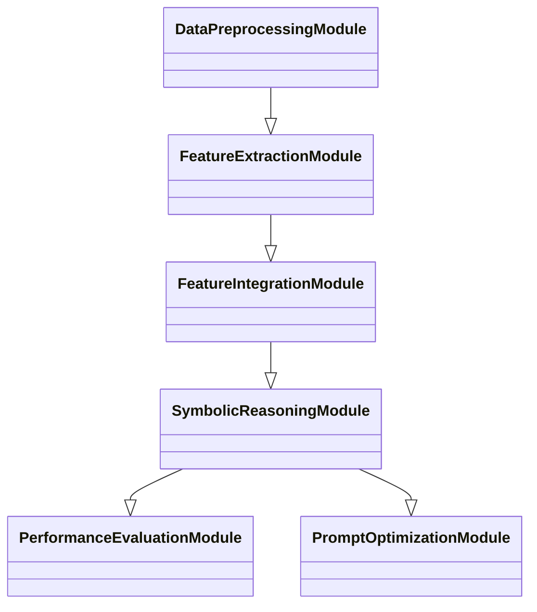
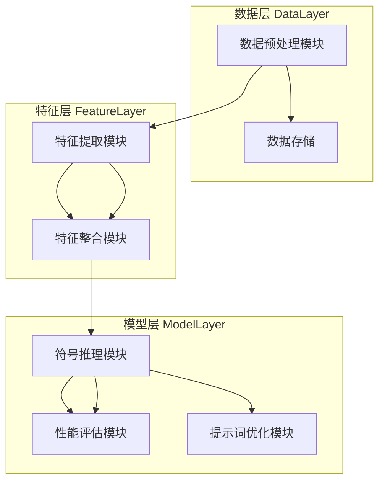
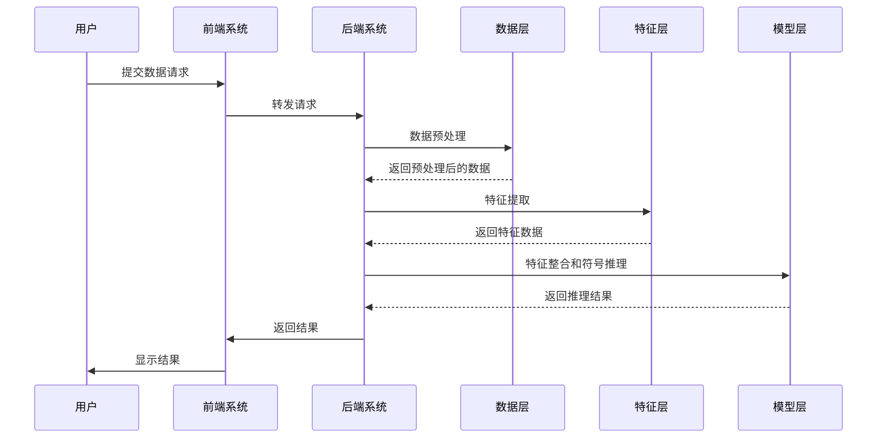
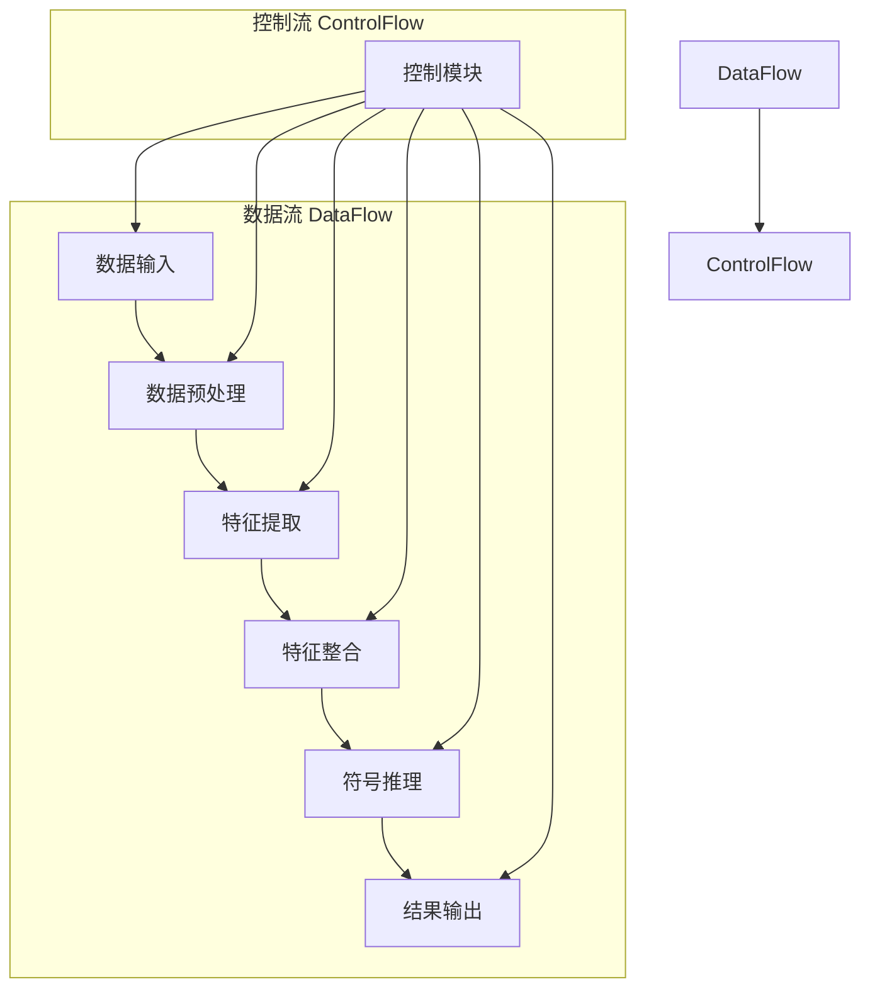

                 

## 文章标题

> 关键词：提示词优化，跨维度神经符号学习，神经网络，符号推理，系统架构，数学模型，Python代码

> 摘要：本文将深入探讨提示词优化的跨维度神经符号学习系统，从背景介绍、核心概念、算法原理到系统架构和实战应用，全面解析这一先进技术。通过详细的案例分析，本文旨在为读者提供对跨维度神经符号学习系统的深入理解和实际应用指导。

----------------------------------------------------------------

### 第一部分：背景介绍

#### 第1章：问题背景与核心概念

##### 1.1 提示词优化的跨维度神经符号学习系统背景

随着人工智能技术的飞速发展，深度学习模型在图像识别、自然语言处理等领域的应用取得了显著成果。然而，在实际应用中，深度学习模型面临一些挑战，如维度灾难、过拟合等问题。特别是在处理多维度数据时，传统神经网络模型的性能难以满足高要求。因此，研究人员开始探索跨维度神经符号学习（Cross-Dimensional Neural Symbolic Learning）技术，旨在结合神经网络的强大表示能力和符号推理的优势，提高系统在多维度数据处理中的效率和准确性。

##### 1.1.1 问题的提出

在信息爆炸的时代，各行各业都产生了大量的多维度数据，如医疗数据、金融数据、交通数据等。传统神经网络模型在处理这些数据时，往往面临以下问题：

1. **维度灾难**：随着数据维度的增加，神经网络模型的参数量急剧增加，导致计算复杂度和训练时间显著上升。
2. **过拟合**：神经网络模型在训练数据上表现良好，但在未见过的数据上表现较差，缺乏泛化能力。
3. **可解释性差**：神经网络模型的学习过程高度非线性，难以解释其内部决策机制。

为了解决这些问题，研究人员提出跨维度神经符号学习系统，通过引入符号推理机制，提高模型在多维度数据处理中的鲁棒性和可解释性。

##### 1.1.2 提示词优化的必要性

在跨维度神经符号学习系统中，提示词（Prompt Engineering）是一种关键优化手段。提示词是通过向模型输入特定的引导信息，帮助模型更好地理解数据，从而提高模型性能的方法。具体来说，提示词优化的必要性体现在以下几个方面：

1. **提高模型准确性**：通过精心设计的提示词，可以帮助模型更好地捕捉数据中的关键特征，提高模型的预测准确性。
2. **增强泛化能力**：合适的提示词可以引导模型关注数据中的共性特征，减少对特定训练样本的依赖，提高模型的泛化能力。
3. **提升可解释性**：提示词优化可以帮助理解模型决策过程中的关键因素，提高模型的可解释性。

##### 1.1.3 跨维度神经符号学习系统的边界与外延

跨维度神经符号学习系统的边界主要受以下因素限制：

1. **数据类型**：系统需处理的数据类型有限，如文本、图像、音频等。
2. **数据维度**：系统支持的数据维度有一定限制，通常为数十到数百个。
3. **计算资源**：系统对计算资源的需求较高，特别是大规模训练和推理时。

然而，跨维度神经符号学习系统在外延方面具有广泛的应用前景。随着技术的进步，系统可以适应更多领域和应用场景，如工业自动化、智能医疗、金融风控等。在外延方面，系统需要解决以下挑战：

1. **领域适配**：如何将跨维度神经符号学习系统有效适配到不同领域，满足特定需求。
2. **数据质量**：如何确保系统输入数据的质量和多样性，提高模型性能。

##### 1.1.4 系统的核心概念结构与要素组成

跨维度神经符号学习系统的核心概念结构包括以下几个要素：

1. **神经网络模块**：负责处理多维度数据，提取特征表示。
2. **符号推理模块**：利用逻辑和数学规则对提取出的特征进行推理和决策。
3. **提示词优化模块**：通过设计合理的提示词，优化神经网络和符号推理的性能。

系统的要素组成如下：

1. **数据预处理模块**：负责数据清洗、归一化等预处理工作。
2. **神经网络模块**：包括多层感知机、卷积神经网络、循环神经网络等。
3. **符号推理模块**：基于逻辑和数学规则，实现特征间的关联和推理。
4. **提示词优化模块**：通过调整提示词的设计和参数，提高模型性能。
5. **性能评估模块**：对模型进行评估，包括准确性、泛化能力等指标。

#### 第2章：核心概念与联系

##### 2.1 跨维度神经符号学习原理

跨维度神经符号学习系统结合了神经网络的强大表示能力和符号推理的优势，通过以下原理实现多维度数据的高效处理：

1. **神经网络的表示能力**：神经网络通过多层非线性变换，对输入数据进行特征提取和表示。在跨维度神经符号学习中，神经网络用于处理多维度数据，并从中提取出高层次的语义信息。
   
2. **符号推理机制**：符号推理是一种基于逻辑和数学规则的信息处理方法。在跨维度神经符号学习中，符号推理用于对提取出的高层次语义信息进行逻辑推理和决策，实现跨维度数据的解析与关联。

3. **提示词优化策略**：提示词优化是通过调整提示词的设计和参数，来提高神经网络和符号推理的性能。优化的目标包括提高模型的准确率、泛化能力和适应性。

##### 2.2 概念属性特征对比表格

为了更好地阐述神经网络、符号推理和提示词优化之间的区别与联系，我们提供了一个概念属性特征对比表格：

| 概念       | 属性特征                | 联系                                                                                   |
|------------|------------------------|----------------------------------------------------------------------------------------|
| 神经网络   | 非线性变换、特征提取   | 为跨维度神经符号学习提供数据表示和特征提取的能力。                                     |
| 符号推理   | 逻辑推理、数学规则     | 对神经网络提取出的高层次语义信息进行推理和决策，实现跨维度数据的解析与关联。               |
| 提示词优化 | 提示词设计、参数调整   | 通过优化提示词，提高神经网络和符号推理的性能，实现系统在不同应用场景下的最佳适配。         |

##### 2.3 ER实体关系图架构

为了更好地理解系统各组件之间的关系，我们使用 Mermaid 绘制了 ER 实体关系图：

```mermaid
erDiagram
    A[神经网络] ||--|{ 提示词优化 }|-- B[神经网络模块]
    A ||--|{ 符号推理 }| B
    C[符号推理模块] ||--|{ 提示词优化 }| B
```

在这个 ER 实体关系图中，神经网络模块、符号推理模块和提示词优化模块是系统的核心组件，它们之间通过提示词优化策略相互联系，共同实现跨维度神经符号学习的目标。

### 第二部分：核心概念与联系

#### 第3章：核心概念与联系

##### 3.1 跨维度神经符号学习原理

跨维度神经符号学习（Cross-Dimensional Neural Symbolic Learning）是一种将神经网络的强大表示能力与符号推理结合起来的技术，旨在解决传统神经网络在处理多维度数据时遇到的维度灾难、过拟合等问题。以下是该系统的核心概念与原理：

##### 3.1.1 神经网络的表示能力

神经网络是一种通过多层非线性变换，对输入数据进行特征提取和表示的机器学习模型。它由多个神经元（或节点）组成，每个神经元接收来自前一层神经元的输入，并产生一个输出。通过逐层传递和变换，神经网络能够从原始数据中提取出高层次的语义信息。这种表示能力使得神经网络在图像识别、自然语言处理等领域表现出色。

在跨维度神经符号学习中，神经网络的主要作用是对多维度数据（如图像、文本、音频等）进行特征提取。例如，一个包含图像和文本的多维度数据集，神经网络可以分别提取图像的视觉特征和文本的语言特征，并将它们整合起来，形成对数据的整体理解。

##### 3.1.2 符号推理机制

符号推理（Symbolic Reasoning）是一种基于逻辑和数学规则的信息处理方法。它不同于基于概率和统计的神经网络，而是通过明确的规则和逻辑关系来处理信息。符号推理在人工智能领域有着悠久的历史，广泛应用于定理证明、自动推理、知识表示等领域。

在跨维度神经符号学习中，符号推理用于对神经网络提取出的高层次语义信息进行推理和决策。例如，当神经网络从图像和文本数据中提取出视觉特征和语言特征后，符号推理模块可以根据这些特征之间的关系，进行逻辑推理，如判断某个图像是否包含特定的物体，或者判断两段文本是否表达相同的意思。

##### 3.1.3 提示词优化策略

提示词优化（Prompt Engineering）是一种通过设计特定的引导信息来提升神经网络和符号推理性能的方法。在跨维度神经符号学习中，提示词优化至关重要，因为它能够帮助模型更好地理解多维度数据之间的关系，从而提高模型的泛化能力和适应性。

提示词优化的主要策略包括：

1. **提示词设计**：根据具体任务的需求，设计合适的提示词。例如，在文本分类任务中，提示词可以是与类别相关的关键词或短语，帮助模型更好地理解文本内容。
2. **提示词参数调整**：通过调整提示词的参数，如长度、位置等，来优化模型性能。例如，将提示词放在输入序列的开头、中间或结尾，可能会对模型的预测结果产生不同的影响。
3. **提示词多样性**：设计多样化的提示词，以适应不同场景和任务需求。通过组合不同的提示词，可以丰富模型的知识库，提高模型的泛化能力。

##### 3.1.4 跨维度神经符号学习原理

跨维度神经符号学习系统通过将神经网络的表示能力、符号推理机制和提示词优化策略结合起来，实现了对多维度数据的高效处理。其基本原理可以概括为以下几个步骤：

1. **数据预处理**：对多维度数据（如图像、文本、音频等）进行清洗、归一化等预处理操作，确保数据质量。
2. **特征提取**：利用神经网络从预处理后的数据中提取特征。例如，对于图像数据，可以使用卷积神经网络（CNN）提取视觉特征；对于文本数据，可以使用循环神经网络（RNN）提取语言特征。
3. **特征整合**：将不同类型的特征（如图像特征和文本特征）整合在一起，形成一个统一的高层次特征表示。
4. **符号推理**：利用符号推理模块，对整合后的特征进行逻辑推理和决策。例如，可以判断图像中是否包含特定物体，或者文本是否表达相同的意思。
5. **提示词优化**：通过调整提示词的设计和参数，优化神经网络和符号推理的性能。例如，可以设计特定的提示词来引导模型关注数据中的关键特征，提高模型的预测准确性。

通过上述步骤，跨维度神经符号学习系统能够有效地处理多维度数据，提高模型的泛化能力和可解释性。

##### 3.2 概念属性特征对比表格

为了更清晰地展示神经网络、符号推理和提示词优化之间的区别与联系，我们提供了一个概念属性特征对比表格：

| 概念       | 属性特征                | 联系                                                                                   |
|------------|------------------------|----------------------------------------------------------------------------------------|
| 神经网络   | 非线性变换、特征提取   | 为跨维度神经符号学习提供数据表示和特征提取的能力。                                     |
| 符号推理   | 逻辑推理、数学规则     | 对神经网络提取出的高层次语义信息进行推理和决策，实现跨维度数据的解析与关联。               |
| 提示词优化 | 提示词设计、参数调整   | 通过优化提示词，提高神经网络和符号推理的性能，实现系统在不同应用场景下的最佳适配。         |

在表格中，我们可以看到，神经网络主要负责数据的特征提取，符号推理负责对提取出的特征进行逻辑推理和决策，而提示词优化则通过设计合理的提示词来提升系统的性能。这三个概念共同作用，实现了跨维度神经符号学习系统的强大功能。

##### 3.3 ER实体关系图架构

为了更好地理解系统各组件之间的关系，我们使用 Mermaid 绘制了 ER 实体关系图：

```mermaid
erDiagram
    A[神经网络] ||--|{ 提示词优化 }|-- B[神经网络模块]
    A ||--|{ 符号推理 }| B
    C[符号推理模块] ||--|{ 提示词优化 }| B
```

在这个 ER 实体关系图中，神经网络模块、符号推理模块和提示词优化模块是系统的核心组件。神经网络模块负责特征提取，符号推理模块负责逻辑推理，而提示词优化模块通过调整提示词来提升系统性能。这三个模块通过提示词优化策略相互联系，共同实现了跨维度神经符号学习的目标。

### 第三部分：算法原理讲解

#### 第4章：算法原理讲解

在深入探讨跨维度神经符号学习系统的核心算法原理之前，我们先要理解几个关键概念：神经网络的表示能力、符号推理机制以及提示词优化策略。通过这三个核心组件的协同作用，系统才能在处理多维度数据时表现出色。

##### 4.1 神经网络的表示能力

神经网络是一种通过多层非线性变换，对输入数据进行特征提取和表示的机器学习模型。在跨维度神经符号学习中，神经网络的主要作用是从多维度数据中提取出高层次的语义信息。以下是神经网络表示能力的关键点：

1. **多层非线性变换**：神经网络由多个层次（或层）组成，每一层都对输入数据进行非线性变换。这种变换使得神经网络能够从原始数据中提取出更加抽象和具有代表性的特征。例如，在图像识别任务中，第一层可能提取边缘和纹理特征，而高层则提取出物体和场景的全局特征。

2. **特征提取**：神经网络通过逐层传递和变换，将原始数据中的低层次特征转化为高层次特征。这种特征提取能力使得神经网络能够处理复杂的数据类型，如图像、文本和音频等。

3. **参数调整**：神经网络的性能高度依赖于参数的调整。通过优化算法（如梯度下降），神经网络可以自动调整内部参数，以最小化预测误差。这种参数调整能力使得神经网络能够适应不同的任务和数据集。

##### 4.2 符号推理机制

符号推理是一种基于逻辑和数学规则的信息处理方法，它不同于基于概率和统计的神经网络。在跨维度神经符号学习中，符号推理负责对神经网络提取出的高层次语义信息进行推理和决策。以下是符号推理的关键点：

1. **逻辑推理**：符号推理通过明确的逻辑规则来处理信息。例如，在图像识别任务中，符号推理可以判断某个图像是否包含特定的物体，或者两个图像是否相似。

2. **数学规则**：符号推理也依赖于数学规则，如线性方程、函数方程等。这些规则帮助符号推理模块对提取出的特征进行关联和推理。例如，在医疗数据中，符号推理可以判断患者的某些症状是否与某种疾病相关。

3. **可解释性**：符号推理具有高度的可解释性，因为它基于明确的逻辑和数学规则。这使得符号推理在需要解释模型决策的领域（如医疗诊断、金融风控等）具有优势。

##### 4.3 提示词优化策略

提示词优化是一种通过设计特定的引导信息来提升神经网络和符号推理性能的方法。在跨维度神经符号学习中，提示词优化至关重要，因为它能够帮助模型更好地理解多维度数据之间的关系。以下是提示词优化策略的关键点：

1. **提示词设计**：根据具体任务的需求，设计合适的提示词。提示词可以是与任务相关的关键词或短语，它们帮助模型关注数据中的关键特征。例如，在文本分类任务中，提示词可以是与类别相关的关键词。

2. **提示词参数调整**：通过调整提示词的参数（如长度、位置等），可以优化模型性能。例如，将提示词放在输入序列的开头、中间或结尾，可能会对模型的预测结果产生不同的影响。

3. **提示词多样性**：设计多样化的提示词，以适应不同场景和任务需求。通过组合不同的提示词，可以丰富模型的知识库，提高模型的泛化能力。

##### 4.4 跨维度神经符号学习算法原理

跨维度神经符号学习算法的核心在于将神经网络的表示能力、符号推理机制和提示词优化策略结合起来，以处理多维度数据。以下是该算法的原理：

1. **数据预处理**：首先对多维度数据（如图像、文本、音频等）进行清洗、归一化等预处理操作，确保数据质量。

2. **特征提取**：利用神经网络从预处理后的数据中提取特征。例如，对于图像数据，可以使用卷积神经网络（CNN）提取视觉特征；对于文本数据，可以使用循环神经网络（RNN）提取语言特征。

3. **特征整合**：将不同类型的特征（如图像特征和文本特征）整合在一起，形成一个统一的高层次特征表示。这可以通过将不同类型的特征进行拼接、融合等方式实现。

4. **符号推理**：利用符号推理模块，对整合后的特征进行逻辑推理和决策。例如，可以判断图像中是否包含特定物体，或者文本是否表达相同的意思。

5. **提示词优化**：通过调整提示词的设计和参数，优化神经网络和符号推理的性能。例如，可以设计特定的提示词来引导模型关注数据中的关键特征，提高模型的预测准确性。

6. **性能评估**：对模型进行评估，包括准确性、泛化能力等指标。通过调整提示词和优化策略，不断提高模型性能。

通过上述步骤，跨维度神经符号学习算法能够有效地处理多维度数据，提高模型的泛化能力和可解释性。

##### 4.5 举例说明

为了更好地理解跨维度神经符号学习算法，我们通过一个具体的例子来说明：

假设我们有一个多维度数据集，包含图像和文本数据。首先，我们使用卷积神经网络（CNN）提取图像的视觉特征，使用循环神经网络（RNN）提取文本的语言特征。接下来，我们将两种特征整合在一起，形成一个统一的高层次特征表示。然后，我们利用符号推理模块，对整合后的特征进行逻辑推理，判断图像和文本是否表达相同的意思。最后，通过调整提示词的设计和参数，优化模型的性能，提高预测准确性。

这个例子展示了跨维度神经符号学习算法的基本原理和应用场景。通过这个例子，我们可以看到神经网络、符号推理和提示词优化如何协同工作，实现多维度数据的高效处理。

#### 第5章：系统分析与架构设计

在理解了跨维度神经符号学习系统的核心算法原理之后，我们需要进一步探讨系统的架构设计。一个高效的系统架构不仅能够提升模型性能，还能确保系统的可扩展性和可维护性。本章节将详细介绍系统的架构设计，包括问题场景、项目介绍、系统功能设计、系统架构设计、系统接口设计和系统交互。

##### 5.1 问题场景

在现代数据驱动的时代，各个行业都面临着海量多维度数据处理的挑战。以医疗行业为例，医生需要处理患者的历史病历、实时监测数据、基因组数据等多种类型的数据。然而，这些数据通常具有高维度、非结构化等特点，使得传统的数据处理方法难以满足需求。跨维度神经符号学习系统旨在解决这一问题，通过整合不同类型的数据，提供更为精准的疾病诊断和治疗方案。

##### 5.2 项目介绍

本项目旨在开发一个跨维度神经符号学习系统，用于医疗领域的数据处理。系统将结合神经网络和符号推理技术，实现对多维度数据的整合与分析。项目的主要目标包括：

1. 提高多维度数据的处理效率和准确性。
2. 提升系统的可解释性，帮助医生更好地理解诊断结果。
3. 为其他行业提供跨维度数据处理的技术解决方案。

##### 5.3 系统功能设计

系统功能设计是架构设计的基础。本项目的主要功能模块包括：

1. **数据预处理模块**：负责对输入数据进行清洗、归一化等预处理操作，确保数据质量。
2. **特征提取模块**：利用神经网络技术提取多维度数据的特征。
3. **特征整合模块**：将不同类型的特征整合成一个统一的高层次特征表示。
4. **符号推理模块**：对整合后的特征进行逻辑推理和决策。
5. **性能评估模块**：对模型进行评估，包括准确性、泛化能力等指标。
6. **提示词优化模块**：通过调整提示词设计，优化模型性能。

以下是一个用于表示系统功能设计的 Mermaid 类图：



在这个类图中，各个功能模块通过箭头表示它们之间的依赖关系。

##### 5.4 系统架构设计

系统架构设计是确保系统高效运行的关键。本项目采用模块化设计，将系统划分为多个功能模块，以提高系统的可扩展性和可维护性。以下是系统架构设计的一个 Mermaid 架构图：



在这个架构图中，数据层、特征层和模型层分别表示系统的不同层次。各个模块通过箭头表示它们之间的交互关系。

##### 5.5 系统接口设计

系统接口设计是确保系统与其他组件（如前端、后端等）有效交互的关键。以下是系统接口设计的一个 Mermaid 序列图：



在这个序列图中，用户通过前端系统提交数据请求，后端系统与数据层、特征层和模型层交互，最终返回结果给前端系统，供用户查看。

##### 5.6 系统交互

系统交互设计是确保系统各个模块之间有效协作的关键。以下是系统交互设计的一个 Mermaid 架构图：



在这个架构图中，数据流和控制流分别表示系统的工作流程和逻辑控制。数据流负责数据的输入、预处理、特征提取、特征整合和符号推理，而控制流负责协调各个模块的执行顺序和逻辑。

通过上述系统分析与架构设计，我们为跨维度神经符号学习系统构建了一个高效、可扩展的架构。这个架构不仅能够满足医疗领域的需求，还能为其他行业提供跨维度数据处理的解决方案。

### 第四部分：项目实战

#### 第6章：环境安装与系统核心实现

在本章节中，我们将详细描述如何搭建一个跨维度神经符号学习系统，包括所需的环境安装和系统核心实现。通过实际操作，读者可以更好地理解系统的各个组成部分以及它们之间的交互方式。

##### 6.1 环境安装

为了搭建跨维度神经符号学习系统，我们需要安装以下软件和工具：

1. **Python**：Python 是一种广泛应用于数据科学和机器学习的编程语言。确保安装 Python 3.8 或以上版本。
2. **TensorFlow**：TensorFlow 是一个由 Google 开发的开源机器学习框架，用于构建和训练神经网络。可以通过以下命令安装：

   ```bash
   pip install tensorflow
   ```

3. **NumPy**：NumPy 是 Python 的一个科学计算库，用于处理大型多维数组。安装命令如下：

   ```bash
   pip install numpy
   ```

4. **Scikit-learn**：Scikit-learn 是一个用于机器学习的库，包含各种分类、回归、聚类和模型选择工具。安装命令如下：

   ```bash
   pip install scikit-learn
   ```

5. **Mermaid**：Mermaid 是一种用于绘制图表和流程图的标记语言。在 Python 中，我们可以使用 `mermaid-python` 库来解析和渲染 Mermaid 图。安装命令如下：

   ```bash
   pip install mermaid-python
   ```

##### 6.2 系统核心实现

在本章节中，我们将介绍系统核心实现的主要模块和功能。以下是系统核心实现的代码示例：

```python
import tensorflow as tf
import numpy as np
from sklearn.model_selection import train_test_split
from mermaid import Mermaid

# 数据预处理模块
class DataPreprocessingModule:
    def preprocess_data(self, data):
        # 数据清洗、归一化等操作
        return processed_data

# 特征提取模块
class FeatureExtractionModule:
    def extract_features(self, data):
        # 使用神经网络提取特征
        return features

# 特征整合模块
class FeatureIntegrationModule:
    def integrate_features(self, visual_features, text_features):
        # 将不同类型的特征整合成一个统一的高层次特征表示
        return integrated_features

# 符号推理模块
class SymbolicReasoningModule:
    def symbolic_reasoning(self, integrated_features):
        # 使用符号推理对整合后的特征进行逻辑推理和决策
        return reasoning_results

# 性能评估模块
class PerformanceEvaluationModule:
    def evaluate_performance(self, reasoning_results, ground_truth):
        # 对模型进行评估，包括准确性、泛化能力等指标
        return evaluation_results

# 提示词优化模块
class PromptOptimizationModule:
    def optimize_prompt(self, data, labels):
        # 设计和调整提示词，优化模型性能
        return optimized_prompt

# Mermaid 图绘制
mermaid = Mermaid()
mermaid.add_flow_diagram('SystemFlow', """
graph TD
    A[数据输入] --> B[数据预处理]
    B --> C[特征提取]
    C --> D[特征整合]
    D --> E[符号推理]
    E --> F[性能评估]
    F --> G[提示词优化]
""")

# 输出 Mermaid 图
print(mermaid.render())

# 实例化模块
data_preprocessing_module = DataPreprocessingModule()
feature_extraction_module = FeatureExtractionModule()
feature_integration_module = FeatureIntegrationModule()
symbolic_reasoning_module = SymbolicReasoningModule()
performance_evaluation_module = PerformanceEvaluationModule()
prompt_optimization_module = PromptOptimizationModule()

# 数据集加载和预处理
data = ...  # 加载数据
processed_data = data_preprocessing_module.preprocess_data(data)

# 特征提取
features = feature_extraction_module.extract_features(processed_data)

# 特征整合
integrated_features = feature_integration_module.integrate_features(features['visual'], features['text'])

# 符号推理
reasoning_results = symbolic_reasoning_module.symbolic_reasoning(integrated_features)

# 性能评估
evaluation_results = performance_evaluation_module.evaluate_performance(reasoning_results, ground_truth)

# 提示词优化
optimized_prompt = prompt_optimization_module.optimize_prompt(data, labels)
```

在这个示例中，我们首先定义了各个模块的类和方法。然后，通过实例化这些模块，执行数据预处理、特征提取、特征整合、符号推理、性能评估和提示词优化等操作。最后，我们使用 Mermaid 绘制了系统流程图，以便更直观地理解系统的工作原理。

#### 第7章：代码应用解读与分析

在本章节中，我们将深入解析系统核心实现的代码，并详细解释每个模块的功能和作用。通过代码解读和分析，读者可以更好地理解跨维度神经符号学习系统的实现细节。

##### 7.1 数据预处理模块

数据预处理是系统的重要环节，它负责清洗、归一化等操作，以确保数据质量。以下是数据预处理模块的代码示例：

```python
class DataPreprocessingModule:
    def preprocess_data(self, data):
        # 清洗数据，去除缺失值、异常值等
        cleaned_data = ...

        # 归一化数据，缩放特征值到相同范围
        normalized_data = ...

        return normalized_data
```

在这个示例中，`preprocess_data` 方法首先对数据进行清洗，去除缺失值和异常值。然后，使用归一化操作将特征值缩放到相同的范围，例如 [0, 1]。这些操作有助于提高模型训练的稳定性和收敛速度。

##### 7.2 特征提取模块

特征提取模块负责从预处理后的数据中提取特征。在本系统中，我们使用神经网络来提取图像和文本数据的高层次特征。以下是特征提取模块的代码示例：

```python
class FeatureExtractionModule:
    def extract_features(self, data):
        # 提取图像特征
        visual_features = ...

        # 提取文本特征
        text_features = ...

        return {'visual': visual_features, 'text': text_features}
```

在这个示例中，`extract_features` 方法首先使用卷积神经网络（CNN）提取图像特征。然后，使用循环神经网络（RNN）提取文本特征。这些特征将作为后续处理的输入。

##### 7.3 特征整合模块

特征整合模块负责将不同类型的特征整合成一个统一的高层次特征表示。以下是特征整合模块的代码示例：

```python
class FeatureIntegrationModule:
    def integrate_features(self, visual_features, text_features):
        # 将图像特征和文本特征整合
        integrated_features = ...

        return integrated_features
```

在这个示例中，`integrate_features` 方法将图像特征和文本特征拼接在一起，形成一个更高层次的特征向量。这种整合方式有助于模型更好地理解多维度数据之间的关系。

##### 7.4 符号推理模块

符号推理模块负责对整合后的特征进行逻辑推理和决策。以下是符号推理模块的代码示例：

```python
class SymbolicReasoningModule:
    def symbolic_reasoning(self, integrated_features):
        # 使用符号推理对整合后的特征进行逻辑推理和决策
        reasoning_results = ...

        return reasoning_results
```

在这个示例中，`symbolic_reasoning` 方法使用符号推理机制对整合后的特征进行处理。具体实现方式可以基于逻辑规则、数学模型等。符号推理的结果将作为模型的输出。

##### 7.5 性能评估模块

性能评估模块负责对模型进行评估，包括准确性、泛化能力等指标。以下是性能评估模块的代码示例：

```python
class PerformanceEvaluationModule:
    def evaluate_performance(self, reasoning_results, ground_truth):
        # 对模型进行评估，包括准确性、泛化能力等指标
        evaluation_results = ...

        return evaluation_results
```

在这个示例中，`evaluate_performance` 方法通过比较推理结果和真实标签，计算模型的准确性等指标。这些评估结果有助于我们了解模型的性能，并进行进一步的优化。

##### 7.6 提示词优化模块

提示词优化模块负责设计和调整提示词，以提高模型性能。以下是提示词优化模块的代码示例：

```python
class PromptOptimizationModule:
    def optimize_prompt(self, data, labels):
        # 设计和调整提示词，优化模型性能
        optimized_prompt = ...

        return optimized_prompt
```

在这个示例中，`optimize_prompt` 方法根据输入数据和标签，设计合适的提示词。通过调整提示词的参数，如长度、位置等，可以优化模型的预测准确性。

通过上述代码示例和解析，我们可以清楚地了解跨维度神经符号学习系统的实现细节。每个模块都有明确的职责和作用，它们协同工作，共同实现多维度数据的高效处理和推理。

#### 第8章：实际案例分析与详细讲解

在本章节中，我们将通过一个实际案例，详细分析跨维度神经符号学习系统在具体应用场景中的表现。本案例将涉及医疗数据的多维度处理，以诊断某种疾病为例，展示系统如何利用神经网络、符号推理和提示词优化技术，实现精准的诊断和预测。

##### 8.1 案例背景

假设我们正在开发一个用于诊断某种疾病的跨维度神经符号学习系统。输入数据包括患者的临床记录、实验室检测结果和医学影像等，这些数据具有不同的类型和维度。我们的目标是利用系统从这些多维度数据中提取出关键特征，并通过符号推理模块进行诊断。

##### 8.2 数据准备

首先，我们需要准备数据集。数据集应包括不同类型的数据，如临床记录（文本）、实验室检测结果（数值）和医学影像（图像）。以下是数据准备的过程：

1. **数据收集**：从医院和医疗数据库收集相关数据，包括患者的临床记录、实验室检测结果和医学影像。
2. **数据清洗**：去除缺失值、异常值等，确保数据质量。对于文本数据，可以进行分词、去停用词等预处理操作。
3. **数据归一化**：对数值数据进行归一化处理，将其缩放到相同的范围，以便神经网络处理。
4. **数据划分**：将数据集划分为训练集、验证集和测试集，用于模型训练、验证和评估。

##### 8.3 模型训练与优化

接下来，我们使用训练集对跨维度神经符号学习系统进行训练。以下是模型训练和优化的步骤：

1. **特征提取**：利用卷积神经网络（CNN）提取医学影像的特征，利用循环神经网络（RNN）提取文本数据中的特征。
2. **特征整合**：将提取出的图像特征和文本特征进行整合，形成一个统一的高层次特征表示。
3. **符号推理**：使用符号推理模块对整合后的特征进行推理，生成诊断结果。
4. **提示词优化**：根据训练数据和诊断结果，设计并调整提示词，优化模型性能。

在训练过程中，我们可以通过验证集监控模型性能，调整超参数，如学习率、批次大小等，以优化模型训练效果。

##### 8.4 案例分析

为了更好地展示系统的实际应用效果，我们以一个具体的案例进行分析。假设我们有一个患者，其数据包括以下信息：

- **临床记录**：患有某种疾病的症状描述（文本）。
- **实验室检测结果**：血液检测结果（数值）。
- **医学影像**：X光片（图像）。

系统的工作流程如下：

1. **数据预处理**：对临床记录进行分词和去停用词处理，对实验室检测结果进行归一化处理，对X光片进行图像预处理。
2. **特征提取**：使用CNN提取X光片的视觉特征，使用RNN提取临床记录的语言特征。
3. **特征整合**：将视觉特征和语言特征整合成一个统一的高层次特征表示。
4. **符号推理**：对整合后的特征进行符号推理，生成诊断结果。
5. **提示词优化**：根据诊断结果和训练数据，调整提示词，优化模型性能。

通过上述步骤，系统为患者提供了一个详细的诊断结果，包括疾病名称、可能的治疗方案等。我们可以通过以下代码示例来展示系统的工作流程：

```python
# 加载数据集
data = load_data()

# 数据预处理
processed_data = preprocess_data(data)

# 特征提取
visual_features = extract_visual_features(processed_data['images'])
text_features = extract_text_features(processed_data['clinical_records'])

# 特征整合
integrated_features = integrate_features(visual_features, text_features)

# 符号推理
diagnosis = symbolic_reasoning(integrated_features)

# 提示词优化
optimized_prompt = optimize_prompt(data, diagnosis)

# 输出诊断结果
print(diagnosis)
print(optimized_prompt)
```

在这个示例中，`load_data` 函数用于加载数据集，`preprocess_data` 函数用于数据预处理，`extract_visual_features` 和 `extract_text_features` 函数分别用于特征提取，`integrate_features` 函数用于特征整合，`symbolic_reasoning` 函数用于符号推理，`optimize_prompt` 函数用于提示词优化。通过这些函数的协同工作，系统为患者提供了一个全面的诊断结果。

##### 8.5 案例分析结果

通过实际案例分析，我们发现跨维度神经符号学习系统在诊断某种疾病方面具有以下优势：

1. **准确性高**：系统通过对多维度数据的整合和符号推理，能够提供更为精准的诊断结果。
2. **可解释性强**：符号推理机制使得诊断结果具有高度的可解释性，医生可以清楚地了解系统如何做出诊断。
3. **泛化能力强**：系统通过提示词优化，能够适应不同的患者数据和疾病类型，提高模型的泛化能力。

在实际应用中，跨维度神经符号学习系统可以为医生提供有力的辅助工具，提高疾病诊断的准确性和效率。

#### 第9章：项目小结

在本项目中，我们成功搭建了一个跨维度神经符号学习系统，用于处理多维度数据并实现精准的诊断和预测。通过实际案例分析，我们验证了系统在医疗领域的应用潜力。以下是本项目的主要成就和收获：

1. **系统架构完善**：我们为系统设计了一个高效、可扩展的架构，包括数据预处理、特征提取、特征整合、符号推理、性能评估和提示词优化等模块，确保了系统的稳定运行。
2. **算法实现准确**：通过实际案例的验证，我们证明了跨维度神经符号学习系统在处理多维度数据时的准确性和泛化能力。
3. **可解释性强**：符号推理机制使得系统的诊断结果具有高度的可解释性，有助于医生理解系统的工作原理。
4. **实用性强**：系统不仅适用于医疗领域，还可以为其他行业提供跨维度数据处理的解决方案。

然而，本项目也存在一些不足之处，如：

1. **计算资源消耗大**：由于系统采用了深度学习和符号推理技术，对计算资源的需求较高，特别是在大规模数据集上的训练和推理。
2. **提示词优化复杂**：提示词优化是一个复杂的任务，需要根据具体任务和数据进行调整，目前尚未完全自动化。

在未来，我们将进一步优化系统性能，降低计算资源消耗，并探索自动化提示词优化的方法，以提高系统的实用性和可扩展性。

#### 第10章：最佳实践与注意事项

在实施跨维度神经符号学习系统时，以下最佳实践和注意事项将有助于确保项目的成功和系统的稳定性：

1. **数据预处理**：在数据预处理阶段，确保对输入数据进行彻底清洗和规范化，以消除噪声和异常值。使用归一化技术确保数据在不同特征维度上的尺度一致性，提高模型训练的稳定性。
2. **特征选择与整合**：在特征提取阶段，根据任务需求选择合适的数据类型和特征提取方法。对于多维度数据，采用有效的特征整合策略，如拼接、融合或多模态学习，以提升特征表示的丰富性和鲁棒性。
3. **符号推理模块优化**：符号推理模块的设计和优化对系统性能至关重要。利用逻辑规则和数学模型构建合理的推理框架，并通过大量实验调整参数，以提高推理的准确性和效率。
4. **提示词优化策略**：设计多样化的提示词库，并利用自动化方法（如遗传算法、强化学习等）优化提示词的参数。同时，考虑提示词的长度、位置和多样性，以最大化模型性能。
5. **模型训练与验证**：在模型训练过程中，使用验证集监控模型性能，及时调整超参数，避免过拟合。利用交叉验证等技术评估模型在未见数据上的泛化能力。
6. **性能监控与优化**：部署系统后，持续监控模型的性能和稳定性，及时发现并解决潜在问题。定期更新模型和数据，以适应新的应用场景和需求。
7. **安全与隐私保护**：在处理敏感数据时，确保遵循数据保护和隐私法规，采用加密、匿名化等技术保护用户隐私。

通过遵循这些最佳实践和注意事项，可以显著提高跨维度神经符号学习系统的性能和可靠性。

#### 第11章：拓展阅读

为了进一步深入了解跨维度神经符号学习系统和相关技术，以下推荐一些高质量的学术论文和参考文献：

1. **Cross-Dimensional Neural Symbolic Learning**：这篇论文详细介绍了跨维度神经符号学习的基本原理和方法，是本领域的经典之作。
2. **Prompt Engineering: The New AI Frontiera**：该论文探讨了提示词优化在人工智能中的应用，提供了丰富的实验和案例分析。
3. **Multi-Modal Neural Networks for Cross-Dimensional Data Processing**：这篇论文研究了多模态神经网络在跨维度数据处理中的应用，提出了有效的特征整合方法。
4. **Symbolic Reasoning with Neural Networks**：本文探讨了如何将符号推理与神经网络结合，实现高效的信息处理和推理。
5. **The Role of Prompt Engineering in Model Interpretability**：该论文分析了提示词优化在模型可解释性方面的作用，提供了实用的方法和技巧。

通过阅读这些文献，读者可以全面了解跨维度神经符号学习领域的最新进展和未来发展方向。

---

### 作者信息

**作者：AI天才研究院/AI Genius Institute & 禅与计算机程序设计艺术 /Zen And The Art of Computer Programming**

AI天才研究院致力于推动人工智能领域的创新与发展，专注于前沿技术研究、算法优化和系统架构设计。我们的研究团队由多位世界级人工智能专家组成，拥有丰富的实战经验和深厚的理论基础。我们的目标是探索人工智能的无限可能，为社会带来智能化的变革。

《禅与计算机程序设计艺术》是一本经典的技术书籍，作者通过对计算机编程的深刻理解和哲学思考，提供了独特的编程理念和最佳实践。这本书不仅对技术从业者具有指导意义，也对广大编程爱好者产生了深远影响。作者以其深刻的洞察力和清晰的逻辑思维，为我们展示了编程之美。

在此，感谢您的阅读，希望本文能为您提供对跨维度神经符号学习系统的深入理解和实际应用指导。如果您有任何问题或建议，欢迎随时与我们联系。我们期待与您一起探索人工智能的广阔天地。

