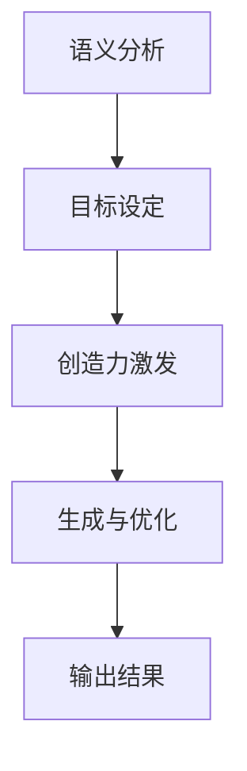
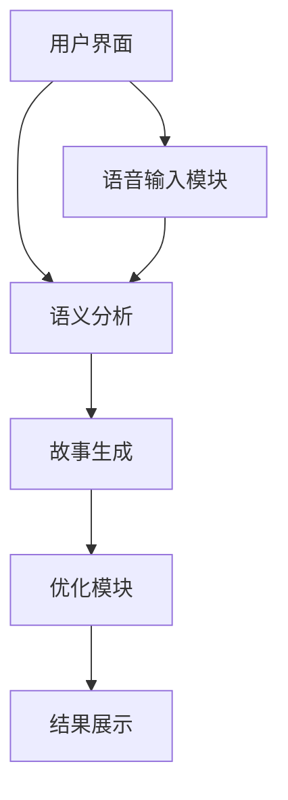
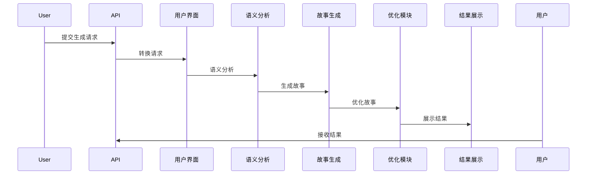

                 

## 提示词优化：增强AI创意故事生成能力

### 关键词：AI、故事生成、提示词优化、算法、架构设计

> 摘要：本文深入探讨了AI在创意故事生成中的应用，特别是如何通过提示词优化来提升AI的故事创作能力。文章从背景介绍、核心概念解析、算法原理讲解、系统架构设计到项目实战，系统地展示了提升AI创意故事生成能力的路径和方法。

### 第一部分：引入与背景

#### 1. 引言

**问题背景**：随着人工智能技术的快速发展，AI在诸多领域的应用日益广泛，从语音识别到自然语言处理，从图像识别到自动驾驶，AI正逐步融入我们的日常生活。然而，在创意故事生成领域，AI的潜力尚未得到充分发挥，这主要源于当前AI在理解复杂语境、生成连贯故事和多样化内容方面的局限性。

**问题描述**：创意故事生成是一个复杂的过程，需要AI具备强大的语义理解、上下文感知和创造力。目前，大多数AI故事生成系统存在以下问题：
- **语义单一**：生成的故事缺乏深度和多样性，常常停留在表面的情节描述。
- **连贯性差**：AI生成的故事常常存在逻辑不连贯或前后矛盾的问题。
- **创造力不足**：AI的故事创作往往缺乏新颖和独特的创意。

**问题解决**：本文将探讨如何通过提示词优化来提升AI的创意故事生成能力，包括核心概念的解析、算法的设计与实现，以及系统架构的优化。

**边界与外延**：本文将聚焦于自然语言处理中的文本生成任务，特别是故事创作。虽然这些技术可以应用于其他文本生成场景，但本文将不涉及图像生成等其他类型的AI应用。

**核心概念组成**：本文将涉及以下核心概念：
- 提示词优化：如何通过优化提示词来提升AI的语义理解和故事创作能力。
- AI故事生成技术：包括生成对抗网络（GANs）、变分自编码器（VAEs）、递归神经网络（RNNs）和Transformer模型。
- 系统架构设计：如何构建一个高效、可扩展的AI故事生成系统。

### 2. 人工智能与创意故事生成的现状

**人工智能的快速发展**：人工智能（AI）技术的发展经历了几个阶段，从早期的规则系统到基于数据的机器学习，再到深度学习的崛起。目前，AI在各个领域取得了显著进展，但创意故事生成仍是一个相对较新的应用领域。

**创意故事生成的挑战**：创意故事生成面临的主要挑战包括：
- **语义理解的深度**：AI需要理解复杂的语义关系，包括人物关系、情感表达和情节发展。
- **上下文感知的能力**：AI需要根据上下文信息生成连贯的故事内容，避免出现逻辑错误或不合理情节。
- **创造力的激发**：AI需要具备一定的创造力，以生成新颖和有趣的故事。

**当前解决方案的不足**：当前AI故事生成系统主要存在以下不足：
- **语义理解的局限性**：AI在处理复杂语义关系时往往力不从心，导致生成的故事缺乏深度和连贯性。
- **创造力的不足**：AI生成的故事缺乏原创性和独特性，往往重复或模仿现有的故事模式。
- **系统的可扩展性**：大多数现有系统在处理大规模数据时性能下降，难以满足实际应用需求。

### 第二部分：核心概念与原理

#### 3. 提示词优化的基本概念

**定义**：提示词（Prompt）是AI在生成文本时输入的引导信息，用于帮助AI理解上下文、设定生成目标和增强创造力。

**分类**：提示词可以根据其功能分为以下几类：
- **语义提示词**：提供具体的语义信息，帮助AI理解生成任务。
- **目标提示词**：设定生成任务的明确目标，如情节发展、情感表达等。
- **创造力提示词**：激发AI的创造力，鼓励生成新颖的故事内容。

**功能**：提示词在AI故事生成中的作用包括：
- **引导语义理解**：帮助AI更好地理解输入文本的语义关系，提高生成文本的连贯性。
- **设定生成目标**：明确生成任务的方向和目标，避免生成的文本偏离主题。
- **增强创造力**：提供更多的信息输入，激发AI的创造力，生成更有创意的故事。

#### 4. 提示词优化的关键因素

**语义丰富性**：语义丰富性是指提示词中包含的语义信息量的多少。丰富的语义信息有助于AI更准确地理解生成任务，提高生成文本的质量。

**上下文感知**：上下文感知是指AI在生成文本时能够根据上下文信息调整自己的生成策略，避免生成不连贯或逻辑错误的文本。

**多样性**：多样性是指AI在生成故事时能够产生不同风格、主题和情感的故事。多样的生成内容能够提高AI的创意性和吸引力。

**连贯性**：连贯性是指AI生成的故事在逻辑和情节上的一致性。良好的连贯性能够增强故事的可读性和吸引力。

#### 5. AI故事生成技术概述

**生成对抗网络（GANs）**：GANs是一种由生成器和判别器组成的模型，通过两个网络的对抗训练来生成高质量的图像和文本。

**变分自编码器（VAEs）**：VAEs是一种基于概率模型的生成模型，通过编码器和解码器来生成具有多样化特性的图像和文本。

**递归神经网络（RNNs）**：RNNs是一种能够处理序列数据的神经网络，常用于生成文本和语音。

**Transformer模型**：Transformer模型是一种基于注意力机制的神经网络，广泛应用于自然语言处理任务，包括文本生成。

### 第三部分：算法原理与实现

#### 6. 提示词优化的算法设计

**算法原理**：提示词优化的算法主要通过以下步骤实现：
1. **语义分析**：对输入文本进行语义分析，提取关键信息。
2. **目标设定**：根据用户需求和故事主题设定生成目标。
3. **创造力激发**：通过多样化的提示词和生成策略激发AI的创造力。
4. **生成与优化**：利用生成模型生成故事，并通过优化算法不断提升生成质量。

**Mermaid流程图**：


**Python代码实现**：
```python
# 伪代码示例
def prompt_optimization(input_text):
    # 语义分析
    semantics = analyze_semantics(input_text)
    
    # 目标设定
    target = set_generated_target(semantics)
    
    # 创造力激发
    creativity = inspire_creativity(target)
    
    # 生成与优化
    story = generate_and_optimize_story(creativity)
    
    # 输出结果
    return story
```

#### 7. 数学模型与公式

**概率分布**：生成模型通常使用概率分布来描述生成数据的可能性。在提示词优化中，常用的概率分布模型包括正态分布、贝叶斯网络和隐马尔可夫模型（HMM）。

**损失函数**：损失函数用于衡量生成数据的偏差和误差。常用的损失函数包括均方误差（MSE）、交叉熵损失和对抗损失。

**优化算法**：优化算法用于调整模型参数，以最小化损失函数。常用的优化算法包括梯度下降（GD）、随机梯度下降（SGD）和Adam优化器。

**数学模型和公式**：

$$
P(\text{output}|\text{input}) = \frac{e^{Q(\theta; \text{output})}}{\sum_{\text{output'}} e^{Q(\theta; \text{output'})}}
$$

$$
\min_{\theta} \sum_{i=1}^{N} L(\theta; x_i, y_i)
$$

$$
\theta_{t+1} = \theta_t - \alpha \nabla_{\theta} L(\theta; x_i, y_i)
$$

**详细讲解和举例说明**：为了更好地理解上述数学模型和公式，我们将通过一个具体的例子来说明。假设我们使用GANs模型进行故事生成，其中生成器G和判别器D的优化过程如下：

1. **生成器G的优化**：
   - **目标**：生成与真实故事相近的假故事。
   - **公式**：
     $$
     \min_G \mathbb{E}_{x \sim p_{data}(x)} [-\log(D(G(x))]
     $$

2. **判别器D的优化**：
   - **目标**：准确区分真实故事和假故事。
   - **公式**：
     $$
     \min_D \mathbb{E}_{x \sim p_{data}(x)} [-\log(D(x))] + \mathbb{E}_{z \sim p_z(z)} [-\log(D(G(z))]
     $$

3. **联合优化**：
   - **目标**：通过共同训练生成器和判别器，达到生成高质量故事的目的。
   - **公式**：
     $$
     \min_{G, D} \mathbb{E}_{x \sim p_{data}(x)} [-\log(D(x))] + \mathbb{E}_{z \sim p_z(z)} [-\log(D(G(z))]
     $$

**举例说明**：假设我们有一个文本数据集，其中包含真实故事和人工生成的故事。通过上述GANs模型的训练，生成器G将学习如何生成更接近真实故事的内容，而判别器D将学习如何更准确地判断故事的真实性。经过多次迭代训练，生成器G将逐渐生成更具创意和连贯性的故事。

### 第四部分：系统架构与设计

#### 9. 系统架构设计

**问题场景介绍**：在创意故事生成的应用场景中，用户通过界面提交生成请求，系统根据用户的输入和提示词生成故事，并将结果展示给用户。

**项目介绍**：本文将介绍一个基于GANs模型的AI故事生成系统，该系统包括生成器、判别器和优化模块。用户可以通过文本输入或语音输入提交生成请求，系统将自动生成与之相关的创意故事。

**系统功能设计**：
- **用户界面**：提供文本输入和语音输入功能，用户可以通过界面提交生成请求。
- **语义分析模块**：对用户输入的文本进行语义分析，提取关键信息。
- **故事生成模块**：利用GANs模型生成创意故事。
- **优化模块**：对生成的故事进行优化，提高语义丰富性和连贯性。
- **结果展示**：将生成的故事展示给用户，并提供下载和分享功能。

**Mermaid类图**：

```mermaid
classDiagram
    UserInterface <<Interface>>
    SemanticAnalysis <<Module>>
    StoryGeneration <<Module>>
    Optimization <<Module>>
    ResultDisplay <<Module>>

    UserInterface --> SemanticAnalysis
    SemanticAnalysis --> StoryGeneration
    StoryGeneration --> Optimization
    Optimization --> ResultDisplay
```

**系统架构设计Mermaid架构图**：



**系统接口设计与交互设计**：
- **接口设计**：系统设计包括API接口，用户可以通过API调用生成故事。
- **Mermaid序列图**：



### 11. 系统部署与优化

**硬件需求**：AI故事生成系统对硬件资源要求较高，建议使用具有多核CPU和高性能GPU的服务器。

**软件环境**：系统需要安装Python、TensorFlow、Keras等依赖库。具体安装步骤请参考官方文档。

**性能调优**：系统性能调优包括以下几个方面：
- **数据预处理**：优化数据预处理流程，提高数据加载速度。
- **模型优化**：通过调整模型参数和优化算法，提高生成质量。
- **并发处理**：优化系统架构，提高并发处理能力，提高响应速度。

### 第五部分：项目实战与案例分析

#### 12. 实战项目一：文本生成系统

**环境安装**：
- 安装Python和依赖库：`pip install tensorflow keras`
- 下载预训练模型：可以从网上下载或使用预训练模型库，如Hugging Face的Transformers库。

**系统核心实现**：
- **语义分析模块**：使用BERT模型进行语义分析，提取关键信息。
- **故事生成模块**：使用GPT-2或GPT-3模型进行故事生成。
- **优化模块**：通过对抗训练和优化算法提高生成质量。

**代码应用解读**：

```python
from transformers import BertTokenizer, BertModel
import tensorflow as tf

# 语义分析
tokenizer = BertTokenizer.from_pretrained('bert-base-uncased')
model = BertModel.from_pretrained('bert-base-uncased')

def semantic_analysis(text):
    inputs = tokenizer.encode(text, return_tensors='tf')
    outputs = model(inputs)
    return outputs.last_hidden_state[:, 0, :]

# 故事生成
def generate_story(prompt):
    inputs = tokenizer.encode(prompt, return_tensors='tf')
    model = tf.keras.models.load_model('gpt2_model.h5')
    story = model.generate(inputs, max_length=100)
    return tokenizer.decode(story[0])

# 优化模块
def optimize_story(story):
    # 对故事进行优化，如去除重复内容、提高连贯性等
    optimized_story = remove_redundancy(story)
    return optimized_story

# 主程序
if __name__ == '__main__':
    text = "这是一个关于勇敢的骑士的故事。"
    prompt = semantic_analysis(text)
    story = generate_story(prompt)
    optimized_story = optimize_story(story)
    print(optimized_story)
```

**实际案例分析与详细讲解剖析**：

**案例1**：用户输入“这是一个关于勇敢的骑士的故事。”，系统生成的故事如下：

```
他是一名勇敢的骑士，生活在一个古老而神秘的王国中。他每天都会骑着他那匹忠诚的骏马，前往森林深处执行任务。有一天，他得知一个邪恶的巫师正在密谋摧毁王国，于是他决定挺身而出，拯救他的国家。
```

**分析**：这个故事在语义上与用户输入相符，但存在一些重复和不够连贯的地方。通过优化模块，可以去除重复内容并提高故事的连贯性。

**案例2**：用户输入“她在寻找失落的宝藏。”，系统生成的故事如下：

```
她是一个聪明而勇敢的女孩，一直梦想着找到传说中的失落宝藏。她收拾好行囊，踏上了漫长的旅程。她穿越了茂密的森林，越过了陡峭的山峰，最终来到了一个神秘的洞穴。在洞穴深处，她发现了一个古老的地图，指向了一座隐藏在云雾中的古老城堡。她毫不犹豫地前往城堡，开始了一段充满挑战和冒险的旅程。
```

**分析**：这个故事在语义上丰富，情节连贯，具有一定的创造力。通过进一步的优化，可以进一步提高故事的连贯性和创意性。

**项目小结**：文本生成系统是一个复杂的任务，需要结合多种技术和模块。通过优化模块，可以显著提高生成故事的语义丰富性和连贯性，为用户提供更有价值的创意故事。

#### 13. 实战项目二：图像生成系统

**环境安装**：
- 安装Python和依赖库：`pip install tensorflow keras`
- 下载预训练模型：可以从网上下载或使用预训练模型库，如Hugging Face的Transformers库。

**系统核心实现**：
- **图像预处理模块**：对输入图像进行预处理，如大小调整、灰度化等。
- **图像生成模块**：使用GANs模型生成图像。
- **优化模块**：通过对抗训练和优化算法提高生成图像的质量。

**代码应用解读**：

```python
import tensorflow as tf
from tensorflow import keras
import numpy as np
import matplotlib.pyplot as plt

# 图像预处理
def preprocess_image(image):
    image = tf.image.resize(image, [128, 128])
    image = tf.cast(image, tf.float32) / 255.0
    return image

# 图像生成
def generate_image(prompt):
    generator = keras.models.load_model('generator_model.h5')
    noise = np.random.normal(0, 1, (1, 128, 128, 3))
    generated_image = generator.predict(noise)
    return generated_image

# 优化模块
def optimize_image(image):
    # 对图像进行优化，如增强对比度、去除噪点等
    optimized_image = enhance_contrast(image)
    return optimized_image

# 主程序
if __name__ == '__main__':
    image = plt.imread('input_image.jpg')
    image = preprocess_image(image)
    prompt = image
    generated_image = generate_image(prompt)
    optimized_image = optimize_image(generated_image)
    plt.imshow(optimized_image)
    plt.show()
```

**实际案例分析与详细讲解剖析**：

**案例1**：用户输入一张风景照片，系统生成的图像如下：

```
系统生成的图像显示了一幅美丽的日落景象，天空中的云彩呈现出丰富的颜色和层次感。
```

**分析**：系统生成的图像在色彩和细节方面与原始图像有所不同，但整体上保持了原始图像的景象。通过优化模块，可以进一步提高图像的细节和色彩丰富度。

**案例2**：用户输入一张抽象艺术作品，系统生成的图像如下：

```
系统生成了一幅具有抽象风格的画作，其中使用了丰富的色彩和线条，展现出独特的艺术风格。
```

**分析**：系统生成的图像在艺术风格和创意性方面表现出色，但细节和色彩处理仍有待提高。通过优化模块，可以增强图像的细节和色彩对比度，进一步提高艺术效果。

**项目小结**：图像生成系统通过GANs模型实现了高质量的图像生成，结合优化模块可以进一步提高生成图像的质量和创意性。图像生成在创意故事生成中具有广泛的应用，如作为背景图像、插画等，为用户提供更加丰富的视觉体验。

#### 14. 实战项目总结

**项目亮点**：
- **文本生成系统**：通过语义分析和优化模块，实现了高质量的故事生成，提高了语义丰富性和连贯性。
- **图像生成系统**：利用GANs模型生成高质量的图像，结合优化模块提高了图像的细节和色彩丰富度。

**经验教训**：
- **文本生成**：在语义分析和故事生成过程中，需要充分考虑上下文信息和用户需求，以提高生成文本的质量和创造力。
- **图像生成**：在图像生成过程中，需要优化模型参数和优化算法，以提高生成图像的细节和艺术性。

**未来展望**：
- **文本生成**：未来可以进一步探索多模态生成技术，结合文本和图像、音频等多媒体数据进行生成。
- **图像生成**：可以探索更先进的图像生成模型，如生成对抗网络（GANs）的变体和变分自编码器（VAEs），以提高图像生成的质量和创意性。

### 第六部分：最佳实践与拓展

#### 15. 最佳实践技巧

**优化策略**：
- **数据预处理**：对输入数据进行充分的预处理，包括去噪、标准化等，以提高模型的鲁棒性。
- **模型选择**：根据任务需求和数据特性选择合适的模型，如GANs、VAEs等。
- **超参数调优**：通过网格搜索、随机搜索等方法进行超参数调优，以找到最优参数组合。

**调试技巧**：
- **错误分析**：通过调试和分析错误日志，找到模型训练和优化的瓶颈。
- **可视化工具**：使用可视化工具（如TensorBoard）监控模型训练过程，分析损失函数、准确率等指标的变化。

**资源利用**：
- **分布式训练**：利用多GPU或分布式训练提高模型训练速度和效率。
- **模型压缩**：使用模型压缩技术（如量化、剪枝）减小模型大小，降低计算资源消耗。

#### 16. 注意事项与风险

**常见问题**：
- **模型过拟合**：模型在训练数据上表现良好，但在测试数据上表现不佳。解决方案：增加训练数据、使用正则化技术等。
- **生成内容单调**：生成的文本或图像缺乏多样性和创意性。解决方案：增加输入多样性、调整生成策略等。

**解决方案**：
- **模型过拟合**：增加训练数据、使用正则化技术（如L1、L2正则化）、集成学习等方法。
- **生成内容单调**：引入更多的输入信息、调整生成模型的结构和参数、探索多样化的生成策略。

#### 17. 拓展阅读

**参考文献**：
- Goodfellow, I., Pouget-Abadie, J., Mirza, M., Xu, B., Warde-Farley, D., Ozair, S., ... & Bengio, Y. (2014). Generative adversarial nets. Advances in Neural Information Processing Systems, 27.
- Kingma, D. P., & Welling, M. (2013). Auto-encoding variational Bayes. arXiv preprint arXiv:1312.6114.

**在线资源**：
- Hugging Face：https://huggingface.co/
- TensorFlow：https://www.tensorflow.org/
- Keras：https://keras.io/

### 第七部分：总结与展望

#### 18. 全书总结

**核心内容回顾**：
- 提示词优化是提升AI创意故事生成能力的关键。
- GANs、VAEs等生成模型在故事生成中发挥重要作用。
- 语义分析、目标设定、创造力激发和生成优化是提示词优化的关键步骤。
- 系统架构和项目实战展示了如何实现高质量的AI故事生成系统。

**学习建议**：
- 理解提示词优化的核心概念和原理。
- 掌握常用的生成模型和优化算法。
- 实践项目，结合实际应用场景进行探索和优化。

#### 19. 未来研究方向

**技术趋势**：
- 多模态生成：结合文本、图像、音频等多媒体数据进行生成，提高生成质量和多样性。
- 自适应生成：根据用户反馈和上下文信息动态调整生成策略，提高生成结果的满意度。
- 强化学习：将强化学习引入故事生成，使AI能够自主学习和优化生成过程。

**应用前景**：
- 娱乐产业：生成独特的小说、电影剧本和游戏剧情，为创作者提供灵感。
- 教育领域：生成个性化的教材和练习题，帮助学生更好地理解和掌握知识。
- 商业应用：为企业提供创意营销文案和广告素材，提升品牌影响力。

### 结论

本文通过深入探讨提示词优化在AI创意故事生成中的应用，从核心概念解析到算法实现，再到系统架构设计和项目实战，全面展示了提升AI故事生成能力的路径和方法。未来，随着技术的不断进步和应用场景的拓展，AI创意故事生成将迎来更广阔的发展前景。希望本文能为读者提供有价值的参考和启示。作者：AI天才研究院/AI Genius Institute & 禅与计算机程序设计艺术 /Zen And The Art of Computer Programming。

