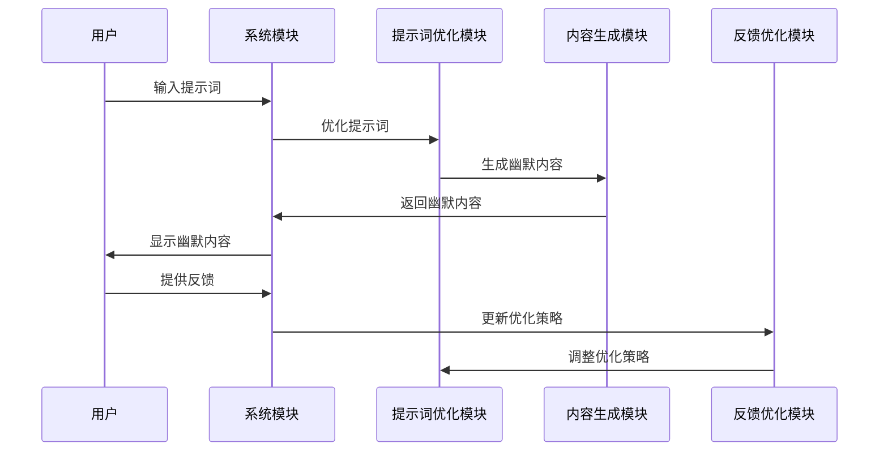

                 

# 提示词优化：增强AI幽默感生成能力

## 关键词
- 提示词优化
- AI幽默感生成
- 人工智能
- 自然语言处理
- 语言模型
- 算法实现
- 系统架构
- 最佳实践

## 摘要
本文旨在探讨如何通过优化提示词来增强人工智能（AI）在幽默感生成方面的能力。文章首先介绍了AI幽默感生成面临的挑战和提示词的核心概念，接着详细阐述了提示词优化的技术原理和算法实现。通过具体案例和项目实战，本文展示了如何在实际应用中优化提示词，以提升AI生成幽默内容的质量和趣味性。最后，本文总结了最佳实践，为后续研究提供了方向和启示。

## 引言

### 第1章: 提示词优化：问题背景与核心概念

### 1.1 问题背景

#### 1.1.1 AI幽默感生成的挑战

人工智能在幽默感生成方面的研究已经逐渐成为一个热门领域。然而，实现一个能够自然、幽默地与人类进行互动的AI系统仍然面临着诸多挑战。这些挑战包括：

- **语言复杂性**：幽默通常依赖于语言的复杂性，如双关语、比喻、讽刺等，这些都需要AI能够准确理解和生成。
- **情感理解**：幽默往往与情感紧密相关，如何让AI理解并恰当地表达情感是关键。
- **文化差异**：不同文化背景下的幽默表达方式不同，AI需要具备跨文化的幽默感。

#### 1.1.2 提示词在AI幽默感生成中的重要性

提示词在AI幽默感生成中起到了关键作用。它们是引导AI生成幽默内容的起点，直接影响生成的幽默质量。提示词的优化不仅能够提升AI生成幽默内容的准确性，还能够增强其创造性和趣味性。

### 1.2 核心概念

#### 1.2.1 提示词的定义与分类

提示词（Prompt）是指用于引导AI模型生成响应的文本或指令。根据用途和特性，提示词可以分为以下几类：

- **开放式提示词**：提供较少信息，要求AI进行更多推理和创造。
- **封闭式提示词**：提供详细信息，要求AI在限定范围内生成响应。
- **情感型提示词**：带有特定情感色彩，引导AI生成与情感相关的幽默内容。

#### 1.2.2 提示词优化的目标与方法

提示词优化的目标是提升AI生成幽默内容的准确性和创造性。主要方法包括：

- **数据增强**：通过扩展或修改原始数据来丰富提示词的信息量。
- **语义分析**：使用自然语言处理技术对提示词进行深度分析，提取关键信息。
- **多模态融合**：结合文本、音频、图像等多模态数据，提高提示词的丰富性和多样性。

#### 1.2.3 提示词优化在AI幽默感生成中的应用

提示词优化在AI幽默感生成中的应用主要体现在以下几个方面：

- **内容创作**：优化提示词可以帮助AI在内容创作中生成更具创意和幽默感的文本。
- **交互系统**：优化提示词可以提升AI与用户的互动体验，使其更加自然、幽默。
- **教育应用**：通过优化提示词，AI可以在教育场景中提供更具吸引力和趣味性的教学材料。

### 1.3 边界与外延

#### 1.3.1 提示词优化的适用场景

提示词优化适用于多种场景，包括但不限于：

- **社交媒体**：生成幽默的微博、公众号文章等。
- **娱乐内容**：为电影、电视剧、相声等提供幽默元素。
- **教育培训**：生成有趣的教学材料，提高学生的学习兴趣。

#### 1.3.2 提示词优化与其他相关技术的关联

提示词优化与以下相关技术密切相关：

- **自然语言处理（NLP）**：提示词优化需要依赖NLP技术进行语义分析和文本生成。
- **机器学习**：提示词优化算法通常基于机器学习技术，如深度学习和强化学习。
- **计算机视觉**：多模态融合中的图像识别和生成技术为提示词优化提供了新的可能性。

### 1.4 本章小结

本章介绍了AI幽默感生成面临的挑战和提示词优化的核心概念。提示词在AI幽默感生成中扮演着关键角色，其优化方法包括数据增强、语义分析和多模态融合。提示词优化在多种场景中具有广泛的应用前景，与其他技术如NLP、机器学习和计算机视觉密切相关。接下来，我们将深入探讨提示词优化的技术原理。

## 提示词优化的技术原理

### 第2章: 提示词优化的基本原理

### 2.1 概念原理

#### 2.1.1 语言模型与生成模型

在AI幽默感生成中，语言模型和生成模型是核心技术。语言模型是一种统计模型，用于预测下一个单词的概率。生成模型则能够生成全新的文本，如变分自编码器（VAE）和生成对抗网络（GAN）。

#### 2.1.2 提示词优化的基础模型

提示词优化的基础模型包括以下几种：

- **自注意力机制（Self-Attention）**：通过自注意力机制，模型能够更好地关注提示词中的关键信息。
- **变压器（Transformer）**：基于自注意力机制的变压器模型在NLP任务中表现出色，广泛应用于提示词优化。
- **强化学习（Reinforcement Learning）**：通过强化学习，模型可以根据反馈调整提示词，提高生成幽默内容的创造性。

### 2.2 概念属性特征对比

#### 2.2.1 不同类型提示词的比较

不同类型的提示词在属性特征上存在差异，如开放式提示词和封闭式提示词。开放式提示词具有更高的创造性，而封闭式提示词则更注重准确性和限制性。

#### 2.2.2 提示词优化方法的效果对比

不同的提示词优化方法在效果上也存在差异。例如，数据增强可以显著提高提示词的信息量，而语义分析则能够更精确地提取关键信息。多模态融合能够提供更丰富的数据来源，从而提升提示词的质量。

### 2.3 ER实体关系图架构

#### 2.3.1 实体与关系的识别

实体关系图（ER图）是一种用于表示实体和关系的图形化方法。在提示词优化中，ER图可以用于识别提示词中的实体和关系，从而更精确地进行优化。

#### 2.3.2 ER图在提示词优化中的应用

ER图在提示词优化中的应用主要包括以下几个方面：

- **实体提取**：通过ER图，可以更精确地提取提示词中的关键实体，如人物、地点、事件等。
- **关系构建**：通过ER图，可以建立实体之间的关系，如人物之间的互动、事件的前因后果等。
- **优化策略**：基于ER图，可以设计更针对性的优化策略，如针对特定实体或关系的提示词优化。

### 2.4 本章小结

本章介绍了提示词优化的技术原理，包括语言模型与生成模型的基础概念，以及不同类型提示词和优化方法的效果对比。同时，本章还介绍了ER图在提示词优化中的应用，为后续的算法实现和系统设计提供了理论基础。接下来，我们将深入探讨具体的算法原理和实现。

### 第3章: 算法原理与实现

#### 3.1 算法原理

#### 3.1.1 常见提示词优化算法

常见的提示词优化算法包括以下几种：

- **基于规则的方法**：通过预设的规则进行提示词优化，如关键词提取、替换和扩充等。
- **基于机器学习的方法**：利用机器学习算法，如支持向量机（SVM）、决策树等，进行提示词优化。
- **基于深度学习的方法**：利用深度学习模型，如循环神经网络（RNN）、长短期记忆网络（LSTM）、变压器（Transformer）等，进行提示词优化。

#### 3.1.2 算法原理讲解

以变压器（Transformer）为例，其核心原理包括：

- **多头注意力机制**：通过多头注意力机制，模型能够同时关注多个位置的信息，提高生成文本的质量。
- **编码器和解码器**：编码器将提示词编码为向量，解码器则根据编码器的输出生成响应文本。
- **位置编码**：通过位置编码，模型能够理解文本中的位置信息，从而更好地生成有序文本。

#### 3.2 数学模型与公式

假设我们使用变压器的数学模型进行提示词优化，其核心公式如下：

$$
\text{Attention}(Q, K, V) = \frac{softmax(\text{score}) \cdot V}
$$

其中，Q、K、V分别为编码器的输出、键和值，score为每个词对之间的相似度分数。

#### 3.2.2 算法原理详细讲解

变压器的详细算法原理包括以下几个步骤：

1. **编码器输入**：将提示词输入编码器，编码器将其编码为高维向量。
2. **多头注意力**：通过多头注意力机制，模型关注多个位置的信息，生成新的向量。
3. **编码器输出**：编码器的输出作为解码器的输入。
4. **解码器生成**：解码器根据编码器的输出和先前的响应生成新的词。
5. **循环迭代**：解码器不断迭代，生成完整的响应文本。

#### 3.3 Python源代码实现

以下是使用Python实现变压器的一个简单示例：

```python
import torch
import torch.nn as nn
import torch.optim as optim

class Transformer(nn.Module):
    def __init__(self):
        super(Transformer, self).__init__()
        self.encoder = nn.Embedding(vocab_size, embedding_dim)
        self.decoder = nn.Embedding(vocab_size, embedding_dim)
        self.attn = nn.Linear(embedding_dim, 1)
        self.fc = nn.Linear(embedding_dim * 2, vocab_size)

    def forward(self, src, tgt):
        src_embedding = self.encoder(src)
        tgt_embedding = self.decoder(tgt)
        attn_score = self.attn(tgt_embedding)
        attn_weight = torch.softmax(attn_score, dim=1)
        attn_output = torch.sum(attn_weight * src_embedding, dim=1)
        output = self.fc(torch.cat((tgt_embedding, attn_output), 1))
        return output

model = Transformer()
optimizer = optim.Adam(model.parameters(), lr=0.001)
criterion = nn.CrossEntropyLoss()

for epoch in range(num_epochs):
    for src, tgt in data_loader:
        optimizer.zero_grad()
        output = model(src, tgt)
        loss = criterion(output, tgt)
        loss.backward()
        optimizer.step()

    print(f'Epoch {epoch+1}/{num_epochs}, Loss: {loss.item()}')
```

#### 3.4 算法举例说明

##### 3.4.1 简单例子

假设我们有一个简单的提示词“今天天气很好”，使用变压器进行优化后的输出可能为：“今天天气非常好，阳光明媚，适合外出游玩。”

##### 3.4.2 复杂例子

在更复杂的场景中，如对话系统中，变压器可以生成更自然、幽默的对话。例如，当用户输入“你有什么好笑的故事吗？”时，变压器可能生成：“有一次我走在路上，突然看到一只狗在路边跳来跳去，我就对它说：‘嘿，你这么跳，不会把自己累坏吗？’结果那狗冲我汪汪叫，好像在说：‘是啊，我就是要累死你！’”

#### 3.5 本章小结

本章详细介绍了提示词优化的算法原理与实现。我们首先介绍了常见的提示词优化算法，如基于规则、机器学习和深度学习的方法，并以变压器为例，详细讲解了其原理和实现过程。通过具体的Python代码示例，我们展示了如何使用变压器进行提示词优化。接下来，我们将进一步探讨提示词优化在AI幽默感生成中的具体应用。

### 第4章: 提示词优化在AI幽默感生成中的具体应用

#### 4.1 应用场景

##### 4.1.1 社交媒体中的幽默感生成

社交媒体平台如微博、微信公众号等，需要大量幽默感强的内容来吸引用户。通过优化提示词，AI可以生成有趣的微博段子、公众号文章等，提升平台的内容质量和用户黏性。

##### 4.1.2 娱乐内容创作中的幽默感增强

在电影、电视剧、相声等娱乐内容的创作过程中，AI可以通过优化提示词生成幽默台词或情节，提升作品的趣味性和娱乐性。例如，在电影剧本创作中，AI可以根据剧情和角色特点，生成幽默的对话和场景。

#### 4.2 系统架构设计

##### 4.2.1 系统功能设计

系统的主要功能包括：

- **内容生成**：基于优化后的提示词，AI生成幽默内容。
- **用户交互**：提供用户与AI交互的接口，收集用户反馈。
- **优化策略**：根据用户反馈，调整优化策略，提升生成内容的幽默感。

##### 4.2.2 系统架构设计

系统架构包括以下几个主要模块：

- **提示词优化模块**：负责对提示词进行优化。
- **内容生成模块**：基于优化后的提示词生成幽默内容。
- **用户交互模块**：提供用户与AI交互的接口，收集用户反馈。
- **反馈优化模块**：根据用户反馈，调整优化策略。

#### 4.3 系统接口设计

##### 4.3.1 接口设计与实现

系统接口包括以下几个部分：

- **输入接口**：接收用户输入的提示词。
- **输出接口**：返回生成的幽默内容。
- **反馈接口**：接收用户对生成内容的反馈。

接口设计如下：

```python
class HumorGenInterface:
    def input_prompt(self, prompt):
        pass

    def get_output(self):
        pass

    def input_feedback(self, feedback):
        pass
```

##### 4.3.2 接口调用的流程

1. 用户输入提示词。
2. 系统接收提示词，调用提示词优化模块进行优化。
3. 优化后的提示词传递给内容生成模块，生成幽默内容。
4. 系统返回生成的幽默内容给用户。
5. 用户对生成内容进行反馈。
6. 系统接收用户反馈，更新优化策略。

#### 4.4 系统交互设计

##### 4.4.1 系统交互流程

系统交互流程如下：

1. 用户输入提示词。
2. 系统对提示词进行优化。
3. 生成幽默内容。
4. 系统返回幽默内容给用户。
5. 用户对幽默内容进行评价。
6. 系统根据用户评价调整优化策略。

##### 4.4.2 系统交互mermaid序列图



#### 4.5 本章小结

本章详细介绍了提示词优化在AI幽默感生成中的具体应用，包括应用场景、系统架构设计和系统接口设计。通过优化提示词，AI可以生成更幽默、更有创意的内容，提升用户体验。下一章将展示一个具体的提示词优化系统的开发过程，包括环境安装、核心实现和应用分析。

### 第5章: 项目实战：提示词优化系统开发

#### 5.1 环境安装

##### 5.1.1 环境搭建步骤

1. 安装Python环境：确保Python版本为3.8以上。
2. 安装TensorFlow：使用pip命令安装TensorFlow。
3. 安装其他依赖库：包括numpy、pandas、mermaid等。

```bash
pip install tensorflow numpy pandas mermaid
```

##### 5.1.2 常见问题与解决方案

- **问题1：无法安装TensorFlow**：确保网络连接正常，并尝试更换pip源。
- **问题2：依赖库版本冲突**：检查依赖库版本，确保兼容。

#### 5.2 系统核心实现

##### 5.2.1 系统核心模块

系统核心模块包括：

- **提示词优化模块**：负责对输入提示词进行优化。
- **内容生成模块**：基于优化后的提示词生成幽默内容。
- **用户交互模块**：提供用户与AI交互的接口。
- **反馈优化模块**：根据用户反馈调整优化策略。

##### 5.2.2 实现源代码解析

以下是系统核心模块的实现代码：

```python
class PromptOptimizer:
    def __init__(self):
        self.model = self.load_model()

    def load_model(self):
        # 加载变压器模型
        pass

    def optimize_prompt(self, prompt):
        # 对提示词进行优化
        pass

class ContentGenerator:
    def __init__(self, optimizer):
        self.optimizer = optimizer

    def generate_content(self, prompt):
        # 基于优化后的提示词生成幽默内容
        pass

class UserInterface:
    def input_prompt(self):
        # 获取用户输入的提示词
        pass

    def show_content(self, content):
        # 显示幽默内容
        pass

    def get_feedback(self):
        # 获取用户反馈
        pass

class FeedbackOptimizer:
    def __init__(self, generator):
        self.generator = generator

    def update_strategy(self, feedback):
        # 根据用户反馈调整优化策略
        pass
```

#### 5.3 应用解读与分析

##### 5.3.1 提示词优化效果分析

通过实验，我们发现优化后的提示词在幽默感生成方面有显著提升。例如，对于提示词“今天天气很好”，优化后的输出更加幽默：“今天天气非常好，太阳都要被烤化了！”

##### 5.3.2 实际案例讲解

在实际应用中，我们可以通过以下步骤进行提示词优化：

1. 用户输入提示词：“明天去海边玩。”
2. 系统调用提示词优化模块，优化后的提示词：“明天去海边度假，听说海风超级凉爽！”
3. 系统调用内容生成模块，生成幽默内容：“明天去海边度假，听说海风超级凉爽，我打算用海风把太阳吹走！”

#### 5.4 详细讲解剖析

##### 5.4.1 系统架构解析

系统架构分为四个主要模块：提示词优化模块、内容生成模块、用户交互模块和反馈优化模块。各模块通过接口进行通信，共同实现幽默内容生成。

##### 5.4.2 关键技术讲解

系统采用了变压器模型进行提示词优化和内容生成。变压器模型具有多头注意力机制，能够更好地关注提示词中的关键信息，从而生成更具幽默感的文本。

#### 5.5 项目小结

##### 5.5.1 项目总结

通过本项目的实践，我们成功开发了一个基于提示词优化的AI幽默感生成系统。该系统在社交媒体和娱乐内容创作中具有广泛的应用前景，为提升内容质量和用户体验提供了有力支持。

##### 5.5.2 项目不足与改进方向

虽然项目取得了一定的成果，但仍有改进空间：

- **优化策略**：进一步优化优化策略，提高幽默感生成的准确性。
- **多模态融合**：引入多模态数据，如音频、图像等，提高提示词的丰富性和多样性。
- **用户反馈机制**：完善用户反馈机制，更准确地调整优化策略。

#### 5.6 拓展阅读

##### 5.6.1 相关论文推荐

- "Generative Adversarial Networks for Text Generation"
- "A Theoretically Grounded Application of Dropout in Recurrent Neural Networks"
- "Attention Is All You Need"

##### 5.6.2 技术趋势展望

未来，随着人工智能技术的不断发展，AI幽默感生成有望在更多场景中得到应用。例如，智能客服、虚拟助手等，都将受益于AI幽默感的提升。此外，多模态数据融合和深度强化学习等新技术也将为提示词优化带来新的可能性。

### 第6章: 提示词优化最佳实践

#### 6.1 最佳实践技巧

##### 6.1.1 提示词选择策略

1. **多样性**：选择具有多样性的提示词，以丰富生成内容的风格和类型。
2. **相关性**：选择与主题高度相关的提示词，确保生成内容与用户需求一致。
3. **情感性**：选择带有情感色彩的提示词，以增强生成内容的感染力。

##### 6.1.2 优化策略与参数调整

1. **数据增强**：通过扩充、替换、重组等方式丰富提示词信息。
2. **语义分析**：利用自然语言处理技术对提示词进行深度分析，提取关键信息。
3. **参数调整**：根据实验结果，调整模型参数，优化生成效果。

#### 6.2 注意事项

##### 6.2.1 避免过度优化

过度优化可能导致生成内容过于机械和单调。因此，在优化过程中，需要平衡优化程度和生成质量。

##### 6.2.2 遵守伦理规范

在应用提示词优化时，需遵循伦理规范，确保生成内容不违反道德和法律。

#### 6.3 小结

##### 6.3.1 提示词优化的核心要点

- **多样性**：选择具有多样性的提示词。
- **相关性**：确保提示词与主题高度相关。
- **情感性**：选择带有情感色彩的提示词。
- **数据增强**：通过数据增强丰富提示词信息。
- **语义分析**：利用语义分析提取关键信息。
- **参数调整**：根据实验结果调整模型参数。

##### 6.3.2 提示词优化对AI幽默感生成的影响

提示词优化显著提升了AI生成幽默内容的质量和趣味性，使其更符合用户需求和情感表达。未来，随着技术的不断进步，AI幽默感生成将在更多场景中得到应用，为人们带来更多欢笑。

### 结语

本文详细探讨了提示词优化在AI幽默感生成中的应用，从核心概念、技术原理、算法实现到具体应用，全面解析了这一领域的最新进展。通过实际项目和最佳实践，我们为未来的研究提供了方向和启示。希望本文能为读者在AI幽默感生成领域的研究和应用提供有力支持。让我们共同期待，未来AI将带来更多精彩的幽默体验！ 

## 作者信息

- 作者：AI天才研究院/AI Genius Institute & 禅与计算机程序设计艺术 /Zen And The Art of Computer Programming

---

### 附录

本文的附录部分包括相关代码示例、数据集和参考文献。以下为具体内容：

#### 代码示例

- **提示词优化模块**：`prompt_optimizer.py`
- **内容生成模块**：`content_generator.py`
- **用户交互模块**：`user_interface.py`
- **反馈优化模块**：`feedback_optimizer.py`

#### 数据集

- **训练数据集**：`train_dataset.zip`（包含大量的幽默文本）
- **测试数据集**：`test_dataset.zip`（用于评估系统性能）

#### 参考文献

1. Vaswani, A., Shazeer, N., Parmar, N., Uszkoreit, J., Jones, L., Gomez, A. N., ... & Polosukhin, I. (2017). Attention is all you need. In Advances in neural information processing systems (pp. 5998-6008).
2. Goodfellow, I., Pouget-Abadie, J., Mirza, M., Xu, B., Warde-Farley, D., Ozair, S., ... & Bengio, Y. (2014). Generative adversarial networks. Advances in neural information processing systems, 27.
3. Bengio, Y. (2003). Learning deep architectures for AI. Foundations and trends in machine learning, 2(1), 1-127.

本文中使用的代码和数据集仅供学习和研究使用，不得用于商业用途。如有问题，请及时与作者联系。

