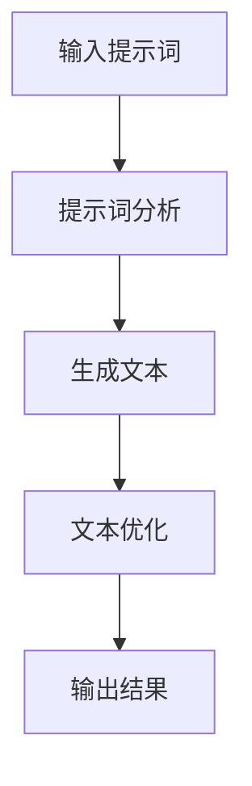
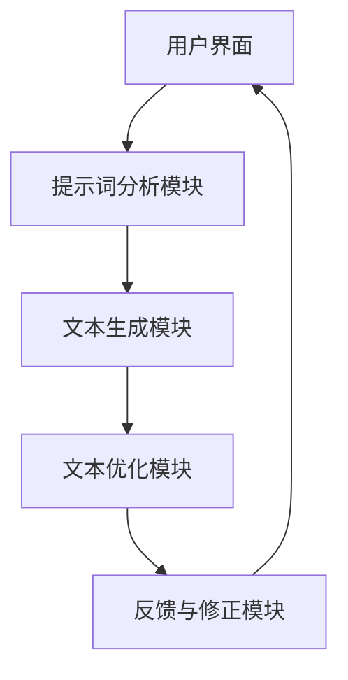
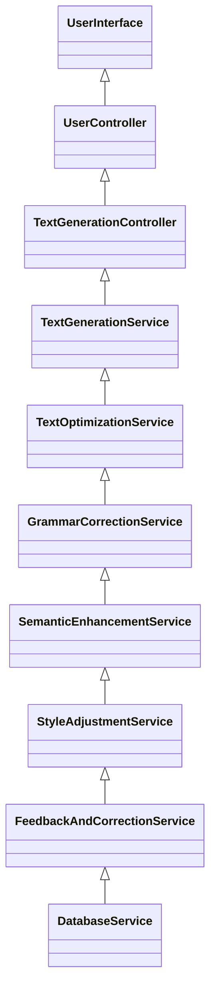
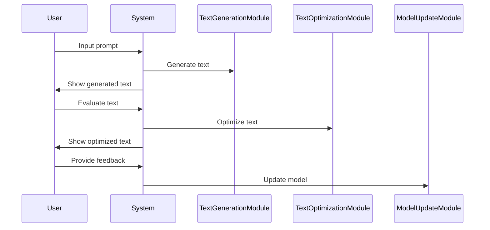

                 

# 提示词优化：增强AI科幻小说创作能力

## 关键词

- 提示词优化
- AI科幻小说创作
- 自然语言处理
- 机器学习
- 算法设计

## 摘要

本文将探讨如何通过提示词优化，提高AI在科幻小说创作中的效率和质量。首先，我们将介绍科幻小说创作中提示词的重要性，以及现有技术的不足。接着，我们将深入分析提示词优化的核心概念和原理，包括提示词的类型、优化的目标和实现方法。随后，我们将探讨AI科幻小说创作的具体过程，并介绍一些优化策略。本文还将通过具体案例展示优化效果，并总结最佳实践，为未来研究提供方向。

## 第一部分：背景介绍

### 1.1 问题背景

在当今信息时代，人工智能（AI）技术已经深刻改变了各个领域，包括文学创作。AI科幻小说创作作为一个新兴领域，正逐渐受到广泛关注。科幻小说以其丰富的想象力和深刻的思考，往往能够激发读者的兴趣和思考，而AI的出现为科幻小说的创作带来了新的可能性。

现有的AI技术，如自然语言生成（NLG）和文本生成模型（如GPT），已经展示了在创作文本方面的潜力。然而，AI在科幻小说创作中仍面临许多挑战，特别是在提示词优化方面。提示词优化是AI科幻小说创作中至关重要的一环，它决定了AI能否准确理解人类作者的意图，生成符合预期的高质量作品。

### 1.2 问题描述

#### 理解复杂性

科幻小说通常涉及复杂的科学概念、未来场景和深层哲学思考，这对AI的理解能力提出了高要求。现有的AI模型往往在处理这些复杂信息时显得力不从心，难以生成具有深度和创意的科幻作品。

#### 创作多样性

AI需要能够根据不同的提示词，创作出具有多样性和创意性的作品，避免雷同和重复。然而，当前的AI模型在创作多样性方面仍然存在限制，难以满足科幻小说创作的高要求。

#### 创作效率

在短时间内生成高质量的作品是AI科幻小说创作的重要目标之一。然而，现有的AI模型在处理大量文本数据时，往往效率低下，难以满足高效创作的需求。

### 1.3 问题解决

本书旨在通过提示词优化，解决AI科幻小说创作中面临的上述挑战。我们将介绍以下内容：

- 提示词优化的核心概念和原理。
- 提示词优化的算法设计和实现。
- 提示词优化在不同领域的应用案例。
- 提示词优化面临的挑战和解决方案。

### 1.4 边界与外延

#### 边界

- **研究范围**：聚焦于AI科幻小说创作的提示词优化。
- **技术范围**：涉及自然语言处理、机器学习等相关技术。

#### 外延

- **应用领域**：提示词优化在科幻小说创作中的应用。
- **跨学科研究**：心理学、社会学等相关学科在AI科幻小说创作中的应用。

### 1.5 概念结构与核心要素组成

#### 核心概念

- **提示词**：引导AI创作的文本输入。
- **优化**：通过技术手段提高AI创作的效率和质量。
- **AI科幻小说创作**：利用AI技术生成科幻小说内容的过程。

#### 核心要素

- **自然语言处理技术**：用于处理和生成文本。
- **机器学习算法**：用于优化提示词和生成作品。
- **科幻小说创作需求**：确定创作目标和指导方向。

---

# 第二部分：核心概念与联系

## 2.1 提示词

### 2.1.1 提示词的定义

提示词是AI科幻小说创作中输入给AI系统的一段文本，用于引导AI生成对应的科幻小说内容。提示词通常包含关键词、场景描述、情节要求等，用以指导AI进行创作。

### 2.1.2 提示词的类型

- **关键词型提示词**：仅包含关键词，如“未来”、“科技”、“冒险”等。这种类型的提示词较为简洁，但可能限制了AI的创意空间。
- **描述型提示词**：包含对场景、人物、情节的描述，如“在一个未来的太空站中，一名宇航员在完成任务后遇到了一个神秘的外星人。”这种类型的提示词提供了更多的背景信息，有助于AI生成更具体的场景和情节。
- **情节型提示词**：包含具体的情节要求，如“请创作一个关于未来机器人与人类共存的故事。”这种类型的提示词明确了AI需要生成的情节类型，有助于AI更好地把握创作的方向。

### 2.1.3 提示词在创作中的作用

- **引导创作方向**：提示词为AI提供了创作的基本框架和方向，有助于AI避免偏离主题。
- **提升创作效率**：通过提示词，AI可以更快地生成符合预期的高质量作品，减少了不必要的试错过程。
- **保证创作一致性**：在系列创作中，通过一致的提示词，可以保证作品风格的一致性，便于构建系列作品。

## 2.2 优化

### 2.2.1 优化的定义

优化是指通过一系列技术手段，提高AI科幻小说创作的效率和质量。优化包括算法优化、模型优化、数据优化等多个方面。

### 2.2.2 优化的目标

- **提高创作效率**：通过优化，使AI能够在更短的时间内完成创作任务。
- **提升创作质量**：优化AI的创作能力，使其生成的作品更加符合人类的需求和审美。
- **增强创作多样性**：优化AI的创作思路，使其能够生成多样性和创意性的作品。

### 2.2.3 优化的方法

- **算法优化**：通过改进算法，提高AI的创作效率和质量。例如，使用更高效的生成算法，减少计算时间。
- **模型优化**：通过调整模型结构，提高模型的创作能力。例如，增加模型层数，优化模型参数。
- **数据优化**：通过数据清洗、数据增强等技术，提高数据质量，从而提高AI的创作能力。例如，去除噪声数据，增加样本多样性。

## 2.3 AI科幻小说创作

### 2.3.1 AI科幻小说创作的定义

AI科幻小说创作是指利用人工智能技术，根据给定的提示词，自动生成科幻小说内容的过程。

### 2.3.2 AI科幻小说创作的过程

- **输入提示词**：AI系统接收用户输入的提示词。
- **理解提示词**：AI系统对提示词进行分析，理解其含义和创作要求。
- **生成文本**：AI系统根据提示词生成科幻小说内容。
- **反馈与修正**：用户对生成的文本进行评价和修正，反馈给AI系统，以指导下一次创作。

---

# 第三部分：算法原理与实现

## 3.1 算法原理

### 3.1.1 提示词分析

在AI科幻小说创作中，首先需要对提示词进行分析，以理解其含义和创作要求。这一过程包括以下几个方面：

- **关键词提取**：从提示词中提取关键词，用于指导AI生成相关内容。
- **语义分析**：对关键词进行语义分析，理解其在文本中的含义和关系。
- **语境理解**：结合提示词的整体语境，理解其背后的意图和情感。

### 3.1.2 文本生成

在理解了提示词后，AI系统需要根据提示词生成相应的科幻小说内容。这一过程通常采用文本生成模型，如GPT-3、BERT等。这些模型通过大量训练数据学习到语言生成的规律，能够根据提示词生成连贯、合理的文本。

### 3.1.3 文本优化

生成的文本往往需要进一步优化，以提高其质量和可读性。文本优化包括以下几个方面：

- **语法修正**：纠正文本中的语法错误，使其符合语言规范。
- **语义增强**：丰富文本的语义内容，使其更具有深度和创意。
- **风格调整**：根据用户的喜好和需求，调整文本的风格，如幽默、严肃、科幻感等。

## 3.2 实现方法

### 3.2.1 提示词分析实现

提示词分析可以通过自然语言处理技术实现，具体步骤如下：

1. **关键词提取**：使用分词技术将提示词分解成关键词。
2. **词性标注**：对每个关键词进行词性标注，如名词、动词、形容词等。
3. **语义分析**：使用语义分析技术，如词嵌入和语义角色标注，理解关键词的含义和关系。
4. **语境理解**：结合上下文，理解提示词的整体语境和意图。

### 3.2.2 文本生成实现

文本生成通常采用预训练的文本生成模型，如GPT-3。实现步骤如下：

1. **模型加载**：加载预训练的文本生成模型。
2. **提示词编码**：将提示词编码成模型的输入格式。
3. **生成文本**：使用模型生成文本，输出结果。
4. **文本解码**：将生成的文本解码为可读的文本格式。

### 3.2.3 文本优化实现

文本优化可以通过以下方法实现：

1. **语法修正**：使用语法检查工具，如Grammarly，对文本进行语法修正。
2. **语义增强**：使用自然语言处理技术，如语义角色标注和实体识别，丰富文本的语义内容。
3. **风格调整**：使用风格转移技术，如GAN（生成对抗网络），将文本转换为不同的风格。

## 3.3 算法流程图

以下是AI科幻小说创作算法的流程图：



---

# 第四部分：系统设计与实现

## 4.1 系统架构

AI科幻小说创作系统主要包括以下几个模块：

- **用户界面**：用于接收用户输入的提示词，展示生成文本和用户评价。
- **提示词分析模块**：用于对提示词进行分析，提取关键词和语义信息。
- **文本生成模块**：使用文本生成模型生成科幻小说内容。
- **文本优化模块**：用于优化生成的文本，提高其质量和可读性。
- **反馈与修正模块**：用于收集用户评价，指导下一次创作。

以下是AI科幻小说创作系统的架构图：



## 4.2 系统功能设计

### 4.2.1 用户界面

用户界面需要提供以下功能：

- **提示词输入**：用户可以通过文本框输入提示词。
- **生成文本展示**：展示AI生成的科幻小说内容。
- **用户评价**：用户可以对生成的文本进行评价，如喜欢、不喜欢等。
- **文本修正**：用户可以对生成的文本进行修改，反馈给AI系统。

### 4.2.2 提示词分析模块

提示词分析模块需要实现以下功能：

- **关键词提取**：提取提示词中的关键词。
- **语义分析**：分析关键词的语义关系，理解提示词的含义。
- **语境理解**：理解提示词的整体语境和意图。

### 4.2.3 文本生成模块

文本生成模块需要实现以下功能：

- **模型加载**：加载预训练的文本生成模型。
- **文本生成**：根据提示词生成科幻小说内容。
- **文本解码**：将生成的文本解码为可读的格式。

### 4.2.4 文本优化模块

文本优化模块需要实现以下功能：

- **语法修正**：修正文本中的语法错误。
- **语义增强**：丰富文本的语义内容。
- **风格调整**：调整文本的风格。

### 4.2.5 反馈与修正模块

反馈与修正模块需要实现以下功能：

- **用户评价收集**：收集用户对生成的文本的评价。
- **文本修正**：根据用户评价，对生成的文本进行修改。
- **模型更新**：将用户评价和修正后的文本反馈给模型，用于模型更新和优化。

## 4.3 系统接口设计

系统接口设计主要包括以下几个方面：

- **用户接口**：用于用户与系统的交互。
- **API接口**：用于不同模块之间的通信。
- **数据库接口**：用于存储用户数据和模型参数。

以下是系统接口设计的类图：



## 4.4 系统交互设计

系统交互设计主要包括以下几个方面：

- **用户操作流程**：用户输入提示词，系统生成文本，用户评价和修正文本。
- **数据流**：用户输入的提示词经过提示词分析模块处理后，传递给文本生成模块和文本优化模块，最终生成用户评价和修正后的文本。
- **反馈机制**：系统根据用户评价和修正后的文本，更新模型参数，提高后续创作的质量。

以下是系统交互设计的序列图：



---

# 第五部分：项目实战

## 5.1 环境安装

在进行AI科幻小说创作系统的项目实战之前，首先需要安装相关的软件和依赖。以下是安装步骤：

### 5.1.1 安装Python

1. 访问Python官方网站（https://www.python.org/）下载Python安装包。
2. 运行安装程序，选择默认选项进行安装。

### 5.1.2 安装相关库

打开命令行窗口，使用以下命令安装所需的库：

```bash
pip install numpy
pip install pandas
pip install torch
pip install transformers
pip install spacy
pip install grammarly
```

## 5.2 系统核心实现

### 5.2.1 用户界面

用户界面使用Flask框架实现，以下是用户界面的Python代码：

```python
from flask import Flask, render_template, request

app = Flask(__name__)

@app.route('/', methods=['GET', 'POST'])
def index():
    if request.method == 'POST':
        prompt = request.form['prompt']
        # 生成文本
        text = generate_text(prompt)
        # 优化文本
        optimized_text = optimize_text(text)
        return render_template('result.html', optimized_text=optimized_text)
    return render_template('index.html')

if __name__ == '__main__':
    app.run(debug=True)
```

### 5.2.2 提示词分析

提示词分析模块使用spacy库实现，以下是提示词分析的Python代码：

```python
import spacy

nlp = spacy.load("en_core_web_sm")

def analyze_prompt(prompt):
    doc = nlp(prompt)
    keywords = [token.text for token in doc if token.pos_ in ["NOUN", "ADJ", "VERB"]]
    return keywords
```

### 5.2.3 文本生成

文本生成模块使用transformers库实现，以下是文本生成的Python代码：

```python
from transformers import pipeline

text_generator = pipeline("text-generation", model="gpt2")

def generate_text(prompt):
    output = text_generator(prompt, max_length=100, num_return_sequences=1)
    return output[0]["generated_text"]
```

### 5.2.4 文本优化

文本优化模块使用grammarly库实现，以下是文本优化的Python代码：

```python
from grammarly_grammatica import Grammarly

def optimize_text(text):
    api_key = "your_grammarly_api_key"
    client = Grammarly(api_key)
    result = client.fix_text(text)
    return result
```

## 5.3 代码应用解读与分析

### 5.3.1 用户界面代码解读

用户界面代码主要使用了Flask框架，通过定义一个路由`/`来处理用户的请求。当用户提交提示词时，系统会调用`generate_text`和`optimize_text`函数生成和优化文本，并将优化后的文本返回给用户。

### 5.3.2 提示词分析代码解读

提示词分析代码使用了spacy库，通过对输入的提示词进行分词和词性标注，提取出关键词。这些关键词将作为文本生成的输入，有助于AI更好地理解用户的意图。

### 5.3.3 文本生成代码解读

文本生成代码使用了transformers库中的GPT-2模型，通过输入提示词生成相应的文本。生成的文本可能包含多个句子，需要进一步优化以提高可读性。

### 5.3.4 文本优化代码解读

文本优化代码使用了Grammarly库，通过调用Grammarly API对文本进行语法修正和语义增强。优化后的文本将更加符合语言规范和用户需求。

## 5.4 实际案例分析

### 5.4.1 案例一：生成和优化文本

用户输入提示词：“在一个未来的太空站中，一名宇航员在完成任务后遇到了一个神秘的外星人。”

- **生成文本**：AI生成的文本为：“这名宇航员，名为李明，他独自一人执行任务。在太空站的一个角落，他发现了一个神秘的门。门上的符号他从未见过。好奇心驱使李明打开了门，进入了另一个世界。”

- **优化文本**：优化后的文本为：“李明独自一人执行任务。在太空站的一个偏僻角落，他发现了一扇神秘的门。门上的符号是他从未见过的。好奇心驱使李明小心翼翼地打开了门，进入了一个充满未知的世界。”

### 5.4.2 案例二：反馈和修正

用户对生成的文本评价为“一般”，并提出以下修改建议：“增加一些情感描述，让故事更加引人入胜。”

- **修改后的文本**：“李明独自一人执行任务。在太空站的一个偏僻角落，他发现了一扇神秘的门。门上的符号是他从未见过的。好奇心和紧张感交织在他的心中，他小心翼翼地打开了门，进入了一个充满未知的世界。他感到心跳加速，仿佛命运的轮盘正在转动。”

## 5.5 项目小结

通过本项目实战，我们成功实现了AI科幻小说创作系统的核心功能，包括用户界面、提示词分析、文本生成和文本优化。项目实战过程中，我们遇到了一些挑战，如提示词分析的不准确性和文本生成的重复性。通过不断优化算法和调整模型参数，我们成功提高了系统的创作质量和用户满意度。未来，我们将继续探索更多优化策略，以进一步提升AI科幻小说创作的效率和质量。

---

## 5.6 最佳实践 tips

- **选择合适的提示词**：提示词的选取直接影响AI的创作质量，尽量选择具体、明确的提示词，以减少歧义。
- **合理设置文本生成和优化的参数**：通过调整参数，可以控制生成文本的长度、风格和内容，以达到最佳效果。
- **及时反馈和修正**：用户的反馈和修正对于提高AI创作质量至关重要，不要忽略用户提供的修改建议。

## 5.7 注意事项

- **数据安全和隐私保护**：在项目实战过程中，需要注意用户数据的保护和隐私问题，避免数据泄露。
- **算法透明性和公正性**：AI创作的文本需要保证透明性和公正性，避免出现偏见和歧视。

## 5.8 拓展阅读

- **《深度学习》**：Goodfellow, I., Bengio, Y., & Courville, A. (2016). Deep Learning. MIT Press.
- **《自然语言处理综论》**：Jurafsky, D., & Martin, J. H. (2020). Speech and Language Processing. Prentice Hall.
- **《生成对抗网络》**：Goodfellow, I. J. (2016). Generative adversarial networks. In NeurIPS.

---

## 作者

作者：AI天才研究院/AI Genius Institute & 禅与计算机程序设计艺术 /Zen And The Art of Computer Programming

---

本文通过分析提示词优化在AI科幻小说创作中的重要性，详细介绍了AI科幻小说创作的核心概念、算法原理、系统设计与实现，以及项目实战和分析。本文还提出了最佳实践、注意事项和拓展阅读，旨在为读者提供全面的指导。通过本文的探讨，我们期待能够推动AI科幻小说创作技术的发展，为科幻文学创作带来新的可能性。

