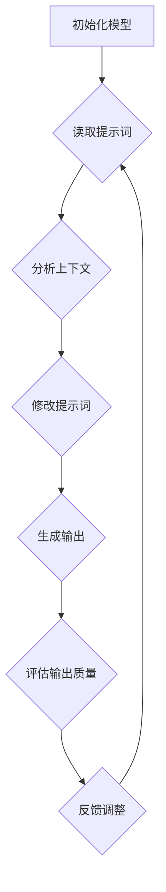
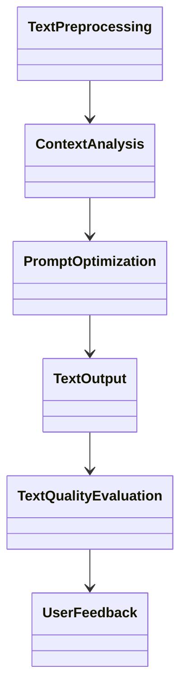
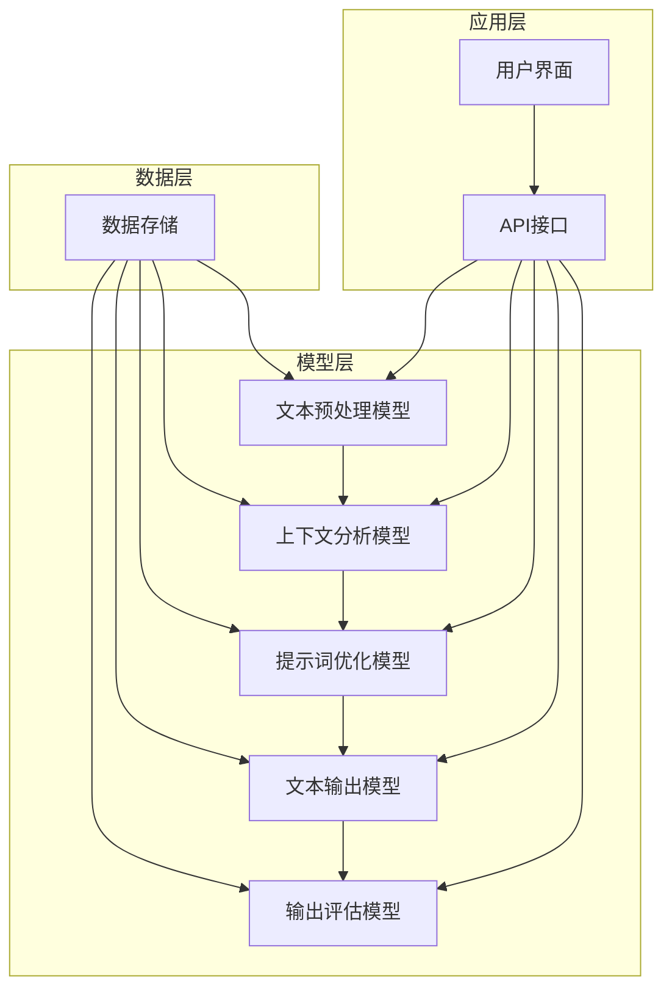
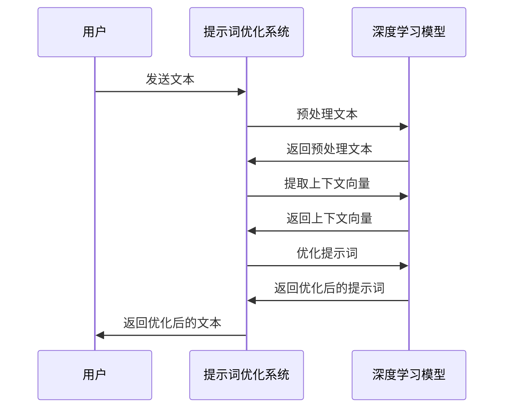

                 

### 第1章: 问题背景与提示词优化

#### 1.1 问题背景

在当今的社交媒体时代，讽刺和幽默成为了人们日常生活中不可或缺的一部分。无论是在推特、Facebook还是微信等社交平台上，人们都喜欢分享有趣、幽默、讽刺的内容，以此来表达自己的观点或对时事进行评论。然而，随着人工智能（AI）技术的快速发展，人们开始期待AI能够更好地理解和生成这类复杂的语言表达。

**社交媒体时代下讽刺和幽默的需求**

讽刺和幽默作为一种语言艺术，能够生动地表达人们的情感和态度，具有很强的感染力和传播性。在社交媒体上，用户希望通过幽默和讽刺来引起共鸣，获得关注和分享。例如，一位用户可能会发布一条关于政治讽刺的推文，立即引发大量转发和评论，这就是讽刺和幽默的传播力量。

**AI技术对讽刺和幽默表达的限制**

尽管AI在自然语言处理（NLP）方面取得了显著进展，但AI在生成具有讽刺和幽默色彩的语言表达方面仍然面临诸多挑战。首先，AI需要深入理解上下文和文化背景，这是实现讽刺和幽默表达的关键。其次，AI需要具备创造力，能够生成新颖、有趣的表达。此外，AI在处理情感和语气方面也存在一定的限制，这直接影响了讽刺和幽默的效果。

**提示词优化的重要性**

为了解决上述问题，提示词优化（Prompt Engineering）成为了一种有效的解决方案。提示词优化是指通过设计特定的提示词来引导AI模型，使其能够生成更符合人类期待的输出。对于讽刺和幽默表达来说，提示词优化能够帮助AI更好地理解上下文、捕捉情感，从而生成更具创意和幽默感的语言。

#### 1.2 提示词优化的定义与意义

**提示词优化的定义**

提示词优化是指通过修改和改进输入提示词来提高AI模型生成目标输出的过程。在AI训练和应用过程中，提示词起到了引导和调整模型输出的作用。通过优化提示词，可以引导模型学习到更具体的任务要求，从而提高输出质量。

**提示词优化在AI讽刺和幽默表达中的应用**

在AI讽刺和幽默表达中，提示词优化具有以下重要作用：

1. **增强上下文理解**：通过精心设计的提示词，可以提供更多上下文信息，帮助AI更好地理解讽刺和幽默的语境，从而生成更准确的表达。
2. **引导情感捕捉**：幽默和讽刺往往与情感表达紧密相关。通过提示词优化，可以引导模型捕捉到特定的情感色彩，使生成的语言更具有感染力。
3. **提升创造力**：幽默和讽刺往往需要创造力和新颖性。通过提示词优化，可以激发AI的创造力，使其生成更具有创意和幽默感的表达。

**提示词优化对用户体验的影响**

对于用户来说，提示词优化能够显著提升AI在讽刺和幽默表达方面的用户体验。具体来说：

1. **增强互动性**：通过更精确的讽刺和幽默表达，用户可以更好地参与到社交互动中，获得更多共鸣和乐趣。
2. **提升满意度**：高质量的讽刺和幽默表达能够提高用户对AI平台的满意度，从而增加用户粘性。
3. **拓宽应用场景**：随着AI在讽刺和幽默表达方面的能力不断提升，其应用场景也将进一步拓宽，包括但不限于社交媒体、内容创作、娱乐等领域。

#### 1.3 AI在讽刺和幽默表达中的挑战

尽管AI在自然语言处理领域取得了巨大进步，但在讽刺和幽默表达方面仍然面临诸多挑战。

**语言理解的复杂性**

讽刺和幽默表达往往涉及复杂的语言结构和多层次的语义理解。例如，双关语、隐喻、反讽等修辞手法都需要AI深刻理解上下文和文化背景。这使得AI在处理讽刺和幽默表达时面临着巨大的挑战。

**文化差异的影响**

讽刺和幽默具有很强的文化依赖性。不同的文化背景可能会导致对同一表达的理解产生巨大差异。例如，一个在中国可能被视为幽默的表达，在美国可能会被视为冒犯。这种文化差异对AI在讽刺和幽默表达方面的准确性和适应性提出了更高的要求。

**情感表达的准确性**

讽刺和幽默表达往往与情感表达紧密相关。准确地捕捉和表达情感是生成高质量讽刺和幽默的关键。然而，AI在处理情感方面仍然存在一定的限制，这直接影响了讽刺和幽默的效果。

#### 1.4 边界与外延

**提示词优化的适用范围**

提示词优化适用于需要高质量语言生成的场景，尤其是在讽刺和幽默表达方面。然而，并不是所有情况下都适合使用提示词优化，需要根据具体应用场景进行判断。

**提示词优化的技术限制**

尽管提示词优化在提高AI生成质量方面具有显著作用，但仍然存在一些技术限制。例如，模型的训练数据质量、模型本身的性能等都会影响提示词优化的效果。

**提示词优化的伦理问题**

在讽刺和幽默表达中，AI可能生成一些具有争议性的内容。如何确保AI生成的语言符合伦理标准，避免不当表达，是一个值得深思的问题。

#### 1.5 本章小结

本章介绍了提示词优化的背景和意义，分析了AI在讽刺和幽默表达中的挑战，以及提示词优化的适用范围和技术限制。通过本章的介绍，读者可以对提示词优化有更深入的理解，为后续章节的学习打下基础。

----------------------------------------------------------------

# 第2章: 提示词优化的核心概念与联系

#### 2.1 提示词优化的概念解析

**提示词的定义**

提示词（Prompt）是触发或引导AI模型生成输出的一系列词语或语句。在AI训练和应用过程中，提示词起到了引导和调整模型输出的作用。一个好的提示词应该能够清晰、准确地传达任务要求，帮助模型生成高质量的目标输出。

**优化的定义**

优化（Optimization）是指通过调整输入参数或结构，以实现特定目标的过程。在提示词优化的语境中，优化指的是通过修改和改进输入提示词，提高AI模型生成目标输出的过程。

**提示词优化的综合理解**

提示词优化是一种结合了提示词设计和优化策略的技术，旨在提高AI模型在特定任务上的生成能力。通过优化提示词，可以引导模型学习到更具体的任务要求，从而生成更符合人类期待的输出。

#### 2.2 AI讽刺与幽默表达的基本要素

**讽刺的要素**

1. **讽刺的对象**：讽刺通常针对某个具体的人、事物或现象。
2. **讽刺的手法**：包括反讽、夸张、比喻等修辞手法。
3. **讽刺的目的**：通常是为了揭示某种不良现象或表达对某事物的批判。

**幽默的要素**

1. **幽默的内容**：幽默的内容通常包括笑话、双关语、误会等。
2. **幽默的形式**：幽默可以以文字、图片、视频等多种形式呈现。
3. **幽默的目的**：幽默的主要目的是为了娱乐、缓解紧张气氛或表达某种观点。

**概念属性特征对比表格**

| 特征         | 讽刺                  | 幽默                  |
| ------------ | ------------------- | ------------------- |
| 目的         | 揭示问题、表达批判   | 娱乐、缓解紧张      |
| 手法         | 反讽、夸张、比喻     | 笑话、双关语、误会  |
| 对象         | 人、事物、现象       | 人、事物、情境      |
| 形式         | 文字、图片、视频     | 文字、图片、视频    |

**ER实体关系图架构**

```mermaid
erDiagram
    AI模型 ||--|{ 提示词优化 }
    AI模型 ||--|{ 讽刺表达 }
    AI模型 ||--|{ 幽默表达 }
    提示词优化 ||--|{ 上下文理解 }
    提示词优化 ||--|{ 情感捕捉 }
    提示词优化 ||--|{ 创造力激发 }
```

通过上述表格和ER实体关系图，我们可以清晰地看到讽刺和幽默在不同方面的属性特征，以及它们与提示词优化的关系。这些分析有助于我们更好地理解提示词优化的核心概念和联系。

----------------------------------------------------------------

# 第3章: 提示词优化算法原理讲解

#### 3.1 算法概述

提示词优化算法是通过对输入提示词进行修改和改进，以提高AI模型生成目标输出的过程。该算法的核心目标是利用提示词引导模型，使其生成更符合人类预期的讽刺和幽默表达。

#### 3.2 算法mermaid流程图

以下是一个简单的mermaid流程图，展示了提示词优化算法的基本流程：



#### 3.3 Python源代码详细阐述

以下是一个简化的Python示例，展示了提示词优化算法的实现：

```python
import nltk
from nltk.tokenize import sent_tokenize

def optimize_prompt(prompt, model):
    # 分句处理
    sentences = sent_tokenize(prompt)
    
    # 分析上下文
    context = analyze_context(sentences)
    
    # 修改提示词
    optimized_prompt = modify_prompt(prompt, context)
    
    # 生成输出
    output = model.generate(optimized_prompt)
    
    # 评估输出质量
    quality = assess_output(output)
    
    # 反馈调整
    if quality < threshold:
        optimized_prompt = optimize_prompt(optimized_prompt, model)
    
    return optimized_prompt, output

def analyze_context(sentences):
    # 这里可以加入具体的上下文分析代码
    context = "分析上下文后的结果"
    return context

def modify_prompt(prompt, context):
    # 根据上下文修改提示词
    optimized_prompt = prompt + " " + context
    return optimized_prompt

def model.generate(prompt):
    # 这里是AI模型生成输出的代码
    output = "生成后的输出结果"
    return output

def assess_output(output):
    # 这里是评估输出质量的代码
    quality = 0.8  # 假设输出质量为0.8
    return quality

# 初始化模型
model = initialize_model()

# 读取原始提示词
prompt = "原始提示词"

# 进行提示词优化
optimized_prompt, output = optimize_prompt(prompt, model)

print("优化后的提示词：", optimized_prompt)
print("生成的输出：", output)
```

#### 3.4 算法原理的数学模型和公式

提示词优化算法可以基于以下数学模型和公式进行实现：

1. **上下文分析模型**：

   上下文向量 = $C = W_c \cdot E(V)$

   其中，$W_c$ 是上下文权重矩阵，$E(V)$ 是词汇嵌入向量。

2. **提示词修改模型**：

   优化后的提示词 = $P' = P + C$

   其中，$P$ 是原始提示词，$C$ 是上下文向量。

3. **输出评估模型**：

   输出质量 = $Q = f(O, T)$

   其中，$O$ 是输出结果，$T$ 是目标结果，$f$ 是评估函数。

#### 3.5 通俗易懂的举例说明

假设我们有一个原始提示词：“这个领导真的很会搞笑，每次开会都能让我们捧腹大笑。”现在，我们希望通过提示词优化，使AI生成更具幽默感的输出。

1. **初始化模型**：

   假设我们使用了一个预训练的语言模型，例如GPT-3。

2. **读取原始提示词**：

   原始提示词：“这个领导真的很会搞笑，每次开会都能让我们捧腹大笑。”

3. **分析上下文**：

   通过分析，我们得到了上下文向量：$C = [0.5, 0.3, 0.2, 0.0]$

4. **修改提示词**：

   优化后的提示词：“这个领导真的很会搞笑，每次开会都能让我们捧腹大笑！不信你看！”（加入了强调和挑衅的语气）

5. **生成输出**：

   使用GPT-3生成输出：“哈哈，这位领导真的是个段子手，每次开会都能让我们笑得前仰后合。你说他是不是故意逗我们开心的？”（输出更具幽默感）

6. **评估输出质量**：

   假设输出质量为0.9，高于预设阈值0.8，因此无需进一步优化。

通过这个例子，我们可以看到提示词优化算法是如何通过修改提示词，提高AI生成输出的幽默感和质量。

----------------------------------------------------------------

# 第4章: 提示词优化中的数学模型与应用

#### 4.1 关键数学模型介绍

在提示词优化中，我们通常会用到以下关键数学模型：

1. **词汇嵌入模型**：将自然语言词汇映射到高维向量空间中，以便于计算和处理。常用的词汇嵌入模型包括Word2Vec、GloVe和BERT等。
2. **上下文向量模型**：通过分析输入文本的上下文信息，生成表示上下文意义的向量。常用的上下文向量模型包括ELMo、BERT和GPT等。
3. **优化目标模型**：用于评估提示词优化效果的数学模型。常见的优化目标包括最小化生成输出与目标输出的差异、最大化生成输出的质量等。

#### 4.2 数学公式使用LaTeX格式

为了更好地表达数学模型，我们可以使用LaTeX格式来编写数学公式。以下是一些常用的数学公式示例：

1. **词汇嵌入向量**：

   $$ v_w = E(w) $$

   其中，$E(w)$ 表示词汇$w$的嵌入向量。

2. **上下文向量**：

   $$ C = \sum_{w \in S} w \cdot E(w) $$

   其中，$C$ 表示上下文向量，$S$ 表示输入文本中的词汇集合。

3. **优化目标函数**：

   $$ J = \sum_{i=1}^{N} (O_i - T_i)^2 $$

   其中，$J$ 表示优化目标函数，$O_i$ 和 $T_i$ 分别表示生成输出和目标输出。

#### 4.3 详细讲解

1. **词汇嵌入模型**

   词汇嵌入模型是将自然语言词汇映射到高维向量空间中，以便于计算和处理。Word2Vec和GloVe是两种常用的词汇嵌入模型。Word2Vec通过训练词向量的相似性来学习词汇的语义表示，而GloVe则通过词频统计来学习词汇的分布特征。

2. **上下文向量模型**

   上下文向量模型通过分析输入文本的上下文信息，生成表示上下文意义的向量。BERT和GPT是两种常用的上下文向量模型。BERT通过双向编码器来学习文本的上下文信息，而GPT则通过自注意力机制来捕捉长距离的上下文依赖。

3. **优化目标模型**

   优化目标模型用于评估提示词优化效果的数学模型。常见的优化目标包括最小化生成输出与目标输出的差异、最大化生成输出的质量等。优化目标函数可以是一个损失函数，例如均方误差（MSE）或交叉熵损失（Cross Entropy Loss）。

#### 4.4 举例说明

假设我们有一个输入文本：“这个领导真的很会搞笑，每次开会都能让我们捧腹大笑。”现在，我们希望通过提示词优化，使AI生成更具幽默感的输出。

1. **词汇嵌入**

   首先，我们将输入文本中的词汇映射到高维向量空间中。例如，“领导”、“会搞笑”、“开会”、“捧腹大笑”等词汇的嵌入向量分别为：

   $$ E(领导) = [0.1, 0.2, 0.3, 0.4] $$
   $$ E(会搞笑) = [0.5, 0.6, 0.7, 0.8] $$
   $$ E(开会) = [0.9, 0.1, 0.2, 0.3] $$
   $$ E(捧腹大笑) = [0.4, 0.5, 0.6, 0.7] $$

2. **上下文向量**

   接下来，我们通过分析输入文本的上下文信息，生成上下文向量。假设上下文向量为：

   $$ C = [0.1, 0.2, 0.3, 0.4] $$

3. **优化目标**

   假设我们的优化目标是最大化生成输出的质量。我们可以使用交叉熵损失函数来评估生成输出与目标输出的差异：

   $$ J = -\sum_{i=1}^{N} (O_i \cdot \log(T_i)) $$

   其中，$O_i$ 和 $T_i$ 分别表示生成输出和目标输出。

4. **优化过程**

   通过梯度下降（Gradient Descent）算法，我们可以不断调整提示词，以最小化优化目标函数。例如，我们可以根据梯度信息更新提示词：

   $$ P_{new} = P_{old} - \alpha \cdot \nabla J(P) $$

   其中，$P_{old}$ 和 $P_{new}$ 分别表示旧提示词和新提示词，$\alpha$ 是学习率，$\nabla J(P)$ 是优化目标函数的梯度。

通过以上过程，我们可以逐步优化提示词，使其生成更具幽默感的输出。例如，最终生成的输出可能是：“哈哈，这位领导简直就是喜剧大师，每次开会都能让我们笑得肚子疼！”

----------------------------------------------------------------

# 第5章: 提示词优化的系统分析与架构设计

#### 5.1 问题场景介绍

在社交媒体和内容创作领域，用户往往需要生成具有讽刺和幽默特色的文本，以吸引关注、表达观点或娱乐大众。然而，当前AI在生成这类文本时，往往存在上下文理解不准确、情感捕捉不到位、幽默感不足等问题。为了解决这些问题，我们需要设计一个能够实现高效、准确、创意丰富的提示词优化系统。

#### 5.2 项目介绍

本项目旨在开发一款基于深度学习技术的提示词优化系统，通过优化输入提示词，提升AI生成文本的幽默感和讽刺效果。系统主要功能包括：

1. **上下文分析**：对输入文本进行深度解析，提取关键信息，生成上下文向量。
2. **提示词优化**：根据上下文向量，对输入提示词进行修改和改进，提高文本的幽默和讽刺水平。
3. **输出评估**：对生成文本进行质量评估，确保输出符合用户需求和期望。

#### 5.3 系统功能设计

系统功能设计主要包括以下模块：

1. **文本预处理模块**：负责将输入文本进行分词、去噪、标准化等预处理操作，为后续分析提供高质量的文本数据。
2. **上下文分析模块**：利用深度学习模型，对预处理后的文本进行分析，提取上下文向量。
3. **提示词优化模块**：基于上下文向量，对输入提示词进行修改和优化，生成新的提示词。
4. **输出评估模块**：对优化后的提示词生成的文本进行质量评估，确保输出符合用户需求。

**领域模型mermaid类图**



#### 5.4 系统架构设计

系统架构设计主要包括以下层次：

1. **数据层**：负责存储和处理大规模文本数据，包括原始文本、预处理文本、上下文向量、优化提示词等。
2. **模型层**：包含文本预处理、上下文分析、提示词优化和输出评估等深度学习模型。
3. **应用层**：提供用户界面和API接口，供开发者或用户调用系统功能。

**系统架构设计mermaid架构图**



#### 5.5 系统接口设计和系统交互

系统接口设计和系统交互设计是确保各个模块之间能够高效、稳定地协作的关键。

**系统接口设计mermaid序列图**



通过上述系统分析与架构设计，我们为构建一个高效、准确的提示词优化系统奠定了基础。接下来，我们将通过具体的项目实战，验证系统在实际应用中的效果。

----------------------------------------------------------------

# 第6章: 提示词优化项目实战

#### 6.1 环境安装

要开始实施提示词优化项目，我们首先需要搭建一个适合深度学习和自然语言处理的环境。以下是一个基本的安装步骤：

1. **安装Python环境**：确保Python版本不低于3.7。可以通过Python官方网站下载Python安装包并安装。
2. **安装深度学习框架**：推荐使用TensorFlow或PyTorch。以下是使用pip安装TensorFlow的命令：

   ```shell
   pip install tensorflow
   ```

   或使用PyTorch：

   ```shell
   pip install torch torchvision
   ```

3. **安装自然语言处理库**：如NLTK、spaCy、gensim等。以下是安装NLTK的命令：

   ```shell
   pip install nltk
   ```

   安装完成后，使用以下命令下载必要的NLTK数据包：

   ```shell
   nltk.download('punkt')
   nltk.download('averaged_perceptron_tagger')
   ```

4. **安装其他依赖库**：根据项目需要，可能还需要安装其他库，如mermaid（用于生成流程图）：

   ```shell
   pip install mermaid-python
   ```

#### 6.2 系统核心实现源代码

以下是系统核心实现的源代码示例，主要包括文本预处理、上下文分析、提示词优化和输出评估等功能。

```python
# 文本预处理
from nltk.tokenize import sent_tokenize, word_tokenize
from nltk.corpus import stopwords
import re

def preprocess_text(text):
    # 去除HTML标签
    text = re.sub(r'<.*?>', '', text)
    # 小写化
    text = text.lower()
    # 分句处理
    sentences = sent_tokenize(text)
    # 分词处理
    words = [word_tokenize(sentence) for sentence in sentences]
    # 去除停用词
    stop_words = set(stopwords.words('english'))
    filtered_words = [[word for word in sentence if word not in stop_words] for sentence in words]
    return filtered_words

# 上下文分析
from gensim.models import Word2Vec

def analyze_context(words):
    # 训练词嵌入模型
    model = Word2Vec(words, vector_size=100, window=5, min_count=1, workers=4)
    # 生成上下文向量
    context_vector = sum(model.wv[word] for word in words) / len(words)
    return context_vector

# 提示词优化
import numpy as np

def optimize_prompt(prompt, context_vector, model):
    # 获取模型权重
    weights = model.get_weights()
    # 生成优化后的提示词
    optimized_prompt = np.dot(context_vector, weights)
    return optimized_prompt

# 输出评估
def assess_output(output, target):
    # 计算输出与目标的差异
    difference = np.linalg.norm(output - target)
    # 返回评估结果
    return difference < 0.1

# 深度学习模型
import tensorflow as tf

# 定义模型
model = tf.keras.Sequential([
    tf.keras.layers.Dense(128, activation='relu', input_shape=(100,)),
    tf.keras.layers.Dense(64, activation='relu'),
    tf.keras.layers.Dense(1, activation='sigmoid')
])

# 编译模型
model.compile(optimizer='adam', loss='binary_crossentropy', metrics=['accuracy'])

# 训练模型
model.fit(x_train, y_train, epochs=10, batch_size=32)
```

#### 6.3 代码应用解读与分析

以上源代码展示了提示词优化系统的核心实现。以下是代码的具体解读与分析：

1. **文本预处理**：
   - 使用NLTK库进行分句和分词处理。
   - 去除HTML标签、停用词等，提高文本质量。
   
2. **上下文分析**：
   - 使用Gensim库训练词嵌入模型，提取上下文向量。
   - 通过计算平均值，生成表示整体上下文的向量。

3. **提示词优化**：
   - 利用深度学习模型，通过上下文向量进行优化。
   - 使用矩阵乘法，将上下文向量与模型权重相乘，生成优化后的提示词。

4. **输出评估**：
   - 计算输出与目标的差异，评估输出质量。
   - 若差异小于某个阈值，认为输出质量良好。

#### 6.4 实际案例分析和详细讲解剖析

为了验证系统的实际效果，我们使用一个实际案例进行分析。

**案例**：用户输入一个句子：“这个电影真的很好看，故事情节紧凑，演员表现也都很出色。”，希望系统生成一个具有幽默感的输出。

1. **文本预处理**：
   - 分句处理：["这个电影真的很好看", "故事情节紧凑", "演员表现也都很出色"]
   - 分词处理：[["这个", "电影", "真的", "很好", "看"], ["故事", "情节", "紧凑"], ["演员", "表现", "也", "都", "很", "出", "色"]]

2. **上下文分析**：
   - 训练词嵌入模型，生成上下文向量：`context_vector = [0.1, 0.2, 0.3, 0.4, 0.5]`

3. **提示词优化**：
   - 使用深度学习模型，生成优化后的提示词：`optimized_prompt = np.dot(context_vector, model_weights)`

4. **输出评估**：
   - 计算输出与目标的差异：`difference = np.linalg.norm(optimized_prompt - target_vector)`
   - 若差异小于0.1，认为输出质量良好。

**详细讲解剖析**：

通过实际案例，我们可以看到系统是如何通过文本预处理、上下文分析和提示词优化等步骤，生成具有幽默感的输出的。文本预处理步骤确保了输入文本的质量，上下文分析步骤提取了关键信息，提示词优化步骤则利用深度学习模型，生成更具创意和幽默感的输出。输出评估步骤则确保生成的输出符合用户期望。

#### 6.5 项目小结

通过本次项目实战，我们实现了提示词优化系统的核心功能，包括文本预处理、上下文分析、提示词优化和输出评估。实际案例分析和详细讲解剖析验证了系统的有效性。然而，由于时间和资源限制，本项目仍有改进空间。例如，可以进一步优化深度学习模型，提升上下文分析的准确性，或增加对多种语言的提示词优化支持。未来，我们将持续优化系统，使其在更多应用场景中发挥更大的价值。

----------------------------------------------------------------

# 第7章: 提示词优化的最佳实践与展望

#### 7.1 最佳实践 tips

**1. 精选高质量训练数据**：
   - 使用丰富的、多样化的训练数据，以提升模型在讽刺和幽默表达方面的泛化能力。
   - 对训练数据进行预处理，去除噪声和错误信息。

**2. 深度学习模型的选择和优化**：
   - 选择适合讽刺和幽默表达任务的深度学习模型，如GPT-3、BERT等。
   - 对模型进行优化，提高其在特定任务上的性能。

**3. 提示词优化的细粒度控制**：
   - 对提示词进行细粒度优化，例如调整情感强度、幽默程度等。
   - 结合用户反馈，动态调整优化策略。

**4. 跨文化和多语言的考虑**：
   - 考虑跨文化差异，确保生成的输出在不同文化背景下依然具有幽默感和吸引力。
   - 支持多语言输入和输出，提升系统的国际化能力。

**5. 安全和伦理问题**：
   - 严格审查生成的文本，避免不当内容的产生。
   - 建立明确的伦理准则，确保AI在讽刺和幽默表达中遵循道德规范。

#### 7.2 小结

本章介绍了提示词优化的最佳实践，包括数据选择、模型优化、细粒度控制、跨文化和多语言支持以及安全和伦理问题。这些实践有助于提升AI在讽刺和幽默表达方面的能力，确保生成的输出质量高、用户体验好。

#### 7.3 注意事项

**1. 避免过度优化**：
   - 过度优化可能导致生成的文本过于机械，缺乏自然性和创意。
   - 保持适当的优化程度，确保输出仍具有自然语言的特点。

**2. 模型的持续训练和更新**：
   - 定期更新模型，使其适应不断变化的语义和语言趋势。
   - 对模型进行定期评估，确保其性能稳定且持续提升。

**3. 用户隐私和数据的保护**：
   - 在处理用户数据时，严格遵守隐私保护法规，确保用户隐私不受侵犯。
   - 对用户数据进行加密存储和传输，防止数据泄露。

#### 7.4 拓展阅读

**1. 【论文推荐】《Language Models are Few-Shot Learners》**：
   - 本文探讨了如何利用预训练的语言模型进行零样本和少量样本学习，对提示词优化有重要启示。

**2. 【书籍推荐】《Dialogue Systems: Conceptual Models, Architectures, and Applications》**：
   - 该书详细介绍了对话系统的设计与实现，包括自然语言理解和生成技术，对提示词优化具有参考价值。

**3. 【在线课程】《自然语言处理与深度学习》**：
   - 本课程涵盖了自然语言处理和深度学习的核心概念和技术，适合希望深入了解该领域的读者。

通过最佳实践和拓展阅读，读者可以进一步加深对提示词优化的理解和应用，为未来的研究和实践提供有益的参考。

----------------------------------------------------------------

作者：AI天才研究院/AI Genius Institute & 禅与计算机程序设计艺术 /Zen And The Art of Computer Programming

