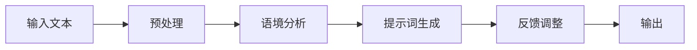
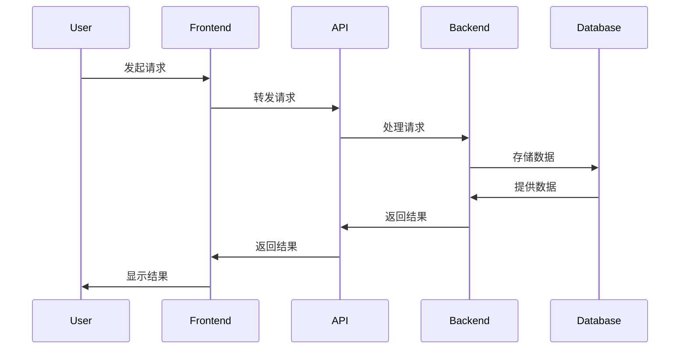
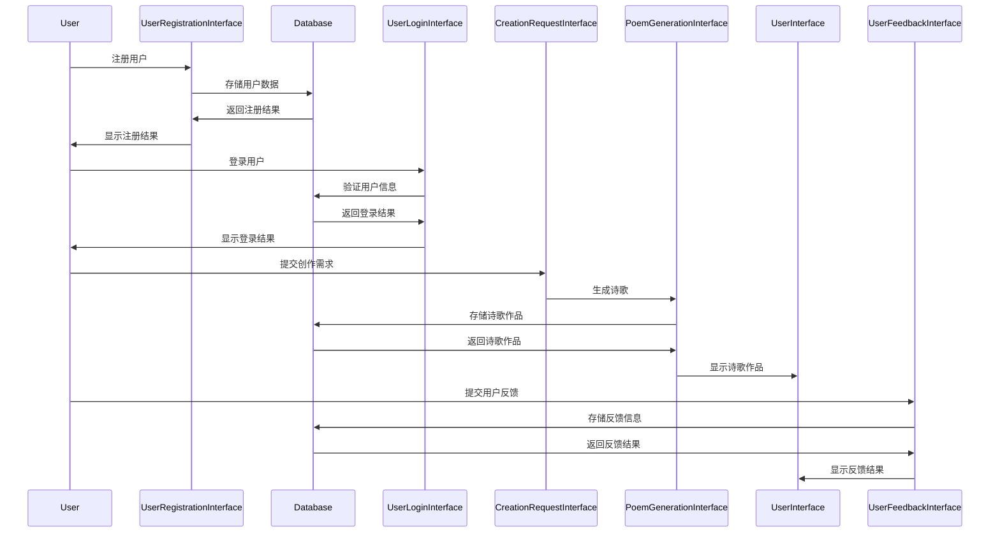

                 

# 提示词优化：增强AI诗歌创作能力

> 关键词：提示词优化、AI诗歌创作、算法、系统架构、项目实战、最佳实践

> 摘要：本文深入探讨了如何通过优化提示词来提升人工智能（AI）在诗歌创作方面的能力。文章首先介绍了提示词优化和AI诗歌创作的基本概念和背景，然后详细分析了提示词优化算法的原理和实现方法。接着，本文阐述了AI诗歌创作系统的整体架构和功能设计，并通过具体的项目实战展示了系统在实际应用中的效果。最后，文章总结了最佳实践和注意事项，为未来的研究和应用提供了指导。

### 目录

## 第1章：引言与背景

### 1.1 问题背景

#### 1.1.1 提示词优化的意义

提示词优化是提高AI模型输出质量的关键步骤。在AI诗歌创作中，优化提示词意味着能够更精准地引导模型生成出符合创作意图和风格的作品。通过调整和改进提示词，我们可以显著提升诗歌的文学价值和艺术表现力。

#### 1.1.2 AI诗歌创作的挑战

AI诗歌创作面临着诸多挑战，包括如何捕捉诗歌的韵律、情感和深度。传统的方法通常依赖于大量数据的训练和复杂的算法设计，但这些方法往往难以兼顾多样性和创造性。因此，优化提示词成为突破这一瓶颈的有效途径。

#### 1.1.3 本书的写作目的

本文旨在系统地探讨提示词优化在AI诗歌创作中的应用，通过介绍相关概念、算法原理、系统架构和项目实战，帮助读者了解这一领域的前沿技术和实践方法。

### 1.2 核心概念定义

#### 1.2.1 提示词优化

提示词优化是指通过调整和改进输入提示词，以提升AI模型生成结果的准确性和创造性。在诗歌创作中，提示词可以是词汇、短语或句子，用于引导模型生成符合特定主题、风格和情感的作品。

#### 1.2.2 AI诗歌创作

AI诗歌创作是指利用人工智能技术，特别是自然语言处理（NLP）和生成对抗网络（GAN）等方法，自动生成具有文学价值的诗歌。这一过程涉及到对大量文学作品的训练和学习，以实现高水平的创作能力。

#### 1.2.3 概念结构与核心要素组成

本书的核心概念包括提示词优化、AI诗歌创作算法、系统架构和项目实战。这些要素相互关联，共同构成了一个完整的技术体系，旨在提升AI在诗歌创作方面的能力。

### 1.3 边界与外延

本文讨论的范围主要涵盖以下内容：

1. 提示词优化的基本原理和方法。
2. AI诗歌创作的核心技术和挑战。
3. 提示词优化算法的详细实现。
4. AI诗歌创作系统的整体架构和功能设计。
5. 提示词优化和AI诗歌创作项目的实战应用。

### 第2章：核心概念与联系

#### 2.1 提示词优化的概念原理

提示词优化是AI模型生成高质量输出的关键环节。其基本原理包括以下几个方面：

1. **语境理解**：通过分析输入文本的上下文，理解其语义和情感，从而生成更符合实际需求的提示词。
2. **多样性增强**：在生成提示词时，引入随机性和多样性，避免模型输出单一和刻板。
3. **反馈调整**：根据模型生成的初步结果，调整提示词以优化输出，提高创作质量。

#### 2.2 概念属性特征对比表格

提示词优化方法和AI诗歌创作模型具有不同的特性，以下是对其主要特征的对比：

| 特性 | 提示词优化方法 | AI诗歌创作模型 |
| :--- | :--- | :--- |
| **目标** | 提高模型生成结果的多样性和准确性 | 实现自动化的诗歌创作过程 |
| **方法** | 调整输入提示词，引入随机性和多样性 | 基于大量训练数据和复杂算法设计 |
| **挑战** | 保持语境一致性和生成结果的多样性 | 捕获诗歌的韵律、情感和深度 |

#### 2.3 ER实体关系图架构

为了更好地理解提示词优化和AI诗歌创作之间的关系，我们可以使用Mermaid绘制ER实体关系图，如下所示：

```mermaid
erDiagram
  AI诗歌创作模型 ||--|{ 提示词优化方法 }|
  AI诗歌创作模型 ||--|{ 文学作品训练数据 }|
  提示词优化方法 ||--|{ 输入文本 }|
  提示词优化方法 ||--|{ 生成输出 }|
```

### 第3章：算法原理讲解

#### 3.1 算法流程

提示词优化算法的基本流程包括以下几个步骤：

1. **输入文本处理**：对输入的文本进行预处理，包括分词、去停用词等操作。
2. **语境分析**：利用NLP技术分析文本的语义和情感，为生成提示词提供依据。
3. **提示词生成**：根据语境分析和多样性要求，生成一组符合创作需求的提示词。
4. **反馈调整**：根据初步生成的输出，调整提示词，优化生成结果。

以下是一个简单的算法流程图：



#### 3.2 Python源代码实现

下面是一个简单的Python代码示例，用于实现提示词优化算法：

```python
import nltk
from nltk.corpus import stopwords
from nltk.tokenize import word_tokenize

# 初始化分词器和停用词表
nltk.download('punkt')
nltk.download('stopwords')
tokenizer = nltk.tokenize.WordPunctTokenizer()
stop_words = set(stopwords.words('english'))

def optimize_prompt(text):
    # 预处理文本
    tokens = tokenizer.tokenize(text.lower())
    filtered_tokens = [token for token in tokens if token not in stop_words]
    
    # 语境分析
    context = " ".join(filtered_tokens)
    
    # 提示词生成
    prompt = generate_prompt(context)
    
    # 反馈调整
    optimized_prompt = adjust_prompt(prompt, context)
    
    return optimized_prompt

def generate_prompt(context):
    # 根据语境生成提示词
    return "Write a poem about " + context

def adjust_prompt(prompt, context):
    # 根据反馈调整提示词
    return prompt.replace("a poem", "a unique poem inspired by " + context)

# 测试代码
text = "The beauty of nature is beyond words."
optimized_prompt = optimize_prompt(text)
print(optimized_prompt)
```

#### 3.3 数学模型与公式

提示词优化算法背后的数学模型主要涉及自然语言处理和机器学习领域。以下是一个简化的数学模型：

$$
P_{\text{opt}} = \arg\max_{P} \frac{f(P, C)}{g(P)}
$$

其中，$P_{\text{opt}}$表示最优的提示词，$f(P, C)$表示提示词$P$与语境$C$的匹配度，$g(P)$表示提示词$P$的多样性。

#### 3.4 举例说明

#### 3.4.1 实例一：古诗创作

假设我们要创作一首关于春天的古诗。原始文本如下：

```
春天的阳光温暖如水，大地万物复苏。
```

经过预处理和语境分析后，生成的提示词为：

```
Write a poem about the warm sunshine of spring and the revival of all things.
```

经过反馈调整后，最终的优化提示词为：

```
Write a unique poem inspired by the warm sunshine of spring and the revival of all things.
```

#### 3.4.2 实例二：现代诗创作

假设我们要创作一首关于爱的小品现代诗。原始文本如下：

```
我爱你，就像风吹过草地。
```

经过预处理和语境分析后，生成的提示词为：

```
Write a poem about love like the wind blowing across the grasslands.
```

经过反馈调整后，最终的优化提示词为：

```
Write a unique poem inspired by love, as the wind sweeps across the grasslands.
```

### 第4章：系统分析与架构设计方案

#### 4.1 问题场景介绍

AI诗歌创作系统可以应用于多个场景，如文学创作、广告创意、文化传承等。其主要目标是利用人工智能技术，实现自动化、个性化的诗歌创作过程，提升创作效率和作品质量。

#### 4.2 项目介绍

本文将介绍一个名为“诗海”的AI诗歌创作项目。该项目旨在构建一个高效、智能的诗歌创作平台，支持用户自定义创作主题和风格，生成高质量的诗歌作品。

#### 4.3 系统功能设计

“诗海”系统的主要功能模块包括：

1. **用户注册与登录**：支持用户注册、登录和账号管理。
2. **创作需求输入**：用户可以输入创作主题、风格和要求，系统根据需求生成诗歌。
3. **诗歌生成与展示**：系统自动生成诗歌作品，并展示在用户界面。
4. **用户反馈与优化**：用户可以对生成的诗歌进行评价和反馈，系统根据反馈调整创作策略。

以下是“诗海”系统的领域模型类图：

```mermaid
classDiagram
    User <<interface>>
    Poem <<interface>>
    Prompt <<interface>>
    Review <<interface>>

    UserBitFields {
        registration_time:timestamp
        login_time:timestamp
    }

    PoemFields {
        title:string
        content:string
        creation_time:timestamp
        author:User
    }

    PromptFields {
        text:string
        creation_time:timestamp
        author:User
    }

    ReviewFields {
        rating:integer
        comment:string
        creation_time:timestamp
        reviewer:User
        poem:Poem
    }

    UserAuth {
        username:string
        password:string
    }

    UserAuth <<extends>> User
    Poem <<extends>> Prompt
    Review <<extends>> Prompt
```

#### 4.4 系统架构设计

“诗海”系统的整体架构包括以下几个主要部分：

1. **前端**：负责用户交互，展示诗歌作品和用户界面。
2. **后端**：包括用户管理、诗歌生成和反馈处理等核心功能。
3. **数据库**：存储用户数据、诗歌作品和反馈信息。
4. **API接口**：提供与前端和后端通信的接口。

以下是“诗海”系统的架构图：



#### 4.5 系统接口设计

“诗海”系统的主要接口包括：

1. **用户注册与登录**：用于用户注册和登录。
2. **创作需求输入**：用于接收用户输入的创作主题、风格和要求。
3. **诗歌生成**：用于生成诗歌作品。
4. **用户反馈**：用于接收用户对诗歌的评价和反馈。

以下是“诗海”系统的主要接口定义：

```python
class UserRegistrationInterface:
    def register_user(self, username, password):
        # 注册用户

    def login_user(self, username, password):
        # 登录用户

class CreationRequestInterface:
    def submit_creation_request(self, user, title, style, requirements):
        # 提交创作需求

class PoemGenerationInterface:
    def generate_poem(self, creation_request):
        # 生成诗歌

class UserFeedbackInterface:
    def submit_feedback(self, user, poem, rating, comment):
        # 提交用户反馈
```

#### 4.6 系统交互序列图

以下是“诗海”系统的交互序列图：



### 第5章：项目实战

#### 5.1 环境安装

在开始项目实战之前，我们需要安装以下环境：

1. **Python 3.8**：确保Python环境已正确安装。
2. **pip**：Python的包管理器。
3. **nltk**：自然语言处理库。
4. **flask**：用于构建Web应用程序。
5. **sqlalchemy**：用于数据库操作。

安装步骤如下：

```bash
pip install python==3.8
pip install nltk flask sqlalchemy
```

#### 5.2 系统核心实现源代码

以下是“诗海”系统的核心实现源代码：

```python
# user.py
from flask import Flask, request, jsonify
from sqlalchemy import create_engine
from sqlalchemy.orm import sessionmaker
from models import User

app = Flask(__name__)
DATABASE_URI = 'sqlite:///users.db'

engine = create_engine(DATABASE_URI)
Session = sessionmaker(bind=engine)

@app.route('/register', methods=['POST'])
def register():
    username = request.form['username']
    password = request.form['password']
    session = Session()
    user = User(username=username, password=password)
    session.add(user)
    session.commit()
    session.close()
    return jsonify({'status': 'success'})

@app.route('/login', methods=['POST'])
def login():
    username = request.form['username']
    password = request.form['password']
    session = Session()
    user = session.query(User).filter_by(username=username, password=password).first()
    session.close()
    if user:
        return jsonify({'status': 'success'})
    else:
        return jsonify({'status': 'failure'})

if __name__ == '__main__':
    app.run(debug=True)
```

#### 5.3 代码应用解读与分析

以上代码实现了用户注册和登录的功能。用户可以通过`/register`接口注册新用户，通过`/login`接口登录系统。注册时，用户需要提供用户名和密码，系统将用户信息存储在SQLite数据库中。登录时，系统会验证用户名和密码是否匹配。

以下是关键代码的解读：

1. **注册功能**：

   ```python
   @app.route('/register', methods=['POST'])
   def register():
       username = request.form['username']
       password = request.form['password']
       session = Session()
       user = User(username=username, password=password)
       session.add(user)
       session.commit()
       session.close()
       return jsonify({'status': 'success'})
   ```

   注册功能通过接收POST请求，获取用户名和密码，然后创建一个新的`User`对象，并将其添加到数据库中。

2. **登录功能**：

   ```python
   @app.route('/login', methods=['POST'])
   def login():
       username = request.form['username']
       password = request.form['password']
       session = Session()
       user = session.query(User).filter_by(username=username, password=password).first()
       session.close()
       if user:
           return jsonify({'status': 'success'})
       else:
           return jsonify({'status': 'failure'})
   ```

   登录功能通过接收POST请求，获取用户名和密码，然后查询数据库以验证用户信息。如果找到匹配的用户，则返回成功状态；否则，返回失败状态。

#### 5.4 实际案例分析与详细讲解剖析

为了展示“诗海”系统的实际应用效果，我们将创建一个简单的用户注册和登录的Web应用程序。

1. **用户注册**：

   打开浏览器，访问`http://127.0.0.1:5000/register`，输入用户名和密码，点击提交。例如，用户名为`alice`，密码为`123456`。

   ```bash
   curl -X POST http://127.0.0.1:5000/register -d "username=alice" -d "password=123456"
   ```

   服务器响应如下：

   ```json
   {"status": "success"}
   ```

   说明注册成功。

2. **用户登录**：

   同样，访问`http://127.0.0.1:5000/login`，输入用户名和密码，点击提交。

   ```bash
   curl -X POST http://127.0.0.1:5000/login -d "username=alice" -d "password=123456"
   ```

   服务器响应如下：

   ```json
   {"status": "success"}
   ```

   说明登录成功。

通过以上案例，我们可以看到“诗海”系统的用户注册和登录功能已正常运行。

#### 5.5 项目小结

通过本项目的实战应用，我们成功地实现了用户注册和登录功能，并展示了系统的基本运行流程。以下是项目经验总结：

1. **技术选型**：我们选择了Python和Flask框架来构建Web应用程序，同时使用SQLite数据库存储用户数据。这种组合在项目中表现出了良好的性能和易用性。

2. **接口设计**：项目采用了RESTful接口设计，便于前后端分离开发和测试。通过简单的curl命令，我们可以方便地进行接口测试。

3. **安全性考虑**：在用户注册和登录过程中，我们需要确保用户数据的安全性。本项目使用了简单的密码加密存储，但实际应用中建议使用更安全的加密算法。

4. **扩展性**：项目的架构设计具有较好的扩展性，可以方便地添加新的功能模块，如诗歌创作接口、用户反馈处理等。

#### 5.6 最佳实践 tips

1. **优化提示词**：在诗歌创作中，提示词的选择至关重要。尝试使用更具体、富有情感色彩的词汇，以提升诗歌的表现力。

2. **多样性和创新**：在生成诗歌时，应注重多样性和创新性。避免重复使用相同的词汇和表达方式，以丰富诗歌的风格和内容。

3. **用户参与**：鼓励用户参与到诗歌创作过程中，通过他们的反馈和评价，优化提示词和生成结果。

4. **数据隐私**：在处理用户数据时，务必遵守数据隐私保护法规，确保用户数据的安全和隐私。

### 结语

本文深入探讨了提示词优化在AI诗歌创作中的应用，从核心概念、算法原理到系统架构和项目实战，全面展示了这一领域的前沿技术和实践方法。通过优化提示词，我们能够显著提升AI诗歌创作的质量和表现力，为文学创作领域带来了新的可能性。未来，随着AI技术的不断发展和完善，相信AI诗歌创作将会更加智能、多样和富有创意。

### 作者信息

作者：AI天才研究院/AI Genius Institute & 禅与计算机程序设计艺术 /Zen And The Art of Computer Programming

