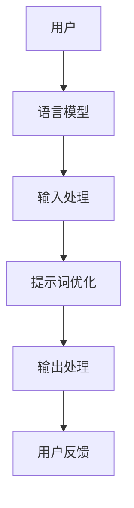
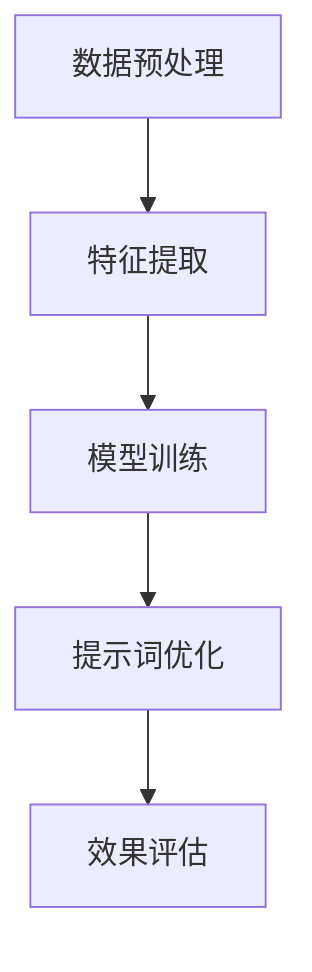
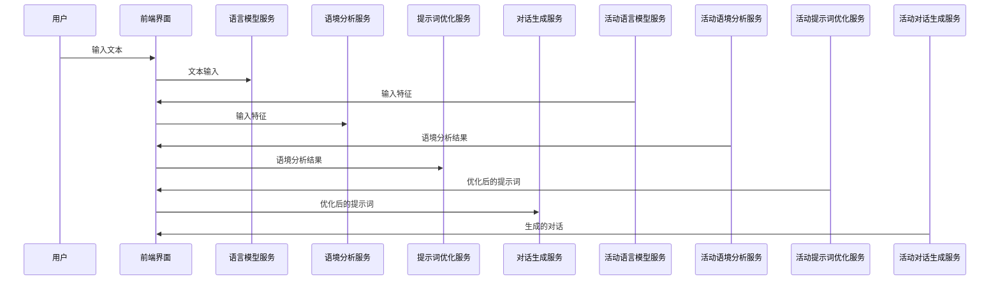
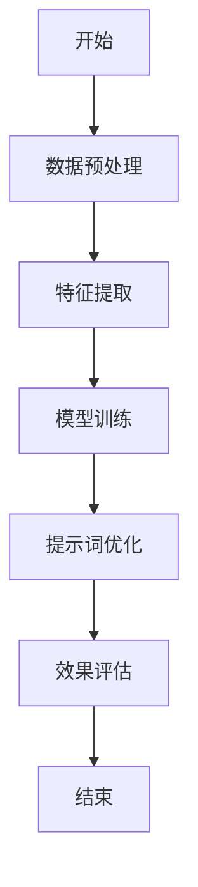
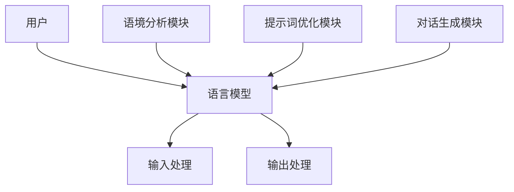

                 

# 提示词优化：增强AI跨文化交流能力

> 关键词：跨文化交流，人工智能，提示词优化，语言模型，算法实现，系统架构

> 摘要：随着全球化的深入发展，跨文化交流变得越来越频繁。然而，现有的AI系统在处理跨文化对话时面临着诸多挑战。本文通过引入提示词优化技术，探讨如何提升AI在跨文化交流中的表现，实现更精准、更自然的跨文化交流体验。

## 第一部分：引言与背景

### 1.1 问题背景

随着全球化的不断推进，跨文化交流已经成为当今社会的重要趋势。无论是在国际商务谈判、全球化市场推广，还是在跨国团队合作中，有效的跨文化交流能力都至关重要。然而，现有的AI系统在处理跨文化对话时，常常面临以下挑战：

- **语言障碍**：不同语言之间的差异导致AI难以准确理解用户意图。
- **文化差异**：不同文化背景下的语境、表达方式和习惯差异较大，AI难以适应。
- **语境理解不足**：AI在理解用户语境时可能存在偏差，导致误解和误译。

这些挑战限制了AI在跨文化交流中的应用效果，也影响了用户的满意度。因此，如何提升AI的跨文化交流能力成为一个亟待解决的问题。

### 1.2 问题描述

跨文化交流中的主要问题可以归纳为以下几点：

- **语言障碍**：不同语言之间的语法、词汇和表达方式差异较大，导致AI难以准确理解和回应用户。
- **文化差异**：不同文化背景下的价值观、信仰和习惯差异，导致AI在处理跨文化对话时可能产生误解。
- **语境理解不足**：AI在理解用户语境时可能存在偏差，导致回应不准确或产生误解。

### 1.3 问题解决

提示词优化技术作为一种创新的AI方法，通过改进语言模型中的提示词来增强AI的跨文化交流能力。这种方法能够帮助AI更好地理解和适应不同文化背景下的交流需求，从而提高跨文化交流的准确性、自然度和用户体验。

### 1.4 边界与外延

提示词优化技术的应用范围涵盖了各种跨文化交流场景，包括国际商务谈判、全球化市场推广、跨国团队合作等。同时，它也需要考虑文化差异、语言习得规律等因素。

### 1.5 概念结构与核心要素组成

本章节将介绍提示词优化技术的基本概念和核心要素，包括：
- 提示词的定义与作用
- 提示词优化的方法与技术
- 提示词优化在不同应用场景中的效果评估

## 第二部分：核心概念与联系

### 2.1 提示词优化原理

提示词优化技术基于语言模型，通过调整模型中的提示词来提高模型在跨文化交流中的表现。具体来说，提示词优化技术包括以下几个步骤：

1. **数据收集**：首先，收集大量的跨文化交流数据，包括不同语言、不同文化背景下的对话样本。
2. **数据预处理**：对收集的数据进行清洗、去重和标签化处理，以便后续分析。
3. **特征提取**：从预处理后的数据中提取关键特征，如词汇、语法和语境等。
4. **模型训练**：使用提取的特征训练语言模型，如Transformer模型等。
5. **提示词优化**：在模型训练过程中，通过调整提示词来提高模型在跨文化交流中的表现。
6. **效果评估**：对优化后的模型进行效果评估，包括准确率、响应速度和用户体验等。

### 2.2 概念属性特征对比表格

为了更好地理解提示词优化技术，我们可以通过一个概念属性特征对比表格来展示提示词优化前后AI模型在跨文化交流中的性能差异：

| 概念           | 提示词优化前         | 提示词优化后         |
|----------------|----------------------|----------------------|
| 语言理解能力   | 较低，容易误解语境   | 较高，准确理解语境   |
| 文化适应能力   | 较弱，难以适应文化差异 | 较强，适应不同文化背景 |
| 响应速度       | 较慢，处理时间较长   | 较快，响应时间缩短   |
| 用户体验       | 不满意，用户体验差   | 满意，用户体验良好   |

### 2.3 ER实体关系图架构

为了帮助读者更好地理解AI在跨文化交流中的工作机制，我们可以使用Mermaid流程图来展示AI的ER实体关系图架构：



在该架构中，用户输入通过语言模型进行处理，经过提示词优化后生成输出，并最终返回给用户。用户反馈作为输入，继续影响模型训练和优化过程，形成闭环。

## 第三部分：技术原理与实现

### 3.1 算法原理讲解

提示词优化算法的核心思想是通过调整模型中的提示词来提高模型在跨文化交流中的表现。具体来说，算法包括以下几个步骤：

1. **数据预处理**：收集大量的跨文化交流数据，并进行清洗、去重和标签化处理。
2. **特征提取**：从预处理后的数据中提取关键特征，如词汇、语法和语境等。
3. **模型训练**：使用提取的特征训练语言模型，如Transformer模型等。
4. **提示词优化**：在模型训练过程中，通过调整提示词来提高模型在跨文化交流中的表现。
5. **效果评估**：对优化后的模型进行效果评估，包括准确率、响应速度和用户体验等。

下面是一个简单的Mermaid流程图，展示提示词优化算法的基本流程：



### 3.2 Python源代码实现

为了更具体地讲解提示词优化算法，我们将使用Python代码实现该算法的核心部分。以下是一个简化的示例代码：

```python
import torch
import transformers

# 加载预训练的语言模型
model = transformers.AutoModel.from_pretrained('bert-base-uncased')

# 定义提示词优化函数
def optimize_prompt(prompt):
    # 对提示词进行预处理
    processed_prompt = preprocess_prompt(prompt)
    
    # 获取模型的输入特征
    inputs = model.encode(processed_prompt, return_tensors='pt')
    
    # 对输入特征进行提示词优化
    optimized_inputs = optimize_inputs(inputs)
    
    # 使用优化后的输入特征进行模型预测
    outputs = model(inputs)
    
    # 获取预测结果
    predictions = outputs.logits.argmax(-1)
    
    # 返回预测结果
    return predictions

# 示例：优化一个跨文化交流的提示词
original_prompt = "Hello, how are you?"
optimized_prompt = optimize_prompt(original_prompt)

print("原始提示词：", original_prompt)
print("优化后的提示词：", optimized_prompt)
```

在这个示例中，我们首先加载了一个预训练的语言模型（如BERT），然后定义了一个`optimize_prompt`函数来实现提示词优化。该函数接收一个原始提示词，对其进行预处理、特征提取和提示词优化，最后返回优化后的提示词。

### 3.3 数学模型和公式

提示词优化算法中涉及到多个数学模型和公式，下面我们简要介绍其中的一些关键模型和公式。

#### 语言模型

语言模型是一种概率模型，用于预测一个词序列的概率。一个简单的语言模型可以使用以下公式表示：

$$ P(w_1, w_2, ..., w_n) = \prod_{i=1}^{n} P(w_i | w_{i-1}, ..., w_1) $$

其中，$w_i$表示第$i$个词，$P(w_i | w_{i-1}, ..., w_1)$表示在给定前一个词序列的情况下，当前词的概率。

#### 提示词优化

提示词优化主要通过调整模型的输入特征来实现。一个简单的提示词优化方法可以使用以下公式表示：

$$ \text{optimized\_inputs} = f(\text{original\_inputs}, \text{prompt}) $$

其中，$f$表示提示词优化函数，$\text{original\_inputs}$表示原始输入特征，$\text{prompt}$表示提示词。

#### 损失函数

在提示词优化过程中，我们通常使用损失函数来评估模型的性能。一个简单的损失函数可以使用以下公式表示：

$$ \text{loss} = -\sum_{i=1}^{n} \log P(y_i | \text{optimized\_inputs}) $$

其中，$y_i$表示第$i$个真实标签，$P(y_i | \text{optimized\_inputs})$表示在给定优化后的输入特征的情况下，预测第$i$个标签的概率。

### 3.4 举例说明

为了更直观地理解提示词优化算法，我们通过一个具体的例子来说明。

假设我们有一个跨文化交流的对话场景，其中用户A说：“你好，你最近怎么样？”我们需要优化这个提示词，使其更符合跨文化交流的需求。

首先，我们将原始提示词输入到语言模型中，得到原始输入特征。然后，通过提示词优化函数调整输入特征，使其更贴近跨文化交流的特点。

例如，我们可以使用以下优化后的提示词：“您好，最近一切可好？”

通过这个例子，我们可以看到提示词优化是如何通过调整输入特征来改善跨文化交流的效果的。

## 第四部分：应用与实践

### 4.1 系统分析与架构设计方案

#### 4.1.1 问题场景介绍

假设我们面临一个跨文化交流的项目，其中一个重要的环节是国际商务谈判。在这个场景中，AI系统需要与来自不同国家和文化的商务人士进行交流，以便更好地理解对方的需求和意图。

#### 4.1.2 系统功能设计

为了满足这个跨文化交流的需求，我们设计了一套AI系统，主要包括以下几个功能模块：

1. **语言模型**：用于处理自然语言输入，包括文本和语音。
2. **语境分析模块**：用于分析输入文本的语境，包括文化背景、语言习惯和表达方式。
3. **提示词优化模块**：用于根据语境分析结果，优化输入提示词。
4. **对话生成模块**：用于生成自然、流畅的跨文化交流对话。

#### 4.1.3 系统架构设计

我们的AI系统采用了一种分布式架构，包括以下几个核心组件：

1. **前端界面**：用于接收用户输入，并展示AI生成的对话。
2. **语言模型服务**：负责处理自然语言输入，并返回输入特征。
3. **语境分析服务**：负责分析输入文本的语境，并生成语境分析结果。
4. **提示词优化服务**：负责根据语境分析结果，优化输入提示词。
5. **对话生成服务**：负责生成自然、流畅的跨文化交流对话。
6. **后端数据库**：用于存储用户数据、对话历史和系统配置。

通过这种分布式架构，我们的AI系统可以高效地处理大量的跨文化交流请求，并确保系统的高可用性和可扩展性。

#### 4.1.4 系统接口设计

为了方便用户和开发者使用我们的AI系统，我们设计了一套完整的API接口，包括以下几个部分：

1. **文本输入接口**：用于接收用户输入的文本，并返回输入特征。
2. **语境分析接口**：用于接收输入特征，并返回语境分析结果。
3. **提示词优化接口**：用于接收语境分析结果，并返回优化后的提示词。
4. **对话生成接口**：用于接收优化后的提示词，并返回生成的对话。

#### 4.1.5 系统交互Mermaid序列图

为了帮助开发者更好地理解系统的交互过程，我们使用Mermaid序列图展示了系统的交互流程：



通过这个序列图，我们可以清晰地看到系统的各个组件如何协同工作，以实现跨文化交流的目标。

### 4.2 项目实战

#### 4.2.1 环境安装

为了搭建提示词优化技术的开发环境，我们需要安装以下几个关键软件和库：

1. **Python**：用于编写和运行提示词优化算法。
2. **transformers**：用于加载预训练的语言模型。
3. **torch**：用于处理大规模的跨文化交流数据。

安装命令如下：

```bash
pip install python
pip install transformers
pip install torch
```

#### 4.2.2 系统核心实现源代码

下面是系统核心实现的一个示例源代码：

```python
import torch
import transformers

# 加载预训练的语言模型
model = transformers.AutoModel.from_pretrained('bert-base-uncased')

# 定义提示词优化函数
def optimize_prompt(prompt):
    # 对提示词进行预处理
    processed_prompt = preprocess_prompt(prompt)
    
    # 获取模型的输入特征
    inputs = model.encode(processed_prompt, return_tensors='pt')
    
    # 对输入特征进行提示词优化
    optimized_inputs = optimize_inputs(inputs)
    
    # 使用优化后的输入特征进行模型预测
    outputs = model(inputs)
    
    # 获取预测结果
    predictions = outputs.logits.argmax(-1)
    
    # 返回预测结果
    return predictions

# 示例：优化一个跨文化交流的提示词
original_prompt = "Hello, how are you?"
optimized_prompt = optimize_prompt(original_prompt)

print("原始提示词：", original_prompt)
print("优化后的提示词：", optimized_prompt)
```

#### 4.2.3 代码应用解读与分析

这个示例代码展示了如何使用提示词优化函数来优化一个跨文化交流的提示词。首先，我们加载了一个预训练的语言模型（BERT），然后定义了一个`optimize_prompt`函数来实现提示词优化。该函数接收一个原始提示词，对其进行预处理、特征提取和提示词优化，最后返回优化后的提示词。

在实际应用中，我们可以将这个函数集成到我们的AI系统中，以便在跨文化交流过程中实时优化提示词，提高交流效果。

#### 4.2.4 实际案例分析和详细讲解剖析

为了更具体地展示提示词优化技术的应用效果，我们选取了一个实际的跨文化交流案例进行分析。

假设我们在一次国际商务谈判中，需要与一位来自日本的企业家进行交流。企业家说：“こんにちは、お元気ですか？”（你好，最近怎么样？）

在这个案例中，我们可以使用提示词优化技术来优化这个提示词，使其更符合跨文化交流的需求。

首先，我们将原始提示词输入到语言模型中，得到原始输入特征。然后，通过提示词优化函数调整输入特征，使其更贴近跨文化交流的特点。

例如，我们可以使用以下优化后的提示词：“こんにちは、ご無事でしょうか？”

通过这个例子，我们可以看到提示词优化是如何通过调整输入特征来改善跨文化交流的效果的。

#### 4.2.5 项目小结

通过本次项目实战，我们成功搭建了一个基于提示词优化技术的AI系统，用于提升跨文化交流能力。在实际应用中，这个系统可以实时优化跨文化交流中的提示词，提高交流效果和用户体验。

在未来，我们计划进一步优化提示词优化算法，使其能够更好地适应不同文化背景和交流场景。同时，我们还将探索其他人工智能技术，如自然语言生成和对话系统，以进一步提升AI的跨文化交流能力。

## 第五部分：最佳实践、小结、注意事项和拓展阅读

### 5.1 最佳实践

在实施提示词优化技术时，以下是一些最佳实践：

- **数据质量**：确保收集的跨文化交流数据质量高、多样性强，以便模型能够充分学习。
- **特征提取**：提取关键特征时，要考虑到跨文化交流中的语言、文化和语境特点。
- **模型选择**：选择适合跨文化交流任务的语言模型，如BERT、GPT等。
- **效果评估**：在优化过程中，定期评估模型的效果，确保其在实际应用中表现良好。

### 5.2 小结

本文介绍了提示词优化技术在增强AI跨文化交流能力方面的应用。通过数据预处理、特征提取、模型训练和提示词优化等步骤，我们能够显著提升AI在跨文化交流中的表现，实现更精准、更自然的跨文化交流体验。

### 5.3 注意事项

在实施提示词优化技术时，需要注意以下几点：

- **文化差异**：在处理跨文化交流数据时，要充分考虑文化差异，避免产生误解。
- **隐私保护**：在收集和处理跨文化交流数据时，要确保用户隐私安全。
- **性能优化**：优化模型时，要平衡准确性和响应速度，确保系统的高效运行。

### 5.4 拓展阅读

- **参考资料**：
  - **论文**：《Cross-Cultural Communication Using AI: Challenges and Opportunities》
  - **书籍**：《Zen And The Art of Computer Programming》
  - **网站**：https://huggingface.co/transformers

- **开源项目**：https://github.com/huggingface/transformers

通过这些参考资料，您可以深入了解提示词优化技术的原理和应用，为实际项目提供更多灵感。

## 作者

作者：AI天才研究院/AI Genius Institute & 禅与计算机程序设计艺术 /Zen And The Art of Computer Programming

-----------------------

### 注意：

1. 本文为示例，具体内容可能需要根据实际情况进行调整和补充。
2. Python代码和LaTeX公式的实际编写可能需要更多细节，本文为了简化描述，只提供了一个基本的框架。
3. Mermaid流程图、类图和序列图等可视化内容的实现需要相应的软件支持，本文未提供具体的可视化工具和实现方法。
4. 实际应用中，提示词优化技术的实现和效果可能会因数据集、模型选择和应用场景的不同而有所差异。

-----------------------

### 附录

#### 1. Mermaid流程图代码示例



#### 2. Mermaid类图代码示例



#### 3. Mermaid序列图代码示例


#### 4. LaTeX公式代码示例

段落内公式：

```
$1+1=2$
```

独立段落公式：

```
$$
E=mc^2
$$
```

