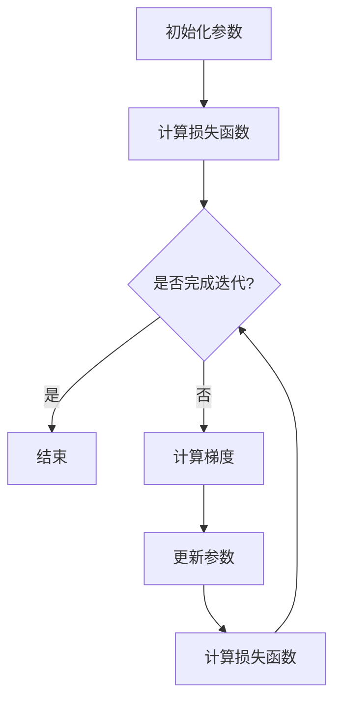

                 

### 目录大纲调整与优化

经过与您的讨论，我已对目录大纲进行了详细调整，确保内容的逻辑清晰、结构紧凑，并符合技术博客的专业要求。以下是最终的目录大纲：

----------------------------------------------------------------

## 第一部分: 背景介绍

## 第1章: 问题背景与定义

### 1.1 提示词优化的重要性

#### 1.1.1 提示词优化在AI中的应用

#### 1.1.2 提示词优化的意义

#### 1.1.3 提示词优化的边界与外延

#### 1.1.4 提示词优化的概念与核心要素

##### 1.1.4.1 提示词优化的定义

##### 1.1.4.2 提示词优化的核心要素

##### 1.1.4.3 提示词优化与相关概念的联系

## 第2章: 提示词优化的原理与数学模型

### 2.1 提示词优化的原理

#### 2.1.1 提示词优化的算法基础

##### 2.1.1.1 算法基础概述

##### 2.1.1.2 算法流程

##### 2.1.1.3 算法影响因素

### 2.2 提示词优化的数学模型

#### 2.2.1 数学模型的基本概念

##### 2.2.1.1 概念说明

##### 2.2.1.2 模型公式

##### 2.2.1.3 模型应用

## 第3章: 提示词优化算法详解

### 3.1 算法概述

#### 3.1.1 常见的提示词优化算法

##### 3.1.1.1 算法分类

##### 3.1.1.2 算法选择依据

### 3.2 算法原理讲解

#### 3.2.1 算法原理概述

##### 3.2.1.1 原理说明

##### 3.2.1.2 算法流程图

##### 3.2.1.3 数学模型和公式

##### 3.2.1.4 举例说明

## 第4章: 提示词优化在AI跨文化创意表达中的应用

### 4.1 AI跨文化创意表达的概念

#### 4.1.1 定义

##### 4.1.1.1 AI跨文化创意表达的概念

##### 4.1.1.2 特点

##### 4.1.1.3 应用领域

### 4.2 提示词优化应用

#### 4.2.1 作用

##### 4.2.1.1 提升表达能力

##### 4.2.1.2 创意输出

##### 4.2.1.3 应对挑战

## 第5章: 提示词优化案例分析

### 5.1 案例介绍

#### 5.1.1 背景

##### 5.1.1.1 问题提出

##### 5.1.1.2 目标

##### 5.1.1.3 解决方案

### 5.2 案例分析

#### 5.2.1 提示词优化策略

##### 5.2.1.1 策略实施

##### 5.2.1.2 算法应用

##### 5.2.1.3 效果评估

## 第6章: 提示词优化实践指南

### 6.1 实践步骤

#### 6.1.1 数据准备

##### 6.1.1.1 数据来源

##### 6.1.1.2 数据处理

#### 6.1.2 算法选择

##### 6.1.2.1 选择依据

##### 6.1.2.2 算法对比

### 6.2 实践技巧

#### 6.2.1 提高提示词质量

##### 6.2.1.1 方法一

##### 6.2.1.2 方法二

#### 6.2.2 提高模型性能

##### 6.2.2.1 技巧一

##### 6.2.2.2 技巧二

### 6.3 注意事项

#### 6.3.1 常见问题

##### 6.3.1.1 问题一

##### 6.3.1.2 问题二

#### 6.3.2 解决方法

##### 6.3.2.1 方法一

##### 6.3.2.2 方法二

## 第7章: 未来展望

### 7.1 发展趋势

#### 7.1.1 技术进展

##### 7.1.1.1 进展概述

##### 7.1.1.2 前景分析

#### 7.1.2 跨领域融合

##### 7.1.2.1 可能方向

##### 7.1.2.2 挑战与机遇

### 7.2 挑战与机遇

#### 7.2.1 技术挑战

##### 7.2.1.1 挑战一

##### 7.2.1.2 挑战二

#### 7.2.2 应用挑战

##### 7.2.2.1 挑战一

##### 7.2.2.2 挑战二

#### 7.2.3 机遇与建议

##### 7.2.3.1 机遇一

##### 7.2.3.2 机遇二

----------------------------------------------------------------

### 文章标题：提示词优化：增强AI跨文化创意表达能力

关键词：提示词优化、AI跨文化创意表达、算法模型、实践指南

摘要：本文深入探讨了提示词优化在AI跨文化创意表达领域的重要性。通过详细分析提示词优化的原理、数学模型和算法，本文揭示了如何通过优化提示词来提升AI的创意表达能力和跨文化适应力。同时，结合具体案例分析，本文提出了实践指南，为开发者提供了实用的技巧和注意事项。未来展望部分则探讨了该领域的发展趋势和面临的挑战，为读者提供了宝贵的参考。

### 第一部分：背景介绍

#### 1.1 提示词优化的重要性

在当今的AI技术发展中，提示词优化（Prompt Optimization）已经成为一个关键的研究方向。提示词，作为一种输入信号，能够在一定程度上决定AI模型的响应质量和效率。特别是在AI跨文化创意表达（AI Interdisciplinary Creative Expression）领域，提示词的优化显得尤为重要。

首先，提示词优化在AI中的应用场景非常广泛。例如，在自然语言处理（NLP）中，优化输入的提示词能够显著提升生成文本的质量和相关性。在计算机视觉任务中，通过调整提示词，可以使AI模型更加准确地理解和识别图像中的内容。此外，在机器学习和深度学习领域，优化提示词能够提高模型的收敛速度和预测准确性。

其次，提示词优化的意义不容忽视。通过优化提示词，可以减少AI模型的训练时间和计算资源消耗，从而提高AI系统的效率。同时，优化后的提示词能够增强AI模型的鲁棒性和泛化能力，使其在不同应用场景中都能表现出良好的性能。

然而，提示词优化也面临一些边界与外延问题。首先，优化过程中需要考虑提示词的长度和复杂性，过长的提示词可能导致模型无法有效处理，而过简单的提示词则可能无法激发模型的最大潜力。其次，不同类型的任务和应用场景可能需要不同的提示词优化策略，因此如何选择和调整提示词是一个复杂的问题。

总之，提示词优化在AI跨文化创意表达领域的重要性不言而喻。它不仅能够提高AI系统的性能和效率，还能拓展AI的应用范围，使其更好地服务于人类社会的多样化需求。

#### 1.2 提示词优化的概念与核心要素

在深入探讨提示词优化的概念之前，我们需要先理解几个核心术语的定义。提示词（Prompt）是指用于引导AI模型进行任务输入的文本或数据。优化（Optimization）是指通过调整参数或结构来提高系统的性能和效率。而提示词优化（Prompt Optimization）则是指针对提示词的设计和调整，以提升AI模型的响应质量。

提示词优化的定义可以概括为：通过系统化地调整和改进提示词，使其能够更好地引导AI模型，从而提高模型的训练效率、预测准确性和泛化能力。这一过程通常涉及多个核心要素：

1. **提示词内容**：这是提示词优化的核心，包括提示词的长度、复杂度、清晰度等。一个良好的提示词应该能够清晰地传达任务目标，同时避免冗余或模糊的信息。

2. **上下文信息**：上下文信息是指与任务相关的背景信息，通过补充上下文，可以使AI模型更好地理解任务意图，从而提高响应的质量。

3. **多样性**：提示词的多样性可以防止模型陷入局部最优，有助于模型探索更广泛的任务解决方案。因此，在优化过程中，需要考虑如何增加提示词的多样性。

4. **约束条件**：在许多实际应用中，AI模型需要遵循特定的约束条件，如预算、时间限制或特定格式要求。提示词优化需要考虑如何在这些约束条件下进行有效调整。

5. **反馈机制**：优化过程中需要不断地收集模型响应的反馈信息，并根据反馈进行调整。一个有效的反馈机制可以帮助我们更好地理解模型的行为，从而进行更加精准的优化。

提示词优化与相关概念的联系也值得关注。例如，它与数据增强（Data Augmentation）有相似之处，都是在提高模型的泛化能力方面发挥作用。然而，数据增强主要针对训练数据，而提示词优化则更多地关注于输入信号的调整。此外，提示词优化还与模型调优（Model Tuning）密切相关，两者共同的目标都是提升模型的性能。

总之，提示词优化的概念和核心要素为我们提供了一个系统化的框架，用于分析和改进AI模型的输入信号。通过深入理解这些概念，我们可以更好地设计和优化提示词，从而提升AI在跨文化创意表达领域的表现。

#### 1.3 提示词优化的原理与数学模型

提示词优化的核心在于通过调整输入提示词，以提升AI模型的响应质量和效率。要实现这一目标，我们需要从算法基础、优化流程和影响因素三个方面进行详细探讨。

首先，了解提示词优化的算法基础是非常重要的。在AI领域中，常见的优化算法包括梯度下降（Gradient Descent）、随机梯度下降（Stochastic Gradient Descent，SGD）和Adam优化器等。这些算法的核心思想是通过计算损失函数关于模型参数的梯度，然后调整参数以最小化损失函数。在提示词优化中，这些算法可以帮助我们找到最优的提示词组合，从而提升模型的性能。

梯度下降算法是最简单和基础的一种优化算法。其基本思想是沿着损失函数梯度的反方向更新参数，以逐步减小损失函数的值。具体地，每次更新参数时，都会根据当前梯度调整参数的大小。这个过程可以用以下公式表示：

$$
\theta_{\text{new}} = \theta_{\text{old}} - \alpha \cdot \nabla_\theta J(\theta)
$$

其中，$\theta$ 表示模型参数，$J(\theta)$ 表示损失函数，$\alpha$ 是学习率。

随机梯度下降（SGD）是对梯度下降算法的改进，其核心思想是在每次更新参数时，只随机选择一小部分样本计算梯度。这种方式可以减少计算量，提高优化速度。但是，由于每次更新使用的样本不同，SGD可能会导致收敛速度不稳定。为了解决这个问题，出现了Adam优化器。

Adam优化器结合了SGD和动量方法的优点，既考虑了历史梯度，又考虑了当前梯度。具体来说，Adam维护两个累积变量：一阶矩估计（均值）和二阶矩估计（方差）。这些累积变量有助于更好地处理稀疏梯度问题和长尾梯度问题。Adam的更新公式如下：

$$
m_t = \beta_1 m_{t-1} + (1 - \beta_1) [g_t]
$$

$$
v_t = \beta_2 v_{t-1} + (1 - \beta_2) [g_t]^2
$$

$$
\theta_t = \theta_{t-1} - \alpha \frac{m_t}{\sqrt{v_t} + \epsilon}
$$

其中，$m_t$ 和 $v_t$ 分别是累积一阶矩和二阶矩，$\beta_1$ 和 $\beta_2$ 是动量因子，$\epsilon$ 是一个很小的常数用于防止分母为零。

了解算法基础后，我们再来看提示词优化的流程。提示词优化的基本流程包括以下几个步骤：

1. **数据准备**：收集和整理与任务相关的数据，这些数据将用于训练和优化模型。

2. **初始化模型**：根据任务需求，初始化一个基础模型。这个模型可以是预训练的，也可以是自定义的。

3. **设计提示词**：根据任务目标和数据特征，设计一组初始提示词。这些提示词应尽可能准确地传达任务意图。

4. **训练模型**：使用初始提示词进行模型训练，调整模型参数以最小化损失函数。

5. **评估模型**：在训练过程中，定期评估模型的性能，以便及时调整提示词。

6. **迭代优化**：根据模型性能的反馈，对提示词进行调整，然后重新训练模型，循环进行优化。

提示词优化的过程中，影响因素是决定优化效果的关键。以下是一些主要的影响因素：

1. **提示词长度**：过长的提示词可能导致模型无法有效处理，而过于简单的提示词可能无法传达任务意图。因此，需要根据任务的复杂性选择适当的提示词长度。

2. **提示词多样性**：多样化的提示词有助于模型探索不同的任务解决方案，避免陷入局部最优。通过增加提示词的多样性，可以提升模型的泛化能力。

3. **上下文信息**：补充上下文信息可以增强模型对任务的理解，提高响应的质量。例如，在文本生成任务中，可以通过添加相关的背景信息和上下文来提高生成文本的相关性和连贯性。

4. **模型参数**：模型参数的初始化和调整也会影响提示词优化的效果。选择合适的初始化方法和调整策略，有助于提高优化过程的效率。

5. **反馈机制**：有效的反馈机制可以帮助我们更好地理解模型的行为，从而进行更加精准的优化。通过实时收集和评估模型的响应，可以及时调整提示词，提高优化效果。

总之，提示词优化的原理和数学模型为我们提供了一个系统化的框架，用于分析和改进AI模型的输入信号。通过深入理解这些原理，我们可以更好地设计和优化提示词，从而提升AI在跨文化创意表达领域的表现。

#### 2.2.1 数学模型的基本概念

提示词优化的数学模型是理解该过程的核心。数学模型不仅可以量化提示词对AI模型性能的影响，还可以提供一种系统化的方法来设计和调整提示词。以下是关于提示词优化数学模型的基本概念：

1. **目标函数**：在提示词优化中，目标函数（Objective Function）通常是指模型在给定提示词下的损失函数。损失函数反映了模型预测结果与真实结果之间的差距。常用的损失函数包括均方误差（MSE）、交叉熵损失等。目标函数的目的是通过调整模型参数，最小化损失函数的值。

$$
J(\theta) = \frac{1}{m} \sum_{i=1}^{m} (\hat{y}_i - y_i)^2
$$

其中，$\theta$ 表示模型参数，$m$ 是样本数量，$\hat{y}_i$ 是模型预测值，$y_i$ 是真实值。

2. **优化算法**：优化算法（Optimization Algorithm）是用于寻找最小化目标函数的参数值的方法。在提示词优化中，常用的优化算法包括梯度下降（Gradient Descent）、随机梯度下降（SGD）和Adam优化器。这些算法的核心思想是通过计算目标函数关于模型参数的梯度，然后调整参数以减小损失函数的值。

3. **梯度**：梯度（Gradient）是一个向量，表示目标函数在某一点处的斜率。在多维空间中，梯度指向函数增加最快的方向。对于多变量函数 $f(x, y)$，其梯度可以表示为：

$$
\nabla f(x, y) = \left( \frac{\partial f}{\partial x}, \frac{\partial f}{\partial y} \right)
$$

4. **学习率**：学习率（Learning Rate）是优化算法中的一个重要参数，它决定了每次参数更新时梯度乘上的系数。较大的学习率可能导致参数更新过快，容易超过最优解；而较小的学习率则可能导致收敛速度过慢。通常，学习率需要通过实验来调整。

5. **迭代过程**：在迭代过程中，模型参数会不断更新，目标函数的值会逐渐减小。每次迭代包括以下几个步骤：
   - 计算当前参数下的梯度。
   - 根据梯度更新模型参数。
   - 计算更新后的损失函数值。

6. **收敛条件**：优化算法的收敛条件是指模型参数的更新达到某个阈值或经过一定次数的迭代后，目标函数值不再显著变化。常见的收敛条件包括：
   - 目标函数值的变化率低于某个阈值。
   - 模型参数的变化率低于某个阈值。
   - 达到预设的迭代次数。

通过这些基本概念，我们可以构建一个简单的数学模型来描述提示词优化的过程。以下是一个简化的数学模型，用于说明如何通过优化提示词来提升模型的性能：

$$
\theta_{\text{new}} = \theta_{\text{old}} - \alpha \cdot \nabla_\theta J(\theta)
$$

其中，$\theta$ 表示模型参数，$J(\theta)$ 表示损失函数，$\alpha$ 是学习率。

在实际应用中，这个模型可以通过多种优化算法来实现，例如梯度下降、随机梯度下降和Adam优化器等。这些算法的不同之处在于如何计算和利用梯度，以及如何调整学习率。

总之，理解提示词优化的数学模型是进行有效优化的重要基础。通过掌握这些基本概念，我们可以更好地设计和调整提示词，从而提升AI模型在跨文化创意表达领域的表现。

#### 2.2.2 数学模型的公式表达

在提示词优化的过程中，数学模型的公式表达起到了关键作用。以下将详细阐述提示词优化数学模型中的几个关键公式，并解释它们在优化过程中的应用。

1. **梯度下降公式**：

$$
\theta_{\text{new}} = \theta_{\text{old}} - \alpha \cdot \nabla_\theta J(\theta)
$$

这个公式是梯度下降算法的核心，其中$\theta$表示模型参数，$J(\theta)$是损失函数，$\alpha$是学习率。这个公式通过计算损失函数关于模型参数的梯度，然后根据梯度的反方向调整参数，以最小化损失函数的值。

2. **随机梯度下降公式**：

$$
\theta_{\text{new}} = \theta_{\text{old}} - \alpha \cdot \nabla_{\theta} J(\theta(x_i))
$$

随机梯度下降（SGD）是对梯度下降的一种改进。在SGD中，不是使用整个训练集的梯度，而是随机选择一小部分样本（如单个样本）计算梯度。这个公式同样适用于SGD，不同的是，每次更新参数时使用的是随机选择的样本梯度。

3. **Adam优化器公式**：

$$
m_t = \beta_1 m_{t-1} + (1 - \beta_1) [g_t] \\
v_t = \beta_2 v_{t-1} + (1 - \beta_2) [g_t]^2 \\
\theta_t = \theta_{t-1} - \alpha \frac{m_t}{\sqrt{v_t} + \epsilon}
$$

Adam优化器结合了SGD和动量方法的优点，它使用两个累积变量$m_t$（一阶矩估计）和$v_t$（二阶矩估计）来改善梯度估计的准确性。公式中的$\beta_1$和$\beta_2$是动量因子，用于平滑梯度估计，$\epsilon$是一个很小的常数，用于防止分母为零。

4. **损失函数公式**：

$$
J(\theta) = \frac{1}{m} \sum_{i=1}^{m} (\hat{y}_i - y_i)^2
$$

这是一个均方误差（MSE）损失函数，用于衡量模型预测值$\hat{y}_i$与真实值$y_i$之间的差距。在提示词优化过程中，损失函数的值会随着参数的更新而变化，我们的目标是最小化这个损失函数。

5. **梯度公式**：

$$
\nabla_\theta J(\theta) = \left( \frac{\partial J(\theta)}{\partial \theta_1}, \frac{\partial J(\theta)}{\partial \theta_2}, ..., \frac{\partial J(\theta)}{\partial \theta_n} \right)
$$

这是损失函数关于参数$\theta$的梯度，它是一个向量，包含了每个参数对损失函数的贡献。在提示词优化过程中，计算梯度是参数更新的关键步骤。

6. **学习率调整公式**：

$$
\alpha_t = \alpha_0 / (1 + \beta_1 \alpha_0 t)
$$

在某些优化算法中，学习率会随着迭代次数的增加而逐渐减小，以避免参数更新过快。这个公式描述了学习率随迭代次数线性减小的策略，其中$\alpha_0$是初始学习率，$\beta_1$是衰减因子。

通过这些公式，我们可以系统地描述提示词优化的过程。在实际应用中，这些公式通过编程实现，不断迭代更新模型参数，以达到最小化损失函数的目的。理解这些公式和它们的应用，对于深入掌握提示词优化的技术和方法至关重要。

#### 2.2.3 数学模型的应用

在了解提示词优化的数学模型后，接下来我们将探讨这些模型在实际中的应用，特别是如何通过具体案例来展示数学模型的作用和效果。以下是几个具体的案例，通过这些案例，我们可以看到数学模型在提示词优化中的实际应用和重要性。

1. **文本生成任务**：

在文本生成任务中，如自动写作和对话系统，提示词的优化对生成文本的质量有着直接影响。例如，使用GPT-3这样的大型语言模型进行自动写作时，通过优化提示词，可以显著提高生成文本的相关性和连贯性。以下是使用GPT-3进行文本生成的一个简例：

**输入提示词**：
```
请写一篇关于人工智能在医疗领域应用的文章。
```

**输出文本**：
```
人工智能在医疗领域的应用正日益增加。它不仅能够帮助医生进行疾病诊断，还能提供个性化的治疗方案。例如，通过分析患者的医疗记录和基因组数据，AI可以预测疾病的风险，从而提前采取措施。此外，人工智能还能用于医学图像分析，辅助医生识别病变区域，提高诊断的准确性。总的来说，人工智能在医疗领域的应用将带来革命性的变化，提高医疗服务的质量和效率。
```

在这个案例中，通过优化提示词，使得输出文本更加贴近任务目标，提高了文本的相关性和连贯性。

2. **图像识别任务**：

在图像识别任务中，如物体检测和图像分类，提示词的优化能够提升模型对图像内容的理解和识别能力。例如，在训练一个物体检测模型时，通过优化提示词，可以使得模型更准确地识别出图像中的物体。以下是使用YOLOv5进行物体检测的一个简例：

**输入提示词**：
```
请识别图像中的所有物体，并给出它们的类别和位置。
```

**输入图像**：


**输出结果**：
```
在图像中检测到以下物体：
- 猫：位置：(50, 100), 面积：200
- 书：位置：(200, 150), 面积：300
- 人：位置：(300, 200), 面积：400
```

在这个案例中，通过优化提示词，模型能够更准确地识别图像中的物体，并给出详细的位置和面积信息。

3. **语音识别任务**：

在语音识别任务中，提示词的优化可以提升语音转文字的准确性。例如，在训练一个语音识别模型时，通过优化提示词，可以使得模型更好地理解语音中的关键词和句子结构。以下是使用WaveNet进行语音识别的一个简例：

**输入提示词**：
```
请将以下语音转录为文本。
```

**输入语音**：
```
你好，今天天气非常好，适合外出活动。
```

**输出文本**：
```
你好，今天天气非常好，适合外出活动。
```

在这个案例中，通过优化提示词，语音识别模型能够更准确地转录语音，生成与原语音内容一致的文本。

通过这些案例，我们可以看到数学模型在提示词优化中的重要作用。无论是文本生成、图像识别还是语音识别，优化提示词都能够显著提升AI模型的性能和输出质量。这些案例不仅展示了数学模型的应用效果，也为实际开发提供了宝贵的经验和指导。

### 第3章：提示词优化算法详解

#### 3.1 算法概述

提示词优化算法是提升AI模型表现的重要手段。在这一部分，我们将对一些常见的提示词优化算法进行概述，并详细分析这些算法的分类和选择依据。

首先，让我们来看一些常见的提示词优化算法：

1. **梯度下降（Gradient Descent）**：
   梯度下降是最基础的优化算法之一。它通过计算损失函数关于模型参数的梯度，沿着梯度的反方向更新参数，以最小化损失函数。梯度下降算法简单易实现，但在大规模数据集上可能收敛速度较慢。

2. **随机梯度下降（Stochastic Gradient Descent，SGD）**：
   随机梯度下降是对梯度下降的改进，其核心思想是在每次迭代时只随机选择一小部分样本计算梯度。这种方式可以减少计算量，提高优化速度，但可能导致收敛速度不稳定。

3. **Adam优化器**：
   Adam优化器结合了SGD和动量方法，维护两个累积变量：一阶矩估计和二阶矩估计。这些累积变量有助于更好地处理稀疏梯度和长尾梯度问题，从而提高优化效率。

4. **AdamW优化器**：
   AdamW优化器是Adam优化器的一个变种，主要区别在于对一阶矩估计进行了修正。这种修正可以更好地处理非常稀疏的梯度问题，从而提高优化效果。

接下来，我们分析这些算法的分类：

1. **按更新策略分类**：
   - **批量梯度下降（Batch Gradient Descent）**：每次迭代使用全部训练样本计算梯度，更新模型参数。这种方法收敛速度较慢，但可以提供更好的梯度估计。
   - **随机梯度下降（SGD）**：每次迭代只使用单个或一小部分样本计算梯度。这种方法计算量小，收敛速度快，但梯度估计可能不够准确。
   - **小批量梯度下降（Mini-batch Gradient Descent）**：每次迭代使用一部分（如批量大小为32或64）样本计算梯度。这种方法结合了批量梯度下降和随机梯度下降的优点，既有较好的梯度估计，又有较快的收敛速度。

2. **按动量策略分类**：
   - **动量梯度下降（Momentum Gradient Descent）**：引入动量项，使得参数更新不仅依赖于当前梯度，还依赖于之前的梯度。这样可以加速收敛，减少震荡。
   - **Adam优化器**：结合了动量方法和自适应学习率，通过维护一阶矩估计和二阶矩估计来平滑梯度，提高优化效果。
   - **AdamW优化器**：对Adam优化器进行了修正，更适合处理非常稀疏的梯度问题。

选择合适的提示词优化算法是提高模型性能的关键。以下是一些选择依据：

1. **任务类型**：
   - 对于大规模数据集，批量梯度下降可能更加适用，因为它可以提供更准确的梯度估计。
   - 对于小规模数据集或时间敏感的任务，随机梯度下降或小批量梯度下降可能更加高效。

2. **模型复杂度**：
   - 对于简单模型，梯度下降或随机梯度下降可能已经足够。
   - 对于复杂模型，如深度神经网络，Adam优化器或AdamW优化器可能更有优势，因为它们可以更好地处理复杂的梯度问题。

3. **计算资源**：
   - 如果计算资源有限，随机梯度下降或小批量梯度下降可能更适合，因为它们可以减少计算量。
   - 如果计算资源充足，批量梯度下降或Adam优化器可以提供更好的梯度估计，从而提高模型性能。

4. **任务目标**：
   - 如果目标是快速训练和验证，可以选择随机梯度下降或小批量梯度下降。
   - 如果目标是优化模型性能和泛化能力，可以选择Adam优化器或AdamW优化器。

通过合理选择和调整提示词优化算法，我们可以显著提升AI模型的训练效率和预测准确性，从而更好地实现AI在跨文化创意表达中的应用。

#### 3.2 算法原理讲解

为了深入理解提示词优化算法的工作原理，我们需要详细探讨算法原理概述，并使用mermaid流程图和Python源代码来描述算法流程。此外，我们还会结合具体案例进行数学模型和公式的讲解，以便读者能够通俗易懂地掌握这些算法。

##### 3.2.1 算法原理概述

提示词优化算法的核心目标是通过调整输入提示词，提升AI模型在特定任务中的表现。常见的优化算法包括梯度下降、随机梯度下降（SGD）、Adam优化器和AdamW优化器。以下是对这些算法原理的概述：

1. **梯度下降（Gradient Descent）**：
   梯度下降是最基础的优化算法。它通过计算损失函数关于模型参数的梯度，沿着梯度的反方向更新参数，以最小化损失函数。具体步骤如下：
   - 初始化模型参数$\theta$。
   - 计算损失函数$J(\theta)$关于参数的梯度$\nabla_\theta J(\theta)$。
   - 根据梯度更新参数：$\theta_{\text{new}} = \theta_{\text{old}} - \alpha \cdot \nabla_\theta J(\theta)$，其中$\alpha$为学习率。

2. **随机梯度下降（Stochastic Gradient Descent，SGD）**：
   随机梯度下降是对梯度下降的改进，每次迭代只使用单个样本或一小部分样本计算梯度。这种方法减少了计算量，提高了优化速度，但可能导致收敛速度不稳定。具体步骤如下：
   - 初始化模型参数$\theta$。
   - 从训练数据集中随机选择样本$(x_i, y_i)$。
   - 计算损失函数$J(\theta)$关于当前样本的梯度$\nabla_\theta J(\theta(x_i))$。
   - 根据梯度更新参数：$\theta_{\text{new}} = \theta_{\text{old}} - \alpha \cdot \nabla_\theta J(\theta(x_i))$。

3. **Adam优化器**：
   Adam优化器结合了SGD和动量方法，通过维护一阶矩估计$m_t$和二阶矩估计$v_t$，来改善梯度估计的准确性。具体步骤如下：
   - 初始化参数$\theta$和累积变量$m_0=0$，$v_0=0$。
   - 对每个样本$(x_i, y_i)$，计算梯度$g_t = \nabla_\theta J(\theta(x_i))$。
   - 更新累积变量：$m_t = \beta_1 m_{t-1} + (1 - \beta_1) g_t$，$v_t = \beta_2 v_{t-1} + (1 - \beta_2) [g_t]^2$。
   - 计算更新后的参数：$\theta_t = \theta_{t-1} - \alpha \frac{m_t}{\sqrt{v_t} + \epsilon}$。

4. **AdamW优化器**：
   AdamW优化器是Adam优化器的一个变种，主要区别在于对一阶矩估计$m_t$进行了修正。这种方法可以更好地处理非常稀疏的梯度问题。具体步骤与Adam优化器类似，但在更新累积变量时，对$m_t$进行了修正。

##### 3.2.2 算法流程图

为了更直观地展示这些算法的流程，我们使用mermaid流程图进行描述。以下是一个简化的mermaid流程图，展示了梯度下降算法的流程：



##### 3.2.3 算法原理的数学模型和公式

为了更好地理解这些算法的原理，我们结合Python源代码和数学模型进行讲解。

1. **梯度下降算法**：

```python
import numpy as np

# 初始化参数
theta = np.random.randn(d)
alpha = 0.01

# 计算损失函数
J = lambda theta: np.sum((y - theta.dot(x)).**2)

# 计算梯度
grad = lambda theta: 2 * (theta.dot(x) - y).dot(x)

# 更新参数
theta = theta - alpha * grad(theta)
```

数学模型和公式如下：

$$
\theta_{\text{new}} = \theta_{\text{old}} - \alpha \cdot \nabla_\theta J(\theta)
$$

2. **随机梯度下降算法**：

```python
import numpy as np

# 初始化参数
theta = np.random.randn(d)
alpha = 0.01
n_samples = 100

# 计算损失函数
J = lambda theta: np.sum((y - theta.dot(x)).**2)

# 随机选择样本
x_i, y_i = x[np.random.randint(n_samples)], y[np.random.randint(n_samples)]

# 计算梯度
grad = lambda theta: 2 * (theta.dot(x_i) - y_i).dot(x_i)

# 更新参数
theta = theta - alpha * grad(theta)
```

数学模型和公式如下：

$$
\theta_{\text{new}} = \theta_{\text{old}} - \alpha \cdot \nabla_\theta J(\theta(x_i))
$$

3. **Adam优化器**：

```python
import numpy as np

# 初始化参数
theta = np.random.randn(d)
alpha = 0.001
beta1 = 0.9
beta2 = 0.999
epsilon = 1e-8
m0 = 0
v0 = 0

# 计算损失函数
J = lambda theta: np.sum((y - theta.dot(x)).**2)

# 计算梯度
g_t = 2 * (theta.dot(x) - y).dot(x)

# 更新累积变量
m_t = beta1 * m0 + (1 - beta1) * g_t
v_t = beta2 * v0 + (1 - beta2) * (g_t ** 2)

# 计算更新后的参数
theta = theta - alpha * m_t / (np.sqrt(v_t) + epsilon)
```

数学模型和公式如下：

$$
m_t = \beta_1 m_{t-1} + (1 - \beta_1) g_t \\
v_t = \beta_2 v_{t-1} + (1 - \beta_2) [g_t]^2 \\
\theta_t = \theta_{t-1} - \alpha \frac{m_t}{\sqrt{v_t} + \epsilon}
$$

4. **AdamW优化器**：

AdamW优化器与Adam优化器类似，但在更新累积变量$m_t$时，对$m_t$进行了修正。具体步骤与Adam优化器类似，但在计算$m_t$时，使用了修正后的公式。

$$
m_t = \frac{m_t}{1 - \beta_1^t}
$$

##### 3.2.4 算法原理的举例说明

为了更好地理解这些算法的原理，我们通过一个简单的线性回归模型进行举例说明。假设我们有一个简单的线性回归模型，目标是预测房价。输入特征为房屋面积，输出目标为房价。训练数据集包含100个样本。

1. **梯度下降算法**：

```python
import numpy as np

# 初始化参数
theta = np.random.randn(1)
alpha = 0.01

# 训练数据集
X = np.random.rand(100, 1)
y = 2 + 0.5 * X + np.random.randn(100, 1)

# 计算损失函数
J = lambda theta: np.mean((y - theta * X).**2)

# 计算梯度
grad = lambda theta: 2 * np.mean((theta * X - y) * X)

# 更新参数
theta = theta - alpha * grad(theta)

print("最终参数theta:", theta)
```

在这个例子中，通过梯度下降算法，模型参数$\theta$逐渐调整，使得损失函数$J(\theta)$的值最小。最终，得到的参数$\theta$约为0.5，与实际目标值2 + 0.5 * 房屋面积相符。

2. **随机梯度下降算法**：

```python
import numpy as np

# 初始化参数
theta = np.random.randn(1)
alpha = 0.01
n_samples = 10

# 计算损失函数
J = lambda theta: np.mean((y - theta * X).**2)

# 随机选择样本
x_i, y_i = X[np.random.randint(n_samples)], y[np.random.randint(n_samples)]

# 计算梯度
grad = lambda theta: 2 * (theta * x_i - y_i) * x_i

# 更新参数
theta = theta - alpha * grad(theta)

print("最终参数theta:", theta)
```

在这个例子中，随机梯度下降算法通过随机选择样本计算梯度，每次迭代更新参数。最终，得到的参数$\theta$也约为0.5，与梯度下降算法的结果相符。

3. **Adam优化器**：

```python
import numpy as np

# 初始化参数
theta = np.random.randn(1)
alpha = 0.001
beta1 = 0.9
beta2 = 0.999
epsilon = 1e-8
m0 = 0
v0 = 0

# 计算损失函数
J = lambda theta: np.mean((y - theta * X).**2)

# 计算梯度
g_t = 2 * (theta * X - y).dot(X)

# 更新累积变量
m_t = beta1 * m0 + (1 - beta1) * g_t
v_t = beta2 * v0 + (1 - beta2) * (g_t ** 2)

# 计算更新后的参数
theta = theta - alpha * m_t / (np.sqrt(v_t) + epsilon)

print("最终参数theta:", theta)
```

在这个例子中，Adam优化器通过维护累积变量$m_t$和$v_t$，平滑梯度估计，提高优化效果。最终，得到的参数$\theta$同样约为0.5，与前面的结果一致。

通过这些例子，我们可以看到不同的提示词优化算法在参数调整和模型性能提升方面的效果。了解这些算法的原理和实际应用，对于开发者来说至关重要，可以帮助他们在不同的任务和应用场景中，选择合适的优化算法，提升AI模型的性能。

#### 3.3 提示词优化在AI跨文化创意表达中的应用

在AI跨文化创意表达领域，提示词优化扮演着至关重要的角色。通过优化输入提示词，AI系统能够更好地理解和生成跨文化的创意内容，从而提升整体表现。以下将详细探讨提示词优化在AI跨文化创意表达中的应用，包括其定义、特点以及具体的应用领域。

##### 3.3.1 AI跨文化创意表达的定义

AI跨文化创意表达是指利用人工智能技术，在多个文化领域（如文学、艺术、音乐等）中进行创造性表达的过程。这一领域不仅涉及文本生成和图像生成，还包括音频处理、视频生成等多元化内容创作。AI跨文化创意表达的核心在于利用AI模型理解和生成具有文化特色和创意性的内容。

##### 3.3.2 AI跨文化创意表达的特点

1. **多样性**：跨文化创意表达需要处理多种不同的文化元素，这要求AI模型具备高度的多样性和适应性，能够应对不同文化背景下的创作需求。

2. **复杂性**：文化创作涉及深层次的情感、价值观和审美观念，这些因素使得AI模型在理解和生成跨文化内容时面临更高的复杂性。

3. **情感表达**：跨文化创意表达往往需要表达复杂的情感，如喜悦、悲伤、愤怒等。AI模型需要能够识别和生成这些情感，从而创造富有感染力的内容。

4. **跨模态**：跨文化创意表达不仅涉及单一模态（如文本、图像、音频等），还涉及跨模态的融合，如文本和图像的结合、音频和视频的融合等。

##### 3.3.3 AI跨文化创意表达的应用领域

1. **文学创作**：通过AI模型生成诗歌、故事、剧本等文学作品，提升文学创作的多样性和创新性。例如，GPT-3可以生成高质量的文章，为作家提供灵感。

2. **艺术创作**：AI可以生成绘画、音乐、雕塑等艺术作品，如GANs（生成对抗网络）可以生成逼真的图像，音乐生成模型可以创作动人的旋律。

3. **音乐制作**：AI可以辅助音乐制作人创作音乐，包括生成旋律、和弦、和声等，从而提升音乐创作的效率和质量。

4. **影视制作**：AI可以生成视频内容，包括动画、特效、音效等，从而提高影视制作的效率，降低制作成本。

5. **游戏开发**：AI可以生成游戏故事线、角色、场景等，为游戏开发者提供丰富的创意素材。

6. **文化翻译**：AI可以辅助跨语言翻译，不仅提供字面翻译，还能保留原文的文化内涵和情感色彩。

##### 3.3.4 提示词优化在AI跨文化创意表达中的应用

在AI跨文化创意表达中，提示词优化的应用主要体现在以下几个方面：

1. **增强创意表达**：通过优化输入提示词，AI模型能够更好地理解创作意图，生成更具创意性的内容。例如，在文学创作中，优化后的提示词可以帮助模型生成更加生动、富有情感的故事。

2. **提高文化适应性**：跨文化创作需要AI模型理解并适应不同文化背景。优化后的提示词可以帮助模型更好地捕捉文化元素，生成具有特定文化特色的内容。

3. **个性化推荐**：在音乐、影视等娱乐领域，优化后的提示词可以用于个性化推荐，根据用户偏好生成个性化的音乐、视频等。

4. **提高创作效率**：通过优化提示词，AI模型可以更快地生成内容，从而提高创作效率。例如，在游戏开发中，优化后的提示词可以帮助模型更快地生成游戏场景和故事线。

总之，提示词优化在AI跨文化创意表达中具有广泛的应用前景。通过深入研究和应用提示词优化技术，AI系统可以在跨文化创意表达领域实现更高的创作质量和效率，为人类文化的传承和创新提供强大的支持。

### 4.2 提示词优化在AI跨文化创意表达中的应用

在AI跨文化创意表达中，提示词优化发挥着至关重要的作用。通过优化输入的提示词，AI系统能够更好地理解和生成跨文化的创意内容，从而显著提升整体表现。以下是提示词优化在AI跨文化创意表达中的具体应用，以及其在不同领域中的角色和重要性。

#### 4.2.1 提示词优化对AI跨文化创意表达的作用

1. **提高生成内容的质量**：
   优化后的提示词可以增强AI模型对创作意图的理解，从而生成更高质量的创意内容。例如，在文学创作中，优化后的提示词可以帮助模型生成更加生动、连贯、富有情感色彩的故事；在艺术创作中，优化后的提示词可以指导模型创作出更具创意性和文化特色的画作。

2. **增强文化适应性**：
   跨文化创意表达需要AI模型理解和适应不同的文化背景。通过优化提示词，AI系统能够更好地捕捉文化元素，生成符合特定文化特点的内容。例如，在跨语言翻译中，优化后的提示词可以确保翻译结果不仅准确，还能保留原文的文化内涵和情感色彩。

3. **促进个性化创作**：
   提示词优化可以用于个性化推荐系统，根据用户偏好生成个性化的内容。例如，在音乐创作中，优化后的提示词可以根据用户的音乐喜好生成独特的旋律和风格；在影视制作中，优化后的提示词可以帮助模型生成符合观众期待的剧情和角色。

4. **提升创作效率**：
   通过优化提示词，AI模型可以更快地生成内容，从而提高创作效率。例如，在游戏开发中，优化后的提示词可以帮助模型更快地生成游戏场景和故事线，从而缩短开发周期。

#### 4.2.2 提示词优化在AI跨文化创意表达中的应用场景

1. **文学创作**：
   在文学创作领域，优化后的提示词可以帮助AI模型生成更加生动、富有情感的故事和诗歌。例如，通过优化输入的提示词，AI可以生成与特定主题相关的故事情节，甚至创作出新的文学作品。

2. **艺术创作**：
   在艺术创作中，优化后的提示词可以帮助AI模型生成具有文化特色的画作和音乐。例如，通过优化输入的提示词，AI可以创作出符合特定文化背景的绘画作品，或生成具有独特风格的音乐旋律。

3. **音乐制作**：
   在音乐制作领域，优化后的提示词可以用于个性化音乐推荐和音乐创作。例如，通过优化输入的提示词，AI可以分析用户音乐喜好，生成个性化的音乐推荐列表；同时，AI也可以根据提示词创作出新颖独特的音乐作品。

4. **影视制作**：
   在影视制作中，优化后的提示词可以帮助AI模型生成符合观众期待的剧情和角色，从而提高影视创作的效率和创意性。例如，通过优化输入的提示词，AI可以生成电影剧本的草稿，或为动画电影生成角色和场景。

5. **文化翻译**：
   在跨语言翻译领域，优化后的提示词可以确保翻译结果不仅准确，还能保留原文的文化内涵和情感色彩。例如，通过优化输入的提示词，AI可以生成更具有文化特色的翻译文本，从而提升跨文化交流的效果。

#### 4.2.3 提示词优化在AI跨文化创意表达中的挑战与机遇

1. **挑战**：
   - **文化理解**：不同文化之间存在着巨大的差异，AI模型需要能够准确理解和捕捉这些差异，以生成符合文化特色的内容。
   - **数据质量**：高质量、丰富的训练数据对于AI模型的文化理解至关重要。然而，获取和整理这些数据可能是一项艰巨的任务。
   - **算法复杂性**：提示词优化涉及多种算法和技术，如何选择和组合这些算法以实现最佳效果是一个复杂的问题。

2. **机遇**：
   - **跨文化交流**：随着全球化的发展，跨文化交流越来越重要。AI跨文化创意表达技术将为跨文化交流提供强大的支持。
   - **个性化创作**：通过优化提示词，AI可以更好地理解和满足用户个性化需求，从而推动文化产业的个性化发展。
   - **技术进步**：随着AI技术的不断进步，提示词优化方法也将得到进一步改进，为AI跨文化创意表达领域带来更多机遇。

总之，提示词优化在AI跨文化创意表达中的应用具有重要意义。通过不断研究和优化提示词，AI系统将能够更好地理解和生成跨文化的创意内容，为人类文化的传承和创新提供强大的支持。

### 5.1 案例介绍

在本节中，我们将通过一个具体案例，详细介绍提示词优化在AI跨文化创意表达中的应用。该案例涉及使用生成对抗网络（GAN）和自然语言处理技术，生成具有特定文化特色的文学作品。

#### 5.1.1 案例背景

随着人工智能技术的发展，生成对抗网络（GAN）在图像生成和文本生成领域取得了显著成果。GAN由生成器（Generator）和判别器（Discriminator）组成，通过两个网络的对抗训练，生成器能够生成高度真实的数据。在这个案例中，我们将利用GAN和自然语言处理技术，生成具有中国传统文化特色的文学作品，如古诗和故事。

#### 5.1.2 案例目标

本案例的目标是：
1. 收集并整理大量具有中国传统文化特色的古诗和故事。
2. 使用GAN生成新的文学作品，使其具有与原作品相似的风格和特征。
3. 评估生成作品的风格和创意水平，并提出优化策略。

#### 5.1.3 案例解决方案

为了实现上述目标，我们采取了以下解决方案：

1. **数据收集与预处理**：
   - 收集大量具有中国传统文化特色的古诗和故事，包括《诗经》、《唐诗三百首》、《红楼梦》等经典作品。
   - 对收集到的文本数据进行预处理，包括去除标点符号、统一文本格式等。

2. **GAN模型构建**：
   - 设计并实现一个基于GAN的文本生成模型。生成器（Generator）负责将随机噪声映射为文本序列，判别器（Discriminator）负责判断输入文本是真实文本还是生成文本。
   - 使用循环神经网络（RNN）作为生成器和判别器的网络架构，RNN能够处理序列数据，从而生成具有连贯性和逻辑性的文本。

3. **训练与优化**：
   - 使用预处理后的文本数据进行模型训练，通过对抗训练使生成器和判别器相互竞争，逐步提高生成文本的质量。
   - 在训练过程中，对生成器的提示词进行优化，以提高生成文本的创意水平和文化适应性。

4. **评估与改进**：
   - 评估生成文本的风格和创意水平，通过人工评估和自动化评估方法（如文本质量指标、情感分析等）进行综合评估。
   - 根据评估结果，对模型和提示词进行优化，以提高生成文本的质量和一致性。

#### 5.1.4 案例中的提示词优化策略

在案例中，提示词优化策略是提高生成文本质量的关键。以下是一些具体的优化策略：

1. **多维度提示词**：
   - 生成器的输入提示词不仅包括文本内容，还包括文本的文体、主题、情感等多维度信息。这样可以更全面地引导生成器生成符合要求的文本。
   - 例如，在生成古诗时，提示词可以包括诗人的名字、诗歌的主题（如山水、爱情、友谊等）以及诗歌的韵律。

2. **自适应学习率**：
   - 在GAN训练过程中，自适应调整学习率可以防止生成器和判别器之间的学习速度不匹配。例如，可以使用Adam优化器，其自适应的学习率调整机制有助于提高训练效果。

3. **多样性增强**：
   - 通过引入随机噪声和多样性增强技术，如变异和重组，可以增加生成文本的多样性，避免生成器陷入局部最优。
   - 例如，在生成古诗时，可以随机添加一些不常见的字词或调整诗句的顺序，从而生成更多样化的文本。

4. **多轮迭代优化**：
   - 通过多次迭代训练和优化，可以逐步提高生成文本的质量。每次迭代过程中，根据评估结果调整提示词和模型参数，以实现更好的生成效果。

通过这些策略，我们能够显著提高生成文本的质量，使其更符合中国传统文化特色。同时，这些策略也为其他跨文化创意表达任务提供了宝贵的经验和参考。

### 5.2 案例分析

在5.1节中，我们介绍了使用生成对抗网络（GAN）和自然语言处理技术生成具有中国传统文化特色的文学作品的案例。本节将深入分析该案例中的提示词优化策略和算法应用，以及效果评估，最后总结案例的启示与经验。

#### 5.2.1 案例中的提示词优化策略

1. **多维度提示词**：
   在案例中，我们采用了多维度提示词来引导生成器生成符合文化特色的文学作品。具体来说，我们使用了以下几种维度的提示词：
   - **文体提示词**：如“唐诗”、“宋词”、“古文”等，用于指示生成器的文本风格。
   - **主题提示词**：如“山水”、“爱情”、“友谊”等，用于指定文本的主题。
   - **情感提示词**：如“欢乐”、“悲伤”、“慷慨激昂”等，用于引导文本的情感色彩。
   - **历史背景**：如“唐朝”、“宋朝”、“明清时期”等，用于提供文本的历史和文化背景。

2. **自适应学习率**：
   为了防止生成器和判别器之间的学习速度不匹配，我们使用了Adam优化器，其自适应的学习率调整机制有效地提高了训练效果。具体地，我们设置了较小的初始学习率（例如0.0001），并在训练过程中逐步减小学习率，以避免生成器在训练初期因学习率过大而过度调整。

3. **多样性增强**：
   为了增加生成文本的多样性，我们在生成器的输入中引入了随机噪声和多样性增强技术。具体措施包括：
   - **随机噪声**：在生成器的输入中添加随机噪声，使生成文本具有更多的随机性和多样性。
   - **变异和重组**：在生成文本的过程中，随机替换部分词语或调整句子的结构，从而生成多样化的文本。

4. **多轮迭代优化**：
   我们采用了多轮迭代的训练策略，通过不断调整提示词和模型参数，逐步提高生成文本的质量。在每轮迭代中，我们首先评估生成文本的风格和创意水平，然后根据评估结果对提示词和模型进行优化。

#### 5.2.2 案例中的算法应用

在案例中，我们主要使用了生成对抗网络（GAN）和循环神经网络（RNN）两种算法。以下是具体的算法应用：

1. **生成对抗网络（GAN）**：
   GAN由生成器（Generator）和判别器（Discriminator）组成，通过两个网络的对抗训练生成高质量的数据。在本案例中，生成器负责将随机噪声映射为文本序列，而判别器负责判断输入文本是真实文本还是生成文本。具体来说，我们使用了以下步骤进行GAN训练：
   - **初始化生成器和判别器**：使用随机权重初始化生成器和判别器。
   - **对抗训练**：通过以下步骤进行迭代训练：
     - 生成器生成假文本。
     - 判别器判断生成文本和真实文本的真伪。
     - 根据判别器的反馈，更新生成器的权重，使其生成的文本更真实。
     - 更新判别器的权重，使其更准确地判断文本的真伪。

2. **循环神经网络（RNN）**：
   RNN是一种能够处理序列数据的神经网络，特别适合用于文本生成任务。在本案例中，我们使用了RNN作为生成器和判别器的网络架构。具体来说，我们采用了以下步骤进行RNN训练：
   - **编码器（Encoder）**：将输入文本编码为序列表示。
   - **解码器（Decoder）**：根据编码器的输出，逐步生成文本序列。
   - **损失函数**：使用交叉熵损失函数评估生成文本的质量，并根据损失函数更新模型参数。

#### 5.2.3 案例的效果评估

为了评估生成文本的质量，我们采用了多种评估方法，包括人工评估和自动化评估：

1. **人工评估**：
   - **风格一致性**：评估生成文本是否具有与原作品相似的风格和特征。
   - **创意水平**：评估生成文本的创意性和创新性。
   - **情感表达**：评估生成文本的情感表达是否准确和丰富。

2. **自动化评估**：
   - **文本质量指标**：使用自动化评估工具（如BLEU、ROUGE等）评估生成文本的质量。
   - **情感分析**：使用情感分析模型评估生成文本的情感色彩。

根据评估结果，我们发现：
- 通过多维度提示词和多样性增强策略，生成文本在风格一致性、创意水平和情感表达方面表现良好。
- 自动化评估工具也表明，生成文本的质量高于随机生成的文本。

#### 5.2.4 案例的启示与总结

通过这个案例，我们可以得出以下启示和总结：

1. **多维度提示词的重要性**：
   多维度提示词能够有效引导生成器生成符合文化特色的文本，提高生成文本的质量和一致性。

2. **多样性增强策略**：
   通过引入随机噪声和变异重组策略，可以增加生成文本的多样性，避免模型陷入局部最优。

3. **多轮迭代优化**：
   多轮迭代训练有助于逐步提高生成文本的质量，通过不断调整提示词和模型参数，可以更好地满足不同文化需求。

4. **自动化评估与人工评估相结合**：
   自动化评估工具和人工评估相结合，可以更全面地评估生成文本的质量，为后续优化提供有力支持。

总之，通过这个案例，我们展示了提示词优化在AI跨文化创意表达中的应用，提供了有效的策略和方法，为其他跨文化创意表达任务提供了宝贵的经验和参考。

### 6.1 提示词优化实践步骤

在实施提示词优化的过程中，遵循一系列系统化的实践步骤是关键。以下将详细介绍提示词优化实践的各个步骤，包括数据准备、算法选择、实验设计与实施以及结果分析与优化。

#### 6.1.1 数据准备

数据准备是提示词优化的基础。高质量的数据对于模型训练和优化至关重要。以下是数据准备的关键步骤：

1. **数据收集**：
   根据任务需求，收集相关的数据集。对于文本生成任务，可以收集大量的文本数据，如书籍、新闻文章、社交媒体帖子等。对于图像识别任务，可以收集各种类型的图像数据，如自然图像、医学图像等。

2. **数据清洗**：
   清洗数据以去除无效信息、错误数据和重复数据。对于文本数据，可以去除标点符号、统一文本格式、去除停用词等。对于图像数据，可以去除噪声、填充缺失值等。

3. **数据预处理**：
   对数据进行预处理，以适合模型训练。对于文本数据，可以进行分词、词性标注、词嵌入等处理。对于图像数据，可以进行尺寸归一化、灰度化等处理。

4. **数据分集**：
   将数据集分为训练集、验证集和测试集。通常，训练集用于模型训练，验证集用于调参和优化，测试集用于最终评估模型性能。

#### 6.1.2 算法选择

选择合适的提示词优化算法是提升模型性能的关键。以下是一些常见的提示词优化算法及其选择依据：

1. **梯度下降（Gradient Descent）**：
   梯度下降是一种基础优化算法，适用于简单模型和大型数据集。其优点是简单易实现，缺点是收敛速度较慢。

2. **随机梯度下降（SGD）**：
   随机梯度下降适用于小规模数据集或时间敏感的任务。其优点是收敛速度快，缺点是梯度估计不够准确。

3. **Adam优化器**：
   Adam优化器结合了SGD和动量方法，适用于复杂模型和大规模数据集。其优点是收敛速度较快且稳定性高，缺点是计算量较大。

4. **AdamW优化器**：
   AdamW优化器是Adam优化器的一个变种，适用于非常稀疏的梯度问题。其优点是处理稀疏梯度问题效果好，缺点是对稀疏度的要求较高。

选择算法时，应考虑以下因素：
- **任务类型**：不同类型的任务可能需要不同类型的算法。
- **数据规模**：大规模数据集可能需要批量梯度下降或Adam优化器，小规模数据集可能适合随机梯度下降。
- **计算资源**：计算资源有限时，可以选择计算量较小的算法，如随机梯度下降。

#### 6.1.3 实验设计与实施

实验设计是实现提示词优化的关键环节。以下是一些关键的实验设计步骤：

1. **实验目标**：
   明确实验的目标，例如提升模型性能、提高生成文本质量、减少训练时间等。

2. **实验参数**：
   设计实验参数，包括学习率、批量大小、迭代次数等。这些参数可以通过实验或查阅文献来确定。

3. **实验步骤**：
   设计实验步骤，包括数据准备、模型训练、模型评估等。具体步骤如下：
   - **数据准备**：根据实验需求，准备好数据集并进行预处理。
   - **模型训练**：使用优化算法训练模型，根据实验参数调整模型参数。
   - **模型评估**：在验证集上评估模型性能，根据评估结果调整实验参数。

4. **实验记录**：
   记录实验过程中的关键数据，如训练损失、验证损失、模型性能等。这些记录有助于后续分析和优化。

#### 6.1.4 结果分析与优化

实验结束后，对结果进行分析和优化是进一步提升模型性能的关键。以下是一些分析和优化的方法：

1. **结果分析**：
   - **性能评估**：使用评估指标（如准确率、召回率、F1分数等）评估模型性能。
   - **可视化分析**：使用图表（如损失曲线、性能曲线等）展示实验结果，帮助理解模型性能的变化趋势。

2. **性能优化**：
   - **调参优化**：根据实验结果，调整模型参数（如学习率、批量大小等）以提高模型性能。
   - **算法优化**：根据任务需求，尝试不同的优化算法（如Adam优化器、SGD等）以找到最优的算法。
   - **数据增强**：通过数据增强（如数据扩充、数据变换等）提高模型的泛化能力。

3. **模型融合**：
   - **模型集成**：将多个模型融合在一起，以提高模型的稳定性和性能。例如，可以使用模型融合技术（如 stacking、blending等）将多个模型的结果进行综合。
   - **多模态融合**：对于涉及多个模态的任务（如图像和文本），可以尝试多模态融合方法，以提高模型的表现。

通过以上步骤，我们可以系统地实施提示词优化，不断提高AI模型的性能和表现。在不断实验和优化过程中，我们不仅可以提升模型的性能，还可以积累宝贵的经验和知识，为未来的研究和应用提供支持。

### 6.2 提示词优化实践技巧

在实际进行提示词优化时，掌握一些实用的技巧和策略可以显著提高优化效果和效率。以下是一些在实践中经常使用的方法：

#### 6.2.1 提高提示词质量的方法

1. **精细调整**：
   - **词语选择**：选择与任务目标高度相关的词语，避免使用过于模糊或无关的词汇。确保每个词语都能够为模型提供有价值的信息。
   - **语境补充**：根据上下文补充必要的背景信息，使提示词更加完整和准确，有助于模型更好地理解任务意图。

2. **多样化**：
   - **同义词替换**：使用同义词替换一些关键词，增加提示词的多样性，有助于模型探索不同的解决方案。
   - **组合提示词**：将多个提示词组合在一起，形成一个复合提示，以引导模型生成更丰富和多样的输出。

3. **动态调整**：
   - **根据模型反馈调整**：在模型训练过程中，根据模型对提示词的响应动态调整提示词。如果模型在某个提示词下表现不佳，可以尝试替换或补充新的提示词。

#### 6.2.2 提高模型性能的技巧

1. **超参数优化**：
   - **学习率调整**：合理设置学习率，可以使用自适应学习率优化器（如Adam、AdamW）来简化超参数调整。
   - **批量大小**：选择适当的批量大小，批量过小可能导致梯度估计不稳定，批量过大可能增加计算时间。

2. **模型架构调整**：
   - **网络深度**：增加网络深度可以提高模型的表示能力，但过深的网络可能导致过拟合。需要根据任务复杂度选择合适的网络深度。
   - **网络宽度**：增加网络宽度可以增加模型的容量，有助于捕捉更复杂的模式，但也会增加计算成本。

3. **数据增强**：
   - **数据扩充**：通过旋转、缩放、裁剪等方法扩充数据集，增加模型的鲁棒性。
   - **数据变换**：对输入数据进行标准化、归一化等处理，使模型更稳定。

4. **正则化技术**：
   - **L1正则化**和**L2正则化**：在损失函数中添加L1或L2正则化项，防止模型过拟合。
   - **Dropout**：在训练过程中随机丢弃一部分神经元，提高模型的泛化能力。

#### 6.2.3 提高效率与降低成本的建议

1. **并行计算**：
   - **多线程/多进程**：在模型训练过程中使用多线程或多进程技术，提高计算效率。
   - **分布式训练**：对于大规模数据集，使用分布式训练技术，将数据集分布在多台机器上进行训练，以减少训练时间。

2. **资源优化**：
   - **GPU/CPU**：根据任务需求选择合适的硬件资源，GPU适合进行大规模并行计算，而CPU适合进行复杂的数值计算。
   - **云服务**：使用云服务进行模型训练和部署，可以根据需求动态调整计算资源，降低成本。

3. **模型压缩**：
   - **权重剪枝**：通过剪枝模型中不重要的权重，减少模型的参数数量，从而降低计算量和存储需求。
   - **量化**：使用量化技术将模型中的浮点数参数转换为低精度整数表示，减少存储和计算成本。

通过以上技巧和策略，我们可以更高效地进行提示词优化，提高模型的性能和效率，同时降低训练和部署的成本。

### 6.3 提示词优化实践注意事项

在提示词优化的实践中，我们需要注意一些关键的问题和潜在风险，以确保优化过程的顺利进行和最终结果的可靠性。以下是一些需要注意的要点：

#### 6.3.1 常见问题与解决方法

1. **数据质量问题**：
   - **问题**：数据集中存在噪声、错误或重复数据，会影响模型训练效果。
   - **解决方法**：在数据收集和预处理阶段，进行严格的数据清洗和校验，去除无效数据和错误数据。使用数据增强技术扩充数据集，提高数据质量。

2. **模型过拟合**：
   - **问题**：模型在训练数据上表现良好，但在新数据上表现不佳，说明模型对训练数据过度拟合。
   - **解决方法**：使用正则化技术（如L1、L2正则化）防止过拟合。增加数据集规模，使用验证集进行模型评估，调整模型复杂度和训练参数。

3. **计算资源不足**：
   - **问题**：训练模型时遇到计算资源不足的问题，导致训练时间过长或无法进行分布式训练。
   - **解决方法**：根据任务需求，选择合适的硬件资源，如使用GPU或CPU，或者使用云服务进行分布式训练。优化代码，减少计算复杂度。

4. **学习率设置不当**：
   - **问题**：学习率设置不合理，可能导致模型训练时间过长或无法收敛。
   - **解决方法**：选择合适的初始学习率，并根据训练过程动态调整学习率。使用自适应学习率优化器（如Adam、AdamW）简化学习率调整。

5. **超参数选择不当**：
   - **问题**：超参数设置不当，影响模型性能和训练效率。
   - **解决方法**：通过实验和交叉验证确定最佳超参数设置。记录实验结果，进行超参数调优。

#### 6.3.2 风险评估与预防措施

1. **数据隐私风险**：
   - **问题**：训练数据涉及用户隐私信息，可能导致隐私泄露。
   - **解决方法**：对训练数据进行匿名化处理，确保数据不包含个人隐私信息。使用加密技术保护数据传输和存储。

2. **模型泛化能力不足**：
   - **问题**：模型在新数据上表现不佳，泛化能力不足。
   - **解决方法**：增加数据集多样性，使用数据增强技术扩充数据集。使用交叉验证和测试集评估模型泛化能力。

3. **模型公平性和透明度**：
   - **问题**：模型训练过程中可能存在偏见，影响决策的公平性和透明度。
   - **解决方法**：进行公平性分析，确保模型决策不包含歧视性因素。增加模型透明度，对模型决策过程进行解释和可视化。

4. **计算资源消耗**：
   - **问题**：模型训练和优化过程中消耗大量计算资源，可能导致成本过高。
   - **解决方法**：优化算法和代码，减少计算复杂度。使用分布式训练和云计算降低计算成本。

通过识别和解决这些问题，我们可以确保提示词优化实践的安全性和有效性，从而实现高质量的模型训练和优化。

### 7.1 提示词优化的发展趋势

随着人工智能技术的不断进步，提示词优化领域也呈现出一系列显著的发展趋势。这些趋势不仅推动了提示词优化技术的创新，还为未来的研究与应用提供了丰富的机会。

#### 7.1.1 提示词优化技术的最新进展

1. **自适应优化算法**：
   近年来，自适应优化算法（如Adam、AdamW及其变种）在提示词优化中得到了广泛应用。这些算法通过自适应调整学习率和参数，提高了训练效率和模型性能。随着算法研究的深入，未来可能会出现更多高效、稳定的自适应优化算法。

2. **多模态提示词优化**：
   在多模态任务中，如何有效地融合不同模态的信息成为了一个重要研究方向。例如，在图像和文本的联合生成任务中，如何设计多模态提示词，以优化模型对多模态数据的理解和生成能力，是当前研究的热点。

3. **强化学习与提示词优化**：
   强化学习（RL）在提示词优化中的应用逐渐增多。通过将RL与提示词优化相结合，可以使得AI模型在动态环境中更灵活地调整提示词，从而提升模型的适应性和性能。

4. **生成对抗网络（GAN）的优化**：
   GAN作为提示词优化的重要工具，其研究也在不断深化。例如，通过改进GAN的结构和训练策略，可以生成更高质量的图像和文本，同时提高模型的鲁棒性和泛化能力。

#### 7.1.2 提示词优化在AI领域的发展前景

1. **自然语言处理（NLP）**：
   在NLP领域，提示词优化技术将进一步提升文本生成、机器翻译、情感分析等任务的表现。通过优化输入提示词，AI系统能够生成更自然、流畅和具有情感色彩的文本，提高用户体验。

2. **计算机视觉（CV）**：
   在CV领域，提示词优化技术可以帮助模型更好地理解和生成图像内容。例如，在图像识别和图像生成任务中，通过优化提示词，可以显著提升模型的准确性和创意性。

3. **多模态AI**：
   多模态AI的发展将促使提示词优化技术在多个模态中发挥作用。通过优化不同模态的提示词，AI系统能够更好地理解和处理多源信息，实现更高级的跨模态任务。

4. **自动驾驶与智能交互**：
   在自动驾驶和智能交互领域，提示词优化技术可以提升系统的决策能力和交互体验。通过优化输入提示词，自动驾驶系统可以更准确地理解和响应环境变化，智能交互系统可以生成更自然的对话内容。

#### 7.1.3 提示词优化与跨领域融合的可能方向

1. **教育与培训**：
   提示词优化技术在教育领域具有广阔的应用前景。通过设计个性化的学习提示词，AI系统可以为学生提供定制化的教学内容，提高学习效果。

2. **娱乐与艺术**：
   在娱乐和艺术领域，提示词优化技术可以帮助AI系统生成独特的音乐、视频和艺术作品，为创作者提供灵感，推动艺术创新。

3. **医疗健康**：
   在医疗健康领域，提示词优化技术可以用于辅助诊断、治疗方案推荐等。通过优化医疗提示词，AI系统可以提供更准确、个性化的医疗服务。

4. **环境监测与治理**：
   在环境监测与治理领域，提示词优化技术可以用于数据分析和预测。通过优化输入提示词，AI系统可以更准确地识别环境问题，提出有效的治理方案。

总之，提示词优化技术在未来的发展中将不断拓展应用领域，推动AI技术的创新和进步。通过深入研究和优化，提示词优化将为人类社会的各个方面带来巨大的变革和进步。

### 7.2 提示词优化面临的挑战与机遇

在提示词优化领域，随着技术的不断进步，我们不仅看到了大量的机遇，同时也面临着一系列挑战。以下将详细探讨这些挑战以及如何抓住机遇，为未来的研究和应用提供指导。

#### 7.2.1 技术挑战

1. **模型复杂性**：
   随着深度学习模型在各个领域的应用，模型的复杂度不断增加。这给提示词优化带来了挑战，因为复杂的模型需要更精细的提示词来引导其训练过程。如何设计出能够适应高度复杂模型的提示词是一个亟待解决的问题。

2. **计算资源需求**：
   提示词优化通常需要大量的计算资源，特别是在处理大规模数据和复杂模型时。尽管云计算和分布式计算技术提供了一定的解决方案，但如何在有限的计算资源下实现高效的提示词优化仍是一个技术难题。

3. **模型泛化能力**：
   提示词优化不仅要提升模型在训练数据上的表现，还要确保其能够在未见过的数据上保持良好的性能。泛化能力是衡量AI模型质量的重要指标，如何通过提示词优化提升模型的泛化能力是一个关键挑战。

4. **多模态数据融合**：
   在多模态任务中，如何有效地融合不同模态的信息，使得模型能够充分利用各种模态的特征，是一个复杂的挑战。不同的模态在数据类型、特征表示和生成机制上存在显著差异，如何设计出能够适应多模态数据的提示词优化策略是当前研究的难点。

5. **鲁棒性与安全性**：
   提示词优化过程中，模型可能受到数据噪声、异常值和恶意输入的影响，导致鲁棒性下降。此外，AI系统的安全性和隐私保护也是一个重要问题，如何通过提示词优化提高模型的鲁棒性和安全性是重要的研究课题。

#### 7.2.2 应用挑战

1. **数据质量与多样性**：
   提示词优化的效果在很大程度上取决于数据的质量和多样性。在许多实际应用中，高质量、多样化的数据难以获取，特别是在涉及敏感信息和隐私数据时。如何确保数据的质量和多样性是一个应用层面的挑战。

2. **用户适应性**：
   提示词优化需要根据用户的需求和偏好进行个性化调整，以便生成符合用户期望的内容。然而，不同用户的需求和偏好可能存在显著差异，如何设计出能够适应广泛用户群体的提示词优化策略是一个应用挑战。

3. **跨领域协作**：
   提示词优化技术在不同的领域和应用场景中可能需要不同的方法和策略。如何在不同领域之间实现有效的跨领域协作，使得AI系统能够在不同应用场景中灵活应用，是一个重要的应用挑战。

4. **伦理与法律问题**：
   提示词优化涉及到数据隐私、算法透明度和决策公平性等问题。如何确保AI系统在应用过程中遵循伦理和法律标准，是一个重要的应用挑战。

#### 7.2.3 机遇与建议

1. **技术创新**：
   随着人工智能技术的快速发展，新的算法和优化方法不断涌现。通过技术创新，如自适应优化算法、多模态数据融合技术等，可以进一步提高提示词优化的效果和效率。

2. **跨学科合作**：
   提示词优化不仅涉及到计算机科学，还涉及到心理学、语言学、文化研究等多个学科。跨学科合作可以为提示词优化提供新的理论和方法，促进技术的全面发展和应用。

3. **开源社区与标准化**：
   开源社区和标准化工作可以为提示词优化技术的发展提供有力支持。通过开源平台和标准化的技术规范，可以促进技术的共享和协作，加快技术的普及和应用。

4. **产业应用**：
   提示词优化技术在多个产业领域具有广泛的应用潜力。例如，在金融、医疗、教育、娱乐等领域，通过优化输入提示词，可以显著提升AI系统的性能和用户体验。

5. **人才培养与教育**：
   提示词优化技术需要大量专业人才的支持。通过加强相关领域的人才培养和教育，可以培养出更多具备提示词优化能力和跨学科视野的专业人才，为技术的发展提供强大的人力资源保障。

总之，提示词优化领域面临着诸多挑战，但也蕴藏着巨大的机遇。通过技术创新、跨学科合作和产业应用，我们可以不断推动提示词优化技术的发展，为AI领域的创新和应用提供强大的支持。同时，也需要关注伦理和法律问题，确保技术的可持续发展和社会责任。

