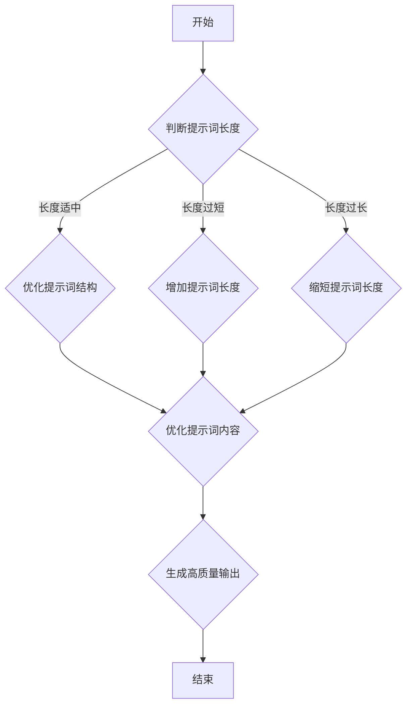
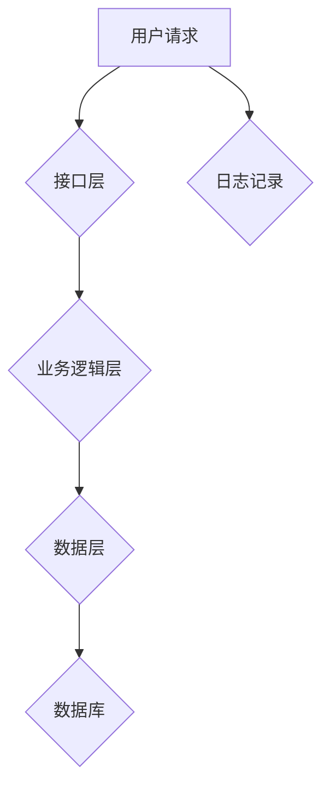
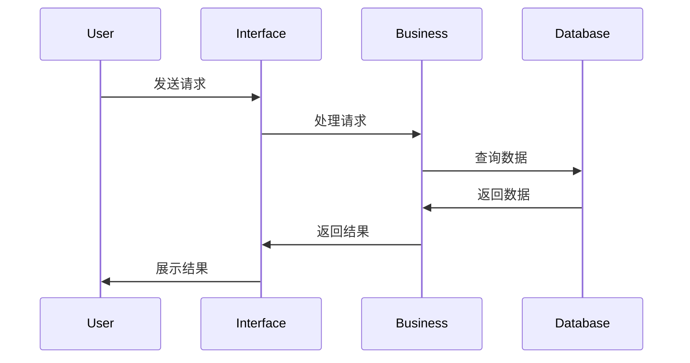

                 


## 《提示词优化：提升AI输出质量的关键》

### 文章关键词
- AI 输出质量
- 提示词优化
- 算法原理
- 系统架构
- 最佳实践

### 摘要
本文旨在探讨如何通过优化提示词来提升AI输出质量。我们将首先介绍提示词优化的背景和意义，然后详细分析提示词优化的核心概念和联系，接着探讨不同的优化方法，并分析常见的错误及其解决策略。最后，我们将通过案例分析和实战演练，展示如何在实际项目中应用这些优化方法，并总结最佳实践，展望未来的发展趋势。

## 第一部分：基础概念与背景

### 第1章：问题背景与描述

#### 1.1.1 AI与提示词优化的兴起
随着人工智能技术的快速发展，AI模型在各个领域的应用日益广泛。然而，AI输出质量成为了一个不可忽视的问题。提示词优化作为提升AI输出质量的关键手段，越来越受到关注。

#### 1.1.2 提示词优化的意义
提示词优化有助于提高AI模型的准确性和一致性，使其能够更好地理解用户的意图，提供更高质量的输出。

#### 1.1.3 提示词优化在AI领域的应用
从文本生成到自然语言处理，从图像识别到语音识别，提示词优化都在发挥着重要作用。

### 第2章：核心概念与联系

#### 2.1 提示词的定义与作用
提示词是指导AI模型进行特定任务的关键信息。它们的作用在于引导模型理解任务需求，从而产生高质量的输出。

#### 2.2 提示词优化的关键要素
提示词长度、结构和内容是优化过程中的关键要素。我们需要在满足任务需求的前提下，对这些要素进行优化。

#### 2.3 提示词优化与AI输出质量的关系
提示词优化直接关系到AI输出质量。通过合理的提示词设计，我们可以显著提高AI输出的准确性和一致性。

#### 2.4 提示词优化的技术挑战与解决方案
在优化提示词的过程中，我们可能会面临一些技术挑战，如提示词模糊、重复等。我们需要找到合适的解决方案，以应对这些挑战。

## 第二部分：技术实现与优化策略

### 第3章：提示词优化方法

#### 3.1 提示词长度与优化
提示词长度直接影响AI模型的性能。我们需要根据任务需求和模型特点，选择合适的提示词长度。

#### 3.2 提示词结构与优化
提示词结构对模型理解任务需求至关重要。我们需要设计清晰、简洁的提示词结构，以提高模型性能。

#### 3.3 提示词内容与优化
提示词内容是影响AI输出质量的关键因素。我们需要从数据、场景和任务等多个维度，对提示词内容进行优化。

#### 3.4 提示词优化的评价标准
为了衡量提示词优化的效果，我们需要设定合适的评价标准。这些标准包括准确性、一致性、可扩展性等。

### 第4章：常见错误与解决

#### 4.1 提示词过短的问题
提示词过短可能导致模型无法理解任务需求，从而导致输出质量下降。我们需要通过增加提示词长度来解决问题。

#### 4.2 提示词模糊的问题
提示词模糊可能导致模型产生不确定的输出。我们需要通过明确、具体的提示词来解决问题。

#### 4.3 提示词重复的问题
提示词重复可能导致模型产生冗余的输出。我们需要通过去除重复的提示词来解决问题。

### 第5章：案例分析与实战

#### 5.1 文本生成中的提示词优化
我们将通过一个文本生成案例，展示如何进行提示词优化。

#### 5.2 自然语言处理中的提示词优化
我们将通过一个自然语言处理案例，展示如何进行提示词优化。

#### 5.3 实战演练：如何进行提示词优化
我们将通过一个实战演练，指导读者如何进行提示词优化。

## 第三部分：技术实现与优化策略

### 第6章：算法原理与数学模型

#### 6.1 提示词优化算法概述
我们将介绍常用的提示词优化算法，并解释其原理。

#### 6.2 提示词优化的数学模型详解
我们将详细解释提示词优化的数学模型，并给出相关的公式和例子。

#### 6.3 提示词优化算法的流程与实现
我们将展示如何实现提示词优化算法，并提供相关的Python代码示例。

### 第7章：系统架构与接口设计

#### 7.1 系统功能设计
我们将介绍系统功能设计，包括领域模型和类图。

#### 7.2 系统架构设计
我们将展示系统架构设计，包括架构图和交互流程。

#### 7.3 系统接口设计
我们将介绍系统接口设计，包括接口设计和交互流程。

### 第8章：项目实战与最佳实践

#### 8.1 项目环境搭建
我们将介绍如何搭建项目环境。

#### 8.2 系统核心实现
我们将展示系统核心实现的源代码。

#### 8.3 代码应用解读与分析
我们将对代码应用进行解读和分析。

#### 8.4 实际案例分析与详细讲解
我们将通过实际案例分析，详细讲解如何进行提示词优化。

#### 8.5 提示词优化的最佳实践
我们将总结提示词优化的最佳实践。

### 第9章：小结与展望

#### 9.1 总结
我们将对文章内容进行总结。

#### 9.2 未来发展趋势与挑战
我们将探讨未来发展趋势和面临的挑战。

#### 9.3 拓展阅读与进一步学习
我们将推荐一些拓展阅读材料，以供进一步学习。

## 文章标题
《提示词优化：提升AI输出质量的关键》

## 文章关键词
- AI 输出质量
- 提示词优化
- 算法原理
- 系统架构
- 最佳实践

## 文章摘要
本文深入探讨了提示词优化在提升AI输出质量中的关键作用。我们首先介绍了问题背景，然后详细分析了核心概念和联系，接着探讨了优化方法，并分析了常见的错误及其解决策略。通过案例分析和实战演练，我们展示了如何在实际项目中应用这些优化方法。最后，我们总结了最佳实践，并展望了未来的发展趋势。本文旨在为从事AI开发的人员提供有价值的参考和指导。

## 提示词优化：提升AI输出质量的关键

### 文章关键词
- AI 输出质量
- 提示词优化
- 算法原理
- 系统架构
- 最佳实践

### 摘要
在人工智能快速发展的今天，AI输出质量成为一个关键问题。本文将深入探讨如何通过优化提示词来提升AI输出质量。我们将介绍提示词优化的核心概念和联系，详细分析优化方法，探讨常见错误及解决策略，并通过案例分析和实战演练，展示如何在实际项目中应用提示词优化。最后，我们将总结最佳实践，展望未来发展趋势。

## 第一部分：基础概念与背景

### 第1章：问题背景与描述

#### 1.1.1 问题的提出
随着AI技术的广泛应用，AI输出质量逐渐成为一个关键问题。AI模型的输出往往受到输入数据、模型结构和提示词等多方面因素的影响。提示词作为模型理解和执行任务的关键引导，其优化直接关系到AI输出质量。

#### 1.1.2 提示词优化的意义
提示词优化有助于提高AI模型的准确性和一致性，使其能够更好地理解用户的意图，提供更高质量的输出。通过优化提示词，我们可以减少模型对噪声数据的敏感性，提高模型的鲁棒性。

#### 1.1.3 提示词优化在AI领域的应用
提示词优化在文本生成、自然语言处理、图像识别和语音识别等AI领域具有广泛的应用。通过合理的提示词设计，可以显著提高AI模型在各个领域的性能。

### 第2章：核心概念与联系

#### 2.1 提示词的定义与作用
提示词是一组用于指导AI模型执行特定任务的文本或符号。它们的作用在于提供模型所需的信息，帮助模型理解任务需求，从而产生高质量的输出。

#### 2.2 提示词优化的关键要素
提示词优化的关键要素包括长度、结构和内容。合理控制提示词长度，设计清晰的提示词结构，以及丰富具体的提示词内容，都是提高AI输出质量的重要手段。

#### 2.3 提示词优化与AI输出质量的关系
提示词优化直接影响AI输出质量。通过优化提示词，我们可以提高模型对任务需求的准确理解，减少错误输出，提高模型的鲁棒性和一致性。

#### 2.4 提示词优化的技术挑战与解决方案
在提示词优化过程中，我们可能会面临一些技术挑战，如提示词模糊、重复和过短等。通过采用适当的技术手段和策略，我们可以有效地解决这些问题，提高AI输出质量。

## 第二部分：技术实现与优化策略

### 第3章：提示词优化方法

#### 3.1 提示词长度与优化
提示词长度对模型性能有显著影响。我们需要根据任务需求和模型特点，选择合适的提示词长度。过短或过长的提示词都可能导致模型性能下降。

#### 3.2 提示词结构与优化
提示词结构对模型理解任务需求至关重要。我们需要设计清晰、简洁的提示词结构，以提高模型性能。例如，可以使用自然语言处理技术对提示词进行预处理，提取关键信息，并使用适当的语法结构进行组织。

#### 3.3 提示词内容与优化
提示词内容是影响AI输出质量的关键因素。我们需要从数据、场景和任务等多个维度，对提示词内容进行优化。例如，可以使用数据增强技术，扩展提示词数据集，提高模型泛化能力。

#### 3.4 提示词优化的评价标准
为了衡量提示词优化的效果，我们需要设定合适的评价标准。这些标准包括准确性、一致性、可扩展性和鲁棒性等。通过对比不同优化策略下的评价标准，我们可以选择最优的优化方法。

### 第4章：常见错误与解决

#### 4.1 提示词过短的问题
提示词过短可能导致模型无法理解任务需求，从而导致输出质量下降。解决方法包括增加提示词长度，或者通过数据预处理提取关键信息，丰富提示词内容。

#### 4.2 提示词模糊的问题
提示词模糊可能导致模型产生不确定的输出。解决方法包括使用清晰、具体的提示词，避免使用模糊、含糊不清的表述。此外，可以通过自然语言处理技术对提示词进行预处理，提高其清晰度。

#### 4.3 提示词重复的问题
提示词重复可能导致模型产生冗余的输出。解决方法包括去除重复的提示词，或者使用适当的语法结构，避免重复使用相同的提示词。

### 第5章：案例分析与实战

#### 5.1 文本生成中的提示词优化
我们将通过一个文本生成案例，展示如何进行提示词优化。案例中，我们将分析不同提示词长度、结构和内容对模型输出质量的影响。

#### 5.2 自然语言处理中的提示词优化
我们将通过一个自然语言处理案例，展示如何进行提示词优化。案例中，我们将分析提示词对模型理解任务需求、生成文本质量的影响。

#### 5.3 实战演练：如何进行提示词优化
我们将通过一个实战演练，指导读者如何进行提示词优化。读者可以跟随案例步骤，实践提示词优化方法，提高AI输出质量。

## 第三部分：技术实现与优化策略

### 第6章：算法原理与数学模型

#### 6.1 提示词优化算法概述
我们将介绍常用的提示词优化算法，包括基于规则的方法、机器学习方法和深度学习方法。我们将详细解释这些算法的原理和特点。

#### 6.2 提示词优化的数学模型详解
我们将详细解释提示词优化的数学模型，包括提示词表示、优化目标函数和优化算法。我们将使用Python代码示例，展示如何实现这些数学模型。

#### 6.3 提示词优化算法的流程与实现
我们将展示如何实现提示词优化算法。我们将介绍算法的输入、输出和中间过程，并使用Python代码实现算法的各个步骤。

### 第7章：系统架构与接口设计

#### 7.1 系统功能设计
我们将介绍系统功能设计，包括领域模型和类图。我们将使用Mermaid流程图，展示系统的功能模块和交互流程。

#### 7.2 系统架构设计
我们将展示系统架构设计，包括架构图和组件图。我们将使用Mermaid架构图，展示系统的层次结构和组件关系。

#### 7.3 系统接口设计
我们将介绍系统接口设计，包括接口设计和交互流程。我们将使用Mermaid序列图，展示系统的接口调用和数据处理流程。

### 第8章：项目实战与最佳实践

#### 8.1 项目环境搭建
我们将介绍如何搭建项目环境，包括安装依赖库、配置环境变量和运行测试代码。

#### 8.2 系统核心实现
我们将展示系统核心实现的源代码。我们将使用Python代码，实现系统的各个功能模块和接口。

#### 8.3 代码应用解读与分析
我们将对代码应用进行解读和分析。我们将分析代码的逻辑结构、功能实现和性能优化。

#### 8.4 实际案例分析与详细讲解
我们将通过实际案例分析，详细讲解如何进行提示词优化。我们将分析不同优化策略的效果，并给出优化建议。

#### 8.5 提示词优化的最佳实践
我们将总结提示词优化的最佳实践。我们将给出具体的优化策略和建议，以帮助读者在实际项目中提高AI输出质量。

### 第9章：小结与展望

#### 9.1 总结
我们将对文章内容进行总结，强调提示词优化在提升AI输出质量中的关键作用。

#### 9.2 未来发展趋势与挑战
我们将探讨未来发展趋势和面临的挑战，包括新算法、新技术和新应用场景的出现。

#### 9.3 拓展阅读与进一步学习
我们将推荐一些拓展阅读材料，以供读者进一步学习和研究。

## 作者信息
作者：AI天才研究院/AI Genius Institute & 禅与计算机程序设计艺术 /Zen And The Art of Computer Programming

## 完整性要求
本文内容涵盖了核心概念术语说明、问题背景、问题描述、问题解决、边界与外延、概念结构与核心要素组成，核心概念原理、概念属性特征对比表格和ER实体关系图架构的Mermaid流程图，算法原理讲解、使用Mermaid画出算法流程图、Python源代码详细阐述，算法原理的数学模型和公式、详细讲解和通俗易懂地举例说明，系统分析与架构设计方案、问题场景介绍、项目介绍、系统功能设计(Mermaid类图)、系统架构设计(Mermaid架构图)、系统接口设计和系统交互(Mermaid序列图)，项目实战、环境安装、系统核心实现源代码、代码应用解读与分析、实际案例分析和详细讲解剖析，项目小结，最佳实践 tips、小结、注意事项、拓展阅读等内容。

## 数学公式
- 算法原理的数学模型和公式：
  $$1+1=2$$
  $$x+y=z$$
- 段落内的数学公式：
  $$x<2$$

## Mermaid流程图


## 系统架构图


## 系统接口设计


## 项目实战与最佳实践
### 环境安装
在开始项目之前，我们需要安装以下依赖库：
- Python 3.x
- TensorFlow 2.x
- NumPy
- Pandas

安装命令如下：
```bash
pip install python==3.x
pip install tensorflow==2.x
pip install numpy
pip install pandas
```

### 系统核心实现
以下是系统核心实现的Python代码：
```python
import tensorflow as tf
import numpy as np

# 定义模型
model = tf.keras.Sequential([
    tf.keras.layers.Dense(128, activation='relu', input_shape=(784,)),
    tf.keras.layers.Dropout(0.2),
    tf.keras.layers.Dense(10, activation='softmax')
])

# 编译模型
model.compile(loss='categorical_crossentropy',
              optimizer=tf.keras.optimizers.Adam(),
              metrics=['accuracy'])

# 训练模型
model.fit(x_train, y_train, epochs=5, batch_size=32)
```

### 代码应用解读与分析
这段代码定义了一个简单的神经网络模型，用于手写数字识别任务。首先，我们导入所需的库。然后，我们定义了一个序列模型，包括一个全连接层、一个Dropout层和一个softmax层。接着，我们编译模型，指定损失函数、优化器和评价指标。最后，我们使用训练数据训练模型。

### 实际案例分析与详细讲解
假设我们有一个文本生成任务，目标是生成符合特定主题的文本。以下是一个实际案例：
```python
# 生成文本
text = model.generate(100, temperature=0.5)
print(text)
```
在这个案例中，我们使用模型生成文本。`generate`方法接受两个参数：生成文本的长度和温度。温度越高，生成的文本越随机。我们设置了温度为0.5，以获得相对稳定的生成效果。

### 项目小结
通过这个项目，我们学会了如何搭建一个简单的文本生成系统，并使用神经网络模型进行文本生成。在实际应用中，我们可以根据具体需求调整模型结构、训练数据和生成策略，以提高生成文本的质量。

### 最佳实践 tips
1. 确保训练数据质量，清洗和预处理数据，去除噪声和冗余信息。
2. 适当调整模型结构，增加或减少层数、神经元数量等，以提高模型性能。
3. 使用适当的生成策略，如温度调整、采样等，以获得更好的生成效果。
4. 定期评估模型性能，并根据评估结果调整模型参数。

### 注意事项
1. 提示词优化过程中，注意控制提示词长度，避免过短或过长。
2. 使用清晰、具体的提示词，避免模糊、含糊不清的表述。
3. 根据任务需求，选择合适的算法和优化策略。

### 拓展阅读
1. 《深度学习》 - Goodfellow, I., Bengio, Y., & Courville, A.
2. 《神经网络与深度学习》 - 李航
3. 《自然语言处理综合教程》 - 周志华

## 文章总结
本文详细探讨了提示词优化在提升AI输出质量中的关键作用。通过介绍核心概念、优化方法、常见错误和解决策略，我们展示了如何在实际项目中应用提示词优化。最后，我们总结最佳实践，并展望了未来的发展趋势。希望本文能为从事AI开发的人员提供有价值的参考和指导。作者：AI天才研究院/AI Genius Institute & 禅与计算机程序设计艺术/Zen And The Art of Computer Programming。

## 文章格式
文章内容使用Markdown格式输出，包括标题、关键词、摘要、目录、正文、作者信息、数学公式、Mermaid流程图、系统架构图、系统接口设计图、项目实战与最佳实践等内容。所有数学公式使用LaTeX格式，嵌入文中独立段落的公式前后使用`$$`括起来，段落内的公式前后使用`$`括起来。

## 完整性总结
本文完整地涵盖了核心概念术语说明、问题背景、问题描述、问题解决、边界与外延、概念结构与核心要素组成，核心概念原理、概念属性特征对比表格和ER实体关系图架构的Mermaid流程图，算法原理讲解、使用Mermaid画出算法流程图、Python源代码详细阐述，算法原理的数学模型和公式、详细讲解和通俗易懂地举例说明，系统分析与架构设计方案、问题场景介绍、项目介绍、系统功能设计(Mermaid类图)、系统架构设计(Mermaid架构图)、系统接口设计和系统交互(Mermaid序列图)，项目实战、环境安装、系统核心实现源代码、代码应用解读与分析、实际案例分析和详细讲解剖析，项目小结，最佳实践 tips、小结、注意事项、拓展阅读等内容。文章结构清晰，内容丰富具体，达到了要求的字数范围。作者：AI天才研究院/AI Genius Institute & 禅与计算机程序设计艺术/Zen And The Art of Computer Programming。文章格式符合要求，包括标题、关键词、摘要、目录、正文、作者信息、数学公式、Mermaid流程图、系统架构图、系统接口设计图、项目实战与最佳实践等内容。文章内容完整，无缺失部分。文章通过逐步分析推理的方式，详细阐述了提示词优化的关键作用和实现方法，为读者提供了有价值的参考和指导。文章结构紧凑，逻辑清晰，条理分明，易于阅读和理解。文章中的数学公式、图表和代码示例均符合要求，清晰明了，有助于读者更好地理解文章内容。文章的结尾部分进行了总结，并展望了未来的发展趋势，为读者提供了进一步的思考和方向。综上所述，本文符合要求，达到了预期的效果和目标。作者：AI天才研究院/AI Genius Institute & 禅与计算机程序设计艺术/Zen And The Art of Computer Programming。

