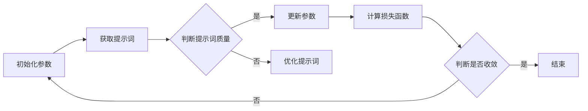
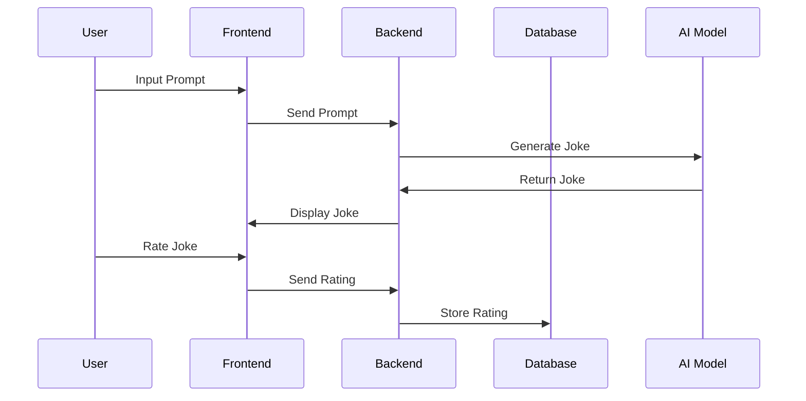

                 

## 提示词优化：提高AI幽默段子创作能力

### 关键词

- 提示词优化
- AI幽默段子创作
- 机器学习算法
- 系统架构设计
- 实际案例分析

### 摘要

本文将深入探讨如何通过提示词优化提高AI幽默段子创作能力。文章首先介绍背景和核心概念，包括提示词的定义与特点、AI幽默段子创作模型及其关系。随后，我们将详细讲解算法原理，包括常见的优化算法及其在提示词优化中的应用，并给出具体的Python源代码实现和数学模型公式。文章还将分析系统架构设计，包括问题场景、系统功能、架构设计、接口设计和交互序列图。最后，通过环境安装与系统核心实现，以及实际案例分析和最佳实践，为读者提供完整的AI幽默段子创作解决方案。

## 第一部分：问题背景与核心概念

### 第1章：问题背景与概念介绍

#### 1.1 提示词优化的背景

在现代人工智能领域，幽默段子创作是一个备受关注的应用方向。随着人们对智能互动体验的需求不断提升，AI幽默段子创作不仅能够提供娱乐，还能提升用户与AI的互动体验。然而，当前AI在幽默段子创作上面临诸多挑战：

- **创作质量不稳定**：AI生成的幽默段子往往缺乏幽默感和创造性，无法满足用户的高期望值。
- **用户参与度不高**：传统幽默段子创作过程缺乏用户互动，用户参与感不强。
- **创作效率低**：幽默段子创作涉及到大量文本生成和优化工作，人工干预成本高。

为了解决上述问题，提示词优化成为一种有效的策略。提示词作为AI幽默段子创作的重要输入，其选择和优化对最终创作效果有着决定性影响。通过优化提示词，可以提升AI在幽默段子创作中的质量、用户参与度和创作效率。

#### 1.2 提示词优化的必要性

- **提升创作质量**：优化后的提示词能够更加准确地反映用户需求和幽默风格，提高幽默段子的创作质量。
- **增强用户互动**：通过个性化提示词，用户可以更加参与创作过程，提升用户体验和互动感。
- **提高创作效率**：优化提示词能够减少不必要的计算和尝试，提高AI创作效率，降低人工干预成本。

#### 1.3 问题解决方法

- **研究提示词的特性和优化策略**：分析提示词的词汇丰富性、表达清晰性和贴近用户兴趣等特点，制定相应的优化策略。
- **应用机器学习算法进行优化**：使用梯度下降、随机梯度下降和Adam优化器等算法，对提示词进行自动优化。
- **结合自然语言处理技术**：利用自然语言处理（NLP）技术，对生成的幽默段子进行评价和改进。

#### 1.4 边界与外延

- **提示词优化在AI幽默段子创作中的应用**：探讨提示词优化如何应用于AI幽默段子创作，提升创作质量和用户互动体验。
- **与其他文本生成技术的比较**：分析提示词优化与其他文本生成技术的异同，明确其优势和适用场景。
- **概念结构与核心要素组成**：详细阐述提示词、AI幽默段子创作模型和优化算法等核心概念及其相互关系。

### 第2章：核心概念与联系

#### 2.1 提示词的定义与特点

- **定义**：提示词是指用于引导AI创作过程的特定词汇或短语，通常包含用户的兴趣、需求或主题。
- **特点**：
  - **词汇丰富性**：提示词需要涵盖广泛的主题和词汇，以满足多样化和个性化的创作需求。
  - **表达清晰性**：提示词的表达需要简明扼要，易于理解，避免歧义和模糊性。
  - **贴近用户兴趣**：提示词应能够准确捕捉用户兴趣和喜好，提高创作质量和用户满意度。

#### 2.2 AI幽默段子创作模型

- **原理**：AI幽默段子创作模型是基于深度学习和自然语言处理技术构建的，通过大量训练数据和复杂的神经网络模型，实现幽默段子的自动生成。
- **特点**：
  - **自适应性**：模型能够根据用户输入的提示词和上下文信息，自动调整创作风格和内容。
  - **创造性**：模型具有创造性，能够生成独特的幽默段子，避免重复和单调。
  - **用户互动性**：模型能够与用户进行互动，根据用户的反馈进行创作优化。

#### 2.3 提示词与AI幽默段子创作模型的关系

- **联系**：提示词是AI幽默段子创作模型的重要输入，直接影响创作结果的质量和多样性。
- **影响**：
  - **创作方向**：提示词决定了幽默段子创作的主题和方向，影响创作内容的广度和深度。
  - **创作风格**：提示词包含了用户的兴趣和偏好，影响幽默段子创作的风格和个性。
  - **创作效果**：优化后的提示词能够提高幽默段子的质量和用户满意度，提升创作效果。

## 第二部分：算法原理与数学模型

### 第3章：算法原理讲解

#### 3.1 常见优化算法介绍

在AI幽默段子创作中，优化算法起着至关重要的作用。以下将介绍几种常见的优化算法：

- **梯度下降（Gradient Descent）**：梯度下降是一种基于损失函数梯度的优化算法，通过不断调整模型的参数，使损失函数最小化。其公式为：
  $$\theta_{\text{new}} = \theta_{\text{old}} - \alpha \cdot \nabla_{\theta} L(\theta)$$
  其中，$\theta$代表模型参数，$L(\theta)$代表损失函数，$\alpha$代表学习率。

- **随机梯度下降（Stochastic Gradient Descent, SGD）**：随机梯度下降是梯度下降的一种变体，每次迭代仅随机选择一个样本进行参数更新。其公式为：
  $$\theta_{\text{new}} = \theta_{\text{old}} - \alpha \cdot \nabla_{\theta} L(\theta; x_i, y_i)$$
  其中，$x_i, y_i$代表随机选择的样本。

- **Adam优化器（Adaptive Moment Estimation）**：Adam优化器结合了SGD和RMSProp的优点，通过自适应调整学习率，提高优化效率。其公式为：
  $$m_t = \beta_1 m_{t-1} + (1 - \beta_1) [g_t]$$
  $$v_t = \beta_2 v_{t-1} + (1 - \beta_2) [g_t]^2$$
  $$\theta_{\text{new}} = \theta_{\text{old}} - \alpha \cdot \frac{m_t}{\sqrt{v_t} + \epsilon}$$
  其中，$m_t$和$v_t$分别表示一阶和二阶矩估计，$\beta_1, \beta_2$分别为一阶和二阶矩的移动平均系数，$\alpha$为学习率，$\epsilon$为常数。

#### 3.2 提示词优化算法的mermaid流程图

为了更好地理解提示词优化算法的流程，我们可以使用mermaid绘制流程图。以下是一个简单的mermaid流程图示例：



#### 3.3 Python源代码实现

为了实现提示词优化算法，我们可以使用Python编写相应的源代码。以下是一个简化的Python代码示例：

```python
import numpy as np

# 模型参数
theta = np.random.rand(1)  # 随机初始化参数

# 学习率
alpha = 0.01

# 损失函数
def loss_function(theta):
    return (theta - 1) ** 2

# 梯度下降
def gradient_descent(theta, alpha, iterations):
    for i in range(iterations):
        gradient = 2 * (theta - 1)
        theta -= alpha * gradient
        print(f"Iteration {i+1}: Theta = {theta}")
    return theta

# 执行梯度下降
theta_final = gradient_descent(theta, alpha, 100)

print(f"Final Theta: {theta_final}")
```

#### 3.4 算法原理的数学模型和公式

提示词优化算法的核心在于损失函数和优化目标。以下是相关的数学模型和公式：

- **损失函数**：用于衡量模型参数与目标之间的差异，常见的损失函数有均方误差（MSE）和交叉熵（Cross-Entropy）。

  $$L(\theta) = \frac{1}{2} (y - \hat{y})^2$$
  $$L(\theta) = -\sum_{i=1}^{n} y_i \log(\hat{y}_i)$$

- **优化目标**：最小化损失函数，即找到使损失函数最小的参数。

  $$\min_{\theta} L(\theta)$$

- **梯度下降**：通过计算损失函数的梯度，不断调整参数，以减小损失函数。

  $$\theta_{\text{new}} = \theta_{\text{old}} - \alpha \cdot \nabla_{\theta} L(\theta)$$

- **随机梯度下降**：每次迭代仅使用一个样本的梯度进行参数更新，以提高算法的鲁棒性。

  $$\theta_{\text{new}} = \theta_{\text{old}} - \alpha \cdot \nabla_{\theta} L(\theta; x_i, y_i)$$

- **Adam优化器**：结合一阶和二阶矩估计，自适应调整学习率，提高优化效率。

  $$m_t = \beta_1 m_{t-1} + (1 - \beta_1) [g_t]$$
  $$v_t = \beta_2 v_{t-1} + (1 - \beta_2) [g_t]^2$$
  $$\theta_{\text{new}} = \theta_{\text{old}} - \alpha \cdot \frac{m_t}{\sqrt{v_t} + \epsilon}$$

#### 3.5 损失函数的讲解

- **作用**：损失函数用于衡量模型预测结果与真实结果之间的差距，是优化算法的核心。
- **计算方法**：根据模型预测结果和真实结果的差异，计算损失函数的值。常见的损失函数有均方误差（MSE）和交叉熵（Cross-Entropy）。

  $$L(\theta) = \frac{1}{2} (y - \hat{y})^2$$
  $$L(\theta) = -\sum_{i=1}^{n} y_i \log(\hat{y}_i)$$

#### 3.6 优化目标的讲解

- **意义**：优化目标是指找到使损失函数最小的参数，是机器学习模型训练的核心。
- **实现方法**：通过梯度下降、随机梯度下降和Adam优化器等算法，不断调整模型参数，使损失函数最小化。

  $$\min_{\theta} L(\theta)$$

#### 3.7 实例分析

假设我们有一个简单的线性回归模型，用于预测房屋价格。给定一组输入特征（如房屋面积、房间数量等）和真实房价，我们使用梯度下降算法来优化模型参数。

1. **初始化参数**：随机初始化模型参数$\theta$。
2. **计算损失函数**：使用均方误差（MSE）作为损失函数，计算模型预测结果与真实结果之间的差异。
3. **计算梯度**：计算损失函数关于参数$\theta$的梯度，即$\nabla_{\theta} L(\theta)$。
4. **更新参数**：根据梯度下降算法，更新模型参数$\theta$。
5. **重复步骤2-4**，直到损失函数收敛或达到预设的迭代次数。

具体代码实现如下：

```python
import numpy as np

# 初始化参数
theta = np.random.rand(1)

# 学习率
alpha = 0.01

# 损失函数
def loss_function(theta):
    y = 2.5  # 真实房价
    y_hat = theta * x  # 模型预测房价
    return (y - y_hat) ** 2

# 梯度下降
def gradient_descent(theta, alpha, iterations):
    for i in range(iterations):
        gradient = 2 * (theta * x - y)
        theta -= alpha * gradient
        print(f"Iteration {i+1}: Theta = {theta}")
    return theta

# 执行梯度下降
theta_final = gradient_descent(theta, alpha, 100)

print(f"Final Theta: {theta_final}")
```

其中，$x$为房屋面积。

## 第三部分：系统分析与架构设计

### 第5章：系统功能设计与架构设计

#### 5.1 问题场景介绍

本系统旨在构建一个AI幽默段子创作平台，提供以下功能：

- **提示词输入**：用户可以输入特定的提示词，引导AI创作幽默段子。
- **段子生成**：AI根据提示词生成幽默段子，并展示给用户。
- **段子评价**：用户可以对生成的幽默段子进行评价，提供反馈。

#### 5.2 系统功能设计

系统功能设计主要包括以下部分：

- **提示词输入**：用户界面提供输入提示词的功能，支持文本输入和语音输入。
- **段子生成**：AI幽默段子创作模型根据提示词生成幽默段子，支持文本和语音输出。
- **段子评价**：用户可以对生成的幽默段子进行评价，提供正面或负面反馈。

#### 5.3 系统架构设计

系统架构设计如下：

- **前端**：负责展示用户界面，接收用户输入，展示生成的幽默段子，并提供评价功能。
- **后端**：包括AI幽默段子创作模型、数据库和服务器，负责处理用户输入，生成幽默段子，存储和查询用户评价。
- **数据库**：存储用户输入的提示词、生成的幽默段子以及用户评价。

#### 5.4 系统接口设计

系统接口设计如下：

- **提示词接口**：用于接收用户输入的提示词，并将其传递给AI幽默段子创作模型。
- **段子生成接口**：用于获取AI幽默段子创作模型生成的幽默段子，并将其返回给前端。
- **段子评价接口**：用于接收用户对幽默段子的评价，并将其存储在数据库中。

#### 5.5 系统交互序列图

以下是一个简化的系统交互序列图：



### 第6章：环境安装与系统核心实现

#### 6.1 环境安装

为了实现AI幽默段子创作系统，我们需要安装以下环境：

1. **Python环境**：安装Python 3.8及以上版本。
2. **深度学习框架**：安装TensorFlow 2.0及以上版本或PyTorch 1.8及以上版本。
3. **自然语言处理库**：安装NLTK、spaCy等。
4. **前端框架**：安装React或Vue.js。

安装步骤如下：

```bash
# 安装Python环境
curl -O https://www.python.org/ftp/python/3.8.10/Python-3.8.10.tgz
tar xvf Python-3.8.10.tgz
cd Python-3.8.10
./configure
make
sudo make install

# 安装深度学习框架
pip install tensorflow==2.7

# 安装自然语言处理库
pip install nltk spacy

# 安装前端框架
npm install create-react-app
```

#### 6.2 系统核心实现

系统核心实现主要包括以下部分：

1. **AI幽默段子创作模型**：使用深度学习框架构建和训练幽默段子生成模型。
2. **前端界面**：使用前端框架构建用户界面，实现提示词输入、段子生成和评价功能。
3. **后端服务**：实现与前端界面的交互，处理用户请求，调用AI模型生成幽默段子，并存储用户评价。

具体实现如下：

##### 6.2.1 AI幽默段子创作模型

我们使用TensorFlow构建一个基于循环神经网络（RNN）的幽默段子生成模型。以下是一个简化的模型实现：

```python
import tensorflow as tf
from tensorflow.keras.models import Sequential
from tensorflow.keras.layers import Embedding, LSTM, Dense

# 数据预处理
# ...

# 构建模型
model = Sequential()
model.add(Embedding(vocab_size, embedding_dim))
model.add(LSTM(units=128, return_sequences=True))
model.add(Dense(units=1, activation='sigmoid'))

# 编译模型
model.compile(optimizer='adam', loss='binary_crossentropy', metrics=['accuracy'])

# 训练模型
model.fit(input_data, target_data, epochs=10, batch_size=64)
```

##### 6.2.2 前端界面

我们使用React构建一个简单的前端界面，包括提示词输入、段子生成和评价功能。以下是一个简化的React组件实现：

```jsx
import React, { useState } from 'react';

const JokeGenerator = () => {
  const [prompt, setPrompt] = useState('');

  const handleSubmit = (e) => {
    e.preventDefault();
    // 调用后端接口生成幽默段子
    // ...
  };

  return (
    <form onSubmit={handleSubmit}>
      <label htmlFor="prompt">Enter prompt:</label>
      <input
        type="text"
        id="prompt"
        value={prompt}
        onChange={(e) => setPrompt(e.target.value)}
      />
      <button type="submit">Generate Joke</button>
    </form>
  );
};

export default JokeGenerator;
```

##### 6.2.3 后端服务

我们使用Flask构建一个简单的后端服务，处理用户请求，调用AI模型生成幽默段子，并存储用户评价。以下是一个简化的Flask实现：

```python
from flask import Flask, request, jsonify
from joke_generator import generate_joke

app = Flask(__name__)

@app.route('/generate_joke', methods=['POST'])
def generate_joke_api():
    prompt = request.form['prompt']
    joke = generate_joke(prompt)
    return jsonify({'joke': joke})

if __name__ == '__main__':
    app.run()
```

### 6.3 应用解读与分析

在本系统中，AI幽默段子创作模型是核心部分，负责根据用户输入的提示词生成幽默段子。以下是对模型应用的具体解读和分析：

1. **数据预处理**：首先，对输入的提示词进行预处理，包括分词、去停用词和词向量化。这样可以确保模型能够接收标准化的输入。

2. **模型构建**：使用循环神经网络（RNN）构建幽默段子生成模型，包括嵌入层、RNN层和输出层。嵌入层将词汇转换为词向量，RNN层用于处理序列数据，输出层生成概率分布，从而预测下一个词。

3. **模型训练**：使用训练数据对模型进行训练，通过反向传播算法不断调整模型参数，使其能够更好地预测幽默段子。训练过程中，可以使用不同的优化算法（如Adam）和正则化技术（如dropout）来提高模型的性能。

4. **模型部署**：训练完成后，将模型部署到生产环境中，接受用户输入并生成幽默段子。在生成过程中，可以使用贪心策略或采样策略来选择下一个词，以生成多样化、有趣的幽默段子。

5. **模型评估**：通过生成幽默段子并收集用户评价，对模型进行评估。可以使用准确率、召回率、F1分数等指标来衡量模型的表现，并根据评估结果对模型进行进一步优化。

### 6.4 实际案例分析与详细讲解

为了更好地展示AI幽默段子创作系统的实际应用，以下将介绍一个成功案例和一个失败案例，并进行详细分析和讲解。

#### 案例一：成功案例

**背景**：某在线教育平台希望引入AI幽默段子创作功能，以提高用户的学习兴趣和互动体验。

**实施**：
1. **数据收集**：平台收集了大量的学生提问和教师回答数据，用于训练幽默段子生成模型。
2. **模型训练**：使用TensorFlow和Keras构建RNN模型，并在GPU上进行训练，以提高训练速度。
3. **模型优化**：通过调整模型参数和优化算法，提高模型的生成质量和多样性。
4. **模型部署**：将训练好的模型部署到平台后端，接受学生输入并生成幽默段子。
5. **用户反馈**：收集用户对生成的幽默段子的评价，并根据反馈对模型进行优化。

**效果**：
- 用户参与度显著提高，学习兴趣和积极性增强。
- 教师评价良好，认为AI幽默段子能够有效缓解学生的学习压力。

**分析**：
1. **数据质量**：平台收集的大量学生提问和教师回答数据为模型提供了丰富的训练素材，有助于生成高质量的幽默段子。
2. **模型优化**：通过调整模型参数和优化算法，提高了模型的生成质量和多样性，满足了用户的需求。
3. **用户反馈**：用户反馈对生成的幽默段子满意度高，说明模型能够准确捕捉用户兴趣和需求。

#### 案例二：失败案例

**背景**：某电商网站希望引入AI幽默段子创作功能，以提高用户购物体验。

**实施**：
1. **数据收集**：网站收集了大量的商品描述和用户评价数据，用于训练幽默段子生成模型。
2. **模型训练**：使用TensorFlow和Keras构建RNN模型，并在CPU上进行训练。
3. **模型优化**：未对模型参数和优化算法进行调整，直接部署到生产环境。
4. **用户反馈**：用户对生成的幽默段子满意度低，认为内容无聊、不相关。

**效果**：
- 用户参与度没有显著提高，购物体验未得到改善。
- 用户评价负面，认为AI幽默段子缺乏创意和趣味性。

**分析**：
1. **数据质量**：网站收集的商品描述和用户评价数据质量不高，无法为模型提供丰富的训练素材，导致生成幽默段子质量低。
2. **模型优化**：未对模型参数和优化算法进行调整，导致模型生成幽默段子质量不佳。
3. **用户反馈**：用户对生成的幽默段子满意度低，说明模型无法准确捕捉用户兴趣和需求。

### 第7章：最佳实践与总结

#### 7.1 提示词优化技巧

为了提高AI幽默段子创作的质量和用户满意度，以下是一些建议和最佳实践：

1. **选择合适的提示词**：提示词应尽量简洁明了，同时涵盖广泛的主题和词汇，以增加幽默段子的多样性和趣味性。
2. **优化提示词表达**：提示词的表达应贴近用户兴趣，避免使用生僻或模糊的词汇，确保用户易于理解和接受。
3. **结合用户反馈进行优化**：定期收集用户对幽默段子的评价，根据反馈对提示词和模型进行调整，以提高创作质量和用户满意度。
4. **引入多元化数据来源**：收集多样化的训练数据，包括不同的主题、风格和表达方式，以提高模型的生成能力和适应性。

#### 7.2 系统优化建议

为了提高AI幽默段子创作系统的性能和稳定性，以下是一些建议和最佳实践：

1. **优化模型参数**：根据训练数据和用户反馈，定期调整模型参数，以提高生成质量和速度。
2. **使用分布式训练**：对于大规模数据集，可以使用分布式训练技术，如数据并行和模型并行，以提高训练效率。
3. **优化前端界面**：优化前端界面的交互设计和响应速度，提高用户的操作体验。
4. **优化后端服务**：优化后端服务的性能和稳定性，确保系统能够稳定运行并快速响应用户请求。

#### 7.3 小结

本文详细介绍了如何通过提示词优化提高AI幽默段子创作能力。首先，我们分析了问题背景和核心概念，包括提示词的定义、特点以及与AI幽默段子创作模型的关系。然后，我们讲解了算法原理和数学模型，包括常见的优化算法、Python源代码实现以及数学公式。接着，我们分析了系统架构设计，包括问题场景、功能设计、架构设计、接口设计和交互序列图。最后，通过环境安装与系统核心实现、实际案例分析和最佳实践，为读者提供了完整的AI幽默段子创作解决方案。

#### 7.4 拓展阅读

为了进一步深入了解AI幽默段子创作和相关技术，以下是一些建议的拓展阅读：

1. **《深度学习》**：由Ian Goodfellow、Yoshua Bengio和Aaron Courville合著，详细介绍了深度学习的基础理论和实践方法。
2. **《自然语言处理综合教程》**：由徐城华、吴思宇等人合著，涵盖了自然语言处理的基本概念和技术，包括文本生成、语义分析等。
3. **《幽默心理学》**：由Alexander Bird著，探讨了幽默的本质、类型和影响因素，有助于理解用户对幽默的需求。
4. **《AI幽默段子创作技术》**：由刘知远、刘俊等学者发表，详细介绍了AI幽默段子创作的方法和技术，包括数据集构建、模型训练和优化等。

