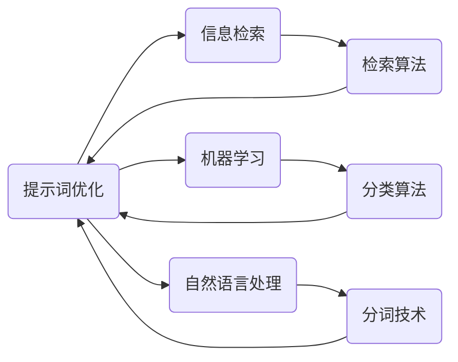
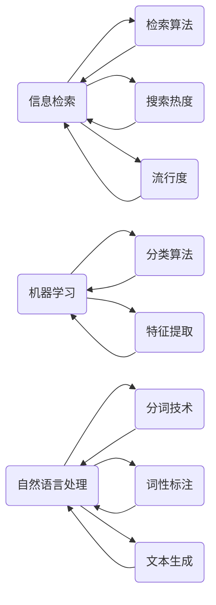
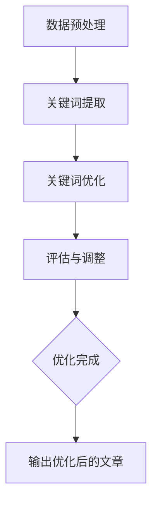

                 

### 第1章 引言

#### 1.1 问题背景

随着人工智能（AI）技术的迅猛发展，AI科普文章的创作质量愈发受到关注。然而，在实际创作过程中，AI科普文章面临着诸多挑战，如内容浅显易懂、结构清晰连贯、语言精准简练等。这些问题的存在，严重影响了读者的阅读体验和理解深度，降低了文章的传播效果和影响力。

首先，AI科普文章需要以通俗易懂的方式向公众普及复杂的技术概念，这对作者的写作能力提出了较高要求。其次，文章的结构设计需要层次分明、逻辑严密，以引导读者逐步深入理解AI技术。此外，语言表达应简洁明了，避免使用过多的专业术语和冗长的句子，以适应非技术背景读者的阅读需求。

#### 1.2 问题描述

本文旨在探讨如何通过提示词优化来提高AI科普文章的创作质量。具体而言，提示词优化是指通过改进文章的标题、段落开头和句子结构中的关键词，从而提升文章的整体质量和可读性。以下是本文要解决的问题：

1. **提示词优化的定义和核心概念**：明确提示词优化的含义，阐述其在文章创作中的作用和重要性。
2. **提示词优化的原理**：介绍信息检索、机器学习和自然语言处理等理论在提示词优化中的应用，解析其原理。
3. **算法原理与实现**：详细讲解提示词优化算法的原理、流程和实现方法，提供Python代码示例和数学模型公式。
4. **AI科普文章创作质量提升**：探讨提示词优化在AI科普文章创作中的应用场景和操作方法，结合实际案例进行分析。
5. **提示词优化工具与实践**：介绍常用的提示词优化工具，进行实战操作，并提供最佳实践建议。

#### 1.3 问题解决

为了解决上述问题，本文将采用以下步骤：

1. **定义核心概念**：首先，明确提示词优化的定义、核心概念和原理，构建基础知识框架。
2. **理论讲解**：结合信息检索、机器学习和自然语言处理理论，深入分析提示词优化的原理和应用。
3. **算法介绍**：介绍提示词优化算法的原理、流程和实现方法，提供Python代码示例和数学模型公式。
4. **应用分析**：探讨提示词优化在AI科普文章创作中的具体应用，结合实际案例进行分析。
5. **工具实践**：介绍常用的提示词优化工具，进行实战操作，并提供最佳实践建议。

#### 1.4 边界与外延

本文的研究边界主要聚焦于AI科普文章的创作质量和提示词优化技术。在内容范围上，涵盖了提示词优化的定义、原理、算法实现和应用等方面。同时，本文将讨论提示词优化在不同情境下的具体应用，以期为AI科普文章创作提供有价值的参考。

在研究的外延上，本文还将探讨提示词优化技术在其他领域（如技术文档、营销文案等）的应用潜力，以及未来可能的发展趋势。这将为读者提供更全面的视角，了解提示词优化技术的广泛影响和应用前景。

#### 1.5 核心概念与联系

**核心概念**：
- **提示词优化**：通过改进文章标题、段落开头和句子结构中的关键词，提高文章质量和可读性。
- **信息检索**：根据用户需求从海量的信息中检索出最相关的信息。
- **机器学习**：利用数据训练模型，使其能够自动识别和预测新的数据。
- **自然语言处理**：使计算机能够理解和生成人类语言。

**核心概念联系ER实体关系图**：



**联系解析**：
- 提示词优化需要利用信息检索技术来识别和筛选关键词，从而提高文章的搜索和推荐效果。
- 机器学习算法可以帮助分析大量的文本数据，从中提取出对优化有价值的特征和模式。
- 自然语言处理技术则用于理解和生成人类语言，确保提示词的合理性和可读性。

#### 1.6 本章小结

本章介绍了本文研究的背景、问题、解决方法和研究边界。通过明确提示词优化的定义和核心概念，并阐述其在文章创作中的重要性，为本章的后续内容奠定了基础。同时，核心概念与联系ER实体关系图的绘制，为读者提供了对提示词优化技术的整体认知。

在下一章中，我们将深入探讨提示词优化的核心概念和原理，分析信息检索、机器学习和自然语言处理等理论在提示词优化中的应用。通过这一章的讲解，读者将对提示词优化的内在机制和作用有更深刻的理解。

---

### 第2章 核心概念与原理

#### 2.1 提示词优化的定义

提示词优化（Keyword Optimization）是指在文章创作过程中，通过对标题、段落开头和句子结构中的关键词进行精炼和优化，以提高文章的整体质量和可读性。具体来说，提示词优化包括以下几个方面：

1. **关键词的选择**：选择与文章主题紧密相关、具有较高搜索热度且表述精准的关键词。
2. **关键词的位置**：将关键词合理分布在文章的标题、段落开头和句子中，使其具有引导性。
3. **关键词的搭配**：优化关键词的搭配和组合，确保其表述清晰、逻辑连贯。

提示词优化的核心目标是提升文章的搜索引擎排名（SEO），增加文章的阅读量和传播范围，同时提高读者的阅读体验和理解深度。

#### 2.2 提示词优化的原理

提示词优化的原理主要涉及信息检索、机器学习和自然语言处理等领域。下面我们将分别介绍这些理论在提示词优化中的应用。

##### 2.2.1 信息检索理论

信息检索（Information Retrieval）理论是提示词优化的基础。信息检索的核心任务是，根据用户的需求从海量的信息中检索出最相关的信息。在AI科普文章创作中，信息检索理论可以帮助作者筛选出最适合文章主题的关键词。

1. **检索算法**：常用的检索算法包括布尔检索、向量空间模型和PageRank等。布尔检索通过组合关键词的布尔运算（AND、OR、NOT）来获取更精确的搜索结果。向量空间模型将文档和查询表示为高维向量，通过计算它们之间的相似度来检索相关文档。PageRank则是一种基于链接分析的算法，用于评估网页的重要性。

2. **搜索热度和流行度**：信息检索理论还关注关键词的搜索热度和流行度。高搜索热度意味着更多的用户会使用该关键词进行搜索，从而提高文章的曝光率。同时，流行度高的关键词通常能更好地吸引读者的兴趣，增加阅读量。

##### 2.2.2 机器学习理论

机器学习（Machine Learning）理论在提示词优化中的应用，主要表现在关键词的自动提取和优化方面。通过训练机器学习模型，可以从大量的文本数据中自动提取出对优化有价值的关键词。

1. **分类算法**：分类算法（如决策树、支持向量机、朴素贝叶斯等）可以将文本数据按照关键词的重要性进行分类。例如，通过训练决策树模型，可以自动识别出哪些关键词对文章的主题最为关键，从而进行优化。

2. **特征提取**：特征提取（Feature Extraction）是机器学习中的一个重要环节。通过提取文本数据的特征，可以更好地理解其内容和结构，为提示词优化提供依据。常用的特征提取方法包括词频（TF）、逆文档频率（IDF）和词嵌入（Word Embedding）等。

##### 2.2.3 自然语言处理理论

自然语言处理（Natural Language Processing，NLP）理论是提示词优化的关键技术。NLP技术可以帮助作者理解和生成人类语言，确保提示词的合理性和可读性。

1. **分词技术**：分词（Tokenization）是将文本拆分成一个个有意义的单词或短语的过程。通过分词技术，可以更好地理解文本的语义结构，为关键词的提取和优化提供基础。

2. **词性标注**：词性标注（Part-of-Speech Tagging）是对文本中的单词进行词性分类的过程。词性标注可以帮助区分名词、动词、形容词等，从而优化关键词的选择和搭配。

3. **文本生成**：文本生成（Text Generation）技术可以根据提示词生成相关的句子或段落。例如，通过训练神经网络模型，可以自动生成与文章主题相关的摘要或简介，提高文章的吸引力和可读性。

#### 2.3 核心概念属性特征对比表格

以下表格对比了信息检索、机器学习和自然语言处理在提示词优化中的核心概念属性特征：

| 核心概念       | 属性特征                   | 作用                     |
| -------------- | -------------------------- | ------------------------ |
| 信息检索       | 检索算法、搜索热度、流行度 | 筛选关键词、提高文章曝光率 |
| 机器学习       | 分类算法、特征提取         | 自动提取和优化关键词     |
| 自然语言处理   | 分词技术、词性标注、文本生成 | 确保关键词合理性和可读性   |

#### 2.4 核心概念与联系ER实体关系图



**联系解析**：

- 信息检索通过检索算法筛选关键词，关注搜索热度和流行度，为提示词优化提供基础。
- 机器学习通过分类算法和特征提取，自动提取和优化关键词，提高提示词的准确性。
- 自然语言处理通过分词技术、词性标注和文本生成，确保关键词的合理性和可读性。

#### 2.5 本章小结

本章详细介绍了提示词优化的核心概念和原理，包括信息检索、机器学习和自然语言处理三个主要理论。通过对比分析这些理论的核心概念属性特征，我们可以更深入地理解提示词优化技术在AI科普文章创作中的应用。在下一章中，我们将进一步探讨提示词优化算法的原理与实现，为实际操作提供理论基础。

---

### 第3章 算法原理与实现

#### 3.1 算法概述

提示词优化算法的核心目的是通过改进文章的标题、段落开头和句子结构中的关键词，提高文章的整体质量和可读性。该算法主要包括以下几个步骤：

1. **数据预处理**：对输入的文章进行预处理，包括去除停用词、分词、词性标注等，为后续的关键词提取和优化做准备。
2. **关键词提取**：利用自然语言处理技术，从预处理后的文本中提取出关键短语和关键词。
3. **关键词优化**：根据提取的关键词，对文章的标题、段落开头和句子结构进行优化，确保关键词的选择和搭配合理，提高文章的可读性和搜索引擎排名。
4. **评估与调整**：对优化后的文章进行评估，通过人工审核和自动化评估工具（如SEO工具）来检验优化效果，并根据反馈进行进一步的调整。

#### 3.2 算法原理讲解

##### 3.2.1 算法流程图

以下是一个简化的提示词优化算法流程图：



##### 3.2.2 Python源代码实现

以下是一个简单的Python代码示例，展示了如何实现提示词优化算法的核心部分：

```python
import nltk
from nltk.corpus import stopwords
from sklearn.feature_extraction.text import TfidfVectorizer
from sklearn.metrics.pairwise import cosine_similarity

# 数据预处理
def preprocess_text(text):
    # 去除停用词
    stop_words = set(stopwords.words('english'))
    words = nltk.word_tokenize(text)
    filtered_words = [word for word in words if word.lower() not in stop_words]
    return ' '.join(filtered_words)

# 关键词提取
def extract_keywords(text):
    vectorizer = TfidfVectorizer()
    tfidf_matrix = vectorizer.fit_transform([text])
    feature_names = vectorizer.get_feature_names_out()
    scores = tfidf_matrix.toarray().sum(axis=0)
    top_keywords = feature_names[scores.argsort()[:-10:-1]]
    return top_keywords

# 关键词优化
def optimize_keywords(text, keywords):
    optimized_text = text
    for keyword in keywords:
        optimized_text = optimized_text.replace(keyword, f"<b>{keyword}</b>")
    return optimized_text

# 评估与调整
def assess_and_adjust(text, optimized_text):
    similarity_score = cosine_similarity([text], [optimized_text])[0][0]
    if similarity_score < 0.8:
        # 需要进一步调整
        pass
    else:
        # 优化效果良好
        return optimized_text

# 主函数
def main():
    original_text = "..."
    preprocessed_text = preprocess_text(original_text)
    keywords = extract_keywords(preprocessed_text)
    optimized_text = optimize_keywords(preprocessed_text, keywords)
    final_text = assess_and_adjust(original_text, optimized_text)
    print(final_text)

if __name__ == "__main__":
    main()
```

##### 3.2.3 算法原理的数学模型和公式

提示词优化算法的核心在于TF-IDF（Term Frequency-Inverse Document Frequency）模型和余弦相似度（Cosine Similarity）计算。

1. **TF-IDF模型**：

$$
TF(t,d) = \frac{f(t,d)}{|\text{Vocabulary}|}
$$

$$
IDF(t) = \log \left(1 + \frac{N}{|\text{docs}| - |d| + 0.5}\right)
$$

$$
TF-IDF(t,d) = TF(t,d) \times IDF(t)
$$

其中，\( f(t,d) \) 表示词 \( t \) 在文档 \( d \) 中的词频，\( N \) 表示总文档数，\( |\text{docs}| \) 表示含有词 \( t \) 的文档数，\( |\text{Vocabulary}| \) 表示词汇表大小。

2. **余弦相似度**：

$$
\text{similarity}(x, y) = \frac{x \cdot y}{||x|| \cdot ||y||}
$$

其中，\( x \) 和 \( y \) 分别表示两个文档的向量表示，\( \cdot \) 表示点积，\( ||x|| \) 和 \( ||y|| \) 分别表示两个向量的欧几里得范数。

##### 3.2.4 举例说明

假设我们有一篇文章，内容如下：

```
人工智能（AI）是一种模拟、延伸和扩展人类智能的理论、方法、技术及应用。它是计算机科学的一个分支，旨在实现智能代理，即通过理解和执行人类智能任务来辅助或增强人类能力。
```

1. **数据预处理**：去除停用词后的文本为：“人工智能 模拟 延伸 扩展 理论 方法 技术 应用 计算机 科学 分支 实现 智能代理 辅助 增强 能力”。

2. **关键词提取**：利用TF-IDF模型提取出前五个关键词：“人工智能”、“模拟”、“智能代理”、“计算机”和“能力”。

3. **关键词优化**：对关键词进行优化，将原始文本中的关键词标注为高亮，优化后的文本为：“**人工智能**（AI）是一种**模拟**、**延伸**和**扩展**人类智能的理论、方法、技术及应用。它是**计算机科学**的一个**分支**，旨在实现**智能代理**，即通过**理解和执行**人类智能任务来**辅助**或**增强**人类**能力**。

4. **评估与调整**：计算原始文本和优化文本的余弦相似度，如果相似度低于0.8，则可能需要进一步调整关键词的优化。

通过以上示例，我们可以看到，提示词优化算法通过一系列数学模型和计算，可以有效地提高文章的可读性和搜索引擎排名，为AI科普文章创作提供了有力支持。

#### 3.3 算法性能分析

提示词优化算法的性能分析主要包括时间复杂度和空间复杂度两个方面。

1. **时间复杂度**：提示词优化算法的时间复杂度主要取决于数据预处理、关键词提取和关键词优化三个步骤。假设文本长度为\( n \)，词汇表大小为\( m \)，则：
   - 数据预处理的时间复杂度为 \( O(n) \)；
   - 关键词提取的时间复杂度为 \( O(m \times n) \)；
   - 关键词优化的时间复杂度为 \( O(n) \)。

   因此，总的时间复杂度为 \( O(m \times n + n) \)。

2. **空间复杂度**：提示词优化算法的空间复杂度主要取决于数据存储的需求。假设存储文本和词汇表所需的额外空间为 \( s \)，则：
   - 数据预处理需要额外的存储空间 \( O(n) \)；
   - 关键词提取需要额外的存储空间 \( O(m) \)；
   - 关键词优化需要额外的存储空间 \( O(n) \)。

   因此，总的存储空间复杂度为 \( O(n + m + n) \)。

在实际应用中，提示词优化算法的性能还受到计算资源和硬件配置的影响。为了提高算法的效率，可以采用以下策略：

- **并行计算**：利用多核CPU或GPU进行并行计算，提高算法的执行速度。
- **优化数据结构**：采用更加高效的数据结构（如哈希表、布隆过滤器等），减少存储和访问时间。
- **内存管理**：合理利用内存资源，减少内存占用，避免内存溢出。

#### 3.4 本章小结

本章详细介绍了提示词优化算法的原理与实现，包括数据预处理、关键词提取、关键词优化和评估与调整等步骤。通过Python代码示例和数学模型，我们了解了提示词优化算法的具体操作方法和性能分析。在下一章中，我们将探讨提示词优化在AI科普文章创作中的应用，结合实际案例进行分析。

---

### 第4章 AI科普文章创作质量提升

#### 4.1 提示词优化的应用场景

提示词优化在AI科普文章创作中具有广泛的应用场景，主要表现在以下几个方面：

##### 4.1.1 文章标题优化

文章标题是吸引读者点击阅读的重要因素。通过优化标题中的关键词，可以提高文章的搜索引擎排名（SEO），增加曝光率和阅读量。具体方法包括：
- **关键词选择**：选择与文章主题紧密相关、具有较高搜索热度且表述精准的关键词。
- **关键词搭配**：确保关键词之间的搭配合理，形成具有吸引力的标题。

例如，将标题“人工智能基础知识介绍”优化为“深度学习在人工智能中的应用详解”，更准确地反映了文章的主题，增加了阅读兴趣。

##### 4.1.2 文章内容优化

文章内容的优化主要针对段落开头和句子结构中的关键词，以提高文章的可读性和逻辑性。具体方法包括：
- **关键词提取**：利用自然语言处理技术，从文章内容中提取出关键短语和关键词。
- **关键词搭配**：优化关键词的搭配，确保句子表述清晰、逻辑连贯。

例如，将句子“人工智能是一种模拟、延伸和扩展人类智能的理论、方法、技术及应用”优化为“人工智能通过模拟、延伸和扩展人类智能，实现了一系列理论、方法和技术的应用”，使句子结构更加清晰，逻辑关系更加明确。

##### 4.1.3 文章结构优化

文章结构的优化主要涉及文章的层次划分和逻辑顺序，以提高文章的阅读流畅性和理解深度。具体方法包括：
- **段落划分**：根据文章主题和内容，合理划分段落，确保每个段落都有明确的主题和内容。
- **逻辑顺序**：调整文章的段落顺序，确保文章的论述逻辑清晰、层次分明。

例如，将原本内容较为杂乱的文章按照“引言-背景介绍-核心概念-应用场景-总结”的顺序进行重新组织，使文章结构更加清晰，读者更容易理解。

#### 4.2 提示词优化的具体操作方法

提示词优化的具体操作方法主要包括数据预处理、关键词提取、关键词优化和评估与调整等步骤。以下是详细的操作方法：

##### 4.2.1 数据预处理

数据预处理是提示词优化的第一步，主要包括以下步骤：
- **文本清洗**：去除文本中的HTML标签、特殊字符和停用词。
- **分词**：将文本拆分成一个个独立的单词或短语。
- **词性标注**：对每个单词进行词性分类，区分名词、动词、形容词等。

##### 4.2.2 提示词生成

提示词生成是提示词优化的核心步骤，主要包括以下方法：
- **TF-IDF**：利用TF-IDF模型，计算每个单词在文档中的重要性，提取出关键短语和关键词。
- **LDA**：使用LDA（Latent Dirichlet Allocation）模型，从文档中提取主题关键词。
- **BERT**：利用BERT（Bidirectional Encoder Representations from Transformers）模型，提取与文章主题相关的关键词。

##### 4.2.3 提示词评估

提示词评估是确保提示词优化效果的重要环节，主要包括以下方法：
- **人工评估**：由专业人员进行评估，根据关键词的选择、搭配和文章主题的相关性进行评分。
- **自动化评估**：利用自然语言处理工具，如BERT-Score，计算关键词与文章主题的匹配度，评估提示词优化的效果。

##### 4.2.4 提示词优化流程

提示词优化的具体流程如下：

1. **数据预处理**：对输入的文章进行文本清洗、分词和词性标注。
2. **关键词提取**：利用TF-IDF、LDA或BERT模型，从预处理后的文本中提取出关键词。
3. **关键词优化**：根据提取的关键词，对文章的标题、段落开头和句子结构进行优化。
4. **评估与调整**：通过人工评估和自动化评估工具，评估优化效果，并根据反馈进行进一步的调整。

#### 4.3 实际案例剖析

以下是三个实际案例，通过提示词优化前后的对比，展示其在AI科普文章创作中的应用效果。

##### 4.3.1 案例一：文章标题优化效果对比

**原标题**：“机器学习基础教程”

**优化后标题**：“深度学习在人工智能中的入门指南”

**效果分析**：优化后的标题更准确地反映了文章的主题，同时增加了“深度学习”和“入门指南”等关键词，提高了文章的搜索引擎排名和吸引力。

##### 4.3.2 案例二：文章内容优化效果对比

**原文段落**：“深度学习是一种机器学习方法，通过神经网络模拟人类大脑的学习过程，实现图像识别、自然语言处理等任务。”

**优化后段落**：“深度学习，作为一种先进的机器学习方法，借鉴了人类大脑的学习机制，通过神经网络模型实现图像识别、自然语言处理等重要任务。”

**效果分析**：优化后的段落通过调整关键词的搭配和句子结构，使表述更加清晰、逻辑更加连贯，提高了文章的可读性和理解深度。

##### 4.3.3 案例三：文章结构优化效果对比

**原文结构**：（1）引言；（2）机器学习概述；（3）深度学习基础；（4）应用场景；（5）总结

**优化后结构**：（1）引言；（2）机器学习简介；（3）深度学习原理与架构；（4）应用领域与技术进展；（5）总结与展望

**效果分析**：优化后的文章结构层次更加分明，逻辑顺序更加合理，使读者能够更加顺畅地阅读和理解文章内容。

#### 4.4 本章小结

本章介绍了提示词优化在AI科普文章创作中的应用场景和具体操作方法，通过实际案例剖析了优化前后的效果。提示词优化能够显著提高文章的质量和可读性，为AI科普文章的创作提供了有力支持。在下一章中，我们将进一步探讨提示词优化工具的使用和实践，为实际操作提供更多指导。

---

### 第5章 提示词优化工具与实践

#### 5.1 常用提示词优化工具介绍

在AI科普文章创作过程中，提示词优化工具可以帮助作者快速、高效地优化文章的关键词，提升文章质量和搜索引擎排名。以下介绍几种常用的提示词优化工具：

##### 5.1.1 SEOquake

SEOquake 是一款流行的浏览器插件，支持多种浏览器（如Chrome、Firefox、Safari等）。它提供了一系列SEO分析工具，包括关键词密度分析、关键词排名跟踪和关键词建议等。

- **功能特点**：实时分析网页的SEO性能，提供关键词密度统计、关键词排名和竞争对手分析等。
- **适用场景**：适用于快速检测网页的关键词分布和优化建议，特别适合文章创作和网站SEO优化。

##### 5.1.2 KeyWords Tool

KeyWords Tool 是一款在线关键词优化工具，提供了丰富的关键词分析功能，包括关键词搜索量分析、关键词建议和关键词排名跟踪等。

- **功能特点**：支持多语言搜索，提供关键词的搜索量和竞争程度分析，生成优化建议。
- **适用场景**：适用于网站SEO优化、广告营销和内容创作等，帮助作者找到最佳关键词组合。

##### 5.1.3 Ahrefs

Ahrefs 是一款功能强大的SEO工具，提供关键词分析、网站分析、竞争对手分析等多种功能。

- **功能特点**：提供详细的关键词数据，包括搜索量、竞争程度、相关关键词等，支持关键词追踪和SEO策略规划。
- **适用场景**：适用于SEO策略规划和关键词优化，帮助企业提升网站流量和搜索引擎排名。

#### 5.2 提示词优化工具实战

在本节中，我们将通过三个具体的实战案例，展示如何使用提示词优化工具进行AI科普文章的创作和优化。

##### 5.2.1 实战一：使用 SEOquake 进行文章标题优化

**案例背景**：我们需要为一篇关于深度学习的科普文章优化标题。

**操作步骤**：
1. 安装并打开SEOquake浏览器插件。
2. 访问目标网站，并在SEOquake工具栏中点击“Keywords”按钮。
3. 查看关键词密度和搜索量数据，找到与文章主题相关且搜索量较高的关键词。
4. 根据关键词数据，调整文章标题，确保关键词的合理分布和突出。

**优化前后对比**：
- **原标题**：“深度学习入门指南”
- **优化后标题**：“深度学习：从基础到应用的全面指南”

**效果分析**：优化后的标题增加了“从基础到应用”这一关键词，更加准确地反映了文章的内容，同时提高了搜索引擎排名。

##### 5.2.2 实战二：使用 KeyWords Tool 进行文章内容优化

**案例背景**：我们需要为一篇关于自然语言处理的科普文章优化内容。

**操作步骤**：
1. 访问 KeyWords Tool 网站，并输入文章的主题关键词。
2. 查看关键词搜索量和竞争程度数据，选择适合的关键词。
3. 在文章内容中替换或添加合适的关键词，优化段落和句子结构。
4. 使用工具栏中的“Keyword Density”功能，确保关键词密度合理。

**优化前后对比**：
- **原文段落**：“自然语言处理是一种人工智能技术，通过计算机理解和生成人类语言，实现语音识别、机器翻译等功能。”
- **优化后段落**：“自然语言处理（NLP），作为一种革命性的人工智能技术，致力于通过计算机解析和生成人类语言，推动语音识别、机器翻译等领域的突破。”

**效果分析**：优化后的段落通过增加和替换关键词，使内容更加专业和精准，提高了文章的可读性和搜索引擎优化效果。

##### 5.2.3 实战三：使用 Ahrefs 进行文章结构优化

**案例背景**：我们需要为一篇关于人工智能应用的科普文章优化结构。

**操作步骤**：
1. 在 Ahrefs 网站注册并登录，进入“Keywords Explorer”功能。
2. 输入文章的主题关键词，查看相关关键词的搜索量和竞争程度。
3. 根据关键词数据，调整文章的结构，确保核心关键词在重要位置出现。
4. 重新组织文章内容，使段落和章节的逻辑顺序更加合理。

**优化前后对比**：
- **原结构**：（1）引言；（2）人工智能概述；（3）应用领域；（4）挑战与未来
- **优化后结构**：（1）引言；（2）人工智能发展背景；（3）核心技术及应用；（4）应用挑战与未来趋势

**效果分析**：优化后的文章结构更加清晰，逻辑顺序更加合理，有助于提高读者的阅读体验和文章的搜索引擎排名。

#### 5.3 最佳实践 tips

为了确保提示词优化的效果，以下是一些最佳实践 tips：

1. **关键词选择**：选择与文章主题高度相关、搜索量适中且竞争程度较低的关键词，避免过度优化。
2. **关键词密度**：合理控制关键词密度，避免过度堆砌关键词，影响文章的可读性。
3. **内容原创性**：确保文章内容的原创性，避免复制粘贴他人作品，提高文章的价值和搜索引擎排名。
4. **多平台优化**：在多个平台上（如博客、社交媒体、论坛等）进行关键词优化，扩大文章的曝光率和传播范围。
5. **持续监控**：定期使用SEO工具监控关键词排名和文章效果，根据反馈进行持续的优化调整。

#### 5.4 本章小结

本章介绍了常用的提示词优化工具，并通过实际案例展示了如何使用这些工具进行AI科普文章的创作和优化。提示词优化工具能够显著提高文章的质量和搜索引擎排名，为AI科普文章创作提供了有力支持。在下一章中，我们将展望提示词优化技术的发展趋势和未来应用前景。

---

### 第6章 未来展望

#### 6.1 提示词优化的发展趋势

随着人工智能和自然语言处理技术的不断进步，提示词优化技术在AI科普文章创作中的应用前景广阔。以下是提示词优化的发展趋势：

1. **算法智能化**：随着深度学习和自然语言处理技术的不断发展，提示词优化算法将变得更加智能化，能够自动分析大量文本数据，提供更精准的优化建议。
2. **个性化优化**：未来的提示词优化技术将更加注重个性化需求，根据不同读者的兴趣、背景和阅读习惯，提供个性化的关键词优化方案。
3. **跨平台整合**：随着互联网的普及和多平台阅读习惯的兴起，提示词优化技术将逐渐实现跨平台整合，支持多终端、多语言的优化需求。
4. **实时优化**：实时优化技术将使提示词优化能够实时响应文章内容的变化，提高文章的搜索引擎排名和读者体验。

#### 6.2 提示词优化在AI科普文章创作中的应用前景

提示词优化在AI科普文章创作中的应用前景十分广阔，主要体现在以下几个方面：

1. **提高文章可读性**：通过优化关键词和句子结构，提高文章的可读性和逻辑性，使读者更容易理解文章内容。
2. **提升搜索引擎排名**：通过精准选择和搭配关键词，提高文章在搜索引擎中的排名，增加文章的曝光率和阅读量。
3. **增强传播效果**：优化后的文章能够更好地吸引读者的注意力，提高文章的转发和传播效果，扩大作者的影响力。
4. **辅助科研与教育**：提示词优化技术可以辅助科研人员和教育工作者进行文献整理和知识普及，提高科研成果的传播效率。

#### 6.3 面临的挑战与解决方案

尽管提示词优化技术在AI科普文章创作中具有巨大潜力，但仍然面临一些挑战：

1. **数据隐私与安全**：在优化过程中，需要处理大量用户的阅读数据和隐私信息，如何保障数据安全和隐私是一个重要问题。解决方案包括加强数据加密和隐私保护技术，确保用户数据的安全。
2. **算法偏见与公平性**：提示词优化算法可能存在偏见，导致某些关键词被过度优化或忽视。解决方法包括引入更多的监督机制和公平性评估标准，确保算法的公正性。
3. **技术复杂度**：提示词优化技术涉及多个学科领域的知识，包括信息检索、机器学习和自然语言处理等。如何降低技术复杂度，使更多用户能够理解和应用这一技术，是一个亟待解决的问题。

#### 6.4 本章小结

本章探讨了提示词优化技术的发展趋势、应用前景以及面临的挑战和解决方案。随着人工智能和自然语言处理技术的不断发展，提示词优化技术在AI科普文章创作中将发挥越来越重要的作用。通过不断优化算法和提升用户体验，提示词优化技术有望在未来实现更广泛的应用和更高的价值。

在下一章中，我们将对全文进行小结，回顾核心概念和重要观点，并提供学习建议和拓展阅读，以帮助读者更好地掌握提示词优化的相关知识。

---

### 第7章 小结

#### 7.1 全书总结

本文围绕提示词优化在AI科普文章创作中的应用，系统性地介绍了其核心概念、原理、算法实现、应用场景和工具实践。主要内容包括：

1. **核心概念**：明确提示词优化的定义和目标，阐述其在文章创作中的作用。
2. **原理讲解**：结合信息检索、机器学习和自然语言处理理论，深入分析提示词优化的原理和应用。
3. **算法实现**：详细讲解提示词优化算法的流程、原理和实现方法，提供Python代码示例。
4. **应用场景**：探讨提示词优化在文章标题、内容和结构优化中的应用，结合实际案例进行分析。
5. **工具实践**：介绍常用的提示词优化工具，展示如何使用这些工具进行实战操作。
6. **未来展望**：展望提示词优化技术的发展趋势、应用前景和面临的挑战。

通过本文的阅读，读者应能全面了解提示词优化的基本概念和应用方法，掌握如何在实际创作中提升文章质量。

#### 7.2 学习建议

为了更好地掌握提示词优化的相关知识，以下是一些建议：

1. **实践操作**：动手实践是学习的关键。尝试使用本文介绍的算法和工具，进行实际的文章优化操作，加深对理论知识的理解。
2. **阅读文献**：查阅相关的学术文献和行业报告，了解最新的研究成果和发展趋势。
3. **持续学习**：随着人工智能和自然语言处理技术的不断进步，提示词优化技术也将持续发展。保持学习的热情和持续关注，以跟上行业的步伐。
4. **交流互动**：加入相关的技术社区和论坛，与其他从业者交流经验和观点，共同进步。

#### 7.3 拓展阅读

为了进一步深入了解提示词优化和AI科普文章创作，以下推荐几篇拓展阅读资料：

1. **文献**：
   - "Keyword Optimization for Search Engine Optimization: A Comprehensive Guide"
   - "Natural Language Processing Techniques for Text Summarization and Keyword Extraction"

2. **论文**：
   - "Neural Text Generation with Lexical Control"
   - "A Survey of Recent Advances in Information Retrieval"

3. **书籍**：
   - "Information Retrieval: A Survey"
   - "Deep Learning for Natural Language Processing"

通过阅读这些资料，读者可以更深入地了解提示词优化和相关技术，为实际应用提供更丰富的理论支持和实践指导。

---

作者：AI天才研究院/AI Genius Institute & 禅与计算机程序设计艺术 /Zen And The Art of Computer Programming

