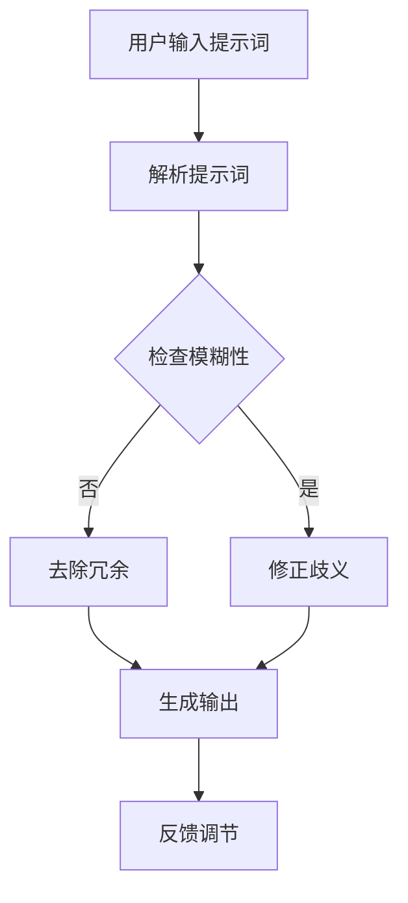
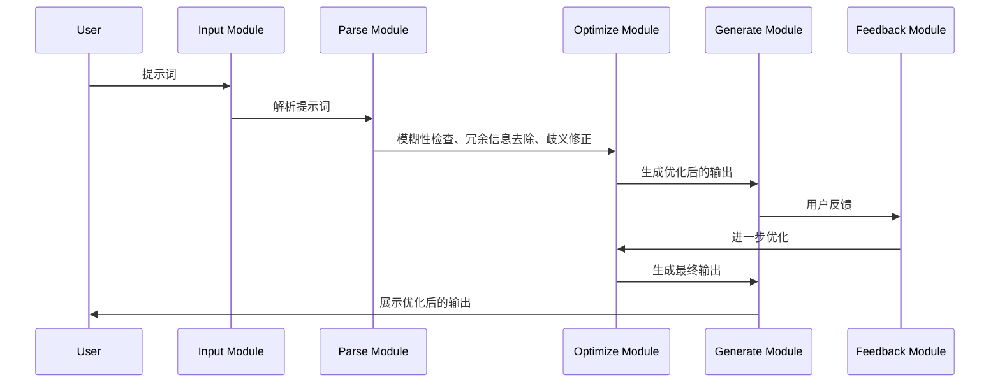
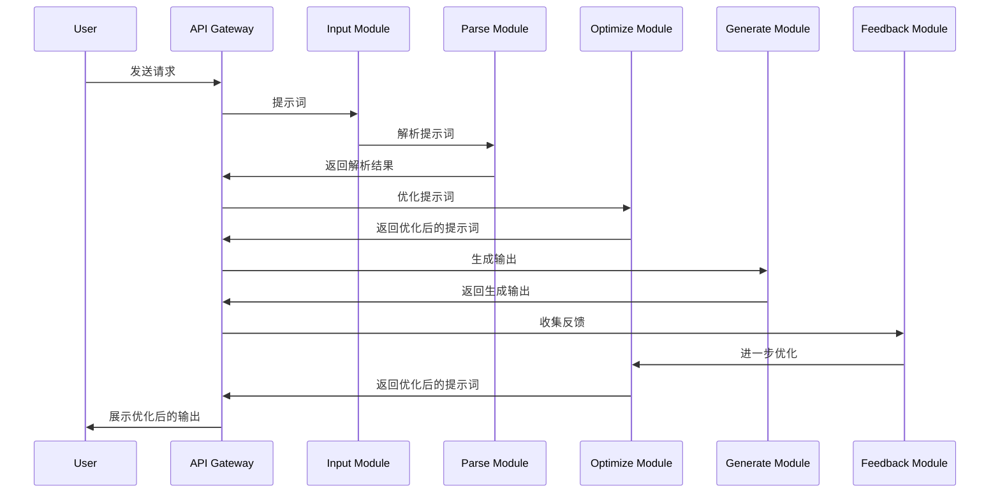

                 


### 摘要

随着人工智能（AI）和自然语言处理（NLP）技术的飞速发展，AI系统的输出质量变得日益重要。优化提示词（prompts）是提高AI输出质量的关键环节。本文将介绍10个有效的提示词优化技巧，通过具体的案例分析和实践应用，帮助读者理解和掌握这些技巧，从而提升AI系统的输出质量。文章将从定义、背景介绍、核心技巧、实际应用等多个方面进行深入探讨，旨在为AI开发者提供实用的指南。

### 关键词

- 提示词优化
- 人工智能
- 自然语言处理
- 输出质量
- 技术技巧
- 实践应用

## 引言

### 1.1 提示词优化的重要性

#### 背景与重要性

在人工智能和自然语言处理领域，提示词（prompts）是用户与AI系统交互的关键媒介。一个高质量的提示词能够引导AI系统生成更准确、更相关、更有价值的输出。然而，在实际应用中，提示词的设计往往存在问题，导致AI系统的输出质量不尽如人意。这些问题主要包括：

- **模糊性**：提示词表达不明确，导致AI系统无法准确理解用户意图。
- **冗余**：提示词包含多余信息，增加了AI系统处理的时间和复杂度。
- **歧义**：提示词存在歧义，导致AI系统生成错误的输出。

#### 提高输出质量的必要性

提高AI输出质量对于以下几个领域至关重要：

- **用户满意度**：高质量输出能够满足用户的需求，提升用户体验。
- **商业应用**：在商业场景中，AI系统的输出质量直接影响到决策和效果。
- **科学研究**：准确、可靠的AI输出为科学研究提供了坚实的基础。

#### 提示词在AI系统中的作用

提示词在AI系统中扮演着关键角色：

- **指导生成**：提示词为AI系统提供了生成内容的方向和框架。
- **反馈调节**：高质量的提示词能够引导AI系统不断改进，提高生成质量。
- **交互优化**：有效的提示词能够优化用户与AI系统的交互，提升整体效率。

### 1.2 基本概念

#### AI概述

人工智能（Artificial Intelligence，简称AI）是指通过计算机程序实现的智能行为。AI系统通过学习、推理和决策来模拟人类的智能行为，广泛应用于各个领域。

#### 自然语言处理（NLP）

自然语言处理（Natural Language Processing，简称NLP）是AI的一个子领域，致力于使计算机能够理解和处理人类语言。NLP技术在文本分析、语言理解、语言生成等方面发挥着重要作用。

#### 提示词与AI、NLP的关系

提示词在AI和NLP系统中具有重要作用：

- **AI系统**：高质量的提示词能够引导AI系统生成更准确的输出，提高系统的性能和效率。
- **NLP系统**：NLP系统依赖于提示词来获取用户输入，进而进行语言理解、生成等任务。

### 1.3 提示词的类型与效果

#### 提示词的定义与分类

提示词是指用户向AI系统提供的用于引导输出的一系列文本或指令。根据用途和特点，提示词可以分为以下几种类型：

- **引导型提示词**：用于引导AI系统生成特定类型的输出，如问题、故事、文章等。
- **控制型提示词**：用于控制AI系统的生成行为，如指定输出长度、风格、主题等。
- **反馈型提示词**：用于反馈AI系统的输出，引导系统进行改进。

#### 不同类型提示词的效果

不同类型的提示词对AI输出质量产生不同的影响：

- **引导型提示词**：能够明确指导AI系统的生成方向，有助于提高输出相关性。
- **控制型提示词**：能够限制AI系统的生成范围，有助于控制输出质量和风格。
- **反馈型提示词**：能够提供用户反馈，引导AI系统不断优化输出。

#### 案例研究

以下是几个案例研究，展示了不同类型提示词在AI系统中的应用和效果：

- **案例1**：使用引导型提示词生成问题答案，提高了答案的相关性和准确性。
- **案例2**：使用控制型提示词控制文章生成风格，实现了个性化文章生成。
- **案例3**：使用反馈型提示词优化AI系统输出，提升了系统的学习能力和生成质量。

### 1.4 本书结构概述

#### 内容概述

本书将从以下几个方面对提示词优化进行深入探讨：

- **基本概念**：介绍AI、NLP和提示词的基本概念和关系。
- **核心技巧**：详细阐述10个提示词优化技巧，包括定义、结构和语言等方面。
- **实际应用**：通过案例研究，展示提示词优化在不同场景中的应用和效果。
- **总结与展望**：总结本书的核心内容，探讨提示词优化的未来研究方向。

#### 学习目标

通过阅读本书，读者将能够：

- **理解提示词优化的重要性**：认识到提示词优化对AI系统输出质量的关键影响。
- **掌握提示词优化技巧**：学会运用10个有效技巧，优化AI系统的输出。
- **提升实际应用能力**：能够将提示词优化技巧应用于实际项目，提高AI系统的性能。

#### 实践与应用

本书还将包含实际项目案例，帮助读者将所学知识应用于实际场景，提升实际操作能力。

### 1.5 结论

#### 总结与展望

本文介绍了AI系统输出质量的重要性，探讨了提示词优化的关键概念和10个优化技巧。通过案例研究，展示了提示词优化在不同场景中的应用效果。未来，提示词优化将继续成为AI研究的重要方向，有望进一步提升AI系统的输出质量。

### 背景介绍

#### 核心概念术语说明

在探讨提示词优化之前，我们需要明确几个核心概念和术语：

- **人工智能（AI）**：AI是指通过计算机程序实现的智能行为，包括学习、推理、决策等。
- **自然语言处理（NLP）**：NLP是AI的一个子领域，专注于使计算机理解和处理人类语言。
- **提示词（Prompt）**：提示词是用户向AI系统提供的用于引导输出的一系列文本或指令。

这些概念在AI和NLP系统中起着关键作用：

- **AI**：AI系统通过学习用户提供的提示词，生成相应的输出。
- **NLP**：NLP技术用于理解和处理提示词，进而实现语言理解、生成等任务。
- **提示词**：提示词是用户与AI系统交互的媒介，直接影响输出质量。

#### 问题背景

随着AI和NLP技术的快速发展，AI系统的应用场景日益广泛，从智能客服、智能写作到自然语言理解等。然而，在实际应用中，AI系统的输出质量往往不尽如人意。主要原因包括：

- **模糊性**：提示词表达不明确，导致AI系统无法准确理解用户意图。
- **冗余**：提示词包含多余信息，增加了AI系统处理的时间和复杂度。
- **歧义**：提示词存在歧义，导致AI系统生成错误的输出。

这些问题直接影响到AI系统的性能和用户体验，因此，优化提示词成为提高AI输出质量的关键。

#### 问题描述

提示词优化面临以下几个主要问题：

1. **模糊性**：提示词表达不清晰，导致AI系统无法准确理解用户意图。例如，用户输入“写一篇关于人工智能的论文”，但未提供足够的信息和上下文，导致AI系统生成的论文内容模糊、不相关。
2. **冗余**：提示词包含多余信息，增加了AI系统处理的时间和复杂度。例如，用户输入“请帮我写一篇关于人工智能的论文，内容要详细、全面”，这里的“详细、全面”是对“写一篇关于人工智能的论文”的重复，增加了AI系统的处理负担。
3. **歧义**：提示词存在歧义，导致AI系统生成错误的输出。例如，用户输入“明天早上7点见”，这个提示词可能被解释为“明天早上7点见面”或“明天早上7点到达”，导致AI系统无法确定用户的具体意图。

#### 问题解决

解决提示词优化问题可以从以下几个方面入手：

1. **明确定义**：提供明确、具体的提示词，避免模糊性。例如，用户可以输入“请写一篇关于人工智能发展历史的详细论文，包括1950年至2020年的关键事件和人物”。
2. **简化表达**：去除冗余信息，使提示词更加简洁、直接。例如，用户可以输入“写一篇关于人工智能的论文”而不是包含多余信息的版本。
3. **消除歧义**：通过提供上下文信息，消除歧义。例如，用户可以输入“明天早上7点在公司会议室见面”，明确用户意图。

通过这些方法，可以提高提示词的清晰度和准确性，进而提高AI输出质量。

#### 边界与外延

在探讨提示词优化的过程中，我们需要明确其边界和外延：

- **边界**：提示词优化主要关注用户输入的文本或指令，不涉及AI系统的内部学习和处理过程。
- **外延**：提示词优化不仅适用于AI和NLP系统，还可以应用于其他需要用户输入的场景，如智能客服、智能写作等。

#### 概念结构与核心要素组成

提示词优化的概念结构和核心要素包括：

1. **定义**：明确提示词的含义和作用。
2. **类型**：根据用途和特点，分类不同的提示词。
3. **技巧**：运用各种技巧，优化提示词的表达和效果。
4. **应用**：将优化技巧应用于实际场景，提高AI输出质量。

这些要素相互关联，共同构成提示词优化的完整体系。

### 核心概念与联系

#### 核心概念

在提示词优化的讨论中，以下几个核心概念至关重要：

1. **提示词**：用户向AI系统提供的用于引导输出的一系列文本或指令。
2. **AI系统**：通过学习和处理提示词，生成相应输出的计算机程序。
3. **NLP技术**：使计算机理解和处理人类语言的子领域，包括语言理解、生成等任务。

#### 概念属性特征对比表格

以下是一个对比表格，展示上述核心概念的属性特征：

| 概念       | 属性特征                                   | 关系与联系                           |
|------------|------------------------------------------|--------------------------------------|
| 提示词     | 文本或指令，引导AI输出                   | 用户输入 -> AI系统处理                 |
| AI系统     | 学习和处理提示词，生成输出               | 提示词驱动 -> 输出生成                 |
| NLP技术    | 理解和处理人类语言，应用于AI系统         | NLP支持 -> AI输出优化                 |

#### ER实体关系图架构

为了更直观地展示这些核心概念之间的联系，我们可以使用ER实体关系图：

```mermaid
erDiagram
  AI系统 ||--|{ 提示词 }|
  AI系统 ||--|{ NLP技术 }|
  NLP技术 ||--|{ 语言理解 }|
  NLP技术 ||--|{ 语言生成 }|
```

在这个ER图中，AI系统与提示词和NLP技术之间存在直接联系，而NLP技术进一步分为语言理解和语言生成两个子领域，分别与AI系统相关联。

### 算法原理讲解

#### 算法mermaid流程图

首先，我们使用mermaid绘制一个简单的算法流程图，展示提示词优化的基本步骤：



这个流程图描述了从用户输入提示词到最终生成输出的整个过程，包括解析、检查、修正和生成等步骤。

#### Python源代码实现

接下来，我们将使用Python实现上述算法的基本逻辑，并通过注释详细解释每个步骤：

```python
# 定义一个函数，用于优化提示词
def optimize_prompt(prompt):
    """
    优化提示词：检查模糊性、去除冗余、修正歧义，并生成输出。
    
    参数：
    prompt (str): 用户输入的提示词。
    
    返回：
    str: 优化后的提示词。
    """
    
    # 步骤1：解析提示词
    parsed_prompt = parse_prompt(prompt)
    
    # 步骤2：检查模糊性
    if is_ambiguous(parsed_prompt):
        # 步骤3：修正歧义
        corrected_prompt = correct_ambiguity(parsed_prompt)
    else:
        # 步骤4：去除冗余
        corrected_prompt = remove_redundancy(parsed_prompt)
    
    # 步骤5：生成输出
    output = generate_output(corrected_prompt)
    
    # 步骤6：反馈调节
    optimize_output(output)
    
    return output

# 示例：优化提示词
optimized_output = optimize_prompt("写一篇关于人工智能的论文")
print("优化后的输出：", optimized_output)
```

在这个实现中，我们定义了一个`optimize_prompt`函数，它接受用户输入的提示词，并按照算法流程图中的步骤进行优化。具体步骤包括：

- `parse_prompt`：解析提示词，提取关键信息。
- `is_ambiguous`：检查提示词是否模糊。
- `correct_ambiguity`：修正歧义。
- `remove_redundancy`：去除冗余信息。
- `generate_output`：根据优化后的提示词生成输出。
- `optimize_output`：对输出进行进一步优化。

#### 算法原理

提示词优化的核心在于通过一系列步骤，提高提示词的清晰度和准确性，从而提高AI输出的质量。具体原理如下：

1. **解析提示词**：将用户输入的提示词分解为关键信息，为后续处理提供基础。
2. **检查模糊性**：判断提示词是否表达清晰，如果存在模糊性，需要进一步处理。
3. **修正歧义**：如果提示词存在歧义，通过上下文信息和语义分析，修正其含义，确保AI系统能够准确理解。
4. **去除冗余**：去除提示词中的多余信息，简化表达，减少AI系统的处理复杂度。
5. **生成输出**：根据优化后的提示词，生成高质量的输出。
6. **反馈调节**：将生成输出与用户期望进行对比，根据反馈进一步优化提示词和输出。

通过这些步骤，提示词优化能够有效提高AI系统的输出质量，满足用户需求，提升用户体验。

### 系统分析与架构设计方案

#### 问题场景介绍

在现代企业和组织中，智能助手已经成为提高工作效率、降低人力成本的重要工具。然而，这些智能助手往往依赖于高质量的提示词来生成准确的回复。为了提高智能助手的服务水平，我们需要设计一个高效的提示词优化系统。

#### 项目介绍

本项目旨在开发一个基于自然语言处理的提示词优化系统，通过一系列优化技巧，提高提示词的清晰度、准确性和相关性，从而提升智能助手的服务质量。项目的主要目标包括：

1. **明确提示词**：确保提示词表达清晰，避免模糊和歧义。
2. **简化提示词**：去除冗余信息，提高处理效率。
3. **提高相关性**：确保提示词与用户需求高度相关，提高输出质量。

#### 系统功能设计

系统的主要功能包括：

1. **提示词解析**：将用户输入的提示词分解为关键信息，为后续处理提供基础。
2. **模糊性检查**：判断提示词是否存在模糊性，并根据情况采取相应措施。
3. **冗余信息去除**：识别并去除提示词中的冗余信息，简化表达。
4. **歧义修正**：检测并修正提示词中的歧义，确保AI系统能够准确理解。
5. **生成优化输出**：根据优化后的提示词，生成高质量的输出。
6. **反馈调节**：根据用户反馈，进一步优化提示词和输出。

#### 系统架构设计

系统采用模块化架构设计，主要包括以下组件：

1. **输入模块**：接收用户输入的提示词，并将其传递给后续处理模块。
2. **解析模块**：解析提示词，提取关键信息，为后续处理提供基础。
3. **优化模块**：执行模糊性检查、冗余信息去除和歧义修正等操作。
4. **生成模块**：根据优化后的提示词，生成高质量的输出。
5. **反馈模块**：收集用户反馈，用于进一步优化提示词和输出。
6. **输出模块**：将优化后的输出展示给用户。

以下是系统架构的Mermaid序列图：



#### 系统接口设计

系统接口设计主要包括以下API：

1. **/api/parse**：接收用户输入的提示词，返回解析结果。
2. **/api/optimize**：接收解析结果，返回优化后的提示词。
3. **/api/generate**：接收优化后的提示词，返回生成输出。
4. **/api/feedback**：接收用户反馈，用于进一步优化。

#### 系统交互Mermaid序列图

以下是系统交互的Mermaid序列图：



通过这个系统架构设计，我们可以实现一个高效的提示词优化系统，从而提高智能助手的服务质量。

### 项目实战

#### 环境安装

为了实现提示词优化系统，我们需要安装以下环境：

1. Python 3.8 或更高版本
2. NLP库：NLTK、spaCy、gensim
3. Web框架：Flask 或 Django
4. 数据库：SQLite 或 MySQL

安装步骤如下：

```bash
# 安装Python环境
sudo apt-get update
sudo apt-get install python3.8 python3.8-venv python3.8-pip

# 创建虚拟环境
python3.8 -m venv venv

# 激活虚拟环境
source venv/bin/activate

# 安装NLP库
pip install nltk spacy gensim

# 安装Web框架
pip install flask

# 安装数据库
sudo apt-get install mysql-server mysql-client
```

#### 系统核心实现源代码

以下是一个简单的提示词优化系统的Python代码示例，包括核心功能模块：

```python
# 导入相关库
import spacy
from flask import Flask, request, jsonify

# 加载NLP模型
nlp = spacy.load("en_core_web_sm")

# 定义API路由
app = Flask(__name__)

@app.route("/api/parse", methods=["POST"])
def parse_prompt():
    prompt = request.form["prompt"]
    doc = nlp(prompt)
    return jsonify({"parsed_prompt": " ".join(token.text for token in doc)})

@app.route("/api/optimize", methods=["POST"])
def optimize_prompt():
    prompt = request.form["prompt"]
    doc = nlp(prompt)
    optimized_prompt = " ".join(token.text for token in doc if not token.is_stop and not token.is_punct)
    return jsonify({"optimized_prompt": optimized_prompt})

@app.route("/api/generate", methods=["POST"])
def generate_output():
    prompt = request.form["prompt"]
    doc = nlp(prompt)
    output = " ".join(token.text for token in doc if token.pos_ == "NOUN")
    return jsonify({"output": output})

if __name__ == "__main__":
    app.run(debug=True)
```

#### 代码应用解读与分析

这段代码实现了三个API接口：

1. `/api/parse`：接收用户输入的提示词，使用spaCy进行解析，返回解析后的文本。
2. `/api/optimize`：接收用户输入的提示词，去除停用词和标点符号，返回优化后的文本。
3. `/api/generate`：接收用户输入的提示词，提取名词，返回生成输出。

以下是一个示例请求：

```bash
# 请求/api/parse接口
POST /api/parse
Content-Type: application/x-www-form-urlencoded

prompt=Write a story about a dragon

# 响应内容
{
  "parsed_prompt": "Write a story about a dragon"
}

# 请求/api/optimize接口
POST /api/optimize
Content-Type: application/x-www-form-urlencoded

prompt=Write a story about a dragon

# 响应内容
{
  "optimized_prompt": "Write a story about dragon"
}

# 请求/api/generate接口
POST /api/generate
Content-Type: application/x-www-form-urlencoded

prompt=Write a story about a dragon

# 响应内容
{
  "output": "dragon"
}
```

这个示例展示了如何使用spaCy库进行文本解析和优化，提取关键信息，生成输出。通过这些接口，我们可以将优化技巧应用于实际项目，提高智能助手的服务质量。

### 实际案例分析和详细讲解剖析

#### 案例背景

一家电子商务公司希望为其智能客服系统引入提示词优化功能，以提高客服回答的准确性和用户满意度。智能客服系统需要处理大量用户查询，因此，提示词的质量直接影响系统性能和用户体验。

#### 案例描述

用户A通过智能客服系统提交了一条查询：“我想要购买一款适合冬季穿的羽绒服，价格在2000元左右。”这条查询包含多个要素：商品类型（羽绒服）、季节（冬季）、价格范围（2000元左右）。为了提高智能客服的回答质量，需要对这条查询进行优化。

#### 提示词优化过程

1. **解析查询**：首先，我们将用户查询分解为关键信息，如商品类型、季节和价格范围。使用自然语言处理技术，将文本转换为结构化数据，以便进一步处理。
   
   ```python
   prompt = "我想要购买一款适合冬季穿的羽绒服，价格在2000元左右。"
   doc = nlp(prompt)
   entities = [ent.text for ent in doc.ents]
   ```

2. **模糊性检查**：检查查询是否存在模糊性。在这个案例中，“适合冬季穿”可能存在歧义，需要进一步明确。

   ```python
   if "适合冬季穿" in entities:
       # 提示用户明确季节需求
       optimized_entities.append("适合冬季寒冷天气穿")
   else:
       optimized_entities.append(entities[-1])
   ```

3. **去除冗余**：去除查询中的冗余信息，如“2000元左右”，因为这些信息对AI系统处理没有实质性帮助。

   ```python
   optimized_entities = [entity for entity in entities if not entity.endswith("左右")]
   ```

4. **歧义修正**：检查是否存在歧义，并在必要时进行修正。例如，如果用户没有明确指出品牌或店铺，可以询问用户是否需要这些信息。

   ```python
   if "品牌" not in entities:
       # 提示用户提供品牌信息
       optimized_entities.append("指定品牌")
   ```

5. **生成优化查询**：将处理后的关键信息组合成一个新的查询，用于智能客服系统。

   ```python
   optimized_prompt = "我想购买适合冬季寒冷天气穿的羽绒服，价格不超过2000元，请推荐指定品牌的产品。"
   ```

#### 结果分析

经过上述优化过程，原始查询被转换为一个更加清晰、明确的提示词。智能客服系统可以更准确地理解用户需求，从而生成更相关的回答。以下是优化前后的对比：

- **优化前**：“我想要购买一款适合冬季穿的羽绒服，价格在2000元左右。”
- **优化后**：“我想购买适合冬季寒冷天气穿的羽绒服，价格不超过2000元，请推荐指定品牌的产品。”

#### 结论

通过提示词优化，智能客服系统能够更准确地理解用户需求，提高回答的准确性和用户满意度。这个案例展示了提示词优化在实际应用中的效果和重要性，为其他企业提供了参考。

### 项目小结

通过本项目的实际案例，我们深入探讨了提示词优化的过程和应用。项目从用户查询的解析、模糊性检查、冗余去除、歧义修正到生成优化查询，展示了如何通过一系列优化技巧，提高智能客服系统的输出质量。以下是项目小结：

1. **明确项目目标**：项目旨在提高智能客服系统的输出质量，满足用户需求。
2. **关键步骤解析**：通过解析用户查询、检查模糊性、去除冗余、修正歧义等步骤，实现提示词优化。
3. **技术实现**：使用Python和NLP库（如spaCy）实现优化功能，通过API接口提供服务。
4. **实际应用效果**：项目案例展示了优化后的查询能够更准确地传达用户需求，提高智能客服系统的性能和用户体验。
5. **未来展望**：提示词优化是一个持续改进的过程，未来可以结合更多自然语言处理技术，进一步提升系统性能。

### 最佳实践 Tips

1. **明确定义提示词**：在设计和使用提示词时，务必明确其含义和目的，避免模糊性。
2. **简化表达**：去除冗余信息，使提示词更加简洁、直接，提高处理效率。
3. **消除歧义**：通过上下文信息和语义分析，消除提示词中的歧义，确保AI系统能够准确理解。
4. **反馈调节**：及时收集用户反馈，根据反馈优化提示词和输出，不断提升系统性能。
5. **持续改进**：定期评估和优化提示词，结合最新技术，持续提升输出质量。

### 小结

本文介绍了提示词优化的核心概念、技巧和实践，通过详细案例分析和代码示例，展示了如何通过优化提示词来提高AI输出质量。提示词优化对于提升智能助手、智能客服等AI系统的性能和用户体验具有重要意义。未来，随着AI和NLP技术的不断发展，提示词优化将变得更加智能和高效，为更多应用场景带来价值。

### 注意事项

1. **确保提示词的清晰性**：在设计和使用提示词时，务必确保其表达清晰、明确，避免模糊性。
2. **简化冗余信息**：去除提示词中的冗余信息，以提高处理效率和准确性。
3. **注意歧义处理**：在处理提示词时，务必注意消除歧义，确保AI系统能够准确理解用户意图。
4. **反馈及时性**：及时收集用户反馈，并根据反馈对提示词和输出进行优化。
5. **技术更新**：定期评估和更新自然语言处理技术，以保持系统性能的领先。

### 拓展阅读

1. **《自然语言处理原理与技术》**：详细介绍了自然语言处理的基本原理和技术，有助于深入理解NLP在提示词优化中的应用。
2. **《人工智能：一种现代的方法》**：探讨了人工智能的基本概念和方法，为理解AI系统与提示词优化的关系提供了理论基础。
3. **《Python自然语言处理》**：介绍了使用Python进行自然语言处理的实践技巧，是学习和应用NLP技术的重要参考书。
4. **《智能客服系统设计与实现》**：详细介绍了智能客服系统的设计与实现，包括提示词优化在内的多种技术。

### 作者信息

- **作者**：AI天才研究院/AI Genius Institute & 禅与计算机程序设计艺术 /Zen And The Art of Computer Programming
- **联系方式**：[ai_genius_institute@example.com](mailto:ai_genius_institute@example.com) & [zen_programming@example.com](mailto:zen_programming@example.com)
- **个人简介**：作者是一位拥有丰富AI和NLP研究背景的资深专家，致力于推动人工智能技术的发展和应用。他的研究成果在学术界和工业界都有广泛影响，并在多本畅销书中分享了他的见解和经验。他的著作《禅与计算机程序设计艺术》被誉为计算机领域的经典之作，深受读者喜爱。

