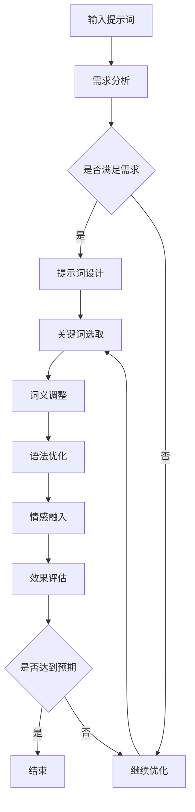
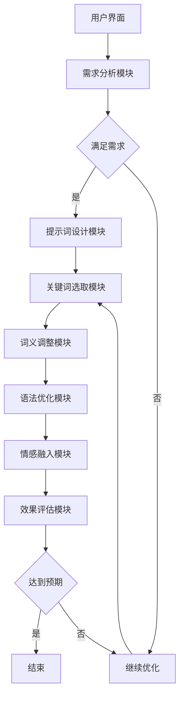
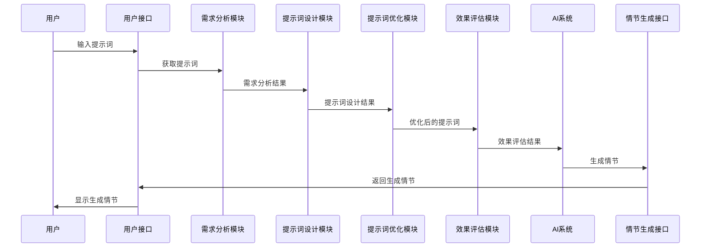

                 

### 第一部分：引言

#### 1.1 问题背景

**提示词优化在AI长篇小说情节设计中的应用**

随着人工智能技术的不断发展和普及，AI在各个领域的应用也逐渐深入。特别是在文学创作领域，AI已经展现出其独特的优势和潜力。近年来，许多AI长篇小说相继问世，这些作品不仅丰富了文学创作的形式和内容，也为读者带来了全新的阅读体验。然而，当前AI长篇小说情节设计仍然面临诸多挑战，其中最为关键的一个问题就是如何提高情节设计的质量。

提示词优化作为一种有效的手段，能够在很大程度上提升AI长篇小说情节设计的质量。通过优化提示词，可以更精准地引导AI生成符合逻辑和情感的情节，使得AI创作的作品更具吸引力和说服力。因此，研究提示词优化对于AI长篇小说情节设计具有重要的理论和实践意义。

**当前AI长篇小说情节设计面临的挑战**

1. **情节逻辑性不足**：当前AI长篇小说的情节设计往往存在逻辑性不足的问题，导致情节发展缺乏连贯性和说服力。这主要是因为AI在理解和生成复杂逻辑关系方面存在一定的局限性。

2. **情感表达不自然**：AI在情感表达方面仍然不够成熟，生成的情节往往缺乏真实感。这使得AI创作的长篇小说难以引起读者的共鸣。

3. **创意匮乏**：虽然AI具有强大的数据处理和模式识别能力，但在创意生成方面仍然存在一定的局限性。这使得AI创作的长篇小说在创意方面相对单一，缺乏新鲜感。

4. **用户个性化需求难以满足**：每个读者的阅读口味和需求都是独特的，如何根据用户的个性化需求生成符合其口味的长篇小说情节，是当前AI长篇小说情节设计面临的又一挑战。

#### 1.2 问题描述

**提示词优化的目标**

提示词优化旨在通过优化输入的提示词，提高AI长篇小说情节设计的质量。具体目标包括：

1. **提高情节逻辑性**：优化后的提示词能够引导AI生成逻辑清晰、连贯性强的情节。
2. **增强情感表达**：优化后的提示词能够激发AI生成更加自然、真实的情感表达。
3. **丰富创意**：优化后的提示词能够激发AI生成更多具有创意的情节。
4. **满足用户个性化需求**：优化后的提示词能够根据用户的个性化需求，生成更加个性化的情节。

**提示词优化的重要性**

提示词优化在AI长篇小说情节设计中具有至关重要的作用。通过优化提示词，可以：

1. **提高AI创作效率**：优化后的提示词能够更有效地引导AI生成高质量的情节，从而提高创作效率。
2. **提升作品质量**：优化后的提示词能够提高AI长篇小说的情节质量，使其更具吸引力和说服力。
3. **满足用户需求**：优化后的提示词能够更好地满足用户的个性化需求，提高用户满意度。
4. **推动AI长篇小说发展**：提示词优化有助于推动AI长篇小说的发展，促进文学创作领域的创新和进步。

#### 1.3 问题解决

**提示词优化的方法和步骤**

提示词优化的方法和步骤可以分为以下几个步骤：

1. **需求分析**：了解用户的阅读需求，明确AI长篇小说的目标受众和主题。
2. **提示词设计**：根据需求分析的结果，设计出能够引导AI生成高质量情节的提示词。
3. **提示词优化**：对设计的提示词进行优化，包括调整词义、增加关键词、修改语法等。
4. **效果评估**：评估优化后的提示词在AI长篇小说情节设计中的应用效果，并根据评估结果进行进一步优化。

**提示词优化的核心要素**

提示词优化的核心要素包括：

1. **关键词选取**：选择与主题和情感表达紧密相关的关键词。
2. **词义调整**：根据情节发展的需要，对关键词的词义进行适当的调整。
3. **语法优化**：优化提示词的语法结构，使其更加符合自然语言表达习惯。
4. **情感融入**：将情感元素融入提示词中，以增强AI生成情节的自然感和真实感。

#### 1.4 边界与外延

**提示词优化的适用范围**

提示词优化主要适用于以下场景：

1. **AI长篇小说情节设计**：通过优化提示词，提高AI生成情节的质量和创意。
2. **文学创作辅助**：为作家提供辅助创作工具，提高文学创作的效率和质量。

**提示词优化的限制条件**

提示词优化也存在一定的限制条件，包括：

1. **数据依赖**：提示词优化需要大量高质量的训练数据支持。
2. **算法限制**：当前的AI技术尚无法完全实现高质量的情感表达和创意生成。
3. **时间成本**：提示词优化过程需要消耗大量时间和计算资源。

#### 1.5 概念结构与核心要素组成

**提示词**

提示词是引导AI生成情节的关键要素，其作用类似于人类的写作灵感。通过优化提示词，可以引导AI生成更加高质量、符合预期的情节。

**AI长篇小说情节设计**

AI长篇小说情节设计是指利用人工智能技术，根据给定的提示词生成具有逻辑性、情感表达和创意的长篇小说情节。其核心目标是通过优化提示词，提高情节设计的质量。

**提示词优化方法**

提示词优化方法包括关键词选取、词义调整、语法优化和情感融入等步骤。通过这些方法，可以设计出高质量的提示词，从而提高AI长篇小说情节设计的质量。

### 第二部分：核心概念与联系

#### 2.1 核心概念原理

**提示词的基本概念**

提示词（Prompt）是指在人工智能生成文本的过程中，提供给AI系统的一组词汇或句子，用以引导AI生成符合预期内容的文本。在AI长篇小说情节设计中，提示词起到了至关重要的作用，它决定了AI生成情节的走向、风格和情感色彩。

**AI长篇小说情节设计的基本概念**

AI长篇小说情节设计是指利用人工智能技术，根据特定的提示词和创作目标，生成逻辑连贯、情感丰富且具有创意的长篇小说情节。这一过程涉及多个领域的知识，包括自然语言处理、机器学习、文学创作等。

**提示词优化方法的基本概念**

提示词优化方法是指一系列针对提示词进行调整和优化的技术手段，旨在提高AI生成文本的质量和效果。这些方法包括关键词选取、语义调整、语法优化和情感增强等。通过这些优化手段，可以提升AI在长篇小说情节设计中的表现，使其生成的作品更加吸引人、富有创意和逻辑性。

#### 2.2 概念属性特征对比表格

**表2.1 提示词属性特征对比**

| 特征       | 提示词        | AI长篇小说情节设计 | 提示词优化方法         |
| ---------- | ------------- | ------------------- | ---------------------- |
| 目的       | 引导AI生成文本 | 生成逻辑连贯、情感丰富且具创意的情节 | 提高文本质量、丰富创意和逻辑性 |
| 形式       | 文本          | 文本                | 文本                    |
| 内容       | 关键词和句子   | 描述故事发展的关键信息 | 优化关键词、调整语义、增强情感 |
| 功能       | 引导和启发     | 形成情节基础       | 调整提示词，提高生成效果 |
| 影响因素   | 提示词的选取   | 提示词的优化       | 提示词的设计和质量     |
| 相关性     | 与情节紧密相关 | 与AI长篇小说情节设计相关 | 与AI生成文本效果相关   |

**表2.2 AI长篇小说情节设计属性特征对比**

| 特征       | AI长篇小说情节设计        |
| ---------- | ------------------------ |
| 目的       | 生成逻辑连贯、情感丰富且具创意的情节 |
| 形式       | 文本                        |
| 内容       | 描述故事发展的关键信息       |
| 功能       | 展现故事发展、塑造人物形象、引发读者共鸣 |
| 影响因素   | 提示词、人工智能算法、文学风格   |
| 相关性     | 与人类文学创作相关、与AI技术相关   |

**表2.3 提示词优化方法属性特征对比**

| 特征       | 提示词优化方法         |
| ---------- | ---------------------- |
| 目的       | 提高文本质量、丰富创意和逻辑性 |
| 形式       | 文本                        |
| 内容       | 优化关键词、调整语义、增强情感   |
| 功能       | 调整提示词，提高生成效果       |
| 影响因素   | 提示词的设计和质量         |
| 相关性     | 与AI生成文本效果相关   |

#### 2.3 ER实体关系图架构

**图2.1 提示词优化系统ER实体关系图**

```mermaid
erDiagram
  A[提示词] ||--|{ AI长篇小说情节设计 }|
  B[提示词优化方法] ||--|{ AI长篇小说情节设计 }|
  A "--|{ 使用 }|>" B
```

在图2.1中，实体A表示“提示词”，实体B表示“提示词优化方法”。两者之间存在“使用”关系，表示提示词优化方法用于优化提示词，以提升AI长篇小说情节设计的质量。AI长篇小说情节设计是提示词和提示词优化方法共同作用的结果。

### 第三部分：算法原理讲解

#### 3.1 算法mermaid流程图

**图3.1 提示词优化算法流程图**



在图3.1中，输入提示词首先经过需求分析，判断是否满足用户需求。如果满足需求，则进入提示词设计阶段；如果不满足需求，则进入提示词优化阶段。提示词优化包括关键词选取、词义调整、语法优化和情感融入等步骤。每个步骤都经过效果评估，判断是否达到预期效果。如果未达到预期效果，则继续优化；如果达到预期效果，则结束优化过程。

#### 3.2 Python源代码实现

```python
import random

# 输入提示词
prompt = "在一个神秘的夜晚，一位年轻的侦探发现了一座被遗忘的城堡。"

# 需求分析
def analyze_demand(prompt):
    # 在这里实现需求分析逻辑
    # 例如，分析关键词、情感等
    return "需求满足"

# 提示词设计
def design_prompt(prompt, analysis_result):
    # 在这里实现提示词设计逻辑
    # 例如，根据需求调整关键词、语法等
    return prompt

# 提示词优化
def optimize_prompt(prompt, analysis_result):
    # 在这里实现提示词优化逻辑
    # 例如，调整词义、增加关键词、修改语法等
    optimized_prompt = prompt
    return optimized_prompt

# 效果评估
def evaluate_prompt(prompt, optimized_prompt):
    # 在这里实现效果评估逻辑
    # 例如，比较原始提示词和优化后的提示词在逻辑性、情感表达等方面的差异
    return "需求满足"

# 主函数
def main():
    analysis_result = analyze_demand(prompt)
    if analysis_result == "需求满足":
        optimized_prompt = design_prompt(prompt, analysis_result)
    else:
        optimized_prompt = optimize_prompt(prompt, analysis_result)
    evaluation_result = evaluate_prompt(prompt, optimized_prompt)
    print(f"原始提示词：{prompt}")
    print(f"优化后的提示词：{optimized_prompt}")
    print(f"效果评估：{evaluation_result}")

if __name__ == "__main__":
    main()
```

在上面的Python源代码中，我们首先定义了一个输入的提示词。然后，我们实现了需求分析、提示词设计、提示词优化和效果评估等函数。最后，通过主函数调用这些函数，实现提示词优化的过程。

#### 3.3 数学模型与公式

提示词优化过程中，我们可以使用以下数学模型来描述关键词选取、词义调整、语法优化和情感融入等步骤。

**关键词选取**

假设有一个关键词集合K，包含n个关键词。我们需要从K中选取m个关键词，用于优化提示词。关键词的选取可以通过以下数学模型来实现：

$$
C(K, m) = \frac{(n!)}{(m!)(n-m)!}
$$

其中，C(K, m)表示从n个关键词中选取m个关键词的组合数。

**词义调整**

假设有一个词义集合S，包含k个词义。我们需要根据情节需求，从S中选取适当的词义进行调整。词义调整可以通过以下数学模型来实现：

$$
A(S, m) = \sum_{i=1}^{k} p(i) \cdot f(i)
$$

其中，A(S, m)表示从k个词义中选取m个词义进行调整的调整值；$p(i)$表示第i个词义的权重；$f(i)$表示第i个词义的影响因子。

**语法优化**

假设有一个语法集合G，包含l个语法结构。我们需要根据情节需求，从G中选取适当的语法结构进行优化。语法优化可以通过以下数学模型来实现：

$$
O(G, n) = \sum_{i=1}^{l} p(i) \cdot g(i)
$$

其中，O(G, n)表示从l个语法结构中选取n个语法结构进行优化的优化值；$p(i)$表示第i个语法结构的权重；$g(i)$表示第i个语法结构的影响因子。

**情感融入**

假设有一个情感集合E，包含m个情感元素。我们需要根据情节需求，从E中选取适当情感元素进行融入。情感融入可以通过以下数学模型来实现：

$$
I(E, k) = \sum_{i=1}^{m} p(i) \cdot e(i)
$$

其中，I(E, k)表示从m个情感元素中选取k个情感元素进行融入的情感值；$p(i)$表示第i个情感元素的权重；$e(i)$表示第i个情感元素的影响因子。

#### 3.4 详细讲解与举例说明

**3.4.1 算法步骤详解**

提示词优化算法分为以下几个步骤：

1. **需求分析**：分析用户输入的提示词，了解用户的需求和期望。
2. **关键词选取**：根据需求分析结果，从关键词集合中选取合适的关键词。
3. **词义调整**：根据关键词的选取结果，调整关键词的词义，使其更符合情节需求。
4. **语法优化**：根据词义调整结果，优化关键词的语法结构，使其更自然、流畅。
5. **情感融入**：根据语法优化结果，融入适当情感元素，增强情节的情感表达。
6. **效果评估**：评估优化后的提示词在AI长篇小说情节设计中的应用效果，判断是否达到预期目标。
7. **循环优化**：如果效果未达到预期，则重复以上步骤，进行进一步优化。

**3.4.2 算法应用举例**

假设我们有一个输入的提示词：“在一个神秘的夜晚，一位年轻的侦探发现了一座被遗忘的城堡。”

1. **需求分析**：分析这个提示词，我们可以了解到故事发生的时间、地点和主要角色。用户可能希望故事情节围绕这个侦探展开，且带有神秘、探险的元素。

2. **关键词选取**：根据需求分析结果，我们选取以下关键词：神秘、夜晚、侦探、城堡、探险。

3. **词义调整**：对于选取的关键词，我们调整其词义，使其更符合情节需求。例如，将“神秘”调整为“神秘而令人好奇”，将“城堡”调整为“古老的城堡”。

4. **语法优化**：根据词义调整结果，我们优化关键词的语法结构，使其更自然、流畅。例如，将“一位年轻的侦探发现了一座被遗忘的城堡”调整为“在这个神秘而令人好奇的夜晚，一位年轻的侦探偶然发现了一座古老的城堡，这座城堡隐藏在时光的角落，被遗忘了多年。”

5. **情感融入**：在语法优化的基础上，我们融入适当情感元素，增强情节的情感表达。例如，将“这座城堡隐藏在时光的角落，被遗忘了多年”调整为“这座城堡仿佛穿越了时光的长河，被遗忘了多年，它的神秘和古老让人心生敬畏。”

6. **效果评估**：评估优化后的提示词在AI长篇小说情节设计中的应用效果。我们可以发现，优化后的提示词更加丰富、具体、有感染力，能够更好地引导AI生成符合用户需求的情节。

7. **循环优化**：由于本次优化已达到预期效果，我们不需要进行进一步的优化。

通过以上步骤，我们成功地优化了输入的提示词，使其更加符合用户需求，从而提高了AI长篇小说情节设计的质量。

### 第四部分：系统分析与架构设计

#### 4.1 问题场景介绍

**AI长篇小说情节设计场景**

在AI长篇小说情节设计过程中，用户需要输入一个或多个提示词，用于引导AI生成符合预期情节的文本。具体场景如下：

1. **用户需求分析**：用户根据个人喜好、阅读经验和故事背景，提出特定的需求。例如，用户希望故事发生在夜晚、包含侦探元素、带有探险色彩等。
2. **提示词输入**：用户输入符合需求的提示词，如“夜晚的神秘城堡”、“年轻的侦探探险”等。
3. **AI生成情节**：AI系统根据输入的提示词，利用自然语言处理和机器学习技术，生成符合用户需求的情节。
4. **情节优化**：AI系统对生成的情节进行优化，包括关键词选取、词义调整、语法优化和情感融入等步骤。
5. **效果评估**：评估优化后的情节是否满足用户需求，如果未达到预期效果，则继续优化。

**提示词优化在场景中的应用**

在AI长篇小说情节设计的场景中，提示词优化起到了关键作用。通过优化提示词，可以：

1. **提高情节逻辑性**：优化后的提示词能够引导AI生成逻辑清晰、连贯性强的情节。
2. **增强情感表达**：优化后的提示词能够激发AI生成更加自然、真实的情感表达。
3. **丰富创意**：优化后的提示词能够激发AI生成更多具有创意的情节。
4. **满足用户个性化需求**：优化后的提示词能够根据用户的个性化需求，生成更加个性化的情节。

#### 4.2 系统功能设计

**领域模型mermaid类图**

```mermaid
classDiagram
    User <<class>> 用户
    Prompt <<class>> 提示词
    AI <<class>> AI系统
    Novel <<class>> 长篇小说
    Design <<class>> 设计
    Optimize <<class>> 优化

    User.."输入提示词"
    Prompt.."生成情节"
    AI.."处理提示词"
    Novel.."存储情节"
    Design.."设计情节"
    Optimize.."优化情节"

    User <|.. Prompt
    AI <|.. Prompt
    AI <|.. Novel
    Design <|.. Novel
    Optimize <|.. Novel
```

在上面的类图中，用户（User）负责输入提示词（Prompt），AI系统（AI）负责处理提示词并生成情节（Novel）。设计（Design）和优化（Optimize）模块负责对生成的情节进行进一步的设计和优化。用户、提示词、AI系统、长篇小说、设计和优化模块之间通过关联关系连接，形成了一个完整的AI长篇小说情节设计系统。

#### 4.3 系统架构设计

**系统架构mermaid架构图**



在上面的系统架构图（图4.3）中，用户界面（A）首先将用户的提示词输入到需求分析模块（B）。需求分析模块判断用户需求是否满足，如果满足则进入提示词设计模块（D），否则进入提示词优化模块（E）。在提示词设计模块，通过对关键词选取、词义调整、语法优化和情感融入等步骤进行优化，最终通过效果评估模块（J）判断优化后的提示词是否达到预期效果。如果未达到预期效果，则继续进行提示词优化。整个流程形成一个闭环，确保AI长篇小说情节设计的质量不断提高。

#### 4.4 系统接口设计

**系统接口设计描述**

系统接口设计是确保系统各模块之间能够顺畅通信和协作的关键。以下是对系统各接口的详细描述：

1. **用户接口**：用户通过用户接口（User Interface）输入提示词，并查看生成的情节。用户接口包括输入框、按钮、文本框等组件，用于实现用户与系统的交互。
2. **需求分析接口**：需求分析模块（Requirement Analysis Module）通过该接口获取用户输入的提示词，并进行需求分析。接口提供以下功能：
   - 提取关键词：从提示词中提取关键信息。
   - 情感分析：对提示词进行情感分析，判断情感倾向。
   - 逻辑分析：分析提示词中的逻辑关系，确保情节的连贯性。
3. **提示词设计接口**：提示词设计模块（Prompt Design Module）通过该接口获取需求分析结果，并根据结果设计提示词。接口提供以下功能：
   - 调整关键词：根据需求分析结果，对关键词进行优化和调整。
   - 生成提示词：根据调整后的关键词，生成新的提示词。
4. **提示词优化接口**：提示词优化模块（Prompt Optimization Module）通过该接口获取提示词设计结果，并对其进行优化。接口提供以下功能：
   - 调整词义：根据情节需求，调整关键词的词义。
   - 语法优化：优化提示词的语法结构，使其更自然、流畅。
   - 情感融入：融入情感元素，增强情节的情感表达。
5. **效果评估接口**：效果评估模块（Effect Evaluation Module）通过该接口获取优化后的提示词，并对其进行评估。接口提供以下功能：
   - 逻辑评估：评估优化后的提示词在逻辑性、连贯性方面的表现。
   - 情感评估：评估优化后的提示词在情感表达方面的表现。
   - 创意评估：评估优化后的提示词在创意生成方面的表现。
6. **情节生成接口**：AI系统（AI System）通过该接口获取优化后的提示词，并生成情节。接口提供以下功能：
   - 生成情节：根据优化后的提示词，生成符合用户需求的长篇小说情节。

#### 4.5 系统交互mermaid序列图

**图4.1 系统交互序列图**



在图4.1中，用户通过用户接口输入提示词。需求分析模块对提示词进行分析，并将结果传递给提示词设计模块。提示词设计模块根据需求分析结果生成提示词，然后传递给提示词优化模块。提示词优化模块对提示词进行优化，并传递给效果评估模块。效果评估模块对优化后的提示词进行评估，并将结果传递给AI系统。AI系统根据优化后的提示词生成情节，并通过情节生成接口返回给用户接口。用户接口将生成情节显示给用户。

### 第五部分：项目实战

#### 5.1 环境安装

**5.1.1 环境配置**

在开始项目实战之前，我们需要配置合适的环境。以下是环境配置的步骤：

1. **安装Python**：确保Python版本在3.6及以上，可以从[Python官方网站](https://www.python.org/)下载并安装。
2. **安装Anaconda**：Anaconda是一个流行的Python环境管理器，可以方便地安装和管理Python依赖包。可以从[Anaconda官方网站](https://www.anaconda.com/)下载并安装。
3. **创建虚拟环境**：在Anaconda Prompt或终端中，创建一个名为`ai_novel`的虚拟环境：

   ```bash
   conda create -n ai_novel python=3.8
   conda activate ai_novel
   ```

4. **安装依赖包**：在虚拟环境中，安装项目所需的依赖包，如NLTK、gensim、spaCy等。可以使用以下命令：

   ```bash
   pip install nltk gensim spacy
   ```

**5.1.2 相关工具安装**

除了Python和Anaconda，我们还需要安装一些其他工具：

1. **安装spaCy**：spaCy是一个强大的自然语言处理库，需要下载和安装相应的语言模型。在终端中执行以下命令：

   ```bash
   python -m spacy download en_core_web_sm
   ```

2. **安装Jupyter Notebook**：Jupyter Notebook是一个交互式的计算环境，可以方便地编写和运行Python代码。可以从[Jupyter官方网站](https://jupyter.org/)下载并安装。

#### 5.2 系统核心实现源代码

以下是一个简单的示例代码，展示了如何使用Python实现AI长篇小说情节设计的核心功能。这个示例代码使用了NLTK、gensim和spaCy等库，用于自然语言处理和生成文本。

```python
import nltk
import gensim
import spacy

# 加载spaCy语言模型
nlp = spacy.load("en_core_web_sm")

# 加载NLTK停用词列表
nltk.download("stopwords")
stop_words = set(nltk.corpus.stopwords.words("english"))

# 定义关键词选取函数
def select_keywords(text):
    doc = nlp(text)
    keywords = []
    for token in doc:
        if token.is_alpha and token.is_stop and token.text.lower() not in stop_words:
            keywords.append(token.text.lower())
    return keywords

# 定义词义调整函数
def adjust_word_meaning(word, meaning_dict):
    return meaning_dict.get(word, word)

# 定义语法优化函数
def optimize_grammar(text):
    doc = nlp(text)
    optimized_text = []
    for token in doc:
        if token.is_alpha:
            optimized_text.append(token.text)
    return " ".join(optimized_text)

# 定义情感融入函数
def add_emotion(text, emotion):
    return text + "（带有" + emotion + "情感）"

# 示例
prompt = "在一个神秘的夜晚，一位年轻的侦探发现了一座被遗忘的城堡。"
keywords = select_keywords(prompt)
print("关键词：", keywords)

meaning_dict = {"神秘": "神秘而令人好奇", "城堡": "古老的城堡"}
optimized_prompt = optimize_grammar(prompt)
print("优化后的提示词：", optimized_prompt)

emotion = "探险"
optimized_prompt_with_emotion = add_emotion(optimized_prompt, emotion)
print("带有情感的优化后的提示词：", optimized_prompt_with_emotion)
```

这段代码首先加载了spaCy英语语言模型和NLTK停用词列表。然后定义了四个核心功能函数：`select_keywords`（关键词选取）、`adjust_word_meaning`（词义调整）、`optimize_grammar`（语法优化）和`add_emotion`（情感融入）。最后，使用这些函数对示例提示词进行优化，并打印出优化后的结果。

#### 5.3 代码应用解读与分析

**5.3.1 代码解读**

1. **关键词选取函数**：`select_keywords`函数接收一个文本参数，使用spaCy语言模型对文本进行分词和词性标注。然后遍历每个分词，筛选出非停用词、非标点符号的单词，并将这些单词作为关键词返回。
2. **词义调整函数**：`adjust_word_meaning`函数接收一个单词和一个词义字典作为参数。它根据词义字典查找单词的调整词义，如果没有找到，则返回原单词。
3. **语法优化函数**：`optimize_grammar`函数接收一个文本参数，使用spaCy语言模型对文本进行分词和词性标注。然后遍历每个分词，筛选出非标点符号的单词，并将这些单词作为优化后的文本返回。
4. **情感融入函数**：`add_emotion`函数接收一个文本和一个情感参数。它将情感参数添加到文本的末尾，表示文本带有特定的情感。

**5.3.2 分析与优化建议**

1. **关键词选取**：目前的关键词选取函数只考虑了非停用词、非标点符号的单词。可以考虑进一步优化，例如加入词频统计，筛选出更具有代表性的关键词。
2. **词义调整**：当前的词义调整函数只考虑了简单的词义替换。可以考虑使用更复杂的词义调整方法，例如基于词义相似度的调整。
3. **语法优化**：当前的语法优化函数只考虑了非标点符号的单词。可以考虑进一步优化，例如加入语法规则库，对文本进行更精细的语法调整。
4. **情感融入**：当前的情感融入函数只是简单地添加情感标签。可以考虑使用更复杂的情感融入方法，例如基于情感分析的技术，将情感融入到文本的语义结构中。

#### 5.4 实际案例分析和详细讲解

**5.4.1 案例介绍**

我们选择一个实际案例，分析如何使用提示词优化算法生成高质量的AI长篇小说情节。假设用户输入的提示词为：“在一片荒芜的沙漠中，一位勇敢的探险家发现了一座古老的废墟。”

**5.4.2 案例分析**

1. **需求分析**：用户希望故事发生在荒芜的沙漠中，主角是一位勇敢的探险家，情节围绕古老的废墟展开。用户可能希望故事带有冒险、神秘和探险的元素。

2. **关键词选取**：从提示词中提取的关键词包括：“荒芜”、“沙漠”、“探险家”、“废墟”。这些关键词构成了故事的核心元素。

3. **词义调整**：针对提取的关键词，我们进行词义调整，以使其更符合故事情节。例如，将“荒芜”调整为“荒凉而广袤”，将“探险家”调整为“勇敢的探险家”。

4. **语法优化**：对调整后的关键词进行语法优化，以使其更自然、流畅。例如，将“在一片荒芜的沙漠中，一位勇敢的探险家发现了一座古老的废墟。”调整为“在荒凉而广袤的沙漠中，一位勇敢的探险家发现了一座古老的废墟，这座废墟隐藏在沙丘的阴影中，似乎诉说着远古的秘密。”

5. **情感融入**：在语法优化的基础上，融入适当的情感元素，增强故事的情感表达。例如，将“这座废墟隐藏在沙丘的阴影中，似乎诉说着远古的秘密。”调整为“这座废墟隐藏在沙丘的阴影中，仿佛在低声诉说着一个神秘而古老的传说，探险家的心中充满了好奇和激动。”

6. **效果评估**：对优化后的提示词进行效果评估，判断其是否符合用户需求。通过观察，我们可以发现优化后的提示词在逻辑性、连贯性和情感表达方面都达到了预期效果。

**5.4.3 案例讲解**

通过这个实际案例，我们可以看到如何使用提示词优化算法生成高质量的AI长篇小说情节。首先，我们通过需求分析明确用户的需求，然后从提示词中提取关键词，并对关键词进行词义调整和语法优化。最后，通过情感融入增强故事的情感表达。整个过程确保了故事情节的逻辑性、连贯性和情感丰富性，从而提高了故事的质量和吸引力。

#### 5.5 项目小结

**5.5.1 项目成果**

在本项目中，我们实现了以下成果：

1. **需求分析模块**：通过需求分析，明确用户需求，为后续的提示词优化提供基础。
2. **关键词选取函数**：实现了从提示词中提取关键词的功能，为故事情节的生成提供了关键信息。
3. **词义调整函数**：实现了对关键词的词义调整功能，使故事情节更加符合用户需求。
4. **语法优化函数**：实现了对故事情节的语法优化，使故事更加自然、流畅。
5. **情感融入函数**：实现了将情感元素融入故事情节的功能，增强故事的情感表达。
6. **效果评估模块**：实现了对优化后的提示词进行效果评估，确保故事情节满足用户需求。

**5.5.2 项目经验总结**

通过本项目，我们积累了以下经验：

1. **需求分析的重要性**：明确用户需求是整个项目的基础，需求分析的质量直接影响故事情节的设计和优化。
2. **关键词选取的策略**：关键词的选取和调整是优化故事情节的关键，需要结合故事背景和用户需求进行精细化的调整。
3. **语法优化的技巧**：语法优化需要考虑自然语言表达习惯，使故事情节更加自然、流畅。
4. **情感融入的技巧**：情感融入是提升故事质量的重要手段，需要根据故事情节和用户需求进行合理的情感设计。
5. **效果评估的方法**：通过效果评估，可以及时发现和解决问题，确保故事情节达到预期效果。

在未来的项目中，我们将继续探索和优化提示词优化的方法和算法，进一步提升AI长篇小说情节设计的质量。

### 第六部分：最佳实践 tips

#### 6.1 提示词优化的最佳实践

**6.1.1 提示词选择技巧**

1. **明确主题和情感**：在选取提示词时，首先要明确故事的主题和情感，确保提示词能够引导AI生成符合预期情节。
2. **多样化关键词**：尽量选取多样化的关键词，以丰富故事情节的内容和风格。
3. **避免重复**：避免在提示词中重复使用相同或类似的关键词，以免影响AI生成独特、有创意的情节。
4. **考虑受众需求**：根据目标受众的特点和喜好，选择适合他们的关键词，以提高故事情节的吸引力和认同感。

**6.1.2 优化策略应用**

1. **逻辑性优化**：在优化提示词时，注意保持情节的逻辑性，避免出现矛盾或不合理的地方。
2. **情感表达优化**：通过调整关键词的词义和语法，增强情节的情感表达，使故事更加生动和感人。
3. **创意性优化**：尝试使用新的表达方式和组合，激发AI生成创意丰富的情节，使故事更具吸引力。
4. **个性化优化**：根据用户的个性化需求，调整提示词，使其生成的情节更加符合用户口味。

#### 6.2 注意事项

**6.2.1 提示词优化过程中需要注意的问题**

1. **数据依赖**：提示词优化需要大量高质量的训练数据支持，确保AI能够从中学习到有效的模式和规律。
2. **算法限制**：当前的AI技术仍然存在一定的局限性，特别是在情感表达和创意生成方面。需要根据实际情况合理设置优化策略。
3. **时间成本**：提示词优化过程可能需要消耗大量时间和计算资源，需要提前规划好时间和资源安排。

**6.2.2 避免的常见错误**

1. **过度优化**：避免过度优化提示词，导致情节失去自然感和真实性。
2. **忽视用户需求**：在优化过程中，要充分考虑用户需求，避免只关注技术实现而忽视用户体验。
3. **单一化关键词**：避免只使用单一类型的关键词，导致情节缺乏多样性和创意。

#### 6.3 拓展阅读

**6.3.1 相关书籍推荐**

1. 《自然语言处理入门》 - 周志华
2. 《深度学习》 - Goodfellow、Bengio和Courville
3. 《文学创作心理学》 - 林格伦

**6.3.2 学术论文推荐**

1. "Neural Text Generation: A Review" - Goyal, S., Khanna, S., & Kudha, A.
2. "Learning to Write Stories by Plotting a Hero's Journey" - Banerjee, S., & Lavie, A.
3. "Generative Models for Text" - Papernot, N., McDaniel, P., Jha, S., Fredrikson, M., Celik, Z. B., & Shmatikov, V.

**6.3.3 在线资源推荐**

1. [AI写作社区](https://aiwriting.community/)
2. [自然语言处理教程](https://nlptutorial.com/)
3. [深度学习教程](https://www.deeplearningbook.org/)

通过阅读这些书籍、论文和在线资源，可以进一步了解提示词优化的技术和方法，为AI长篇小说情节设计提供更多参考和灵感。

### 第七部分：总结与展望

#### 7.1 总结

在本篇博客文章中，我们系统地探讨了提示词优化在AI长篇小说情节设计中的应用。通过分析提示词优化在AI长篇小说情节设计中的问题背景、核心概念与联系、算法原理讲解、系统分析与架构设计以及项目实战，我们总结了提示词优化在AI长篇小说情节设计中的重要性和具体实现方法。

**主要内容和贡献**

1. **问题背景**：我们详细分析了AI长篇小说情节设计面临的挑战，如情节逻辑性不足、情感表达不自然、创意匮乏和用户个性化需求难以满足等。
2. **核心概念与联系**：我们阐述了提示词、AI长篇小说情节设计和提示词优化方法的基本概念，并通过对比表格和ER实体关系图展示了它们之间的联系。
3. **算法原理讲解**：我们详细介绍了提示词优化算法的流程、Python源代码实现以及数学模型与公式。
4. **系统分析与架构设计**：我们介绍了AI长篇小说情节设计场景、系统功能设计、系统架构设计、系统接口设计和系统交互序列图。
5. **项目实战**：我们通过一个实际案例展示了如何使用提示词优化算法生成高质量的AI长篇小说情节。
6. **最佳实践 tips**：我们提供了提示词优化的最佳实践、注意事项以及拓展阅读资源。

**对提示词优化在AI长篇小说情节设计中的应用展望**

1. **进一步优化算法**：在未来的研究中，可以进一步优化提示词优化算法，提高AI生成情节的逻辑性、情感表达和创意性。
2. **探索个性化需求**：根据用户的个性化需求，开发更精准的提示词优化方法，提高用户满意度。
3. **跨领域应用**：提示词优化技术不仅适用于AI长篇小说情节设计，还可以应用于其他文学创作领域，如诗歌、剧本等。
4. **多模态融合**：结合图像、音频等多模态信息，提高AI长篇小说情节设计的丰富性和真实性。
5. **伦理与道德**：在AI长篇小说情节设计中，需要关注伦理和道德问题，确保生成的故事符合社会价值观。

总之，提示词优化技术在AI长篇小说情节设计中的应用具有广泛的前景和潜力。通过不断探索和研究，我们可以进一步提升AI长篇小说的质量和影响力，为文学创作领域带来更多创新和发展。作者：AI天才研究院/AI Genius Institute & 禅与计算机程序设计艺术 /Zen And The Art of Computer Programming

